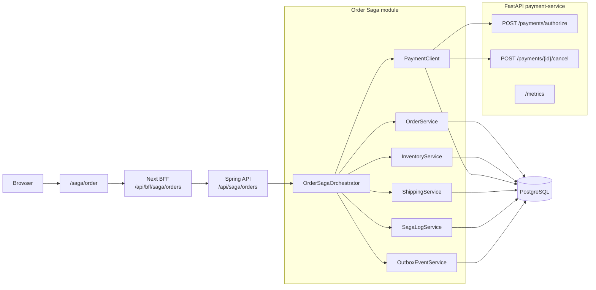
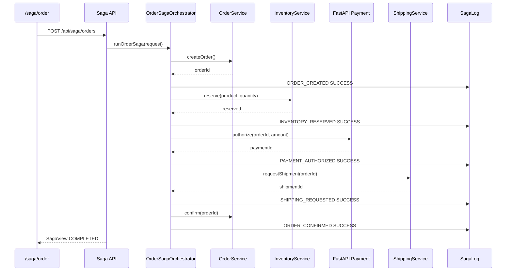
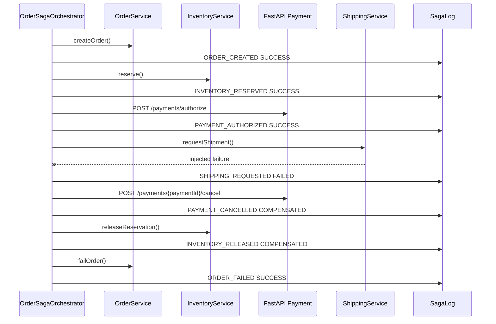
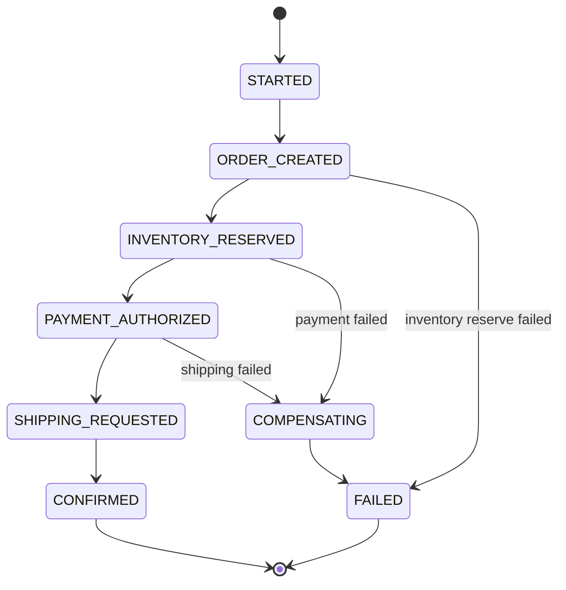

# Order Saga Simulator Design

## 1. Intent

jay-wiki needs a clear technical demo for the Saga pattern. The feature is not a real commerce product. It is a public simulator that shows how a distributed business transaction can be split into local steps, how failures are recorded, and how compensating actions restore consistency.

The chosen topic is an order/payment flow because it is the most recognizable Saga example:

```text
order created
→ inventory reserved
→ payment authorized
→ shipment requested
→ order confirmed
```

When a later step fails, the simulator runs compensations:

```text
shipment request failed
→ payment cancelled
→ inventory released
→ order failed
```

## 2. Product Shape

Add a public demo page:

```text
/saga/order
```

The page is explicitly labeled as a pattern simulator. It should not look like a storefront. It should look like an operational workflow tool:

- compact order form
- failure injection controls
- execution button
- saga timeline
- resulting order/payment/inventory/shipping status
- short status chips, not explanatory marketing copy

The current jay-wiki UI is quiet, dense, and operational. This page should match that style.

## 3. Architecture

Implement the first version as an orchestrated Saga:

```text
web /saga/order
  → BFF /api/bff/saga/orders
  → Spring /api/saga/orders
  → OrderSagaOrchestrator
      → OrderService
      → InventoryService
      → PaymentClient
          → FastAPI payment-service
      → ShippingService
      → SagaLogService
      → OutboxEventService
  → PostgreSQL public.tb_*
```

Spring remains the owner of the overall business decision. It creates the order, reserves inventory, calls the payment participant, requests shipment, records every Saga step, runs compensation, and returns the final view to the UI.

FastAPI is introduced as one deliberately narrow participant service: payment authorization and payment cancellation. It is not a second business brain. It exists to make the service boundary visible:

- Spring owns the Saga state machine and final result.
- FastAPI owns the remote payment API contract.
- Spring records the payment result as its local projection so the demo remains queryable from one API.

This is intentionally **orchestration Saga**, not choreography Saga. Kafka is still deferred. If event fan-out is added later, start with PostgreSQL outbox and then optionally move to Redis Streams or Kafka.

Redis is not required for this Saga slice.

### Visual Architecture



## 3.1 FastAPI Payment Participant

Add a new small service:

```text
services/payment-api
```

Runtime:

```text
Python 3.12
FastAPI
Uvicorn
Pydantic v2
prometheus-fastapi-instrumentator
```

Endpoints:

```http
GET /health/live
GET /health/ready
GET /metrics
POST /payments/authorize
POST /payments/{paymentId}/cancel
```

Authorize request:

```json
{
  "orderId": "ord_...",
  "amountCents": 49000,
  "idempotencyKey": "browser-generated-key",
  "fail": false
}
```

Authorize response:

```json
{
  "paymentId": "pay_...",
  "status": "AUTHORIZED"
}
```

Cancel response:

```json
{
  "paymentId": "pay_...",
  "status": "CANCELLED"
}
```

The first implementation may keep FastAPI payment state in memory because this service is a deterministic simulator, not a payment ledger. Spring stores the durable Saga projection in PostgreSQL. If the demo later needs stronger participant-local transaction semantics, add a payment-service-owned table or SQLite/PostgreSQL store behind the same FastAPI contract without changing Spring or the UI.

## 4. Public API

### Create and Run Saga

```http
POST /api/saga/orders
Content-Type: application/json
```

Request:

```json
{
  "productCode": "JAY-HOODIE",
  "quantity": 1,
  "failAt": "NONE",
  "idempotencyKey": "browser-generated-key"
}
```

`failAt` values:

```text
NONE
INVENTORY_RESERVE
PAYMENT_AUTHORIZE
SHIPPING_REQUEST
```

Response:

```json
{
  "sagaId": "saga_...",
  "orderId": "ord_...",
  "status": "CONFIRMED",
  "steps": [
    {
      "name": "ORDER_CREATED",
      "status": "SUCCESS",
      "compensating": false,
      "message": "Order row created",
      "createdAt": "2026-07-08T..."
    }
  ],
  "order": { "status": "CONFIRMED" },
  "inventory": { "available": 9, "reserved": 0 },
  "payment": { "status": "AUTHORIZED" },
  "shipping": { "status": "REQUESTED" }
}
```

### Read Saga

```http
GET /api/saga/orders/{sagaId}
```

Returns the same view shape as creation.

### List Recent Sagas

```http
GET /api/saga/orders?size=20
```

Used by the page to show recent runs.

## 5. Database

Add Flyway migration `V6__order_saga_demo.sql`.

Tables:

```text
tb_saga_order
tb_saga_inventory
tb_saga_payment
tb_saga_shipping
tb_saga_instance
tb_saga_step
tb_outbox_event
```

Columns:

```text
tb_saga_order
- id text primary key
- product_code text not null
- quantity int not null
- status text not null
- idempotency_key text not null unique
- created_at timestamptz not null
- updated_at timestamptz not null

tb_saga_inventory
- product_code text primary key
- available int not null
- reserved int not null
- updated_at timestamptz not null

tb_saga_payment
- id text primary key
- order_id text not null
- amount_cents int not null
- status text not null
- created_at timestamptz not null

tb_saga_shipping
- id text primary key
- order_id text not null
- status text not null
- created_at timestamptz not null

tb_saga_instance
- id text primary key
- order_id text not null
- status text not null
- current_step text not null
- fail_at text not null
- created_at timestamptz not null
- completed_at timestamptz

tb_saga_step
- id bigserial primary key
- saga_id text not null
- step_name text not null
- status text not null
- compensating boolean not null
- message text not null
- created_at timestamptz not null

tb_outbox_event
- id bigserial primary key
- aggregate_type text not null
- aggregate_id text not null
- event_type text not null
- payload jsonb not null
- status text not null
- created_at timestamptz not null
- processed_at timestamptz
```

Seed one product:

```text
productCode = JAY-HOODIE
available = 10
reserved = 0
```

## 6. Saga Flow

### Success Sequence



### Success Path

```text
ORDER_CREATED          SUCCESS
INVENTORY_RESERVED     SUCCESS
PAYMENT_AUTHORIZED     SUCCESS
SHIPPING_REQUESTED     SUCCESS
ORDER_CONFIRMED        SUCCESS
```

Final state:

```text
order.status = CONFIRMED
inventory.available decreases by quantity
inventory.reserved returns to 0
payment.status = AUTHORIZED
shipping.status = REQUESTED
saga.status = COMPLETED
```

### Inventory Failure

Injected at `INVENTORY_RESERVE`.

```text
ORDER_CREATED          SUCCESS
INVENTORY_RESERVED     FAILED
ORDER_FAILED           SUCCESS
```

No compensation is needed because inventory was not reserved.

### Payment Failure

Injected at `PAYMENT_AUTHORIZE`.

```text
ORDER_CREATED          SUCCESS
INVENTORY_RESERVED     SUCCESS
PAYMENT_AUTHORIZED     FAILED
INVENTORY_RELEASED     COMPENSATED
ORDER_FAILED           SUCCESS
```

### Shipping Failure

Injected at `SHIPPING_REQUEST`.

```text
ORDER_CREATED          SUCCESS
INVENTORY_RESERVED     SUCCESS
PAYMENT_AUTHORIZED     SUCCESS
SHIPPING_REQUESTED     FAILED
PAYMENT_CANCELLED      COMPENSATED
INVENTORY_RELEASED     COMPENSATED
ORDER_FAILED           SUCCESS
```

### Shipping Failure Compensation Sequence



### State Diagram



## 7. Idempotency

The create endpoint must accept `idempotencyKey`.

If the same key is submitted again, the API returns the existing Saga view instead of creating a duplicate order. This is important because payment/order APIs are commonly retried.

The web page can generate the key per button click. A manual retry button may reuse the same key to demonstrate duplicate protection.

## 8. UI

Route:

```text
web/src/app/saga/order/page.tsx
```

Initial controls:

```text
Product: Jay Wiki Hoodie
Quantity: 1
Failure: None | Inventory failure | Payment failure | Shipping failure
Run Saga
```

Result layout:

```text
left: run controls + current entity states
right: saga timeline
bottom: recent saga runs
```

Timeline states:

```text
SUCCESS      green
FAILED       red
COMPENSATED  yellow
PENDING      muted
```

Keep the page public. This is a demo, not an admin operation. Do not require login.

## 9. Observability

Prometheus should be able to show the Saga behavior without leaking high-cardinality IDs into labels.

Spring metrics:

```text
jaywiki_saga_runs_total{status,fail_at}
jaywiki_saga_compensations_total{step}
jaywiki_payment_client_requests_total{operation,result}
jaywiki_payment_client_request_seconds{operation,result}
```

`jaywiki_saga_step_seconds{step,status}` is a later extension once individual steps run through retryable workers instead of one synchronous request.

FastAPI metrics:

```text
payment_authorize_total{result}
payment_cancel_total{result}
payment_request_seconds{operation,result}
```

Allowed labels:

```text
status
fail_at
step
operation
result
```

Forbidden Prometheus labels:

```text
sagaId
orderId
paymentId
idempotencyKey
userId
raw path
```

Those identifiers belong in structured logs and, later, traces. The Prometheus story should stay about rates, errors, duration, and compensation frequency.

Useful Grafana panels later:

- Saga runs by result
- compensation count by step
- Spring → FastAPI payment latency
- FastAPI payment error ratio
- shipping failure compensation drill-down

The first implementation only needs metric emission and scrapeability. Full Grafana dashboard work can be a later observability slice.

## 10. Testing

Spring integration tests:

- success path creates confirmed order and complete step timeline
- inventory failure marks order failed with no compensation
- payment failure compensates inventory
- shipping failure compensates payment and inventory
- duplicate idempotency key returns the original saga
- FastAPI payment client failure maps to a Saga step failure and compensation path

FastAPI tests:

- authorize success returns an authorized payment id
- injected authorize failure returns a controlled 409 response
- cancel success returns cancelled
- `/metrics` exposes payment counters

Web verification:

- page renders controls
- selecting each failure mode returns a visible timeline
- no horizontal overflow on mobile
- Korean/English labels do not clip

Build verification:

```bash
cd spring/jaywiki && ./gradlew test
cd services/payment-api && uv run ruff check . && uv run basedpyright && uv run pytest
cd web && npm run type-check
cd web && npm run build
```

## 11. Deployment

This slice changes the existing backend/web images and adds one new internal FastAPI image/deployment.

Kubernetes shape:

```text
backend namespace
- Deployment jaywiki
- Service jaywiki
- Deployment jaywiki-payment-api
- Service jaywiki-payment-api

frontend namespace
- Deployment jaywiki-web
- Ingress portfolio.leneu.cloud → jaywiki-web
```

Only Next.js remains externally exposed. Spring and FastAPI stay cluster-internal.

Spring production config:

```text
APP_PAYMENT_SERVICE_URL=http://jaywiki-payment-api.backend.svc.cluster.local:8000
```

Prometheus scrape additions:

```text
job_name: jaywiki-payment-api
metrics_path: /metrics
target: jaywiki-payment-api.backend.svc.cluster.local:8000
```

After deploy, smoke test:

```bash
curl -fsS https://portfolio.leneu.cloud/api/bff/saga/orders \
  -H 'content-type: application/json' \
  -d '{"productCode":"JAY-HOODIE","quantity":1,"failAt":"SHIPPING_REQUEST","idempotencyKey":"smoke-..."}'
```

Then open:

```text
https://portfolio.leneu.cloud/saga/order
```

Also smoke FastAPI internally from the miniPC cluster:

```bash
kubectl -n backend run payment-smoke --rm -i --restart=Never --image=curlimages/curl -- \
  curl -fsS http://jaywiki-payment-api:8000/health/ready
```

## 12. Out of Scope

- real payment provider
- real shipping provider
- Kafka
- separate Spring services
- distributed locks
- money precision/accounting model
- user accounts or OAuth integration
- production checkout UX
- RAG

This is a Saga pattern simulator, not an ecommerce subsystem.

## 13. Later Extensions

- move outbox delivery to Redis Streams
- add retry worker for outbox events
- make the FastAPI payment participant durable with its own storage
- split Inventory/Shipping behind HTTP or messaging
- add trace IDs and `sagaId` to logs
- add Grafana panel for Saga failures
- compare orchestration Saga vs choreography Saga in the wiki article
- add OTel traces so Grafana/Tempo can show Browser → Next → Spring → FastAPI service flow
