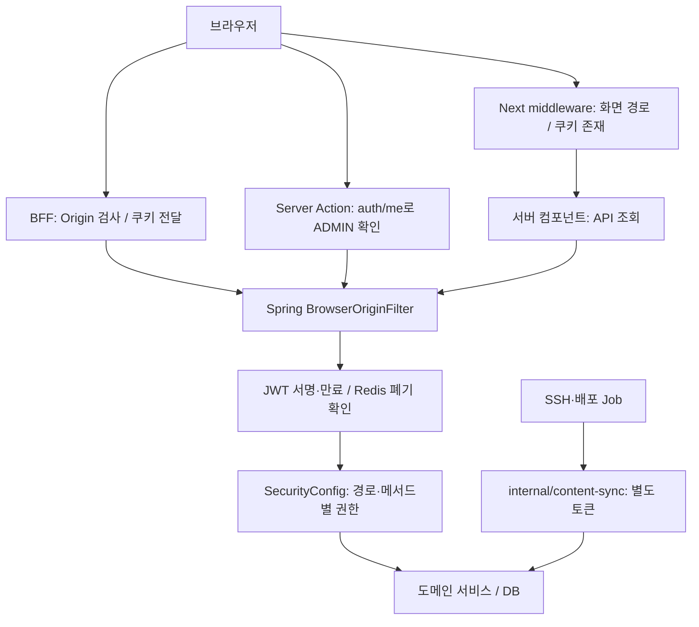
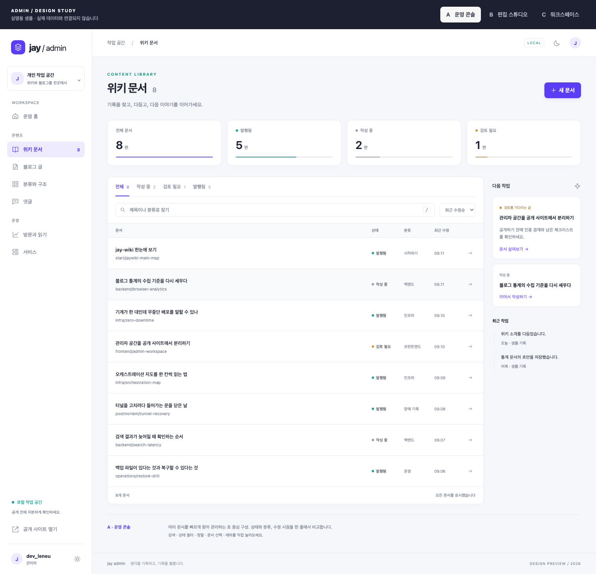

# 관리자 서브도메인 분리 워크북

작성·코드 확인: 2026-09-11 KST
상태: **A안 기반 로컬 분리 구현·검증 완료. 운영 Ingress·Tunnel·DNS·Access 변경과 운영 배포는 하지 않았다.**
작업 기준: `develop`의 현재 작업 트리. 통계 개편·블로그 이미지 모달 등 미커밋 작업이 함께 있으므로 이 문서의 코드 확인을 운영 배포 상태로 해석하지 않는다.

## 0. 가장 최근에 확정한 결정 — 후속 작업자는 여기부터 읽는다

2026-09-11 사용자 결정: **A안(운영 콘솔)을 기준으로 구현한다. 다크모드는 필수다.** 사용자는 외관 컨셉을 먼저 확정한 다음 기능을 구현하기를 원했고, 시안 단계에서 검색·필터 등의 동작까지 확장한 것은 과한 범위라고 정정했다.

| 구분 | 상태 / 다음 작업자의 처리 |
|---|---|
| 외관 방향 | A 확정. 깔끔한 표 중심 목록, 좌측 관리 메뉴, 상단 환경 표시, 보라색 강조 |
| B/C안 | 비교용 보관. B의 분할 편집이나 C의 카드 목록을 자동으로 섞지 않는다 |
| 다크모드 | 필수 구현·검증 대상. 현재 시안의 간단한 반전 기능을 완성품으로 간주하지 않는다 |
| Bootstrap | 도입 결정 없음. 기본 구현 방향은 기존 CSS 토큰과 컴포넌트 활용. 이번 선택을 Bootstrap 설치 승인으로 해석하지 않는다 |
| 기능·인증 | 이전 절의 검토 과제를 유지한다. 디자인 선택으로 JWT·Origin·발행 도구 검증이 끝난 것이 아니다 |
| 현재 요청 범위 | 로컬 구현과 검증까지 완료. 운영 호스트 노출과 배포는 별도 승인·작업으로 남긴다 |

A의 기준 자료는 [시안 HTML](../design/admin-console/index.html), [CSS](../design/admin-console/style.css), [기준 캡처](../design/admin-console/concept-a.png)다. 로컬 비교 페이지는 `http://127.0.0.1:4321/#a`이며 서버가 종료됐으면 [시안 실행 안내](../design/admin-console/README.md)로 다시 연다. 이 주소는 개발 중인 `admin.localhost:3000`이 아니라 외관 검토용 정적 페이지다.

시안 파일과 캡처는 저장소의 `docs/` 아래에 있다. 향후 인계/커밋에 이 파일들을 포함해야 하며, 실행 중인 로컬 서버나 `.local-backups/`에만 의존하지 않는다. 스크린샷은 샘플 데이터가 들어간 라이트 모드의 방향 기준이고, 배포된 관리자 화면의 증거는 아니다.

## 1. 목적과 범위

관리 작업을 공개 위키 레이아웃에서 분리하고 `admin.localhost:3000`, `admin.leneu.cloud`에서 수행한다. 로그인·쓰기·이미지 업로드·이력·통계·내부 발행이 모두 정상 동작하면서 공개 호스트가 관리 기능의 우회 경로로 남지 않는 것이 목표다.

2026-09-11 요청으로 로컬 구현과 검증까지 진행했다. 아래 체크박스는 현재 로컬 완료 범위와 운영 잔여 범위를 함께 표시하며 배포 명령 목록이 아니다.

| 항목 | 추천하는 1차 범위 | 의미와 제약 |
|---|---|---|
| 저장소·Next.js | 기존 저장소와 앱 유지, 호스트별 관리자 셸 분리 | 프로세스·배포·장애 영향은 공유한다 |
| Spring·DB·MinIO | 기존 자원 공유 | 호스트 분리 자체로 데이터 이관·초기화하지 않는다 |
| 관리자 로그인 | 관리자 호스트에서 별도 로그인, 기존 OTP 유지 | 공개 사이트 계정과 쿠키 범위를 넓혀 공유하지 않는다 |
| 공개 회원 기능 | 위키·블로그의 일반 USER 기능 유지 | 공개 로그인 전체 차단으로 회원 기능을 망가뜨리지 않는다 |
| 운영 접근 | 관리자 호스트 전체에 Access 적용 제안 | 실제 정책·Tunnel·원본 접근은 별도 확인 필요 |
| 로컬 | Next 서버 한 개에서 세 호스트 지원 | 포트별 중복 서버를 만들지 않는다 |
| 통계 | admin 호스트 전체 수집 제외 | 공개 사이트를 보는 관리자의 방문 제외는 별도 정책 필요 |
| 로컬 동기화 도구 | 1차에는 기존 개발 전용 위치 유지 권고 | 운영 관리자 메뉴에 실행 기능을 노출하지 않는다 |

기존 [블로그 관리자 설계](../superpowers/specs/2026-08-02-blog-admin-design.md) §3은 `portfolio.../admin` 유지 결정이다. 이 워크북은 그 결정을 재검토하는 후속 제안이다. 이전 결정은 역사 기록으로 남기고 구현 완료 시 해당 문서에 후속 링크만 추가한다.

## 2. 현재 코드에서 확인한 인증 경로



그림의 화살표는 요청 흐름이다. BFF·Server Action·내부 동기화는 서로 다른 진입점이며 하나만 고쳐서는 전체 경계가 바뀌지 않는다.

| 지점 | 확인한 동작 | 근거 파일 |
|---|---|---|
| 화면 가드 | middleware는 관리자 exact host와 쿠키 존재를 확인하고, admin layout은 `auth/me`의 실제 ADMIN 역할을 검증 | `web/src/middleware.ts`, `web/src/lib/adminSession.ts` |
| 블로그 rewrite | 정확한 `blog.localhost`/`blog.leneu.cloud`만 허용하고 관리자 host 처리를 먼저 수행 | `web/src/lib/blogHost.ts`, `web/src/lib/siteHost.ts` |
| 로그인 | 공개 `/api/auth/login`은 USER만, `/api/auth/admin-login`은 ADMIN+기존 OTP만 발급 | `spring/src/main/java/cloud/leneu/jaywiki/auth/AuthController.java` |
| JWT | ADMIN 1시간 / USER 6시간. 역할과 `jaywiki-admin`/`jaywiki-public` audience가 일치해야 검증되며 기존 audience 없는 토큰은 거절 | `spring/src/main/java/cloud/leneu/jaywiki/auth/JwtService.java` |
| 쿠키 | `jw_token`, HttpOnly, SameSite=Lax, Path=/, Secure는 설정 의존. Domain 미지정 | `spring/src/main/java/cloud/leneu/jaywiki/auth/JwtCookieFactory.java` |
| 토큰 폐기 | Redis에서 폐기 확인. 조회 장애면 인증 허용 대신 503. 로그아웃 시 해당 토큰을 남은 만료까지 폐기 | `spring/src/main/java/cloud/leneu/jaywiki/auth/JwtCookieFilter.java`, `TokenRevocations.java` |
| OTP | 활성화 여부는 설정. 코드 재사용 방지·요청 제한에 security Redis 사용 | `spring/src/main/java/cloud/leneu/jaywiki/auth/AdminTotpService.java` |
| BFF | 기존 Origin·크기 검사에 exact admin host 관리 요청 allowlist를 추가. 공개 host의 관리자 로그인·쓰기와 admin host의 일반 회원 인증을 거절 | `web/src/app/api/bff/[...path]/route.ts` |
| Server Action | admin host를 확인하고 `auth/me`로 ADMIN을 재검증한 뒤 쿠키·서버 표식을 전달 | `web/src/lib/adminSession.ts`, `web/src/lib/actions.ts`, `web/src/lib/blogAdminActions.ts` |
| 관리 SSR 조회 | admin layout과 blog/stats/services/revision 조회가 admin host와 ADMIN 세션을 확인 | `web/src/lib/adminSession.ts`, `web/src/lib/blogAdmin.ts`, `web/src/lib/api.ts`, `web/src/app/admin/layout.tsx` |
| 백엔드 Origin | 요청 Origin과 신뢰 프록시 대상의 scheme·host·port 비교. Origin 없는 쿠키 서버 호출은 전용 표식 요구 | `spring/src/main/java/cloud/leneu/jaywiki/auth/BrowserOriginFilter.java` |
| 백엔드 권한 | `/api/admin/**`와 문서 revision GET은 ADMIN; 공개 GET·명시된 공개 POST만 예외; 나머지 변경은 ADMIN | `spring/src/main/java/cloud/leneu/jaywiki/auth/SecurityConfig.java` |
| 로컬 관리 도구 | 개발 전용 `/api/sync`가 정확한 `admin.localhost` Origin도 허용. 운영 빌드 404 계약 유지 | `web/src/lib/requestOrigin.ts`, `web/src/app/api/sync/route.ts` |

주석 중 JWT “6시간”, SecurityConfig “STATELESS/GET 전부 공개”는 실제 역할별 만료·IF_REQUIRED·admin GET 제한과 다르다. 구현 시 주석도 실제 코드에 맞추되, 주석만 보고 인증을 재설계하지 않는다.

## 3. 막히거나 우회가 남을 수 있는 지점

### 3.1 호스트별 로그인 계약

Domain 없는 쿠키는 해당 호스트 범위다. `portfolio`의 기존 쿠키로 `admin`이 자동 로그인될 것이라고 기대하면 안 된다. 관리자 도메인에서 다시 로그인하고 BFF가 돌려준 Set-Cookie로 관리자 호스트 쿠키를 받아야 한다.

- 공개 `/login`은 USER 기능을 유지한다. ADMIN은 관리자 host의 `/login`이 호출하는 `/api/auth/admin-login`에서만 발급한다.
- 회원가입 탭을 관리자 UI에서 숨기는 것과 API를 제한하는 것은 별개다.
- 관리자 로그인 성공 시 검증된 `next`로 복귀한다. 알려진 관리자 clean route의 같은-origin 상대경로만 인정하며 외부 URL·역슬래시 기반 우회·알 수 없는 경로는 `/`로 줄인다.
- HTTP 로컬에서 운영 Secure 설정을 그대로 켜 쿠키가 사라지는 상황을 점검한다. 로컬과 운영의 쿠키 정책을 명시하고 운영 보안을 낮추지 않는다.

### 3.2 JWT 용도 분리 결과

JWT에 역할별 audience를 넣었다. ADMIN은 `jaywiki-admin`, USER는 `jaywiki-public`이며 role과 audience가 일치하지 않거나 audience가 없는 전환 전 토큰은 검증하지 않는다. 쿠키는 계속 Domain 없는 `jw_token`이라 각 host에서 다시 로그인한다.

토큰 용도와 요청 진입점을 모두 검사한다. BFF·Server Action·관리 SSR은 exact admin host를 확인하며 audience만으로 Access 우회를 막았다고 판단하지 않는다.

확정한 결정:

- 쿠키명은 `jw_token`을 유지하고 Domain을 추가하지 않는다.
- audience 없는 기존 ADMIN/USER JWT는 거절하고 재로그인한다. 내부 콘텐츠 토큰은 별도 계약이라 바꾸지 않았다.
- 관리자 토큰은 별도 Spring endpoint와 admin-host BFF 조합으로 발급한다. 관리 권한은 토큰 role/audience, host 경계, Spring 권한을 함께 확인한다.
- 로컬 CLI는 Spring 직접 호출과 `admin.localhost/api/bff` 호출을 모두 지원하도록 관리자 로그인 endpoint를 갱신했다.

### 3.3 `/api/admin`만 막으면 관리 기능 일부가 남는다

위키 편집·탭·이미지는 경로에 admin이라는 단어가 없다. 아래 행들을 메서드 단위로 분류해야 한다. HEAD/OPTIONS·경로 정규화도 같은 정책으로 확인한다.

| 요청 종류 | 현재 백엔드 계약 | 분리 후 목표 |
|---|---|---|
| `/api/admin/**` | ADMIN | 관리자 진입점 + 유효한 관리자 인증 |
| `POST /api/articles`, `DELETE /api/articles/{slug}`, `POST .../revert/{version}` | ADMIN | 공개 BFF·공개 Server Action에서 거절 |
| `POST /api/tabs`, `POST /api/tabs/reorder`, `DELETE /api/tabs/{id}` | ADMIN | 위와 동일 |
| `PUT /api/wiki/featured` | ADMIN | 관리자만 수정; GET은 공개 유지 |
| `POST /api/wiki-assets`, `DELETE /api/wiki-assets/{id}` | ADMIN | 관리자만 변경; 공개 이미지 GET 유지 |
| `GET /api/articles/{slug}/revisions[/{version}]` | ADMIN으로 변경 | 과거 초안 본문이 공개 GET으로 새지 않도록 관리자 조회로 제한 |
| `POST /api/domain-scenarios/spreadsheet-operations/exports` | ADMIN | 공개 시연 화면과 전용 프록시를 함께 검토하고 관리자 진입 경로 확정 |
| 블로그 댓글 작성·본인삭제, 게시판, 공개 시연 POST | 별도 공개 예외 | 관리자 분리로 무조건 막지 않음 |
| `/internal/content-sync/**` | 컨트롤러별 콘텐츠 토큰 검증 | 외부 admin 도메인에도 노출하지 않음 |

`/api/spreadsheet-export`는 범용 BFF 바깥의 별도 Next Route Handler다. BFF 허용 목록을 수정해도 이 경로의 호스트 검사는 따로 필요하다.

### 3.4 화면 보호·쓰기 보호를 각각 확인한다

admin layout, 서버 데이터 함수와 Server Action에서 각각 인증·권한을 검사한다. 공개 호스트에서 유효 ADMIN 쿠키를 수동으로 넣은 요청도 관리 액션을 수행하지 못하도록 테스트했다.

SSR fetch는 내부 Spring 주소로 직접 가며 현재 외부 host를 전달하지 않는 호출이 있다. Spring에 외부 호스트 필수 검사를 일괄 추가하면 정상 관리자 조회·저장도 차단될 수 있다. BFF·SSR·Server Action별 신뢰 컨텍스트를 먼저 설계한다.

Next의 Server Action Origin 검사는 별도 계층이다. 프록시가 `admin.leneu.cloud`를 내부 서비스명으로 바꿔 전달하면 정상 POST도 실패할 수 있다. 실제 설치 버전(현재 package.json 15.5.25)의 동작과 Host/X-Forwarded-Host를 확인한다. 해결을 위해 `allowedOrigins: ['*']` 또는 형제 도메인 전체 허용을 넣지 않는다.

### 3.5 기존 발행 자동화의 인증은 두 갈래다

| 도구 | 현재 경로 | 보존할 계약 |
|---|---|---|
| 로컬 `publish-blog-drafts.mjs` | localhost:8080 또는 admin.localhost BFF의 auth/admin-login → 받은 쿠키 → 관리 API | 새 관리자 audience로 로컬 한 편 실제 반영 검증 |
| 운영 `publish-blog-post.mjs` | `prod-tunnel.mjs`의 SSH/포트포워드 → 내부 콘텐츠 토큰, 이미지 내부 업로드 | 새 외부 관리자 로그인·OTP를 강제로 경유시키지 않음 |
| `blog-sync.mjs` | 로컬·운영 대조 및 내부 발행 흐름 | 충돌 방지·기준 해시·그림·발행일 유지 |
| `seed-portfolio-wiki.mjs` | 내부 토큰이 있으면 `/internal/content-sync/*`, 없으면 로그인 쿠키 경로 | 두 모드 각각 검증 |
| `/sync` → `/api/sync` → `content-ops.mjs` | 개발 환경 + 일치하는 로컬 Origin | 운영에서 404 유지. admin.localhost로 이전한다면 별도 개발 전용 허용 |

`ContentSyncAuthorizer`는 환경 설정된 토큰을 상수 시간 비교하며 미설정/불일치는 404다. `X-Jaywiki-Request: server`는 이 토큰을 대체하지 않는다. 브라우저의 BFF를 통해 콘텐츠 토큰을 전달하거나 반환하는 기능을 추가하지 않는다.

### 3.6 기존 글 편집 경로·통계·이미지에도 영향이 있다

- `Header.tsx`, `WikiShell.tsx`: 공개 페이지의 관리 링크와 ADMIN 표시가 공개 호스트 쿠키에 의존한다. 관리자 이동 링크를 중앙 URL 함수로 정리한다.
- `actions.ts`: 저장 후 `redirect('/admin/...')`, `revalidatePath('/')` 등을 새 외부/내부 경로와 맞춘다. 공개 사이트에서 변경이 보이는지도 테스트한다.
- 공개 글 미리보기는 절대 URL 새 탭; 비공개 초안은 관리자 안에서 렌더한다. 토큰을 URL에 실어 다른 호스트로 전달하지 않는다.
- 현재 이미지 GET은 공개·장기 캐시다. 비공개 초안 이미지를 비밀 자료처럼 보호한다고 설명해서는 안 된다. 비공개 자산은 후속 설계 항목이다.
- `BrowserAnalytics.tsx`는 exact 공개 blog/wiki host만 허용해 admin host를 수집하지 않는다.
- 관리자에서 로그인했다고 공개 위키·블로그의 방문이 자동 제외되지 않는다. 공개 호스트의 opt-out 설정을 별도로 안내/제공한다. 제외를 위해 관리자 인증 쿠키 Domain을 넓히지 않는다.

## 4. 라우팅·UI 제안

| 외부 관리자 경로 | 현재 내부 라우트 후보 | 주의 |
|---|---|---|
| `/` | `/admin` | 현재는 글 목록 redirect. 운영 홈을 새로 구성 |
| `/wiki/articles` | `/admin/articles` | 목록·검색·상태/탭 필터·페이지 이동 |
| `/wiki/articles/new` | `/admin/articles/new` | 기존 편집도 slug 쿼리로 이 경로 사용 |
| `/wiki/articles/{slug}/revisions` | `/admin/articles/{slug}/revisions` | slug 인코딩 계약 유지 |
| `/wiki/tabs`, `/wiki/featured` | `/admin/tabs`, `/admin/featured` | 저장 redirect 갱신 |
| `/blog/posts[/{id}]` | `/admin/blog/posts[/{id}]` | new 경로와 충돌 주의 |
| `/blog/categories`, `/blog/comments` | 현재 대응 admin/blog 경로 | 공개 blog rewrite보다 admin 호스트 우선 |
| `/stats`, `/services`, `/guide` | 현재 대응 admin 경로 | site/days 쿼리 유지 |
| `/login` | 관리자 전용 로그인 구성 | 공개 회원가입 레이아웃 재사용 금지 |

- host는 정확한 allowlist로 판별하고 포트·대소문자를 정규화한다. `admin.`으로 시작하는 임의 호스트를 신뢰하지 않는다.
- `admin.localhost:3000`, `admin.leneu.cloud`를 환경별로 명시한다. 불명 호스트는 정책상 거절하며 공개 위키로 자동 간주하지 않는다.
- 공개 호스트의 이전 `/admin/...` GET은 허용 목록 매핑으로 새 주소에 이동; 관리 POST·Server Action은 거절. 이전 host에서 로그인 정보를 받아 자동 이전하지 않는다.
- `/api/bff/*`, 이미지 경로, `_next` 자산은 화면 rewrite와 분리한다. API는 현재 middleware matcher에서 제외돼 있으므로 Route Handler 보호가 필요하다.
- UI는 위키 공개 Header/Footer와 분리한다. 로컬/운영 배지, 위키/블로그 열기, 관리 메뉴, 저장 중·저장됨·만료 오류를 제공한다.
- 인증 확인 실패를 “글이 없음”으로 숨기지 않는다. 비로그인/권한 부족/백엔드 장애를 구분한다.
- admin은 noindex와 비공개 캐시 정책. robots는 접근 제어를 대체하지 않는다.

### 4.1 A안에서 유지할 시각적 구조



상단의 `ADMIN / DESIGN STUDY`와 A/B/C 선택 막대, 하단의 컨셉 설명은 **시안 비교 도구**다. 실제 관리자에 넣지 않는다. 운영 화면에는 로컬/운영 표시를 계속 제공한다.

| 영역 | A안의 기준 | 실제 구현 시 적용 |
|---|---|---|
| 전체 셸 | 옅은 회색 배경, 밝은 메뉴/콘텐츠 면, 얇은 경계선 | 기존 공개 위키 Header/Footer에서 분리. 다크에서도 같은 계층 유지 |
| 좌측 메뉴 | 약 230px 너비, 아이콘+문구, 콘텐츠/운영 묶음, 보라색 선택 배경 | 위키/블로그/공통의 기존 기능을 빠짐없이 연결. 사용자·환경은 실제 상태 |
| 상단 바 | 경로 표시, LOCAL 표시, 테마 전환, 계정 | 실제 환경을 설정에서 판별. 로컬과 운영에서 문구까지 다르게 표시 |
| 페이지 제목 | 작은 보조 라벨, 큰 제목/개수, 오른쪽 주요 동작 | `새 문서` 등 주 동작 하나를 강조. DB 스키마 설명을 주요 안내 문구로 쓰지 않음 |
| 요약 영역 | 낮은 높이의 요약 카드, 적은 수의 주요 지표 | 지원되는 실제 지표만 표시. 시안의 카드 네 개를 맞추려고 상태/값을 만들지 않음 |
| 목록 | 하나의 패널 안에 상태 탭 → 검색·정렬 → 표 → 페이지 정보 | 제목/주소, 상태, 분류, 수정일, 편집·이력 등. 긴 제목·주소의 줄바꿈/생략 규칙 필요 |
| 보조 영역 | 넓은 화면에서만 우측 ‘다음 작업’ 영역 | API로 설명 가능한 실제 초안/최근 수정이 있을 때만 표시. 없으면 목록 폭 활용 |
| 강조·밀도 | 보라색 주 동작·선택, 청록 보조, 작고 절제된 아이콘 | 기존 lucide-react 사용. 과한 그림자·넓은 카드 간격으로 이전 UI를 되풀이하지 않음 |

시안의 수치 `8/5/2/1`, 문서 상태 `review`, “검토 필요”, 최근 작업 기록은 가상 데이터다. 외관 승인에 새 검토 워크플로·감사 로그·업무 큐 기능 승인이 포함되는 것은 아니다. 현행 데이터 계약을 확인하고 지원되지 않는 요소는 빼거나 실제 가능한 지표로 대체한다. 샘플 이벤트나 고정 수치를 운영 DB/컴포넌트에 넣지 않는다.

목록은 실제 표라면 `<table>` 등 적절한 의미 구조를 사용한다. 시안의 버튼 그리드를 그대로 복사해 셀 안에 버튼을 중첩하지 않는다. 삭제·발행 같은 변경 동작과 제목 클릭/미리보기를 구분하고 키보드로 접근 가능하게 구현한다.

### 4.2 기존 디자인 토큰에 연결한다

`docs/design/admin-console/style.css`는 독립 시안용이며 앱에 통째로 import하지 않는다. 기준은 배치와 위계다. 실제 적용은 [기존 토큰](../../web/src/app/styles/tokens.css), [관리자 스타일](../../web/src/app/styles/admin.css)을 사용한다.

| 시안의 역할 | 실제 앱에서 사용할 기준 |
|---|---|
| 바탕 / 패널 / 보조 면 | `--bg-0` / `--bg-1` / `--bg-2`, 필요 시 `--bg-3` |
| 본문 / 보조 / 설명 | `--text` / `--text-dim` / `--text-mute` |
| 선 / 강조 선 | `--border` / `--border-strong` |
| 주요 색 / 보조 색 / 선택 면 | `--accent` / `--accent-2` / `--accent-soft` |
| 성공 / 주의 / 위험 / 안내 | `--success` / `--warn` / `--danger` / `--info` |
| 호버 / 강한 호버 | `--hover` / `--hover-strong` |
| 글꼴 / 숫자·경로 | Pretendard의 `--font`, JetBrains Mono의 `--mono` |
| 크기 / 둥근 모서리 / 그림자 | 기존 `--fs-*`, `--r-*`, `--shadow-*` |

시안에는 화면 밀도를 비교하려고 9~10px 보조 글자가 들어 있지만 **실제 구현의 글자 하한은 기존 토큰 기준 11px**이다. 본문/입력/핵심 표 텍스트는 보통 13~14px 이상에서 읽기 좋게 조정한다. 캡처와 픽셀 단위로 같게 만들기 위해 가독성을 낮추지 않는다.

새 관리자 전용 토큰이 필요하면 `.admin-shell` 등 범위를 제한하고 기존 의미 토큰에 연결한다. 전역 `button`, `main`, `:root` 스타일을 시안에서 옮겨 공개 위키·블로그의 디자인을 바꾸지 않는다.

### 4.3 다크모드 계약 — 구현 완료의 필수 조건

기존 [루트 레이아웃](../../web/src/app/layout.tsx)은 `<html data-theme="light|dark">`와 `localStorage['theme']`를 사용하고 초기 스크립트로 하이드레이션 전 테마를 정한다. 관리자도 같은 계약을 쓴다. 시안의 `body.dark` 방식이나 별도의 관리자 theme 키를 추가하지 않는다.

같은 키 이름을 사용해도 localStorage는 origin별로 분리된다. `admin`에서 바꾼 테마가 `portfolio`·`blog`에 자동 동기화된다고 안내하지 않는다. 도메인 간 동기화는 이번 범위에 넣지 않는다. 현재 기본값 light를 유지하고 저장된 사용자 선택이 있을 때 복원한다.

- **초기 진입:** 다크 저장 상태에서 새로고침/관리 딥링크 접속 때 흰 배경이 번쩍이지 않도록 기존 초기화 흐름 유지.
- **면 구분:** 바탕·사이드바·표·입력창·모달의 높낮이를 배경 토큰과 경계선으로 구분. 단순 색 반전 필터 사용 금지.
- **상호작용:** 기본/hover/선택/focus-visible/disabled/로딩 상태를 각각 설계. 보라색 링크·버튼 글자가 배경과 충분히 구분되는지 실제 계산/시각 확인.
- **상태:** 발행·초안·오류·성공은 색만 바꾸지 않고 문구/아이콘을 함께 제공. 붉은 삭제 버튼만으로 동작을 설명하지 않음.
- **대상 화면:** 로그인/OTP, 목록, 편집기·미리보기·코드 블록, 이미지 확대/업로드, 삭제 확인, 오류·빈 상태, 통계 그래프/표, 서비스 관리까지 동일하게 확인.
- **이미지:** 업로드한 스크린샷/사진 색을 테마에 따라 반전하지 않음. 밝은 이미지는 뷰어 배경과 경계로 구분. Mermaid는 현재 테마에서 라벨/선이 보이는지 확인.
- **대비 목표:** 일반 텍스트 4.5:1 이상, 큰 텍스트와 의미 있는 컨트롤 경계/초점 표시는 3:1 이상을 검증 목표로 삼는다. 기존 토큰을 쓴 사실만으로 조합별 대비 검사를 통과했다고 쓰지 않는다.
- **저장소 차단:** theme 저장 실패가 로그인/편집 기능을 막지 않아야 한다. 토글 버튼은 키보드로 사용 가능하고 현재 상태 또는 다음 동작을 접근 가능한 이름으로 알린다.

다크모드는 배경색 몇 개를 바꾼 별도 후속 작업으로 미루지 않는다. A안 컴포넌트를 구현할 때 라이트/다크를 함께 완성한다. 디자인 확정은 라이트 시안 A에 대한 선택이며 **다크 모드 완성/검증은 아직 미완료**다.

### 4.4 반응형·시안과 실제 기능의 경계

- 넓은 데스크톱에서는 A안의 목록+우측 보조 영역을 유지하되, 중간 폭에서는 보조 영역을 접고 목록을 우선한다.
- 모바일에서는 접근 가능한 메뉴 버튼/드로어를 제공한다. 시안처럼 사이드바를 완전히 숨겨 기능을 잃게 만들지 않는다.
- 모바일 문서 목록은 제목·상태·주 동작을 우선하고 부가정보를 줄바꿈/상세에 배치한다. 페이지 전체 가로 스크롤은 만들지 않는다.
- 통계 그래프는 기존 개편의 전체 기간 표시·날짜 선택을 유지한다. A안 적용을 위해 다시 가로 스크롤 막대 목록으로 바꾸지 않는다.
- 검색·정렬·상태 필터는 실제 데이터 범위와 맞춘다. 한 페이지의 데이터만 검색하면서 전체 문서를 찾는다고 표시하지 않는다.
- 시안의 HTML·JS는 외관 비교 도구다. API/인증 연결 없이 동작하는 검색, 고정 목록, toast, 테스트용 미리보기는 제품 기능의 구현 근거가 아니다.
- 처음 한 번 저장 흐름을 연결할 때도 A의 셸과 토큰을 사용한다. B/C 재디자인이나 시안 비교 도구 고도화를 먼저 하지 않는다.

## 5. 실행 순서와 완료 조건

### A. 인증·호스트 계약 확정 — 화면 이동 전에

- [x] 위 표의 관리 API/별도 Route Handler/Server Action과 실제 호출자를 대조하고 BFF·spreadsheet export·SSR·액션을 호스트 경계에 연결했다.
- [x] `jw_token` host-only 쿠키를 유지하고 JWT audience를 `jaywiki-admin`/`jaywiki-public`으로 분리했다. audience 없는 기존 토큰은 재로그인한다.
- [x] 외부 Host는 정확한 allowlist로 검사하고, SSR·Server Action은 관리자 Host와 `auth/me`의 ADMIN 역할을 함께 확인한다.
- [x] 공개 USER 인증, 관리자 인증, 공개 BFF 관리 쓰기 차단, 내부 콘텐츠 동기화의 별도 토큰 계약을 테스트와 dry-run으로 확인했다.

완료 조건: 유효한 기존 ADMIN 토큰을 공개 호스트로 보내는 경우까지 기대 동작이 정의되어 있다. 주소가 바뀐 뒤 막힌 것을 그때그때 허용 예외로 푸는 상태가 아니다.

### B. 로컬 한 기능을 끝까지 분리

- [x] 호스트 판별·rewrite·중앙 URL 함수·관리자 전용 로그인·실제 ADMIN 권한 가드를 구현했다.
- [x] admin.localhost BFF에서 블로그 임시 초안을 생성·조회하고 삭제했다. 편집 화면과 이미지 업로드 경로도 별도로 열어 확인했다.
- [x] 위키 임시 글을 두 번 저장해 revision을 확인하고 version 1로 되돌린 뒤 삭제했다.
- [x] 깨끗한 외부 경로의 전체 메뉴를 같은 Next 프로세스에서 열고 기존 `/admin/**` GET 이동을 확인했다.

완료 조건: 같은 로컬 Next 프로세스에서 공개 두 사이트와 관리자 사이트가 동작하고, 공개 호스트의 관리 요청은 차단된다. 임시 검증 자료만 정리하며 기존 글/통계는 초기화하지 않는다.

### C. 화면·통계·도구 마무리

- [x] 확정 A안 셸과 실제 데이터 기반 표 목록을 기존 토큰으로 구현했다. Bootstrap과 시안 샘플 데이터는 넣지 않았다.
- [ ] 검색·상태 필터, 모바일 드로어, 환경 표시는 완료. API 페이지네이션과 만료 시 미저장 본문 복구는 후속 유지보수 항목이다.
- [x] 기존 `html[data-theme]` 계약으로 로그인·목록·편집·통계·서비스 화면의 다크모드를 연결했다.
- [ ] 1440px 라이트/다크와 390px 모바일 캡처·초기 테마 복원은 확인했다. 자동 대비 수치와 전체 키보드 복귀 초점 감사는 후속이다.
- [x] analytics는 정확한 공개 위키·블로그 host만 수집해 admin host 전체를 제외한다. 기존 공개 opt-out UI를 유지한다.
- [x] 로컬 블로그 초안 한 편을 실제 반영하고 위키 시드 dry-run, 관리자 발행 로그인 경로를 확인했다.
- [x] 관리자 전체 새 경로와 이전 `/admin/**` GET 이동, 내부 route 비노출을 검사했다.

### D. 운영 준비 및 별도 전환

- [ ] 로컬 검증 후 Ingress와 HTTPS 원본 프록시 규칙, Tunnel hostname, DNS 변경안을 작성한다.
- [ ] Access는 관리자 호스트 전체(로그인·API 포함)를 보호하도록 구성안을 검토한다.
- [ ] 기존 Access 정책과 경로별 예외를 읽기 전용으로 확인하고 겹침·우회가 없는지 비교한다.
- [ ] 앱/네트워크 경계가 준비된 후 관리자 호스트를 노출한다. 먼저 DNS만 공개하지 않는다.
- [ ] main 머지가 배포임을 전제로 기존 배포 런북대로 전환한다. 현재 문서 작성은 배포 승인이 아니다.

완료 조건: Access 미인증→차단, Access 허용+앱 미인증→로그인, USER→거절, ADMIN+OTP→관리 성공. 공개 호스트·직접 origin·변조 헤더 경로로 관리 작업이 되지 않는다.

## 6. 반드시 통과할 회귀 시나리오

아래는 분리 구현 이후의 목표 테스트다. 현재 테스트가 통과했다고 이 표가 모두 완료된 것은 아니다.

| ID | 조건·행동 | 기대 결과 |
|---|---|---|
| H01 | 세 호스트에서 홈·딥링크·자산 열기 | 올바른 셸·정적 자산, rewrite 루프 없음 |
| H02 | 임의 host, 위조 X-Forwarded-Host, 공개 host의 관리 POST | 관리 데이터 조회/수정 거절 |
| H03 | 이전 관리자 GET 링크·검색 쿼리·인코딩 slug | 승인된 새 경로만 이동, 외부 redirect 없음 |
| A01 | 쿠키 없음/가짜/만료/폐기된 JWT로 admin 화면·API·액션 호출 | 관리자 데이터나 쓰기 성공 없음; 의미 있는 로그인 오류 |
| A02 | 유효 USER JWT를 관리자 호스트에 직접 전달 | 권한 거절 |
| A03 | 유효 ADMIN JWT를 공개 host BFF·액션·전용 export에 전달 | 공개 진입점에서 관리 작업 거절 |
| A04 | 관리자 로그인·OTP 누락/오류/재사용/제한 초과 | 기존 실패 계약 유지; 정상 OTP만 로그인 |
| A05 | admin 로그인 후 공개 두 호스트 방문 | 관리자 인증 쿠키가 자동 전달되지 않음 |
| A06 | 로그아웃 후 토큰 재사용; 다른 유효 토큰 사용 | 로그아웃 토큰 거절; 기존 별도 토큰 계약 유지 |
| A07 | security Redis 조회 장애 | 인증 fail-closed; 자동화된 전체 테스트를 위해 운영 Redis를 중지하지 않음 |
| A08 | 공개 로그인으로 ADMIN 발급 시도; 일반 USER 로그인/가입 | ADMIN 발급 거절, USER 기능 정상 |
| A09 | 전환 전 audience 없는 ADMIN JWT | 결정한 재로그인 정책 적용; 묵시적 호환 우회 없음 |
| O01 | admin 동일 Origin 정상 저장; blog에서 admin으로 POST | 정상 저장 성공 / 형제 호스트 요청 거절 |
| O02 | HTTP 로컬과 HTTPS 프록시 운영의 scheme/port 전달 | 정상 요청을 403으로 오인하지 않음 |
| O03 | 서버 액션 SSR 검증·이미지 multipart 업로드 | ADMIN 검증과 바이너리 전달 유지; 필요 없는 광범위 Origin 허용 없음 |
| C01 | 글 생성/수정/이력/되돌리기/탭·대표 문서·분류 변경 | 저장·복귀·공개 반영·revision 정상 |
| C02 | 공개 draft 조회·revision·비공개 미리보기 | 결정한 공개 범위 준수, 관리자 페이지 숨김만으로 보호했다고 판단하지 않음 |
| C03 | 이미지 GET 및 참조된 이미지 삭제 | 공개 이미지 표시 유지; 참조 보호 계약 유지 |
| T01 | 관리자 통계 페이지·홈·로그인 | analytics 이벤트를 전송하지 않음 |
| T02 | 공개 페이지에서 opt-out한 브라우저 | 관리자 쿠키 공유 없이 수집 제외 |
| S01 | 로컬 초안 한 편 발행 / 시드 dry-run | 로그인·쿠키 변경 후에도 동작 |
| S02 | 격리 환경의 내부 토큰 발행 / 잘못된 토큰 / 외부 internal 접근 | 정상 내부 요청만 성공; 외부 노출 없음 |
| S03 | 운영 빌드 `/sync`, `/api/sync` | 개발 실행 도구 노출 없음 |
| S04 | 개발용 admin.localhost로 sync 호출(이전 선택 시) | 정확한 Origin만 허용; 운영으로 해당 예외가 확장되지 않음 |
| U01 | 만료 직전 긴 글 편집·저장 실패·재로그인 | 미저장 본문 보존, 자동 발행/유실 없음 |
| U02 | 모바일·다크·키보드·복귀 초점 | 수평 넘침·숨은 작업 버튼·접근 불가능한 UI 없음 |
| D01 | A안 라이트·다크를 1440px/390px에서 목록·편집·로그인·통계로 비교 | 동일한 시각 위계, 실제 데이터, 메뉴/동작 누락 없음. 미지원 샘플 상태 표시 없음 |
| D02 | 다크 선택 후 새로고침·딥링크·저장소 차단 상태 | 관리자 origin의 테마 복원, 초기 흰 섬광/인증 방해 없음 |
| D03 | 표 선택/hover/focus, 필터·입력·모달·오류/빈 상태의 두 테마 | 4.3절 대비 목표 확인, 색만으로 의미 전달하지 않음 |
| D04 | 코드·Mermaid·업로드 이미지·이미지 확대·그래프 | 각 테마에서 판독 가능, 원본 이미지 색상 유지 |
| D05 | 공개 위키·블로그와 관리자 사이트를 함께 확인 | 관리자 CSS가 공개 화면에 새지 않음, 테마의 도메인 간 자동 공유를 가정하지 않음 |

## 7. 현재 점검 결과와 증거

2026-09-11 로컬 구현 뒤 하나의 Next 개발 서버에서 `admin.localhost:3000`을 실제로 열었다. 비로그인 clean route는 `/login?next=...`로 이동하고, 관리자 로그인 뒤 위키·블로그·탭·대표 문서·카테고리·댓글·통계·가이드 clean route가 모두 HTTP 200으로 열렸다. 공개 `localhost:3000`의 관리자 로그인과 위키 쓰기는 403, 이전 `/admin/stats?site=blog`는 `admin.localhost:3000/stats?site=blog`로 307 이동했다.

로컬 변경 검증은 기존 데이터 초기화 없이 수행했다.

- 블로그 임시 draft 생성·조회·삭제, 위키 임시 draft 생성·수정·revision 조회·version 1 되돌리기·삭제를 완료했다.
- 69바이트 PNG를 multipart로 업로드해 200을 받고 삭제 204까지 확인했다.
- `blog-analytics-browser-events-rebuild.md` 한 편을 새 관리자 로그인 경로로 로컬 반영했고, 위키 seed는 변경 0건 dry-run을 통과했다.
- 운영 내부 콘텐츠 동기화 endpoint와 토큰 흐름은 수정하지 않았다.

화면 증거는 [로컬 캡처 폴더](evidence/admin-subdomain-local/)에 있다. `login-light.png`, `login-dark.png`, `articles-light.png`, `articles-dark.png`, `editor-dark.png`, `stats-dark.png`, `mobile-menu-dark.png`를 1440×1000과 390×844에서 기록했다. 저장된 dark 테마로 새 브라우저 진입 시 `html[data-theme=dark]`가 복원되는 것도 확인했다.

현재 자동 검사 결과는 web **29개 파일·172개 테스트 통과**, type-check·production build·lint 통과다. lint에는 이번 변경과 무관한 기존 React effect 경고 7개가 남아 있다. 운영 의존성 `npm audit --omit=dev --audit-level=high` 결과는 취약점 0건이다. Spring은 캐시를 쓰지 않고 다시 실행한 전체 **300개 테스트 통과**이며 실패·오류·건너뜀은 0건이다. 수정된 Node·shell 운영 스크립트의 문법 검사도 통과했다.

운영 설정은 읽기 전용으로 확인했다. 2026-09-11 현재 `admin.leneu.cloud` DNS는 Cloudflare를 가리키고, 비인증 HTTPS 요청은 Cloudflare Access 로그인으로 302 이동한다. 따라서 DNS와 Access 애플리케이션은 이미 존재한다. Access 뒤의 Tunnel origin 연결은 인증 세션 없이 확인할 수 없었으며 어떤 운영 설정도 변경하지 않았다. 새 Ingress manifest는 miniPC의 k3s API에 server-side dry-run으로 전달해 Deployment·Service·Ingress 모두 검증했지만 rollout은 수행하지 않았다.

기존 인증 회귀 검사는 아래 명령으로 실행했다. 검사 대상은 현재 구현이며 관리자 분리 목표 테스트와 구분한다.

```bash
# web/에서 기존 호스트·Origin·BFF·액션·개발 도구 테스트
npx vitest run src/lib/requestOrigin.test.ts src/lib/actions.test.ts \
  'src/app/api/bff/[...path]/route.test.ts' src/app/api/sync/route.test.ts \
  src/lib/blogHost.test.ts

# spring/에서 기존 로그인·OTP·Origin·토큰 폐기 테스트
./gradlew test --tests '*AuthControllerIntegrationTest' \
  --tests '*AuthControllerLogoutTest' --tests '*AdminTotpIntegrationTest' \
  --tests '*BrowserOriginFilterTest' --tests '*SecurityStateIntegrationTest'
```

실행 기록: **web 5개 파일·23개 테스트 통과, Spring 5개 클래스·16개 테스트 통과**. Spring 실패/오류/건너뜀은 0/0/0이다. 2026-09-11 01:41 KST 실행이며 집계 결과는 [인증 기준선 JSON](admin-auth-baseline-2026-09-11.json)에 보관했다.

web의 `connection closed` 로그는 BFF가 upstream 연결 실패를 제어된 502로 반환하는 테스트의 의도된 입력이며 테스트 실패가 아니다. 이 결과는 기존 방어가 현재 테스트 범위에서 동작함을 확인한 것이고, admin 도메인 분리나 운영 Access 적용을 검증한 결과가 아니다.

## 8. 롤백과 데이터 보존

호스트 분리에 데이터 초기화는 필요 없다. 테이블 truncate, 기존 조회수 reset, 계정 재생성, JWT 비밀 전체 회전을 기본 전환 절차에 넣지 않는다.

전환 전 기존 이미지 태그·Ingress·Access/Tunnel 정책을 저장한다(자격증명 원문은 문서에 넣지 않음). 관리자에 접근할 수 없는 경우 외부에 임시 우회 문을 여는 대신 기존 배포 런북으로 코드와 라우팅을 되돌린다. 기존 `/admin`을 복구할 때는 종전 Access 보호도 함께 복구한다.

쿠키명/audience를 바꾸면 새 토큰을 구버전이 인식하지 못할 수 있으므로 롤백 후 재로그인을 예상한다. 콘텐츠·revision·통계 데이터는 그대로 유지한다. 내부 발행 토큰의 외부 노출로 문제를 해결하지 않는다.

## 9. 후속 작업자가 시작할 곳

1. 0절의 사용자 결정과 4.1~4.4절의 A안·다크모드 기준을 읽는다. A안 선택을 다시 물을 필요는 없다. 현재 branch/status와 이 문서의 날짜를 확인한다. 진행 중인 통계·이미지 모달 작업을 되돌리거나 완료되지 않은 채 배포하지 않는다.
2. 2절 코드 경로를 다시 대조하고 3절의 미확정 계약을 구현 전에 결정한다.
3. 후속 구현 요청이 주어지면 5절 A→B 순서로 한 편 저장 흐름을 A안 셸 안에서 통과시킨다. 워크북의 작업 단계 A/B와 디자인 시안 A/B를 혼동하지 않는다.
4. 각 체크박스에 결과와 테스트/캡처 경로를 남긴다. 실제 배포 전에는 상태를 “로컬 구현”으로만 표시한다.
5. 운영 반영 뒤 실제 인증·쓰기·자동화 결과를 기록하고 공개 회고 글을 별도로 작성한다. 이 내부 워크북을 공개 블로그에 그대로 발행하지 않는다.

## 10. 참고 자료

### 로컬 A안 외관 보정 — 2026-09-11

최초 로컬 구현은 큰 외곽 카드와 그라데이션 때문에 확정 시안과 차이가 있었다. 이번 보정은 인증이나 운영 설정 변경 없이 관리자 화면에만 적용했다.

- 외곽 카드를 제거하고 배경 위에 제목, 독립된 요약 카드, 목록 패널을 배치했다. 관리자 전용 색상 토큰을 라이트/다크 각각 정의했다.
- 사이드바에 작업 공간 표시를 추가하고 중복된 새 글 링크와 실제 대시보드가 없는 대시보드 링크를 제거했다. 새 글 진입은 목록 상단에 유지한다.
- 후속 사용자 결정: 좌측 메뉴는 `jay-wiki`(위키 문서·위키 탭·대표 문서), `jay-blog`(블로그 글·카테고리·댓글), `운영`(통계·서비스·편집 가이드) 세 영역으로 구분한다.
- 배포 전 호환성 보완: 공개 사이트에 남아 있던 대량 Excel 생성 기능은 관리자 호스트의 `/tools/spreadsheet-export`에서도 실행할 수 있게 옮겼다. 공개 화면은 관리자 실행 화면으로 안내하며 생성 API는 관리자 호스트에서만 허용한다.
- 로컬 관리자 세션으로 실제 Excel 생성도 실행해 HTTP 200, 100,000행, XLSX 3,873,934바이트, 약 4.7초를 확인했다. 공개 호스트의 같은 API는 403이다.
- k3s Ingress에 `admin.leneu.cloud` 호스트 규칙을 준비했다. 이것만으로 외부에 공개되지는 않으며 운영 전환 때 Cloudflare Tunnel hostname, DNS, Access 정책을 함께 구성한다.
- 과거 공개 `/admin/**` 주소는 GET/HEAD만 관리자 호스트로 안내하고 POST 등 변경 요청은 403으로 거부한다.
- Cloudflare Access가 앱보다 앞에서 요청을 막으므로 직접 운영 관리자 주소를 쓰는 Node·shell 발행 도구는 `cloudflared access token`의 사용자 토큰을 `CF-Access-Token` 헤더로 전달한다. 캐시된 Access 로그인이 없으면 비밀을 우회하지 않고 `cloudflared access login https://admin.leneu.cloud` 안내와 함께 중단한다. k3s 내부 콘텐츠 토큰 경로에는 이 헤더를 요구하지 않는다.
- 상단 URL 표기를 메뉴명으로 교체하고 목록에 실제 건수 기반 상태 탭을 추가했다. 탭 변경은 검색어를 유지하고 첫 페이지로 돌아간다.
- 모바일 표의 스크롤 컨테이너를 기준으로 숨김 레이블을 배치해 문서 전체가 가로로 넘치는 문제를 수정했다.
- 타입 검사와 변경 TSX 파일 ESLint 통과. 로컬 로그인 후 위키/블로그 목록, 위키 편집기, 통계 화면 진입과 브라우저 오류 없음 확인. 390px 화면에서 문서 너비 390px 확인.
- 증거: `evidence/admin-subdomain-local/refined-articles-light.png`, `refined-articles-dark.png`, `refined-mobile-dark.png`.

시안의 가상 활동 내역·검토 상태·오른쪽 다음 작업 패널은 구현하지 않았다. 실제 저장 데이터가 있는 목록/상태 필터 중심으로 적용했으며 시안 전체의 동일 복제 완료를 뜻하지 않는다. 운영배포는 하지 않았다.

- [이전 블로그 관리자 설계](../superpowers/specs/2026-08-02-blog-admin-design.md): 기존 portfolio 호스트 유지 결정.
- [계정 접근 런북](../account-access-runbook.md), [관리자 OTP 리허설](../admin-totp-hpa-rehearsal.md): 현재 운영 절차를 실행 전 다시 확인.
- [배포 런북](../deploy-runbook.md), [블로그 서브도메인 런북](../blog-subdomain-setup-runbook.md), [내부 콘텐츠 동기화 런북](../gitops-wiki-content-sync-runbook.md).
- [Next.js 인증 가이드](https://nextjs.org/docs/app/guides/authentication): UI 가드와 데이터/액션 권한 검사를 구분한다. 최신 가이드의 Proxy 명칭을 현재 Next 15 middleware 교체 지시로 해석하지 않는다.
- [Next.js Server Actions 설정](https://nextjs.org/docs/app/api-reference/config/next-config-js/serverActions): Origin 허용 설정은 필요 범위로 제한한다. 현재 설치 버전의 동작을 추가 검증한다.
- [쿠키 Domain 범위](https://developer.mozilla.org/en-US/docs/Web/HTTP/Reference/Headers/Set-Cookie): Domain 없는 쿠키의 호스트 범위.
- [Cloudflare self-hosted Access](https://developers.cloudflare.com/cloudflare-one/access-controls/applications/http-apps/self-hosted-public-app/): 관리자 호스트 보호 구성 참고. 현재 운영 정책 확인 자료는 아니다.
