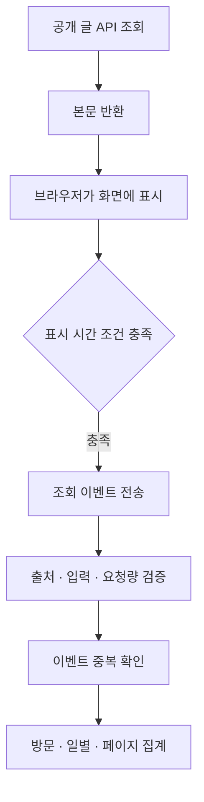

title: 블로그 통계를 다시 만들었다: 수집 기준부터 유입 분석까지
slug: blog-analytics-browser-events-rebuild
category: 개발 노트
tags: analytics,spring-boot,nextjs,postgresql,redis,개인프로젝트
summary: 글 동기화 요청도 조회수로 올라가던 블로그 통계를 브라우저 이벤트 중심으로 바꿨다. 방문과 조회의 정의, 유입 추적, 중복 방지와 함께 기존 누적값을 새 집계에 안전하게 이월한 기준을 정리한다.
syncHash: 75a40ce22b00620032d4623717f7734d733a973ddd8086a99245d46d0796c5e5
publishedAt: 2026-09-10T15:01:40.571958Z

---

통계 화면에서 방문에 비해 조회가 유난히 많았다. 열심히 읽어 준 독자가 있다고 보기에는, 그날 내가 한 일이 마음에 걸렸다. 로컬 글과 운영 글이 맞는지 확인하고, 이미지를 옮기고, 글을 발행한 뒤 다시 API로 읽어 보고 있었다.

화면에는 막대그래프가 있었지만 어디에서 들어와 어떤 글을 읽었는지는 알기 어려웠다. 유입 대부분은 직접 유입으로 표시됐고 나머지도 ‘그 밖’으로 묶였다. 부족한 차트를 추가하기 전에 그 숫자가 무엇을 세는지부터 확인했다.

이 글은 집계 개편을 로컬에서 설계하고 2026년 9월 11일 운영으로 전환한 기록이다. 새 방식의 장기간 추세는 아직 쌓이지 않았다. 따라서 새 화면과 짧은 운영 확인을 통계 성과로 제시하지 않고, 어떤 요청을 왜 세며 과거 숫자를 어떻게 이어 붙였는지에 초점을 맞춘다.

## 기존 화면에서는 숫자가 생긴 이유를 알기 어려웠다


*개편 전 블로그 화면. 제공받은 캡처의 시점이며, 이후 로컬 테스트 화면과 같은 기간·환경의 수치를 비교하는 자료는 아니다.*


*개편 전 위키 화면. 두 사이트 모두 조회 합계는 있지만 어떤 요청이 그 합계를 만들었는지 화면만으로 설명하기 어렵다.*

두 캡처에서 확인할 수 있는 문제는 단순히 숫자의 크기가 아니다. 조회와 방문의 집계 단위가 다르고, 출처가 없는 요청을 직접 유입으로 묶으며, 페이지별 읽기 흐름이 보이지 않았다. 아래 개선 화면은 이 해석의 빈틈을 줄이기 위한 변경이다. 트래픽 감소나 정확도 향상을 수치로 입증하는 전후 실험은 아니다.

## 상세 API를 읽으면 독자가 없어도 조회수가 올랐다

블로그의 공개 상세 API를 확인하니 글을 찾은 직후 조회수 기록 함수를 호출하고 있었다. 글이 존재하는 한 브라우저 화면을 열었는지, 동기화 스크립트가 읽었는지와 관계없이 같은 경로를 탔다.

| 요청 | 기존 결과 | 개편 후 결과 |
|---|---|---|
| 글 비교 스크립트가 상세 API 읽기 | 조회 증가 | 읽기만 수행 |
| 서버 렌더링을 위한 본문 조회 | 조회 증가 | 읽기만 수행 |
| 브라우저에 글이 실제로 표시됨 | API 호출에 의존 | 브라우저의 표시 이벤트로 집계 |
| 같은 이벤트 재전송 | 별도 집계 방지 없음 | 이벤트 번호로 중복 제거 |

위키도 문서별 조회에는 IP 중복 제거가 있었지만 사이트 조회는 매번 증가했다. 어느 함수에 조회수 증가를 붙였느냐에 따라 서로 다른 숫자를 세고 있었다.

스크린샷의 1,195회 중 자동화가 몇 회였는지는 기존 숫자만으로 복원하지 못했다. 확인한 것은 **자동 호출도 조회를 올릴 수 있는 구조**다. 모든 차이를 봇이나 동기화 탓으로 확정하지는 않았다.

## 방문자는 IP 대신 하루 동안만 유지되는 브라우저 번호로 구분했다

기존 방문자는 날짜·IP·비밀값을 섞은 해시로 중복을 제거했다. 원본 IP를 저장하지 않는 장점은 있지만 같은 공유기나 프록시 뒤의 요청은 하나로 묶일 수 있다. 조회는 많이 발생해도 방문자는 적게 보이는 구조가 가능했다.

새 방식에서는 브라우저에 하루 동안 유지되는 임의 번호를 둔다. 한국 시간 자정에 만료되고, 서버에는 날짜와 비밀값으로 다시 변환한 대조값을 저장한다. 원본 번호와 IP를 통계 DB에 남기지 않는다.

이 값을 사람 수라고 부르지는 않았다. 한 사람이 노트북과 휴대폰을 쓰면 둘이고, 저장소를 지우면 다시 구분될 수 있다. 같은 브라우저로 여러 사람이 읽는 상황도 알 수 없다.

| 지표 | 새 정의 | 해석할 때 주의할 점 |
|---|---|---|
| 조회 | 공개 페이지가 화면에 약 1초 이상 표시됨 | 아주 짧은 방문은 빠짐 |
| 방문 | 탭에서 이어지는 활동, 30분 비활동 또는 날짜 전환 시 새 방문 | 다른 분석 도구의 세션과 같지 않음 |
| 일별 고유 브라우저 | 같은 날 같은 임의 번호를 한 번 셈 | 실제 사람 수가 아님 |
| 기간 브라우저 합계 | 일별 고유 브라우저 수를 더함 | 여러 날 온 같은 브라우저가 중복됨 |
| 방문당 조회 | 조회를 방문으로 나눔 | 한 방문의 읽기 깊이를 보는 보조 값 |

특히 ‘누적 방문자’라는 이름은 바꿨다. 일별 중복 제거 결과를 한 달 동안 더한 값은 한 달간의 고유 방문자가 아니다. 오래 유지되는 식별자를 두지 않는 선택에는 기간 고유 수를 알 수 없다는 제약도 따른다.

## 화면에 표시된 뒤에만 집계를 요청하게 했다

브라우저 수집기는 서버 렌더링 때 요청을 보내지 않는다. 페이지가 화면에 표시된 상태에서 타이머가 지난 뒤 조회 이벤트를 보낸다. 문서를 미리 가져오는 프리패치와 실제 표시를 분리하기 위해서다.

관리자·로그인 화면과 임의 경로는 수집하지 않는다. 공개 글도 서버에서 발행 상태와 주소가 맞는지 검사한다. 검색 화면은 화면 종류만 남기고 검색어를 경로에 붙여 저장하지 않는다.



관리자 인증이 있는 요청과 알려진 봇은 서버에서 제외한다. 브라우저에서도 자동화 표시, DNT와 GPC 설정을 확인한다. 통계 제외 버튼을 누르면 이 사이트에서 해당 브라우저의 수집을 멈추고 대조용 쿠키와 세션 저장소를 지운다.

모든 자동화를 알아낼 수 있는 것은 아니다. 일반 브라우저처럼 행동하는 봇은 들어올 수 있고, 스크립트를 막은 실제 독자는 빠질 수 있다. 표시 이벤트를 받는 방식은 사람을 증명하는 수단이 아니라 기존 API 호출보다 읽기 상황에 가까운 관측 방식이다.

### 화면 표시 조건은 브라우저 타이머에서 확인한다

다음은 `BrowserAnalytics.tsx`의 1초 간격 타이머 안에서 조회를 보내는 부분이다. 날짜 전환·세션 갱신과 정리 코드는 생략했다. 독립 실행 예제가 아니라 실제 구현의 핵심 발췌다.

```typescript
if (document.visibilityState !== 'visible' || sending) return;
// 날짜 전환과 세션 갱신 생략
active++;
if (!sent && attempts < 3) {
  sending = true;
  attempts++;
  sent = await send('view');
  sending = false;
}
```

`sent`는 성공한 조회의 반복 전송을 막고, `sending`은 이전 요청이 진행 중일 때 타이머가 요청을 겹쳐 보내지 않게 한다. 실패한 요청은 최대 세 번까지 같은 이벤트로 시도한다. 화면을 떠날 때는 타이머를 정리한다.

이는 가시 상태를 일정 간격으로 확인하는 근사다. 타이머 지연이나 탭의 상태 전환까지 정밀하게 재는 연속 노출 측정기는 아니다. 그래서 약 1초 표시라는 기준을 쓰고, 사람의 실제 주의를 확인했다고 말하지 않는다.

## 한 번의 방문에서 세 종류의 번호가 다른 일을 한다

공유 링크로 글에 들어와 다른 글을 읽고 새로고침하는 상황을 따라가면 집계 단위가 드러난다. 브라우저 번호는 그날의 중복 방문을 구분하고, 세션 번호는 탭 안에서 이어지는 방문을 묶고, 이벤트 번호는 한 번 표시된 페이지의 전송을 구분한다.

| 행동 | 번호와 집계의 변화 |
|---|---|
| 처음 글을 열고 화면에 표시 | 브라우저·세션·이벤트 번호를 준비하고, 표시 조건을 충족하면 조회를 보낸다 |
| 같은 탭에서 다음 글로 이동 | 브라우저와 세션은 유지하고 새 이벤트로 조회를 센다 |
| 같은 글을 새로고침 | 새 표시이므로 조회 이벤트는 새 번호다. 같은 날·같은 방문이면 브라우저와 방문은 추가하지 않는다 |
| 응답을 못 받아 같은 요청을 재전송 | 이벤트 번호를 유지한다. 이미 반영됐다면 조회를 추가하지 않는다 |
| 탭이 숨겨진 채 오래 있다가 돌아옴 | 비활동 시간이 30분을 넘으면 새 방문을 만든다 |
| 한국 시간 날짜가 바뀜 | 일별 브라우저 대조값과 방문을 새로 구분한다 |

브라우저 번호는 첫 번째 당사자 쿠키에, 방문 정보는 탭의 `sessionStorage`에 둔다. 따라서 사이트 간에 한 사람을 추적하는 식별자로 쓰지 않는다. 탭 복제처럼 저장소가 복사되는 브라우저 동작까지 서로 다른 사람이나 독립 방문으로 증명할 수 있는 설계는 아니다.

여기서 활동은 키보드나 마우스를 움직였다는 뜻이 아니다. 현재 구현은 화면에 보이는 동안 타이머로 마지막 활동 시점을 갱신한다. 화면을 켜 둔 채 자리를 비우면 방문이 이어질 수 있다. 이 한계를 숨기지 않고 방문당 조회나 참여율을 보조 지표로 읽는다.

수집 요청에는 사이트, 정규화한 페이지, 세 종류의 임의 번호, 축약한 출처, 제한된 캠페인, 이벤트 종류를 보낸다. 서버는 Origin과 사이트의 대응, 공개 페이지 여부, 입력 길이, 관리자·봇·수집 거부 조건, 요청량을 확인한 뒤 저장한다. 검증을 통과하지 못한 요청이 통계에 들어오지 않는지 별도로 테스트했다.

실제 요청은 다음처럼 보낸다. `payload`에는 앞서 준비한 `site`, `page`, `eventId`, `visitorId`, `sessionId`, `referrer`, `campaign`이 들어 있다. 새 표시에서는 이벤트 번호를 만들고, 같은 표시의 재시도에서는 이 객체를 유지한다.

```typescript
const r = await fetch('/api/bff/analytics/events', {
  method: 'POST',
  headers: { 'content-type': 'application/json' },
  body: JSON.stringify({ ...payload, type }),
  keepalive: true,
});
return r.ok;
```

`type`은 조회의 `view`와 참여의 `engaged`를 구분한다. `keepalive`는 페이지를 떠날 때도 요청이 이어질 수 있게 하지만 도착을 보장하지 않는다. 또한 HTTP 성공은 전송 처리가 끝났다는 뜻이지 반드시 카운터가 증가했다는 뜻은 아니다. 서버에서 제외한 요청이나 이미 처리한 이벤트도 추가 집계 없이 끝날 수 있다.

조회 전송은 같은 번호로 최대 세 번 시도한다. 끝내 실패하면 그 조회는 누락된다. 무제한 재전송이나 모든 방문의 복원을 보장하는 분석 도구로 만들지는 않았다.

## 유입은 매 조회의 출처보다 방문의 첫 출처를 남겼다

독자가 외부 사이트에서 들어와 다른 글을 읽으면 두 번째 페이지의 referrer는 내 사이트가 된다. 이것을 매번 새로운 외부 유입처럼 집계하면 처음 독자를 데려온 경로가 흐려진다.

새 방문을 만들 때 첫 출처와 첫 페이지를 고정한다. 같은 방문에서 조회가 더 생겨도 출처별 방문 수는 한 번만 증가한다. 출처별 조회 수와 방문 수가 서로 다른 이유다.

알려진 검색·SNS 호스트는 기존 분류 규칙을 사용하고, 분류 목록에 없는 외부 호스트는 호스트 이름 자체를 남긴다. 기존 ‘그 밖’만으로는 알 수 없던 외부 링크를 확인할 수 있게 했다.

원래 URL 전체는 남기지 않는다. 브라우저에서 출처의 origin만 보내고 서버가 다시 호스트로 줄인다. 검색어와 출처 페이지의 경로를 보관할 이유가 없기 때문이다.

‘직접 유입’이라는 이름도 ‘직접 / 출처 미상’으로 바꿨다. referrer가 비었다고 주소를 직접 입력했다고 확정할 수는 없다. 앱 공유나 브라우저의 출처 전달 정책 때문에 빠졌을 수 있다. 새 화면은 모르는 값을 직접 방문이라고 단정하지 않는다.

### 브라우저에서 줄이고 서버에서 다시 분류한다

`analyticsAttribution.ts`는 문서 진입 시 출처와 쿼리를 읽는다. 출처는 HTTP·HTTPS URL의 origin만 남긴다. 다음은 해당 부분이다.

```typescript
let origin = '';
try {
  const url = new URL(referrer);
  if (['http:', 'https:'].includes(url.protocol)) {
    origin = url.origin;
  }
} catch {
  // 출처 미상은 그대로 남긴다.
}
```

함수의 `referrer` 인수는 `document.referrer`에서 온다. 이 값은 새 문서 진입으로 인정할 때에만 새 세션의 `referrer`에 저장한다. 이후 전송 객체에는 현재 문서의 출처를 다시 읽는 대신 `referrer: session.referrer`를 넣는다. 서버도 세션을 처음 생성할 때 출처를 저장하고, 이후 조회에는 저장된 세션의 출처를 사용한다. 페이지가 바뀔 때마다 유입을 덮어쓰지 않는 구조다.

여기서 읽는 값은 브라우저의 `document.referrer`다. 수집 API 요청 자체의 HTTP `Referer` 헤더로 외부 유입을 판단하지 않는다. 수집 요청의 출발지는 내 블로그 페이지이므로, 그 헤더만 보면 독자가 처음 들어온 외부 경로를 놓칠 수 있다.

서버의 `BrowserAnalyticsService.source()`는 전달받은 값을 다시 호스트로 줄이고 분류한다. 아래는 실제 함수의 로직이며 읽기 쉽게 줄을 나눴다.

```java
static String source(String referrer) {
    String host = Referrer.hostOf(referrer);
    if (host == null || host.length() > 160
            || !host.matches("[a-zA-Z0-9.-]+")) {
        return "direct";
    }
    Referrer known = Referrer.ofHost(host);
    return known.source().equals("other")
            ? host.toLowerCase(Locale.ROOT)
            : known.source();
}
```

`direct`는 내부 코드 이름이고 화면에서는 ‘직접 / 출처 미상’으로 표시한다. 이 함수에서는 누락뿐 아니라 해석할 수 없는 값도 이 범주에 들어간다. 알려진 호스트는 `google`, `naver`, `sns:x`, `internal` 등으로 분류하고, 목록 밖의 유효한 호스트는 이름을 남긴다.

분류기의 도메인 비교는 단순 포함 검색이 아니다. `Referrer.matches()`는 다음 조건을 사용한다.

```java
return host.equals(domain) || host.endsWith("." + domain);
```

예를 들어 `google.com`과 `www.google.com`은 같은 규칙에 들어가지만 `mygoogle.com`과 `google.com.example.org`는 들어가지 않는다. 문자열에 검색 서비스 이름이 들어 있다는 이유만으로 검색 유입으로 오분류하지 않기 위해서다.

다만 출처는 인증된 증거가 아니다. 브라우저가 전달하지 않으면 복원할 수 없고 클라이언트가 보내는 값은 조작될 수도 있다. 또한 `document.referrer`는 SPA 내부 이동마다 갱신되는 직전 경로가 아니다. 초기 구현에서는 오래 열린 문서의 세션이 만료되면 최초 출처를 다시 사용할 수 있었다. 이 문제는 아래와 같이 문서별로 한 번만 출처를 소비하도록 수정했다. 여전히 모든 이동 경로를 재구성하는 클릭 추적은 아니다.

### 오래 열린 문서의 출처를 새로운 유입으로 재사용하지 않는다

새 문서에서 관측한 출처와 UTM은 한 번만 사용할 수 있게 했다. `createDocumentAttribution()` 내부의 다음 함수가 그 경계다. `entry`는 앞서 축약한 출처와 검증한 캠페인이고, `empty()`는 두 필드가 빈 객체를 반환한다.

```typescript
return (newSession: boolean): Attribution => {
  const available = !consumed;
  consumed = true;
  return available && newSession && navigationType === 'navigate'
    ? { ...entry }
    : empty();
};
```

`navigationType`은 Navigation Timing의 문서 이동 종류다. 일반 문서 진입인 `navigate`에서만 새 출처를 허용하고 `reload`, `back_forward`, 종류를 알 수 없는 환경에서는 새 방문의 출처를 비운다. 기존 방문이 유효하다면 저장된 첫 출처는 그대로 유지한다. 새로고침 자체로 기존 방문의 출처를 지우지는 않는다.

소비 여부는 React 효과의 지역 변수가 아니라 `Document`를 키로 하는 `WeakMap`에 보관한다. SPA 경로 이동이나 효과 재실행으로 소비 상태가 초기화되지 않는다. 같은 문서에서 비활동 30분이나 자정으로 새 방문을 만들면 출처와 캠페인은 비워 ‘직접 / 출처 미상’, ‘캠페인 없음’으로 집계한다.

기존 방문이 있는 상태에서 새 문서를 열었을 때도 문서 진입 정보는 소비한다. 그 방문이 나중에 만료됐다는 이유로 보관 중인 출처를 뒤늦게 새 유입으로 되살리지 않기 위해서다. 새로운 문서로 실제 이동하고 새 방문이 시작됐을 때에는 그 문서의 출처를 다시 관측할 수 있다.

이 선택은 과대 귀속을 줄이는 대신 일부 유입을 미상으로 남긴다. 새로고침이나 뒤로 가기로 복귀한 방문의 정확한 계기를 추측하지 않는다. 화면도 ‘관측한 첫 유입 출처’로 이름을 바꾸고 공유 캠페인과 따로 설명했다.

## 공유 링크는 제한된 캠페인 이름으로 구분했다

내가 같은 글을 여러 곳에 공유할 때는 출처 호스트만으로 구분되지 않을 수 있다. 이때를 위해 `utm_source`, `utm_medium`, `utm_campaign`을 받도록 했다.

예를 들어 세 값이 `newsletter`, `email`, `september`라면 공유 캠페인 표에 `newsletter/email/september`로 모인다. 일부만 있다면 비어 있는 위치는 `unset`으로 남겨 source와 campaign이 뒤섞이지 않게 한다.

아무 문자열이나 저장하지는 않는다. 각 값은 40자 이하의 영문·숫자·하이픈·밑줄만 허용한다. `utm_term`과 `utm_content`는 수집하지 않는다. 캠페인 이름에 사람 이름이나 식별 정보를 넣지 않는 운영 규칙도 필요하다. 허용 문자가 제한됐다고 의미까지 안전하다고 판단할 수는 없다.

### UTM은 새 방문을 만들 때 제한된 값만 읽는다

다음은 문서 진입에서 UTM을 읽는 로직을 설명용으로 정리한 코드다. 실제 구현은 `analyticsAttribution.ts`에 있으며, 결과는 앞서 설명한 문서별 소비 조건을 통과한 새 방문에만 저장한다.

```typescript
const query = new URLSearchParams(location.search);
const tag = (name: string) => {
  const v = query.get(name) ?? '';
  return /^[a-zA-Z0-9_-]{1,40}$/.test(v) ? v : '';
};
const tags = [
  tag('utm_source'),
  tag('utm_medium'),
  tag('utm_campaign'),
];
// 새 세션 객체의 campaign 필드 값
const campaign = tags.some(Boolean)
  ? tags.map(t => t || 'unset').join('/')
  : '';
```

마지막 `campaign` 변수는 실제 문서 진입 객체 안의 식을 설명용으로 분리한 것이다. 서버도 별도로 허용 문자와 길이를 검사한다. 브라우저 검증만 믿고 임의 문자열을 DB에 저장하지 않는다.

유효한 방문이 이미 있으면 새 UTM 링크를 같은 탭에서 열어도 최초 캠페인을 유지한다. 따라서 이 값은 모든 공유 링크 클릭 수가 아니라 **방문을 시작할 때 관측한 캠페인별 방문 수**다. referrer와 캠페인도 따로 집계한다. UTM이 있다고 출처 호스트를 캠페인 이름으로 바꾸지는 않는다.

이전 글 링크에 UTM이 없었다면 과거 캠페인별 방문 수는 복원할 수 없다. 이 기능은 새로 공유하는 링크부터 의미가 있다.

## 중복 방지는 브라우저의 기억에만 맡기지 않았다

네트워크가 불안정하면 브라우저가 요청을 보냈지만 응답을 못 받을 수 있다. 다시 보낼 때마다 조회를 늘리면 똑같은 문제가 다른 경로에서 반복된다.

페이지 표시마다 이벤트 번호를 만들고 재시도에서는 그 번호를 유지한다. DB는 날짜·사이트·변환한 이벤트 번호를 고유 키로 사용한다. 같은 요청이 동시에 도착해도 하나만 삽입한다.

방문을 처음 세는 작업도 세션 행 잠금 아래에서 처리한다. 세션 조회 수가 0일 때만 방문과 첫 페이지를 증가시킨다. 이벤트 삽입과 집계를 한 트랜잭션으로 묶어 일부 카운터만 남는 상황을 줄였다.

### 이벤트를 새로 넣은 요청만 카운터를 증가시킨다

`BrowserAnalyticsService.record()`는 `@Transactional`로 실행된다. 아래는 세션을 잠그는 조회와 이벤트를 삽입하는 SQL의 핵심이다. 파라미터 바인딩과 Java 매핑은 생략했다. 두 SQL은 같은 트랜잭션 안에서 이 순서로 실행한다.

```sql
SELECT visitor, source, campaign, device, landing, views
FROM public.tb_analytics_session
WHERE site = ? AND day = ? AND token = ?
FOR UPDATE;

INSERT INTO public.tb_analytics_event
  (site, day, token, session, page)
VALUES (?, ?, ?, ?, ?)
ON CONFLICT DO NOTHING;
```

이벤트 표의 기본 키는 `(site, day, token)`이다. 같은 이벤트가 이미 있으면 삽입 결과가 0이고, 실제 Java 코드도 `if (accepted == 0) return;`으로 나머지 집계를 건너뛴다. 충돌을 무시한다는 SQL 한 줄만으로 끝나는 것이 아니라 **삽입 성공 여부를 확인한 뒤에만 카운터를 올리는 순서**가 중요하다.

세션 행을 먼저 잠그므로 서로 다른 이벤트가 같은 방문의 첫 조회 자리를 두고 경쟁해도 방문 수를 두 번 올리지 않는다. 이후 일별 합계·출처·페이지 집계 중 오류가 나면 같은 트랜잭션의 변경을 되돌린다. 브라우저 메모리의 `sent`는 반복 요청을 줄이는 장치이고, 최종 중복 판정은 DB가 맡는다.

동시 재전송 테스트에서는 같은 이벤트를 여러 작업에서 보낸 뒤 조회·브라우저·방문이 각각 하나인지 확인했다. 이 검증은 순차 요청 두 번만 보내는 테스트와 다르다. 실제로 경쟁하는 상황에서도 중복 집계가 없는지 본 것이다.

공개 수집 API에는 요청 제한도 둔다. 원본 IP 대신 날짜별 해시를 Redis 키로 사용해 분당 120건을 제한하고, 증가와 만료를 Lua로 함께 실행한다. 다만 공유 IP의 정상 방문도 이 제한에 걸릴 수 있다. 악용 방지와 누락 가능성 사이의 선택이다.

## 읽기 참여는 이해도가 아니라 화면 행동으로 표시했다

체류 시간 하나만으로 읽었다고 말하기는 어렵다. 탭을 열어 두고 다른 일을 할 수도 있고, 긴 글을 바로 맨 아래까지 내릴 수도 있다.

이번에는 화면 표시 시간 30초와 페이지 75% 도달을 함께 만족했는지만 남겼다. 본문을 이해했는지나 끝까지 읽었는지는 알 수 없다. 그래서 지표 이름을 읽기 완료율 대신 읽기 참여로 정했다.

참여 이벤트만 먼저 보내면 조회가 생기지 않는다. 기존 조회 이벤트가 있어야 하고, 같은 세션·페이지이며 최소 시간이 지나야 반영된다. 같은 참여를 여러 번 보내도 한 번만 증가한다.

### 참여는 브라우저 조건과 서버 조건을 나눠 검사한다

브라우저에서는 타이머의 표시 횟수와 페이지 도달 비율을 함께 확인한다. 다음은 현재 코드의 참여 전송 부분이다.

```typescript
const root = document.documentElement;
const progress = (window.scrollY + window.innerHeight)
  / Math.max(root.scrollHeight, window.innerHeight);
if (sent && !engaged && engagementAttempts < 3
    && active >= 31 && progress >= .75) {
  engaged = true;
  engagementAttempts++;
  if (!(await send('engaged'))) engaged = false;
}
```

첫 타이머에서 조회를 보내고 표시 타이머가 31회에 도달하면 참여를 시도한다. 타이머 횟수는 정밀한 경과 시간과 같지 않으므로 UI에는 약 30초의 행동 기준으로 설명한다. 서버에서는 조회를 저장한 뒤 최소 시간이 지났는지도 따로 검사한다.

```sql
UPDATE public.tb_analytics_event
SET engaged = true
WHERE site = ? AND day = ? AND token = ?
  AND session = ? AND page = ?
  AND engaged = false
  AND created_at <= now() - interval '29 seconds';
```

서버 구현의 하한은 29초다. 브라우저 타이머와 요청 도착 시각의 차이를 감안한 경계이며 화면 표시 시간을 서버가 직접 관찰한다는 뜻은 아니다. 변경된 행이 0이면 참여 합계를 늘리지 않는다. `engaged = false` 조건 덕분에 동시 재전송에서도 같은 조회의 참여는 한 번만 반영된다.

서버는 기존 조회·세션·페이지·최소 경과 시간을 확인하지만 실제 스크롤과 가시 상태는 브라우저의 신호에 의존한다. 이 코드는 참여 이벤트를 임의의 조회 생성 수단으로 쓰지 못하게 할 뿐, 사용자가 읽었다는 증명은 아니다.

이 조건도 완벽하지 않다. 스크롤 기준은 본문만이 아닌 페이지 높이다. 댓글이나 부가 영역이 긴 화면에서는 해석이 달라진다. 앞으로 본문 자체의 노출을 더 정밀하게 보고 싶다면 별도 기준과 검증이 필요하다.

## 이전 숫자는 시작 잔액으로만 이월했다

새 정의를 과거 데이터에 다시 적용할 방법은 없다. API 요청을 조회로 세던 시기의 숫자만 보고 실제 브라우저 표시, 방문, 참여를 복원할 수 없기 때문이다. 그렇다고 기존 누적값을 모두 버리면 글과 사이트가 오래 운영된 흔적도 함께 사라진다.

처음에는 이전 집계와 새 집계를 완전히 갈라 표시했다. 구조는 정직했지만 공개 화면의 누적 방문이 운영 전환 직후 1부터 시작했다. DB가 초기화된 것은 아니었지만 사용자에게는 기록을 잃은 것처럼 보였다. 여기서 과거 행을 새 일별 표에 복사하는 방법도 검토했다.

| 방법 | 장점 | 문제 |
|---|---|---|
| 이전 일별 행을 새 표로 복사 | 그래프가 바로 채워짐 | 서로 다른 조회 정의가 같은 기간 지표처럼 보임 |
| 전환일 하루에 누적값을 입력 | 구현이 단순함 | 그날 수만 회가 발생한 것처럼 그래프와 평균이 왜곡됨 |
| 조회 때마다 두 표를 합침 | 원본을 그대로 유지 | 장기간 불필요한 결합과 의미 구분이 계속 남음 |
| 별도 시작 잔액을 한 번 더함 | 새 증분 규칙과 기간 분석을 보존 | 누적값이 참고 수치임을 화면에서 설명해야 함 |

마지막 방법을 골랐다. `tb_analytics_baseline`에는 사이트별로 기준일, 이전 조회 합계, 이전 일별 고유 방문 합계 한 행만 둔다. 운영 값은 코드에 직접 적지 않는다. v2 시작일의 전날까지 기존 일별 표를 합산해 마이그레이션이 한 번 만들고, 이후 애플리케이션은 읽기만 한다.

```sql
WITH boundary AS (
  SELECT (started_at AT TIME ZONE 'Asia/Seoul')::date - 1 AS through_date
  FROM public.tb_analytics_meta
  WHERE version = 2
)
INSERT INTO public.tb_analytics_baseline
  (site, through_date, views, visitors)
SELECT legacy.site, boundary.through_date,
       SUM(legacy.views), SUM(legacy.visitors)
FROM public.tb_site_daily_stat AS legacy
CROSS JOIN boundary
WHERE legacy.stat_date <= boundary.through_date
GROUP BY legacy.site, boundary.through_date;
```

전환 당일을 이전 합계에서 뺀 이유는 롤링 배포 중 두 수집기가 잠시 교차할 수 있기 때문이다. 운영에서는 2026년 9월 10일까지를 시작 잔액으로 확정하고 9월 11일부터 v2 집계만 증가시킨다.

```text
참고용 누적 조회 = 고정된 이전 조회 잔액 + v2 일별 조회 합계
참고용 누적 방문 = 고정된 이전 일별 방문 잔액 + v2 일별 브라우저 합계
```

새 조회가 들어와도 잔액은 바뀌지 않는다. 이벤트 한 건이 중복 검사를 통과하면 그날 조회와 글 조회수가 여전히 1씩 증가한다. 시작 잔액은 새 이벤트를 만들지 않고 누적 카드를 읽을 때만 한 번 더한다. 기간 그래프, 방문, 방문당 조회, 참여율, 페이지와 캠페인 분석에는 섞지 않는다.

이 구분은 방문자 수의 이름에도 필요하다. 이전 값은 날짜·IP 해시로 하루 중복을 제거한 뒤 더한 수치이고, 새 값은 날짜·브라우저 번호로 중복을 제거한 합계다. 둘을 더한 값은 전체 기간의 실제 고유 인원이 아니다. 그래서 화면에는 `참고용 누적 일별 고유 브라우저 합계`라고 쓰고, 기준일과 이전 값이 포함됐다는 설명을 바로 붙였다.

새 스키마는 집계 시작 시점, 일별 합계, 출처·페이지 등의 차원별 합계, 짧게 유지하는 브라우저·세션·이벤트 대조 표로 나뉜다.

대조용 표는 오늘과 어제만 유지하고 시간별로 정리한다. 정상 실행 중에는 최대 약 49시간이며, 서버가 멈추면 재기동 후 정리된다. 영구 집계에는 식별자가 남지 않는다. DB 백업 보관 기간은 이 작업과 별개의 운영 정책이다.

기존 글의 누적 조회수 자체도 초기화하지 않았다. 예전 기록에 앞으로 인정한 조회가 더해진다. 이 값과 참고용 사이트 누적은 연속성을 보는 수치이고, 새 관리자 대시보드의 기간별 조회는 v2 정의로 추세를 비교하는 수치다.

## 화면은 수치에서 원인으로 내려가게 바꿨다

상단에는 이전 집계를 이월한 참고용 누적 카드와, 선택한 기간의 조회·방문·일별 고유 브라우저 합계·방문당 조회·읽기 참여를 분리해 뒀다. 7일·30일·90일을 고르면 기간 지표만 같은 길이의 이전 기간과 비교한다. 오늘은 아직 끝나지 않았고 수집 전 날짜도 포함될 수 있다는 점을 표시한다.

다음에는 조회와 방문을 함께 보여주는 꺾은선그래프를 둔다. 90일을 막대로 나열하면 가로 스크롤 때문에 기간 전체를 비교하기 어려웠다. 그래서 7일·30일·90일 모두 화면 폭 안에서 일별 추이를 볼 수 있도록 바꿨다. 조회는 실선, 방문은 점선으로 구분하고 날짜 눈금은 간격을 두어 표시한다.


*로컬 검증 화면. 값이 거의 없는 것은 새 집계에 테스트 이벤트만 쌓였기 때문이다. 보기 좋은 곡선을 만들기 위해 데이터를 채워 넣지 않았다.*

그래프를 가리키거나 날짜 선택을 움직이면 해당 날짜의 조회와 방문을 확인할 수 있다. 키보드로도 날짜를 선택할 수 있고 아래 표에서 정확한 수치를 읽을 수 있다. 기록이 없는 날짜는 0으로 채우지만, 수집 시작 전의 0을 실제 무방문으로 해석해서는 안 된다. 시작일 안내를 함께 둔 이유다.

아래에서는 방문 출처, 공유 캠페인, 첫 페이지, 기기 분류를 보고 마지막에 페이지별 조회와 참여를 비교한다. 경로만 나열하면 알아보기 어려우므로 글 제목도 함께 보여준다.

디자인은 기존 보라색과 청록색을 이어 썼다. 숫자는 비교하기 쉽게 맞추고, 기록이 없는 영역에는 빈 이유를 적었다. 모바일에서는 길게 쌓이던 관리 메뉴를 가로로 넘기는 메뉴로 바꿔 통계까지 내려가는 거리를 줄였다. 밝은 화면과 어두운 화면에서도 같은 구성을 유지한다.


*개편 후 로컬 대시보드 전체. 상단 지표에서 추이와 출처, 페이지별 읽기로 내려간다. QA 이벤트가 표시된 구현 확인 화면이며 운영 성과가 아니다.*

### 위키 화면에는 설명용 데이터를 따로 얹어 봤다


*설명용 가상 데이터. 기존 위키 캡처의 여러 날에 걸친 높고 낮은 흐름을 참고했지만 수치를 변환하거나 복원한 것은 아니다. 방문·출처·캠페인·참여 값은 화면을 설명하기 위한 예시다.*

실제 로컬 집계가 적으면 출처 목록과 추이의 배치를 읽기 어려워 위키 화면에는 별도 샘플을 얹었다. 브라우저에서 캡처할 화면만 바꿨으며 수집 API나 DB에 샘플 이벤트를 넣지 않았다. 이 이미지의 날짜별 곡선과 분류별 분포를 운영 결과로 해석하면 안 된다.

운영 마이그레이션도 기존 표를 비우지 않는다. 새 집계용 표와 시작 시점을 추가하고, 다음 마이그레이션에서 전환 전날까지의 합계만 시작 잔액으로 확정한다. 기존 일별 기록은 검증과 복구를 위해 남긴다. 임시 대조값 정리, 과거 집계 보관, 시작 잔액은 서로 다른 수명 주기를 가진다.

## 로컬에서 수집부터 제외 설정까지 확인했다

Spring 통합 테스트에서는 상세 API 읽기 전용 동작, 중복·동시 이벤트, 참여 전송 순서, 잘못된 경로, 출처 축약, 관리자와 봇 제외, Origin 검증, 요청 제한, 임시 데이터 정리를 확인했다.

출처 소비 로직은 첫 문서 진입, 기존 방문 유지 후 만료, 같은 문서의 재갱신, 새로고침, 뒤로 가기, 이동 종류 미상, 새 문서 진입과 잘못된 입력을 단위 테스트로 확인했다.

브라우저 테스트에서는 실제 공개 글을 열어 조회 이벤트를 확인했다. 이어 화면을 표시한 채 스크롤하고 참여 이벤트를 확인했으며, 새로고침 때 브라우저와 방문 번호는 같고 이벤트 번호만 달라지는지도 봤다. 개인정보 화면에서 수집을 제외한 뒤에는 같은 글을 열어도 전송이 발생하지 않았다.

이 테스트는 로컬의 `qa/local/analytics-v2` 캠페인으로 구분했다. 화면에 나온 테스트 방문을 실제 운영 독자 수로 제시하지 않는다. 데스크톱과 모바일에서는 가로 넘침과 브라우저 오류도 확인했다.

운영 전환에서는 마이그레이션 적용, 실제 브라우저 이벤트 반영, 관리자 제외, 공개 통계 응답과 기존 데이터 보존을 확인했다. 아직 하루 경계를 지난 장기간 결과는 없다. 날짜가 바뀔 때의 집계와 임시 대조값 정리는 운영에서 계속 관찰해야 한다. 댓글이나 가입을 새 방문 세션과 연결한 전환 분석도 이번 구현에는 넣지 않았다.

이번에 바꾼 것은 차트의 개수보다 수치의 출처다. 조회라고 부를 요청을 정하고, 모르는 값은 모른다고 표시했다. 과거 숫자는 새 이벤트인 척 옮기지 않고 시작 잔액으로만 이어 붙였다. 새 숫자가 운영 판단에 도움이 되는지는 앞으로 쌓이는 기록으로 확인할 일이다.
