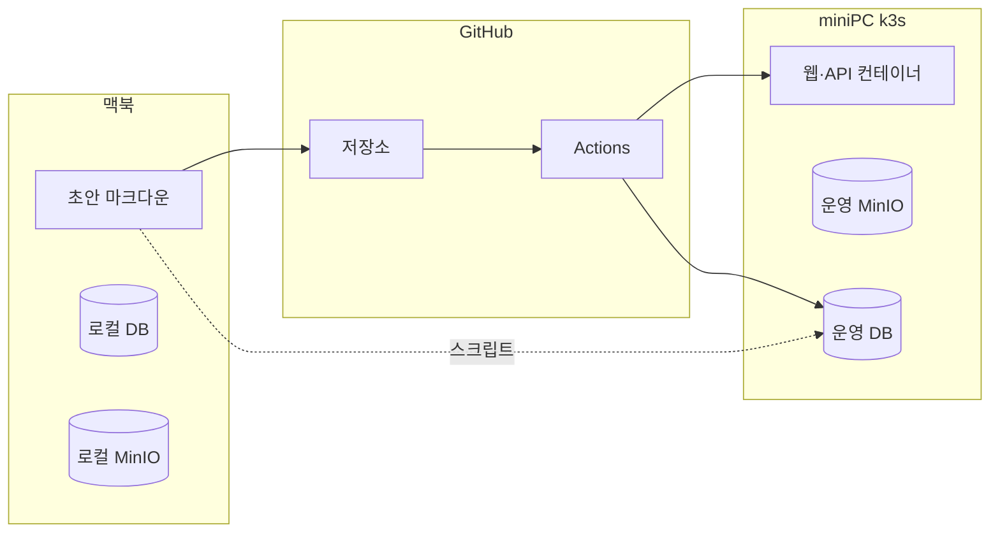
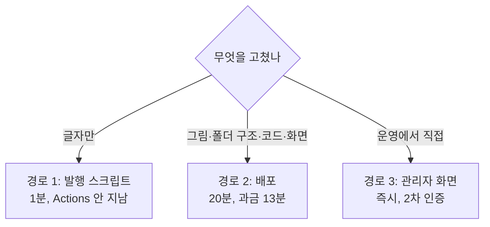
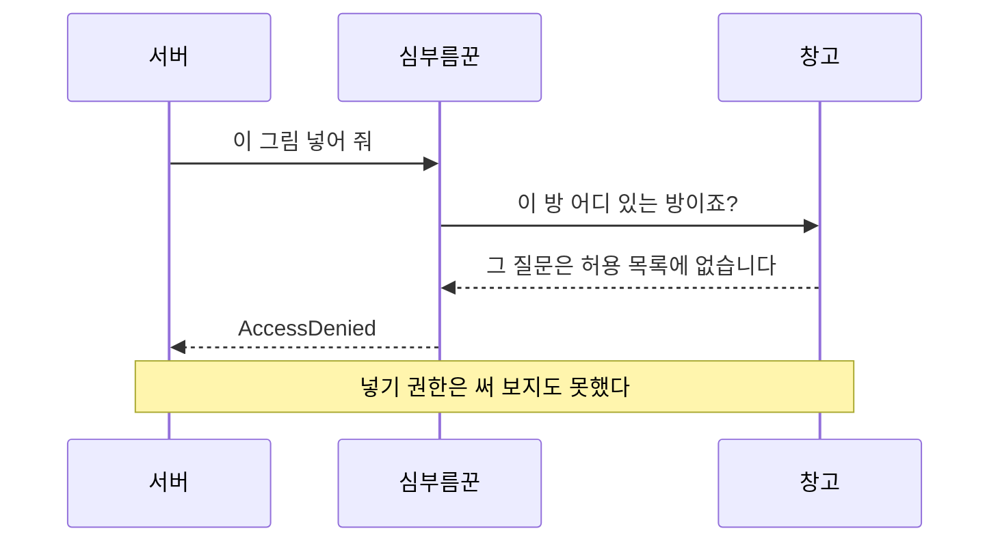
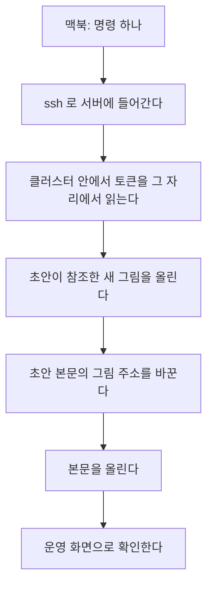
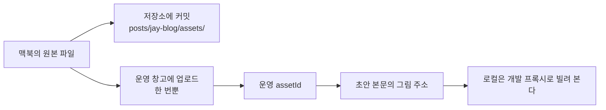
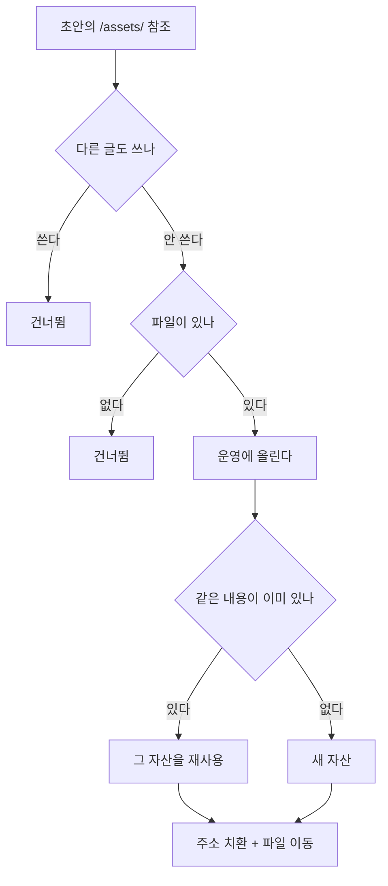

title: 로컬에서 쓴 글이 운영에 닿기까지: 경로 세 개와 그 경계를 다시 그었다
slug: blog-publish-without-deploy
category: 개발 노트
tags: ci-cd,github-actions,minio,kubernetes,object-storage,workflow,content-pipeline,developer-experience
summary: 이 블로그는 글을 맥북에서 쓰고 miniPC 의 쿠버네티스로 보낸다. 그 사이에 저장소와 GitHub Actions 가 있고, 무엇을 고쳤느냐에 따라 경로가 셋으로 갈린다. 각 경로가 무엇을 나르고 무엇을 요구하는지, 왜 그림 한 장이 가장 무거운 경로를 강제하는지, 그리고 경계를 어디로 다시 그을지를 정리한다.
toc: true
publishedAt: 2026-09-01T18:08:43.589635Z
updatedAt: 2026-09-02T05:03:21.334295Z
syncHash: 59ab0695500ad115a34d0487d62e926b3e91774b751cfd19fd195ec42ec5e8c0

---

이 블로그의 글은 맥북에서 마크다운으로 쓴다. 그리고 집에 있는 miniPC 의 쿠버네티스에서 돌아가는 서비스가 그 글을 보여 준다. 그 사이에 저장소와 GitHub Actions 가 있다.

문제는 **무엇을 고쳤느냐에 따라 지나는 길이 다르다**는 것이다. 글자만 고쳤으면 1분이고, 그림이 하나 들어가면 20분이다. 이건 몰라서가 아니라 구조가 그렇게 생겼기 때문인데, 최근에 GitHub Actions 포함 시간 2,000분을 다 쓰고 나서야 그 구조의 값을 처음 계산해 봤다.

이 글은 전체 그림을 한 번 그려 두고, 경계를 어디로 다시 그을지 정리한 기록이다.

## 등장하는 곳이 넷이다



**맥북**에는 초안 파일과, 화면을 미리 보려고 띄우는 로컬 DB·MinIO 가 있다. **저장소**는 초안의 원본을 들고 이력을 남긴다. **GitHub Actions** 는 검사와 빌드와 배포를 돌린다. **운영**에는 실제 DB 와 창고와 컨테이너가 있다.

여기서 헷갈리기 쉬운 게 정본이 어디냐다. 규칙은 이렇다.

| 대상 | 정본 |
|---|---|
| 초안과 아직 안 나간 글 | 저장소의 `posts/jay-blog/drafts/*.md` |
| 이미 발행된 글의 내용 | **운영 DB.** 저장소의 `posts/` 는 작업용 사본이다 |
| 그림 파일 | 저장소의 `web/public/` |
| 위키 글 | 시드 스크립트 한 개 |

**그런데 배포가 초안을 자동으로 발행한다.** 그래서 실질적으로는 초안이 운영을 덮는다. 운영 화면에서만 고치고 초안을 그대로 두면 다음 배포가 되돌린다. 이 성질이 뒤에서 다시 중요해진다.

## 글이 운영까지 가는 길이 셋이다



### 경로 1 — 발행 스크립트

초안 파일을 관리자 API 로 밀어 넣는다. GitHub Actions 를 안 지나고 1분이면 끝난다. 다만 관리자 로그인이라 **2차 인증 여섯 자리를 매번 넣어야 한다.**

로컬 개발 서버에는 이 일을 버튼으로 만들어 둔 화면도 있다. 거기에는 안전장치가 하나 붙어 있다. **새 그림 파일이 있으면 막는다.** 본문만 올라가고 그림 자리가 깨지는 것을 방지하는 장치다.

### 경로 2 — 배포

`develop` 을 `main` 에 머지하면 도는 파이프라인이다. 검사하고, 컨테이너 이미지를 굽고, 운영의 앱을 교체하고, 그 김에 초안도 자동 발행하고 위키 시드도 반영한다. 20분쯤 걸린다.

**여기서 GitHub Actions 의 과금이 발생한다.** 잡마다 어디서 도는지가 다르다.

| 잡 | 어디서 도나 | 시간 |
|---|---|---|
| 검사 | GitHub 호스티드 | 7분 (과금) |
| 이미지 빌드·푸시 | GitHub 호스티드 | 6분 (과금) |
| 운영 배포 | **miniPC 자체 러너** | 4분 (무료) |
| 브라우저 스모크 | GitHub 호스티드 | 짧다 (과금) |

배포 한 판에 과금되는 건 13분이다. 여기에 PR 마다 도는 CI 가 따로 있고 그건 한 판에 9분이다. 8월 이후로 CI 가 100판 넘게, 배포가 52판 돌았다. 2,000분이 어디로 갔는지는 이 두 줄로 설명된다.

경로 필터도 있다. `docs/` 나 `posts/` 만 바뀐 커밋은 **머지해도 배포가 안 걸린다.** 그래서 「반영했는데 화면이 그대로」가 되는 함정이 여기 있다.

### 경로 3 — 운영 관리자 화면

브라우저로 운영에 로그인해서 직접 고친다. 즉시 반영되지만 **초안과 어긋난다.** 그리고 다음 배포가 초안으로 덮으므로, 여기서만 고치면 언젠가 사라진다.

## 그림 한 장이 가장 무거운 경로를 강제한다

세 경로를 놓고 보면 이상한 지점이 하나 있다. **글자만 고치면 경로 1 로 1분인데, 그림이 하나 들어가면 경로 2 로 20분이 된다.**

이유는 그림이 놓이는 자리 때문이다.

```dockerfile
COPY --from=build /app/public ./public
```

`web/public/` 폴더는 앱을 컨테이너 이미지로 구울 때 **안에 함께 구워진다.** 그래서 그림 한 장을 추가하려면 이미지를 다시 굽는 수밖에 없고, 이미지를 다시 구우려면 배포 전체가 돌아야 한다.

**그림을 배포 없이 넣는 길은 처음부터 있었다.** 이 저장소에는 MinIO 라는 파일 창고가 있고, 관리자 화면에서 이미지를 붙이면 그리로 올라가 배포와 무관하게 바로 뜬다. 위키 글은 그 길을 쓰라고 만들어 뒀다.

그런데 블로그 글 127곳의 그림은 한 장도 그 길로 안 갔다. **몰라서가 아니라 폴더 쪽이 편해서였다.**

| | 저장소 폴더 | MinIO 창고 |
|---|---|---|
| 넣는 방법 | 파일을 폴더에 둔다 | 브라우저 왕복 + 2차 인증 |
| 주소 | 사람이 읽는 경로 | 의미 없는 uuid |
| 로컬에서 보이나 | 보인다 | **안 보인다.** 로컬 창고와 운영 창고가 분리되어 있다 |
| 리뷰 | 글과 같은 커밋에 남는다 | 저장소에 안 남는다 |
| 되돌리기 | git | 백업 |

**결정적인 건 첫 줄이다.** 글을 쓰는 흐름은 편집기 안에서 이어지는데, 그림 하나 때문에 브라우저를 열고 로그인하고 휴대폰을 꺼내야 한다면 흐름이 끊긴다. 그래서 매번 폴더를 골랐다. 그때그때는 옳은 선택이었고, 값은 나중에 배포 횟수로 청구됐다.

## 안 쓰는 동안 그 길은 잠겨 있었다

이번에 그림 한 장을 창고로 보내 보려다 알게 됐다. **그 길이 애초에 막혀 있었다.**

```text
AccessDenied. bucketName='wiki-assets'
```

서버는 창고와 직접 대화하지 않고 심부름꾼을 쓰는데, 이 심부름꾼은 짐을 넣기 전에 문 앞에서 한 가지를 먼저 묻는다.



원래 이런 창고는 여러 지점을 전제로 만들어져서 짐을 엉뚱한 지점에 두지 않으려고 위치를 먼저 확인한다. 그 질문의 이름이 `GetBucketLocation` 인데, 서비스 계정 허용 목록에 그게 빠져 있었다.

**버그 자체보다 왜 안 들켰는지가 중요하다.** 창고에는 파일이 25개 있었는데 전부 배포가 밀어 넣은 로고와 자료 파일이었다. 사람이 올린 그림은 한 장도 없었다. 게다가 로컬 창고는 주인 계정을 써서 허용 목록이 없으니 로컬 검증은 전부 통과했다.

**편해서 안 쓴 길은 잠겨 있어도 모른다.** 그리고 그 길이 필요해진 날, 길이 잠긴 것부터 발견하게 된다.

## 경계를 어디로 다시 그을 것인가

지금 경계는 「코드냐 글이냐」가 아니라 「그림이 끼었냐」로 그어져 있다. 그걸 원래 자리로 옮긴다.

| 무엇을 고쳤나 | 지금 | 바꾼 뒤 |
|---|---|---|
| 글자만 | 경로 1 | 경로 1 |
| 글 + 그림 | **경로 2 (배포)** | **경로 1** |
| 화면·코드·폴더 구조 | 경로 2 | 경로 2 |
| 위키 글 | 경로 2 | 경로 2 |

**코드와 화면과 폴더 구조는 그대로 배포다.** 앱을 다시 굽는 것이 맞는 일이고 테스트와 롤백이 거기 붙어 있어야 한다. 떼어내려는 것은 콘텐츠뿐이다.

그러려면 그림을 창고로 보내야 하는데, 권한만 고쳐서는 안 된다. **여전히 브라우저와 2차 인증이 남으면 다음에도 폴더를 고르게 되고 아무것도 안 바뀐다.** 그래서 목표를 「창고에 넣는 것이 폴더에 넣는 것만큼 편할 것」으로 잡았다.



**2차 인증을 없앨 수 있는 근거는 배포가 이미 그렇게 하고 있다는 것이다.** 배포는 관리자 로그인 대신 클러스터 안에서만 열리는 내부 문을 토큰 하나로 연다. 그 문은 바깥 주소에 등록되어 있지 않고 토큰이 틀리면 없는 것처럼 404 를 준다. 사람도 같은 문을 쓰면 된다.

**비밀은 노트북에 두지 않는다.** 토큰을 복사해 오면 노트북이 관리자 권한과 맞먹는 열쇠를 들고 다니게 된다. 대신 `ssh` 로 들어가 그 자리에서 읽어 쓰고 나온다.

준비물은 다섯이고 전부 한 번만 하면 된다.

| 준비물 | 무엇 | 배포가 필요한가 |
|---|---|---|
| 창고 권한 한 줄 | 허용 목록에 위치 조회를 넣는다 | 아니다 |
| 내부 문에 그림 입구 | 글 입구 옆에 같은 토큰으로 열리는 그림 입구를 낸다 | **한 번 필요하다** |
| 중계 창구 수정 | 바이너리를 글자로 읽지 말고 그대로 넘긴다. 대체 통로가 여기서 열린다 | 위와 같은 배포에 실린다 |
| 개발 서버 프록시 | 로컬에서 그림 주소를 운영으로 넘겨 미리 본다 | 아니다 |
| 스크립트 하나 | 위 순서를 명령 한 줄로 묶는다 | 아니다 |

**배포가 필요한 것은 가운데 둘뿐이고 그 둘은 한 판에 같이 나간다.**

바뀌는 값은 이렇다.

| | 지금 | 바꾼 뒤 |
|---|---|---|
| 그림이 든 글 한 편 | 20분 | 1분 안쪽 |
| 과금되는 CI 시간 | 13분 | 0분 |
| 2차 인증 | 매번 | 없음 |
| 실패했을 때 | 앱 이미지가 직전 판으로 되돌아간다 | 글만 안 올라간다 |

마지막 줄은 실제로 겪은 일이다. 초안이 커져서 배포가 스무 번째 단계에서 멈추고, 이미 교체한 앱 이미지까지 되돌아간 적이 있다. **글과 코드를 같은 파이프라인에 태워 둔 대가였다.**

## 숙제로 적었다가 대부분 없앴다

앞에서 폴더 쪽의 장점으로 꼽은 것이 그대로 손해로 돌아온다. **처음에 이렇게 적었는데, 검토하면서 다섯 중 넷이 설계로 없앨 수 있는 것이었다.** 지운 줄이 처음 적은 것이고 그 아래가 지금 판단이다.

- ~~그림이 저장소에 안 남는다.~~ → **남긴다.** 원본을 `posts/jay-blog/assets/<글 slug>/` 에 커밋한다. `web/public` 이 아니므로 컨테이너에 안 구워지고 배포를 부르지 않는다. **「저장소에 두는 것」과 「컨테이너에 굽는 것」은 원래 별개인데 폴더 위치 하나 때문에 붙어 있었다**
- ~~리뷰가 안 된다.~~ → 같은 이유로 그림이 PR diff 에 그대로 올라온다
- ~~주소가 안 읽힌다.~~ → **읽을 필요가 없다.** 저장소에 원본이 있어 파일명으로 찾을 수 있고, 서버도 `original_name` 으로 원본 파일명을 들고 있다
- ~~로컬에서 안 보인다.~~ → **개발 서버에서만 운영 주소를 빌려 본다.** 발행된 글의 그림은 공개라 인증이 필요 없다. 로컬과 운영이 같은 주소를 쓰므로 초안을 두 번 고칠 일도 없다
- ~~`ssh` 통로에 의존한다.~~ → **통로를 둘로 만든다.** 평소에는 `ssh` 로 내부 문을 쓰고, 그게 안 되면 공개 주소로 관리자 API 를 쓴다. 두 번째는 중계 창구가 바이너리를 그대로 넘기게 고치면 열리고, **그 수정과 내부 입구는 같은 배포 한 번에 실린다**
- **초안을 반드시 같이 고쳐야 한다.** → 이건 남는다. 다만 스크립트가 초안 파일을 직접 고치므로 사람이 잊을 수 없다

**진짜로 남는 손해는 하나뿐이다. 같은 그림이 저장소와 운영 창고 양쪽에 존재한다.** 다만 정본은 저장소이고 창고는 서빙용 사본이라 방향이 분명하다. 어긋나면 스크립트를 다시 돌리면 된다.

### 그림을 어디에 올리느냐가 헷갈리기 쉬운데, 운영 한 곳뿐이다

로컬 창고에 먼저 올리면 안 된다. **`assetId` 는 환경마다 새로 발급되기 때문이다.** 로컬에서 받은 값을 본문에 넣으면 운영에서 그 그림이 깨진다.



그래서 「로컬에 올린 것을 나중에 지운다」 같은 상황은 안 생긴다. 로컬 창고는 이 흐름에 아예 안 들어온다.

### uuid 를 DB 로 관리하는 것은 이미 그렇게 되어 있다

창고에 파일만 던져 두는 게 아니라 DB 가 대장을 들고 있다.

| 컬럼 | 무엇 |
|---|---|
| `id` | 본문에 들어가는 uuid |
| `object_key` | 창고 안에서의 실제 위치 |
| `original_name` | 올릴 때의 파일 이름 |
| `checksum_sha256`, `size_bytes` | 무결성과 크기 |
| `status` | 아직 안 붙은 것인지 글에 붙은 것인지 |
| `uploaded_by`, `created_at`, `attached_at` | 누가 언제 |

**이게 있어서 삭제가 안전하다.** 본문이나 과거 판이 그 uuid 를 참조하고 있으면 삭제 API 가 거부한다. 창고 파일만 지우면 글이 깨지는데 그걸 구조가 막아 준다.

그래서 **저장소에 별도의 대응표를 만들 필요가 없다.** 컬럼을 더 늘릴 이유도 없다. 저장소 경로까지 DB 에 적으면 양방향 추적이 되기는 하지만, 원본 파일명이 이미 있고 컬럼을 늘리면 마이그레이션과 배포가 따라온다.

그리고 **이미 발행된 글 127곳의 그림은 그대로 둔다.** 잘 뜨고 있고 옮기면 본문을 전부 다시 써야 한다. 규칙이 두 갈래로 남는다는 뜻이라, 어느 경우에 어디로 가는지를 문서에 적어 두는 일이 설계만큼 중요하다.

## 만들면서 정한 것 셋

설계를 코드로 옮기는 동안 판단이 필요한 자리가 셋 더 나왔다.

### 그림을 저장소에 남길지

`web/public` 에서 빼기로 했는데, 그러면 어디에 두느냐가 남는다. 아예 안 두면 저장소가 안 커지고,
`posts/jay-blog/assets/` 에 두면 git 이 계속 들고 간다. **후자를 골랐다.**

이유는 사본의 개수다. 지금까지 운영 창고 백업은 배포가 끝난 뒤에 받아 왔는데, **이 작업의 목적이
배포를 안 하는 것이다.** 배포가 드물어지면 백업도 드물어지고, 그러면 그림의 유일한 사본이 집에 있는
서버 한 대에만 남는다. 저장소에 원본을 두면 밀어 넣을 때마다 GitHub 이 두 번째 사본이 된다.

비용은 스크린샷 한 장에 130KB 남짓, 지금 속도로 1년에 몇 MB 다. **이 용량과 「집 서버가 죽으면
그림이 사라진다」를 맞바꾸는 건 남는 거래가 아니다.**

실제로 무슨 일이 일어나는지는 경로를 나란히 놓으면 분명하다. 발행할 때 스크립트가 `git mv` 를 부른다.

```text
발행 전  web/public/assets/projects/<글 slug>/캡처.png
발행 후  posts/jay-blog/assets/<글 slug>/캡처.png
```

**저장소 안에서 폴더만 바뀐다.** 파일은 그대로 있고 git 도 계속 들고 간다. `git mv` 를 쓰는 이유는
그냥 옮기면 git 이 「예전 파일이 사라지고 새 파일이 생겼다」로 보는데, 이걸 쓰면 「같은 파일이 이사했다」로
인식해 이력이 끊기지 않기 때문이다.

여기서 헷갈리기 쉬운데, **GitHub 에는 그대로 간다.** 안 가게 되는 것은 컨테이너 이미지다.

| | 지금 | 바꾼 뒤 |
|---|---|---|
| GitHub 저장소 | 간다 | **간다** (폴더만 다르다) |
| 컨테이너 이미지 | 간다 | **안 간다** |
| 배포가 필요한가 | 필요 | 불필요 |

근거는 빌드 설정 한 줄이다.

```yaml
- name: Build and push web
    context: web        # 빌드가 보는 범위가 web/ 하나다
```

`posts/` 는 그 범위 밖이라 이미지를 만들 때 존재조차 모른다. **저장소에 두는 것과 컨테이너에 굽는 것이
원래 별개라는 말이 이 한 줄로 확인된다.** 지금도 초안 마크다운과 위키 문서가 저장소에 있지만 컨테이너
안에는 없다. 배포가 글을 반영할 때도 파일을 나르는 게 아니라 내용을 API 로 보낸다.

### 같은 그림이 여러 벌 쌓이는 것

발행을 다시 돌리거나, 두 글이 같은 그림을 쓰거나, 중간에 실패해 재시도하면 창고에 같은 바이트가
여러 벌 들어간다. **업로드를 체크섬 기준으로 멱등하게 만들었다.** 파일 이름이 달라도 내용이 같으면
이미 있는 자산을 그대로 돌려준다. 본문이 가리키는 것은 이름이 아니라 내용이다.

### 사본을 되살릴 수 없으면 사본이 아니다

「저장소가 두 번째 사본」이라고 정해 놓고 한참 지나서야 빠진 것을 알았다. **되살리는 절차가
없었다.** 창고의 객체가 사라지면 글의 그림만 조용히 깨지고, 깨진 줄 알 방법도 없었다.
원본이 저장소에 있어도 그걸 다시 올리는 길이 없으면 사본이 하나인 것과 다르지 않다.

```bash
node scripts/blog-assets.mjs             # 상태만 본다
node scripts/blog-assets.mjs --repair    # 사라진 그림을 저장소 원본으로 되올리고 초안도 고친다
node scripts/blog-assets.mjs --prune     # 아무도 참조하지 않는 그림을 지운다
```

만들자마자 이 검사기가 거짓말을 했다. 있는 그림을 「없음」이라고 보고했는데, 존재 확인에
`HEAD` 를 썼기 때문이다. 보안 설정이 `GET` 만 공개로 열어 둬서 `HEAD` 는 403 이 된다.
**놓치는 검사기보다 거짓말하는 검사기가 나쁘다.** 매번 「없다」고 하면 진짜 없어진 날에도
그 말을 안 믿게 된다.

### 아무도 안 쓰는 그림이 남는 것

반대 방향의 문제다. 본문에서 그림을 빼면 창고의 객체와 DB 행은 그대로 남는다. **git 은 저장소의
원본만 들고 있어서 이쪽은 안 보인다.** 그래서 참조 없는 자산을 찾아 지우는 경로를 같이 만들었다.

판정은 상태값이 아니라 실제 참조 검색으로 한다. 실제로 상태는 「글에 붙어 있음」인데 어디서도
참조되지 않는 자산이 있었다. **반대로 참조가 하나라도 살아 있으면 서버가 409 로 거부한다.**
청소기가 살아 있는 그림을 지우는 것이 쌓이는 것보다 나쁘기 때문이다.

## 실제로 무엇이 달라졌나

이 글 자체가 새 경로로 올라갔다. 앞의 회고 글도 같이 올렸는데 그쪽에는 그림이 있었다.

작업 순서를 예전과 나란히 놓으면 이렇다.

| | 예전 | 지금 |
|---|---|---|
| 초안 작성 | 그림을 `web/public` 에 둔다 | 같다 |
| 로컬 확인 | 로컬에 발행해 화면으로 본다 | 같다 |
| 운영 반영 | 커밋 → `develop` → `main` 머지 → 배포 20분 | **명령 하나** |
| 그 사이에 도는 것 | 테스트, 이미지 빌드, 앱 교체 | 업로드와 본문 전송뿐 |
| 사람이 하는 인증 | 2차 인증 여섯 자리 | 없다 |
| 마무리 | 배포 결과 확인 | 옮겨진 그림과 초안을 커밋 |

명령은 이 하나다. 여러 편을 한 번에 줄 수도 있고, 인자를 안 주면 초안 전부다.

```bash
node scripts/publish-blog-post.mjs posts/jay-blog/drafts/<slug>.md --write
```

**전부로 돌려도 이미 발행된 글의 그림은 안 건드린다.** 발행 사본이 그 경로를 들고 있으면
이미 운영에 그 주소로 나가 있다는 뜻이라 옮기면 살아 있는 글이 깨진다. 이 규칙을 넣기 전에
dry-run 을 돌려 보고 알았다. **바꾸기 전에 무엇이 바뀌는지 찍어 보는 판이 있어서 걸린 것이지,
바로 `--write` 를 쳤으면 127곳이 한 번에 옮겨졌을 것이다.**

걸린 시간은 두 편 다 몇 초였다. 예전이라면 그림이 있는 쪽은 20분을 기다리고 과금 13분을 썼다.

## 일괄 명령은 무엇을 하고 무엇을 안 하나

인자를 안 주면 초안 전부가 대상이다. 52편을 한 번에 넘기는 명령이라 **무엇을 덮고 무엇을 지키는지
알고 써야 한다.**

```bash
node scripts/publish-blog-post.mjs --write     # 초안 전부
node scripts/publish-blog-post.mjs             # 무엇이 바뀌는지만 찍는다
```

### 방향은 한쪽이다

**초안이 운영을 덮는다.** 운영 화면에서 본문을 고치고 초안을 그대로 두면, 다음에 이 명령을 돌릴 때
초안 내용으로 되돌아간다. 배포가 하던 것과 같은 규칙이고, 이 저장소가 초안을 정본으로 두기 때문이다.

그래서 **운영에서 뭔가 고친 기억이 있으면 먼저 대조한다.**

```bash
node scripts/check-content-sync.mjs
```

로컬과 운영의 차이를 발행일·수정일까지 포함해 보여 준다.

### 그래도 무작정 덮지는 않는다

서버가 두 가지를 해 준다.

**첫째, 안 바뀐 글은 저장하지 않는다.** 현재 운영 값과 비교해서 같으면 `unchanged` 로 넘어간다.
52편을 돌려도 실제로 저장되는 건 달라진 글뿐이라 수정일이 통째로 밀리지 않는다.

**둘째, 초안에 없는 정보는 운영 값을 지킨다.**

```java
request.coverAssetId() == null ? current.getCoverAssetId() : request.coverAssetId()
request.prevPostId()   == null ? current.getPrevPostId()   : request.prevPostId()
```

대표 이미지와 시리즈 연결은 초안 머리말에 없다. 스크립트가 안 보내므로 **운영에서 지정한 그대로
남는다.** 조회수도 저장 대상이 아니라 안 건드린다.

| 항목 | 누가 이기나 |
|---|---|
| 본문, 제목, 요약, 태그, 카테고리, 목차 | **초안** |
| 발행일 | 머리말에 있으면 초안, 없으면 운영 기존 값 |
| 대표 이미지, 시리즈 연결, 조회수 | **운영** |

### 그림은 조건이 맞을 때만 손댄다

초안마다 본문의 이미지 참조 가운데 `/assets/` 로 시작하는 것을 찾아 하나씩 판단한다.



**「다른 글도 쓰나」가 이미 발행된 글을 지키는 자리다.** 발행 사본이 그 경로를 들고 있으면 이미
운영에 그 주소로 나가 있다는 뜻이라, 옮기는 순간 살아 있는 글의 그림이 다음 배포에서 사라진다.
그래서 전부로 돌려도 기존 127곳은 그대로다. **이 규칙은 dry-run 을 먼저 돌려 보고 넣었다.**

### 중간에 실패하면 어디까지 갔나

단계가 여럿이라 실패 지점을 알아 둘 값이 있다.

| 어디서 실패 | 그때 상태 | 다시 돌리면 |
|---|---|---|
| 터널·토큰 | 아무것도 안 바뀜 | 처음부터 |
| 업로드 | 그 그림만 안 올라감 | 안전하다. 같은 내용은 같은 자산이 된다 |
| 초안 갱신 전 | 창고에는 있고 본문은 옛 주소 | 업로드가 멱등이라 중복이 안 생긴다 |
| 본문 발행 | 초안은 이미 새 주소 | 발행만 다시 돈다 |
| 로컬 반영 | **운영은 이미 반영됨** | 경고만 남기고 끝낸다 |

마지막 줄이 중요하다. **로컬 반영 실패로 운영을 되돌리지 않는다.** 운영이 정본인데 확인용 화면
때문에 되돌리는 것은 앞뒤가 바뀐 일이다.

### 쓰기 전에 한 번 찍어 본다

`--write` 를 빼면 아무것도 안 바꾸고 무엇을 할지만 출력한다. **일괄로 돌릴 때는 이걸 먼저 보는
편이 낫다.** 실제로 이 습관이 127곳을 옮길 뻔한 것을 잡았다.

## 남은 한계

권한 한 줄과 코드는 반영했고 로컬에서 검증까지 마쳤다. 운영 업로드가 처음으로 통하는 것,
같은 파일이 같은 자산으로 합쳐지는 것, 참조 중인 자산이 409 로 거부되는 것을 확인했다. **남은 것은 배포 한 번이다.** 내부 문과 중계 창구 수정이 코드라서 운영에 나가야 스크립트가 실제로 돈다. 배포를 안 하려고 배포를 한 번 하는 셈인데, 그 한 번이 마지막이 되는 것이 이 설계의 값이다.

그리고 이 글을 쓰는 과정 자체가 설계를 바꿨다. 처음 판에는 손해 다섯 개를 「어쩔 수 없는 것」으로 적어 뒀는데, 하나씩 왜 어쩔 수 없는지 따져 보니 넷이 위치 선택과 통로 문제였다. **손해를 적는 것과 그 손해가 진짜 불가피한지 따지는 것은 다른 작업이고, 후자를 안 하면 설계가 거기서 멈춘다.**

과금 시간을 아예 0 으로 만드는 다른 길도 있다. **호스티드에서 도는 검사와 빌드를 miniPC 자체 러너로 옮기는 것**이다. 그러면 CI 도 배포도 무료가 된다. 다만 그건 기다리는 20분을 줄여 주지는 않고, 운영을 돌리는 같은 기계에서 빌드가 돌게 되므로 자원 경합을 따로 다뤄야 한다. 이번에 없애려는 것은 돈보다 기다림이라 순서를 뒤에 뒀다.

만들고 나서 남는 것은 둘이다.

**하나, 같은 그림이 저장소와 창고 양쪽에 있다.** 이건 의도한 것이다. 사본이 둘이라 안전한 것이고,
어긋나면 위의 명령이 잡는다. 정본은 저장소이고 창고는 서빙용 사본이라 방향도 분명하다.

**둘, 안 쓰는 길이 또 있는지는 세어 보지 않았다.** 이 글의 교훈을 한 줄로 줄이면 「편해서 안 쓴
길은 잠긴 줄도 모른다」인데, 정작 그런 길을 찾는 일은 안 했다. 이번 권한 문제도 찾아서 나온 게
아니라 그림을 올리려다 우연히 걸린 것이다. 눈에 띈 것은 하나 있다. 창고의 `backups` 버킷이
파일 0개다. 백업은 다른 곳에 쌓이고 있어서 만들어만 두고 안 쓰는 상태다.

그리고 이번에 같은 함정을 두 번 밟았다. **글에 예시로 적어 둔 이미지 경로를 진짜 그림으로 본
것이다.** 목록 썸네일 추출기가 먼저 그랬고, 그걸 고친 직후에 발행 스크립트도 같은 자리에서
같은 실수를 하고 있는 것을 발견했다. 한쪽을 고칠 때 같은 모양을 하는 다른 쪽을 함께 보는 것이
왜 필요한지가 여기서도 그대로 나왔다.
