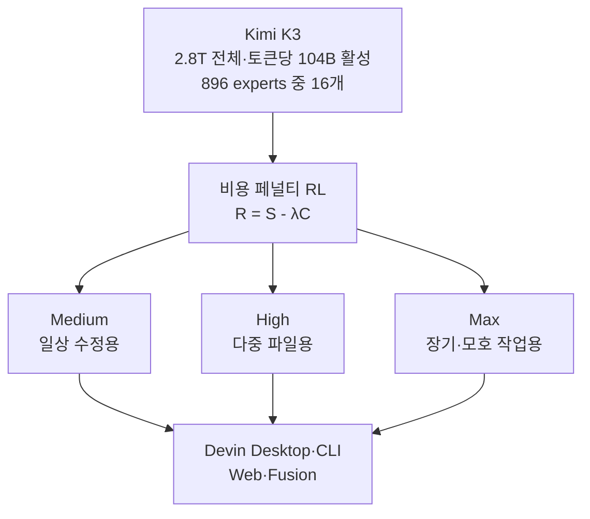

title: "Cognition SWE-2는 어떤 모델인가: 비용을 낮춘 Devin용 코딩 에이전트"
slug: cognition-swe-2-guide
category: 리서치
summary: "2026년 9월 10일 공개된 Cognition SWE-2의 Kimi K3 기반 비용 페널티 RL 구조와 네 개 벤치마크 전수 비교, Terminal-Bench 4 낙차와 64% 비용 주장, 한 달 무료 이벤트와 Devin 사용법을 정리한 리서치."
tags: cognition,swe-2,devin,kimi-k3,coding-agent,frontiercode,terminal-bench,deepswe,benchmark,rl,research
toc: true
publishedAt: 2026-09-12T11:17:00.866099Z
updatedAt: 2026-09-12T11:17:00.866101Z
syncHash: 755ba819c47c8eeffe98a14aadae8ec64416b020e792b7f2665c768acc427529

---

> **이 글의 대상**: 코딩 에이전트 요금이 부담돼서 Devin의 새 모델이 궁금한 개발자와 기술 리드. 특히 "Fable에 1점 차, 64% 저렴"이라는 문구가 어떤 벤치에서 나온 것인지, 긴 작업에서도 통하는지 확인하려는 사람.

> **출처 및 기준일**: 벤치 수치는 [Cognition SWE-2 발표](https://cognition.com/blog/swe-2)를 1차 출처로 하고, 전수 비교표는 [mer.vin의 9월 11일 정리](https://mer.vin/news/cognition-swe-2-cheaper-but-it-lags-on-terminal-bench-4/)와 [PacketNebula의 비교](https://packetnebula.com/articles/cognition-swe-2-fable-5-1-terminal-bench-4-gap/), [byteiota의 정리](https://byteiota.com/cognition-swe-2-near-frontier-coding-ai-at-64-less-cost/), [aitrove의 정리](https://www.aitrove.ai/blog/cognition-swe-2-coding-model-64-percent-cheaper-2026), [SamCodeMan의 분석](https://www.samcodeman.com/writing/cognition-swe-2-terminal-bench-2-1-benchmark), [BenchLM.ai의 SWE-2 페이지](https://benchlm.ai/models/swe-2)로 교차 확인했다. 판정 기준일은 2026년 9월 12일이다. 모든 벤치 수치는 Cognition 자체 발표이며 독립 재현은 아직 없다. 도입 전에는 본문의 링크에서 최신 값을 다시 확인한다.

## 1. 헤드라인은 좋고 다른 행은 조용하다

팀 채팅에 이미 붙은 문장이 있다. 프론티어에 1점 차, 64% 저렴. 2026년 9월 10일 Cognition이 SWE-2를 내놓으면서 내건 문구다. Devin Pro 20달러 요금제에 한 달 무료까지 얹었다. 발표만 보면 갈아탈 이유가 충분해 보인다.

같은 발표문의 같은 표에 다른 행도 있다. 새롭고 어려운 터미널 벤치인 Terminal-Bench 4에서 SWE-2는 27.3%, Fable 5.1은 55.8%다. 1점 차가 아니라 28점 차다. 헤드라인이 된 행과 조용해진 행이 같은 표에 있다.

그래서 이 글은 주장보다 표부터 읽는다. 어디서 이기고 어디서 지는지, 비용 주장의 분모가 무엇인지가 먼저다.

## 2. SWE-2의 정체는 새 pretrain이 아니라 Kimi K3의 RL 특화다

SWE-2를 처음부터 학습한 모델로 보면 오해한다. 뼈대는 Moonshot AI의 Kimi K3이며, Cognition이 강화학습으로 코딩 에이전트에 특화한 포스트트레인이다.

베이스 스펙은 다음과 같다.

| 항목 | Kimi K3 | 비고 |
|---|---|---|
| 전체 파라미터 | 2.8T | SWE-2의 출발점 |
| 활성 파라미터 | 토큰당 104B | 896개 expert 중 16개 라우팅 |
| 층 구조 | 93층, Kimi Delta Attention 69층 + Gated MLA 24층 | 어텐션 혼합 구조 |
| 비전 인코더 | MoonViT-V2 401M | 멀티모달 계승 |
| 어휘·컨텍스트 | 160K 어휘·1M 컨텍스트 | 긴 저장소 작업의 전제 |
| 양자화 | MXFP4 가중치·MXFP8 활성 | SWE-2 추론은 NVFP4·FP8 커널과 양자화 인식 학습 |
| 라이선스 | Kimi K3 License 공개 가중치 | 표준 MIT·Apache가 아니라 저장소의 라이선스 파일을 본다 |
| 베이스 자체 점수 | GPQA Diamond 93.5·BrowseComp 91.2·DeepSWE 67.5·MMMU-Pro 81.6과 83.4 | 손대기 전부터 강한 제너럴리스트다 |

베이스가 강하다는 점이 뒤의 논쟁과 직결된다. SWE-2의 성적이 Cognition의 RL 솜씨인지 출발점의 힘인지를 가르는 기준선이 되기 때문이다. Cognition은 RL 환경을 SWE-1.7 대비 3배로 늘리고, 지시 따르기 오버레이를 얹고, SWE-2 체크포인트 자체로 검증기를 단련하는 재귀 플라이휠을 돌렸다고 설명한다. 디코딩에는 함께 학습한 온라인 드래프트 모델을 쓰는 DSpark 투기적 디코딩을 쓴다.

## 3. 비전 입력은 지원하지만 이미지 생성은 별도 기능이다

여기서 한 가지를 더 구분해야 한다. SWE-2가 이미지를 볼 수 있는지와 새 이미지를 만들어 내는지는 같은 기능이 아니다.

SWE-2의 베이스인 Kimi K3는 공식 저장소에서 텍스트·이미지 입력을 지원하고, 401M 파라미터의 MoonViT-V2 비전 인코더를 사용한다고 설명한다. 따라서 스크린샷·차트·화면 설계처럼 이미 주어진 이미지를 읽는 능력은 베이스 모델의 기능에 포함된다. [Kimi K3 저장소](https://github.com/MoonshotAI/Kimi-K3)의 사용 안내에도 비전 입력 경로가 따로 있다.

Devin 쪽에는 [Computer Use](https://docs.devin.ai/work-with-devin/computer-use)가 있다. Devin이 데스크톱 화면을 캡처하고, 마우스와 키보드로 앱을 조작하고, 변경한 화면을 눈으로 확인하는 기능이다. 이 기능을 합치면 SWE-2를 사용하는 Devin은 이미지 파일을 설명하는 데서 끝나지 않고, 실행 중인 UI를 보고 테스트할 수 있다.

반대로 Cognition의 [SWE-2 발표](https://cognition.com/blog/swe-2)는 이미지 생성 모델이나 생성 이미지 출력을 기능으로 명시하지 않는다. 그래서 SWE-2를 네이티브 이미지 생성기로 소개하면 범위를 넘는다. 이미지를 만들 수 있는지는 별도 이미지 모델이나 외부 도구를 연결했는지로 판단해야 한다. SWE-2가 SVG·HTML·Canvas 코드를 작성해 그림을 만들 수는 있지만, 그것은 코딩 에이전트가 도구로 생성한 결과이지 모델 자체의 이미지 생성 기능과는 다르다.

| 구분 | 확인된 기능 | 실무에서 할 수 있는 일 |
|---|---|---|
| Kimi K3 베이스 | 텍스트·이미지 입력, MoonViT-V2 비전 인코더 | 스크린샷·차트·UI를 읽고 설명하기 |
| Devin Computer Use | 화면 캡처·마우스·키보드·시각적 검증 | 실행 중인 웹·데스크톱 앱을 보고 테스트하기 |
| SWE-2 네이티브 이미지 생성 | 공식 발표에 별도 기능으로 기재되지 않음 | 이미지 생성기로 단정하지 않기 |
| 코드 기반 이미지 출력 | SVG·HTML·Canvas 작성과 외부 도구 호출 | 코드나 연결된 도구로 이미지 파일 만들기 |

따라서 이 글에서 말하는 SWE-2의 비전은 **이미지를 입력으로 이해하고 화면을 확인하는 능력**이다. **새 이미지를 생성하는 기능**까지 필요하다면 Devin에 연결된 도구와 별도 모델을 확인해야 한다.

## 4. 네 개 벤치를 행으로 뜯어보면 승패가 갈린다

Cognition이 공개한 비교군은 전임 SWE-1.7, 베이스 Kimi K3, Grok 4.6, GPT-5.6 Sol, Fable 5.1, GPT-6 Astra다. 네 행을 그대로 옮긴다. 전부 Cognition 자체 실측이며 최대 노력 단계 기준이다.

| 벤치마크 | SWE-2 | SWE-1.7 | Kimi K3 | Grok 4.6 | GPT-5.6 Sol | Fable 5.1 | GPT-6 Astra |
|---|---|---|---|---|---|---|---|
| FrontierCode 1.1 Main | 50.0% | 42.0% | 44.2% | 48.0% | 47.5% | 50.9% | 53.3% |
| DeepSWE 1.1 | 73.0% | 37.7% | 68.5% | 67.5% | 72.7% | 67.4% | 74.1% |
| Terminal-Bench 2.1 | **92.8%** | 81.5% | 88.3% | 88.4% | 88.8% | 91.4% | 89.9% |
| Terminal-Bench 4 | 27.3% | 7.6% | 21.5% | 20.3% | 37.3% | 55.8% | 57.9% |

행별로 읽으면 그림이 달라진다.

첫째 행 FrontierCode는 헤드라인의 출처다. Fable 5.1과 0.9점 차, Astra와 3.3점 차다. 일상 코딩 구간에서는 오차로 읽을 수 있는 거리다. 다만 이 벤치는 Cognition이 만들고 운영하는 자체 벤치다. 회사 전용 자로는 유용하지만 독립 제3자 지표는 아니다.

둘째 행 DeepSWE는 SWE-2의 가장 큰 점프다. 전임 37.7%에서 73.0%로 35.3점 올랐고, 베이스 68.5%보다 4.5점 높다. RL 특화가 베이스에 얹힌 증거로 읽기 좋은 행이다. Astra 74.1%와는 1.1점 차, GPT-5.6 Sol 72.7%와 Fable 5.1 67.4%는 앞선다.

셋째 행 Terminal-Bench 2.1은 SWE-2가 표 전체 1위다. Fable 5.1 91.4%와 Astra 89.9%를 웃도는 92.8%다. 짧고 범위가 정해진 에이전트 작업에서는 가장 강하다.

넷째 행 Terminal-Bench 4는 정반대다. SWE-2 27.3%는 Fable 5.1의 절반 이하, Astra의 절반 이하다. GPT-5.6 Sol 37.3%에도 10점 뒤처진다. 같은 주에 나온 범용 모델 DeepSeek V4.1 Flash의 31.2%보다도 낮다. 이 행이 헤드라인에 없는 이유다.

상대 전적으로 묶으면 다음과 같다. 전임 SWE-1.7과는 네 행 모두 완승이며 가장 작은 격차가 11.3점이다. 베이스 Kimi K3와 Grok 4.6에 대해서도 네 행 모두 앞선다. GPT-5.6 Sol과는 2승 2패, Fable 5.1과는 두 행에서 1점 이내로 졌지만 Terminal-Bench 4에서 크게 졌다. Astra와는 네 행 모두 뒤처지며, Cognition은 이를 "4분의 1 비용으로 접근한다"는 표현으로 감싼다.

## 5. 92.8%와 27.3%의 낙차가 말하는 것을 확인했다

같은 터미널 벤치 계열에서 65.5점이 증발했다. SWE-2만의 일이 아니라 전 모델이 새 개정판에서 떨어진다. 다만 떨어지는 폭이 다르다.

| 모델 | Terminal-Bench 2.1 | Terminal-Bench 4 | 낙차 |
|---|---|---|---|
| SWE-2 | 92.8% | 27.3% | 65.5점 |
| SWE-1.7 | 81.5% | 7.6% | 73.9점 |
| Kimi K3 | 88.3% | 21.5% | 66.8점 |
| Grok 4.6 | 88.4% | 20.3% | 68.1점 |
| GPT-5.6 Sol | 88.8% | 37.3% | 51.5점 |
| Fable 5.1 | 91.4% | 55.8% | 35.6점 |
| GPT-6 Astra | 89.9% | 57.9% | 32.0점 |

2.1은 포화됐다. 대부분이 80% 후반에서 90% 초반에 몰려 변별이 안 된다. 4는 한 자릿수부터 50% 후반까지 흩어진다. Hacker News 논쟁의 핵심도 여기다. 구 버전 과적합(benchmaxxing)인지 진짜 일반화인지가 갈리는 지점이다. SWE-2의 RL 환경에 FrontierCode와 2.1 계열 작업이 들어갔고 4는 들어가지 않았다는 점이 의심의 근거다.

실무 해석은 단순하다. 범위가 정해진 짧은 작업에는 SWE-2가 빠르고 강하다. 수 시간짜리 다중 파일 작업과 장기 계획이 걸린 일에는 프론티어와의 격차가 크다. 92.8%를 보고 장기 작업을 맡기면 어긋난다.

## 6. 64% 저렴하다는 말의 분모를 확인했다

비용 주장은 상대 비교이며 절대 요금표가 아니다. SWE-2의 토큰당 공개가는 없다. Devin 구독료만 있다.

| 주장 | 수치 | 조건 |
|---|---|---|
| Fable 5.1 대비 | 64% 저렴, 롤아웃 비용의 36% 수준 | FrontierCode 기준, 경쟁사 목록가와 공개 할인 가정. Cognition 자체 산정 |
| 전임 대비 턴수 | 평균 58% 감소 | FrontierCode 1.1 Main, medium 노력 단계 |
| 전임 대비 비용 | 평균 81% 감소 | 같은 조건 |
| 첫 성공 수정의 중앙 단계 | 18단계 대 48단계 | SWE-2 대 SWE-1.7 |
| Fable 5.1 Medium 기준가 | 작업당 3.28달러 | 분모로 쓰인 경쟁사 수치 예시 |

"64%"는 예산표에 바로 넣는 숫자가 아니다. 독립 검증된 달러 단가가 아니라 Cognition 방법론의 평균 지출 비교다. 다만 방향은 분명하다. 쉬운 일에 비싼 추론을 쓰지 않고 노력 단계를 낮추는 구조라서, 일상 작업의 총비용은 실제로 내려간다. 한 달 무료가 걸린 Devin Pro 20달러 요금제에서 일상 코딩을 돌리는 팀이라면 직접 재볼 만한 구간이다.

## 7. 노력 단계를 나눈 훈련법이 기술적 알맹이다

SWE-2는 고정 비용 모델이 아니라 medium·high·max 세 단계를 노출한다. 일상 수정은 medium, 다중 파일은 high, 장기·모호 작업은 max가 맡는다. 벤치 표는 max 기준이며 효율 수치는 medium 기준이다. 행을 바꿔 읽으면 안 된다.

훈련식은 비용 페널티 보상이다. 성공 점수에서 노력 단계별 계수를 곱한 비용을 뺀다. 한 번의 RL 실행으로 세 단계를 함께 학습하며, 계수가 클수록 싸고 짧은 롤아웃으로 기운다. Cognition은 이를 다중 조 단위 파라미터에 강화학습을 확장한 첫 사례라고 설명한다. 안정화를 위해 길이 가중 보상 기준선을 썼다고 밝힌다.

한계도 자사 부록에 있다. 오프폴리시 RL이라 기준선이 기울기 분산을 최소화하는 이론적 기준선은 아니라는 점을 직접 적었다. 선전·검열 평가는 단일 이진 판정 모델(GPT-5.6 Luna)로 돌려 방법론이 얇다. 비교표에서 Fable 5.1 Max를 뺀 이유를 "낮은 노력 단계보다 못해서"라고만 적어 경쟁사 수치의 불일치를 설명 없이 넘겼다. 기술적 알맹이와 미해결 지점이 같은 문서에 있다.

## 8. 커뮤니티는 벤치 게이밍을 의심하고 직접 재보고 싶어 했다

Hacker News 스레드는 405점·181개 댓글 규모로 달렸다. 반복된 지적은 다섯 갈래다.

| 지적 | 내용 |
|---|---|
| 벤치 게이밍 의심 | 92.8% 대 27.3%의 격차를 구 버전 과적으로 읽는다 |
| 베이스 의존 | Kimi K3 자체가 강해서 Cognition RL의 기여와 출발점의 힘을 분리해야 한다 |
| 교차 비교 | 같은 주 DeepSeek V4.1 Flash가 Terminal-Bench 4에서 31.2%로 SWE-2를 앞선다 |
| 접근성 | 공개 API와 OpenRouter 등록이 없어 직접 재볼 수 없다는 불만. 도입 전 자사 벤치를 돌리고 싶다는 요구 |
| 전적 | Devin 초기 데모의 편집 논란을 들어 새 벤치 주장도 신중하게 보자는 시각 |

접근성 지적이 가장 실무적이다. SWE-2 자체는 닫혀 있고 Devin Desktop·CLI·Web·Fusion 안에서만 돈다. 대신 베이스 Kimi K3는 Hugging Face 공개 가중치로 받을 수 있고 vLLM·SGLang·TokenSpeed 경로와 Transformers 로딩이 문서화돼 있다. RL 특화와 에이전트 하네스는 안 따라오지만 같은 출발점의 2.8T를 직접 돌려볼 수는 있다. 락인을 피하고 싶다면 이 경로가 대안이다.

배경 맥락도 있다. Cognition은 9월 8일에 480억 달러 가치로 20억 달러 이상을 조달했다고 밝혔다. 독립 에이전트 랩을 표방하며 특정 모델사에 묶이지 않고 고르고조합하겠다고 선언한 직후의 출시다. 외부 베이스에 자사 RL을 얹어 Devin으로 유통하는 구조가 그 선언의 첫 결과물이다.

## 9. 한 달 무료 이벤트 안에 쓰는 법을 정리했다

출시와 함께 요금 이벤트가 붙었다. Cognition 공식 X 발표 문구는 "SWE-2 is available today in Devin across Desktop and CLI. We're making it free for all Pro, Max & Teams subscribers for the next month."다. 9월 10일 출시 기준 다음 한 달, 유료 구독자에게 무료라는 뜻이다.

| 항목 | 내용 | 확인할 점 |
|---|---|---|
| 무료 대상 | Devin Pro·Max·Teams 구독자 | 공식 X 발표 기준. 문서의 모델표는 "self-serve plans"라 적어 Free 포함처럼 읽히지만, 발표문은 유료 세 요금제만 못 박았다 |
| 무료 기한 | 공식 출처마다 날짜가 엇갈린다. 요금표는 10월 10일, 문서는 10월 8일까지라 적었다 | 요금표 Pro란의 선물 아이콘 툴팁에는 "Free in Devin Desktop and CLI through October 10, 2026"이라 적혀 있다. 반면 [Devin 문서의 모델표](https://docs.devin.ai/desktop/models)에는 "SWE-2 is free for self-serve plans through October 8, 2026"이라 있다. 10월 9일이라는 말은 웹의 1차 출처가 아니라 Devin Desktop 안에서 본 화면 캡처에서 나왔다. 앱이 기한을 로컬 시간대로 렌더링한다면 같은 마감도 요금표의 10월 10일과 문서의 10월 8일 사이 어딘가로 보일 수 있다. 10월 10일 UTC 자정은 미국 태평양 시간으로 10월 9일 오후 5시, 동부로 9일 오후 8시다. 종료 시각과 시간대 자체는 어디에도 공개돼 있지 않다. 공식 출처끼리 이틀이 어긋나므로, 넉넉한 쪽이 아니라 이른 쪽인 10월 8일을 기준으로 쓰고 청구서에서 확인한다 |
| 요금제 | Free 0달러·Pro 월 20달러·Max 월 200달러·Teams 월 80달러 최소 | 유료 쿼터는 일·주 단위로 갱신되며 초과분은 API 요율로 별도 과금된다 |
| 사용 위치 | Devin Desktop과 CLI에서 즉시, Web·Fusion은 순차 전환 | 출시 당일은 Desktop·CLI가 먼저다 |
| 모델 선택 | `swe-2-medium`·`swe-2-high`·`swe-2-max` 세 단계 | 로컬 Devin CLI에 세 식별자가 Free 표시로 노출된다는 커뮤니티 보고가 있다 |
| 컨텍스트 | Devin 경로에서 262K 보고 | 베이스 1M이 아니라 Devin 운용값이므로 긴 작업은 나눠 넣는다 |
| 문서 | CLI 사용법은 [Devin 문서](https://docs.devin.ai/) | Hacker News 답변에서 Cognition 직원이 CLI 경로를 직접 안내했다 |
| 전례 | SWE-1.7 출시 때도 유료 사용자 한 달 무료였다 | 한시 무료가 Cognition의 출시 관례다. 상시 요금으로 오해하지 않는다 |

쓰는 법은 노력 단계와 연결된다. 일상 수정과 작은 고치는 medium, 다중 파일은 high, 장기·모호 작업은 max가 맡는다. 커뮤니티 실측(LINUX DO의 amber-devin 23케이스 집계)에서는 high가 23개 중 16개, medium이 15개, max가 18개 안팎으로 나왔다. max가 가장 많이 풀지만 "느려서 못 쓰겠다"는 평이 함께 붙었다. medium이 high 대비 3분의 1 벽시계로 1개 차이였다는 보고도 있다. 무료 기간의 요령은 분명하다. 평소 일은 medium·high로 돌려보고, 막히는 건만 max로 올린다. 한 달 무료는 세 단계를 자사 작업으로 재보는 데 쓴다.

주의할 점도 있다. 무료는 사용량 쿼터 안의 이야기가 아니다. [Devin 문서의 쿼터 설명](https://docs.devin.ai/desktop/accounts/quota)에 따르면 무료 모델은 쿼터를 전혀 차감하지 않는다. Devin Desktop 공식 X 계정이 쓴 "unlimited usage"라는 표현의 실체가 이것이다. 일·주 쿼터를 다 쓴 뒤에도 SWE-2는 계속 돌릴 수 있다는 뜻이다. 다만 제한이 없는 것은 아니다. Pro·Max의 동시 세션 상한 10개는 그대로 적용되고, SWE-2가 아닌 프론티어 모델은 정상 차감되며, 쿼터 초과분의 별도 과금은 SWE-2 사용분에는 붙지 않는다. 전례도 있다. SWE-1.7 출시 때도 통상 속도는 무료이거나 넉넉했지만 Cerebras 기반 Lightning 변형은 무료가 아니었다. 이번에도 세 노력 단계가 모두 무료인지는 CLI의 Free 표시와 청구서로 확인한다.

이벤트가 끝난 뒤 요금은 목록가와 공개 할인 기준으로 돌아가므로, 10월 8일이 되기 전에 자사 작업의 실제 비용을 재둔다. 기한 표기가 출처마다 이틀씩 어긋나는 만큼, 무료가 끝나는 주도 청구서를 직접 확인한다.

## 10. 남은 한계를 그대로 적는다

첫째, 전부 자사 수치다. 벤치도 하네스도 비용 산정도 Cognition 것이다. Artificial Analysis 같은 독립 재현이 나오기 전까지는 예산 결정의 근거로 쓰지 않는다.

둘째, 헤드라인 벤치가 자사 벤치다. FrontierCode의 "1점 차"는 Cognition이 만든 자에서 잰 거리다. 독립 지표가 아니다.

셋째, Terminal-Bench 4가 천장이다. 최신 장기 에이전트 작업에서 SWE-2는 빠른 모델이지 프론티어 모델이 아니다. 어려운 작업은 다른 경로로 보낸다.

넷째, 락인이 있다. API도 가중치도 없고 판매사도 하나, 에이전트 제품도 하나다. 모델 이식성을 원하면 이번 출시는 바꾸는 것이 없다.

다섯째, 한국어와 다국어 구간은 검증이 없다. 공개 비교표에 한국어 작업 수치가 없으므로 별도 검증이 필요하다.

정리하면 SWE-2는 "프론티어와 1점 차 모델"이 아니라 "일상 작업의 비용을 낮춘 Devin 전용 특화"다. 짧은 일은 빠르고 싸게 끝내고, 긴 일은 프론티어에 맡긴다. 표의 네 행을 함께 볼 때만 이 문장이 성립한다.
