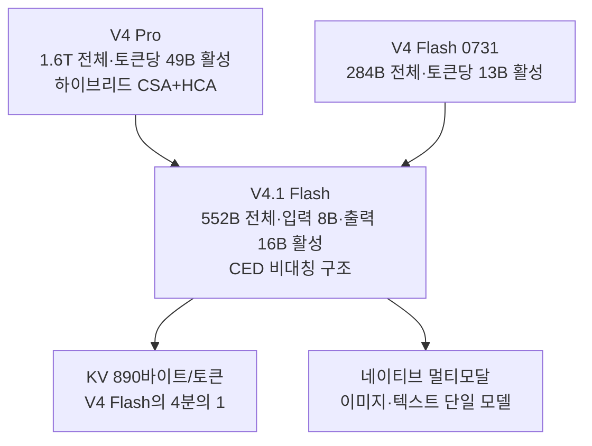

title: "DeepSeek V4.1 Flash 정리: Pro급을 Flash 가격에 넣은 새 아키텍처의 실체"
slug: deepseek-v4-1-flash-guide
category: 리서치
summary: "2026년 9월 10일 공개된 DeepSeek V4.1 Flash의 CED 비대칭 구조와 552B 스펙, 공식 벤치마크와 Vals 독립 평가, KV 캐시 효율과 API 가격·라우팅 변경을 한 편으로 정리한 리서치."
tags: deepseek,v4-1-flash,moe,ced,agentic-coding,benchmark,terminal-bench,vals,api-pricing,open-weights,research
toc: true
syncHash: a335f47ac9c1d4ae8c06531007ecaeb2e288a73de7ca8af0fdc6352de603a654
publishedAt: 2026-09-11T01:37:57.239723Z

---

> **이 글의 대상**: 에이전트 코딩 API 비용과 1M 컨텍스트 효율이 궁금한 개발자와 기술 리드. 특히 Flash급 가격에 Pro급 성능이라는 발표가 어떤 조건에서 나온 것인지, 지금 API에서 무엇을 호출해야 하는지 확인하려는 사람.

> **출처 및 기준일**: 1차 출처는 [DeepSeek 공식 V4.1 Flash 발표](https://www.deepseek.com/en/news/deepseek-v4-1-flash/)이며, 스펙·가격·라우팅은 [DeepSeek API Docs](https://api-docs.deepseek.com/quick_start/pricing)와 [V4 Preview 릴리스](https://api-docs.deepseek.com/news/news260424), [Geopolitechs의 9월 10일 정리](https://www.geopolitechs.org/p/deepseek-v41-flash-stronger-faster), [Gate News의 9월 10일 보도](https://www.gate.com/news/detail/deepseek-releases-v41-flash-ai-model-with-552b-parameters-24165404), [MarkTechPost의 구조 해설](https://www.marktechpost.com/2026/09/10/deepseek-ai-released-deepseek-v4-1-flash-with-1m-context-fp4-kv-cache-and-cross-layer-attention-reuse/)을 기준으로 정리했다. 독립 평가는 [Vals의 V4.1 Flash 페이지](https://www.vals.ai/models/deepseek_deepseek-v4-1-flash)와 [Artificial Analysis 프로바이더 페이지](https://artificialanalysis.ai/models/deepseek-v4-1-flash/providers)를 썼다. 판정 기준일은 2026년 9월 11일이다. 가격·라우팅·리더보드는 바뀔 수 있으므로, 도입 전에는 본문의 링크에서 최신 값을 다시 확인한다.


## 1. 에이전트 루프는 싼 모델과 강한 모델 사이에서 갈라진다

코딩 에이전트를 실무에 붙이면 한 번의 호출로 끝나지 않는다. 저장소를 읽고, 테스트를 돌리고, 실패 로그를 해석하고, 다시 고치는 루프가 수십 턴 이어진다. 강한 모델로 돌리면 청구액이 쌓이고, 싼 모델로 돌리면 중간에 헤매면서 턴이 늘어난다. 어느 쪽이든 총비용은 생각보다 빨리 커진다.

DeepSeek V4.1 Flash는 이 갈림길에 놓인 모델이다. 2026년 9월 10일 공개됐고, 공식 설명은 "Flash 가격에 Pro를 넘어섰다"다. 게다가 9월 14일 정오(베이징 시간)부터 V4 Pro 요청을 V4.1 Flash로 돌려 Flash 가격으로 과금한다고 예고했다. 발표 문구만 보면 당장 갈아타야 할 것처럼 보인다.

그래서 이 글은 성능 주장보다 구조와 조건부터 정리한다. 무엇을 얼마에 쓸 수 있고, 숫자가 어떤 모드에서 나온 것인지가 먼저다.


## 2. V4.1 Flash의 정체는 새 가중치가 아니라 새 구조다

V4.1 Flash를 V4 Flash의 미세 조정으로 보면 오해한다. 공식 설명에 따르면 아키텍처 자체가 바뀌었다.



핵심 스펙은 다음과 같다.

| 항목 | V4.1 Flash | 직전 세대와의 관계 |
|---|---|---|
| 전체 파라미터 | 552B MoE 백본 + 196B Engram 파라미터 | V4 Flash 284B의 약 2배, V4 Pro 1.6T의 약 3분의 1 |
| 활성 파라미터 | 입력 처리 8B·출력 생성 16B | 비대칭 구조. 프리필에서는 20개 인코더 층만 돌아 읽기와 쓰기에 다른 연산량을 쓴다 |
| 아키텍처 | Causal-Encoder-Decoder(CED) | 입력과 출력을 분리한 새 구조. V4의 CSA+HCA 하이브리드 어텐션 계보를 잇는다 |
| 학습 토큰 | 45T 멀티모달 토큰 | 코드·수학·도구 호출·다국어를 포함한 대규모 사전학습 뒤 강화학습 확대 |
| 컨텍스트 | 입력 1M·최대 출력 384K | V4부터 이어진 1M 기본 방침 유지 |
| 멀티모달 | 이미지·텍스트 네이티브 처리 | 별도 비전 확장 모델이 아니라 단일 모델 안에서 처리한다 |
| 라이선스·배포 | MIT, 공개 가중치 48 safetensors 샤드 | 자가 호스팅 가능. 대규모 배포 최적화는 별도 협의 창구 안내 |
| API 식별자 | `deepseek-flash` | 기존 `deepseek-v4-flash` 요청은 당분간 V4.1 Flash로 라우팅된다 |

7월 31일 V4 Flash 공식판이 구조를 그대로 두고 후학습을 다시 한 것과 달리, 이번에는 구조부터 바꿨다는 점이 다르다. 총량은 커졌지만 토큰당 활성량은 오히려 줄었다. 큰 모델을 읽는 비용과 쓰는 비용을 분리한 설계다.


## 3. 공식 벤치마크는 베이스와 추론 모드를 나눠서 읽는다

DeepSeek 발표 수치는 베이스 모델 점수와 추론 강화 뒤 점수가 섞여 있다. 두 층을 분리하지 않으면 체감이 어긋난다.


위 도표는 [DeepSeek 공식 발표의 에이전트 벤치마크 비교표](https://www.deepseek.com/en/news/deepseek-v4-1-flash/)에 나온 19개 평가와
7개 모델의 수치를 빠짐없이 옮겨 이 글의 형식으로 다시 만든 것이다. 파란 열은 V4.1 Flash이고, 캡슐로 강조한 숫자는 각 행의
최고점이다. 제작사가 고른 모델·하네스·추론 설정으로 만든 공식 비교이므로, 아래의 Vals 독립 평가와는 분리해서 읽는다.

### 3-1. 베이스: 전작 대비 소폭 상승이다

| 평가 | V4.1 Flash 베이스 | V4 Pro 베이스 | V4 Flash 베이스의 참고값 |
|---|---|---|---|
| MMLU-Pro | 74.1 | 73.5 | 68.3 |
| HumanEval | 79.4 | 76.8 | 69.5 |
| GSM8K | 93.0 | 92.6 | 90.8 |

베이스만 보면 점프가 아니라 전진이다. MMLU-Pro는 V4 Pro 베이스보다 0.6점, HumanEval은 2.6점, GSM8K는 0.4점 높다. 발표가 앞세우는 "Pro 초과"는 베이스 점수가 아니라 아래의 추론 강화 모드에서 나온다.

### 3-2. 추론 강화: 에이전트 코딩에서 앞선다

| 평가 | V4.1 Flash | 가장 가까운 비교 모델 | 공식 표 기준 위치 |
|---|---:|---:|---|
| Codeforces 레이팅 | **3,471** | V4 Pro 0813 3,348 | **단독 1위** |
| MathArena Apex | **65.6** | Kimi K3 65.6 | **공동 1위** |
| Terminal-Bench 2.1 | **90.6** | Claude Opus 5 89.1 | **단독 1위** |
| DeepSWE v1.1 | **74.2** | Claude Opus 5 74.0 | **단독 1위** |
| CyberGym | **88.1** | GLM 5.3·GPT-5.6-Sol 84.5 | **단독 1위** |
| HLE(w/tools) | **63.9** | Claude Opus 5 63.6 | **단독 1위** |
| Automation-Bench | **54.8** | Claude Opus 5 50.3 | **단독 1위** |
| Agents' Last Exam | **31.8** | Claude Opus 5 28.6 | **단독 1위** |

즉 공식 표에서 비교 모델 전체를 앞선 항목은 7개이고, 공동 1위까지 합치면 8개다. 반대로 GPQA Diamond, HLE,
Terminal-Bench 3.0·4.0, ProgramBench, NL2Repo-Bench, SEC-Bench Pro, ExploitGym과 도구 사용 시각 평가 세 항목에서는 다른 모델이
앞선다. V4.1 Flash의 우위는 모든 벤치마크가 아니라 코드 에이전트와 일부 도구 사용 평가에 집중돼 있다.

계보로 보면 V4 Pro Max가 LiveCodeBench 93.5와 Codeforces 3,206으로 공개 모델 상단을 찍은 뒤, V4.1 Flash가 에이전트 벤치에서 그 위를 노린 흐름이다. V4 Pro Max의 프론티어 대비 표(SWE-Bench Verified 80.6으로 Opus-4.6 Max 80.8과 동점 구간, MMLU-Pro 87.5, GPQA 90.1)가 이미 있었고, V4.1은 그 성능을 Flash 가격대로 내리는 쪽에 방점이 있다.

### 3-3. 뒤처진 축도 함께 공개됐다

| 평가 | V4.1 Flash의 위치 | 읽는 법 |
|---|---|---|
| GPQA Diamond | 대형 비교 모델에 뒤처진다 | 대학원급 추론의 상한은 여전히 대형 모델 쪽이다 |
| Humanity's Last Exam | 대형 비교 모델에 뒤처진다 | 극한 지식·추론은 Flash급의 영역이 아니다 |
| SimpleQA | 대형 비교 모델에 뒤처진다 | 짧은 사실 답의 정확도도 약한 축이다 |
| Terminal-Bench 3.0·4.0 | Opus-5.0에 뒤처진다 | 2.1의 강세가 최신 버전까지 이어지지는 않는다 |

정리하면 강점과 약점이 뚜렷하다. 실제 저장소를 고치는 에이전트 작업과 코드·수학에는 강하고, 시험형 지식과 최신 터미널 벤치 상단에는 약하다. "Pro급"이라는 말은 전 영역 동급이 아니라 에이전트 코딩·비용·속도·완료 시간을 묶은 표현이다.


## 4. 독립 평가는 가격 대비 성능으로 다시 계산했다

공식 수치는 제작자가 고른 조건이다. 독립 평가인 Vals는 같은 모델을 실무형 작업 묶음으로 돌려 비용과 시간까지 함께 매긴다. 평가는 temperature 1, 기본 top-p, high 추론 노력 조건에서 수행됐다.

| 지표 | V4.1 Flash | 비교군의 같은 조건 값 |
|---|---|---|
| Vals Index | 57.86%±1.16, 전체 56개 중 15위 | 오픈 가중치 중 1위. Kimi K3 57.81%를 근소하게 앞선다 |
| 테스트당 비용 | 0.30달러 | Kimi K3 6.47달러의 약 20분의 1. 상위 15개 중 가장 싸다 |
| 전작 대비 | V4 Flash 0731보다 4.3점 상승 | Legal Research +11.1점, Vibe Code +10.0점, Terminal-Bench 2.1 +7.5점이 상승을 이끌었다 |
| Code Migration | 45.62%, 58개 중 9위 | 오픈 가중치 1위. 다음 오픈 모델 GLM 5.3은 44.22%에 테스트당 24.91달러다 |
| SkillsBench | 69.80%(스킬 있음)·61.66%(없음), 34개 중 1위 | 스킬 유무 모두 최상위 |
| Vibe Code Bench v1.1 | 84.74%, 94개 중 7위·오픈 중 2위 | Kimi K3보다 0.2점 낮지만 작업당 0.41달러 대 17.59달러로 약 40분의 1, 시간은 15분 대 1.5시간으로 약 5분의 1이다 |
| Terminal-Bench 2.1 | 74.53%, 64개 중 14위·오픈 중 2위 | 3회 전체 시행 기준. 공식 90.6과는 조건이 다르다 |
| 지연 시간 | Vibe Code·EMB·Legal Research·Harvey Legal에서 전작 대비 대략 절반 | 목록가보다 토큰을 적게 써서 테스트당 비용이 낮아졌다 |

가격이 올랐다는 반론도 있다. 목록가 자체는 전작보다 2~4배 높다. 그럼에도 테스트당 비용이 낮아진 이유는 작업을 끝내는 데 쓰는 토큰이 크게 줄었기 때문이다. 싼 토큰 단가가 아니라 적은 토큰 사용량이 총비용을 낮춘 셈이다. 이 지점이 에이전트 루프를 돌리는 팀에게 가장 중요한 숫자다.

프로바이더 실측도 있다. Artificial Analysis 집계에서 자사 API 기준 출력 속도 194.3 tok/s, 첫 답변 토큰까지 11.25초, 혼합가 1M 토큰당 0.18달러로 기록된다. 제공자가 하나뿐인 초기 집계라 추이는 더 지켜봐야 한다.


## 5. 효율의 실체는 KV 캐시 압축에 있다

V4.1 Flash의 가격 구조는 구조적 효율에서 나온다. 긴 컨텍스트 에이전트 작업의 병목은 파라미터가 아니라 KV 캐시다. 컨텍스트가 길어질수록 캐시가 메모리를 잠식하고, 이 비용이 그대로 과금과 지연으로 전가된다.

| 효율 항목 | V4.1 Flash | 전작과의 관계 |
|---|---|---|
| 전역 KV 캐시 | 토큰당 890바이트, 항상 HBM 상주 | V4 Flash의 약 4분의 1, V1 대비 약 437분의 1 |
| 영속 KV 캐시 | SSD·호스트 메모리 상주분 | V4 Flash의 약 8분의 1(SWA Bounded Replay 최적화) |
| 압축 수단 | CSA2의 층간 KV 재사용 + FP4 KV 캐싱 | 메인 KV·인덱서 K·Top-K 인덱스를 Full·Reindex·Reuse 모드로 층간 공유한다 |
| 프리필 연산 | CED로 거의 절반 감소 | 입력 8B·출력 16B 비대칭 설계의 효과 |
| 디코드 활성 | 토큰당 16B | MoE 전체 552B 중 일부만 돌린다 |

이 수치가 중요한 이유는 1M 컨텍스트가 기본값이 됐기 때문이다. 컨텍스트가 길어질수록 KV 캐시 4분의 1의 효과는 커진다. 반복적으로 대량 컨텍스트를 읽는 작업일수록 체감이 크다. DeepSeek가 대규모 배포 수요에는 수천 GPU와 스토리지 클러스터를 전제로 별도 협의를 안내한 것도 같은 맥락이다. 이 모델의 효율은 API 과금표에서 끝나지 않고 인프라 설계와 직결된다.


## 6. 로컬 실행은 512GB 메모리부터 현실적인 검토가 시작된다

V4.1 Flash의 입력 활성 파라미터가 8B라는 말은 가중치 전체가 8B 모델처럼 메모리에 들어간다는 뜻이 아니다. 공식 Hugging Face
저장소의 체크포인트는 48개 safetensors 파일, 합계 약 510GB(475GiB)다. 552B 백본 외에 약 196B Engram, MTP와 비전 인코더가
더해지기 때문이다. 따라서 일반 데스크톱 한 대에서 원본 체크포인트를 GPU에 모두 올리는 모델은 아니다.

| 사용 방식 | 최소로 잡을 구성 | 현실적인 권장 구성 | 판단 |
|---|---|---|---|
| 공식 API | RAM 16GB 수준의 일반 개발 PC | 안정적인 네트워크와 API 키 | 가장 싸고 간단하다. 모델 메모리는 서버가 부담한다 |
| 공식 FP4 혼합 체크포인트, GPU 상주 | 합산 VRAM 512GB 이상 | 600GB 이상 합산 VRAM과 고속 GPU 인터커넥트 | 파일만 475GiB라 실행 버퍼와 KV 캐시 여유가 별도로 필요하다 |
| 공식 FP4, CPU·GPU 하이브리드 | 시스템 RAM 512GB·VRAM 48~96GB·NVMe 600GB 이상 | RAM 768GB 이상·VRAM 96GB 이상·고속 NVMe | 로드는 가능해도 메모리 대역폭 때문에 API보다 훨씬 느릴 수 있다 |
| 4비트 전량 양자화 | 원시 가중치 약 348GiB | RAM 384~512GB·VRAM 48~96GB·NVMe 450GB 이상 | 748B 전체를 4비트로 단순 계산한 하한이다. 런타임 오버헤드는 별도다 |
| 3비트 전량 양자화 | 원시 가중치 약 261GiB | RAM 320~384GB·VRAM 48GB 이상·NVMe 350GB 이상 | 메모리는 줄지만 V4.1 CED·Engram을 지원하는 검증된 배포판을 먼저 확인한다 |
| 2비트 전량 양자화 | 원시 가중치 약 174GiB | RAM 224~256GB·VRAM 24~48GB·NVMe 250GB 이상 | 개인 장비의 사실상 하한이지만 품질 손실과 느린 CPU 오프로딩을 감수한다 |

### 최저가부터 실제 장비 조합을 골랐다

2026년 9월 11일 기준으로 장비값을 가장 적게 쓰는 순서부터 보면 다음과 같다. 중고 서버 가격은 상태와 메모리 구성에 따라 차이가
커서 정가처럼 적지 않았다. 달러 가격은 세금·배송·스위치·케이블을 제외한 공개 가격이다.

| 구성 | 대략적인 진입 비용 | 어떤 상태로 쓰나 | 주의할 점 |
|---|---:|---|---|
| 기존 중고 2소켓 EPYC 서버 + RAM 512~768GB + RTX 3090 24GB 1~2장 + NVMe 2TB | 보유 장비·중고 부품을 쓰면 가장 저렴 | 공식 FP4를 시스템 RAM에 두고 일부 층만 GPU로 오프로드 | 실행 실험용이다. DDR4 대역폭과 PCIe 전송 때문에 생성 속도가 낮고 전력·소음이 크다 |
| Mac Studio M3 Ultra 512GB | 애플 리퍼비시 공개가 15,039달러부터 | 한 박스의 512GB 통합 메모리에 큰 양자화 모델 적재 | CUDA를 못 쓰며 V4.1 CED·Engram을 지원하는 MLX·llama.cpp 경로가 검증되기 전에는 구매 근거가 약하다 |
| DGX Spark 4대 | 18,796달러 + 200GbE 스위치·케이블 | 합산 512GB. **4비트 전량 양자화판이나 Engram 오프로드판의 최소 클러스터 후보** | 네 대는 스위치가 필수다. 메모리가 자동 합쳐지는 것이 아니며 V4.1용 분산 런타임 검증이 필요하다 |
| DGX Spark 5대 | 23,495달러 + 스위치·케이블 | 합산 640GB. 공식 475GiB 체크포인트에 실행 여유를 둔 용량 | NVIDIA Cluster Assistant는 최대 4대까지만 지원하므로 네트워크와 vLLM·SGLang을 수동 구성해야 한다 |
| RTX PRO 6000 Blackwell 96GB 6장 서버 | GPU만으로도 Spark 조합보다 비싸질 가능성이 높다 | 합산 VRAM 576GB에 가중치를 GPU 상주시켜 더 높은 처리량을 노린다 | 6장 수용 서버, 전원, 냉각과 GPU 간 통신 비용까지 붙는다. 최저가 목적에는 맞지 않는다 |

[DGX Spark](https://marketplace.nvidia.com/en-us/enterprise/personal-ai-supercomputers/dgx-spark/)는 한 대에 128GB 통합 메모리와 4TB NVMe,
200Gb/s ConnectX-7을 제공한다. NVIDIA의 [클러스터 안내](https://docs.nvidia.com/sync/latest/cluster-assistant.html)는 두 대와 세 대는
직결할 수 있지만 네 대는 스위치가 필요하고, Assistant가 구성하는 범위도 최대 네 대라고 명시한다. Assistant는 네트워크만
설정할 뿐 분산 추론 런타임까지 설치하지 않는다.

따라서 최저가 결론은 두 갈래다. **속도를 포기하고 직접 만지는 실험이면 중고 EPYC 512GB 서버**, 작은 장비 여러 대로 CUDA 경로를
유지하려면 **추가 양자화판 기준 DGX Spark 4대**가 출발점이다. 공식 FP4 원본을 그대로 안정적으로 띄우려면 Spark 4대의 512GB는
여유가 부족하고, 5대 이상을 수동 구성하거나 600GB급 GPU 서버를 보는 편이 맞다. 현재 공개된 DGX Spark용 검증 레시피는 이전
V4 Flash 0731의 2노드 구성까지이므로, V4.1 Flash를 위해 장비를 먼저 사기보다 동일 체크포인트의 로드 성공 사례를 확인한 뒤
구매한다.

4·3·2비트 수치는 `748B × 비트 수 ÷ 8`로 구한 **가중치만의 이론값**이다. 양자화 메타데이터, 스케일, 임베딩, 런타임 버퍼와
KV 캐시는 포함하지 않았으므로 그 용량에 딱 맞춰 장비를 사면 실행되지 않는다. 특히 1M 컨텍스트를 전부 쓰면 공식 수치인
토큰당 890바이트만으로도 전역 KV 캐시가 약 0.83~0.87GiB이고, 배치·영속 캐시·프레임워크 버퍼가 더 붙는다.

[공식 V4.1 Flash 체크포인트](https://huggingface.co/deepseek-ai/DeepSeek-V4.1-Flash)는 이미 MoE 전문가를 FP4로 저장하고 나머지
부분은 더 높은 정밀도를 유지하는 혼합 형식이다. 이를 다시 4비트나 2비트로 낮추는 것은 단순 파일 변환이 아니라 새 CED 구조,
Engram 오프로딩과 커널 지원까지 맞춰야 하는 작업이다. 출시 직후에는 llama.cpp용 GGUF가 있다고 가정하기보다 vLLM·SGLang의
V4.1 지원 상태와 양자화 제작자의 실제 로드 로그를 먼저 확인한다.

결론은 명확하다. **그냥 활용하려면 API가 최소 사양이고, 자가 호스팅 실험은 512GB RAM급 서버부터 시작하며, 256GB 장비는
검증된 2비트 양자화와 강한 오프로딩이 나온 뒤에나 도전할 구간**이다. 2비트가 돌아간다는 말과 충분한 품질·속도로 쓸 수 있다는
말은 같지 않다.


## 7. 가격과 라우팅 변경을 호출 전에 확인했다

V4.1 Flash 출시는 가격표와 라우팅 변경을 동반한다. 코드를 고치기 전에 세 가지를 확인한다.

첫째, 모델 식별자다. 최신 V4.1 Flash를 쓰려면 모델명을 `deepseek-flash`로 지정한다. 기존 `deepseek-v4-flash`와 비전 실험 식별자로 보낸 요청은 당분간 V4.1 Flash로 라우팅된다. 베이스 URL은 그대로 `https://api.deepseek.com`이며 모델 문자열만 바꾼다.

```python
from openai import OpenAI

client = OpenAI(api_key="", base_url="https://api.deepseek.com")
response = client.chat.completions.create(
    model="deepseek-flash",
    messages=[{"role": "user", "content": "이 함수가 하는 일을 설명한다."}],
    max_tokens=4096,
    temperature=0.7,
)
print(response.choices[0].message.content)
```

둘째, Pro 단계적 폐지다. 2026년 9월 14일 정오(베이징 시간)부터 V4.1 Pro가 나올 때까지 `deepseek-v4-pro` 요청은 V4.1 Flash로 라우팅되고 Flash 가격으로 과금된다. Pro를 쓰고 있었다면 14일 이후 응답이 바뀌는 것이 정상이다.

셋째, 가격이다. 공식 API는 피크·오프피크 이중 요금이며, V4.1 Flash 발효 시점(9월 10일 정오, 베이징 시간)부터 캐시 히트 입력이 60%, 캐시 미스 입력이 약 33%, 출력이 약 11% 인하됐다. 캐시를 많이 타는 반복 판독 작업의 인하폭이 가장 크다.

| 1M 토큰당 | 오프피크 | 피크 |
|---|---|---|
| 캐시 히트 입력 | 0.02위안 | 0.04위안 |
| 캐시 미스 입력 | 1위안 | 2위안 |
| 출력 | 4위안 | 8위안 |

피크 시간은 베이징 시간 기준 월~금 9~12시와 14~18시이며 나머지는 오프피크다. 서드파티 라우터 가격은 별도다. Novita는 입력 0.30달러·캐시 읽기 0.006달러·출력 1.20달러, Fireworks는 입력 0.90달러·캐시 입력 0.45달러·출력 0.90달러로 표기한다. 공식가와 라우터가는 기준이 다르므로 같은 선에서 비교하지 않는다.

주의할 점도 있다. 9월 8일에는 모델명에 만료일이 들어간 베타 식별자(`deepseek-v4.1-flash-expires-on-0910`)가 별도로 돌았다. 9월 10일 이후에는 만료되는 식별자이므로 운영 경로에 남겨두지 않는다. 베타 기간 요금은 V4 Flash와 동일했고 동시 요청 20개 제한이 있었다.


## 8. 커뮤니티는 가격 파괴에 환호하고 아키텍처를 검증했다

발표 당일의 반응은 두 갈래다. API 사용자들은 가격에, 자가 호스팅 사용자들은 구조와 실행 가능성에 반응했다.

| 커뮤니티 출처 | 환경과 방법 | V4.1 Flash에 대한 평가 |
|---|---|---|
| [Reddit r/LocalLLaMA 공식 발표 스레드](https://www.reddit.com/r/LocalLLaMA/comments/1wcb0o3/deepseek_v41_flash_stronger_faster_more_accessible/) | 발표 직후 공개 모델 사용자 반응 | V4 Pro를 넘는 Flash라는 발표와 속도를 반겼다. 다만 게시물 자체가 공식 발표를 옮긴 것이어서 성능의 독립 검증으로 보지는 않는다 |
| [Reddit r/DeepSeek 라우팅 토론](https://www.reddit.com/r/DeepSeek/comments/1wbfwzs/deepseek_v41_flash_has_surpassed_deepseek_v4_pro/) | Pro 요청을 Flash로 자동 전환한다는 공지 토론 | 더 싸고 빠른 모델이라는 기대와 함께, 특정 모델에 맞춰 검증한 스킬·크론이 고정 식별자 뒤의 모델 변경 때문에 깨질 수 있다는 우려가 나왔다 |
| [Reddit r/LocalLLaMA 파라미터 검증](https://www.reddit.com/r/LocalLLaMA/comments/1wcd4rx/deepseek_v41_flash_is_748b_not_552b/) | Hugging Face safetensors 구성 직접 집계 | 공식 552B는 주 백본 기준이며 Engram·MTP·비전 인코더까지 더하면 약 748B라는 해석이 제기됐다. API 사용자는 활성 파라미터를, 자가 호스팅 사용자는 전체 저장 용량을 본다는 차이가 드러났다 |
| Hacker News 스레드 | 실무 테스트 경험 공유 | 코드 요약·로그 파싱·함수 호출 같은 작업의 80~90%에는 대형 모델의 10배 요금이 정당화되지 않는다는 정리. 180 tok/s 이상 스트리밍과 150ms 이내 지연을 실측 보고로 공유했다 |
| NVIDIA DGX Spark 포럼 0rand | 4장 DGX Spark·TP4 | 코드 작업에서 피크 77.2 tok/s 기록. GPT 6 Astra와 복잡한 진단 질문을 비교해 "어느 쪽이 낫다고 하기 어렵고 10배 빠르고 40배 쌌다"고 평했다 |
| 같은 포럼 0rand | 양자화 검토 | int8에 2비트씩 패킹된 구조라 개인용 2장 구성에는 4비트가 아니라 2비트 양자화가 되므로 "쫓아갈 필요 없다"는 유보. API로는 싸게 쓰겠다는 구분 |
| NVIDIA 포럼 베타 관측 | 9월 8일 만료형 식별자 실측 | 평균 디코드 약 350 tok/s 영상 공유. "새 아키텍처" 표현에는 회의적이어서 비전 실험판의 정식화 정도로 읽는 시각도 있었다 |
| Vals | 독립 벤치 스위트 | 오픈 가중치 1위로 발표하며 DeepSeek 팀에 축하를 보냈다. 테스트당 0.30달러와 절반 수준 지연을 함께 적었다 |
| OpenRouter | 사용량 집계 인용 보도 | 중국산 저가 모델 7개가 상위 10개 안에 드는 흐름 속에서 V4.1 Flash는 입력 0.15달러·출력 0.60달러로 등록됐다 |
| HF 토론장 | 버전명 혼란 | 0731 빌드 때부터 "이 정도면 V4.1이라 불러야 한다"는 명명 지적이 있었고, SkillsBench 같은 외부 평가를 카드에 얹는 PR이 이어졌다 |
| SGLang·vLLM 생태계 | 서빙 프레임워크 | SGLang은 V4 로드맵 이슈에서 Day-0 지원을 이어가고, vLLM은 FP8·DSpark 투기적 디코딩 경로를 문서화했다. 새 CED 구조의 커뮤니티 적응이 다음 관전 지점이다 |

베타 운영 방식도 화제였다. 9월 8일에는 모델명에 만료일(`expires-on-0910`)이 박힌 식별자가 뿌려졌고, 계정당 동시 20개 제한과 V4 Flash 동일 과금이 붙었다. 운영에 고정하지 말고 롤백 경로를 남기라는 조언이 커뮤니티에서 먼저 나왔다. 9월 14일 Pro 라우팅 전환에 대해서도 라우터 aggregator들이 "고정된 모델 ID가 다른 모델을 서빙한다"는 경고를 별도로 적었다. 가격 파괴의 이면에는 고정 핀(pin) 운영의 위험이 있다는 지적이다.

언론의 프레임은 가격 전쟁이다. [Storyboard18](https://www.storyboard18.com/digital/deepseek-v4-1-flash-deepens-ai-price-war-with-anthropic-openai-110369.htm)은 OpenAI·Anthropic과의 정면 압박으로 읽었고, 중국 36kr는 STAR 시장 상장 준비와 함께 다뤘다. 다만 가격만 보면 절반이 이야기가 빠진다. 커뮤니티 실측이 가리키는 것은 "토큰을 적게 써서 싸진 것"이지 "같은 일을 더 싸게 하는 것"만이 아니다. 이 구분이 이 모델을 고르는 기준이다.


## 9. 남은 한계를 그대로 적는다

첫째, 시험형 지식은 약한 축이다. GPQA Diamond, Humanity's Last Exam, SimpleQA에서 대형 비교 모델에 뒤처진다. 시험 점수로 고르면 V4.1 Flash가 질 수 있다.

둘째, 최신 터미널 벤치 상단은 Opus-5.0 몫이다. 2.1의 90.6이 3.0·4.0까지 이어지지는 않는다. 벤치 버전을 확인하지 않고 "터미널 최강"으로 적으면 어긋난다.

셋째, 공식 90.6과 Vals 74.53은 조건이 다르다. 추론 노력, 시행 횟수, 하네스가 다르면 숫자가 갈린다. 도입 결정에는 자사 작업 분포와 가까운 쪽을 쓴다.

넷째, 초기 프로바이더 집계는 표본이 얇다. Artificial Analysis의 194.3 tok/s와 11.25초는 자사 API 단일 제공자 기준이다. 라우터별·시간대별 편차는 아직 없다.

다섯째, 공개 가중치가 로컬 실행을 뜻하지는 않는다. MIT 48샤드라는 사실과 552B를 혼자 돌릴 수 있다는 말은 다르다. 대규모 배포는 수천 GPU급 전제를 깔고 있으므로, 자가 호스팅 계획이면 양자화·분산 추론 구성을 별도로 검증한다.

정리하면 V4.1 Flash는 "전 영역 1등 모델"이 아니라 "에이전트 작업을 Flash 가격에 끝내는 모델"이다. 토큰을 적게 써서 총비용을 낮추고, KV 캐시를 줄여 긴 컨텍스트를 감당한다. 일할 때는 Flash 식별자로 호출하고, 시험 볼 때는 대형 모델 점수를 따로 본다. 발표 문구와 같은 결론이다.
