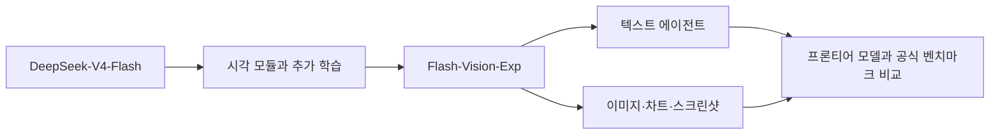
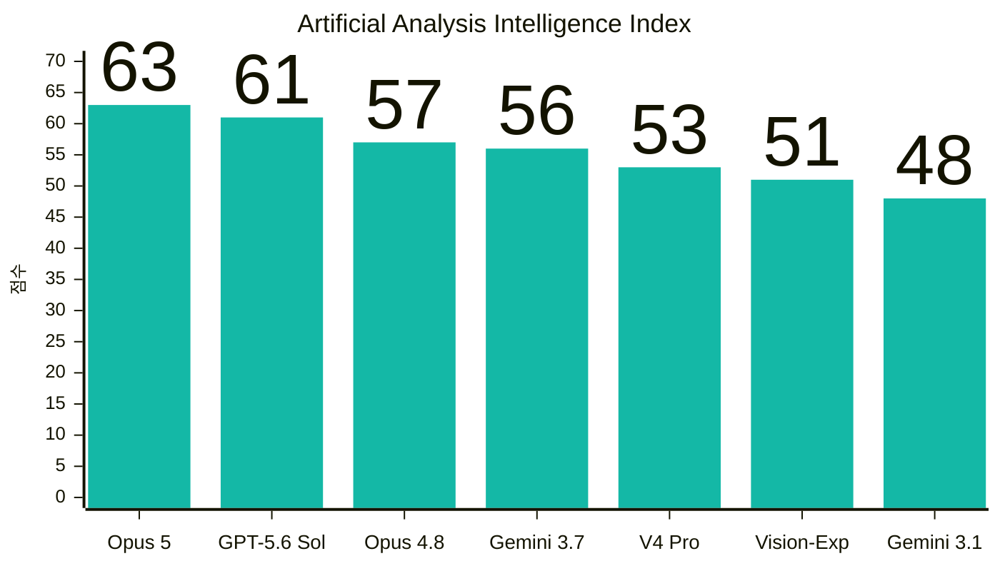

title: "DeepSeek-V4-Flash-Vision-Exp 해부: 프론티어 모델과 비교한 시각 에이전트와 로컬 구동의 현실"
slug: deepseek-v4-flash-vision-guide
category: 리서치
summary: "DeepSeek-V4-Flash-Vision-Exp의 공식 아키텍처·벤치마크·API 사양을 팩트체크하고, Claude Opus 5·GPT-5.6 Sol·Gemini 3.7 Flash 같은 프론티어 모델과의 위치를 구분해 살펴본다. 168GB급 체크포인트를 로컬에서 돌리기 위한 메모리·하드웨어·비용도 현실적으로 계산했다."
tags: deepseek,deepseek-v4,vision-language,multimodal,moe,opus-48,local-llm,mlx,vllm,research
toc: true
publishedAt: 2026-08-31T11:31:18.579061Z
updatedAt: 2026-08-31T13:10:35.690345Z
syncHash: bfedfa49aa7d9dbe4dcdc961b39e8f1c16c327a1b29708e64ad7dcae7374eba0

---

> **한 줄 결론:** `DeepSeek-V4-Flash-Vision-Exp`는 “Opus-4.8을 그대로 대체하는 305B 로컬 모델”이 아니다. 공식 비교표의 일부 텍스트·멀티모달 에이전트 벤치마크에서 Opus-4.8에 근접하거나 앞선 **실험용 오픈 가중치 모델**이며, 현재 프론티어인 Claude Opus 5·GPT-5.6 Sol·Gemini 3.7 Flash와 비교할 때도 오픈 가중치와 로컬 실행이라는 차별점이 있다. 실제 체크포인트는 약 168GB이고, 현재 공식 레퍼런스 경로는 CUDA 기반 멀티 GPU다.

이 글은 [DeepSeek-AI의 공식 Hugging Face 저장소](https://huggingface.co/deepseek-ai/DeepSeek-V4-Flash-Vision-Exp)와 [DeepSeek 공식 API 문서](https://api-docs.deepseek.com/news/news260821/)를 기준으로 원문에 있던 숫자와 표현을 다시 확인한 결과다. 가격은 2026년 8월 31일 확인값 또는 그 시점의 하드웨어 가격을 사용했으며, 모델·클라우드·환율 가격은 바뀔 수 있다.

## 1. 먼저 결론부터: “Opus-4.8급”은 선별된 벤치마크에 대한 표현이다

DeepSeek는 2026년 8월 21일 `DeepSeek-V4-Flash-Vision-Exp`를 API에 추가했다. 이름의 `Exp`는 실험용 멀티모달 모델이라는 뜻에 가깝다. DeepSeek 공식 설명에 따르면 이 모델은 기존 `DeepSeek-V4-Flash`의 텍스트·에이전트·추론 능력을 유지하면서 시각 모듈과 추가 학습을 더한 버전이다.

공식 발표가 말하는 핵심은 두 가지다.

- 텍스트 에이전트 능력은 공식 `DeepSeek-V4-Flash`와 비교 가능한 수준이다.
- 시각 입력이 필요한 에이전트 벤치마크에서는 V4-Flash보다 크게 좋아져 Opus-4.8에 가까워졌다.

따라서 이 글에서 말하는 “Opus-4.8급”은 **모든 작업에서 Opus-4.8과 동급이라는 뜻이 아니라, 공식 표에 제시된 일부 에이전트 벤치마크의 점수가 그 주변에 있다는 뜻**으로 제한한다. 모델 카드에 없는 독립 재현, 장기 사용 품질, 한국어 품질, 실제 로컬 속도까지 보장하는 표현은 아니다. 또 Opus-4.8은 현재 시장의 유일한 기준점이 아니라 DeepSeek가 선택해 공개한 비교 기준이다. 현재 시점의 상용 프론티어까지 함께 봐야 이 모델의 위치를 제대로 해석할 수 있다.



## 2. 공식 사양을 다시 고정하면 305B가 아니라 285B급이다

원문은 모델을 305B로 소개했지만, DeepSeek의 공식 V4 모델 카드와 V4 기술 문서는 Flash를 **총 285B 파라미터, 토큰당 13B 활성 파라미터**로 설명한다. 저장소의 `config.json`에는 256개의 라우팅 전문가와 토큰당 6개 전문가 선택이 명시되어 있다.

| 항목 | 공식 확인값 | 의미 |
|---|---:|---|
| 모델 | `DeepSeek-V4-Flash-Vision-Exp` | V4-Flash 기반 실험용 멀티모달 모델 |
| 총 파라미터 | 약 285B | MoE 전체 가중치 규모 |
| 활성 파라미터 | 약 13B/token | 한 토큰 계산에 참여하는 경로의 규모 |
| 라우팅 전문가 | 256개 | `config.json` 기준 |
| 토큰당 선택 전문가 | 6개 | `num_experts_per_tok = 6` |
| 최대 컨텍스트 | 1,048,576 tokens | 모델 설정상의 상한 |
| 비전 인코더 | 32 layers · 1,024 dim | 저장소 설정 기준 |
| 이미지 토큰 상한 | 최대 384 tokens | API에서는 이미지 과금 토큰도 최대 384로 안내 |
| 공개 라이선스 | MIT | 저장소의 가중치·코드 라이선스 |
| 모델 파일 | 48개 safetensors 샤드 | 인덱스 메타데이터 기준 |

여기서 총량과 활성량을 혼동하면 안 된다. MoE라서 토큰당 계산량은 줄지만, 전문가 가중치 전체를 로드해야 한다. “13B 모델처럼 13B만큼의 메모리로 실행된다”는 뜻이 아니다.

또 하나 중요한 사실은 이 저장소가 일반적인 Q4 모델이 아니라는 점이다. `config.json`은 전문가 가중치에 `fp4`, 나머지 양자화 설정에 FP8 계열을 사용한다고 기록한다. `model.safetensors.index.json`의 `total_size`는 **167,811,372,792 bytes**, 즉 약 **167.8GB(156.3GiB)다**. 그러므로 원문의 “Q4_K_M·MLX 4bit 모델 165GB”라는 표현은 이 공식 체크포인트의 사양으로 쓰기 어렵다.

## 3. 공식 벤치마크에서 실제로 Opus-4.8과 얼마나 가까운가

아래는 공식 모델 카드에 함께 제시된 수치다. 괄호 안의 차이는 `Flash-Vision-Exp - Opus-4.8`이다. 현재 공개된 유사급 모델을 뒤에서 함께 언급하되, 동일한 조건의 공식 표가 없는 모델에 임의의 점수를 붙이지는 않는다.

| 영역 | 벤치마크 | Flash-Vision-Exp | Opus-4.8 | 차이 |
|---|---|---:|---:|---:|
| 텍스트 에이전트 | Terminal Bench 2.1 | 83.9 | 85.0 | -1.1 |
| 텍스트 에이전트 | NL2Repo | 57.7 | 69.7 | -12.0 |
| 텍스트 에이전트 | Cybergym | 75.3 | 78.3 | -3.0 |
| 텍스트 에이전트 | DeepSWE | **59.3** | 58.0 | **+1.3** |
| 텍스트 에이전트 | Toolathlon-Verified | 75.9 | 76.2 | -0.3 |
| 텍스트 에이전트 | DSBench-Hard | 63.6 | 71.7 | -8.1 |
| 텍스트 에이전트 | AutomationBench (Public) | 25.7 | 27.2 | -1.5 |
| 멀티모달 에이전트 | ApexBench (Pass@1) | 36.5 | 39.4 | -2.9 |
| 멀티모달 에이전트 | Agents' Last Exam | **27.3** | 25.7 | **+1.6** |
| 멀티모달 에이전트 | Chartography | 64.3 | 65.0 | -0.7 |
| 멀티모달 에이전트 | ZeroBench (Pass@5) | **35.0** | 34.0 | **+1.0** |

텍스트 쪽에서는 DeepSWE, Toolathlon, Terminal Bench가 특히 눈에 띈다. 멀티모달 쪽에서는 Agents' Last Exam과 ZeroBench가 Opus-4.8보다 높고, Chartography는 거의 비슷하다. 반면 NL2Repo·DSBench-Hard·ApexBench처럼 차이가 분명한 항목도 있다.

그래서 공식 표에서 정직하게 말할 수 있는 결론은 다음 정도다.

> **DeepSeek-V4-Flash-Vision-Exp는 일부 텍스트·멀티모달 에이전트 평가에서 Opus-4.8과 경쟁할 수 있는 오픈 가중치 모델이다. 하지만 전체 능력을 Opus-4.8과 동급이라고 단정할 수는 없다.**

이 결론은 어떤 측정표를 보느냐에 따라 더 선명해진다. DeepSeek의 자체 표에서는 특정 에이전트 과제에서 Opus-4.8과 비슷하거나 앞선다. 반면 여러 모델을 같은 방법론으로 다시 측정한 [Artificial Analysis Intelligence Index v4.1.1](https://artificialanalysis.ai/methodology/intelligence-benchmarking)에서는 Vision-Exp가 **51점**, Opus-4.8이 **57점**이다. 즉 “선별된 시각 에이전트 과제에서 근접”이라는 주장과 “범용 프론티어 종합 점수에서 동급”이라는 주장은 서로 다른 문장이다.

### 벤치마크를 읽을 때의 세 가지 주의점

첫째, 점수의 종류가 다르다. `Pass@1`과 `Pass@5`가 섞여 있고, 각 벤치마크의 문제 구성과 성공 판정도 다르다. 서로 다른 행의 점수를 평균 내어 하나의 종합 점수로 만들면 안 된다.

둘째, DeepSeek 모델의 텍스트 에이전트 평가는 공식 문서에 따라 DeepSeek Harness minimal mode, max reasoning effort, `temperature=1.0`, `top_p=0.95` 조건으로 진행됐다. 이 표는 공식 모델 카드의 비교표이지, 제3자가 동일한 하네스·동일한 비용·동일한 반복 횟수로 재현한 독립 대결표는 아니다.

셋째, `DeepSeek-V4-Flash-0731`의 ApexBench와 Agents' Last Exam 점수에는 멀티모달 요소를 무시한 텍스트 전용 비교라는 주석이 붙어 있다. 따라서 이 행을 Vision-Exp와 동등한 시각 모델 대 시각 모델의 변화량으로 읽어서는 안 된다.

### 3-1. 이름이 아니라 점수로 본 현재 프론티어 모델 지도

DeepSeek의 공식 표가 Opus-4.8을 기준으로 삼았다고 해서, 이 모델을 오늘의 상용 모델 전체와 이미 동일 선상에서 검증했다는 뜻은 아니다. 그래서 2026년 8월 31일 확인한 **Artificial Analysis Intelligence Index v4.1.1**의 공통 점수를 함께 보자. 이 지수는 에이전트·코딩·과학적 추론·일반 지식 영역의 9개 평가를 가중합하며, 점수가 높을수록 좋다. 다만 주로 텍스트 기반 지수라서 Vision-Exp의 이미지 이해력을 단독으로 측정하는 표는 아니다.

| 모델(평가 설정) | Intelligence Index | 출력 속도 | 지수 산출 비용/작업 | 이미지 입력 | 가중치 |
|---|---:|---:|---:|---|---|
| **Claude Opus 5 (max)** | **63** | 52.7 tok/s | $2.34 | 지원 | 비공개 |
| **GPT-5.6 Sol (max)** | **61** | 78.8 tok/s | $0.95 | 지원 | 비공개 |
| **Claude Opus 4.8 (max)** | **57** | 56.7 tok/s | $2.03 | 지원 | 비공개 |
| **Gemini 3.7 Flash (high)** | **56** | 315.3 tok/s | $0.40 | 지원 | 비공개 |
| **DeepSeek-V4-Pro (max)** | **53** | 54.1 tok/s | $0.27 | 미지원 | **공개** |
| **DeepSeek-V4-Flash-Vision-Exp (max)** | **51** | 108.7 tok/s | $0.12 | **지원** | **공개(HF)** |
| **Gemini 3.1 Pro Preview** | **48** | 114.7 tok/s | $0.33 | 지원 | 비공개 |



이 차트의 원자료는 [Artificial Analysis Intelligence Index v4.1.1](https://artificialanalysis.ai/evaluations/artificial-analysis-intelligence-index)다. 이 지수는 모델 제공사가 발표한 공식 성적표가 아니라, Artificial Analysis가 9개 평가를 독립적으로 실행해 0~100 범위로 합성한 **제3자 종합 지표**다. [공식 방법론](https://artificialanalysis.ai/methodology/intelligence-benchmarking)에 따르면 에이전트·코딩·일반 능력·과학적 추론 네 범주를 각각 25%씩 반영하며, 일부 모델을 10회 이상 반복한 실험을 바탕으로 95% 신뢰구간을 ±1% 이내로 추정한다. 따라서 같은 버전 안에서 모델의 상대적 위치를 비교하는 데는 유용하지만, 비전 전용 평가도 아니고 모든 사용 사례의 절대 순위를 보장하는 지표도 아니다. 버전과 평가 구성이 바뀌면 점수도 달라질 수 있으므로 이 글에서는 **v4.1.1, 2026년 8월 31일 확인값**으로 고정했다.

출력 속도와 작업당 비용은 모델의 본질적인 능력 점수가 아니라 Artificial Analysis가 각 모델의 API를 측정한 운영 지표다. 비용은 각 모델의 입력·캐시·추론·출력 토큰 사용량을 반영한 지수 평가 비용이며, DeepSeek 공식 가격표의 단순 `1M tokens` 단가와 일치하지 않을 수 있다. Artificial Analysis 페이지는 이 모델명을 `DeepSeek V4 Flash Vision`으로 줄여 표기하지만, DeepSeek가 공개한 실제 API·Hugging Face 모델명은 `DeepSeek-V4-Flash-Vision-Exp`다. 이 표의 핵심은 **범용 종합 지수에서 Vision-Exp가 51점으로 V4-Pro 53점과 가까우며, Opus-4.8 57점·Opus 5 63점보다는 낮다**는 점이다.

> **읽는 법:** Artificial Analysis 지수는 모델 간 비교에 유용하지만 비전 전용 점수가 아니다. Vision-Exp의 가장 큰 강점인 이미지·차트·스크린샷 이해는 아래 DeepSeek 공식 멀티모달 에이전트 표와 함께 읽어야 한다. 두 표의 수치를 평균 내거나 하나의 순위로 합치면 안 된다.

이제 이름만 보고 “Opus급”이라고 부를 이유는 줄어든다. **Claude Opus 5와 GPT-5.6 Sol은 종합 지수 상단, Gemini 3.7 Flash는 약간 낮은 종합 점수 대신 압도적인 출력 속도, DeepSeek-V4-Pro는 공개 가중치 모델 중 같은 계열의 상위선, Vision-Exp는 그보다 2점 낮지만 이미지 입력을 추가한 실험 모델**로 읽을 수 있다. DeepSeek의 공식 표에 있는 시각 에이전트 강점과 Artificial Analysis의 종합 점수를 함께 보면, Vision-Exp의 정확한 포지션은 “상용 최상위 모델 전체를 대체하는 모델”이 아니라 **일부 시각·도구 과제에서 경쟁력을 보이는 공개 가중치 모델**이다.

비교 질문별로 답할 수 있는 범위도 나눠야 한다.

| 비교 질문 | 현재 말할 수 있는 것 |
|---|---|
| DeepSeek 공식 표에서 Opus-4.8과 비교하면? | 위의 11개 벤치마크 수치로 직접 비교 가능 |
| 여러 모델을 같은 공통 지표로 비교하면? | Artificial Analysis Index 기준 63·61·57·56·53·51·48의 상대적 위치를 확인 가능 |
| Claude Opus 5·GPT-5.6 Sol·Gemini와 시각 에이전트 과제에서 누가 우위인가? | 공통 비전 전용 표가 없어 단일 순위를 만들 수 없음 |
| 로컬에서 가중치를 내려받아 수정·검증할 수 있는가? | 이 글의 대상인 Vision-Exp는 가능. 나머지는 상용 API 모델 |
| 이미지·코딩·도구 호출을 실제 서비스에 넣을 때 무엇이 중요한가? | 벤치마크보다 입력 유형, 도구 성공률, 지연시간, 비용, 데이터 반출 정책을 별도 측정해야 함 |

모델별 강점도 점수와 함께 읽으면 명확해진다. **Claude Opus 5**는 63점으로 가장 높고 장시간 코딩·전문 에이전트에 강한 상용 기준점이다. **GPT-5.6 Sol**은 61점으로 범용 이미지·코딩·리서치 흐름을 겨냥한다. **Gemini 3.7 Flash**는 56점이지만 측정 출력 속도 315.3 tok/s로 처리량이 매우 높다. **Gemini 3.1 Pro**는 48점으로 복잡한 멀티모달 문제 풀이의 비교 대상이다. **DeepSeek-V4-Pro**는 53점의 공개 가중치 텍스트 모델로 V4 가족의 상한을 보여주고, **Flash-Vision-Exp**는 51점에 이미지 입력을 더해 로컬 비전 에이전트 후보가 된다.

다만 상용 모델의 공식 포지셔닝은 벤치마크 승패와 동일하지 않다. OpenAI는 GPT-5.6 Sol을 복잡한 전문 작업용 플래그십으로, Google은 Gemini 3.7 Flash를 복잡한 에이전트 작업을 대규모로 처리하는 모델로 설명한다. Anthropic의 Opus 5는 Opus-4.8 이후의 최신 상위 계열이다. 이는 각 회사가 제시한 사용처를 정리한 것이며, DeepSeek의 표와 동일한 조건에서 재실행한 점수가 아니다.

## 4. 무엇이 새로워졌나: MoE보다 긴 문맥을 위한 시스템 설계가 핵심이다

V4 계열의 공식 기술 문서는 단순히 전문가 수를 늘린 모델로 설명하지 않는다. 핵심은 다음 세 층이 함께 움직인다는 데 있다.

### 4-1. MoE: 전체 가중치는 크고, 토큰별 계산 경로는 좁다

256개 전문가 중 토큰마다 6개를 선택하고, 공유 전문가 경로도 둔다. 덕분에 285B 전체 모델을 저장하면서도 매 토큰의 연산량은 활성 파라미터 기준으로 줄일 수 있다. 하지만 로컬 추론에서 가장 먼저 부딪히는 벽은 연산량이 아니라 **가중치 전체를 담을 메모리**다.

### 4-2. CSA와 HCA: KV 캐시를 줄이는 하이브리드 어텐션

V4 기술 문서는 Compressed Sparse Attention(CSA)와 Heavily Compressed Attention(HCA)을 결합한 하이브리드 어텐션을 소개한다. 긴 입력을 다룰 때 과거 토큰의 Key/Value를 그대로 보관하는 대신 압축과 선택적 접근을 활용해 KV 캐시와 토큰당 추론 비용을 줄이는 방향이다.

이 설계 덕분에 V4의 “1M 컨텍스트”는 단순한 마케팅 숫자보다 기술적으로 의미가 있다. 다만 컨텍스트 상한 1M은 **모델이 지원하는 최대 길이**이고, 모든 로컬 런타임·배치 크기·KV 정밀도에서 1M을 쾌적하게 사용할 수 있다는 보증은 아니다.

### 4-3. mHC, DFlash, DSpark: 이름보다 구현 경로를 봐야 한다

V4 모델 카드는 기존 residual 연결을 개선하는 **Manifold-Constrained Hyper-Connections**(mHC)와 Muon optimizer를 주요 변경점으로 소개한다. mHC를 “그래디언트 소실을 해결한 고밀도 연결”이라고 단정하기보다는, residual mapping을 제약된 매니폴드에 두어 신호 전달 안정성과 표현력을 함께 노린 설계라고 설명하는 편이 정확하다.

Vision-Exp 저장소의 공식 레퍼런스 구현에는 비전 인코더·얼라이너, DFlash 경로, MoE, Hyper-Connections, 그리고 `Transformer.forward_spec()`를 통한 DSpark 경로가 포함되어 있다. 그러나 저장소 문서에는 “항상 2.5~3배 빠르다” 또는 “100+ tok/s를 보장한다”는 일반적인 성능 수치가 없다. DSpark가 존재한다는 사실과 특정 장비에서의 배속을 분리해서 써야 한다.

## 5. 로컬에서 돌릴 수 있나? 가능하지만 “맥에서 바로 실행”은 아니다

이 모델은 API 전용 모델이 아니다. Hugging Face 저장소에 MIT 라이선스의 가중치와 인코딩·추론 코드가 함께 공개되어 있고, 공식 레퍼런스는 다음 흐름을 제공한다.

1. 48개 safetensors 샤드를 다운로드한다.
2. `inference/convert.py`로 모델 병렬도에 맞는 체크포인트를 만든다.
3. `torchrun`으로 여러 프로세스를 띄워 생성한다.
4. TXT 태그 방식 또는 OpenAI 스타일 JSON 메시지로 이미지를 포함한다.

공식 예시는 `MP=4`인 4-way 모델 병렬을 사용한다.

```bash
python -m pip install -r inference/requirements.txt

export HF_CKPT_PATH=/path/to/DeepSeek-V4-Flash-Vision-Exp-HF
export SAVE_PATH=/path/to/DeepSeek-V4-Flash-Vision-Exp-TP4
export CKPT_PATH="${SAVE_PATH}"
export MP=4

python inference/convert.py \
  --hf-ckpt-path "${HF_CKPT_PATH}" \
  --save-path "${SAVE_PATH}" \
  --n-experts 256 \
  --model-parallel "${MP}" \
  --expert-dtype fp4

INPUT_FILE=examples/example_vl.txt MP=4 inference/run.sh
```

여기서 중요한 제한이 있다. 공식 `inference/generate.py`는 `torch.cuda.set_device()`와 `torch.device("cuda")`를 사용하고, requirements에도 `tilelang`과 CUDA 계열 커널을 포함한 CUDA 지향 의존성이 들어 있다. 따라서 **MPS에서 공식 명령 그대로 실행하는 경로는 문서화되어 있지 않다.** MLX나 GGUF 파일도 공식 Vision-Exp 저장소가 제공하는 형식이 아니다.

커뮤니티의 llama.cpp·MLX 포트가 생기더라도 그것은 별도의 변환·커널·비전 어댑터 검증 문제다. 텍스트 전용 V4-Flash용 포트가 있다고 해서 `Flash-Vision-Exp`의 이미지 입력까지 자동으로 지원하는 것은 아니다.

## 6. 로컬 메모리 요구량을 숫자로 계산해보자

우선 다운로드 파일만 보자.

```text
공식 safetensors total_size = 167,811,372,792 bytes
                     ≈ 167.8 GB (decimal)
                     ≈ 156.3 GiB
```

이 값은 모델 가중치 파일 크기다. 실제 실행에는 런타임 버퍼, 활성화, 토크나이저, 이미지 전처리, KV 캐시, 운영체제 메모리가 추가된다. 특히 변환 단계에서는 원본 체크포인트와 변환 결과가 동시에 존재할 수 있으므로, 저장장치는 168GB만 비워서는 부족하다. 다운로드와 변환까지 한 번에 진행한다면 **최소 350GB 이상, 가능하면 500GB급 여유 공간**을 잡는 편이 안전하다. 정확한 peak는 MP와 런타임 구현에 따라 달라진다.

### 메모리 티어별 판단

| 구성 | 모델 메모리 합계 | 167.8GB 가중치 대비 여유 | 현실적인 판단 |
|---|---:|---:|---|
| 64GB Mac / 48GB 단일 GPU | 48~64GB | 부족 | 공식 체크포인트 전체 로드 불가 |
| 128GB 통합 메모리 | 128GB | 부족 | 가중치만으로도 모자람 |
| 192GB 메모리 풀 | 192GB | 약 24.2GB | 가중치 적재의 이론적 하한, 실행 여유가 작음 |
| 256GB 통합 메모리 | 256GB | 약 88.2GB | 메모리만 보면 현실적인 후보, 공식 Apple 실행 경로는 별도 |
| 2×96GB GPU | 192GB VRAM | 약 24.2GB | TP/backend가 맞으면 가능성, 긴 컨텍스트에는 빡빡함 |
| 4×141GB H200 | 564GB VRAM | 약 396.2GB | 엔터프라이즈급 여유, 비용·전력·서버 구성이 문제 |

192GB가 “된다”와 192GB가 “쾌적하다”는 다르다. 2×96GB GPU는 가중치를 담고도 약 24GB만 남는다. 여기에 CUDA allocator와 런타임 버퍼, KV 캐시가 들어가므로 1M 컨텍스트·다중 동시 요청까지 기대하면 안 된다. 반대로 256GB는 메모리 예산상 한 단계 편하지만, Apple Silicon에서 이 모델을 공식 레퍼런스처럼 실행할 수 있다는 뜻은 아니다.

또한 4×24GB RTX 4090은 합계 96GB라서 부족하다. 8×24GB라야 숫자상 192GB가 되지만, 8-way PCIe 섀시·전원·냉각·모델 병렬 구현을 함께 해결해야 한다. 단순히 GPU VRAM 숫자만 더해 “집에서 돌릴 수 있다”고 쓰기에는 현실적인 비용과 구성이 다르다.

## 7. 어떤 하드웨어가 필요하고, 가격은 어느 정도인가

### 7-1. Apple Silicon: 256GB가 메모리 후보지만 공식 실행은 미확인

현재 Apple Korea의 신형 Mac Studio는 M5 Ultra에서 256GB 또는 512GB 통합 메모리 구성을 제공한다. M5 Ultra Mac Studio 시작가는 **₩9,490,000**이고, Apple 구성 화면에서 96GB 기본 구성에서 256GB로 올리는 메모리 옵션은 **+₩6,800,000**으로 표시된다. 단순 계산으로 256GB 구성은 약 **₩16,290,000부터**로 볼 수 있으며, SSD와 기타 옵션은 별도다. 512GB 옵션은 2026년 10월 말 출시 예정이며 확인 시점에 가격이 고정되어 있지 않았다.

이 시스템은 167.8GB 가중치와 실행 여유를 담을 수 있는 메모리 후보라는 의미다. 그러나 공식 Vision-Exp 레퍼런스가 CUDA를 전제로 하므로, M5 Ultra를 산다고 곧바로 이 저장소의 `torchrun` 명령을 실행할 수 있는 것은 아니다. Apple용 MLX 포트와 비전 커널이 별도로 준비되어야 한다.

### 7-2. NVIDIA: 2×96GB는 최소 후보, 카드 가격만 4천만 원대

NVIDIA RTX PRO 6000 Blackwell Workstation Edition은 카드 한 장에 96GB GDDR7 ECC를 제공한다. 국내 가격 비교 사이트에서 2026년 8월 말 확인한 최저가는 약 **₩22,131,260**이었다. 두 장이면 GPU만 약 **₩44,262,520**이고, 600W 카드 두 장을 담을 메인보드·전원·케이스·냉각 비용은 포함되지 않는다.

2×96GB는 192GB라서 가중치 파일을 담을 수 있는 가장 설명하기 쉬운 NVIDIA 후보지만, 24GB 남짓한 여유가 충분하다고 볼 수 없다. TP2가 해당 구현에서 안정적으로 작동하는지, FP4 커널과 Vision-Exp 입력 경로가 모두 지원되는지는 실제 설치한 backend 버전으로 확인해야 한다. “2×RTX PRO 6000이면 1M 컨텍스트까지 쾌적”이라고 약속할 수 있는 공식 측정치는 없다.

H200처럼 141GB급 데이터센터 GPU를 여러 장 쓰면 메모리 여유는 크게 늘어난다. 하지만 이 단계는 개인용 PC라기보다 서버·클라우드 영역이다. 실제 구매비는 GPU 수급, 서버 섀시, 네트워크, 전력 계약에 따라 크게 달라지므로 이 글에서는 임의의 서버 구매가를 단정하지 않는다.

### 7-3. 가격을 API와 비교하면 결론이 달라진다

이미지 입력이 가끔 필요한 개인 개발자라면 하드웨어를 사는 것보다 공식 API가 훨씬 싸다. DeepSeek 공식 가격표에서 `deepseek-v4-flash-vision-exp`는 V4-Flash와 같은 가격으로 안내된다.

| 과금 항목 | Off-peak | Peak |
|---|---:|---:|
| 입력 · cache hit / 1M tokens | $0.007 | $0.014 |
| 입력 · cache miss / 1M tokens | $0.22 | $0.44 |
| 출력 / 1M tokens | $0.66 | $1.32 |

이미지는 최대 384 토큰까지 과금 토큰으로 환산된다. 따라서 입력 1M 토큰(cache miss)과 출력 1M 토큰을 한 번씩 사용하면 **$0.88(off-peak) 또는 $1.76(peak)다**. 1달러를 1,400원으로 단순 환산하면 약 **1,232원 또는 2,464원**이다. 입력 10M·출력 10M이어도 약 **12,320원 또는 24,640원** 수준이다.

물론 API에는 네트워크와 데이터 반출이라는 대가가 있다. 반대로 로컬은 초기 하드웨어 비용과 전력·소음·업데이트 비용을 먼저 낸다. 가끔 쓰는 비전 에이전트라면 API, 매일 대량으로 처리하거나 데이터 반출이 불가능한 조직이라면 로컬을 검토하는 식으로 계산하는 것이 맞다.

## 8. API로 먼저 확인하는 최소 호출

공식 API는 OpenAI 호환 Chat Completions, Anthropic 호환 Messages, Responses API를 지원한다. 이미지 입력은 `user` 메시지에 섞어 보내며 JPEG·PNG·GIF·WebP를 지원한다.

```python
import base64
from openai import OpenAI

client = OpenAI(
    api_key="<DEEPSEEK_API_KEY>",
    base_url="https://api.deepseek.com",
)

with open("screenshot.png", "rb") as f:
    image = base64.b64encode(f.read()).decode("utf-8")

response = client.chat.completions.create(
    model="deepseek-v4-flash-vision-exp",
    messages=[{
        "role": "user",
        "content": [
            {"type": "text", "text": "이 화면의 오류와 레이아웃 문제를 설명해줘."},
            {"type": "image_url", "image_url": {
                "url": f"data:image/png;base64,{image}"
            }},
        ],
    }],
)

print(response.choices[0].message.content)
```

큰 이미지를 반복해서 사용할 때는 Files API로 한 번 업로드하고 `file_id`를 참조할 수 있다. 공식 문서의 제한은 base64·외부 URL 기준 요청 본문 48MiB, 단일 이미지 32MiB, Files API의 `file_id` 이미지 64MiB, 요청당 최대 600장이다. 이 제한은 로컬 모델의 VRAM 요구량과는 별개의 API 입력 제한이다.

## 9. 로컬 도입을 결정할 때의 선택표

| 상황 | 추천 | 이유 |
|---|---|---|
| M1/M2/M3/M4 64GB 맥에서 이미지·코딩을 가끔 사용 | API | 공식 체크포인트가 메모리에 들어가지 않음 |
| 128GB Mac에서 단일 사용자 로컬 모델을 원함 | 다른 모델 또는 포트 대기 | 167.8GB 가중치보다 메모리가 작음 |
| 256GB Apple Silicon을 이미 보유 | 커뮤니티 포트 검증 후 실험 | 메모리는 후보지만 공식 CUDA 경로와 다름 |
| 2×RTX PRO 6000을 조립할 수 있음 | backend 검증용 실험 | 192GB는 적재 가능성이 있지만 여유와 호환성이 관건 |
| 여러 사용자·긴 문맥·상시 에이전트 | H200/B200급 서버 또는 클라우드 | 메모리·대역폭·운영 안정성 필요 |
| 이미지 입력이 적고 API 반출이 허용됨 | DeepSeek API | 초기 비용이 압도적으로 낮음 |

이 모델을 “로컬에서 돌릴 수 있다”고 말할 수 있는 기준은 세 가지다.

1. 가중치 전체와 런타임 버퍼를 담을 메모리가 있어야 한다.
2. `deepseek_v4`의 FP4/FP8 혼합 가중치와 MoE·DFlash·Vision 경로를 지원하는 실행 엔진이 있어야 한다.
3. 1M 컨텍스트를 실제로 쓸 경우 KV 캐시·TTFT·decode 속도를 별도로 측정해야 한다.

셋 중 첫 번째만 만족하는 하드웨어를 보고 “지원한다”고 쓰면 안 된다. 특히 Apple Silicon은 unified memory가 크다는 장점이 있지만, CUDA 전용 레퍼런스와 Apple용 커널은 별개의 문제다.

## 10. 원문에서 고친 팩트체크 목록

| 원문 표현 | 보완한 판단 |
|---|---|
| 305B 모델 | 공식 V4 자료 기준 Flash는 약 285B total / 13B active |
| 토큰당 6개 전문가 | `config.json`에 있어 유지 |
| Opus-4.8과 대등 | 일부 공식 벤치마크에서 근접·초과, 전체 동급으로는 표현하지 않음. 현재 비교 맥락에는 Claude Opus 5·GPT-5.6 Sol·Gemini 3.7 Flash·Gemini 3.1 Pro도 추가 |
| DFlash가 초경량 KV 캐시 | 구현 경로는 확인되지만 일반 배속·메모리 수치는 공식 근거가 부족해 완화 |
| DSpark 2.5~3배, 100+ tok/s | 공식 저장소에 일반 보장 수치가 없어 삭제 |
| FP16 610GB / 4bit 165GB / 3bit 95GB | 공식 Vision-Exp 체크포인트는 혼합 FP4/FP8, 파일 총량 167.8GB |
| GGUF·MLX 호환 | 공식 저장소가 제공하는 것은 CUDA 지향 PyTorch 레퍼런스이며, 포트는 별도 검증 대상 |
| 64GB REAP 변형 | 이 저장소의 공식 배포물·공식 실행 경로가 아니므로 본문 핵심 사양에서 제외 |
| 1M 컨텍스트면 192GB에서 쾌적 | 최대 길이와 실제 런타임 여유·동시성은 별개라 보수적으로 표현 |

## 11. 마치며: 가장 현실적인 사용법은 “API로 검증하고, 로컬은 프로젝트로 접근”하는 것

DeepSeek-V4-Flash-Vision-Exp의 진짜 뉴스는 305B라는 숫자가 아니다. 텍스트 에이전트 모델에 시각 입력을 붙였고, 공식 표에서 일부 코딩·도구·시각 에이전트 평가를 Opus-4.8 주변까지 끌어올렸다는 점이다. MIT 라이선스 가중치와 최소 추론 코드까지 공개했으므로 연구자가 구조를 들여다볼 수 있는 문도 열려 있다. 동시에 Opus-4.8은 공식 비교의 기준점일 뿐이고, 현재 시장에는 Claude Opus 5·GPT-5.6 Sol·Gemini 3.7 Flash·Gemini 3.1 Pro처럼 각기 다른 강점을 가진 상용 프론티어가 있다는 점도 함께 봐야 한다.

하지만 로컬 사용자의 관점에서는 현실이 분명하다. 체크포인트는 약 168GB이고, 13B 활성 파라미터라는 설명만으로 메모리 요구량이 작아지지 않는다. 64GB 맥에서 바로 실행할 모델은 아니며, 256GB Apple Silicon은 메모리 후보일 뿐 공식 실행 경로가 아니다. NVIDIA 쪽도 2×96GB는 최소 후보에 가깝고, 실제 안정적인 서비스는 더 많은 VRAM과 서버급 실행 환경을 필요로 한다.

그래서 현재의 추천은 단순하다.

- 이미지를 가끔 보고 코딩 에이전트를 쓰려면 API부터 검증한다.
- 데이터 반출이 어렵거나 대량 호출이 지속되면 로컬 하드웨어 비용과 전력비를 계산한다.
- 로컬 실험을 한다면 “모델 적재 성공”을 “1M 컨텍스트 서비스 가능”과 혼동하지 않는다.
- Opus-4.8 비교표는 공식 벤치마크의 범위 안에서만 인용한다. Claude Opus 5·GPT-5.6 Sol·Gemini 3.7 Flash·Gemini 3.1 Pro와의 직접 순위는 동일 조건의 공개 자료가 생긴 뒤에 별도 검증한다.
- 실제 제품 선택은 모델 이름보다 자신의 이미지·코드·도구 호출 테스트, 지연시간, 비용, 데이터 반출 정책으로 결정한다.

## 참고 자료

- [DeepSeek-V4-Flash-Vision-Exp 공식 Hugging Face 모델 카드](https://huggingface.co/deepseek-ai/DeepSeek-V4-Flash-Vision-Exp)
- [Vision-Exp 공식 `config.json`](https://huggingface.co/deepseek-ai/DeepSeek-V4-Flash-Vision-Exp/blob/main/config.json)
- [Vision-Exp 공식 safetensors 인덱스](https://huggingface.co/deepseek-ai/DeepSeek-V4-Flash-Vision-Exp/blob/main/model.safetensors.index.json)
- [DeepSeek V4 모델 카드](https://fe-static.deepseek.com/chat/transparency/deepseek-V4-model-card-EN.pdf)
- [DeepSeek-V4 기술 보고서, arXiv:2606.19348](https://arxiv.org/abs/2606.19348)
- [DeepSeek-V4-Flash-Vision-Exp 출시 공지](https://api-docs.deepseek.com/news/news260821/)
- [DeepSeek Vision API 가이드](https://api-docs.deepseek.com/guides/vision/)
- [DeepSeek 모델·가격표](https://api-docs.deepseek.com/quick_start/pricing)
- [Artificial Analysis Intelligence Index 방법론](https://artificialanalysis.ai/methodology/intelligence-benchmarking)
- [Artificial Analysis — DeepSeek V4 Flash Vision 측정 결과](https://artificialanalysis.ai/models/deepseek-v4-flash-vision)
- [Artificial Analysis — Claude Opus 5 측정 결과](https://artificialanalysis.ai/models/claude-opus-5)
- [Artificial Analysis — GPT-5.6 Sol 측정 결과](https://artificialanalysis.ai/models/gpt-5-6-sol)
- [Artificial Analysis — Gemini 3.7 Flash 측정 결과](https://artificialanalysis.ai/models/gemini-3-7-flash)
- [Artificial Analysis — DeepSeek V4 Pro 측정 결과](https://artificialanalysis.ai/models/deepseek-v4-pro)
- [Artificial Analysis — Gemini 3.1 Pro Preview 측정 결과](https://artificialanalysis.ai/models/gemini-3-1-pro-preview)
- [Artificial Analysis — Claude Opus 4.8 측정 결과](https://artificialanalysis.ai/models/claude-opus-4-8)
- [OpenAI GPT-5.6 공식 발표](https://openai.com/index/gpt-5-6/)
- [OpenAI 모델 문서](https://developers.openai.com/api/docs/models)
- [Anthropic 공식 뉴스룸 — Claude Opus 5](https://www.anthropic.com/news)
- [Anthropic API 출시 노트](https://platform.claude.com/docs/en/release-notes/overview)
- [Google Gemini API 변경 이력 — Gemini 3.7 Flash GA](https://ai.google.dev/gemini-api/docs/changelog?authuser=6)
- [Google DeepMind Gemini 모델 개요](https://deepmind.google/models/gemini/)
- [Apple Korea Mac Studio 출시 가격 안내](https://www.apple.com/kr/newsroom/2026/08/apple-introduces-new-mac-studio-with-m5-max-and-m5-ultra/)
- [NVIDIA RTX PRO 6000 Blackwell 공식 사양](https://www.nvidia.com/content/dam/en-zz/Solutions/data-center/rtx-pro-6000-blackwell-workstation-edition/workstation-blackwell-rtx-pro-6000-workstation-edition-nvidia-us-3519208-web.pdf)
- [RTX PRO 6000 Blackwell 국내 가격 비교](https://prod.danawa.com/info/?pcode=108418646)
