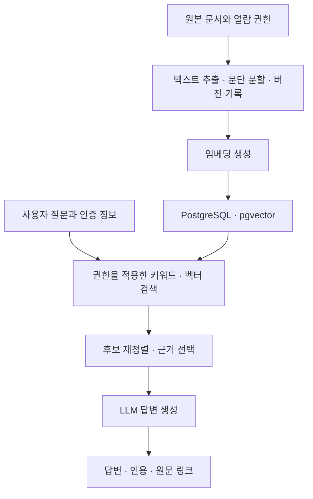
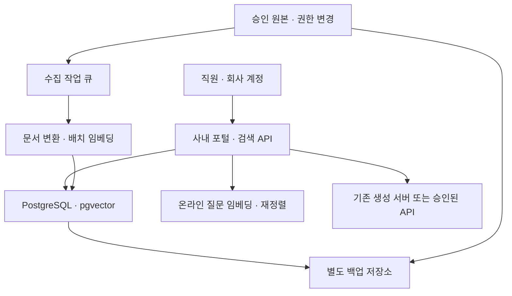

title: 기업용 RAG 도입 가이드: 업무 활용부터 PostgreSQL 구성·비용까지
slug: enterprise-rag-postgresql-pgvector-cost
category: 리서치
tags: rag,postgresql,pgvector,enterprise,search,tco
summary: 우리 회사에 RAG가 필요한지 판단하고, 업무 활용에서 PostgreSQL·pgvector 구성, 서버 사양과 예산, 검수까지 연결하는 가이드. 사내 챗봇·작성 보조 사례와 예산별 구축 범위를 함께 살펴본다.
syncHash: d018986d271d6cb7ca067e109f815717bbeb5b12d090f89b5dffbe6abaeeff2c
publishedAt: 2026-09-10T07:16:09.020854Z

---

회사 규정을 찾으려고 폴더와 위키를 오가고, 고객에게 답하려고 제품 매뉴얼을 다시 읽는다. 자료를 찾았어도 최신 버전인지, 예외 조건은 없는지 확인해야 한다. 이런 검색과 확인을 업무 안에서 돕는 방법으로 RAG를 검토할 수 있다.

사내 LLM 서버를 샀다고 이 과정이 자동으로 해결되지는 않는다. 회사 문서를 찾아 모델에 전달하고, 사용자가 열람할 수 있는 근거인지 확인하며, 개정된 문서로 답하게 만드는 일이 남는다.

**PostgreSQL과 pgvector로 기업용 RAG를 만들 수 있다.** 기존 PostgreSQL 운영 경험을 활용할 수 있고, 문서 정보와 검색용 벡터를 함께 관리할 수 있다. 다만 pgvector는 벡터 저장·검색을 맡는 확장이다. 문서 변환, 임베딩 생성, 사용자 인증, 답변 생성까지 자동으로 완성해 주는 제품은 아니다. [pgvector 공식 문서](https://github.com/pgvector/pgvector)

이 글은 2026년 9월 10일 확인한 공식 문서를 바탕으로, 도입 담당자가 **구축 범위와 견적 요청서의 초안**을 만들 수 있도록 작성했다. 아래 구성·예산·합격선은 제안 예시이며 자체 성능 실측이나 시장 평균 견적이 아니다. 실제 발주 전에는 회사 문서와 계정으로 검증해야 한다.

장비·모델 선택은 [기업용 로컬 LLM 예산별 구매 가이드](/72/sme-local-llm-budget-30tps), 도입 절차와 공급사 비교는 [요구사항부터 PoC·견적·발주까지](/71/enterprise-local-llm-procurement-playbook)에서 이어진다. 이 글의 비용은 그 장비값에 무조건 더하는 고정 요금이 아니라, 기존 견적에 포함되었는지 확인할 **RAG 구축·운영 항목**이다.

이 글은 **필요한 업무를 고르고 → 사용 흐름을 정하고 → 시스템을 구성한 뒤 → 사양·비용을 계산하고 → 검증 결과로 도입을 결정하는 순서**로 읽는다. 사내 챗봇은 그 시스템을 사용하는 한 가지 창구이며, 검색 화면이나 기존 업무의 작성 보조 기능에도 같은 구성을 적용할 수 있다.

## 1. 우리 업무에 RAG가 필요한지 먼저 판단한다

### RAG는 질문할 때 필요한 자료를 찾아 모델에 전달한다

RAG는 Retrieval-Augmented Generation의 약자다. 예를 들어 직원이 “올해 바뀐 출장 숙박비 한도는?”이라고 물으면, 시스템이 최신 출장 규정에서 관련 부분을 찾고 모델이 그 내용을 근거로 답하도록 한다. 좋은 답변에는 금액뿐 아니라 적용 대상, 시행일, 예외와 원문 링크가 함께 있어야 한다.

작업은 두 흐름으로 나뉜다. 문서를 미리 준비하는 작업과 질문이 들어왔을 때 답하는 작업이다.



임베딩은 문장이나 문서 조각을 검색에 쓸 숫자 배열로 바꾸는 과정이다. 비슷한 의미의 질문과 자료를 찾는 데 사용한다. 답변을 쓰는 생성 모델과 역할이 다르므로, 생성 모델을 교체한다고 반드시 모든 문서를 다시 임베딩해야 하는 것은 아니다.

| 방식 | 맡기는 일 | 먼저 확인할 한계 |
|---|---|---|
| 일반 LLM 대화 | 초안·요약·일반 지식 응답 | 회사 최신 문서와 권한을 스스로 알지 못함 |
| 긴 문서를 직접 첨부 | 사용자가 고른 문서에 대한 일회성 작업 | 매번 자료 선택·전송이 필요하고 문서가 길면 비용·지연 증가 |
| RAG | 많은 문서 중 근거를 찾아 답변 | 검색 누락·문서 오류·권한 처리를 별도로 해결해야 함 |
| 파인튜닝 | 특정 출력 형식·업무 행동을 학습 | 수시로 바뀌는 사실과 문서별 접근권한의 저장소로 삼기 어려움 |
| 구조화 데이터 조회 | 주문 상태·재고·집계처럼 정확한 값 조회 | 승인된 조회 API·SQL과 데이터 권한이 필요함 |

“이번 달 매출 합계”를 문서 조각의 유사도로 계산해서는 안 된다. 집계는 검증된 데이터 조회로 처리하고, RAG는 매출 정의나 회계 지침의 근거를 설명하는 데 붙인다. 반대로 문서 하나만 반복해서 읽는 업무라면 복잡한 검색 시스템보다 문서 첨부 기능이 충분할 수 있다.

문서에 근거한 안내나 작성이 반복되는 업무라면 다음 단계에서 활용 범위를 고른다. 단순 조회나 문서 첨부로 충분한 업무까지 같은 시스템으로 묶을 필요는 없다.

## 2. 실제 업무에서 자료를 찾고 검토하는 흐름을 정한다

### 부서별로 답해야 할 질문과 금지할 행동을 먼저 정한다

첫 구축 범위를 “전사 지식 검색”으로 잡으면 문서 종류와 권한 예외가 한꺼번에 늘어난다. 아래처럼 업무 하나를 먼저 고르고, 답을 검토할 현업 담당자를 정한다.

| 부서·업무 | 첫 대상 문서와 질문 | 답변에 꼭 필요한 정보 | 초기 범위에서 제외할 일 |
|---|---|---|---|
| 인사·총무 | 공개 사규, 휴가·출장 FAQ | 시행일, 적용 대상, 예외, 원문 조항 | 개인 급여·평가 자료, 승인 자동 실행 |
| 고객지원 | 승인된 제품 매뉴얼, 해결 사례 | 모델명·제품 버전, 근거, 추가 확인 질문 | 미검수 답변의 고객 자동 발송 |
| 영업 | 최신 제안 자료, 제품 사양 | 문서 개정일, 사양 출처, 확인되지 않은 항목 | 고객별 비공개 계약의 부서 간 공유 |
| 개발·IT | 운영 절차, 장애 기록, 내부 기술 문서 | 서비스·버전, 명령의 전제, 근거 링크 | 검색 문서에 적힌 명령의 무승인 실행 |
| 구매·품질 | 승인 규격, 검사 기준, 계약 양식 | 적용 품번, 유효 버전, 예외 규정 | 원문 없는 적합 판정·계약 확정 |

문서 담당자에게는 “자료를 모두 보내 달라”보다 다음 네 가지를 요청한다. 현재 유효한 원본 위치, 폐기·중복 여부, 열람 가능 그룹, 대표 질문과 정답 근거다. 이 정보가 없는 상태에서는 검색 엔진을 바꿔도 오래된 자료와 잘못된 권한이 함께 검색된다.

### RAG를 기존 업무의 어느 위치에 붙일지 정한다

RAG가 반드시 독립된 대화 서비스일 필요는 없다. 직원이 이미 쓰는 화면에서 자료를 찾거나 문장을 작성하는 순간에 연결할 수 있다. 먼저 사용 위치를 정하면 필요한 UI·연동과 검수 책임도 구체화된다.

| 사용 방식 | 실제 업무에 붙이는 위치 | 사람이 확인할 결과 |
|---|---|---|
| 근거 검색 | 포털·위키 검색 결과에 관련 조항과 요약 표시 | 원문·시행일·적용 조건 |
| 작성 보조 | 고객지원 화면에서 문의를 읽고 답변 초안 생성 | 고객 상황과 근거가 맞는지 검토 |
| 문서 작업 지원 | 제안서·보고서 작성 중 승인 자료에서 근거 문단 추천 | 인용과 주장, 고객별 자료 권한 |
| 사내 챗봇 | 사규·매뉴얼을 질문하고 후속 조건 확인 | 근거와 예외, 추가 문의 필요 여부 |
| 업무 절차 보조 | 장애 대응·검수 화면에서 관련 절차 제시 | 현재 상황에 적용할 수 있는지 판단 |

질문을 자유롭게 받는 챗봇은 범용 창구가 될 수 있지만, 제품·버전이 이미 선택된 상담 화면은 검색 조건을 더 명확하게 전달할 수 있다. 어떤 방식이든 권한과 근거 검사는 유지한다. UI를 새로 만드는 비용과 기존 업무 화면에 연결하는 비용은 각각 견적을 받는다.

### 대표 업무 세 가지를 질문부터 검수까지 따라간다

아래는 실제 구축 실적이 아닌 **서비스 설계를 위한 가상 업무 사례**다. 사례의 목표는 RAG가 맡을 부분과 사람이 판단할 부분, 필요한 연동을 구체화하는 것이다.

#### 고객지원은 제품 버전에 맞는 초안을 사람이 검토한다

상담원이 “AB-120S, 펌웨어 2.4에서 E17 오류가 발생했다”고 입력한다. RAG는 해당 제품·버전의 승인 매뉴얼과 해결 사례를 검색한다. 이름이 비슷한 AB-120의 절차를 섞지 않도록 제품 식별자를 먼저 확인한다.

답변은 증상 확인 질문, 근거가 있는 점검 순서, 중단하고 전문가에게 넘길 조건으로 나눈다. 매뉴얼에 없는 조치나 위험한 초기화 명령을 새로 만들지 않는다. 상담원이 근거와 고객 상황을 확인한 뒤 고객에게 전달하고, 수정한 이유를 남긴다.

| 기존 업무 | 도입 후 흐름 | 비교할 지표 |
|---|---|---|
| 폴더와 위키에서 제품 문서 찾기 | 제품·버전 조건으로 근거 후보 제시 | 올바른 매뉴얼을 찾는 시간 |
| 여러 페이지를 읽고 답변 작성 | 인용을 포함한 점검 초안 제공 | 검토·수정까지 포함한 답변 준비 시간 |
| 문서가 없으면 동료에게 문의 | 부족한 정보와 담당자 전달 항목 정리 | 잘못된 확답률, 재문의·재처리 비율 |

고객의 주문·보증 상태까지 답하려면 CRM·주문 API를 별도로 연결해야 한다. 제품 매뉴얼 RAG만 만든 견적에 그 기능이 포함되었다고 보지 않는다. 고객 자동 발송은 상담원 보조 단계에서 품질을 확인한 뒤 별도의 승인·운영 범위로 검토한다.

#### 인사·총무는 반복 문의에서 적용 조건을 확인한다

직원이 “이번 달 부산 출장 숙박비는 얼마까지 되나요?”라고 질문한다. 챗봇은 출장 일자와 적용 대상이 불명확하면 먼저 확인한다. 그다음 해당 시점의 국내 출장 규정과 예외 조항을 찾아 안내한다.

가상 규정에 일반 숙박비 한도가 1박 10만원이고 초과액은 사전 승인이 필요하다고 적혀 있다고 가정하자. 답변은 “가상 규정의 일반 기준은 1박 10만원이다. 초과 숙박은 사전 승인 조건을 확인해야 한다”처럼 기준·조건을 나누고, 근거 조항과 시행일을 붙인다. 실제 서비스에는 회사가 승인한 문서의 값을 사용한다.

| 단계 | 챗봇과 직원의 동작 | 실패 시 처리 |
|---|---|---|
| 조건 확인 | 출장 일자·국내외·적용 대상을 확인 | 필요한 조건만 되묻기 |
| 규정 검색 | 유효 규정과 예외를 함께 선택 | 개정본이 충돌하면 담당자 확인 안내 |
| 답변 확인 | 한도·예외·원문 링크를 제시 | 근거에 없는 개인 승인 여부는 확정하지 않음 |
| 업무 연결 | 직원이 결재 절차로 이동 | 신청 기능이 없으면 안내와 실행을 구분 |

현업 검수자는 같은 질문을 개정 전후 날짜, 예외 대상, 불명확한 조건으로 바꿔 시험한다. 효과는 반복 문의의 자체 해결 비율, 직원의 원문 확인 시간, 총무의 재설명 시간을 측정한다. 잘못된 규정 안내가 줄었는지도 함께 본다.

#### IT 헬프데스크는 절차 안내와 실제 조치를 구분한다

직원이 “VPN이 연결되지 않는다”고 물으면 OS, 오류 코드, 발생 시점을 확인하고 해당 환경의 승인된 절차를 찾는다. 공개 장애 공지가 있다면 함께 제시한다. 과거 장애 보고서에서 원인을 찾았다는 이유만으로 현재도 같은 장애라고 단정하지 않는다.

해결되지 않으면 오류 코드와 이미 수행한 점검을 정리해 티켓 초안을 만든다. 티켓 등록 API가 연결되어 있다면 직원이 전송할 내용과 첨부 로그를 확인한 뒤 등록한다. 비밀번호나 비밀키를 대화창으로 받지 않으며, 비밀번호 초기화·계정 권한 부여는 검증된 별도 절차로 연결한다.

검수에서는 오래된 OS 안내, 다른 부서 전용 운영 문서, 존재하지 않는 오류 코드, 접수 API 실패를 포함한다. 성공 여부는 안내 횟수보다 티켓 전 자체 해결률, 해결 시간, 잘못된 조치 안내와 중복 티켓 수로 판단한다.

세 사례 모두 업무 담당자가 정답 근거와 실패 사례를 제공해야 한다. IT팀은 인증·검색·운영을 담당하고, 현업은 문서 승인과 답변 채점을 담당한다. 개발 완료 뒤에도 문서의 소유자가 없으면 답변의 최신성을 유지하기 어렵다.

### 사내 챗봇은 직원이 쓰는 창구이고 RAG는 근거를 찾는 방식이다

사내 챗봇은 직원이 회사 계정으로 접속해 질문하고 업무 지원을 받는 서비스다. 사내 포털의 대화창으로 만들 수도 있고, 회사가 쓰는 메신저에 연결할 수도 있다. RAG는 그 안에서 회사 문서를 찾아 답변의 근거를 제공하는 방식이다. 따라서 챗봇 화면을 설치한 것과 사내 지식 검색을 구축한 것은 서로 다른 완료 조건이다.

예를 들어 같은 대화창에도 “이 문장을 다듬어 줘”, “출장 규정 알려 줘”, “내 휴가 잔여 일수 알려 줘”, “휴가 신청해 줘”가 들어온다. 네 요청에 필요한 기능은 다르다.

| 직원의 요청 | 연결할 기능 | 서비스가 확인할 조건 |
|---|---|---|
| 문장 다듬기·초안 작성 | 일반 생성 모델 | 외부 전송 여부, 입력 가능한 자료 범위 |
| 회사 규정·매뉴얼 질문 | 권한을 적용한 RAG | 유효 문서, 근거, 예외, 원문 접근 |
| 내 잔여 휴가·주문 상태 조회 | 인증된 업무 API | 본인·담당 고객 권한, 조회 시각 |
| 휴가 신청·티켓 등록 | 업무 API와 승인 흐름 | 실행 전 내용 확인, 중복 방지, 처리 결과 |

첫 버전은 “사내 문서에 근거해 안내하는 챗봇”으로 범위를 명시하는 편이 시작하기 쉽다. 개인 데이터 조회와 업무 실행은 필요한 시스템 연동을 각각 추가한다. 문서를 읽을 수 있다는 이유로 ERP·HR 시스템에 접근하거나 처리할 권한이 생기지는 않는다.

직원 화면에는 답변 외에 **근거 문서·개정일·원문 열기·잘못된 답변 신고·담당자 문의**가 있어야 한다. 자료가 부족하면 어느 조건이 빠졌는지 되묻고, 확인할 수 없는 내용은 구분해서 표시한다. 일반 지식 답변으로 전환하는 경우에도 회사 규정에 근거한 답처럼 보이게 해서는 안 된다.

| 화면·운영 기능 | 직원 또는 담당자가 하는 일 | 납품 때 확인할 결과 |
|---|---|---|
| 로그인·대화 범위 | 사내 계정으로 접속, 제품·부서 범위 선택 | 선택한 범위와 실제 열람 권한이 함께 적용됨 |
| 답변·인용 | 근거 문장을 확인하고 원문으로 이동 | 해당 버전·페이지가 열리고 권한을 재확인함 |
| 후속 질문 | “그럼 해외 출장은?”처럼 이어 질문 | 앞선 조건을 확인하되 검색과 권한 검사를 새로 수행함 |
| 피드백·담당자 연결 | 오류 신고, 해결되지 않은 문의 전달 | 질문·근거 ID·수정 사유가 담당자에게 연결됨 |
| 문서 관리 | 승인 문서 등록·개정·폐기 | 검색 반영 상태와 실패 사유를 확인할 수 있음 |
| 운영 화면 | 갱신 지연·실패·권한 오류 확인 | 미반영 문서와 조치할 작업을 찾을 수 있음 |

대화 기록의 보존 기간과 열람자를 정한다. 직원의 피드백은 개선 후보로 수집하고, 검수 없이 정답이나 학습 데이터로 자동 승격하지 않는다. 답변을 수정할 권한, 원본 문서를 승인할 권한, 시스템을 운영할 권한도 분리한다.

이제 서비스의 창구보다 뒤에서 공통으로 필요한 기능을 볼 차례다. 고객지원 사례에서 제품·버전에 맞는 근거를 찾고 초안을 검토하려면 어떤 데이터와 처리 과정이 있어야 하는지 연결한다.

## 3. 업무 흐름을 PostgreSQL 기반 시스템으로 구성한다

문의에서 제품·버전을 확인하는 일은 검색 조건이 되고, 승인 매뉴얼을 찾는 일은 문서 적재·검색이 된다. 근거를 붙여 초안을 만드는 일은 생성 계층이 맡는다. 자료를 볼 수 있는 사람과 유효한 버전을 유지하는 일은 전체 과정에 걸친 운영 조건이다.

### PostgreSQL 구성에서는 역할을 여덟 가지로 나눈다

다음은 기존 사내 인증과 LLM 서버를 재사용하는 출발 구성이다. 제품 목록보다 각 역할의 책임과 장애 처리가 중요하다.

| 구성요소 | 하는 일 | 견적에서 확인할 산출물 |
|---|---|---|
| 원본 저장소 | 파일과 원본 버전 보관 | 원본 ID, 경로, 해시, 보존·삭제 정책 |
| 수집·변환 작업자 | 변경 감지, PDF·문서 추출, OCR | 지원 형식, 실패 목록, 재처리 화면 |
| 문단 분할·임베딩 | 검색할 단위와 벡터 생성 | 분할 규칙, 모델·리비전, 재색인 절차 |
| PostgreSQL·pgvector | 문서 메타데이터·벡터 저장과 조회 | 스키마, 인덱스, 백업, 용량·부하 측정 |
| 검색 API | 사용자 권한 적용, 검색 후보 결합 | 인증 연결, 검색 로그, 제한시간 |
| 재정렬기 | 질문과 후보 근거의 관련성 재평가 | 사용 여부별 품질·지연·비용 비교 |
| 생성 모델 | 선택된 근거로 답변 작성 | 인용 방식, 근거 부족 응답, 출력 제한 |
| 운영·평가 기능 | 갱신 상태·오류·품질 추적 | 대시보드, 평가셋, 복구·인계 문서 |

애플리케이션 DB를 이미 쓰더라도 첫 실험부터 운영 주문·결제 DB에 대량 임베딩 작업을 넣지는 않는다. 별도 테스트 DB에서 검색, 적재, 백업을 함께 실행해 부하를 확인한다. 같은 PostgreSQL 기술을 사용하면서 RAG 인스턴스만 분리하는 선택도 가능하다.

생성 모델은 로컬 또는 API를 선택할 수 있다. 임베딩과 OCR도 별도로 로컬·외부 서비스 여부를 정한다. **생성만 로컬이어도 외부 임베딩 API로 원문을 보내면 완전한 사내 처리는 아니다.** 데이터 흐름도에 원문·질문·검색 근거·로그가 어느 서버를 거치는지 표시한다.

### 문서 변환과 분할이 검색 품질의 출발점이다

PDF를 읽을 수 있다는 말과 회사 PDF의 표·각주·다단 구성을 정확하게 추출한다는 말은 다르다. 스캔본은 OCR이 필요하고, 암호화 파일·깨진 폰트·회전 페이지는 별도 실패 사례가 된다. Docling 같은 문서 변환 도구를 후보로 삼을 수 있지만, HWP·HWPX를 포함한 회사 입력 형식은 실제 파일로 지원 범위와 변환 결과를 확인해야 한다. [Docling 공식 문서](https://docling-project.github.io/docling/)

| 문서 문제 | 처리 방향 | 검수 방법 |
|---|---|---|
| 표에서 행·열이 섞임 | 제목·열 이름·단위가 함께 남도록 변환 | 원본 표와 추출 결과를 행 단위로 대조 |
| 머리말·꼬리말이 반복 검색됨 | 반복 영역 제거, 본문과 분리 | 상위 검색 결과에 잡음이 들어가는지 확인 |
| 한 조항의 예외가 다음 페이지에 있음 | 제목 경로와 인접 문단 연결 | 원칙과 예외를 함께 묻는 질문 사용 |
| 같은 문서가 여러 폴더에 있음 | 원본 ID·해시·유효 버전 관리 | 중복 근거가 검색 후보를 채우는지 확인 |
| 개정 전후 규정이 공존 | 시행일·폐기 상태·조회 기준일 기록 | 현재 질문과 과거 시점 질문을 분리 시험 |
| OCR 숫자가 틀림 | 낮은 신뢰 문서 검수·격리 | 금액·날짜·품번을 원본과 비교 |

청크는 검색할 문서 조각이다. 처음에는 제목과 조항을 유지하는 분할을 기준으로 삼고, 짧은 조각과 긴 조각을 평가셋에서 비교한다. 고정 토큰 수 하나를 모든 문서의 정답으로 쓰지 않는다. 작은 조각은 정확한 위치를 찾기 쉽지만 조건이 잘릴 수 있고, 큰 조각은 문맥을 보존하지만 불필요한 내용과 입력 토큰이 늘어난다.

최소 메타데이터는 `document_id`, `version_id`, `chunk_id`, 제목 경로, 페이지 또는 문단 위치, 원문 링크, 시행일, 수집 시각, 열람 그룹, 임베딩 설정 ID다. 원문 링크는 모델이 문자열로 지어내게 하지 않고, 검색 결과의 ID를 서버에서 실제 링크로 변환한다.

### 임베딩 모델은 생성 모델과 따로 평가한다

생성 모델이 최신이라는 이유만으로 검색 임베딩까지 결정하지 않는다. 한국어 사규, 영문 매뉴얼, 품번·오류 코드가 섞인 회사 질문으로 비교해야 한다. 공개 모델의 점수는 후보를 줄이는 자료이고, 우리 자료에서 정답 근거를 찾는지는 별도 결과다.

예를 들어 BGE-M3는 공식 모델 카드에 다국어 지원과 1,024차원 출력을 명시한 공개 후보다. 아래 용량 계산에서는 이 차원을 예시로 사용한다. 최신·최고 모델이라는 추천은 아니며, 실제 선택 때는 모델 사용권과 배포 방식도 확인한다. [BGE-M3 공식 모델 카드](https://huggingface.co/BAAI/bge-m3)

문서와 질문에는 서로 호환되는 임베딩 설정을 사용한다. 차원 수가 같아도 다른 모델의 벡터를 섞으면 같은 의미 공간이라고 볼 수 없다. 모델 이름뿐 아니라 리비전, 정규화, 문서·질문 입력 형식, 분할 버전을 기록한다. 모델 교체는 새 벡터 집합을 만들고 평가한 다음 검색 대상을 전환하는 작업으로 견적에 포함한다.

임베딩 처리량은 최초 적재 시간에 영향을 주고, 질문 임베딩 지연은 매 요청에 영향을 준다. 같은 GPU에서 대량 적재와 답변 생성을 함께 실행한다면 업무 시간의 대기 증가도 측정한다. 재정렬기는 후보를 다시 읽으므로 후보 수에 따른 지연과 품질 개선을 함께 비교하고 채택한다.

### 벡터 검색과 키워드 검색을 함께 시험한다

“휴가 이월이 가능한가?”처럼 표현이 다른 질문은 의미 검색이 유용할 수 있다. “AB-120과 AB-120S의 차이”처럼 한 글자가 중요한 질문은 정확한 식별자를 보존하는 검색이 필요하다.

PostgreSQL에는 전문 검색 기능이 있고, `pg_trgm` 확장은 문자열 유사도 검색에 활용할 수 있다. 다만 이 기능을 설치했다고 한국어 형태소 분석이나 도메인 용어 처리가 자동으로 해결되지는 않는다. 품번은 별도 필드의 정확 일치, 문장은 의미 검색, 한국어 표현 변형은 실제 질의로 각각 검증한다. [PostgreSQL 전문 검색 문서](https://www.postgresql.org/docs/current/textsearch.html), [pg_trgm 문서](https://www.postgresql.org/docs/current/pgtrgm.html)

출발 실험은 다음처럼 구성할 수 있다. 숫자는 성능 보장이 아니라 비교할 초기 설정이다.

1. 권한이 허용된 자료에서 키워드 후보 20개와 벡터 후보 20개를 구한다.
2. 문서·청크 ID 기준으로 중복을 제거하고 순위를 결합한다.
3. 재정렬기 적용 전후를 비교한다.
4. 최종 근거 5개를 길이 제한 안에서 선택하고 필요한 인접 문단을 붙인다.
5. 근거가 부족하면 답변을 확정하지 않고 추가 질문이나 확인할 자료를 안내한다.

서로 단위가 다른 키워드 점수와 벡터 점수를 그대로 더하지 않는다. 순위 기반 결합인 RRF는 한 가지 출발점이다. 이 방식의 개념은 Microsoft의 공식 하이브리드 검색 문서에서도 설명한다. PostgreSQL 구성에서는 이러한 결합 로직을 앱이나 별도 검색 계층에서 구현·검증해야 한다. [RRF 설명](https://learn.microsoft.com/en-us/azure/search/hybrid-search-ranking)

유사도 0.8 같은 숫자를 “정답 확률 80%”로 표시하지 않는다. 점수 분포는 모델과 문서에 따라 달라지며, 답변 가능 여부의 기준은 정답이 있는 질문과 없는 질문으로 정한다.

### pgvector 검색은 정확 검색을 기준으로 성능을 비교한다

pgvector는 정확 최근접 검색과 HNSW·IVFFlat 근사 검색을 지원한다. 근사 인덱스는 속도와 검색 회수율의 절충이며, 인덱스를 추가하면 검색 결과가 달라질 수 있다. 코사인 거리에는 `<=>`와 이에 맞는 연산자 클래스를 사용한다. [pgvector 검색·인덱스 문서](https://github.com/pgvector/pgvector#querying)

처음에는 대표 데이터에서 정확 검색의 품질과 시간을 기록한다. 그다음 근사 인덱스를 적용해 동일 조건으로 비교한다. 여기서 **정확 검색도 업무 정답을 보장하지 않는다.** 저장된 벡터 중 가까운 것을 정확하게 찾는 것과, 그 문서가 질문의 정답 근거인 것은 별개다.

특히 부서·고객·권한 필터가 있으면 전체 데이터 검색보다 결과가 부족해질 수 있다. pgvector의 근사 인덱스에서는 필터가 인덱스 스캔 이후 적용될 수 있으며, iterative scan은 추가 탐색을 돕지만 설정 한도가 있다. 필터가 좁은 질문까지 시험하고 필요하면 탐색량·데이터 분리·인덱스 구성을 조정한다. [pgvector 필터링 문서](https://github.com/pgvector/pgvector#filtering)

납품 결과에는 DB·확장 버전, 벡터 차원, 인덱스 종류·설정, 필터별 대상 비율, 실행계획, 따뜻한 캐시와 재시작 후 지연을 남긴다. 읽기 시험만 하지 말고 문서 적재·삭제·백업 중 검색도 재현한다. 특정 장비에서 나온 초당 질의 수를 다른 데이터셋에 그대로 옮기지 않는다.

### 권한은 답변을 만든 뒤 가리는 방식으로 처리하지 않는다

검색 결과를 LLM에 모두 전달한 다음 화면에서 일부 인용만 숨기면 이미 비공개 내용이 생성 과정에 들어간 상태다. 권한이 없는 본문은 재정렬기와 생성 모델에 전달하지 않도록 설계한다. 키워드·벡터 양쪽 검색, 원문 열기, 대화 기록과 캐시까지 같은 원칙이 적용되어야 한다.

PostgreSQL RLS는 행 접근 정책을 적용하는 수단이다. 그러나 테이블 소유자는 일반적으로 정책을 우회하며, 슈퍼유저와 `BYPASSRLS` 역할도 우회한다. `FORCE ROW LEVEL SECURITY`만으로 모든 우회가 사라진다고 보면 안 된다. 실제 앱 연결 역할과 권한으로 시험해야 한다. [PostgreSQL 행 보안 문서](https://www.postgresql.org/docs/current/ddl-rowsecurity.html)

구현 검수에서는 다음 경로를 확인한다.

- 사용자·그룹 정보는 인증된 서버 세션에서 가져온다. 요청 본문의 부서 ID를 그대로 신뢰하지 않는다.
- 연결 풀에서 사용자별 상태가 다음 요청에 남지 않는지, 권한 정보가 없으면 접근이 차단되는지 확인한다.
- 검색 결과와 인용 링크를 다른 사용자에게 재사용하는 캐시에 권한·문서 버전 구분이 있는지 확인한다.
- 퇴사·부서 이동·공유 해제 뒤 기존 대화와 캐시를 통해 본문이 다시 노출되는지 시험한다.
- 검색 문서의 “앞선 지시를 무시하라” 같은 문장을 시스템 지시로 취급하지 않도록 하고, 문서 내용만으로 외부 전송·명령 실행을 허용하지 않는다.

벡터도 원문에서 파생된 회사 데이터로 취급한다. 원문만 지우고 청크·벡터·검색 로그·캐시를 방치하지 않도록 삭제 범위와 보존 기간을 정한다.

### 문서 수정과 삭제를 서비스 기능으로 만든다

최초 적재 성공보다 운영 중 개정 처리가 중요하다. 문서가 바뀌면 변경된 원본을 식별하고, 추출·분할·임베딩을 거쳐 검증된 새 버전을 검색에 반영해야 한다. 실패한 작업을 조용히 건너뛰면 사용자는 과거 규정으로 계속 답을 받는다.

권장 흐름은 새 버전을 준비 영역에 적재하고 검증한 뒤 활성 버전을 전환하는 것이다. 이전 버전 보존 여부는 회사 정책에 맞춘다. 재시도해도 같은 청크가 중복 생성되지 않도록 문서·버전·청크의 식별 규칙을 정하고, 실패 사유와 재처리 상태를 운영자가 볼 수 있게 한다.

| 사건 | 합의할 동작 | 시험할 내용 |
|---|---|---|
| 규정 개정 | 약속한 시간 안에 새 버전 검색 | 시행일·예외 조항·인용 링크가 함께 변경됨 |
| 문서 삭제 | 검색·캐시에서 제외 | 같은 질문과 이전 링크로 접근해도 차단됨 |
| 권한 회수 | 합의한 반영 시간 내 접근 차단 | 기존 대화·재검색·직접 원문 조회를 모두 검사 |
| 변환 실패 | 격리·알림·재처리 | 실패 건수와 미반영 문서가 운영 화면에 표시됨 |
| 모델 교체 | 새 인덱스 평가 후 전환 | 품질 회귀 때 이전 구성으로 복귀 가능 |

백업 대상에는 원본, 문서 메타데이터·권한, 벡터, 설정, 평가셋이 들어간다. 인덱스를 재생성할지 복구할지는 복구 시간과 비용을 보고 정한다. PostgreSQL의 백업 방식에는 덤프·파일 시스템 백업·연속 아카이빙 등이 있으므로 필요한 복구 시점과 시간에 맞춰 선택한다. [PostgreSQL 백업 문서](https://www.postgresql.org/docs/current/backup.html)

DB만 복원하고 원본과 권한은 다른 시점으로 남으면 서비스가 일관되지 않을 수 있다. 실제 복구 시험에서 원문 링크, 활성 문서 버전, 접근 차단까지 확인한다.

### PostgreSQL로 시작할지 전용 검색 시스템을 쓸지 판단한다

| 상황 | 우선 검토할 선택 | 비교 실험 |
|---|---|---|
| PostgreSQL 운영 인력이 있고 문서 메타데이터와 함께 관리 | PostgreSQL·pgvector | 실제 권한 필터를 넣은 검색 품질과 지연 |
| 기존 DB의 업무 트랜잭션이 중요 | 별도 PostgreSQL 인스턴스 | 적재·백업 중 기존 업무 영향, 분리 운영비 |
| 한국어 키워드·품번·복잡한 텍스트 검색이 핵심 | 검색 전용 엔진 병용 또는 대체 | 오탈자·띄어쓰기·정확 일치 질문별 회수율 |
| 벡터 검색의 분산 운영·격리가 중요 | 전용 벡터 DB도 후보에 포함 | 동일 데이터·필터·부하에서 비용과 운영 난도 |
| 운영 담당자가 부족하고 외부 저장 허용 | 관리형 구성 | 지역·보존 정책, 확장 버전, 복구, 월 비용 |

“몇 만 건을 넘으면 다른 DB”라는 고정 경계는 두지 않는다. 청크 수뿐 아니라 벡터 차원, 검색 동시성, 권한 필터 비율, 갱신량, 인덱스 메모리, 허용 지연이 함께 작용한다. DB 교체를 결정할 때는 **같은 문서와 같은 질문으로 측정한 결과**를 요구한다.

관리형 PostgreSQL이라면 선택한 요금제에서 pgvector 설치·버전 변경이 가능한지, 저장소·IOPS·백업이 어떻게 청구되는지도 확인한다. 자체 운영에서는 확장 설치와 업그레이드·복구를 담당할 사람을 정한다.

이 구성으로 필요한 역할이 정해지면 그다음은 자원과 비용이다. 문서 양만으로 서버를 고르지 않고, 질문 부하·갱신·운영 요구를 같은 시나리오에 넣어 계산한다.

## 4. 업무 규모에 맞춰 사양과 예산을 함께 잡는다

먼저 용량 계산과 공통 사양표로 비교 기준을 잡고, 세 예산 시나리오에서 업무 범위·서버 배치·초기 비용·제외 항목을 함께 읽는다. 공통 사양표는 자원을 비교하기 위한 것이고, 시나리오는 그 자원으로 무엇을 검증할지 정하는 도입안이다.

### 용량은 문서 파일 수보다 청크와 갱신량으로 계산한다

같은 1,000개 파일도 한 장짜리 공지와 500페이지 매뉴얼은 다르다. 대표 문서를 먼저 변환해 페이지 수, 추출 토큰, 청크 수, 실패율을 산출한 다음 전체 규모로 추정한다. 표·스캔본 비중을 별도로 기록한다.

float32 벡터의 숫자 데이터만 계산하면 `청크 수 × 차원 수 × 4바이트`다. 1,024차원을 가정하면 다음과 같다. **십진 단위이며 DB 전체 저장공간이나 RAM 요구량이 아니다.**

| 청크 수 | 벡터 숫자 데이터만의 크기 | 별도 계산할 항목 |
|---|---|---|
| 10만 개 | 약 409.6MB | 행·벡터 헤더, 본문, 메타데이터, 인덱스 |
| 100만 개 | 약 4.096GB | 위 항목과 WAL, 임시 공간, 복제·백업 |
| 1,000만 개 | 약 40.96GB | 위 항목과 재색인 중 구·신 버전 동시 보관 |

이 계산으로 GPU VRAM을 정할 수는 없다. GPU는 선택한 임베딩·재정렬·생성 모델과 동시 실행 조건을 따로 계산한다. DB는 실제 적재 결과에서 테이블·인덱스·WAL 증가량을 측정한다. 복제와 백업을 곱한 저장 비용, 재색인 중 여유 공간도 예산에 넣는다.

최초 적재 비용은 전체 입력량으로, 반복 비용은 신규·변경 문서량으로 추정한다. 청크 중첩과 재시도가 입력 토큰을 늘릴 수 있으며, 임베딩 모델을 바꾸면 전체 재처리가 필요할 수 있다.

### 서버 사양은 검색 계층과 모델 실행 계층을 따로 잡는다

“RAG 서버는 GPU 몇 장인가?”보다 먼저 앱·검색 DB·문서 처리·모델 실행을 나눈다. PostgreSQL의 벡터 검색에 생성 모델용 GPU를 직접 붙이는 구성이 기본은 아니다. 검색 계층은 CPU·RAM·디스크를, 임베딩·재정렬·생성 계층은 각 모델의 실행 자원을 산정한다.

아래는 이 글의 예산 시나리오에 연결하는 **필자의 초기 시험용 자원 배정안**이다. 공식 최소 사양이나 벤치마크 결과가 아니다. 기존 가상화 자원이나 임대 환경에서 먼저 확보하고 부하 시험 결과로 조정한다. CPU 세대·클럭·공유 호스트 경합·스토리지 성능에 따라 결과가 달라지므로 vCPU 수만 맞춘 서버를 동급으로 취급하지 않는다.

메모리·볼륨은 GiB·TiB 단위다. SSD 볼륨은 운영 데이터용 논리 용량이며 원본 저장소·백업·복제 공간은 별도다. 물리 디스크 구매 시에는 제조사의 TB 표시와 RAID 구성 후 사용 가능 용량으로 다시 산정한다.

| 연결할 예산 시나리오 | 앱·검색 API | PostgreSQL·pgvector | 문서 처리·임베딩 작업자 |
|---|---|---|---|
| 1,000만원 검증 | 앱·DB·작업자 합쳐 1대 | 공용 8 vCPU·RAM 32GiB·SSD 500GiB | 같은 서버에서 적재 시간을 분리, 생성 모델은 외부 계층 |
| 3,000만원 한 부서 | 1대: 4 vCPU·RAM 8GiB·SSD 100GiB | 1대: 8 vCPU·RAM 64GiB·SSD 1TiB | 1대: 8 vCPU·RAM 32GiB·SSD 200GiB |
| 10,000만원 여러 부서 | 2대: 각 4 vCPU·RAM 8GiB·SSD 100GiB | 주 DB 1대: 16 vCPU·RAM 128GiB·SSD 2TiB | 2대: 각 8 vCPU·RAM 32GiB·SSD 500GiB |

첫 행의 8 vCPU·32GiB는 서버 전체 자원이다. 각 구성요소에 동일하게 배정한다는 뜻이 아니다. 두 번째 행은 총 20 vCPU·104GiB RAM을 배정한 논리 구성이다. 필요한 최소 자원이라는 뜻은 아니므로, 실제 사용량이 작으면 더 작은 구성도 같은 시험으로 비교한다.

세 번째 행도 이 자원만으로 고가용성이 완성되는 것은 아니다. 필요하면 별도 장애 영역의 DB 대기 서버, 로드밸런서, 자동 전환과 복구 훈련을 추가한다. 백업 보존량과 원본 저장량은 대표 파일의 실제 크기로 별도 산정한다.

이 표는 뒤의 예산으로 새 물리 서버를 모두 살 수 있다는 뜻이 아니다. 기존 자원 재사용 여부를 표시하고 신규 구매라면 장비·설치·보증 견적을 초기 비용에 추가한다. 임대라면 시험 기간 비용과 월 반복비에 넣는다. 특히 기존 월 인프라비 예시 30만원은 배정액일 뿐, 위 사양의 시장 견적이 아니다.

#### 생성 모델과 임베딩의 GPU를 따로 판단한다

생성은 기존 사내 LLM 서버나 허용된 외부 API를 재사용하는 것이 이 글의 비용 기준이다. 새 GPU를 사야 한다면 다음 표를 **실행 가능성을 확인할 시험 후보**로 사용한다. 모델 크기만으로 한국어 업무 품질이나 동시 사용자 수를 보장할 수 없다.

| 모델 계층의 시험 후보 | 확보해 볼 실행 자원 | 통과해야 할 조건 |
|---|---|---|
| 기존 생성 API·사내 서버 재사용 | RAG 서버에 생성용 GPU 추가 없음 | 데이터 경로, 호출 제한, 긴 근거 입력 시 지연·비용 |
| BGE-M3 같은 임베딩 후보를 CPU로 실행 | 위 문서 작업자의 CPU·RAM에서 작은 배치로 시험 | 질문 임베딩 p95, 야간 적재 완료 시간 |
| 임베딩·재정렬을 별도 GPU로 실행 | VRAM 16~24GB급 단일 GPU를 임대 시험 후보로 비교 | 정확한 모델·정밀도·길이·배치에서 메모리와 지연 확인 |
| 8~14B급 dense 생성 모델의 4-bit 실행 | VRAM 24GB급 단일 GPU·호스트 RAM 64GiB를 시험 후보로 검토 | 지원 런타임, 한국어 근거 답변, 문맥 길이·동시 요청 부하 |
| 27~32B급 dense 생성 모델의 4-bit 실행 | VRAM 48GB급 단일 GPU·호스트 RAM 128GiB를 시험 후보로 검토 | 양자화 품질과 실제 적재량, KV 캐시·피크 대기 |

16~24GB는 임베딩의 필수 최소 VRAM이 아니다. 더 작은 자원으로 충분할 수 있고, 긴 입력·큰 배치·재정렬 동시 실행에서는 더 필요할 수 있다. CPU부터 측정해서 부족한 단계만 분리한다. GPU 용량이 같아도 연산 성능·메모리 대역폭·런타임 지원이 달라지므로 구매 명세에는 정확한 제품을 적는다.

생성 모델의 메모리는 가중치 외에 KV 캐시와 실행 여유 공간도 필요하다. 근거가 길어지거나 동시 요청이 늘면 여유가 줄어든다. vLLM 공식 문서도 KV 캐시 부족과 동시 배치 조정이 지연에 영향을 준다고 설명한다. [vLLM 최적화 문서](https://docs.vllm.ai/en/latest/configuration/optimization/)

첫 시험에서는 총 문맥 상한 8K토큰 안에 시스템 지시·대화·검색 근거·출력을 배정하고, 출력 최대 500토큰, 동시 요청 1건→2건→4건을 단계적으로 비교할 수 있다. 이는 시험 조건이며 실제 모델의 지원 문맥과 업무 요구에 맞춰 바꾼다. 기존 대화는 한없이 붙이지 않고, 근거를 줄였을 때 정답과 예외가 빠지지 않는지 평가한다.

이 VRAM 표는 dense 모델의 시험 범위다. MoE 모델의 활성 파라미터 수만 보고 같은 메모리 표에 대입하지 않는다. 생성 모델·실장비 후보는 [로컬 LLM 구매 가이드](/72/sme-local-llm-budget-30tps)와 함께 고르고, RAG 근거가 들어간 입력으로 다시 측정한다.

#### DB는 RAM 숫자만 키우기 전에 검색과 적재 부하를 본다

PostgreSQL 공식 문서는 전용 DB 서버에서 `shared_buffers`를 시스템 메모리의 약 25%로 시작하는 방안을 설명한다. 예를 들어 64GiB 전용 DB라면 16GiB를 출발점으로 검토할 수 있지만, 같은 서버에서 모델을 돌리는 구성에 그대로 적용하지 않는다. [PostgreSQL 자원 설정 문서](https://www.postgresql.org/docs/current/runtime-config-resource.html)

`work_mem`은 서버 전체의 한도가 아니라 정렬·해시 같은 작업마다 사용될 수 있다. 연결 수와 동시에 실행되는 작업을 함께 계산하고, DB 연결 풀·쿼리 제한시간·적재 작업 동시성을 설정한다. 검색이 느리다는 이유만으로 모든 메모리 설정을 높이지 않는다.

저장소는 SSD/NVMe 계열에서 실제 지연·IOPS·지속 쓰기를 비교하고, WAL·재색인 중 남는 공간을 측정한다. 서버 간 통신은 시험 환경에서 1Gbps급으로 시작해 전송 시간을 관찰할 수 있다. 대량 원본 전송·백업이 검색에 영향을 주면 시간대 분리와 더 높은 대역폭을 비교한다. 네트워크 숫자도 성능 보장은 아니다.

확장 여부는 병목으로 판단한다. 적재만 느리면 작업자를 늘리거나 배치를 조정하고, 검색의 디스크 대기가 크면 인덱스·메모리·저장소를 조사한다. 첫 토큰이 느리면 질문 임베딩·재정렬·생성 대기를 분해한다. 생성만 병목인데 DB 서버부터 키우지 않는다.

### 구축 예산은 장비값과 RAG 작업비를 구분한다

아래는 **부가세 별도, 단위 만원**인 가상 예산 배분이다. 시장 가격표나 외주 견적이 아니다. 기존 인증·원본 저장소·LLM 실행 환경을 재사용하고, 신규 대형 GPU 서버 구매는 제외한다. 내부 인력이 하는 작업도 공수로 기록한다. 실제 계약에서는 포함 기능·문서 난도·단가를 받아 이 표를 교체한다.

| 초기 RAG 예산 상한 (만원) | 문서 정리·수집·변환 (만원) | 검색·앱·권한 연결 (만원) | 평가·운영 인계 (만원) | 시험 인프라·호출비 (만원) | 예비비 (만원) |
|---|---|---|---|---|---|
| 1,000 | 250 | 350 | 200 | 100 | 100 |
| 3,000 | 700 | 1,100 | 600 | 300 | 300 |
| 10,000 | 2,500 | 3,500 | 2,000 | 1,000 | 1,000 |

장비 구매 글에서 이미 “앱·데이터·연동”에 잡은 금액과 중복 합산하지 않는다. 공급사 견적에 검색 구축이 포함되어 있다면 이 표는 포함 내역을 검토하는 용도로 사용한다. 외부 API를 쓰는 경우에는 최초 시험 호출비와 운영 호출비를 분리한다.

### 천만원은 한 업무의 가능성을 판단하는 데 쓴다

가상 범위는 총무 담당자 10명이 사용하는 공개 사규 검색이다. 텍스트 추출이 쉬운 승인 문서 최대 200개·총 2,000페이지, 수동 업로드, 대표 질문 60개를 상한으로 정한다. 페이지 수만으로 공수를 보장하지 않으며 표·스캔 비율을 사전 샘플로 확인한다.

기존 UI·인증을 재사용하고 한 공개 그룹의 자료로 시작한다. 목표는 근거와 인용이 있는 답변, 문서 교체, 검색 실패 분석이다. 개인별 권한 연동·복잡한 OCR·다수 커넥터·고가용성·24시간 지원은 별도 범위로 둔다. 결과물이 유용해도 곧바로 전사 운영 승인으로 해석하지 않는다.

이 범위의 자원 출발점은 앱·DB·문서 처리를 합친 8 vCPU·RAM 32GiB·SSD 500GiB 한 대와 기존 생성 서버다. 초기 배분은 문서 250만원, 검색·앱 350만원, 평가·인계 200만원, 시험 인프라 100만원, 예비비 100만원이다. 적재와 질문 처리를 시간대로 나누고, 동시 사용 확대는 측정 뒤 결정한다.

납품물은 변환 결과, 평가 질문·근거, 실행 가능한 구성, 실패 목록, 확대 시 추가 견적이다. 이 예산에서 해야 할 판단은 “어느 서버를 더 살까”보다 “이 문서와 업무에서 효과가 있는가”다.

### 3천만원은 한 부서가 운영할 수 있는 범위를 만든다

가상 범위는 고객지원 직원 30명, 승인 매뉴얼 최대 1,000개·총 10,000페이지, 원본 저장소 한 곳, 권한 그룹 세 개다. 피크는 로그인 인원이 아니라 **분당 6건의 질문 도착, 짧은 시간 최대 4건 동시 처리**로 따로 정의한다. 이는 검증 목표이며 특정 장비의 보장 처리량이 아니다.

PostgreSQL·pgvector를 검색 저장소로 사용하고 키워드 검색을 함께 시험한다. 하루 한 번 변경 문서를 반영하며, 권한 회수는 더 짧은 별도 목표로 관리한다. 평가 질문 150개, 실패 재처리, 인용 링크, 기본 대시보드, 백업 복구 시험을 포함한다.

자원은 앱 4 vCPU·8GiB·SSD 100GiB, DB 8 vCPU·64GiB·SSD 1TiB, 문서 작업자 8 vCPU·32GiB·SSD 200GiB로 나누어 시험한다. 초기 배분은 문서 700만원, 검색·앱 1,100만원, 평가·인계 600만원, 시험 인프라 300만원, 예비비 300만원이다. 기존 생성 서버에서 위 질문 부하를 통과하지 못하면 생성 계층의 비용을 추가한다.

일정 예시는 1주차 자료·권한·평가셋 확정, 2주차 적재와 검색, 3주차 답변·권한·갱신 시험, 4주차 현업 평가·인계다. 자료 승인과 SSO 연결이 준비되어 있다는 가정이다. 문서 정리가 지연되면 개발 기간과 별도로 재산정한다.

이 범위에서는 고객에게 자동 답변을 발송하지 않고 상담원이 검토한다. 구매 판단은 검색 점수뿐 아니라 기존 업무 대비 답변 준비 시간과 수정량을 함께 측정한다.

### 1억원은 여러 부서의 운영 책임과 변경 관리를 포함한다

가상 범위는 세 부서, 사용자 150명, 승인 문서 최대 5,000개·총 50,000페이지, 원본 시스템 두 곳이다. 계정별·그룹별 권한 동기화, 문서별 버전, 일부 OCR·표 검수, 평가셋 300개, 단계별 지연 추적과 복구 훈련을 포함한다. 이 규모 역시 장비 용량 보장이 아니라 견적의 입력 조건이다.

자원 출발점은 앱 두 대에 각각 4 vCPU·8GiB·SSD 100GiB, 주 DB 한 대에 16 vCPU·128GiB·SSD 2TiB, 작업자 두 대에 각각 8 vCPU·32GiB·SSD 500GiB다. 초기 배분은 문서 2,500만원, 검색·앱 3,500만원, 평가·인계 2,000만원, 시험 인프라 1,000만원, 예비비 1,000만원이다. 실제 피크 질문량을 먼저 정하고, 생성 계층·DB 대기 서버·백업의 추가 자원을 별도로 견적에 넣는다.

돈을 더 쓰는 이유는 문서를 더 많이 저장하기 위해서만이 아니다. 권한 예외, 원본 시스템 장애, 담당자 교체, 모델 변경 때 서비스를 유지할 수 있도록 만드는 데 있다. 고가용성·재해복구·상시 지원이 필요하면 복제 구성과 지원 시간, 별도 반복비까지 견적에 명시한다. 1억원이라는 상한만으로 모두 포함되었다고 간주하지 않는다.

세 시나리오 모두 기존 생성 모델의 품질·처리량이 목표를 통과한다는 가정이다. 통과하지 못하면 장비 증설·API·모델 변경 비용을 별도로 넣고 도입 여부를 다시 판단한다.

### 운영비는 호출량과 사람의 시간을 함께 계산한다

오픈소스 확장을 사용해도 DB 운영, 문서 검수, 장애 대응에 드는 비용은 남는다. 다음 식에 회사 수치와 공급사 단가를 넣는다.

```text
월 운영비 = DB·저장소·백업·네트워크
          + 신규·변경 문서 추출/OCR·임베딩
          + 질문 임베딩·재정렬·답변 생성
          + 문서 검수·평가·장애 대응 인건비
          + 지원 계약·기타 사용료

3년 총비용 = 초기 구축비 + 월 반복비 × 36
           + 예정된 재색인·모델 교체·증설 비용
```

API 비용은 서비스별 실제 청구 단위에 맞춘다. 예를 들어 생성 비용을 토큰으로 청구한다면 `월 입력 토큰 ÷ 100만 × 입력 단가 + 월 출력 토큰 ÷ 100만 × 출력 단가`로 계산한다. 검색 문맥과 대화 이력도 입력량에 들어간다. 캐시·추론 토큰·최소 과금은 선택한 서비스 조건을 별도로 반영한다. 로컬 실행에서는 같은 칸을 GPU 점유 시간·전력·장비 배분 비용으로 바꾸고 장비값과 감가 비용을 이중으로 더하지 않는다.

다음은 3천만원 시나리오의 **계산 연습용 가정**이다. 월 5,000건, 생성 입력 평균 4,000토큰·출력 500토큰이면 월 입력 2,000만·출력 250만토큰이다. 이는 요금표가 아니라 공급사에 단가를 적용하도록 전달할 사용량이다. 최초 문서 임베딩과 갱신량은 따로 더한다.

| 월 반복비 항목 | 가정 금액 (만원/월) | 산정 가정 |
|---|---|---|
| DB·저장·백업·모니터링 | 30 | 시험 후 실제 인프라 견적으로 교체할 배정액 |
| 생성·임베딩·OCR 등 처리비 | 20 | 실제 단가·사용량으로 검증할 배정액 |
| 운영·문서 검수 | 100 | 월 20시간 × 내부 원가 5만원/시간 |
| 합계 | 150 | 지원 계약·증설 등 추가 비용은 별도 |

이 가정이라면 초기 3,000만원에 반복비 5,400만원을 더해 3년 8,400만원이다. 생성 서버 신규 구매와 전용 지원 계약은 포함하지 않았다. 현금 지출과 내부 인건비를 구분해 보고하고, 처리비 배정액이 실제 사용량을 감당하는지는 견적으로 검증한다.

업무 효과도 같은 방식으로 계산한다. 월 5,000건 모두에서 검토·수정을 포함한 순절감이 3분이면 250시간이다. 5만원/시간으로 환산한 1,250만원은 **시간 가치의 가정**이지 현금 이익이 아니다. 실제 이용률과 재작업을 반영하고, 절약한 시간을 다른 업무에 쓸 수 있는지 확인해야 한다.

## 5. 설치와 검증 결과로 운영 가능 범위를 확인한다

예산과 자원은 아직 계획이다. 선택한 구성으로 실제 자료를 적재하고 업무를 재현해야 운영 범위를 확정할 수 있다. 앞서 고른 고객지원 사례를 한 부서에 설치하는 순서와 인수 기준으로 연결한다.

### 한 부서 구성은 세 역할로 나누어 설치하고 검증한다

3천만원 사례에서는 앱, DB, 문서 처리의 세 역할을 나누고 기존 생성 서버에 연결하는 구성을 출발점으로 삼는다. 가상 머신이나 컨테이너로 역할을 나눌 수 있지만 같은 물리 호스트에 모두 두면 호스트 장애 때 함께 멈춘다. 배포 형태와 장애 격리는 따로 확인한다.



온라인 질문 임베딩과 배치 문서 처리는 같은 작업자 자원을 재사용할 수 있지만 큐와 자원 한도를 나눈다. 최초 대량 적재가 질문 처리를 밀어내면 프로세스 제한만으로 충분한지 확인하고, 부족하면 별도 실행 자원으로 분리해 비용을 다시 계산한다.

| 설치·연결 순서 | 구현할 내용 | 다음 단계로 넘어갈 확인 조건 |
|---|---|---|
| 1. 범위와 자원 확보 | 문서 샘플, 계정·그룹, VM·볼륨, 모델 경로 | 회사 승인 자료와 실행 자원을 실제로 사용할 수 있음 |
| 2. DB와 원본 저장 | 문서·버전·청크·권한·작업 상태 스키마 | 같은 원본을 재처리해도 중복이 없고 복구 가능 |
| 3. 수집·임베딩 | 변환, 분할, 모델 설정 고정, 실패 재시도 | 샘플의 표·조항·인용 위치를 사람이 대조 |
| 4. 검색 API | 인증, 권한 필터, 키워드·벡터 결합 | 생성 모델 없이도 정답 근거를 검색함 |
| 5. 챗봇 연결 | 근거 입력, 인용, 후속 질문, 부족한 근거 처리 | 잘못된 버전·없는 답·권한 밖 질문을 시험 |
| 6. 운영과 인수 | 갱신·삭제·모니터링·백업·부하 시험 | 문서 담당자와 IT 담당자가 직접 재처리·복구 수행 |

소프트웨어 명세에는 지원 중인 PostgreSQL 버전과 설치 가능한 pgvector 버전, 앱 런타임, 문서 변환기, 임베딩 모델 리비전, 생성 런타임·양자화 파일을 고정한다. 관리형 DB라면 제공 버전에 맞춘다. 외부에서 설치물을 받을 수 없는 환경은 패키지·모델 파일 반입과 업데이트 절차도 일정에 넣는다.

컨테이너를 쓴다면 DB·원본을 영속 볼륨에 저장하고 앱과 작업자에 재시작 정책·상태 점검·자원 한도를 둔다. DB 포트는 앱과 작업자 등 허용된 경로에서만 접근하게 하고, 비밀정보를 배포 파일에 직접 넣지 않는다. 소규모라는 이유로 복구를 생략하거나, 다부서라는 이유만으로 Kubernetes를 필수로 넣을 필요는 없다. 회사가 운영할 수 있는 배포 방식을 선택한다.

인수 문서에는 서버별 사양과 함께 **배정 자원·실제 피크 사용량·검증한 부하·남는 여유·증설 조건**을 적는다. 이 값이 없으면 서버는 설치했어도 어느 범위까지 서비스를 맡길 수 있는지 알기 어렵다.

### 검색과 답변을 나누어 검수한다

데모 질문 몇 개에 답한다고 합격시키지 않는다. 현업이 원문을 확인한 평가 질문에 정답 근거, 허용 사용자, 문서 버전, 답할 수 없는 조건을 기록한다. 개발 중 사용한 질문과 최종 인수 질문을 분리한다.

| 평가 항목 | 측정 방법 | 3천만원 사례의 합의용 목표 예시 |
|---|---|---|
| 근거 검색 | 정답 근거 집합 중 상위 5개에 회수한 비율을 질문별 계산 | 답이 있는 질문의 평균 Recall@5 90% 이상 |
| 답변 정확성 | 적용 대상·금액·조건·예외를 현업 채점 | 답이 있는 질문의 통과율 90% 이상 |
| 인용 일치 | 인용 원문이 해당 주장을 실제 뒷받침하는지 확인 | 검수한 핵심 주장에서 95% 이상 |
| 근거 부족 처리 | 답이 없는 질문에 근거 없이 확답하는지 확인 | 별도 30문항에서 확답 0건 목표 |
| 권한 | 타 부서·회수된 권한·직접 링크·캐시 접근 | 정의한 시험 전부에서 노출 0건 |
| 최신성 | 문서 개정과 권한 변경 후 반영 시간 | 문서 24시간 이내, 권한 회수 5분 이내 |
| 지연 | 정한 질문 길이·부하에서 전체 시간 측정 | 검색 p95 1초, 첫 토큰 p95 5초, 완성 p95 20초 이하 |
| 복구 | 고장 후 원본·권한·검색·답변 복원 | 복구시간 4시간·손실 허용 구간 24시간 이내 |

이 수치는 보편적 기준이나 측정 결과가 아니다. 목표를 충족할 비용과 업무 위험을 확인해 계약 전에 조정한다. p95는 요청의 95%가 그 시간 안에 처리된다는 뜻이다. 답변 완성 시간은 출력 길이에 따라 달라지므로 예를 들어 출력 최대 500토큰, 질문·근거 길이, 캐시 상태와 오류·시간초과의 집계 규칙까지 고정한다.

평가 질문 150개 중 답이 있는 질문 120개와 없는 질문 30개를 둔다면 두 집단의 분모를 분리한다. 권한·갱신·복구는 별도 시나리오로 반복한다. 정답 근거가 여러 개면 모두 필요한지, 그중 하나면 되는지 먼저 정의한다. 시험에서 노출 0건이라는 결과가 모든 공격에 대한 안전 보장은 아니다.

ANN 회수율은 정확 벡터 검색 결과와의 일치 정도이고, 위 표의 근거 Recall@5는 현업이 표시한 정답 근거와의 비교다. 두 지표를 섞지 않는다. 실패하면 먼저 정답 근거를 직접 모델에 넣어 답하게 해 본다. 그래도 틀리면 생성·프롬프트·원문의 문제를, 직접 넣었을 때 맞으면 검색·분할·근거 선택을 우선 조사한다.

검증 결과에서 검색·권한·최신성이 부족하면 해당 구성을 수정하고, 품질은 통과했지만 대기가 길면 관측한 병목을 조정한다. 합격한 업무와 부하 범위를 기록한 뒤 실제 이용량·수정량·운영 시간을 확인하며 확대한다.

## 6. 검토 결과를 견적과 도입 결정으로 남긴다

### 견적 요청서에는 문서와 인수 조건을 붙인다

공급사에 “RAG 챗봇 얼마인가요?”만 보내면 서로 다른 범위의 금액을 받는다. 아래는 3천만원 시나리오에 맞춘 요청 초안이다. 회사 값으로 바꾸고 실제 문서 샘플을 함께 제공한다.

```text
목표: 고객지원 담당자의 근거 검색·답변 초안 작성
사용자: 30명, 권한 그룹 3개, 기존 인증 연동
문서: 최대 1,000개·총 10,000페이지, 원본 저장소 1곳
입력: 문서 형식·스캔/표 비율은 첨부 샘플과 목록으로 확정
부하: 분당 6건, 단기 최대 4건 동시 처리 조건으로 시험
기존 자원: 생성 모델·서버·인증·원본 저장소의 사양 별첨
RAG 자원 초안: 앱 4 vCPU·8GiB, DB 8 vCPU·64GiB,
문서 작업자 8 vCPU·32GiB, 저장·백업은 사양표 별첨
자원 견적: 기존/신규/임대 구분, GPU·백업·지원 포함 여부 명시
필수 기능: 인용, 권한, 변경 반영, 삭제, 실패 재처리, 운영 로그
평가: 질문 150개와 별도 권한·갱신·복구 시험
예산: 초기 3,000만원 상한, 부가세·월 반복비 별도 표기
답변 요청: 구성·버전·공수·기간·항목별 금액·미포함 항목
인계: 소스/배포 설정의 제공 범위, 평가셋, 운영·복구 절차
```

견적에는 문서 변환 재작업의 포함 횟수, 추가 커넥터 단가, 권한 연동 책임, 모델 교체·전체 재색인 비용, 장애 지원 시간과 응답 목표를 붙인다. API·오픈소스·모델의 사용 조건, 데이터 외부 전송 경로와 보존 설정도 구성별로 받는다.

최종 검수 자료에는 질문별 검색 청크 ID·버전, 적용 권한, 인용, 단계별 지연, 토큰·처리량, 판정과 실패 이유가 남아야 한다. 원문을 무조건 전부 로그에 저장하기보다 재현에 필요한 정보와 민감정보 보존 정책을 함께 정한다.

### 첫 구매는 검색 DB보다 운영할 업무의 범위를 확정한다

기존 PostgreSQL 경험이 있고 한 부서의 승인 문서부터 시작한다면 **PostgreSQL·pgvector를 첫 비교 후보로 삼을 만하다.** 별도 제품을 늘리기 전에 실제 자료로 변환 품질, 권한 필터가 있는 검색, 갱신·복구를 검증할 수 있기 때문이다. 다만 최종 선택은 같은 조건의 품질·부하·운영비 비교로 결정한다.

천만원은 가능성과 실패 원인을 확인하는 범위, 3천만원은 한 부서의 운영 범위, 1억원은 여러 부서의 권한·변경·운영 책임까지 검토하는 범위로 예산 초안을 잡는다. 이 금액이 구성의 성능을 보장하지는 않는다. 문서 난도와 기존 자원에 따라 범위를 줄이거나 다시 견적을 받아야 한다.

도입 검토의 첫 산출물은 대표 문서 묶음, 질문과 정답 근거, 권한표, 사용량, 역할별 서버 사양, 초기·반복 비용표다. 이 여섯 가지가 준비되면 PostgreSQL로 충분한지, 검색 엔진을 보강할지, 생성 모델에 더 투자할지를 같은 기준으로 비교할 수 있다.
