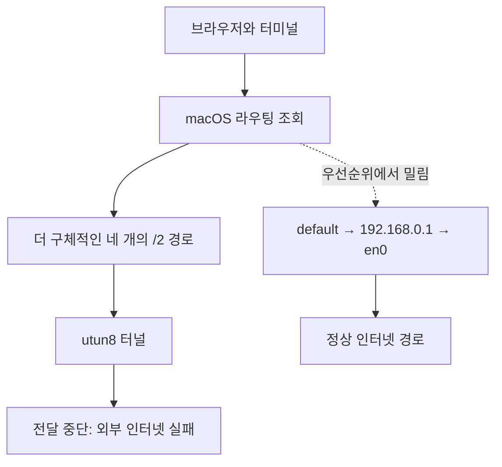
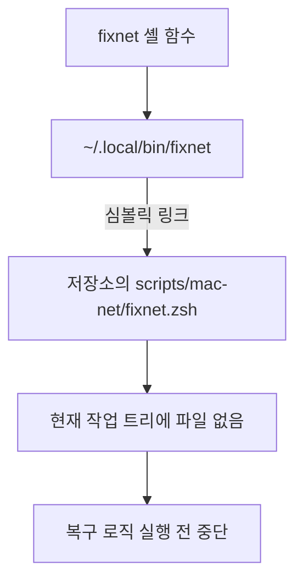

## 이번에는 인터넷과 복구 명령이 함께 멈췄다

며칠 전 macOS에서 인터넷이 막혔을 때 원인을 조사하고 `fixnet`이라는 복구 명령을 만들었다. [이전 기록](/57/fixnet-macos-routing-blackhole)에서 확인한 문제는 VPN 계열 터널이 만든 네 개의 `/2` 경로였다. 터널이 패킷을 전달하지 못하는데 경로는 남아 있어서, 정상 Wi-Fi 기본 경로가 있어도 IPv4 트래픽이 터널로 빨려 들어갔다.

`fixnet`은 같은 증상이 생길 때마다 이 경로를 확인하고 치우는 도구였다. 실제로 여섯 차례 복구에 성공했고, 그 뒤에는 인터넷이 끊겨도 명령 하나면 돌아올 것이라고 생각했다.

그런데 이번에는 상황이 달랐다. 외부로 이동하거나 다른 Wi-Fi에 접속한 직후가 아니었다. 같은 장소와 같은 연결에서 인터넷을 정상적으로 사용하던 중 갑자기 외부 통신만 끊겼다. Wi-Fi는 계속 연결되어 있었고 공유기에도 닿았다. 익숙한 증상이어서 `fixnet`을 실행했는데 명령 자체가 시작되지 않았다. 홈 디렉터리의 실행 경로가 존재하지 않는 파일을 가리키고 있었다.

| 확인한 항목 | 결과 | 의미 |
| --- | --- | --- |
| Wi-Fi 연결 | 정상 | 무선 연결 자체는 살아 있었다 |
| 공유기 `192.168.0.1` | 응답 | 로컬 네트워크까지는 정상이다 |
| 외부 IP `8.8.8.8` | 100% 손실 | DNS보다 앞단의 경로 문제다 |
| DNS `100.100.100.100` | `SERVFAIL` | 외부 연결 실패의 결과로 볼 수 있다 |
| `fixnet` | 실행 전에 실패 | 복구 도구의 설치 경로도 깨져 있었다 |

네트워크 장애와 복구 도구 장애가 동시에 드러난 셈이다. 다만 두 장애가 같은 순간에 생긴 것은 아니었다. 인터넷은 그날 다시 막혔고, `fixnet`은 며칠 전부터 이미 실행할 수 없는 상태였다. 실제 장애가 생기기 전까지 호출할 일이 없어서 발견하지 못했을 뿐이다.

## 이번 재발에는 장소 이동이나 Wi-Fi 전환이 없었다

이전 재발 기록에서는 집과 카페처럼 위치가 달랐고 `utun` 번호도 바뀌었다. 그래서 Wi-Fi 전환, 절전 해제, 네트워크 인터페이스 재구성이 터널 장애의 방아쇠일 가능성을 열어 두었다.

이번에는 그 조건이 없었다. 같은 장소에서 같은 Wi-Fi를 계속 사용했고, 끊기기 전까지 인터넷도 정상적으로 동작했다. 별도의 네트워크 전환 없이 사용 도중 외부 통신만 갑자기 멈췄다. 따라서 장소 이동이나 Wi-Fi 변경은 이 장애가 발생하기 위한 필수 조건이 아니다.

이 관찰로 원인 범위를 한 단계 더 줄일 수 있다. Unicorn Pro 터널은 네트워크 전환 과정에서만 실패하는 것이 아니라, 이미 구성된 `/2` 경로를 유지한 채 정상 사용 중에도 패킷 전달이 멈출 수 있다. 이번 기록만으로 그 순간 Unicorn Pro 내부에서 어떤 상태가 바뀌었는지는 알 수 없지만, “이동하면서 Wi-Fi가 바뀌어서 생긴 문제”로 설명할 수는 없다.

## 잘 쓰던 명령은 장애가 난 날 망가진 것이 아니었다

로그와 Git 기록을 시간순으로 맞춰 보니 “잘 쓰다가 갑자기 안 됐다”는 느낌과 실제 파일 변화 사이에 며칠의 간격이 있었다.

| 시각 | 확인된 사건 |
| --- | --- |
| 9월 8일 18:33 | `fixnet` 마지막 성공 로그가 남았다 |
| 9월 10일 12:38 | `~/.local/bin/fixnet` 심볼릭 링크를 설치했다 |
| 9월 10일 12:40 | 테스트와 정상 상태 네트워크 수집을 실행했다 |
| 9월 10일 23:03 | 블로그 초안을 커밋했지만 `scripts/mac-net`은 커밋에 포함하지 않았다 |
| 9월 10일 23:19 | 브랜치 전환 전에 미추적 파일까지 stash했다 |
| 9월 16일 | 네트워크가 다시 막혔고, 그제야 깨진 `fixnet`을 발견했다 |

이 타임라인이 이번 사건의 핵심이다. 명령은 사용 중에 내부 로직이 망가진 것이 아니다. 실행 파일을 가리키는 링크만 남기고 원본 파일이 작업 트리에서 사라졌다. 이후 네트워크가 정상인 동안에는 아무 증상도 없었다. 다음 장애가 발생해 복구 명령을 호출하는 순간에야 잠복해 있던 설치 문제가 모습을 드러냈다.

운영 도구는 자주 실행되는 서비스보다 이런 문제가 늦게 발견되기 쉽다. 평소에는 필요하지 않고, 가장 급한 순간에만 호출하기 때문이다. “지난번에 됐으니 이번에도 된다”는 기억은 현재 실행 가능 여부를 보장하지 않는다.

## 네트워크 장애는 이전과 같은 라우팅 블랙홀이었다

`netstat -rn -f inet`과 `route -n get`으로 경로를 확인하니 네 개의 넓은 IPv4 경로가 모두 `utun8`을 향하고 있었다.

| 경로 | 포함 범위 | 선택된 인터페이스 |
| --- | --- | --- |
| `0/2` | `0.0.0.0` ~ `63.255.255.255` | `utun8` |
| `64/2` | `64.0.0.0` ~ `127.255.255.255` | `utun8` |
| `128.0/2` | `128.0.0.0` ~ `191.255.255.255` | `utun8` |
| `192.0.0/2` | `192.0.0.0` ~ `255.255.255.255` | `utun8` |

네 경로를 합치면 IPv4 전체를 덮는다. macOS 라우팅은 더 구체적인 경로를 우선하므로 `default`보다 `/2`가 먼저 선택된다. Wi-Fi의 정상 기본 경로가 `192.168.0.1`과 `en0`을 가리켜도 외부 패킷은 `utun8`로 향한다. 터널이 패킷을 전달하지 못하면 그 지점에서 블랙홀이 된다.



공유기 ping은 성공하고 외부 IP ping은 실패한 이유도 여기에 있다. 공유기처럼 로컬 서브넷에 있는 주소는 직접 연결 경로를 사용하지만, 외부 주소는 더 구체적인 `/2` 경로에 잡힌다.

**이번 인터넷 장애의 직접 원인은 Unicorn Pro 터널의 전달 실패라고 판단한다.** 단순히 `utun8`이라는 번호만 보고 정한 결론은 아니다. 이전 장애에서 Tailscale은 별도 `utun11`을 사용했고 `RouteAll=false`였으며 exit node도 비어 있었다. 반면 Unicorn Pro의 `netstat.log`에는 `utun8` 상태 변화와 네 개의 `/2` 경로가 다시 설치되는 과정이 같은 시각에 기록됐다. 장애 중에는 외부 목적지가 이 경로를 선택했고, 경로를 삭제하자 선택 인터페이스가 `en0`로 바뀌면서 일반 인터넷과 Tailscale이 함께 회복됐다.

이번 재발에서도 공유기는 응답하지만 외부 통신은 실패했고, 같은 네 개의 `/2` 경로가 `utun8`을 향했으며, 이를 제거하자 외부 ping이 즉시 정상으로 돌아왔다. 장소 이동이나 Wi-Fi 전환도 없었다. 따라서 **트래픽을 막은 구간과 그 경로를 만든 주체는 Unicorn Pro로 명확하게 좁혀진다.**

아직 모르는 것은 Unicorn Pro 안에서 전달이 멈춘 세부 계기다. 이번에는 네트워크 전환이 없었으므로 전환 처리만을 원인으로 보기는 어렵다. 연결 유지 중 발생한 내부 상태 이상이나 다른 터널과의 상호작용 중 무엇이 방아쇠였는지는 이번 로그만으로 확정할 수 없다. 즉 “Unicorn Pro 터널이 블랙홀을 만들었다”는 원인 판단은 가능하지만, “Unicorn Pro 내부의 어떤 버그가 터널을 멈췄다”까지는 확인되지 않았다. 경로 삭제는 막힌 터널을 우회한 복구다.

## fixnet은 셸 함수가 아니라 끊어진 링크에서 멈췄다

셸 설정에는 `fixnet` 함수가 정상적으로 남아 있었다.

```zsh
netsnap() { "$HOME/.local/bin/netrecord" "$@"; }
fixnet() { "$HOME/.local/bin/fixnet" "$@"; }
```

문제는 그 다음 연결이었다. `~/.local/bin/fixnet`은 저장소 안의 `scripts/mac-net/fixnet.zsh`를 가리키는 심볼릭 링크였는데, 현재 작업 트리에 그 디렉터리가 없었다. `netrecord`도 같은 상태였다.



심볼릭 링크는 대상 파일을 복사하지 않는다. 링크를 만들었을 때 대상이 존재했다고 해서 계속 존재하는 것도 아니다. 저장소를 이동하거나 브랜치를 바꾸거나 미추적 파일을 치우면 링크는 그대로 남고 대상만 사라질 수 있다.

`~/fixnet.log`에 이번 실행 기록이 없었던 것도 이 구조로 설명된다. 로그를 남기는 코드는 `fixnet.zsh` 안에 있다. 셸 함수가 깨진 링크를 실행하려다 먼저 실패했으므로 스크립트의 첫 줄에도 도달하지 못했다.

## 글은 남고 실행 파일만 빠지는 실수를 했다

가장 큰 실수는 복구 스크립트를 운영 명령처럼 설치해 놓고도 Git이 관리하는 파일인지 확인하지 않은 것이다. 블로그 글은 커밋했지만 `scripts/mac-net` 아래의 실행 파일과 테스트는 미추적 상태로 남았다.

이 구조에는 세 가지 문제가 겹쳐 있었다.

1. `~/.zshrc`에는 명령이 있으므로 설치가 끝난 것처럼 보였다.
2. `~/.local/bin` 링크도 존재하므로 `command -v fixnet` 같은 얕은 확인은 통과할 수 있었다.
3. 실제 실행 파일은 브랜치 작업 트리의 미추적 파일이어서 Git 작업 과정에 따라 사라질 수 있었다.

블로그 작업과 네트워크 복구 도구가 같은 저장소 작업 트리에 섞여 있었던 점도 위험을 키웠다. 글을 정리하고 브랜치를 전환하는 평범한 작업이 운영 도구의 실행 가능 여부를 바꿀 수 있었다. 파일을 지우려는 의도는 없었지만, 설계 자체가 그런 결과를 허용했다.

여기서 “글을 올리다가 인터넷을 망가뜨렸다”고 결론 내리면 두 원인이 섞인다. 네트워크 블랙홀은 터널 경로가 남아 발생했다. 블로그 작업 과정은 `fixnet` 원본을 현재 작업 트리에서 치워 복구 수단을 망가뜨렸다. 두 번째 문제가 첫 번째 장애의 복구를 어렵게 만들었다.

## stash는 백업이면서 동시에 실행 경로를 치웠다

브랜치를 바꾸기 전에 `git stash -u` 또는 `git stash --include-untracked`를 사용하면 추적 파일의 변경뿐 아니라 미추적 파일도 stash에 들어간다. 그래서 작업 트리는 깨끗해지지만, 미추적 실행 파일을 직접 가리키던 심볼릭 링크는 끊어진다.

이번 stash를 자세히 확인하니 원본은 삭제된 것이 아니었다. stash의 세 번째 부모 커밋에 미추적 파일 다섯 개가 그대로 남아 있었다.

```text
stash@{0}
├── 추적 파일 변경
├── 인덱스 상태
└── 미추적 파일 스냅숏
    └── scripts/mac-net/
        ├── README.md
        ├── fixnet.zsh
        ├── netrecord.py
        ├── test_fixnet.py
        └── test_netrecord.py
```

처음에는 현재 작업 트리와 일반 Git 이력만 보고 “스크립트 원본이 사라졌다”고 판단하기 쉬웠다. `git log --all -- scripts/mac-net`에도 기록이 없기 때문이다. 애초에 커밋된 적이 없으니 일반 커밋 이력에서 찾을 수 없는 것이 맞다. 하지만 `git stash show --include-untracked --name-status stash@{0}`와 `stash@{0}^3`까지 확인하면 미추적 파일 스냅숏을 찾을 수 있다.

stash 전체를 그대로 적용하는 것은 안전하지 않다. 같은 stash에는 당시 작업하던 다른 글과 자산도 들어 있다. 복구할 때는 `scripts/mac-net`만 선택적으로 꺼낸 뒤 내용과 실행 권한을 확인해야 한다.

즉, stash는 파일을 보존했다. 동시에 현재 작업 트리에서는 파일을 제거했다. “백업되어 있다”와 “현재 명령이 실행된다”는 서로 다른 상태다.

## Qwen Code와 Ornith는 인터넷 없이 수동 복구 경로를 찾았다

이번 장애에서 실질적인 도움이 된 것은 Qwen Code 하네스로 실행한 로컬 모델 `Ornith-1.5-35B-A3B-oQ6-gs128-mtp-vision`이었다. 외부 인터넷이 끊긴 상태에서도 로컬 셸, 파일, 라우팅 테이블을 조사할 수 있었다. 인터넷 검색이나 원격 API가 필요한 모델이었다면 가장 필요한 순간에 시작부터 막혔을 가능성이 크다.

로컬 LLM과 함께 확인한 순서는 다음과 같았다.

1. 공유기와 외부 IP를 각각 ping해 Wi-Fi 문제와 외부 경로 문제를 분리했다.
2. DNS 이름 대신 `8.8.8.8`을 확인해 DNS만의 문제인지 구분했다.
3. 라우팅 테이블에서 IPv4 전체를 덮는 네 개의 `/2` 경로를 찾았다.
4. `fixnet`이 스크립트 내부가 아니라 깨진 심볼릭 링크에서 실패한다는 점을 확인했다.
5. 막힌 `utun8` 경로를 수동으로 제거해 인터넷을 복구했다.

사용한 핵심 명령은 다음과 같다.

```zsh
sudo route -n delete 0/2 -iface utun8
sudo route -n delete 64/2 -iface utun8
sudo route -n delete 128.0/2 -iface utun8
sudo route -n delete 192.0.0/2 -iface utun8
```

처음 시도한 `-utun8`은 `route: bad keyword: utun8` 오류를 냈고, 인터페이스를 지정하는 올바른 형식인 `-iface utun8`으로 수정했다. 삭제 후 외부 ping은 손실 없이 돌아왔다.

로컬 LLM이 네트워크를 직접 고친 것은 아니다. 로컬에서 실행 가능한 진단 도구와 현재 상태를 함께 읽고, 사람이 확인하면서 다음 명령을 좁혀 간 것이다. 그래도 외부 연결이 없는 상황에서 이 조사 흐름을 유지할 수 있었다는 점은 컸다. 로컬 모델의 가치가 성능 비교표보다 장애 시 가용성에서 더 선명하게 드러난 순간이었다.

## Qwen Code에서 실행한 로컬 LLM도 원본은 처음에 찾지 못했다

복구가 성공했다고 해서 모든 분석이 정확했던 것은 아니다. 첫 조사에서는 깨진 링크와 사라진 대상 파일을 확인했지만, 원본이 stash의 미추적 파일 스냅숏에 남아 있다는 사실까지 찾지 못했다. 현재 파일, 일반 Git 이력, 주변 백업을 확인한 뒤 원본을 복구하기 어렵다고 결론 내렸다.

| 잘한 부분 | 부족했던 부분 |
| --- | --- |
| 인터넷 없이 로컬 진단을 계속했다 | stash의 미추적 파일 영역을 처음부터 확인하지 않았다 |
| 라우팅 블랙홀을 빠르게 다시 찾았다 | “현재 작업 트리에 없음”을 “복구할 원본 없음”으로 넓혀 판단했다 |
| 잘못된 `route` 문법을 고쳐 수동 복구했다 | 네트워크 복구와 소스 복구를 별도 체크리스트로 나누지 않았다 |
| 깨진 심볼릭 링크를 확인했다 | stash 전체 구조와 세 번째 부모까지 추적하지 않았다 |

이 부분은 로컬 LLM을 언급할 때 함께 남겨야 한다. 도구가 유용했다는 사실과 첫 분석이 불완전했다는 사실은 동시에 성립한다. 특히 Git stash는 추적 파일, 인덱스, 미추적 파일이 서로 다른 부모에 저장될 수 있다. “삭제된 파일 찾기”를 맡길 때는 일반 로그뿐 아니라 `git stash list`, `git stash show --include-untracked`, reflog까지 명시적으로 확인해야 한다.

## 다음 설치는 저장소와 실행 경로를 분리한다

같은 실수를 막으려면 먼저 원본을 Git에 커밋해야 한다. 테스트까지 포함한 `scripts/mac-net`을 선택적으로 복원한 뒤 아래 검증을 통과시키고 커밋하는 순서가 필요하다.

```zsh
python3 -m unittest discover -s scripts/mac-net -p 'test_*.py'
zsh -n scripts/mac-net/fixnet.zsh
```

그 다음 설치 구조를 결정해야 한다.

| 방식 | 장점 | 위험과 대응 |
| --- | --- | --- |
| 저장소 파일로 직접 연결 | 수정 즉시 반영되고 단순하다 | 브랜치와 작업 트리에 종속된다. 커밋된 안정 브랜치만 가리키고 상태 점검이 필요하다 |
| `~/.local/lib/fixnet`에 복사해 설치 | 블로그 저장소의 브랜치 전환과 분리된다 | 업데이트가 자동 반영되지 않는다. 설치·업데이트 명령과 버전 표시가 필요하다 |
| 별도 도구 저장소에서 설치 | 글 작업과 운영 도구의 수명 주기가 분리된다 | 저장소가 하나 늘어난다. 작은 설치 스크립트와 테스트로 관리할 수 있다 |

이번에는 `~/.local/lib/fixnet`을 고정 설치 디렉터리로 두고 `fixnet.zsh`와 `netrecord.py`를 복사한 뒤, `~/.local/bin`에서는 그 설치본을 가리키도록 바꿨다. 블로그 저장소의 브랜치 전환이나 stash가 실행 중인 복구 도구를 다시 제거하지 않게 하기 위해서다. 원본은 테스트와 함께 Git으로 관리해야 한다.

설치 후에는 링크 존재 여부만 보지 말고 실제 대상을 확인하는 점검이 필요하다.

```zsh
test -x "$HOME/.local/bin/fixnet"
test -e "$(readlink "$HOME/.local/bin/fixnet")"
"$HOME/.local/bin/fixnet" --help
```

`--check`도 추가했다. 이 모드는 권한 상승, ping, 경로 삭제, 진단 자료 수집 없이 실행 파일과 의존 명령만 검사한다. 로그인할 때마다 자동 복구를 실행할 필요는 없지만, 주기적인 상태 점검은 깨진 설치를 실제 장애 전에 알려 줄 수 있다.

## fixnet 한 번으로 장애 전후 기록도 자동 저장한다

`netrecord`도 stash에서 함께 복원했다. 이제 `fixnet`을 실행하면 별도로 `netrecord down`과 `netrecord after`를 입력하지 않아도 된다.

| 단계 | `fixnet`의 동작 | 남는 기록 |
| --- | --- | --- |
| 두 IP의 ping과 도메인 HTTPS 모두 성공 | 복구할 필요가 없다고 종료 | 자동 기록 없음 |
| 세 검사 중 하나라도 실패 | 경로를 바꾸기 전에 `netrecord down` 실행 | `~/netrecords/*-down/` |
| 두 IP의 HTTPS 연결은 성공 | ICMP 제한 또는 DNS 문제 가능성을 보고 경로 삭제 보류 | `down` 기록은 보존 |
| 게이트웨이도 실패 | 원인이 다르다고 보고 복구 중단 | `down` 기록은 보존 |
| 게이트웨이 성공, 네 `/2`와 실패 목적지가 같은 `utun`을 향함 | 확인한 인터페이스의 네 경로만 삭제 시도 | 변경 내용은 `~/fixnet.log`에 기록 |
| 경로 삭제 뒤 | `netrecord after` 실행 | `~/netrecords/*-after/` |
| 경로 삭제 뒤에도 검사 실패 | 추가 자동 변경 없이 중단 | `after`와 오류 로그 보존 |

`down` 폴더에는 IPv4 경로, `1.1.1.1`과 `8.8.8.8` 각각의 목적지 경로 조회, 인터페이스, DNS, 외부 연결 검사, Unicorn Pro의 최근 로그 사본이 들어간다. `after`에도 같은 형식이 남으므로 다음 조사에서는 복구 전후를 직접 비교할 수 있다. 수집 자료는 로컬에만 저장하고 자동 업로드하지 않는다.

정상 대조군은 필요할 때 `netrecord ok`로 따로 남긴다. `fixnet`을 평소 상태 점검 명령처럼 실행할 때마다 전체 수집을 돌리면 시간이 들고 불필요한 기록이 쌓이므로, 자동 수집은 외부 연결 실패를 감지한 경우에 시작한다.

## 9월 17일에는 fixnet이 정상이라고 했지만 수동 삭제로 복구했다

고정 설치본으로 복원한 뒤 또 같은 증상이 나타났다. 그런데 이번에는 `fixnet`을 입력하자 “인터넷 정상. 할 일 없음.”이라고 답했다. 실제 인터넷 사용에는 문제가 있었고, 아래 명령으로 네 경로를 직접 삭제한 뒤 연결을 회복했다.

```zsh
sudo route -n delete 0/2 -iface utun8 ; sudo route -n delete 64/2 -iface utun8 ; sudo route -n delete 128.0/2 -iface utun8 ; sudo route -n delete 192.0.0/2 -iface utun8 ; echo "=== 삭제 후 라우팅 ===" ; netstat -rn -f inet | grep -E "utun8|default" ; echo "=== 인터넷 확인 ===" ; ping -c 2 -W 2000 8.8.8.8
```

이 명령은 당시 확인한 `utun8` 경로를 삭제하고, 남은 경로와 `8.8.8.8` ping으로 복구를 확인한 수동 조치다. `utun8`은 매번 같은 번호가 아니므로 다음 장애에 이 줄을 그대로 복사해 실행해서는 안 된다. 먼저 라우팅 테이블과 `route -n get 8.8.8.8`으로 실제 터널을 확인해야 한다. 정상 동작 중인 Unicorn Pro 터널의 경로를 지우면 필터링 경로도 우회한다.

왜 `fixnet`은 정상이라고 했을까. 당시 설치본의 첫 가드는 `ping -c2 -W1000 1.1.1.1` 하나만 성공하면 즉시 종료했다. `8.8.8.8`의 실패 여부, 브라우저 통신, 네 개의 `/2` 경로를 보기도 전이었다. `~/fixnet.log`는 9월 8일 이후 새 줄이 없고 `~/netrecords`에도 이번 `down` 폴더가 없다. 따라서 **설치본이 출력한 “정상”은 인터넷 전체의 정상 판정이 아니라 한 IP의 ping 성공 판정**이었다. 실제 실행 순간의 `1.1.1.1` 응답값은 저장되지 않았지만, 이 가드가 실행됐다면 응답에 성공했기 때문에 그 문구가 나왔다는 추론이 가장 직접적이다.

이번 사건의 수동 복구 결과는 앞선 Unicorn Pro 터널 우회 사례와 일치한다. 다만 경로 삭제 전 `route -n get` 결과나 Unicorn Pro 로그를 이번에는 보존하지 못했다. 그래서 9월 17일 장애의 경로 소유자와 터널 내부 실패 지점을 새 로그로 독립적으로 확정했다고 쓰지는 않는다.

이 오판을 고치면서 `fixnet`은 `1.1.1.1`과 `8.8.8.8` ping뿐 아니라 도메인 HTTPS도 검사하도록 바꿨다. 하나라도 실패하면 먼저 `netrecord down`을 저장한다. 두 IP의 HTTPS 연결은 정상이라면 ICMP 제한이나 DNS 문제 가능성을 보고 경로를 지우지 않는다. 실제 복구는 게이트웨이가 응답하고, 네 `/2` 경로가 같은 `utun`을 가리키며, `8.8.8.8`의 실제 경로도 그 터널일 때만 진행한다. 삭제 명령은 수동 복구와 같은 `-iface` 형식을 쓰되 확인한 인터페이스 이름을 대입한다.

이전 스크립트는 삭제 후에도 연결이 안 되면 Tailscale을 자동 재시작했다. 그러나 확인된 문제 경로는 Unicorn Pro 쪽이었고, 이 상황에서 Tailscale 재시작은 근거 없는 추가 변경이다. 그 단계는 제거했다. 삭제 후에도 실패하면 `after` 기록을 남기고 멈춘다.

## 자동 삭제보다 사람이 확인할 수 있는 가드를 둔다

네 개의 `/2` 경로가 보인다고 언제나 장애인 것은 아니다. Unicorn Pro가 정상 동작할 때도 같은 경로가 존재할 수 있다. 따라서 launchd로 주기적으로 경로를 무조건 삭제하면 보안 앱의 정상 트래픽 처리까지 깨뜨릴 수 있다.

안전한 복구 판단에는 최소한 다음 조건이 함께 필요하다.

1. 외부 IP 연결이 실패한다.
2. 로컬 게이트웨이는 응답한다.
3. 네 개의 `/2` 경로가 같은 터널 인터페이스를 향한다.
4. 현재 터널과 관련 앱 상태를 기록한다.
5. 변경 전후 라우팅 테이블과 연결 결과를 로그로 남긴다.
6. 자동 변경 전에 진단 결과를 사람이 확인할 수 있다.

`fixnet`은 두 외부 목적지와 도메인 HTTPS가 모두 응답할 때만 정상으로 종료하고, 게이트웨이까지 실패하면 경로를 건드리지 않는다. 경로 삭제 전에는 네 `/2`와 실패 목적지의 실제 인터페이스가 일치하는지도 확인한다. 그래도 자동 판단이 모든 인터넷 장애를 설명하지는 않는다. 다음 재발에서 수집한 `down`과 `after`를 비교해 이 가드의 판단을 다시 검증해야 한다.

## 복구 방법을 아는 것과 안전망이 살아 있는 것은 다르다

이번에는 로컬 LLM 덕분에 깨진 `fixnet`을 우회하고 수동 명령으로 인터넷을 복구했다. 이후 기록을 더 깊게 확인하면서 원본 스크립트도 stash 안에 남아 있다는 사실을 찾았다. 결과적으로 네트워크와 소스 모두 복구 가능한 사건이었다.

하지만 운이 좋았다는 점도 분명하다. 공유기 연결은 살아 있었고, 이전 진단 기록이 남아 있었으며, 로컬 LLM과 셸 도구는 오프라인에서도 사용할 수 있었다. 이번에는 장소 이동이나 Wi-Fi 전환도 없었으므로 터널이 안정적으로 동작하던 중 왜 전달을 멈췄는지가 다음 조사 대상이다. 네 개의 경로를 지운 것은 증상을 해소한 것이지 Unicorn Pro의 내부 실패 원인을 설명한 것은 아니다.

가장 큰 교훈은 복구 명령 자체도 운영 대상이라는 점이다. 실행 파일을 커밋하고, 설치 경로를 작업 브랜치와 분리하고, 실제 실행 가능 여부를 평소에 검사해야 한다. 장애 대응 문서에는 네트워크 진단뿐 아니라 복구 도구가 사라졌을 때 사용할 수동 명령도 남겨야 한다.

“잘 쓰다가 갑자기 안 됐다”는 말은 사용자 경험으로는 정확했다. 다만 실제 고장은 갑자기 생기지 않았다. 미추적 파일이 stash로 이동한 순간 안전망은 이미 사라졌고, 며칠 뒤 네트워크 장애가 그 사실을 알려 줬다.
