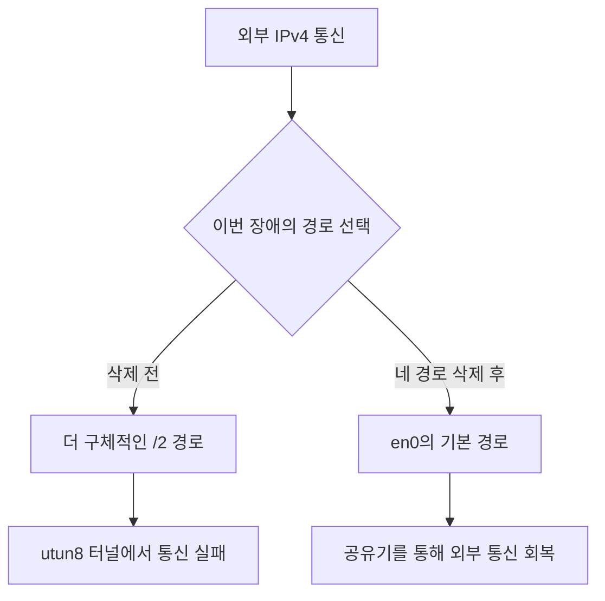

카페에서 맥북 인터넷이 멈췄을 때, 와이파이 아이콘은 여전히 연결 상태였다. 브라우저와 메신저는 멈췄고 Tailscale도 화면에서는 연결돼 보였다. `fixnet`으로 네 개의 경로를 지우자 인터넷이 돌아왔다. 그래서 그 경로와 Tailscale의 오류 로그를 엮어 이 글을 썼다.

9월 8일 집에서 같은 일을 다시 겪고 로그를 맞춰 보니, 고쳐지는 이유는 더 분명해졌고 의심했던 프로그램은 달라졌다. **이번에 지운 경로는 유니콘 Pro가 설정하는 터널로 향했고, Tailscale은 별도의 터널을 쓰고 있었다.** Tailscale의 연결 실패는 원인보다 같은 장애의 피해였을 가능성이 커졌다.

> 2026-09-10 수정: 9월 3일 카페 장애를 기록한 글에 9월 8일 조사 결과를 반영했다. 복구 횟수와 상태·버전은 9월 8일 확인 기준이다. 기존의 Tailscale 원인 추정과 한 번의 비교로 원인을 확정할 수 있다는 설명을 고쳤고, 이후 수집 도구 `netrecord`를 만들어 복구 전후 기록에 연결했다.

## 경로를 지워 복구한 기록이 여섯 번 쌓였다

[와이파이를 옮길 때마다 맥북 인터넷이 작동 안하던 이유](/17/macbook-wifi-issue-when-moved)를 쓴 뒤, `fixnet`은 장애 때 어느 단계에서 풀렸는지를 `~/fixnet.log`에 남겨 왔다. 9월 8일까지 기록된 결과는 다음과 같다. 시각은 모두 한국 시간이다.

| 실행 시각 | 게이트웨이 | 문제 경로의 터널 | 기록된 결과 |
|---|---|---|---|
| 08-15 00:32:55 | `192.168.0.1` | `utun4` | 경로 삭제로 해결 |
| 08-18 19:31:04 | 기록 없음 | — | 게이트웨이 무응답, 개입 안 함 |
| 09-03 16:22:32 | 기록 없음 | — | 게이트웨이 무응답, 개입 안 함 |
| 09-03 16:22:44 | `172.30.1.254` | `utun9` | 경로 삭제로 해결 |
| 09-03 16:38:48 | `172.30.1.254` | `utun9` | 경로 삭제로 해결 |
| 09-07 15:21:52 | `172.30.1.254` | `utun8` | 경로 삭제로 해결 |
| 09-07 18:28:24 | `192.168.0.1` | `utun8` | 경로 삭제로 해결 |
| 09-08 18:33:56 | `192.168.0.1` | `utun8` | 경로 삭제로 해결 |

**경로 삭제로 복구한 기록은 6회, Tailscale 재기동으로 복구한 기록은 0회다.** 인터넷이 이미 정상인 실행은 로그를 남기지 않으므로, 이 표는 전체 실행 횟수나 성공률을 뜻하지 않는다. 게이트웨이 무응답 두 건도 주소와 상세 상태가 없어 원인을 확정할 수 없다.

`utun` 뒤의 숫자는 고정된 프로그램 이름이 아니다. 8월의 `utun4`, 9월 3일의 `utun9`, 9월 8일의 `utun8`을 숫자만 보고 같은 프로그램으로 묶을 수는 없다. 그날의 주소·라우팅 테이블·프로그램 로그를 함께 봐야 한다.

여섯 번 같은 조치가 통했다는 것은 유효한 복구 방법이라는 근거다. 그러나 그것만으로 경로를 만든 프로그램이나 그 프로그램이 멈춘 이유까지 증명되지는 않는다. 예전 글에서는 이 둘을 너무 가깝게 놓았다.

## 9월 8일에는 우회되는 순간이 로그에 남았다

9월 3일 카페에서는 DHCP로 주소와 게이트웨이를 받은 뒤에도 외부 통신이 실패했다. 16시 22분과 38분에 경로 삭제로 복구했지만, 삭제 직후 실제 경로는 따로 남기지 않았다. 공유기로 돌아갔다는 설명은 당시에는 라우팅 원리와 ping 성공을 바탕으로 한 추론이었다.

9월 8일에는 `fixnet.log`, macOS 통합 로그, 유니콘 자체 로그를 대조했다. 조사한 환경은 macOS 26.6.2, 유니콘 Pro 1.15.0, Tailscale 1.102.3이었다.

| 9월 8일 시각 | 출처 | 확인한 내용 |
|---|---|---|
| 18:30부터 | macOS 통합 로그 | 여러 앱이 `utun8`에서 통신에 실패하고 Tailscale도 외부 서버에 연결하지 못함 |
| 18:33:21 | `configd` | Wi-Fi 링크 비활성화, 기존 IPv4 주소 제거 |
| 18:33:39 | `configd` | Wi-Fi 링크 활성화, DHCP 주소 재설정 진행 |
| 18:33:56 | `fixnet.log` | 공유기 응답·외부 ping 실패를 확인한 뒤 `/2` 네 경로 삭제, 복구 성공 기록 |
| 18:34:05.572 | `nesessionmanager` | 주 경로의 인터페이스가 `utun8`에서 `en0`로 바뀜 |
| 18:34:05.786 | Tailscale 로그 | 도쿄 DERP 중계 서버 연결 회복 |
| 18:34:07.596 | Tailscale 로그 | 제어 연결 관련 상태가 정상으로 바뀜 |
| 18:35:32~38 | 유니콘 로그 | 내부 처리기 종료·터널 재설정 과정과 `/2` 경로 재설치 |

`fixnet.log`의 시각은 함수 시작 때 한 번 만든 값이다. 따라서 마지막 결과 줄의 `18:33:56`을 실제 복구 완료 시각으로 읽으면 안 된다. 다른 로그와 맞추면 경로 전환은 18시 34분 5초에 나타난다.

macOS가 남긴 핵심 문장은 이것이다.

```text
Detected that the primary physical interface changed: utun8 => en0
```

여기서 `physical`은 로그의 표현이다. `utun8`이 물리 장치라는 뜻은 아니다. **경로 삭제 직후 시스템이 선택하던 인터페이스가 터널에서 Wi-Fi로 바뀌었다**는 증거로 읽었다.

Wi-Fi가 실제로 끊겼다가 연결된 흔적도 있다. 다만 오류는 18시 30분부터 이미 있었으므로, 18시 33분의 재연결을 최초 원인으로 지목할 수는 없다. 사용자 조작인지 자동 재연결인지도 이 로그만으로는 구분하지 못했다.

## 네 개의 경로를 지우면 공유기로 나갈 수 있었다

9월 8일 장애 때 `fixnet`이 남긴 경로를 목적지와 인터페이스 중심으로 옮기면 다음과 같다.

| 목적지 | 게이트웨이·연결 대상 | 인터페이스 |
|---|---|---|
| `0.0.0.0/2` | `utun8` | `utun8` |
| `64.0.0.0/2` | `utun8` | `utun8` |
| `128.0.0.0/2` | `utun8` | `utun8` |
| `192.0.0.0/2` | `utun8` | `utun8` |
| `default` | `192.168.0.1` | `en0` |
| `default` | `link#35` | `utun11` |

`/2`는 IPv4 주소의 앞 2비트로 범위를 나눈다는 뜻이다. 첫 두 비트는 `00`, `01`, `10`, `11` 네 가지이므로, 이 네 경로를 합치면 IPv4 주소 전체를 덮는다.

| 경로 | 첫 옥텟 범위 |
|---|---|
| `0.0.0.0/2` | 0–63 |
| `64.0.0.0/2` | 64–127 |
| `128.0.0.0/2` | 128–191 |
| `192.0.0.0/2` | 192–255 |

목적지에 맞는 경로가 여러 개면 더 구체적인 경로가 우선한다. `default`는 `/0`이고 위 경로는 `/2`이므로, `1.1.1.1` 같은 외부 주소는 공유기로 향하는 기본 경로보다 `utun8` 경로를 먼저 선택한다. 공유기까지의 LAN 경로처럼 `/2`보다 더 구체적인 경로는 별도로 우선할 수 있다.

그래서 공유기에 ping이 되는데 외부에는 안 되는 상태가 가능하다. 로컬 통신은 Wi-Fi로 나가지만 외부 통신은 터널로 들어가고, 터널 쪽에서 전달이 막히면 인터넷만 멈춘 것처럼 보인다.



`fixnet`은 새 공유기 경로를 만드는 명령이 아니다. 우선하던 네 경로를 지워 기존 Wi-Fi 경로를 사용할 수 있게 한다. 이번에는 삭제 뒤 `en0` 전환과 통신 회복이 함께 기록됐다.

기존 글에서 삭제 뒤에는 기본 경로가 하나만 남는다고 쓴 부분은 부정확했다. 표에도 터널 기본 경로가 따로 있다. **남은 경로가 유일해서가 아니라, 이번 상황에서 실제로 `en0`가 선택됐기 때문에 복구됐다.**

## 오류를 낸 Tailscale과 경로를 설정한 유니콘을 구분했다

처음에는 Tailscale 로그에 `network is unreachable`, `no route to host`, `PollNetMap` 실패가 반복된다는 점에 집중했다. 하지만 인터넷에 의존하는 프로그램은 다른 프로그램의 터널 때문에 막혀도 같은 오류를 낼 수 있다. 오류를 기록한 프로세스와 장애 경로의 소유자를 구분해야 했다.

9월 8일에는 다음처럼 나뉘었다.

| 확인 대상 | 관찰한 상태 |
|---|---|
| 문제 경로 | 네 개의 `/2`가 `utun8`로 향함 |
| `utun8` 주소 | `10.1.0.4`, MTU 1500 |
| Tailscale 터널 | `utun11`, Tailscale IPv4·IPv6 주소 사용 |
| Tailscale 설정 | `ExitNodeID`와 `ExitNodeIP`는 비어 있고 `RouteAll=false` |
| 유니콘 프로세스 | `UnicornProMac`과 `unicornprod` 실행 중 |
| 유니콘 `netstat.log` | 터널 설정 과정에서 `utun8` 상태 변화와 `/2` 경로 설치 기록 |

유니콘 로그의 18시 35분 기록이 특히 도움이 됐다. `tun.cc`가 남긴 18:35:33.946 스냅샷에는 `/2` 네 줄이 없었고, 18:35:34.018에는 `utun8`의 `UP` 플래그가 내려가 있었다. 이후 18:35:37.936 스냅샷에는 `utun8`로 향하는 네 줄이 다시 나타났다.

이는 단순히 비슷한 주소를 쓴다는 단서를 넘어, **유니콘의 터널 재설정 과정과 해당 경로의 설치가 함께 기록됐다는 근거**다. 다만 이 재설정이 사용자 조작인지 자동 동작인지는 확인하지 못했다.

Tailscale은 exit node를 사용하면 일반 인터넷 트래픽을 다른 기기를 통해 보낼 수 있다. 하지만 그 기능이 있다는 사실로 이 맥의 네 경로를 Tailscale 것으로 볼 수는 없다. 이번에 확인한 설정에서는 exit node가 선택돼 있지 않았다. [Tailscale exit node 공식 문서](https://tailscale.com/docs/features/exit-nodes)

경로 삭제 뒤 Tailscale의 연결까지 회복됐다는 점을 합치면, **이번에는 유니콘 터널 경로를 우회하자 일반 인터넷과 Tailscale이 함께 살아났다는 설명이 가장 잘 맞는다.** 두 프로그램의 상호작용까지 배제한 것은 아니며, 8월과 9월 3일의 터널 소유자도 이번 인터페이스 번호만으로 소급해 확정하지 않는다.

## 경로가 다시 생겼는데도 인터넷은 정상이었다

18시 36분 조사에서는 `/2` 네 경로가 다시 있었고, `route -n get 1.1.1.1`도 `utun8`을 가리켰다. 그런데 ping은 3회 모두 성공했고 평균 약 5ms였다. 별도로 보낸 IPv4 HTTPS 요청도 HTTP 200을 반환했다.

9월 4일 아침에 남긴 정상 스냅샷에도 `/2` 경로와 터널을 향하는 조회 결과가 있었다. 따라서 네 줄의 존재 자체를 고장으로 취급하면 정상 상태까지 지우게 된다.

| 구분 | 이번 조사에서 말할 수 있는 것 |
|---|---|
| 복구 동작 | 장애 중 네 경로를 삭제한 뒤 `en0` 전환과 외부 통신 회복을 확인 |
| 경로의 역할 | 정상일 때도 설치될 수 있는 터널 경로 |
| 가장 유력한 장애 구간 | 유니콘 터널을 통한 외부 통신 처리 구간 |
| 남은 원인 | 내부 상태 이상, 네트워크 전환 대응, 다른 터널과의 상호작용 중 무엇인지 미확정 |

유니콘 지원 커뮤니티에도 `10.1.0.4`와 네 개의 `/2` 경로를 제시한 [전체 네트워크 블랙홀 사용자 보고](https://support.getunicorn.app/hc/ko/community/posts/59046489931161)가 있다. 내 관찰과 닮은 직접 사례지만, 제조사가 이번 장애의 원인을 확정했다는 뜻은 아니다. 그 보고의 리소스 문제를 내 맥에서도 발생한 일처럼 가져올 수는 없다.

이제는 `fixnet`을 **막힌 터널을 우회하는 응급 복구**로 설명하는 편이 맞다. 유니콘 내부에서 무엇이 잘못됐는지를 고쳤다고 말할 증거는 없다. 지연이 짧다는 사실만으로 터널을 통과하지 않았다고 판단했던 기존 설명도 거둔다. 로컬 터널이라면 경로 조회와 함께 봐야 한다.

## 기록 함수를 고쳐도 기존 터미널에는 옛 함수가 남을 수 있었다

9월 4일에는 `netsnap`을 추가했다. 정상 상태, 삭제 직전, 삭제 직후에 같은 항목을 저장하고 비교하려는 함수였다. 그런데 9월 7일 두 번과 8일 한 번의 복구 로그에는 `증거:`와 `삭제 후:` 줄이 모두 없었다. 조사 때 확인한 파일도 9월 4일의 정상 스냅샷 하나뿐이었다.

반면 디스크의 `~/.zshrc`에는 `netsnap down`과 `netsnap after` 호출이 들어 있었다. **오래 열어 둔 터미널에 수정 전 함수가 남아 있었을 가능성이 높다.** 실행한 셸 내부를 당시 그대로 확인한 것은 아니므로, 다른 함수 정의가 덮었을 가능성까지 지울 수는 없다.

셸 설정 파일을 고쳐도 이미 실행 중인 셸의 함수가 저절로 바뀌지는 않는다. 새 터미널을 열거나 `source ~/.zshrc`로 다시 읽은 뒤, 실제 실행할 정의를 확인해야 한다.

```zsh
type fixnet
functions fixnet
functions netsnap
```

`fixnet` 정의에 두 스냅샷 호출이 있는지 보고, 정상일 때 `netsnap ok`를 실행해 반환된 파일이 생성됐는지까지 확인한다. 코드에 기능을 추가한 것과 그 기능이 실제로 실행된 것은 다른 일이었다.

기존 `netsnap`은 라우팅·Tailscale 상태·Tailscale 프로세스·DERP 도달성을 모은다. 이번 조사 이후에는 그것만으로 부족하다. 다음 비교에는 아래 자료를 함께 보존해야 한다.

| 자료 | 확인하려는 것 |
|---|---|
| 전체 IPv4 경로, `route -n get 1.1.1.1`, `ifconfig` | 목적지 경로와 각 터널의 주소 |
| 게이트웨이·외부 IP ping, 짧은 HTTPS 요청 | 로컬 도달성과 외부 통신을 별도로 확인 |
| `scutil --dns`, Tailscale 상태·설정 | DNS 구성과 다른 터널의 상태 |
| 유니콘 `vpn.log`, `netstat.log`, `system.log` | 터널 설정·처리기 변화와 복구 시점 |
| macOS 통합 로그, 관련 프로세스 시작 시각 | 링크 전환과 프로그램 동작 순서 |

유니콘 자체 로그는 이 맥에서 `~/Library/Application Support/Unicorn Pro/rel/sl/`에 있었다. 순환되는 로그이므로 장애 직후 사본을 남겨야 한다. 외부에 공유할 때는 계정·주소·접속 대상 등 사적인 정보를 가린다.

이 목록을 다음번에 다시 기억해야 한다면 같은 일이 반복될 것 같았다. 그래서 9월 10일에는 수집 항목을 `netrecord`라는 별도 실행 파일로 옮겼다. Python 3 표준 라이브러리와 macOS 기본 명령만 사용하고, 진단 자료를 모으는 동안 라우팅·VPN·DNS 설정은 바꾸지 않는다.

## 다음 조사자가 읽을 폴더를 남기도록 만들었다

설치한 도구는 아래처럼 실행한다. `ok`는 정상 비교 자료, `down`은 장애 중 기록, `after`는 조치 뒤 기록이다. 이 이름은 사용자가 붙이는 표식이며 도구가 정상이나 장애를 확정한 결과는 아니다.

```zsh
netrecord ok
netrecord down --note '브라우저와 메신저 불통'
netrecord after --note '유니콘 보호 재시작 후'
```

결과는 `~/netrecords/` 안에 날짜·시각·종류별 폴더로 쌓인다. 요약과 원본을 함께 남겨 다음 조사자가 결론만 보고 원인을 추측하지 않도록 했다.

| 파일 | 남기는 내용 |
|---|---|
| `SUMMARY.md` | 주요 관찰값, 직전 완료 기록과의 차이, 누락 항목, 조사 순서 |
| `manifest.json` | 도구 버전, 메모, 명령별 시작·종료 시각, 종료 코드, 시간 초과·절단 여부 |
| 경로·인터페이스 기록 | 전체 IPv4·IPv6 경로와 `1.1.1.1`의 실제 경로 조회 |
| 연결 검사 기록 | 공유기·외부 IP 두 곳의 ping, 도메인·IP를 통한 IPv4 HTTPS 검사 |
| 시스템·Tailscale 기록 | DNS·프록시·네트워크 상태, 관련 프로세스, Tailscale 상태와 필요한 설정 |
| `unicorn/` | 유니콘 자체 로그와 일부 직전 회전 파일 사본 |
| `system_log.txt` | 수집 시작 부근까지의 최근 15분 macOS 관련 로그 |

휘발되기 쉬운 경로와 유니콘 로그를 먼저 보존하고, 연결 검사와 나머지 명령을 실행한다. 명령마다 제한 시간을 두고 실패해도 다른 자료는 남긴다. 각 로그는 최대 4 MiB를 보관하며 잘렸는지도 기록한다. 폴더 권한은 소유자만 접근할 수 있게 잡았고 자동 업로드는 하지 않는다.

`fixnet`도 외부 실행 파일로 옮겼다. 외부 ping이 실패하면 게이트웨이를 검사하기 전에 `down` 기록을 남긴다. 경로 삭제 시도 뒤에는 `after`를 남기고, 기존의 Tailscale 재연결 단계까지 갔다면 그 뒤에도 따로 기록한다. 공유기가 응답하지 않아 복구를 보류하는 경우에도 장애 기록은 남는다.

오래 열린 셸의 함수 문제는 호출부를 얇게 만들어 줄였다. `~/.zshrc`의 `fixnet`과 `netsnap`은 이제 외부 파일을 호출한다. 설치 후에는 새 터미널을 열거나 `source ~/.zshrc`를 한 번 실행해야 하지만, 그 뒤 도구 본문을 수정할 때는 실행 파일을 다시 읽는다. 바로 최신 파일을 쓰려면 `~/.local/bin/fixnet`을 직접 실행할 수도 있다.

**자동 기록은 `fixnet`을 실행할 때 동작한다.** 백그라운드에서 장애를 감지하는 상주 프로그램은 아니다. 복구를 다른 방식으로 시도할 때는 먼저 `netrecord down`을 실행하고, 조치 뒤 `netrecord after --note '실제로 한 조치'`를 실행한다.

다음에 분석을 부탁할 때는 “`~/netrecords`의 최근 down과 after를 그 이전 ok와 비교해 달라”고 하면 된다. 기록 자체에도 읽는 순서를 적어 두었다. 직전 폴더가 반드시 정상 대조군인 것은 아니므로 종류와 시각을 확인하고 비교해야 한다.

진단 명령은 순차·병렬로 실행되므로 모든 파일이 정확히 같은 순간을 가리키지는 않는다. `complete: true`도 수집 절차가 끝났다는 뜻일 뿐 네트워크 정상 판정은 아니다. 이 구분까지 남겨 두어야 다음번에 로그를 읽으면서 같은 단정을 반복하지 않는다.

## 다음 비교는 원인을 확정하기보다 범위를 줄이는 데 쓴다

기존 글에는 경로가 같고 Tailscale 상태만 달라지면 익스텐션이 원인이라고 썼다. 지금 보니 그 비교는 원인과 결과를 가르지 못한다. 유니콘 쪽에서 통신이 막혀도 Tailscale 상태는 나빠질 수 있다. 한 번의 정상·장애 비교로 판정이 끝난다는 약속은 너무 컸다.

다음 장애에서는 복구 전에 자료를 저장하고, 한 번에 하나의 조치만 한 뒤 변화를 비교해야 한다. 유니콘 보호 재시작을 시험한다면 Tailscale과 Wi-Fi 상태를 함께 바꾸지 않아야 해석할 여지가 생긴다. 이번 기록의 18시 35분 재설정은 그런 조건을 통제한 실험이 아니므로, 별도의 원인 검증 성공 사례로 세지 않았다.

`fixnet`의 가드도 진단 확정문은 아니다. 공유기의 ping 실패만으로 Wi-Fi 고장이라고 단정할 수 없고, `1.1.1.1` 한 곳의 ICMP 성공만으로 인터넷 전체가 정상이라고 할 수도 없다. 의도적으로 쓰는 터널의 경로를 지우면 필터링이나 트래픽 경로가 달라질 수 있어 범용 초기화 명령으로 쓰기도 어렵다.

여섯 번의 복구로 알게 된 것은 네 경로를 지우면 이 장애에서 빠져나올 수 있다는 사실이다. 9월 8일에는 거기에 두 가지가 더해졌다. 실제 `en0` 전환을 확인했고, 유니콘의 터널 설정 로그에서 문제 경로를 찾았다.

이제 고쳐야 할 질문은 더 좁아졌다. **왜 유니콘 터널은 같은 경로를 두고 어떤 때는 통신을 전달하고 어떤 때는 막히는가.** 복구 방법을 안다는 것과 재발 원인을 안다는 것을 섞지 않고, 다음 기록은 그 차이를 줄이는 데 쓰려 한다.
