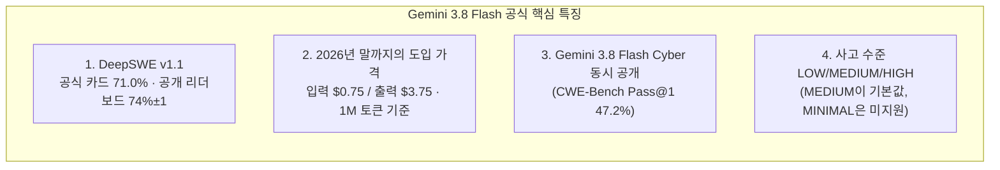
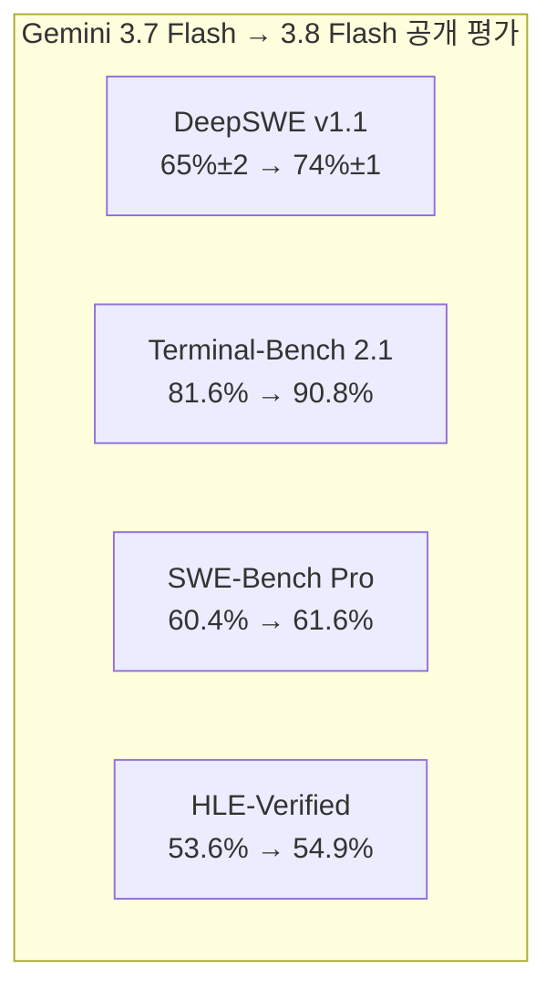
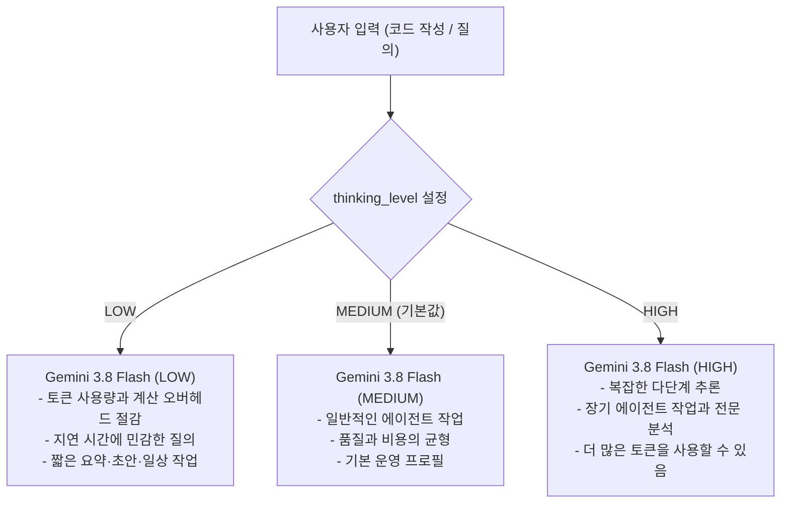
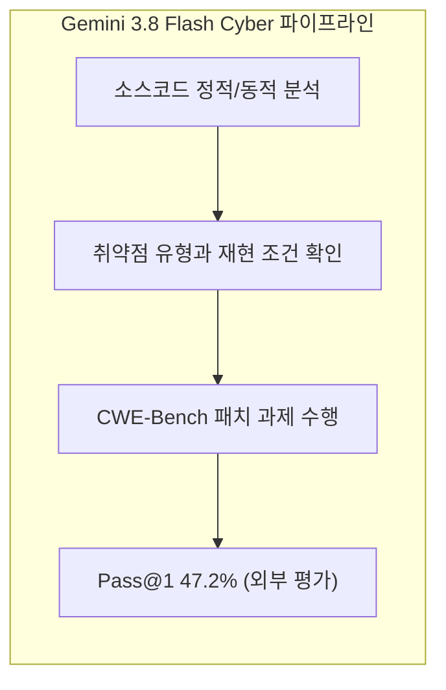
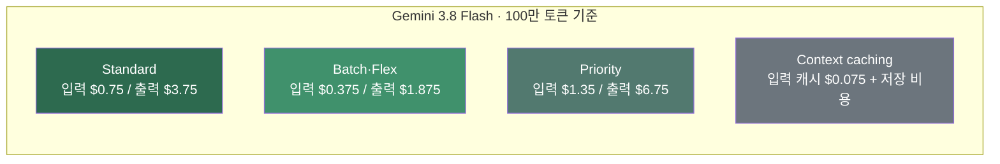
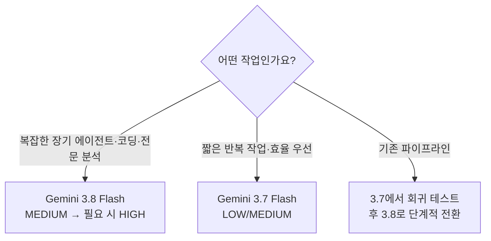

title: "Gemini 3.8 Flash 전격 공개: $0.75 가성비 워크호스의 진화"
slug: gemini-3-8-flash-benchmark-guide
category: 리서치
summary: "2026년 9월 2일 공개된 Gemini 3.8 Flash와 Gemini 3.8 Flash Cyber의 공식 기능·가격·공개 평가를 정리하고, Gemini 3.7 Flash 대비 무엇이 달라졌는지와 실전 활용 시 주의할 점을 분석한 리서치."
tags: gemini,gemini-3-8-flash,google-deepmind,swe-bench,deepswe,coding-agents,benchmarks,research,reddit,community
toc: true
publishedAt: 2026-09-02T16:57:53.155392Z
updatedAt: 2026-09-02T18:20:39.951805Z
syncHash: d5669d2bc2470639a42235936fbf333ad01dfa9406b79a8a2fb4a68dae820235

---

> **이 글의 대상**: 2026년 9월 2일 공개된 Google DeepMind의 신규 모델 `Gemini 3.8 Flash`의 기능과 공개 평가, 사이버 보안 특화 모델(`Gemini 3.8 Flash Cyber`), 그리고 사고 수준(`LOW`·`MEDIUM`·`HIGH`)에 따른 **실전 개발 및 에이전트 활용 가치**를 파악하려는 엔지니어.

> **출처 및 배경 정보**: 본문의 기능·가격·출시 정보는 Google 공식 발표와 개발자 문서를, DeepSWE와 CWE-Bench 수치는 각 공개 리더보드를 사용했다. Reddit 반응은 출시 직후의 정성적 사용자 관찰로만 인용하며, 벤치마크 증거와 섞지 않는다. 벤치마크마다 에이전트 하네스·추론 수준·채점 방식이 다르므로 숫자를 하나의 종합 점수처럼 해석하지 않는다.

> **판정 기준일**: 2026년 9월 4일. 가격·리더보드·제품 롤아웃은 바뀔 수 있으므로, 실제 도입 전에는 본문의 링크에서 최신 값을 다시 확인한다.


## 1. 2026년 9월 2일, Google이 Gemini 3.8 Flash를 출시하다

Google DeepMind는 Gemini 3.7 Flash 출시 약 3주 뒤, 소프트웨어 엔지니어링·에이전트 작업·다단계 추론을 겨냥한 **Gemini 3.8 Flash**와 사이버 보안 전용 변형인 **Gemini 3.8 Flash Cyber**를 함께 발표했다. 3.8 Flash는 `gemini-3.8-flash`라는 안정 버전으로 제공되며, 입력 1,048,576토큰·출력 65,536토큰을 지원한다.



Google은 이번 모델을 “**가장 지능적인 Flash 워크호스**”로 소개하며, 코딩·에이전트·복합 지식 작업을 Flash 가격대에서 처리하는 모델로 포지셔닝했다. 이는 Google의 제품 설명이지, 모든 작업에서 다른 모델을 대체한다는 독립적인 결론은 아니다.

### 먼저 확인할 사실

| 확인 항목 | 현재 확인된 사실 | 해석할 때의 주의점 |
|---|---|---|
| 공식 모델 ID | `gemini-3.8-flash` | 별칭이나 앱의 표시 이름이 아니라 API 요청에서는 모델 ID를 고정한다. |
| 배포 형태 | Gemini API·AI Studio·Google Cloud·Antigravity 등 호스팅 경로 | 현재 공식 문서는 공개 가중치나 로컬 실행 패키지를 제공한다고 말하지 않는다. “로컬에서 돌릴 수 있는 모델”이 아니라 클라우드 모델이다. |
| 입력·출력 한도 | 입력 컨텍스트 최대 1,048,576토큰, 출력 최대 64K토큰(65,536) | 1M 컨텍스트는 지원 한도이지 모든 요청에 프로젝트 전체를 넣어야 한다는 뜻이 아니다. |
| Flash Cyber | Fairwind 프로그램을 통한 신뢰된 방어자 대상 제공 | 일반 Gemini API에서 선택할 수 있는 공개 모델과 동일한 경로로 보면 안 된다. |
| “최고의 Flash” | Google의 제품 포지셔닝 문구 | 독립 벤치마크에서 모든 항목 1위를 뜻하지 않는다. |

따라서 이 글에서 말하는 “프론티어급”은 **특정 장기 코딩·도구 사용·전문 작업 평가에서 고가 모델과 비슷한 구간에 들어왔다**는 의미로 한정한다. 공개 가중치 모델을 내려받아 M-series Mac에서 실행하는 유형의 비교 글은 아니다.

---

## 2. 3.7 대비 무엇이 달라졌나

이번 글의 핵심 비교 기준은 다른 회사 모델이 아니라 바로 전 세대인 `Gemini 3.7 Flash`다. Google은 3.8을 3.7 출시 약 3주 뒤 공개했고, 같은 Flash 가격대와 1M 컨텍스트를 유지하면서 에이전트 코딩·장기 작업·전문 지식 작업의 성능을 끌어올렸다고 설명한다.



### 2-1. Gemini 3.7 Flash와의 비교표

아래 값은 Google Cloud 개발자 문서, Google DeepMind 공식 발표·모델 카드, 그리고 DeepSWE 공개 리더보드에 표시된 결과를 옮긴 것이다. DeepSWE는 113개 장기 소프트웨어 엔지니어링 과제의 리더보드 값이고, 나머지 평가는 각기 다른 데이터셋과 실행 조건을 사용하므로 점수를 합산하거나 하나의 종합 순위로 만들면 안 된다.

| 평가 항목 | Gemini 3.7 Flash | Gemini 3.8 Flash | 변화 |
|---|---:|---:|---:|
| DeepSWE v1.1 | 65%±2 | **74%±1** | +9%p |
| Terminal-Bench 2.1 | 81.6% | **90.8%** | +9.2%p |
| SWE-Bench Pro | 60.4% | **61.6%** | +1.2%p |
| SWE-Atlas | 48.0% | **51.9%** | +3.9%p |
| τ³-bench Banking | 30.9% | **38.1%** | +7.2%p |
| Vals Finance Agent v2 | 59.0% | **61.4%** | +2.4%p |
| Harvey Legal Agent Benchmark | 8.8% | **10.0%** | +1.2%p |
| HLE-Verified | 53.6% | **54.9%** | +1.3%p |
| CharXiv (멀티모달) | 84.5% | **86.2%** | +1.7%p |
| GDP.pdf | 34.0% | **35.0%** | +1.0%p |

### 2-2. Google 공식 모델 카드의 종합 비교표

네트워크에서 공유된 표는 Reddit의 자체 제작 자료가 아니라, Google DeepMind가 공개한 **Gemini 3.8 Flash 모델 카드의 평가 결과 표**를 캡처한 것이다. 한 장에서 가격, 장기 코딩, 지식 업무, 멀티모달, 영상, 컴퓨터 사용, 과학·바이오 연구 평가를 함께 보여주기 때문에 이번 글의 종합 비교표로 사용하기에 적합하다. [Gemini 3.8 Flash 공식 모델 카드](https://deepmind.google/models/model-cards/gemini-3-8-flash/)

아래는 모델 카드의 2026년 9월 표를 블로그에서 읽기 쉬운 Markdown 표로 재구성한 것이다. 별표가 붙은 가격은 2026년 12월 31일까지의 도입 가격이며, 그 이후에는 표준 가격이 적용된다.

| 평가 항목 | Gemini 3.8 Flash | Gemini 3.7 Flash | Claude Opus 5 | Claude Sonnet 5 | GPT-5.6 Sol | GPT-5.6 Terra |
|---|---:|---:|---:|---:|---:|---:|
| 입력 가격 / 1M 토큰 | **$0.75*** | $0.75* | $5.00 | $2.00 | $4.00 | $2.00 |
| 출력 가격 / 1M 토큰 | **$3.75*** | $3.75* | $25.00 | $10.00 | $20.00 | $12.00 |
| DeepSWE v1.1 | 71.0% | 65.3% | **74.0%** | 53.8% | 72.7% | 69.6% |
| GDPval-AA v2 (Elo) | 1545 | 1482 | **1824** | 1584 | 1710 | 1528 |
| Vals Finance Agent v2 | **61.4%** | 59.0% | 58.6% | 53.9% | 53.8% | 54.4% |
| Harvey's Legal Agent Benchmark | **10.0%** | 8.8% | 6.7% | 5.0% | 2.5% | 0.8% |
| Terminal-Bench 2.1 | **89.4%** | 85.8% | 89.1% | 80.4% | 88.8% | 87.4% |
| Terminal-Bench 4.0 | 19.1% | 11.2% | **51.8%** | 12.4% | 37.3% | 23.6% |
| GDP.PDF | 35.0% | 34.0% | 37.0% | 28.0% | **40.0%** | 29.0% |
| CharXiv Reasoning | **86.2%** | 84.5% | 83.7% | 70.1% | 85.8% | 85.9% |
| LVBench (agentic / static) | **87.8% / 87.1%** | 85.4% | 75.4% | 68.5% | 82.1% | 78.9% |
| HLE-Verified | 54.9% | 53.6% | 54.4% | 31.0% | 54.5% | 51.1% |
| OSWorld-2.0 | 59.0% | 50.6% | **75.4%** | 42.6% | 62.6% | 50.2% |
| BioMysteryBench (human-solvable) | 88.8% | 87.1% | **90.1%** | 87.5% | 79.5% | 83.8% |
| BioMysteryBench (human-difficult) | **56.5%** | 43.5% | 49.4% | 34.1% | 44.7% | 49.4% |
| LABBench2 | **86.2%** | 82.1% | 84.2% | 80.1% | 82.1% | 81.2% |

이 표는 한 모델이 모든 항목에서 1등이라는 뜻이 아니다. Gemini 3.8 Flash는 가격, 금융 도구 사용, 법률 에이전트, CharXiv, 영상·바이오 연구 항목에서 강점을 보이지만, Terminal-Bench 4.0·GDPval-AA·OSWorld-2.0처럼 Claude Opus 5가 앞서는 영역도 분명하다. **“프론티어 모델과 비슷하다”는 표현은 평균적인 위치를 말하는 것이지, 작업별 대체 가능성을 보장하는 문장이 아니다.**

또 하나 주의할 점은 같은 이름의 평가라도 출처에 따라 값이 다를 수 있다는 것이다. 예를 들어 모델 카드 표는 DeepSWE를 3.8 71.0%·3.7 65.3%, Terminal-Bench 2.1을 89.4%·85.8%로 제시하지만, Google Cloud 개발자 가이드와 DeepSWE 공개 리더보드는 다른 실행 조건에서 3.8 90.8%·74%±1, 3.7 81.6%·65%±2를 표시한다. 모델 카드 표는 Google이 정리한 특정 평가 스냅샷이고, 공개 리더보드는 별도 하네스·시점의 결과이므로 두 수치를 평균 내거나 하나의 순위로 합치지 않았다.

#### 벤치마크의 역할을 나눠서 보기

| 자료 | 주로 측정하는 것 | 이 글에서의 용도 |
|---|---|---|
| Google 모델 카드 | 코딩·지식 업무·멀티모달·컴퓨터 사용·과학 등 여러 평가의 공식 스냅샷 | 모델이 어떤 영역을 강점으로 내세우는지 확인 |
| Google Cloud 개발자 가이드 | 3.7과 3.8을 같은 표에서 비교한 개발자용 평가 | 세대 간 변화와 API 마이그레이션 판단 |
| DeepSWE v1.1 | 113개 장기 소프트웨어 엔지니어링 과제, `mini-swe-agent` 기반 실행 | 장기 코딩 에이전트의 상대 위치·비용 확인 |
| Artificial Analysis Intelligence Index | 9개 평가를 가중 합산한 독립 지수 | 여러 작업군을 한 화면에서 보는 보조 지표 |
| CWE-Bench | 취약점을 찾아 수정하고 기존 테스트를 통과하는 방어적 보안 패치 | Flash Cyber의 전문 영역 확인 |

DeepSWE와 Artificial Analysis는 모두 유용하지만 “모델의 본질적인 지능”을 직접 측정하는 단일 지표가 아니다. 어떤 하네스, 프롬프트, 도구, 추론 수준, 채점기를 사용했는지까지 함께 읽어야 한다.

### 2-3. 숫자를 어떻게 읽어야 할까

가장 큰 변화는 단순 질의응답 점수보다 **긴 에이전트 작업을 끝까지 이어가는 평가**에서 보인다. DeepSWE와 Terminal-Bench는 각각 장기 소프트웨어 작업과 터미널 도구 사용을 측정하기 때문에, 3.8이 코드를 한 번 생성하는 모델이라기보다 계획·실행·검증 루프를 오래 유지하는 방향으로 강화됐다는 해석이 가능하다.

다만 이 수치는 모델만의 순수 능력치가 아니다. DeepSWE 리더보드는 모든 모델을 `mini-swe-agent`로 실행한다고 밝히지만, 각 모델의 사고 수준과 출력 토큰·비용은 다르다. Terminal-Bench와 Google 내부 평가는 또 다른 하네스와 조건을 사용한다. 따라서 “3.8이 모든 코딩 작업에서 정확히 9%p 좋아졌다”가 아니라, **공개된 특정 평가 조건에서 3.7보다 큰 폭의 개선이 확인됐다**고 쓰는 편이 정확하다.

HLE도 이름을 구분해야 한다. Google 발표의 `HLE-Verified`는 3.8이 54.9%, 3.7이 53.6%이고, Google Cloud 표의 `Humanity's Last Exam (HLE)`는 별도 표기인 45.4%와 45.7%다. 두 행을 하나의 점수로 합치지 않았다.

가격과 컨텍스트는 성능만큼 중요한 비교축이다. 두 모델 모두 1,048,576 입력 토큰과 65,536 출력 토큰을 지원하며, 3.8의 유료 표준 요금은 2026년 12월 31일까지 입력 $0.75·출력 $3.75/1M 토큰의 도입 가격이다. 따라서 이번 업데이트의 포인트는 가격 인하가 아니라 **같은 도입 가격대에서 더 높은 에이전트 성능을 제시했다는 것**이다.

### 2-4. 다른 모델들과 비교하면: DeepSWE v1.1

3.7과 3.8의 변화만 보면 3.8의 세대 상승 폭을 알 수 있지만, “다른 모델보다 어느 정도인가”를 보려면 같은 벤치마크와 실행 하네스를 사용한 표가 필요하다. 아래는 **DeepSWE v1.1의 2026년 9월 2일 스냅샷**에서 대표 모델을 옮긴 것이다. 리더보드는 모든 모델을 `mini-swe-agent`로 실행한다고 밝히며, 점수 외에 평균 실행 비용·출력 토큰·에이전트 단계도 함께 공개한다.

| 모델 | 실행 설정 | DeepSWE v1.1 | 평균 비용 | 출력 토큰 | 단계 |
|---|---|---:|---:|---:|---:|
| Claude Opus 5 | `max` | **74%±4** | $11.84 | 118K | 99 |
| Gemini 3.8 Flash | `high` | **74%±1** | $2.36 | 143K | 166 |
| GPT-5.6 Sol | `max` | 73%±3 | $6.46 | 60K | 61 |
| Claude Fable 5 | `max` | 70%±4 | $21.63 | 119K | 88 |
| GLM-5.3 | `max` | 69%±3 | $3.99 | 80K | 124 |
| Kimi K3 | `max` | 69%±5 | $4.65 | 81K | 98 |
| Gemini 3.7 Flash | `high` | 65%±2 | $2.18 | 107K | 125 |
| DeepSeek-V4 Pro | `max` | 63%±6 | $1.67 | 106K | 155 |
| Claude Opus 4.8 | `max` | 59%±2 | $13.22 | 135K | 120 |
| Qwen3.8 Max | `xhigh` | 57%±3 | $3.73 | 95K | 111 |
| DeepSeek-V4 Flash | `max` | 53%±4 | $0.46 | 108K | 153 |

이 표에서 읽을 수 있는 포인트는 세 가지다.

1. **점수만 보면 3.8은 최상위권**이다. Claude Opus 5와 점 추정치가 같고, GPT-5.6 Sol보다 1%p 높다. 다만 Opus 5의 오차 범위가 더 넓으므로 “3.8이 확실한 단독 1위”라고 쓰면 안 된다.
2. **비용까지 보면 포지션이 더 선명해진다.** 3.8의 평균 실행 비용은 $2.36으로 3.7의 $2.18과 비슷하며, Opus 5·GPT-5.6 Sol·Claude Fable 5보다 낮다. 대신 3.8은 평균 출력 토큰과 에이전트 단계가 더 많아, 단순 토큰 단가만으로 효율을 판단해서는 안 된다.
3. **가장 싼 모델과 가장 높은 점수는 다르다.** DeepSeek-V4 Flash는 $0.46으로 저렴하지만 점수는 53%±4이고, DeepSeek-V4 Pro는 63%±6이다. 어떤 모델이 좋은지는 성공률·비용·속도·작업 실패 시 재시도 비용을 함께 봐야 한다.

이 표는 3.8의 “프론티어급”이라는 표현을 무조건적인 우승 선언으로 만들기보다, **Flash급 가격대에서 최상위권 에이전트 점수를 낸 모델**이라는 의미로 읽게 해준다. 점수와 비용은 리더보드 스냅샷·설정·가격 계산 방식에 따라 변할 수 있으므로, 운영 도입 전에는 최신 값을 다시 확인한다.

### 2-5. 종합 지수로 보는 위치: Artificial Analysis Intelligence Index

DeepSWE가 코딩 에이전트에 초점을 둔 평가라면, **Artificial Analysis Intelligence Index**는 여러 평가를 하나의 지수로 묶어 전체적인 위치를 비교할 때 참고할 수 있다. 현재 공개된 v4.1.1은 GDPval-AA v2, τ³-Banking, Terminal-Bench v2.1, SciCode, Humanity's Last Exam, GPQA Diamond, CritPt, AA-Omniscience, AA-LCR 등 9개 평가를 사용한다. Artificial Analysis가 직접 측정한 외부 지표이지만, 모든 모델의 능력을 완벽하게 대표하는 공식 표준 점수는 아니다. [Artificial Analysis 지수 설명](https://artificialanalysis.ai/models/gemini-3-8-flash/)

아래는 출시 직후 Artificial Analysis 모델 페이지와 모델 릴리스 페이지에 표시된 대표 점수다. 같은 모델이라도 `LOW`·`MEDIUM`·`HIGH`·`MAX` 등 추론 설정에 따라 점수가 달라지므로, 설정을 함께 적었다.

| 모델 | 평가 설정 | Intelligence Index |
|---|---|---:|
| Claude Fable 5.1 | `max` | **66** |
| Claude Opus 5 | `max` | 63 |
| Claude Fable 5 | `max` | 62 |
| GPT-5.6 Sol | `max` | 61 |
| Grok 4.6 | `high` | 61 |
| GLM-5.3 | `max` | 60 |
| Kimi K3 | `max` | 60 |
| Gemini 3.8 Flash | `high` | **59** |
| Qwen3.8 Max | `xhigh` | 58 |
| Claude Opus 4.8 | `max` | 57 |
| Gemini 3.7 Flash | `high` | 56 |
| DeepSeek V4 Pro 0813 | `max` | 53 |
| DeepSeek V4 Flash Vision | `max` | 51 |

Gemini 계열만 따로 보면 3.8은 `LOW` 52, `MEDIUM` 57, `HIGH` 59이고, 3.7은 `LOW` 51, `MEDIUM` 53, `HIGH` 56이다. 즉 3.8 `HIGH`는 3.7 `HIGH`보다 3점 높지만, 3.8 `LOW`와 3.7 `HIGH`를 섞어 비교하면 결론이 달라진다. 같은 사고 수준끼리 비교해야 한다.

이 종합표가 보여주는 결론은 **3.8이 최고 점수의 단독 1위라는 뜻이 아니라, 3.7보다 세 단계 모두 개선됐고 고성능 모델군에 가까워졌다는 것**이다. 반대로 Artificial Analysis는 3.8 `HIGH`가 3.7보다 평균 출력 토큰을 약 30% 더 사용해 Intelligence Index 작업 비용이 약 $0.40에서 $0.58로 증가했다고 분석한다. 같은 입력·출력 단가라도 추론량이 늘면 실제 작업 비용이 올라갈 수 있다는 점을 보여주는 대목이다. [Gemini 3.8 Flash 분석 리포트](https://artificialanalysis.ai/articles/gemini-3-8-flash)

지수의 한계도 함께 적어둘 필요가 있다. 평가 구성과 가중치는 Artificial Analysis의 방법론에 의존하고, 모델별로 API 제공사·추론 설정·출력량이 다르다. 따라서 이 표는 “전체적인 위치를 빠르게 보는 지도”로 사용하고, 코딩 도입 판단에는 앞의 DeepSWE·Terminal-Bench, 실제 서비스에는 자체 회귀 테스트를 함께 사용한다.

### 2-6. 출시 직후 커뮤니티 반응: 빠르다는 평과 신중론이 함께 나온다

출시 당일 Reddit 반응은 아직 장기 사용 표본이 부족하지만, 공식 벤치마크가 보여주지 않는 사용성 신호를 보완해준다. 특히 `Gemini 3.8 Flash Benchmarks` 스레드에서는 “매우 빠르다”, “가격 대비 성능이 좋아 보인다”는 반응과 함께, 일부 사용자가 3.7보다 간단한 웹 UI 작업을 몇 초 일찍 끝냈다고 보고했다. 반면 다른 사용자는 체감 차이가 작거나, 3.8이 약간 더 많은 토큰을 사용했다고 적었다. 이는 통제된 성능 측정이 아니라 개인 환경·프롬프트·요청 길이에 따른 관찰이다. [r/singularity 토론](https://www.reddit.com/r/singularity/comments/1w5d1pz/gemini_38_flash_benchmarks/)

실제 에이전트 사용에 관한 반응도 긍정적이었다. Google Antigravity 관련 스레드에서는 3.8이 효율적이고 이전 모델이 놓친 문제를 찾거나 수정했다는 경험담이 나왔지만, 한 사용자는 2시간 30분 만에 Gemini 쿼터가 35%까지 줄었다고 보고했다. `HIGH`에서 추론 토큰과 도구 호출이 늘 수 있다는 공식 문서의 설명을, 아직은 개인 경험 수준에서 뒷받침하는 사례로 볼 수 있다. [r/google_antigravity 토론](https://www.reddit.com/r/google_antigravity/comments/1w5d0wd/gemini_38_flash_is_out/)

반대로 모델이 모든 사용자에게 동시에 노출되지 않는다는 불만도 반복됐다. 웹 앱·Antigravity·모바일 앱에서 노출 시점이 다르고, 어떤 사용자는 3.8을 봤다가 다시 3.7을 봤다고 이야기했다. 모델에게 버전을 직접 묻는 방식은 오답일 수 있다는 지적도 있었으므로, 실제 확인은 자기보고가 아니라 모델 선택기와 API의 `gemini-3.8-flash` ID를 기준으로 해야 한다. [r/GeminiAI 출시 토론](https://www.reddit.com/r/GeminiAI/comments/1w5awvq/gemini_38_flash_has_released_officially/), [롤아웃 토론](https://www.reddit.com/r/GeminiAI/comments/1w5c4dd/3_8_flash_released_in_webui/)

따라서 출시 직후 커뮤니티의 합의는 “3.8이 모든 면에서 검증됐다”가 아니라, **속도·가성비·코딩 에이전트 체감은 기대를 모으고 있지만, 롤아웃과 쿼터·실제 장기 안정성은 더 지켜봐야 한다**에 가깝다.

---

## 3. 하이브리드 사고 제어: `thinking_level`

Gemini 3.8 Flash는 API에서 `thinking_level`을 `LOW`, `MEDIUM`, `HIGH`로 조절할 수 있다. 기본값은 `MEDIUM`이며, `MINIMAL`은 지원되지 않는다. 따라서 “Low와 High 중 하나를 고르는 스위치”라기보다, 품질·토큰 사용량·지연 시간 사이에서 세 단계로 운영하는 기능에 가깝다.



1. **`LOW`**: 짧은 질의, 빠른 초안, 지연 시간에 민감한 화면에서 토큰 오버헤드를 줄이는 프로필이다. 구체적인 TTFT 수치는 리전·부하·요청 크기에 따라 달라지므로 일반적인 밀리초 수치로 고정해 쓰지 않는다.
2. **`MEDIUM`**: 별도 설정이 없을 때의 기본값이다. 일반적인 코딩·도구 호출·문서 작업의 출발점으로 삼기 좋다.
3. **`HIGH`**: 복잡한 에이전트 작업이나 전문 분석처럼 더 많은 추론을 허용할 때 선택한다. Google은 높은 수준에서 성능을 위해 토큰을 더 사용할 수 있다고 설명하므로, 비용과 출력량도 함께 측정해야 한다.

API를 업그레이드할 때는 예전의 정수형 `thinking_budget`이 아니라 문자열 enum인 `thinking_level`을 사용해야 한다. 또한 공식 개발자 문서는 `temperature`, `top_p`, `top_k` 같은 이전 샘플링 파라미터가 무시될 수 있다고 안내하므로, 모델 버전에 맞는 요청 형식으로 마이그레이션해야 한다.

### 3-1. API 마이그레이션에서 놓치기 쉬운 부분

3.8은 모델 ID만 바꾸면 끝나는 교체가 아니다. Google Cloud 개발자 가이드에는 3.7 계열에서 넘어올 때 요청 형식도 함께 점검하라고 적혀 있다.

| 이전 코드·습관 | 3.8에서의 처리 |
|---|---|
| `thinking_budget` 정수값 | `thinking_level`의 `LOW`·`MEDIUM`·`HIGH` 중 하나로 바꾼다. 기본값은 `MEDIUM`이다. |
| `MINIMAL` 사고 수준 | 3.8에서는 지원되지 않으므로 보내지 않는다. |
| `temperature`, `top_p`, `top_k` | 기존 샘플링 제어값에 기대지 말고 사고 수준·구조화 출력으로 동작을 설계한다. 공식 가이드에서는 이 값들이 무시될 수 있다고 안내한다. |
| `frequency_penalty`, `presence_penalty`, `candidate_count` | 공식 가이드가 지원하지 않는 매개변수로 분류하므로 레거시 요청에서 제거한다. |
| 함수 호출 응답 | 선행 함수 호출의 `id`·`name`·실행 횟수와 정확히 맞춘다. |

특히 오래된 Gemini SDK 래퍼가 `temperature`나 `thinking_budget`을 조용히 붙이는 경우가 있다. 전환 시에는 실제 전송 JSON을 한 번 캡처하고, 구조화 출력·함수 호출·멀티턴 이력·빈 턴까지 회귀 테스트하는 것이 좋다.

---

## 4. 사이버 보안 특화: Gemini 3.8 Flash Cyber와 Fairwind 프로그램

Google은 이번 발표에서 소프트웨어 보안 강화를 목적으로 훈련된 전용 변형 모델 **Gemini 3.8 Flash Cyber**를 함께 선보였다.



- **CWE-Bench Pass@1 47.2%**: Collinear이 운영하는 외부 패치 평가에서 Gemini 3.8 Flash Cyber가 100개 보안 패치 과제의 Pass@1 47.2%를 기록했다. 이 평가는 취약점을 찾는 CyberGym과 달리, 주어진 코드의 문제를 수정하고 기존 테스트를 통과시키는 능력을 본다.
- **내부 취약점 탐지 평가**: Google은 20개 프로그래밍 언어를 포함한 내부 평가에서 70%를 넘는 성공률을 보고했지만, 이는 외부에서 동일 조건으로 재현한 리더보드 점수가 아니다.
- **Fairwind 프로그램 배포**: Flash Cyber는 일반 Gemini API 모델처럼 공개된 것이 아니라, 정부·핵심 인프라 운영자·소프트웨어 유지보수 조직 등 신뢰된 방어 조직에 우선 제공된다. 일반 개발자가 사용할 수 있는 공개 경로는 Gemini 3.8 Flash이며, Cyber 변형의 접근 권한은 Fairwind 신청·심사 범위로 봐야 한다.

### 4-1. CWE-Bench에서도 다른 모델과 비교하면

보안 패치 영역만 따로 보면 Gemini 3.8 Flash Cyber의 위치를 더 구체적으로 볼 수 있다. 아래는 CWE-Bench 공개 리더보드의 Pass@1 값이다. 일반 Flash 모델과 Cyber 특화 모델이 섞여 있으므로, 이 표를 전체 코딩 능력의 순위로 해석해서는 안 된다.

| 모델 | CWE-Bench Pass@1 |
|---|---:|
| Claude Fable 5 | 47.8% |
| Gemini 3.8 Flash Cyber | **47.2%** |
| GPT-5.6 Sol | 44.2% |
| Gemini 3.7 Flash | 44.0% |
| Claude Opus 4.8 | 42.0% |
| DeepSeek-V4 Flash | 30.4% |

3.8 Flash Cyber는 이 보안 패치 평가에서 상위권에 있지만, 일반 Gemini 3.8 Flash의 DeepSWE 점수와 Cyber 모델의 CWE-Bench 점수를 서로 직접 비교하면 안 된다. 하나는 장기 소프트웨어 엔지니어링, 다른 하나는 취약점 수정과 테스트 통과를 평가하기 때문이다. [CWE-Bench 공개 리더보드](https://cwe-bench.com/)

---

## 5. 비용 구조: $0.75는 도입 가격이며, 사용 방식에 따라 달라진다

Gemini 3.8 Flash의 강점은 단순히 입력 단가가 낮다는 데 있지 않다. 표준·배치·Flex·Priority를 작업 성격에 맞게 선택할 수 있다는 점까지 포함해 비용을 봐야 한다.



- 표준 유료 요금은 2026년 12월 31일까지 입력 **$0.75**, 출력 **$3.75**다. 이는 영구 가격이 아니라 도입 가격이며, 2027년 1월 1일부터는 입력 $1.50·출력 $7.50으로 바뀐다.
- Batch와 Flex는 같은 기간 입력 $0.375·출력 $1.875로 표준의 절반이다. 반대로 Priority는 입력 $1.35·출력 $6.75다.
- Context caching은 캐시된 입력 토큰 요금과 시간당 저장 비용이 별도로 붙는다. 따라서 “1M 컨텍스트를 켜면 항상 $0.75”가 아니라, 새로 읽은 입력·캐시 재사용·출력·사고 토큰을 나눠 계산해야 한다.
- 출력 가격에는 thinking 토큰이 포함된다. `HIGH`를 많이 사용할수록 출력에 보이는 답변 길이와 별개로 과금 토큰이 늘 수 있으므로, 모델 선택과 함께 `thinking_level`도 비용 예산에 넣는다.

### 5-1. 요청 하나의 비용을 직접 계산해보기

예를 들어 도입 가격 기준으로 입력 10만 토큰과 출력 2만 토큰을 사용했다고 하자. 출력에는 보이지 않는 사고 토큰도 포함될 수 있으므로 실제 청구량은 usage 응답을 확인해야 하지만, 단순한 상한 감각은 다음처럼 잡을 수 있다.

```text
입력: 0.1M × $0.75 = $0.075
출력: 0.02M × $3.75 = $0.075
합계: 약 $0.15
```

같은 토큰량을 2027년 1월 1일 이후 표준 가격으로 계산하면 약 $0.30이다. 실제 비용에는 캐시 적중·캐시 저장, Batch/Flex/Priority 선택, Google Search·Maps grounding 요청, 반복적인 에이전트 턴이 추가로 영향을 준다. 그러므로 “1회 호출 단가”보다 **작업 하나를 성공적으로 끝내는 데 든 총 토큰과 재시도 비용**을 기록하는 편이 운영 판단에 가깝다.

---

## 6. 공식 사용 사례와 실전에서의 주의점

Google이 공개한 예시는 단순 코드 자동완성보다 **긴 지시를 따라 결과물을 완성하는 작업**에 초점이 맞춰져 있다. Google Antigravity에서는 반복 지시를 활용한 게임 제작과 상호작용 가능한 DOS 버전의 지도 예시를 소개했고, USGS 실제 데이터를 사용하는 지형 시각화도 공개했다. Google AI Studio에서는 기기 분해를 확인할 수 있는 Three.js 기반 3D 시각화 예시를 제시했다.

이 예시들은 “한 번의 프롬프트로 모든 프로젝트가 완성된다”는 보장이 아니라, 3.8 Flash가 코드 생성·도구 사용·멀티모달 입력을 하나의 작업 흐름으로 묶는 방향을 보여준다. 실제 서비스에 적용할 때는 생성된 코드의 테스트, 데이터 출처 확인, 권한 제한을 별도로 둬야 한다.

공식 API 문서 기준으로는 함수 호출, 구조화 출력, 코드 실행, File Search, URL Context, Search/Maps grounding 등을 조합할 수 있고, Computer Use는 Preview 성격으로 표시된다. 다만 기능 지원 범위와 과금 방식은 API·AI Studio·Cloud·Antigravity 채널마다 다를 수 있으므로, “모델이 지원한다”와 “내가 쓰는 제품 경로에서 바로 켤 수 있다”를 같은 말로 쓰면 안 된다.

### 6-1. 실전에서 먼저 확인할 것

1. **사고 수준과 토큰 예산**: `HIGH`가 항상 좋은 선택은 아니다. Google은 복잡한 작업에서 더 많은 추론 단계와 도구 호출을 수행할 수 있고, 높은 수준에서는 토큰을 더 사용할 수 있다고 설명한다. 일반 작업은 기본값인 `MEDIUM`에서 시작하고, 품질이 부족한 작업만 `HIGH`로 올리는 방식이 비용을 통제하기 쉽다.
2. **긴 컨텍스트의 실제 비용**: 1M 입력 한도는 지원 범위이지, 프로젝트 전체를 매 요청마다 넣어야 한다는 뜻은 아니다. 반복되는 문서는 캐시를 검토하고, 실제로 필요한 파일·로그·근거만 주입해야 한다.
3. **출력 검증**: 모델 카드도 환각, 간헐적인 지연·타임아웃 가능성을 제한사항으로 명시한다. 코드 병합, 보안 패치, 데이터 변경은 테스트·샌드박스·사람 승인을 거쳐야 한다.
4. **버전 회귀 테스트**: 3.7과 3.8은 모델 ID와 평가 결과가 다르므로, 기존 프롬프트·도구 호출·구조화 출력의 회귀 테스트를 다시 실행해야 한다. 벤치마크 상승이 내 저장소의 성공률 상승을 자동으로 의미하지는 않는다.

---

## 7. 실전 가이드: 3.8로 옮길 작업과 3.7에 남길 작업



| 작업 유형 | 우선 선택 | 권장 설정 | 판단 기준 |
|---|---|---|---|
| 대화형 코딩·도구 호출·장기 에이전트 | Gemini 3.8 Flash | `LOW` 또는 `MEDIUM` | 3.7 대비 Terminal-Bench·DeepSWE 상승 폭이 큰 영역 |
| 복잡한 디버깅·다단계 분석 | Gemini 3.8 Flash | `HIGH` | 품질을 우선하되 추론·도구 토큰 증가를 예산에 반영 |
| 대량 분류·요약·짧은 반복 호출 | Gemini 3.7 Flash | `LOW` 또는 `MEDIUM` | 3.8의 추가 성능이 필요하지 않다면 기존 비용·동작 유지 |
| 배포·보안 패치·데이터 변경 | 3.8 또는 3.7 | 작업에 맞는 수준 | 모델이 제안하더라도 테스트와 사람 검토는 별도 필요 |

3.8이 모든 요청에서 자동으로 우월하다고 가정하기보다, 다음 순서로 옮기는 편이 안전하다.

1. 모델 ID와 `thinking_level`을 고정하고 3.7의 성공률·실패 유형·평균 지연·입출력 토큰·호출 비용을 기록한다.
2. 동일한 프롬프트, 도구 정의, 데이터 샘플로 3.7과 3.8을 나란히 실행한다.
3. 일반 요청은 `MEDIUM` 또는 `LOW`에서 시작하고, 실패하거나 복잡도가 높은 요청에만 `HIGH`를 적용한다.
4. 구조화 출력, 함수 호출, 장문 컨텍스트, 한국어 응답처럼 실제 서비스의 핵심 경로를 별도 회귀 테스트한다.
5. 전환 초기에는 3.7을 fallback으로 남겨 비용·지연·품질 변화를 관찰한다.

---

## 8. 공식 출처 및 참고 자료 (References)

- [Google 공식 발표 — Gemini 3.8 Flash와 3.8 Flash Cyber](https://blog.google/innovation-and-ai/models-and-research/gemini-models/3-8-flash-and-3-8-flash-cyber/)
- [Gemini API 최신 모델 및 마이그레이션 가이드](https://ai.google.dev/gemini-api/docs/generate-content/latest-model)
- [Google Cloud 개발자 가이드 — 3.7 대비 공식 벤치마크](https://docs.cloud.google.com/gemini-enterprise-agent-platform/models/guides/gemini-3-8-flash)
- [Gemini API 가격표](https://ai.google.dev/gemini-api/docs/pricing?hl=en)
- [Gemini 3.8 Flash 모델 카드](https://deepmind.google/models/model-cards/gemini-3-8-flash/)
- [Gemini 3.7 Flash 공식 소개](https://blog.google/innovation-and-ai/models-and-research/gemini-models/introducing-gemini-3-7-flash/)
- [Artificial Analysis — Gemini 3.8 Flash 분석 및 종합 지수](https://artificialanalysis.ai/articles/gemini-3-8-flash)
- [Artificial Analysis — Gemini 3.8 Flash 모델 페이지](https://artificialanalysis.ai/models/gemini-3-8-flash/)
- [DeepSWE 공개 리더보드](https://deepswe.datacurve.ai/)
- [CWE-Bench 공개 리더보드](https://cwe-bench.com/)
- [Google Fairwind 프로그램](https://blog.google/innovation-and-ai/technology/safety-security/fairwind-program/)
- [Reddit r/singularity — Gemini 3.8 Flash Benchmarks](https://www.reddit.com/r/singularity/comments/1w5d1pz/gemini_38_flash_benchmarks/)
- [Reddit r/google_antigravity — Gemini 3.8 Flash is out](https://www.reddit.com/r/google_antigravity/comments/1w5d0wd/gemini_38_flash_is_out/)
- [Reddit r/GeminiAI — Gemini 3.8 Flash 출시·롤아웃 토론](https://www.reddit.com/r/GeminiAI/comments/1w5awvq/gemini_38_flash_has_released_officially/)

### 출처를 읽는 순서

1. **제품 사양**은 Google API 문서와 모델 카드에서 확인한다. 모델 ID, 컨텍스트·출력 한도, 사고 수준, 지원 채널처럼 구현에 직접 영향을 주는 정보가 여기에 있다.
2. **성능 비교**는 평가의 원출처를 확인한다. Google이 발표한 수치는 모델 카드·Cloud 가이드의 조건으로, DeepSWE·CWE-Bench·Artificial Analysis 값은 각각의 하네스와 방법론으로 기록한다.
3. **사용성 반응**은 Reddit처럼 출시 직후 관찰을 보완 자료로만 사용한다. 개인의 “빠르다”·“쿼터를 많이 쓴다”는 경험은 재현 가능한 벤치마크가 아니다.

이 순서를 지키면 제품 소개 문구, 공식 평가, 독립 평가, 커뮤니티 체감이 한 표 안에서 서로 다른 종류의 근거라는 점을 놓치지 않게 된다.

---

## 9. 마치며 — 3.7보다 강해졌지만 운영 기준은 따로 세워야 한다

`Gemini 3.8 Flash`의 가장 설득력 있는 변화는 이름이나 가격이 아니라, 같은 Flash 계열 안에서 **장기 에이전트와 코딩 작업의 성공률을 끌어올렸다는 점**이다. Google Cloud의 비교표에서는 Terminal-Bench 2.1이 81.6%에서 90.8%로, SWE-Bench Pro가 60.4%에서 61.6%로 상승했다. 공개 DeepSWE 리더보드에서도 3.8 Flash High는 74%±1%, 3.7 Flash High는 65%±2%로 집계된다. 종합 지수인 Artificial Analysis Intelligence Index에서도 3.8 High는 59점으로 3.7 High의 56점보다 3점 높다.

다만 이 수치들은 서로 다른 데이터셋과 실행 하네스에서 나온 결과이므로 하나의 종합 점수처럼 합산해서는 안 된다. Artificial Analysis 지수 역시 유용한 외부 요약 지표이지 절대적인 지능 인증서가 아니다. 내 저장소와 도구 체계에서 실제로 좋아졌는지는 동일한 작업 세트로 확인해야 한다.

정리하면 다음과 같다.

1. **장기 코딩·도구 사용·복잡한 분석**은 3.8을 우선 검증한다.
2. **짧고 반복적인 대량 요청**은 3.7의 비용·지연·기존 동작이 충분하다면 그대로 유지한다.
3. **`thinking_level`은 품질 스위치이자 비용 스위치**다. `MEDIUM`을 기본으로 두고 `HIGH`는 실패 재시도나 고난도 작업에 제한한다.
4. 입력 1,048,576토큰·출력 65,536토큰 한도와 멀티모달 입력은 그대로 강점이지만, 긴 컨텍스트를 매번 보내는 것과 비용 효율은 별개의 문제다.
5. 표준 API 가격은 2026년 12월 31일까지 입력 $0.75/출력 $3.75이며 이후 인상 예정이므로, 장기 운영 예산에는 정가와 캐시·배치 사용량까지 함께 반영한다.

결국 3.8은 3.7을 무조건 대체하는 모델이라기보다, **3.7의 효율적인 기본 경로 위에 복잡한 작업을 맡길 수 있는 상위 경로를 추가하는 업데이트**에 가깝다. 두 모델을 같은 평가 세트로 측정하고 작업 난도에 따라 라우팅하면, 성능 향상과 비용 통제를 함께 가져갈 수 있다.
