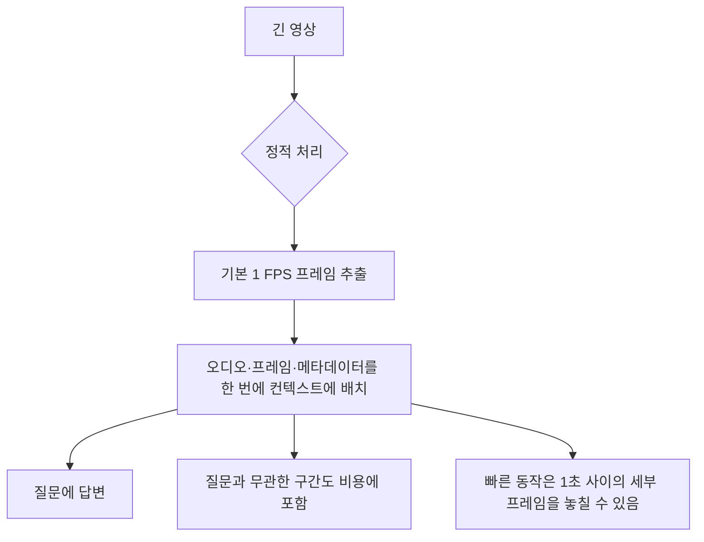
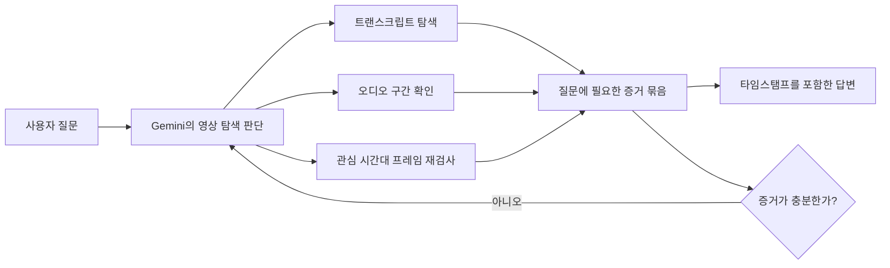
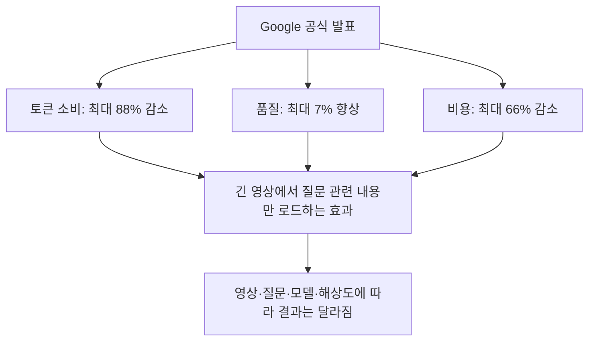
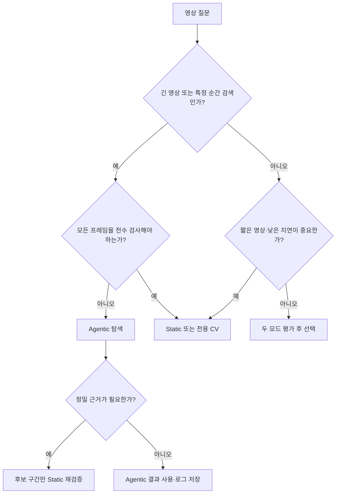
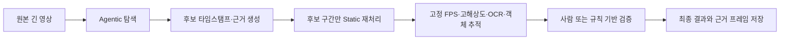

title: "Gemini Agentic Video Understanding: 1fps 고정 샘플링을 넘어서는 능동적 영상 탐색"
slug: gemini-agentic-video-understanding-guide
category: 리서치
summary: "Gemini 3.7 Flash·3.6 Flash·3.5 Flash Lite에 추가된 Agentic Video Understanding의 실제 동작, 정적 1fps 처리와의 차이, 토큰 계산, API 사용법, 성능 수치와 한계를 공식 문서 기준으로 정리한다."
tags: gemini,agentic-video,active-perception,multimodal,video-understanding,deepmind,gemini-api,research
toc: true
publishedAt: 2026-09-02T11:35:13.045596Z
updatedAt: 2026-09-02T11:51:41.756866Z
syncHash: b850fef7b27e3af997c5821982c257e43b2a08b43f800ac7c723b0aa023cbbcd

---

> **이 글의 대상**: 영상 질문응답·검색·검수 파이프라인을 만들면서, 고정 FPS 샘플링의 비용과 누락을 줄이고 싶은 AI·ML 엔지니어.

> **팩트체크 기준일**: 2026년 9월 2일. Google DeepMind의 출시 글과 Gemini API 공식 문서를 1차 자료로 삼았다. 문서에 공개되지 않은 내부 모듈명·정확한 샘플링 스케줄은 구현 사실처럼 단정하지 않는다.

## 먼저 결론 — Agentic Video는 ‘새 모델’보다 ‘영상 처리 모드’에 가깝다

Google이 2026년 9월 1일 공개한 **Agentic Video Understanding**은 별도의 영상 전용 모델 이름이 아니다. Gemini가 영상 전체를 정해진 FPS로 한 번에 읽는 대신, 질문을 바탕으로 시간축을 탐색하고 필요한 자막·오디오·프레임을 선택적으로 불러오는 **API 처리 모드**다.

현재 공식 문서에 명시된 지원 모델은 다음과 같다.

| 항목 | 내용 |
|---|---|
| 지원 모델 | Gemini 3.7 Flash, Gemini 3.6 Flash, Gemini 3.5 Flash Lite |
| 활성화 방법 | 영상 입력의 `processing`을 `"agentic"`으로 지정 |
| 기본 모드 | 모든 Gemini 모델에서 정적 처리, 기본 1 FPS |
| 공식 발표 수치 | 토큰 최대 88% 감소, 품질 최대 7% 향상, 비용 최대 66% 감소 |
| 추가 기능 요금 | 별도 기능 요금 없음, 일반 Gemini API 토큰 가격 적용 |

여기서 중요한 표현은 모두 ‘최대(up to)’다. 모든 영상·질문·해상도에서 같은 절감률이 재현된다는 뜻이 아니며, Google의 평가 조건과 긴 영상 중심 사용 사례에서 얻은 상한값이다.

## 1. 기존 정적 처리의 문제는 ‘1fps 자체’보다 질문과 무관한 입력을 미리 넣는 데 있다

Gemini API의 정적 비디오 처리는 기본적으로 초당 1프레임을 추출해 컨텍스트에 한 번에 배치한다. 짧은 영상이나 전체 구간의 프레임을 고르게 확인해야 하는 작업에는 단순하고 예측 가능하다. 반면 긴 영상에서 특정 순간 하나를 찾을 때는 대부분의 입력이 질문과 직접 관련이 없을 수 있다.



다만 “1fps면 항상 실패한다”는 표현도 정확하지 않다. 장면의 큰 흐름·발화 내용·강의 요약처럼 초 단위 관찰로 충분한 작업에서는 정적 처리가 오히려 빠르고 안정적일 수 있다. Google도 5분 미만의 짧은 영상에서 지연 시간이 중요하거나, 영상 전체를 프레임 단위로 확인해야 할 때 정적 모드를 권장한다.

### 정적 모드의 토큰을 실제 숫자로 계산해보기

공식 문서의 정적 처리 계산은 대략 다음과 같다.

- 저해상도 프레임: 초당 66토큰
- 그 외 프레임: 초당 258토큰
- 오디오: 초당 32토큰
- 메타데이터: 별도 추가

따라서 대략적인 입력 토큰은 저해상도에서 초당 100토큰, 고해상도에서 초당 300토큰으로 볼 수 있다.

| 영상 길이 | 저해상도 정적 처리 | 고해상도 정적 처리 |
|---:|---:|---:|
| 1분 | 약 6,000토큰 | 약 18,000토큰 |
| 10분 | 약 60,000토큰 | 약 180,000토큰 |
| 90분 | 약 540,000토큰 | 약 1,620,000토큰 |

이는 **API 입력 토큰의 근사치**이지, 사용자의 로컬 GPU 메모리 사용량을 그대로 의미하지 않는다. Gemini API를 호출하는 로컬 클라이언트라면 영상 디코딩과 업로드 메모리는 필요하지만, Gemini의 추론 가중치를 로컬 GPU에 올리는 구조는 아니다.

## 2. Agentic Video의 핵심: 모델이 무엇을, 언제, 어떤 모달리티로 볼지 선택한다

Agentic 모드에서는 모델이 내부 영상 도구를 사용해 시간축을 탐색한다. Google의 설명에 따르면 모델은 질문에 맞춰 영상의 관련 구간을 검색·스캔·재검사하면서 프레임, 오디오, 트랜스크립트를 필요할 때 불러온다. 짧은 구간을 더 높은 FPS로 다시 보거나, 음성 단서와 시각 단서를 교차 확인하는 것도 이 모드의 목적에 포함된다.



이 그림은 공개된 동작을 이해하기 위한 개념도다. Google은 내부 도구의 실제 이름, 호출 인자, 검색 라운드 수, 정확한 FPS 상한을 공개하지 않았다. 따라서 `request_frames(start=..., fps=...)` 같은 이름을 실제 개발자가 호출하는 공개 API처럼 설명하면 안 된다.

### 인간의 도약 안구 운동은 좋은 비유지만, 구현 사실은 아니다

주변 시야로 전체 장면을 훑고 관심 지점에 시선을 옮긴 뒤 중심와로 자세히 보는 인간의 시각은 Agentic Video를 설명하기 좋은 비유다. 하지만 “Gemini가 인간의 Saccade를 그대로 모사한다”거나 “Epistemic Uncertainty를 측정해 관찰 예산을 조절한다”고 단정할 공개 근거는 없다.

더 정확한 표현은 이렇다.

> Agentic Video는 질문 조건에 따라 영상의 관찰 범위와 밀도를 동적으로 정하는 기능이며, 인간의 능동적 지각과 닮은 설계 직관을 제공한다. 내부 추론 과정과 도구 호출 정책은 공개 API의 계약이 아니다.

## 3. 무엇이 실제로 좋아지는가

Google은 Agentic Video의 주요 활용 사례로 다음을 제시한다.

| 활용 사례 | 정적 1 FPS의 약점 | Agentic 모드의 접근 |
|---|---|---|
| 찰나의 순간 찾기 | 중요한 상태 변화가 프레임 사이에 있을 수 있음 | 관심 구간을 다시 탐색해 sub-second moment retrieval 시도 |
| 긴 영상에서 특정 정보 검색 | 대부분의 장면을 토큰으로 지불 | 질문과 관련된 구간 중심으로 탐색 |
| 이상 징후 감지 | 처음부터 높은 FPS로 보면 비용 증가 | 후보 구간을 찾아 높은 밀도로 재검사 |
| 동작·객체 수 세기 | 균등 샘플만으로 빠른 반복 동작을 놓칠 수 있음 | 같은 구간을 다른 FPS로 재관찰 |
| 강의·회의 분석 | 영상 전체를 고해상도로 넣으면 비쌈 | 음성·자막을 먼저 활용하고 필요한 장면을 확인 |

구글의 공식 발표 수치는 다음처럼 읽어야 한다.



이는 Google이 자체 평가한 결과다. “모든 영상에서 88% 절감”이나 “정적 모드보다 언제나 정확”이라는 보증이 아니다. 특히 프레임 하나하나의 픽셀을 빠짐없이 검사해야 하는 작업은 선택적 탐색보다 정적 처리와 별도 비전 파이프라인이 더 적합할 수 있다.

## 4. 실제 API에서 켜는 방법

Agentic Video는 영상 입력의 `processing` 필드를 `"agentic"`으로 지정한다. 다음 예시는 Google 공식 Gemini API 문서의 Python 흐름을 간소화한 것이다.

```python
import time
from google import genai

client = genai.Client()

video_file = client.files.upload(file="lecture.mp4")
while video_file.state.name == "PROCESSING":
    time.sleep(2)
    video_file = client.files.get(name=video_file.name)

interaction = client.interactions.create(
    model="gemini-3.7-flash",
    input=[
        {
            "type": "video",
            "uri": video_file.uri,
            "mime_type": video_file.mime_type,
            "processing": "agentic",
        },
        {
            "type": "text",
            "text": (
                "이 영상에서 발표자가 제시한 세 가지 핵심 주장을 찾고, "
                "각 주장에 해당하는 타임스탬프와 시각·음성 근거를 함께 적어줘."
            ),
        },
    ],
)

print(interaction.output_text)
```

YouTube URL을 입력으로 사용할 수도 있지만, 공식 문서의 제한상 공개 영상만 대상으로 해야 한다. 로컬 파일이나 100MB 이상인 큰 파일은 일반적으로 Files API가 적합하다. 문서 기준 File API의 최대 파일 크기는 유료 사용량에서 20GB, 무료 사용량에서 2GB이며, 실제 계정·제품별 제한은 호출 전에 다시 확인해야 한다.

### 정적 처리와 비교할 때 바뀌는 부분

정적 모드에서는 구간과 FPS를 개발자가 직접 지정할 수 있다.

```python
interaction = client.interactions.create(
    model="gemini-3.7-flash",
    input=[
        {
            "type": "video",
            "uri": video_file.uri,
            "mime_type": video_file.mime_type,
            "processing": {
                "type": "static",
                "start_offset": 1200,
                "end_offset": 1500,
                "fps": 2.0,
            },
        },
        {
            "type": "text",
            "text": "이 20분 구간에서 장면 전환과 화면 속 숫자를 모두 기록해줘.",
        },
    ],
)
```

`fps`, `start_offset`, `end_offset` 같은 세부 정적 처리 설정은 Agentic 모드가 아니라 `static` 모드에서 사용하는 옵션이다. Agentic 모드의 장점은 이런 스케줄을 애플리케이션이 전부 직접 설계하지 않아도 된다는 점이지만, 그만큼 실제 탐색 결과와 토큰 사용량이 입력 질문과 영상 내용에 따라 달라진다.

## 5. 언제 Agentic을 쓰고, 언제 Static을 써야 할까

가장 간단한 판단 기준은 질문의 동사다.

- “**언제·어디서·어떤 장면이었나?**”를 묻고 영상이 길다면 Agentic부터 시작한다.
- “**모든 프레임에서 빠짐없이 찾아라**”라면 Static 또는 전용 CV 파이프라인을 선택한다.
- “**작은 글자를 읽어라**”라면 Agentic으로 후보 구간을 찾은 뒤 Static 고해상도로 검증한다.
- **짧은 영상에서 빠른 첫 응답**이 중요하다면 Static을 먼저 시도한다.



| 실제 업무 | 질문의 형태 | 권장 시작점 | 최종 처리 |
|---|---|---|---|
| 90분 강의에서 “탄소 배출량을 언급한 시점” 찾기 | 특정 발언의 위치·근거 검색 | Agentic | 반환된 시점을 다시 재생해 확인 |
| 2시간 회의에서 “예산 삭감 논의만” 추출 | 음성·자막 중심의 선택적 검색 | Agentic | 발언 시점과 요약을 함께 저장 |
| CCTV에서 한 프레임의 안전모 착용 여부 판정 | 작은 객체의 정밀 판독 | Agentic으로 후보 탐색 | 후보 주변을 Static 고해상도·객체 검출로 재검증 |
| 생산 라인의 모든 제품 개수 세기 | 전 구간·반복 동작 전수 검사 | Static 또는 전용 CV | 고정 FPS·추적 알고리즘으로 재현성 확보 |
| 30초 광고에서 모든 컷과 자막 추출 | 짧은 영상 전체 검사 | Static | 필요한 FPS와 `media_resolution`을 직접 지정 |
| 실시간 카메라 스트림에 즉시 제어 신호 보내기 | 지속 입력·낮은 지연 | 별도 스트리밍·엣지 파이프라인 | 파일 기반 Agentic Video를 실시간 제어 루프로 사용하지 않음 |

### 사례로 보면 경계가 더 분명하다

**회의 녹화 검색**은 Agentic Video에 잘 맞는다. “누가 언제 장애 원인을 데이터베이스 마이그레이션이라고 설명했는가?”처럼 답이 영상 전체에 흩어져 있고, 필요한 구간이 질문마다 달라지기 때문이다. 모델은 먼저 음성·트랜스크립트 단서를 활용하고, 필요한 화면만 다시 확인할 수 있다.

**제품 검수**는 혼합형이 낫다. “불량품이 등장한 대략적인 시점”을 찾는 데 Agentic을 쓰고, 실제 합격·불합격 판정은 후보 구간의 고정 FPS 프레임, OCR, 객체 검출, 규칙 기반 검사로 다시 처리한다. 모델의 한 번의 자연어 답변을 생산 품질의 최종 판정으로 사용하면 안 된다.

**실시간 관제**는 이 기능의 주 사용처로 보면 안 된다. Agentic Video 공식 사용 흐름은 업로드한 영상이나 YouTube 영상을 질의하는 방식이며, 내부 탐색 라운드 때문에 짧은 영상의 TTFT가 늘 수도 있다. 초 단위 제어가 필요한 시스템은 엣지에서 저지연 검출을 수행하고, Agentic Video는 사후 조사·검색·리포트 생성에 배치하는 편이 현실적이다.

Google 문서도 짧은 영상에서는 Agentic 탐색 과정의 내부 라운드 때문에 첫 토큰까지 시간이 조금 늘어날 수 있다고 설명한다. 따라서 “토큰을 아끼는 모드 = 항상 더 빠른 모드”는 아니다.

## 6. 실전 프롬프트는 ‘무엇을 볼지’보다 ‘어떤 증거를 남길지’까지 지정한다

Agentic Video가 질문에 맞춰 관찰하도록 만들려면, 단순히 “요약해줘”라고 요청하는 것보다 검색 대상과 검증 형식을 함께 지정하는 편이 낫다.

```text
다음 규칙으로 영상을 분석해줘.

1. 먼저 전체 영상에서 질문과 관련된 후보 구간을 찾는다.
2. 후보 구간은 MM:SS 형식의 시작·끝 타임스탬프로 제시한다.
3. 음성으로 확인한 사실과 화면에서 확인한 사실을 분리한다.
4. 빠른 동작·작은 글자·가려진 장면처럼 확신이 낮은 항목은 '확인 필요'로 표시한다.
5. 최종 답변에는 결론보다 근거 타임스탬프를 먼저 적는다.

질문: 발표자가 데이터베이스 마이그레이션에 대해 제시한 위험 세 가지는 무엇인가?
```

다만 프롬프트가 타임스탬프를 요구한다고 해서 모델의 판정이 자동으로 사실이 되는 것은 아니다. 중요한 감사·안전·품질관리 업무에서는 반환된 시점을 사람이 재생해 확인하거나, 별도의 프레임 추출기와 OCR·객체 추적 결과를 교차 검증해야 한다.

## 7. 비용과 품질을 함께 측정하는 방법

Agentic 모드를 도입할 때는 “응답이 좋아 보인다”보다 다음 지표를 같은 평가셋에서 비교하는 것이 좋다.

| 기록할 지표 | 확인할 질문 |
|---|---|
| 정답률·근거 정확도 | 핵심 사건을 맞혔고 타임스탬프가 실제 근거를 가리키는가? |
| 입력·사고·도구 사용 토큰 | 토큰 절감이 실제 청구 비용 감소로 이어졌는가? |
| TTFT와 전체 지연 | 탐색 라운드가 사용자 경험을 늦추지는 않는가? |
| 누락률 | 빠른 장면·작은 텍스트·무음 구간을 놓치지는 않는가? |
| 재시도율 | 사람이 다시 질문하거나 구간을 재생해야 하는 비율은 얼마인가? |

공식 문서에 따르면 Agentic 모드의 탐색에서 생성된 내비게이션 추론 토큰은 `total_thought_tokens`, 필요할 때 불러온 프레임·오디오·트랜스크립트는 `total_tool_use_tokens`로 집계된다. 이 값을 함께 기록하면 단순히 입력 토큰만 세는 것보다 실제 비용 구조를 잘 볼 수 있다.

추천하는 최소 실험은 다음과 같다.

1. 동일한 20~50개 영상과 질문 세트를 고정한다.
2. 정적 1 FPS와 Agentic 모드를 각각 실행한다.
3. 답변뿐 아니라 근거 타임스탬프의 정확도를 사람이 채점한다.
4. 짧은 영상·긴 영상·빠른 동작·작은 텍스트를 별도 그룹으로 나눈다.
5. 평균값과 최악값을 모두 보고 운영 모드를 결정한다.

## 8. 실무에서 체감할 수 있는 이득은 어디에 있을까

Agentic Video의 가장 큰 이득은 “모든 영상 분석이 싸진다”가 아니다. **긴 영상에서 질문에 답하기 위해 별도의 검색·샘플링·재검증 파이프라인을 직접 조립해야 하는 일이 줄어든다**는 데 있다.

### 8-1. 비용 절감은 입력 영상이 길고 질문이 선택적일 때 커진다

예를 들어 90분 영상을 저해상도 정적 모드로 처리하면 공식 근사치 기준 입력만 약 54만 토큰이다. Gemini 3.7 Flash의 2026년 9월 2일 기준 프로모션 입력 단가인 1M 토큰당 0.75달러를 단순 적용하면 입력 비용은 약 0.405달러다.

Google이 제시한 “최대 88% 적은 토큰”이 이 영상과 질문에 그대로 재현된다는 가정에서는 약 6.48만 토큰, 약 0.049달러까지 내려간다.

하지만 이것은 **이해를 위한 상한 시나리오**다. Agentic 모드에서는 탐색에 사용한 사고 토큰과 필요할 때 불러온 프레임·오디오·트랜스크립트 토큰도 집계되고, 최종 출력 비용도 따로 발생한다. 실제 청구액은 `interaction.usage`를 기록해 계산해야 한다.

| 조건 | 입력 토큰 예시 | Gemini 3.7 Flash 입력 단가만 적용한 계산 |
|---|---:|---:|
| 90분 정적·저해상도 | 약 540,000 | 약 $0.405 |
| 88% 절감이 재현된 가상 Agentic 결과 | 약 64,800 | 약 $0.049 |
| 실제 Agentic 요청 | 질문별로 변동 | 사고·도구·출력 토큰을 합산해야 함 |

따라서 영상이 30초이고 매번 전체 장면을 봐야 한다면 절감 효과가 작을 수 있다. 반대로 1시간짜리 회의에서 “예산 변경을 언급한 시점만 찾아줘”처럼 질문이 선택적이라면 Agentic 모드의 장점이 분명해진다.

### 8-2. 개발 비용을 줄이는 ‘영상 검색 레이어’로 보는 편이 현실적이다

기존에 긴 영상 질의응답을 직접 만들려면 보통 다음 요소를 각각 운영해야 한다.

- 일정 간격 키프레임 추출
- 음성 인식 및 자막 타임라인 정렬
- 장면 전환·후보 구간 검색
- 후보 구간 재샘플링
- VLM 호출과 결과 타임스탬프 검증

Agentic 모드는 이 중 후보 구간 탐색과 재관찰에 해당하는 제어 로직을 Gemini API 안으로 가져온다. 그래서 **프로토타입을 만드는 시간과 파이프라인 접착 코드**를 줄이는 효과가 크다. 다만 감사 로그, 정답 검증, 전용 OCR·객체 추적까지 사라지는 것은 아니다.

### 8-3. 가장 실용적인 운영 패턴은 Agentic 탐색 후 Static 검증이다

모델에게 한 번에 최종 판정을 맡기기보다, 저렴한 탐색 단계와 결정적 검증 단계를 분리하면 품질과 비용을 함께 관리하기 쉽다.



예를 들어 Agentic 모드가 `01:12:18~01:12:23`을 이상 구간으로 반환하면, 애플리케이션은 앞뒤 몇 초를 포함한 짧은 클립을 만들고 Static 모드에서 2~10 FPS로 다시 확인할 수 있다. 작은 숫자를 읽어야 한다면 `media_resolution`을 높이고, 중요한 결과라면 실제 원본 프레임을 함께 저장한다.

이 패턴의 핵심은 Agentic 결과를 정답으로 취급하지 않고 **검색 인덱스 또는 후보 생성기**로 취급하는 것이다.

### 8-4. 멀티턴에서는 영상 컨텍스트 보존을 반드시 확인해야 한다

첫 질문 뒤에 “그중 화면에 표시된 오류 코드만 다시 보여줘”처럼 후속 질문을 보낼 때는 컨텍스트 보존 방식이 운영 품질을 좌우한다.

- Stateful 방식에서는 `previous_interaction_id`를 사용해 서버가 영상 컨텍스트를 유지한다.
- Stateless 방식에서는 이전 응답의 `processing_call`과 `processing_result`를 포함한 모든 단계를 다음 `step_list`에 전달해야 한다.
- Stateless 요청에서 이 단계를 빼면 API 오류 없이도 영상 컨텍스트가 사라져 후속 답변 품질이 크게 떨어질 수 있다.
- 보존을 위해 다시 보내는 단계도 입력 토큰에 포함될 수 있으므로, 멀티턴 비용을 별도로 기록해야 한다.

운영 로그에는 최소한 `interaction_id`, 모델 ID, 처리 모드, 영상 식별자·해시, 질문, `processing_call` 수, 타임스탬프, `interaction.usage`를 남기는 편이 좋다. 그래야 “왜 이 영상만 비싸고 느렸는가”를 나중에 추적할 수 있다.

## 9. 이 글에서 특히 구분해야 할 것

### Agentic Video는 로컬 오픈 웨이트 모델이 아니다

`gemini-agentic-video-understanding`이라는 글이 LocalLLM 프로젝트 안에 있어도, 이 기능을 로컬 GPU에서 직접 실행한다는 뜻은 아니다. 공식 사용 경로는 Gemini API, Google AI Studio, Gemini Enterprise Agent Platform이다. 로컬에서 할 수 있는 일은 영상을 업로드하고 API를 호출하는 클라이언트·하네스를 실행하는 것이며, Gemini의 영상 추론 가중치를 내려받아 오프라인으로 실행하는 방식은 아니다.

로컬·온프레미스가 요구되는 경우에는 다음을 별도 설계해야 한다.

- FFmpeg로 영상·오디오를 전처리한다.
- Whisper 계열 모델로 자막을 만든다.
- 장면 전환·키프레임·객체 검출기를 별도로 둔다.
- 로컬 VLM이나 텍스트 모델에 후보 구간만 전달한다.
- 결과에 타임스탬프와 원본 프레임을 함께 보관한다.

이 구조는 Agentic Video와 비슷한 **능동적 지각 파이프라인**을 직접 만드는 방법이지, Gemini의 내부 구현을 복제하는 것은 아니다.

### ‘밀리초 정밀도’와 ‘sub-second retrieval’은 다르다

Google은 sub-second moment retrieval을 기능 사례로 설명하지만, 이는 모든 영상에서 밀리초 단위의 정확한 경계나 물리적 사건을 보장한다는 뜻이 아니다. 타임스탬프의 정확도는 영상 프레임레이트, 인코딩, 장면의 가시성, 질문 방식에 영향을 받는다. 법적 증거·안전 제어·정밀 계측에는 원본 프레임과 전용 분석기를 사용해야 한다.

## 10. 마치며 — 더 많이 보는 모델보다, 필요한 것을 다시 보는 시스템

Agentic Video Understanding의 핵심은 “Gemini가 영상을 통째로 더 많이 기억한다”가 아니다. 질문에 맞춰 필요한 구간을 찾고, 그 구간을 다른 밀도와 모달리티로 다시 확인하는 **관찰 정책을 API 안으로 가져온 것**에 가깝다.

정리하면 다음과 같다.

1. 정적 모드는 여전히 기본값이며 짧은 영상과 전체 프레임 검수에 적합하다.
2. Agentic 모드는 Gemini 3.7 Flash·3.6 Flash·3.5 Flash Lite에서 선택할 수 있다.
3. Google은 긴 영상에서 최대 88% 토큰 감소, 최대 7% 품질 향상, 최대 66% 비용 감소를 보고했지만 이는 보장값이 아니다.
4. Agentic 모드의 내부 도구명·정확한 FPS 스케줄·추론 라운드는 공개 API 계약이 아니므로 추정과 사실을 분리해야 한다.
5. 실제 도입 판단은 고정된 영상 평가셋에서 정답률·타임스탬프 정확도·토큰·TTFT·재시도율을 함께 비교해야 한다.

영상 이해 시스템의 다음 경쟁력은 컨텍스트 윈도우를 무작정 늘리는 데 있지 않을 수 있다. 어떤 순간을 먼저 찾고, 무엇이 부족할 때 어디를 다시 볼지 결정하는 능력, 그리고 그 결정을 비용·지연·검증 가능성과 함께 운영하는 능력이 더 중요해지고 있다.

## 참고 자료

- [Introducing agentic video understanding with Gemini — Google DeepMind 공식 발표](https://blog.google/innovation-and-ai/models-and-research/gemini-models/introducing-agentic-video-in-gemini/)
- [Video understanding — Gemini API 공식 문서](https://ai.google.dev/gemini-api/docs/video-understanding?hl=en)
- [Gemini API File API — 영상 업로드·파일 처리 안내](https://ai.google.dev/gemini-api/docs/files)
- [Gemini API Tokens — 멀티모달 토큰 계산 안내](https://ai.google.dev/gemini-api/docs/tokens)
- [Gemini Developer API pricing — 모델별 토큰 가격과 Agentic 비용 집계](https://ai.google.dev/gemini-api/docs/pricing)
- [LensWalk: Agentic Video Understanding by Planning How You See in Videos — 관련 연구](https://arxiv.org/abs/2603.24558)
- [Active Video Perception: Iterative Evidence Seeking for Agentic Long Video Understanding — 관련 연구](https://arxiv.org/abs/2512.05774)
