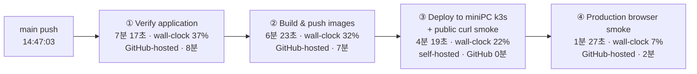

title: "GitHub Actions 2,000분을 다 쓴 날: 열심히와 효율 사이에서"
slug: github-actions-2000-minutes-retrospective
category: 개발 노트
tags: github-actions,ci-cd,deploy,github,self-hosted-runner,k3s,devlog,optimization
summary: GitHub Actions 사용량 100% 알림을 받고 최근 배포들을 돌아봤다. 블로그와 포트폴리오를 계속 다듬은 뿌듯함 뒤에서 어떤 작업이 시간을 썼는지, 무료 사용량과 과금은 어떻게 계산되는지, 그리고 성장 중인 개발자로서 무엇을 더 효율적으로 바꿔야 하는지를 정리한다.
toc: true
publishedAt: 2026-08-31T18:46:43.280622Z
updatedAt: 2026-09-02T04:30:17.099363Z
syncHash: 91a374f96f0f20451436a4bb3d930d3aefb9e6f6d0e3b52f69755c4aec298ee3

---

이번 달 GitHub Actions 사용량이 100%가 됐다는 알림을 받았다.

처음 든 생각은 조금 웃겼다. **내가 정말 많이 만들고 많이 올렸구나.** 블로그를 위키에서 떼어 내고, 글을 쓰고, 화면을 고치고, 테스트를 늘리고, miniPC의 k3s까지 계속 배포했다. 한 달의 흔적이 숫자 하나로 찍혀 나온 느낌이었다.

그런데 기분이 오래가지는 않았다.

**열심히 했다는 것과 효율적으로 했다는 것은 같은 말이 아니기 때문이다.**


화면에는 `2,000 min used / 2,000 min included`라고 적혀 있었다. 사용량은 2026년 9월 1일에 다시 초기화되고, 그전까지 더 쓰면 과금될 수 있다는 안내도 함께였다. 뿌듯함과 함께 “내 요청 중에 불필요하게 반복된 것은 없었을까?”라는 질문이 따라왔다.

## 이번에 무엇을 그렇게 많이 배포했나

최근의 배포는 앱 하나의 기능을 올리는 일과 조금 달랐다. 이 저장소는 Next.js 웹, Spring Boot API, FastAPI 서비스, PostgreSQL·Redis·Kafka·OpenSearch·MinIO, 그리고 k3s 운영 구성이 한 저장소 안에 같이 있다.

최근에는 다음과 같은 일을 한 덩어리로 계속 다뤘다.

- 위키와 블로그를 같은 앱 안에서 분리하고, `blog.` host로 블로그 화면을 열었다.
- 블로그 글을 작성하고 로컬에서 발행하는 흐름을 만들었다.
- 글의 표·Mermaid 차트·이미지·반응형 화면을 고치면서 실제 브라우저에서 확인했다.
- 로컬 LLM 벤치마크와 모델 리서치 글을 추가하고, 결과 이미지와 공개용 자료를 배포 경로에 연결했다.
- Spring·Next.js·Python 서비스의 테스트와 린트·타입 검사를 계속 보강했다.
- GHCR에 이미지들을 올리고, miniPC의 k3s에서 rollout한 뒤 공개 화면 smoke test를 돌렸다.
- 실패하면 배포 전 이미지로 돌아가고, PostgreSQL 백업과 콘텐츠 반영 상태를 확인했다.

저장소의 배포 흐름은 대략 이렇다.

```text
git push
  → GitHub Actions 검증
  → 컨테이너 이미지 빌드·GHCR push
  → miniPC self-hosted runner에서 k3s rollout
  → 공개 URL smoke test
  → 실패하면 이전 이미지 복구
```

이 흐름을 직접 만들고 한 단계씩 확인했다는 사실은 분명히 뿌듯하다. 단순히 “배포 버튼을 눌렀다”가 아니라, 테스트·이미지·클러스터·공개 화면·복구까지 하나의 경로로 묶어 놓았기 때문이다.

특히 최근에는 블로그 초안을 ConfigMap에 담아 보내다가 1MB 한도에 걸려 배포가 멈추는 일도 있었다. 그 뒤 초안을 압축하고, 배포 중간이 아니라 `verify` 단계에서 크기를 먼저 검사하도록 옮겼다. 위키 시드에도 같은 검사를 추가했다. 실패를 한 번 겪고 나서야 “배포가 되느냐”에서 “실패하면 언제, 어디서 멈추느냐”로 관심이 넓어졌다.

이런 변경들이 쌓인 뒤에 2,000분 알림을 보니, 사용량이 단순한 낭비의 결과만은 아니라는 생각도 들었다. 만드는 범위가 넓어졌고, 확인하는 범위도 넓어졌다.

## 2,000분은 무엇을 의미하나

먼저 사용량의 단위를 정확히 볼 필요가 있다. GitHub Actions의 분은 내 컴퓨터에서 기다린 시간이나 workflow 전체의 벽시계 시간이 아니다. GitHub-hosted runner에서 각 job이 실제로 실행된 시간이 누적되는 방식에 가깝다.

그래서 job을 병렬로 실행해 화면상 10분 만에 끝내더라도, 10분짜리 job 세 개가 동시에 돌았다면 사용량은 대략 30분으로 잡힌다. 각 job의 분 단위 사용량은 올림 처리되고, 실패한 job도 실패할 때까지 사용한 시간은 포함된다.

현재 GitHub 공식 사용량 표를 기준으로 하면 포함량은 다음과 같다.

| 플랜 | Actions 분/월 | Actions·Packages 공유 저장공간 | 비고 |
|---|---:|---:|---|
| GitHub Free | 2,000분 | 500MB | 개인 계정의 기본 플랜 |
| GitHub Pro | 3,000분 | 1GB | 개인 계정 유료 플랜 |
| GitHub Free for organizations | 2,000분 | 500MB | 조직용 무료 플랜 |
| GitHub Team | 3,000분 | 2GB | 사용자당 과금되는 팀 플랜 |
| GitHub Enterprise Cloud | 50,000분 | 50GB | 엔터프라이즈 플랜 |

여기서 스크린샷의 2,000분은 **GitHub Free 계정에 표시되는 기본 포함량과 일치한다.** 다만 이 숫자가 곧 이 저장소 하나의 사용량이라는 뜻은 아니다. Actions 사용량은 계정·조직 단위로 합산될 수 있고, 다른 비공개 저장소의 실행도 같은 포함량을 쓸 수 있다.

또 하나 중요한 예외가 있다. 공개 저장소의 표준 GitHub-hosted runner는 무료이고, self-hosted runner도 GitHub Actions 실행 분 과금 대상이 아니다. 반대로 비공개 저장소에서 표준 GitHub-hosted runner를 쓰면 포함량을 먼저 사용하고, 초과분은 과금 대상이 된다. 큰 사양의 larger runner는 공개 저장소라도 별도 과금될 수 있다.

이 저장소는 두 종류의 runner를 모두 쓴다.

| 구간 | 현재 runner | Actions 포함량과의 관계 |
|---|---|---|
| PR의 문서·Spring·웹·Python 검증 | `ubuntu-latest` | 저장소 공개 여부와 플랜에 따라 GitHub-hosted 사용량에 반영 |
| `main`의 verify·이미지 build | `ubuntu-latest` | 같은 기준으로 계산 |
| GHCR 이후 miniPC k3s deploy | `self-hosted`, `minipc` | GitHub-hosted 분 과금은 없음 |
| 배포 후 production browser smoke | `ubuntu-latest` | GitHub-hosted job 사용량에 반영될 수 있음 |

즉 “miniPC에 배포했으니 Actions 분을 썼다”라고 단순하게 말할 수 없다. 실제로 시간을 쓰는 지점은 GitHub-hosted runner에서 검증·빌드·브라우저 검사를 수행한 구간이다. miniPC runner에는 GitHub의 실행 분 비용이 붙지 않는 대신, 장비·전력·업데이트·runner 장애를 내가 책임진다.

## 무료를 넘으면 얼마인가

포함량을 넘겼을 때의 기본 runner 단가는 운영체제마다 다르다. 2026년 9월 1일 GitHub 공식 문서에 공개된 표준 단가는 다음과 같다.

| 표준 GitHub-hosted runner | 분당 단가 |
|---|---:|
| Linux 1-core x64 (`ubuntu-slim`) | $0.002 |
| Linux 2-core x64 (`ubuntu-latest`) | $0.006 |
| Linux 2-core arm64 | $0.005 |
| Windows 2-core x64 | $0.010 |
| macOS 3·4-core M1 또는 Intel | $0.062 |

예를 들어 포함량을 모두 사용한 뒤 Linux runner를 1,000분 더 쓰면 기본 계산은 약 6달러다. macOS runner라면 같은 1,000분이 약 62달러가 된다. Windows와 macOS가 Linux보다 비싼 이유는 운영체제마다 runner의 분당 단가가 다르기 때문이다.

다만 “분당 단가 × workflow가 화면에 보인 시간”으로 정확한 청구액을 계산하면 안 된다. 각 job 단위로 실행 시간이 계산되고, 일부 larger runner는 포함된 무료 분을 사용할 수 없으며, 저장공간은 별도의 방식으로 계산된다.

Actions artifact와 GitHub Packages는 플랜에 따라 공유 저장공간을 사용한다. 캐시는 저장공간과 별도로 repository당 10GB 기준이 있고, 포함량을 넘어선 artifact·Packages 공유 저장공간은 GB-month, 캐시는 별도 단가로 계산된다. 로그·artifact를 오래 쌓아 두는 습관도 분 사용량과 다른 방식으로 비용을 만들 수 있다.

결제 수단을 등록하지 않았다면 포함량을 다 쓴 뒤 사용이 차단될 수 있다. 반대로 결제 수단과 예산이 열려 있으면 초과분이 청구될 수 있다. 그래서 개인 프로젝트라면 billing settings에서 **Actions 예산을 0달러로 두고, 90%·100% 알림을 켜는 것**이 가장 마음 편한 안전장치다.

## 열심히 한 건 맞지만, 효율적이었을까

여기서부터는 숫자보다 내 작업 방식을 돌아보게 된다.

현재 PR CI는 문서 검사, Spring 테스트, 웹 lint·type-check·test·build·브라우저 smoke, Python 서비스 검사처럼 여러 job을 실행한다. `main` 배포 workflow도 verify에서 비슷한 검사를 다시 하고, 이미지 build와 production browser smoke를 이어서 실행한다.

이 중복은 모두 나쁜 것은 아니다. PR이 통과한 뒤 `main`의 실제 배포 커밋에서도 다시 확인하는 것은 배포 직전의 안전망이다. 하지만 비용과 시간이라는 관점에서는 분명히 같은 일을 두 번 하는 구간이 있다.

특히 다음은 개선 후보로 보인다.

1. **변경된 영역과 무관한 job도 같이 깨어난다.** 문서만 고친 PR인데 Spring과 브라우저까지 모두 검사할 필요가 있는지 다시 볼 수 있다.
2. **웹 변경 하나에도 dependency 설치·production build·Chromium 설치가 반복된다.** 캐시가 있어도 job마다 runner가 새로 뜨는 비용과 초기화 시간이 있다.
3. **PR과 main에서 비슷한 테스트가 재실행된다.** 안전성은 올라가지만, 어떤 검사는 PR에서 충분하고 어떤 검사는 main에서 반드시 필요한지 경계를 나눌 수 있다.
4. **실패한 실행을 원인 수정 전에 여러 번 재실행할 때가 있다.** 재시도는 편하지만, 같은 실패를 그대로 다시 돌리는 것은 사용량만 늘린다.
5. **배포와 콘텐츠 발행의 경계가 처음부터 선명하지 않았다.** 글 하나를 고칠 때마다 앱 전체를 빌드할 필요는 없고, 지금은 글만 바뀐 경우 로컬 발행 경로로 분리해 두었다.

나는 그동안 “자동으로 검사하고 배포되면 좋은 것”에 집중했다. 이제는 “이 요청이 어떤 runner를 깨우고, 몇 개 job을 만들고, 같은 검사를 몇 번 반복하는가”까지 봐야 한다는 단계에 들어온 것 같다.

## 먼저, 배포 한 번의 시간 배분부터 그려봤다

월간 2,000분을 분석하기 전에 “배포 버튼을 한 번 눌렀을 때 실제로 무슨 일이 일어나는가”부터 확인했다. 아래 그림은 PR CI가 아니라 `main` push로 시작되는 `Build and deploy` workflow의 성공 실행 한 건이다. GitHub Actions API에서 확인한 [2026년 8월 31일 성공 실행](https://github.com/jaymunsh/jay-wiki/actions/runs/33404654497)을 기준으로 했고, API의 시간은 UTC다.



이 한 번의 workflow는 14:47:03에 시작해 15:06:44에 끝났으므로 전체 wall-clock은 19분 41초였다. job 사이의 runner 준비·전환 시간 약 15초를 제외하면 실제 네 단계가 19분 26초를 차지했다.

| 단계 | 실제 실행시간 | 전체 wall-clock 비중 | 실행 위치 | Actions 사용량 |
|---|---:|---:|---|---:|
| Verify application | 7분 17초 | 37% | GitHub-hosted | 8분 |
| Build and push images | 6분 23초 | 32% | GitHub-hosted | 7분 |
| Deploy to miniPC + public curl smoke | 4분 19초 | 22% | miniPC self-hosted | 0분 |
| Production browser smoke | 1분 27초 | 7% | GitHub-hosted | 2분 |
| 합계 | 19분 41초 | 100% | 혼합 | 약 17분 |

여기서 이미 중요한 차이가 보인다. 배포 단계는 실제로 가장 긴 작업처럼 보이지만 miniPC self-hosted라 GitHub 2,000분에는 들어가지 않는다. 반대로 `Verify`와 image build는 사용자 눈에는 한 단계처럼 보이지만 GitHub-hosted runner를 각각 사용하므로 8분과 7분이 따로 누적된다. browser smoke는 마지막에 눈에 띄지만 이 실행에서는 2분뿐이다.

### 한 단계 안에서도 시간이 몰리는 곳

`Verify application` 안에서는 Spring 테스트가 3분 43초로 가장 길었고, 웹 `npm run build`가 1분 35초, 웹 dependency 설치가 27초였다. 나머지는 lint·type-check·API 테스트·문서와 시드 일관성 검사로 이어졌다. 따라서 verify를 줄이고 싶다면 짧은 문서 검사를 없애는 것보다 Spring 테스트와 웹 build의 실행 조건·캐시·중복 여부를 먼저 봐야 한다.

image build에서는 웹 image가 2분 31초, backend image가 1분 37초로 가장 길었다. Payment API 20초, Shipping API와 Partner simulator 각각 15초처럼 짧은 image도 있지만, 여섯 개 image를 한 번에 build하는 현재 구조에서는 이 시간이 모두 합쳐진다. 변경되지 않은 image까지 매번 build하는 것이 정말 필요한지 검토할 근거가 생긴다.

배포 job 안에서는 `Deploy immutable image tags`가 1분 41초, OpenSearch image 반영이 54초였다. 다만 이 job은 self-hosted runner에서 실행되므로 여기서 시간을 줄이는 목표는 GitHub quota 절약보다는 miniPC의 배포 대기시간과 운영 부담을 줄이는 쪽에 가깝다.

이제 월간 합계를 볼 때도 관점이 달라진다. “배포가 52번 있었다”가 아니라, 한 번의 배포마다 GitHub-hosted의 verify·build·browser job이 어떤 비용으로 붙었는지를 곱해서 봐야 한다. 그리고 PR CI는 이 배포 workflow와 별개로 또 실행되므로, 다음 계산에서는 두 흐름을 분리해서 합산한다.

## 2,000분을 workflow 이력으로 다시 계산해봤다

여기서 한 가지를 분명히 하고 싶었다. GitHub Actions의 2,000분은 workflow를 2,000번 실행했다는 뜻이 아니다. 하나의 workflow 안에 여러 job이 있고, 포함량에서 빠지는 시간은 그 job들의 실행시간을 기준으로 계산된다. PR 한 번이 화면에서는 한 번의 CI로 보이더라도, 실제로는 Spring·Web·Payment·Shipping·Docs job이 각각 runner를 사용할 수 있다.

그래서 “이번 달에 몇 번 배포했나”가 아니라, GitHub Actions 실행 이력에서 각 job의 `started_at`과 `completed_at`을 모아 다시 계산했다. 대상은 2026년 8월 1일부터 9월 1일 사이의 이 저장소 workflow다. GitHub-hosted job은 실제 시간을 분 단위로 올림했고, miniPC self-hosted job은 GitHub minute과 장비 사용시간을 분리해서 기록했다.

### 이 프로젝트에서 실제로 사용한 양

| 구간 | workflow 실행 | GitHub-hosted 사용량 | 전체 비중 |
|---|---:|---:|---:|
| PR CI | 126회 | 1,289분 | 64.9% |
| `main` Build and deploy | 52회 | 696분 | 35.0% |
| Dependabot graph | 1회 | 약 1분 | 0.1% |
| 합계 | 179회 | 약 1,986분 | 100% |

스크린샷의 2,000분과 직접 계산한 1,986분이 거의 일치한다. 즉 이번 알림은 막연히 “요즘 열심히 했나 보다” 정도가 아니라, **이 저장소가 해당 결제 주기의 Actions 사용량 대부분을 실제로 차지했다**고 해석할 수 있다. 14분 정도의 차이는 결제 주기 경계, 계정 단위의 다른 사용량, GitHub 내부 집계와 API 시각의 차이일 수 있으므로 여기서는 1,986분을 저장소 기준 추정치로 부르기로 했다.

`main` 배포 workflow에는 GitHub-hosted job뿐 아니라 miniPC self-hosted job도 있다. self-hosted 배포는 52회 동안 실제로 약 182분 실행됐지만, GitHub-hosted runner minute에는 포함되지 않았다. 대신 이 시간은 miniPC의 전력·장비·운영 부담으로 남는다. “무료”라기보다 비용의 위치가 다른 셈이다.

### 어떤 job이 시간을 가져갔나

| Job | GitHub-hosted 사용량 | 전체 비중 | 처음 봤을 때의 판단 |
|---|---:|---:|---|
| CI Spring tests | 613분 | 30.9% | PR마다 반복되는 가장 큰 단일 항목 |
| CI Web lint, type-check and build | 422분 | 21.2% | 의존성 설치와 build가 매 PR에 반복됨 |
| Deploy Verify application | 362분 | 18.2% | `main`에서 전체 검증을 다시 수행 |
| Deploy Build and push images | 319분 | 16.1% | 여섯 개 image를 한 번에 build·push |
| CI Payment API tests | 130분 | 6.5% | 실제 시간보다 분 단위 올림 영향이 큼 |
| CI Shipping API tests | 84분 | 4.2% | 변경 여부와 관계없이 실행된 구간 확인 필요 |
| Documentation consistency | 40분 | 2.0% | 실제 합산시간은 약 5.7분이지만 40분으로 집계 |
| Production browser smoke | 15분 | 0.8% | 제거해도 전체 절감효과는 작음 |

이 표를 보고 처음 생각을 고쳤다. 앞에서는 production `browser-smoke`가 비싸 보였고, 그것부터 없애면 될 것 같았다. 하지만 실제로는 9회 실행에 15분, 전체의 0.8%뿐이었다. 반면 PR CI가 1,289분으로 거의 3분의 2를 차지했고, Spring·Web job만 합쳐도 1,035분이었다. 이번 문제의 본체는 브라우저 smoke 하나가 아니라 **모든 PR에서 반복되는 전체 CI와 `main`의 중복 build**였다.

또 하나 눈에 들어온 것은 실제 실행시간과 집계시간의 차이다. GitHub-hosted job의 합산 실제 실행시간은 약 1,686분이었지만, job별 분 단위 올림 후에는 약 1,986분이 됐다. 약 300분, 전체의 15% 정도가 반올림에서 생긴 차이다. 특히 Docs는 실제 5.7분이 40분으로, Payment API는 약 67분이 130분으로 늘었다. 짧은 job을 많이 나누는 구조는 병렬 피드백에는 유리하지만, 사용량 측면에서는 매 실행의 최소 1분이 누적된다는 trade-off가 있다.

### 숫자를 보고 바뀐 해결 방향

이 분석 전에는 “smoke test를 지울까?”가 첫 질문이었다. 분석 후에는 질문이 다음처럼 바뀌었다.

1. **어떤 job이 가장 긴가?** Spring, Web, `verify`, image build부터 본다.
2. **어떤 job이 가장 자주 불필요하게 실행되는가?** PR CI의 변경 경로와 job의 영향 범위를 비교한다.
3. **어떤 검사가 서로 다른 사실을 확인하는가?** 배포 후 최소 URL 확인은 공개 접근성을 보고, 브라우저 E2E는 화면 동작을 본다.
4. **줄였을 때 무엇을 잃는가?** browser smoke를 조건부로 바꾸더라도 핵심 테스트와 rollback은 남긴다.

따라서 당장의 결론은 명확하다. 배포 job 안의 가벼운 공개 URL 확인은 유지하되, GitHub-hosted runner에서 매번 실행하는 별도 `browser-smoke`는 제거·웹 변경 시 조건부·야간·수동 실행 중 하나로 바꿀 수 있다. 하지만 사용량을 크게 줄이는 첫 작업은 그보다 PR CI의 path filter와 오래된 실행 취소, 그리고 검증 build와 Docker image build의 중복을 측정하는 일이다.

## 사용량을 줄이는 방법은 안전망을 없애는 일이 아니다

검사를 없애서 숫자만 낮추고 싶지는 않다. 내가 줄이고 싶은 것은 **검증의 신뢰도가 거의 늘지 않는데도 반복되는 실행**이다. GitHub Actions 최적화는 결국 세 가지 레버로 정리된다.

1. 변경과 무관한 job을 처음부터 깨우지 않는다.
2. 같은 커밋에 대한 오래된 실행을 끝까지 기다리지 않는다.
3. 꼭 실행해야 하는 job의 초기화와 중복 빌드를 줄인다.

반대로 “PR 검사를 전부 없애고 `main`에서 한 번만 돌리자”는 식의 절약은 이 프로젝트에는 맞지 않는다. 배포 파이프라인은 실제 서비스에 영향을 주고, 실패했을 때 복구해야 하는 비용이 더 크기 때문이다.

### 먼저 줄일 수 있는 항목을 목록으로 만든다

현재 workflow를 기준으로 보면 모든 검사를 같은 강도로 줄일 필요는 없다. “없애도 되는가”, “조건부로 돌리면 되는가”, “비용이 있어도 남겨야 하는가”를 먼저 나누면 다음과 같다.

| 우선순위 | 줄일 수 있는 항목 | 현재 상태 | 줄이는 방법 |
|---|---|---|---|
| 가장 먼저 | 오래된 PR 실행 | 짧은 시간 안에 여러 번 push하면 이전 커밋도 끝까지 검사할 수 있음 | PR workflow에 concurrency를 두고 최신 실행이 이전 실행을 취소 |
| 가장 먼저 | 변경과 무관한 서비스 job | 문서 변경에도 Spring·웹·Python job이 함께 시작됨 | path filter 또는 `changes` job으로 영향 범위만 실행 |
| 먼저 검토 | PR의 브라우저 smoke | 웹 변경이 아닌 PR에서도 dependency·Chromium 설치가 발생 | `web/` 변경 때만 실행하거나 수동·야간 실행으로 이동 |
| 먼저 검토 | 배포 후 별도 `browser-smoke` | 배포 job의 공개 URL smoke와 역할이 일부 겹침 | 제거하거나 웹 변경·야간·수동 실행으로 제한 |
| 다음 | job마다 반복되는 dependency 설치 | PR CI, `main` verify, Docker build에서 npm·Gradle·uv 준비가 반복됨 | package cache와 Docker layer cache의 hit율 측정 후 개선 |
| 다음 | 검증 build와 image build의 중복 | verify에서 build한 뒤 Dockerfile에서도 다시 build함 | layer 재사용 또는 image를 검증 대상으로 삼는 구조 검토 |
| 신중하게 | 변경되지 않은 image build | 관련 경로 하나만 바뀌어도 여섯 개 image를 모두 build함 | 변경되지 않은 image의 immutable digest 재사용 구조를 먼저 설계 |
| 별도 관리 | 성공한 artifact·로그 보관 | 실패 여부와 관계없이 오래 보관하면 저장공간이 커짐 | 실패 결과만 업로드하고 보관 기간을 짧게 설정 |

반대로 다음은 사용량을 줄인다는 이유로 먼저 없애지 않을 항목이다.

- 배포 전의 핵심 unit·integration test
- immutable image tag 확인과 k3s rollout 상태 확인
- 배포 실패 시 이전 image로 되돌리는 복구 절차
- 실제 공개 URL이 응답하는지 확인하는 최소한의 GET smoke

이 목록의 핵심은 smoke test를 하나의 덩어리로 보지 않는 것이다. 브라우저를 띄우고 의존성을 설치하는 production `browser-smoke`와, 배포 직후 몇 개의 URL·API를 확인하는 가벼운 `curl` 검사는 비용과 목적이 다르다.

### 1. 먼저 workflow 시간이 아니라 job별 사용량을 본다

Actions 사용량을 줄이려면 첫 주에는 설정을 바꾸기보다 측정부터 해야 한다. 화면에서 workflow 하나가 10분 걸렸다고 보여도, 그 안에서 병렬로 실행된 job들의 시간을 합산하면 포함량에서 빠지는 시간은 더 클 수 있다. 반대로 병렬화는 사용자의 대기 시간을 줄여 주지만, 총 runner minute를 자동으로 줄여 주지는 않는다.

다음 항목을 run마다 남겨 두면 어디부터 손댈지 비교적 빨리 보인다.

| 기록할 항목 | 확인할 질문 | 다음 판단 |
|---|---|---|
| 이벤트와 브랜치 | PR push인가, `main` 배포인가, 수동 실행인가 | 같은 커밋의 중복 실행을 줄일 수 있는가 |
| job 이름과 실제 시간 | `web`, Spring, Python, browser smoke 중 무엇이 긴가 | timeout을 줄이는 것이 아니라 실행 자체를 줄일 수 있는가 |
| 변경 파일 | 실행된 job이 변경 영역과 관련 있는가 | path filter 또는 조건부 job이 가능한가 |
| 성공·실패·재실행 여부 | 코드 오류인가, 일시적인 runner·네트워크 오류인가 | 전체 재실행 대신 실패 job만 재실행할 수 있는가 |
| runner 종류 | GitHub-hosted인가, miniPC self-hosted인가 | 분 사용량과 장비 운영비를 혼동하고 있지는 않은가 |

이렇게 보면 “가장 오래 걸리는 job”과 “가장 자주 불필요하게 실행되는 job”이 다를 수 있다. 전자는 캐시나 빌드 최적화의 대상이고, 후자는 트리거와 job 조건의 대상이다. 둘을 구분하지 않으면 긴 테스트를 억지로 짧게 만들다가 신뢰도만 잃기 쉽다.

### 2. 변경된 경로에 맞춰 job을 깨운다

현재 `ci.yml`의 PR 트리거에는 `paths` 조건이 없다. 그래서 문서만 고친 PR도 문서 검사뿐 아니라 Spring, 웹, 결제 API, 배송 API 같은 job을 모두 시작한다. GitHub Actions의 `paths`·`paths-ignore`는 변경 파일을 기준으로 workflow를 실행할지 결정하는 공식 기능이다. [workflow path filter 문서](https://docs.github.com/en/actions/reference/workflows-and-actions/workflow-syntax)를 활용하면 첫 번째 절약 효과를 비교적 안전하게 얻을 수 있다.

다만 여기에는 중요한 구분이 있다. workflow 수준의 `paths`는 **workflow 전체를 켜고 끄는 기능**이지, 한 파일 안의 job을 자동으로 골라 주는 기능은 아니다. 지금처럼 하나의 `ci.yml`에 여러 서비스 job이 모여 있다면 다음 둘 중 하나가 필요하다.

- 웹, Spring, Python, 문서용 workflow를 나누고 각 workflow에 `paths`를 둔다.
- 변경 파일을 먼저 판별하는 `changes` job을 두고, 각 job에 `needs.changes.outputs.web == 'true'` 같은 조건을 건다.

이 저장소에 적용한다면 대략 아래처럼 보수적인 영향 범위를 잡을 수 있다.

| 변경 범위 | 기본으로 깨울 검사 | 전체 검사를 다시 깨울 예외 |
|---|---|---|
| `posts/`, 문서, README | docs consistency, 링크 검사 | 공용 검사 스크립트 변경 |
| `web/`와 `web/package-lock.json` | 웹 lint·type-check·test·build | workflow, Dockerfile, 공용 스크립트 변경 |
| `spring/` | Spring 테스트 | 공용 인프라 설정이나 배포 스크립트 변경 |
| `services/payment-api/**` | 결제 API lint·type-check·test | 공통 데이터 계약·배포 설정 변경 |
| `services/shipping-api/**` | 배송 API lint·type-check·test | 공통 데이터 계약·배포 설정 변경 |
| `services/partner-simulator/**` | 파트너 시뮬레이터 검사 | 공통 데이터 계약·배포 설정 변경 |
| `infra/`, `.github/workflows/`, `scripts/`, Dockerfile | 전체 또는 영향 범위가 넓은 검사 | 항상 보수적으로 전체 검사 |

여기서 `posts/`만 바뀐 경우는 특히 중요하다. 이 저장소의 블로그 글은 로컬 `/sync` 경로로 발행하고, `deploy.yml`도 애플리케이션과 인프라에 영향을 주는 경로만 배포 대상으로 삼고 있다. 글 하나를 수정할 때마다 여섯 개 컨테이너를 다시 빌드하는 것은 콘텐츠 검증의 목적과 맞지 않는다.

단, 필터를 너무 공격적으로 만들면 안 된다. 예를 들어 `scripts/check-blog-links.mjs`나 공유 설정이 바뀌었는데 웹 폴더만 검사하면, 실제로 영향을 받은 검사가 조용히 빠질 수 있다. 또 path filter로 workflow가 건너뛰면 필요한 check가 `Pending`으로 남아 PR 병합을 막을 수 있으므로, 브랜치 보호 규칙과 함께 확인해야 한다. 절약보다 먼저 “이 변경이면 어떤 실패를 잡아야 하는가”라는 영향 관계를 문서로 고정하는 편이 안전하다.

### 3. PR, `main`, 배포 후 검사의 역할을 나눈다

현재 PR CI와 `main` 배포의 `verify`는 의도적으로 비슷한 검사를 다시 수행한다. PR이 통과했더라도 merge 뒤의 커밋, 실제 배포에 사용될 파일, 배포 직전의 환경이 달라질 수 있으므로 이 중복 자체가 잘못은 아니다. 다만 모든 단계에서 같은 강도의 검사를 반복하면 사용량이 빠르게 늘어난다.

내가 가져가고 싶은 경계는 다음과 같다.

| 구간 | 남길 검사 | 줄일 부분 |
|---|---|---|
| PR의 매 push | 변경된 영역의 lint·type-check·unit test | 무관한 서비스, 배포용 production smoke |
| `main` 병합 후 | 전체 통합 테스트, 문서·시드 일관성, 이미지 build | PR에서 이미 확인한 단순 검사의 재실행 여부를 측정 |
| 배포 중 | immutable image tag, k3s rollout, 백업·복구 안전망 | 배포와 무관한 검사를 deploy job 안에 섞지 않기 |
| 배포 직후 | 실제 공개 URL, API, 브라우저 smoke | 이 검사는 비용이 있어도 유지 |
| 야간·수동 | 전체 회귀, 느린 시나리오, 성능 검사 | 평소 모든 PR에서 반복하지 않기 |

smoke test는 종류를 나눠서 판단하는 편이 맞다. `deploy.yml` 안의 `Smoke test public site`는 miniPC self-hosted runner에서 배포 직후 실행되고, 홈·채팅·API·Kafka·파트너 경로와 `/sync` 차단 여부를 확인한다. 이 단계는 Cloudflare·Traefik·k3s·실제 API를 거친 공개 경로가 살아 있는지 확인하므로, 최소한의 GET·health 확인은 남길 가치가 있다. GitHub-hosted runner minute을 쓰지 않는다는 점도 부담을 낮춘다.

반면 그 뒤의 별도 `browser-smoke` job은 GitHub-hosted runner에서 다시 `npm ci`, Chromium 설치, Playwright 실행을 한다. PR CI의 웹 browser test와도 겹치고, deploy job의 공개 URL smoke와도 일부 겹친다. 게다가 이 job이 실패해도 현재 구성에서는 이미 배포된 내용을 자동 rollback하지 않고 알림만 보낸다. 따라서 개인 블로그·포트폴리오 프로젝트라면 다음 중 하나로 줄이는 것이 합리적이다.

- 매 배포마다 실행하는 `browser-smoke`를 제거하고 deploy job의 가벼운 URL smoke만 남긴다.
- `web/` 변경이 포함된 배포에서만 `browser-smoke`를 실행한다.
- 브라우저 전체 검사는 야간·수동 workflow로 옮기고, 배포 때는 핵심 URL과 API만 확인한다.

실제 주문 생성처럼 상태를 바꾸는 smoke가 있다면 비용보다 먼저 데이터 오염과 부작용을 점검해야 한다. 반복 실행해도 안전한 idempotency key와 테스트 데이터 정리 정책이 없다면, 단순 GET smoke보다 운영 리스크가 커질 수 있다. 가장 가벼운 구성은 “배포 전 테스트는 코드 안전성, 배포 직후 GET smoke는 공개 접근성, 브라우저 E2E는 필요할 때만”으로 역할을 분리하는 것이다.

### 4. 빠르게 연속 push할 때는 최신 커밋만 검사한다

코드를 고치며 짧은 시간 안에 여러 번 push하면 같은 PR의 이전 커밋들이 차례로 검사될 수 있다. 현재 `ci.yml`에는 concurrency 설정이 없으므로, 이미 폐기된 커밋을 끝까지 검사하는 상황이 생길 수 있다. PR workflow에는 다음과 같은 정책을 둘 만하다.

```yaml
concurrency:
  group: ci-${{ github.workflow }}-${{ github.event.pull_request.number || github.ref }}
  cancel-in-progress: ${{ github.event_name == 'pull_request' }}
```

이 정책은 같은 PR에서 새 push가 오면 이전 PR 검사를 취소하고 최신 커밋을 검사한다. GitHub의 [concurrency 공식 문서](https://docs.github.com/en/actions/how-tos/write-workflows/choose-when-workflows-run/control-workflow-concurrency)처럼 그룹을 PR 번호 기준으로 잡아야 서로 다른 PR의 검사를 잘못 취소하지 않는다.

다만 production deploy에는 같은 옵션을 그대로 복사하면 안 된다. 현재 `deploy.yml`이 `cancel-in-progress: false`인 이유가 있다. k3s에 manifest를 적용하거나 백업·롤백을 수행하는 중간에 새 push가 왔다고 실행을 끊으면, 단순히 오래된 검사를 취소하는 것과 달리 클러스터 상태가 중간 단계에 남을 수 있다. PR·feature branch CI는 최신 우선으로 취소하되, 실제 배포는 직렬화하고 끝까지 복구 절차를 수행하는 편이 맞다.

### 5. 캐시는 다운로드 시간을 줄이는 도구이지 만능 절약 버튼이 아니다

현재 workflow에는 이미 `setup-java`의 Gradle cache와 `setup-node`의 npm cache가 있다. 좋은 출발점이지만, 이 캐시가 `node_modules`나 완성된 Docker image를 그대로 제공하는 것은 아니다. `npm ci`는 여전히 실행되고, 새 hosted runner를 준비하는 시간과 빌드 시간도 남는다. 캐시 hit율이 낮다면 키가 lockfile·운영체제·런타임을 제대로 반영하는지부터 확인해야 한다.

GitHub도 [dependency caching 문서](https://docs.github.com/en/actions/concepts/workflows-and-actions/dependency-caching)에서 캐시와 artifact를 다른 용도로 설명한다. 반복 다운로드가 비싼 Gradle·npm·uv 의존성은 cache, 테스트 결과·스크린샷·다음 job에서 사용할 빌드 결과는 artifact가 기본 방향이다. 두 가지를 혼동해 `test-results`를 캐시하거나, 매번 바뀌는 빌드 디렉터리를 거대한 캐시로 만들면 저장공간과 복원 시간이 오히려 늘 수 있다.

Python job의 `uv` 의존성 캐시와 Docker BuildKit layer cache는 후보로 볼 수 있다. 다만 적용 전에는 다음을 측정해야 한다.

- 캐시 hit 때 실제로 줄어드는 다운로드·설치 시간이 얼마인가.
- 캐시를 복원하는 시간과 miss 때 새로 저장하는 시간이 이득보다 크지 않은가.
- PR에서 읽을 수 있는 캐시에 비밀값이나 실행 가능한 민감 파일이 들어가지 않는가.

캐시는 신뢰 경계를 넘나드는 입력이 될 수 있으므로 토큰, 인증서, `.env` 같은 파일을 넣으면 안 된다. “캐시를 많이 만들수록 빠르다”가 아니라 **lockfile이 바뀔 때만 새 캐시가 생기고, 없어도 재생성 가능한 것만 넣는다**가 기준이다.

### 6. 검증 빌드와 배포 빌드의 중복은 신중하게 다룬다

현재 `deploy.yml`의 `verify`는 Spring 테스트와 웹 `npm run build`를 실행한 뒤, 다음 `build` job에서 Docker image를 만든다. 그런데 `spring/Dockerfile`은 다시 `bootJar`를 만들고, `web/Dockerfile`도 다시 `npm ci`와 `npm run build`를 수행한다. 즉 같은 커밋에서 “검증을 위한 컴파일”과 “image 안에 넣기 위한 컴파일”이 각각 필요한 구조다.

이걸 곧바로 하나로 합치지는 않을 것이다. 두 경로가 분리되어 있으면 애플리케이션 build가 통과했는지와 실제 production image가 만들어지는지를 각각 확인할 수 있기 때문이다. 대신 다음 순서가 현실적이다.

1. 먼저 각 단계의 실제 시간을 기록한다. 웹 build가 짧고 Docker layer cache가 잘 맞는다면 바꿀 이유가 적다.
2. Docker BuildKit의 layer cache를 적용해 매번 `npm ci`, Gradle wrapper, Python dependency layer를 처음부터 만들지 않게 한다.
3. 검증 결과를 artifact로 넘겨 build job에서 재사용하는 방식을 검토한다. 단, artifact 업로드·다운로드 시간과 저장공간, 그리고 검증한 파일과 image context가 정말 같은 커밋인지까지 확인한다.
4. 마지막으로 “image를 먼저 build하고 그 image를 대상으로 smoke/integration test”하는 구조를 비교한다.

여섯 개 이미지를 항상 만드는 것도 같은 관점에서 볼 수 있다. `deploy.yml`은 애플리케이션 관련 경로가 하나만 바뀌어도 backend, web, 세 API, OpenSearch image를 모두 build한다. 변경된 image만 만들고 나머지는 직전 immutable digest를 재사용하면 runner 시간을 줄일 수 있지만, 현재 배포 스크립트는 여섯 개 image의 SHA tag를 모두 전달받는 구조다. 따라서 이 최적화는 “안 바뀐 image를 어떤 digest로 배포할지”를 먼저 설계한 뒤에 해야 한다. 잘못 건너뛰면 비용은 줄어도 새 배포가 이전 image를 잃거나, 반대로 낡은 image를 조용히 올리는 문제가 생긴다.

### 7. 실패 증거는 남기되 오래 보관하지 않는다

분 사용량과 artifact 저장공간은 별도 축이지만, 한 번의 알림에서 함께 관리해야 한다. 현재 workflow가 browser test artifact를 `failure()`일 때만 업로드하는 것은 좋은 방향이다. 성공한 모든 실행의 스크린샷을 쌓을 필요는 없다.

실패 결과도 영구 보관할 필요는 없으므로 `actions/upload-artifact`에 짧은 `retention-days`를 주는 방법이 있다. GitHub artifact와 로그는 기본적으로 90일 보관되고, 저장소 설정이나 artifact별 설정으로 기간을 조정할 수 있다. [artifact 보관 기간 문서](https://docs.github.com/en/actions/how-tos/manage-workflow-runs/remove-workflow-artifacts)를 기준으로 실패 분석에 필요한 기간만 남기면 된다.

다만 보관 기간을 줄이는 것이 검증 시간을 줄여 주는 것은 아니다. 이것은 2,000분을 아끼는 조치가 아니라 Actions·Packages 저장공간이 불필요하게 쌓이는 것을 막는 조치다. 캐시도 주기적으로 hit율과 크기를 확인하고, 쓰이지 않는 키를 정리해야 한다.

### 8. self-hosted runner로 옮기면 공짜가 되는 것은 아니다

현재 실제 배포 job은 miniPC의 self-hosted runner에서 실행되므로 GitHub-hosted runner minute 과금 대상과 구분된다. 그렇다고 해서 모든 CI를 miniPC로 옮기는 것이 정답은 아니다. 전기료, 장비 수명, runner가 바쁠 때의 대기 시간, 운영체제 차이, secrets가 있는 장비에 PR 코드를 실행하는 보안 위험이 새로 생긴다.

그래서 GitHub-hosted runner는 재현 가능한 PR 검증에 두고, self-hosted runner는 k3s와 같은 사내·개인 인프라에 접근해야 하는 배포에 두는 현재 경계를 우선 유지하려 한다. 비용을 줄이기 위해 환경 차이를 키우면, 나중에 실패 원인을 GitHub runner에서 찾을 수 없는 더 비싼 문제가 생길 수 있다.

### 9. 내 저장소에 적용할 순서

한 번에 workflow를 크게 뜯어고치기보다 다음 순서로 바꾸면 절약 효과와 안전성을 함께 확인할 수 있다.

| 순서 | 바꿀 것 | 기대 효과 | 주의할 점 |
|---|---|---|---|
| 1 | PR CI에 concurrency 추가 | 연속 push에서 폐기된 커밋의 검사 중단 | production deploy에는 적용하지 않기 |
| 2 | 변경 파일과 job의 영향표 작성 | 문서·웹·각 API의 불필요한 job 제거 | 공용 script·workflow 변경은 전체 검사 |
| 3 | path filter 또는 `changes` job 적용 | 실제로 깨워지는 job 수 감소 | 필수 check가 Pending에 남지 않는지 확인 |
| 4 | PR browser smoke와 production smoke의 역할 분리 | PR에서는 웹 변경 때만 브라우저 실행 | 배포 직후 공개 smoke는 유지 |
| 5 | npm·Gradle·uv·Docker layer cache의 hit율 측정 | 반복 설치와 image build 시간 감소 | 캐시에 비밀값과 불안정한 출력 넣지 않기 |
| 6 | 검증 build와 Docker build의 중복을 비교 | build 한 번 또는 layer 재사용 가능성 확인 | artifact 전달이 더 느려질 수 있음 |
| 7 | 실패 artifact 보관 기간과 Actions 예산 점검 | 저장공간과 예상 밖 과금 방지 | 증거를 너무 빨리 삭제하지 않기 |

내가 가장 먼저 할 작업은 1~3번이다. 코드 품질을 낮추지 않고, 최신 커밋만 검사하며, 변경되지 않은 영역을 아예 깨우지 않는 변화이기 때문이다. 그다음에야 캐시와 image build를 만지는 편이 맞다. 후자는 잘하면 큰 효과가 있지만, 잘못 적용하면 “검사는 통과했는데 실제 image는 다른 상태”라는 종류의 버그를 만들 수 있다.

결국 목표는 Actions 사용량을 무조건 0에 가깝게 만드는 것이 아니다. PR에서는 빠른 피드백을 주고, `main`에서는 배포 가능한 상태를 다시 확인하고, 배포 후에는 실제 사용자의 경로를 검증하는 식으로 **각 검사가 가장 잘해야 하는 곳에 배치하는 것**이다. 내가 줄이고 싶은 것은 검증 자체가 아니라, 이미 확인한 것을 맥락 없이 반복하는 일이다.

## 그래도 100%는 좋은 기록이다

GitHub Actions 2,000분을 다 썼다는 알림을 보고 처음에는 사용량을 줄여야 한다고만 생각했다. 지금은 조금 다르게 본다.

이 숫자는 한 달 동안 내가 저장소를 꽤 진지하게 다뤘다는 기록이기도 하다. 블로그 글만 쓴 것이 아니라, 글이 올라갈 사이트를 만들고, 화면을 확인하고, 테스트를 통과시키고, 이미지로 패키징하고, miniPC의 k3s에 올리고, 실패 경로까지 다시 살폈다.

그 과정에서 비효율도 같이 자랐다. 기능이 늘면서 검증이 늘었고, 검증이 늘면서 중복도 늘었다. 이건 “나는 아직 못해서 낭비했다”라기보다, **다음 단계의 문제를 볼 수 있을 만큼 시스템이 자랐다는 신호**에 가깝다.

다음 달에는 100% 알림을 덜 자주 보게 만들고 싶다. 하지만 그 이유가 작업을 덜 해서가 아니라, 같은 신뢰를 더 적은 실행으로 얻었기 때문이면 좋겠다.

열심히 만든 사람의 다음 공부는 더 많이 만드는 법이 아니라, **무엇을 언제 실행할지 고르는 법**일 테니까.

## 참고한 공식 문서

- [GitHub Actions 사용량 포함량 — 플랜별 무료 minutes와 저장공간](https://docs.github.com/en/billing/reference/product-usage-included)
- [GitHub Actions billing — 사용량 계산·무료 대상·초과 과금](https://docs.github.com/en/billing/concepts/product-billing/github-actions)
- [Actions runner pricing — 운영체제별 공식 runner 단가](https://docs.github.com/en/enterprise-cloud@latest/billing/reference/actions-runner-pricing)
- [GitHub-hosted runners — 공개·비공개 저장소 runner 사양과 조건](https://docs.github.com/en/actions/reference/runners/github-hosted-runners)
- [Workflow syntax — 경로 필터와 workflow 실행 조건](https://docs.github.com/en/actions/reference/workflows-and-actions/workflow-syntax)
- [Dependency caching — 캐시와 artifact의 차이 및 보안 주의점](https://docs.github.com/en/actions/concepts/workflows-and-actions/dependency-caching)
- [Control workflow concurrency — 오래된 workflow 취소와 동시성 그룹](https://docs.github.com/en/actions/how-tos/write-workflows/choose-when-workflows-run/control-workflow-concurrency)
- [Remove workflow artifacts — artifact와 로그 보관 기간](https://docs.github.com/en/actions/how-tos/manage-workflow-runs/remove-workflow-artifacts)
- [List jobs for a workflow run — job별 실행시간 확인 API](https://docs.github.com/en/rest/actions/workflow-jobs#list-jobs-for-a-workflow-run)
- [GitHub 요금제](https://github.com/pricing)
