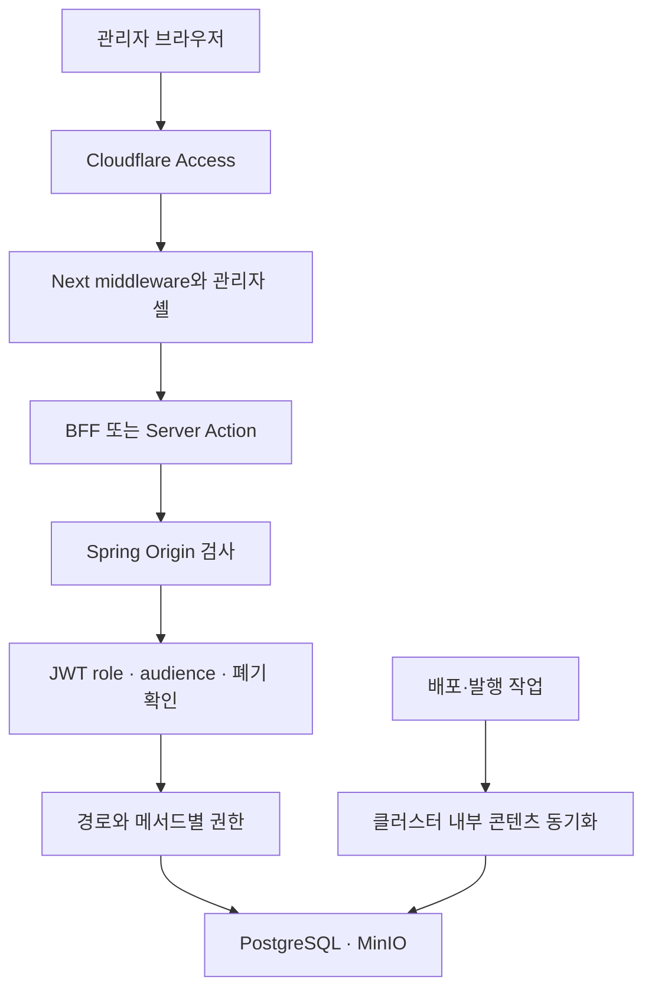
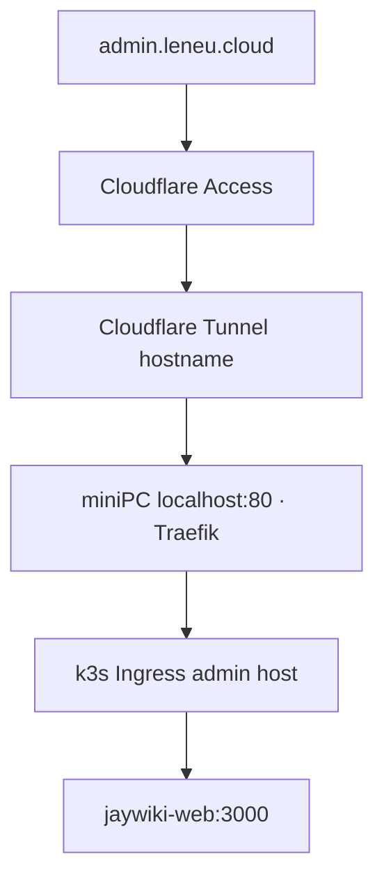

title: 공개 위키 안에 있던 관리자 화면을 별도 도메인으로 옮겼다
slug: jaywiki-admin-subdomain-separation
category: 개발 노트
tags: admin,cloudflare,homelab,jwt,k3s,nextjs,security,spring-boot
summary: 공개 위키의 /admin에 얹혀 있던 관리 기능을 admin.leneu.cloud로 분리했다. 화면 주소뿐 아니라 JWT 용도, BFF와 API 권한, Cloudflare Access, 내부 발행 도구까지 함께 옮긴 과정을 기록한다.
toc: true
syncHash: 2b0c15199dc9fba84922483af34fde125dca5b03e6e6047fc5066cadfdc78b05
publishedAt: 2026-09-12T04:33:29.960479Z

---

위키 글을 고치려면 공개 사이트로 들어가 같은 화면 안의 관리자 메뉴를 열어야 했다. 기능은 동작했지만 읽는 공간과 운영하는 공간이 한 레이아웃에 섞여 있었다. 위키와 블로그 관리 기능이 늘면서 이 구조는 더 어색해졌다. 주소창에는 공개 위키의 `/admin`이 남았고, 어느 요청부터 관리 권한이 필요한지도 화면만으로는 알기 어려웠다.

처음에는 관리자 화면을 `admin.leneu.cloud`로 옮기면 끝날 것처럼 보였다. 실제로는 화면 경로보다 `/api/` 뒤에 숨어 있는 쓰기 권한, 호스트별 쿠키, JWT의 용도, Next.js BFF와 Server Action, 운영 발행 스크립트가 더 큰 일이었다. 이 문제 때문에 한동안 분리를 보류했고, 이번에는 호출 경로를 먼저 전부 펼쳐 놓은 뒤 옮겼다.


*최종 운영 관리자 화면. 같은 데이터를 쓰지만 공개 위키와 다른 호스트·로그인·레이아웃을 사용한다.*

## 공개 화면의 일부였던 관리 기능을 독립된 작업 공간으로 바꿨다

기존 구조에서는 `portfolio.leneu.cloud/admin/**` 아래에 위키와 블로그 관리 화면이 함께 있었다. 공개 화면의 Header와 Footer를 재사용하고, 관리자 쿠키가 있으면 메뉴를 더 보여 주는 방식이었다. 작은 규모에서는 빠르게 만들 수 있었지만 기능이 늘수록 두 역할이 충돌했다.

관리자가 하는 일은 글 읽기와 성격이 다르다. 초안 저장, 이전 판 복구, 이미지 업로드, 카테고리 변경, 통계 확인처럼 실수했을 때 데이터가 바뀌는 동작이 많다. 공개 사이트의 일부 메뉴로 남겨 두기보다 별도 작업 공간으로 인식되는 편이 나았다.

이번 분리는 새 애플리케이션을 하나 더 만든 것은 아니다. Next.js, Spring Boot, PostgreSQL과 MinIO는 그대로 공유한다. 같은 Next.js 프로세스가 요청의 정확한 호스트를 보고 공개 위키, 블로그, 관리자 셸을 나눈다. 데이터 이관이나 계정 재생성도 하지 않았다.

구현 전에 세 경계를 비교했다. `/admin`을 유지하면 변경량은 적지만 공개 사이트와 관리 공간이 계속 같은 주소 체계에 남는다. 관리자 앱을 별도 저장소와 배포로 떼면 장애 범위까지 나눌 수 있지만, 현재 규모에서는 인증·API 클라이언트·디자인 시스템을 두 벌로 관리해야 한다. 별도 서브도메인은 그 중간에 있었다.

| 선택지 | 장점 | 부담과 한계 | 판단 |
|---|---|---|---|
| 공개 위키의 `/admin` 유지 | 변경이 가장 적고 기존 쿠키·경로를 그대로 사용 | 공개·관리 UI와 호스트 경계가 계속 섞임 | 기능이 늘어난 현재 구조에는 맞지 않음 |
| 같은 앱에서 관리자 서브도메인 분리 | URL·쿠키·Access·화면 경계를 분명히 하면서 기존 코드와 데이터 재사용 | Next·Spring 배포와 장애 범위는 공유 | 현재 단계에서 선택 |
| 관리자 앱을 별도 배포 | 프로세스와 릴리스 장애까지 분리 가능 | 인증·API 계약·공통 UI·배포를 별도로 유지 | 규모가 더 커질 때 재검토 |

따라서 이번 목표는 완전한 물리적 격리가 아니라 **공개 요청과 관리 요청의 신뢰 경계를 분명하게 만드는 것**으로 정했다. 별도 앱을 만들지 않은 사실과 별도 관리자 호스트를 둔 사실을 함께 적어야 분리 수준을 과장하지 않게 된다.

| 구분 | 공개 위키 | 블로그 | 관리자 |
|---|---|---|---|
| 운영 주소 | `portfolio.leneu.cloud` | `blog.leneu.cloud` | `admin.leneu.cloud` |
| 로컬 주소 | `localhost:3000` | `blog.localhost:3000` | `admin.localhost:3000` |
| 주 역할 | 문서 열람과 공개 기능 | 글 열람과 댓글 | 위키·블로그 편집과 운영 |
| 화면 | 공개 위키 셸 | 블로그 셸 | 전용 관리 콘솔 |
| 데이터 계층 | 기존 Spring·DB 공유 | 기존 Spring·DB 공유 | 기존 Spring·DB 공유 |

외부 경로는 `/wiki/articles`, `/blog/posts`, `/stats`처럼 읽기 쉬운 형태로 정리했다. 내부에는 이미 검증된 `/admin/**` 페이지가 있었으므로 middleware가 새 주소를 내부 경로로 rewrite한다. 기존 공개 `/admin/**`의 GET과 HEAD는 새 관리자 주소로 안내하고, 변경 요청은 403으로 막았다.

## 주소를 나누기 전에 권한이 걸린 모든 API를 다시 찾았다

처음 막혔던 이유는 관리 API가 `/api/admin/**`에만 있지 않았기 때문이다. 위키 글 저장은 `/api/articles`, 탭 변경은 `/api/tabs`, 대표 문서는 `/api/wiki/featured`, 이미지는 `/api/wiki-assets`를 사용한다. 문서의 과거 판을 읽는 revision API도 URL에 `admin`이라는 단어가 없다.

`/api/admin/**`만 새 호스트에서 허용했다면 관리 화면 일부는 고장 나거나, 반대로 공개 호스트에 쓰기 우회 경로가 남을 수 있었다. 그래서 경로 이름이 아니라 요청의 의미와 HTTP 메서드로 분류했다.

| 요청 | 공개 호스트 | 관리자 호스트 |
|---|---|---|
| 발행된 위키·블로그 글 조회 | 허용 | 필요한 화면에서 조회 |
| 글·탭·대표 문서 저장 | 거절 | ADMIN 확인 후 허용 |
| 이미지 공개 조회 | 허용 | 허용 |
| 이미지 업로드·삭제 | 거절 | ADMIN 확인 후 허용 |
| 문서 revision 조회·복구 | 거절 | ADMIN 확인 후 허용 |
| 댓글·게시판 같은 공개 기능 | 기존 공개 계약 유지 | 관리 기능과 구분 |
| 내부 콘텐츠 동기화 | 외부 BFF로 노출하지 않음 | 브라우저 로그인과 별도 계약 유지 |

Next.js BFF는 정확한 관리자 호스트인지 먼저 확인한다. `admin.leneu.cloud.evil`처럼 접두사만 비슷한 호스트는 관리자로 보지 않는다. BFF를 통과한 뒤에도 Spring Security가 역할과 메서드별 권한을 다시 검사한다. 화면에서 버튼을 숨긴 사실을 권한 검사로 간주하지 않았다.

호스트 판별은 접두사나 `endsWith` 대신 정규화한 값과 고정 목록을 비교한다. 실제 `siteHost.ts`의 핵심은 다음과 같다.

```typescript
const ADMIN_HOSTS = new Set(['admin.localhost', 'admin.leneu.cloud']);

export function hostnameOf(host: string | null | undefined): string {
  if (!host) return '';
  const value = host.trim().toLowerCase();
  if (value.startsWith('[')) return value.slice(1, value.indexOf(']'));
  return value.split(':')[0];
}

export const isAdminHost = (host: string | null | undefined) =>
  ADMIN_HOSTS.has(hostnameOf(host));
```

이 함수만으로 권한이 생기는 것은 아니다. 관리자 전용 화면과 BFF를 선택하는 첫 분기에 사용하고, 뒤의 세션·JWT·Spring 권한 검사를 계속 통과해야 한다.

## 관리자 JWT를 공개 로그인 토큰과 같은 용도로 쓰지 않게 했다

서브도메인이 달라지면 쿠키도 달라진다. 기존 `jw_token`은 `Domain`을 지정하지 않은 host-only 쿠키라서 공개 위키에서 로그인한 쿠키가 관리자 도메인으로 자동 전달되지 않는다. 쿠키 범위를 `.leneu.cloud` 전체로 넓히면 편해지지만 공개 호스트까지 관리자 토큰을 보내게 된다.

쿠키 범위는 그대로 두고 관리자 도메인에서 다시 로그인하도록 했다. 공개 로그인은 일반 USER 기능을 유지하고, 관리자는 별도 `/api/auth/admin-login`에서 비밀번호와 OTP를 확인한다. JWT에도 용도를 구분하는 audience를 넣었다.

```text
ADMIN  -> audience: jaywiki-admin  -> 1시간
USER   -> audience: jaywiki-public -> 6시간
```

서버는 서명과 만료가 유효하다는 이유만으로 토큰을 받지 않는다. role과 audience의 조합까지 맞는지 검사한다. 아래는 `JwtService`의 검증 부분을 줄여 옮긴 것이다.

```java
String role = claims.get("role", String.class);
var audiences = claims.getAudience();

if ("ADMIN".equals(role)
        && audiences != null
        && audiences.contains("jaywiki-admin")) return claims;

if ("USER".equals(role)
        && audiences != null
        && audiences.contains("jaywiki-public")) return claims;

return null;
```

그래서 USER 토큰에 ADMIN 역할을 기대하거나, ADMIN 토큰을 공개용 토큰처럼 재사용하는 조합은 검증되지 않는다. audience가 없던 이전 토큰도 전환 뒤에는 다시 로그인해야 한다.

middleware는 쿠키 존재 여부로 로그인 화면 이동만 돕고, 실제 권한은 관리자 layout의 `auth/me`, BFF, Spring에서 다시 확인한다. 로그아웃한 토큰은 Redis의 폐기 기록도 확인하므로 쿠키만 지웠다고 인증이 끝났다고 보지 않는다.

이 선택 때문에 배포 직후 기존 관리자 세션은 다시 로그인해야 했다. 대신 공개 사이트와 관리자 사이트 사이에 토큰을 전달하는 별도 우회 장치를 만들 필요가 없었다.

## BFF와 Server Action은 같은 로그인 뒤에서도 서로 다른 경로였다

브라우저의 저장 요청은 대체로 `/api/bff/**`를 거치지만 전부 그런 것은 아니다. 서버 컴포넌트는 내부 Spring 주소를 직접 읽고, Server Action은 서버에서 쿠키를 전달한다. 대량 Excel 생성에는 별도 Next Route Handler도 있었다.

한 계층만 고치면 목록은 열리는데 저장만 403이 되거나, 편집은 되는데 revision 조회가 막히는 상황이 생긴다. 관리자 layout과 서버 데이터 함수는 호스트와 `auth/me`의 ADMIN 역할을 함께 확인했다. Server Action은 관리자 호스트에서 시작한 요청인지 확인한 뒤 쿠키와 서버 요청 표식을 전달했다. Excel 생성도 관리자 화면으로 옮기고 공개 호스트의 생성 API는 거절했다.

요청 흐름은 다음처럼 여러 겹이다.



여기서 내부 콘텐츠 동기화는 관리자 브라우저와 다른 문이다. 배포 Job과 단일 글 발행 도구는 k3s 안의 전용 토큰을 사용한다. 이 토큰을 브라우저 BFF로 전달하거나 관리자 OTP로 바꾸지 않았다.

## 발행 도구는 Access 앞과 클러스터 안의 두 경로를 구분했다

`admin.leneu.cloud` 전체를 Cloudflare Access로 보호하면 사람의 브라우저뿐 아니라 운영 주소를 직접 호출하는 CLI도 Access 앞에서 멈춘다. 기존 발행 도구가 갑자기 로그인 HTML을 API 응답으로 받는 문제가 생길 수 있었다.

외부 관리자 API를 쓰는 Node·shell 도구는 `cloudflared access token`으로 받은 사용자 Access 토큰을 `CF-Access-Token` 헤더에 넣도록 바꿨다. 캐시된 Access 인증이 없으면 우회하지 않고 로그인을 안내한 뒤 멈춘다. 반면 SSH 터널을 열어 클러스터 내부 콘텐츠 API를 쓰는 발행 경로에는 이 헤더를 요구하지 않는다.

개발용 `/sync`도 성격을 바꾸지 않았다. 로컬 `admin.localhost`의 정확한 Origin에서는 사용할 수 있지만 운영 빌드에서는 계속 404다. 관리자 화면을 분리했다는 이유로 로컬 실행 도구까지 운영에 노출하지 않았다.

## 디자인은 표 중심의 운영 콘솔로 먼저 확정했다

기능을 옮기기 전에 세 가지 외관 시안을 비교했고 표 중심의 A안을 골랐다. 실제 구현에서는 시안에 있던 가상 활동 로그나 검토 대기열을 넣지 않았다. 현재 DB가 제공하는 발행·초안·보관 상태와 목록, 검색, 필터를 중심으로 구성했다.

좌측 메뉴는 `jay-wiki`, `jay-blog`, `운영`으로 나눴다. 공개 사이트를 열지 않고도 어느 데이터 영역을 다루는지 알 수 있고, 운영 도구는 콘텐츠 메뉴와 섞이지 않는다. 상단에는 로컬과 운영 환경을 구분하는 표시를 두었다.

다크모드는 마지막에 색만 뒤집는 작업으로 미루지 않았다. 관리자 전용 색상 토큰을 라이트·다크에 함께 정의하고 로그인, 목록, 편집기, 통계, 모바일 메뉴를 두 테마에서 확인했다. 모바일에서는 넓은 표가 문서 전체 너비를 밀어내지 않도록 표 영역 안에서만 스크롤되게 했다.

## 도메인은 DNS 하나가 아니라 네 구간을 연결해야 열렸다

운영에서 `admin.leneu.cloud`가 보이려면 네 구간이 모두 맞아야 했다.



확인 당시 DNS와 Access 애플리케이션은 먼저 존재했고, 비인증 요청은 Access 로그인으로 이동했다. 여기에 Tunnel의 `admin.leneu.cloud -> http://localhost:80` 규칙과 k3s Ingress의 관리자 호스트 규칙을 맞췄다. Ingress만 추가하거나 DNS만 만드는 것으로는 애플리케이션까지 요청이 도착하지 않는다.

cloudflared 설정을 교체할 때는 기존 파일을 백업하고 소유자·권한을 유지한 뒤 서비스를 재시작했다. 첫 실행에서는 긴 설치 명령이 줄바꿈되며 `install -g`의 인수가 잘려 적용에 실패했다. 오류가 난 상태에서 완료로 보지 않고 명령을 다시 한 줄로 정리해 설치하고, cloudflared가 active인지 확인했다.

Access는 외부의 첫 번째 문이고 애플리케이션 로그인은 두 번째 문이다. Access를 통과했다고 ADMIN 권한을 얻는 것은 아니다. 정상 흐름은 `Access 허용 -> 관리자 로그인+OTP -> 애플리케이션 권한 확인`이다.

## 첫 운영 전환에서는 내부 rewrite가 원래 호스트를 잃었다

로컬에서 `admin.localhost`는 정상인데 운영 프록시를 거치자 로그인 흐름이 다시 튀는 문제가 있었다. 깨끗한 외부 경로를 내부 `/admin/**` 경로로 rewrite하는 동안 URL이 내부 호스트처럼 해석됐고, 서버 측의 정확한 관리자 호스트 검사가 정상 세션을 거절했다.

호스트 검사를 느슨하게 풀면 당장은 로그인할 수 있지만 분리의 근거가 사라진다. rewrite URL을 만들 때 이미 검증한 외부 관리자 origin을 유지하도록 고쳤다. 내부 rewrite가 middleware를 다시 지나는 경우도 구분해 인증된 요청이 외부 경로와 내부 경로 사이에서 반복 이동하지 않게 했다.

이 문제는 단위 함수만 봐서는 찾기 어려웠다. 프록시, middleware, 서버 컴포넌트와 로그인 redirect를 끝까지 지나야 나타났다. 이후 운영 인증 검사는 다음 흐름을 실제로 확인했다.

- 관리자 비밀번호와 OTP 로그인 성공
- host-only 인증 쿠키 발급과 `auth/me` 확인
- 관리자 API 접근 성공
- 다른 Origin의 로그아웃 요청 거절
- 정상 로그아웃 뒤 기존 토큰 재사용 거절
- 로그아웃 상태의 관리자 API 접근 거절
- 공개 검색과 공개 사이트 유지

## 데이터를 옮기지 않고 경계만 전환했다

호스트 분리는 콘텐츠 저장소를 바꾸는 일이 아니었다. 위키 89편과 블로그 글, revision, 통계, 이미지와 계정은 기존 PostgreSQL·MinIO를 그대로 사용했다. 전환 전에 PostgreSQL 백업을 만들었고 배포 실패 시에는 새 데이터베이스를 복구하는 대신 이전 이미지와 라우팅으로 돌아가도록 했다.

로컬에서는 임시 블로그 초안을 만들고 읽은 뒤 삭제했다. 위키 임시 문서는 두 번 저장해 revision을 확인하고 이전 판으로 복구한 뒤 삭제했다. PNG 업로드와 삭제, 10만 행 Excel 생성도 실제 API로 확인했다. 공개 호스트에서 같은 변경 요청을 보내면 403이 되는지도 함께 봤다.

분리 구현 당시 전체 검사는 Spring 300개와 웹 172개 테스트를 통과했다. 후속 통계·로컬 이미지 보완까지 합친 최종 배포에서는 Spring 301개와 웹 174개 테스트, 프로덕션 빌드, k3s rollout과 운영 브라우저 스모크 검사가 통과했다.

## 별도 도메인이 보안의 완성을 뜻하지는 않는다

관리 화면은 공개 레이아웃에서 분리됐고, 공개 호스트는 더 이상 관리 쓰기의 정상 진입점이 아니다. 그러나 같은 Next.js와 Spring 배포를 공유하므로 관리자 화면의 장애 격리까지 얻은 것은 아니다. Cloudflare Access 정책과 Tunnel 설정도 애플리케이션 저장소 밖의 운영 상태라 주기적으로 대조해야 한다.

현재 이미지는 공개 GET 경로를 사용한다. 비공개 초안에 올린 이미지까지 비밀 자료로 보호하는 구조는 아니다. 목록의 API 페이지네이션과 인증 만료 때 저장하지 못한 본문 복구도 후속 유지보수로 남아 있다.

이번 작업에서 가장 오래 걸린 부분은 새 화면을 그리는 일이 아니었다. 한 요청이 브라우저에서 시작해 Access, Next.js, Spring과 데이터 저장소로 가는 동안 어느 지점에서 무엇을 믿는지 정하는 일이었다. 관리자 주소를 분리한 뒤에야 위키와 블로그를 읽는 공간, 두 콘텐츠를 운영하는 공간이 화면과 권한에서 같은 경계를 갖게 됐다.
