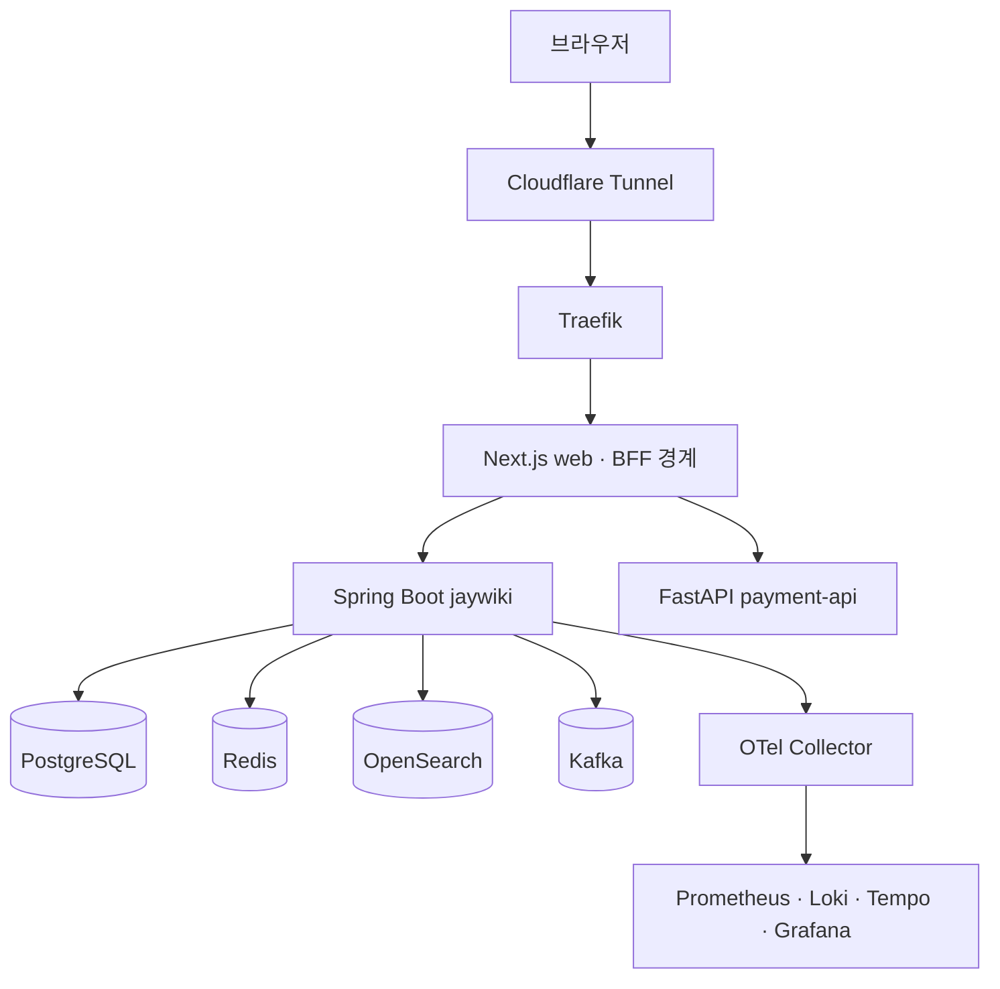

title: "jay-wiki: 배운 것을 눌러서 돌려 볼 수 있게 모은 기술 위키"
slug: jaywiki-runnable-portfolio
category: 개인 프로젝트
summary: 배운 것을 복습하려고 만든 실행형 기술 위키. 책상 위 미니PC k3s에서 돌리고, 화면이 실제 실행인지 정의된 흐름인지를 배지로 구분한다.
tags: homelab,k3s,kubernetes,nextjs,observability,portfolio,spring-boot
toc: true
publishedAt: 2026-08-04T08:10:07.074382Z
updatedAt: 2026-08-15T15:10:02.26295Z
syncHash: 12ab121c11270b222c7aa71725a722f2a57481e0ef478ef407580325b23ad876

---
개인 프로젝트를 여러 번 만들면서 같은 패턴을 반복했다. 무엇을 만들지 정하는 데 시간을 다 쓰고,
만드는 동안에는 화면이 도는 최단 경로만 골랐다. 서비스는 남았지만 트랜잭션 경계나 이벤트 재처리처럼
정작 오래 남을 것들은 손대지 않은 채 지나갔다. 시간이 지나면 이름만 기억나고 왜 그렇게 했는지는 사라졌다.

jay-wiki는 그 반대로 만들었다. 새 서비스를 하나 더 만드는 대신, 그동안 배운 것을 한곳에 올려놓고
직접 돌려 보면서 복습하는 사이트다. 글로 설명만 남기면 다시 읽을 때 그 설명이 맞는지 확인할 방법이 없다.
그래서 설명 옆에 항상 실행 버튼을 두는 것을 기본 형태로 잡았다.

이 글의 수치는 2026-08-04 기준이다. 저장소 문서에서 가져왔고 이후 바뀔 수 있다.

> **2026-08-15 덧붙임.** 그 사이 바뀐 수치를 다시 맞췄다. 원문은 지우지 않고 ~~취소선~~ 으로 두고 옆에 지금 값을 적었다.

그 아래 첫 화면은 글 목차가 아니라 이 사이트가 무엇 위에서 도는지를 보여주는 오케스트레이션 맵이다.
공개 경계에서 들어온 요청이 워크로드를 지나 k3s로, 다시 데이터와 관측으로 흐르고 배포와 복구가
바깥에 붙는다. 영역을 누르면 그 자리에서 설명이 열린다. 스택을 나열한 그림이 아니라, 어디를 눌러
무엇을 확인할지 정하는 지도로 쓰려고 했다.

## 기술 이름을 나열하는 대신 실행 화면과 짝지었다

포트폴리오에 Kafka를 썼다고 적는 것과, 주문 이벤트를 하나 만들어서 소비자 세 개로 퍼지고
계속 실패하는 이벤트가 DLQ로 격리되는 것을 보여주는 것은 다르다. 앞의 것은 검증할 수 없고
뒤의 것은 방문자가 직접 눌러서 확인한다. 그래서 위키 글마다 대응하는 실행 화면을 붙였다.

| 관심사 | 직접 해볼 일 | 확인할 증거 |
|---|---|---|
| 분산 실패와 보상 | Saga 주문 시나리오를 실행한다 | 단계별 상태, 보상 결과, trace와 로그 |
| 이벤트 처리 | Kafka 주문 이벤트를 만든다 | Outbox, fan-out, 재시도, DLQ와 consumer 결과 |
| 실시간 상태 | Redis 채팅에서 정원과 대기열을 만든다 | members, queue, events와 자동 승급 |
| 데이터 조회 | 10만 건 검색 비교를 실행한다 | LIKE, tsvector, OpenSearch nori의 결과와 시간 |
| 운영 상태 | 모니터링에서 공개 가능한 집계 신호를 본다 | 트래픽, 지연, 오류, Pod, Kafka, Saga, 백업 |

~~문서 탭은 네 묶음으로 나뉘고, 여기에 실무에서 겪을 법한 장애 상황을 정리한 시나리오 21편이
별도로 있다. 왜 이 구조를 골랐는지(BUILD), 배포하고 관측하고 복구할 수 있는지(OPERATE),
실패를 다음 판단으로 어떻게 연결했는지(IMPROVE), 그리고 이 사이트 밖에서 만든 것들(LAB)이다.~~

> **2026-08-15**: 탭 구조는 그 뒤로 두 번 바뀌었다. LAB 은 블로그로 떼어냈고 — 지금 읽고 있는 이 글이
> 그 블로그에 있다 — 남은 문서는 2026-08-10 에 인프라·백엔드·데이터·프론트엔드·운영·관측 같은 주제별
> 탭 열한 개로 다시 나눴다. BUILD·OPERATE·IMPROVE 는 탭이 아니라 첫 화면의 세 축 문구로만 남았다.
> 시나리오는 21편이 아니라 22편이다.

보안을 IMPROVE가 아니라 OPERATE에 둔 것이 이 분류에서 유일하게 고민한 지점이다.
보안은 나중에 개선할 항목이 아니라 공개된 상태로 운영하는 동안 계속 지켜야 하는 조건이라고 봤다.

## 클라우드 대신 책상 위 미니PC를 썼다

이 스택을 클라우드에 올리면 매달 돈이 나간다. PostgreSQL, Redis, Kafka, OpenSearch, MinIO에
Prometheus·Loki·Tempo·Grafana까지 한 번에 돌려야 해서 작은 인스턴스로는 부족하다.
현재 노드의 8스레드 16GB와 숫자가 가장 가까운 c7i.2xlarge에 512GB gp3를 붙이면
서울 리전 On-Demand 기준 월 341달러 수준이다(2026-07-15 조사 기준, 세금과 전송량 제외).

그리고 원래 하드웨어를 만지는 걸 좋아한다. 마침 미니PC가 있었다. GenMachine Ren4000 본체를
86달러에 구했고 메모리와 SSD를 직접 채웠다.

| 영역 | 구성 |
|---|---|
| CPU | AMD Ryzen 7 4700U, 8코어 8스레드 |
| 메모리 | DDR4-2666 SO-DIMM 8GB 두 장, 듀얼 채널 16GB |
| 저장장치 | NVMe 512GB |
| 전력 | BIOS에서 약 20W로 설정 |

86달러와 월 341달러를 나란히 두는 것이 절감액을 주장하려는 것은 아니다. 86달러에는 메모리·SSD·냉각
부품과 전기료, 고장과 관리 시간이 빠져 있다. 클라우드에서는 추상화되는 전력·열·디스크·노드 장애를
직접 다루는 대신 그 책임을 가져오는 거래에 가깝다. 그 거래가 이 프로젝트에서는 학습으로 남았다.

이 한 대 위에 k3s를 올렸다. 공개 요청은 Cloudflare Tunnel과 Traefik을 거쳐 Next.js로 들어오고,
브라우저는 내부 Spring API 주소를 직접 알지 못한다. Next.js가 BFF 경계를 맡는다.

Spring은 업무 데이터의 중심이지만 관측 도구와 배포 파이프라인까지 Spring을 지나가지는 않는다.
브라우저에 공개되는 것은 Next.js 화면과 제한된 BFF뿐이고, Grafana 원본 화면과 내부 서비스 주소는
별도 접근 경계 뒤에 둔다.

## 위키 본문을 배포 컨테이너가 아니라 PostgreSQL에 뒀다

글을 마크다운 파일로 저장소에 두면 배포할 때마다 이미지가 바뀐다. 오타 하나를 고쳐도 빌드가 돌고,
누가 언제 무엇을 고쳤는지는 git 이력에만 남는다. 그래서 본문, 탭 구조, revision을 전부 DB에 뒀다.

관리자로 로그인해 화면에서 글을 고치면 revision이 쌓이고 이전 버전을 다시 읽을 수 있다.
배포와 콘텐츠 수정의 수명을 분리한 셈이다. 대신 DB가 콘텐츠의 정본이 되므로 백업이 곧 콘텐츠 백업이고,
복원 리허설을 하지 않으면 백업이라고 부를 수 없게 됐다. 이 제약은 의도한 것이다.

## 실행처럼 보이는데 대본인 화면이 있었다

이 프로젝트에서 가장 오래 붙잡은 문제다.

시나리오 ~~21편~~ 22편은 전부 화면에 실행 버튼이 있고, 누르면 단계가 순서대로 흐르고, 처리 시간 같은 숫자가 나온다.
그런데 실제로 인프라가 도는 것은 ~~7편~~ 8편뿐이다. 나머지 14편은 `(시나리오, 모드)`를 받아 미리 적어 둔
단계 배열을 그대로 돌려주는 엔진을 지난다. 화면만 보면 둘을 구분할 수 없었다.

배지가 있긴 했다. 다만 문제를 어디서 가져왔는지만 알려주는 출처 배지였고, 그 배지를 단 9편 중
8편이 고정 대본이었다. 문제는 배지 문구가 아니라 축이었다. 출처와 실행은 서로 다른 축인데
한 축으로 표현하고 있어서 "실무에서 가져온 문제인데 실행은 아니다"를 말할 방법 자체가 없었다.

축을 둘로 나눴다.

| 축 | 값 | 뜻 |
|---|---|---|
| 출처 | 실무 기반 / 운영 검증 / 정책 비교 | 이 문제를 어디서 가져왔나 |
| 실행 | LIVE(~~7편~~ 8편) / MOCK(14편) | 화면의 단계와 숫자가 실측인가 |

숫자도 손봤다. 지우는 대신 성격을 밝혔다. 숫자를 없애면 모드끼리 비교한다는 이 화면의 목적 자체가
사라지기 때문이다. 실측인 화면에는 "이번 실행에서 측정한 값입니다", 나머지에는
"비교를 위한 고정 입력값입니다. 측정값이 아닙니다"를 붙였다.

기준을 하나로 정리했다. 숫자를 주장하는가다. "재고 갱신 경계를 한 트랜잭션으로 직렬화했다"는
설계 주장이라 대본이어도 괜찮다. "600 RPS 입력, p95 380ms"는 측정값 형태인데 상수다.
어떻게 측정했느냐는 한 마디에 무너진다.

같은 판단을 사이트 전체에 적용해서 증거 수준을 일곱 단계로 정리했다. 설계·계획, 결정론적 모델,
mock 연동, 로컬 구현, 제한된 benchmark, 운영 검증, 반복 운영 증거 순이다. 각 단계마다
쓸 수 있는 표현과 쓸 수 없는 표현을 붙여 뒀다. 로컬에서 확인한 것을 "운영 완료"라고 쓰지 않고,
고정 입력으로 정책을 비교한 것을 "실제 성능이 향상됐다"라고 쓰지 않는다.

이 기준을 세우고 나니 이전에 쓴 것들도 걸렸다. 메모리를 DDR4-3200으로 적어 뒀는데
분해 사진으로 라벨을 다시 보니 2666이었다. 프로세서가 3200을 지원해도 실제 동작 속도는
장착한 모듈을 따른다. 냉각을 보강했지만 개조 전 온도를 재 두지 않았으므로 몇 도가 낮아졌다는
그래프는 소급해서 만들지 않았다. 시나리오 코드를 점검하다가는 화면에 표시된다고 적어 둔 상태 문자열이
사실 한 번도 호출되지 않는 죽은 코드였다는 것도 발견해서 정정했다.

주장을 줄이는 규칙처럼 보이지만 실제로는 backlog에 가깝다. 다음에 무엇을 측정하면
한 단계 위의 주장을 할 수 있는지가 그대로 남기 때문이다.

## 남은 한계

- **설명이 기록보다 많다.** 왜 이렇게 설계했는지를 말하는 글은 충분한데, 날짜와 커밋 SHA와
  걸린 시간이 있는 글은 적다. 사후에 쓸 수 있는 기록과 아닌 기록이 나뉜다는 것도 늦게 알았다.
  image SHA나 row count는 나중에도 찾지만, 복구에 걸린 시간이나 서비스가 돌아온 순서는
  그때 재지 않으면 영영 안 남는다. 기록하는 글은 작업이 끝난 뒤가 아니라 시작할 때 준비해야 한다.
- **로드맵의 "부분 완료"가 많다.** 재부팅 복구는 회복 여부만 확인했고 구간별 회복 시각이 없다.
  복원 리허설은 절차와 실패 사례는 남겼지만 특정 실행의 소요 시간과 row count가 없다.
  검색 비교는 결과 수는 기록했고 응답 시간이 남았다. 확인했다까지는 쉽게 가지만
  얼마나 걸렸는지를 남기려면 측정을 미리 설계해야 한다.
- **코드 결함 세 건이 남아 있다.** 제휴 API 클라이언트에 서킷 브레이커가 없고,
  콜백 레지스트리가 JVM 메모리에 있어 replica가 둘이면 콜백이 엉뚱한 인스턴스로 갈 수 있고,
  중단된 saga를 복구하는 절차가 없다. 마지막 것은 트랜잭션 경계를 단계별로 나눈 대가로 새로 생긴 한계다.
- **시나리오 14편은 여전히 대본이다.** 세 편 정도는 실제 구현으로 승격할 수 있다고 봤다.
  도메인 데이터가 거의 필요 없고 이미 있는 인프라로 현상이 재현되기 때문이다. 나머지는
  상품·재고·결제·원장 테이블이 전부 있어야 해서, 포트폴리오가 아니라 이커머스를 새로 만드는 일이 된다.
- **정적 자산 경로가 두 갈래다.** 저장소의 public 디렉터리와 MinIO를 함께 쓴다.
  어느 쪽이 어떤 자산을 맡는지 적어 두지 않아 매번 헷갈렸는데, 이 글을 쓰면서
  작업 지침에 한 줄로 못 박았다 — public 은 배포와 함께 나가는 정적 파일,
  MinIO 는 관리자 화면에서 올린 런타임 자산이다.

검증은 Spring ~~171개~~ 214개, 프론트엔드 ~~64개~~ 118개 테스트와 타입 검사로 받친다(2026-08-15 실측). 다만 정렬이나 줄바꿈처럼
테스트가 대신 판단하기 어려운 것은 지금도 화면을 직접 열어서 확인한다.

jay-wiki는 새 서비스를 만들려고 시작한 게 아니라, 만들면서 지나쳤던 것들을 다시 눌러 보려고 시작했다.
그 목적에는 화면이 도는 것보다 그 화면이 무엇을 근거로 도는지가 더 중요했다. 실제로 도는 ~~7편~~ 8편과
대본인 14편을 굳이 갈라서 표시한 것이 이 프로젝트에서 가장 오래 남을 결정이라고 생각한다.
