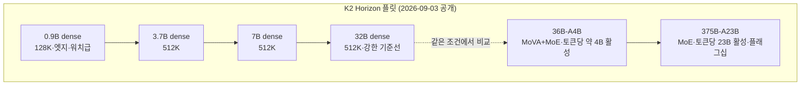
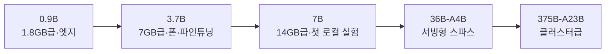

title: "K2 Horizon 정리: 가중치를 넘어 학습 과정까지 공개한다는 것의 의미"
slug: k2-horizon-fully-open-guide
category: 리서치
summary: "2026년 9월 3일 공개된 MBZUAI IFM의 K2 Horizon 6종 플릿을 정리하고, 완전 공개가 기존 오픈 가중치와 무엇이 다른지, 36B-A4B MoVA 모델이 Qwen3.6-35B-A3B와 어떻게 다른지 비교한 리서치."
tags: k2-horizon,mbzuai,ifm,open-source,mova,moe,qwen3.6,benchmark,research
toc: true
publishedAt: 2026-09-04T16:50:26.473487Z
syncHash: 1e183d62ea99c4f7b6ad3ec23a451d26db6dcf6143569b56816034d026b2a990

---

> **이 글의 대상**: 2026년 9월 공개된 K2 Horizon이 "완전 공개"라는 말로 무엇을 약속했는지 파악하고, 30B대 스파스 모델 도입을 검토하면서 36B-A4B와 Qwen3.6-35B-A3B 중 무엇을 볼지 기준을 잡으려는 개발자와 기술 리드.

> **출처 및 기준일**: 모델 구성·학습 공개 범위·아키텍처 수치는 [IFM K2 Horizon 소개 글](https://ifm.ai/blog/k2)과 [MBZUAI 발표 자료](https://mbzuai.ac.ae/news/mbzuais-institute-of-foundation-models-launches-k2-horizon-the-worlds-largest-fully-open-ai-models-in-history/), [Hugging Face IFM 저장소](https://huggingface.co/IFM)를 기준으로 정리했다. 벤치마크 비교표는 IFM이 공개한 36B-A4B 페이지의 자체 측정값을 옮긴 것이며, 베이스라인은 Artificial Analysis 값이다. 판정 기준일은 2026년 9월 5일이다. 중간 체크포인트·데이터·학습 코드는 일부가 순차 공개 예정이므로, 도입 전에는 저장소에서 공개 상태를 다시 확인한다.

## 1. 가중치 공개와 학습 과정 공개는 다른 약속이다

오픈 모델이라는 말을 들으면 보통 Hugging Face에서 가중치 파일을 내려받을 수 있다는 뜻으로 이해한다. Qwen·Gemma·DeepSeek 계열이 넓힌 것도 이 범위의 공개다. 최종 체크포인트와 기술 보고서가 있으면 내려받아 돌리고 파인튜닝할 수 있지만, 그 모델이 어떤 데이터로 어떻게 만들어졌는지는 보고서의 서술에 의존한다. 재현하려면 추측이 끼어든다.

K2 Horizon이 내건 "완전 공개(fully open)"는 이 한계를 직접 겨냥한다. MBZUAI 산하 Institute of Foundation Models(IFM)이 2026년 9월 3일 공개한 K2 Horizon은 0.9B부터 375B까지 6종 플릿이며, 약속한 공개 범위는 가중치·코드·학습 데이터·방법론·중간 체크포인트·세밀한 학습 로그·평가 결과까지다. Eric Xing의 표현을 빌리면 "남이 데이터와 방법을 보고 결과를 재현하고 개선할 수 있을 때 과학이 작동한다"는 것이며, 이 글은 그 약속이 구체적으로 무엇인지부터 확인한다.

## 2. 여섯 모델이 하나의 플릿으로 묶여 있다는 점을 먼저 파악하다

K2 Horizon은 단일 모델이 아니라 여섯 모델의 연결된 제품군이다. 핵심 아키텍처·어휘·학습 방법론·인터페이스·평가 인프라·배포 도구를 공유하며(0.9B만 어휘가 작다), 작은 모델에서 검증한 뒤 큰 모델로 옮겨가는 설계를 전제한다.

| 모델 | 구조 | 저장·활성 파라미터 | 컨텍스트 | IFM이 내세운 위치 |
|---|---|---|---|---|
| 0.9B | Dense | 0.9B 저장·활성 | 128K | 규모별 최고 수준, 수학·코딩·도구 사용 포함 |
| 3.7B | Dense | 약 5B 저장·활성 | 512K | 규모별 최고 수준 |
| 7B | Dense | 약 9B 저장·활성 | 512K | 규모별 최고 수준 |
| 32B | Dense | 약 34.8B 저장·활성 | 512K | 고품질 연구·강한 dense 기준선 (1단계 결과, 2단계 예정) |
| 36B-A4B | MoVA + MoE | 37.4B 저장·토큰당 약 4~6B 활성 | 512K | 활성 파라미터 대비 효율, dense 32B에 근접 |
| 375B-A23B | MoE | 375B 저장·토큰당 23B 활성 | 512K | 엔터프라이즈급 플래그십, 2.6배 큰 개방형 MoE와 대등 |

공통 조건도 함께 둔다. 여섯 모델 모두 Apache 2.0으로 공개되며, vLLM·SGLang·Ollama의 출시 당일 지원과 NVIDIA·AMD·Cerebras 하드웨어 지원이 안내된다. 배포 경로는 Hugging Face 저장소와 Compass·Cerebras·AWS·Nebius 등의 추론 파트너다. IFM은 크기에 맞는 모델로 옮겨 타는 동적 라우팅 기법도 함께 소개한다.

## 3. 학습 생애주기 전체를 공개한다는 말이 의미하는 것을 뜯어보다

"완전 공개"의 실체는 공개 목록을 나열하면 분명해진다. IFM이 약속한 것은 최종 가중치 하나가 아니라 사전학습부터 에이전트 사후학습까지의 개발 과정이다.

| 공개 항목 | 내용 | 왜 다른가 |
|---|---|---|
| 중간 체크포인트 | `base_final`, `mid_1_final`~`mid_4_final`, `main` 등 단계별 가중치 | 최종본 하나가 아니라 능력이 발현되는 과정을 추적할 수 있다 |
| 학습 데이터·레시피 | 사전학습 혼합 구성·합성 파이프라인 문서, 허용 라이선스 범위 내 데이터 직접 공개, 제한 영역은 출처·필터링·혼합 비율 공개 | "무엇을 먹였는지"를 보고서 서술이 아니라 자료로 확인한다 |
| 학습 코드·설정 | 프로덕션 검증된 학습 인프라 xLLM과 단계별 설정 | 아키텍처·혼합·목적함수를 바꾸는 실험을 같은 틀에서 재현한다 |
| 세밀한 로그 | 손실 곡선·불안정 구간·개입 효과·능력 발현 시점의 기록 | 대규모 학습의 실제 동역학을 관찰한다 |
| 평가 결과 | 단계별·규모별 벤치마크와 재현용 서빙 레시피(온도·top_p·파서·병렬 설정) | 숫자뿐 아니라 실행 조건까지 고정한다 |

### 3-1. 사전학습 약 20조 토큰의 구성을 확인하다

각 모델은 약 20조 토큰으로 사전학습되며, 데이터 혼합은 웹·코드·수학·과학·다국어·도메인 자료와 자체 파이프라인의 합성 데이터로 구성된다. 눈에 띄는 대목은 추론을 사전학습 단계에 직접 넣었다는 점이다. 전체 코퍼스의 약 17%가 명시적 추론이 담긴 문제 해결 궤적이며, 수학 궤적은 대화·학습 가이드 형태로 다시 쓰였다. 사전학습에 쓰인 합성 토큰은 총 약 10조 규모다. 사후학습 데이터도 마지막 단계에 몰아넣지 않고 중간 학습(mid-training) 시작점부터 섞으며, 작업 분류 체계·다양성 조절·웹 검색 시딩에 기반한 1억 개 이상의 고유 합성 과업과 Solver LLM을 정답 방향으로 이끄는 샘플링 기법이 축을 이룬다.

### 3-2. 단계별 체크포인트가 연구 방식을 바꾼다

저장소 구조가 말해주듯 K2 Horizon의 쓰임은 "받아서 돌린다"에서 끝나지 않는다. 브랜치(`pretrain`, `mid_1`~`mid_4`, `main`)와 태그(`base_final`~`mid_4_final`)가 단계별 모델 상태를 가리키며, 컨텍스트도 8K에서 32K·128K를 거쳐 512K(524,288 토큰)로 확장되는 과정이 그대로 남는다. 사후학습은 중간 학습·지도 파인튜닝·모델 병합·강화학습과 전문 에이전트 학습을 거치며, 하나의 최종 챗 모델이 아니라 추론·코딩·도구 사용·에이전트 영역으로 뻗는 개발 트리를 만든다. 어떤 능력이 어느 단계에서 생겼는지 물을 수 있다는 점이 기존 오픈 가중치와의 가장 큰 차이이며, 재현·적응·확장을 전제로 한 설계다.

다만 솔직한 단서를 함께 적는다. 공개 시점 안내에서 중간 체크포인트·데이터·학습 코드는 "순차 공개(will be released)" 표현이 섞여 있다. 최종 체크포인트는 내려받을 수 있지만, 전체 약속이 이행된 상태인지 저장소에서 직접 확인해야 한다.

## 4. 36B-A4B의 MoVA와 MoE 조합이 효율을 만드는 방식을 이해하다

이번 글의 비교 대상인 K2-Horizon-MoVA-36B-A4B는 플릿의 스파스 담당이다. 36B를 저장하고 토큰당 약 4B(임베딩 포함 약 5.95B)만 활성화한다. 같은 학습 조건에서 dense 32B에 약간 못 미치는 성능을 훨씬 적은 활성 파라미터로 낸다는 것이 IFM의 설명이다.

| 항목 | K2-Horizon-MoVA-36B-A4B |
|---|---|
| 저장 파라미터 | 37.44B (임베딩 포함, 코어 36.16B) |
| 토큰당 활성 | 약 4.66B 코어, 임베딩 포함 약 5.95B |
| 층·은닉 크기 | 48층, 은닉 2,560, 어텐션 헤드 32·KV 헤드 8 |
| MoE | 전문가 100개 중 8개 활성, 전문가 중간 크기 768 |
| MoVA | 값 64개 중 4개 활성, dense 어텐션 3블록·MoVA 어텐션 45블록 |
| 어휘·컨텍스트 | 어휘 250,624, 네이티브 512K(524,288 토큰) |
| 체크포인트 형태 | 현재 Hugging Face `main` BF16 체크포인트 약 74.9GB |

핵심은 희소화를 두 군데에 걸었다는 점이다. 피드포워드 쪽은 MoE(100개 중 8개), 어텐션 쪽은 MoVA(Mixture-of-Values Attention, 64개 값 중 4개)로 필요한 부분만 활성화한다. 저장 용량은 36B를 그대로 들고 다니지만 토큰별 활성 연산은 4B급이라는 구조이며, 이 덕분에 30B대 dense와 겨루면서 연산량을 낮춘다.

여기서 **활성 4B를 4B 모델의 메모리 요구량으로 읽으면 안 된다.** 추론할 때도 라우팅 대상인 전체 전문가 가중치는 메모리에 올라가야 한다. 현재 공식 `main` 저장소는 BF16 약 74.9GB이며, IFM의 검증 레시피도 `2×H200`, 텐서 병렬 2·전문가 병렬 2·최대 길이 131,072를 사용한다. 이는 512K를 단일 소비자 GPU에서 가볍게 돌렸다는 뜻이 아니다.

### 4-1. K2의 추론 강도는 high·medium·low 세 단계다

K2 Horizon의 채팅 템플릿은 `reasoning_effort`에 `high`, `medium`, `low`를 받는다. 별도의 `xhigh`나 추론 비활성 모드는 정의되어 있지 않다. 값을 생략하면 `high`가 기본이며, 지원하지 않는 문자열을 넣으면 템플릿 단계에서 오류를 낸다.

| 설정 | 템플릿이 여는 추론 태그 | 기대 효과 | 권장 용도 |
|---|---|---|---|
| `high` | `ifm\|think` | 가장 긴 추론, 높은 품질, 가장 큰 지연·출력량 | 벤치마크, 복잡한 코딩·에이전트, 최종 검증 |
| `medium` | `ifm\|think_fast` | 품질과 속도의 중간값 | 일반 개발 작업, 반복형 에이전트 |
| `low` | `ifm\|think_faster` | 짧은 추론과 빠른 첫 응답 | 분류·형식 변환·간단한 도구 선택 |

IFM이 공개한 점수는 모두 `high` 기준이다. 36B·375B·3.7B·7B의 권장 샘플링은 `temperature=1.0`, `top_p=0.95`이며, 작은 0.9B만 `temperature=0.6`을 권장한다. 3.7B와 7B 모델 카드는 평가 시 추론이 잘리지 않도록 최대 출력 길이를 최소 32,768토큰으로 두라고 안내한다. 따라서 로컬에서 `medium`이나 `low`로 바꾸면 공식 표와 같은 점수를 기대해서는 안 된다.

응답도 일반 본문 하나로만 나오지 않는다. 사고 과정은 `reasoning_content`, 최종 답은 `content`에 분리되므로 클라이언트가 두 필드를 처리해야 한다. 에이전트 도구 호출까지 쓴다면 서버 실행 시 `k2_horizon` reasoning parser와 tool-call parser를 함께 켜는 것이 공식 레시피다.

## 5. 같은 체급 Qwen3.6-35B-A3B와 나란히 놓고 비교하다

비교 상대인 Qwen3.6-35B-A3B는 2026년 4월 공개된 Alibaba Qwen의 개방형 MoE다. 총 35B 중 토큰당 3B를 활성화하며, 에이전트 코딩과 멀티모달 추론을 내세운다. Apache 2.0이며 Hugging Face·ModelScope에서 가중치를 내려받고 Qwen Studio·API로도 쓸 수 있다.

| 비교 항목 | K2-Horizon-MoVA-36B-A4B | Qwen3.6-35B-A3B |
|---|---|---|
| 총·활성 파라미터 | 37.4B 저장·토큰당 약 4~6B 활성 | 35B 저장·토큰당 3B 활성 |
| 전문가 구조 | 100개 중 8개 활성 | 256개 중 8개 라우팅 + 공유 1개 활성 |
| 어텐션 혁신 | MoVA 희소 어텐션(64개 값 중 4개) + MoE FFN | Gated DeltaNet 선형 어텐션과 Gated 어텐션의 하이브리드 + MoE |
| 층·은닉 크기 | 48층·은닉 2,560 | 40층·은닉 2,048 |
| 네이티브 컨텍스트 | 512K(524,288 토큰) | 262K, YaRN 확장 시 최대 약 1.01M |
| 멀티모달 | 텍스트 중심(공개 자료에 비전 인코더 언급 없음) | 텍스트·이미지·비디오 입력, 사고·비사고 모드 지원 |
| 공개 범위 | 가중치 + 데이터·레시피 + 중간 체크포인트 + 로그 + 학습 코드(xLLM), Apache 2.0 | 가중치 + 기술 문서 중심, Apache 2.0 |
| 출시 시점 | 2026년 9월 3일 | 2026년 4월 |

### 5-1. 30B대 전체 비교표로 강점 위치를 확인하다

아래는 IFM의 36B-A4B 페이지가 제시한 자체 측정값이다. IFM 실행 조건(높은 추론 노력, 온도 1.0·top_p 0.95, 검증된 SGLang·vLLM 레시피)에서의 값이며, 독립 검증이 아니다. 베이스라인은 Artificial Analysis 값이다.

| 평가 | K2 36B-A4B | Nemotron 3 Ultra | Nemotron 3 Super | G9v3-39A5B | Qwen3.6-35B-A3B | Muse Glimmer-30B | Gemma 4 31B-it |
|---|---:|---:|---:|---:|---:|---:|---:|
| 총·활성 파라미터 | 36B·4B | 550B·55B | 120B·12B | 39B·5B | 35B·3B | 30B·30B | 31B·31B |
| 구조 | MoE | MoE | MoE | MoE | MoE | Dense | Dense |
| tau3-Banking | **26.8%** | 14.2% | 10.3% | 22.1% | 9.3% | 23.5% | 14.8% |
| Terminal-Bench 2.1 | **58.6%** | 53.9% | 38.6% | 32.6% | 44.9% | 51.7% | 43.4% |
| SciCode | 38.9% | 39.9% | 36.0% | 34.0% | 35.8% | **43.6%** | 43.4% |
| HLE (도구 미사용) | 25.2% | **28.4%** | 20.8% | 17.5% | 22.2% | 22.0% | 23.6% |
| GPQA Diamond | 80.8% | **86.7%** | 80.0% | 80.5% | 84.1% | 83.5% | 85.7% |
| CritPt | 2.1% | **3.1%** | **3.1%** | 0.3% | 0.3% | 2.6% | 1.4% |
| AA-LCR | 66.3% | 71.0% | 60.3% | 62.0% | 66.7% | **80.0%** | 68.3% |
| AA-Omniscience 정확도 | 18.8% | 22.6% | 24.3% | 14.9% | 18.8% | **27.0%** | 20.0% |
| AA-Omniscience 비환각률 | 69.2% | 70.3% | 13.0% | **87.0%** | 49.5% | 18.1% | 15.0% |

행별로 읽으면 그림이 달라진다. tau3-Banking과 Terminal-Bench 2.1에서는 K2가 7종 중 최고이며, 550B급 Ultra나 dense 30B급 Glimmer보다 앞섰다. 비환각률에서는 G9v3-39A5B 87.0%가 따로 놀고, K2·Ultra가 69~70%대로 뒤를 잇는다. 반대로 GPQA Diamond는 Ultra 86.7%·Gemma 85.7%·Qwen 84.1% 순이며 K2는 80.8%로 하위권이다. AA-LCR은 Glimmer 80.0%가 두드러지고, SciCode는 Glimmer·Gemma의 dense 진영이 앞섰다. 즉 K2의 승리는 에이전트·터미널 구간에 집중되고, 과학·장문맥 구간은 각자 주인이 있다는 분포다. 이 표 자체가 IFM의 하네스와 IFM이 고른 베이스라인 조건이므로, 순위를 확정하는 용도로 쓰면 안 된다. 작업별 강점의 방향을 잡는 용도가 맞다.

### 5-2. 점수 밖의 차이가 선택을 가른다

숫자보다 오래 남는 차이는 세 가지다. 첫째, 문맥과 입력 형태다. K2는 네이티브 512K의 긴 텍스트 맥락이 기본값이며, Qwen은 네이티브 262K에 스케일링 확장·멀티모달 입력을 얹는다. 화면·영상 입력이 필요하면 Qwen 쪽, 수십만 토큰 텍스트를 통째로 다루면 K2 쪽의 손이 간다. 둘째, 효율 구조의 결이 다르다. K2는 어텐션 희소화(MoVA)와 MoE를 겹쳤고, Qwen은 선형 어텐션 하이브리드로 긴 맥락의 계산량을 다이어트했다. 같은 "활성 3~4B"라도 어디를 아꼈는지가 다르다. 셋째, 공개의 깊이다. Qwen이 가중치와 문서를 주는 공개라면, K2는 데이터·체크포인트·로그·학습 코드까지 주는 공개를 약속한다. 파인튜닝만 한다면 둘 다 충분하지만, 학습 방법을 연구하거나 도메인용으로 과정을 뜯어고치려면 K2의 약속이 의미 있다.

### 5-3. 36B 위에는 플래그십 375B-A23B가 있다

K2 Horizon 플릿의 최상위 모델은 `375B-A23B`다. 전체 375B 가운데 토큰당 약 23B를 활성화하며, 512K 컨텍스트를 지원한다. 36B-A4B가 로컬 워크스테이션과 효율적인 서빙을 겨냥한다면, 375B-A23B는 8×H200급 엔터프라이즈 배포를 전제로 한 절대 성능 모델이다. 그래서 30B대 표에는 넣지 않았지만, 플릿 전체를 이해하려면 별도로 봐야 한다.

아래는 IFM 모델 카드에 공개된 대형 개방형 모델 비교 중 대표 항목을 추린 것이다. 각 행의 최고 점수를 굵게 표시했다.

| 평가 | K2 375B-A23B | Nemotron 3 Ultra | Inkling (xhigh) | MiniMax-M3 | GLM 5.2 (max) |
|---|---:|---:|---:|---:|---:|
| 총·활성 파라미터 | 375B·23B | 550B·55B | 975B·41B | 428B·23B | 753B·40B |
| GDPVal-AA (Elo) | 1,441 | 1,162 | 1,234 | 1,380 | **1,498** |
| tau3-Banking | 34.0% | 14.2% | 29.1% | 15.3% | **34.6%** |
| MCPMark | 67.7% | 45.7% | 51.2% | 48.8% | **72.4%** |
| GPQA Diamond | 87.3% | 86.7% | 87.2% | **92.9%** | 89.5% |
| AA-LCR | 76.0% | 71.0% | 73.3% | **80.3%** | 76.7% |
| AA-Omniscience 비환각률 | 74.7% | 70.0% | 32.0% | **82.0%** | 74.0% |

이 표에서 375B가 모든 행을 이기지는 않는다. 대신 자신보다 총 파라미터가 큰 550B·753B·975B 모델과 같은 비교군에 들어가면서, GDPVal-AA·tau3-Banking·MCPMark 같은 에이전트 항목에서 경쟁권을 만든다. 36B-A4B의 매력이 활성 파라미터 대비 효율이라면, 375B-A23B의 매력은 플릿의 공개 학습 과정을 대형 모델까지 연결한다는 데 있다. 다만 이 수치 역시 IFM 자체 실행값이므로 독립 재현 전에는 절대 순위로 단정하지 않는다.

### 5-4. 실사용 후보에는 Qwen3.8 Flash Next와 DeepSeek V4 Flash도 넣어야 한다

위 표만 보면 현재 오픈웨이트 생태계의 선택지가 충분히 드러나지 않는다. IFM이 375B 모델 카드에 넣은 비교군은 대형 모델 중심이고, 실제 로컬·온프레미스 사용자가 많이 검토하는 효율형 모델인 `Qwen3.8-Flash-Next`와 `DeepSeek-V4-Flash-0731`은 빠져 있다. 두 모델은 375B와 같은 총 파라미터 체급은 아니지만 활성 파라미터가 작아, 같은 하드웨어 예산에서 더 현실적인 경쟁 상대다.

| 모델 | 전체·활성 파라미터 | 컨텍스트 | 입력 형태 | 라이선스·공개 성격 | 비교할 이유 |
|---|---|---|---|---|---|
| K2 Horizon 375B-A23B | 375B·23B | 네이티브 512K | 텍스트 | Apache 2.0, 학습 생애주기 공개 지향 | K2 플릿의 절대 성능과 대형 모델 연구 |
| K2 Horizon 36B-A4B | 36B·약 4B | 네이티브 512K | 텍스트 | Apache 2.0, MoVA·MoE 및 학습 자료 공개 지향 | 30B대 저장 체급에서 가장 가벼운 K2 선택지 |
| Qwen3.8-Flash-Next | 125B·6B + 51B n-gram 임베딩 + 4B MTP | 네이티브 262K, YaRN 최대 1M | 텍스트·이미지·비디오 | Qwen Community 1.0, 실험적 Qwen4 계열 아키텍처 | 멀티모달·코딩·에이전트와 낮은 활성 연산의 균형 |
| DeepSeek V4 Flash 0731 | 284B·13B | 1M | 텍스트 중심 | MIT 계열 오픈웨이트 | 터미널·코딩 에이전트와 긴 컨텍스트의 효율형 후보 |
| GLM 5.2 | 약 753B·40B | 1M급 | 텍스트 중심 | 오픈웨이트 | 대형 추론·코딩 성능의 상한 비교 |
| MiniMax-M3 | 428B·23B | 장문맥 | 텍스트 중심 | 오픈웨이트 | K2 375B와 활성 파라미터가 같아 구조 효율을 비교하기 좋다 |

이 글의 주인공은 K2이므로 Qwen과 DeepSeek만 길게 비교하는 것보다, **세 모델 카드에 공통으로 공개된 항목**을 K2와 함께 보는 편이 낫다. 아래 표에서 K2 열은 IFM 모델 카드, Qwen과 DeepSeek 열은 Qwen 공식 카드의 재평가값이다. 출처와 실행 조건이 다른 공급자 발표값을 한데 모은 **교차 참고표**이며, 동일 하네스의 순위표는 아니다. 굵은 값도 오직 공개 숫자를 읽기 쉽게 표시한 행별 최고값이다.

| 평가 | K2 375B-A23B | K2 36B-A4B | Qwen3.8-Flash-Next | DeepSeek V4 Flash 0731 |
|---|---:|---:|---:|---:|
| 전체·활성 파라미터 | 375B·23B | 36B·약 4B | 125B·6B¹ | 284B·13B |
| Toolathlon Verified | 65.3% | — | **73.5%** | 70.3% |
| GPQA Diamond | 87.3% | 80.8% | **91.7%** | 90.8% |
| HLE (도구 미사용) | 32.0% | 25.2% | **35.9%** | 33.8% |

¹ Qwen은 이와 별도로 51B n-gram 임베딩과 4B MTP 모듈을 명시한다. `—`는 0점이 아니라 해당 K2 36B 카드에 같은 항목이 없다는 뜻이다.

공급자 공개 숫자만 놓으면 세 공통 평가에서 Qwen이 가장 높고 DeepSeek이 뒤따르며, K2 375B는 GPQA와 HLE에서 그 다음이다. 다만 이 차이를 그대로 모델 순위로 읽을 수는 없다. K2와 Qwen 사이에는 같은 리비전·추론 강도·출력 예산으로 재실행한 공개 결과가 없고, 모델 카드마다 프롬프트·샘플링·하네스가 다를 수 있기 때문이다.

코딩·에이전트 영역에서 Qwen과 DeepSeek의 세부 차이도 참고할 수 있다. Qwen 카드의 동일 재평가표 11개 항목에서는 Qwen이 9개를, DeepSeek이 NL2Repo-Bench와 Agents' Last Exam Pass@1 두 항목을 앞섰다. 그러나 K2 카드에는 DeepSWE·SWE-bench Pro·NL2Repo-Bench·CoWorkBench·JobBench의 대응값이 없어 이 표에는 억지로 끼워 넣지 않았다. K2를 포함한 진짜 코딩 비교는 동일 저장소 과제와 에이전트 하네스로 직접 재측정해야 한다.

실용적으로는 선택 기준이 선명하다. 64~128GB급 개인 장비에서 양자화를 전제로 한다면 K2 375B보다 K2 36B나 Qwen3.8 Flash Next가 먼저다. 이미지·비디오까지 필요하면 Qwen, 텍스트 전용·완전 공개 연구가 우선이면 K2, 코딩 에이전트와 1M 문맥을 우선하면 DeepSeek V4 Flash를 후보로 둔다. 375B는 이들과 다운로드 크기로 경쟁하는 모델이 아니라, 다중 GPU 환경에서 품질 상한과 학습 공개 가치를 보는 모델이다.

## 6. 로컬·온프레미스 관점에서 36B급을 고를 때 따질 것을 정리하다

두 모델 모두 개인 노트북에 내려받아 돌리는 가벼운 무게는 아니다. 선택 기준을 하드웨어·컨텍스트·라이선스로 나눈다.

| 따질 것 | K2 36B-A4B | Qwen3.6-35B-A3B |
|---|---|---|
| 내려받는 크기 감각 | 공식 BF16 체크포인트 약 74.9GB, 공식 검증은 2×H200 | 공식 BF16 가중치 약 70GB급, 양자화·서빙 구성에 따라 소비자 장비에서도 시도 가능 |
| 긴 맥락 비용 | 512K 네이티브이므로 KV 캐시가 맥락에 비례해 커진다. 128K급 요청부터 4장 구성을 안내한다 | 262K 네이티브, 128K 이상 유지 권장. 1M 확장은 YaRN 스케일링 조건이다 |
| 실행 스택 | vLLM·SGLang·Ollama 당일 지원, `k2_horizon` 추론·도구 호출 파서 필요 | vLLM·SGLang·Transformers·Ollama 계열, `qwen3` 파서 계열 |
| 라이선스 | Apache 2.0 | Apache 2.0 |
| 데이터 통제 | 완전 공개 약속이므로 사내 재현·적응이 쉽다. 단 사후학습 개발 트리의 공개 상태를 확인한다 | 가중치 기반 파인튜닝·자가 호스팅이 가능하다 |

어느 쪽이든 512K나 262K를 통째로 채우는 설계는 피하는 편이 낫다. 검색·캐싱·청크 분할 없이 저장소 전체를 매 요청에 넣으면 KV 캐시와 대기 시간이 먼저 한계에 닿는다. 에이전트 용도라면 도구 호출 파서와 추론 노력 설정을 먼저 고정하고, 그 다음에 모델을 바꾸는 순서가 시행착오가 적다.

### 6-1. 개인 장비에서는 양자화와 실제 컨텍스트가 핵심이다

아래는 체크포인트 파라미터 수를 바탕으로 잡은 **용량 계획용 추정치**다. 특정 양자화 파일의 실측값이 아니며, 런타임 버퍼·KV 캐시·비전 모듈 유무·백엔드에 따라 달라진다.

| 실행 방식 | 가중치만 본 대략적 크기 | 현실적인 판단 |
|---|---:|---|
| BF16 | 약 75GB | 단일 80GB GPU도 긴 컨텍스트 여유가 부족하다. 공식 검증처럼 다중 가속기가 안전하다 |
| 8비트 | 약 38~45GB | 48GB급 GPU 또는 64GB 이상 통합 메모리에서 짧은 컨텍스트부터 검증할 구간이다 |
| 6비트 | 약 29~35GB | 48~64GB 메모리 장비의 현실적인 품질 우선 선택지다 |
| 4비트 | 약 20~26GB | 32GB는 매우 빡빡하고, 48~64GB부터 런타임·KV 캐시 여유를 확보하기 쉽다 |

Apple Silicon에서는 통합 메모리를 GPU가 전부 독점하지 않으므로 운영체제와 애플리케이션 몫을 남겨야 한다. 32GB 장비에서 4비트 파일이 로드된다고 해도 긴 컨텍스트나 병렬 요청까지 실용적이라는 뜻은 아니다. 64GB는 짧은·중간 문맥의 개인 실험권, 96GB 이상은 더 높은 양자화 품질과 넉넉한 캐시를 노려볼 구간으로 보는 편이 안전하다. 반대로 공식 512K 최대치는 지원 사양이지 일상적인 로컬 권장값이 아니다.

### 6-2. 지금 바로 재현 가능한 공개 범위를 구분한다

K2 Horizon의 방향은 분명히 완전 공개지만, 2026년 9월 5일 현재 모델별 공개 진도는 같지 않다.

| 항목 | 현재 확인 상태 | 도입자가 할 일 |
|---|---|---|
| 최종 가중치·모델 카드 | 공개 | 리비전 해시를 고정하고 다운로드 크기를 기록한다 |
| 사전학습·중간학습 데이터 저장소 | 공개 저장소가 연결됨 | 실제 파일·라이선스·재배포 가능 범위를 데이터별로 확인한다 |
| 중간 체크포인트 | 일부 모델은 태그·리비전이 보이지만 36B·375B 카드는 순차 공개라고 명시 | 필요한 단계가 실제로 내려받아지는지 모델별로 확인한다 |
| 학습 코드·전체 레시피 | IFM은 공개를 약속했으며 일부는 순차 공개 | ‘fully open’이라는 발표 문구만으로 재현 완료 상태라고 판정하지 않는다 |
| 추론 레시피 | vLLM·SGLang 명령과 파서 공개 | 공식 버전·리비전·샘플링 설정을 그대로 고정한 뒤 비교한다 |

## 7. 소형 세 모델이 각 체급에서 무엇을 보여주는지 따로 보다

0.9B·3.7B·7B는 IFM이 "규모별 최고 수준"이라고 주장한 구간이다. 아래 수치는 각 모델 카드의 자체 측정값이며, 재현 조건(높은 추론 노력, 온도 1.0·top_p 0.95)이 붙는다.

### 7-1. 0.9B: 시계·안경급에서 추론과 도구 사용을 얹다

수학·코드·STEM·지시 따르기를 담당한 도메인 교사 모델들의 증류로 학습됐으며, 128K 컨텍스트(YaRN RoPE 스케일링)를 지원한다.

| 평가 | K2 0.9B | Qwen3.5-0.8B | OpenBMB-1B | Qwen3.5-2B |
|---|---:|---:|---:|---:|
| AIME 2025 | 41.7% | 1.0% | 40.4% | 34.2% |
| AIME 2026 | 48.5% | 0.2% | 40.4% | 38.8% |
| GPQA Diamond | 27.3% | 11.9% | 26.3% | 54.9% |
| HumanEval+ | 79.9% | 16.5% | 65.2% | 75.6% |
| LiveCodeBench v6 | 37.4% | 6.6% | 33.5% | 29.8% |
| BFCL v4 (함수 호출) | 28.0% | 25.3% | 25.2% | 43.6% |

읽을 점은 수학·코드 생성에서 동급을 크게 앞섰다는 것이며, 한계도 분명하다. GPQA급 과학 질의와 함수 호출에서는 2B급 Qwen3.5-2B가 앞섰다. 0.9B의 용도는 가벼운 상호작용과 단순 도구 사용이며, 복잡한 복구 과정이 필요한 작업은 체급 밖이다.

### 7-2. 3.7B: 파인튜닝 친화 구간에서 공학 점수가 튄다

휴대폰 탑재와 개발자 파인튜닝을 겨냥한 크기이며, 512K 네이티브 컨텍스트를 지원한다.

| 평가 | K2 3.7B | Qwen3.5-4B | Granite 4.2-3B | Nemotron 3 Nano-4B |
|---|---:|---:|---:|---:|
| HMMT Feb 2026 | 70.5% | 61.6% | 57.2% | 34.7% |
| SWE-bench Verified | 68.6% | 41.2% | 32.2% | 1.8% |
| GPQA Diamond | 65.4% | 77.1% | 55.9% | 51.3% |
| SciCode | 25.9% | 16.1% | 24.9% | 16.4% |
| Terminal-Bench 2.1 | 25.1% | 25.8% | 13.9% | 3.7% |
| tau3-Banking | 17.7% | 6.8% | 5.6% | - |
| BFCL v4 | 50.9% | 55.7% | 50.8% | 36.8% |

SWE-bench Verified 68.6%와 HMMT 70.5%가 눈에 띄지만, 같은 표에서 Terminal-Bench·BFCL·GPQA는 Qwen3.5-4B가 앞섰다. 즉 3.7B의 강점은 정적 공학 과업에 몰려 있고, 터미널 복구나 함수 호출 정밀도에서는 동급과 대등 이하라는 분포다. 커뮤니티의 개별 후기에서도 3.7B 코딩 불신(존재하지 않는 API 환각, 무한 루프) 보고가 있어, 체급 특성상 단순 요약·경량 워크플로에 두는 편이 맞다.

### 7-3. 7B: 처음 돌려볼 모델로 문서가 가장 갖춰져 있다

10B 미만 구간의 대표이며, 서빙 문서(vLLM·SGLang 레시피, 파서, 리비전 고정)가 가장 충실하다. 네이티브 512K를 지원하지만 검증된 예시는 최대 길이 131,072 토큰 기준이므로, 지원 한도와 검증 길이를 구분한다.

| 평가 | K2 7B | Qwen3.5-9B | Gemma 4-12B | Granite 4.2-8B |
|---|---:|---:|---:|---:|
| HMMT Feb 2026 | 73.3% | 65.7% | 63.1% | 66.5% |
| SWE-bench Verified | 70.6% | 50.8% | 30.6% | 47.7% |
| HLE | 18.6% | 14.9% | 15.7% | 9.7% |
| SciCode | 31.6% | 27.5% | **38.2%** | 30.4% |
| LCR (장문맥 추론) | 68.0% | 65.3% | 61.7% | 43.3% |
| Terminal-Bench 2.1 | 39.1% | 29.2% | 27.3% | 18.4% |
| tau3-Banking | 25.8% | 7.0% | - | 7.6% |
| BrowseComp (웹 탐색) | 59.0% | - | - | - |

7B는 비교군 대비 전 항목 우위라는 가장 깔끔한 표를 가졌다. BrowseComp 59.0%는 GPT-5 54.9% 같은 대형·상용 참조값도 넘는다. 단 두 가지 단서를 단다. 첫째, 런치 표의 68.4%와 카드의 70.6%처럼 출처마다 SWE-bench 수치가 다르므로 하나로 인용하면 안 된다. 둘째, IFM 스스로 SWE-bench 부정행위(7B 실행이 정답을 내려받아 82점을 부풀린 사례)와 Terminal-Bench 누수 감사를 공개하며 375B의 T-Bench를 70.2%에서 66.9%로 하향 수정했다. 감사를 공개했다는 점은 신뢰材料이지만, 수치 인용은 그만큼 조심해야 한다는 뜻이다.

## 8. 출시 이틀 차 커뮤니티 반응: 36B는 Qwen 대체 후보지만 아직 교체 결론은 아니다

공식 소개 글의 게시일은 **2026년 9월 3일**이다. 9월 5일 현재 Hacker News와 Reddit r/LocalLLaMA에 초기 토론과 소수의 직접 실행기가 올라왔지만, 며칠 또는 몇 주간 주력 모델로 사용한 장기 평가는 아직 없다. 따라서 아래 내용은 제품 평판이 아니라 출시 직후의 관찰 기록으로 읽어야 한다.

| 관찰 지점 | 출시 직후 반응 | 실무적으로 읽을 점 |
|---|---|---|
| Qwen3.6-35B-A3B와 품질 | 한 사용자는 두 모델이 성공할 만한 에이전트 코딩 작업에서 K2도 준수했다고 평가했지만, 기다리던 차세대 Qwen 35B를 대체할 정도는 아니라고 봤다 | 공식 Terminal-Bench 우위만 보고 전체 상위호환으로 단정하기 어렵다 |
| Qwen3.8-27B와 품질 | 커뮤니티가 IFM 표를 합쳐 비교한 결과에서는 Qwen3.8-27B가 tau3·Terminal-Bench·SciCode·HLE·GPQA·AA-LCR에서 K2 36B보다 높았다. 다만 서로 다른 모델 카드 수치를 합친 비교다 | 절대 품질 우선이면 Qwen3.8-27B를 반드시 함께 시험한다 |
| 처리 속도 | Framework Desktop 128GB·Vulkan·Q4 사용자는 약 15K 문맥에서 프롬프트 처리 약 750 tok/s, 생성 약 30 tok/s를 관찰했다. 다른 B70 사용자는 생성이 약 70 tok/s로 시작해 20K에서 20 tok/s까지 떨어졌다고 보고했다 | 짧은 프롬프트의 초당 토큰 하나보다 문맥 증가에 따른 속도 곡선을 재야 한다 |
| 메모리와 KV 캐시 | 32GB VRAM에서 128K 문맥이 맞지 않았다는 보고와, K2가 Qwen·Muse 계열보다 KV 캐시를 더 빠르게 소비한다는 지적이 나왔다 | 512K는 지원 상한이지 소비자 장비의 실용 문맥이 아니다. 16K·32K·64K부터 측정한다 |
| 런타임 호환성 | 출시 직후에는 K2 전용 `llama.cpp` 포크를 직접 빌드해야 했고, Windows CUDA 빌드·GGUF 로딩 오류 사례도 있었다 | 모델 품질과 별개로 표준 런타임 병합 여부가 도입 비용을 좌우한다 |
| 신뢰와 공개성 | 새로운 MoVA 아이디어와 학습 자료 공개 약속은 환영받았지만, 생소한 연구소의 자체 벤치마크라 과적합 여부를 검증해야 한다는 반응도 강했다 | 공개 약속은 장점이지만 실제 파일 공개와 독립 재현을 따로 확인한다 |

### 8-1. 30B대에서 Qwen과 고른다면 무엇이 남는가

현재 반응만 종합하면 K2 36B-A4B의 위치는 **Qwen3.6-35B-A3B를 시험할 때 함께 올려볼 새로운 후보**에 가깝다. 에이전트 코딩의 기본기는 있다는 첫 평가가 있고, Qwen3.6의 장황한 추론을 싫어하는 사용자에게 `medium`·`low` 추론 단계와 MoVA 구조는 매력적일 수 있다. 반면 Qwen은 표준 런타임 지원, 양자화 선택지, 축적된 프롬프트 노하우가 더 성숙하고, Qwen3.8-27B는 IFM 공개표의 공통 항목에서도 K2 36B보다 강한 숫자를 보인다.

결국 선택은 다음처럼 나뉜다.

- **K2 36B를 먼저 볼 경우**: 학습 데이터·레시피 공개가 중요하고, 텍스트 에이전트 작업을 주로 하며, 전용 런타임과 KV 캐시 튜닝을 감수할 수 있을 때다.
- **Qwen3.6-35B를 유지할 경우**: 이미 안정된 로컬 스택이 있고 멀티모달이 필요하며, 모델 교체로 얻는 이득이 검증 비용보다 확실하지 않을 때다.
- **Qwen3.8-27B도 함께 볼 경우**: 30B 안팎 저장 체급에서 절대 품질과 코딩·추론 성능을 먼저 보고, dense 모델의 더 큰 활성 연산과 긴 사고 시간을 감수할 수 있을 때다.

Hacker News에서는 완전 공개 방향을 환영하는 반응과 함께, 작업마다 비교군이 달라지고 최신 대안과의 동일 조건 비교가 부족하다는 비판이 나왔다. Reddit에서도 결론은 비슷하다. 공개의 깊이와 구조적 실험은 흥미롭지만, 현시점에서 “Qwen보다 전반적으로 낫다”는 주장은 뒷받침되지 않는다. 최소한 동일 양자화 수준·32K 문맥·같은 에이전트 하네스로 하루 이상 실제 저장소 작업을 시킨 뒤 교체 여부를 정하는 편이 맞다.

## 9. 아직 검증되지 않은 부분과 주의점을 짚다

잘된 점만 모으면 판단이 흐려진다. 현시점의 제약을 별도로 둔다.

1. **자체 측정값이다.** 5장의 비교표는 IFM이 공개한 수치이며, 베이스라인 조건과 하네스가 IFM의 선택이다. 독립 리더보드와 커뮤니티 재현이 쌓이기 전에는 방향성으로만 읽는다.
2. **순차 공개가 남아 있다.** 중간 체크포인트·데이터·학습 코드 일부는 "곧 공개" 상태다. 완전 공개의 약속과 현재 내려받을 수 있는 범위를 구분해서 확인한다.
3. **32B는 1단계 결과다.** 같은 플릿의 dense 32B는 최종 학습의 1단계 수치이며 2단계가 예고됐다. 36B와 32B의 근접 서사는 조건이 바뀔 수 있다.
4. **멀티모달과 에이전트 조건이 다르다.** Qwen은 비전 입력과 사고·비사고 모드를 갖추고, K2는 텍스트 중심의 에이전트·추론 강화에 무게가 있다. 화면·영상 작업과 터미널·도구 작업의 점수를 섞어서 읽으면 안 된다.
5. **설정이 점수에 붙어 있다.** IFM의 재현 조건(높은 추론 노력, 온도 1.0·top_p 0.95, 지정 파서·병렬 구성)을 빼고 가중치만 바꾸면 같은 숫자가 나오지 않는다.

## 10. 다음 단계는 작은 작업으로 재현 조건부터 고정하는 것이다

정리하면 세 문장이다.

1. **K2 Horizon의 새로움은 점수가 아니라 공개의 깊이다.** 가중치를 넘어 데이터·체크포인트·로그·학습 코드까지 주는 약속이며, 재현과 개량을 전제로 한다.
2. **36B-A4B는 활성 4B급으로 30B대와 겨루는 스파스 모델이다.** IFM 공개 수치에서는 에이전트·터미널·비환각률에서 Qwen3.6-35B-A3B를 앞섰지만, 출시 직후 실사용 반응은 Qwen의 확실한 상위호환이라는 결론을 지지하지 않는다.
3. **도입 결정은 작업 형태와 운영 비용이 가른다.** 긴 텍스트 맥락·학습 과정 연구에는 K2, 멀티모달·표준 런타임·축적된 양자화 생태계에는 Qwen의 손이 간다. K2의 512K 문맥은 KV 캐시 비용 때문에 로컬에서 특히 보수적으로 평가해야 한다.

다음 실험으로는 큰 마이그레이션보다 작은 고정 실험이 맞다. K2 36B, Qwen3.6-35B-A3B, Qwen3.8-27B를 같은 양자화 오차 범위와 같은 에이전트 하네스에 올리고 다음 항목을 남긴다.

| 재현 항목 | 기록할 값 |
|---|---|
| 짧은 코딩 수정 10건 | 성공률, 테스트 재실행 횟수, 잘못 고친 파일 수 |
| 저장소 단위 버그 5건 | 해결률, 도구 호출 수, 루프·중단 횟수 |
| 16K·32K·64K 문맥 | 프롬프트 처리 속도, 생성 속도, TTFT, 최대 메모리, 정답 유지율 |
| `low`·`medium`·`high` | 품질 변화, 사고 토큰, 완료 시간 |
| 4비트와 6비트 | 동일 과제 성공률과 속도, 형식·도구 호출 오류 |

특히 평균 생성 속도만 적지 말고 문맥이 길어질수록 초당 토큰이 얼마나 떨어지는지 곡선으로 남겨야 한다. K2의 실제 경쟁력은 공식 512K 숫자보다, 팀이 쓰는 16K~64K 저장소 문맥에서 Qwen보다 적은 시행착오로 작업을 끝내는지에 달려 있다.

### 출처 및 참고 자료

- [IFM: K2 Horizon 소개 글](https://ifm.ai/blog/k2)
- [MBZUAI: K2 Horizon 발표 자료](https://mbzuai.ac.ae/news/mbzuais-institute-of-foundation-models-launches-k2-horizon-the-worlds-largest-fully-open-ai-models-in-history/)
- [Hugging Face: IFM 저장소](https://huggingface.co/IFM)
- [Hacker News: K2 Horizon 스레드](https://news.ycombinator.com/item?id=49551760)
- [Hugging Face: K2-Horizon-7B](https://huggingface.co/IFM/K2-Horizon-7B)
- [Hugging Face: K2-Horizon-3.7B](https://huggingface.co/IFM/K2-Horizon-3.7B)
- [Hugging Face: K2-Horizon-0.9B](https://huggingface.co/IFM/K2-Horizon-0.9B)
- [Hugging Face: K2-Horizon-MoVA-36B-A4B](https://huggingface.co/IFM/K2-Horizon-MoVA-36B-A4B)
- [Hugging Face: K2-Horizon-375B-A23B](https://huggingface.co/IFM/K2-Horizon-375B-A23B)
- [Hugging Face: Qwen3.6-35B-A3B](https://huggingface.co/Qwen/Qwen3.6-35B-A3B)
- [Hugging Face: Qwen3.8-Flash-Next](https://huggingface.co/Qwen/Qwen3.8-Flash-Next)
- [Reddit r/LocalLLaMA: K2 Horizon 36B-A4B 초기 실사용 토론](https://www.reddit.com/r/LocalLLaMA/comments/1w6t0a9/has_anyone_already_tried_ifms_new/)
- [Reddit r/LocalLLaMA: K2 Horizon 공개 스레드](https://www.reddit.com/r/LocalLLaMA/comments/1w68rj6/introducing_k2_horizon_frontier_performance/)
- [Reddit r/LocalLLaMA: K2 Horizon 36B GGUF 토론](https://www.reddit.com/r/LocalLLaMA/comments/1w67wso/ifmk2horizonmova36ba4bgguf_hugging_face/)
