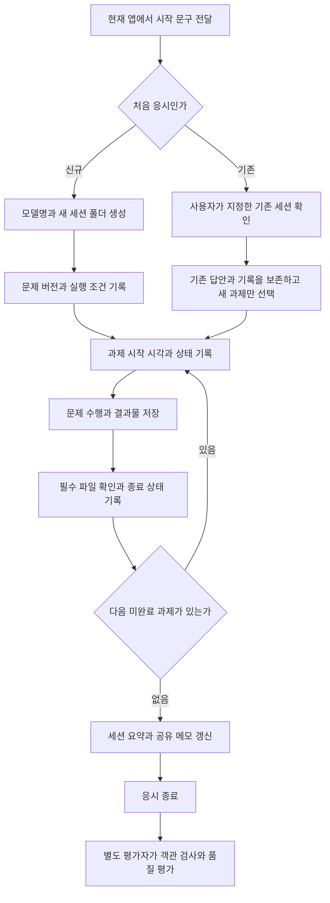

title: 내 작업에 맞는 AI를 고르기 위해 벤치마크를 만들었다
slug: leneu-benchmark-01-criteria
category: 개인 프로젝트
summary: 내가 실제로 맡기는 일을 기준으로 AI를 비교하는 Leneu Benchmark의 문제 구성과 채점 원칙, 실행 기록을 공개 탐색기로 분리한 이유를 정리한다.
tags: ai-benchmark,leneu-benchmark,agent,harness,writing,research
toc: true
publishedAt: 2026-09-14T02:10:11.463393+09:00
updatedAt: 2026-09-15T15:30:00+09:00
syncHash: af9b975ae339352e54e34d4595d61e21ffafac5b0be16e591521d9453580af4c

---

AI에게 맡기고 싶은 일은 코드 작성만이 아니었다. 랜딩페이지를 만들다가 긴 문서를 요약하고, 그 내용을 글로 정리한 뒤 필요한 정보를 웹에서 조사하기도 한다. 어떤 모델을 쓸지 고를 때도 이 작업들을 함께 보고 싶었다.

그래서 내 작업을 작은 과제로 나눈 Leneu Benchmark를 준비했다. 목표는 모든 사람에게 가장 좋은 모델을 정하는 것이 아니다. 내가 자주 맡기는 일을 어떤 모델과 실행 도구의 조합이 얼마나 끝까지 처리하는지 기록하는 것이다.

이 글에서는 실무 14개·추론 4개와 명세 판단을 보는 특성 10개를 왜 골랐는지, 제출과 통과를 왜 나눠 보는지를 정리한다. 현재는 일곱 실행의 26개 과제를 통합 기준으로 독립 채점했고, 점수와 판정 상태·두 지표 과제를 공개 산출물과 함께 확인할 수 있다. 다만 각 조합을 한 번씩 수행한 파일럿이므로 근소한 점수 차이를 확정된 순위로 읽으면 안 된다.

## 글과 실행 기록의 역할을 분리했다

처음에는 평가 기준과 모델별 결과를 블로그 글 안에서 모두 보여주려고 했다. 모델과 과제가 늘자 표만으로는 어떤 답안이 실제로 제출됐고, 웹·게임 산출물이 어떻게 동작하는지 확인하기 어려워졌다. 요약 글만 읽으면 평가자의 해석과 응시자가 만든 원본 사이의 거리도 잘 보이지 않았다.

그래서 [Leneu Benchmark 결과 탐색기](/benchmark/)를 별도 작업물로 만들었다. 탐색기에서는 모델별 실행 기록을 고르고, 과제 상태와 측정 범위를 비교하며, 공개 가능한 Markdown과 HTML 산출물을 직접 열어볼 수 있다. 평가 항목과 배점은 [채점 기준 화면](/benchmark/scoring-guide.html)에서 함께 확인할 수 있다.

| 기록 층 | 담당하는 내용 |
|---|---|
| 블로그 글 | 왜 이런 기준을 골랐는지, 결과를 어떻게 해석했고 무엇을 다음에 바꿀지 설명한다. |
| 결과 탐색기 | 모델·실행·과제별 상태와 점수, 공개 산출물을 같은 화면에서 비교한다. |
| 원본 실행 폴더 | 전체 응답, 검사 결과와 이력을 보존한다. 웹에는 공개 대상으로 고른 파일만 복사한다. |

탐색기는 원본 저장소를 대신하지 않는다. 공개 화면에 보이는 점수와 상태도 생성 시점의 읽기 전용 사본이다. 채점 기준이나 검증 결과가 바뀌면 원본 기록을 먼저 갱신한 뒤 공개 카탈로그를 다시 만든다. 덕분에 글을 고쳐 해석을 보완하는 일과 제출 원본을 보존하는 일을 섞지 않을 수 있다.

## 내가 실제로 맡기는 일을 14개 과제로 나눴다

후보 유형은 43개를 정리했고, 첫 문제 묶음에는 14개를 넣었다. 처음부터 분야를 계속 늘리기보다 도구 사용, 구현, 읽기와 쓰기, 조사에서 서로 다른 실패를 드러내는 과제를 골랐다.

| ID·과제 | 실제로 수행하는 일 | 완료 판단과 남기는 결과 |
|---|---|---|
| TC-01 · 선택적 조회 | 프로젝트 정보 파일에서 두 값을 찾고, 별도 자료가 필요 없는 문장은 조회 없이 요약한다. | 요청별 도구 사용 여부와 이유가 맞아야 한다. `answer.md`와 도구 사용 기록을 남긴다. |
| TC-02 · 일정 생성 | 서울 기준 상대 시각·45분 길이·참석자·요청 ID를 UTC 인자로 바꿔 모의 일정을 생성하고 다시 조회한다. | 생성 요청과 조회 결과의 제목·시각·참석자가 일치해야 한다. 요청 JSON, 응답 JSON과 확인 문장을 제출한다. |
| TC-04 · 오류 복구 | 첫 상품 조회의 일시 오류를 읽고 재시도한 뒤 존재하지 않는 상품도 조회한다. | 일시 장애와 영구 미존재를 구분하고 내부 파일로 우회하지 않아야 한다. 호출·오류·재시도 기록을 남긴다. |
| H-01 · 설정 수정 | 서비스 ID로 대상을 찾아 타임아웃 한 값만 바꾸고 작업용 복사본을 파싱·비교한다. | 다른 서비스와 포트·재시도·활성 상태·사용자 메모, 원본이 보존돼야 한다. 수정 JSON과 변경 전후 검증을 제출한다. |
| H-03 · 테스트 기반 수정 | 배송비 코드의 공개 테스트를 먼저 실패시킨 뒤 구현만 고쳐 같은 테스트를 다시 실행한다. | 중량 구간 올림·무료 배송 경계·입력 오류가 맞고 테스트를 약화하지 않아야 한다. 코드와 수정 전후 출력을 남긴다. |
| WEB-01 · 랜딩페이지 | 한 HTML 파일에 첫 화면·기능·사용 흐름·가격·FAQ·신청 폼과 상호작용을 구현한다. | 월·연 가격 전환, 모바일 메뉴, FAQ, 폼 검증, 키보드와 1440·768·390px 화면을 확인한다. 외부 CDN은 쓰지 않는다. |
| GAME-01 · 테트리스 | 10×20 보드·7종 블록·이동·회전·낙하·줄 제거·점수·다음 블록과 Hold를 구현한다. | 빈 보관·교환·블록 고정 전 1회 제한·C/Shift 우회 방지·생성 충돌·일시정지·재시작 초기화를 실제 플레이로 확인한다. |
| GAME-02 · 플랫폼 게임 | 고정 맵에 이동·점프·중력·충돌·카메라·코인·적·실패·골인을 구현한다. | 적 밟기와 옆 충돌, 낭떠러지, 코인 중복, 카메라 경계와 재시작을 확인하고 직접 완주했을 때만 완주 검증으로 기록한다. |
| CODE-01 · 예약 충돌 | 반열린 시간 구간에서 인접 예약을 허용하도록 기존 JavaScript 함수를 수정한다. | 동일·부분 겹침·포함·양쪽 인접·빈 목록·잘못된 입력과 입력 배열 보존을 테스트한다. 코드·테스트·실행 결과를 제출한다. |
| WRITE-01 · 기술 글 작성 | 고정한 llama.cpp 공식 문서 4개를 읽고 로컬 서버를 실제 작업 도구로 연결하는 조건을 독자의 결정 순서로 재구성한다. | 2,000~3,000자 글과 핵심 사실 8개 이상의 문서 ID·소제목·행 근거를 남긴다. 예시 수치를 실측으로 바꾸지 않는다. |
| WRITE-02 · 번역·편집 | llama-bench 공식 발췌를 도입·세 시험 비교표·결과 해석·주의사항 순서의 한국어 안내로 편집한다. | 700~1,100자 안에서 옵션·단위·반복·집계 조건을 보존한다. 편집본과 구조 변경 이유 3~5개를 제출한다. |
| THINK-01 · 장문 분석 | 약 19만 자의 빌드·서버·도구 호출·성능 문서를 탐색해 요약, 사실 목록과 주장 8개의 판정을 만든다. | 네 영역과 문서 앞·중간·뒤를 다루고 사실 12개 이상에 행 근거·조건을 연결한다. 외부 검색과 근거 없는 전체 검토 주장은 금지한다. |
| SEARCH-01 · 공식 기능 확인 | Python 3.12 tomllib의 읽기·쓰기 지원, 도입 버전과 파일 모드를 실제 공식 문서에서 확인한다. | 검색 결과 요약과 원문 열람을 구분한다. 주장별 URL·조회 시각·짧은 근거를 `research.md`와 `sources.json`에 남긴다. |
| SEARCH-03 · 환경별 비교 | Apple Silicon 64GB에서 Ollama·llama.cpp·LM Studio를 설치·모델 형식·API·도구 호출·오프라인 조건으로 조사한다. | 공식 자료를 우선하고 API와 개별 모델 능력을 구분한다. 미실측 속도·메모리·비용을 단정하지 않은 비교표·추천·미확인 사항을 제출한다. |

여기서 하네스는 모델이 파일·터미널·검색 도구를 사용하고 작업을 이어가도록 돕는 실행 환경을 뜻한다. 현재 과제는 각 앱이 제공하는 하네스를 그대로 사용한다. 모든 모델에 동일한 도구 목록과 권한을 제공한 통제 실험은 아니다.

도구 과제 일부는 터미널에서 로컬 모의 서비스를 호출하는 `cli-mock` 방식이다. 실제 캘린더에 일정을 쓰거나 결제하지 않는다. 이 결과를 모델 API의 네이티브 함수 호출 성능과 동일하게 해석하지도 않는다.

## 알고리즘과 독해·계산·실험 해석을 추가했다

기존 코딩 과제는 버그를 고치는 쪽에 집중돼 있었다. 새로운 요구사항을 알고리즘으로 바꾸고, 입력이 커져도 처리할 수 있는지 확인할 문제가 필요했다. 글쓰기와 리서치에서는 드러나기 어려운 독해·계산·과학적 해석도 짧은 문제로 살펴보기로 했다.

| ID·예상 소요 | 실제로 수행하는 일 | 완료 판단과 남기는 결과 |
|---|---|---|
| ALG-01 · 예상 15분 | 최대 20만 개의 작업에서 겹치지 않는 선택의 최대 가치 합을 구하는 Node.js 함수를 구현한다. | 인접·동일 구간·빈 입력·잘못된 형식·입력 보존과 대규모 입력을 확인한다. O(n log n) 이하 구현, 설명과 실행 결과를 제출한다. |
| REASON-KO-01 · 예상 8분 | 가상 안내문에서 회원 조건·취소 시각·예외·인과관계·미결정 운영안을 읽어 주장 5개를 판정한다. | `supported / contradicted / not_established`를 구분하고 문단 번호와 근거를 붙인다. 외부 검색·계산 도구는 사용하지 않는다. |
| REASON-MATH-01 · 예상 8분 | 구간별 장당 요금, 수량 할인과 배송비를 조합해 단일·분할 주문과 무료 배송 최소 수량을 계산한다. | 정수 답만 맞히는 데서 끝내지 않고 계산식·단위와 최소 조건의 경계 비교를 제출한다. 계산기·코드 풀이는 사용하지 않는다. |
| REASON-SCI-01 · 예상 8분 | 조명과 비료 조건이 다른 세 집단의 평균, 비교 집단과 두 결론의 성립 범위를 판단한다. | 통제 변수와 일반화 한계를 설명하고 필요한 추가 실험을 제안한다. 단일 실험으로 모든 품종이나 통계적 유의성을 단정하지 않는다. |

새 문제는 출제자가 만든 고정 문제다. 독해 지문의 자료실, 요금과 실험 수치는 출제용 설정이며 실제 운영·실측 기록으로 사용하지 않는다. 기존 글쓰기·장문 요약에 사용하는 실제 공식 문서 입력은 그대로 유지한다.

세 REASON 문제는 제공한 지문만으로 풀고 웹 검색이나 계산 코드 실행을 사용하지 않는다. 파일 조회·답안 저장은 허용한다. ALG는 Node.js로 구현과 자체 테스트를 수행한다. 국어·수학·과학을 대표하는 대규모 교과 시험으로 해석하기에는 문항 수가 적으므로, 이 묶음은 기초 추론을 살펴보는 출발점이다.

과제에 붙은 시간은 강제 한도가 아니라 규모를 가늠하는 예상 소요다. 외부에서 끊는 타이머가 없고 응시 앱의 시계를 그대로 믿을 수도 없어, 한도를 없애고 실제 소요 시간만 관측해 기록한다.

현재 응시 범위는 실무 14개·추론 4개·특성 10개로 한 세션 28개다. 탐색기는 이 중 26개를 통합한 점수도 보여주지만, 영역별 점수와 과제별 판정을 함께 남겨 한 숫자가 실패 위치를 가리지 않게 했다. 일관성과 함정 인식을 보는 두 과제는 점수에 넣지 않고 지표로만 남긴다.

## 명세의 빈 곳과 심어진 함정을 보는 특성 과제

앞선 과제들이 만들고 찾고 고치는 실무를 본다면, 특성 과제는 지시에 빈틈이 있거나 잘못된 정보가 섞였을 때의 태도를 본다. 명세대로 구현하는 힘과 그 명세를 의심하는 판단은 다른 일이다.

| ID·예상 소요 | 실제로 수행하는 일 | 보는 지점 |
|---|---|---|
| BUILD-01 · 예상 30분 | 겹침 규칙이 있는 예약 API 서버를 구현한다. | 평가자가 제출 서버를 실제로 띄워 생성·조회·삭제·충돌 409·잘못된 입력 400 시나리오를 실행한다. |
| STYLE-01 · 예상 15분 | 같은 장애 사실을 상태 공지·사과 메일·경영 요약 세 문서로 쓴다. | 사실(시각·건수·원인·재발 방지) 보존과 레지스터 전환, 지어낸 수치·보상 약속의 부재를 대조한다. |
| AMBIG-01~03 · 예상 15분 | 누락·열린 조건·문단 간 모순이 의도적으로 남은 명세를 구현한다. | 빈 곳을 임의로 채우지 않고 가정을 `assumptions.md`에 명시했는지, 명시한 항목 수와 가정의 합리성을 본다. |
| TRAP-01~03 · 예상 15분 | 입력에 그럴듯한 거짓 정보가 심어진 과제를 수행한다. | 공식·최신 정보를 택하고 심어진 지시나 낡은 근거를 따르지 않았는지를 본다. |
| LOOP-01 · 예상 10분×3 | 같은 10문항을 세 회 응시한다. | 회차 간 답이 뒤집힌 문항 수를 지표로 산출한다. 점수에 넣지 않는다. |
| TRAP-04 · 예상 20분 | 명세와 모순된 테스트가 붙은 수정 과제를 수행한다. | 명세를 지키고 테스트 오류를 보고했는지(trap_identified), 테스트에 맞춰 명세를 어겼는지(trapped)를 지표로 기록한다. |

여덟 과제는 100점 기준으로 채점해 앞선 18개와 함께 26개 통합 점수를 만든다. LOOP-01의 뒤집힘 수와 TRAP-04의 함정 인식 여부는 모델 성향 지표라 점수에 합산하지 않고 별도로 남긴다. 같은 대화에서 연속으로 세 회 응시한 LOOP-01은 회차 간 독립성이 없어 '같은 대화 안의 재현성'으로만 읽는다.

## 테트리스는 보관 버튼이 아니라 상태 변화를 검사한다

테트리스에서 특히 보고 싶었던 것은 보관 기능이다. 화면에 Hold라는 글자가 있다고 구현이 끝난 것은 아니다.

빈 슬롯에 블록을 넣으면 다음 블록을 가져와야 하고, 슬롯이 차 있으면 현재 블록과 교환하면서 대기열은 유지해야 한다. 한 번 보관한 뒤에는 활성 블록이 고정될 때까지 다시 사용할 수 없어야 한다. C와 Shift를 번갈아 누르는 방식으로도 이 제한을 우회할 수 없어야 한다.

일시정지와 게임오버 중에는 보관을 막고, 재시작하면 슬롯과 사용 제한을 초기화한다. 보관에서 나온 블록은 기본 위치와 회전으로 생성하고, 그 위치가 막혀 있으면 게임오버로 처리한다.

랜딩페이지와 플랫폼 게임도 같은 원칙으로 본다. 화면을 만들었는지와 실제 조작이 검증됐는지를 나눈다. 브라우저 없이 소스만 확인했다면 실행 검증은 미수행이다. 디버그 상태 주입이나 빠른 시뮬레이션을 썼다면 일반 플레이 검증과 구분해 기록한다.

## 글쓰기와 요약은 실제 원문을 공통 입력으로 고정했다

글을 잘 쓰는지 보려다가 사실까지 자유롭게 만들어도 되는 시험이 되면 비교 기준이 흐려진다. 그래서 WRITE-01·WRITE-02·THINK-01은 실제 llama.cpp 문서를 고정 입력으로 사용한다.

빌드, 서버, 함수 호출, 성능 측정 문서 네 개를 커밋 `4a89937354190cef5a97baf8eeb17336105eb72d`에 고정했다. 합본은 UTF-8 기준 196,408바이트, Unicode 코드 포인트 기준 195,287자, 3,894행이다. 약 192KiB의 문서이지 19만 토큰이라는 뜻은 아니다.

같은 자료로도 요구하는 결과는 다르다. WRITE-01은 독자가 결정해야 할 순서로 기술 글을 구성한다. WRITE-02는 모든 응시자에게 같은 성능 측정 문서 발췌를 주고 번역·편집한다. THINK-01은 네 영역의 요약, 사실 추출, 주장의 근거 판정을 함께 요구한다.

출처는 [빌드 문서](https://github.com/ggml-org/llama.cpp/blob/4a89937354190cef5a97baf8eeb17336105eb72d/docs/build.md), [서버 문서](https://github.com/ggml-org/llama.cpp/blob/4a89937354190cef5a97baf8eeb17336105eb72d/tools/server/README.md), [함수 호출 문서](https://github.com/ggml-org/llama.cpp/blob/4a89937354190cef5a97baf8eeb17336105eb72d/docs/function-calling.md), [성능 측정 문서](https://github.com/ggml-org/llama.cpp/blob/4a89937354190cef5a97baf8eeb17336105eb72d/tools/llama-bench/README.md)다. 원문 사본에는 해당 저장소의 MIT 라이선스를 함께 보존한다.

원문은 영어이고 답변은 한국어다. 따라서 독해와 번역 능력도 함께 반영된다. 또 파일 검색과 부분 조회를 허용하므로, 문서 전체를 한 번의 모델 입력에 넣는 순수 장문 컨텍스트 시험은 아니다. 같은 세션에서 앞선 과제가 읽은 내용의 영향도 남는다.

이 세 과제에서는 외부 검색으로 근거를 보충하지 않는다. 웹 조사는 SEARCH 과제로 분리했다. SEARCH-01은 Python 3.12의 tomllib에 대해 공식 문서를 실제로 확인하도록 요구하고, SEARCH-03은 주어진 환경의 비교 논점을 조사하도록 한다. 기억으로 맞힌 답과 검색·원문 확인으로 뒷받침한 답을 같은 성공으로 세지 않는다.

## 제출 완료와 시험 통과를 구분한다

응시자는 자기 점수를 매기지 않는다. 결과물과 수행 기록을 제출하고, 평가자는 그 뒤에 요구사항과 근거를 확인한다. `submitted`는 제출했다는 뜻이지 모든 조건을 통과했다는 뜻이 아니다.

현재 배점안은 과제마다 100점이다. 예를 들어 테트리스는 기본 규칙 45점, Hold 15점, 상태 전이·재시작 20점, 조작·피드백 10점, 시각적 완성도 10점이다. 글쓰기는 사실성 30점, 구성 25점, 설명력 20점, 문체 적합성 15점, 요구 준수 10점으로 나눈다.

객관 조건은 미리 정한 검사 항목으로 확인한다. 평가 방식 v0.3부터 문체·설명·디자인 같은 품질 기준은 별도 평가 AI가 0~4점으로 판단하고 배점에 맞게 환산한다. 현재 공개 화면은 26개 과제를 묶은 통합 채점을 사용한다. 점수마다 원본 위치와 판정 이유, 평가 AI와 기준 버전을 기록한다. 사람이 확정한 점수가 아니므로 AI 평가 포함 잠정 점수로 표시한다.

설계상 작업 성공 조건은 모든 필수 조건 통과와 75점 이상을 동시에 만족하는 것이다. 75점은 파일럿에서 보정할 임시 기준이지 검증된 통계적 경계가 아니다. 예쁜 테트리스가 높은 부분 점수를 받아도 필수 Hold 동작이 깨지면 성공은 아니다.

새 국어·수학·과학 문제에는 정답 확인 프로그램을 준비했다. 정답 60점까지 자동 확인하고, 근거·설명 등 나머지 40점은 평가 AI가 원문과 대조한다. ALG도 정확성·경계·대규모 입력 검사를 준비했으며 코드 명료성과 설명 일치는 별도로 검토한다. 객관 검사만 끝난 상태의 총점은 미채점으로 남긴다.

현재 일곱 실행의 26개 과제는 통합 기준으로 모두 점수가 산출됐다. 다만 점수 산출과 필수 조건 확정은 다른 문제다. 증거가 부족한 항목은 `pending`으로 남겨두었고, 실패한 필수 조건이 있으면 부분 점수가 높아도 `failed`로 표시한다. 기준을 바꾸면 버전과 이유를 남기고 보존된 원본을 다시 채점한다.

과제 수가 많은 분야에 점수가 쏠리지 않도록 과제 평균을 먼저 분야별로 묶는다. 실무는 코딩·디버깅, 도구·하네스, 웹·게임, 글쓰기·요약, 리서치로 구분하고 추론은 별도 영역으로 보여준다. H-03은 코딩·디버깅에만 넣어 중복 집계하지 않는다. 세부 배점은 탐색기의 채점 기준에서 버전과 함께 공개한다.

필요한 과제가 미채점이면 해당 분야와 전체 점수도 미완성이다. 평가한 문제만으로 분모를 줄여 점수를 높이지 않는다. 문체·디자인·채택 의향을 나타내는 Jay 적합도는 사용자가 선택적으로 1~5로 남긴다. 이 값이 없어도 평가와 글 작성은 진행한다. 속도와 비용도 품질 점수에 가산하지 않는다.

다음 비교에서는 핵심 문제를 같은 설정으로 3회 이상 반복하고 성공 횟수와 점수·시간의 분포를 함께 볼 계획이다. 평가자의 판정 이유와 실제 수정량을 대조해 임시 75점 기준도 보정한다. 현재 파일럿만으로 근소한 순위를 정할 수는 없다.

## 일곱 실행은 점수보다 차이가 난 지점을 먼저 보여준다

현재 기준으로 일곱 실행의 26개 과제에 모두 점수를 산출했다. 가중 통합 점수는 94.79에서 99.19 사이에 모였다. 이 차이는 순위를 확정하기에 작고, 반복 실행이 없어 편차도 알 수 없다. 대신 영역별 점수와 판정 상태를 같이 보면 다음 검증을 어디서 시작할지 보인다.

| 실행 조합 | 통합 점수 | 통과·실패·대기 | 먼저 확인할 차이 |
|---|---:|---:|---|
| DeepSeek V4.1 Flash / WorkBuddy | 99.19 | 20·0·6 | 점수는 가장 높지만 필수 조건의 증거 확정이 필요한 항목 6개가 남았다. |
| SWE-2 High / Devin CLI·Desktop | 98.68 | 17·1·8 | 추론 영역이 90점으로 다른 영역보다 낮았다. |
| Muse Spark / OpenCode | 98.39 | 26·0·0 | 모든 필수 판정은 확정됐지만 웹·게임 영역은 96.2점으로 품질 차이가 남았다. |
| Gemini 3.8 Flash / Antigravity | 98.36 | 10·1·15 | 대기 15개와 실패 1개를 원본 기록으로 다시 확인할 필요가 있다. |
| GPT‑5.6 Luna (xhigh) / Codex CLI | 97.47 | 24·2·0 | 웹·게임 영역이 93.3점이고 필수 조건 실패 2개가 남았다. |
| GLM 5.3 Flash / Cline CLI·Desktop | 97.19 | 13·2·11 | 웹·게임 영역이 89.2점으로 가장 낮고 추론 영역도 90점이다. |
| Ornith 1.5 35B / Qwen Code(로컬) | 94.79 | 8·3·15 | 로컬 모델로 완주했지만 도구 영역이 84.4점이고, TC-02는 산출물 없이 제출됐다. |

`passed`, `failed`, `pending`은 점수와 다른 축이다. 98점을 넘어도 필수 조건 하나를 못 충족하면 실패가 남을 수 있고, 높은 부분 점수를 받아도 증거가 부족하면 대기로 남는다. 이 두 값을 같이 보여주는 이유는 “얼마나 잘 만들었나”와 “필수 요구를 끝까지 책임졌나”를 구분하기 위해서다.

일곱 실행은 모델뿐 아니라 앱·하네스·도구·설정이 다르다. Ornith는 클라우드 API가 아니라 로컬에서 돌아가는 35B 모델이고, 같은 모델의 이전 두 시도(특성 전용 실행·중단된 부분 실행)도 별도 기록으로 보존한다. 각 조합을 한 번씩 수행했고, 중간 재개와 브라우저 검증 범위도 일정하지 않았다. 그러므로 현재 표는 모델 자체의 절대 서열이 아니라 다음 반복 실험의 검증 순서를 정하는 파일럿 결과다.

두 가지는 덜어두고 읽어야 한다. 특성 과제의 초기 채점 당시 응시자 안내 파일에 '함정이 의도적'이라는 출제자 메모가 섞여 있던 것이 뒤에 발견돼, 현재까지의 판단 영역 점수는 상한 추정으로 읽는다. 그리고 일부 실행의 LOOP-01은 같은 대화에서 세 회를 연속 수행해 회차 간 독립성이 없다. 뒤집힘 0은 '새 대화에서도 같은 답을 한다'가 아니라 '같은 대화에서 같은 답을 반복한다'는 뜻이다.

Luna의 원본 명세에는 모델명이 `unknown-model`로 남아 있다. 실행자의 확인과 플랫폼이 직접 노출한 식별자는 증거 수준이 다르므로, 원본을 고쳐 이 차이를 감추지 않는다.

## 끝까지 걸린 시간과 사용자를 기다린 시간을 나눈다

중간에 멈춘 모델을 바로 발견하지 못했다. 다시 진행하라고 요청하기까지의 시간이 전체 기록에 섞였다. 이 시간을 그대로 비교하면 모델의 작업 속도와 내 반응 속도를 함께 재는 셈이다.

추가 응시부터 사용할 체크포인트와 명시적 대기 이벤트 기록 프로그램을 준비했다. 아래 구분을 지원하지만 기존 실행들의 중단 시각을 소급해서 만들어주지는 않는다.

| 지표 | 기록 원칙 |
|---|---|
| 전체 소요 시간 | 정해진 시작 경계부터 최종 종료까지 보존 |
| 사용자 대기 시간 | 중단·재개 시각으로 확인할 수 있는 구간만 기록 |
| 대기 제외 소요 시간 | 전체 시간에서 확인된 사용자 대기 구간을 제외 |
| 개입 횟수와 내용 | 단순 재개, 승인, 힌트, 직접 수정과 중단 원인을 구분 |
| 토큰·비용 | 플랫폼이 제공한 실측 사용량과 범위만 기록 |
| 생성 속도 | 본문 스트리밍의 토큰 수와 대응하는 시간 구간이 있을 때만 계산 |

대기 제외 소요 시간에도 모델 응답 대기, 검색, 설치, 수정과 테스트는 포함된다. 이를 순수 추론 시간이라고 부르지 않는다. 화면에 출력이 없다는 이유만으로 시간을 빼지도 않는다.

이번 기록은 정확한 사용자 대기 길이를 복원하지 못했고 실행별 시간 경계도 완전히 같지 않다. Luna에는 10개 과제의 시간이 0ms로 적혀 있어 과제별 속도 비교에 사용할 수 없고, GLM과 Ornith는 실행 시간 자체가 기록되지 않았다. 일곱 실행 모두 토큰과 생성 속도는 미측정이다. 이를 0으로 채우거나 결과물 글자 수로 사용량을 역산하지 않는다.

대기 길이를 정확히 알려면 앱의 입력 대기 시작과 사용자 재개 시각이 필요하다. 앱 이벤트를 연결하거나 사람이 그 순간을 기록할 수 있다. 나중에 중단을 발견하고 누른 기록은 발견 시각이므로, 이미 지나간 대기 길이까지 알 수 있는 것은 아니다. 관측된 대기 구간 합과 전체 대기 길이의 완전성을 함께 남긴다.

## 현재 앱에서 응시하고 상태 저장 뒤 다음 과제로 진행한다

기본 사용법은 지금 쓰는 앱의 AI에게 안내 문구를 주는 방식이다. 안내를 읽은 AI 자신이 응시하며, 다른 모델을 호출하는 진행자 역할을 맡지 않는다. 별도 모델 CLI 설치나 API 호출은 필수 조건이 아니다.

여기서 자동화는 과제 사이의 불필요한 확인을 줄이고 수행 기록을 남기는 흐름을 뜻한다. 공통 기록 프로그램은 새 과제 선택, 작업 폴더 준비, 상태·시간 저장과 결과표 정리를 돕는다. 이 프로그램도 선택 사항이며, 파일 도구만 있는 앱은 같은 템플릿을 직접 채울 수 있다.

과제마다 상태를 저장한 뒤 다음 미완료 과제로 바로 진행하도록 지침을 보완했다. 정상적인 과제 전환마다 확인을 묻지 않고, 한 과제가 막히면 이유와 부분 결과를 남기고 다음 과제를 수행한다. 앱이 턴을 강제로 끝낸 경우에는 저장된 상태에서 이어간다.

자동 재개는 앱이 작업 큐나 종료 이벤트 같은 연결 수단을 제공해야 가능하다. 안내문만으로 끝난 턴을 다시 시작할 수는 없다. 현재 공통으로 사용할 수 있는 것은 체크포인트와 재개 절차이며, 모든 앱의 자동 재개 연결이 완성된 상태는 아니다.

이미 Codex CLI를 사용하는 경우 선택할 수 있는 수집기도 준비했다. 과제별 시간 한도 안에서 미완료 종료를 최대 두 번 이어서 진행하고 JSONL의 사용량을 수집한다. 다른 앱의 응시를 이 경로로 바꾸지는 않는다. 이 기능은 [Codex의 비대화형 실행과 명시적 세션 재개](https://learn.chatgpt.com/docs/non-interactive-mode)를 사용하며 모의 CLI로 검증했다. 실제 모델 완주와 비용을 측정한 결과는 아직 없다.

토큰을 제공하지 않는 앱은 여전히 미측정이다. 출력이 없는 동안의 시간을 사용자 대기로 추정하거나, 전체 작업 시간으로 tok/s를 계산하지 않는다. 자동 재개를 사용한 경우도 그 횟수와 앱·설정을 결과에 남긴다.

## 한 번의 벤치가 시작부터 채점까지 흘러가는 과정을 고정했다

응시자에게 문구를 전달한 뒤에는 아래 순서로 진행한다. 모델이 답안 작성과 자기 채점을 한꺼번에 수행하지 않도록 응시 단계와 평가 단계를 분리했다.

첫 단계는 응시 대상을 고정하는 일이다. 신규 응시는 현재 앱에 `RUN_PROMPT.txt`를 전달한다. AI는 확인 가능한 모델명과 새 세션 ID로 `runs/<모델명>/<세션명>/`을 만들고 실무·추론·특성 28개를 정해진 순서로 같은 세션에서 진행한다. 모델명을 확인할 수 없으면 추측하지 않고 `unknown-model`을 사용하며, 앱 이름·도구·설정도 확인 가능한 범위만 남긴다.

기존 실행에 새 문제를 붙일 때는 `ADDON_PROMPT.txt` 첫 줄에 `모델명/기존세션명`을 사람이 직접 입력한다. AI는 그 폴더가 실제로 있고 `manifest.json`을 읽을 수 있는지 확인한다. 자리표시자가 남았거나 경로가 틀리면 임의의 실행을 고르지 않는다. 연결이 끝나면 기존 14개 답안은 읽거나 다시 풀지 않고, 같은 ID의 새 문제가 이미 있는지도 먼저 확인한다.

그다음부터는 모든 과제가 같은 반복 절차를 따른다.

| 시점 | 수행·기록하는 내용 | 실패했을 때 |
|---|---|---|
| 과제 직전 | 문제 ID·버전·해시·필수 제출물을 확인하고 시작 상태와 시각 기록 | 입력이나 문제 파일이 없으면 해당 과제를 `blocked`로 기록 |
| 수행 중 | 허용된 파일·터미널·검색·브라우저 도구만 사용하고 결과를 해당 `outputs/<과제 ID>/`에 저장 | 지원하지 않는 도구는 `unsupported`, 앱이나 환경이 끊은 경우는 그 사유를 상태에 남긴다 |
| 검증 | 코드 테스트, 브라우저 조작, 검색 원문 확인처럼 과제가 요구한 방법으로 실제 결과 확인 | 실행하지 않은 검증을 성공으로 쓰지 않고 `partial` 또는 사유 기록 |
| 과제 종료 | 필수 파일 존재 여부, 종료 상태, 종료 시각, 관측 가능한 토큰·호출 정보를 기록 | 알 수 없는 사용량은 0이 아니라 `null`과 이유로 보존 |
| 과제 전환 | 체크포인트를 저장한 뒤 다음 미완료 과제로 바로 이동 | 정상 전환마다 계속할지 묻지 않음 |

도구 사용 방식은 과제마다 다르다. 도구 호출 문제는 모의 서비스의 응답까지 확인하고, 웹·게임은 소스 생성만으로 끝내지 않고 가능한 경우 실제 화면과 조작을 검증한다. 글쓰기·장문 요약은 지정된 고정 원문만 사용한다. 검색 문제는 실제 웹 검색과 공식 원문 확인을 요구하지만, 국어·수학·과학 추론 문제는 제공된 지문 밖의 검색과 계산 코드를 허용하지 않는다.

한 과제가 막혀도 전체 벤치를 끝내지 않는다. 이유와 가능한 부분 결과를 저장한 뒤 다음 과제로 넘어간다. 앱이 턴을 끝내면 문서가 스스로 새 턴을 열 수는 없지만, 재개 요청을 받았을 때 `manifest.json`에서 `running`·`not_started` 상태를 찾아 같은 세션에서 이어간다. 이미 종료된 과제를 다시 시작하거나 새로운 세션을 만들지 않는다.

모든 과제가 끝나면 `manifest.json`과 `summary.json`에 상태·시간·사용량의 관측 범위를 정리하고, `SUBMISSION.md`와 `BLOG_NOTES.md`에는 기존 내용을 보존한 채 새 결과를 덧붙인다. 공유 가능한 결과만 `public/`에 둔다. 답안·원시 로그·캐시·의존성을 전부 공개 폴더로 복사하지 않는다.

여기까지가 응시 단계다. 응시자는 점수와 합격 여부를 만들지 않는다. 종료 뒤 별도 평가자가 문제 버전과 답안 해시를 확인하고 객관 검사를 실행한 다음, 설명·문체·디자인 같은 품질 항목을 평가한다. 객관 검사와 필요한 품질 평가 중 하나라도 비어 있으면 총점은 미채점이다. 사용자의 취향 평가는 선택 항목으로 둔다. 평가 AI가 확인할 수 없는 것은 추가 검증 필요로 남긴다.

## 결과는 실행별로 보존하고 평가를 뒤에 붙인다

응시할 앱에서 벤치마크 폴더를 읽고 결과를 저장할 수 있게 한 뒤, 해당 텍스트 파일의 내용을 그대로 전달한다. 새 응시와 추가 응시는 시작 문구를 구분한다.

| 대상 | 전달할 문구 | 수행 범위 |
|---|---|---|
| 처음 응시하는 모델·앱 조합 | `leneu-benchmark/RUN_PROMPT.txt` | 실무→추론→특성 순서의 28개 전 과제 |
| 일부 과제를 이미 수행한 실행 | `leneu-benchmark/ADDON_PROMPT.txt` | 동일 버전으로 아직 응시하지 않은 과제만 |

신규 문구는 `START_HERE.md`로, 추가 문구는 `ADDON_START.md`로 연결된다. 추가 응시는 `ADDON_PROMPT.txt` 첫 줄의 대상 디렉터리를 실제 `모델명/기존세션명`으로 직접 바꿔 전달한다. `leneu-benchmark/runs/` 아래의 상대 경로이며, 입력하지 않았거나 폴더가 없으면 AI가 임의로 고르거나 만들지 않는다.

처음 다섯 실행에는 경로가 미리 들어 있는 `reports/addon-prompts/`의 모델별 문구도 준비했다. 이 경우에도 연결할 모델과 세션이 맞는지 확인한 뒤 전달한다.

신규·추가 모두 `leneu-benchmark/runs/<모델명>/<세션명>/` 하나에서 관리한다. 처음 응시할 때 이 세션 폴더를 만들고, 기존 응시에 문제를 추가할 때는 지정한 세션 폴더를 그대로 사용한다. 28개 전 과제의 답안은 모두 그 안의 `outputs/`에 과제 ID별로 나란히 저장한다.

기록 파일도 나누지 않는다. 세션 루트의 기존 `manifest.json`에 새 과제의 상태·시간·토큰 항목을 추가하고, `summary.json`에도 이번 측정 결과를 추가한다. `SUBMISSION.md`와 `BLOG_NOTES.md`는 기존 내용 끝에 새 결과를 덧붙인다. 기존 답안과 과거 과제의 기록 값은 그대로 보존한다.

추가 문제를 위해 별도 `addons/`, `supplements/`나 다른 세션 폴더를 만들지 않는다. 추가 시점과 현재 모델·앱·문제 버전은 기존 JSON 파일의 `extensions` 필드로 구분한다. 이는 폴더가 아니라 같은 파일 안의 기록 항목이다. 기존 답안을 다시 풀거나 수정할 필요가 없다.

과제 ID와 내용·조건의 해시를 대조해 아직 응시하지 않은 문제만 고른다. 같은 버전의 실패·부분 결과도 이미 수행한 시도로 보존한다. 같은 과제 ID나 답안 폴더가 있으면 추가 응시 명령으로 덮어쓰지 않고, 버전이 달라졌다면 충돌로 보고한다. 진행 중인 새 과제가 있으면 같은 세션의 미완료 과제를 이어간다.

응시 결과와 사후 평가를 나누면 나중에 기준을 보완해도 모델을 다시 실행하지 않고 보존된 결과를 재검토할 수 있다. 다만 파일 보호 지시는 권한을 기술적으로 격리하는 샌드박스와 같지 않다.

서로 다른 시점에 수행한 과제를 연결해 능력별 프로필을 만들 수는 있다. 다만 서로 다른 시점·세션에서 수행한 시간을 합쳐 연속 28개 시험과 같은 기록으로 해석하지 않는다. 모델·앱·도구·설정과 자동 재개 정책을 맞춘 결과끼리 비교해야 한다.

첫 글에는 원문 합본이나 캐시, 의존성 폴더를 첨부하지 않는다. 결과 탐색기에도 전체 도구 로그와 작업 폴더를 그대로 싣지 않고, 비교에 필요한 보고서·소스·HTML 산출물만 공개 대상으로 골라 복사한다. 출처와 라이선스, 공개해도 되는 내용인지 확인하는 절차는 원본 보존과 별도로 유지한다.

지금은 세 구간 28개 과제, 일곱 실행의 통합 채점 결과를 [Leneu Benchmark 결과 탐색기](/benchmark/)에서 한꺼번에 볼 수 있다. 블로그에 모델별 점수표를 반복해 복사하기보다 탐색기에서 상태·영역·과제를 골라 원본 산출물까지 따라가게 했다.

다음 단계는 같은 모델·하네스·설정으로 핵심 과제를 반복하고, 점수와 소요 시간의 분포를 확인하는 일이다. 앱의 중단·재개 이벤트를 연결해 사용자를 기다린 시간과 실제 작업 시간도 더 정확히 나눠야 한다. 응시자가 남긴 상태는 사후 검사로 덮어쓰지 않고, 나중에 발견한 오류와 확인한 동작은 별도 검토 기록으로 남긴다.
