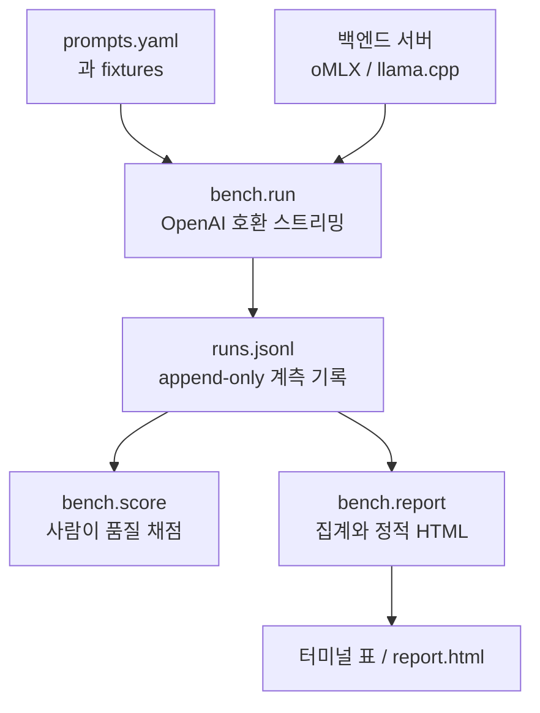

title: "공개 벤치마크만으로 고르기 어려워 만든 나만의 로컬 LLM 실험실"
slug: local-llm-fit-tester
category: 기술 실험
summary: 공개 벤치마크 점수만으로는 고르기 어려운 로컬 LLM을 실제 작업과 실행 조건으로 비교하기 위해 만든 실험 도구. 모델·양자화·서버 설정·백엔드를 한 조합으로 기록하고, 속도·메모리·품질·에이전트 사용성을 따로 판정한다.
tags: apple-silicon,benchmark,local-llm,mlx,omlx,opencode,measurement
toc: true
publishedAt: 2026-08-23T10:12:40.662977Z
updatedAt: 2026-08-23T10:23:35.756127Z
syncHash: 179b9a59352c5a05c4e1d50a35b7f2b9b4422a4ff0378f8f9705ad35f3f4a4f7

---
로컬 LLM을 고를 때 가장 먼저 공개 벤치마크 결과와 토큰 생성 속도를 찾아봤다. 그런데 숫자를 보고도 결정하기 어려웠다. 공개 벤치마크는 공통 과제에서 모델의 일반적인 능력을 비교하는 데 유용하지만, M1 Max 64GB에서 내가 실제로 하는 한국어 문서 요약, Java 코드 리뷰, 기술 글쓰기, opencode 에이전트 작업이 어느 정도로 돌아가는지는 알려주지 않는다.

같은 모델도 양자화 방식, 서버 설정, thinking 여부, prefix cache 상태에 따라 체감이 달라진다. 그래서 공개 모델 순위를 다시 만들기보다 **내가 사용하는 작업을 직접 시켜 보고 쓸 수 있는 조합인지 판정하는 도구**를 만들었다. 프로젝트 이름은 단순하게 `LocalLLM`으로 잡았다.

이 글의 수치는 최종 모델별 본 측정 결과가 아니다. 도구를 만들면서 계측이 제대로 되는지 확인한 예비 실측과, 본 측정을 위한 설계 값이다. 현재 상태는 도구 완성 후 본 측정 직전이다.

## 공개 벤치마크 점수보다 내 작업을 입력으로 삼기로 했다

이 프로젝트의 질문은 “어떤 모델이 가장 높은 점수를 받는가”가 아니다.

> 내 M1 Max에서, 내가 실제로 시키는 일에, 어떤 모델을 어떤 설정으로 쓸 것인가?

따라서 측정 대상은 모델 단독이 아니다. 다음 네 가지가 합쳐진 한 행을 비교 단위로 삼는다.

| 비교 단위 | 기록하는 내용 |
|---|---|
| 모델 | 실제 서버가 제공하는 모델 ID |
| 양자화 | 4bit, 6bit 등 모델 패키징 조건 |
| 실행 설정 | temperature, seed, max tokens, thinking, reasoning effort 등 |
| 백엔드 | oMLX, llama.cpp처럼 실제 요청을 처리한 서버 |

같은 모델이라도 `thinking=off`와 기본 thinking 설정은 다른 행이다. 컨텍스트 상한이나 MTP, KV cache 설정이 달라도 다른 행으로 남긴다. 나중에 “그때 왜 이 조합을 골랐지?”라는 질문이 생겼을 때 모델 이름 하나만 남아 있으면 답을 복원할 수 없기 때문이다.

## YAML로 과제를 정의하고 JSONL로 실행 근거를 남긴다

도구는 특정 런타임에 깊게 결합하지 않도록 모든 백엔드를 OpenAI 호환 HTTP endpoint로 취급한다. 현재 설정에는 oMLX가 `127.0.0.1:8888/v1`, llama.cpp가 `127.0.0.1:8081/v1`로 들어 있다. 서버는 벤치마크가 자동으로 띄우지 않고 직접 준비한다. 자동 기동까지 맡기면 서버 상태와 측정 조건이 뒤섞이기 때문이다.

전체 흐름은 다음과 같다.

`prompts.yaml`에는 과제의 제목, 왜 필요한지, fixture 파일, 채점 표현식을 적는다. `bench.run`은 스트리밍 응답에서 TTFT와 생성 시간을 계산하고 툴콜을 조립한다. 실행 한 번은 `runs.jsonl`의 한 줄이 된다. 자동으로 확인할 수 없는 글의 완성도는 `bench.score`에서 사람이 1~5로 입력하고, 결과는 기존 줄의 해당 필드만 갱신한다.

실험 기록은 append-only를 기본으로 했다. 잘못된 응답이나 오류 행도 삭제하지 않는다. JSONL 한 줄이 깨져도 나머지를 읽을 수 있게 하고, 채점하는 동안 새 실행이 추가되면 그 줄도 보존한다. 측정값이 예쁘게 보이는 것보다 실패의 흔적이 남는 것이 다음 실험에 더 중요하다.

## 19개 과제를 실제 사용 장면별로 나눠 봤다

현재 `prompts.yaml`에는 19개 항목이 있다. 짧은 합성 문장만 넣으면 모델의 실제 사용성을 놓치기 때문에, 개인 작업에서 나온 문서와 opencode의 실제 요청을 캡처한 fixture를 함께 사용한다.

| 묶음 | 과제 | 확인하려는 것 |
|---|---|---|
| 한국어·장문 | 한국어 8K 요약, HTML 노이즈 내성 | 한영 코드스위칭, 마크업이 섞인 문서 이해 |
| 코드 | Java 버그 찾기, Java 리팩터 | 미탐뿐 아니라 오탐, 수정 능력 |
| 형식 | JSON only, 3줄 제한, 한→영 번역, 짧은 대화 | 파싱 가능한 출력, 지시 준수, 짧은 응답 |
| 글쓰기 | 개요 기반 기술 글, 주제만 주는 기술 글 | 재료 소화력과 스스로 구조를 잡는 능력 |
| 에이전트 | 첫 툴콜, 3턴 edit 루프, 툴 결과 충실도, 검색 후 요약 | 산문이 아니라 올바른 툴을 부르는지, 다음 턴에도 유지되는지 |
| 생성물 | 단일 파일 테트리스, 모래 물리 샌드박스, 제품 소개 페이지 | 외부 리소스 없이 열리는 HTML과 로직·레이아웃 |
| 컨텍스트 | 96K, 16K 요약 | 긴 입력에서 선행 처리 시간과 메모리 압박 |

특히 에이전트 항목은 “툴을 부를 수 있는가”에서 끝내지 않는다. 첫 턴에 `read`를 부른 뒤 두 번째 턴에 실제 `edit`을 호출하는지, read 결과에만 있는 상수값을 읽어 수정하는지를 본다. 툴 결과를 되돌려 주는 루프는 스텁으로 고정해 실제 파일 시스템을 건드리지 않는다. 실제 opencode 요청의 시스템 프롬프트와 툴 스키마는 `capture.py`로 한 번 캡처한 뒤 fixture로 고정했다.

생성형 HTML은 자동으로 디자인 점수를 매기지 않는다. 단일 파일인지, 외부 CDN을 불러오지 않는지 같은 GATE만 자동 확인하고, 실제 디자인과 완성도는 `bench/out/`에 저장된 결과를 사람이 연다. LLM을 또 다른 LLM에게 심판시키는 방식은 사용하지 않았다. 로컬에서 심판 모델의 판단을 다시 믿어야 하는 문제가 생기기 때문이다.

## 종합점수 하나로 품질과 속도를 상쇄하지 않기로 했다

처음에는 여러 지표를 가중합해 하나의 점수로 만들까 생각했다. 하지만 그러면 메모리 초과나 에이전트 툴콜 실패를 빠른 생성 속도로 덮을 수 있다. 이 도구는 종합점수 대신 용도별 기준선을 둔다.

| 프로파일 | 지표 | 실용 | 조건부 | 탈락 |
|---|---|---:|---:|---:|
| 대화형 | warm TTFT | ≤ 1.5초 | 1.5~4초 | > 4초 |
| 대화형 | 문자 생성 속도 | ≥ 60자/s | 30~60자/s | < 30자/s |
| 에이전트 | warm TTFT | ≤ 5초 | 5~15초 | > 15초 |
| 에이전트 | 문자 생성 속도 | ≥ 30자/s | 15~30자/s | < 15자/s |
| 공통 | 자동 채점 | ≥ 90% | 70~90% | < 70% |
| 공통 | 사람 품질 점수 | ≥ 4.0 | 3.0~4.0 | < 3.0 |
| 공통 | peak footprint | ≤ 32GB | 32~48GB | > 48GB |

실패율이 5%를 넘으면 탈락이고, 실행 중 스왑이 발생한 조합도 즉시 탈락시킨다. 빈 칸은 초록이 아니다. 아직 측정하지 않았거나 채점하지 않은 값은 판단 불가로 남겨야 한다. 최종 선택은 빨간 지표가 없는 후보 중에서 속도·메모리·품질의 파레토 프론트를 보고 한다.

이렇게 하면 “가장 좋은 모델” 대신 “대화에는 괜찮지만 에이전트로는 탈락”, “품질은 좋지만 96K 문서에는 부적합”처럼 사용 목적에 맞는 결론을 만들 수 있다.

## cold와 warm을 한 쌍으로 재야 캐시 효과를 볼 수 있다

초기 구현에서는 `--warm` 플래그로 cold 또는 warm 중 하나를 골라 재게 했다. 그 결과 과거 107개 행 중 106개가 cold였고, 리포트의 warm 컬럼과 캐시 이득은 비어 있었다. 지금은 과제마다 cold 한 번과 warm 한 번을 연달아 기록한다.

두 실행은 같은 nonce를 사용한다. nonce를 요청 맨 앞에 넣어 앞선 실험의 prefix cache를 깨고, 바로 다음 warm 요청에서는 같은 prefix를 재사용하게 만든다. 이 방식으로 한 번 확인한 예비 측정은 다음과 같았다.

| 조건 | 선행 처리 시간 |
|---|---:|
| 13.5K 토큰 cold | 189.9초 |
| 같은 요청 warm | 18.0초 |
| nonce만 변경한 요청 | 184.1초 |
| 같은 prefix 뒤에 지시만 추가 | 18.0초 |

같은 요청의 warm 실행은 cold 단독 실행 대비 약 9%의 추가 비용으로 10.5배 빠른 선행 처리를 보였다. 반대로 시스템 프롬프트 맨 앞에 매 턴 세션 ID나 타임스탬프를 넣으면 prefix 전체가 무효화된다. 모델 성능만큼 하네스가 캐시를 어떻게 깨는지도 실제 체감 속도를 결정한다는 뜻이다.

## Apple Silicon에서는 RSS 대신 phys footprint를 읽어야 한다

메모리 측정도 그냥 프로세스 RSS를 기록하면 안 됐다. MLX는 모델 가중치를 Metal 통합 메모리에 올리기 때문에 같은 시점에 다음처럼 차이가 났다.

| 측정 방식 | 관측값 |
|---|---:|
| `ps` RSS | 1.86GB |
| `phys_footprint` | 21.0GB |
| `phys_footprint_peak` | 29.5GB |

RSS만 보면 21GB 모델을 2GB도 안 쓰는 것처럼 기록하게 된다. 그래서 macOS의 `footprint` 명령으로 리스닝 서버 프로세스의 `phys_footprint`와 최고 수위를 읽는다. 포트에 연결된 브라우저나 HTTP 클라이언트까지 합산하지 않도록 `LISTEN` 프로세스만 찾는다.

모델을 바꿀 때 서버를 재시작하는 것도 조건이다. `phys_footprint_peak`는 프로세스 생애 동안의 최고 수위라서 큰 모델을 올린 뒤 작은 모델을 올리면 앞선 모델의 흔적이 남는다. 실행 중 브라우저와 IDE를 닫고, 스왑 사용량의 전후 차이도 같이 기록한다.

## thinking과 토크나이저 차이를 속도 숫자에 숨기지 않는다

추론 모델은 답변을 출력하기 전에 사고 과정을 스트리밍할 수 있다. 그런데 백엔드마다 이 내용을 `reasoning_content`로 보내기도 하고 `content`에 섞기도 한다. Qwen3.6-35B 실험에서는 영어 사고 과정 약 6,000자가 content에 그대로 붙어 나왔다. 그러면 JSON 파싱, 줄 수, 한국어 비율, 글쓰기 분량이 전부 잘못 계산된다.

그래서 `thinking=off`일 때는 서버에 `chat_template_kwargs: {"enable_thinking": false}`를 보내고, 기본 상태는 서버 설정 그대로 둔다. 사고 토큰은 생성 시간에는 포함하되 사용자가 받는 출력 토큰과 섞지 않는다. 실험 중 Qwen3.8-27B에서 `reasoning_effort`를 낮추자 다음 변화도 관찰했다.

| 설정 | 사고 토큰 | 최종 content | 시간 |
|---|---:|---:|---:|
| thinking on 기본 | 664 | 319자 | 33.2초 |
| `reasoning_effort=low` | 373 | 259자 | 20.3초 |
| `reasoning_effort=high` | 664 | 319자 | 34.8초 |

`reasoning_effort=low`는 사고 토큰을 44%, 전체 시간을 40% 줄였다. 이 값은 모든 모델에 일반화할 성능표가 아니라, thinking을 켜고 끄는 이진 비교만으로는 부족하다는 것을 확인한 예비 관찰이다. 본 측정에서는 `off / 최저 / 최고` 세 지점만 별도 행으로 남길 예정이다.

토큰 수도 서버가 주는 usage를 그대로 믿지 않는다. 백엔드마다 툴콜과 특수 토큰을 세는 방식이 다르기 때문이다. 대상 모델 tokenizer를 사용할 수 있으면 로컬에서 직접 세고, 없으면 `approx`로 표시한다. 서로 다른 tokenizer의 tok/s를 바로 순위화하지 않기 위해, 모델 간 비교에는 출력 문자 기준인 `char/s`를 함께 본다.

## 긴 컨텍스트에서는 모델 구조 차이가 크게 벌어진다

짧은 입력에서는 모델 구조 차이가 잘 드러나지 않았다. 하지만 43K 토큰 입력의 선행 처리 속도를 예비 기록으로 비교하자 MoE와 dense의 차이가 크게 벌어졌다.

| 조합 | prompt 처리 속도 | 43K 입력 선행 대기 |
|---|---:|---:|
| Qwen3.6-35B-A3B MoE | 553~747 tok/s | 약 77초 |
| Qwen3.8-27B dense | 103~110 tok/s | 약 418초 |

파라미터 수만 보고 27B가 35B보다 가볍다고 판단할 수 없는 이유다. 96K 입력에 대한 2.7분과 14.9분이라는 값은 위 속도를 선형 외삽한 하한일 뿐이며, 본 측정 전에 실제 메모리와 스왑을 확인해야 한다. 그래서 컨텍스트 테스트는 96K를 먼저 돌리고, 탈락한 모델만 16K로 내려가게 했다. 4K 단을 미리 만들지 않은 것도 같은 이유다.

현재 측정 대상으로 설정한 조합은 네 가지다.

| 모델 조합 | 구조·조건 | 현재 상태 |
|---|---|---|
| Qwen3.6-35B-A3B-OptiQ-4bit | MoE 35B | 본 측정 대기 |
| Qwen3.8-27B-nvfp4 | dense 27B + MTP 설정 | 본 측정 대기 |
| gemma-4-26B-A4B-it-OptiQ-4bit | MoE 26B | 본 측정 대기 |
| Ornith-1.5-35B-A3B-MLX-6bit | MoE 35B, 6bit | 본 측정 대기 |

여기서 Qwen3.8의 MTP는 별도 27B 모델이 아니다. base 모델에 draft head와 `vlm_mtp_enabled`, draft model 설정을 붙이는 방식이다. 그래서 모델 ID만 기록하면 실제로 MTP가 켜졌는지 알 수 없고, `server_settings`에 관련 플래그를 함께 남긴다. 예비 실행에서는 MTP accepted token이 1,279/1,536, 약 83.3%였고 tokens per round는 2.67로 기록됐다.

## 아직 모델 순위를 발표할 단계는 아니다

현재 프로젝트의 테스트 111개가 모두 통과했고, 실행 도구와 정적 HTML 리포트까지 완성된 상태다. 다음 순서는 10분짜리 스모크 런이다.

1. MTP가 실제로 켜져 있는지와 속도를 확인한다.
2. 모델별로 지원하는 `reasoning_effort` 값을 확인한다.
3. 사고 예산 8,192에서 답변이 잘리지 않는지 본다.
4. 96K 컨텍스트에서 메모리와 스왑을 확인한다.

그 결과에 따라 96K 컨텍스트 실험과 17개 본선 항목을 이어서 돌린다. 모든 모델을 한 프로세스에 번갈아 올리지 않고 모델 하나를 끝까지 측정한 뒤 서버를 재시작한다. 그렇지 않으면 메모리 최고 수위가 합산된다. 예상 기계 실행 시간은 약 1.6~3.4시간이고, 생성물 확인과 사람 품질 채점 시간은 별도다.

이 프로젝트의 현재 결론은 “이 모델이 최고다”가 아니다. 지금 확인된 결론은 다음에 가깝다.

- 공개 벤치마크의 단일 점수보다 실제 작업 fixture가 내 선택에 더 직접적인 근거가 된다.
- 모델명보다 양자화, thinking, cache, 서버 설정을 포함한 조합이 비교 단위가 되어야 한다.
- 긴 컨텍스트에서는 모델 구조와 prefix cache 정책이 짧은 질문에서 보이지 않던 차이를 만든다.
- 속도와 품질을 하나의 숫자로 합치면 실패 조건을 숨길 수 있으므로 용도별로 따로 판정해야 한다.
- 예쁜 표보다 잘못된 측정을 표시하는 `speed_trusted`, `swapped`, `token_source` 같은 필드가 더 중요하다.

`runs.jsonl`에는 private fixture의 원문과 모델 출력이 들어갈 수 있으므로 git에 커밋하지 않는다. 이 도구의 근거는 `README.md`, `bench/prompts.yaml`, `bench/thresholds.yaml`, `docs/superpowers/specs/2026-08-22-local-llm-bench-design.md`에 남긴다.

당장은 이 결과를 최종 모델 선정표로 고정하기보다, 현재 프로젝트를 점검할 때 필요한 프롬프트를 돌려 보는 용도로 가볍게 활용해볼 예정이다. 실제로 자주 하는 일을 매번 같은 조건으로 확인할 수 있다는 것 자체가 이 실험 도구의 첫 번째 성과다.
