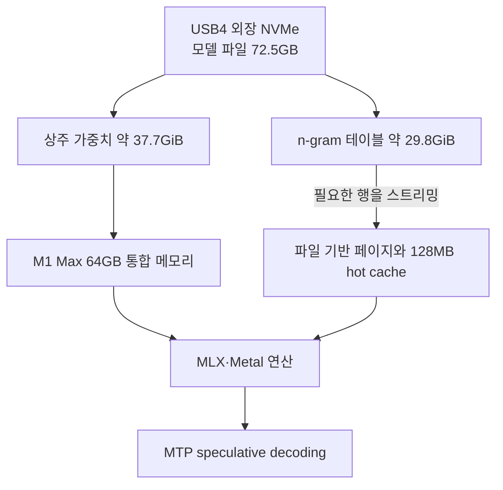
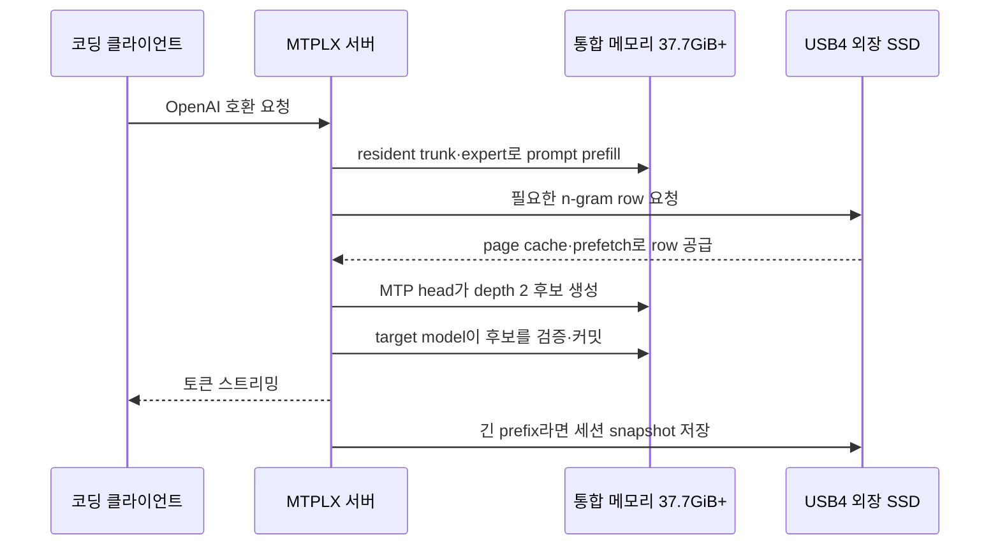
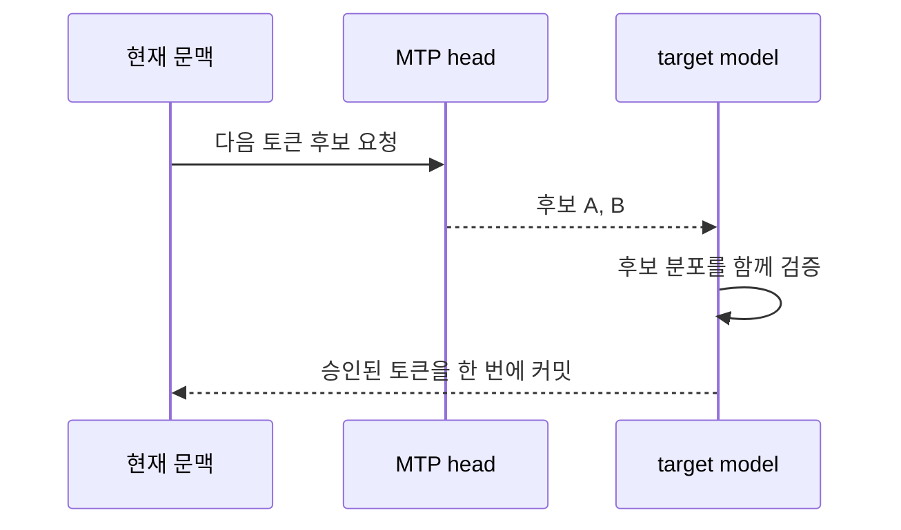

Qwen3.8 Flash-Next를 로컬에서 써 보고 싶었지만 M1 Max의 64GB 통합 메모리와 512GB 내장 SSD가 먼저 걸렸다. 모델 이름에 붙은 Flash와 MoE만 보면 가볍게 움직일 것 같지만, 저장해야 할 전체 가중치는 64GB를 훌쩍 넘는다. 내장 SSD에 모델 하나로 수십 GB를 더 쓰기도 부담스러웠다.

처음에는 더 작은 양자화를 찾았다. 그러다 이 모델의 일부 테이블을 SSD에서 스트리밍하고 실제 계산에 필요한 가중치만 통합 메모리에 상주시키는 MTPLX용 팩을 알게 됐다. USB4 NVMe를 연결해 직접 설치했고, 64K 컨텍스트에서 첫 짧은 코딩 요청으로 **순수 디코드 33.3 tok/s, 요청 전체 기준 29.7 tok/s**를 확인했다.

이 글은 후보를 조사한 기록이 아니라 실제로 포맷하고 다운로드하고 서버를 띄운 재현 기록이다. 결론부터 말하면 외장 SSD가 RAM 전체를 대신한 것은 아니다. 72.5GB 모델 중 약 37.7GiB의 가중치는 여전히 메모리에 올라가고, 약 29.8GiB의 n-gram 테이블을 SSD에서 읽는다. 이 경계를 이해해야 64GB Mac에서 무엇이 가능한지 판단할 수 있다.

먼저 최종 결과만 한 표로 압축하면 이렇다.

| 구분 | 최종 결과 |
|---|---|
| Mac | M1 Max, 통합 메모리 64GB |
| 외장 저장장치 | USB4 40Gb/s, Crucial P3 Plus 1TB, APFS |
| 외장 SSD 사용량 | 모델 약 68GiB + 증가형 SessionBank cache |
| 내장 SSD 추가 사용량 | 공유 의존성까지 최대 약 660MiB |
| 모델 핵심 상주 가중치 | 약 37.7GiB |
| MTPLX 메모리 상한 | 52.0GiB, macOS 몫 최소 약 12GiB |
| 실행 설정 | 64K context, native MTP, depth 2, 동시 요청 1개 |
| 짧은 요청 실측 | decode 33.30 tok/s, end-to-end 29.71 tok/s |
| 4K 입력의 유효 prefill | 약 63.6 tok/s, 정식 kernel benchmark가 아닌 역산치 |
| 다운로드 중 SSD 온도 | 48~50°C, SMART 오류 없음 |

## SSD가 메모리를 대신하는 것이 아니라 상주 대상을 나눴다

Apple Silicon은 CPU 메모리와 GPU VRAM이 분리되어 있지 않다. CPU와 GPU가 같은 통합 메모리를 사용한다. 외장 SSD에 모델 폴더를 둔다고 해서 GPU가 SSD 파일을 그대로 계산하는 것은 아니다.



모델의 trunk, 전문가 가중치와 MTP sidecar처럼 토큰 생성 때 반복해서 읽는 부분은 통합 메모리에 상주한다. 큰 3-gram PLE/n-gram 테이블은 SSD에 남겨 두고 필요한 행을 읽는다. 세션의 KV 상태는 메모리에 두되 오래된 세션 사본은 다시 외장 SSD에 저장할 수 있다.

따라서 여기서 SSD 오프로딩은 두 가지를 뜻한다.

- 72.5GB 모델 파일을 작은 내장 SSD가 아닌 외장 SSD에 보관한다.
- 29.8GiB n-gram 테이블 전체를 RAM에 상주시킬 필요 없이 실행 중 SSD에서 스트리밍한다.

37.7GiB 상주 가중치와 런타임 버퍼까지 SSD로 밀어낸 것은 아니다. 이 부분까지 실시간으로 외장에서 읽으면 토큰마다 I/O 병목이 커져 30 tok/s를 유지하기 어렵다.

## 최종적으로 모델과 캐시를 모두 외장 SSD에 배치했다

처음에는 SSD에서 계속 읽는 n-gram 테이블만 내장 SSD에 남기는 하이브리드 배치도 고려했다. 내장 SSD가 더 빠르기 때문이다. 하지만 이번 목적은 내장 512GB의 공간을 사용하지 않고 USB4 외장 장치만으로 어느 정도까지 가능한지 확인하는 것이었다. 최종 구성에서는 **모델 파일과 세션 캐시를 전부 외장 SSD에 두고, 실행 중 필요한 working set만 통합 메모리에 올렸다.**

```text
/Volumes/LocalLLM/
└── MTPLX/
    ├── models/
    │   └── Litwein--Qwen3.8-Flash-Next-...-MTPLX/
    │       ├── model-00001-of-00007.safetensors  약 4.93GiB
    │       ├── model-00002-of-00007.safetensors  약 4.91GiB
    │       ├── ...
    │       ├── model-00007-of-00007.safetensors  약 4.91GiB
    │       ├── mtp.safetensors                   약 1.65GiB
    │       ├── model-vision.safetensors          약 1.67GiB
    │       ├── ngram-table.safetensors           약 29.80GiB
    │       ├── mtplx_runtime.json
    │       └── tokenizer·config·index 파일
    └── cache/
        └── 장문 세션의 KV snapshot과 manifest
```

모델 본체는 약 4.9GiB짜리 safetensors shard 일곱 개로 나뉜다. 여기에 MTP sidecar와 vision tower를 합치면 런타임이 보고한 상주 가중치 약 37.7GiB가 된다. 별도 파일인 `ngram-table.safetensors` 29.80GiB는 모델을 시작할 때 통째로 RAM에 복사하지 않는다. 이것이 디스크의 68GiB와 메모리의 37.7GiB가 다른 이유다.

| 외장 SSD의 파일 | 실행 중 처리 |
|---|---|
| model shard 7개 | mmap 후 계산에 필요한 working set을 통합 메모리에 상주시킴 |
| `mtp.safetensors` | MTP draft head로 적재해 후보 토큰 생성에 사용 |
| `model-vision.safetensors` | vision 입력을 처리할 가중치로 모델 팩에 포함 |
| `ngram-table.safetensors` | SSD에 남겨 두고 필요한 row를 demand paging·prefetch |
| `mtplx_runtime.json` | 검증된 profile, depth 범위와 실행 contract를 결정 |
| `cache/` | 긴 대화 prefix의 세션 상태를 SSD에 보존하고 재시작·재호출 때 복원 |

짧은 테스트 직후 `cache/`는 20KiB에 불과했다. MTPLX 설정상 512토큰 이상의 committed prefix부터 SSD SessionBank snapshot을 쓰기 때문에, 76토큰 프롬프트와 256토큰 출력은 영구 캐시 생성 조건에 아직 닿지 않았다. 장문 코딩 세션에서는 이 폴더가 커지며 최대 크기는 실행 설정과 여유 공간에 따라 제한된다.

요청 한 번이 처리되는 흐름은 다음과 같다.



USB4 SSD는 모든 토큰마다 29.8GiB 파일 전체를 읽지 않는다. 현재 토큰과 문맥에서 필요한 row만 가져오고 128MB hot cache와 운영체제 page cache가 반복 접근을 흡수한다. 그래서 외장 장치의 순차 읽기 최고속도만큼이나 작은 접근의 지연, 인클로저 발열과 안정성이 중요하다.

내장 SSD에는 MTPLX 실행 파일과 Python 환경만 남는다. 모델 본문과 증가할 수 있는 세션 캐시는 `/Volumes/LocalLLM` 아래에 있으므로 외장 SSD를 분리하면 서버를 시작할 수 없고, 실행 중 분리하면 파일 기반 페이지와 캐시가 끊긴다. 반드시 서버를 종료한 뒤 볼륨을 추출해야 한다.

한눈에 보면 최종 디스크 배치는 다음과 같다.

| 저장장치 | 배치한 것 | 현재 사용량 | 앞으로 늘어나는 것 |
|---|---|---:|---|
| 내장 SSD | MTPLX Python 환경 | 약 467MiB | 런타임 업데이트 |
| 내장 SSD | MTPLX·aria2·SMART CLI 본체 | 약 8MiB | 거의 없음 |
| 내장 SSD | Python·OpenSSL 등 Homebrew 의존성 | 최대 약 185MiB | 다른 Homebrew 도구와 공유 |
| 외장 USB4 SSD | 모델 팩 전체 | 약 68GiB | 모델을 갱신하거나 다른 팩을 추가할 때 증가 |
| 외장 USB4 SSD | SSD SessionBank cache | 테스트 직후 20KiB | 512토큰 이상 장문 세션부터 증가 |
| 통합 메모리 | 실행 중 working set | 아래 RAM 표 참고 | context와 세션 수에 따라 변동 |

내장 SSD에서 이번 구성에 직접 연결되는 최대치는 공유 의존성까지 넉넉하게 잡아 약 **660MiB**다. 모델 68GiB와 장문 세션 캐시는 모두 외장에 있다. Homebrew의 Python과 OpenSSL을 기존에 다른 도구가 이미 사용했다면 이번 설치의 실제 추가분은 이보다 작다.

RAM은 디스크처럼 고정 합계로 계산하면 안 된다. session bank와 runtime transient가 동시에 최대치까지 계속 유지되는 구조가 아니고, memory pressure가 올라가면 MTPLX가 session bank를 줄인다. 서버가 만든 64K memory plan을 기준으로 정리하면 다음과 같다.

| 통합 메모리 항목 | 계획값 | 성격 |
|---|---:|---|
| 모델 가중치 | 37.7GiB | 서버가 뜬 동안 핵심 상주분 |
| 64K KV 예약 | 약 1.5GiB | 실제 context 길이에 따라 증가 |
| runtime transient | 약 3.0GiB | prefill·verify 중 쓰는 작업 공간 |
| session bank | 평시 약 9.8GiB, 상한 11.3GiB | 압력이 오르면 양보·eviction |
| n-gram hot cache | 128MiB | SSD row 반복 접근 흡수 |
| Metal engine 전체 상한 | 52.0GiB | 위 항목을 포함하는 한도, 단순 합산 항목 아님 |
| macOS와 다른 앱 몫 | 최소 약 12GiB를 남기는 구성 | Docker·브라우저가 사용하면 압력 증가 |
| n-gram 원본 테이블 | 전체 고정 상주 없음, SSD 29.8GiB | 필요한 page는 file/page cache에 일시 점유 |

64GB 전체 중 MTPLX가 최대 52GiB까지 쓰고 나머지를 macOS에 남기는 구조다. 실측 직후 시스템 전체 free percentage는 13%였고 memory pressure level 2가 발생했다. 따라서 표의 52GiB는 항상 채워야 할 목표가 아니라 넘지 않기 위한 상한이다.

## 64GB에 맞춘 혼합 정밀도 팩을 골랐다

사용한 모델은 다음 MTPLX 전용 팩이다.

```text
Litwein/Qwen3.8-Flash-Next-REAP320-oQ3e-fp16-DWQ-MTP-Vision-MTPLX
```

| 표기 | 의미 |
|---|---|
| REAP320 | 층마다 routed expert 512개 중 320개를 남긴 pruning |
| oQ3e | routed expert를 중심으로 3-bit 양자화 |
| fp16 | M1/M2에서 네이티브인 FP16으로 비양자화 텐서를 저장 |
| DWQ | teacher logits에 맞춰 양자화 scale과 bias를 보정 |
| MTP | 여러 토큰 후보를 미리 만드는 MTP head/sidecar 포함 |
| Vision | 이미지 입력용 vision tower 포함 |
| MTPLX | 일반 MLX가 아닌 MTPLX 런타임용 레이아웃 |

`fp16`은 모델 전체가 FP16이라는 뜻이 아니다. routed expert는 3-bit이고 n-gram 테이블은 4-bit이며, trunk는 5·6·8-bit와 일부 고정밀 텐서가 섞여 있다. 전체 평균은 약 4.28 bits/weight다. FP16으로 바뀐 부분은 원래 양자화되지 않은 scale, bias, norm 같은 텐서다.

M1과 M2 GPU는 BF16을 네이티브로 실행하지 않는다. 같은 가중치의 FP16 형제가 M1 Max에는 맞다. 반대로 M3 이후라면 BF16 팩을 고르는 것이 맞다.

품질 비용도 있다. expert 192개를 제거했고 routed expert를 3-bit로 줄였다. 제작자는 DWQ로 teacher와의 차이를 일부 복구했지만 원본 BF16과 동일한 모델은 아니다. 64GB에서 실행 가능성과 속도를 얻는 대신 pruning과 저비트 양자화의 손실 가능성을 받아들인 구성이다.

## 제거한 expert는 층마다 서로 달랐다

"512개 중 192개를 제거했다"고 쓰면 모델 전체에서 같은 expert 192개를 통째로 삭제한 것처럼 들린다. 실제 팩에 포함된 `reap_kept_experts.json`을 확인하면 구조가 다르다.

- 모델은 48개 MoE layer를 가진다.
- 각 layer에는 routed expert ID 0~511이 있다.
- layer마다 서로 다른 320개 ID를 남기고 나머지 192개를 제거했다.
- 모든 layer에서 공통으로 제거된 ID는 없었다.
- 모든 layer에서 항상 남겨진 ID도 없었다.

같은 번호라도 layer 0의 expert 367과 layer 20의 expert 367은 별도 모듈이다. 따라서 "expert 367은 어떤 지식을 담당해서 제거됐다"처럼 번호 하나에 전역 의미를 붙일 수 없다. 제거 단위는 `(layer, expert_id)` 쌍이다.

target model의 층별 keep set은 제작자가 사용한 REAP manifest를 따른다. 쉽게 말해 calibration 입력에서 router가 각 expert를 어떻게 사용했는지 반영한 층별 선택 결과다. 사람이 "코딩 expert", "한국어 expert"처럼 의미를 붙여 골라낸 목록은 아니다. calibration에 덜 드러난 도메인이 더 손상될 가능성은 남는다.

MTP drafter는 사정이 조금 다르다. target model처럼 router activation 기록을 그대로 쓸 수 없어, 같은 320개 구조에 맞추기 위해 **weight-energy saliency**로 MTP 쪽 expert를 정리했다. 즉 REAP 기반 target pruning과 MTP sidecar pruning은 동일한 근거를 한데 섞은 과정이 아니다. 후자는 draft 후보의 acceptance와 속도에 영향을 주지만, 최종 토큰은 여전히 target model 검증을 통과해야 확정된다.

예를 들어 layer 0에서 제거된 192개 중 앞부분은 다음과 같다.

```text
3, 6, 11, 13, 18, 22, 24, 25, 26, 28, 29, 40,
41, 42, 43, 47, 48, 50, 51, 52, 54, 55, 56, 59,
65, 68, 72, 75, 77, 78, 82, 85, ...
```

전체 목록은 모델과 함께 받은 manifest가 정본이다. 각 layer가 정확히 320개를 남겼는지 다음처럼 확인할 수 있다.

```bash
MODEL=/Volumes/LocalLLM/MTPLX/models/\
Litwein--Qwen3.8-Flash-Next-REAP320-oQ3e-fp16-DWQ-MTP-Vision-MTPLX

jq 'to_entries
  | map({layer: .key, kept: (.value | length), removed: 512-(.value | length)})' \
  "$MODEL/reap_kept_experts.json"
```

특정 layer의 제거 목록은 0~511 전체에서 keep set의 차집합을 구하면 된다.

```bash
jq --arg layer "0" '
  .[$layer] as $kept
  | [range(0;512) as $id | select(($kept | index($id)) == null) | $id]
' "$MODEL/reap_kept_experts.json"
```

여기서 pruning은 디스크와 메모리를 줄이는 핵심이지만 MTP와는 별개다. target model의 expert keep set과 MTP head의 expert keep set을 맞춰 sidecar acceptance를 유지하고, 실제 출력은 target model 검증을 통과한 토큰만 확정한다.

## MTPLX와 MTP는 프로그램과 추론 기법의 차이다

이름이 비슷해서 가장 헷갈렸던 부분이다. **MTPLX는 실행기이고 MTP는 모델이 다음 토큰 여러 개를 예측하는 기법**이다.

| 구분 | MTPLX | MTP |
|---|---|---|
| 정체 | Apple Silicon용 추론 서버·런타임 | Multi-Token Prediction 추론 기법 |
| 역할 | 모델 적재, MLX·Metal 실행, API, 캐시, SSD 스트리밍 | 다음 토큰 후보를 여러 단계 미리 제안 |
| 설치 | 별도 프로그램으로 설치 | 모델의 MTP head와 런타임 지원이 필요 |
| 이번 설정 | MTPLX 2.11.3, sustained | native MTP, depth 2 |

일반 autoregressive 생성은 토큰 하나를 확정한 다음 다시 전체 모델을 실행한다. MTP는 작은 예측 head가 다음 2~3개 후보를 먼저 제안하고 본 모델이 한 번에 검증한다. 후보가 많이 받아들여지면 한 번의 검증 사이클에서 여러 토큰이 확정된다.



MTPLX는 rejection sampling으로 후보를 검증한다. 단순 greedy 복사가 아니며 샘플링 온도가 있어도 target distribution을 유지하도록 설계됐다. 이번 팩에는 모델 자체 장문 에이전트·추론 trace로 self-distill한 8-bit MTP sidecar가 포함된다.

`depth 2`는 두 단계까지 후보를 제안한다는 뜻이다. depth를 높인다고 항상 빨라지지는 않는다. 후보 생성 비용도 늘고 뒤쪽 후보의 acceptance가 낮아질 수 있다. 이 팩의 M4 Pro 측정에서는 depth 2가 depth 3보다 빨랐고, M1 Max에서도 depth 2로 바로 30 tok/s 전후가 나왔다.

## oMLX와 MTPLX를 같은 프로그램으로 보지 않았다

기존에는 oMLX를 서빙 도구로 사용했다. oMLX도 Apple Silicon용 MLX 서버이고 SSD 캐시와 MTP 관련 최적화를 제공한다. 일부 Metal kernel은 MTPLX 구현을 활용하지만 oMLX 안에서 MTPLX 모드를 켜는 관계는 아니다.

- oMLX와 MTPLX는 별도 설치되는 서로 다른 서버다.
- oMLX용 `...-MLX` 팩과 MTPLX용 `...-MTPLX` 팩은 레이아웃이 다르다.
- 같은 가중치 계열이어도 모델 폴더를 그대로 교환해 쓰지 않는다.
- 둘 다 OpenAI 호환 API를 제공하므로 클라이언트에서는 base URL만 바꾸면 된다.
- 기본 포트가 겹칠 수 있으므로 동시에 띄울 때는 포트를 나눈다.

oMLX를 제거하지 않고 MTPLX를 추가 설치했다. 30 tok/s 목표의 근거가 MTPLX판 self-distilled sidecar 측정이어서 먼저 같은 경로를 재현했고, oMLX와 겹치지 않는 8001번 포트를 사용했다.

## USB4 SSD를 APFS로 다시 준비했다

사용한 외장 장치는 Crucial P3 Plus 1TB NVMe와 ASMedia 246x USB4 인클로저다.

| 항목 | 확인값 |
|---|---|
| 연결 모드 | USB4 |
| 링크 속도 | 40Gb/s |
| NVMe 링크 | PCIe x4, 16.0GT/s |
| TRIM | 지원 |
| SMART | Verified |

처음 파일시스템은 ExFAT이었다. 이 SSD는 Mac 전용 모델 저장소로 쓸 예정이라 수십 GB safetensors의 mmap과 파일 기반 페이지를 고려해 APFS로 다시 포맷했다.

```bash
diskutil list external physical
system_profiler SPThunderboltDataType SPUSBDataType SPNVMeDataType
```

아래 `disk9`는 당시 이 Mac에서 확인한 값일 뿐 그대로 복사하면 안 된다. 포맷은 디스크 전체를 지운다.

```bash
diskutil eraseDisk APFS LocalLLM GPT /dev/disk9
mkdir -p /Volumes/LocalLLM/MTPLX/models
mkdir -p /Volumes/LocalLLM/MTPLX/cache
```

새 볼륨을 연결하자 Spotlight와 Storage Management가 분석하면서 CPU를 사용했다. 모델 전용 볼륨에는 검색 색인이 필요하지 않아 껐다.

```bash
mdutil -i off /Volumes/LocalLLM
```

## MTPLX를 설치하고 모델을 외장 SSD에 받았다

```bash
brew install youssofal/mtplx/mtplx
mtplx doctor
mtplx --version
```

모델을 받기 전 runtime contract를 검사했다.

```bash
mtplx inspect \
  Litwein/Qwen3.8-Flash-Next-REAP320-oQ3e-fp16-DWQ-MTP-Vision-MTPLX
```

결과는 `tier: verified`, `can_run: true`, `runtime_compatibility: native`, `mtp_layers: 1`, `recommended_profile: sustained`였다.

기본 Python 다운로더는 공개 Hugging Face에서 약 5MB/s에 머물렀다. 부분 파일은 재개할 수 있으므로 aria2로 전환했다.

```bash
brew install aria2

mtplx pull \
  Litwein/Qwen3.8-Flash-Next-REAP320-oQ3e-fp16-DWQ-MTP-Vision-MTPLX \
  --cache-dir /Volumes/LocalLLM/MTPLX/models \
  --download-backend aria2
```

완료 뒤 디스크에서는 약 68GiB를 사용했다. 모델 카드의 72.5GB는 십진 단위라 같은 크기다. `.incomplete`와 `.aria2` 파일이 남지 않았고 다음 검사에서 로컬과 원격 revision도 같았다.

```bash
mtplx models \
  --cache-dir /Volumes/LocalLLM/MTPLX/models \
  --check
```

## 64K 컨텍스트와 depth 2로 서버를 띄웠다

```bash
MTPLX_MEMORY_LIMIT_BYTES=55834574848 \
MTPLX_WIRED_LIMIT_BYTES=45097156608 \
mtplx serve \
  --model /Volumes/LocalLLM/MTPLX/models/Litwein--Qwen3.8-Flash-Next-REAP320-oQ3e-fp16-DWQ-MTP-Vision-MTPLX \
  --host 127.0.0.1 \
  --port 8001 \
  --no-auth \
  --profile sustained \
  --context-window 65536 \
  --depth 2 \
  --batching-preset solo \
  --ssd-session-cache-dir /Volumes/LocalLLM/MTPLX/cache \
  --enable-thermal-poll
```

서버가 출력한 메모리 계획은 다음과 같았다.

| 항목 | 값 |
|---|---:|
| Metal engine budget | 52.0GiB |
| 모델 상주 가중치 | 37.7GiB |
| context window | 65,536 tokens |
| KV 예약 | 약 1.5GiB |
| session bank | 최대 11.3GiB, 장문에서 9.8GiB로 양보 |
| n-gram 테이블 | 29.8GiB, SSD 스트리밍 |
| n-gram hot cache | 128MB |

외장 SSD에서 모델을 매핑하는 데 17.6초가 걸렸다. 첫 워밍업 16토큰은 10.85 tok/s였고, 백그라운드 워밍업은 512 컨텍스트에서 25.16 tok/s, 2,560 컨텍스트에서 20.54 tok/s였다. 워밍업은 최종 속도가 아니므로 실사용 요청을 따로 보냈다.

API는 `http://127.0.0.1:8001/v1`, 웹 UI는 `http://127.0.0.1:8001/`에서 열린다. localhost에만 묶었으므로 테스트에서는 API key를 쓰지 않았다.

30 tok/s 결과를 재현할 때 사용한 조건을 한 표로 고정하면 다음과 같다.

| 설정 | 값 |
|---|---|
| 기기 | MacBook Pro, M1 Max, 통합 메모리 64GB |
| macOS | 26.6.2 |
| 외장 장치 | Crucial P3 Plus 1TB, ASMedia 246x USB4 40Gb/s |
| 파일시스템 | APFS |
| MTPLX | 2.11.3 |
| 모델 revision | `0bb3ca6979` |
| profile | `sustained` |
| generation mode | native MTP |
| MTP depth | 2 |
| context window | 65,536 |
| scheduler | serial, solo preset, active request 1개 |
| KV quantization | off, 이 family에서는 미지원 |
| n-gram prewarm | off, 테이블은 SSD 스트리밍 |
| temperature | 1.0 |
| top_p / top_k | 0.95 / 20 |
| SSD SessionBank | on, 외장 SSD의 `/Volumes/LocalLLM/MTPLX/cache` |
| 서버 주소 | `http://127.0.0.1:8001/v1` |

서버를 띄운 뒤 health와 모델 ID부터 확인했다.

```bash
curl -s http://127.0.0.1:8001/health | jq '.ok, .generation_mode, .depth'
curl -s http://127.0.0.1:8001/v1/models | jq -r '.data[].id'
```

외장 SSD가 없으면 위 경로의 모델과 n-gram 테이블을 열 수 없으므로, 재부팅 뒤에는 먼저 볼륨이 같은 이름으로 마운트됐는지 확인하고 서버를 시작해야 한다.

```bash
test -d /Volumes/LocalLLM/MTPLX/models && echo "SSD ready"
lsof -nP -iTCP:8001 -sTCP:LISTEN
```

서버가 앞쪽 터미널에서 실행 중이면 `Ctrl-C`로 정상 종료한다. 백그라운드라면 위 `lsof` 결과에서 MTPLX의 PID를 확인한 뒤 `kill -TERM <PID>`로 종료하고, 8001번 포트가 닫힌 것을 확인한 다음 볼륨을 추출한다.

```bash
lsof -nP -iTCP:8001 -sTCP:LISTEN
diskutil eject /Volumes/LocalLLM
```

실행 중 케이블을 먼저 빼면 모델의 mmap page와 SessionBank 쓰기가 끊길 수 있다. 이 구성에서 안전한 순서는 **서버 종료 → 포트 종료 확인 → 볼륨 추출 → 케이블 분리**다.

## 첫 실생성에서 요청 전체 29.7 tok/s를 확인했다

짧은 Python LRU cache 구현을 요청하고 권장 sampler인 temperature 1.0, top_p 0.95, top_k 20을 사용했다.

실제 요청은 다음과 같았다. `model` 값은 `/v1/models`가 반환한 ID를 그대로 사용했다.

```bash
curl -sS http://127.0.0.1:8001/v1/chat/completions \
  -H 'Content-Type: application/json' \
  -d '{
    "model": "litwein-qwen3.8-flash-next-reap320-oq3e-fp16-dwq-mtp-vision-mtplx",
    "messages": [{
      "role": "user",
      "content": "Write a concise Python implementation of an LRU cache using OrderedDict, with get and put methods and a short usage example."
    }],
    "max_tokens": 256,
    "temperature": 1.0,
    "top_p": 0.95,
    "top_k": 20
  }' | jq '.usage, .choices[0].finish_reason, .choices[0].message.content'
```

클라이언트에서 잰 벽시계 시간은 8.65초였고, 서버 로그에는 다음 한 줄이 남았다.

```text
prompt_tokens=76 completion_tokens=256 elapsed_s=8.615725
tok_s=33.304175 end_to_end_tok_s=29.713112
```

| 측정값 | 결과 |
|---|---:|
| prompt tokens | 76 |
| completion tokens | 256 |
| elapsed | 8.616초 |
| 순수 decode | **33.30 tok/s** |
| end-to-end | **29.71 tok/s** |
| finish reason | length |

목표였던 30 tok/s 언저리에 도달했다. 다만 짧은 프롬프트 한 번의 초기 결과이며 실제 에이전트 트래픽을 대표하는 종합 벤치마크는 아니다.

응답 코드가 중간에서 잘린 것은 속도 문제가 아니었다. 256 completion token 중 reasoning token이 210개였고 `finish_reason`이 `length`였다. thinking 코딩 작업에서는 `max_tokens`를 최소 2,048~4,096으로 잡아야 답변 공간이 남는다.

## Prefill과 decode를 같은 tok/s로 읽지 않았다

`33.3 tok/s`는 이미 읽은 문맥 뒤에 새 토큰을 만드는 decode 속도다. 긴 파일이나 저장소 내용을 처음 요청에 넣으면 모델은 입력 전체를 먼저 처리해야 한다. 이 단계가 prefill 또는 prompt processing이다.

| 단계 | 하는 일 | 체감되는 순간 |
|---|---|---|
| Prefill | 입력 토큰 전체를 읽고 각 층의 상태와 KV를 생성 | 긴 요청을 보낸 뒤 첫 토큰이 나오기 전 |
| Decode | 직전 상태를 이용해 출력 토큰을 순차 생성 | 답변이 화면에 스트리밍되는 동안 |
| End-to-end | prefill, decode, API overhead를 모두 포함 | 사용자가 요청부터 완료까지 기다린 시간 |

별도 확인을 위해 4,063토큰 입력과 32토큰 출력 요청을 보냈다.

| 측정값 | 결과 |
|---|---:|
| prompt | 4,063 tokens |
| completion | 32 tokens |
| 전체 시간 | 65.29초 |
| decode | 22.31 tok/s |
| decode 예상 시간 | 약 1.43초 |
| 나머지 prefill 구간 | 약 63.85초 |
| 역산한 유효 prefill | 약 **63.6 tok/s** |

이 값은 MTPLX가 정식 prefill 벤치마크로 승인한 숫자는 아니다. 서버 로그에서 PLE prefill lookahead가 9개 chunk에 모두 engage되지 않았고 `refusing to report a measurement that did not run the candidate`라고 남겼다. 당시 macOS memory pressure도 level 2였다. 그래서 전체 시간에서 서버가 보고한 decode 시간을 뺀 **현재 시스템의 유효 체감치**로만 기록한다.

모델 카드의 M4 Pro 측정은 약 180~196 prefill tok/s였지만 하드웨어, BF16 팩, 메모리 여유와 prefill kernel 조건이 다르다. 이번 M1 Max 환경에서는 짧은 decode 목표는 달성했어도 긴 입력의 첫 토큰 대기는 별도 병목으로 남았다. 실제 코딩 에이전트에서는 prompt cache와 SessionBank가 중요한 이유다. 같은 긴 prefix를 매 요청마다 0부터 prefill하지 않고 RAM 또는 외장 SSD의 세션 snapshot에서 복원해야 한다.

## RAM 표시는 한 숫자만 보면 틀리기 쉬웠다

`ps`의 MTPLX RSS는 약 15.3GiB로 보였다. 이것을 모델 전체 점유량으로 읽으면 안 된다. MLX/Metal의 wired allocation과 파일 기반 페이지는 일반 프로세스 RSS에 전부 나타나지 않는다. 런타임이 계산한 상주 가중치는 37.7GiB였고 시스템 wired page와 compressor도 증가했다.

테스트 직후 시스템 전체 free percentage는 약 13%였다. MTPLX도 memory pressure level 2를 감지해 session bank를 정리하는 보호 동작을 했다. 당시 Docker VM과 여러 Electron 앱, 브라우저가 함께 떠 있었다.

64GB에서의 운영 기준은 다음처럼 잡았다.

- 32K~64K 컨텍스트를 기본 범위로 둔다.
- 동시 요청은 하나로 시작한다.
- Docker VM과 쓰지 않는 브라우저 탭을 정리한다.
- 긴 세션에서는 macOS swap과 UI 반응성을 함께 본다.
- 이 model family는 MTPLX에서 KV cache quantization이 검증되지 않았다.
- 262K architecture maximum을 64GB에서 항상 쓸 수 있다는 뜻으로 읽지 않는다.

## 외장 SSD의 열은 SMART로 확인했다

대용량 다운로드 중 인클로저가 상당히 뜨거웠다. `smartmontools`로 확인했다.

```bash
brew install smartmontools
smartctl -a /dev/disk9
```

| 항목 | 확인값 |
|---|---:|
| 다운로드 중 온도 | 48~50°C |
| warning threshold | 83°C |
| critical threshold | 85°C |
| media/data integrity errors | 0 |
| thermal warning time | 0 |

50°C의 금속 인클로저는 뜨겁게 느껴지지만 SMART 기준 정상 범위였다. macOS도 thermal warning과 performance warning을 기록하지 않았다. 당시 Mac 발열에는 외장 다운로드보다 Docker VM, WindowServer, Storage Management와 다른 앱의 CPU 사용이 더 크게 잡혔다.

장시간 추론에서는 인클로저를 천 위에 놓지 않고 공기가 통하게 둔다. 장치 경고값은 83°C였지만 운영 중에는 70°C를 보수적인 중단 기준으로 잡았다.

## 30 tok/s는 SSD 하나가 아니라 전체 조합에서 나왔다

1. REAP320 pruning과 3-bit expert로 상주 가중치를 37.7GiB까지 줄였다.
2. M1/M2용 FP16 팩을 골라 BF16 변환 경로를 피했다.
3. 29.8GiB n-gram 테이블은 USB4 NVMe에서 스트리밍했다.
4. 모델 전용 self-distilled MTP sidecar와 depth 2를 사용했다.
5. sustained profile의 QSA·GDN·verify 최적화 경로를 사용했다.
6. 동시 요청을 하나로 제한했다.
7. 컨텍스트를 64K로 제한해 64GB memory plan 안에 뒀다.

SSD는 모델을 맞춰 넣는 조건이고 MTP는 디코드 속도를 끌어올리는 조건이다. MTP 없이 같은 target을 한 토큰씩 생성하면 이 속도가 그대로 나오지 않는다. 반대로 MTP가 있어도 가중치와 테이블을 64GB에 무리하게 상주시키면 macOS swap 때문에 이득을 잃는다.

## 한 줄짜리 HTML 요청은 세 번 실패했다

짧은 속도 측정만으로는 실제 코딩 품질을 알 수 없다. context를 98,304토큰으로 늘리고 서버 출력 상한을 30,000토큰으로 둔 뒤, OpenAI 호환 API에 다음 문장 하나만 보냈다.

```text
홀드 기능이 있는 테트리스를 HTML로 만들어줘
```

Codex나 별도 agent harness가 중간에서 요구사항을 확장하거나 코드를 고치지 않았다. `curl`이 MTPLX API를 직접 호출했고, MTPLX의 tokenizer chat template와 모델 생성 결과만 거쳤다. 첫 세 번은 모두 결과물로 사용할 수 없었다.

| 시도 | 생성 설정 | 결과 | 시간·속도 |
|---|---|---|---|
| 1 | MTP, thinking off, temp 1.0, 최대 30K | 17,614토큰 뒤 `stop`. 여러 언어가 섞이고 JavaScript 중간에서 끝남 | 11분 14초, 26.15 tok/s |
| 2 | MTP, thinking off, temp 0.2, 최대 8,192, seed 42 | 터키어가 섞였고 `canHold` 선언 중 `length`로 잘림 | 5분 20초, 26.67 tok/s |
| 3 | AR, thinking off, temp 0.2, 최대 8,192, seed 42 | 언어는 영어로 안정됐지만 렌더링 함수 중 `length`로 잘림 | 7분 25초, 18.45 tok/s |

첫 시도는 `finish_reason=stop`이었지만 정상 종료가 아니었다. 응답 안에서 구현을 버리고 새 구현을 다시 시작했으며 마지막 `</script>`, `</body>`, `</html>`이 없었다. API가 `stop`을 반환했다는 사실만으로 문서가 완결됐다고 판단하면 안 됐다.

두 번째와 세 번째 비교에서는 프롬프트, sampler와 seed를 고정하고 MTP와 AR만 바꿨다. MTP가 약 45% 빨랐지만 한 번의 표본에서 언어 혼선이 나타났고, AR은 영어로 시작했어도 8K 안에 코드를 닫지 못했다. MTP는 rejection sampling으로 target distribution을 유지하도록 설계됐으므로 이 한 쌍만으로 "MTP가 품질을 망쳤다"고 결론 내릴 수는 없다. 대신 장문 실생성에서 속도와 완결성을 함께 봐야 한다는 점은 분명했다.

## 작은 reasoning을 켜자 HTML 문서는 닫혔다

네 번째에는 MTP를 다시 켜고 나머지 sampler와 seed는 유지하되, Qwen3.8 계열이 지원하는 가장 작은 `reasoning_effort: low`를 사용했다.

```json
{
  "messages": [{
    "role": "user",
    "content": "홀드 기능이 있는 테트리스를 HTML로 만들어줘"
  }],
  "generation_mode": "mtp",
  "enable_thinking": true,
  "reasoning_effort": "low",
  "max_tokens": 30000,
  "temperature": 0.2,
  "top_p": 0.9,
  "top_k": 20,
  "seed": 42
}
```

| 측정값 | 결과 |
|---|---:|
| prompt | 52 tokens |
| completion | 5,467 tokens |
| reasoning | 218 tokens |
| 전체 시간 | 201.10초, 약 3분 21초 |
| decode | 27.32 tok/s |
| end-to-end | 27.19 tok/s |
| finish reason | `stop` |

이번에는 218토큰만 계획에 쓰고 HTML을 정상적으로 닫았다. 코드 펜스에서 문서를 추출해 브라우저에 열었고 START, hard drop과 Hold 입력까지 동작했다.


[모델이 생성한 원본 HTML을 브라우저에서 연다](/assets/projects/m1max-external-ssd-qwen38-flash-next-setup/qwen-tetris-low-reasoning.html). 별도 라이브러리 없이 동작하는 13KiB 단일 파일이며, 아래 결함도 수정하지 않고 그대로 남겼다.

- I tetromino를 4칸이 아니라 5칸으로 정의했다.
- 빈 Hold 슬롯을 처음 사용할 때 `spawnPiece()`가 `canHold=true`로 되돌려 같은 낙하 중 두 번째 Hold가 허용된다.
- 게임 상태를 초기화하기 전에 `drawBoard()`를 호출해 첫 로딩에서 JavaScript 오류가 한 번 발생한다. START 이후에는 실행된다.

따라서 판정은 "HTML 생성·실행 성공"이지 "테트리스 요구사항 완전 통과"가 아니다. 화면이 그럴듯해도 상태 전이와 기본 도형을 직접 검사하지 않았다면 놓쳤을 오류다.

## Medium reasoning 결과는 네 줄을 고치면 플레이할 수 있었다

같은 프롬프트와 sampler를 유지하고 `reasoning_effort`만 `medium`으로 올려 한 번 더 생성했다. 이번 결과는 I tetromino를 정확히 4칸으로 만들었고, 한 낙하에서 Hold를 한 번만 허용하는 상태도 갖췄다. 화면 구성과 코드 길이도 low 결과보다 간결했다.

| 측정값 | Low reasoning | Medium reasoning |
|---|---:|---:|
| completion | 5,467 tokens | 4,400 tokens |
| reasoning | 218 tokens | 35 tokens |
| 전체 시간 | 201.10초 | 224.41초 |
| decode | 27.32 tok/s | 28.85 tok/s |
| end-to-end | 27.19 tok/s | 19.61 tok/s |
| 종료 | `stop` | `stop` |

`medium`이 항상 더 많은 reasoning token을 소비하는 것은 아니었다. effort는 고정된 사고 토큰 예산이 아니라 모델에 주는 강도 힌트이므로, 이 표본에서는 오히려 35토큰만 reasoning에 썼다. 순수 decode는 더 빨랐지만 요청 전체 기준 속도는 19.61 tok/s였다. 따라서 체감 대기 시간에는 decode 수치보다 end-to-end 시간이 더 직접적이다.

HTML은 정상적으로 닫혔지만 원본을 브라우저에서 실행해 Space 또는 첫 Hold를 누르면 다음 오류가 발생했다.

```text
TypeError: Cannot read properties of undefined (reading 'map')
```

원인은 명확했다. `nextPiece`는 이미 `{ type, shape, ... }` 형태의 piece 객체인데, 새 piece를 만드는 함수에는 type 문자열 대신 객체 전체를 넘겼다.

```js
// 모델 원본
current = makePiece(nextPiece);

// 최소 수정
current = makePiece(nextPiece.type);
```

같은 실수가 `lockPiece()`와 빈 Hold 슬롯 분기에 한 번씩 있어 두 줄을 수정했다. 이어 실제 플레이에서 `NEXT`와 등장 블록이 다르게 보이는 문제도 발견했다. 큐는 정상적으로 바뀌었지만 별도 canvas인 미리보기는 초기화 때만 그려졌기 때문이다. 두 분기에서 `nextPiece`를 교체한 직후 `drawNext()`를 호출하도록 두 줄을 더했다. 모델 원본은 별도로 보존했고 게임 규칙이나 디자인은 손대지 않았다.


[네 줄 수정한 HTML을 브라우저에서 연다](/assets/projects/m1max-external-ssd-qwen38-flash-next-setup/qwen-tetris-medium-fixed.html). 수정본은 다음 순서로 실제 키 입력을 자동화해 확인했다.

| 브라우저 검증 | 결과 |
|---|---|
| 첫 Hold | 슬롯에 저장됨 |
| 같은 낙하의 두 번째 Hold | 차단됨 |
| Space hard drop | piece 고정, score 36 |
| hard drop 뒤 NEXT | 새 큐와 미리보기 일치 |
| 다음 낙하의 Hold | 다시 허용됨 |
| 빈 Hold가 NEXT를 소비한 뒤 | 새 큐와 미리보기 일치 |
| 두 번째 hard drop | score 70 |
| 실행 중 JavaScript 오류 | 0건 |

이번 사례에서 작은 harness의 역할은 새 게임을 대신 만들어 주는 것이 아니었다. 생성 파일을 열고 키를 누르며 오류를 수집하자, 보기에는 완성돼 있던 결과의 객체·문자열 타입 혼동과 갱신되지 않는 미리보기가 드러났다. Medium reasoning이 low보다 규칙과 외형은 나았지만 one-shot 생성만으로는 여전히 통과시키기 어려웠고, 브라우저 검증과 네 줄의 국소 수정까지 포함해야 실제 플레이 가능한 산출물이 됐다.

## Xhigh는 더 오래 생각했지만 HTML을 끝내지 못했다

Qwen3.8 Flash-Next가 직접 선언한 reasoning effort는 `low`, `medium`, `xhigh` 세 단계다. MTPLX의 공통 API는 `high`도 받지만 이 모델에서는 가장 가까운 상위 단계인 `xhigh`로 매핑한다. 추론을 완전히 끄는 것은 effort가 아니라 `enable_thinking: false`로 지정한다.

같은 한 줄 프롬프트에서 마지막 단계인 `xhigh`도 두 번 실행했다. 첫 번째는 medium과 같은 temperature 0.2, top-p 0.9, top-k 20, seed 42를 유지했다. 두 번째는 낮은 temperature와 고정 seed가 반복을 강화했을 가능성을 확인하려고 temperature를 0.6으로 올리고 seed를 43으로 바꿨다. MTP depth 2, 98,304 context와 30,000 최대 출력은 유지했다.

| 측정값 | Xhigh 1차 | Xhigh 2차 |
|---|---:|---:|
| temperature / seed | 0.2 / 42 | 0.6 / 43 |
| 전체 생성 | 21,554 tokens | 30,000 tokens |
| reasoning | 21,426 tokens | 19,870 tokens |
| answer | 0 tokens | 10,126 tokens |
| 전체 시간 | 1,059.54초, 약 17분 40초 | 1,729.52초, 약 28분 50초 |
| decode | 21.72 tok/s | 17.36 tok/s |
| end-to-end | 20.35 tok/s | 17.35 tok/s |
| peak memory | 약 41.4GiB | 약 41.6GiB |
| API 종료 | `stop` | `length` |
| 실제 결과 | reasoning 반복, 답변 없음 | JavaScript 함수 중간에서 잘림 |

첫 번째 응답은 API 표면에서 `finish_reason=stop`이었지만 MTPLX 내부 종료 원인은 `repetition_stop`이었다. 모델은 테트리스 구현을 시작하기 전에 SRS rotation, wall kick, lock delay, 모바일 조작, 사운드, 최고 점수, 배경음악과 멜로디까지 설계 범위를 계속 넓혔다. 결국 21,426토큰을 reasoning으로 쓰고도 최종 answer 구간으로 전환하지 못했다. 응답의 `content`에는 라우팅된 사고 과정만 남았고 실행할 HTML은 없었다.

두 번째에서는 temperature를 0.6으로 올리자 반복 정지는 피했고 실제 HTML 작성으로 넘어갔다. 그러나 30,000토큰 전체 한도 가운데 19,870토큰을 reasoning에 먼저 사용했다. 남은 10,126 answer token으로 확장된 게임을 작성하다 `showOverlay()` 함수 중간에서 `length`로 종료됐다. `</script>`, `</body>`, `</html>`이 없으므로 브라우저 테스트 대상으로 볼 수 없었다.

여기서 `max_tokens: 30000`은 답변만의 예산이 아니었다. reasoning과 answer가 같은 생성 예산을 나눠 썼다.

```text
Xhigh 1차: reasoning 21,426 + answer 0
Xhigh 2차: reasoning 19,870 + answer 10,126 = 전체 30,000
```

temperature 조정은 "추론만 하다가 반복 종료"되는 문제를 피하는 데는 도움이 됐지만 완결성까지 해결하지 못했다. 열린 요청을 xhigh가 스스로 큰 제품 요구사항으로 확장한 탓에 오히려 최종 파일에 쓸 공간이 줄었다. 단일 HTML 생성에서는 medium이 약 3분 44초 만에 닫힌 문서를 만들고 네 줄 수정으로 플레이 가능해진 반면, xhigh는 17분 40초와 28분 50초를 쓰고도 두 번 모두 산출물이 없었다.

이 비교는 reasoning effort가 높을수록 결과 품질도 단조롭게 높아진다는 가정을 반박한다. xhigh는 복잡한 제약을 검토해야 하는 작업에는 도움이 될 수 있지만, 범위가 열린 생성 과제에서는 과잉 설계와 사고 예산 소진을 유발할 수 있다. xhigh를 꼭 쓴다면 다음처럼 범위와 출력 계약을 프롬프트에 명시해야 한다.

```text
홀드 기능이 있는 테트리스를 하나의 HTML 파일로 만들어줘.
외부 라이브러리, 사운드, 모바일 UI, 애니메이션은 제외해.
설명 없이 완성된 HTML 코드만 출력하고 8,000토큰 안에 끝내.
```

다만 이 문장은 원래 한 줄 프롬프트와 다른 과제다. 이번 실험에서는 effort만 바꿨을 때 어떤 차이가 생기는지를 보기 위해 첫 xhigh 요청까지 같은 문장을 유지했고, 두 번째는 반복 탈출을 확인하기 위해 sampler만 변경했다.

## 실패를 3-bit 양자화 하나로 설명하지 않았다

이 팩은 흔히 말하는 모델 전체 3-bit가 아니다. routed expert가 3-bit이고 n-gram 테이블은 4-bit, trunk와 scale·norm에는 더 높은 정밀도가 섞여 평균 약 4.28 bits/weight다. 같은 모델과 같은 양자화 방식이라면 보통 3-bit expert가 4-bit보다 오차가 크고, REAP320으로 층마다 192개 expert를 제거한 영향도 남는다. 코딩 안정성 저하에 기여했을 가능성은 충분하지만 이번 실험만으로 원인이라고 확정할 수는 없다.

내가 더 직접적인 원인으로 보는 것은 다음 조합이다.

1. **추론 강도와 범위 제어는 별개였다.** thinking을 끈 세 요청은 기능 범위를 스스로 불린 뒤 구현을 다시 시작하거나 출력 한도를 소진했다. low와 medium reasoning에서는 문서를 닫았지만 둘 다 기능 검증에서 결함이 났다. xhigh는 오히려 요구하지 않은 기능을 더 많이 계획해 답변 예산을 소진했다.
2. **one-shot API에는 복구 루프가 없었다.** 저가 모델도 파일 저장, 구문 검사, 브라우저 실행과 오류 재입력을 수행하는 harness 안에서는 성공할 수 있다. 앞선 직접 호출에는 잘린 코드를 이어 쓰거나 Hold 규칙을 검증하는 단계가 없었다.
3. **instruction tuning과 모델 크기는 별개다.** 35B 코딩 특화 모델이 짧은 HTML 과제에서 더 안정적일 수 있다. 더 큰 MoE의 총 parameter 수가 한 줄 요구사항 준수와 완결된 파일 출력을 자동으로 보장하지 않는다.
4. **chat template와 다국어 정렬도 의심된다.** 한국어 한 줄에 터키어·러시아어·중국어가 섞인 출력은 단순한 길이 부족으로 설명되지 않는다. AR에서는 언어가 안정됐지만 표본이 하나뿐이라 template, pruning, quantization과 sampling 영향을 더 분리해야 한다.
5. **큰 출력 상한은 품질 설정이 아니다.** 30K는 reasoning과 answer가 함께 쓰는 공간이었다. 계획 없이 생성하면 장황한 재구현을 오래 허용하고, xhigh처럼 사고량이 큰 설정에서는 최종 답변에 남는 공간까지 줄인다.

공정한 다음 비교는 동일 프롬프트를 고비트 팩에 보내고, MTP·AR와 reasoning level마다 여러 seed를 반복하는 것이다. 이번 표본에서는 medium만 수정 가능한 완성 문서를 만들었고 xhigh는 두 번 모두 실패했다. 이것만으로 모든 작업에서 medium이 우월하다고 일반화할 수는 없지만 effort와 품질이 단조롭게 비례하지 않는다는 점은 분명했다. 실제 도구로 쓰려면 생성 한 번으로 끝내지 않고 `</html>` 확인, JavaScript 구문 검사, 브라우저 실행, Hold 상태 전이 테스트와 최대 두 번의 수정 요청을 묶은 작은 harness가 필요하다.

## 장문 에이전트 작업은 더 측정해야 한다

이번 실험으로 M1 Max 64GB와 USB4 외장 SSD에서 모델이 로드되고, 64K 설정으로 API가 동작하며, 짧은 요청에서 30 tok/s 전후가 나온다는 사실까지 확인했다. 아직 다음 항목은 남았다.

- 32K·64K live context가 찬 상태의 지속 decode 속도
- 큰 코드베이스를 읽는 agent의 prefill 속도
- MTP acceptance가 낮은 한국어·불규칙 추론 작업
- REAP320·3-bit와 원본 또는 고비트 quant의 코딩 품질 차이
- 장시간 부하의 SSD 온도와 M1 Max thermal throttling
- oMLX판과 동일 조건 비교

다음에는 AR baseline과 MTP depth 1·2·3을 같은 프롬프트에서 비교하고 4K·32K·64K context별 prefill과 decode를 나눠 측정할 계획이다.

64GB라는 숫자만 보고 Qwen3.8 Flash-Next를 포기할 필요는 없었다. 대신 외장 SSD에 모델을 옮기는 것만으로 해결되는 문제도 아니었다. **상주 가중치를 줄인 팩, SSD로 분리 가능한 테이블, M1용 precision, MTP를 실행할 런타임과 제한된 컨텍스트**가 하나의 구성으로 맞아야 했다.

참고한 자료는 [Litwein MTPLX 모델 카드](https://huggingface.co/Litwein/Qwen3.8-Flash-Next-REAP320-oQ3e-fp16-DWQ-MTP-Vision-MTPLX), [MTPLX 저장소](https://github.com/youssofal/MTPLX), [oMLX 저장소](https://github.com/jundot/omlx)와 실행 가능성을 처음 확인한 [LocalLLM Reddit 토론](https://www.reddit.com/r/LocalLLM/comments/1wij7pz/is_qwen_38_flash_next_usable_on_m1_ultra_64gb/)이다. 모델은 Qwen Community License 1.0을 따르므로 상용 서비스나 AI Work Assistant 사업에 적용하기 전 라이선스 조건을 별도로 확인해야 한다.
