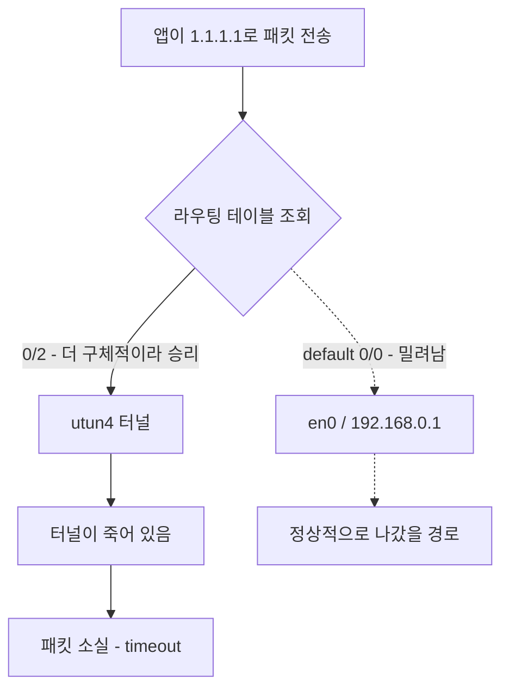

title: 와이파이를 옮길 때마다 맥북 인터넷이 작동 안하던 이유
slug: macbook-wifi-issue-when-moved
category: 개발 노트
summary: 와이파이를 옮기면 인터넷이 죽던 맥의 원인을 Tailscale accept-routes 로 짚고 껐는데, 3일 뒤 재발했다. 처음 쓴 결론을 지우지 않고 어디까지가 맞았는지 표시한 기록
tags: accept-routes,macOS,network,routing,tailscale,trouble-shooting,vpn,wi-fi
toc: true
nextSlug: fixnet-macos-routing-blackhole
publishedAt: 2026-08-11T07:45:00Z
updatedAt: 2026-08-30T03:51:06.242912Z
syncHash: dcaec58cbbfe150b86476ee37602fd883a1b95b489e86ad3fce9a89277da2c62

---
> **2026-08-15 덧붙임.** 이 글의 조치를 하고 3일 뒤에 같은 증상이 재발했다. 원인 진단은 절반만 맞았다.
> 처음 쓴 본문은 지우지 않고 그대로 두고, 후속 검증에서 틀린 것으로 드러난 문장만 ~~취소선~~ 으로 표시했다.
> 무엇이 어떻게 틀렸는지는 맨 아래 [3일 뒤, 재발했다](#3일-뒤-재발했다) 부터다.
> 한 번의 성공을 원인 규명으로 착각한 과정이 이 글의 내용이기도 해서, 결론을 새로 쓰는 대신 이렇게 남긴다.

카페나 사무실로 자리를 옮겨 다른 와이파이에 붙으면 맥에서 인터넷이 안 됐다. 와이파이는 분명히 연결됐다고 뜨고 신호도 가득 찬 상태인데, 브라우저는 아무것도 못 열고 터미널에서 `curl` 도 전부 timeout 이다.

이런 일을 종종 겪었다. 와이파이를 한참 꺼뒀다가 다시 켜면 어쩌다 풀리기도 했지만, 거의 대부분은 재부팅해야만 해결됐다. 그러다 보니 자연스럽게 재부팅이 기본 대응이 됐고, 원인은 한 번도 알지 못한 채 같은 의식만 반복했다.

문제는 재부팅의 비용이다. 열어둔 Claude 세션도, 터미널 탭도, 실행 중인 컨테이너도 전부 날아간다. 자리를 옮길 때마다 작업 상태를 통째로 버리는 셈이다. 결론부터 말하면 와이파이 문제가 아니었다. Tailscale 이 받아둔 라우팅 테이블의 몇 줄이 문제였고, 그걸 알아내는 데 필요한 건 재부팅을 한 번 참는 것뿐이었다.

## 재부팅이 고친다는 사실 자체를 단서로 삼았다

재부팅으로 고쳐진다는 건 어딘가에 오래된 상태가 남아 있다는 뜻이다. 디스크나 하드웨어 문제였다면 재부팅으로 낫지 않는다. 그렇다면 그 상태가 **어느 계층에 있는지만 특정하면 그 계층만 재시작해서 30초에 끝낼 수 있다**.

그래서 순서를 이렇게 정했다.

| 순서 | 하는 일 | 이유 |
|---|---|---|
| 1 | 고장난 순간에 증거부터 수집 | 고치면 증거가 사라진다. 재부팅이 지금까지 증거를 계속 지워왔다 |
| 2 | 계층별로 범위 좁히기 | 링크 / IP / 라우팅 / DNS 중 어디서 끊기는지 |
| 3 | 가설 하나만 세워서 최소 단위로 검증 | 여러 개를 한 번에 고치면 뭐가 들었는지 모른다 |
| 4 | 근본 설정 교정 | 증상 억제가 아니라 재발 자체를 없앤다 |

## 증상이 난 순간에만 돌릴 진단 스크립트를 먼저 만들었다

인터넷이 잘 될 때 돌리면 아무 의미가 없다. 다른 와이파이로 옮겨서 실제로 막힌 상태에서 한 번에 전 계층을 훑도록 짰다.

```bash
#!/bin/bash
# netdiag.sh - macOS 네트워크 전환 장애 계층별 증거 수집
# 사용법: bash netdiag.sh 2>&1 | tee ~/netdiag-$(date +%Y%m%d-%H%M%S).log

IF=$(route -n get default 2>/dev/null | awk '/interface:/{print $2}')
IF=${IF:-en0}

hr() { echo; echo "===== $1 ====="; }

hr "0. 기본 정보"
date
sw_vers | tr '\n' ' '; echo
echo "default interface: $IF"

hr "1. LINK - 무선 연결 자체"
networksetup -getairportnetwork en0
ifconfig en0 | egrep 'status|inet |inet6 |ether'

hr "2. IP/DHCP - 주소를 제대로 받았나 (169.254.x면 DHCP 실패)"
ipconfig getpacket en0 2>/dev/null | egrep 'yiaddr|router|domain_name_server|lease_time'
ipconfig getsummary en0 2>/dev/null | egrep -i 'addr|router|dns' | head -20

hr "3. ROUTE - default route가 몇 개고 누가 이겼나 (utun=Tailscale)"
netstat -nr -f inet | head -25
echo "--- default 상세 ---"
route -n get default
echo "--- utun/bridge/vmnet 인터페이스 ---"
ifconfig | egrep '^(utun|bridge|vmenet|en)[0-9]*:' -A2 | egrep 'flags|inet '

hr "4. L3 도달성 - DNS 문제인지 라우팅 문제인지 분리"
GW=$(route -n get default 2>/dev/null | awk '/gateway:/{print $2}')
echo "gateway=$GW"
[ -n "$GW" ] && ping -c2 -W1000 "$GW"
ping -c2 -W1000 1.1.1.1
ping -c2 -W1000 google.com

hr "5. DNS - 어떤 resolver가 꽂혀 있나 (100.100.100.100 = Tailscale MagicDNS)"
scutil --dns | egrep 'nameserver|if_index|reach' | head -40
echo "--- 우회 질의 ---"
dig +short +time=2 +tries=1 google.com @1.1.1.1
dig +short +time=2 +tries=1 google.com

hr "6. 서브넷 충돌 - Docker/Tailscale 대역이 현재 wifi 대역과 겹치나"
echo "wifi subnet:"; ifconfig "$IF" | awk '/inet /{print $2, $4}'
echo "docker networks:"; docker network ls -q 2>/dev/null | xargs -I{} docker network inspect {} --format '{{.Name}} {{range .IPAM.Config}}{{.Subnet}}{{end}}' 2>/dev/null
echo "tailscale routes:"; tailscale status --json 2>/dev/null | grep -o '"ExitNodeOption":[a-z]*'; tailscale ip 2>/dev/null

hr "7. 프로세스 상태"
pgrep -lf 'tailscaled|Tailscale' ; pgrep -lf 'com.docker|Docker Desktop' | head -5
echo "--- 캡티브 포털 감지 ---"
curl -sS -m 5 -o /dev/null -w 'captive-probe http=%{http_code} redirect=%{redirect_url}\n' http://captive.apple.com/hotspot-detect.html

hr "8. 최근 네트워크 로그 (최근 3분)"
log show --last 3m --predicate 'subsystem CONTAINS "com.apple.network" OR process == "configd" OR process == "mDNSResponder" OR process CONTAINS "tailscale"' --style compact 2>/dev/null | tail -60

echo; echo "===== 끝 ====="
```

핵심은 4번 항목이다. `ping 1.1.1.1` 과 `ping google.com` 의 결과 조합만으로 범위가 크게 좁혀진다.

| `1.1.1.1` | `google.com` | 좁혀지는 범위 |
|---|---|---|
| 성공 | 실패 | DNS 계층 |
| 실패 | 실패 | 라우팅 또는 링크 계층 |
| 성공 | 성공 | 애플리케이션 계층 또는 캡티브 포털 |

<details>
<summary>실제 수집된 진단 로그 전문 (netdiag-0812-0022.log)</summary>

```text
===== 0. 기본 정보 =====
2026년  8월 12일 수요일 00시 22분 45초 KST
ProductName: macOS ProductVersion: 26.5.2 BuildVersion: 25F84
default interface: en0

===== 1. LINK - 무선 연결 자체 =====
You are not associated with an AirPort network.
        ether e2:b8:15:f3:35:46
        inet6 fe80::1cc8:f9c5:fd4c:7302%en0 prefixlen 64 secured scopeid 0xe
        inet 192.168.0.93 netmask 0xffffff00 broadcast 192.168.0.255
        status: active

===== 2. IP/DHCP - 주소를 제대로 받았나 (169.254.x면 DHCP 실패) =====
yiaddr = 192.168.0.93
lease_time (uint32): 0x1c20
router (ip_mult): {192.168.0.1}
domain_name_server (ip_mult): {168.126.63.1, 168.126.63.2}
      Addresses : <array> {
ciaddr = 0.0.0.0
yiaddr = 192.168.0.93
siaddr = 0.0.0.0
giaddr = 0.0.0.0
chaddr = e2:b8:15:f3:35:46
router (ip_mult): {192.168.0.1}
      Router : 192.168.0.1
      RouterARPVerified : TRUE

===== 3. ROUTE - default route가 몇 개고 누가 이겼나 (utun=Tailscale) =====
Routing tables

Internet:
Destination        Gateway            Flags               Netif Expire
0/2                utun4              UScg                utun4
default            192.168.0.1        UGScg                 en0
10.1.0.4           10.1.0.4           UH                  utun4
64/2               utun4              USc                 utun4
127                127.0.0.1          UCS                   lo0
127.0.0.1          127.0.0.1          UH                    lo0
128.0/2            utun4              USc                 utun4
169.254            link#14            UCS                   en0      !
192.0.0/2          utun4              USc                 utun4
192.168.0          link#14            UCS                   en0      !
192.168.0.1/32     link#14            UCS                   en0      !
192.168.0.1        58:86:94:0:31:3f   UHLWI                 en0   1126
192.168.0.4        54:48:e6:7e:dc:e8  UHLWI                 en0   1145
192.168.0.51       98:d:af:cf:0:4f    UHLWIi                en0   1124
192.168.0.93/32    link#14            UCS                   en0      !
192.168.0.93       e2:b8:15:f3:35:46  UHLWIi                lo0
224.0.0/4          link#14            UmCS                  en0      !
224.0.0.251        1:0:5e:0:0:fb      UHmLWI                en0
255.255.255.255/32 link#14            UCS                   en0      !
--- default 상세 ---
   route to: default
destination: default
       mask: default
    gateway: 192.168.0.1
  interface: en0
      flags: <UP,GATEWAY,DONE,STATIC,PRCLONING,GLOBAL>
--- utun/bridge/vmnet 인터페이스 ---
en0: flags=8863<UP,BROADCAST,SMART,RUNNING,SIMPLEX,MULTICAST> mtu 1500
bridge0: flags=8863<UP,BROADCAST,SMART,RUNNING,SIMPLEX,MULTICAST> mtu 1500
utun0: flags=8051<UP,POINTOPOINT,RUNNING,MULTICAST> mtu 1500
utun1: flags=8051<UP,POINTOPOINT,RUNNING,MULTICAST> mtu 1380
utun2: flags=8051<UP,POINTOPOINT,RUNNING,MULTICAST> mtu 2000
utun3: flags=8051<UP,POINTOPOINT,RUNNING,MULTICAST> mtu 1000
utun4: flags=8051<UP,POINTOPOINT,RUNNING,MULTICAST> mtu 1500
        inet 10.1.0.4 --> 10.1.0.4 netmask 0xffff0000

===== 4. L3 도달성 - DNS 문제인지 라우팅 문제인지 분리 =====
gateway=192.168.0.1
PING 192.168.0.1 (192.168.0.1): 56 data bytes
64 bytes from 192.168.0.1: icmp_seq=0 ttl=64 time=4.362 ms
64 bytes from 192.168.0.1: icmp_seq=1 ttl=64 time=4.532 ms

--- 192.168.0.1 ping statistics ---
2 packets transmitted, 2 packets received, 0.0% packet loss
round-trip min/avg/max/stddev = 4.362/4.447/4.532/0.085 ms
PING 1.1.1.1 (1.1.1.1): 56 data bytes
Request timeout for icmp_seq 0

--- 1.1.1.1 ping statistics ---
2 packets transmitted, 0 packets received, 100.0% packet loss
ping: cannot resolve google.com: Unknown host

===== 5. DNS - 어떤 resolver가 꽂혀 있나 =====
  nameserver[0] : 8.8.8.8
  nameserver[1] : 1.1.1.1
  reach    : 0x00000002 (Reachable)
  reach    : 0x00000000 (Not Reachable)
  nameserver[0] : 8.8.8.8
  nameserver[1] : 1.1.1.1
  if_index : 14 (en0)
  reach    : 0x00000000 (Not Reachable)
--- 우회 질의 ---
;; connection timed out; no servers could be reached
;; connection timed out; no servers could be reached

===== 6. 서브넷 충돌 =====
wifi subnet:
192.168.0.93 0xffffff00
docker networks:
tailscale routes:
"ExitNodeOption":

===== 7. 프로세스 상태 =====
311 /Library/PrivilegedHelperTools/com.docker.vmnetd
3044 /Applications/Docker.app/Contents/MacOS/com.docker.backend
3088 /Applications/Docker.app/Contents/MacOS/com.docker.backend services
3089 /Applications/Docker.app/Contents/MacOS/com.docker.backend fork
3146 /Applications/Docker.app/Contents/MacOS/com.docker.build --log-no-timestamp
--- 캡티브 포털 감지 ---
curl: (28) Resolving timed out after 5005 milliseconds
captive-probe http=000 redirect=

===== 8. 최근 네트워크 로그 (최근 3분) =====
00:23:35.336 Df MSTeams [C356 ... waiting parent-flow (satisfied (Path is satisfied),
             interface: utun4, ipv4, dns)] event: path:satisfied @0.000s
00:23:35.935 Df com.apple.geod [C33 ... waiting parent-flow (satisfied (Path is satisfied),
             interface: utun4, ipv4, dns)] event: path:satisfied @0.000s
00:23:35.625 Df io.tailscale.ipn.macsys.network-extension nw_path_libinfo_path_check
00:23:36.509 Df mDNSResponder [R90559] QueryRecordOpCallback: Question (Addr) timing out
00:23:36.556 Df mDNSResponder [Q39557] GenerateNegativeResponse: Generating negative response

===== 끝 =====
```

</details>

## 로그를 보고 DNS가 아니라 라우팅이라고 판단했다

처음 의심한 건 DNS였다. Tailscale 은 MagicDNS 를 쓰면 시스템 resolver 를 자기 것으로 바꾸는데, 네트워크가 바뀌었을 때 이걸 갱신하지 못하면 이름 해석만 죽는 사례가 흔하다. 그런데 로그가 다른 곳을 가리켰다.

라우팅 테이블의 이 네 줄이 전부다.

```text
Destination        Gateway            Flags               Netif
0/2                utun4              UScg                utun4
64/2               utun4              USc                 utun4
128.0/2            utun4              USc                 utun4
192.0.0/2          utun4              USc                 utun4
default            192.168.0.1        UGScg                 en0
```

`/2` 네 개를 합치면 IPv4 주소 공간 전체가 덮인다. 라우팅은 더 구체적인 경로가 이기므로, `/0` 인 `default` 는 `/2` 를 절대 이기지 못한다. 즉 **바깥으로 나가는 모든 패킷이 utun4 터널로 들어가고, 그 터널이 죽어 있어서 전부 사라지고 있었다**.

> **2026-08-15**: 이 문단은 그 순간의 관측으로는 맞다. 다만 뒤에 "경로가 원인이다" 로 넘어가는 부분이 과했다. 같은 경로가 깔린 채 `ping 1.1.1.1` 이 6ms 로 통하는 상태를 나중에 봤다.

관측된 모든 현상이 이 하나로 설명된다.

| 관측 | 설명 |
|---|---|
| 게이트웨이 `192.168.0.1` ping 성공 (4ms) | `192.168.0/24` 는 en0 직결 경로라 `/2` 보다 구체적이라 살아남는다 |
| `1.1.1.1` ping 100% loss | `0/2` 에 걸려 utun4 로 들어가 사라진다 |
| `dig @1.1.1.1` timeout | DNS 서버로 가는 패킷도 같은 이유로 사라진다. **DNS 설정 자체는 멀쩡했다** |
| 시스템 로그가 전부 `interface: utun4` | MSTeams, geod, Telegram 모두 utun4 로 경로가 배정됐다 |
| DHCP 정상, ARP 검증 완료 | 링크와 IP 계층은 처음부터 아무 문제가 없었다 |

와이파이도 DHCP도 DNS도 정상이었다. 그동안 와이파이를 껐다 켜고 DNS 를 바꿔봐도 소용없던 이유가 여기 있다. 전부 멀쩡한 계층을 만지고 있었다.



Docker 도 함께 의심했지만 로그에서 제외됐다. `--networkType gvisor` 로 동작하고 있어 호스트 라우팅 테이블을 건드리지 않는다.

## 경로 세 개를 지워서 가설을 검증했다

가설을 세웠으면 가장 작은 단위로 확인해야 한다. Tailscale 을 껐다 켜거나 재부팅하면 여러 가지가 한꺼번에 바뀌어서 무엇이 들었는지 알 수 없다. 문제로 지목한 경로만 정확히 지웠다.

```bash
sudo route -n delete -net 0.0.0.0/2; sudo route -n delete -net 64.0.0.0/2; sudo route -n delete -net 128.0.0.0/2; ping -c3 1.1.1.1
```

```text
delete net 0.0.0.0
delete net 64.0.0.0
delete net 128.0.0.0
PING 1.1.1.1 (1.1.1.1): 56 data bytes
64 bytes from 1.1.1.1: icmp_seq=0 ttl=56 time=5.095 ms
64 bytes from 1.1.1.1: icmp_seq=1 ttl=56 time=5.503 ms
64 bytes from 1.1.1.1: icmp_seq=2 ttl=56 time=6.269 ms

--- 1.1.1.1 ping statistics ---
3 packets transmitted, 3 packets received, 0.0% packet loss
round-trip min/avg/max/stddev = 5.095/5.622/6.269/0.487 ms
```

100% loss 에서 0% loss 로 바뀌었다. 재부팅 없이, 앱 하나 종료하지 않고 복구됐다. ~~원인 확정이다.~~

> **2026-08-15**: 이건 원인 확정이 아니라 사례 하나다. 나중에 **같은 경로가 깔려 있는데 인터넷이 멀쩡한 상태**를 봤다. 경로는 필요조건이지 충분조건이 아니었다.

## 범인은 Tailscale 이었지만 처음 짚은 이유 때문은 아니었다

utun4 의 주소가 `10.1.0.4/16` 이라 잠시 Tailscale 을 용의선상에서 뺐었다. Tailscale 은 기본적으로 `100.64.0.0/10` 대역을 쓰기 때문이다. 확인해보니 틀린 판단이었다. 자체 control server 나 커스텀 IP 대역을 쓰는 tailnet 이면 충분히 나올 수 있는 값이다.

```bash
scutil --nc list; ps aux | egrep -i 'vpn|wireguard|openvpn|anyconnect|globalprotect|forti|cisco|zscaler' | grep -v grep
```

```text
Available network connection services in the current set (*=enabled):
* (Connected)   11D4583A-E7CD-4CEC-A36F-F696A0F8E3B6 VPN (io.tailscale.ipn.macsys) "Tailscale"
[VPN:io.tailscale.ipn.macsys]
```

VPN 서비스는 Tailscale 하나뿐이었다. 다른 VPN 클라이언트는 아예 설치돼 있지 않았다.

## exit node 가 아니라 accept-routes 가 원인이었다

다음 의심은 exit node 였다. 전체 트래픽을 특정 노드로 보내는 기능이라 증상과 맞아떨어진다. 그런데 설정을 열어보니 예상과 달랐다.

```bash
/Applications/Tailscale.app/Contents/MacOS/Tailscale debug prefs | grep -i -E 'exit|route'
```

```text
"RouteAll": true,
"ExitNodeID": "",
"ExitNodeIP": "",
"InternalExitNodePrior": "",
"ExitNodeAllowLANAccess": false,
"AdvertiseRoutes": null,
```

`ExitNodeID` 는 비어 있고 `RouteAll` 이 `true` 였다. `RouteAll` 은 `--accept-routes` 에 해당하는 설정으로, **tailnet 의 다른 노드가 광고하는 서브넷 경로를 전부 받아들인다**는 뜻이다.

여기서 왜 하필 `/2` 단위인지가 설명된다. Tailscale 은 `0.0.0.0/0` 광고를 exit node 전용으로 막아둔다. 그래서 그 제약을 우회해 사실상의 default route 를 밀어넣으려면 `/1` 이나 `/2` 로 쪼개서 일반 서브넷 경로인 척 광고해야 한다. 내 맥은 `accept-routes` 가 켜져 있어서 그 광고를 그대로 받아 라우팅 테이블에 넣었다.

정리하면 이렇다.

| 연결 종류 | 동작 방식 | `accept-routes` 영향 |
|---|---|---|
| 노드에 직접 접속 | 내 맥에서 tailnet 노드(10.1.x.x)로 바로 | 받지 않음. 항상 동작한다 |
| 노드를 경유한 서브넷 접속 | 노드 뒤의 사설망까지 라우팅 | 이 설정으로 켜고 꺼진다 |

내 사용 패턴은 전자뿐이었다. Tailscale 이 깔린 기기끼리만 쓰고 있었고, 어떤 노드 뒤의 사설망으로 우회 접속하는 구성은 없었다.

## Tailscale 을 계속 켜두기 위해 accept-routes 를 껐다

여기서 선택지가 두 개였다.

| 방법 | 효과 | 문제 |
|---|---|---|
| 이동할 때 Tailscale 을 껐다 켠다 | ~~터널이 새로 수립돼 통한다~~ | 경로는 다시 깔린다. 이동할 때마다 반복된다 |
| control server 에서 해당 노드의 `/2` 승인을 취소한다 | 근본 해결 | 관리자 권한이 필요하고 다른 사용자에게도 영향이 간다 |
| 이 맥에서 `accept-routes` 를 끈다 | 광고를 받지 않으니 경로가 아예 안 깔린다 | 노드 뒤 사설망 접속을 잃는다 |

첫 번째는 증상 억제다. ~~껐다 켜면 통하는 이유는 터널이 재수립돼서지 경로가 사라져서가 아니다.~~ 다음 이동에서 똑같이 재발한다.

> **2026-08-15**: 껐다 켜서 통하는 이유를 터널 재수립으로 단정한 게 틀렸다. 뒤에서 보듯 Tailscale 이 `Stopped` 인 채로도 인터넷이 된다. 그리고 애초에 **Disconnect 도 Quit 도 그 경로를 치우지 않는다** — "이동할 때 꺼둔다" 는 성립하지 않는 대책이었다.

애초에 이동할 때 Tailscale 이 필요 없는데도 껐다 켜기가 귀찮아 켜둔 것이었으므로, 조작을 하나 더 늘리는 방향은 목적에 어긋난다.

세 번째를 골랐다. 잃는 기능이 실제 사용 패턴에 없었기 때문이다.

```bash
/Applications/Tailscale.app/Contents/MacOS/Tailscale set --accept-routes=false
```

끄기 전에 진짜로 쓰는 경로가 섞여 있지 않은지 확인했다.

```bash
/Applications/Tailscale.app/Contents/MacOS/Tailscale status --json | python3 -c "import json,sys; d=json.load(sys.stdin); [print(p.get('HostName'), p.get('AllowedIPs')) for p in (d.get('Peer') or {}).values() if p.get('AllowedIPs')]"
```

`/2` 짜리 말고 `192.168.x.x/24` 나 `172.16.x.x/16` 같은 실제 사설망 대역이 광고되고 있다면 그건 누군가 쓰라고 세팅해둔 것일 수 있다. 그 경우엔 세 번째 대신 두 번째로 가야 한다. 되돌리는 것도 `--accept-routes=true` 한 줄이라 부담이 없다.

~~이제 Tailscale 을 항상 켜둔 채로 네트워크를 옮겨도 인터넷이 끊기지 않는다.~~ tailnet 노드 직접 접속과 MagicDNS 는 그대로 동작한다.

> **2026-08-15**: 3일 뒤에 끊겼다. `accept-routes=false` 인 상태에서도 그 경로 네 줄이 다시 깔려 있었다.

## 자동 복구 스크립트는 만들되 설치는 미뤘다

혹시 모를 재발에 대비해 복구 스크립트도 작성했다. ~~다만 설정 변경만으로 재발이 없으면 root 데몬을 하나 더 두는 건 손해이므로, 당분간 쓰지 않고 두기로 했다.~~

> **2026-08-15**: 그 사이 재발했고, 이 스크립트는 **파일로 존재하지도 않았다.** 글에 코드로만 있었다. 지금은 `fixnet` 이라는 셸 함수로 실제로 설치돼 있다(마지막 절).

```bash
#!/bin/bash
# tsnetfix.sh - Tailscale full-tunnel 경로 블랙홀 자동 복구
# 사용법: sudo bash tsnetfix.sh
# 종료코드: 0=정상 또는 복구됨, 1=복구 실패

TS=/Applications/Tailscale.app/Contents/MacOS/Tailscale
log() { echo "[tsnetfix] $*"; }
ok()  { ping -c1 -W1000 1.1.1.1 >/dev/null 2>&1; }

# 0. 이미 정상이면 아무것도 안 함
if ok; then
  log "인터넷 정상. 할 일 없음."
  exit 0
fi

# 가드: 링크 자체가 죽은 경우엔 관여하지 않는다
# (와이파이 미연결이나 기내모드에서 괜히 Tailscale 을 흔들지 않기 위함)
GW=$(route -n get default 2>/dev/null | awk '/gateway:/{print $2}')
if [ -z "$GW" ]; then
  log "default gateway 없음. 네트워크 미연결 상태로 판단하고 종료."
  exit 0
fi
if ! ping -c1 -W1000 "$GW" >/dev/null 2>&1; then
  log "게이트웨이($GW) 무응답. 와이파이 또는 공유기 문제이므로 종료."
  exit 0
fi

log "게이트웨이는 살아있는데 외부 불통. 블랙홀 경로로 판단하고 복구 시작."

# 1. near-default 경로 제거 (/1 과 /2 두 형태 모두 커버)
REMOVED=0
for NET in 0.0.0.0/1 128.0.0.0/1 0.0.0.0/2 64.0.0.0/2 128.0.0.0/2 192.0.0.0/2; do
  if route -n delete -net "$NET" >/dev/null 2>&1; then
    log "경로 삭제: $NET"
    REMOVED=1
  fi
done

if [ "$REMOVED" = 1 ]; then
  sleep 1
  if ok; then
    log "복구 완료. 경로 삭제로 해결됨."
    exit 0
  fi
fi

# 2. 경로 삭제로 부족하면 Tailscale 재기동
if [ -x "$TS" ]; then
  log "경로 삭제로 부족. Tailscale 재기동 시도."
  "$TS" down >/dev/null 2>&1
  sleep 2
  "$TS" up   >/dev/null 2>&1
  sleep 3
  if ok; then
    log "복구 완료. Tailscale 재기동으로 해결됨."
    exit 0
  fi
else
  log "Tailscale CLI 없음: $TS"
fi

log "자동 복구 실패. netdiag.sh 로 수동 진단이 필요하다."
exit 1
```

이 스크립트에서 신경 쓴 건 **개입하지 않아야 할 때를 판별하는 가드**다. 60초마다 무조건 도는 데몬으로 만들 경우, 가드가 없으면 와이파이가 아예 없는 곳에서도 계속 경로를 지우고 Tailscale 을 재기동한다. 그래서 두 조건을 모두 만족할 때만 동작하게 했다.

| 조건 | 판정 |
|---|---|
| `ping 1.1.1.1` 성공 | 정상이므로 즉시 종료 |
| 게이트웨이 무응답 | 링크 문제이므로 관여하지 않고 종료 |
| 게이트웨이는 응답하는데 외부만 불통 | 이 경우에만 복구 시도 |

LaunchDaemon 등록까지 하는 설치 스크립트도 함께 만들어뒀다. `StartInterval` 60초에 `RunAtLoad` 를 붙이고, 로그는 `/var/log/tsnetfix.log` 로 남긴다. ~~필요해지면 그때 올릴 생각이다.~~

> **2026-08-15**: 결국 LaunchDaemon 은 안 올렸다. 증상이 나면 브라우저가 안 열려서 어차피 즉시 알아채므로, 60초마다 도는 root 데몬을 상시 띄울 이유가 없다고 판단했다. 대신 손으로 치는 `fixnet` 으로 갔다.

## accept-routes 가 정확히 무엇을 켜고 끄는지 정리해둔다

나중에 다시 켤 일이 있을 수 있어 이 설정의 범위를 명확히 적어둔다. 이름만 보면 "경로를 받는다" 라서 끄면 Tailscale 이 통째로 무력화될 것 같지만 그렇지 않다.

Tailscale 의 연결에는 두 종류가 있다.

첫째, **노드에 직접 접속**이다. tailnet 에 가입된 기기끼리 터널로 바로 통신하는 것으로, SSH 든 파일 공유든 내부 웹이든 전부 여기 해당한다. Tailscale 의 본체 기능이고 `accept-routes` 와 무관하게 항상 동작한다.

둘째, **어떤 노드를 경유해 그 뒤의 네트워크로 나가는 것**이다. 어떤 노드가 "나를 거치면 이 대역으로 갈 수 있다" 고 광고(advertise)하고, 내 기기가 그걸 받아들여(accept) 라우팅 테이블에 넣는 방식이다. Tailscale 이 설치되지 않은 프린터나 NAS 에 접근할 때 쓴다. `accept-routes` 는 **이 두 번째만** 켜고 끈다.


이번 사고는 광고된 대역이 하필 사실상 인터넷 전체(`0.0.0.0/2` + `64.0.0.0/2` + `128.0.0.0/2`)였기 때문에 벌어졌다. 두 번째 기능을 쓰지 않는데도 켜져 있었고, 그래서 "모든 트래픽을 나를 거쳐 보내라" 는 광고를 그대로 수용했다.

끄고 켤 때의 범위는 이렇다.

| 항목 | `accept-routes=false` 이후 |
|---|---|
| tailnet 노드 직접 접속 (10.1.x.x) | 유지된다 |
| MagicDNS, 노드 이름 해석 | 유지된다 |
| exit node 기능 | 별개 설정이라 영향 없다 |
| 노드 뒤 사설망으로의 라우팅 | 없어진다 |
| 네트워크 이동 시 블랙홀 | ~~없어진다~~ → 3일 뒤 재발했다 |

되돌리는 건 `--accept-routes=true` 한 줄이라, 애매하면 일단 끄고 며칠 써보면서 불편한 게 생기는지 보는 편이 낫다.

~~여담으로, 예전에 와이파이를 한참 꺼뒀다 켜면 가끔 풀렸던 것도 이걸로 설명된다. 그 사이에 Tailscale 이 터널을 새로 수립하는 데 성공하면 경로는 그대로여도 트래픽이 통했던 것이다. 경로가 사라져서가 아니라 터널이 되살아나서 통한 것이라, 다음 이동에서 다시 막히는 게 당연했다.~~

> **2026-08-15**: 이 설명은 데이터와 안 맞는다. 재발한 날 와이파이를 껐다 켜서 풀렸을 때 Tailscale 은 `Stopped` 였다. 터널이 되살아난 게 아니다. 지금 더 그럴듯한 가설은 라우팅 테이블에 `default` 가 두 개 있고 그중 하나가 `UGScIg`(IFSCOPE, 인터페이스 스코프)라는 점 — 와이파이 재연결 때 macOS 가 새로 까는 스코프 경로가 우선권을 가져가는 쪽이다. **다만 이것도 아직 검증 안 된 가설이다.**

## 앞으로 할 일

솔직하게 구분하면, 이번에 한 것은 해결이 아니라 격리다. `accept-routes` 를 끈 것은 잘못된 광고를 받지 않겠다는 선언일 뿐, 광고 자체는 tailnet 에 그대로 살아 있다. 병원에 비유하면 원인균을 없앤 게 아니라 내 병실 문을 닫은 것이다. 같은 tailnet 에서 `accept-routes` 를 켜둔 다른 기기는 오늘도 같은 증상을 겪을 수 있다.

그래서 남은 일의 우선순위가 자연스럽게 정해진다. 문을 닫는 것보다 원인균을 없애는 쪽이 위다.

| 순위 | 할 일 | 이유 |
|---|---|---|
| 1 | `/2` 경로를 광고하는 노드를 찾는다 | 원인 제공 지점이 그대로 남아 있다 |
| 2 | control server 에서 해당 경로 승인을 취소한다 | tailnet 전체의 재발을 막는 유일한 지점이다 |
| 3 | 같은 tailnet 의 다른 기기 상태를 확인한다 | `accept-routes` 가 켜진 기기는 전부 다음 피해 후보다 |
| 4 | `tsnetfix` 를 실제 장애 상황에서 검증한다 | 미검증 안전망은 안전망이 아니다 |
| 5 | 진단 스크립트를 다른 장애 유형까지 확장한다 | 이번엔 라우팅이었지만 다음도 그러리란 보장이 없다 |

1번은 이 명령 하나로 시작할 수 있다. 광고 중인 대역과 그 주인이 바로 나온다.

```bash
/Applications/Tailscale.app/Contents/MacOS/Tailscale status --json | python3 -c "import json,sys; d=json.load(sys.stdin); [print(p.get('HostName'), p.get('AllowedIPs')) for p in (d.get('Peer') or {}).values() if p.get('AllowedIPs')]"
```

2번까지 끝나야 비로소 `accept-routes` 를 다시 켜도 안전한 상태가 된다. 그때 노드 뒤 사설망 접속이 필요해지면 `--accept-routes=true` 한 줄로 되돌리면 된다. 닫아둔 문은 원인균이 사라진 뒤에 여는 것이 순서다.

## 남은 한계

이 글이 다 아는 것처럼 끝나지 않도록, 확인하지 못한 것을 확인한 것과 같은 비중으로 적어둔다.

**`/2` 가 네 개였다가 세 개로 줄어든 이유를 모른다.** 첫 진단 로그에는 `192.0.0/2` 가 있었는데 두 번째 확인 때는 없었다. 광고하는 쪽 상태에 따라 달라진다고 짐작할 뿐이다. 짐작을 결론처럼 적으면 다음에 이 글을 읽는 사람(대개 미래의 나)이 틀린 지도를 들고 출발하게 되므로, 모른다고 적는다.

**Tailscale 이 왜 네트워크 전환 시 터널을 복구하지 못하는지는 다루지 않았다.** 이번에 확인한 범위는 "죽은 터널을 가리키는 경로가 남아 블랙홀이 된다"까지다. 터널 재수립 실패 자체는 별개의 문제이고, `accept-routes` 를 꺼서 내 환경에서 드러나지 않게 됐을 뿐 사라진 것은 아니다.

**자동 복구 스크립트는 실전을 겪지 않았다.** 로직은 수집된 증거에 맞춰 짰지만, 실제 재발 시점에 가드가 의도대로 걸리고 복구가 끝까지 도는 걸 본 적이 없다. 검증되기 전까지는 안전망이 아니라 안전망 후보다.

> **2026-08-15**: 이 셋 중 마지막 하나는 그 사이에 답이 나왔다. 돌려봤더니 **자기가 실패한 걸 성공이라고 보고했다.** 아래에 적는다.

마지막으로, 이번 건에서 가장 오래 걸린 일은 진단이 아니었다. **재부팅을 참는 것**이었다. 증상이 날 때마다 반사적으로 재부팅했고, 재부팅은 매번 문제를 해결하는 동시에 증거를 지웠다. 가장 편한 대응이 원인을 가장 오래 숨긴 셈이다. 이번에 한 일의 본질은 대단한 진단 기술이 아니라, 고장난 상태를 고치지 않고 버틴 채 로그부터 뜬 것 하나다. 다음에 "재부팅하면 되는" 문제를 만나면, 재부팅하기 전에 그 문제가 지금 남기고 있는 증거부터 챙길 것이다.

---

## 3일 뒤, 재발했다

여기부터는 2026-08-15 에 붙인 후속 검증이다. 위의 조치를 하고 3일 뒤, 같은 증상이 났다. Tailscale 은 메뉴바에서 **not connected** 였고, 와이파이를 끄고 30초쯤 뒤에 켜니 인터넷이 돌아왔다. 예전과 똑같은 방식으로.

돌아온 뒤에 상태를 다시 쟀다. 결론부터 적으면 **글의 조치는 재발을 막지 못했고, 동시에 글의 원인 단정도 근거가 약해졌다.**

### 설정은 제대로 들어가 있었다

먼저 의심한 건 설정이 풀렸을 가능성이었다. 아니었다.

```text
$ tailscale debug prefs
{
  "RouteAll": false,        ← accept-routes = false. 조치가 적용되어 있음
  "WantRunning": false,     ← Tailscale 은 중지 상태
  "ExitNodeID": "",         ← exit node 도 안 쓰는 중
  "LoggedOut": false
}

$ tailscale status
Tailscale is stopped.
```

### 그런데 문제의 경로 네 줄이 그대로 살아 있었다

```text
$ netstat -nr -f inet
Destination        Gateway            Flags               Netif
0/2                utun4              UScg                utun4   ← 글에서 지목한 그 경로
64/2               utun4              USc                 utun4
128.0/2            utun4              USc                 utun4
192.0.0/2          utun4              USc                 utun4
default        192.168.0.1            UGScg                 en0
default        192.168.0.1            UGScIg                en0   ← 두 번째 default (IFSCOPE)
10.1.0.4           10.1.0.4           UH                  utun4

$ route -n get 1.1.1.1
  interface: utun4          ← 외부로 나가는 판정이 여전히 터널로 간다

$ ifconfig utun4
utun4: flags=8051<UP,POINTOPOINT,RUNNING,MULTICAST> mtu 1500
        inet 10.1.0.4 --> 10.1.0.4 netmask 0xffff0000   ← 인터페이스도 살아 있음
```

"예전에 남은 찌꺼기 아니냐" 를 먼저 배제해야 했다. 부팅 시각을 봤다.

```text
$ sysctl -n kern.boottime
{ sec = 1786434890 }  →  2026-08-11 (화) 16:54:50 KST
$ uptime
up 3 days, 7:28
```

**부팅이 조치보다 뒤다.** 깨끗한 라우팅 테이블에서 시작해서, 그 뒤 3일 동안 저 경로가 **다시 설치됐다.** `accept-routes` 가 꺼진 채로.

이게 이번 검증에서 가장 중요한 발견이다. `accept-routes=false` 는 **새로 받아들이는 것**을 막는 설정이지, **이미 설치된 경로를 제거하지도, 재설치를 막지도 않는다.** 그 경로를 치워주는 주체가 시스템 어디에도 없다는 게 진짜 구멍이었다.

### Disconnect 도 Quit 도 경로를 치우지 않는다

앱을 완전히 종료한 직후에 다시 쟀다.

```text
익스텐션 PID:  3270  →  79815      ← 종료된 게 아니라 재시작됨
utun4:        여전히 UP, inet 10.1.0.4
0/2, 64/2, 128.0/2, 192.0.0/2 → utun4   ← 그대로

$ pgrep -fl tailscale
79815 /Library/SystemExtensions/.../io.tailscale.ipn.macsys.network-extension
```

macOS 는 앱을 종료해도 **시스템 익스텐션을 다시 띄운다.** 새로 뜬 익스텐션이 `WantRunning=false`, `RouteAll=false` 인데도 같은 경로를 도로 설치했다.

Tailscale 의 상태 표시와 실제 네트워크 설정은 다른 층위다.

| 조작 | 트래픽 | utun 인터페이스 | 라우팅 테이블 |
|---|---|---|---|
| Disconnect (not connected) | 안 보냄 | **남음** | **남음** |
| 앱 Quit | 안 보냄 | **남음** (익스텐션 재시작) | **남음** |
| 앱 언인스톨 (익스텐션 제거) | — | 사라짐 | 사라짐 |

앞에서 "이동할 때 Tailscale 을 껐다 켠다" 를 증상 억제라며 물린 건 결과적으로 맞았지만, 이유가 틀렸다. 그건 억제도 못 한다. **끄는 조작 자체가 경로에 아무 영향이 없다.**

### 경로가 깔려 있는데 인터넷이 되는 반례

같은 시점, 경로가 저 상태 그대로인 채로:

```text
$ ping -c2 1.1.1.1
2 packets transmitted, 2 packets received, 0.0% packet loss
round-trip min/avg/max = 5.746/6.896/8.045 ms

$ tailscale netcheck
* IPv4: yes, 121.170.151.77:60939
* Nearest DERP: Tokyo (37.3ms)
* CaptivePortal: false
```

경로 판정은 utun4 로 가는데 통신은 정상이다. 6ms 면 터널을 도는 지연이 아니다.

**저 경로가 존재한다는 사실만으로는 블랙홀이 되지 않는다.** 경로 + 무언가가 겹쳐야 터진다. 그 무언가는 네트워크 전환 시점의 터널/익스텐션 상태로 짐작하지만 아직 모른다. 원래 글은 경로를 원인으로 단정했는데, 지금 데이터로는 **필요조건일 뿐 충분조건이 아니다.**

### 코드가 본문보다 정직했다

재밌는 건 이걸 3일 전의 내가 이미 알고 있었다는 점이다. 본문 결론은 `accept-routes` 하나로 단정했는데, 같은 글에 실린 `tsnetfix.sh` 에는 이 분기가 이미 있다.

```bash
# 2. 경로 삭제로 부족하면 Tailscale 재기동
```

**경로 삭제만으로 부족할 수 있다는 걸 전제하고 짠 코드다.** 산문과 코드가 서로 다른 확신도를 갖고 있었고, 맞은 쪽은 코드였다. 글은 이야기를 끝내고 싶어 하고 코드는 실패를 처리해야 해서, 아마 앞으로도 코드 쪽이 정직할 것이다.

### 복구 스크립트가 거짓 성공을 보고했다

`fixnet` 초판을 실제로 돌렸더니 화면에 "**경로 삭제로 해결**" 이라고 찍혔다. 실제로는 `sudo` 가 비밀번호를 요구해서 route 삭제가 **전부 실패**했다. 인터넷이 원래 되고 있었으니 확인용 ping 이 그냥 통과한 것이다.

두 가지를 배웠다.

- **조치 전에 "이미 정상인가" 가드를 먼저 둬야 한다.** 정상일 때 돌리면 무슨 짓을 해도 성공으로 보인다.
- **에러를 `2>/dev/null` 로 숨기면 실패가 성공으로 둔갑한다.**

원본 `tsnetfix.sh` 에는 그 가드가 있었다. 알리아스로 줄이면서 내가 빠뜨렸다. 축약이 만든 버그다.

### `fixnet` 을 알리아스이자 실험 장치로 뒀다

LaunchDaemon 대신 `~/.zshrc` 함수로 넣었다. 증상이 나면 브라우저가 안 열려서 어차피 즉시 알아채므로, 60초마다 도는 root 데몬을 상시 띄울 이유가 없다.

```text
1. 이미 인터넷 정상?           → "할 일 없음" 하고 즉시 종료 (아무것도 안 건드림)
2. 게이트웨이도 무응답?        → 링크/와이파이 문제. 경로 안 건드리고 종료
3. 0/2, 64/2, 128.0/2, 192.0.0/2 삭제 → 되면 "경로 삭제로 해결"
4. 그래도 안 되면 tailscale down/up  → 되면 "재기동으로 해결"
5. 둘 다 실패                        → netdiag.sh 안내
```

`sudo` 비밀번호를 물으므로 **직접 타이핑해서 실행**해야 한다. 백그라운드에서 부르면 조용히 실패한다 — 그게 위의 거짓 성공이었다.

중요한 건 모든 실행이 `~/fixnet.log` 에 남는다는 점이다. **어느 단계에서 풀렸는지가 그대로 원인 규명 데이터가 된다.**

| 로그에 쌓이는 결과 | 뜻하는 것 |
|---|---|
| "경로 삭제로 해결" 이 여러 번 | 이 글의 원인 진단이 맞다고 확정할 수 있다 |
| "재기동으로 해결" 이 섞임 | 경로는 필요조건일 뿐이고 원인이 따로 있다 |
| "게이트웨이 무응답" | 애초에 Tailscale 문제가 아니었던 케이스 |

**지금 이 글에 부족한 건 분석이 아니라 n 이다.** 사례 하나로 결론을 냈고, 그 하나가 3일 만에 반례를 만났다.

### 아직 모르는 것

1. **누가 경로를 다시 설치하는가.** `WantRunning=false`, `RouteAll=false` 인데도 익스텐션이 부팅/재시작마다 설치한다. Tailscale 1.102.2 (macsys, 시스템 익스텐션 방식) 의 의도된 동작인지 버그인지 모른다. 재현 조건이 잡히면 이슈 리포트감이다.
2. **경로만으로는 안 터지는데 무엇이 더해져야 터지는가.** 이게 진짜 원인이다. 다음에 증상이 났을 때 `fixnet` 을 돌리기 **전에** `netdiag.sh` 를 먼저 돌려서, 정상일 때 기록과 비교해야 잡힌다.
3. **두 번째 `default`(UGScIg / IFSCOPE)가 언제 생기고 무슨 역할을 하는가.** 와이파이 재연결 흔적으로 보이는데, 이게 "껐다 켜면 풀린다" 의 실제 메커니즘일 가능성이 있다.

그래서 다음에 증상이 나면 순서가 정해져 있다.

```bash
bash ~/Desktop/mac-net/netdiag.sh 2>&1 | tee ~/netdiag-$(date +%m%d-%H%M).log   # 1. 증거 먼저
fixnet                                                                          # 2. 그 다음 복구
```

**고치면 증거가 사라진다** — 이 글의 1번 원칙이다. 그걸 써놓고도 재발한 날 또 잊었다. "와이파이 껐다 켜니 됐다" 만 남고 그 순간의 상태는 못 건졌다. 제목은 "…작동 안하던 이유" 인데, 정직하게 적으면 지금 상태는 **이유의 절반**이다. 나머지 절반은 로그가 쌓인 뒤에 쓴다.
