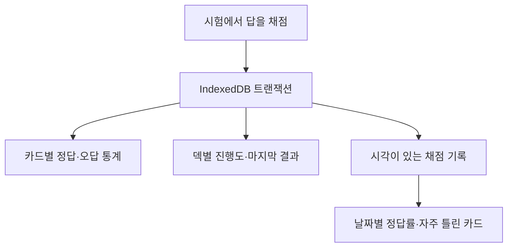

title: "Memonowz: 내가 외울 것만 넣는 로컬 암기 PWA"
slug: memonowz-local-first-flashcard-pwa
category: 개인 프로젝트
summary: 내가 외울 단어·객관식·면접 질문을 브라우저에 저장하는 암기 PWA를 만들었다. 실제 학습 흐름, 복사해 쓸 수 있는 JSON 예시, 덱 가져오기와 통계를 보존하는 전체 백업의 차이를 정리했다.
tags: dexie,indexeddb,local-first,pwa,react,typescript,vite,zod
toc: true
publishedAt: 2026-08-29T11:32:51.721193Z
updatedAt: 2026-10-06T11:25:14.514Z
syncHash: 586a82fb432842f664d2f23de9e94126f8c0321bd5f0ab80e75aab1b874e7169

---

단어를 외우려고 단어장 앱을 열었다가, 기출문제를 풀 때는 문제은행 앱으로 옮기고, 면접 질문을 정리할 때는 다시 메모 앱을 켰다. 외우려는 자료는 내가 이미 갖고 있었지만, 반복해서 풀기 좋은 모양으로 옮기는 일이 따로 필요했다.

그래서 Memonowz를 만들었다. 단어와 용어는 보기 중에서 고르고, 긴 면접 답변은 떠올린 뒤 카드를 뒤집어 확인한다. 내가 만든 자료를 덱에 넣고, 틀린 것만 다시 풀고, 중간에 나갔다가 이어가는 데 초점을 맞췄다.

계정과 애플리케이션 백엔드는 없다. 카드와 채점 기록은 접속한 주소의 브라우저 IndexedDB에 저장한다. 설치형 PWA로 만들었지만 기기 사이에서 자동으로 동기화되는 서비스는 아니다. 자료를 옮길 때는 JSON 파일과 전체 백업을 사용한다.

[Memonowz 실행하기](https://memonowz.vercel.app) · [GitHub에서 코드와 카드 작성 가이드 보기](https://github.com/jaymunsh/memonowz)


## 카드 유형과 학습 방식을 따로 정했다

카드의 입력 형식은 `term`과 `mcq` 두 가지다. 짧은 용어와 긴 질문을 별도 유형으로 계속 늘리기보다, 카드에 무엇을 저장하는지와 답을 어떻게 확인하는지를 나눴다.

| 카드 유형 | 필수 항목 | 단어장 덱에서 시험볼 때 |
|---|---|---|
| `term` | 앞면 `front`, 뒷면 `back` | 오답 보기를 만들고 정답을 고른다 |
| `mcq` | 질문 `question`, 보기 `choices`, 정답 위치 `answer` | 작성한 보기의 순서를 섞어 출제한다 |

덱에는 **단어장**과 **플래시카드** 두 방식이 있다. 플래시카드는 `flipOnly: true`로 저장하며, 시험에서도 보기를 만들지 않고 답을 뒤집어 자가채점한다. 면접 질문은 `term`의 앞면에 질문, 뒷면에 답변을 넣고 플래시카드 덱으로 만들면 된다. `qa`라는 별도 카드 유형은 받지 않는다.

`term`의 오답 보기는 직접 지정한 `distractors`가 있으면 그 배열에서 가져온다. 생략하면 같은 덱에 있는 다른 단어 카드의 뒷면을 사용한다. 중복과 정답을 제외하고 최대 세 개를 골라 정답과 함께 섞는다.

오답 후보가 부족하면 2지선다나 3지선다로 나오고, 후보가 하나도 없으면 뒤집기로 바뀐다. 단어 카드 한 장만 넣어도 시험이 막히지 않는다. 다만 서로 무관한 개념을 한 덱에 모으면 자동 보기가 너무 쉬워질 수 있어, 헷갈리는 개념끼리 묶거나 오답 보기를 직접 적는 편이 낫다.

## 먼저 살펴보고 필요한 만큼만 시험보게 했다

덱 화면에서는 **공부하기**와 **시험보기**를 구분했다. 공부하기는 앞면과 정답을 넘겨 보는 과정이다. 유형에 관계없이 뒤집어 살펴보고, 채점이나 학습 기록은 남기지 않는다. 시험보기는 객관식이나 자가채점으로 결과를 기록한다.

처음 쓸 때는 다음 순서로 한 바퀴 돌아보면 된다.

1. 홈의 덱 만들기에서 이름과 덱 유형을 정한다. 설정의 예시 덱 넣기로 단어장과 플래시카드 덱을 먼저 살펴볼 수도 있다.
2. 덱 메뉴의 카드 추가로 한 장씩 쓰거나, 불러오기에서 파일·텍스트로 여러 장을 넣는다.
3. 공부하기로 답을 살펴본 뒤, 학습 설정에서 순서와 장수를 정해 시험보기로 들어간다.
4. 결과에서 틀린 것만 다시 풀거나, 덱의 틀림 필터를 켜서 오답을 모아 시험본다.

출제 대상은 현재 검색과 유형·태그·틀림·핵심 필터에 맞는 카드다. 순서는 랜덤순과 글자순 중에서 고르고, 한 번에 풀 양은 10장·20장·50장·전체로 정한다. 단어장 덱의 단어 카드에는 문제마다 10초 제한을 켤 수 있다.

오답을 자동으로 앞에 몰아 놓는 알고리즘은 쓰지 않는다. **무엇을 다시 풀지는 필터로 고르고, 고른 카드의 순서는 별도로 정한다.** 틀림 필터는 한 번이라도 틀려 `stats.wrong`이 0보다 큰 카드가 대상이다. 별표로 핵심 카드를 모아 두는 방식도 같은 흐름을 사용한다.

진행 중인 시험이 있으면 이어하기가 먼저 보이고, 새 시험과 조건 변경은 접힌 학습 설정에 둔다. 마지막 순서·장수·시간 제한 선택은 브라우저에 기억한다. 이어하기는 이미 시작한 시험의 순서와 조건을 유지한다.

카드 목록은 정답을 기본으로 숨긴다. 목록을 읽다가 먼저 답을 보게 되는 일이 있어 정답 표시를 선택했을 때만 펼치고, 이 선택도 기억하게 했다.


## 두 열짜리 자료는 그대로 붙여넣게 했다

용어와 뜻만 있는 자료라면 JSON을 만들 필요가 없다. Excel이나 Google Sheets에서 **앞면·뒷면 두 열의 데이터만, 제목 행 없이** 복사한 뒤 덱 메뉴 → 불러오기 → 붙여넣기에 넣는다. 기본값은 한 줄에 한 장, 탭으로 앞뒤 나누기다.

| 앞면 | 뒷면 |
|---|---|
| cohesion | 응집도 |
| coupling | 결합도 |

붙여넣기는 `term` 카드로 변환한다. 위 표처럼 두 열을 준비하면 되고, 제목 행을 같이 넣으면 제목도 카드가 되므로 빼고 복사한다. 세 번째 열 이후의 내용은 별도 태그나 설명으로 읽지 않는다.

메모에 `cohesion::응집도`처럼 적어 뒀다면 앞뒤 나누기를 직접 입력으로 바꾸고 `::`를 넣는다. 쉼표도 고를 수 있지만 첫 쉼표 뒤의 내용은 전부 뒷면으로 남는다. 따옴표와 이스케이프를 처리하는 CSV 파일 파서는 아니다.

입력 즉시 저장할 카드 수와 처음 세 장의 앞뒤를 보여 준다. 구분자가 없거나 앞뒤가 비어 있는 행은 원문과 이유를 표시한다. 빠진 행을 고치거나 정상 카드만 넣기를 누를 수 있어, 잘못 붙인 자료가 조용히 사라지지 않게 했다.


## 설명과 객관식이 필요할 때는 JSON 파일로 넣는다

태그, 개념 설명, 직접 만든 객관식까지 담으려면 JSON 파일을 쓴다. 아래 예시는 그대로 복사해 UTF-8 텍스트 파일 `web-basics.json`으로 저장할 수 있다. 코드블록의 시작과 끝에 있는 백틱은 파일에 넣지 않는다.

```json
[
  {
    "type": "term",
    "front": "cohesion",
    "back": "응집도",
    "distractors": ["결합도", "복잡도", "추상화"],
    "tags": ["소프트웨어설계"],
    "explanation": "한 모듈 안의 요소가 같은 목적에 모인 정도다. 모듈 사이의 의존 정도인 결합도와 구분한다.",
    "starred": true
  },
  {
    "type": "mcq",
    "question": "다음 중 원시값 비교가 아니라 객체 참조를 비교하는 식은?",
    "choices": ["'a' === 'a'", "1 === 1", "[] === []", "true === true"],
    "answer": 2,
    "tags": ["javascript"],
    "explanation": "빈 배열 두 개는 서로 다른 객체다. 같은 모양이어도 참조가 달라 false다."
  }
]
```

가져오는 순서는 다음과 같다.

1. 카드를 넣을 덱을 열고 메뉴 → 불러오기 → JSON 파일을 고른다.
2. 저장한 `.json` 파일을 선택한다. JSON 텍스트를 붙여넣는 칸은 없다.
3. 저장 전 미리보기에서 앞면·정답·설명과 카드 수를 확인한다.
4. 오류가 없으면 장수 넣기를 누른다. 일부 카드가 틀렸다면 항목 번호와 이유를 보고 고치거나 정상 카드만 넣는다.

`answer`는 **원본 `choices` 배열에서 0부터 센 위치**다. 위 예시의 `2`는 세 번째 보기 `[] === []`를 가리킨다. 보기 네 개라면 0·1·2·3 중 하나여야 한다. 시험 화면은 보기를 섞지만 원래 인덱스를 함께 옮기므로 JSON의 정답 위치는 바꿀 필요가 없다.

| 필드 | 규칙 |
|---|---|
| `type` | `term` 또는 `mcq` |
| `front`, `back` | 단어 카드의 비어 있지 않은 문자열 |
| `question` | 객관식 카드의 비어 있지 않은 질문 |
| `choices` | 비어 있지 않은 문자열을 두 개 이상 담은 배열 |
| `answer` | 0 이상의 정수이며 보기 개수보다 작아야 한다 |
| `distractors` | 단어 카드에만 쓰는 선택적 오답 보기 배열 |
| `tags` | 선택 사항. 문자열 배열이며 생략하면 빈 배열 |
| `explanation` | 선택 사항. 채점 뒤 확인할 설명 문자열 |
| `starred` | 선택 사항. `true`면 핵심 표시, 생략하면 `false` |

카드 작성용 파일에는 `id`, `deckId`, `stats`를 넣지 않는다. 앱이 새 카드를 저장할 때 붙인다. 따옴표는 큰따옴표를 쓰고 마지막 항목 뒤에 쉼표를 달지 않는다. JSON에는 주석도 넣을 수 없다.

문서 전체가 JSON으로 읽히지 않으면 파일을 다시 고쳐야 한다. JSON은 읽혔지만 카드 일부가 스키마에 맞지 않는 경우에는 통과한 카드만 가져올 수 있다. 구문 오류와 카드 오류를 구분해 처리한 이유다.

## 덱 이름과 학습 방식도 파일에 담을 수 있다

카드 배열만 있는 파일은 이미 만든 덱에 추가할 때 쓰기 좋다. 새 덱까지 한 번에 만들려면 `deck`과 `cards`로 감싼다. 아래 파일을 `interview.json`으로 저장해 설정 → 백업 또는 덱 파일 가져오기에서 선택하면 플래시카드 덱이 생긴다.

```json
{
  "deck": {
    "name": "프론트엔드 면접 질문",
    "description": "답을 떠올린 뒤 뒤집어 확인하는 질문 모음",
    "flipOnly": true
  },
  "cards": [
    {
      "type": "term",
      "front": "디바운스와 스로틀의 차이를 설명해 보자.",
      "back": "디바운스는 마지막 호출 후 일정 시간 동안 새 호출이 없으면 실행하고, 스로틀은 정해진 간격마다 호출 빈도를 제한한다.",
      "tags": ["javascript", "performance"],
      "explanation": "검색 입력은 디바운스, 계속 발생하는 스크롤 이벤트의 호출 제한은 스로틀로 생각하면 구분하기 쉽다.",
      "starred": true
    },
    {
      "type": "term",
      "front": "목록의 key에 배열 인덱스를 쓰면 언제 문제가 생기나?",
      "back": "중간 삽입·삭제나 정렬로 항목의 위치가 바뀌면 다른 항목에 기존 상태가 재사용될 수 있다.",
      "tags": ["react"]
    }
  ]
}
```

`deck.name`은 새 덱 이름이다. `description`은 생략할 수 있고, `flipOnly`를 생략하거나 `false`로 쓰면 단어장 덱이다. 가져오기 확인 화면에서 덱과 카드 수를 보고 가져오기를 눌러야 실제 저장된다.

**같은 파일이라도 여는 위치에 따라 동작이 다르다.** 덱 화면의 불러오기는 현재 덱에 카드만 추가한다. 파일에 다른 덱 이름이나 `flipOnly: true`가 있어도 현재 덱의 이름과 유형을 바꾸지 않는다. 플래시카드로 바꾸려면 덱 편집 → 덱 유형에서 바꾼다.

설정의 가져오기는 파일의 덱 정보로 새 덱을 만든다. 카드 배열만 있는 파일은 이름이 없어 건너뛰므로, 설정에서 넣을 파일에는 `deck.name`을 포함해야 한다.

<details>
<summary>덱 여러 개를 한 파일에 담는 예시</summary>

각 덱을 `decks` 배열에 넣는다. 아래는 단어장과 플래시카드를 하나씩 만드는 완전한 JSON이다.

```json
{
  "decks": [
    {
      "deck": {"name": "영단어", "flipOnly": false},
      "cards": [
        {"type": "term", "front": "cohesion", "back": "응집도"},
        {"type": "term", "front": "coupling", "back": "결합도"}
      ]
    },
    {
      "deck": {"name": "설계 질문", "flipOnly": true},
      "cards": [
        {
          "type": "term",
          "front": "응집도와 결합도는 어떤 방향으로 설계하는가?",
          "back": "한 모듈의 응집도는 높이고 모듈 사이의 결합도는 낮추는 방향을 지향한다."
        }
      ]
    }
  ]
}
```

설정에서 가져오면 덱이 각각 생긴다. 덱 화면에서 가져오면 모든 덱의 카드가 현재 덱 하나에 추가된다. 후자는 여러 덱을 복원하는 용도가 아니다.

</details>

## 카드 생성은 외부 도구에 맡기고 검증은 앱에서 한다

강의 노트나 기술 문서를 카드로 바꾸는 생성기는 앱에 넣지 않았다. 대신 사람이 직접 작성하거나 외부 AI로 만든 JSON을 받아, 같은 카드 스키마로 검증한다. 파일을 받아들이는 형식 검증과 정답의 사실 확인은 별개다. 문법이 맞아도 오답이나 부정확한 설명이 들어갈 수 있다.

외부 모델을 사용할 때는 다음처럼 출력 형식과 카드의 기준을 함께 준다. 주제와 장수는 내가 공부할 자료에 맞춰 바꾼다.

```text
아래 자료에서 암기 카드를 만들고 JSON 배열만 출력해라.
설명 문장, 주석, Markdown 코드펜스는 출력하지 마라.

단어 형식:
{"type":"term","front":"용어","back":"짧은 정의","tags":[],"explanation":"구분 기준"}
객관식 형식:
{"type":"mcq","question":"질문","choices":["보기1","보기2","보기3","보기4"],"answer":0}

answer는 0부터 센 정답 위치다. choices는 네 개로 만들어라.
한 카드에는 한 개념만 넣어라.
오답은 정답과 비슷한 길이와 같은 범주의 개념으로 만들어라.
explanation에는 답의 반복보다 헷갈리는 개념과의 차이를 써라.
id, deckId, stats는 넣지 마라.
중요한 카드에만 starred: true를 추가해라.
자료에 없는 사실은 추측해서 채우지 마라.

주제: 내가 제공한 소프트웨어 설계 노트. 단어 10장, 객관식 5장.
```

받은 배열을 `.json` 파일로 저장하고 덱의 JSON 파일 불러오기에 넣는다. 미리보기에서 정답과 설명을 확인하고, 필요하면 가져온 뒤 카드 편집으로 고친다. 특히 객관식은 정답만 유난히 길거나 오답이 터무니없으면 암기보다 보기 모양을 익히게 된다.

## 채점과 이어하기와 날짜별 기록을 함께 저장한다

학습 기록은 시험이 끝날 때 모아서 쓰지 않는다. 답을 채점할 때 카드 통계, 세션 진행도, 채점 이벤트를 하나의 IndexedDB 트랜잭션으로 저장한다. 중간에 나가도 이미 푼 만큼은 남고, 저장에 실패하면 다음 문제로 넘어가지 않는다.

같은 답의 저장을 다시 시도해도 횟수가 중복으로 올라가지 않게 했다. 세션 식별자와 채점 위치로 기록을 식별하고, 이미 저장한 진행도와 비교한다. 화면에서 답을 눌렀다는 사실과 저장이 끝났다는 사실을 구분하는 것이 핵심이었다.

진행도와 마지막 결과는 덱마다 한 건씩 둔다. 다른 덱을 공부해도 앞 덱의 이어하기가 사라지지 않는다. 새 시험을 시작하면 해당 덱의 마지막 결과는 교체되지만, 과거 채점 이벤트는 남는다. 카드가 삭제되면 세션에서 그 카드만 빼고 이미 푼 살아 있는 카드의 진행도를 유지한다.



학습 기록에서는 모든 덱 또는 덱 하나를 골라 날짜별 푼 수·정답 수·정답률과 자주 틀린 카드를 본다. 날짜는 현재 기기의 시간대 기준이고, 중간에 끝낸 시험도 포함한다. 자주 틀린 카드에는 오답 횟수 기준 상위 열 장을 보여 준다.

과거 버전의 누적 통계에는 답마다 날짜가 없었다. 데이터베이스는 Dexie 버전 3에서 채점 이벤트 저장소를 추가했지만, 없던 날짜를 추정해 과거 기록을 만들지는 않았다. 날짜별 기록은 이 기능 이후 실제로 채점한 답부터 쌓인다.


카드를 지우거나 외웠어요로 현재 틀림 횟수를 지워도 지난 채점 기록은 남는다. 현재 오답 필터와 과거 오답 기록의 역할이 다르기 때문이다. 덱 자체를 삭제하면 그 덱의 학습 기록도 함께 삭제한다.

## 자료 공유와 전체 백업은 다른 파일로 내보낸다

덱 내보내기는 다른 사람이나 다른 덱으로 **카드 내용을 옮기는 파일**이다. 전체 백업은 **내 학습 상태까지 옮기는 파일**이다. 둘 다 JSON이지만 포함하는 정보가 다르다.

| 내보내는 위치 | 형식과 포함 내용 | 설정에서 가져올 때 |
|---|---|---|
| 덱 메뉴 → 덱 내보내기 | `{ deck, cards }`. 덱 유형·카드 내용·핵심 표시 | 새 덱으로 추가. 통계는 새로 시작 |
| 설정 → 전체 백업 내보내기 | `version: 1`. 덱·카드·통계·생성 시각·세션·채점 기록 | 새 덱으로 추가하며 학습 상태도 복원 |

전체 백업은 앱에서 생성한 파일을 그대로 보관하는 편이 맞다. 카드 작성용 JSON에 통계 몇 줄을 붙인다고 전체 백업이 되지는 않는다. 저장된 덱·카드·세션 사이의 ID와 참조도 함께 맞아야 한다.

전체 백업의 최상위 항목은 `version`, `exportedAt`, `decks`, `cards`, `sessions`, `history`다. 버전은 현재 `1`이다. `history`는 이전 파일과의 호환을 위해 선택 항목이지만, 현재 내보내기는 날짜별 채점 기록도 담는다. 없는 기록을 복원 과정에서 만들어 채우지는 않는다.

다른 주소나 기기로 옮기는 순서는 다음과 같다.

1. 기존 주소에서 설정 → 전체 백업 내보내기로 파일을 다운로드한다.
2. 새 주소나 새 기기에서 앱을 열고 설정 → 백업 또는 덱 파일 가져오기에서 그 파일을 선택한다.
3. 확인 화면의 덱·카드 수와 학습 기록 복원 안내를 보고 가져오기를 누른다.
4. 덱과 이어하기를 확인한 뒤 백업 파일을 별도로 보관한다.

복원은 기존 데이터를 지우는 방식이 아니라 **새 덱으로 덧붙이는 방식**이다. 덱·카드·세션 식별자를 새로 만들고 세션과 채점 기록의 참조도 함께 바꾼다. 같은 파일을 두 번 가져오면 별도의 덱이 두 벌 생긴다. 자동 병합이나 중복 제거는 하지 않는다.

전체 백업을 덱의 불러오기에서 선택하면 카드 내용만 현재 덱에 추가된다. 통계와 이어하기를 복원하려면 설정에서 가져와야 한다. 글자 크기, 정답 표시, 마지막 학습 조건과 테마 같은 화면 설정은 전체 백업에 포함하지 않는다.


## 로컬 저장과 오프라인 실행의 경계를 드러냈다

데이터는 같은 기기라도 브라우저와 접속 주소가 바뀌면 따로 저장된다. `localhost`에서 쓰던 카드가 배포 주소에 자동으로 나타나지 않는 이유다. 프로토콜·도메인·포트가 달라지면 다른 저장소가 되므로 **주소를 바꾸기 전에 기존 주소에서 전체 백업을 내보낸다.**

브라우저 데이터를 지우거나 저장소가 정리되면 앱이 서버에서 다시 복구해 줄 수 없다. IndexedDB를 열지 못하는 환경에는 저장소 경고를 표시한다. 로컬 저장이라는 선택은 로그인 절차를 줄여 주지만, 자료를 보관하고 옮길 책임도 파일 백업으로 드러내야 한다.

설치 없이 브라우저에서 바로 사용할 수 있다. 홈 화면이나 독립 창으로 쓰려면 공개 앱 주소를 열고 브라우저의 설치 기능을 사용한다. iPhone의 Safari에서는 홈 화면에 추가, Android의 Chrome에서는 브라우저 메뉴의 앱 설치, 데스크톱 Chrome·Edge에서는 주소 표시줄의 설치 아이콘을 찾는다. 메뉴 위치와 지원 여부는 기기·브라우저에 따라 다르다. [MDN의 PWA 설치 안내](https://developer.mozilla.org/en-US/docs/Web/Progressive_web_apps/Guides/Installing)에 환경별 절차가 정리되어 있다.

PWA의 Service Worker는 앱 자산을 캐시하고, 덱과 학습 기록은 IndexedDB가 맡는다. 온라인에서 빌드된 앱을 한 번 열어 캐시가 준비된 뒤에는 오프라인에서 저장된 자료를 학습할 수 있다. 첫 접속과 앱 업데이트에는 네트워크가 필요하다.

한글 폰트는 모든 서브셋을 설치 때 미리 받는 대신 실제 사용한 범위를 실행 중 캐시한다. 오프라인에서 아직 캐시하지 않은 글자 범위를 읽으면 시스템 폰트로 보일 수 있다. 설치와 오프라인 동작은 개발 서버가 아닌 프로덕션 빌드에서 확인한다.

## 오래 읽고 반복하는 화면부터 다듬었다

배경은 아이보리 `#FAF6EC`, 강조색은 딥 페트롤 `#1F5A6B`를 쓰고, 서체는 IBM Plex Sans KR로 통일했다. 라이트·다크·시스템 테마를 제공하며 설정의 글자 크기에서 기본·크게·아주 크게를 고른다. 기준 크기는 16·18·20px이고 문제·답·입력창·보조 문구도 함께 커진다.

시험에서는 숫자키로 보기를 고르고 Space로 답을 보거나 다음 문제로 간다. 뒤집기 채점은 답을 본 뒤 1은 몰랐음, 2는 알았음이다. 공부하기는 Space와 방향키로 넘긴다. 입력창이나 편집 모달에서 타이핑할 때는 학습 단축키가 끼어들지 않는다.

시험 중 오타를 발견하면 그 자리에서 카드를 편집한다. 채점 뒤에는 방금 푼 카드를 계속 보여 주되, 저장된 진행 커서는 다음 카드를 가리키게 나눴다. 편집이나 결과 확인 때문에 시험 흐름을 다시 시작할 필요가 없게 했다.


React·TypeScript·Vite로 화면을 만들고, Dexie로 IndexedDB를 다루며, Zod로 입력과 백업의 계약을 검증한다. Vitest는 카드 스키마·파서·출제·트랜잭션·마이그레이션·백업을 검증한다. Playwright는 실제 브라우저의 IndexedDB로 편집·이어하기·새로고침·저장 실패 재시도·백업 복원을 확인한다.

## 남은 일은 카드 준비와 기기 이동을 줄이는 것이다

지금도 원문을 좋은 카드로 만드는 작업은 사람이 해야 한다. JSON의 형식은 앱이 검사하지만, 한 카드에 한 개념이 담겼는지와 정답·설명이 맞는지는 직접 확인해야 한다. 카드가 많아질수록 자동 생성보다 검토와 수정의 흐름이 더 중요해진다.

계정, 클라우드 동기화, 간격반복 스케줄러, 앱 안의 AI 생성기는 아직 없다. 날짜별 학습 기록을 쌓는다고 복습 시점을 자동으로 예약하는 것도 아니다. 여러 기기를 번갈아 쓸 때 파일을 직접 옮겨야 하는 불편은 남아 있다.

Memonowz에서는 내가 가진 자료를 넣고, 답을 떠올리고, 틀린 것을 골라 다시 푸는 흐름을 먼저 만들었다. 다음에 범위를 넓히더라도 이 흐름과 로컬 데이터의 이동 방법이 흐려지지 않게 다듬고 싶다.
