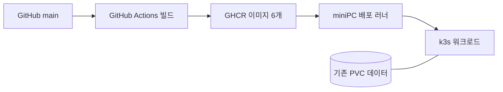
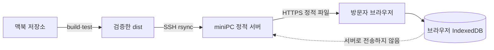
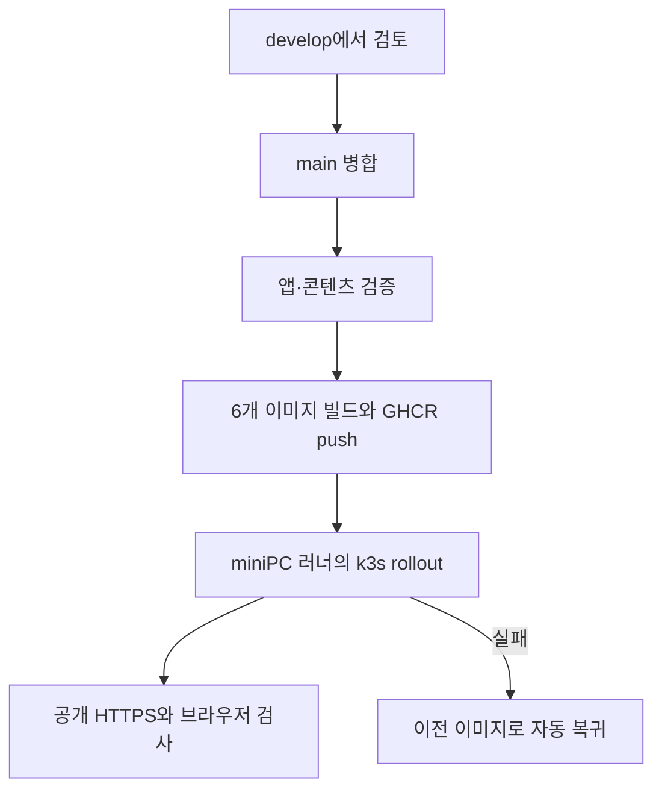
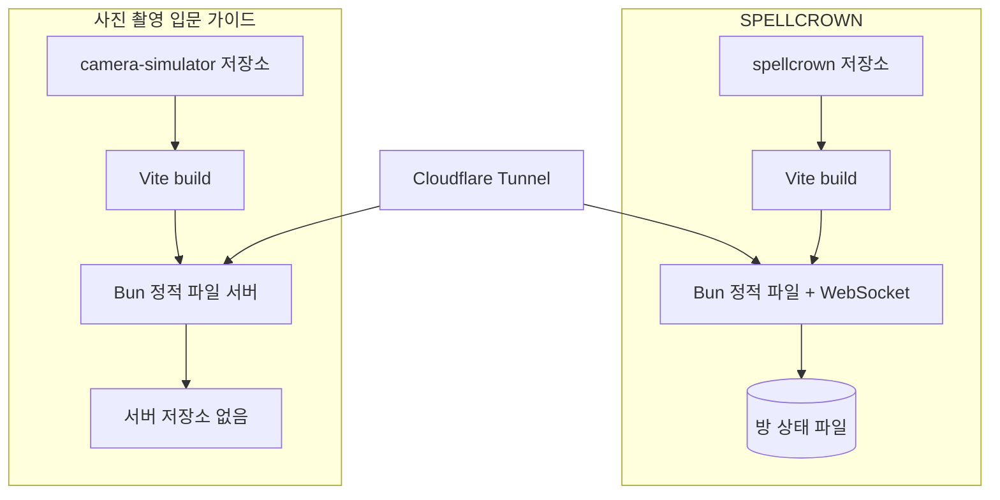

title: 같은 미니PC인데 배포 경로를 두 개로 나눈 이유
slug: minipc-k3s-and-systemd-deployment-paths
category: 개인 프로젝트
tags: homelab,deployment,k3s,systemd,cloudflare,bun,github-actions
summary: jay-wiki의 GitHub Actions·k3s 자동 배포와 SPELLCROWN·사진 촬영 입문 가이드의 독립 systemd 배포를 비교했다. 같은 미니PC에서도 앱의 상태와 운영 규모에 따라 배포 경계를 다르게 잡은 기록이다.
toc: true
syncHash: aafd942d70ee68a0df8e74146123bb8e37aa92f336564f8b6b2a531c9ea84c65
publishedAt: 2026-09-10T09:40:30.256156Z

---

사진 촬영 입문 가이드를 운영에 올리려다가 잠시 멈췄다. 이미 miniPC에는 jay-wiki와 SPELLCROWN이 돌아가고 있었지만, 둘의 배포 방식은 같지 않았다. 새 앱을 어느 쪽에 넣을지 결정하려면 먼저 왜 두 길이 생겼는지부터 다시 봐야 했다.

jay-wiki는 `main`에 코드가 들어가면 GitHub Actions가 검증, 이미지 빌드, k3s 반영과 공개 화면 확인까지 이어 간다. SPELLCROWN은 별도 저장소를 miniPC에 두고 Bun 프로세스를 systemd로 실행한다. 사진 촬영 입문 가이드는 후자의 구조를 따르기로 했다.

서버가 한 대라는 이유만으로 모든 앱이 같은 배포 장치를 가져야 하는 것은 아니었다. 중요한 차이는 저장소의 크기보다 **앱이 가진 상태와 실패했을 때 되돌려야 하는 범위**였다.

## 세 프로젝트는 같은 장비에서 서로 다른 책임을 가진다

| 구분 | jay-wiki·jay-blog | SPELLCROWN | 사진 촬영 입문 가이드 |
|---|---|---|---|
| 저장소 | `jay-wiki` 한 저장소 | 별도 `spellcrown` 저장소 | 별도 `camera-simulator` 저장소 |
| 실행 단위 | 여러 컨테이너와 k3s 워크로드 | Bun 프로세스 하나 | Bun 정적 파일 서버 하나 |
| 서버 상태 | PostgreSQL·Redis·OpenSearch·MinIO 등 | 진행 중인 방을 파일에 저장 | 서버 상태 없음 |
| 사용자 데이터 | 서버 데이터 계층 | 방 상태 파일 | 각 브라우저의 IndexedDB |
| 외부 연결 | Cloudflare Tunnel → Traefik → web | Cloudflare Tunnel → 호스트 프로세스 | Cloudflare Tunnel → localhost 프로세스 |
| 현재 배포 | GitHub Actions 자동 파이프라인 | 빌드 후 systemd 재시작 | 빌드·검사·전송 후 systemd 재시작 |

세 앱은 공개 진입점으로 Cloudflare Tunnel을 공유하지만 그 뒤의 운영 단위는 분리된다. Tunnel은 주소를 내부 서비스에 연결할 뿐, 어떤 앱을 k3s에 넣어야 하는지 결정하지 않는다.

## 먼저 배포 흐름을 두 갈래로 나눴다

jay-wiki는 한 변경이 여러 서비스와 데이터 계층에 영향을 줄 수 있다. 그래서 `develop`에서 변경을 모아 검토하고, `main` 병합을 배포 시작점으로 삼았다. GitHub Actions가 검사와 이미지 생성을 끝내면 miniPC 러너가 k3s 워크로드를 갱신하고, 실패하면 이전 이미지로 되돌린다.

SPELLCROWN과 사진 촬영 입문 가이드는 저장소 하나와 프로세스 하나가 각각 독립된 배포 단위다. 두 앱은 GitHub의 `main`에 코드가 들어가는 일과 miniPC의 실행 파일이 바뀌는 일을 분리했다. 검증한 산출물을 전송하고 해당 systemd 서비스만 다시 시작하므로 다른 앱과 데이터 계층까지 함께 교체하지 않는다.

| 단계 | jay-wiki·jay-blog | 독립 systemd 앱 |
|---|---|---|
| 코드 기준점 | `develop` 검토 후 `main` 병합 | 각 저장소의 `main` |
| 산출물 생성 | GitHub Actions의 컨테이너 빌드 | SPELLCROWN은 miniPC, 카메라 앱은 맥북에서 Vite 빌드 |
| 운영 반영 | GHCR 이미지 → miniPC 러너 → k3s rollout | SSH 파일 전송 → 해당 systemd 서비스 재시작 |
| 실패 감지 | 워크플로와 rollout 상태 검사 | 전송 스크립트와 서비스 상태 검사 |
| 복귀 | 이전 컨테이너 이미지로 자동 복귀 | 직전 산출물로 사람이 복귀 |

이 큰 흐름을 먼저 정하고 나니, 저장소 디렉터리와 miniPC의 실행 위치가 왜 분리됐는지도 자연스럽게 설명할 수 있었다.

## 결정한 경계가 디렉터리에도 그대로 나타난다

jay-wiki는 애플리케이션과 운영 설정이 한 저장소에 모인 형태다. GitHub Actions가 아래 경로의 변경을 보고 필요한 검증과 배포를 한 판으로 묶는다.

```text
jay-wiki/
├── .github/workflows/deploy.yml  # main push에서 시작하는 배포 파이프라인
├── web/                          # Next.js 화면과 BFF
├── spring/                       # Spring Boot 중심 API
├── services/
│   ├── payment-api/              # 결제 Saga 참여자
│   ├── shipping-api/             # 배송 Saga 참여자
│   └── partner-simulator/        # 외부 제휴 API 상대역
├── infra/
│   ├── k8s/                      # 워크로드·데이터·관측·배포 권한
│   └── opensearch/               # 검색 이미지 구성
├── content/wiki/                 # 검토한 위키 원문
├── posts/jay-blog/               # 블로그 초안과 자산 원본
└── scripts/                      # 배포·백업·콘텐츠 동기화·검증
```

SPELLCROWN은 화면과 서버가 한 저장소에 있지만 실행 프로세스는 하나다. `dist`는 다시 만들 수 있고, `.rooms.json`만 실행 중 생기는 상태다.

```text
spellcrown/
├── src/                          # React 게임 화면과 규칙
├── server/                       # Bun HTTP·WebSocket 서버
├── public/                       # 카드·왕관·배경음악 등 정적 자산
├── docs/                         # 배포와 서버 운영 정책
├── dist/                         # Vite가 만드는 배포 산출물
└── .rooms.json                   # 진행 중인 방 상태, 런타임에 생성
```

사진 촬영 입문 가이드는 구조가 더 단순하다. `public/assets`가 크지만 전부 다시 배포할 수 있는 3D 모델과 텍스처다. 서버가 새로 만드는 데이터 파일은 없다.

```text
camera-simulator/
├── src/
│   ├── camera/                   # 노출·초점·렌즈 계산
│   ├── render/                   # Three.js 렌더링과 촬영 효과
│   └── scene/                    # 정원과 피사체 구성
├── public/
│   ├── assets/                   # GLB·환경 텍스처·가이드 이미지
│   └── camera-guide.html         # 함께 읽는 종합 가이드
├── server/index.ts               # localhost 정적 파일 서버
├── ops/
│   ├── deploy-minipc.sh          # 빌드·검사·파일 전송
│   ├── install-minipc.sh         # systemd·Tunnel 최초 설정
│   └── camera-simulator.service  # 프로세스 재시작 정책
├── tests/                        # 계산·저장소·브라우저 검사
└── dist/                         # Vite가 만드는 배포 산출물
```

miniPC에서도 둘을 jay-wiki의 k3s 데이터 디렉터리 안에 넣지 않는다. 저장소와 실행 디렉터리가 서비스별로 나뉘고, systemd는 각 디렉터리의 서버 진입점만 실행한다.

| miniPC 위치 | 역할 | 영속 데이터인가 |
|---|---|---|
| `/home/jaymunsh/spellcrown` | 게임 빌드·서버·방 상태 | `.rooms.json`만 해당 |
| `/home/jaymunsh/camera-simulator` | 카메라 가이드 빌드·정적 서버 | 없음 |
| `/var/lib/rancher/k3s/storage` | jay-wiki 데이터와 관측 PVC | 해당 |

이 구분 덕분에 카메라 앱을 다시 배포해도 PostgreSQL·Redis·검색 저장소를 건드리지 않는다. 반대로 k3s의 데이터 복구 절차가 카메라 앱의 정적 파일까지 책임지는 것처럼 오해하지 않게 된다.

k8s 안에서는 파일 디렉터리 대신 `namespace/리소스 종류/이름`으로 위치를 표현한다. 현재 운영 리소스를 서비스 관점으로 줄이면 다음과 같다.

```text
k3s 클러스터
├── frontend/
│   └── deployment/jaywiki-web        # 위키와 블로그 화면, BFF
├── backend/
│   ├── deployment/jaywiki            # 중심 Spring API
│   ├── deployment/jaywiki-payment-api
│   ├── deployment/jaywiki-shipping-api
│   └── deployment/jaywiki-partner-simulator
├── data/
│   ├── statefulset/pg-postgresql      # 위키·블로그 데이터
│   ├── statefulset/pg-services        # 분리 서비스 데이터
│   ├── statefulset/secure-search
│   ├── statefulset/security-redis
│   ├── statefulset/cache-redis
│   ├── statefulset/kafka
│   └── deployment/minio
└── obs/
    ├── deployment/prom-prometheus-server
    ├── deployment/graf-grafana
    ├── statefulset/loki
    └── statefulset/tempo
```

`jay-blog`라는 별도 Deployment는 없다. 도메인은 다르지만 화면은 `frontend/deployment/jaywiki-web`, API와 데이터는 jay-wiki의 backend와 PostgreSQL을 함께 쓴다. 저장소의 manifest는 이 운영 위치와 다음처럼 대응한다.

| 저장소 manifest | 운영 k8s 위치 |
|---|---|
| `infra/k8s/frontend/jaywiki-web.yaml` | `frontend/deployment/jaywiki-web` |
| `infra/k8s/backend/jaywiki.yaml` | `backend/deployment/jaywiki` |
| `infra/k8s/backend/jaywiki-*-api.yaml` | `backend/deployment/jaywiki-*-api` |
| `infra/k8s/data/*.yaml`·`*-values.yaml` | `data` namespace의 StatefulSet·Deployment·Service |
| `infra/k8s/observability/*-values.yaml` | `obs` namespace의 관측 리소스 |

반면 `deployment/spellcrown`이나 `deployment/camera-simulator`는 어느 namespace에도 없다. 둘은 k3s 워크로드가 아니라 호스트의 `spellcrown.service`와 `camera-simulator.service`다. 그래서 둘을 찾을 때는 `kubectl get pods`가 아니라 systemd 상태와 각 `/home/jaymunsh/...` 디렉터리를 확인해야 한다.

## 구조를 정한 뒤 파일과 사용자 데이터의 이동을 분리했다

여기서 말하는 전송은 하나가 아니다. 소스 코드, 빌드 산출물, 컨테이너 이미지와 사용자가 만든 데이터를 구분해야 한다. 같은 SSH 연결을 사용하더라도 무엇을 나르는지에 따라 복구 책임이 달라진다.

| 프로젝트 | 운영으로 이동하는 것 | 이동 경로 | 일반 배포에서 이동하지 않는 것 |
|---|---|---|---|
| jay-wiki | 커밋 SHA가 붙은 컨테이너 이미지 6개 | GitHub Actions → GHCR → miniPC 러너 → k3s | PostgreSQL·Redis·검색·MinIO의 기존 데이터 |
| SPELLCROWN | Git 저장소 변경과 Vite `dist` | GitHub 저장소 → miniPC `git pull` → miniPC에서 빌드 | 실행 중 생성된 `.rooms.json` |
| 사진 촬영 입문 가이드 | Vite `dist`, 정적 서버와 systemd 설정 | 맥북에서 빌드·검사 → SSH `rsync` → miniPC | 사용자가 촬영한 사진과 설정 |

jay-wiki는 GitHub의 빌드 러너가 이미지를 만들고 GHCR에 올린다. miniPC의 제한된 러너는 해당 SHA 이미지를 받아 k3s Deployment를 갱신한다. 정상 배포는 기존 PVC 데이터를 복사하지 않는다. 배포 전에 별도 데이터베이스 백업을 실행하고, 워크로드만 새 이미지로 교체한다.



SPELLCROWN은 miniPC 안의 저장소에서 `git pull --ff-only`로 새 커밋을 받고 그 자리에서 Vite 빌드를 만든다. 빌드는 `dist`를 바꾸지만 진행 중인 방을 담은 `.rooms.json`은 건드리지 않는다. 서버 코드를 고쳤을 때만 Bun 프로세스를 재시작하고, 종료 과정에서 방 상태를 파일로 내린 뒤 다시 읽는다.

카메라 앱은 반대 방향이다. miniPC에서 소스를 받아 빌드하지 않고 맥북에서 검증한 `dist`를 보낸다. 현재 배포 스크립트의 핵심은 다음 세 전송이다.

```text
dist/                    ── rsync --delete ──▶ miniPC의 dist/
server/index.ts          ── rsync          ──▶ miniPC의 server/index.ts
camera-simulator.service ── rsync          ──▶ miniPC의 ops/
```

첫 전송은 GLB와 환경 텍스처를 포함해 약 227MB를 올리므로 시간이 걸린다. 그다음부터 `rsync`는 크기와 수정 시각을 비교해 달라진 파일만 보낸다. `--delete`는 로컬 `dist`에서 사라진 옛 빌드 파일을 원격 `dist`에서도 정리해, 더 이상 참조하지 않는 자산이 계속 쌓이는 것을 막는다.

이 과정에서 촬영 결과는 한 장도 이동하지 않는다. 브라우저가 만든 사진 Blob과 촬영 설정은 그 브라우저의 IndexedDB에만 남는다. 배포 스크립트에는 사진을 읽거나 올리는 API가 없고, miniPC에도 사진 저장 디렉터리가 없다. 같은 사용자가 다른 브라우저나 다른 도메인으로 접속하면 이전 촬영함이 나타나지 않는 이유도 이 경계 때문이다.



SSH 전송은 외부에 파일 수신 포트를 새로 공개하는 방식이 아니다. 기존에 관리용으로 사용하는 접근 경계를 통과해 miniPC 사용자 디렉터리에만 쓴다. systemd 설치와 Tunnel 설정처럼 시스템 파일을 바꾸는 최초 작업은 관리자 권한으로 분리했다. 일상적인 `dist` 갱신은 그 권한을 요구하지 않는다.

## jay-wiki의 자동 배포는 여러 서비스를 한 번에 검증한다

jay-wiki의 배포는 `develop`에서 변경을 모은 뒤 `main`으로 합치는 순간 시작한다. GitHub Actions의 검증 작업은 Spring, Next.js, 두 FastAPI 서비스와 파트너 시뮬레이터를 검사한다. 이어서 여섯 이미지를 커밋 SHA로 태그해 GHCR에 올리고, miniPC 러너가 k3s의 실제 이미지를 바꾼다.



이 정도 절차가 붙은 이유는 구성 요소가 많기 때문이다. web만 새 버전이고 backend는 옛 버전이면 요청 계약이 어긋날 수 있다. 배포 전에 데이터베이스 백업을 만들고, 위키 콘텐츠를 동기화하며, 여러 Deployment와 StatefulSet의 상태를 함께 확인해야 한다. 한 부분의 성공만으로 전체 배포가 끝났다고 말할 수 없다.

자동화의 대가도 있다. 작은 화면 수정 하나도 검증과 이미지 빌드를 지나야 하고, 파이프라인 자체의 권한과 롤백 절차를 계속 관리해야 한다. 대신 같은 커밋을 기준으로 무엇이 배포됐는지 추적할 수 있고, 중간 실패를 자동으로 멈추는 경계가 있다.

## 독립 앱은 저장소와 프로세스를 한 서비스 안에 묶었다

SPELLCROWN은 React 화면과 WebSocket 서버를 Bun 프로세스 하나가 함께 제공한다. miniPC의 systemd가 프로세스를 감시하고, Cloudflare Tunnel이 공개 주소를 호스트 포트에 연결한다. k3s의 Service나 Ingress를 통과하지 않는다.

사진 촬영 입문 가이드도 별도 저장소와 systemd 서비스를 선택했다. 정적 빌드에는 3D 인물, 고양이와 환경 텍스처를 포함해 약 227MB의 자산이 있지만, 운영 서버가 보관해야 할 촬영 데이터는 없다. 촬영 결과는 브라우저의 IndexedDB에 남고 서버로 전송되지 않는다.



카메라 앱의 프로세스는 외부 인터페이스가 아니라 localhost에서만 요청을 받게 했다. 공개 Host와 Origin을 허용 목록으로 제한하고, 큰 GLB 파일은 한 번에 메모리에 읽지 않고 스트리밍한다. 앱 파일은 miniPC에 있지만 공개 포트를 새로 열지는 않는다.

## PVC를 만들지 않은 이유는 데이터가 없기 때문이다

현재 k3s는 한 노드의 `local-path` StorageClass를 쓴다. PostgreSQL, 검색, Redis, Kafka, MinIO와 관측 도구가 PVC를 사용한다. 선언 용량을 모두 더하면 141GiB이고, 예전 검색·Redis 저장소 일부도 복구를 위해 남아 있다.

227MB 정적 자산이 있다는 사실만으로 PVC가 필요한 것은 아니다. 빌드 산출물은 다시 만들 수 있는 배포 파일이다. 카메라 앱에 PVC를 붙이면 재생성 가능한 파일을 데이터처럼 백업하고 복원해야 하는 책임만 늘어난다. 촬영 사진도 서버에 없으므로 별도 데이터베이스를 만들 이유가 없다.

SPELLCROWN은 다르다. 진행 중인 방을 파일로 저장하므로 프로세스를 재시작해도 판이 이어져야 한다. 현재는 호스트 작업 디렉터리의 파일이 그 역할을 맡는다. 같은 systemd 방식이어도 무상태인 카메라 앱과 상태가 있는 게임 서버의 복구 기준은 같지 않다.

## 수동 배포는 짧지만 자동 롤백도 없다

카메라 앱의 현재 배포 순서는 단순하다.

1. 로컬에서 TypeScript와 Vite 빌드를 실행한다.
2. 단위 테스트와 브라우저 테스트를 통과시킨다.
3. 바뀐 `dist`와 서버 파일을 miniPC로 전송한다.
4. systemd 서비스를 재시작한다.
5. Tunnel과 공개 URL에서 다시 확인한다.

jay-wiki처럼 main push가 곧 운영 배포는 아니다. GitHub의 main은 코드 기준점이고, 실제 운영 파일 전송은 별도 명령이다. 그래서 GitHub Actions 사용 시간과 컨테이너 이미지 빌드는 줄지만, 사람이 마지막 전송과 공개 검증을 잊을 수 있다.

| 실패 상황 | jay-wiki 자동 배포 | 독립 systemd 배포 |
|---|---|---|
| 테스트 실패 | 이미지 빌드 전에 중단 | 전송 스크립트가 중단 |
| 새 버전 기동 실패 | 이전 이미지로 자동 롤백 | systemd는 재시도하지만 이전 파일로 자동 복귀하지 않음 |
| 배포 이력 | GitHub 실행과 이미지 SHA | Git 커밋과 사람이 실행한 배포 기록 |
| 부분 반영 | 여러 워크로드를 파이프라인이 확인 | 파일 전송과 프로세스 재시작 사이를 사람이 관리 |
| 공개 화면 확인 | 워크플로에 포함 | 배포 직후 별도 확인 |

단순한 배포가 더 안전하다는 뜻은 아니다. 구성 요소가 적어서 실패 지점이 적을 뿐이고, 지금 카메라 앱에는 이전 `dist`를 보존해 즉시 되돌리는 자동 롤백이 없다. 첫 배포 이후에는 릴리스 디렉터리와 심볼릭 링크를 두거나, 직전 산출물을 남기는 방식으로 보완할 수 있다.

## 첫 운영 반영에서 경계를 하나씩 확인했다

2026년 9월 10일 첫 배포에서는 약 227MB의 `dist`와 서버 파일을 먼저 `/home/jaymunsh/camera-simulator`로 전송했다. 그다음에만 관리자 권한을 사용해 `camera-simulator.service`와 Cloudflare Tunnel 규칙을 설치했다. 서비스는 부팅 시 자동 시작하도록 등록했고 `127.0.0.1:4310`에서만 요청을 받는다.

Cloudflare DNS에는 `camera.leneu.cloud`를 기존 Tunnel로 보내는 프록시 CNAME을 추가했다. 공개 HTTPS 요청, HTML과 해시가 붙은 JS·CSS, 34MB GLB 파일이 모두 정상 응답하는 것을 확인했다. miniPC에서는 카메라 서비스와 Tunnel이 모두 `active`였고, 로컬 Host 검사를 포함한 상태 확인도 200을 반환했다.

이 순서를 지키면 DNS가 먼저 열려 준비되지 않은 프로세스로 요청이 들어오는 시간을 줄일 수 있다. 또한 Tunnel 재시작으로 관리용 SSH 연결이 잠시 끊길 수 있으므로, 재접속한 뒤 systemd·리스닝 주소·공개 HTTPS를 다시 확인하는 단계까지 첫 설치에 포함했다.

## 자동화할 기준을 앱 크기가 아니라 반복 횟수로 잡았다

독립 앱도 수정이 잦아지면 수동 전송이 먼저 약점이 된다. 다음 조건이 생기면 저장소별 GitHub Actions를 붙이는 편이 낫다.

- 운영 반영을 자주 해서 전송 명령을 빼먹기 시작한다.
- 어느 커밋이 운영 중인지 즉시 확인해야 한다.
- 배포 전후 스크린샷이나 성능 기준을 매번 같은 방식으로 남겨야 한다.
- 여러 사람이 같은 서비스를 배포한다.
- 이전 릴리스로 되돌리는 시간이 중요해진다.

그때도 camera-simulator를 jay-wiki 저장소 안으로 옮길 필요는 없다. 별도 저장소가 자체 빌드와 배포 워크플로를 가지고 miniPC의 해당 서비스만 갱신하면 된다. 저장소 분리와 자동화 여부는 서로 다른 결정이다.

이번에는 두 번째 작은 앱을 올리면서 기존 SPELLCROWN 방식을 복사하는 데서 끝내지 않았다. SPELLCROWN은 방 상태가 있고 카메라 앱은 무상태라는 차이를 먼저 적었다. 그 결과 카메라 앱은 k3s 스토리지를 쓰지 않고, 공개 경계와 프로세스만 독립적으로 운영하게 됐다.

남은 과제도 명확하다. camera-simulator에는 자동 롤백과 원격 배포 이력이 아직 없다. SPELLCROWN의 호스트 상태 파일도 k3s PVC와 같은 백업 체계에 자동으로 들어가지는 않는다. 작은 서비스가 두 개에서 더 늘어난다면 systemd 단위들을 별도 목록으로 관리하고, 배포·백업·공개 확인을 공통 스크립트로 묶을 시점이다.
