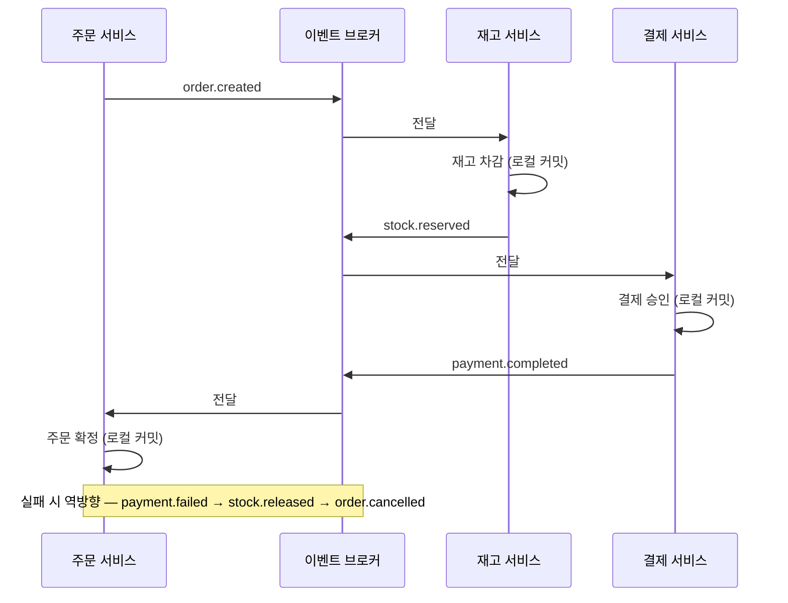
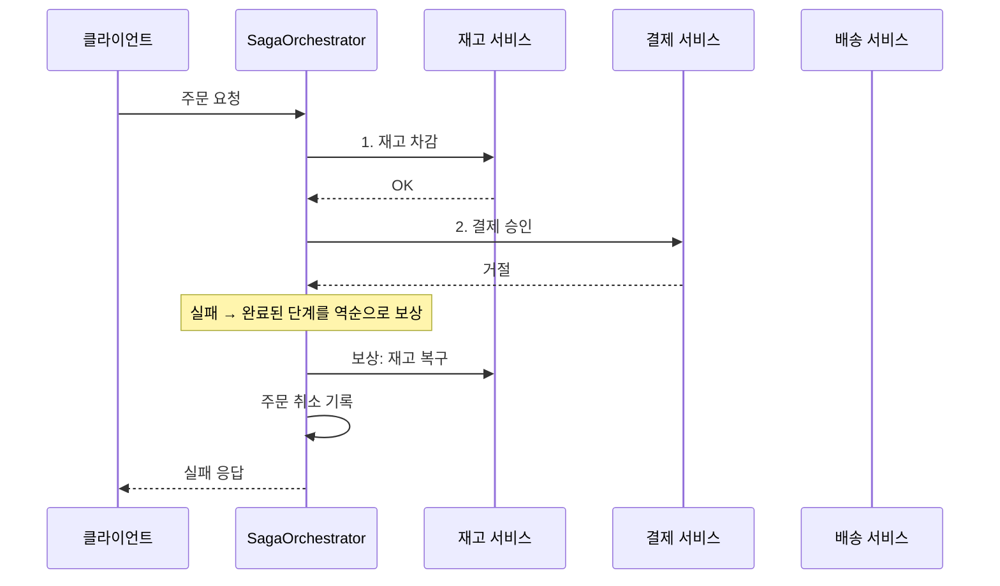

고객이 온라인몰에서 스니커즈 한 켤레를 주문하는 장면을 생각해 보자. MSA로 나뉜 서비스들에서 일어나는 일은 이렇다.

```
주문 서비스: 주문을 저장한다        (주문 DB)
재고 서비스: 해당 사이즈 재고를 1 뺀다 (재고 DB)
결제 서비스: PG에 카드 승인을 요청한다 (결제 DB)
배송 서비스: 물류사에 출고를 지시한다  (배송 DB)
```

네 단계가 전부 돼야 "주문 완료"다. 그런데 중간에 결제 승인이 거절되면? 주문은 저장됐고 재고는 빠졌다. 모놀리스라면 `@Transactional` 하나가 이 넷을 롤백해 줬을 것이다. MSA에서는 그게 안 된다 — 네 서비스가 **각자 다른 물리 DB**를 쓰므로 하나의 트랜잭션으로 묶을 방법이 없다.

SAGA는 이 문제를 **로컬 트랜잭션의 사슬**로 푼다. 각 서비스가 자기 DB에서 커밋하고 다음으로 넘기고, 중간에 실패하면 지금까지 커밋된 것을 **보상 트랜잭션**으로 되돌린다. 위 예라면 재고 `+1` 복구와 주문 취소가 보상이다. 이 글은 두 구현 방식(코레오그래피·오케스트레이션), Spring 기준 구현 코드, 그리고 실무에서 만나는 함정까지 정리한다.

## SAGA의 핵심 — 보상은 롤백이 아니다

가장 먼저 잡아야 할 개념이다. DB 롤백은 커밋 전 데이터로 되돌리는 것이다. SAGA의 보상은 **이미 커밋된 데이터를 다시 바꾸는 새로운 트랜잭션**이다.

주문 사가가 이렇게 간다고 하자.

```
주문 생성 → 재고 차감 → 결제 승인 → 배송 지시
```

결제 승인에서 실패하면:

```
결제 실패 → 재고 복구(보상) → 주문 취소(보상)
```

"재고 복구"는 재고 차감을 롤백하는 게 아니다. 차감은 이미 커밋됐으므로, `+N`을 기록하는 **별도의 UPDATE 트랜잭션**이다. 그 사이 다른 주문이 재고를 읽고 쓴 수치가 보존된다 — 그래서 보상 트랜잭션은 항상 "반대 업무"이지 "과거로 되감기"가 아니다.

이 차이 하나가 SAGA의 모든 설계를 설명한다: **커밋과 커밋 사이에 중간 상태가 외부에 보인다.**

## 두 구현 방식 — 코레오그래피와 오케스트레이션

이름이 음악·춤에서 왔다.

- **오케스트레이션(orchestration)** — 지휘자가 있는 오케스트라다. 중앙의 "오케스트레이터"가 순서를 정하고 각 서비스를 차례로 부른다. 서비스들은 자기가 사가의 몇 번째인지 모른다.
- **코레오그래피(choreography)** — 지휘자 없는 안무다. 각 서비스가 "이 이벤트가 오면 나는 이걸 한다"는 동작만 알고, 중심 없이 서로의 이벤트에 반응해 전체가 진행된다.

| | 코레오그래피 | 오케스트레이션 |
|---|---|---|
| 진행 방식 | 각 서비스가 이벤트를 받아 다음 이벤트를 발행 | 중앙 오케스트레이터가 순서대로 호출 |
| 중심 | 없음(이벤트 브로커) | 있음(SagaOrchestrator) |
| 흐름 파악 | 코드를 다 뒤져야 전체가 보임 | 한 파일에 순서가 보임 |
| 실패 처리 | 각자 보상 이벤트를 발행 | 오케스트레이터가 역순 보상 |
| 어울리는 규모 | 단계 적고 참여자 적을 때 | 단계 많고 분기 복잡할 때 |
| 함정 | 순환 의존, "누가 뭘 듣는지" 추적 | 오케스트레이터가 단일 복잡도가 됨 |

둘 다 Spring에서 흔히 구현한다. 코레오그래피는 Kafka/RabbitMQ + 리스너 조합이 보통이고, 오케스트레이션은 오케스트레이터 서비스를 따로 두거나 주문 서비스가 겸한다.

## 구현 1 — 코레오그래피: 이벤트가 다음 일을 부른다

각 서비스는 "입력 이벤트 → 로컬 트랜잭션 → 출력 이벤트"를 반복한다. 실패하면 보상 이벤트를 거슬러 올라간다.



어느 서비스도 전체 그림을 모른다. 재고 서비스는 "order.created가 오면 차감하고 stock.reserved를 발행한다"만 안다.

**재고 서비스** — 주문 생성 이벤트를 받아 차감하고 결과를 발행한다.

```java
@KafkaListener(topics = "order.created")
@Transactional
public void onOrderCreated(OrderCreatedEvent e) {
    try {
        stockRepository.deduct(e.itemId(), e.quantity());
        eventPublisher.publish("stock.reserved",
            new StockReservedEvent(e.orderId(), e.itemId(), e.quantity()));
    } catch (OutOfStockException ex) {
        eventPublisher.publish("stock.reserve-failed",
            new StockReserveFailedEvent(e.orderId(), e.itemId(), e.quantity()));
    }
}
```

**주문 서비스** — 실패 이벤트를 받아 보상한다.

```java
@KafkaListener(topics = "stock.reserve-failed")
@Transactional
public void onReserveFailed(StockReserveFailedEvent e) {
    orderRepository.findById(e.orderId())
        .ifPresent(o -> o.cancel("재고 부족"));   // 보상 트랜잭션: PENDING → CANCELLED
}
```

- **장점**: 서비스끼리 서로를 모른다. 재고 서비스는 주문 서비스가 있는지도 모른다.
- **단점**: 사가가 커지면 "전체 흐름이 어디 있지?"가 된다. 이벤트 이름만으로는 순서와 실패 경로를 재건하기 어렵다.

## 구현 2 — 오케스트레이션: 지휘자가 순서를 쥔다

단계를 인터페이스로 정의하고, 오케스트레이터가 앞으로 실행·뒤로 보상한다.



```java
public interface SagaStep {
    void execute(SagaContext ctx);
    void compensate(SagaContext ctx);
}
```

```java
@Service
public class OrderSagaOrchestrator {

    // 실행 순서 = 선언 순서. 보상은 역순으로 간다.
    private final List<SagaStep> steps;

    public OrderSagaOrchestrator(List<SagaStep> steps) {
        this.steps = steps;
    }

    @Transactional(propagation = Propagation.NOT_SUPPORTED)
    public void run(Order order) {
        SagaContext ctx = new SagaContext(order);
        Deque<SagaStep> completed = new ArrayDeque<>();
        try {
            for (SagaStep step : steps) {
                step.execute(ctx);
                completed.push(step);
                sagaStateRepository.saveCheckpoint(order.id(), step.name());
            }
        } catch (Exception e) {
            compensateAll(completed, ctx);
            sagaStateRepository.markFailed(order.id());
            throw e;
        }
        sagaStateRepository.markDone(order.id());
    }

    private void compensateAll(Deque<SagaStep> completed, SagaContext ctx) {
        while (!completed.isEmpty()) {
            SagaStep step = completed.pop();
            try {
                step.compensate(ctx);          // 재고 복구, 결제 취소, ...
            } catch (Exception ce) {
                // 보상 실패는 재시도 큐로 — 여기서 포기하면 데이터가 어긋난 채 남는다
                compensationRetryQueue.push(step, ctx, ce);
            }
        }
    }
}
```

각 스텝은 외부 서비스 호출 + 자기 상태 기록을 한다.

```java
@Component
public class PaymentStep implements SagaStep {
    public void execute(SagaContext ctx) {
        paymentClient.approve(ctx.orderId(), ctx.amount());   // REST/messaging 호출
    }
    public void compensate(SagaContext ctx) {
        paymentClient.cancel(ctx.paymentId());                // 승인 취소 = 보상
    }
}
```

- **장점**: 실행 순서가 코드에 그대로 보이고, "지금 어느 단계인가"를 상태 테이블로 추적할 수 있다.
- **단점**: 오케스트레이터가 전체를 아는 객체가 되어 복잡도가 몰린다. 팀이 나뉘면 오케스트레이터 수정이 여러 팀의 변경을 모은다.

## 빼면 안 되는 장치 셋

방식과 무관하게 SAGA를 굴리려면 아래 셋이 필요하다.

### 1. 아웃박스 — DB 쓰기와 이벤트 발행을 한 트랜잭션으로

로컬 트랜잭션에서 DB에 쓰고 이벤트를 브로커에 직접 보내면, 커밋 직후 브로커 발행이 실패해 "DB는 바뀌었는데 이벤트는 없는" 상태가 생긴다. 아웃박스 패턴은 이벤트를 **같은 DB의 outbox 테이블에 로컬 트랜잭션으로 함께** 쓰고, 별도 릴레이가 테이블을 읽어 브로커에 옮긴다.

```java
@Transactional
public void createOrder(OrderRequest req) {
    Order order = orderRepository.save(Order.pending(req));
    // 같은 트랜잭션 — 둘 다 되거나 둘 다 안 된다
    outboxRepository.save(OutboxEvent.of("order.created", order));
}
```

릴레이는 폴링이든 CDC(Debezium)든 된다. "이벤트가 적어도 한 번 나간다"가 보장되어야 사슬이 끊기지 않는다.

### 2. 멱등 소비자 — 같은 이벤트를 두 번 받아도 한 번만 처리

브로커는 at-least-once라 중복이 온다. 재고 차감을 두 번 하면 재고가 빠진다. 소비자 쪽에서 처리 기록을 남긴다.

```java
@KafkaListener(topics = "order.created")
@Transactional
public void onOrderCreated(OrderCreatedEvent e) {
    if (processedRepository.existsByEventId(e.eventId())) return;  // 멱등
    stockRepository.deduct(e.itemId(), e.quantity());
    processedRepository.save(Processed.of(e.eventId()));
}
```

### 3. 사가 상태와 타임아웃 — 어느 단계인가, 얼마나 기다릴 것인가

사가가 중간에 멈추면(PENDING인 채 다음 이벤트가 안 오면) 누군가 회수해야 한다. 오케스트레이션은 체크포인트 테이블로, 코레오그래피는 각 서비스의 상태+스케줄러로 "오래된 PENDING을 찾아 보상 트랜잭션을 건다"를 만든다. `@Scheduled`로 PENDING N분 경과 주문을 찾아 취소 이벤트를 거는 것이 흔한 형태다.

## 격리가 없다 — 중간 상태가 보인다

SAGA가 주는 것은 원자성뿐이고 **격리(isolation)는 없다.** 재고 차감 커밋과 결제 커밋 사이에, 다른 요청이 "차감된 재고"를 읽는다. 주문도 "처리 중"인 상태로 조회된다. 이것이 분산 환경의 대가다.

실무 대책은 네 가지다:

- **시맨틱 락**: 주문을 `PENDING`으로 만들어 "처리 중"임을 상태로 표시한다. 다른 사가나 읽기가 이 상태를 보고 기다리거나 거부한다. 가장 많이 쓰인다.
- **교환 가능한 갱신**: 재고 차감을 `stock = stock - N`처럼 순서 무관한 연산으로 만들어, 뒤섞여도 결과가 같게 한다.
- **비관적 읽기**: 조회가 "최종 상태"만 보도록 PENDING을 숨긴다. 단순하지만 정합성이 확실하다.
- **버전 기록**: 사가가 변경한 값에 버전을 붙여 늦게 도착한 갱신이 덮지 않게 한다.

완전한 격리는 포기하고, **중간 상태를 "보이되 안전하게"** 만드는 것이 방향이다.

## 보상이 안 되는 작업 — pivot을 정한다

모든 단계가 보상 가능한 것은 아니다. 이메일 발송은 보낸 뒤에 되돌릴 수 없다. 배송 출발 지시가 물류사 시스템에 넘어간 뒤에는 회수가 어렵다.

그래서 사가를 세 구간으로 나눠 생각한다.

- **보상 가능 구간**: 되돌릴 수 있다(재고, 결제 전).
- **pivot**: 이 지점을 넘으면 되돌릴 수 없다. 여기서 실패하면 재시도가 답이다(보상이 아니라).
- **재시도 구간**: pivot 이후 — 보상이 아니라 완료까지 재시도.

주문 사가라면 "결제 승인"이 pivot 후보다. 승인 취소는 수수료·정산 문제를 만들어 되돌리는 비용이 크다. 그래서 그 전 단계까지는 보상으로 돌아가고, 승인 이후 문제는 재시도로 마무리하는 설계가 많다. 어느 지점을 pivot으로 둘지는 기술이 아니라 업무 결정이다.

## 실무 시나리오 — 주문 사가가 실패할 때

이커머스 주문을 오케스트레이션으로 짠다고 하자.

```
1. 주문 생성(PENDING)     2. 재고 차감        3. 결제 승인       4. 배송 지시
   ↓ 실패 시               ↓ 실패 시           ↓ 실패 시          ↓ 실패 시
   (없음)                 주문 취소          재고 복구+주문 취소  결제 취소+재고 복구+주문 취소
```

| 실패 지점 | 보상 순서 |
|---|---|
| 재고 부족 | (앞 단계 없음) — 주문만 `CANCELLED` |
| 결제 거절 | 재고 `+N` 복구 → 주문 `CANCELLED` |
| 배송 지시 실패 | 결제 취소 → 재고 복구 → 주문 `CANCELLED` |
| 배송사 응답 지연 | 보상이 아니라 타임아웃 감지 → 재시도 또는 수동 개입 |

표의 마지막 행이 pivot 이후의 모습이다 — 결제가 이미 났으므로 되돌리기보다 완료까지 밀고 간다.

### 장애가 났던 밤 — 한 시간의 기록

개념들이 실제로 어떻게 움직이는지, 시간 순서로 따라가 본다. 아래는 이해를 위한 **가상의 사례**이고, 구조는 오케스트레이션이다.

**20:00** — 협업 한정판 스니커즈 "아틀라스 26" 300족의 플래시 세일이 열린다. 주문이 초당 수십 건 들어오고 사가가 평소대로 돈다: 주문 `PENDING` → 재고 차감 → 결제 승인 → 주문 확정.

**20:07** — PG 응답이 200ms에서 8초로 늘어난다. 승인 호출이 타임아웃 나기 시작한다. 오케스트레이터는 실패로 보고 보상을 돌린다: 재고 복구 → 주문 취소. 고객 화면에는 "결제 실패"가 뜬다. 이게 **정상적인 실패 경로**다 — 이 시간에 취소된 주문 수백 건은 데이터가 어긋나지 않았다.

**20:15** — 문제의 주문이 나온다. `O-48217`, 270mm 마지막 1족, 189,000원. 승인 요청은 PG에 도달했고 PG도 승인했는데, 응답만 돌아오지 않았다. 오케스트레이터 입장에서는 "실패"다. 보상으로 `결제 취소`를 호출한다 — 여기서 **보상 호출이 멱등해야 하는 이유**가 나온다. 승인이 실제로 됐으면 취소하고, 안 됐으면 "취소할 것 없음"으로 응답해야 한다. 취소 API가 "없는 승인"에 에러를 뱉으면 보상 자체가 막힌다.

**20:22** — 재고 서비스 인스턴스 하나가 죽는다. 결제가 타임아웃 난 주문 `O-48190`의 재고 복구 `compensate`가 실패한다. 오케스트레이터는 포기하지 않고 **보상 재시도 큐**에 넣는다. 그 3분 동안 고객 화면의 270mm는 "품절"로 보였다 — 주문은 취소됐는데 재고는 아직 안 돌아왔으므로. 인스턴스가 살아나 복구가 완료되고 품절이 풀린다. 재시도 큐가 없었다면 이 수치는 다음 날 재고 조사까지 틀어진 채였다.

**20:31** — 오케스트레이터가 배포로 재시작된다. 결제 응답을 기다리던 주문 `O-48233`이 진행 컨텍스트를 잃고 `PENDING`으로 멈춘다. 고객 화면에는 "주문 확인 중"이 계속 뜬다. **타임아웃 감지**가 "PENDING 10분 경과" 목록에서 이 주문을 찾아 보상 경로로 넣는다. 체크포인트 테이블에 "재고 차감까지 완료"가 기록돼 있어서 재고 복구부터 다시 시작할 수 있었다.

**21:05** — PG가 회복된다. 한 시간 동안 고객에게 보인 것을 정리하면: `PENDING`은 "주문 확인 중", 취소는 "결제 실패"로 보였다 — 중간 상태를 숨기는 대신 **상태로 표시**한 것이 시맨틱 락의 실례다. 재고 수치는 잠시 빠진 상태가 보였지만 `stock - N`/`+N`처럼 순서 무관한 갱신이라 최종값은 맞았다.

**사후** — `O-48217` 하나를 네 서비스 로그에서 따라가 봤다. trace id `b8f2…` 하나로 주문→재고→결제→주문의 커밋·실패·보상이 전부 이어졌다. 이게 안 되면 "승인은 됐는데 취소가 안 됐다"는 주문을 수작업으로 찾아야 한다.

이 시간에 겪은 네 가지 — 멱등 보상, 보상 재시도, 타임아웃 회수, 중간 상태 표시 — 가 앞의 "빼면 안 되는 장치"와 "격리 대책"이 존재하는 이유다.

## 함정 — 이야기가 안 보여준 둘

보상 실패와 관측성 문제는 위의 밤에 이미 나왔다. 그 밤에 안 일어난 함정이 둘 있다.

- **이벤트 순서 뒤바뀜.** `stock.released`가 `payment.completed`보다 늦게 도착하는 식의 역순은 일어난다. 상태 머신으로 "허용된 전이"를 제한하거나 버전으로 무시한다.
- **순환 의존.** 코레오그래피에서 A가 B 이벤트를 듣고 B가 A 이벤트를 들으면 서로가 서로를 부른다. 이벤트 소유권을 한 방향으로 유지한다.

## 언제 SAGA인가

- 서비스마다 DB가 따로 있고, 그 경계를 넘는 "전부 아니면 전부"가 필요할 때.
- 보상을 업무로 정의할 수 있을 때(되돌리기 불가능한 단계가 pivot으로 명확할 때).
- 반대로, 한 DB 안에서 `@Transactional`로 되는 일을 서비스를 나누려고 SAGA를 쓰는 것은 비용만 크다. SAGA는 "트랜잭션을 나눌 수밖에 없는" 상황의 답이지, 나누기 위한 수단이 아니다.

## 참고 자료

- Chris Richardson, *Microservices Patterns* — SAGA 정의와 격리 대책(semantic lock·commutative updates·pessimistic view·reread value·version file)의 원전
- Spring StateMachine — 사가 상태 전이를 선언적으로 둘 때 후보
- Debezium / Transactional Outbox — 아웃박스 릴레이의 표준 구현
