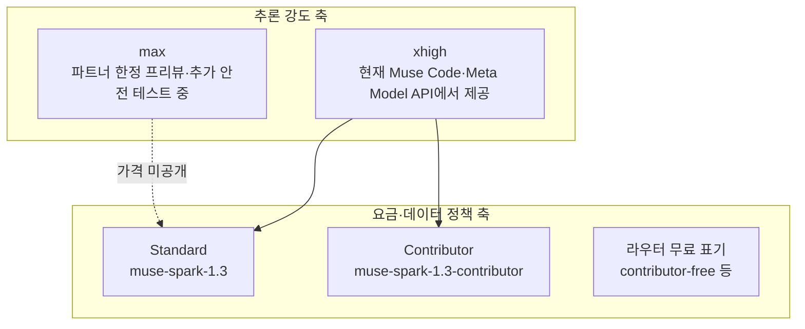
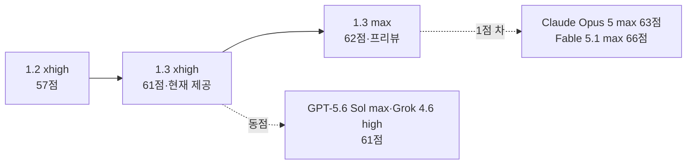

title: "Muse Spark 1.3 정리: Free·Contributor 구분부터 프론티어급 벤치마크까지"
slug: muse-spark-1-3-benchmark-guide
category: 리서치
summary: "2026년 9월 2일 공개된 Muse Spark 1.3의 xhigh·max·Contributor 구분과 Artificial Analysis 지수 61·62점의 의미를 정리하고, Meta 공개 스코어카드 11종과 가격 대비 성능을 경쟁 모델과 비교한 리서치."
tags: muse-spark,meta,muse-code,benchmark,artificial-analysis,agentic-coding,contributor,research
toc: true
publishedAt: 2026-09-04T15:21:00.933712Z
syncHash: 712a1351e4e9cfccaeaf4ab4788ebf5cba83ae6ed42bbe053fb413271a7d2ae1

---

> **이 글의 대상**: 2026년 9월 공개된 Meta의 Muse Spark 1.3이 어떤 모델인지 파악하고, 지금 쓸 수 있는 버전과 아직 못 쓰는 버전, 경쟁 모델 대비 위치, 비용 구조를 한 번에 확인하려는 개발자와 기술 리드.

> **출처 및 기준일**: 기능·가격·벤치마크 수치는 Meta 공개 자료와 [Artificial Analysis의 Muse Spark 1.3 분석](https://artificialanalysis.ai/articles/muse-spark-1-3)을 기준으로 정리했다. 판정 기준일은 2026년 9월 4일이다. 가격·리더보드·롤아웃 범위는 바뀔 수 있으므로, 도입 전에는 본문의 링크에서 최신 값을 다시 확인한다.

> 이 글에서 말하는 "Free"는 Meta 공식 요금제 이름이 아니다. Meta 공식 SKU는 Standard와 Contributor이며, 외부 라우터에서 Contributor 기반 무료 제공으로 표기되는 구간이 있다. 2장에서 구분한다.

## 1. 에이전트 코딩 비용과 버전 혼란이 먼저 해결해야 할 문제다

코딩 에이전트를 실무에 붙이면 질문 한 번에 끝나는 일이 드물다. 파일을 읽고, 테스트를 돌리고, 실패 로그를 해석하고, 다시 수정하는 루프가 수십 턴 이어진다. 클라우드 프론티어 API로 이 루프를 돌리면 토큰 청구액이 빠르게 쌓이고, 실패한 세션을 되돌릴 때마다 비용이 중복된다.

Muse Spark 1.3은 이 지점에서 주목받았다. Meta CEO가 공개 당일 "프론티어 성능을 거의 셀 수 없을 만큼 저렴하게"라고 소개했고, 독립 평가에서도 Intelligence Index 61점(xhigh)과 작업당 비용 0.55달러를 함께 기록했다. 다만 공개 자료를 그대로 읽으면 헷갈리는 대목이 세 가지 있다.

1. 지금 API와 Muse Code에서 쓸 수 있는 것은 "xhigh"이며, 점수가 더 높은 "max"는 파트너 프리뷰 단계다.
2. 요금표의 Contributor는 저렴한 대신 입력과 출력을 제품 개선에 활용할 수 있다는 조건이 붙는다.
3. Meta 런치 스코어카드의 일부 최고치는 max 기준이며, xhigh와 max를 섞어 읽으면 체감이 어긋난다.

그래서 이 글은 모델 소개보다 구분부터 시작한다. 무엇을 쓸 수 있고, 숫자가 어떤 조건에서 나온 것인지가 먼저다.

## 2. Free와 Contributor, xhigh와 max를 구분하다

Muse Spark 1.3을 둘러싼 이름은 두 축으로 읽어야 한다. 하나는 추론 강도(reasoning effort)이며, 다른 하나는 요금·데이터 정책이다.

### 2-1. 지금 확인할 사실

| 확인 항목 | 현재 확인된 사실 | 해석할 때의 주의점 |
|---|---|---|
| 공개일 | 2026년 9월 2일, 1.2 공개 약 4주 뒤 | 5개월 동안 네 번째 Muse Spark 릴리스이며, 반복 주기가 짧다 |
| 컨텍스트 | 1M 토큰, 1.2와 동일 | 입력으로 텍스트·이미지·비디오를 지원한다고 안내된다 |
| 현재 제공 추론 강도 | xhigh까지 공개 제공, max는 추후 제공 예정 | 런치 자료의 최고치는 max 기준인 항목이 섞여 있다 |
| 배포 경로 | Muse Code(macOS·Linux)와 Meta Model API(`muse-spark-1.3`) | 공개 가중치 모델이 아니다. 내려받아 실행하는 로컬 모델과 다르게 본다 |
| Standard 가격 | 입력 1.25달러 / 출력 4.25달러 / 캐시 입력 0.15달러 (1M 토큰 기준) | 1.2와 동일한 가격이며, per-task 비용 상승은 사용량 증가에서 왔다 |
| Contributor 가격 | 입력 0.10달러 / 출력 0.20달러 / 캐시 입력 0.002달러 (1M 토큰 기준) | 데이터가 제품 개선에 활용될 수 있다는 조건이 붙는다 |
| Free 표기 | Meta 공식 SKU가 아니라 OpenCode Zen이 제공하는 무료 모델 | 고정 사용량 쿼터는 공개되지 않았고, 제공 기간만 "limited time"으로 안내된다 |
| Free 종료일 | Zen의 Deprecated 표에 Muse Spark Free 계열 없음 | 날짜형 종료 예고가 없으므로 수시 확인이 필요하다 |
| 지역 제한 | Contributor는 Meta 지역 사용 정책 허용 지역에서만 제공 | 한국 포함 여부는 Meta 정책 문서에서 확인한다 |

Contributor가 저렴한 이유는 단순 할인이 아니다. 프롬프트와 응답을 모델 개선에 활용할 수 있다는 교환 조건이 있다. 사내 코드나 고객 데이터를 다루는 팀이라면 Standard와 Contributor를 가격만으로 비교하면 안 된다. OpenCode Zen의 `contributor-free` 역시 Meta의 Standard API와는 별도 경로다.

### 2-2. Zen Free에는 공개된 고정 사용량 쿼터가 없다

여기서는 서비스 경로를 분리해야 한다. 2026년 9월 5일 기준 OpenCode Zen은 `muse-spark-1.3-contributor-free`의 입력·출력·캐시 가격을 모두 Free로 표시하며, 5시간·주간·월간 요청량 같은 고정 쿼터는 공개하지 않았다. 따라서 현재 상태를 가장 정확하게 표현하면 “**공식 문서상 고정 사용량 쿼터가 명시되지 않은 무료 모델**”이다. 서비스 운영 정책까지 영구 무제한으로 보장한다는 뜻은 아니다.

| 이용 경로 | 공식 문서에 공개된 제한 | 어떻게 읽어야 하나 |
|---|---|---|
| OpenCode Zen Free | 고정 사용량 쿼터 미명시, 입력·출력·캐시 모두 Free, "limited time" | 현재 무료 사용 경로다. 제공 종료·혼잡 제어·공정 사용 정책은 추후 바뀔 수 있다 |
| OpenCode Go 유료 구독 | 월 10달러, 5시간 12달러·주간 30달러·월간 60달러 상당의 유료 모델 사용량 | Zen Free 한도가 아니다. Go 한도에 도달해도 무료 모델은 계속 사용할 수 있다고 명시한다 |
| Go의 Muse Spark Contributor 환산치 | 5시간 45,300회·주간 113,300회·월간 226,600회 | Go 유료 풀을 가정한 추정치이며, Zen Free의 요청 횟수 제한이 아니다 |
| Meta Standard 직접 API | 분당 3,000 요청·400만 토큰 | Meta API를 직접 호출할 때의 속도 한도다 |
| Meta Contributor 직접 API | 분당 100 요청·300만 토큰 (문서 개정에 따라 변경 가능) | Meta API 직접 호출 한도이며, OpenCode Zen의 사용자 쿼터로 옮겨 적을 수 없다 |

즉 이 글에서 “45,300회”를 Zen Free의 한도로 읽으면 안 된다. 그 숫자는 Go의 5시간 유료 사용량을 특정 토큰 패턴과 캐시 히트로 환산한 예시다. Zen Free에는 현재 공개된 고정 횟수 제한이 없지만, 무료 모델의 제공 자체가 한시적이고 공급자 측 속도 제한이나 혼잡 제어가 존재할 가능성은 남는다. 그래서 “**무제한**”보다는 “**공개된 고정 쿼터 없음**”이라고 쓰는 편이 안전하다.

## 3. Artificial Analysis 기준으로 프론티어와 얼마나 가까워졌나

독립 평가인 Artificial Analysis Intelligence Index에서 Muse Spark 1.3 (xhigh)은 61점, (max)는 62점을 기록했다. 1.2(xhigh) 57점, 1.1 53점에서 이어진 상승이며, 한 달 만에 4점이 올랐다.

| 모델 | Intelligence Index | 같은 점수대 경쟁 모델 | 작업당 비용 |
|---|---|---|---|
| Claude Fable 5.1 (max) | 66 | - | 별도 확인 필요 |
| Claude Opus 5 (max) | 63 | Claude Fable 5 (max) 62와 근접 | 별도 확인 필요 |
| Muse Spark 1.3 (max) | 62 | Claude Fable 5 (max) 62와 동점 | 가격 미공개로 비교 제외 |
| Muse Spark 1.3 (xhigh) | 61 | GPT-5.6 Sol (max) 61, Grok 4.6 (high) 61, Claude Opus 5 (high) 61과 동점 | 0.55달러 |
| GPT-5.6 Sol (max) | 61 | 상동 | 0.95달러 |
| Grok 4.6 (high) | 61 | 상동 | 0.94달러 |
| GLM-5.3 (max) | 60 | - | 0.68달러 |
| Gemini 3.8 Flash (high) | 59 | GPT-5.6 Sol (xhigh) 59와 근접 | 0.58달러 |

상승을 이끈 항목은 에이전트 지식 작업이다. xhigh 기준으로 Tau3-Bench Banking이 35%에서 47%로 12%p 올랐고, Terminal-Bench 2.1이 80%에서 85%로 5%p 올랐으며, GDPval-AA v2는 Elo 1615에서 1709로 94점 올랐다. max는 여기서 한 걸음 더 나아가 Tau3-Bench Banking 52%와 GDPval-AA v2 1754를 기록했다. Tau3-Bench Banking 52%는 해당 평가의 전체 1위 구간이다.

과학·추론 쪽도 같은 방향이다. CritPt가 18%에서 26%로 8%p 올랐고, GPQA Diamond가 90%에서 94%로 4%p 올랐으며, Humanity's Last Exam과 SciCode가 각각 2~3%p 올랐다. 반면 AA-LCR은 83%에서 79%로 4%p 내렸고, AA-Omniscience 정확도는 xhigh 기준 45%에서 42%로 3%p 내렸다. 후자는 확신이 없을 때 답변을 피하는 비율이 높아지면서 환각률은 함께 낮아진 것으로 설명된다.

정리하면 xhigh는 "쓸 수 있는 버전 중에서 프론티어 집단에 들어왔다"는 위치이며, max는 "쓸 수 있게 되면 1점을 더 얹을 수 있다"는 예고에 가깝다. 도입 결정을 지금 내려야 한다면 xhigh 수치로 판단하는 편이 맞다.

## 4. Meta 공개 스코어카드 11종을 작업별로 뜯어보다

Meta가 공개 당일 제시한 스코어카드는 11개 항목이며, 비교 대상 수치는 Meta가 직접 실행한 값이다. 각 연구실의 공식 발표와 다를 수 있으므로, 절대 순위표가 아니라 작업별 강점 분포로 읽는다.

| 영역 | 평가 | Muse Spark 1.3 (max) | 함께 공개된 경쟁 값의 위치 |
|---|---|---:|---|
| 장기 코딩 | DeepSWE v1.1 | 75.4% | 공개 표에서 GPT-5.6 Sol·Claude Opus 5 (max)보다 앞섰다 |
| 코드 이해 | SWE-Atlas Codebase QnA | 59.4% | 공개 표의 비교군 중 가장 앞섰다 |
| 터미널 코딩 | Terminal-Bench 2.1 | 88.8% | GPT-5.6 Sol과 동점 구간, 독립 평가의 xhigh 값은 85%다 |
| 직장 도구 사용 | JobBench | 64.9% | Claude Opus 5보다 뒤처졌다 |
| 웹 탐색 | DeepSearchQA | 89.4% | Claude Opus 5보다 뒤처졌다 |
| 컴퓨터 사용 | OSWorld 2.0 | 66.9% | Claude Opus 5(70.6%)보다 3.7%p 뒤처졌다 |
| 업무 자동화 | AutomationBench | 49.4% | 공개 표의 비교군 중 가장 앞섰다 |
| 지식 작업 | GDPval-AA v2 | 1754 Elo | Claude Opus 5보다 뒤처졌다, xhigh는 1709다 |
| 장문맥 탐색 | MRCR 256K-512K | 98.5% | 1.2의 66.3%에서 크게 올랐다 |
| 장문맥 탐색 | MRCR 512K-1M | 98.1% | 1.2의 55.5%에서 크게 올랐다 |
| 지시 준수 | Agentic IF Index (내부) | 57.8% | 비교군보다 앞섰으나 Meta 내부 지표다 |

### 4-1. 숫자를 어떻게 읽어야 할까

가장 분명한 강점은 긴 맥락과 코드 이해다. MRCR 두 구간이 90% 후반으로 올라섰고, SWE-Atlas Codebase QnA도 비교군 선두로 제시됐다. 대규모 저장소를 통째로 읽고 질문에 답하는 유형, 수십만 토큰 문서에서 근거를 찾는 유형에서 체감이 날 가능성이 크다.

반대로 아쉬운 축도 또렷하다. JobBench·OSWorld 2.0·DeepSearchQA·GDPval-AA v2처럼 실제 업무 도구와 브라우저·데스크톱 조작이 섞이는 항목에서는 Claude Opus 5가 앞섰다. 터미널 코딩처럼 명령 실행이 중심인 작업과, 화면 클릭·앱 조작이 중심인 작업의 결과가 갈린 셈이다. 코딩 에이전트 용도로 본다면 터미널·장기 코딩 수치를, 사무 자동화·컴퓨터 사용 용도로 본다면 후자 수치를 먼저 본다.

또 하나 주의할 점은 max와 xhigh의 간격이다. GDPval-AA v2는 1709와 1754로 45점 차이가 났고, JobBench는 61.2%와 64.9%로 3.7%p 차이가 났으며, OSWorld 2.0은 57.2%와 66.9%로 차이가 컸다. 반면 DeepSearchQA는 89.4%로 동률이었고, Terminal-Bench 2.1은 xhigh 89.2%와 max 88.8%로 순서가 뒤집혔다. max가 모든 항목에서 일괄적으로 좋다는 해석은 맞지 않는다. max가 xhigh보다 GDPval-AA v2에서 약 62%, Tau3-Bench Banking에서 약 28% 더 많은 추론 토큰을 쓴다는 Artificial Analysis의 관찰과 함께 보면, 추가 점수에는 추가 연산이 붙는다는 점을 염두에 둔다.

## 5. 추론 강도는 점수가 아니라 비용과 대기 시간의 교환 조건이다

Muse Spark는 요청 전에 내부 추론 토큰을 생성하는 리즈닝 모델이며, `reasoning_effort`로 깊이를 정한다. 추론 토큰은 응답 본문에 보이지 않지만 출력 토큰 예산에 포함되고 과금 대상이다. 강도를 올리면 점수가 오를 수 있지만 토큰·대기 시간·비용이 함께 오른다.

| 값 | 동작 | 어울리는 작업 |
|---|---|---|
| `minimal` | 가장 짧은 추론 | 형식 변환·단순 조회처럼 답이 정해진 작업 |
| `low` | 가벼운 추론 | 직접 답을 내는 조회·포맷·번역 |
| `medium` | 중간 깊이 | 일반적인 코딩 질의와 짧은 수정 |
| `high` | 깊은 추론 | 다단계 계획이 필요한 리팩터링 |
| `xhigh` | 현재 제공되는 최대 깊이 | 장기 에이전트 코딩·터미널 작업, 이 글의 벤치마크 기준 |
| `max` | xhigh 위의 최상위 모드, 안전 테스트 후 제공 예정 | 점수가 더 필요하고 대기·비용을 감수하는 작업 |

API에서는 Chat Completions에 최상위 `reasoning_effort`로, Responses API에 `reasoning.effort` 중첩으로 전달한다. 값을 생략하면 모델이 정한 수준으로 추론한다. `"none"`은 Muse Spark에서 지원하지 않으며 400 오류가 반환된다.

xhigh와 max의 간격은 이미 측정됐다. GDPval-AA v2는 1709와 1754로 45점 차이가 났고, 이때 max는 xhigh보다 약 62% 많은 추론 토큰을 썼다. Tau3-Bench Banking은 47%와 52%로 5%p 차이가 났고, 추론 토큰은 약 28% 더 썼다. 1점의 Index 상승에 그 정도 연산이 붙는 셈이다. 그래서 선택 기준은 단순하다. 답이 정해진 작업은 `low`부터, 에이전트 코딩은 `xhigh`로 두고, `max`가 열리면 긴 작업 일부만 올려서 차이를 잰다.

## 6. 가격 대비 성능 위치가 실사용 결정을 바꾼다

Standard 요금은 1.2와 같지만, 작업당 비용은 1.2의 0.40달러에서 1.3 xhigh의 0.55달러로 올랐다. 토큰 단가가 아니라 에이전트 평가에서 쓰는 입력 토큰이 약 57% 늘고 출력 토큰이 약 8% 늘었기 때문이다. 더 오래 추론하고 더 많은 맥락을 읽으니 점수가 올랐고, 청구액도 함께 오른 구조다.

그럼에도 59점 이상 구간에서는 가장 낮은 작업당 비용이다. 같은 61점인 GPT-5.6 Sol (max) 0.95달러와 Grok 4.6 (high) 0.94달러보다 70% 이상 낮고, 59점인 Gemini 3.8 Flash (high) 0.58달러, 60점인 GLM-5.3 (max) 0.68달러보다도 낮다. Artificial Analysis의 지능 대비 작업 비용 파레토 프론티어에 이름을 올린 이유다.

| 선택지 | Intelligence Index | 작업당 비용 | 토큰 단가(입력/출력) |
|---|---|---:|---|
| Muse Spark 1.3 (xhigh) | 61 | 0.55달러 | 1.25달러 / 4.25달러 |
| Gemini 3.8 Flash (high) | 59 | 0.58달러 | 0.75달러 / 3.75달러 (도입 가격) |
| GLM-5.3 (max) | 60 | 0.68달러 | 별도 확인 필요 |
| Grok 4.6 (high) | 61 | 0.94달러 | 별도 확인 필요 |
| GPT-5.6 Sol (max) | 61 | 0.95달러 | 별도 확인 필요 |
| Claude Opus 5 (high) | 61 | 1.23달러 | 별도 확인 필요 |

다만 이 비교는 Standard 요금 기준이다. Contributor(0.10달러 / 0.20달러)를 쓰면 현금 비용은 한 자릿수 수준으로 떨어지지만, 데이터 활용 동의라는 조건이 붙는다. 돈과 데이터 중 무엇을 내는지의 선택이다. OpenCode Zen Free는 현재 고정 쿼터를 공개하지 않았으므로 “무료분을 몇 회 만에 소진한다”는 계산은 할 수 없다. 대신 한시 제공 여부, 혼잡 시 속도와 가용성, 데이터·로그 정책을 함께 봐야 한다.

속도 지표도 함께 둔다. Artificial Analysis가 측정한 xhigh의 출력 속도는 약 179~235 tok/s 구간으로 보고되며, 첫 답변 토큰까지의 시간은 약 50초대(에이전트 평가 조건)로 안내된다. 단순 채팅 응답 속도가 아니라 긴 에이전트 작업을 통째로 돌릴 때의 수치이므로, 짧은 질의응답 체감과 직접 비교하면 안 된다.

## 7. Free·Contributor로 쓸 때 확인해야 할 한계와 주의점을 정리하다

잘된 점만 모으면 판단이 흐려진다. 현재 버전에서 분명한 제약을 별도로 둔다.

1. **최고 점수의 모델을 지금 쓸 수 없다.** 스코어카드와 Intelligence Index 62점의 주인공인 max는 프리뷰이며, API 제공자 목록에도 없다. 지금 도입한다면 xhigh 61점 기준으로 설계한다.
2. **경쟁 수치는 Meta 실행 값이다.** 런치 표의 GPT-5.6 Sol·Claude Opus 5 수치는 Meta가 돌린 값이며, 각 사의 공식 발표와 다를 수 있다. 독립 평가(Artificial Analysis)와 공개 리더보드를 교차 확인한다.
3. **일부 평가는 뒷걸음질쳤다.** AA-LCR 4%p 하락과 AA-Omniscience 정확도 하락은 에이전트·지식 작업 상승과 함께 온 대가다. 답변을 피하는 성향이 강해진 만큼, 짧은 사실형 질의에서는 체감이 다를 수 있다.
4. **토큰 사용량이 늘었다.** xhigh는 1.2보다 입력 토큰을 약 57% 더 쓴다. Standard 요금에서는 작업당 비용이 0.40달러에서 0.55달러로 올랐다. 캐시 히트(0.15달러, Contributor는 0.002달러)를 설계에 넣지 않으면 긴 세션일수록 청구가 불어난다.
5. **Contributor·Free는 데이터 조건과 제공 정책을 확인한다.** Contributor SKU는 입력과 출력이 제품 개선에 활용될 수 있다. 사내 코드·개인정보·고객 데이터를 넣는다면 Standard를 고르거나, 법무·보안 검토를 먼저 거친다. Zen Free에는 공개된 고정 사용량 쿼터가 없지만 제공 기간은 "limited time"이다. Meta 직접 API의 분당 제한과 Zen Free 정책은 서로 다른 층위이므로 혼합해서 해석하지 않는다.
6. **오픈 가중치 약속은 아직 날짜가 없다.** Meta는 오픈 가중치 릴리스를 예고했으나 일정을 밝히지 않았다. 내려받아 실행하는 로컬 모델 계획은 이 글의 범위 밖으로 둔다.

보안 측면에서는 에이전트 실행 범위를 좁히는 것이 우선이다. 파일 쓰기 허용 경로, 셸 실행 승인, 네트워크 차단 여부를 먼저 정하고, 파괴적인 명령(`rm -rf`, DB 초기화 등)은 사람 승인 없이 돌지 않게 둔다. 모델이 좋아졌다고 해서 샌드박스 설계가 가벼워지는 것은 아니다.

## 8. 다음 단계는 작은 에이전트 작업부터 xhigh로 재는 것이다

정리하면 세 문장이다.

1. **지금 쓸 수 있는 것은 xhigh이며, 61점으로 프론티어 집단에 들어왔다.** 장기 코딩·터미널·장문맥·코드 이해에서 강하고, 컴퓨터 사용·직장 도구 항목에서는 경쟁 모델이 앞섰다.
2. **Standard 기준으로 59점 이상에서 작업당 비용이 가장 낮다.** Contributor·Free는 현금 비용을 더 낮추지만 데이터 활용 조건과 채널 제약을 함께 본다.
3. **max와 오픈 가중치는 예고다.** 62점과 로컬 실행 계획으로 오늘의 설계를 바꾸지 않는다.

다음 실험으로는 거창한 마이그레이션보다 작은 에이전트 작업이 맞다. 터미널 작업 하나, 저장소 질의응답 하나, 긴 문서 근거 찾기 하나를 xhigh로 돌리고 토큰 사용량과 캐시 히트율을 함께 기록한다. 그 기록이 있으면 Standard 유지, Contributor 전환, 라우터 무료 범위 활용 중 무엇을 고를지 숫자로 정할 수 있다.

### 출처 및 참고 자료

- [Meta 리즈닝 문서: reasoning_effort 값과 과금](https://dev.meta.ai/docs/reasoning)
- [Meta: Muse Spark 1.3 공개 글](https://research.meta.ai/blog/introducing-muse-spark-1-3)
- [OpenCode Zen 문서: Free 가격·limited time 표기](https://opencode.ai/docs/zen/)
- [OpenCode Go 문서: 구독 쿼터와 모델별 추정치](https://opencode.ai/docs/go/)
- [Meta 요금·한도 문서: Standard·Contributor rate limits](https://dev.meta.ai/docs/pricing-rate-limits)
- [Artificial Analysis: Muse Spark 1.3 분석](https://artificialanalysis.ai/articles/muse-spark-1-3)
- [Artificial Analysis: Muse Spark 1.3 모델 페이지](https://artificialanalysis.ai/models/muse-spark-1-3-xhigh)
- [VentureBeat: Muse Spark 1.3 보도와 max·xhigh 구분](https://venturebeat.com/technology/meta-says-muse-spark-1-3-has-frontier-performance-but-its-best-results-come-from-a-model-developers-cant-broadly-use-yet)
- [heise: Muse Spark 1.3 정리와 가격 구조](https://www.heise.de/en/news/Muse-Spark-1-3-Meta-catches-up-to-top-models-11440367.html)
