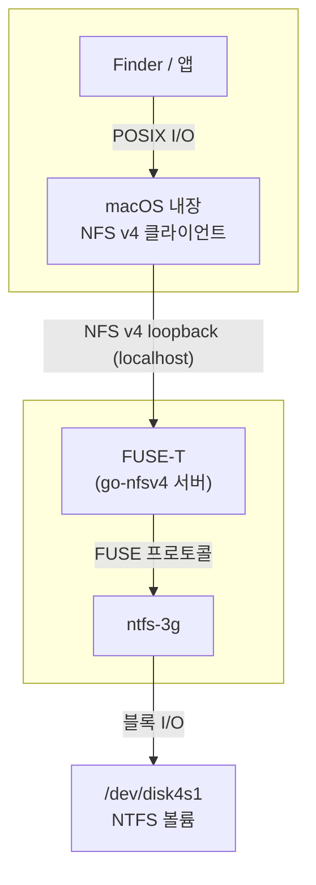

Windows 세상에서 흔히 쓰이는 NTFS 포맷 외장 드라이브는 macOS에 꽂으면 읽기는 되는데 쓰기가 안 된다. Paragon NTFS나 Tuxera NTFS 같은 유료 드라이버를 사거나, 커널 확장을 깔거나, 그냥 exFAT로 다시 포맷하거나 — 선택지는 있지만 마땅한 무료 GUI 유틸리티가 없었다. 그래서 직접 만들었다. Dock에 뜨는 SwiftUI 앱 + CLI + launchd 권한 헬퍼까지, 이 글은 그 과정의 기록이다. 코드는 [GitHub에 MIT로 공개](https://github.com/jaymunsh/ntfs-manager)했다.

## "공식 지원"은 존재하지 않는다 — 세 갈림길

가장 먼저 확인한 것은 macOS의 내장 NTFS 지원이 **읽기 전용**이라는 사실이다. fstab으로 켜는 비공식 쓰기 모드가 있지만 데이터 손상 이력이 있어 선택지가 아니다. Paragon 같은 유료 제품도 결국 서드파티 드라이버를 얹는 방식이라 "Apple 공식 지원"이란 건 세상에 없다.

Apple이 공식 제공하는 프레임워크가 하나 있긴 했다 — **FSKit**(macOS 15.4+ 유저스페이스 파일시스템 프레임워크). `xntfs`, `ntfskit` 같은 오픈소스가 libntfs-3g를 FSKit에 매핑해 구현하고 있다. 문제는 entitlement다. `com.apple.developer.fskit.fsmodule`은 restricted 권한이라 유료 개발자 계정 + Apple의 개별 승인이 필요하고, 승인 없이는 로컬 실행조차 AMFI가 막는다. 무료 경로로는 불가능 — 탈락.

| 방식 | 커널 확장 | 보안 설정 변경 | 비용 | 비고 |
|---|---|---|---|---|
| macFUSE + ntfs-3g | 필요 | Reduced Security 필요 | 무료 | Apple Silicon에서 kext는 번거로움 |
| **FUSE-T + ntfs-3g** | 불필요 | 불필요 | 무료 | NFS v4 loopback 방식 |
| FSKit | 불필요 | 불필요 | 유료 계정 + 승인 | entitlement 제한 |

그래서 **FUSE-T**를 택했다. 커널 확장 대신 로컬 NFS v4 서버(go-nfsv4)를 띄우고 macOS 내장 NFS 클라이언트가 마운트하는 구조라 kext 없이 동작한다. ntfs-3g가 `/dev/diskNsM`을 읽고 쓰는 파일시스템 로직을 담당하고, FUSE-T가 그걸 커널이 인식하는 마운트로 변환한다.



마운트 결과는 `mount`에서 `localhost:/My Passport on /Volumes/My Passport (nfs)`로 보인다 — 즉 시스템 입장에서는 NFS 마운트다. 이 사실이 뒤에 나올 "아직 검증하지 않은 것들"에서 중요해진다.

## 실제 2TB 드라이브로 굴려본 결과

WD My Passport 2TB를 꽂으면 macOS가 읽기 전용으로 자동 마운트한다. 앱의 볼륨 목록에는 DiskArbitration 이벤트로 드라이브가 즉시 나타난다 — 폴링 없이 꽂는 순간 갱신된다.


"읽기/쓰기로 마운트"를 누르면 macOS가 자동으로 잡아둔 읽기 전용 마운트를 내렸다가, ntfs-3g를 FUSE-T 경유로 R/W 마운트로 다시 올린다.


이 상태에서 간단한 파일 이동(파일을 드라이브로 복사해 다른 폴더로 옮기기)은 실제로 해봤다 — 정상적으로 읽고 써진다. 다만 이건 "켜진다" 확인일 뿐이고, 깊게 테스트한 건 아니다. 무엇이 부족한지는 뒤에 따로 정리했다.

작업이 끝나면 "제거" 버튼이 언마운트 → eject를 순서대로 수행한다. WD 인클로저는 eject 성공 후에도 `disk4` 노드가 남아 자신을 계속 열거하는 특성이 있는데, 볼륨이 언마운트됐으면 이미 안전하므로 앱은 "안전하게 제거됨 — 케이블을 뽑아도 됩니다" 메시지를 보여준다.


## 설치는 세 줄이면 끝난다

repo를 GitHub에 올리면서 설치 경로도 단순해졌다. 이 repo 자체가 Homebrew tap이라, 클론 한 번이면 끝이다:

```bash
git clone https://github.com/jaymunsh/ntfs-manager && cd ntfs-manager
./Scripts/install-deps.sh   # FUSE-T + ntfs-3g — 비밀번호 없이 설치
./Scripts/bundle-app.sh && open build/NTFSManager.app
```

`install-deps.sh`가 하는 일은 둘뿐이다 — FUSE-T pkg를 받아 **풀기만 해서** `~/.fuse-t`에 유저스페이스로 깔고(그래서 sudo가 필요 없다), 이 repo를 로컬 tap으로 등록해 `ntfs-3g-fuset` formula를 소스 빌드한다. 의존성만 미리 깔아두고 싶다면 클론 없이 원격 tap으로도 된다:

```bash
brew install --cask fuse-t
brew tap jaymunsh/ntfs-manager https://github.com/jaymunsh/ntfs-manager
brew install ntfs-3g-fuset
```

주의할 점 하나 — `brew tap jaymunsh/ntfs-manager`처럼 URL 없이 짧게 쓰면 Homebrew가 `homebrew-ntfs-manager`라는 이름의 repo를 찾으러 가서 실패한다. repo 이름이 `homebrew-`로 시작하지 않으면 뒤에 URL을 명시해야 한다.

## GPT 디스크의 NTFS는 "Microsoft Basic Data"로 뜬다

처음엔 `diskutil list`의 `Content` 필드가 `Windows_NTFS`인 파티션만 찾았는데, 실제 GPT 디스크는 `Content: Microsoft Basic Data`에 `FilesystemType: ntfs`로 나온다. `Content`는 파티션 타입 GUID 라벨일 뿐이고, 파일시스템 판별은 `diskutil info -plist`의 `FilesystemType`으로 해야 한다. Content는 "NTFS일 수 있는 후보" 필터로만 쓰고 최종 판정을 바꿨다.

## root인데 EPERM이 뜨는 이유 — TCC라는 보이지 않는 벽

ntfs-3g가 블록 디바이스를 마운트하려면 root가 필요하다. 그런데 실제 2TB 드라이브에 대고 실행하니 **root인데도** `/dev/disk4s1` open이 `Operation not permitted`로 실패했다. 원인은 TCC — 물리 디스크 raw device 접근은 root 권한과 별개로 **전체 디스크 접근 권한(Full Disk Access)**이 필요하다. 재미있는 점은 거부된 바이너리(ntfs-3g)가 시스템 설정의 FDA 목록에 자동 등록돼서, 토글만 켜면 된다는 것. 앱은 EPERM을 감지하면 설정 창으로 바로 안내한다.

비슷한 함정이 하나 더 있었다. 헬퍼 설치 시 root 셸이 `~/Documents` 안의 빌드 산출물을 읽지 못했다 — Documents 폴더도 TCC 보호 대상이라 root여도 차단된다. 바이너리를 `/tmp`에 스테이징한 뒤 설치하게 해서 해결했다.

ntfs-3g가 내뱉는 또 다른 에러는 dirty 볼륨이다 — Windows가 최대절전/빠른시작 상태로 종료했거나 안전 제거 없이 뽑힌 경우 "The NTFS partition is in an unsafe state"가 뜬다. 마운트 옵션에 `recover`를 추가해 ntfs-3g가 저널 복구를 자동 시도하게 했고, 그래도 안 되면 앱의 "복구" 버튼(ntfsfix)이나 Windows chkdsk로 안내한다.

## 비밀번호 프롬프트와의 결별 — launchd 권한 헬퍼

MVP는 `osascript ... with administrator privileges`로 매번 관리자 승인을 받았는데, 마운트할 때마다 비밀번호/Touch ID를 묻는 게 불편했다. 그래서 `ntfs-helper`라는 root 데몬을 만들었다:

- `/Library/PrivilegedHelperTools/` + LaunchDaemons plist로 상주
- `/var/run/ntfs-manager-helper.sock` (root:admin 0660) UNIX 소켓 서버
- **셸 명령을 받지 않는다.** `EXEC`/`SPAWN`/`MKDIR`/`RMDIR` 같은 구조화된 op만 받고, 실행 바이너리는 화이트리스트(diskutil, ntfs-3g, ntfsfix, umount), 인자는 정규식으로 검증한다. 소켓을 열어도 임의 명령 실행으로 이어지지 않게 한 설계다.

IPC로 XPC 대신 UNIX 소켓을 택한 이유는 XPC/NSXPC가 Mach 서비스라 제대로 서명된 .app이어야 자연스럽고, CLI 바이너리가 같은 채널을 쓰기 어렵기 때문이다. 소켓은 파일 권한만으로 접근 제어가 되고 `ntfs-cli`에서도 똑같이 쓸 수 있다. 설치 시점에만 osascript로 1회 승인을 받고, 이후 모든 작업은 소켓으로 간다. 헬퍼가 안 떠 있으면 osascript 프롬프트로 폴백한다.

## Homebrew에는 macOS용 ntfs-3g가 없다

`brew install ntfs-3g`는 실패한다 — homebrew-core의 ntfs-3g는 `depends_on :linux`다. macOS용은 FUSE-T 개발자의 포크(`macos-fuse-t/ntfs-3g`)를 소스 빌드해야 한다. 그래서 repo 자체를 Homebrew tap으로 만들고 커스텀 formula(`Formula/ntfs-3g-fuset.rb`)를 뒀다. 빌드 과정의 함정들 — FUSE-T 설치 경로의 공백이 configure를 깨는 것, unversioned dylib 심볼릭 링크 부재, Homebrew 빌드 샌드박스에서 `-lfuse-t`가 conftest를 죽이는 것, `HOME` 스크럽으로 `~/.fuse-t`를 못 찾는 것 — 은 전부 formula 안에서 우회했다.

보너스 발견이 하나 있다. FUSE-T pkg는 원래 sudo로 `/Library`에 설치되는데, 페이로드를 뜯어보니 `~/.fuse-t` 유저스페이스 경로를 지원한다. `install-deps.sh`는 pkg를 **풀기만 해서** 사용자 홈에 깐다. NFS가 `localhost`를 쓰므로 `/etc/hosts`도 건드릴 필요가 없다 — 의존성 설치 전 과정이 비밀번호 없이 돌아간다.

## 라이선스는 프로세스 경계로 분리했다

- 앱/라이브러리 코드: **MIT**
- ntfs-3g: GPL-2.0+ — **서브프로세스로 실행**하므로 앱이 GPL로 오염되지 않는다. brew로 별도 설치되고 바이너리를 번들에 포함하지 않는 것도 그 일환
- FUSE-T: 무료지만 클로즈드소스 — 사용자 환경에 별도 설치되는 런타임 의존성

무료 개발자 계정은 notarization이 안 되므로 서명되지 않은 .app은 Gatekeeper 경고가 뜬다. 소스 배포 + 로컬 빌드가 기본 경로다.

## 쓰기 전에 알아둘 것

- **미서명 앱이라 Gatekeeper 경고가 뜬다.** 무료 개발자 계정은 notarization이 안 된다. 우클릭 → 열기로 한 번 우회하면 되지만, 그래서 기본 경로가 소스 배포 + 로컬 빌드다.
- **전체 디스크 접근 권한(FDA)이 필수다.** 물리 디스크의 raw device는 TCC가 막아서 root여도 안 열린다. 첫 거부 시 `ntfs-3g`가 시스템 설정 목록에 자동 등록되니 토글만 켜면 된다 — 앱의 "디스크 권한 설정" 버튼이 그 창을 바로 연다.
- **중요한 데이터가 든 드라이브는 백업하고 쓴다.** 개인용 도구이고 아래 시험 목록처럼 검증이 남은 영역이 있다. 읽기만 필요하면 macOS 내장 읽기 전용 마운트가 더 안전한 선택이다.
- **Windows의 빠른시작/최대절전으로 끄고 빼온 볼륨은 쓰기 마운트가 거부된다.** Windows에서 완전 종료(Shift+종료) 후 연결하거나, 앱의 "복구" 버튼을 쓴다.

## 아직 검증하지 않은 것들 — 커뮤니티 이슈에서 확인한 시험 목록

"감지 → R/W 마운트 → 쓰기 → 언마운트 → 제거"와 간단한 파일 이동까지는 실제 2TB 드라이브에서 확인했다. 하지만 이걸 "안정적"이라 부르려면 아직 테스트가 부족하다. FUSE-T와 ntfs-3g의 공개 이슈 트래커에서 이 구조가 실제로 맞닥뜨리는 문제들을 뽑아 시험 목록으로 정리했다.

**성능은 가장 큰 미지수다.** 이 구조는 POSIX I/O가 ntfs-3g를 거쳐 NFS loopback을 한 바퀴 도는데, FUSE-T 저장소에 [ntfs-3g 조합에서 700-800MB/s 나오던 SSD가 ~20MB/s로 떨어졌다는 보고](https://github.com/macos-fuse-t/fuse-t/issues/89)가 있다. 개발자는 "NFS is known to be slow"라며 `-o backend=smb`를 권했다. 또 [수십만 개 파일을 훑은 뒤 모든 읽기가 ~30ms/syscall씩 느려지는 속성 캐시 문제](https://github.com/macos-fuse-t/fuse-t/issues/105)도 보고됐다 — `-o noattrcache`로 회피 가능하다고 한다. 즉 **대용량 파일 연속 전송 속도 측정**과 **수만 개 파일 트리 복사 후 재측정**이 최우선 테스트다. USB 3 HDD 정도면 병목이 디스크인지 NFS 오버헤드인지도 가려봐야 한다.

**파일명 호환성도 검증이 필요하다.** ntfs-3g는 새 파일을 항상 POSIX 네임스페이스로 만든다 — 대소문자를 구별하고 Windows가 금지하는 문자(`:`, `*`, `?`, `"`, `<`, `>`, `|`)도 허용한다. macOS에서 만든 파일을 Windows에서 못 여는 상황이 생길 수 있고, `windows_names` 마운트 옵션으로 막을 수 있다. 또 [공식 FAQ](https://github.com/tuxera/ntfs-3g/wiki/NTFS-3G-FAQ)에 따르면 국가별 문자를 포함해 UTF-8로 255바이트를 넘는 긴 파일명(**한글 파일명에서 발생 확률이 높다**)이 있는 디렉터리는 macOS에서 파일이 아예 안 보이는 문제가 있고, macOS가 요구하는 NFD 정규화와 Windows의 NFC 관행이 어긋나는 문제도 FUSE 계열의 고질적인 이슈다. 한글 파일·한글 폴더·긴 파일명을 왕복시키는 테스트가 필요하다.

**안정성 쪽에서는** FUSE-T 마운트가 곧 localhost NFS 마운트라는 점이 함정이다 — [Apple NFS kext의 `nfs_vinvalbuf2`에서 커널 패닉이 난 보고](https://github.com/macos-fuse-t/fuse-t/issues/109)가 macOS 26.5에서 올라와 있다(FB23527406, fuse-t 자체 결함은 아니라고 명시됨). 드물지만 이 스택이 내는 범위 안의 리스크다. 이 밖에도 시험할 것들: 쓰기 도중 케이블 뽑기(저널 복구가 실제로 동작하는지), dirty 볼륨의 `recover` 옵션 자동 복구와 ntfsfix 분기, 슬립/재연결, 여러 NTFS 드라이브 동시 마운트, Time Machine/Spotlight가 NFS 마운트를 어떻게 취급하는지.

**정리하면**, 지금 상태는 "내 드라이브에서 생활 파일 이동에는 쓸 만하다"이지 "검증된 NTFS 솔루션"은 아니다. 위 목록을 하나씩 재보면서 결과를 이어 적을 계획이다.

## 마치며

"NTFS를 macOS에서 쓰기 가능하게"는 표면적으로 간단한 요구지만, 실제로는 Homebrew 패키징, TCC 권한 모델, launchd 권한 상승, 디스크 아비트레이션, 파일시스템 dirty 상태 같은 macOS의 속살을 하나씩 만나게 되는 프로젝트였다. 특히 "root인데 EPERM"처럼 유닉스 상식으로는 이상해 보이는 현상들이 전부 TCC라는 현대 macOS 보안 레이어에서 오는 게 흥미로웠다.

- 코드: [github.com/jaymunsh/ntfs-manager](https://github.com/jaymunsh/ntfs-manager) (MIT) — 앱·CLI·헬퍼·formula 전부
- 백엔드: FUSE-T + ntfs-3g, 전부 유저스페이스 — kext도 Reduced Security도 없다
- 검증: macOS 26(M1 Max)에서 2TB 실물 드라이브로 마운트 라이프사이클 + 간단한 파일 이동 확인. 성능·파일명·내구성은 위 목록대로 아직 시험할 게 남아 있다
