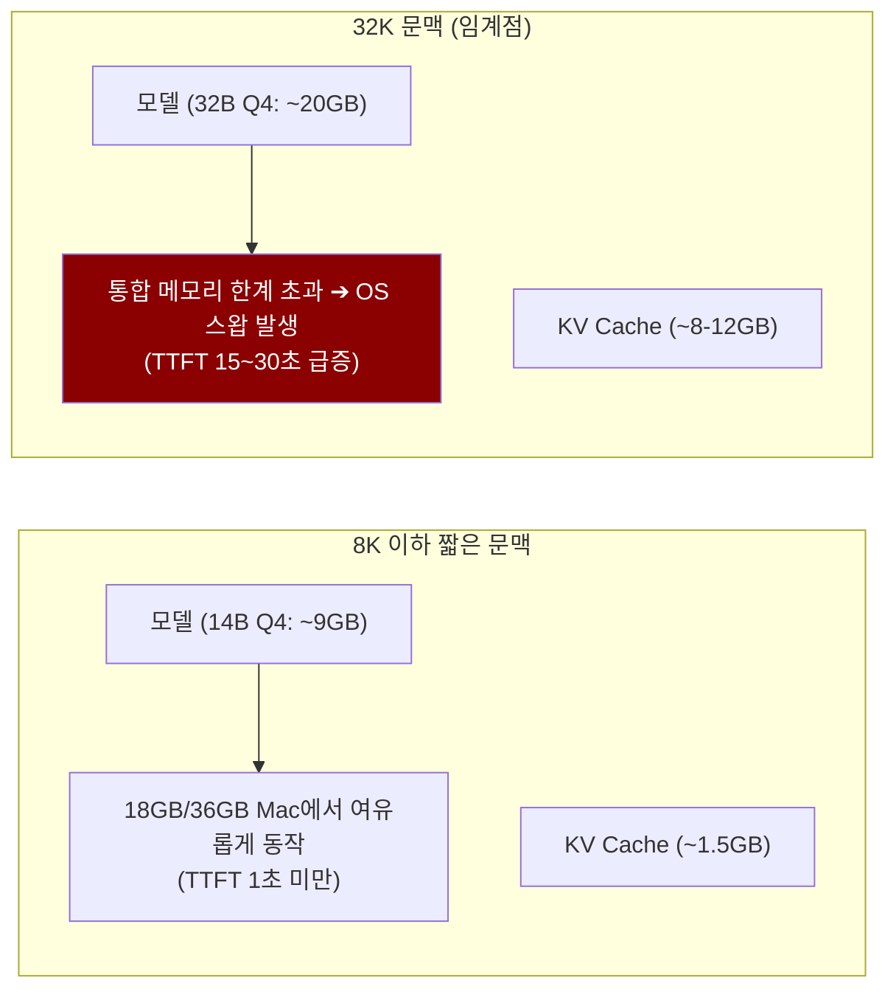
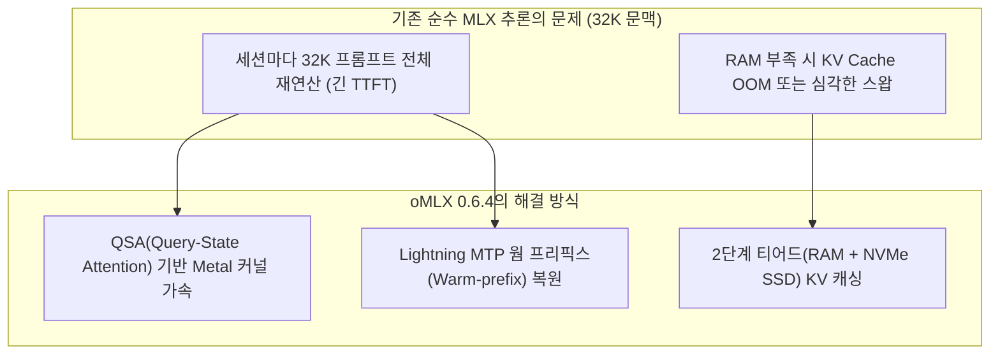
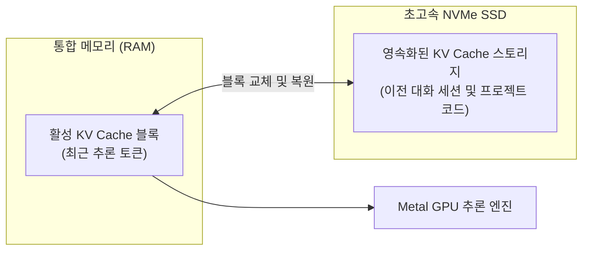

> **이 글의 대상**: Apple Silicon Mac(M1~M4/M5)에서 코딩 에이전트나 대규모 문맥 LLM을 로컬로 구동하며, 추론 지연과 메모리 병목을 줄이고자 하는 개발자.

> **측정 환경 안내**: 2026년 8월 31일 확인 기준, 아래 성능 수치는 [oMLX 0.6.4 공식 릴리스 노트](https://github.com/jundot/omlx/releases/tag/v0.6.4)에 공개된 단일 요청 벤치마크를 기준으로 정리했다. Apple M3 Ultra 512GB에서 `Qwen3.8-Flash-Next-oQ4e-mtp`를 Code(Python) 문맥과 함께 사용했고, 128 tokens 생성, temperature 1.0, top-p 1.0, Lightning MTP adaptive max depth 3, cached prompt tokens 0 조건이다. 공식 수치는 해당 조건의 참고값이며, Mac의 칩·통합 메모리·양자화·모델 포맷에 따라 결과는 달라진다.


## 1. 32K 에이전트 작업에서 맥북이 버벅이던 이유를 짚다

Apple Silicon의 통합 메모리 구조는 수십 GB에 달하는 대형 모델을 GPU VRAM과 CPU RAM 구분 없이 한 번에 적재할 수 있어 로컬 LLM 구동에 이상적인 환경으로 평가받아 왔다.

하지만 코딩 어시스턴트(Claude Code, Cursor, DeepSeek Harness 등)를 활용해 대규모 프로젝트 소스코드를 다루기 시작하면 성능 체감이 급격히 무너진다. 이 논의의 중심에는 항상 **32K 토큰 문맥**이 있다. 토큰과 단어의 환산 비율은 언어와 토크나이저에 따라 달라지므로 단순히 같은 수로 읽으면 안 된다.

### 1-1. 왜 4K나 8K가 아니라 하필 32K인가?

1. **4K~8K 짧은 대화에서는 최적화 효과가 상대적으로 작다**: 일반적인 챗봇 대화는 기본 `mlx-lm`이나 `Ollama`로도 첫 토큰 응답(TTFT)이 빠르게 나오고, 긴 문맥에 비해 KV Cache 메모리 압박도 작다.
2. **실무 코딩 에이전트의 기본 작업 단위가 20K~32K다**:
   - 시스템 프롬프트 및 도구 정의(Tool Schema): 약 3K~5K 토큰
   - 프로젝트 디렉터리 트리 및 `README`: 약 2K~4K 토큰
   - 참조 소스코드 3~5개 파일: 약 10K~15K 토큰
   - 이전 턴의 셸 실행 로그 및 테스트 결과: 약 5K~10K 토큰
   - 이들을 합치면 **작업 시작 직후 곧바로 20K~32K 구간에 진입**한다.
3. **Apple Silicon의 현실적인 스위트스팟**: 64K~128K는 로컬 Mac에서 실시간 대화형으로 쓰기에 연산량이 커지고, 8K 이하는 에이전트용으로 좁을 수 있다. 맥북 프로(18GB~64GB)에서는 **실무 코딩 에이전트를 실시간으로 구동하기 위한 현실적인 상한선으로 32K를 선택하는 경우가 많다.**

### 1-2. 32K 문맥에서 마주치는 두 가지 병목

> **수치 해석 주의**: 아래 메모리·TTFT 수치는 특정 모델과 프롬프트를 가정한 예시다. 모델 크기, 양자화, 문맥 구성, 캐시 적중 여부에 따라 실제 값은 크게 달라질 수 있다.



1. **프리필(Prefill) 처리 지연**: 새 질문을 던질 때마다 32K에 달하는 이전 대화와 코드베이스를 처음부터 다시 계산하면서 첫 토큰 출력(TTFT)까지 15~30초 이상 팬이 돌며 멈칫한다.
2. **KV Cache의 메모리 점유 급증**: 32K 문맥의 KV Cache는 모델 가중치 외에 추가로 8~12GB 이상의 메모리를 차지한다. 18GB~36GB 메모리를 탑재한 맥북에서는 즉각 OS 스왑(Swap)이 발생해 생성 속도가 곤두박질친다.

기존의 기본 `mlx-lm` 라이브러리는 가볍고 단일 추론에는 훌륭하지만, 세션 간 프롬프트 캐시 재사용이나 대규모 문맥 관리를 위한 서빙 레이어가 부족했다. **oMLX**는 이 32K 병목을 해결하기 위해 개발된 Apple Silicon 전용 오픈소스 추론 서버다.




---

## 2. oMLX의 2단계(RAM+SSD) 티어드 KV 캐시 구조를 이해하다

oMLX가 기존 로컬 실행기(Ollama, LM Studio 등)와 차별화되는 가장 큰 구조적 특징은 **2단계 티어드 KV 캐시(Tiered KV Caching)** 다.

일반적인 런타임은 KV Cache를 통합 메모리(RAM)에만 보관하므로, 메모리가 꽉 차면 이전 캐시를 버리거나 모델을 언로드해야 한다. 반면 oMLX는 활성 상태의 KV 블록은 RAM에 두고, 최근 참조 빈도가 낮아진 블록을 **로컬 NVMe SSD로 오프로드**하여 관리한다.



이 설계 덕분에 코딩 에이전트가 이전 턴의 작업이나 다른 파일 분석으로 문맥을 전환했다가 다시 돌아오더라도, SSD에 저장된 캐시 블록을 빠르게 역직렬화하여 불러온다. 수만 토큰의 프롬프트를 처음부터 다시 연산할 필요가 없어 첫 응답 지연이 대폭 단축된다.

---

## 3. 0.6.4 버전에서 도입된 QSA와 Lightning MTP 가속을 파헤치다

2026년 8월 말 공개된 **oMLX 0.6.4**는 Qwen3.8-Flash-Next 및 대규모 에이전트 워크로드의 처리 효율을 끌어올리는 두 가지 핵심 가속 기술을 적용했다.

### 3-1. 정밀 QSA(Query-State Attention) 가속

최신 오픈 가중치 모델들에 적용된 특수 어텐션 및 스코어링 구조를 Metal GPU에서 네이티브로 가속할 수 있도록 개선했다.

- **네이티브 FP32 스코어링**: 어텐션 점수 계산 과정에서 발생할 수 있는 정밀도 손실을 방지하면서도 Metal 셰이더 수준에서 연산 순서를 최적화했다.
- **결정론적 블록 선택(Deterministic Block Selection)**: 단일 배치 텍스트 작업에서 필요한 KV 블록을 Sparse-GQA(Grouped-Query Attention) 방식으로 직접 타겟팅하여 불필요한 메모리 대역폭 소모를 차단했다.

### 3-2. Lightning MTP 웜 프리픽스(Warm-prefix) 복원

MTP(Multi-Token Prediction, 다중 토큰 예측)는 한 번의 스텝에서 다음 토큰 하나만이 아니라 여러 토큰을 동시에 예측해 디코딩 속도를 비약적으로 높이는 기법이다.

기존 버전에서는 세션이 이어질 때 MTP 사이드카(Sidecar)의 상태를 맞추기 위해 프롬프트 헤드 부분을 일정 부분 다시 계산(Replay)해야 하는 오버헤드가 있었다. 0.6.4 버전에서는 **Prefix-Cache 내부에 MTP의 상태값까지 함께 저장하고 웜 복원**하도록 수정되어, 재계산 없는 즉각적인 다중 토큰 생성이 가능해졌다.


---

## 4. M3 Ultra 32K 벤치마크로 실측 성능 차이를 확인하다

공식 릴리스에서 공개된 Apple M3 Ultra (512GB 통합 메모리) 벤치마크는 4K·16K·32K 문맥에서 0.6.4 버전의 개선 폭을 보여준다. 대상 모델은 `Qwen3.8-Flash-Next-oQ4e-mtp`이며, PP는 프리필 속도, TG는 디코드 속도를 뜻한다.

| 문맥 길이 | Prefill(PP) 0.6.3 → 0.6.4 | Decode(TG) 0.6.3 → 0.6.4 | 전체 요청 시간 0.6.3 → 0.6.4 |
|---:|---:|---:|---:|
| 4K | 999.61 → 1,061.34 tok/s (+6.2%) | 48.65 → 53.59 tok/s (+10.2%) | 6.73초 → 6.25초 (-7.1%) |
| 16K | 950.06 → 1,061.31 tok/s (+11.7%) | 48.74 → 55.70 tok/s (+14.3%) | 19.87초 → 17.74초 (-10.7%) |
| **32K** | **834.31 → 1,113.63 tok/s (+33.5%)** | **40.08 → 45.92 tok/s (+14.6%)** | **42.47초 → 32.21초 (-24.2%)** |

32K에서 프리필은 **33.5%**, 디코드는 **14.6%** 빨라졌고, 128토큰 생성까지 포함한 전체 요청 시간은 **24.2% 단축**됐다. 긴 문맥에서 프리필 개선 폭이 커진다는 점이 에이전트의 반복 요청에 특히 중요하다.

공식 릴리스 표에는 TTFT가 별도 지표로 공개되지 않았다. 따라서 전체 요청 시간을 TTFT로 바꿔 부르거나, 캐시 적중·서버 웜 상태가 다른 측정값과 합산해서 해석하면 안 된다.

## 5. 기존 mlx-lm 및 Ollama와의 차이점을 비교하다

Apple Silicon 환경에서 로컬 LLM을 구동할 때 자주 쓰이는 도구들과 oMLX를 비교하면 목적과 강점이 명확히 갈린다.

| 비교 항목 | oMLX 0.6.4 | mlx-lm (순수 라이브러리) | Ollama (Metal 백엔드) |
|---|---|---|---|
| **기반 프레임워크** | Apple MLX | Apple MLX | llama.cpp (GGUF) |
| **KV 캐시 저장소** | 2단계 (RAM + NVMe SSD) | RAM 단독 | RAM 단독 |
| **MTP / QSA 특화 가속** | 지원 모델·배치 조건에 한해 0.6.4 최적화 | 기본 구현 수준 | 미지원 / 제한적 |
| **API 호환성** | OpenAI & Anthropic 호환 | CLI / 파이썬 스크립트 전용 | OpenAI 호환 |
| **에이전트 워크플로 최적화** | 세션 복원 및 프롬프트 캐싱 특화 | 수동 캐시 관리 필요 | 기본 Prefix Caching |
| **적합한 사용처** | 코딩 에이전트, 32K+ 롱컨텍스트 서버 | 연구, 모델 가중치 변환, 경량 추론 | 가벼운 챗봇, 빠른 설치 및 모델 관리 |

Ollama는 GGUF 포맷의 뛰어난 범용성과 간편한 CLI가 강점이지만, Apple Silicon 전용 Metal 최적화와 대규모 문맥의 SSD 티어링 면에서는 MLX 네이티브 기반인 oMLX가 유리하다.

---

## 6. 설치와 코딩 에이전트 연동 설정을 5분 만에 끝내다

### 6-1. 설치 및 서버 실행

oMLX 공식 저장소 기준으로 Homebrew tap을 등록한 뒤 설치한다. 설치 후에는 백그라운드 서버를 시작하거나, 모델 디렉터리를 지정해 직접 서빙할 수 있다.

```bash
# 공식 Homebrew tap 등록 및 설치
brew tap jundot/omlx https://github.com/jundot/omlx
brew install jundot/omlx/omlx

# 백그라운드 서버 시작 (기본 포트 8000)
omlx start
```

MLX 형식 모델을 `~/models` 아래에 준비했다면 다음처럼 모델 디렉터리를 지정한다.

```bash
omlx serve --model-dir ~/models
```

### 6-2. 코딩 에이전트(Claude Code / Cursor / DeepSeek Harness) 연동

oMLX는 OpenAI 및 Anthropic 호환 API 엔드포인트를 동시에 노출하므로, 기존 에이전트 도구의 환경 변수 설정만으로 바로 연결할 수 있다.

```bash
# OpenAI 호환 클라이언트 설정 (예: DeepSeek Harness 연동)
export OPENAI_BASE_URL="http://localhost:8000/v1"
export OPENAI_API_KEY="omlx-local"

# Anthropic 호환 클라이언트 설정 (예: Claude Code 스타일 도구 연동)
export ANTHROPIC_BASE_URL="http://localhost:8000"
export ANTHROPIC_API_KEY="omlx-local"
```

관리 화면은 `http://localhost:8000/admin`, 내장 채팅 화면은 `http://localhost:8000/admin/chat`에서 연다. OpenAI 호환 API의 기본 주소는 `http://localhost:8000/v1`이다.

---

## 7. 현시점에서 마주친 한계와 유의사항

성능 개선에도 불구하고 oMLX 0.6.4를 도입하기 전 점검해야 할 사항들이 있다.

1. **Apple Silicon 플랫폼 종속성**: macOS와 Apple Silicon(Metal) 환경 전용이므로, Linux나 Windows/NVIDIA CUDA 환경에서는 구동할 수 없다.
2. **SSD 공간과 쓰기 부하**: 티어드 캐시는 모델 크기, 문맥 길이, 캐시 정책에 따라 SSD 공간과 쓰기 작업을 사용한다. 모든 환경에 공통으로 적용되는 ‘30~50GB 최소 여유 공간’으로 단정하기보다, 실제 캐시 디렉터리와 디스크 잔여 공간을 모니터링하는 편이 안전하다.
3. **모델 아키텍처 호환성**: 지원 여부는 모델이 MLX 형식으로 준비됐는지, 필요한 커스텀 레이어와 커널이 구현됐는지에 따라 달라진다. Qwen3.8처럼 릴리스에서 명시적으로 최적화된 모델과 다른 모델의 결과를 일반화하지 말고, 모델별 로딩·생성 품질을 따로 확인해야 한다.
4. **벤치마크 조건 의존성**: 공식 0.6.4 수치는 M3 Ultra 512GB, 특정 모델·문맥·생성 조건에서 한 번 측정한 결과다. 다른 Mac이나 캐시 적중 상태, 동시 요청 환경에서는 개선 폭이 달라질 수 있다.

## 8. 공식 벤치마크와 커뮤니티 자료를 어떻게 읽을까

oMLX의 성능 자료는 공식 릴리스 벤치마크, 공식 사이트의 제품 설명, 사용자 제출형 커뮤니티 벤치마크를 구분해서 읽어야 한다. 하드웨어·모델·양자화·캐시 상태가 모두 다르므로, 서로 다른 출처의 숫자를 하나의 순위표로 합치면 오해가 생긴다.

### 8-1. 긴 문맥 재참조에서 기대할 수 있는 변화

oMLX 공식 사이트는 긴 문맥의 반복 요청에서 TTFT가 30~90초 수준에서 5초 미만으로 줄어들 수 있다고 설명한다. 다만 이는 특정 모델·하드웨어·캐시 적중 조건을 전제로 한 제품 설명이며, 앞서 본 0.6.4 릴리스의 32K 단일 요청 벤치마크와 같은 실험이 아니다. 따라서 이 수치를 공식 0.6.4 표에 더하거나 모든 Mac에 보장되는 값으로 읽으면 안 된다.

실제 사용에서는 다음 세 가지를 함께 기록해야 한다.

- 첫 요청인지, 동일 프리픽스가 캐시에 적중한 반복 요청인지
- 모델 포맷과 양자화, 입력 문맥 길이, 생성 토큰 수
- 단일 요청인지, 연속 요청·동시 배치인지

### 8-2. 칩셋별 시작점과 벤치마크 대시보드

사용자마다 M1부터 M5까지 칩셋과 메모리 대역폭이 다르다. [oMLX 공식 사용자 제출 벤치마크](https://omlx.ai/benchmarks/performance)는 다양한 모델·메모리·설정의 결과를 모아 보여주지만, 동일 조건 통제 실험은 아니므로 내 환경의 기준선을 잡는 참고 자료로 보는 편이 맞다.

| 칩셋·메모리 예시 | 현실적인 시작점 | 확인할 항목 |
|---|---|---|
| **M1/M2 기본형, 8~16GB** | 7B~8B Q4 모델과 짧은 문맥부터 시작 | 메모리 압박, 스왑, 캐시 적중 후 응답 시간 |
| **M2/M3 Pro, 18~36GB** | 14B~32B Q4 모델을 모델별로 비교 | 16K~32K 문맥의 프리필과 SSD 오프로딩 비용 |
| **M3/M4 Max·Ultra, 64GB 이상** | 대형 모델과 긴 문맥을 시도하되 모델별 메모리 요구량 확인 | QSA/MTP 지원 여부, 동시 요청, 전체 요청 시간 |

이 표는 성능 보장표가 아니라 테스트 순서를 정하기 위한 시작점이다. 같은 모델을 같은 프롬프트로 4K·16K·32K에서 측정하고, 프리필·디코드·전체 요청 시간을 함께 남겨야 비교가 가능하다.

### 8-3. 공개 자료별로 확인할 수 있는 것

| 자료 | 확인 가능한 내용 | 주의할 점 |
|---|---|---|
| **oMLX 0.6.4 릴리스 노트** | Qwen3.8-Flash-Next 대상 QSA·Lightning MTP 개선과 버전별 공식 수치 | M3 Ultra 512GB의 단일 요청 조건이며 전체 모델의 평균값이 아님 |
| **oMLX 공식 사용자 벤치마크** | 실제 사용자 하드웨어·모델·양자화 조합 | 제출 조건이 제각각이고 표본 편향이 있음 |
| **GitHub 이슈·토론** | 모델 호환성, 회귀 버그, 특정 설정의 재현 사례 | 이슈 보고는 벤치마크나 안정성 인증이 아님 |

### 8-4. 주요 출처 및 참고 자료

- [oMLX 공식 저장소 (GitHub)](https://github.com/jundot/omlx): 설치법, 지원 플랫폼, 서버·관리 화면 안내
- [oMLX 0.6.4 릴리스 노트](https://github.com/jundot/omlx/releases/tag/v0.6.4): QSA·Lightning MTP 변경점과 공식 벤치마크
- [oMLX 공식 사용자 벤치마크](https://omlx.ai/benchmarks/performance): 사용자 제출형 Apple Silicon 실측 데이터
- [oMLX 공식 홈페이지](https://omlx.ai/): 티어드 KV 캐시와 제품 동작 설명

## 9. 마치며 — Apple Silicon 로컬 추론의 진화 방향

oMLX 0.6.4 업데이트의 핵심은 특정 Qwen3.8 워크로드에서 긴 문맥의 병목을 줄이는 데 있다.

1. **32K 공식 벤치마크에서 프리필은 33.5%, 디코드는 14.6% 빨라졌고 전체 요청 시간은 24.2% 줄었다.** 단, M3 Ultra 512GB와 `Qwen3.8-Flash-Next-oQ4e-mtp` 등 명시된 조건의 결과다.
2. **QSA와 Lightning MTP 웜 프리픽스 복원이 반복 요청의 비용을 낮춘다.** Prefix Cache에 MTP 상태를 함께 보존해 일치하는 프리픽스를 복원할 때 불필요한 재계산을 줄이는 방식이며, 모든 요청의 TTFT가 사라진다는 뜻은 아니다.
3. **RAM과 SSD를 엮는 티어드 KV 캐싱은 긴 문맥 에이전트에 유용한 서빙 기능이다.** 대신 SSD 공간·쓰기 부하와 모델별 호환성을 함께 관리해야 한다.

Apple Silicon 기반 Mac을 로컬 AI 에이전트 워크스테이션으로 활용한다면 oMLX 0.6.4는 검토할 가치가 있는 선택지다. 다만 이 글의 수치는 보편적인 속도 보장이 아니라 공식 릴리스와 문서에 공개된 조건부 결과이므로, 실제 도입 전에는 자신의 모델·문맥·캐시 패턴으로 같은 측정을 재현하는 것이 가장 정확하다.
