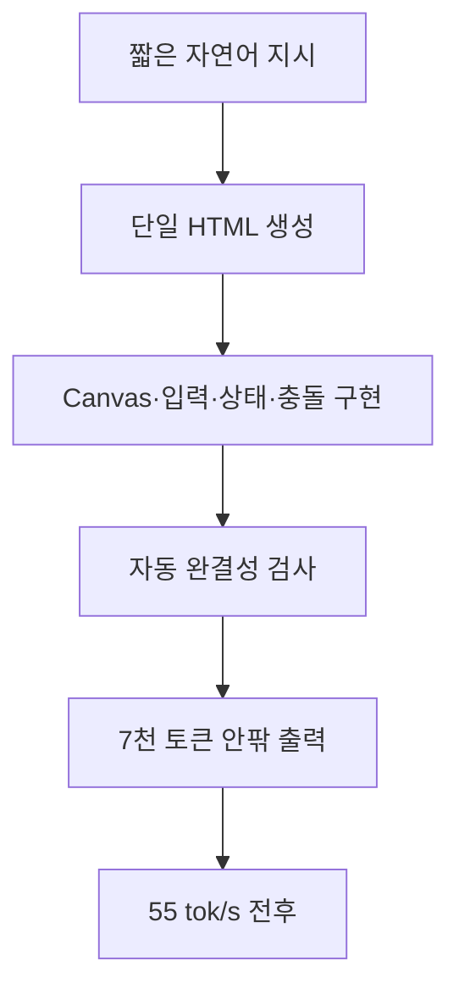
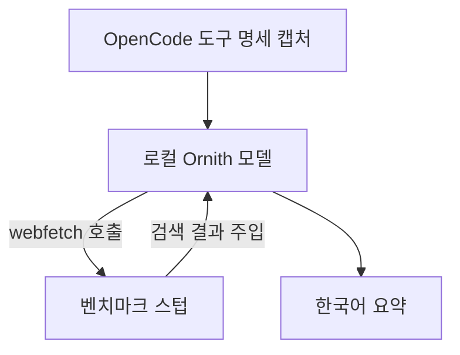

title: "M1 Max 64GB에서 Ornith oQ6 MTP를 검증한 기록"
slug: ornith-15-35b-mtp-m1max-benchmark
category: 기술 실험
summary: "Apple M1 Max 64GB와 oMLX 0.6.4에서 Ornith-1.5-35B-A3B-oQ6-gs128-mtp-vision을 실제 벤치마크하고, Qwen 계열 4bit·oQ4e·MXFP4·DFlash2와 속도·완주성·도구 활용을 비교한 기록이다. 조건이 다른 벤치마크를 해석하는 경계와 다음 재현 측정 체크리스트까지 함께 정리했다."
tags: local-llm,omlx,mlx,apple-silicon,ornith,mtp,quantization,benchmark,tech-lab
toc: true
publishedAt: 2026-08-31T09:36:53.793401Z
updatedAt: 2026-08-31T10:45:13.977495Z
syncHash: bbe21e085fba2aa317b54107b3b4cb469d404e330280104231dd2f55a1fea5c8

---

> M1 Max 64GB에서 27B급 Qwen을 여러 양자화와 MTP 조합으로 바꿔가며 테스트했지만, 기대한 20 tok/s 근처에 쉽게 도달하지 못했다. 반대로 새로 설치한 Ornith 35B-A3B oQ6 모델은 짧은 웹 생성에서 50 tok/s 중반을 기록했다. 이 글은 이 차이가 양자화 하나의 결과인지, MoE 구조와 런타임 설정의 결과인지 확인하기 위해 같은 벤치마크를 다시 돌린 기록이다.

> **결론 먼저.** 이번 측정 범위인 M1 Max 64GB·oMLX 0.6.4·Ornith oQ6 MTP·warm 실행에서는 Ornith를 기본 모델로 남길 만했다. 짧은 웹 생성은 55 tok/s 전후였고, 갤러그·테트리스·샌드박스를 모두 완주했다. 다만 이 결과는 범용 모델 순위가 아니라 특정 장비와 작업 묶음에 대한 선택 기록이다. 긴 문서의 TTFT, 반복 측정 중앙값, 64K 이상 컨텍스트는 아직 남아 있다.

## 1. 모델과 실행 조건을 고정해 비교 기준을 세우다

이번 기준 모델은 [RukaRat Ornith-1.5-35B-A3B-oQ6-gs128-mtp-vision](https://huggingface.co/RukaRat/Ornith-1.5-35B-A3B-oQ6-gs128-mtp-vision)이다. 이름처럼 비전 구성요소가 포함된 모델이지만, 이번 테스트는 이미지를 넣지 않은 텍스트 작업으로 진행했다. 모델 카드에 MTP head가 포함되어 있고, oMLX에서는 Native Lightning MTP를 활성화했다.

| 항목 | 이번 측정값 |
|---|---|
| 하드웨어 | Apple M1 Max · 통합 메모리 64GB |
| 런타임 | oMLX 0.6.4 |
| 모델 | Ornith-1.5-35B-A3B-oQ6-gs128-mtp-vision |
| 양자화 | oQ6 · gs128 |
| 컨텍스트 상한 | 49,152 tokens |
| MTP | Native Lightning MTP 켬 |
| VLM MTP | 끔 |
| DFlash2·TurboQuant | 끔 |
| Thinking | 벤치마크 요청에서 끔 |
| 샘플링 | temperature 0.1 · top_p 0.95 · top_k 20 |
| 캐시 상태 | warm 1회 |
| 반복 기준 | 주요 결과 warm 1회 · MTP on/off 단일 비교 |
| 작업 범위 | 텍스트 전용 웹 생성·한국어·Java·하네스·도구 호출 |

측정값은 프로젝트의 `runs.jsonl`에 남겼고, 화면으로 확인할 수 있는 HTML 생성 결과는 별도 파일로 보존했다. 자동 점수는 코드 완결성·필수 요소·형식 관문을 검사할 뿐, 디자인의 세련됨이나 문장의 자연스러움까지 평가하지는 않는다.

이번 글은 특정 실행 시점의 기록이다. macOS 버전, MLX/oMLX 빌드 식별자, 모델 파일 체크섬과 같은 재현 메타데이터는 당시 측정표에 별도로 고정하지 못했다. 따라서 아래 수치는 같은 조건에서 다시 확인할 수 있는 관측값이지, 어떤 M1 Max에서도 보장되는 고정 성능으로 읽으면 안 된다.

## 2. 짧은 생성에서는 Ornith가 50 tok/s 중반을 안정적으로 냈다

웹 생성 세 가지와 새로 추가한 갤러그 과제를 실행했다. 모두 외부 리소스 없이 단일 HTML을 출력하도록 지시했고, 출력이 중간에 끊겼는지와 핵심 기능이 들어갔는지를 자동 검사했다.

| 테스트 | 출력 토큰 | 속도 | TTFT | 형식·완결성 | 종료 |
|---|---:|---:|---:|---:|---|
| 제품 소개 페이지 | 7,267 | 54.47 tok/s | 0.618s | 1.0 | 정상 |
| 갤러그 | 7,208 | 56.92 tok/s | 0.613s | 1.0 | 정상 |
| 테트리스 | 4,210 | 60.34 tok/s | 0.563s | 1.0 | 정상 |
| 모래 물리 샌드박스 | 5,652 | 55.32 tok/s | 0.700s | 1.0 | 정상 |

갤러그는 플레이어 좌우 이동, 총알, 적 편대, 충돌, 점수, 목숨, 게임 오버와 재시작을 한 파일 안에 구현했다. 생성 결과는 [갤러그 HTML](/assets/projects/ornith-15-35b-mtp-m1max-benchmark/bench/out/web-galaga__Ornith-1.5-35B-A3B-oQ6-gs128-mtp-vision__warm__b50dd32e.html)에서 확인할 수 있다.



이 결과만 보면 Ornith oQ6는 M1 Max에서 대형 모델치고 충분히 빠르다. 다만 이 수치는 짧은 입력에 대한 decode 속도에 가깝고, 긴 문서를 넣었을 때의 첫 응답 대기 시간까지 포함한 실사용 속도와는 다르다.

여기서 `tok/s`는 생성 구간의 decode 속도이고, `TTFT`는 첫 토큰이 나올 때까지 걸린 시간이다. 긴 입력에서는 prefill이 TTFT를 크게 만들 수 있으므로 두 지표를 합쳐 하나의 “실제 속도”로 해석하지 않았다.

## 3. 랜딩 페이지의 언어 혼입은 한국어 평가와 분리해 기록했다

앞의 웹 생성 테스트에서 확인한 언어 혼입은 장문 요약이나 자유 글쓰기의 한국어 품질과 다른 문제다. 랜딩 페이지는 모델이 긴 HTML을 생성하는 동안 사용자에게 보이는 문장과 코드 안의 문자열을 함께 만들어야 하므로, 이 결과는 **웹 산출물의 언어 안정성**으로 따로 기록했다.

| 결과 | 설정 | 관찰 |
|---|---|---|
| 초기 MTP 랜딩 | `temperature=0.2` | 한국어 문장에 아랍어 `خارج`가 두 번 섞였다 |
| 보정 랜딩 | `temperature=0.1` + 한국어 전용 지시 | 아랍어·중국어·일본어 혼입이 발견되지 않았다 |

두 실행 모두 HTML의 `lang="ko"`와 UTF-8 설정은 정상이었다. 따라서 브라우저 인코딩 문제가 아니라 모델이 생성한 문자열의 문제로 보는 것이 맞다. 다만 온도와 프롬프트를 동시에 바꿨으므로, 개선을 temperature 하나의 효과로 단정하지는 않았다.

초기 결과는 [MTP 활성 랜딩 페이지](/assets/projects/ornith-15-35b-mtp-m1max-benchmark/bench/out/web-landing__Ornith-1.5-35B-A3B-oQ6-gs128-mtp-vision__warm__5c848d18.html)에서, 보정 결과는 [한국어 지시를 추가한 랜딩 페이지](/assets/projects/ornith-15-35b-mtp-m1max-benchmark/bench/out/web-landing__Ornith-1.5-35B-A3B-oQ6-gs128-mtp-vision__warm__37d8dfdb.html)에서 원문 그대로 확인할 수 있다.

이 사례가 말해주는 것은 “Ornith가 한국어를 못 쓴다”가 아니라, 웹 생성에서는 자연어 언어 유지도 별도의 품질 게이트로 둬야 한다는 점이다. 다음에는 같은 랜딩 프롬프트에서 temperature와 지시문을 하나씩만 바꾸고 반복 실행해 원인을 분리할 필요가 있다.

## 4. 모델 구조 차이가 oQ6 단독 효과보다 큰 설명 후보로 보였다

이전 테스트와 단순 속도를 나란히 놓으면 차이가 분명하다.

| 모델·구성 | 작업과 조건 | 관측 속도 | 비교 가능성 | 해석 |
|---|---|---:|---|---|
| Ornith oQ6 MTP | 웹 생성·warm·현재 스위트 | 54.47~60.34 tok/s | 기준 | 네 작업 모두 형식·완결성 1.0 |
| Ornith MLX 6bit | 이전 웹 생성·warm | 49.71~53.08 tok/s | 참고 비교 | 같은 계열의 기존 6bit 기준 |
| Qwen3.6 35B-A3B OptiQ 4bit | 이전 웹 생성·warm | 54.13~56.05 tok/s | 참고 비교 | 웹 완주성은 항목별 차이 |
| Qwen3.8 27B 4bit + DFlash2 | 웹 생성·최대 4,096 tokens | 15.16~16.52 tok/s | 직접 비교 불가 | 출력이 상한에서 끊겼다 |
| Qwen3.8 27B MXFP4 + DFlash2 | 웹 생성·최대 4,096 tokens | 14.16 tok/s | 직접 비교 불가 | 완주·형식 점수 0 |
| Qwen3.8 27B oQ4e MTP | 웹 생성·최대 4,096 tokens | 13.61 tok/s | 직접 비교 불가 | 길이 종료로 완주 실패 |
| Qwen3.8 27B NVFP4 | 웹 생성·warm | 14.63 tok/s | 참고 비교 | 별도 조건의 과거 측정 |

Qwen3.8 27B 실험들은 대부분 출력 상한 4,096에서 끝났고, 프롬프트·VLM 경로·MTP·DFlash 설정도 완전히 같지 않다. 따라서 표의 13~16 tok/s를 Ornith의 55 tok/s와 정밀한 양자화 대결 결과로 읽으면 안 된다.

더 중요한 차이는 모델 구조다. Ornith의 `35B-A3B`는 전체 파라미터가 약 35B지만 토큰마다 활성화되는 경로는 약 3B인 MoE 모델이다. Qwen3.8 27B는 이번에 사용한 변환 기준으로 모든 계산 경로가 상대적으로 무거운 dense 모델이다. 저장 용량이 비슷해도 한 토큰을 만들 때 읽고 계산하는 가중치의 양이 다르므로, 모델 파일의 GB나 명목 bit 수만으로 속도를 예측할 수 없다.

다만 이번 표는 같은 모델에서 양자화만 바꾼 ablation이 아니다. 따라서 “oQ6가 몇 tok/s를 더했다”거나 “MoE가 전부 설명한다”고 단정할 수 없다. 현재 데이터가 말해주는 범위는, 이 장비와 런타임에서 관측된 차이를 해석할 때 양자화 레벨만큼이나 활성 파라미터와 실행 경로를 먼저 봐야 한다는 정도다.

## 5. Lightning MTP 동작과 속도 차이는 확인했지만 효과는 추가 반복이 필요하다

oMLX 로그에서 Ornith 모델의 내장 MTP 경로가 활성화된 것을 확인했다. 이전 랜딩 페이지 비교에서는 다음과 같은 값이 나왔다.

| 상태 | 속도 | MTP 로그 | 출력 |
|---|---:|---|---:|
| MTP off | 47.23 tok/s | 해당 없음 | 8,468 tokens |
| Native Lightning MTP on | 53.59 tok/s | acceptance 80.5% · 2.60 tok/cycle | 6,629 tokens |

단일 실행에서 MTP on의 생성 속도가 약 13.5% 높게 관측됐지만 출력 길이가 서로 다르다. 따라서 MTP가 항상 정확히 13.5% 빠르다고 말할 수는 없다. 이번 전체 스위트에서는 웹 생성 속도가 54~60 tok/s 범위였고, MTP 로그상 초안 토큰이 실제로 검증·채택되는 경로가 작동했다.

MTP는 품질을 높이는 양자화 옵션이 아니라 디코딩을 줄이는 실행 경로다. 초안이 많이 맞을수록 이득이 커지고, 모델에 맞지 않는 drafter를 억지로 연결하면 차원 불일치나 검증 실패가 생긴다. 그래서 현재 설정에서는 Qwen3.8용 VLM MTP drafter나 DFlash2를 함께 켜지 않고 Ornith 자체 Lightning MTP만 사용했다.

## 6. 한국어 품질은 속도와 별도의 축으로 확인해야 했다

이번 섹션은 랜딩 페이지 HTML이 아니라 한국어 장문 요약·자유 글쓰기·번역·형식 제약처럼 텍스트 응답 자체를 평가한 결과다. 여기서는 사실 보존, 문체 일관성, 엄격한 출력 형식 준수를 따로 확인했다. 랜딩 페이지의 언어 혼입은 앞 절에서 별도의 웹 산출물 품질 문제로 다뤘다.

| 언어·형식 테스트 | 속도 | 결과 |
|---|---:|---|
| 한국어 장문 요약 | 51.63 tok/s | 자동 0.4 · 핵심 사실 3개 누락, 외국 문자 혼입 없음 |
| 한국어 주제 자유 글쓰기 | 53.05 tok/s | 자동 1.0, 외국 문자 혼입 없음 |
| 한국어 기술 블로그 개요 | 48.39 tok/s | 자동 5/6 · 문체 일관성 실패 |
| 3줄 제한 | 50.45 tok/s | 자동 0.0 · 형식 조건 실패 |
| JSON only | 85.17 tok/s | 자동 1.0 |
| 한→영 번역 | 65.55 tok/s | 자동 1.0 |

이 결과는 Ornith가 한국어를 못 쓴다는 뜻이 아니다. 긴 글을 자연스럽게 쓰는 능력과 원문 사실 보존, 엄격한 출력 형식 준수는 서로 다른 문제다. 아래 전문은 언어 혼입을 판정하는 자료라기보다 텍스트 응답의 내용 보존과 문체를 확인하는 자료로 읽어야 한다.

<details>
<summary>한국어 생성 결과 전문 펼쳐보기</summary>

별도 리포트 파일을 열지 않아도 당시 모델이 실제로 출력한 장문 요약과 자유 글쓰기 결과를 여기서 확인할 수 있다. 아래 내용은 평가용으로 정리한 문장이 아니라 각 실행의 출력 전문이다.

**한국어 장문 요약 · `run_id: 96cfbd3f`**

> 공개 전 확인: 원본 실행 로그에서 이 실행은 `private: true`로 표시되어 있다. 아래 전문은 공개 가능한 결과라는 전제가 확인된 경우에만 유지하고, 그렇지 않다면 공개본에서는 요약 평가만 남긴다.

```text
# 요약

Quantinue는 미국 주식 모의 운용을 무인으로 돌리는 AI 시스템으로, 시세·공시·뉴스는 실물 데이터로 받고 판단은 LLM이 내리며 크리틱이 반박하고 돈은 모의 계좌에서만 움직인다.

시스템은 JOB 14종(수집 6종·판단 4종·집행 2종·조건부 안내 1종)이 DB로만 통신하며 서로 독립적으로 돌고, 모든 판단은 계보(FK)로 원장(PostgreSQL)에 남는다.

판단은 LLM 제안과 크리틱 반박으로 이루어지며, 투자 성향 2종(aggressive·conservative)별로 갈리고 확신도(0~1)로 매수 후보를 가린다.

장중 층은 1분 방어선(방어선 점검, LLM 0콜)과 사건 재판단(SEC 30분·뉴스 15분·와이어 10분 증분 수집)으로 구성된다.

기본값은 watch=true, rejudge=false, stream=false이며, LLM은 OpenAI를 사용하고 일 $3 상한이 있다.

테스트는 799 + 190 green이 통과했고, 소스는 github.com/jaymunsh/quantinue에 있다.

로컬 실행은 키 없이 3분 안에 가능하며, 기본값이 전부 오프라인이라 외부 키·네트워크·과금 없이 뜬다.

원장은 2026-07-27 기준 판단 342·검토 323·체결 62건이며, openai 4일 $0.53이 사용되었다.
```

이 실행은 외국 문자 혼입은 없었지만 자동검사 점수는 `0.4`였다. `MVP-2`, `WatchRunner`, `멱등`과 관련된 핵심 사실을 놓쳤기 때문이다. 한국어 문장이 자연스럽다는 것과 원문 사실을 빠짐없이 보존한다는 것은 별개의 능력이다.

**한국어 자유 글쓰기 · `run_id: 75bbac51`**

```text
# M1 Max 64GB 맥북에서 로컬 LLM 실무 활용기

## 왜 하필 M1 Max일까

로컬 LLM 도입을 고민하던 중 M1 Max 64GB 모델에 손을 들었던 이유는 명확했다. 클라우드 API는 비용과 개인정보 문제가 항상 따라다녔고, 인터넷이 끊긴 현장에서도 작업을 이어가야 하는 경우가 있었기 때문이다.

여기서 핵심은 통합 메모리(unified memory)다. 기존 GPU 기반 환경에서는 VRAM 용량이 모델 크기를 결정했지만, M1 Max는 CPU와 GPU가 동일한 메모리를 공유한다. 64GB라는 용량은 30~70B급 모델을 로컬에서 돌려볼 여지를 만든다.

물론 GPT-4급 생성 속도는 아니다. 하지만 내 데이터가 외부로 나가지 않는다는 점과 항상 사용 가능하다는 점은 많은 실무자에게 더 중요한 가치였다.

## 실제 모델과 실행 환경

실행에는 Ollama를, 모델은 Llama 3.1 8B와 Qwen 2.5 14B를 주로 사용한다. 64GB 메모리 덕분에 32B급 모델도 4비트 양자화로 돌려볼 여지가 생긴다.
```

이 결과는 자동검사 `6/6`으로 분량·구조·키워드를 통과했고 외국 문자도 없었다. 다만 생성문 안의 모델·속도 관련 서술은 모델이 작성한 주장이지, 이번 Ornith 실험으로 검증된 사실은 아니다.

</details>

## 7. 도구 호출은 가능하지만 검색 테스트의 의미를 구분해야 한다

에이전트 하네스 테스트에서는 다음 결과를 얻었다.

| 항목 | 결과 |
|---|---|
| 첫 툴콜 | `read` 호출, 자동 1.0 |
| 3턴 루프 | `read → edit`, 자동 1.0 |
| 툴 결과 충실도 | `REQUEST_TIMEOUT_SEC = 5`를 `30`으로 수정, 자동 1.0 |
| 서울 날씨 검색 형식 | `webfetch` 호출, 43.78 tok/s |

다만 서울 날씨 항목은 실제 OpenCode나 oMLX가 인터넷에 접속한 테스트가 아니다. OpenCode에서 캡처한 `webfetch` 도구 명세를 모델에 전달하고, 벤치마크가 준비한 검색 결과를 스텁으로 넣었다. 따라서 이 결과가 증명하는 것은 “도구를 호출하고 반환된 결과를 읽어 요약하는 능력”이지 “로컬 모델이 스스로 인터넷 검색을 수행했다”는 사실이 아니다.



실제 웹 검색까지 검증하려면 별도의 도구 실행 브리지가 필요하다. 그 경우 모델은 로컬에서 실행되지만, 검색 데이터는 외부 웹 도구가 가져온다는 점을 결과에 명시해야 한다.

## 8. 49K 컨텍스트는 쓸 수 있지만 64K·96K 측정은 아직 남았다

현재 Ornith 프로필은 컨텍스트 상한을 49,152로 두었다. 이 상한은 짧은 응답 생성에는 영향을 거의 주지 않지만, 64K 또는 96K 문서를 그대로 넣는 테스트에는 부족하다. 그래서 이번 전체 스위트의 `ctx-64k`와 `ctx-96k`는 긴 프리필 대기만 남길 수 있어 실행하지 않았다.

이전에 다른 설정에서 확인한 장문 수치는 다음과 같다.

| 모델·작업 | 입력 | 속도 | 주의점 |
|---|---:|---:|---|
| Ornith MLX 6bit · ctx-96k | 90,171 tokens | cold 29.32 / warm 29.88 tok/s | 기존 6bit 모델, 98,304 상한 |
| Ornith oQ6 · 절반 컨텍스트 | 44,023 tokens | cold 42.91 / warm 41.41 tok/s | 49,152 상한, MTP off 측정 |

두 행은 입력 길이·양자화·모델 설정이 달라 직접적인 개선율을 계산할 수 없다. 다음 장문 비교에서는 같은 oQ6 모델을 유지한 채 32K, 49K, 64K, 96K를 각각 측정하고 TTFT·prefill·decode·메모리를 분리해야 한다.

## 9. 다음 반복 측정에서 고정할 조건을 남겼다

이번 기록을 다시 재현하려면 아래 조건을 한 번에 고정해야 한다.

- 같은 모델 파일과 양자화 레시피, 가능하면 파일 SHA-256 체크섬
- 같은 oMLX·MLX 버전과 macOS 버전
- 동일한 프롬프트·temperature·top_p·top_k·max_tokens
- MTP on/off를 각각 최소 3회 실행하고 cold·warm을 분리
- TTFT·prefill·decode·peak memory·swap을 같은 방식으로 기록
- 자동 점수와 사람이 읽은 품질 판정을 별도로 저장

현재 이 글의 주요 수치는 warm 1회이고, MTP on/off도 출력 길이가 달라 완전한 ablation이 아니다. 다음 실험에서 중앙값과 동일 출력 조건을 확보하면 이번 결론의 신뢰도가 올라간다.

## 10. 현재 결론은 “Ornith oQ6 MTP를 기본 모델로 남긴다”이다

M1 Max 64GB에서 당장 하나를 남겨야 한다면 이번 측정 기준으로는 Ornith oQ6 MTP가 가장 균형이 좋다.

- 웹 코드 생성은 55 tok/s 전후로 빠르고, 갤러그·테트리스·샌드박스 모두 완주했다.
- Java 버그 찾기와 도구 결과를 읽는 다단계 하네스 테스트도 통과했다.
- MTP acceptance 80%대와 속도 차이가 관측되어 Lightning MTP를 시험 설정으로 유지할 이유가 있다.
- 텍스트 생성은 대체로 가능하지만, 장문 사실 보존·문체·형식 준수는 따로 검수해야 한다. 랜딩 페이지의 언어 혼입은 별도 재현 과제로 남았다.
- 컨텍스트 49K는 현재 설정에서 현실적인 상한이지만 64K·96K 실측은 아직 비어 있다.

작업별로 고르면 다음과 같다.

| 작업 | 현재 추천 | 주의점 |
|---|---|---|
| 짧은 코드·HTML 생성 | oQ6 + Lightning MTP | 언어 안정성과 실제 동작을 따로 확인 |
| 긴 문서 요약 | oQ6 · 49K 이하 | TTFT를 tok/s와 분리해 판단 |
| 엄격한 JSON·줄 수 제약 | 반복 검증 후 사용 | 자동 점수만으로 결정하지 않기 |
| 64K 이상 문맥 | 다음 측정까지 보류 | 현재 프로필 상한은 49,152 |

반대로 Qwen3.8 27B의 4bit·MXFP4·oQ4e 조합은 파일 크기와 이름만 보면 매력적이지만, 지금까지의 웹 생성 비교에서는 4,096 토큰 상한에서 완주하지 못하거나 13~16 tok/s에 머물렀다. 이 결과만으로 모델 품질을 낮다고 결론 내릴 수는 없지만, 현재 M1 Max와 oMLX 조합에서 주력 모델로 남길 근거는 Ornith보다 약하다.

이번 측정의 전체 결과와 생성 파일 목록은 [Ornith oQ6 실측 HTML 리포트](/assets/projects/ornith-15-35b-mtp-m1max-benchmark/report-ornith-oq6-context-compare.html)에 별도로 정리했다. 다음 단계는 컨텍스트 상한을 올린 뒤 같은 MTP 설정으로 장문 테스트를 다시 수행하고, temperature 0.1과 0.2의 언어 혼입 빈도를 반복 비교하는 것이다.

## 결과물 링크를 한곳에 모아 확인할 수 있다

이번 실험에서 생성된 결과물을 원문 그대로 열어볼 수 있도록 별도 링크를 남겼다.

- [전체 MTP 실측 HTML 리포트](/assets/projects/ornith-15-35b-mtp-m1max-benchmark/report-ornith-oq6-context-compare.html)
- [갤러그 생성 결과](/assets/projects/ornith-15-35b-mtp-m1max-benchmark/bench/out/web-galaga__Ornith-1.5-35B-A3B-oQ6-gs128-mtp-vision__warm__b50dd32e.html)
- [테트리스 생성 결과](/assets/projects/ornith-15-35b-mtp-m1max-benchmark/bench/out/web-tetris__Ornith-1.5-35B-A3B-oQ6-gs128-mtp-vision__warm__4302aa25.html)
- [모래 물리 샌드박스 생성 결과](/assets/projects/ornith-15-35b-mtp-m1max-benchmark/bench/out/web-falling-sand__Ornith-1.5-35B-A3B-oQ6-gs128-mtp-vision__warm__f05288cb.html)
- [한국어 지시를 추가한 랜딩 페이지](/assets/projects/ornith-15-35b-mtp-m1max-benchmark/bench/out/web-landing__Ornith-1.5-35B-A3B-oQ6-gs128-mtp-vision__warm__37d8dfdb.html)
- [MTP 활성 랜딩 페이지](/assets/projects/ornith-15-35b-mtp-m1max-benchmark/bench/out/web-landing__Ornith-1.5-35B-A3B-oQ6-gs128-mtp-vision__warm__5c848d18.html)

원본 `runs.jsonl`은 비공개 실행 기록과 내부 경로·생성 원문이 섞여 있어 공개 첨부에서 제외했다. 본문에는 재현 조건과 공개 가능한 요약·결과 HTML만 남겼다.

## 참고 자료

- [RukaRat Ornith oQ6 gs128 MTP Vision 모델 카드](https://huggingface.co/RukaRat/Ornith-1.5-35B-A3B-oQ6-gs128-mtp-vision)
- [scottlowry Qwen3.8-27B-oQ4e-mtp 모델 카드](https://huggingface.co/scottlowry/Qwen3.8-27B-oQ4e-mtp)
- [oMLX 0.6.4 성능 개선 가이드](/blog/44/omlx-064-performance-guide)
- [로컬 LLM 양자화 심화 가이드](/blog/47/local-llm-quantization-deep-dive)
