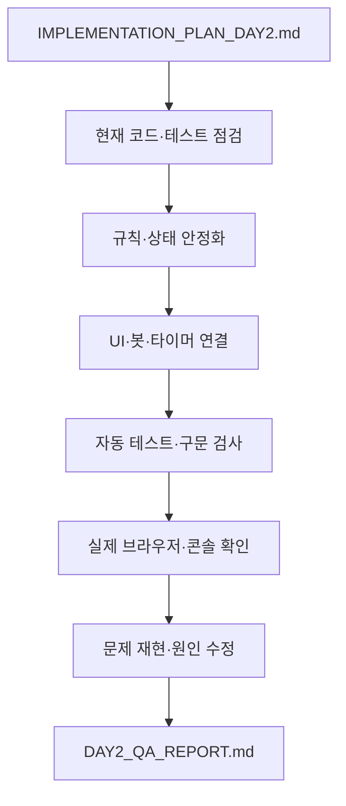
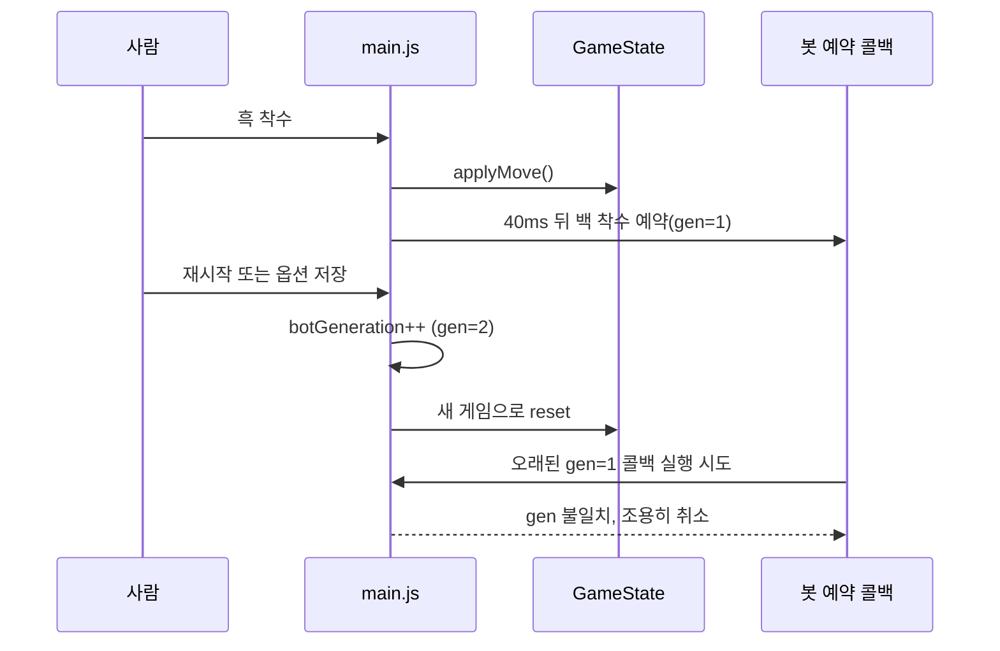

title: "Ornith 1.5 35B 오목 개발 Day 2: 계획을 구현으로 옮긴 2시간 27분"
slug: ornith-gomoku-qwen-code-day2
category: 기술 실험
summary: "지난 오목 웹앱에 이어 Ornith 1.5 35B와 Qwen Code로 싱글플레이 UI·상태 안정화를 진행한 기록이다. IMPLEMENTATION_PLAN_DAY2.md의 요구사항, 85개 테스트, 브라우저 검증, 잠재적 루프와 Unicode 편집 오류까지 실제 작업 흐름으로 정리했다."
tags: local-llm,omlx,ornith,qwen-code,agent,gomoku,renju,vanilla-js,testing,benchmark,debugging,tech-lab,ornith1-5
toc: true
publishedAt: 2026-09-04T06:36:42Z
prevSlug: ornith-gomoku-qwen-code-experiment
updatedAt: 2026-09-04T09:03:00.080679Z
syncHash: 8bf050c4592b1c3cf664816228ebb25f2a3fc1bc3d82db7695fa6b79b6fc0b94

---

> 이 글은 [첫 번째 오목 실험](/59/ornith-gomoku-qwen-code-experiment)의 다음 편이다. 첫날에는 Ornith 1.5 35B와 Qwen Code로 오목 웹앱의 뼈대를 만들었다면, 이번에는 그럴듯하게 보이는 화면을 실제로 계속 쓸 수 있는 상태로 다듬는 일을 맡겼다.

처음 화면을 봤을 때는 이미 꽤 많은 것이 들어와 있었다. 오목판, 봇, 수순, 채팅, 옵션, 타이머가 한 화면에 있었고 테스트도 통과했다. 그런데 “완료”라는 보고만 믿고 넘어가기에는 찜찜한 부분이 남아 있었다. 요청한 UI가 실제 이벤트와 연결되어 있는지, 재시작 직후 이전 봇 응답이 새 게임에 섞이지 않는지, 브라우저에서 모듈이 정말 로드되는지까지는 별도의 확인이 필요했기 때문이다.

그래서 Day 2는 기능을 더 많이 추가하는 작업이 아니라, 이미 만들어진 싱글플레이 MVP를 **계획서의 항목별로 대조하고, 상태 경계와 브라우저 실행을 검증하는 작업**으로 시작했다. 결론부터 말하면 계획서의 자동 검증 조건은 85개 테스트와 브라우저 검증으로 통과했다. 다만 좌표 라벨 여백처럼 사람이 화면에서 확인해야 하는 요구사항은 부분 반영으로 남았고, WebSocket 멀티플레이와 강한 오목 엔진은 애초에 범위 밖이었다. 즉 자동화된 완료 판정과 실제 사용자가 느끼는 완성도는 여전히 다른 문제였다.

## Day 2는 막연한 “더 다듬어줘”가 아니라 계획서로 시작했다

이번 요청의 기준 문서는 `qwen-test/IMPLEMENTATION_PLAN_DAY2.md`였다. 계획서에는 “웹소켓 멀티플레이까지 만들어 달라”가 아니라, 그 전에 싱글플레이에서 해결해야 할 상태·UI·타이머·봇·검증 항목이 적혀 있었다.

<details>
<summary>IMPLEMENTATION_PLAN_DAY2.md에서 이번 작업의 범위만 펼쳐보기</summary>

| 영역 | 계획서에 적은 확인 항목 |
| --- | --- |
| 규칙 | 표준 렌주룰의 흑 33·44·장목 금수, 백 허용, 자유 오목·양쪽 33 변형, 가장자리와 복합 위협 |
| 상태 | 무르기, 기권, 재시작, 시간 초과, 중복 입력, 타이머와 봇 예약 작업의 경계 |
| UI | 보드·패널 높이, 좌표 여백, 마지막 착수·금수·승리 라인, 모바일 레이아웃 |
| 패널 | 최근 수순 3개, 채팅 5개, 내부 스크롤, 옵션 모달과 실제 버튼 동작 |
| 봇 | 난이도별 동작, 즉시 승리·방어, 불법 착수 방지, 계산 중 UI 안정성 |
| 검증 | `npm test`, `npm run check`, 실제 브라우저 렌더링과 콘솔 오류 확인 |
| 범위 제외 | 실제 WebSocket 서버와 멀티플레이 구현 |

계획서의 핵심은 기능 목록만이 아니었다. 규칙 엔진을 먼저 확인하고, 상태를 안정화한 뒤, UI와 봇을 연결하고, 마지막에 브라우저에서 직접 검증하라는 순서까지 정해두었다. 이 순서 덕분에 “테스트는 통과했는데 화면은 빈 화면”인 상태를 완료로 착각하지 않을 수 있었다.

아래에는 요약이 아니라 실제 `IMPLEMENTATION_PLAN_DAY2.md` 원문을 그대로 보관했다. 접힌 상태에서는 글의 흐름을 방해하지 않고, 펼치면 당시 에이전트에게 전달한 범위·순서·완료 조건을 확인할 수 있다.

````markdown
# 오목 웹앱 Day 2 작업 계획

## 목표

현재 구현된 싱글플레이 오목 MVP의 완성도와 안정성을 높인다.

이번 단계에서는 실제 WebSocket 멀티플레이 서버를 구현하지 않는다. 규칙 엔진, 게임 상태, 타이머, 봇, UI의 오류를 보강하고 추후 멀티플레이에 재사용할 수 있는 구조만 유지한다.

## 현재 기준

- 작업 폴더: `qwen-test`
- 기본 규칙: 표준 렌주룰
- 보드: 15x15
- 현재 테스트: 72개 통과
- 실행 명령: `npm test`, `npm run check`

## 1. 규칙 엔진을 먼저 감사한다

대상 파일:

- `src/game/rules.js`
- `tests/rules.test.mjs`

확인할 내용:

- 표준 렌주룰에서는 흑만 33·44·장목 금지
- 표준 렌주룰에서 백 33·44·장목은 허용
- 자유 오목에서는 금수 없음
- `both33` 변형에서는 백 33 제한
- 흑 정확히 5목은 승리
- 흑 6목 이상은 장목으로 금지
- 백 5목 이상은 승리
- 가장자리와 모서리 판정
- 열린 3과 끊어진 3
- 열린 4와 끊어진 4
- 33·44·5목이 동시에 발생하는 경우의 우선순위

현재 테스트가 단순한 연속 돌 패턴만 검증한다면 실제 보드 fixture 테스트를 추가한다. 기존 테스트를 삭제하거나 약화하지 않는다.

## 2. 게임 상태와 타이머를 안정화한다

대상 파일:

- `src/game/state.js`
- `src/ui/clock.js`
- `src/main.js`
- `tests/state.test.mjs`

확인할 내용:

- 무르기 후 보드·턴·게임 상태가 일관되는지
- 인간 수와 봇 수를 무를 때 동작이 명확한지
- 승리·무승부·기권·시간 초과 후 무르기 정책이 일관되는지
- 무르기 후 타이머가 이전 값으로 복원되는지
- 재시작 직후 이전 봇 예약 작업이 실행되지 않는지
- 옵션 변경 후 이전 타이머와 봇 작업이 새 게임에 영향을 주지 않는지
- 기권이 현재 턴이 아니라 실제 기권한 플레이어를 기준으로 처리되는지
- `ClockController`가 `GameState`의 clocks 객체와 항상 동기화되는지
- 제한 시간 0 도달 시 한 번만 시간 초과 처리되는지
- 중복 클릭과 봇 계산 중 입력이 안전하게 무시되는지

필요한 경우 봇 예약 작업을 취소할 수 있는 방식이나 게임 세대 번호를 추가한다. 동작을 변경할 때마다 회귀 테스트를 추가한다.

## 3. UI와 사용성을 보강한다

대상 파일:

- `index.html`
- `styles.css`
- `src/ui/*.js`

확인할 내용:

- 데스크톱에서 게임판 2/3, 진행 패널 1/3 비율 유지
- 모바일에서 보드가 잘리지 않고 패널을 사용할 수 있음
- 마지막 착수·현재 턴·금수 위치·승리 라인이 구분됨
- 게임 종료 상태가 승리·패배·무승부·기권·시간 초과별로 명확함
- 옵션 모달이 ESC와 닫기 버튼으로 닫힘
- 버튼·보드에 기본적인 aria-label과 키보드 접근성 제공
- 봇 계산 중 중복 착수 방지
- 채팅 입력이 HTML을 실행하지 않고 안전하게 표시됨
- 긴 수순과 채팅이 패널 밖으로 넘치지 않음
- 콘솔 오류가 발생하지 않음

### 보드 디자인을 개선한다

현재 화면에서는 좌표 라벨과 첫 번째 교차점이 너무 가까워 `A1` 주변이 답답하게 보인다. 다음 방식으로 개선한다.

- 데스크톱에서는 오목판 외곽 높이와 우측 진행 패널 전체 높이를 일치시킨다.
- 보드와 진행 패널을 같은 게임 영역 컨테이너 안에서 같은 높이로 배치한다.
- 우측 패널 내용이 길어져도 패널 자체 높이가 늘어나 보드와 어긋나지 않게 한다.
- 패널 내부에서 스크롤이 필요한 영역만 수순·채팅 영역으로 제한한다.
- 좌표 라벨을 보드 격자와 별도의 상·좌측 여백에 배치한다.
- 첫 번째 교차점과 `A`·`1` 라벨 사이에 충분한 간격을 둔다.
- 보드 외곽 여백과 격자 영역의 크기를 분리해 계산한다.
- 돌이 격자선과 라벨을 가리지 않도록 셀 크기와 돌 크기를 조정한다.
- 15x15 전체 보드 비율은 유지하되, 데스크톱에서 지나치게 촘촘해 보이지 않는지 확인한다.
- 모바일에서도 라벨과 착수 영역이 겹치지 않도록 한다.
- 중앙 화점, 마지막 착수, 금수, 승리 라인의 시각적 우선순위를 구분한다.

### 우측 패널의 실제 동작을 완성한다

현재 화면에 보이는 버튼과 선택 컨트롤은 모양만 존재하지 않고 실제 상태 변경과 연결되어야 한다.

- `변형` 버튼은 옵션 모달의 규칙 선택 영역을 연다.
- 규칙을 변경하고 저장하면 새 게임으로 안전하게 시작한다.
- 봇 난이도 변경이 명확한 정책으로 반영된다.
- 제한 시간 변경 시 양쪽 타이머가 초기화되고 카운트다운이 시작된다.
- `무르기`는 현재 게임 상태와 봇 예약 작업을 함께 고려한다.
- `기권`은 실제 인간 플레이어의 기권으로 처리한다.
- `재시작`은 이전 봇 작업·타이머·승리 표시를 남기지 않는다.
- 게임 종료 후 비활성화된 버튼은 이유가 보이도록 처리한다.
- 수순 영역만 독립적으로 스크롤되고 주요 액션은 찾기 쉽도록 배치한다.
- 클릭 가능한 요소는 hover·focus·disabled 상태를 구분한다.

### 진행 패널의 표시량과 옵션 위치를 고정한다

- 수순 목록은 최근 3개 항목이 기본으로 보이는 고정 높이 영역으로 구성한다.
- 수순이 3개를 넘으면 영역 내부에서만 스크롤한다.
- 새 수가 추가되면 최신 수가 보이도록 수순 스크롤 위치를 갱신한다.
- 채팅은 최근 5개 메시지가 기본으로 보이는 고정 높이 영역으로 구성한다.
- 채팅이 5개를 넘으면 영역 내부에서만 스크롤한다.
- 수순·채팅 영역이 늘어나 전체 레이아웃이나 주요 액션 버튼을 밀어내지 않도록 한다.
- 마우스 휠과 터치 스크롤이 해당 영역에서 자연스럽게 동작한다.
- 규칙, 봇 난이도, 제한 시간은 우측 패널에 상시 노출하지 않고 옵션 모달 안에서 설정한다.
- 옵션을 저장하면 설정이 실제 GameState와 화면에 반영되고, 필요한 경우 새 게임으로 시작한다.
- 규칙·난이도·제한 시간의 현재 설정은 옵션을 다시 열었을 때 유지되어 보여야 한다.

### 무르기와 기권 정책을 분리한다

- 싱글플레이 봇전에서도 무르기를 제공한다.
- 봇전의 무르기는 마지막 착수 1수를 강제로 되돌리고 인간의 턴으로 복원한다.
- 봇전에서 무르기를 누르면 이미 예약된 봇 응답이 취소되거나 무시되어야 한다.
- 추후 사람 대 사람 멀티플레이에서는 같은 UI를 무르기 요청·상대 수락 절차로 확장할 수 있게 인터페이스를 보존한다.
- 기권은 게임이 진행 중인 동안 언제든지 사용할 수 있다.
- 기권 버튼은 현재 차례와 관계없이 실제 플레이어의 게임 포기로 처리한다.
- 기권하면 즉시 게임을 종료하고 상대 승리 상태를 표시한다.
- 게임이 이미 종료된 뒤에는 기권을 중복 실행할 수 없게 한다.

전면 재디자인보다는 현재 다크 테마의 색상 체계와 컴포넌트 구조를 유지하면서 간격, 계층, 상태 표현을 개선한다.

시각 디자인은 현재 모던한 다크 테마를 유지하고, 필요 이상의 전면 재디자인은 하지 않는다.

## 회고에서 확인한 브라우저 검증 원칙을 적용한다

이전 Ornith 오목 실험에서는 Node 테스트와 구문 검사가 통과했지만, 브라우저에서는 모듈 named export 불일치로 초기화가 중단되어 빈 화면이 나타났다. 따라서 Day 2에서는 자동 테스트 통과만으로 완료 처리하지 않는다.

- 정적 서버를 실행한 뒤 실제 브라우저에서 `index.html`을 연다.
- `main.js`와 모든 하위 모듈의 import/export 연결을 확인한다.
- 보드·패널·버튼이 초기 렌더링되는지 확인한다.
- 브라우저 콘솔의 uncaught exception과 failed module load를 확인한다.
- 주요 버튼을 실제로 클릭해 상태 변경과 재렌더링을 확인한다.
- 브라우저 확인 결과를 `DAY2_QA_REPORT.md`에 자동 테스트 결과와 분리해 기록한다.
- Node 테스트가 통과했더라도 브라우저가 비어 있으면 완료로 보고하지 않는다.

별도로 다음 오류를 확인한다.

- named export/import 이름 불일치
- 상대 경로·파일 확장자 오류
- `file://` 실행으로 인한 ES Module 차단
- DOM 선택자 누락
- 초기화 중 예외로 인한 전체 화면 미렌더링
- 옵션·버튼 이벤트 미연결

## 4. 봇 난이도와 응답 안정성을 확인한다

대상 파일:

- `src/game/bot.js`
- `tests/bot.test.mjs`

확인할 내용:

- 하·중·상·최상 4단계가 모두 선택됨
- 즉시 승리 수를 항상 우선함
- 상대의 즉시 승리 수를 막음
- 잘못된 난이도 입력을 안전하게 처리함
- 봇이 불법 착수를 반환하지 않음
- 봇이 보드를 직접 훼손하지 않음
- 최상 난이도 계산 중 UI가 영구적으로 멈추지 않음
- 게임 종료·재시작 이후 이전 봇 응답이 남지 않음

이번 단계에서는 강력한 바둑 수준의 AI를 만들 필요가 없다. 난이도별 동작 차이와 안정성 검증을 우선한다.

## 5. 검증과 기록을 남긴다

반드시 실행한다.

```bash
npm test
npm run check
```

가능하면 정적 서버도 실행해 확인한다.

```bash
npm start
```

브라우저에서 다음을 확인한다.

- 착수와 턴 전환
- 흑 33·44·장목 표시와 거부
- 백의 착수 허용
- 봇 응답
- 무르기·기권·재시작
- 제한 시간과 시간 초과
- 옵션 변경
- 채팅
- 모바일 레이아웃
- 수순은 최근 3개가 보이고 초과분만 내부 스크롤된다.
- 채팅은 최근 5개가 보이고 초과분만 내부 스크롤된다.
- 규칙·봇 난이도·제한 시간은 옵션 모달 안에서만 변경된다.
- 싱글플레이 봇전에서도 마지막 착수 1수 무르기가 가능하다.
- 오목판 외곽 높이와 우측 진행 패널 전체 높이가 일치한다.

작업이 끝나면 `DAY2_QA_REPORT.md`를 생성하고 다음 내용을 기록한다.

- 발견한 문제
- 수정한 파일
- 추가한 테스트
- 실행한 명령과 결과
- 수동 확인 항목
- 아직 남은 한계
- 멀티플레이 단계로 넘길 사항

## 완료 조건

- 기존 72개 테스트가 계속 통과한다.
- 추가한 규칙·상태·봇 테스트가 모두 통과한다.
- `npm run check`가 통과한다.
- 표준 렌주룰에서 백에게 금수를 적용하지 않는다.
- 무르기·재시작·옵션 변경·타이머·봇 예약 작업이 서로 충돌하지 않는다.
- UI가 데스크톱과 모바일에서 기본 기능을 제공한다.
- 보드 좌표 라벨이 격자와 겹치지 않고 `A1` 주변에 충분한 여백이 있다.
- `변형`, 옵션, 난이도, 제한 시간, 무르기, 기권, 재시작이 실제 상태 변경과 연결된다.
- 수순·채팅 패널의 높이가 고정되고 각각 최근 3개·5개 기준으로 내부 스크롤된다.
- 규칙·봇 난이도·제한 시간이 옵션 모달에서 동작한다.
- 봇전에서 마지막 착수 1수 무르기가 동작하고 기권은 진행 중 언제든지 동작한다.
- 오목판과 우측 진행 패널의 전체 높이가 일치한다.
- 종료된 게임에서 버튼 상태와 승리 표시가 일관된다.
- 콘솔 오류와 치명적인 입력 중복 문제가 없다.
- `DAY2_QA_REPORT.md`에 검증 결과가 기록되어 있다.
- 실제 WebSocket 서버는 이번 단계에서 구현하지 않는다.

## Qwen Code 실행 지시문

이 파일을 읽은 새 Qwen Code 세션에서 다음을 입력한다.

```text
IMPLEMENTATION_PLAN_DAY2.md를 처음부터 끝까지 읽고, 문서의 작업 범위와 완료 조건에 따라 구현해줘.

먼저 현재 파일과 기존 테스트를 읽고 기준 상태를 확인해. 기존 72개 테스트를 보존하고, 테스트를 약화하거나 삭제하지 마.
규칙 엔진 감사와 회귀 테스트를 먼저 진행한 뒤 게임 상태·타이머·봇·UI 순서로 작업해.
UI 작업에서는 보드 좌표 라벨의 여백과 우측 패널의 실제 기능 연결을 반드시 확인해.
화면에 있는 버튼을 단순히 예쁘게 만드는 것으로 끝내지 말고, 클릭 후 상태가 바뀌고 화면이 다시 렌더링되는지 확인해.
수순과 채팅은 고정 높이 내부 스크롤로 구현하고, 각각 최근 3개와 5개가 기본으로 보이게 해.
규칙·봇 난이도·제한 시간은 옵션 모달로 이동해.
싱글플레이 봇전에서도 무르기를 허용하고 마지막 착수 1수를 되돌려 인간의 턴으로 복원해.
기권은 게임 진행 중 현재 턴과 관계없이 사용할 수 있게 해.
오목판과 우측 패널의 전체 높이를 일치시키고, 수순·채팅 영역만 내부 스크롤되게 해.
표준 렌주룰에서는 흑만 33·44·장목 금지이며 백에는 금수를 적용하지 않아야 한다.

실제 WebSocket 멀티플레이 서버와 대규모 전면 재디자인은 이번 작업에서 제외해.
오류가 발생하면 원인을 분석하고 수정한 뒤 실패했던 동일한 테스트를 다시 실행해.
완료를 주장하기 전에 npm test와 npm run check를 실행하고 결과를 확인해.
마지막에는 계획서의 요구대로 DAY2_QA_REPORT.md를 작성해.
```
````

</details>

당시 Qwen Code 세션에 실제로 입력한 `/goal` 프롬프트는 다음과 같다. Qwen Code의 세션 기록에 남아 있는 목표 원문을 그대로 옮겼다.

```text
/goal

현재 디렉터리의 IMPLEMENTATION_PLAN_DAY2.md를 읽고, 계획에 정의된 작업을 완료 조건까지 전부 진행해줘.

이번 목표는 WebSocket 구현 전 단계의 오목 싱글플레이 UI/UX 개선과 기능 버그 수정이야.

반드시 다음을 구현하고 검증해:

- 오목판과 우측 UI 패널의 전체 높이를 동일하게 맞추기
- 수순 영역은 최근 3개를 표시하고 나머지는 내부 스크롤
- 채팅 영역은 최근 5개를 표시하고 나머지는 내부 스크롤
- 룰, 게임 변형, 봇 난이도, 제한 시간은 옵션 모달에서 설정
- 옵션·변형·재시작 등 주요 버튼을 실제로 동작시키기
- 제한 시간 타이머가 게임 시작 및 턴 변경에 맞춰 정상적으로 카운트다운
- 시간 초과 시 게임 종료와 승패 표시
- 봇전에서도 무르기 허용
- 봇전 무르기 시 마지막 한 수를 되돌리고 사람 차례로 복원
- 무르기 이후 이전 봇 응답이 다시 실행되지 않도록 처리
- 게임 진행 중에는 어느 차례든 기권 가능
- 데스크톱과 모바일 화면에서 레이아웃이 깨지지 않도록 개선
- 기존 게임 규칙과 테스트 동작을 보존
- WebSocket이나 멀티플레이 서버는 이번 목표에 포함하지 않기

기존 구현을 먼저 점검한 뒤 필요한 부분만 수정하고, 계획의 모든 완료 조건을 충족할 때까지 작업을 계속해줘.

Node 테스트 통과만으로 완료 처리하지 말고 실제 브라우저에서 초기 화면 렌더링, 콘솔 오류, 옵션 열기, 설정 변경, 타이머, 무르기,
기권, 재시작, 반응형 레이아웃까지 확인해줘.

마지막에는 구현 내용과 검증 결과를 DAY2_QA_REPORT.md에 정리해줘.
```

이렇게 요청하면 모델이 잘 코딩하는지만 보는 것이 아니라, 다음과 같은 작업 프로토콜을 관찰할 수 있다.



계획서는 사람이 준비한 입력이고, 코드·테스트·검증 결과는 에이전트 세션에서 나온 출력이다. 따라서 이번 글을 “모델이 계획부터 제품까지 혼자 만들었다”는 사례로 읽으면 안 된다. 관찰한 것은 명확한 요구사항과 완료 조건을 줬을 때 로컬 코딩 에이전트가 여러 파일의 수정과 검증을 어느 정도 연결하는가에 가깝다.

## 요청한 항목과 실제 반영 결과를 대조했다

작업 후 “전반적으로 반영되지 않은 것 같다”는 느낌이 들 수 있어서, 화면의 인상 대신 계획서와 QA 리포트를 한 항목씩 맞춰봤다.

| 요청 항목 | 실제 구현·검증 결과 |
| --- | --- |
| 오목판과 우측 패널 높이 일치 | `.game-area`와 `.panel-area`를 stretch하고 브라우저에서 높이 차이를 3px 미만으로 확인 |
| 수순 최근 3개 표시 | `history.slice(-3)`와 `max-height: 60px; overflow-y: auto` 적용 |
| 채팅 최근 5개 표시 | `messages.slice(-5)`와 `max-height: 160px; overflow-y: auto` 적용 |
| 좌표 라벨과 첫 교차점 사이 여백 | **부분 반영.** 코드에는 `padding = 38px`가 들어갔지만, 실제 화면의 `1`·`A`와 첫 교차점은 여전히 가까워 시각적 요구를 충분히 만족하지 못함 |
| 룰·난이도·제한 시간 옵션 | 옵션 모달에서 선택하고 저장하면 새 게임으로 초기화 |
| 주요 버튼 동작 | 변형, 옵션, 무르기, 기권, 재시작이 실제 상태 변경 콜백에 연결 |
| 타이머 | 게임 시작·턴 변경에 맞춰 동작하고 시간 초과 상태를 게임 상태에 기록 |
| 봇전 무르기 | 마지막 착수를 되돌리고 사람 차례로 복원 |
| 예약된 봇 응답 | 재시작·옵션 저장·무르기 때 세대 번호를 바꿔 오래된 응답을 무효화 |
| 진행 중 기권 | 현재 게임이 진행 중이면 흑 기권과 백 승리 상태로 전환 |
| 데스크톱·모바일 | 820px 이하에서 보드와 패널을 세로로 배치하는 브라우저 테스트 통과 |
| 기존 규칙과 테스트 | 규칙·상태·봇 테스트를 보존하고 Day 2 회귀 테스트를 추가 |
| WebSocket | 구현하지 않음. 계획서에서 이번 단계의 범위 밖으로 명시 |

따라서 상태·버튼·스크롤과 관련된 기능 요구사항의 대부분은 실제로 반영됐다. 반면 좌표 라벨 여백은 “반영됐다”고 뭉뚱그리면 안 된다. `padding = 38px`라는 숫자와 클릭 좌표 계산은 추가됐지만, 내가 요청했던 것처럼 좌측 상단의 `1`과 `A`가 첫 교차점에서 충분히 떨어져 보이는 시각적 결과까지는 도달하지 못했다. 아래에서 이 차이를 코드와 화면 기준으로 다시 확인한다.

또 이 표가 말해주는 것은 “계획서의 자동 검증 조건 대부분을 만족했다”는 뜻이지, 오목 서비스가 제품 수준으로 완성됐다는 뜻은 아니다. 실제 멀티플레이는 없고, 봇은 전문 오목 엔진이 아니며, 타이머의 1초 단위 시각 정확도는 깊게 측정하지 않았다. 좌표 여백처럼 자동 검증 밖에서 부분 완료로 남은 항목도 있다. 이 차이를 분리해서 적는 것이 이번 기록의 중요한 부분이다.

## 요청했던 항목이 실제로 끝났는지 마지막에 다시 체크했다

계획서의 문장을 그대로 기준으로 삼아, “완료”, “부분 완료”, “범위 제외”를 나눴다. 특히 좌표 라벨은 QA 리포트의 성공 문구만으로 완료 처리하지 않고 실제 캡처와 코드까지 대조했다.

| 요청 항목 | 최종 판정 | 근거 |
| --- | :---: | --- |
| 오목판·우측 패널 전체 높이 일치 | 완료 | stretch 레이아웃과 브라우저 높이 차이 테스트 |
| 수순 최근 3개 + 내부 스크롤 | 완료 | `slice(-3)`, 고정 높이, 스크롤 테스트 |
| 채팅 최근 5개 + 내부 스크롤 | 완료 | `slice(-5)`, 고정 높이, 스크롤 테스트 |
| 룰·난이도·시간을 옵션 모달에서 설정 | 완료 | 옵션 모달 열기·저장·새 게임 초기화 확인 |
| 변형·옵션·무르기·기권·재시작 버튼 | 완료 | 상태 변경 콜백과 브라우저 동작 확인 |
| 제한 시간과 시간 초과 상태 | 완료 | 상태 전이 테스트와 기본 UI 확인 |
| 봇전 무르기 | 완료 | 마지막 착수 1수 제거 후 흑 턴 복원 |
| 오래된 봇 예약 응답 취소 | 완료 | `botGeneration`과 재시작·옵션 회귀 테스트 |
| 데스크톱·모바일 레이아웃 | 완료 | 820px viewport 브라우저 테스트 |
| 기존 규칙·테스트 보존 | 완료 | 기존 테스트를 유지한 채 전체 85 pass |
| 브라우저 초기 렌더링·콘솔 확인 | 완료 | 시스템 Chrome에서 8개 브라우저 검증 |
| 좌측 상단 `1`·`A` 시각적 여백 | 부분 완료 | 격자 밖 배치와 클릭 계산은 보강됐지만 간격은 여전히 좁음 |
| 실제 WebSocket 멀티플레이 | 범위 제외 | Day 2 계획서에서 명시적으로 제외 |

이 표가 이번 글의 가장 정확한 결론이다. “85개 테스트 통과”는 대부분의 기능·상태 요구사항을 뒷받침하지만, 좌표 여백처럼 사람의 눈으로 판단해야 하는 요구사항까지 자동으로 완료시켜 주지는 않는다.

## Day 1과 Day 2의 오목판을 나란히 비교했다

글을 정리한 뒤에도 어제 세션이 조금 남아 있어 오목판을 다시 실행해봤다. 아래는 전체 화면에서 **오목판 영역만 같은 방식으로 잘라낸 Day 1·Day 2 비교 컷**이다. 두 화면은 착수 수와 게임 상태가 다르므로 픽셀 단위의 A/B 테스트가 아니라, **좌표 라벨·첫 교차점·보드 바깥 여백이 실제로 어떻게 보이는지 확인하는 시각 자료**로 봐야 한다.

| Day 1 오목판 | Day 2 오목판 |
| --- | --- |
|  |  |

두 화면을 비교하면 좌표 계산과 보드 비율은 유지되지만, `A`는 첫 세로선 바로 위에, `1`은 첫 가로선 바로 왼쪽에 놓여 있어 “좌표 전용 gutter가 충분히 넓다”고 말하기에는 여전히 여유가 작다. 따라서 이 비교 컷은 앞에서 판정한 **부분 완료**를 뒤집는 증거가 아니라, 다음 수정에서 무엇을 눈으로 확인해야 하는지를 보여주는 보충 자료다. 기능적으로는 보드와 패널이 안정적으로 함께 동작하지만, 좌표 표시의 시각적 완성도는 별도의 UI 작업으로 남아 있다.

## 화면보다 먼저 상태 경계를 고쳤다

Day 2에서 가장 의미 있는 수정은 화려한 CSS가 아니라 `botGeneration`이라는 세대 번호였다. 사람이 흑돌을 놓으면 `main.js`는 봇의 백돌을 바로 계산하지 않고 40ms 뒤에 예약한다. 이 짧은 지연은 사람의 착수가 먼저 그려지도록 하기 위한 것이다.

문제는 그 40ms 안에 재시작이나 옵션 저장이 들어오는 경우였다. 기존 코드는 무르기에서는 예약을 무효화했지만, 재시작과 옵션 저장에서는 세대 번호를 증가시키지 않았다. 그러면 오래된 봇 콜백이 새 게임의 상태를 보고 다시 실행될 수 있었다.



수정은 작았다. 하지만 이 버그는 일반적인 느린 클릭에서는 잘 드러나지 않고, 봇 예약 직후의 빠른 조작에서만 발생한다. 그래서 Day 2 회귀 테스트는 클릭과 재시작 또는 옵션 저장을 40ms 창 안에 연속으로 실행해 이 경계를 결정적으로 확인했다.

```js
function handleReset() {
  botGeneration++;
  resetGame(state, { gameStatus: STATUS.PLAYING });
  ensureClockRunning();
}

function handleApplyOptions(options) {
  // 옵션을 state와 clock에 반영한 뒤 새 게임으로 시작한다.
  clock.setClocks(state.clocks);
  botGeneration++;
  resetGame(state, { gameStatus: STATUS.PLAYING });
  ensureClockRunning();
}

function maybeAiMove() {
  const gen = ++botGeneration;
  setTimeout(() => {
    if (gen !== botGeneration) return;
    if (state.gameStatus !== STATUS.PLAYING) return;
    applyMove(state, getBotMove(state, state._difficulty));
    renderAll();
  }, 40);
}
```

위 코드는 실제 코드의 흐름을 설명하기 위한 축약본이다. 핵심은 타이머를 `clearTimeout`으로 지우는 대신, 예약이 실행되더라도 현재 게임 세대와 다르면 상태 변경을 허용하지 않는다는 점이다. 이 패턴은 나중에 서버 응답, 네트워크 재연결, 비동기 검색 결과를 취소할 때도 재사용할 수 있다.

## 세션이 끝나기 직전에는 앱이 아니라 에이전트가 멈췄다

Qwen Code 화면에는 세션이 끝나기 직전의 상태가 `Goal paused (2h 27m)`과 `21 tasks done`으로 표시됐다. 이 캡처는 최종 완료 화면이 아니라, 마무리 단계에서 잠시 멈춘 시점의 기록이다. 그 바로 위에 다음 메시지가 남았다.


```text
A potential loop was detected. This can happen due to repetitive tool calls
or other model behavior. The request has been halted.
```

이 문구를 보고 “오목 앱에 무한 루프가 있었다”고 해석하면 안 된다. 여기서 멈춘 주체는 브라우저의 게임 루프가 아니라, Qwen Code가 모델의 도구 호출 흐름에서 반복 패턴을 감지하는 보호 장치다. 파일 읽기·편집·재시도·검증이 같은 형태로 반복되면 실제 애플리케이션이 정상이어도 하네스가 작업을 중단할 수 있다.

비슷한 현상은 Qwen Code의 [loop detection 관련 이슈](https://github.com/QwenLM/qwen-code/issues/865)와 [반복 도구 호출이 중단되는 사례](https://github.com/QwenLM/qwen-code/issues/223)에서도 보고돼 있다. 이런 이슈는 “모델이 정말 무한 루프에 빠졌다”는 증거라기보다, 에이전트가 반복적인 수정·검증을 계속할 때 하네스의 안전장치와 실제 작업의 정상 반복을 어떻게 구분할지 아직 까다롭다는 점을 보여준다.

이번 세션 기록만으로 정확히 어떤 호출 시퀀스가 임계값을 넘었는지는 단정하지 않았다. 다만 화면에 표시된 21개 작업과 최종 QA 결과를 함께 보면, 잠재적 루프가 애플리케이션 실행 실패를 의미한다고 보기는 어렵다. 안전한 해석은 다음과 같다.

| 관찰 | 말할 수 있는 것 | 말할 수 없는 것 |
| --- | --- | --- |
| `potential loop` 메시지 | 에이전트 요청이 반복 호출 보호 장치에 의해 중단됨 | 앱 코드에 무한 루프가 있었다는 결론 |
| `Goal paused` | 세션이 자동으로 계속되지 않고 멈춤 | 구현이 실패했다는 결론 |
| 이후 QA | 별도 확인에서 85개 테스트와 브라우저 8개 검증이 통과 | 모든 미래 입력과 모든 환경에서 안전하다는 보장 |

이 문제를 줄이려면 한 번의 Goal에 너무 많은 범위를 넣지 않고, 계획서의 단계별로 완료 조건을 나누는 편이 낫다. 또한 같은 실패를 무작정 재시도하게 하기보다, 실패 로그·수정 대상·재실행할 동일 테스트를 다음 요청에 명시해야 한다. 에이전트의 “계속해”보다 “방금 실패한 `npm test`를 다시 실행하고 원인을 먼저 설명해”가 복구 루프를 짧게 만든다.

## 중간에는 한글 테스트 이름 한 줄이 편집을 막았다

세션 중간에는 `tests/state.test.mjs`의 시간 초과 테스트 이름이 정상적인 한글이 아닌 형태로 표시되는 문제가 있었다. 모델이 바꾸려던 문자열과 파일에 실제로 들어 있는 문자열이 달랐기 때문에, 정확한 부분 문자열을 찾는 편집 도구가 교체 지점을 찾지 못했다.


이 현상은 앞의 `potential loop`와 비슷해 보이지만 성격은 다르다.

- `potential loop`: 에이전트의 도구 호출 흐름을 하네스가 반복으로 판단한 문제
- 한글 편집 오류: 모델이 지정한 문자열과 파일의 실제 Unicode 코드 포인트가 일치하지 않은 문제

한글이 깨졌다고 해서 항상 UTF-8 인코딩 전체가 망가진 것은 아니다. 이번 로그에서는 비슷하게 보이는 문자, 잘못된 코드 포인트, 대체 문자 여부가 섞이면서 “눈으로 보기에는 비슷하지만 exact match는 실패하는” 상황이 생겼다. 그래서 모델은 문자열 일부를 억지로 다시 쓰는 대신, Python으로 정확한 코드 포인트를 기준으로 한 번만 교체하고 파일 전체에서 `U+FFFD`와 비ASCII 이상 문자를 스캔했다.

최종 파일의 테스트 이름은 다음처럼 정상화됐다.

```js
test('timeout: 시간 초과는 상대 승리로 전환된다', () => {
  const s = createGameState();
  s.gameStatus = STATUS.PLAYING;
  timeout(s, WHITE);
  assert.equal(s.gameStatus, STATUS.BLACK_TIMEOUT);
});
```

여기서 중요한 교훈은 “한글을 영어로 바꾸면 된다”가 아니다. 코드 편집에서는 화면에 보이는 글자보다 실제 문자열의 코드 포인트가 중요하고, 수정 뒤에는 해당 줄만 보는 것이 아니라 파일 전체를 다시 검사해야 한다는 것이다. 특히 테스트 이름은 실행 로직과 무관해 보여도, exact-match 편집의 기준점이 될 수 있으므로 깨진 상태로 방치하지 않는 편이 좋다.

## 마지막에는 85개 테스트와 브라우저 검증으로 완료를 다시 확인했다

문제 수정 뒤 `DAY2_QA_REPORT.md`에 남은 최종 검증 결과는 다음과 같다.


| 검증 층 | 명령 또는 확인 방법 | 결과 |
| --- | --- | --- |
| 규칙·상태·봇 | `npm test` | 85 pass / 0 fail |
| JavaScript 문법 | `npm run check` → `node --check src/main.js` | 통과 |
| 초기 렌더링 | Playwright + 시스템 Chrome | 콘솔 오류 없이 보드·패널 렌더 |
| 수순 영역 | 5수 착수 후 DOM·scrollHeight 확인 | 최근 3개 + 내부 스크롤 |
| 채팅 영역 | 7개 메시지 삽입 후 DOM 확인 | 최근 5개 + 내부 스크롤 |
| 옵션 | 모달 열기와 난이도·시간·규칙 확인 | 통과 |
| 상태 액션 | 무르기·기권·재시작 | 통과 |
| 예약 충돌 | 착수 직후 재시작·옵션 저장 | 옛 봇 응답 없음 |
| 반응형 | 820px viewport | 보드·패널 세로 배치 |

브라우저 테스트는 총 8개가 통과했다. 특히 이 실험에서는 Node 테스트만으로 완료 처리하지 않도록 요청했기 때문에, 서버를 실제로 띄우고 Chrome에서 DOM과 콘솔을 확인한 점이 중요하다. 과거 Day 1처럼 모듈 import가 어긋나면 테스트 파일만으로는 알기 어려운 빈 화면이 생길 수 있기 때문이다.

세부 테스트 수는 다음과 같다.

| 테스트 파일 | 수 | 범위 |
| --- | ---: | --- |
| `tests/rules.test.mjs` | 20 | 렌주 금수와 승리 판정 |
| `tests/state.test.mjs` | 28 | 상태 전이·타이머·무르기·기권 |
| `tests/bot.test.mjs` | 28 | 난이도·즉시 승리·방어·불변성 |
| `tests/day2-ui.test.mjs` | 8 | UI와 재시작·옵션 회귀 |
| `playwright-smoke.test.mjs` | 1 | 브라우저 스모크 |
| **합계** | **85** | **85 pass / 0 fail** |

자동 테스트가 보장하는 것도 정확히 적어둘 필요가 있다. 시간 초과가 올바른 게임 상태로 전환되는지는 상태 테스트로 확인했지만, 실제 화면의 1초 카운트다운이 모든 브라우저 프레임에서 정확히 보이는지까지 깊게 측정한 것은 아니다. `main.js` 자체의 DOM 오케스트레이션은 유닛 테스트보다 Playwright 브라우저 검증으로 확인했다.

## 최종 UI에서 확인한 것은 “예쁜 화면”보다 상태의 흔적이다

수정 뒤 실제 한 판을 진행한 화면은 다음과 같다.


최종 화면에서 확인할 수 있는 요소는 다음과 같다.

- 15×15 오목판의 A–O, 1–15 좌표와 중앙 화점
- 사람과 `Ornith Bot`의 현재 턴 표시
- 마지막 착수와 승리 라인의 시각적 구분
- 수순 영역의 내부 스크롤
- 채팅 입력과 최근 메시지 영역
- 봇 난이도와 제한 시간을 옵션 모달에서 설정하는 흐름
- 무르기·기권·재시작·옵션 버튼

이 화면만 보면 완성된 작은 게임처럼 보인다. 하지만 실제로 더 중요했던 것은 화면 뒤의 상태 전이다. 무르기를 누른 뒤 봇 응답이 다시 오지 않는지, 재시작 뒤 보드가 정말 비어 있는지, 옵션을 바꾼 뒤 이전 타이머가 살아 있지 않은지처럼 사용자가 한 번에 알아채기 어려운 경계를 확인했다.

## 좌측 상단 `1A` 여백은 계획서만큼 개선되지 않았다

여기서는 QA 리포트의 표현을 그대로 받아들이지 않고 실제 화면을 기준으로 정정한다. 현재 `BoardView`에는 `this.padding = 38`이 들어가고, 격자는 그 값에서 시작한다. 그러나 좌표 문자는 `p * 0.4` 위치에 그려진다.

```js
const p = this.padding; // 38px

// 격자 첫 교차점
const firstGridPoint = p;

// A와 1의 중심
ctx.fillText(letters[i], p + i * cell, p * 0.4);
ctx.fillText(String(i + 1), p * 0.4, p + i * cell);
```

따라서 첫 교차점과 라벨 중심의 차이는 `38 - 15.2`, 즉 약 22.8 CSS 픽셀이다. 라벨이 격자 안에 들어간 것은 아니지만, 사용자가 말한 “좌측 상단의 1A 쪽을 더 떨어뜨려 달라”는 기준으로 보면 충분한 시각적 여백이라고 하기 어렵다. Day 2 테스트는 이 값을 이용한 클릭 좌표와 보드·패널 높이를 검증했을 뿐, 라벨과 첫 교차점 사이의 실제 시각 간격을 판정하지 않았다.

이 부분은 계획서의 문장과 테스트의 성공을 분리해서 읽어야 하는 사례다.

| 판정 대상 | Day 2에서 확인한 것 | 아직 부족한 것 |
| --- | --- | --- |
| 좌표 계산 | `padding = 38` 기준으로 클릭 위치가 보드 좌표로 변환됨 | 없음 |
| 격자와 라벨의 겹침 | 라벨이 격자 내부에 들어가지는 않음 | `1`·`A`와 첫 교차점이 더 여유 있게 보이는지에 대한 시각 기준 |
| 사용자 요청 | 좌측 상단 영역이 답답하지 않게 개선 | 현재 화면은 기존 인상과 크게 달라지지 않음 |

그러므로 이 글의 최종 평가는 “좌표 여백 개선 완료”가 아니라 **좌표 계산은 보강됐지만 시각적 여백 개선은 미완료**다. 실제로 더 고치려면 라벨 전용 gutter와 격자 영역을 별도 계산하고, `padding`과 라벨 중심 위치를 함께 조정한 뒤 스크린샷과 픽셀 기준으로 다시 확인해야 한다. 이번 글에서는 그 작업을 끝낸 것처럼 기록하지 않는다.

## Day 2의 시간과 토큰을 Day 1과 분리해서 기록했다

이번 세션은 모델 자체의 단일 요청 속도만 재는 벤치마크가 아니라, Qwen Code가 파일을 읽고 편집하고 테스트를 다시 실행한 전체 에이전트 작업이다. 그래서 화면에 표시된 Goal 사용 시간과 API 사용량 로그를 같은 수치로 취급하지 않았다.

| 지표 | Day 1 | Day 2 |
| --- | ---: | ---: |
| 화면에 표시된 Goal 시간 | 2시간 58분 | 2시간 27분 |
| 모델 요청 수 | 179회 | 303회 |
| 입력 토큰 | 9,705,033 | 16,219,841 |
| 출력 토큰 | 275,019 | 297,262 |
| 추론 토큰 | 159,202 | 172,730 |
| 캐시 입력 토큰 | 8,327,168 | 14,614,528 |
| 합산 API 처리 시간 | 3시간 19분 57초 | 3시간 40분 42초 |
| 출력+추론 / API 시간 | 약 36.2 tok/s | 약 35.5 tok/s |

Day 2는 화면의 Goal 시간은 더 짧지만 모델 요청 수와 입력 토큰은 더 많았다. 기존 프로젝트와 계획서, 테스트 결과, 브라우저 로그를 계속 컨텍스트에 넣고 수정·재검증했기 때문이다. 캐시 입력 비율은 Day 1 약 85.8%, Day 2 약 90.1%로 계산된다.

다만 마지막 행의 속도를 일반적인 모델 Decode TPS라고 부르면 안 된다. `API 처리 시간`에는 긴 컨텍스트의 프리필, 추론 토큰, 도구 호출 사이의 대기, 재시도와 요청 오버헤드가 섞여 있다. 순수한 모델 생성 속도나 M1 Max의 GPU·ANE·CPU 처리량을 비교하려면 별도의 짧은 프롬프트 실험과 TTFT, prefill, decode, 메모리, 워밍업 전후를 따로 측정해야 한다.

이번 Day 2 세션의 사용량 로그를 세션 ID로 합산한 값은 다음과 같다.

| 항목 | 관찰값 |
| --- | ---: |
| 모델 | `Ornith-1.5-35B-A3B-oQ6-gs128-mtp-vision` |
| 하네스 | Qwen Code `0.22.3` |
| 로컬 런타임 | oMLX OpenAI-compatible API |
| 호스트 | Apple Silicon M1 Max · 통합 메모리 64GB |
| 컨텍스트 상한 | 98,304 tokens |
| 모델 요청 | 303회 |
| 입력 / 출력 / 추론 | 16.22M / 297K / 172.7K tokens |
| 캐시 입력 | 14.61M tokens, 입력 대비 약 90.1% |
| API 처리 시간 합계 | 13,241.968초 |
| 출력+추론 기준 환산 | 약 35.5 tok/s |

이 수치는 “M1 Max에서 Ornith를 돌릴 수 있었다”는 실행 기록으로는 의미가 있지만, 다른 모델보다 빠르거나 효율적이라는 결론은 아니다. 비교 실험으로 만들려면 같은 계획서, 같은 초기 파일, 같은 테스트, 같은 중단 조건을 사용해 모델과 런타임만 바꿔야 한다.

## 이번 결과를 “완료”라고 부르면서도 남은 것을 적었다

이번 작업은 계획서의 자동 검증을 통과했지만, 사람의 화면 판정과 제품 수준의 검증까지 모두 끝난 것은 아니다. 아래 항목은 여전히 남아 있다.

| 남은 항목 | 현재 상태 |
| --- | --- |
| 멀티플레이 | 실제 WebSocket 서버는 의도적으로 제외. `GameState`와 인터페이스만 확장 가능하게 남김 |
| 봇 강도 | 하·중·상·최상 단계는 동작하지만 전문 오목 엔진 수준의 수읽기는 아님 |
| 타이머 | 상태 전이와 기본 UI는 검증했지만 장시간 실시간 오차 측정은 하지 않음 |
| 브라우저 범위 | 시스템 Chrome과 지정 viewport 중심. 모든 브라우저·모바일 기기 검증은 아님 |
| 재현성 | seed를 고정하지 않았으므로 같은 에이전트 호출 순서가 다시 나온다는 보장은 없음 |
| 성능 | 에이전트 요청 단위 관찰값일 뿐, 순수 decode·메모리·전력 벤치마크는 아님 |

이 목록이 있어야 “85개 테스트가 통과했으니 완성”이라는 과장을 피할 수 있다. 테스트는 우리가 작성한 조건을 확인할 뿐이고, 아직 작성하지 않은 조건이나 실제 사용자의 불편까지 자동으로 발견하지는 않는다.

## 로컬 LLM 활용기로 다시 보면, 성공률보다 사람의 개입 지점이 중요했다

이번 계획서의 최종 체크표는 총 13개 항목이다. 이 가운데 WebSocket 멀티플레이 1개는 처음부터 범위에서 제외했고, 실제 작업 범위 12개 중 11개는 완료, 좌표 라벨의 시각적 여백 1개는 부분 완료로 판정했다. 이를 단순히 나누면 **범위 내 요구사항의 완전 충족률은 11/12, 약 91.7%다.**

이 숫자는 모델 종합 점수도, 다른 프로젝트에서 재현된 성공률도 아니다. 한 번의 세션에서 이 계획서와 이 코드베이스를 기준으로 사람이 사후 판정한 결과다. 부분 완료를 임의로 0.5점 처리하지 않은 이유도 여기에 있다. 기능·상태 검증과 시각적 만족도를 하나의 숫자로 합치면 `A1` 여백에서 드러난 차이가 다시 가려진다.

| 구분 | 항목 수 | 이번에 말할 수 있는 것 |
| --- | ---: | --- |
| 완료 | 11 | 코드·테스트·브라우저 또는 실제 조작으로 계획서 조건을 확인 |
| 부분 완료 | 1 | 좌표 계산은 정상이나 사람이 본 여백은 요청 수준에 미달 |
| 범위 제외 | 1 | WebSocket 멀티플레이는 의도적으로 구현하지 않음 |
| 범위 내 완전 충족률 | 11/12 | 이번 단일 실행의 요구사항 판정치이며 모델 일반 성능은 아님 |

자율성도 “2시간 27분 동안 전부 알아서 했다”라고 요약하면 부정확하다. 이번 기록에서 사람이 관여한 지점은 코드 작성보다 **범위 설정, 중단 후 재개 판단, 최종 화면 판정**에 몰려 있었다.

| 시점 | 에이전트가 한 일 | 사람에게 남은 일 |
| --- | --- | --- |
| 실행 전 | 계획서를 읽고 파일·테스트 순서를 구성 | 구현 범위와 제외 범위, 완료 조건을 먼저 작성 |
| 실행 중 | 코드 수정과 반복 테스트, 브라우저 검증 수행 | `potential loop` 중단 뒤 계속 진행할지 판단 |
| 편집 오류 | Unicode 코드 포인트를 확인하고 문자열을 교체 | 수정 결과가 원래 의도한 한글인지 확인 |
| 완료 보고 | 85개 테스트와 브라우저 검증 결과를 정리 | 실제 화면을 열고 버튼·레이아웃·좌표 여백을 직접 판정 |
| 글 작성 | 로그와 수치를 결과로 남김 | 자동 통과와 체감 미완료를 분리해 최종 평가 |

제공된 기록에서는 사람이 직접 애플리케이션 코드를 고친 과정보다 에이전트가 수정한 뒤 사람이 결과를 검수한 과정이 중심이다. 그러나 추가 지시 횟수와 대기 시간, 재개 시점은 처음부터 구조적으로 수집하지 않았기 때문에 정확한 “무개입 시간”이나 “사람의 실제 작업 시간”은 계산할 수 없다. 다음 실험에서는 이 값도 성능 지표로 남겨야 한다.

## 다음 실험에서 특히 검증할 것: Day 3 실행 프로토콜

다음 실험의 핵심 질문은 “Ornith가 앱을 한 번 만들 수 있는가”가 아니다. **같은 시작점과 같은 명세에서 다시 실행해도, 비슷한 품질에 적은 사람 개입으로 도달하는가**를 확인해야 한다. 우선순위는 다음과 같다.

| 우선순위 | 검증 항목 | 실행 방법 | 남길 지표 |
| :---: | --- | --- | --- |
| 1 | 재현성 | 동일한 기준 커밋에서 새 브랜치·새 세션으로 같은 계획을 최소 3회 실행 | 완전 완료 항목 수, 실패 항목, 수정 파일과 diff 편차 |
| 2 | 사람 개입 비용 | 최초 프롬프트 뒤 모든 추가 메시지와 직접 수정 여부를 시간순으로 기록 | 추가 지시 횟수, 직접 수정 줄 수, 대기 시간, 총 벽시계 시간 |
| 3 | 중단 복구력 | 규칙·UI·검증 단계 사이에서 한 번씩 의도적으로 세션을 멈추고 재개 | 중복 작업 수, 잘못 되돌린 변경, 복구 시간, 재실행한 테스트 수 |
| 4 | 시각적 요구 충족 | 데스크톱·모바일 캡처를 완료 조건에 포함하고 전후 이미지를 저장 | 레이아웃 깨짐 수, 사람의 승인 여부, 미충족 UI 항목 |
| 5 | 긴 컨텍스트 안정성 | 같은 작업을 32K·64K·98K 상한으로 실행 | 지시 누락, 잘못 읽은 파일, 반복 도구 호출, 요청 수와 캐시 비율 |
| 6 | 실패 진단력 | named export 오류, 실패 테스트, 오래된 비동기 응답을 각각 한 번 주입 | 첫 원인 진단 정확도, 수정까지 걸린 시도 수, 회귀 발생 여부 |
| 7 | 로컬 실행 효율 | 에이전트 로그와 별도로 런타임 메트릭을 수집 | TTFT, prefill·decode 속도, peak memory, 전력, warm/cold 차이 |
| 8 | 비교 기준선 | 동일 작업을 다른 로컬 모델 또는 클라우드 모델 한 종에 실행 | 동일 체크리스트 점수, 개입 횟수, 시간·토큰·비용 |

### 재현성은 반드시 깨끗한 시작점에서 세 번 본다

현재 결과는 한 번의 성공 사례다. 다음에는 기준 커밋과 계획서 해시를 고정하고, 서로 영향을 주지 않는 세 개의 브랜치나 worktree에서 같은 요청을 실행하는 편이 좋다. 이전 세션의 대화나 이미 수정된 파일이 다음 실행에 섞이면 재현성 비교가 무의미해진다.

세 번의 실행에서 볼 것은 최종 테스트 수만이 아니다. 어떤 파일을 먼저 읽었는지, 같은 버그를 같은 방식으로 고쳤는지, 필요 없는 파일까지 수정했는지, UI 요구를 다시 놓쳤는지를 함께 비교해야 한다. 성공 횟수가 `3/3`이어도 diff가 매번 크게 흔들리거나 사람의 힌트가 늘어난다면 안정적인 자동화라고 보기는 어렵다.

### 사람의 개입은 메시지 수와 코드 수정으로 나눠 센다

“사람이 한 번 개입했다”는 말에는 전혀 다른 비용이 섞인다. 단순히 `계속해`라고 재개한 것과, 오류 원인을 찾아 파일과 줄을 직접 지정한 것, 사람이 코드를 고친 것은 같은 개입이 아니다. 다음에는 아래처럼 단계별로 기록한다.

| 개입 등급 | 예시 | 해석 |
| --- | --- | --- |
| 0 | 최초 계획 전달 뒤 추가 입력 없음 | 완전 자율 실행에 가장 가까움 |
| 1 | 중단 뒤 재개 또는 상태 확인만 요청 | 실행 제어 개입 |
| 2 | 오류 위치나 재실행할 명령을 사람이 지정 | 진단 보조 개입 |
| 3 | 사람이 코드나 테스트를 직접 수정 | 구현 개입 |

최종 글에는 등급별 횟수와 최초 요청부터 완료까지의 시간을 함께 적는다. 그래야 빠르지만 계속 힌트를 요구하는 모델과, 느리지만 거의 손대지 않아도 되는 모델을 구분할 수 있다.

### 시각적 완료 조건은 스크린샷과 픽셀 기준을 함께 둔다

Day 2의 `A1` 여백 문제를 다시 만들지 않으려면 “여백을 넓혀라”만으로는 부족하다. 다음 계획서에는 예를 들어 **좌표 글리프의 외곽과 첫 격자선 사이가 최소 16 CSS 픽셀**, 보드·패널 높이 차이는 3픽셀 이하, 820픽셀 이하에서는 패널이 보드 아래로 이동한다는 식으로 측정 가능한 조건을 둔다.

그 뒤 데스크톱과 모바일 캡처를 자동 저장하되, 마지막 판정은 사람이 전후 화면을 나란히 보고 승인한다. DOM 수치 테스트는 배치를 확인하고, 스크린샷은 실제 인상을 확인하는 서로 다른 검증 층이다.

### 중단과 실패를 일부러 넣어 복구 과정을 본다

정상 경로만 세 번 돌리는 것보다 한 번은 실패를 의도적으로 만드는 편이 에이전트의 실무 가치를 잘 보여준다. ES Module의 export 이름을 하나 어긋나게 하고, 테스트 기대값 하나를 실패시키고, 봇 응답 직전에 재시작을 넣어본다. 에이전트가 첫 진단에서 원인을 맞히는지, 증상만 가리는 수정으로 지나가는지, 고친 뒤 동일 테스트와 전체 회귀 테스트를 모두 다시 실행하는지 확인한다.

반복 호출을 줄이기 위한 중단 조건도 계획서에 명시한다. 같은 실패가 두 번 나오면 세 번째 재시도 전에 원인 가설·수정 대상·다음 검증 명령을 요약하게 한다. 이 조건은 `potential loop`를 무조건 피한다는 보장은 없지만, 의미 없는 재시도와 입력 토큰 증가를 줄이는 데 도움이 된다.

### Day 3에서 최소한 남길 결과 묶음

다음 실험이 끝났을 때는 아래 자료가 한 묶음으로 남아야 한다.

1. 기준 커밋과 계획서 해시
2. 실행별 최초 프롬프트와 추가 개입 로그
3. 실행별 완료·부분 완료·미완료·범위 제외 체크표
4. `npm test`·브라우저 검증의 원문 결과
5. 데스크톱·모바일 전후 캡처
6. 요청 수·토큰·캐시·벽시계 시간·TTFT·메모리 기록
7. 세 실행의 diff 크기와 공통·상이한 수정 목록
8. 실패 주입 뒤 진단과 복구 과정

이 자료가 모이면 다음 글에서는 “로컬에서 돌아갔다”를 넘어 **재현성, 사람의 개입 비용, 실패 복구력, 실행 효율**을 같은 기준으로 비교할 수 있다. 그때 다른 모델을 한 종만 추가해도 단순 체감이 아니라 실제 활용 의사결정에 가까운 비교가 된다.

## 결론: 로컬 코딩 에이전트의 성과는 코드보다 검증 프로토콜에 가까웠다

Day 2 결과를 한 문장으로 요약하면 이렇다.

> Ornith 1.5 35B와 Qwen Code는 계획서에 정의된 작은 싱글플레이 오목의 UI·상태 보강 작업을 수행했고, 85개 테스트와 8개 브라우저 검증을 통과했다. 범위 내 12개 요구사항 중 11개는 완료됐고 좌표 여백 1개는 부분 완료로 남았다. 그 결과는 멀티플레이 제품이나 강한 오목 AI의 완성이 아니라, 명세·코드·테스트·브라우저를 이어 붙인 하나의 검증된 MVP다.

2시간 27분 동안 작업이 진행됐고, 세션이 끝나기 직전에는 하네스의 반복 호출 감지로 잠시 멈췄다. 중간에는 한글 문자열의 Unicode 차이 때문에 편집이 실패했다. 그럼에도 최종 상태가 의미 있는 이유는 오류가 없었기 때문이 아니라, 오류의 종류를 앱 버그·파일 편집 문제·에이전트 실행 제어 문제로 나눠 다시 검증했기 때문이다. 동시에 좌표 라벨처럼 자동 테스트는 통과했지만 사람이 보기에는 부족한 항목도 남겨둘 수 있었다.

첫 번째 글에서 “로컬 모델로 앱을 만들 수 있는가”를 확인했다면, 이번 글에서는 “그 앱을 어떻게 완료했다고 말할 것인가”를 확인했다. 다음 편에서 WebSocket을 붙이게 된다면 이번 Day 2의 `GameState`, 채팅 인터페이스, 봇 예약 취소 패턴과 테스트 구조가 실제 멀티플레이 경계에서 얼마나 버티는지를 검증하게 될 것이다.
