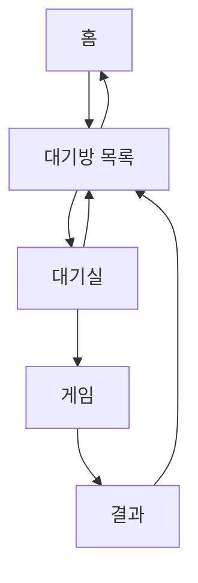

title: "Ornith 1.5 35B 오목 개발 Day 3: 테스트 16개 통과 뒤에도 남은 미완성"
slug: ornith-gomoku-qwen-code-day3
category: 기술 실험
summary: "밤에 맡긴 오목 웹앱 개발은 브라우저 테스트 16개 통과로 끝났지만, 화면 품질과 계획서의 완료 조건은 남았다. Day 3의 구현 범위, 검증에서 빠진 조건, 긴 세션의 지연과 시간 기록을 돌아본다."
tags: local-llm,omlx,ornith,qwen-code,agent,gomoku,renju,testing,debugging,ui,benchmark,tech-lab,ornith1-5
toc: true
prevSlug: ornith-gomoku-qwen-code-day2
publishedAt: 2026-09-05T02:12:05.528029Z
syncHash: c343e9bd763ee8710cbad5ebf674a3c3b3aeedb881b9d65946e0fb8c18062f11

---

잠들기 전, Ornith 1.5 35B를 연결한 Qwen Code에 오목 웹앱의 Day 3 작업을 맡겼다. `IMPLEMENTATION_PLAN_DAY3.md`를 읽고 홈에서 대기방과 대기실을 거쳐 게임으로 들어가는 흐름을 만든 뒤, 테스트까지 마무리하는 계획이었다.

아침에 확인한 최종 응답에는 브라우저 테스트 16개가 모두 통과했다고 적혀 있었다. 그런데 게임 화면에서는 넓은 컨테이너 위쪽에 작은 오목판이 붙어 있었고, 홈 화면에는 타이틀과 빈 공간이 어색하게 반복됐다. 계획서의 Phase 4·5도 미완료로 남아 있었다.

이번 실험의 역할 분담을 먼저 밝혀 둔다. 지금까지 `IMPLEMENTATION_PLAN` 문서들은 GPT luna-xhigh로 작성했고, 실제 개발은 그 계획을 읽은 로컬 LLM으로 진행했다. 이 글은 외부 모델이 작성한 계획을 로컬 코딩 에이전트가 구현한 과정에 대한 기록이다.

**테스트가 확인한 범위와 내가 기대한 완성품 사이에는 차이가 있었다.** 이번 기록에서는 무엇이 구현됐고, 검증에서 무엇이 빠졌으며, 밤사이 이어진 작업이 어디에서 지체됐는지 살펴본다.

## 아침에 확인한 화면은 완료라고 보기 어려웠다

홈 화면에는 공통 헤더의 `오목 Gomoku`와 본문 타이틀이 함께 보였다. 봇 대국과 온라인 대기방으로 들어가는 버튼은 생겼지만, 콘텐츠가 중앙에 모이면서 주변에 빈 공간이 크게 남았다. 첫 화면에서 할 수 있는 일에 비해 타이틀과 여백이 차지하는 면적이 컸다.


게임 화면에서는 그 차이가 더 뚜렷했다. 계획서는 보드와 우측 패널을 2 대 1 비율로 나누고 오목판을 중심에 두도록 했지만, 캡처에서는 좌측의 큰 어두운 컨테이너 위쪽에 작은 보드가 놓여 있었다. 수순·채팅·액션 패널은 존재해도, 게임을 두는 자리보다 남는 공간이 먼저 보였다.


버튼이 생기고 화면이 연결된 것은 진전이었다. 다만 계획서에는 보드 중심 배치, 보드와 패널의 높이, 좌표 여백, 데스크톱 캡처 같은 시각 조건도 있었다. 결과 화면을 보고 나니, 테스트가 그 조건까지 확인했는지 다시 살펴볼 필요가 있었다.

## 이번 목표는 로컬 mock으로 온라인 진입 흐름을 잇는 것이었다

첫 실험에서 기본 오목 게임을 만들고, Day 2에서 싱글플레이어의 규칙·상태·타이머·봇 응답을 다듬었다. Day 3에서는 그 위에 홈, 대기방 목록, 대기실을 추가하고 게임과 결과 화면으로 이어가려 했다.



잠들기 전에 실제로 입력한 `/goal` 프롬프트는 다음과 같다. Qwen Code의 세션 기록에 남아 있는 목표 원문을 그대로 옮겼다.

```text
/goal

IMPLEMENTATION_PLAN_DAY3.md를 처음부터 끝까지 읽고 모든 범위와 완료 조건을 진행해줘.

작업 전에 반드시 qwen-test 내부의 Git 형상관리를 준비해.
부모 저장소의 다른 변경은 절대 건드리지 말고, qwen-test 안에 전용 저장소가 없으면 초기화해.
node_modules, .DS_Store, 로컬 설정·인증 정보, 대용량 브라우저 산출물은 .gitignore에 넣어.
현재 Day 2 상태를 day2-baseline 기준 커밋 또는 스냅샷으로 남긴 뒤 구현을 시작해.
UI 완료, 로컬 mock 멀티플레이 완료, 최종 QA 시점에도 단계별 커밋을 남겨.
부모 저장소 전체에 git add를 실행하지 말고, git reset·git clean·강제 되돌리기도 사용하지 마.

그 다음 IMPLEMENTATION_PLAN_DAY3.md의 순서대로 게임 화면 UI/UX, 결과 모달, 홈·대기방·대기실·게임·결과 흐름, 로컬 mock 멀티플레이, WebSocket 연결 경계를 구현해줘.

실제 WebSocket 서버와 인증·랭킹·관전자 기능은 이번 작업에서 제외해.
기존 봇전·규칙·타이머·무르기·기권·재시작 기능은 보존해.

동일 오류가 두 번 반복되면 세 번째 재시도하지 말고 DAY3_PROGRESS.md에 원인과 남은 조치를 기록한 뒤 독립적인 다음 작업으로 이동해.
한글 문자열은 대량 치환하지 말고 실제 UTF-8 내용을 확인한 뒤 작은 패치로 수정해.
완료 조건을 충족하면 불필요한 추가 작업 없이 DAY3_REPORT.md를 작성하고 종료해.
```

이번 프롬프트에서 계획서 이행만큼 비중을 둔 것은 두 가지였다. 하나는 `qwen-test` 안에 전용 Git 저장소를 두고 단계마다 커밋을 남기게 해서, 밤사이 작업이 어디까지 갔는지 나중에 되짚을 수 있게 하는 것이다. 다른 하나는 같은 오류가 두 번 반복되면 세 번째 재시도 대신 원인을 기록하고 다음 작업으로 넘어가라는 조건이다. 사람이 자는 동안 한 지점에서 재시도만 반복하며 시간을 소진하는 상황을 막으려는 장치였다.

이번 단계에서 실제 WebSocket 서버는 구현 대상이 아니었다. 먼저 로컬 메모리에서 방 생성·입장·준비·시작 상태를 흉내 내는 mock을 만들고, 이후 네트워크로 이벤트를 전달하는 부분을 붙일 수 있도록 코드를 나누는 계획이었다. 따라서 Day 3의 완료 여부도 그 로컬 흐름과 계획서에 적힌 조건을 기준으로 봐야 한다.

| 계획한 범위 | 확인된 결과 |
| --- | --- |
| 홈 | 봇 대국·온라인 대기방 진입 버튼 구현 |
| 대기방 목록 | 빈 목록·방 생성·입장·나가기 UI 구현 |
| 대기실 | 선수 슬롯·준비 상태·호스트 시작 버튼 구현 |
| 로컬 방 상태 | 메모리 `RoomManager`와 이벤트 구현 |
| Phase 4·5의 남은 흐름 | 두 플레이어의 게임 시작, 결과·재대결·퇴장 흐름 미완료 |
| WebSocket 서버 | 이번 범위에서 제외 |

`RoomManager`는 방 상태를 보관하고 `room:created`, `ready:changed`, `game:started` 같은 이벤트를 전달한다. 화면이 이벤트를 받아 반응하도록 나누면, 나중에 전달 경로를 WebSocket으로 바꿀 때 화면과 네트워크 코드를 따로 다룰 여지가 생긴다. 최대 5개 방, 방당 최대 2명이라는 정책도 이 모듈에 들어갔다.

하지만 현재 `RoomManager.me`는 하나의 로컬 사용자이고, 단위 테스트의 상대 선수는 내부 배열에 직접 추가해 흉내 냈다. 이 검증만으로 두 사용자가 각자의 화면에서 준비하고 게임을 시작하는 흐름까지 확인했다고 볼 수는 없다. 실제 두 브라우저 사이의 네트워크 동기화는 이후 단계에서 검증할 항목으로 남았다.

완료 기록에도 한계가 드러났다. `DAY3_PROGRESS.md`는 Phase 3까지 완료로 표시했지만 Phase 4·5는 미완료였고, `DAY3_REPORT.md`도 생성되지 않았다. 마지막 응답의 `Done`을 전체 계획의 완료로 받아들이기에는 남은 항목이 분명했다.

## 테스트는 버튼과 상태를 확인했지만 화면의 완성도까지 확인하지는 않았다

최종 보고에 남은 검증 결과는 단위 테스트 90개와 브라우저 테스트 16개 통과였다. 브라우저 테스트는 Phase 2 회귀 7개, Phase 3 화면 흐름 8개, Chrome 실행 smoke 1개를 합친 수다.


Phase 3 테스트의 중심은 홈에서 대기방으로 이동하는지, 방을 만들 수 있는지, 대기실에서 나올 수 있는지였다. 화면 ID와 버튼, 이벤트 뒤의 상태를 확인하는 검증이다. 이것은 필요한 검사지만, 통과했다는 사실만으로 보드 크기나 화면 배치까지 판단할 수는 없다.

| 대상 | 테스트가 확인한 것 | 별도로 확인해야 할 것 |
| --- | --- | --- |
| 홈 | 버튼·기본 설정·초기 상태 | 타이틀 중복과 과도한 여백 |
| 대기방·대기실 | 화면 전환·방 이름·버튼 상태 | 두 사용자의 준비·시작 흐름 |
| 게임 | 기존 DOM·상태·반응형 조건 | 실제 보드 크기와 패널 배치 |
| 브라우저 | 실행 여부·콘솔 오류 | 캡처에 나타난 전체 화면 품질 |

특히 보드와 패널의 크기처럼 수치로 표현할 수 있는 조건은 브라우저에서 측정할 수 있다. 반면 홈 화면이 비어 보이는지, 보드가 게임의 중심으로 느껴지는지는 캡처를 보고 판단해야 한다. 계획서의 시각 조건을 이런 검사로 옮기지 않으면, 기능 테스트가 모두 통과해도 빠진 조건은 그대로 남는다.

브라우저 테스트가 통과하기까지의 실행 조건도 함께 기록해야 한다. 이번에는 `npm test`가 브라우저 파일까지 자동으로 포함하는 구조와 남아 있던 Chrome 프로세스 문제가 겹쳤다. 브라우저 실행을 복구한 뒤 Phase 2·Phase 3·smoke를 별도로 다시 돌린 결과가 16/16이었다.

## 밤사이에는 반복 감지와 오류 복구가 이어졌다

결과를 확인하기까지의 과정도 매끄럽지 않았다. 잠들기 전 Qwen Code에는 `A potential loop was detected`라는 경고가 나타났다. 아직 할 일이 남아 있었지만, 반복적인 도구 호출이나 모델 동작의 가능성을 감지했다는 안내였다.


나는 이번 세션의 loop detection을 끄는 2번을 선택했고, Qwen Code는 요청을 다시 시도했다. 정확히 어느 호출이 감지를 일으켰는지는 이번 기록만으로 좁히지 못했다. 여기서 확인한 것은 에이전트의 반복 경고이며, 오목 앱에 무한 루프가 있다는 진단은 아니었다. 감지를 끈 뒤에도 계획서의 미완료 항목은 남아 있었다.

이후에는 긴 컨텍스트를 압축한다는 경고가 두 차례 나타났다. 약 65,493토큰을 49,821토큰으로, 다시 약 73,323토큰을 59,249토큰으로 줄이는 내용이었다. 화면에는 압축 뒤 계획서와 파일을 다시 읽는 흐름이 보였다. 구현뿐 아니라 이전 작업 맥락을 다시 확인하는 과정이 세션 안에서 이어졌다.


도구 호출 오류도 있었다. 세션에 기록된 도구 결과 183건 중 오류는 26건이었다. 아침 화면에서는 `AskUserQuestion`이 `Parameter "questions" must be an array.`라는 오류로 두 번 실패했다. 요청에는 배열이 포함된 것처럼 보였지만, 모델은 따옴표와 중첩 구조 등을 원인으로 추측하며 다시 시도했다.

이후 사용자가 `표준 렌주 룰` 표기를 선택하면서 작업이 이어졌다. 최종 응답은 해당 문자열을 5개 파일의 6곳에 반영했다고 보고했다. 다만 화면에 나타난 오류만으로 도구 호출이 실패한 정확한 원인을 확정할 수는 없었다.


브라우저 검증에는 별도의 실행 문제가 있었다. 약 20분 동안 살아 있던 고아 Playwright runner가 `browser.close()` 뒤에도 Chrome과 helper 프로세스를 남겼다. 로그에서는 해당 runner의 자식 프로세스 25개를 정리한 것으로 기록했고, 그 뒤 브라우저 테스트가 통과했다. 정리 전후 전체 Chrome 프로세스 수는 다른 프로세스의 종료도 섞일 수 있으므로, 정리 대상 수와 같은 값으로 취급하지 않았다.

이 기록은 작업이 늘어진 지점을 보여 주지만, 각 문제가 전체 시간에서 차지한 비중까지 알려 주지는 않는다. 긴 모델 요청, 컨텍스트 압축과 파일 재확인, 도구 오류 재시도, 브라우저 실행 복구를 각각 구분해 봐야 다음 실행에서 무엇을 바꿀지 정할 수 있다.

## Goal의 1시간 28분은 세션 전체 시간이 아니었다

화면 하단에는 `/goal paused (1h 28m used)`가 남아 있었다. 그런데 그 뒤에도 파일 읽기와 테스트 응답이 이어졌다. Goal 표시만 보면 작업이 멈춘 것처럼 보였지만, 세션 기록은 계속 늘어났다.

| 기록 | 시각 또는 시간 |
| --- | --- |
| Qwen 세션 시작 | 2026-09-05 00:52:25 KST |
| Goal 생성 | 00:55:39 KST |
| Goal 일시정지 | 02:23:39 KST |
| Goal 활성 시간 | 1시간 28분 0.873초 |
| 마지막 모델 응답 | 08:57:08 KST |
| 위 세션 시작부터 마지막 응답까지 | 8시간 4분 43초 |
| 모델 API 요청 처리 시간 합계 | 약 4시간 58분 55초 |

Goal의 `activeTimeMs`는 5,280,873ms로 남았고, `complete`로 바뀐 완료 이벤트는 없었다. 일시정지 뒤 응답이 이어졌다는 관찰만으로 Goal 자체가 재개됐다고 말할 수는 없다. 이 세션에서는 Goal의 상태와 일반 요청·응답의 진행을 따로 확인해야 했다.

세션 시작부터 마지막 응답까지의 8시간 4분 43초 역시 모델이 쉬지 않고 코드를 작성한 시간이 아니다. 사람이 자리를 비운 동안의 대기와 중단, 이후의 입력과 복구가 포함된 경과 시간이다. 정확히 언제 일어나 입력했는지는 별도 시각을 남기지 못했다.

API 처리 시간 약 4시간 58분 55초는 339개 요청의 기록을 합친 값이다. 요청당 평균은 약 52.9초이고, 가장 긴 요청은 약 12분 32초였다. 이 합계를 전체 세션 시간이나 순수 토큰 생성 시간으로 바꿔 읽으면 안 된다. 요청에는 입력 문맥을 처리하는 과정도 있으므로, 출력 토큰 수를 이 시간으로 나눈 값만으로 생성 속도를 판단하기 어렵다.

따라서 이번 실행을 “1시간 28분 만에 끝난 작업”이나 “8시간 동안 계속 구현한 작업”으로 기록하기는 어렵다. 다음에는 Goal 상태와 함께 마지막 도구 호출 시각, 남은 프로세스, 실제 변경 파일을 남겨야 작업이 어디까지 진행됐는지 확인하기 쉬울 것이다.

## 실행 환경과 상세 집계는 따로 남긴다

아래 값은 Day 3 원고의 근거로 사용한 9월 5일 `day3_trace.md`와 oMLX 측정 기록 기준이다. 9월 3일 `QWEN_CODE_METRICS.md`의 179회 요청·Qwen Code 0.22.3 집계와 섞지 않았다.

<details>
<summary>모델 연결과 생성 설정</summary>

Provider 이름은 `openai`지만 실제 연결 대상은 로컬 oMLX 서버였다.

| 항목 | 값 |
| --- | --- |
| 호스트 | Apple Silicon M1 Max · 통합 메모리 64GB |
| 운영체제 | macOS 26.6 |
| 런타임 | oMLX 0.6.4 · build 2529 |
| API | `http://127.0.0.1:8888/v1` |
| 모델 | `Ornith-1.5-35B-A3B-oQ6-gs128-mtp-vision` |
| Qwen Code | 0.23.0 |
| 컨텍스트 상한 | 98,304 tokens |
| 최대 출력 | 32,768 tokens |
| 추론 | 활성화 |
| Temperature / Top-p / Top-k | 0.7 / 0.8 / 20 |
| 요청 timeout | 3,600초 |
| 최대 재시도 | 5회 |

측정 기록에서는 Native Lightning MTP가 활성화됐고 VLM MTP는 비활성화돼 있었다. 설정과 작업 결과를 함께 남기되, 이 실행만으로 MTP가 품질이나 전체 작업 시간에 미친 영향을 분리해 판단하지는 않았다.

</details>

<details>
<summary>API 사용량과 도구 오류 집계</summary>

| 지표 | Day 3 세션 집계 |
| --- | ---: |
| 모델 API 요청 | 339회 |
| 입력 토큰 | 18,282,580 |
| 출력 토큰 | 389,946 |
| 추론 토큰 | 217,119 |
| 캐시 토큰 | 16,052,224 |
| API 처리 시간 합계 | 17,935,392ms · 약 4시간 58분 55초 |
| 최장 단일 요청 | 751.732초 · 약 12분 32초 |

도구 결과는 성공 157건, 오류 26건으로 총 183건이었다.

| 오류 분류 | 건수 |
| --- | ---: |
| `edit_no_occurrence_found` | 8 |
| `edit_requires_prior_read` | 6 |
| `invalid_tool_params` | 6 |
| `shell_execute_error` | 4 |
| `edit_no_change` | 2 |

측정 당시 oMLX 화면에는 캐시되지 않은 프롬프트 처리량 322.3 tok/s, 토큰 생성 35.8 tok/s, 캐시 효율 87.8%가 표시됐다. 별도 warm 웹 생성 벤치마크의 54.47~60.34 tok/s는 짧은 독립 요청에서 나온 값이므로 세션 집계와 구분해 남긴다.

</details>

<details>
<summary>추가·수정한 주요 모듈</summary>

| 모듈 | 역할 |
| --- | --- |
| `src/ui/home.mjs` | 봇 대국과 온라인 대기방 진입 |
| `src/ui/lobby.mjs` | 방 목록·방 생성·입장·새로고침·홈 이동 |
| `src/ui/room.mjs` | 흑·백 슬롯·준비·호스트 시작·방 나가기 |
| `src/multiplayer/room-manager.mjs` | 로컬 메모리 방 상태와 이벤트 전달 |
| `src/main.js` | 화면 전환, 방 이벤트, 기존 게임 상태 연결 |

</details>

## Day 4에서는 UI와 기존 흐름부터 다시 정리하려 한다

최종 목표는 로컬 LLM을 활용해 온라인 오목게임을 완전히 구현하는 것이다. 하지만 Day 3의 결과에서 바로 실제 서버, 두 사용자 착수 동기화, 재접속, 외부 공개까지 한 번에 이어가는 것은 범위가 너무 크다. 화면이 흐트러지고 기존 흐름의 완료 여부도 불분명한 상태에서 네트워크까지 추가하면, 다음 오류가 화면·게임 상태·통신 중 어디에서 생겼는지 구분하기 더 어려워진다.

Day 4는 **UI를 복구하고, 이미 만들어진 기능을 실제로 사용할 수 있는 상태로 정리하는 날**로 잡는 편이 현실적이다. 전체 화면을 살펴 개선할 문제를 모으되, 구현은 영향이 큰 문제부터 순서대로 진행한다. 온라인 대국 완성이라는 목표는 유지하고, 그 목표로 가기 전에 현재 결과물을 안정시키려 한다. 아래 내용은 아직 실행하지 않은 다음 작업의 제안이다.

### 지금까지는 GPT가 계획을 작성하고 로컬 LLM이 개발했다

실험 조건도 분명하게 남길 필요가 있다. 지금까지 `IMPLEMENTATION_PLAN` 문서들은 **GPT luna-xhigh로 작성했고, 그 계획을 읽고 실제 개발을 진행한 것은 로컬 LLM**이었다. 따라서 지금까지의 결과는 기획과 설계부터 전 과정을 로컬 모델만으로 해결한 실험으로 볼 수 없다. 외부 모델이 작성한 계획을 로컬 코딩 에이전트가 얼마나 구현하고 검증할 수 있는지를 관찰한 기록이다.

이 구분은 Day 3의 결과를 해석할 때도 필요하다. 구현이 덜 됐다고 모든 원인을 로컬 모델의 능력으로 돌릴 수는 없다. 계획서가 한 번에 맡기기에 너무 컸는지, 완료 조건이 실제 검사로 옮겨졌는지, 모델이 그 조건을 놓쳤는지를 함께 봐야 한다. 반대로 구현이 잘 됐더라도 계획을 제공한 모델의 기여까지 지우고 로컬 모델의 단독 성과로 적어서는 안 된다.

Day 4에서는 이 역할 분담을 유지하는 방안을 우선 제안한다. GPT luna-xhigh로 화면별 수정 범위와 완료 조건을 정리하고, 로컬 LLM에 코드 수정과 테스트를 맡기는 방식이다. 목표는 온라인 오목의 완성이므로 당장 계획 작성 방식까지 바꿔 실험 변수를 늘리기보다, 먼저 계획의 크기와 검증 방법을 고치는 편이 낫겠다.

다만 장기적으로 계획 작성까지 로컬 모델로 옮기고 싶다면 별도의 작은 실험으로 확인할 수 있다. 예를 들어 “홈의 중복 타이틀과 여백 정리”라는 같은 문제에 대해 로컬 모델이 수정 계획을 만들게 하고, 사람이 범위와 검증 가능성을 확인한 뒤 구현을 맡긴다. 이렇게 시작해야 계획 능력과 구현 능력 중 어느 부분에서 도움이 필요했는지 관찰하기 쉽다.

### 전체 화면을 점검하되 필수 작업은 세 가지로 제한한다

먼저 Day 3의 코드와 캡처를 기준선으로 남기고, 홈·봇 대국·대기방·대기실을 직접 순서대로 열어 본다. 화면마다 보이는 문제와 조작 중 생기는 문제를 구분해 적는다. 과거 테스트가 통과했다는 기록만 가져오지 않고, 현재 코드에서도 기존 테스트가 실행되는지 다시 확인한다.

이 점검은 전체적인 개선을 위한 목록을 만드는 과정이다. 발견한 문제를 모두 Day 4의 필수 작업으로 넣지는 않는다. 보드가 작게 보이는 문제, 홈의 중복 제목과 여백, 화면을 이동했을 때 상태가 꼬이는 문제처럼 사용에 직접 영향을 주는 항목을 먼저 처리한다.

| 우선순위 | Day 4에서 할 일 | 완료를 확인할 방법 |
| --- | --- | --- |
| 필수 1 | 게임 화면의 보드 크기와 배치 복구 | 같은 화면 크기의 전후 캡처와 실제 착수 확인 |
| 필수 2 | 홈·대기방·대기실의 공통 UI 정리 | 제목·버튼·간격·상태 안내가 화면마다 일관적인지 확인 |
| 필수 3 | 기존 싱글플레이와 화면 전환 회귀 확인 | 홈→봇 대국→종료, 홈→대기방→대기실→나가기 실행 |
| 여유가 있을 때 | 수정 중 드러난 중복 코드와 상태 연결 정리 | 수정 범위를 좁혀 기존 동작이 유지되는지 확인 |
| 이후 작업 | 실제 서버와 두 사용자 온라인 대국 구현 | 별도 계획과 두 사용자 통합 검증으로 진행 |

Day 2 화면은 복구의 참고 자료로 사용할 수 있지만, Day 3 전체를 되돌리는 방식은 피하려 한다. 새로 생긴 홈과 대기실까지 잃지 않으면서, 게임판 배치가 어디에서 달라졌는지 좁혀 수정하는 것이 목적이다. 원인을 아직 확인하지 않았으므로 CSS 한두 줄로 끝날지, 화면별 컨테이너 구조를 조정해야 할지는 시작 전에 단정하지 않는다.

### UI 계획에는 기대하는 화면과 확인 방법을 함께 넣는다

“보기 좋게 고쳐라”라는 지시만으로는 Day 3와 같은 간극이 다시 생길 수 있다. 계획서에는 화면의 역할과 배치 기준, 확인할 화면 크기를 함께 적으려 한다. 보드와 패널을 2 대 1로 나눈다는 조건만으로는 컨테이너 안의 실제 오목판 크기까지 정해지지 않으므로, 보드 자체가 어떻게 공간을 사용해야 하는지 설명해야 한다.

게임 화면에서는 오목판을 정사각형으로 유지하고, 좌표와 가장자리 돌이 잘리지 않게 한다. 넓은 화면에서는 보드와 정보 패널을 나란히 두되 보드 주변에 불필요한 빈 영역이 생기지 않도록 한다. 좁은 화면에서는 패널을 아래로 보내고, 작은 교차점을 눌렀을 때 의도한 위치에 착수되는지도 확인한다. 화면 크기를 바꾼 뒤 보드 표시와 클릭 좌표가 어긋나면 배치가 좋아 보여도 완료가 아니다.

홈에서는 제목을 어디에서 보여 줄지 한 번 정하고, 봇 대국과 온라인 대기방 진입을 쉽게 찾을 수 있게 한다. 대기방과 대기실은 방이 없는 상태, 참가자가 한 명인 상태, 준비 전 상태를 구분해 안내한다. 현재는 로컬 mock 단계이므로 실제 상대가 접속한 것처럼 보이는 문구나, 동작하지 않는 시작 버튼으로 사용자를 오해하게 해서는 안 된다.

공통 버튼·제목·간격은 기존 스타일 안에서 기준을 맞춘다. 이번 수정에 필요한 부분부터 정리하고, UI 복구를 이유로 프레임워크 교체나 전면적인 컴포넌트 재작성까지 확대하지 않겠다. 화면을 정리하는 과정에서 큰 구조 변경이 필요해 보이면 별도 작업으로 남겨, 복구와 재설계의 범위가 섞이지 않게 한다.

검증 화면 크기는 작업 전에 고정한다. 예를 들어 데스크톱 1440×900, 모바일 390×844를 기준으로 잡고, 그 사이 폭에서도 배치 전환을 확인할 수 있다. 이 수치는 실제 기기 요구에 맞춰 조정할 출발점이다. 중요한 것은 수정 전후를 같은 조건으로 비교하고, 캡처와 직접 조작 결과를 함께 남기는 것이다.

### 작은 작업 하나를 끝내고 다음 수정으로 넘어간다

Day 4의 계획서는 전체 할 일을 안내하는 짧은 문서와, 지금 수행할 수정 하나를 설명하는 작업 단위로 나누려 한다. 각 작업에는 증상, 관련 화면과 파일, 바꿀 범위, 유지할 동작, 검증 방법을 넣는다. 로컬 모델은 실제 코드를 읽고 수정안을 정하되, 계획서의 추측과 코드에서 확인한 사실이 다르면 먼저 그 차이를 기록하게 한다.

진행 순서는 게임 화면 복구, 공통 UI와 각 화면 정리, 기존 기능 회귀 검증으로 잡을 수 있다. 처음에는 보드 배치 하나만 맡기고 캡처와 착수 동작을 확인한다. 그 결과가 받아들일 만하면 홈과 대기방으로 넘어간다. 모든 화면을 바꾼 뒤 마지막에 한 번 보는 방식보다, 어느 수정에서 품질이 좋아지거나 나빠졌는지 확인하기 쉽다.

작업이 끝나면 바뀐 파일, 실행한 검사, 캡처, 남은 문제를 짧은 인계 파일에 남긴다. 새 세션에서는 그 파일과 필요한 코드부터 읽게 한다. 세션을 새로 시작하면 앞의 맥락을 잃을 수 있으므로, 짧게 나누는 것만으로 해결됐다고 생각하지 않고 다음 작업에 필요한 상태가 실제로 전달됐는지 확인한다.

사람의 검수는 문서상 “승인” 한 줄로 끝내지 않는다. 캡처에서 문제를 발견했다면 “보드 컨테이너 아래쪽 여백이 남는다”, “모바일에서 준비 버튼이 잘린다”처럼 관찰 가능한 내용을 전달한다. 피드백 뒤의 코드 수정도 로컬 모델에 맡기고, 사람이 직접 수정했다면 해당 파일과 이유를 기록한다. 로컬 모델이 이미지를 실제로 입력받아 검토했는지도 구분해 남긴다. 이미지가 첨부되지 않았다면 시각 검토를 모델이 수행했다고 적을 수 없다.

### 기술 실험은 계획의 크기와 검증 방식에 집중한다

이번에 확인할 질문은 “로컬 모델이 온라인 게임 전체를 하루에 완성하는가”보다 “작은 UI 수정과 구체적인 완료 조건을 주면 결과를 제대로 복구하는가”가 적절하다. 기본 실행에서는 Ornith와 Qwen Code, 모델 설정을 유지하고 작업을 맡기는 방식을 바꾸겠다. 모델과 하네스까지 한꺼번에 교체하면 개선의 이유를 설명하기 어려워진다.

| 실험 선택지 | 확인할 내용 | Day 4에서의 위치 |
| --- | --- | --- |
| GPT 계획을 작은 수정 단위로 나눠 로컬 모델이 구현 | 계획의 범위와 검증 기준을 좁히면 완료 품질이 나아지는가 | 기본 경로 |
| 같은 로컬 모델의 새 세션이 변경 결과를 검토 | 구현 세션이 놓친 요구사항을 다시 찾는가 | 복구 후 여유가 있을 때 |
| 작은 UI 과제의 계획까지 로컬 모델에 맡김 | 로컬 모델이 실행 가능한 계획과 검증 기준을 만드는가 | 별도 보조 실험 |
| 다른 로컬 모델 또는 하네스로 실패 과제 재시도 | 특정 과제나 도구 오류가 다른 구성에서 해결되는가 | 같은 지점에서 반복해서 막힐 때 |

계획 작성 방식을 비교한다면 같은 출발 코드와 문제 설명, 허용 시간 또는 토큰 예산, 검증 기준을 맞춘다. GPT 계획을 읽고 수정한 코드를 다시 로컬 계획 실험의 출발점으로 쓰면 이미 해결책이 섞이므로 비교가 어렵다. 비교 실행은 기준선의 별도 사본에서 하고, 프로젝트에는 확인된 결과만 가져오는 편이 낫다.

검토 세션을 추가하더라도 같은 모델이 같은 실수를 할 수 있다. 사람의 화면 확인과 기존 기능 조작을 대체하는 용도로 쓰지 않겠다. Day 4에서 모든 선택지를 실행할 필요도 없다. 기본 경로로 UI 복구를 끝내는 것이 우선이고, 여유가 생겼을 때 작은 보조 실험 하나를 더하는 정도가 적절하다.

기록할 값은 수정 전후 캡처, 완료한 문제, 새로 생긴 회귀, 수정 요청 횟수, 사람의 힌트·직접 수정, 모델 요청과 도구 오류, 실제 경과 시간이다. Day 3와 과제가 다르므로 이 기록만으로 모델 성능이 몇 배 좋아졌다고 해석하지 않는다. 다음 작업을 어느 크기로 맡길지 판단할 운영 기록으로 사용한다.

### 작업 시간이 끝나면 범위를 늘리지 않고 결과를 정리한다

현재 상태에서 Day 4에 몇 시간으로 충분한지는 알 수 없다. 특히 Day 3의 경과 시간에는 대기와 오류 복구가 섞여 있어, 그 숫자를 기능별 소요 시간으로 나눠 예측하기 어렵다. 먼저 보드 배치 수정 한 건을 끝내 보고 나머지 범위를 다시 판단하는 편이 현실적이다.

운영 예시로는 사람이 확인할 수 있는 한 작업 시간을 2~3시간으로 정하고, 첫 문제 점검과 마지막 회귀 검증 시간을 그 안에 따로 확보할 수 있다. 이는 완성 예상 시간이 아니라 실행을 어디에서 멈출지 정하는 예산이다. 예산을 다 썼다면 다음 실행을 잡고, 이미 손댄 기능의 상태를 정리한다. 검증할 시간을 남기지 않은 채 새 작업에 들어가지는 않겠다.

같은 오류가 두 번 이어지면 같은 명령을 반복하기 전에 입력 계약과 마지막 실패를 확인하게 한다. 테스트 실행기가 멈추면 애플리케이션 수정을 더 쌓기보다 테스트 프로세스를 먼저 복구한다. 회귀 검증에 실패했거나 화면을 직접 확인하지 못했다면, 남은 시간에 온라인 서버 구현을 시작할 이유도 없다.

Day 4의 기본 완료 기준은 보드 중심 배치가 복구되고, 홈·대기방·대기실의 UI가 정리되며, 기존 싱글플레이와 화면 전환이 유지되는 것이다. 이때의 증거는 같은 크기로 찍은 전후 화면, 실제 조작 결과, 테스트 기록, 미완료 목록이다. 보드 복구만 끝났다면 그 부분 완료로 기록하고, 전체 정리가 끝난 것처럼 묶지 않는다.

### 온라인 구현은 복구된 기준선 위에서 별도 단계로 이어간다

UI를 복구한 뒤에는 기존 코드에서 방 상태와 게임 규칙이 화면에 얼마나 묶여 있는지 확인하고 온라인 구현 계획을 세우려 한다. Day 3의 `RoomManager` 이벤트는 출발점이 될 수 있지만, 실제 서버로 쉽게 옮길 수 있는지는 코드를 확인해야 한다. 먼저 분리해야 할 부분과 재사용할 부분을 정하고 통신 방식을 선택한다.

| 이후 단계 | 집중할 목표 | 완료를 판단할 증거 |
| --- | --- | --- |
| 연결 | 실제 서버를 통해 두 사용자가 같은 방에 입장하고 준비 | 독립된 두 세션의 방·참가자 상태 일치 |
| 대국 | 서버가 착수와 규칙·종료를 판정 | 양쪽 보드·차례·수순·결과 일치 |
| 복구 | 재대결·퇴장·중복 요청·연결 끊김 처리 | 정한 복귀·종료 정책의 재현 가능한 검증 |
| 온라인 완성 검증 | 외부 접속과 서버 재시작 정책 확인 | 서로 다른 네트워크의 실제 대국과 실패 복구 기록 |

이 단계들을 곧바로 Day 5·6처럼 날짜에 고정하지는 않겠다. 각 단계가 끝난 증거를 보고 다음 범위를 정한다. “로컬 LLM만 활용”이 앞으로도 구현 모델의 범위를 뜻하는지, 최종적으로 계획과 검토까지 포함하는지도 그 과정에서 명시해야 한다. 계획까지 로컬로 옮기는 목표는 작은 과제로 별도 검증하면서 확장할 수 있다.

Day 4에서 남기고 싶은 결과는 새 기능의 수보다, 다시 플레이할 만해진 오목 화면과 믿고 이어갈 수 있는 코드 상태다. GPT luna-xhigh가 계획을 작성하고 로컬 모델이 구현하는 현재의 역할 분담을 공개한 채, 계획을 작게 나누고 실제 화면을 확인하는 방식이 그 결과를 만드는지 먼저 살펴보려 한다.
