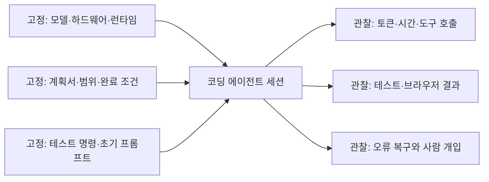
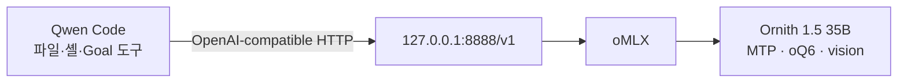
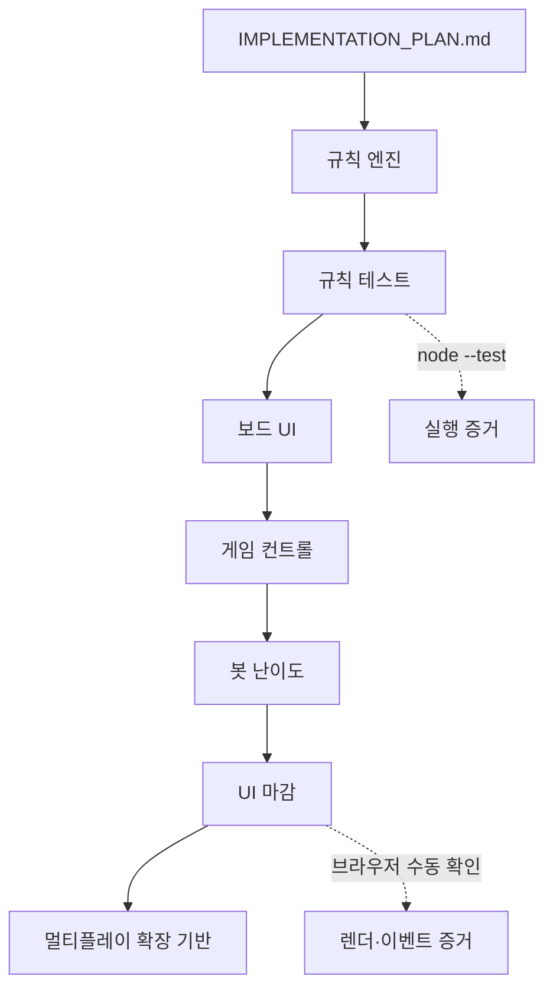
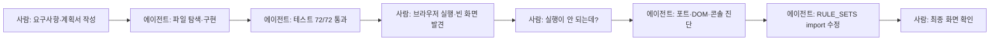
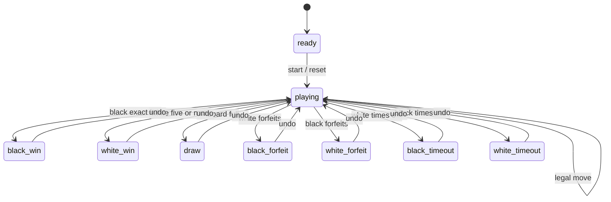
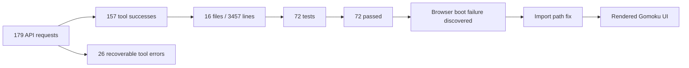

title: "Ornith 1.5 35B 오목 개발 Day 1: 72개 테스트를 통과하고도 화면은 비어 있었다"
slug: ornith-gomoku-qwen-code-experiment
category: 기술 실험
summary: "오목 웹앱 개발 Day 1 기록이다. M1 Max 64GB에서 oMLX의 Ornith-1.5-35B-A3B-oQ6-gs128-mtp-vision과 Qwen Code를 연결해 표준 렌주룰 오목 웹앱을 만들었다. 실행 계획, 72개 테스트, 브라우저 오류와 디버깅, 실제 사용량까지 시간순으로 정리했다."
tags: local-llm,omlx,ornith,qwen-code,agent,gomoku,renju,vanilla-js,benchmark,tech-lab,ornith1-5
toc: true
publishedAt: 2026-09-03T07:25:27.283984Z
updatedAt: 2026-09-03T11:54:42.3Z
syncHash: 5685ff4076a4c5d68580e6d914a0fff170d12c9e9fa4550e9b7dc9a7f97773ac

---

> 이 글은 오목 웹앱을 만드는 연속 기록의 Day 1이다. “로컬 LLM에게 오목을 만들어 달라고 했더니 한 번에 완성됐다”는 이야기가 아니다. 먼저 구현 계획을 주고, 모델이 코드를 만들고 테스트를 통과시킨 뒤, 브라우저에서 실제 문제가 드러났고, 다시 로그를 확인해 모듈 import 오류를 고친 과정을 남긴 기술 실험 기록이다.

이번 실험의 목표는 단순한 오목판 목업이 아니었다. 15×15 보드, 표준 렌주룰의 흑 금수, 여러 규칙 프리셋, 봇 난이도, 타이머, 수순, 채팅 패널, 무르기와 기권까지 포함한 싱글플레이 웹앱을 만들고 싶었다. 동시에 나중에 WebSocket 멀티플레이로 확장할 수 있도록 게임 규칙과 상태를 화면에서 분리해야 했다.

## 먼저 정한 실험 질문과 판정 기준

이번 기록이 답하려는 질문은 “Ornith 1.5 35B가 오목 코드를 쓸 수 있는가?”보다 구체적이다.

1. 계획서와 완료 조건을 먼저 제공하면 로컬 코딩 에이전트가 여러 파일로 구성된 작은 앱을 끝까지 연결할 수 있는가?
2. 규칙 엔진 테스트가 통과한 뒤에도 브라우저 실행 단계에서 어떤 문제가 남는가?
3. 오류가 발생했을 때 모델의 복구 능력과 사람의 피드백이 최종 결과에 어떤 영향을 주는가?

이 글에서 말하는 성공은 세 층으로 나눴다.

| 판정 층 | 성공 기준 | 이번 결과 |
| --- | --- | --- |
| 구현 | 계획서의 범위 안에서 앱 구조와 기능을 만든다 | 달성 |
| 자동 검증 | 규칙·상태·봇 테스트와 구문 검사를 통과한다 | 달성, 72/72 |
| 실행 검증 | 실제 브라우저에서 초기 렌더링과 주요 흐름을 확인한다 | 최초 실패 후 수정·달성 |

반면 봇의 실력, 공식 렌주룰과의 완전한 일치, 다른 모델보다 빠른지 여부는 이번 실험의 성공 기준에 넣지 않았다. 따라서 아래 결과는 모델 순위표가 아니라 **한 가지 하드웨어·런타임·하네스 조합에서 관찰한 단일 사례 연구**로 읽어야 한다.

실험의 구조를 고정값과 관찰값으로 나누면 다음과 같다.



결과부터 말하면, 현재 `qwen-test`에는 다음이 남아 있다.

| 항목 | 최종 결과 |
| --- | --- |
| 모델 | `Ornith-1.5-35B-A3B-oQ6-gs128-mtp-vision` |
| 실행 방식 | M1 Max 64GB의 oMLX OpenAI 호환 API + Qwen Code |
| 앱 | 외부 CDN 없이 실행하는 HTML·CSS·ES Module 오목 웹앱 |
| 규칙 | 표준 렌주룰, 자유 오목, 양쪽 33 제한 변형 |
| 봇 | 하·중·상·최상 4단계 |
| 검증 | `node --test` 72/72 통과, `node --check src/main.js` 통과 |
| 브라우저 문제 | 최초 렌더 실패 후 named export import 오류를 찾아 수정 |
| 실제 로그 | API 요청 179회, 도구 호출 183건, 성공 157건·오류 26건 |

최종 화면은 다음과 같은 형태다. 왼쪽에는 좌표와 마지막 착수를 표시하는 15×15 오목판이 있고, 오른쪽에는 플레이어 카드, 수순, 채팅, 난이도, 제한 시간, 무르기·기권·재시작·옵션이 배치되어 있다.


## 이 실험에서 오목을 고른 이유

오목은 겉으로는 작은 게임이지만, 코딩 에이전트를 평가하기에는 꽤 좋은 작업이다. 보드에 돌을 그리는 것만으로는 끝나지 않고, 다음 네 가지 층이 동시에 맞아야 한다.

1. 규칙 엔진이 착수 가능 여부와 승패를 정확하게 판정해야 한다.
2. 게임 상태가 UI와 분리되어야 무르기·재시작·직렬화가 흔들리지 않는다.
3. 봇은 적어도 즉시 승리와 즉시 방어를 처리해야 한다.
4. 브라우저 모듈이 실제로 로드되고 이벤트가 연결되어야 한다.

특히 표준 렌주룰은 자유 오목과 다르다. 흑은 선공이라는 이점을 갖는 대신 3-3, 4-4, 장목이 금수이고, 흑은 정확히 5목이어야 승리한다. 백은 표준 렌주룰에서 같은 금수 제한을 받지 않고 5목 이상이면 이긴다. 이 차이를 화면 문구와 테스트 양쪽에 반영해야 했다.

그래서 이 작업은 “HTML을 예쁘게 생성하는 능력”만 보는 과제가 아니었다. 자연어 요구사항을 모듈 구조로 바꾸고, 규칙의 경계 조건을 테스트하고, 실행되지 않는 브라우저 결과를 다시 추적하는 에이전트 루프를 한 번에 관찰할 수 있는 작은 프로젝트였다.

## 실험 환경: 모델보다 하네스와 실행 경로를 함께 기록하다

측정일은 2026년 9월 3일이다. 모델을 단순 채팅에 사용한 것이 아니라 Qwen Code가 파일을 읽고, 편집하고, 셸 명령을 실행하는 코딩 에이전트로 사용했다.

| 항목 | 값 |
| --- | --- |
| 호스트 | Apple Silicon M1 Max · 통합 메모리 64GB |
| 로컬 런타임 | oMLX OpenAI 호환 API (버전은 아래 보강 표) |
| API 주소 | `http://127.0.0.1:8888/v1` |
| 하네스 | Qwen Code `0.22.3` |
| 모델 | `Ornith-1.5-35B-A3B-oQ6-gs128-mtp-vision` |
| 모델 계열 | 35B 전체 파라미터·A3B 활성 경로·oQ6·MTP·vision |
| 컨텍스트 | 98,304 tokens |
| 최대 출력 | 32,768 tokens |
| 추론 | 활성화 |
| 샘플링 | temperature 0.7 · top-p 0.8 · top-k 20 |
| 요청 타임아웃 | 3,600초 |
| 최대 재시도 | 5회 |

설정 화면의 Provider 필드는 `openai`였지만 Base URL은 클라우드 주소가 아니라 `127.0.0.1:8888`이었다. 따라서 이번 세션은 OpenAI 클라우드 모델 비교가 아니라, 로컬 oMLX 서버에 연결한 Qwen Code 세션으로 기록했다.

### 실제 연결 구조와 설정 스냅샷

이번 구성에서 Qwen Code는 모델을 직접 실행하는 프로그램이 아니라, 파일 탐색·편집·셸 명령을 조율하는 에이전트 하네스였다. 모델 추론은 다음 경로로 분리되어 있었다.



API 키 값은 제외하고, 당시 Qwen Code 모델 프로필에서 확인한 설정을 줄이면 다음과 같다.

```json
{
  "id": "Ornith-1.5-35B-A3B-oQ6-gs128-mtp-vision",
  "baseUrl": "http://127.0.0.1:8888/v1",
  "generationConfig": {
    "timeout": 3600000,
    "maxRetries": 5,
    "contextWindowSize": 98304,
    "extra_body": { "enable_thinking": true },
    "samplingParams": {
      "temperature": 0.7,
      "top_p": 0.8,
      "top_k": 20,
      "max_tokens": 32768
    }
  }
}
```

### MTP 설정을 사용한 실행

이번 실험은 모델 이름에 MTP가 포함된 `Ornith-1.5-35B-A3B-oQ6-gs128-mtp-vision` 프로필을 oMLX에서 로드해 Qwen Code에 연결한 구성이다. 별도의 MTP on/off 비교 실험을 하지는 않았지만, oMLX 서버 로그에는 `MTP path activated`, `model has mtp_forward`, `accept=65/74 (87.8%)`와 같은 기록이 남아 있어 해당 실행에서 MTP 경로가 실제 사용된 것은 확인했다. 다만 MTP를 사용하지 않은 동일 조건의 대조군이 없으므로, 전체 작업 시간이나 평균 TPS가 MTP 때문에 얼마나 개선됐는지는 이 실험의 결론으로 삼지 않았다.

여기서 `98,304`는 프로필에 지정한 컨텍스트 상한이고, 모든 요청이 그만큼의 컨텍스트를 실제로 사용했다는 뜻은 아니다. 마찬가지로 `enable_thinking`은 모델의 추론 경로를 켠 설정이며, 모델이 코딩 에이전트로 더 좋은 결과를 냈다는 인과관계까지 이번 한 번의 실행으로 증명하지는 못한다. 다음 비교에서는 같은 작업을 `thinking on/off`로 나눠 토큰·응답 시간·수정 횟수·최종 검증 결과를 함께 기록할 필요가 있다.

이 연결은 “OpenAI 호환 API를 사용했다”는 뜻이지 OpenAI 클라우드 모델을 사용했다는 뜻은 아니다. 또한 API 키가 설정되어 있더라도, 이 글의 실험 범위는 모델 요청 경로가 로컬 엔드포인트였다는 사실까지다. 하네스의 모든 텔레메트리 동작이나 운영체제 수준의 네트워크 전송까지 별도로 감사한 것은 아니다.

재현 환경을 보강하기 위해 현재 같은 로컬 머신에서 확인되는 버전도 덧붙인다. 이 값들은 세션 메트릭 파일에 모두 저장되어 있던 값은 아니므로, 원래 실험의 독립적인 측정값이라기보다 재현 시 참고할 수 있는 환경 스냅샷으로 구분한다.

| 보강 항목 | 현재 확인값 | 기록상의 주의점 |
| --- | --- | --- |
| macOS | `26.6.2` · `MacBookPro18,4` | 실험 당시 세션 로그에는 별도 기록되지 않음 |
| oMLX | `0.6.4` | 로컬 CLI와 앱 메타데이터에서 확인 |
| Node.js | `v24.18.0` | 현재 `qwen-test` 실행 환경 기준 |
| npm | `11.16.0` | 현재 `qwen-test` 실행 환경 기준 |
| 브라우저 | Chrome `152.0.7977.75` | 현재 설치 버전이며 당시 수동 검증 브라우저 버전은 별도 고정하지 않음 |

모델 파일의 실제 디스크 크기, 세션 중 최대 메모리, GPU·ANE·CPU 사용률, 전력·온도, 워밍업 전후 차이는 기록하지 않았다. 따라서 “M1 Max 64GB에서 실행 가능했다”는 것은 확인할 수 있지만, 64GB 중 얼마를 모델과 KV cache가 사용했는지까지 이 글의 수치로 주장할 수는 없다.

또한 `temperature=0.7` 등의 생성 설정은 기록했지만, 재실행을 완전히 동일하게 만드는 seed는 기록하지 않았다. 같은 프롬프트라도 모델의 샘플링 경로와 파일 상태에 따라 도구 호출 순서와 수정 결과가 달라질 수 있으므로, 이번 한 번의 성공을 재현성의 증거로 보지 않는다.

여기서 모델 이름의 `35B-A3B`도 구분해서 읽어야 한다. 저장되는 전체 모델 규모와 매 토큰마다 활성화되는 계산 경로는 같은 숫자가 아니다. 이 글의 관심사는 모델 구조 자체를 해설하는 것이 아니라, 같은 로컬 장비에서 코딩 에이전트 작업을 수행할 때 전체 모델 이름, 양자화, MTP, 런타임을 함께 기록해야 한다는 점이다.

또 하나 분명히 할 점은 모델 이름에 포함된 `vision`이다. 이번 작업은 이미지 입력을 모델에 전달한 실험이 아니라 텍스트·코드·셸 도구를 이용한 코딩 세션이었다. 따라서 이 결과로 Ornith의 이미지 이해 능력이나 vision capability를 평가할 수 없다. 여기서 관찰한 대상은 로컬 코딩 에이전트로서의 코드 생성, 파일 수정, 도구 사용, 오류 복구다.

## 시작은 코드가 아니라 `IMPLEMENTATION_PLAN.md`였다

처음부터 “오목 앱 만들어줘”라고 던지지 않았다. 먼저 `qwen-test/IMPLEMENTATION_PLAN.md`를 작성하고, Qwen Code에게 그 파일을 처음부터 끝까지 읽은 다음 계획에 따라 구현하라고 요청했다.

계획서 마지막 절에는 세션에서 입력할 실행 지시문까지 적어 두었다. 실제로 Qwen Code에 입력한 것은 이 문장을 `/goal` 프롬프트로 다시 정리한 쪽이고, 그 원문은 아래 실행 타임라인에 그대로 옮겼다.

```text
IMPLEMENTATION_PLAN.md를 처음부터 끝까지 읽고 계획에 따라 구현해줘.

먼저 현재 디렉터리 상태를 확인한 뒤, 계획에 없는 대규모 기능은 추가하지 마.
표준 렌주룰과 양쪽 33 변형 규칙을 혼동하지 말고, 기본값은 표준 렌주룰로 구현해.
특히 표준 렌주룰에서는 흑만 33·44·장목 금지이며 백에는 해당 금수를 적용하지 않아야 한다.

규칙 엔진을 먼저 작성하고 테스트를 먼저 추가해. 구현 중 오류가 발생하면 오류 로그를 분석하고 수정한 뒤 같은 테스트를 다시 실행해.
각 단계가 끝날 때마다 실행한 명령과 결과를 출력해.
브라우저 UI를 만들기 전에 규칙 엔진 테스트가 통과해야 한다.
실제 WebSocket 서버와 외부 서비스 연동은 이번 작업 범위에서 제외해.

완료를 주장하기 전에 node --test를 실행하고 결과를 확인해.
마지막에는 수정·생성한 파일 목록, 실행 명령, 테스트 결과, 수동 확인이 필요한 항목, 남은 한계를 요약해.
```

### 에이전트에게 일을 맡긴 방식

이번 작업의 재현 단위는 “모델에게 오목을 만들어 달라고 한 한 문장”이 아니라, 명세와 검증 조건을 포함한 작업 프로토콜이었다. 계획서와 Goal 지시문에 범위·순서·완료 조건을 먼저 적고, 에이전트가 각 단계의 실행 명령과 결과를 출력하도록 했다. 실제 작업은 다음 순서로 흘렀다.

| 단계 | 에이전트가 한 일 | 사람의 확인 또는 개입 | 종료 조건 |
| --- | --- | --- | --- |
| 범위 설정 | 계획서와 파일 상태를 읽고 작업 순서 수립 | WebSocket 서버를 이번 범위에서 제외 | 구현 범위 고정 |
| 규칙 엔진 | 규칙 모듈과 경계 사례 테스트 작성 | 표준 렌주룰의 흑·백 비대칭 확인 | 규칙 테스트 통과 |
| UI·봇 연결 | 상태·Canvas·패널·봇을 모듈로 연결 | 중간 결과 실행 | 앱 파일과 기능 연결 |
| 자동 검증 | 테스트·구문 검사·실행 명령 수행 | 완료 보고를 결과물과 대조 | 72/72, 구문 검사 통과 |
| 실행 검증 | 포트·DOM·콘솔을 조사하고 import 수정 | “실행이 안 되는데?”라는 피드백 제공 | 브라우저 부트와 주요 UI 확인 |

따라서 이 결과를 모델 단독의 자율 개발 성과로 읽기는 어렵다. 사람은 요구사항과 범위를 고정하고 실패를 발견했으며, 에이전트는 파일을 탐색하고 수정하고 테스트와 진단 명령을 반복했다. 특히 계획서가 사람의 사전 설계였는지, 에이전트가 제안한 것인지에 따라 “계획 능력”과 “계획 실행 능력”은 별도의 실험이 되므로, 다음 기록부터는 계획서 작성 주체와 작성 시점도 함께 남기는 편이 정확하다.

계획서는 먼저 목표와 범위를 고정했다. 1차 목표는 외부 CDN 없이 실행되는 싱글플레이 오목이고, 실제 WebSocket 서버는 이번 작업에서 제외했다. 대신 나중에 서버로 옮길 수 있도록 `roomId`, `players`, `chatMessages`, 직렬화·복원 함수, 서버 검증용 move payload를 상태 모델에 남기도록 했다.

### 계획서가 요구한 구조



계획된 파일 구조는 프레임워크나 번들러 없이 다음처럼 작게 잡았다.

```text
qwen-test/
├── index.html
├── styles.css
├── src/
│   ├── main.js
│   ├── game/
│   │   ├── rules.js
│   │   ├── state.js
│   │   └── bot.js
│   └── ui/
│       ├── board.js
│       ├── panel.js
│       ├── modal.js
│       └── clock.js
├── tests/
│   ├── rules.test.mjs
│   ├── state.test.mjs
│   └── bot.test.mjs
├── package.json
└── README.md
```

계획서에서 중요한 것은 기능 목록보다 순서였다. 먼저 DOM과 무관한 규칙 모듈을 만들고, 그 다음 테스트를 통과시킨 뒤, 그 위에 UI와 봇을 올린다. 이렇게 해야 화면이 그럴듯해도 금수 판정이 틀리는 상황을 늦게 발견하지 않을 수 있다.

### 계획에서 실제 구현으로 내려온 규칙

`rules.js`는 보드를 `[y][x]` 2차원 배열로 관리하고, 다음을 공개한다.

| 함수 | 책임 |
| --- | --- |
| `createBoard` | 빈 보드 생성 |
| `isLegalMove` | 점유·보드 밖·금수 착수 검증 |
| `getForbiddenMoves` | 현재 보드의 금수 위치를 UI용으로 계산 |
| `checkWin` | 규칙셋과 돌 색에 따른 승리 판정 |
| `checkDraw` | 빈 칸이 없는지 판정 |
| `getWinLine` | 마지막 착수의 승리 줄 좌표 반환 |

규칙셋은 `renju`, `free`, `both33` 세 가지다. 기본값은 `renju`다.

- `renju`: 흑 33·44·장목 금지, 흑 정확히 5목 승리, 백 5목 이상 승리
- `free`: 금수 없음, 흑과 백 모두 5목 이상 승리
- `both33`: 흑과 백 모두 33 제한, 흑의 정확히 5목·장목 규칙은 유지

구현에서는 착수 전 빈 칸에 돌을 임시로 놓고, 네 방향의 연속 길이와 열린 끝을 분석한다. 흑의 착수가 정확히 5목이 되는 경우를 먼저 확인한 다음 장목·4-4·3-3을 검사하는 순서를 택했다. 열린 3은 연속된 3개의 돌과 양쪽의 빈 끝을 기준으로 세고, 단순한 gap 형태의 끊어진 3은 현재 구현에서 3-3으로 세지 않는다.

이 부분은 “렌주룰 전체를 완벽하게 구현했다”는 표현보다 정확하게 써야 한다. 현재 코드와 테스트가 보장하는 것은 계획서에 정의한 판정 정책과 경계 조건이다. 공식 대국 규칙의 모든 복합 위협 정의와 대조한 별도의 인증기는 아니다. 대신 흑의 정확히 5목, 장목, 3-3, 4-4, 가장자리, 모서리, 4-3 우선순위를 테스트로 고정했다.

핵심 판정 흐름을 줄이면 다음과 같다. 실제 소스는 방향별 줄 분석과 규칙셋별 helper로 더 나뉘어 있지만, 중요한 것은 **착수 전 검증 → 5목 우선 → 색·규칙셋별 금수 판정**의 순서다.

```js
function isLegalMove(board, x, y, player, ruleSet) {
  if (!onBoard(x, y) || board[y][x] !== EMPTY) return false;
  if (ruleSet === 'free') return true;

  // 착수로 승리가 만들어지면 금수보다 승리를 먼저 본다.
  if (hasFive(board, x, y, player)) return true;

  if (player === BLACK && makesOverline(board, x, y, player)) return false;
  if (player === BLACK && makesFourFour(board, x, y, player)) return false;
  // 3-3 은 4 가 함께 서면 4-3 이라 금지가 풀린다. 그래서 !makes44 를 함께 본다.
  const threeThreeForbidden = player === BLACK || ruleSet === 'both33';
  const makes33 = makesOpenThreePair(board, x, y, player);
  const makes44 = makesFourFour(board, x, y, player);
  if (threeThreeForbidden && makes33 && !makes44) return false;
  return true;
}
```

실제 구현에서는 `both33`에서만 백의 3-3을 제한하고, 백의 4-4·장목까지 제한하지는 않는다. 위 코드는 흐름을 설명하기 위한 축약본이므로, 정확한 동작은 [계획서의 규칙 정책](#원자료와-계획서-펼쳐보기)과 아래 테스트 결과를 함께 봐야 한다.

## 실제 생성 결과를 구성한 세 개의 축

### 1. 게임 상태를 DOM과 분리했다

`state.js`의 `GameState`는 현재 화면이 아니라 게임 자체를 나타낸다.

```js
GameState = {
  roomId: null,
  players: {
    black: { id: 'human', name: 'Player' },
    white: { id: 'bot', name: 'Ornith Bot' }
  },
  board: [],
  turn: 'black',
  moveHistory: [],
  clocks: {
    mode: 'unlimited',
    blackRemainingMs: null,
    whiteRemainingMs: null
  },
  ruleSet: 'renju',
  gameStatus: 'ready',
  chatMessages: []
}
```

착수는 `applyMove` 하나를 통과한다. 이 함수는 위치 정규화, 현재 상태 확인, 규칙 엔진의 합법성 검사, 보드 반영, 수순 기록, 승리·무승부 판정, 턴 전환을 담당한다. UI 클릭 이벤트가 직접 보드 배열을 변경하지 않는 구조라서 나중에 서버가 같은 payload를 검증할 자리가 남는다.

상태 변경의 중심도 다음처럼 단순한 순서로 유지했다.

```js
if (!isLegalMove(state.board, position, state.turn, state.ruleSet)) {
  throw new Error('불법 착수');
}

placeStone(state.board, position, state.turn);
state.moveHistory.push(recordMove(state, position));

if (checkWin(state)) state.gameStatus = winnerOf(state.turn);
else if (checkDraw(state)) state.gameStatus = 'draw';
else state.turn = opponent(state.turn);
```

위 코드는 함수 인자와 기록 객체를 생략한 설명용 축약본이다. 실제 구현에서도 Canvas 클릭 핸들러가 규칙을 직접 해석하지 않고 `GameState → rules → 결과 반영 → UI 재렌더링`의 한 방향 흐름을 따른다. 이 한 가지 경계가 있었기 때문에 브라우저 오류를 고칠 때도 규칙 판정과 화면 초기화를 따로 추적할 수 있었다.

`serialize`와 `restoreState`도 이 단계에서 만들었다. 지금은 로컬 싱글플레이지만, 상태가 문자열로 왕복되는지를 테스트해 두면 멀티플레이 서버를 붙일 때 화면 코드를 전부 다시 뜯어고칠 필요가 줄어든다.

### 2. 봇은 “강한 AI”가 아니라 교체 가능한 단계로 만들었다

봇 인터페이스는 `getBotMove(state, difficulty)`다. 네 단계의 차이는 다음과 같다.

| 난이도 | 현재 전략 |
| --- | --- |
| 하 | 즉시 승리·방어 후 주변 패턴과 중앙 선호 |
| 중 | 공격 점수와 방어 점수를 비교하는 0-ply 평가 |
| 상 | 즉시 승리·방어 후 깊이 2의 alpha-beta minimax |
| 최상 | 위협 우선 후보 정렬, 깊이 3 탐색, transposition cache |

모든 난이도에서 먼저 빈 보드 중앙 착수, 즉시 승리, 상대의 다음 승리 수 차단을 확인한다. 그 뒤 난이도별 평가로 내려간다. 후보는 기존 돌 반경 주변의 빈 칸으로 제한한다.

이 전략은 브라우저에서 바로 동작하는 작은 봇을 만들기 위한 절충이다. 최상 난이도라는 이름이 전문 오목 엔진 수준의 강도를 보장하는 것은 아니다. 탐색 깊이가 얕고 후보 공간을 제한했으며, 계산을 아직 Web Worker로 옮기지 않았기 때문이다.

봇의 의사결정도 “전체 보드를 매번 완전 탐색한다”기보다 다음과 같은 우선순위 파이프라인이다.

```js
function getBotMove(state, difficulty) {
  if (isEmptyBoard(state.board)) return centerOfBoard();
  const winningMove = findImmediateWin(state);
  if (winningMove) return winningMove;
  const defensiveMove = findOpponentWinToBlock(state);
  if (defensiveMove) return defensiveMove;

  const candidates = nearbyEmptyCells(state.board, { radius: 1 });
  return difficulty === 'low'
    ? scoreLocally(candidates, state)
    : searchWithLimitedMinimax(candidates, state, difficulty);
}
```

위 블록은 실제 helper 이름을 단순화한 설명용 코드다. 이 구조 덕분에 난이도별 정책을 바꿔도 착수 유효성은 공통 규칙 엔진에 맡길 수 있다.

### 3. Canvas 보드와 진행 패널을 따로 만들었다

보드는 Canvas로 그렸다. 좌표 A–O와 1–15, 별점, 검은 돌과 흰 돌의 그라디언트, 마지막 착수의 빨간 표시, 금수 위치, 승리 줄을 한 모듈에서 관리한다. 패널은 규칙 프리셋, 플레이어 카드, 현재 턴, 제한 시간, 수순, 채팅, 액션 버튼을 담당한다.

화면 배치는 데스크톱에서 보드 2/3, 패널 1/3을 기본으로 하고 모바일에서는 보드가 우선되도록 했다. `index.html`은 외부 리소스 없이 `main.js`를 ES Module로 로드한다. 그래서 번들러가 대신 해결해 주는 모듈 경로 문제도 브라우저에서 직접 드러날 수 있다. 이번 오류가 바로 그 경계에서 발생했다.

## 실행 타임라인: 계획 → 완료 보고 → 빈 화면 → 원인 수정

### 1. 처음에는 계획서를 읽고 구현하라는 요청으로 시작했다

처음 실제로 입력한 요청은 다음과 같다. Qwen Code의 세션 기록에 남아 있는 목표 원문을 그대로 옮겼다.

```text
/goal IMPLEMENTATION_PLAN.md를 처음부터 끝까지 읽고, 문서의 계획과 완료 조건에 따라 오목 웹앱을 구현해줘.

먼저 현재 디렉터리 상태를 확인해.
규칙 엔진과 테스트를 먼저 작성하고, 테스트가 통과한 뒤 UI와 봇을 구현해.
표준 렌주룰에서는 흑만 33·44·장목 금지이며 백에는 금수를 적용하지 않아야 한다.
IMPLEMENTATION_PLAN.md에 정의한 양쪽 33 변형 옵션도 구조적으로 지원해줘.

이번 Goal에서는 실제 WebSocket 멀티플레이 서버는 구현하지 말고, 추후 확장 가능한 GameState와 인터페이스까지만 만들어줘.

각 단계마다 실제 실행한 테스트 명령과 결과를 출력해.
오류가 발생하면 원인을 분석하고 수정한 뒤 동일한 테스트를 다시 실행해.
node --test가 통과하고, 계획서의 완료 조건을 모두 만족할 때까지 계속 진행해.

/goal은 완료 조건을 명확히 적어야 제대로 이어서 작업해. Qwen Code 공식 문서상 Goal 검증기는 직접 파일이나 명령을 확인하지 않기 때문에, 프롬프트에 테스트 실행 결과를 출력하라고 넣은 거야. (Qwen Code Goals
(https://qwenlm.github.io/qwen-code-docs/en/users/features/goals/))

중간에 멈추면 다음처럼 하면 돼.

/goal resume

오류가 난 상태라면:

방금 오류의 원인을 분석하고 수정해줘. 실패했던 동일한 테스트를 다시 실행해서 통과한 것을 확인한 뒤 다음 작업으로 진행해.
```

계획서에는 실제 WebSocket 서버를 구현하지 말라는 범위 제한도 포함되어 있었다. 이 한 줄이 중요했다. “멀티플레이 오목”이라는 말만 보고 서버와 인증, 방 관리까지 한꺼번에 확장하면 작은 실험이 끝나지 않기 때문이다.

### 2. 약 2시간 58분 뒤, 모델은 완료를 보고했다


화면에는 다음과 같은 요지가 표시된다.

> All completion conditions are verified. The fresh test run confirms 72/72 passing, 0 failures, node --check is OK, and state.js retains the extensible multiplayer interface without a real WebSocket server.

이 시점의 보고만 보면 작업은 끝난 것처럼 보인다. 규칙 테스트 72개가 통과했고, `node --check`도 통과했으며, 멀티플레이 확장용 상태 필드도 남아 있었다. 화면 하단에는 `Goal usage limited · 3 turns · 2h 58m 34s`와 `62.9% used`가 보인다.

여기서 기록을 조심해야 한다. 이 `2시간 58분`은 Goal 세션 화면에 표시된 사용 시간이다. 뒤에서 설명할 `3시간 19분 57초`는 Qwen 사용량 JSONL에 기록된 API 처리 시간의 합계다. API 처리 시간 합계는 사용자 체감 경과 시간이나 순수 작업 시간과 같은 개념이 아니므로, 두 값을 하나의 실행 시간으로 합치지 않았다.

### 3. 브라우저를 열자 결과는 빈 화면이었다


문제는 테스트 결과가 아니라 실제 브라우저 화면에서 처음 확인됐다. 화면에는 어두운 배경과 오목 앱의 일부 컨테이너만 남고, 보드와 진행 패널이 채워지지 않았다.

이 장면은 코딩 에이전트 작업에서 자주 생기는 검증의 빈틈을 보여준다.

- Node 테스트가 통과해도 브라우저의 전체 모듈 그래프가 실행된다는 뜻은 아니다.
- `node --check src/main.js`는 문법을 확인하지만 브라우저의 named export 연결을 실제로 부트스트랩하지 않는다.
- 규칙·상태·봇 단위 테스트가 통과해도 `main.js → ui → game` 전체 import 경로가 정상이라는 보장은 별도로 필요하다.

따라서 “72개 테스트 통과”와 “사용자가 브라우저에서 게임을 할 수 있음”은 같은 완료 조건이 아니다. 이 실험에서는 둘 사이의 차이가 실제 화면으로 드러났다.

### 4. “실행이 안 되는데?”라고 다시 검증을 요청했다


사용자 피드백은 짧았다.

```text
실행이 안 되는데?
```

모델은 먼저 `curl localhost:4173`, `lsof`, `ps`를 이용해 정적 서버와 포트 상태를 확인했다. 캡처에는 Python `http.server 4173`과 Node 프로세스가 같은 포트 주변에서 확인된다. 서버가 응답하는지와 무엇이 포트를 잡고 있는지를 확인하는 것은 합리적인 첫 단계였지만, 이 단계의 설명은 처음에 포트 문제 쪽으로 기울었다.

중요한 결론은 포트가 최종 원인이 아니었다는 것이다. `curl`이 응답하고 파일도 내려오고 있었으므로, 다음으로는 실제로 내려온 JavaScript와 브라우저 콘솔, DOM 결과를 확인해야 했다.

### 5. 약 20분 뒤, 실제 원인은 모듈 export 연결이었다


재검증 과정에서 드러난 오류 메시지는 다음과 같은 형태였다.

```text
does not provide an export named 'RULE_SETS'
```

원인은 `src/ui/modal.js`가 `RULE_SETS`를 `./panel.js`에서 import하고 있었지만, 실제 정의는 `src/game/rules.js`에 있었고 `panel.js`는 해당 이름을 re-export하지 않았던 것이다. 브라우저의 ES Module 로더가 이 import를 해결하지 못하면서 `main.js` 실행이 중단됐고, 결과적으로 패널과 보드 초기화 코드가 실행되지 않았다.

수정은 모듈의 소유권에 맞춰 import 경로를 바로잡는 것이었다.

```js
// 수정 전 개념
import { RULE_SETS } from './panel.js';

// 수정 후
import { RULE_SETS } from '../game/rules.js';
```

실제 최종 소스에서는 `modal.js`가 `RULE_SETS`를 `../game/rules.js`에서 직접 가져오고, 패널에서 관리하는 라벨과 상태 모듈의 시계 상수는 각각의 모듈에서 가져온다.

이 수정 뒤 headless Chrome에서 DOM을 다시 덤프했고, 규칙 라벨, 돌 색상, 수순, 채팅, 난이도·제한 시간 선택, 무르기 버튼과 상태 배너가 모두 렌더링되는 것을 확인했다. 콘솔에는 이전의 `RULE_SETS` export 오류가 더 이상 나타나지 않았다.

### 6. 마지막에는 실제 게임 화면을 확인했다


최종 화면에는 표준 렌주룰과 15×15·인간 대 봇이라는 설명이 표시되고, 흑과 백의 돌이 중앙에 놓여 있다. 오른쪽에는 다음 요소가 실제 UI로 나타난다.

- `Player`와 `Ornith Bot` 플레이어 카드
- 현재 다음 차례 표시
- 흑·백 수순 목록
- 채팅 입력과 전송 버튼
- 봇 난이도 `중 (Medium)`
- 제한 시간 `무제한`
- 무르기, 기권, 재시작, 옵션 버튼

이 화면이 의미하는 것은 디자인 완성도가 아니라 “브라우저의 모듈 부트스트랩부터 이벤트 연결까지 실제 경로가 살아 있다”는 점이다. 테스트 결과와 브라우저 결과가 모두 있어야 이 작업을 완료했다고 말할 수 있었다.

### 사람과 에이전트가 실제로 나눈 일

이 결과는 모델 단독 실행의 결과가 아니다. 사람은 요구사항과 범위를 고정하고, 중간 산출물을 실행해 실패를 발견하고, 모델에게 다음 진단을 요청했다. 모델은 파일 탐색·코드 작성·테스트 실행·로그 분석·수정 작업을 맡았다.



| 단계 | 주도한 쪽 | 실제 개입 | 결과 |
| --- | --- | --- | --- |
| 범위 설정 | 사람 | 계획서와 Goal 지시문 작성 | WebSocket 서버를 제외한 작업 단위 확정 |
| 1차 구현 | 에이전트 | 파일 생성·수정, 테스트 실행 | 16개 파일과 72개 테스트 생성 |
| 자동 검증 | 에이전트 | `npm test`, `npm run check` 실행 | 72/72와 구문 검사 통과 보고 |
| 실행 검증 | 사람 | 브라우저에서 실제 화면 확인 | 빈 화면이라는 미검출 오류 발견 |
| 원인 추적 | 에이전트+사람 | 짧은 피드백 후 포트·DOM·콘솔 확인 | 포트가 아닌 import 문제로 범위 축소 |
| 수정·재검증 | 에이전트 | import 경로 수정, headless Chrome 재실행 | DOM·콘솔·최종 UI 확인 |

따라서 `72/72`는 에이전트의 자동 검증 결과이고, “최종적으로 사용할 수 있다”는 판정은 사람의 브라우저 확인까지 포함한 협업 결과다. 이 차이를 분리해 기록해야 에이전트의 생산성을 과장하지 않게 된다.

## 구현을 기능별로 다시 뜯어보기

### 규칙 엔진: UI보다 먼저 테스트한 부분

규칙 엔진은 DOM에 의존하지 않는 순수 모듈로 분리했다. 한 칸을 검사할 때는 네 방향을 본다.

```text
가로       dx=1,  dy=0
세로       dx=0,  dy=1
대각선 \   dx=1,  dy=1
대각선 /   dx=1,  dy=-1
```

착수한 돌을 중심으로 앞뒤의 같은 색 돌을 세고, 양 끝이 보드 안의 빈 칸인지 확인한다. 이 공통 분석 결과로 승리 줄과 금수 판정을 모두 계산한다.

테스트는 단순한 “5개가 이어지면 승리”에서 멈추지 않았다.

| 테스트 묶음 | 확인한 경계 |
| --- | --- |
| 기본 착수 | 빈 보드 흑 선공, 점유 칸, 보드 밖 좌표 |
| 승리 | 흑 정확히 5목, 백 5목 이상, 무승부 |
| 흑 금수 | 3-3, 4-4, 6목 이상 장목 |
| 모양 | 열린 3, 끊어진 3, 가장자리·모서리 |
| 우선순위 | 4-3은 유효, 정확히 5목 판정 우선 |
| 변형 | 자유 오목, 양쪽 33 제한 |

표준 렌주룰의 중요한 비대칭도 테스트에 들어갔다. 흑의 6목은 승리가 아니라 금수지만, 백의 6목은 승리다. 또한 표준 모드에서 백에게 33·44·장목 금수를 적용하지 않으며, `both33` 변형에서만 백의 33을 제한한다.

### 상태 모델: 화면을 다시 그릴 수 있는 데이터로 만들기

`GameState`는 다음 상태 변화를 한곳에서 처리한다.



`undoMove`는 마지막 수를 제거하고 종료 상태를 다시 `playing`으로 되돌릴 수 있다. 타이머는 게임 상태와 분리된 `clock.js`가 담당하고, 상태에는 양쪽의 남은 시간과 모드만 남긴다. 이 구분 덕분에 시계가 1초마다 화면을 다시 그려도 규칙 판정 코드가 타이머 이벤트를 알 필요가 없다.

또한 `roomId`, `players`, `chatMessages`, `serialize`, `restoreState`, `buildMovePayload`를 남겨 두었다. 이것은 멀티플레이를 구현했다는 뜻이 아니다. 서버가 생겼을 때 검증해야 할 상태와 payload의 자리를 미리 분리했다는 뜻이다.

### 봇: 빠른 응답을 위해 탐색 공간을 줄이다

후보를 보드 전체 225칸으로 두지 않고, 기존 돌에서 반경 1 안에 있는 빈 칸으로 제한했다. 빈 보드에서는 중앙 `(7, 7)`을 선택한다. 그 다음 모든 난이도에서 즉시 승리와 상대 즉시 승리를 차례로 확인한다.

중간 이상 난이도에서는 패턴 점수를 계산한다. 열린 4, 막힌 4, 열린 3, 막힌 3처럼 양 끝의 개방 여부를 점수에 반영하고, 상은 깊이 2, 최상은 깊이 3의 alpha-beta minimax로 앞을 본다. 최상은 후보 수를 위협 정도로 정렬하고 transposition cache를 함께 사용한다.

여기서도 한계를 적어야 한다. 이 봇은 “실제로 게임이 되는 상대”를 만든 것이지, 강한 렌주 엔진을 만든 것이 아니다. 탐색 깊이와 후보 제한이 작고, 계산을 Worker로 분리하지 않았으므로 복잡한 보드에서는 브라우저 UI와 경쟁할 수 있다.

## 숫자로 남긴 Qwen Code 세션

코딩 에이전트의 성능은 최종 tok/s 하나로 설명되지 않는다. 이번에는 사용량 JSONL, 세션 도구 기록, 실제 프로젝트 파일, 테스트 결과를 따로 모았다.

### 토큰과 시간

| 항목 | 측정값 |
| --- | ---: |
| 모델 API 요청 | 179회 |
| 입력 토큰 | 9,705,033 |
| 출력 토큰 | 275,019 |
| 추론 토큰 | 159,202 |
| 캐시 토큰 | 8,327,168 |
| 새로 처리된 입력 토큰 | 약 1,377,865 |
| API 처리 시간 합계 | 11,997.419초 |
| API 처리 시간 환산 | 약 3시간 19분 57초 |
| 요청당 평균 입력 | 약 54,218토큰 |
| 요청당 평균 출력 | 약 1,536토큰 |
| 요청당 평균 API 시간 | 약 67.0초 |

캐시 비율은 다음처럼 계산된다.

```text
8,327,168 / 9,705,033 × 100 ≈ 85.8%
```

계속 같은 저장소를 읽고 수정하는 에이전트 세션에서는 이전 컨텍스트가 캐시로 잡히는 비율이 높다. 그렇다고 캐시 비율이 곧 체감 속도나 비용을 의미하지는 않는다. 캐시된 입력도 컨텍스트 관리와 요청 처리 흐름에 영향을 주고, 새로 들어오는 긴 파일과 도구 결과에는 별도의 처리 시간이 든다.

### tok/s는 참고용 근사치였다

로그의 `outputTokens`와 `apiDurationMs`만으로 계산한 값은 다음과 같다.

| 기준 | 근사값 |
| --- | ---: |
| 출력 토큰만 포함한 세션 평균 | 약 22.9 tok/s |
| 출력+추론 토큰 기준 세션 평균 | 약 36.2 tok/s |
| 요청 단위 중앙값 | 약 17.6 tok/s |
| 요청 단위 90백분위 | 약 30.1 tok/s |
| 요청 단위 범위 | 약 0.7~36.9 tok/s |
| 가장 짧은 API 요청 | 4.669초 |
| 가장 긴 API 요청 | 751.732초, 약 12분 32초 |

이 값은 oMLX 화면에서 말하는 순수 Decode tok/s가 아니다. API 시간에는 TTFT, 긴 입력의 prefill, 컨텍스트 처리, 추론 토큰 생성, 최종 출력 처리가 섞일 수 있다. 따라서 이번 실험에서 `22.9 tok/s`를 모델의 고정 생성 속도라고 쓰지 않고, “이번 에이전트 요청 로그를 전체 시간으로 나눠 얻은 근사치”라고 기록했다.

oMLX의 서버 로그에는 개별 completion의 출력 속도와 MTP acceptance 관련 로그가 남아 있다. 이 기록은 MTP 경로가 실제 활성화됐다는 근거로는 사용했지만, Qwen Code의 179개 요청과 정확히 대응시키거나 MTP 비활성 대조군과 비교하지는 못했다. 따라서 이번 글에서는 MTP를 사용한 설정과 런타임 활성화 여부만 명시하고, 성능 향상 폭은 주장하지 않는다.

### 도구 호출은 성공과 복구까지 함께 봐야 했다

Qwen Code 세션에서 확인한 도구 결과는 183건이다.

| 결과 | 건수 |
| --- | ---: |
| 성공 | 157건 |
| 오류 | 26건 |
| 성공률 | 약 85.8% |

오류 유형은 다음과 같았다.

| 유형 | 건수 | 의미 |
| --- | ---: | --- |
| `edit_no_occurrence_found` | 8 | 수정하려는 문자열을 파일에서 찾지 못함 |
| `edit_requires_prior_read` | 6 | 먼저 파일을 읽어야 하는 편집 요청 |
| `invalid_tool_params` | 6 | 도구 파라미터 형식 오류 |
| `shell_execute_error` | 4 | 셸 명령 실행 오류 |
| `edit_no_change` | 2 | 편집 결과가 실제 변경으로 이어지지 않음 |

이 26건을 최종 앱 실패 26회로 해석하면 안 된다. 중간에 파일을 다시 읽고, 명령을 수정하고, 같은 테스트를 다시 실행해 복구한 기록이 포함되어 있다. 반대로 “오류가 있었지만 알아서 해결했다”로만 쓰는 것도 부족하다. 브라우저 import 오류처럼 테스트가 잡지 못한 문제는 사용자 피드백 이후에야 발견됐다.

### 결과물 규모와 검증 결과

| 구성 | 값 |
| --- | ---: |
| 전체 파일 | 16개 |
| JavaScript 애플리케이션 코드 | 1,979줄 |
| HTML·CSS | 415줄 |
| 테스트 코드 | 675줄 |
| README·구현 계획 | 388줄 |
| 전체 줄 수 | 3,457줄 |

최종 실행 결과는 다음과 같다.

```text
tests 72
pass 72
fail 0
duration_ms 99.813792
```

검증 명령은 다음 두 가지였다.

```bash
npm test
npm run check
```

`npm test`는 Node 기본 테스트 러너로 72개를 모두 통과했고, `npm run check`의 `node --check src/main.js`도 통과했다. 그 뒤 별도로 정적 서버를 띄워 브라우저에서 실제 DOM과 콘솔을 확인했다.

### 완료 조건별 최종 판정

완료 보고를 한 문장으로 요약하지 않고, 계획서의 항목을 자동 검증·수동 검증·미측정으로 다시 나눴다.

| 완료 조건 | 판정 | 검증 방법·근거 |
| --- | --- | --- |
| 15×15 보드와 흑 선공 | 통과 | 규칙 테스트와 최종 화면 |
| 흑 33·44·장목 금수 | 통과 범위 내 | `rules.test.mjs`의 경계 사례 |
| 백에 흑 금수를 적용하지 않음 | 통과 범위 내 | 표준 렌주룰 색상 비대칭 테스트 |
| 자유 오목·양쪽 33 변형 | 통과 범위 내 | 규칙셋 테스트 |
| 네 단계 봇 | 구현 완료 | 봇 테스트와 UI 선택지 |
| 무르기·기권·재시작·시간 | 통과 범위 내 | 상태 테스트와 UI 수동 확인 |
| 데스크톱·모바일 레이아웃 | 부분 확인 | CSS 구현과 데스크톱 화면; 기기별 시각 회귀 테스트는 없음 |
| `node --test` | 통과 | 72/72, 0 failures |
| 브라우저 초기 렌더링 | 최초 실패 후 통과 | 빈 화면 캡처 → import 수정 → DOM 재확인 |
| 공식 렌주룰과의 완전한 일치 | 미측정 | 외부 규칙 검증기와의 대조 없음 |
| 봇 실력·승률 | 미측정 | 반복 대국 데이터 없음 |
| WebSocket 멀티플레이 | 범위 외 | 확장용 상태·인터페이스만 구현 |

여기서 `통과 범위 내`라는 표현은 테스트가 작성한 사례들을 통과했다는 뜻이지, 가능한 모든 보드 배치를 증명했다는 뜻이 아니다. 이 구분이 있어야 테스트 개수와 실제 품질을 같은 것으로 오해하지 않는다.

또한 최종 캡처가 직접 증명하는 것은 “브라우저 초기화가 끝났고 보드와 컨트롤이 표시된다”는 사실이다. 한 판을 끝까지 진행한 승리·무승부 시나리오, 모든 타이머 모드, 모바일 실기기 레이아웃을 각각 녹화한 자료는 아니다. 상태 모듈 테스트가 해당 전이를 일부 보호하지만, 화면 이벤트와 실제 사용성까지 모두 검증했다고 확대하지 않았다.



이 흐름에서 가장 중요한 화살표는 `72 passed → browser boot failure discovered`다. 단위 테스트 성공은 필요하지만 충분하지 않았다.

## 오류 분석: 포트가 아니라 import 문제였던 이유

이번 오류를 원인과 증상으로 나누면 다음과 같다.

| 층 | 관찰 | 판정 |
| --- | --- | --- |
| 서버 | `localhost:4173`에 curl 응답이 옴 | 정적 파일 전달은 살아 있음 |
| 프로세스 | Python과 Node 프로세스가 포트 주변에서 보임 | 혼란을 주는 정황, 최종 원인은 아님 |
| 브라우저 | 외곽 컨테이너만 있고 보드·패널이 비어 있음 | 초기화 JS가 끝까지 실행되지 않음 |
| 콘솔 | `RULE_SETS` named export를 제공하지 않는다는 오류 | 직접 원인 |
| 소스 | `modal.js`가 잘못된 모듈에서 `RULE_SETS`를 import | 수정 지점 |
| 수정 뒤 | DOM 채움, 콘솔 오류 제거, 실제 보드 표시 | 브라우저 경로 복구 |

포트부터 확인한 것은 틀린 행동이라고 단정할 수 없다. 웹앱이 열리지 않을 때 서버가 떠 있는지, 다른 프로세스가 응답하는지 확인하는 것은 기본적인 진단 순서다. 다만 200 응답이 확인된 뒤에는 네트워크 계층에서 애플리케이션 계층으로 내려가야 했다.

이번 사례에서 배울 수 있는 진단 순서는 다음과 같다.

1. `curl`로 서버가 응답하는지 확인한다.
2. HTML과 `src/main.js`가 실제로 내려오는지 확인한다.
3. 브라우저 콘솔의 첫 번째 오류를 확인한다.
4. DOM이 정적 마크업인지 JavaScript가 채운 결과인지 구분한다.
5. import 그래프를 따라가 실제 export 정의를 찾는다.
6. 수정 뒤 같은 브라우저 검증을 다시 수행한다.

이 순서가 중요한 이유는 “화면이 비어 있다”는 증상 하나가 포트, MIME 타입, 모듈 경로, 런타임 예외, 선택자 불일치 등 여러 원인에서 나올 수 있기 때문이다. 이번에는 그중 named export가 초기화 전체를 막은 경우였다.

## 잘 작동한 부분과 아쉬웠던 부분

### 잘 작동한 부분

**계획을 코드보다 먼저 둔 것**은 효과가 컸다. 표준 렌주룰과 변형 규칙을 먼저 적었기 때문에 구현 도중 자유 오목처럼 단순화할 유인이 줄었다. 파일 구조와 완료 조건도 계획서에 남아 있어 모델의 작업 범위를 확인하기 쉬웠다.

**규칙 엔진과 테스트를 먼저 만든 것**도 좋았다. UI가 비어 있는 동안에도 보드 상태, 금수, 승리 판정은 독립적으로 검증할 수 있었다. 특히 흑과 백의 비대칭, 장목, 가장자리, 4-3 우선순위를 테스트 이름으로 남긴 점이 이후 결과를 읽는 데 도움이 됐다.

**모델의 보고를 로그와 결과물로 대조한 것**도 중요했다. 모델은 72/72 통과를 보고했지만 브라우저 화면은 비어 있었다. 한쪽만 믿지 않고 테스트 출력, 콘솔, DOM, 최종 화면을 모두 확인하면서 “테스트 통과”와 “제품 실행”의 차이를 드러낼 수 있었다.

**상태 모델에 확장 지점을 남긴 것**은 작은 작업에서 장기적인 이득이 있다. 실제 서버를 구현하지 않고도 `roomId`, 플레이어, 채팅, 직렬화, move payload를 미리 두면 다음 실험에서 네트워크 계층을 붙일 때 게임 규칙과 UI를 재사용할 수 있다.

### 아쉬웠던 부분

**브라우저 부트 테스트가 처음부터 없었다.** Node 테스트와 구문 검사는 규칙·상태·봇을 보호했지만, 브라우저가 실제로 `main.js`를 import하고 Canvas를 그리는지는 보호하지 못했다. 이 때문에 Goal 완료 보고 후 사용자가 빈 화면을 먼저 발견했다.

**테스트의 독립성도 제한적이었다.** 구현 코드와 테스트를 같은 에이전트 세션에서 함께 만들었기 때문에, 72/72는 작성된 사례에 대한 통과 결과이지 독립적인 규칙 오라클과의 일치나 가능한 모든 보드 배치를 증명하는 결과는 아니다. 다음 실행에서는 사람이 준비한 렌주룰 fixture, 공식 대국 사례 또는 별도의 브라우저 smoke test를 추가하고, 일부러 코드를 변형해 테스트가 실패하는지도 확인할 필요가 있다.

**초기 디버깅이 포트에 머문 시간이 있었다.** 포트와 프로세스를 확인하는 데 약 20분이 더 쓰였고, 실제 원인은 정적 서버가 아니라 모듈 경로였다. 다음에는 서버 응답 확인 직후 콘솔과 DOM dump를 우선 보도록 실행 지시문을 바꾸는 편이 낫다.

**에이전트 도구 오류가 누적됐다.** 문자열 기반 편집은 파일 내용이 조금만 달라져도 `edit_no_occurrence_found`가 날 수 있고, 사전 read 요구나 파라미터 오류도 발생했다. 큰 파일을 한 번에 반복 수정하기보다 모듈 단위로 읽고, 변경 후 즉시 구문 검사와 해당 테스트를 실행하는 흐름이 안정적이다.

**봇과 렌주 판정의 범위를 명시해야 했다.** “최상”이라는 UI 라벨이 전문 엔진을 암시할 수 있고, 현재 3-3 판정은 구현한 정의에 따른다. 다음 글이나 다음 버전에서는 공식 규칙 사례를 더 촘촘히 추가하고, 봇 강도와 규칙 엔진 정확도를 서로 다른 평가 항목으로 나눌 필요가 있다.

## 이 결과를 재현할 때의 최소 명령

현재 프로젝트는 외부 CDN이나 번들러 없이 실행할 수 있다.

```bash
cd qwen-test
npm test
npm run check
python3 -m http.server 4173
```

그 다음 브라우저에서 `http://localhost:4173`을 열면 된다. `package.json`의 `start` 스크립트가 바로 이 명령이므로 다음과 같이 줄여도 결과는 같다.

```bash
npm start
```

다만 정적 서버를 띄우는 것과 실제 멀티플레이 서버가 있는 것은 다르다. 현재 버전은 싱글플레이와 봇 대전까지이며, WebSocket 방 서버와 최대 5개 방 운영은 계획서에 남겨 둔 다음 단계다.

## 다음 실험에서 추가할 측정

이번 수치는 에이전트 세션의 관측값으로는 충분했지만, 모델·런타임 비교용으로는 더 필요한 값이 있다.

| 추가할 항목 | 필요한 이유 |
| --- | --- |
| 순수 Decode tok/s | API 전체 시간과 모델 생성 속도를 분리하기 위해 |
| 요청별 TTFT | 긴 소스와 컨텍스트에서 첫 응답 지연을 보기 위해 |
| Prefill·Decode 분리 | 98K 컨텍스트가 어느 구간을 느리게 하는지 보기 위해 |
| GPU·ANE·CPU 사용률 | M1 Max에서 실제 병목을 확인하기 위해 |
| 모델 로딩·워밍업 시간 | 첫 실행과 반복 실행을 비교하기 위해 |
| KV cache 크기 | 긴 에이전트 세션의 메모리 비용을 보기 위해 |
| 브라우저 부트 시간 | 서버 응답과 실제 사용 가능 시점의 차이를 보기 위해 |
| 브라우저 자동화 테스트 | 이번과 같은 named export·DOM 초기화 문제를 조기에 잡기 위해 |

다음 모델을 비교할 때는 이름과 양자화만 적지 않고, 다음 항목을 같은 표에 기록할 생각이다.

```text
모델 ID · 양자화 · MTP/DFlash 여부
Mac 모델 · 메모리 · oMLX 버전
TTFT · generation TPS · 출력 토큰
컨텍스트 크기 · 입력 토큰 · 캐시 토큰
API 요청 수 · 도구 성공률 · 오류 복구 수
총 작업 시간 · 테스트 통과 수 · 브라우저 실행 여부
```

## 이번 실험으로는 말할 수 없는 것

실험 결과를 과장하지 않으려면, 측정하지 않은 질문도 결론 옆에 함께 적어야 한다.

| 질문 | 현재 답할 수 없는 이유 |
| --- | --- |
| Ornith가 다른 모델보다 빠른가? | 동일 프롬프트·동일 환경의 대조군이 없음 |
| 계획서가 실제로 생산성을 높였는가? | 계획서 없는 동일 작업을 반복하지 않음 |
| 3시간 만에 안정적인 제품을 만들었는가? | Goal 시간과 API 시간이 다르고, 사람의 브라우저 검증·후속 지시가 포함됨 |
| 72개 테스트가 렌주룰을 증명하는가? | 테스트가 다루는 사례만 검증했으며 외부 규칙 검증기와 대조하지 않음 |
| 최상 봇이 강한가? | 난이도별 승률·평균 게임 길이·상대 모델 대국을 측정하지 않음 |
| vision 모델의 이미지 이해가 좋은가? | 이번 세션에 이미지 입력이 없었음 |
| 이 구조가 멀티플레이에 바로 쓸 수 있는가? | 서버·인증·동시성·서버 권위 검증을 구현하지 않음 |

그러므로 이 글의 성과는 모델의 종합 점수가 아니라, **계획된 작은 제품을 로컬에서 구현하고 자동 검증의 빈틈을 실제 브라우저에서 발견한 과정 자체**다. 이 범위를 넘어 모델 우열이나 배포 가능성을 주장하려면 별도의 비교 실험이 필요하다.

## 다음 실험은 대조군을 둔다

이번 기록을 모델 벤치마크로 확장하려면 다음 실행들을 같은 초기 디렉터리, 같은 완료 조건, 같은 브라우저 검증 절차로 반복해야 한다.

| 비교축 | 실행 예시 | 비교할 값 |
| --- | --- | --- |
| 반복성 | Ornith + 같은 프롬프트 3회 | 완료율, 총 시간, 수정 횟수, 테스트 통과 |
| 계획 효과 | 계획서 있음 / 없음 | 범위 이탈, 파일 수, 오류 수, 재작업 시간 |
| 모델 규모 | Ornith 35B / 더 작은 로컬 모델 | 브라우저 부트 성공률, 도구 오류율, 결과 품질 |
| 추론 설정 | `thinking on` / `thinking off` | 토큰, 응답 시간, 재작업, 최종 품질 |
| 검증 방식 | 에이전트 작성 테스트 / 독립 fixture·브라우저 테스트 | 결함 발견률, 거짓 통과 여부 |
| 세션 운영 | 긴 단일 Goal / 단계별 체크포인트 | 컨텍스트 증가, 복구 시간, 사람 개입 횟수 |
| 하네스 효과 | Qwen Code 버전·설정 변화 | 도구 호출량, 컨텍스트 사용, 복구 성공률 |
| 품질 | 규칙 검증기와 대국 시나리오 추가 | 오판율, 봇 승률, 회귀 버그 |

각 실행은 새 작업 디렉터리에서 시작하고, 모델 ID·양자화·oMLX 버전·프롬프트·브라우저 검증 명령을 고정해야 한다. 캐시와 워밍업도 동일하게 맞추지 않으면 토큰 수나 TPS만 비교해도 공정하지 않다. 이 실험의 다음 단계는 “누가 더 똑똑한가”보다 먼저, **같은 일을 다시 했을 때 같은 품질에 도달하는가**를 확인하는 것이다.

## 이 실험을 실무에 적용한다면

이번 결과를 실제 작업 기준으로 번역하면 다음과 같다.

| 작업 유형 | 맡겨도 좋은 범위 | 사람이 추가로 해야 할 일 |
| --- | --- | --- |
| 내부 도구·프로토타입 | 초기 구조, 화면, 반복 코드, 테스트 초안 | 요구사항 누락과 최종 동작 확인 |
| 순수 로직·도메인 규칙 | 함수 구현, 경계 사례 테스트, 리팩터링 초안 | 실제 정책·규정과의 대조 |
| 문서·실행 스크립트 | README, 실행 명령, 체크리스트 정리 | 명령을 깨끗한 환경에서 재실행 |
| 인증·결제·멀티플레이 서버 | 인터페이스 초안과 테스트 아이디어 | 보안, 권한, 동시성, 장애 대응 설계 |
| 운영 배포 | 배포 파일과 점검 목록 초안 | 승인, 롤백, 모니터링, 실제 배포 판정 |

오목처럼 범위가 작고 성공 조건을 테스트로 표현할 수 있는 작업은 로컬 에이전트와 특히 잘 맞는다. 반대로 오류 한 번의 비용이 큰 영역에서는 모델의 “완료”를 산출물 제출로만 보고, 실행·보안·운영 검증을 별도의 사람 승인 단계로 남겨야 한다.

## 결론: Ornith에게 맡길 일과 사람이 끝까지 확인할 일

Ornith 1.5 35B를 M1 Max 64GB에서 Qwen Code와 연결한 이번 실험은, 로컬 모델이 단순한 코드 조각을 넘어 작은 제품 단위의 작업을 밀어붙일 수 있다는 가능성을 보여줬다. 계획서를 읽고 16개 파일, 약 3,457줄의 프로젝트를 만들었고, 규칙·상태·봇·Canvas UI·타이머·확장용 인터페이스를 나눴다. 규칙과 상태에 대한 72개 테스트도 모두 통과했다.

그렇다고 이 결과를 “Ornith가 오목을 3시간 만에 완성했다”고 읽으면 핵심을 놓친다. Goal 화면의 `2시간 58분`과 사용량 JSONL의 API 처리 시간 약 `3시간 19분 57초`는 서로 다른 측정값이고, 무엇보다 모델의 완료 보고 직후 브라우저에서 빈 화면이 나왔다. 포트는 살아 있었지만 `RULE_SETS` named export import가 잘못되어 `main.js` 초기화가 중단된 상태였다. 테스트 72개 통과만으로는 이 문제를 잡지 못했다.

이번 실험에서 확인한 로컬 코딩 에이전트의 적합한 역할은 분명하다.

- 계획서에 적은 범위 안에서 여러 파일의 초안을 만들고 구조를 연결하기
- 규칙처럼 입력과 출력이 명확한 로직을 테스트와 함께 확장하기
- 반복적인 UI 배치, 상태 연결, 실행 명령과 문서 정리하기
- 오류 로그와 사용자 피드백을 받아 수정안을 만들고 재검증하기

반대로 다음 판단은 여전히 사람의 책임으로 남는다.

- 표준 렌주룰을 실제 대국 규칙과 대조해 충분히 정확한지 확인하기
- “최상” 봇이 실제로 어느 정도 강한지 별도 대국·승률 실험으로 검증하기
- 브라우저에서 첫 화면이 뜨고 클릭·타이머·무르기·기권이 실제로 동작하는지 확인하기
- WebSocket, 인증, 입력 검증처럼 외부 사용자가 연결되는 경계를 설계하기
- 모델이 완료했다고 말한 내용을 테스트 결과·콘솔·화면과 대조하기

따라서 이 작업의 가장 현실적인 결론은 **Ornith를 최종 개발자를 대체하는 도구가 아니라, 계획된 범위 안에서 첫 구현과 반복 수정의 속도를 올리는 로컬 작업 파트너로 쓰자**는 것이다. 이번 구성에서는 모델 요청을 로컬 oMLX 엔드포인트로 보낼 수 있었고, 코드를 외부 저장소에 올리지 않은 채 긴 컨텍스트의 작업을 진행할 수 있었다. 다만 Qwen Code 자체의 모든 텔레메트리 동작까지 별도로 감사한 것은 아니므로, “어떤 데이터도 외부로 나가지 않는다”고 확대해석하지는 않는다. 그 대신 모델이 놓친 브라우저 부트 오류를 사람이 발견하고 다시 지시해야 했던 것처럼, 실행 가능성에 대한 최종 판정은 자동으로 위임할 수 없다.

다음번에는 시작부터 다음 네 단계를 완료 조건에 넣을 생각이다.

1. 순수 규칙·상태 테스트
2. `main.js`를 실제 브라우저에서 import하는 부트 테스트
3. headless 브라우저의 DOM·콘솔 오류 확인
4. 사람이 직접 주요 흐름을 한 번 재생한 뒤 완료 보고

이렇게 하면 `72/72 테스트 통과 → 빈 화면 발견`이라는 간극을 줄일 수 있다. 이번 기록에서 `22.9 tok/s`라는 근사치보다 더 중요한 숫자가 `179회 API 요청`, `26건의 도구 오류`, `72/72 테스트 통과`, 그리고 브라우저 오류를 수정해 최종 화면까지 확인한 사실인 이유도 여기에 있다. 로컬 에이전트의 생산성은 생성 속도 하나가 아니라, 계획의 명확성·수정 루프·검증 범위·사람의 판단이 함께 만들어내는 결과다.

## 원자료와 계획서 펼쳐보기

실험을 재현하거나 숫자의 산출 기준을 확인하고 싶은 사람을 위해 계획서와 메트릭 메모 원문을 함께 보존했다. 프로젝트 디렉터리 구조와 규칙·상태·봇의 핵심 흐름은 본문에 인라인으로 설명했으며, 계정 설정이나 전체 세션 원본을 자료 파일로 덧붙이지 않고 글의 흐름에 필요한 사실과 집계 수치만 남겼다.

<details>
<summary>실행 계획에서 사용한 범위와 완료 조건 펼쳐보기</summary>

#### 목표

`qwen-test` 폴더 안에 외부 CDN 없이 실행할 수 있는 HTML 기반 오목 웹앱을 만든다. 1차 목표는 완성도 높은 싱글플레이 게임으로 두되, 규칙 엔진과 게임 상태는 UI에서 분리해 이후 Node.js WebSocket 서버와 최대 5개 방으로 확장할 수 있게 한다.

#### 규칙 정책

- 15×15 보드, 흑 선공
- 표준 렌주룰에서 흑 3-3·4-4·장목 금지
- 흑은 정확히 5목일 때 승리
- 백은 5목 이상이면 승리
- 표준 렌주룰의 금수는 흑에게만 적용
- 자유 오목과 양쪽 33 제한 변형을 옵션으로 둠
- 열린 3, 끊어진 3, 가장자리·모서리, 4-4 동시 발생, 5목 우선순위를 구분

#### 구현 단계

1. 보드·착수·턴·승리·무승부·금수 규칙 엔진
2. 규칙 엔진 테스트
3. Canvas 또는 SVG 기반 반응형 보드 UI
4. 무르기·기권·재시작·규칙·시간·수순 컨트롤
5. 하·중·상·최상 봇
6. 플레이어 카드·채팅·옵션 모달·모바일 대응
7. 실제 WebSocket 서버 없이 멀티플레이 확장용 상태와 인터페이스 보존

#### 완료 조건

- 브라우저에서 게임 실행
- 15×15 보드와 흑 선공
- 표준 렌주룰 흑 33·44·장목 금수
- 백에 표준 렌주 금수를 잘못 적용하지 않음
- 자유 오목과 양쪽 33 변형 구조
- 네 단계 봇 선택
- 제한 시간·시간 초과·기권·무르기·재시작
- 데스크톱과 모바일 레이아웃
- `node --test` 통과
- README 실행 방법과 규칙 기록
- 수정 파일·테스트·수동 확인·남은 한계 보고

#### 실행 지시문

```text
IMPLEMENTATION_PLAN.md를 처음부터 끝까지 읽고 계획에 따라 구현해줘.
먼저 현재 디렉터리 상태를 확인한 뒤, 계획에 없는 대규모 기능은 추가하지 마.
규칙 엔진을 먼저 작성하고 테스트를 먼저 추가해.
구현 중 오류가 발생하면 원인을 분석하고 같은 테스트를 다시 실행해.
각 단계가 끝날 때마다 실행한 명령과 결과를 출력해.
브라우저 UI를 만들기 전에 규칙 엔진 테스트가 통과해야 해.
실제 WebSocket 서버와 외부 서비스 연동은 이번 작업에서 제외해.
완료를 주장하기 전에 node --test를 실행하고 결과를 확인해.
마지막에는 수정·생성 파일, 명령, 테스트 결과, 수동 확인 항목, 남은 한계를 요약해.
```


</details>

<details>
<summary>Qwen Code 메트릭 원문과 산출 기준 펼쳐보기</summary>

메트릭 원문에는 모델 설정, 토큰 집계, 캐시 비율, API 시간 기반 근사 속도, 도구 오류 유형, 프로젝트 줄 수, 테스트 결과, 측정하지 못한 항목과 다음 비교 필드가 정리되어 있다.

- 직접 기록: 모델 ID, API 요청 수, 입력·출력·추론·캐시 토큰, API 처리 시간
- 직접 실행: `npm test` 72개 통과, `npm run check` 통과
- 로그 집계: 도구 성공·오류 수
- 근사 계산: 22.9 tok/s, 36.2 tok/s
- 별도 측정 필요: 순수 Decode TPS, TTFT, GPU·ANE 사용률, 메모리, KV Cache


</details>

### 공개 범위에 대한 메모

이번 기록은 계획서·메트릭 원문과 본문 인라인 설명, 실제 실행 화면을 중심으로 구성했다. 원본 프로젝트 파일 묶음이나 사용량 JSONL을 별도 첨부하지 않아도, 디렉터리 구조·핵심 로직·실행 명령·테스트 결과·오류 원인과 수정 과정을 한 글에서 따라갈 수 있도록 하는 것이 목적이다.
