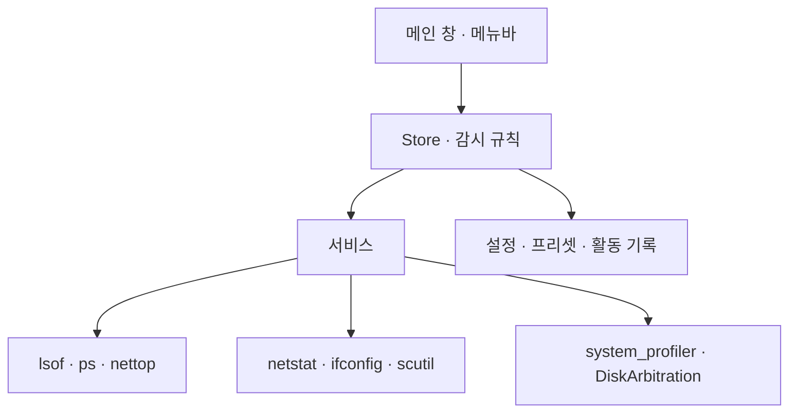

title: PortManager: 개발 서버 포트와 외장 SSD를 한곳에서 관리하기
slug: port-manager-macos-network-and-storage
category: 개인 프로젝트
tags: macos,swift,swiftui,developer-tools,ports,external-storage,orca
summary: Orca에서 여러 개발 세션을 다루며 만든 macOS 유틸리티. 포트를 점유한 프로세스, 네트워크 상태, USB·Thunderbolt와 외장 볼륨을 한곳에서 확인하고 종료와 eject의 실패 과정을 정리했다.
toc: true
publishedAt: 2026-10-01T18:32:17.678857+09:00
syncHash: a85ddb1c7a53a672264759fe00c4b653a20e3e1fca2dd086aa2f7cdeb0b66ca4

---


Orca에서 여러 프로젝트와 코딩 에이전트 세션을 열어 두다 보니, 코드보다 먼저 포트를 정리해야 하는 순간이 생겼다.
새 개발 서버는 주소가 이미 사용 중이라고 하고, 터미널에는 비슷한 이름의 서버가 여럿 떠 있다. 세션이 많아질수록
어느 작업에서 띄운 프로세스가 아직 살아 있는지 기억만으로 구분하기 어려웠다.

외장 SSD를 연결해 파일을 옮기거나 작업할 때도 확인할 것이 흩어져 있었다. 드라이브의 남은 공간은 Finder에서 보고,
연결된 장치는 시스템 정보에서 찾고, 꺼내기가 막히면 다시 터미널로 돌아간다. 연결 상태를 확인하고 정리하는 일을
작은 앱 하나에서 끝내고 싶었다.

그래서 만든 것이 **PortManager**다. 네트워크 포트와 USB·Thunderbolt 같은 물리 연결은 성격이 다르지만,
내 맥에서 무엇이 연결되어 있고 누가 사용 중인지 확인한다는 목적은 같았다. SwiftUI로 메인 창과 메뉴바 팝오버를
만들고, 프로세스 종료와 외장 볼륨 꺼내기까지 이어 붙였다.

## 세션이 늘어날수록 포트의 주인을 먼저 찾게 됐다

개발 서버 하나만 실행할 때는 `lsof`로 PID를 찾고 종료하는 것으로 충분하다. 프런트엔드, API, 데이터베이스와
여러 프로젝트의 미리보기가 함께 돌기 시작하면 같은 확인을 계속 반복하게 된다. 필요한 것은 명령어를 더 외우는 것보다
현재 상태를 펼쳐 보는 화면이었다.

Ports 화면에는 포트 번호, 프로세스 이름, PID, 바인딩 주소, 프로토콜과 CPU·메모리를 함께 놓았다. 검색으로
포트나 프로세스를 좁히고, 선택한 항목의 실행 경로와 부모 프로세스 정보를 확인할 수 있다. Docker가 사용 가능하면
호스트 포트에 연결된 컨테이너 이름과 이미지도 덧붙인다.


*[Ports 화면을 원본 크기로 보기](/api/wiki-assets/f40ac75e-ab77-46a8-a37f-0095836e87b4)*

같은 포트 번호가 두 줄에 보인다고 반드시 충돌인 것은 아니다. 하나의 프로세스가 IPv4와 IPv6 소켓을 따로 열거나
주소별로 바인딩할 수 있다. 목록의 한 행은 소켓이고, 프리셋은 지정한 포트와 프로토콜을 누가 사용 중인지 판단한다.
이 구분을 두어 화면의 행 수와 실제로 관리하려는 포트를 혼동하지 않게 했다.

## 확인한 뒤 할 일을 같은 앱 안에 두었다

상태를 보여 주는 데서 끝나면 다시 터미널을 열어야 한다. PortManager에는 자주 이어지는 행동을 함께 넣었다.

| 확인하려는 것 | 이어지는 행동 |
|---|---|
| 특정 포트를 누가 사용하는가 | 프로세스 정보 확인과 종료 요청 |
| 같은 프로세스가 어떤 소켓을 열었는가 | 프로세스별 묶음으로 보기 |
| 프로젝트의 지정 포트가 비었는가 | 프리셋으로 정상 점유와 충돌 구분 |
| 포트의 트래픽이 임계값을 넘었는가 | 대역폭 규칙으로 알림 받기 |
| 외장 볼륨을 지금 꺼낼 수 있는가 | 언마운트 후 eject, 실패 시 점유 프로세스 확인 |
| 상태가 언제 바뀌었는가 | Activity에서 최근 기록 확인 |

프리셋에는 이름, 포트와 프로토콜을 저장하고 필요하면 예상 프로세스 이름을 지정한다. 앱을 처음 열었을 때 이미
발생한 충돌도 검사하고, 프리셋을 추가하거나 수정하면 현재 목록을 바로 다시 평가한다. 새로운 리스너가 생겨야만
규칙이 동작하는 방식으로 두지 않았다.

메인 창은 자세히 살펴보는 곳이고, 메뉴바는 작업 중 짧게 확인하는 곳이다. 메뉴바에서 리스너와 외장 볼륨을 보고
필요하면 메인 창을 열 수 있다. 어느 쪽에서 꺼내기를 시작하든 같은 확인 창과 실패 안내를 사용한다.

## 종료 버튼을 누르기 전에 같은 프로세스인지 다시 확인한다

포트를 정리하는 도구에서 가장 조심해야 할 부분은 프로세스 종료다. 목록을 조회한 시점과 버튼을 누른 시점 사이에
프로세스가 끝나고, 운영체제가 같은 PID를 다른 프로세스에 다시 부여할 수 있다. 화면에 있던 숫자만 믿고 신호를
보내면 선택한 대상과 실제 대상이 달라질 수 있다.

조회할 때 PID와 함께 생성 시각, 프로세스 이름과 실행 경로를 기록한다. 종료 확인 창을 열 때 다시 비교하고,
실제로 신호를 보내기 직전에도 확인한다. 정보를 읽을 수 없거나 일치하지 않으면 종료를 진행하지 않는다.
앱 자신과 보호 대상 시스템 프로세스도 서비스에서 차단한다.

처음에는 `SIGTERM`으로 종료를 요청하고 잠시 기다린다. 응답하지 않을 때만 강제 종료 선택지를 보여 준다.
권한이 없는 다른 사용자나 root 프로세스까지 자동으로 처리하는 권한 헬퍼는 넣지 않았다. 이 경우에는 권한 오류와
수동 명령을 안내하며, 앱이 관리자 권한을 가진 것처럼 행동하지 않는다.

## 외장 SSD는 볼륨과 연결 장치를 함께 보게 했다

외장 SSD를 쓸 때 궁금한 것은 저장 공간만이 아니다. 볼륨이 마운트되어 있는지, 파일 시스템은 무엇인지,
어떤 연결 장치가 보이는지, 케이블을 분리하기 전에 꺼내기가 끝났는지도 확인하고 싶었다. Devices 화면은 외장 볼륨의
이름·마운트 경로·용량과 USB·Thunderbolt 장치 트리를 한곳에 모은다.


*캡처 당시에는 마운트된 디스크 이미지와 Thunderbolt 버스가 표시되어 있다. 외장 SSD를 연결해 촬영한 화면은 아니다.*

꺼내기는 `DiskArbitration`을 사용한다. 선택한 볼륨을 소유한 장치의 다른 볼륨까지 언마운트한 뒤, 성공했을 때
eject를 요청한다. 언마운트가 실패했는데도 다음 단계를 실행하지 않도록 순서를 고정했다.

파일이 사용 중이면 해당 장치의 마운트 경로를 대상으로 점유 프로세스를 조회한다. 목록에서 점유한 프로그램을
확인하고 필요한 프로그램을 종료한 뒤 다시 시도할 수 있게 했다. 강제 옵션도 제공하지만, 강제 언마운트 자체가 실패하면 eject로 넘어가지 않는다.
확인 창에는 같은 장치의 다른 볼륨도 영향을 받는다는 점을 먼저 표시한다.

이 화면은 연결된 볼륨을 확인하고 정리하는 도구다. SSD의 수명, SMART 상태나 성능을 진단하는 기능은 없다.
USB·Thunderbolt 트리와 볼륨 목록도 각각 보여 주며, 모든 장치와 볼륨을 하나의 물리 연결도로 매핑하지는 않는다.

## 네트워크 연결 상태도 같은 앱에서 확인하게 했다

포트는 열려 있는데 접속이 안 될 때는 프로세스 목록만으로 판단하기 어렵다. Network 화면에는 인터페이스별
주소와 송수신 속도, 기본 게이트웨이와 DNS를 표시한다. Wi-Fi는 신호와 채널 등 운영체제가 제공하는 정보도 함께 보여 준다.


트래픽은 누적 바이트의 차이를 실제 경과 시간으로 나누어 계산한다. 프로세스 단위 수치와 연결 단위 수치를 구분하고,
연결을 식별할 때 PID, TCP·UDP와 양쪽 주소·포트를 함께 사용한다. 포트 번호만 같은 서로 다른 연결이 섞이지 않게 하기 위해서다.

데이터를 못 읽은 상태와 트래픽이 실제로 0인 상태도 구분했다. 쉬고 있는 리스너의 값이 0이라면, 같은 프로세스의
다른 연결에서 생긴 트래픽으로 대체하지 않는다. VPN 인터페이스의 바이트 열과 IPv6 주소 표기도 별도로 확인했다.
Wi-Fi SSID처럼 권한에 따라 숨겨지는 값은 그대로 숨김 상태로 보여 준다.

## 계속 켜 둘 도구라 수집 비용도 정리했다

포트 목록, 네트워크 정보와 장치 트리를 같은 주기로 전부 수집하면 작은 유틸리티도 불필요한 일을 많이 하게 된다.
특히 `nettop`은 한 번의 샘플을 얻는 데 시간이 걸려 포트 목록 갱신과 같은 경로에 넣기 어려웠다.

그래서 수집을 나누었다. 포트 목록 갱신은 겹쳐 실행하지 않고, 조회 옵션이 바뀌면 이전 옵션으로 받은 결과를 버린다.
대역폭은 Ports 화면이 보이거나 활성화된 대역폭 알림 규칙이 있을 때 수집한다. DNS와 게이트웨이는 짧은 기간 캐시하고,
인터페이스 주소나 연결 상태가 바뀌면 다시 가져온다.

설정에서 포트 목록의 자동 조회를 일시정지해도 수동 새로고침은 사용할 수 있다. 더 이상 보이지 않는 연결의
바이트 기록은 정리하고, 프로세스 아이콘 캐시에도 상한을 둔다. CPU가 몇 퍼센트 줄었다는 수치를 내세우기보다
앱이 필요하지 않은 수집을 계속하지 않도록 동작 조건을 명확히 했다.

## macOS 기본 도구와 네이티브 API를 연결했다

PortManager는 별도의 서버 없이 맥 안에서 동작한다. `lsof`, `ps`, `nettop`, `netstat` 같은 기본 명령으로 상태를
수집하고, 디스크 이벤트와 꺼내기는 네이티브 API에 맡겼다. 화면은 각 Store를 관찰하고, 시간이 걸리는 명령 실행은
화면 갱신을 담당하는 MainActor 밖에서 처리한다.



Swift 6의 엄격한 동시성 검사를 사용하며, 빌드는 Xcode 프로젝트 없이 SwiftPM과 Command Line Tools로 구성했다.
스크립트가 실행 파일, Info.plist와 아이콘을 `.app` 번들로 조립하고 로컬 개발용 ad-hoc 서명을 한다.
현재 대상 운영체제는 macOS 15 이상이다.

로컬 소스가 있는 환경에서 사용하는 명령은 다음과 같다.

```sh
make build
make test
open PortManager.app
```

앱은 `.app` 번들로 실행한다. 테스트는 이 개발 환경에 맞춰 실행 바이너리의 `--selftest` 분기로 돌리고,
파싱·수집·감시와 위험한 동작의 순서를 확인한다.

## 작은 유틸리티도 실패 상황부터 확인했다

목록이 잘 뜨는 것만으로 종료와 꺼내기를 맡길 수는 없었다. 최근 보완에서는 명령의 표준 오류가 많이 출력될 때
실행이 멈추는 경우, 취소 직후 수집이 다시 시작되는 경우, 초기 화면에 이미 포트 충돌이 있는 경우를 회귀 검사에 넣었다.

명령 실행에는 타임아웃과 취소를 적용하고 표준 출력과 표준 오류를 함께 읽는다. 수집 실패를 빈 목록으로 바꾸지 않고
오류를 표시한다. 활동 기록은 여러 날짜의 최근 기록을 복원하며, 기록 지우기는 화면뿐 아니라 저장된 파일에도 반영한다.

이 글을 정리한 시점에는 인바이너리 검사 81개와 릴리스 빌드를 통과했다. 프로세스 보호와 PID 재사용 검사는 신호를
보내지 않는 방식으로 확인했고, 언마운트 실패 시 eject가 실행되지 않는지는 주입한 작업으로 검사했다.
실제 작업 프로세스를 종료하거나 실제 외장 SSD를 꺼내는 통합 시험까지 완료했다는 뜻은 아니다.

## 소스는 공개하고 앱 배포는 다음 작업으로 남겼다

소스와 빌드 방법은 [GitHub 저장소](https://github.com/jaymunsh/port-manager)에 공개했다. README에는 주요 기능과
실제 화면, 실행 방법과 권한 제약을 정리했다. 현재는 소스에서 빌드해 사용하는 방식이며 별도의 릴리스 다운로드는
아직 제공하지 않는다. Developer ID 서명과 공증, 설치 패키지와 자동 업데이트는 앱 배포 전에 정리할 작업으로 남아 있다.

권한 헬퍼 없이 처리할 수 있는 프로세스와 디스크 작업에는 한계가 있고, 운영체제가 허용한 정보만 보여 준다.
여러 장치를 동시에 연결했을 때의 실패 흐름과 강제 옵션은 실제 사용 환경에서 더 확인해야 한다.

PortManager를 만든 계기는 작았다. 세션을 많이 열어 두는 작업 환경에서, 무엇이 아직 살아 있고 무엇을 정리해도 되는지
빠르게 확인하고 싶었다. 그 요구에 외장 SSD와 연결 장치의 상태 확인을 더하면서, 내 맥의 포트와 장치를 살펴보는
작은 관리 창이 되었다.
