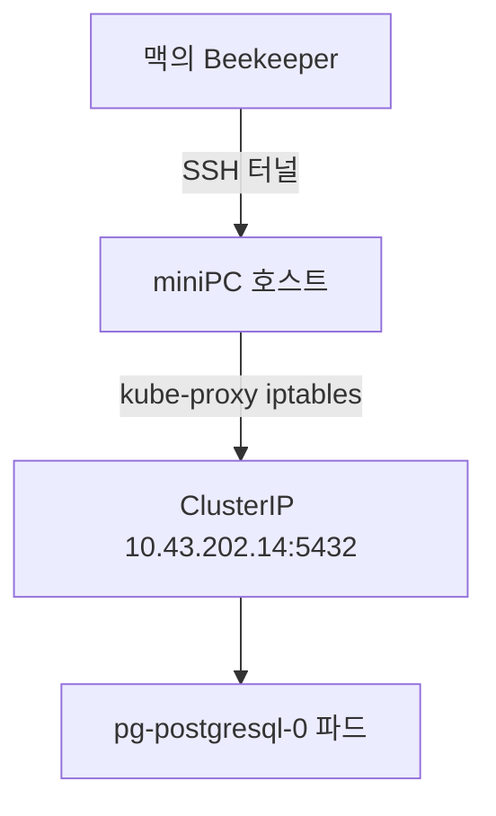
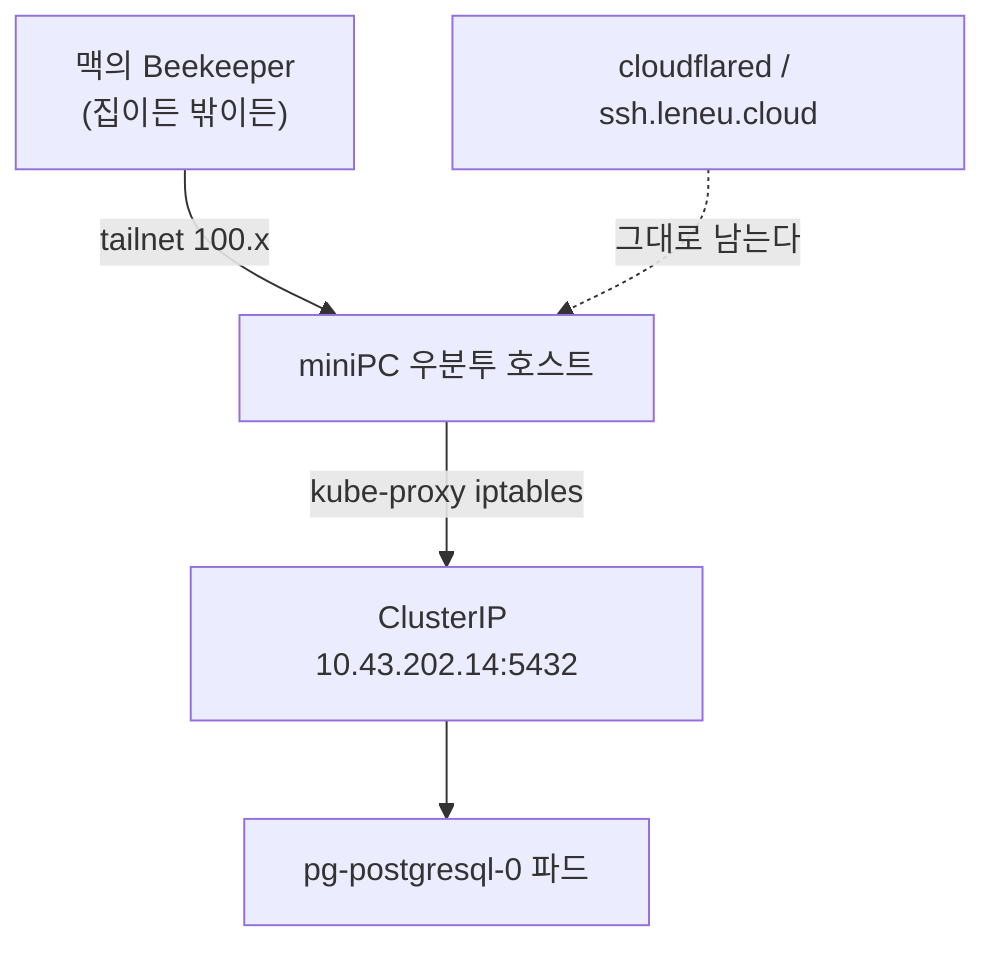

title: 누가 가입했지, 하고 열어 봤다가 운영 DB 보는 길을 새로 깔았다
slug: prod-db-access-path-tailscale
category: 개발 노트
summary: 우연히 본 텔레그램 알림에 회원가입 경로가 찍혀 있었다. 이 사이트에 가입할 사람이 없는데 누가 가입한 것이다. 궁금해서 열어 보려다가 정작 운영 DB를 들여다볼 도구가 이 맥에 하나도 없다는 걸 알았다. Beekeeper Studio를 알게 되고, ClusterIP에 붙는 길을 만들고, Cloudflare 터널을 못 타는 벽에 부딪혀 이미 쓰고 있던 Tailscale을 이 클러스터에 들이고, 실제로 넣어 예측과 대조하기까지의 기록이다.
tags: postgresql,tailscale,cloudflare-tunnel,beekeeper-studio,kubernetes,k3s,prometheus,alerting,trouble-shooting
toc: true
publishedAt: 2026-09-06T12:21:04.919179Z
syncHash: 86702702cb1f3099ec406700322da33c1ea3a36fe0d31ee12a2e8700a9461c3c

---
저녁에 텔레그램을 우연히 봤다. 알림이 하나 와 있었다.

```text
[jay-wiki] JaywikiApi400Observed
시간: 2026-09-06 18:04:01 KST
내용: 400 잘못된 요청 · POST /api/auth/register
네임스페이스: backend
에러코드: 400
```

급한 일로 보이지는 않았다. 400은 서버가 죽은 게 아니라 요청을 거절한 것이고, 알림 자체도 그렇게 적혀 있다. 눈에 걸린 건 상태 코드가 아니라 경로였다.

`/api/auth/register`. 회원가입이다.

**이 사이트에 가입할 사람이 없다.** 공개 포트폴리오라 누구나 들어올 수는 있지만, 계정을 만들어서 할 수 있는 일이 딱히 없다. 그런데 누가 가입을 시도했고, 몇 번 실패까지 했다는 것이다.

그래서 봤다. 고쳐야 할 버그가 있어서가 아니라 그냥 궁금해서였다. 그리고 그 궁금증은 끝내 못 풀었는데, 대신 훨씬 쓸모 있는 걸 알게 됐다. **나는 운영 데이터베이스를 들여다볼 도구가 하나도 없었다.**

## 로그를 먼저 열었는데 아무것도 없었다

알림 문구는 다음에 할 일을 적어 두고 있었다. "Grafana - Explore - Loki 에서 unreadable request body 로 확인합니다." 그래서 로그부터 봤다.

```bash
kubectl -n backend logs jaywiki-789f9cd48-mplzr --since=6h | grep -i "register\|unreadable\|BAD_REQUEST"
```

한 줄도 안 나왔다. 파드 둘 다 마찬가지였다. 범위를 넓혀 보니 이유가 명확했다. **애플리케이션이 마지막으로 뭔가를 찍은 시각이 이틀 전, 파드가 기동한 순간이었다.** 그 뒤로는 Kafka 컨슈머 리밸런싱 로그를 끝으로 완전히 조용했다.

당연한 일이다. Spring MVC는 4xx 응답을 예외로 취급하지 않는다. 컨트롤러가 `ResponseEntity.status(400)` 을 돌려주고 끝나면 그건 정상적인 응답 흐름이고, 로거는 아무 관심이 없다. **로그가 없다는 것은 "아무 일도 없었다"가 아니라 "로그로 남기지 않기로 한 일이 일어났다"는 뜻이다.**

## exception 라벨 하나가 범인을 갈랐다

답은 로그가 아니라 메트릭에 있었다. Micrometer가 `http_server_requests_seconds_count` 를 내보내고 있고, 애초에 알림을 발사한 것도 그 지표다. 알림이 태어난 자리로 되돌아가는 게 맞았다.

```bash
kubectl -n obs port-forward svc/prom-prometheus-server 19090:80
curl -sG http://127.0.0.1:19090/api/v1/query \
  --data-urlencode 'query=http_server_requests_seconds_count{uri="/api/auth/register"}'
```

돌아온 시계열의 라벨이 상황을 거의 다 설명해 줬다.

| 라벨 | 값 | 무엇을 뜻하나 |
|---|---|---|
| `status` | `400` | 서버가 요청을 거절했다 |
| `outcome` | `CLIENT_ERROR` | 보낸 쪽 잘못이라고 분류했다 |
| `exception` | `none` | **예외가 안 났다** |

`exception` 이 `none` 이라는 게 결정적이었다. Spring에서 `POST` 요청이 400을 받는 경로는 크게 둘인데, 둘의 흔적이 다르다.

**첫째, 요청 본문을 못 읽은 경우다.** JSON이 깨졌거나 필드 타입이 안 맞으면 `HttpMessageNotReadableException` 이 뜨고, 그 이름이 메트릭 라벨에 그대로 박힌다. 알림 문구가 언급한 "unreadable request body" 가 이 갈래다. 봇이 이상한 페이로드를 던졌을 때 주로 생긴다.

**둘째, 컨트롤러가 스스로 거절한 경우다.** 본문은 멀쩡히 읽혔고 검증 로직이 값을 보고 돌려보낸 것이다. 예외가 안 나므로 라벨은 `none` 이다.

우리 건 두 번째였다. 그러면 `AuthController` 에서 400을 내는 자리만 보면 된다. 두 군데뿐이었다.

```java
if (username.length() < 3 || username.length() > 30 || !username.matches("[a-zA-Z0-9_.-]+")) {
    return ResponseEntity.status(HttpStatus.BAD_REQUEST)
            .body(Map.of("error", "아이디는 3~30자의 영문, 숫자, _, ., - 만 사용할 수 있습니다."));
}
if (req.password() == null || req.password().length() < 8) {
    return ResponseEntity.status(HttpStatus.BAD_REQUEST)
            .body(Map.of("error", "비밀번호는 8자 이상이어야 합니다."));
}
```

아이디 규칙에 안 맞았거나 비밀번호가 8자 미만이었다는 뜻이다. 서버는 정확히 시킨 대로 동작했고 고칠 버그는 없었다.

## 상태 코드 셋을 같이 놓으니 사람의 흔적이 보였다

400만 보면 "누가 실패했다" 까지밖에 안 나온다. 같은 엔드포인트의 다른 상태 코드를 함께 세어 보면 이야기가 달라진다.

```bash
curl -sG http://127.0.0.1:19090/api/v1/query \
  --data-urlencode 'query=sum by (status) (http_server_requests_seconds_count{uri="/api/auth/register"})'
```

| 상태 | 누적 건수 | 서버가 왜 그렇게 답했나 |
|---|---:|---|
| 400 | 4 | 아이디 규칙 위반 또는 비밀번호 8자 미만 |
| 409 | 2 | 이미 사용 중인 아이디 |
| 200 | 3 | 가입 성공 |

그리고 이 아홉 건이 언제 찍혔는지를 분 단위로 훑었다. 누적 카운터를 시간축에 펼치면 계단이 어디서 올라갔는지 보인다.

| 시각 | 200 | 400 | 409 |
|---|---:|---:|---:|
| 18:04 | 1 | 1 | 없음 |
| 18:05 | 3 | 4 | 2 |

**아홉 건이 전부 2분 안에 몰려 있었다.** 그 전에도 그 후에도 이 엔드포인트는 완전히 조용했다. 파드가 기동한 지 이틀이 지났는데 회원가입 요청이 그 2분에만 있었다.

이 모양은 자동화된 스캔과 다르다. 봇이 폼을 두드리면 같은 오류가 규칙적으로 반복되거나, 애초에 라우트가 안 맞아 404로 떨어진다. **400과 409와 200이 섞여 있고 마지막에 성공으로 끝나는 것은 사람이 폼 앞에서 헤맨 흔적이다.** 아이디를 짧게 넣어 거절당하고, 비밀번호를 짧게 넣어 또 거절당하고, 이미 쓴 아이디를 다시 넣어 409를 받고, 결국 통과했다.

한 가지 덧붙이면, `increase()` 로 볼 때 값이 `2.65` 같은 소수로 나오는 건 이상 현상이 아니다. Prometheus는 스크레이프 간격 사이를 선형으로 외삽하기 때문에 창 경계에 걸친 증가분이 소수가 된다. **정확한 건수를 세려면 `increase()` 가 아니라 누적 카운터를 두 시점에서 비교해야 한다.** 위 표를 굳이 계단 형태로 뽑은 이유다.

## 정작 궁금한 걸 볼 도구가 없었다

CLI로 못 볼 건 없다. 이렇게 치면 나온다.

```bash
kubectl -n data exec pg-postgresql-0 -- env PGPASSWORD="$(kubectl -n data get secret \
  pg-postgresql -o jsonpath='{.data.postgres-password}' | base64 -d)" \
  psql -U postgres -d portfolio \
  -c "select id, username, nickname, role, created_at from tb_user order by id desc limit 8;"
```

한 줄이긴 한데, 이 한 줄을 완성하려면 미리 알고 있어야 하는 게 셋이다.

**비밀번호를 실어 보내야 한다.** 컨테이너 안에서도 `postgres` 사용자는 인증을 거친다. 그런데 `kubectl exec` 를 `-it` 없이 돌리면 비밀번호를 받을 자리가 없어서, Secret에서 꺼낸 값을 `env PGPASSWORD=` 로 미리 넣어 줘야 한다. 그래서 명령 안에 명령이 하나 더 들어간다.

**테이블 이름을 알아야 한다.** 엔티티 클래스는 `AccountUser` 인데 테이블은 `tb_user` 다. 이 저장소가 `tb_` 접두사를 쓰기 때문인데, 이건 소스를 열어야 확인된다.

```java
@Table(schema = "public", name = "tb_user")
public class AccountUser {
```

**컬럼 이름도 알아야 한다.** `select *` 로 던지면 되긴 하지만, 터미널에서는 컬럼이 많을수록 줄이 접혀서 오히려 못 읽는다. 볼 것만 골라 적으려면 스키마를 기억하고 있어야 한다.

한 번 조립해 두면 다음부터는 히스토리에서 꺼내 쓰면 된다. **문제는 데이터를 확인하는 일이 대개 한 번의 질의로 안 끝난다는 것이다.** 계정 목록을 보면 그다음엔 그 계정이 뭘 했는지 궁금해지고, 그러면 다른 테이블로 옮겨 가고, 아까 본 결과와 지금 결과를 나란히 놓고 비교하게 된다. 터미널에서는 이 왕복이 전부 명령 재입력이다.

전에 일할 때 항상 도구를 띄워 놓고 봤던 게 이래서였다. **비밀번호는 연결 설정에 한 번 저장하면 끝이고, 테이블 이름과 컬럼은 왼쪽 목록에서 눈으로 찾아 누르면 된다.** 소스를 열어 `@Table` 어노테이션을 확인할 일이 없다. 도구가 대단한 기능을 주는 게 아니라, 매번 다시 조립하던 것을 한 번만 조립하게 해 준다.

그래서 도구를 띄우려고 했는데, 없었다.

```bash
for c in psql pgcli dbeaver-ce datagrip usql; do command -v $c || echo "-"; done
ls /Applications | grep -iE "dbeaver|datagrip|tableplus|postico|beekeeper|pgadmin"
```

**하나도 없었다.** `psql` 조차 없었다. 이 맥에서는 그동안 데이터베이스를 클러스터 안에서만 만졌기 때문이다. 결국 궁금증은 도구를 고르는 일로 넘어갔다.

## 겸사겸사 찾다가 Beekeeper Studio를 알게 됐다

처음에는 예전에 쓰던 것들을 떠올렸는데, 이왕 새로 까는 김에 요즘 뭘 쓰는지 찾아봤다. 그러다 처음 알게 된 게 Beekeeper Studio다.

후보는 사실상 둘로 좁혀졌다.

| | TablePlus | Beekeeper Studio |
|---|---|---|
| 라이선스 | 상용 | GPLv3 오픈소스 |
| 무료판 제한 | 탭·연결·필터 각 2개 | 없음 |
| 구현 | 맥 네이티브 | Electron |
| 실행 속도 | 즉시 뜬다 | 1~2초 늦다 |
| 값 | 1인 89달러 | 0원 |

처음에는 TablePlus로 기울었다. 네이티브 앱의 반응 속도는 매일 쓰는 도구에서 무시할 수 없고, 무료판에 시간 제한이 없다는 점도 좋았다.

**판단을 뒤집은 건 제한의 내용이었다.** TablePlus 무료판은 탭 두 개, 연결 두 개, 필터 두 개까지다. 그런데 이 클러스터에는 PostgreSQL이 둘 있다. 위키와 블로그가 쓰는 `pg-postgresql`, 주문 데모가 쓰는 `pg-services`. **둘을 동시에 열면 연결 두 개를 이미 다 쓴다.** 그 상태에서 테이블 몇 개를 나란히 놓고 비교하려는 순간 탭 제한에 걸린다.

바로 앞에서 "도구를 쓰는 이유가 왕복과 비교" 라고 적었는데, 무료판 제한이 정확히 그 왕복을 막는 자리에 걸려 있었다. 그래서 Beekeeper Studio로 정했다. Electron이라 조금 무겁지만, 하루에 몇 번 여는 도구에서 1~2초는 체감되지 않는다.

```bash
brew install --cask beekeeper-studio
```

한 가지 짚어 둘 게 있다. **Homebrew로 깔리는 것은 상용 기능 체험이 포함된 통합 빌드다.** 순수 Community Edition만 원하면 GitHub 릴리스에서 따로 받아야 한다. 조회 위주로 쓸 거라면 체험 기간이 끝나도 기본 기능은 계속 쓸 수 있어서 그냥 브루로 깔았다.

## 도구보다 어려웠던 건 붙는 길이었다

앱을 깔고 나서야 진짜 문제가 시작됐다. 어디에 붙을 것인가.

```bash
kubectl -n data get svc pg-postgresql pg-services
```

```text
NAME            TYPE        CLUSTER-IP     EXTERNAL-IP   PORT(S)
pg-postgresql   ClusterIP   10.43.202.14   <none>        5432/TCP
pg-services     ClusterIP   10.43.55.36    <none>        5432/TCP
```

둘 다 `ClusterIP` 다. `EXTERNAL-IP` 가 없다는 건 클러스터 밖에서는 존재하지 않는 주소라는 뜻이다. 이건 실수가 아니라 이 저장소의 원칙이다. 데이터베이스를 인터넷에 노출하지 않고, 인바운드 포트도 열지 않는다.

그래서 기본 처방은 `kubectl port-forward` 를 겹치는 것이다. 로컬에서 SSH로 miniPC에 들어가고, 거기서 port-forward를 띄우고, 그 포트를 다시 로컬로 당긴다.

```bash
ssh -N -L 15432:127.0.0.1:15432 miniPC \
  'kubectl -n data port-forward svc/pg-postgresql 15432:5432'
```

돌아가긴 하는데 부품이 둘이다. 그런데 확인해 보니 그중 하나가 필요 없었다.

```bash
nc -z -w3 10.43.202.14 5432
# Connection to 10.43.202.14 5432 port [tcp/postgresql] succeeded!
```

**miniPC 호스트에서 ClusterIP에 직접 붙는다.** 당연하다면 당연한데 의식하고 있지 않았다. k3s 노드에서는 kube-proxy가 만든 iptables 규칙이 호스트 네트워크 네임스페이스에 살아 있어서, 노드 자신이 ClusterIP로 나가는 트래픽을 파드로 넘겨준다. **ClusterIP가 "클러스터 안에서만 유효한 주소" 라고 할 때의 '안'에는 노드 자신이 포함된다.**

그러면 `kubectl port-forward` 단계가 통째로 빠진다. SSH가 노드까지 닿기만 하면 그다음은 노드가 알아서 넘긴다.



Beekeeper에는 SSH 터널 기능이 내장돼 있으니 터미널을 하나 통째로 내줄 필요도 없다. 앱 설정만으로 끝난다. 여기까지는 깔끔했다.

## Beekeeper가 Cloudflare 터널을 못 탄다

집에서는 위 구성이 그대로 돌아간다. SSH Host에 랜 주소 `192.168.0.82` 를 넣으면 된다.

문제는 밖에서다. 이 저장소의 `~/.ssh/config` 는 이렇게 생겼다.

```text
Host miniPC
  HostName ssh.leneu.cloud
  User jaymunsh
  ProxyCommand /opt/homebrew/bin/cloudflared access ssh --hostname %h
  IdentityFile ~/.ssh/id_ed25519_minipc
```

miniPC는 인바운드 포트를 안 연다. SSH도 Cloudflare Tunnel을 지나서 들어가고, 그걸 이어 주는 게 `ProxyCommand` 의 `cloudflared` 다. 즉 **밖에서 miniPC에 붙는다는 것은 SSH 클라이언트가 `ProxyCommand` 를 실행할 수 있다는 뜻이다.**

Beekeeper는 그걸 못 한다. 확인해 보니 알려진 제약이고 기능 요청이 여러 건 올라와 있다. **Beekeeper의 SSH 터널은 `ProxyCommand` 를 지원하지 않고 `~/.ssh/config` 도 읽지 않는다.** 내부적으로 Node의 SSH 라이브러리를 쓰는데, 호스트·포트·사용자·키 파일만 받고 임의의 외부 프로세스를 프록시로 끼우는 경로가 없다.

여기서 방금 해결한 port-forward 문제와 성격이 다르다는 걸 짚어야 한다. **port-forward는 부품을 하나 줄이면 되는 문제였고, 이건 밖에서는 아예 길이 없는 문제다.**

| | 집 (랜) | 밖 (Cloudflare Access) |
|---|---|---|
| Beekeeper 내장 터널 | 된다 | **안 된다** |
| 터미널에서 `ssh -L` | 된다 | 된다 (세션 유효할 때) |
| 세션 만료 | 없다 | 주기적으로 브라우저 재인증 |

밖에서 쓰려면 Beekeeper의 내장 터널을 포기하고, 터미널에서 `ssh -N -L` 을 띄운 뒤 Beekeeper는 `127.0.0.1` 에 붙여야 한다. 볼 때마다 터미널을 하나 내주고, 세션이 만료되면 `cloudflared access login` 으로 브라우저 인증을 하고, 그다음에 다시 터널을 띄우는 것이다. 실제로 이날 조사하는 동안에도 `ssh miniPC` 가 안 붙어서 랜 주소로 우회했다. Access 세션이 만료돼 있었다.

**그리고 밖에서 볼 일이 더 많다.** 집에 있을 때는 애초에 급하지 않다.

## Tailscale은 이미 쓰고 있었는데 여기 쓸 생각을 못 했다

여기서 좀 민망한 이야기를 해야 한다. 해결책을 찾다가 Tailscale에 도달했는데, **나는 Tailscale을 이미 쓰고 있었다.** 이 맥에도 깔려 있었다. 다만 이 클러스터에 적용할 생각을 한 번도 안 했다.

왜 안 떠올랐는지 되짚어 보니 이유가 분명했다. **이미 붙는 길이 있었기 때문이다.** cloudflared로 SSH가 되고 있었고, 그래서 "miniPC 접속" 은 내 머릿속에서 이미 해결된 항목으로 분류돼 있었다. 해결된 항목은 다시 안 본다. Beekeeper가 `ProxyCommand` 를 못 탄다는 사실이 그 분류를 깨기 전까지는, 접속 방식을 바꿔 볼 이유 자체가 없었다.

**도구는 문제가 새로 생겨야 떠오른다.** 손에 이미 쥐고 있어도 그렇다.

몰랐던 게 하나 더 있었다. **우분투 노드에 깔아서 데이터베이스 접근에만 쓸 수 있다는 것.** 막연히 Tailscale을 들이면 클러스터 전체를 그 그물에 태우는 일이 될 거라고 생각했는데, 그렇지 않았다.

실제로 일어나는 일은 이렇다. **miniPC라는 우분투 머신 하나가 tailnet의 장치가 되고, 그 머신에 SSH로 붙는 경로가 하나 늘어날 뿐이다.** 쿠버네티스는 이 일에 관여하지 않는다. 파드도, 서비스도, CNI도 Tailscale의 존재를 모른다. 그 위로 무엇을 태울지는 전적으로 내가 정한다. 나는 Beekeeper의 SSH 터널 하나만 태울 것이다.



더 넓게 쓸 수도 있다. `--advertise-routes=10.43.0.0/16` 으로 서비스 대역을 tailnet에 광고하면, 맥에서 ClusterIP를 직접 부를 수 있게 된다. SSH 터널조차 필요 없어진다. **하지만 안 한다.** 그건 클러스터 내부 대역 전체를 내 노트북에 붙여 놓는 것이고, 지금 필요한 건 데이터베이스 하나를 보는 일이다. SSH 터널 한 겹을 남겨 두면 노출면이 그만큼 작다.

그래서 정리하면 Tailscale을 들이는 이유는 하나로 좁혀진다. **포트 포워딩 때문이 아니라, Cloudflare 터널을 Beekeeper가 못 타기 때문이다.** port-forward는 앞에서 이미 걷어냈다. 남은 건 `ProxyCommand` 하나였고, Tailscale은 그걸 필요 없게 만든다. tailnet 주소는 그냥 IP라서 평범한 SSH 클라이언트가 그대로 붙는다.

대안도 놓고 봤다.

| 방법 | 얻는 것 | 잃는 것 |
|---|---|---|
| cloudflared 유지 | 부품이 안 는다 | 밖에서 볼 때마다 터미널과 재인증 |
| Tailscale 추가 | 집과 밖의 절차가 같아진다 | 상주 데몬이 하나 는다 |
| WireGuard 직접 구성 | 통제권이 가장 크다 | 키 배포와 NAT 통과를 직접 감당 |

두 번째로 갔다. **도구를 새로 들이는 비용은 한 번이지만, 절차가 둘로 갈라진 채로 두면 그 비용은 쓸 때마다 나간다.**

기존 원칙과 충돌하지 않는다는 점도 확인했다. **Tailscale도 아웃바운드 연결로 그물을 만든다.** 인바운드 포트를 안 연다는 원칙은 그대로다. cloudflared를 걷어내는 것도 아니다. `ssh.leneu.cloud` 는 그대로 두고 경로를 하나 더 두는 것이다.

마지막 문장은 특히 중요하다. **이 저장소는 cloudflared를 건드렸다가 SSH 경로가 통째로 끊긴 적이 있다.** reload도 HUP도 안 먹혀서 랜으로 우회해 복구했다. 그래서 잘 돌고 있는 터널은 안 만지는 쪽으로 정했고, Tailscale은 그 옆에 나란히 놓는 것이지 대체하는 게 아니다.

## 넣기 전에 위험을 실제로 재 봤다

k3s가 돌고 있는 노드에 네트워크 계층을 하나 더 얹는 일이다. 무엇이 깨질 수 있는지 먼저 봤다.

### 주소 대역은 안 겹친다

가장 먼저 볼 것은 CIDR 충돌이다. 겹치면 라우팅이 조용히 어긋난다.

| 무엇 | 대역 |
|---|---|
| Tailscale | `100.64.0.0/10` |
| k3s 파드 | `10.42.0.0/16` |
| k3s 서비스 | `10.43.0.0/16` |
| 집 랜 | `192.168.0.0/24` |

넷이 서로 안 겹친다. Tailscale이 쓰는 `100.64.0.0/10` 은 통신사 대규모 NAT용으로 예약된 대역이라, 사설망에서 쓰는 `10.` 이나 `192.168.` 과 부딪힐 일이 구조적으로 적다.

표만 보고 넘기지는 않았다. 그 대역을 이미 점유한 경로가 하나라도 있으면 표는 아무 의미가 없다.

```bash
ip route show 100.64.0.0/10
# (한 줄도 안 나온다)
```

비어 있다. Tailscale이 들어올 자리가 그대로 남아 있으니, subnet router로 쓰지 않는 한 라우팅 테이블에 생기는 변화는 `100.64.0.0/10` 한 줄이 늘어나는 정도일 것이다. **이 예측은 나중에 틀린 것으로 드러나는데, 다행히 틀린 방향이 좋은 쪽이었다.**

### 정작 Beekeeper가 쓸 길은 라우팅 테이블에 없었다

대역을 확인하고 나니 다른 게 걸렸다. 내가 붙으려는 주소는 서비스 대역의 `10.43.202.14` 인데, 라우팅 테이블에 `10.43.0.0/16` 이 없다. 파드 대역인 `10.42.0.0/24` 는 `cni0` 로 올라와 있는데 서비스 대역만 빠져 있다. 그래서 커널에 직접 물었다.

```bash
ip route get 10.43.202.14
# 10.43.202.14 via 192.168.0.1 dev enp2s0 src 192.168.0.82
```

이 주소를 공유기로 내보내겠다는 답이다. 공유기는 당연히 `10.43.` 대역을 모른다. 그런데 실제로 두드리면 붙는다.

```bash
nc -z 10.43.202.14 5432
# Connection to 10.43.202.14 5432 port [tcp/postgresql] succeeded!
```

조회 결과와 실제 동작이 어긋난 것처럼 보이지만 둘 다 맞다. **ClusterIP는 어느 인터페이스에도 실재하지 않는 가상 주소이고, 목적지가 먼저 바뀐 다음에 라우팅이 일어나기 때문이다.** kube-proxy가 nat 테이블의 OUTPUT 체인에 DNAT 규칙을 걸어 두고, 패킷이 노드를 떠나기 전에 목적지를 실제 파드 IP인 `10.42.0.x` 로 갈아치운다. 경로는 그 뒤에 정해지고, 그때는 `cni0` 로 간다. `ip route get` 은 규칙이 적용되기 전 주소로 묻는 것이라 기본 경로를 답할 수밖에 없다.

이게 Tailscale 판단에 중요한 이유가 있다. **Beekeeper가 탈 경로는 라우팅 테이블이 아니라 방화벽 규칙에 얹혀 있다**는 뜻이기 때문이다. Tailscale은 POSTROUTING에 자기 체인을 하나 붙이지만 그것은 `tailscale0` 로 나가는 트래픽에만 걸리고, nat 테이블의 OUTPUT 체인은 건드리지 않는다. 라우팅 테이블이 어떻게 바뀌든 이 길은 그대로 남는다.

### DNS 위험은 생각보다 작았다

여기서 판단을 한 번 고쳤다. 처음에는 이렇게 걱정했다. Tailscale이 MagicDNS를 켜면 호스트의 `/etc/resolv.conf` 를 자기 것으로 바꾸고, k3s의 CoreDNS는 노드의 resolv.conf를 상위 서버로 쓰니, **DNS가 뒤틀리면 파드 전체의 외부 이름 풀이가 같이 흔들린다**는 것이었다.

그래서 실제 설정을 봤다.

```bash
kubectl -n kube-system get cm coredns -o jsonpath='{.data.Corefile}' | grep forward
#     forward . /etc/resolv.conf

ls -l /etc/resolv.conf
# /etc/resolv.conf -> ../run/systemd/resolve/stub-resolv.conf
```

호스트의 `/etc/resolv.conf` 는 systemd-resolved의 스텁을 가리킨다. 스텁 주소는 `127.0.0.53` 인데, **이건 파드 안에서 쓸 수 없는 주소다.** 파드의 루프백은 노드의 루프백이 아니기 때문이다. 그런데 CoreDNS는 멀쩡히 외부 이름을 풀고 있었다.

```bash
nslookup github.com 10.43.0.10
# Name: github.com
# Address: 20.200.245.247
```

이유는 k3s가 그 함정을 이미 피해 뒀기 때문이다. **k3s는 systemd-resolved를 감지하면 스텁이 아닌 실제 상위 서버가 적힌 파일을 따로 만들어 kubelet에 물린다.** 그래서 CoreDNS 파드가 받는 resolv.conf에는 스텁 대신 통신사 DNS가 들어 있다.

정리하면 **Tailscale이 건드리는 것은 호스트의 시스템 DNS이고, CoreDNS가 보는 것은 k3s가 따로 만든 파일이다.** 두 경로가 갈라져 있어서 처음 걱정한 만큼의 위험은 아니다. 게다가 systemd-resolved가 떠 있는 시스템에서는 Tailscale이 파일을 덮어쓰지 않고 resolved의 D-Bus API로 스플릿 DNS를 설정한다. 파일을 통째로 갈아엎는 것은 DNS 관리자가 아예 없는 시스템에서 일어나는 일이다.

**그래도 방어는 남긴다.** 이 조합에서 예상과 다르게 동작한 사례가 보고돼 있고, 확인 비용보다 예방 비용이 훨씬 싸다. MagicDNS 이름을 포기하고 숫자 주소를 쓰면 그만이다.

```bash
sudo tailscale up --accept-dns=false
```

### 남는 부담 셋

**첫째, root 권한 데몬이 하나 늘어난다.** 커널 수준 네트워크를 만지는 상주 프로세스라 공격면이 넓어지는 건 사실이다. 다만 cloudflared도 이미 같은 성격이라 새로운 종류의 위험은 아니다.

**둘째, iptables 규칙이 겹친다.** flannel이 이미 규칙을 관리하고 있고 Tailscale도 자기 규칙을 넣는다. 보통은 공존하지만 이 조합에서 문제가 보고된 적이 있다.

다만 그 사고의 대표적인 형태 하나는 미리 지울 수 있었다. 요즘 배포판에는 `iptables` 명령이 둘 있다. 옛 커널 인터페이스를 쓰는 legacy 판과, 그 명령을 nftables로 번역해 넣는 nft 판이다. **두 쪽이 서로 다른 판을 잡으면 각자는 규칙을 잘 넣었는데 상대의 규칙이 안 보인다.** 그래서 따로 보면 멀쩡하고 합쳐 놓으면 엉뚱하게 도는, 제일 찾기 싫은 종류의 고장이 난다.

```bash
iptables --version
# iptables v1.8.10 (nf_tables)
update-alternatives --query iptables | grep '^Value:'
# Value: /usr/sbin/iptables-nft
```

이 노드는 nft 쪽으로 통일돼 있고, Tailscale도 PATH의 `iptables` 를 부르므로 같은 판을 잡는다. 갈릴 자리 자체가 없다. 남는 것은 FORWARD 체인에서 규칙 순서를 두고 벌어지는 경합인데, **이건 논증으로 못 정하고 넣은 다음에 재야 안다.** 어긋나면 `--netfilter-mode=off` 로 물러설 수 있다.

**셋째, 노드 키가 180일 뒤에 만료된다.** 이게 제일 조용한 함정이다. **만료를 없애려고 도입했는데 반년 뒤에 똑같은 일을 겪게 된다.** 게다가 그때쯤이면 왜 붙였는지도 잊는다. 관리 콘솔의 Machines 화면에서 해당 장치의 Disable Key Expiry를 켜야 하고, 이 단계를 빠뜨리면 도입 의미가 절반 사라진다.

### 되돌릴 수 있는지도 확인했다

`sudo tailscale down` 이면 인터페이스가 내려가고 원래 경로만 남는다. 완전히 지우려면 패키지를 제거한다. **되돌리는 명령이 한 줄이라는 것은 시도해 볼 만하다는 뜻이다.**

## 작업은 집 안에서 한다

순서를 이렇게 잡았다.

1. 밀려 있던 커널 업데이트를 먼저 반영한다
2. miniPC에 설치하고 `--accept-dns=false` 로 올린다
3. 관리 콘솔에서 그 장치의 키 만료를 끈다
4. 클러스터가 멀쩡한지 확인한다
5. 맥의 Tailscale을 켜고 Beekeeper의 SSH Host를 `100.x` 주소로 바꾼다

4번에서 볼 것은 미리 재 뒀다. **바꾸기 전의 값을 안 적어 두면 바꾼 뒤에 뭐가 달라졌는지 알 수 없다.**

| 확인할 것 | 지금 값 |
|---|---|
| CoreDNS 외부 이름 풀이 | `nslookup github.com 10.43.0.10` 이 응답 |
| 파드 상태 | `backend` 네임스페이스 5개 전부 Running |
| 노드에서 ClusterIP 도달 | `nc -z 10.43.202.14 5432` 성공 |
| 블로그·위키 화면 | 200 |

**1번은 원래 계획에 없었다.** 노드에 들어가 보니 `*** System restart required ***` 가 떠 있었다. 커널 패키지가 올라온 뒤로 16일 동안 재부팅을 안 한 상태였다.

```bash
cat /var/run/reboot-required.pkgs
# linux-image-6.8.0-139-generic
# linux-base
```

그냥 두고 진행할 수도 있었다. 하지만 Tailscale을 넣은 뒤에 뭔가 이상해지면, 원인이 Tailscale인지 반년 가까이 밀린 커널인지 가릴 방법이 없다. **변수를 하나만 남기려고 순서를 이렇게 잡았다.** 재부팅 뒤에 커널이 `6.8.0-139` 로 올라갔고, 위 표의 네 항목은 전부 그대로였다. 파드 재시작 횟수만 늘었는데 재부팅했으니 당연한 값이다. 이제 다음에 뭐가 깨지면 범인은 하나다.

그리고 **이 작업은 집 랜에 있을 때 한다.** 무언가 어긋나도 `192.168.0.82` 로 붙어 되돌릴 수 있기 때문이다. 밖에서 하다가 네트워크가 흔들리면 복구 경로가 없다. cloudflared 사고 때 배운 것이 정확히 이것이다. **원격 접속 경로를 고치는 작업은, 그 경로가 끊겨도 살아남는 다른 경로가 있을 때만 안전하다.**

## 넣고 나서 재 보니 예상보다 조용했다

설치는 한 줄이었고 브라우저 인증을 한 번 눌렀다.

```bash
curl -fsSL https://tailscale.com/install.sh | sh
sudo tailscale up --accept-dns=false
```

노드가 `100.116.204.88` 을 받았다. 그리고 앞에서 적어 둔 표를 그대로 다시 쟀다.

| 확인할 것 | 설치 전 | 설치 후 |
|---|---|---|
| `/etc/resolv.conf` | systemd-resolved 스텁 링크 | **한 글자도 안 바뀜** |
| CoreDNS 외부 이름 풀이 | 응답 | 응답 |
| 노드에서 ClusterIP 도달 | 성공 | 성공 |
| `backend` 파드 | 5개 Running | 5개 Running |
| 블로그·위키 화면 | 200 | 200 |

DNS 방어는 예상대로 동작했다. systemd-resolved가 떠 있는 시스템에서 `--accept-dns=false` 를 주면 Tailscale은 파일에 손을 안 댄다.

### 예측이 틀렸다 — main 라우팅 테이블은 한 줄도 안 바뀌었다

`100.64.0.0/10` 한 줄이 늘어날 거라고 적었는데, main 테이블은 설치 전과 완전히 같았다. Tailscale은 거기에 아무것도 넣지 않았다.

```bash
ip rule
# 5270:  from all lookup 52
# 32766: from all lookup main

ip route show table 52
# 100.100.100.100 dev tailscale0
# 100.118.146.16  dev tailscale0
# 100.125.174.2   dev tailscale0
```

**별도 테이블 `52` 를 만들고 `ip rule` 로 갈라 붙이는 방식이었다.** 게다가 대역 전체를 잡지도 않는다. 실제로 존재하는 피어 주소만 `/32` 로 하나씩 들어간다. 내 tailnet에 장치가 셋이니 세 줄이고, 하나는 MagicDNS용 주소다.

기존 경로에 손을 안 대는 설계라 침습성이 내가 상정한 것보다 낮았다. `ip route get 10.43.202.14` 의 답도 설치 전과 글자 하나 안 다르다. **앞에서 "이 길은 라우팅이 아니라 방화벽 규칙에 얹혀 있다" 고 적은 것이 그래서 그대로 성립한다.**

### 이미 돌고 있는 Cloudflare 터널은 어떻게 되나

넣기 전에 제일 신경 쓰인 게 이거였다. **이 저장소는 cloudflared를 건드렸다가 SSH 경로가 통째로 끊긴 적이 있다.** 이 노드의 바깥 통로가 그거 하나뿐인데, 그 옆에 네트워크 계층을 하나 더 얹는 일이다. 터널이 흔들리면 블로그도 위키도 Grafana도 같이 죽고, 고치러 들어갈 문까지 같이 닫힌다.

결론부터 적으면 **아무 일도 안 일어났고, 그럴 수밖에 없는 이유가 있었다.**

#### 둘은 애초에 같은 자원을 안 쓴다

이름이 둘 다 "터널" 이라 비슷해 보이지만 커널이 보기에는 전혀 다른 물건이다.

| | cloudflared | Tailscale |
|---|---|---|
| 네트워크 인터페이스 | **안 만든다** | `tailscale0` 을 만든다 |
| 라우팅 테이블 | **안 건드린다** | 별도 테이블 52를 만든다 |
| 여는 포트 | **없다** (바깥으로 걸기만 한다) | UDP 41641 |
| 커널이 보는 것 | TLS 연결 몇 개 | 인터페이스 + 라우팅 규칙 |

**cloudflared는 라우팅 계층에 아예 안 내려온다.** 사용자 공간 프로세스 하나가 Cloudflare 엣지로 바깥쪽 연결을 걸어 놓고 붙들고 있을 뿐이다. 인바운드 포트를 안 여는 게 이 방식의 요점이기도 하다. 로그를 보면 그게 그대로 보인다.

```text
ERR ... connIndex=2 dest=https://blog.leneu.cloud/api/wiki-assets/... ip=198.41.200.23
ERR ... connIndex=2 ingressRule=1 originService=http://localhost:30220
```

바깥쪽은 `198.41.200.23` 이라는 Cloudflare 주소로 걸어 둔 연결이고, 안쪽은 `localhost:30220` 이라는 루프백이다. 그 사이를 프로세스가 이어 준다. **루프백은 어떤 라우팅 계층도 안 지난다.** Tailscale이 라우팅 테이블에 무슨 짓을 하든 이 구간은 원리적으로 영향을 못 받는다.

#### 진짜 확인해야 하는 건 규칙의 순서다

그래도 한 군데는 실제로 봐야 했다. Tailscale이 만든 규칙이 **main 테이블보다 먼저 조회되기 때문이다.**

```bash
ip rule
```

```text
0:      from all lookup local
5210:   from all fwmark 0x80000/0xff0000 lookup main
5230:   from all fwmark 0x80000/0xff0000 lookup default
5250:   from all fwmark 0x80000/0xff0000 unreachable
5270:   from all lookup 52
32766:  from all lookup main
32767:  from all lookup default
```

숫자가 작을수록 먼저 본다. **`5270` 이 `from all` 이다.** 조건 없이 모든 패킷에 걸리고, main(32766)보다 한참 앞이다. 여기서 답이 나와 버리면 원래 경로는 조회조차 안 된다. cloudflared가 Cloudflare로 나가는 패킷도 예외가 아니다.

그래서 그 테이블에 뭐가 들었는지가 전부다.

```bash
ip route show table 52
```

```text
100.100.100.100 dev tailscale0
100.118.146.16  dev tailscale0
100.125.174.2   dev tailscale0
```

**세 줄뿐이고 전부 `/32` 다.** 내 tailnet의 다른 장치 둘과 MagicDNS용 주소 하나다. 대역을 통째로 잡는 항목이 없다. 그래서 `198.41.200.23` 처럼 여기 없는 주소는 규칙 5270에서 답을 못 찾고, 다음 규칙으로 내려가 결국 32766의 main을 만난다. 커널에 직접 물어봐도 그렇다.

```bash
ip route get 172.237.28.183     # cloudflared가 붙어 있는 바깥 주소
# 172.237.28.183 via 192.168.0.1 dev enp2s0 src 192.168.0.82
```

`tailscale0` 이 아니라 원래 쓰던 랜카드로 나간다. 설치 전과 같은 답이다.

위쪽 `5210`~`5250` 의 `fwmark` 규칙 셋은 Tailscale이 **자기가 만든 패킷에만** 붙이는 표식을 보는 것이다. 터널로 들어갈 패킷이 다시 터널로 들어가 무한히 도는 걸 막는 장치라, 표식이 없는 다른 프로세스의 트래픽은 애초에 안 걸린다.

#### 그래서 부딪히는 경우는 하나뿐이다

`--advertise-exit-node` 나 `--accept-routes` 를 켜면 이야기가 달라진다. 그때는 테이블 52에 기본 경로가 들어가고, 규칙 5270이 `from all` 이므로 **바깥으로 나가는 트래픽 전부가 Tailscale로 빨려 들어간다.** cloudflared의 연결도 예외가 아니다. 위에서 확인한 안전은 "Tailscale이 안전하다" 가 아니라 **"이 노드에 그 두 옵션을 안 켰다"** 에 걸려 있다.

**새 도구가 안전한지는 도구의 성질이 아니라 그 도구에 무엇을 시켰는지로 갈린다.** 같은 Tailscale이라도 exit node로 세우면 이 절의 결론은 통째로 뒤집힌다.

#### 재부팅을 먼저 한 것이 여기서 값을 했다

증거는 시각에서 나왔다.

| 서비스 | 시작 시각 |
|---|---|
| cloudflared | 03:42:34 |
| k3s | 03:42:41 |
| tailscaled | **03:58:18** |

앞의 둘은 재부팅으로 같이 올라온 시각이고, Tailscale은 그로부터 16분 뒤에 들어왔다. **그런데 cloudflared의 시작 시각과 PID가 그대로다.** Tailscale 설치 과정에서 재시작도, 죽었다 살아난 것도 아니라는 뜻이다. 그 뒤로도 블로그 이미지 요청을 계속 중계하고 있었고 사이트는 200을 내고 있었다.

**커널 업데이트를 먼저 반영해 둔 덕에 이 대조가 가능했다.** 만약 재부팅을 나중으로 미뤘다면 두 서비스가 같은 시각에 올라와 있어서, "Tailscale을 넣었는데 안 죽었다" 를 시각으로 보일 방법이 없었다. **변수를 하나만 남기려고 순서를 바꾼 것이, 나중에 근거를 만들어 줬다.**

### 마지막 관문은 라우팅이 아니라 호스트 키였다

정작 막힌 곳은 엉뚱했다. 새 주소로 SSH를 걸었더니 거절당했다.

```text
Host key verification failed.
```

당연한 일이다. **SSH는 주소마다 키를 기억하는데, 같은 서버라도 `192.168.0.82` 와 `100.116.204.88` 은 다른 주소다.** 랜으로 붙을 때 확인해 둔 신뢰가 새 주소로 따라오지 않는다.

여기서 `StrictHostKeyChecking=no` 를 붙이거나 묻는 대로 yes를 치면 그 자리는 넘어간다. 하지만 그건 **처음 보는 키를 검증 없이 신뢰하겠다는 뜻**이고, 접속 경로를 새로 까는 중에 할 일은 아니다. 대신 이미 신뢰하고 있는 값과 대조했다.

```bash
ssh-keyscan -t ed25519 192.168.0.82      # 랜 주소가 지금 내미는 키
ssh-keyscan -t ed25519 100.116.204.88    # Tailscale 주소가 지금 내미는 키
ssh-keygen -F 192.168.0.82               # known_hosts에 적혀 있는 옛 키
```

셋이 같은 값이었다. 같은 서버라는 게 확인됐으니 그 줄을 새 주소로 복사해 넣었다. **새 접속 경로를 만들 때 늘어나는 건 경로만이 아니라 신뢰해야 할 이름도 하나 늘어난다는 것을, 막히고 나서야 알았다.**

이제 붙는다.

```bash
ssh jaymunsh@100.116.204.88 'nc -z 10.43.202.14 5432'
# Connection to 10.43.202.14 5432 port [tcp/postgresql] succeeded!
```

### Beekeeper 설정에서 헷갈리는 칸은 둘이다

Beekeeper의 연결 화면에는 주소를 넣는 칸이 둘 있는데 계층이 다르다.

| 칸 | 값 | 무엇인가 |
|---|---|---|
| Host | `10.43.202.14` | 터널을 **통과한 뒤에** 찾아갈 DB 주소 |
| SSH Hostname | `100.116.204.88` | 터널이 **들어갈 문**의 주소 |

둘 다 아는 주소라 무심코 같은 값을 넣기 쉽다. 나머지는 SSH User `jaymunsh`, Private Key File에 키 경로, Default Database `portfolio` 다. 비밀번호는 Secret에서 꺼내 한 번 붙여 넣으면 그다음부터 다시 칠 일이 없다.

Beekeeper가 안내하는 `AllowTcpForwarding` 조건도 확인했는데, `sshd_config` 에 주석으로만 있어서 OpenSSH 기본값인 `yes` 로 돌고 있었다. 손댈 게 없었다.

## 3초 만에 끝났고, 궁금증은 싱거웠다

붙자마자 왼쪽 목록에서 `tb_user` 를 눌렀다. 처음에 CLI로 조립하려던 것이 정확히 이 동작이다. 비밀번호를 실어 보낼 일도, `@Table` 어노테이션을 열어 테이블 이름을 확인할 일도 없었다.

**궁금증 자체는 싱겁게 끝났다.** 계정 몇 개가 2분 사이에 만들어져 있었고 전부 권한 없는 일반 사용자였다. 누가 회원가입이 실제로 되는지 눌러 봤을 뿐이고, 메트릭에서 읽은 이야기와 다른 게 하나도 없었다.

그런데 그 대조 자체가 소득이었다. **간접 증거로 세운 추정이 원본 데이터와 어긋나지 않는지 확인할 방법이 이제 있다.** 앞에서 상태 코드 계단을 보고 "사람이 폼 앞에서 헤맸다" 고 읽었는데, 그건 어디까지나 추정이었다. 그걸 확인해 줄 도구가 없어서 이 글이 길어졌다.

한 가지 짚어 둘 게 있다. **스키마는 `public` 하나뿐이었다.** 로컬 초기화 스크립트에는 Spring Batch 메타테이블용 `batch` 스키마가 있는데, 그건 도커 최초 기동 때만 도는 파일이라 Helm으로 올린 운영 PostgreSQL은 지나지 않는다. 로컬 기준으로 "예외가 하나 있다" 고 말했다가 화면을 보고 정정했다. **같은 저장소 안에 있어도 로컬만 지나는 파일과 운영까지 가는 파일은 다르다.**

## Grafana는 로그인만 하고 제대로 안 봤다

이 글에서 조사에 쓴 도구를 되짚어 보면 좀 이상하다. Prometheus를 `port-forward` 로 열고 `curl` 로 두드렸다. **그런데 이 클러스터에는 Grafana가 있다.** Prometheus도 Loki도 Tempo도 이미 데이터소스로 연결돼 있다.

알림 문구조차 "Grafana - Explore - Loki 에서 확인합니다" 라고 그쪽을 가리키고 있었다. 그런데 나는 그 안내를 읽고도 터미널로 갔다.

이유는 단순하다. **로그인은 되는데 제대로 써 본 적이 없어서다.** 세워 두고 알림까지 붙여 놨으면서 정작 화면을 안 익혔다. 그래서 급할 때 손이 안 간다. 관측 스택을 갖추는 것과 그걸 쓸 줄 아는 것은 별개의 일이라는 걸 이번에 확인했다.

이건 따로 다뤄야 할 주제라 여기서는 여기까지만 적는다. **화면을 하나씩 짚어 가며 정리하는 글을 따로 쓸 생각이다.** 캡처가 많이 필요한 내용이라 블로그보다 위키 쪽이 맞다.

## 남은 것과 안 한 것

**정작 밖에서는 아직 안 써 봤다.** 이게 제일 큰 구멍이다. 설치부터 연결까지 전부 집 랜에서 했다.

```text
100.116.204.88  jaypc  active; direct 192.168.0.82:41641
Relay: tok
```

이 줄은 처음에 이상해 보였다. Tailscale 주소로 붙었는데 왜 내부 IP가 찍히나. **두 값이 다른 계층이기 때문이다.** `100.116.204.88` 은 Beekeeper에 적어 둔 주소이고 바뀌지 않는다. `192.168.0.82:41641` 은 Tailscale이 지금 고른 운반 수단이다. 양쪽이 같은 공유기 아래에 있으니 인터넷을 돌지 않고 랜으로 직결한 것이고, 응답이 3ms인 이유도 그거다.

밖으로 나가면 이 값은 알아서 바뀐다. NAT을 뚫으면 집의 공인 IP가 되고, 못 뚫으면 `Relay: tok` 에 적힌 도쿄 중계 서버를 거친다. **적어 둔 주소는 그대로고 밑의 길만 갈린다.** 다만 그건 설계상 그렇다는 것이고, 실제로 그렇게 도는 걸 아직 못 봤다. **밖에서 쓰려고 들인 도구인데 정작 밖에서 도는 걸 못 봤다.** 카페에서 한 번 열어 봐야 끝난다.

**FORWARD 체인의 규칙 순서는 확인 못 했다.** 부담 셋 중 iptables 항목이 여기만 남았다. 규칙을 읽으려면 root가 필요한데 그 자리를 안 열었다. 기능 기준선이 전부 통과했으니 실질적으로는 문제가 없지만, 규칙 자체를 눈으로 본 것과는 다르다.

**JDBC 계측은 여전히 꺼져 있다.** 그래서 성공한 요청 하나가 BCrypt 해싱에 시간을 쓴 건지 INSERT에 쓴 건지 못 가른다. 켜면 span 하나로 끝나는데 모든 요청에 쿼리 span이 붙어 저장량이 는다. Tempo 보존이 24시간이라 같이 놓고 정해야 한다.

**알림 규칙은 안 고쳤다.** 회원가입처럼 사람이 오타를 내는 게 정상인 화면의 400까지 이 규칙이 덮는다. 다만 이 규칙은 "남이 잘못 보낸 요청" 이 아니라 "우리 화면이 잘못 보낸 요청" 을 잡으려고 세운 그물이고, 규칙 옆에 그 의도가 주석으로 남아 있다. 트래픽이 적어 실제로 시끄럽지 않으니, 소음이 쌓이는 걸 보고 그때 정한다.

## 배운 것

**로그가 비었다고 근거가 없는 게 아니다.** 4xx는 예외가 아니라서 로거가 안 본다. 알림이 메트릭에서 태어났으면 조사도 메트릭으로 돌아가는 게 맞고, 이번에는 `exception=none` 라벨 하나가 "본문이 깨진 요청" 과 "검증에 걸린 요청" 을 갈랐다. 라벨은 부가 정보가 아니라 판단 근거다.

**한 상태 코드만 보면 절반만 보인다.** 400만 셌을 때는 "누가 실패했다" 였는데, 409와 200을 같이 놓으니 "사람이 헤매다 결국 가입했다" 가 됐다. 실패는 성공과 나란히 놓아야 뜻이 생긴다.

**해결된 문제는 다시 안 본다.** Tailscale을 이미 쓰고 있으면서 이 클러스터에 붙일 생각을 못 한 이유가 그거였다. cloudflared로 접속이 되고 있었으니 그 항목은 닫혀 있었다. 새 제약이 나타나서 그 분류를 깨기 전까지, 손에 쥔 도구도 안 떠오른다.

**전부 아니면 전무가 아니다.** Tailscale을 들이면 클러스터를 통째로 태우는 일이 될 거라고 막연히 생각했는데, 실제로는 우분투 머신 하나가 tailnet의 장치가 될 뿐이었다. 새 도구의 적용 범위는 대개 생각보다 좁게 자를 수 있고, 좁게 자를수록 되돌리기도 쉽다.

**도구가 답하는 질문과 내가 묻는 질문이 같은지 본다.** `ip route get` 은 이 주소에 붙을 수 있느냐에 답하지 않는다. 지금 이 주소로 어느 경로가 잡히느냐에 답한다. ClusterIP처럼 목적지가 도중에 바뀌는 주소에서는 두 질문의 답이 갈린다. 조회 결과만 보고 안 되는 줄 알았으면 필요도 없는 포트 포워딩을 한 겹 더 세웠을 것이다.

**위험은 재고 나서 말한다.** DNS가 깨질 거라고 먼저 말했다가, 실제 설정을 보고 나서 생각보다 작다고 고쳤다. k3s가 이미 그 함정을 피해 뒀다는 걸 몰랐던 것이다. **모르는 상태에서 크게 경고하는 것은 신중한 게 아니라 부정확한 것이다.** 다만 방어 한 줄은 남겼다. 확인이 끝난 위험과 값싼 예방은 서로 배타적이지 않다.

그리고 재고 나서 말해도 여전히 틀린다. 라우팅 테이블에 한 줄이 늘 거라고 적었는데 실제로는 별도 테이블로 갔다. **재는 것의 값어치는 안 틀리는 데 있지 않고, 틀렸을 때 어디가 틀렸는지 짚을 수 있는 데 있다.** 설치 전 값을 안 적어 뒀으면 "안 바뀐 것 같다" 까지밖에 못 썼다.
