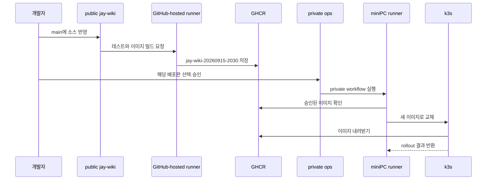

title: GitHub Actions 사용량을 줄이면서 운영 배포 권한을 분리한 방법
slug: public-source-private-deployment-boundary
category: 개발 노트
tags: github-actions,ci-cd,self-hosted-runner,ghcr,k3s,devops,security
summary: GitHub Actions 사용량을 줄이려고 소스 저장소 공개를 검토하면서 miniPC 배포 권한을 어떻게 분리할지 고민했다. 실제 실행 기록으로 얼마나 줄어드는지 계산하고, public 소스와 private 운영 저장소가 코드 복사 없이 하나의 커밋을 배포하는 과정을 정리한다.
syncHash: 87f5fc9eea649496bdb54bf8cb9202ee937a64b442a0c5d2f4ff647dd7ec22e6
publishedAt: 2026-09-15T11:24:35.183349Z
---

GitHub Actions 사용량을 줄이는 방법을 찾다가 한 가지 질문에 멈췄다. 소스 저장소를 public으로 바꾸고 운영 배포만 private 저장소로 옮기면 결국 같은 코드를 두 저장소에 모두 올리는 것 아닐까? 저장소가 둘이면 평소에도 두 곳을 함께 관리해야 할까?

결론부터 말하면 소스 코드는 public 저장소 한 곳에만 둔다. private 저장소에는 두 가지만 둔다. **어떤 버전을 운영에 보낼지에 대한 기록과, 그 배포를 실제로 실행할 수 있는 권한**이다. 배포할 때 miniPC가 public 소스를 잠시 내려받을 수는 있지만, 이는 작업을 위한 임시 복사본이다. 소스 저장소를 하나 더 관리하는 것과는 다르다.

이 글은 이 구조가 왜 필요한지, 코드와 이미지가 실제로 어떻게 이동하는지, 두 저장소에서 각각 무엇을 관리하는지, 실패했을 때 어떻게 돌아오는지를 정리한 설계 기록이다. CI/CD를 처음 보는 사람도 읽을 수 있게 썼다. 2026년 9월 15일 현재 저장소 공개와 runner 이관은 아직 실행하지 않았다.

## 30초 안에 보는 핵심

이 구조를 기술 용어 없이 말하면 **공개된 설계도와 기계실 열쇠를 분리하는 것**이다.

- public `jay-wiki`에는 앱을 만드는 설계도가 있다.
- GitHub는 그 설계도로 실행 가능한 제품을 만들고 `jay-wiki-20260915-2030`이라는 배포판 이름을 붙인다.
- GHCR이라는 창고가 `jay-wiki-20260915-2030` 제품을 보관한다.
- private ops에는 “이번에는 `jay-wiki-20260915-2030`을 설치한다”라는 작업 지시와 기계실에 들어갈 권한이 있다.
- miniPC가 그 지시를 받아 창고의 해당 제품을 k3s에 설치한다.

private ops는 설계도를 다시 그리는 곳이 아니다. 이미 완성된 제품 가운데 **어느 번호를 운영에 설치할지 결정하는 곳**이다.

```text
[누구나 볼 수 있는 영역]
소스 코드 ──검사·포장──> jay-wiki-20260915-2030 ──> GHCR 창고

[관리자만 들어가는 영역]
“jay-wiki-20260915-2030 배포” + 운영 권한 ──> miniPC ──> k3s에 설치
```

저장소를 나누는 이유도 단순하다. 앱의 설계도는 공개할 수 있지만, 실제 운영 서버를 바꿀 수 있는 열쇠까지 공개 저장소의 자동화에 연결할 필요는 없기 때문이다.

`jay-wiki-20260915-2030`은 사람이 읽기 위한 배포판 이름이다. `jay-wiki`, 2026년 9월 15일, 20시 30분에 만든 판이라는 뜻이라 로그와 운영 화면에서 알아보기 쉽다. `snapshot`을 붙여 `jay-wiki-20260915-2030-snapshot`이라고 부를 수도 있지만, 운영에 승인한 완성본에는 snapshot을 빼는 편이 상태를 오해하지 않는다.

컴퓨터는 이 이름만 믿지 않는다. private ops의 배포 기록은 읽기 쉬운 이름과 변경 불가능한 전체 commit SHA를 함께 연결한다.

```text
사람이 보는 배포판: jay-wiki-20260915-2030
시스템이 확인하는 원본: 40자리 전체 commit SHA
실제로 내려받는 대상: 그 SHA로 빌드된 GHCR 이미지
```

이후 설명에서는 긴 SHA 대신 `jay-wiki-20260915-2030`이라는 배포판 이름을 사용한다. 새 그림에서도 GHCR 상자에 이 이름을 붙였다. 실제 GHCR 조회와 workflow 검증은 전체 SHA를 사용하므로 설명용 이름을 별도 이미지 태그로 추가할 필요는 없다.

### 내가 실제로 하는 일은 네 단계다

평소 기능을 개발하고 배포할 때 사람이 보는 흐름은 다음과 같다.

1. public `jay-wiki`에서 코드를 고치고 PR을 합친다.
2. GitHub 검사가 성공하고 `jay-wiki-20260915-2030` 배포판이 만들어졌는지 확인한다.
3. private ops에서 그 배포판을 운영 버전으로 선택한다.
4. 배포를 실행하고 운영 화면이 정상인지 확인한다.

1번과 2번은 제품을 만드는 과정이고, 3번과 4번은 완성된 제품을 운영에 설치하는 과정이다. 소스 코드를 고칠 때마다 두 저장소를 함께 수정하지 않는다. private ops는 배포할 때만 연다.

### 각 단계에서 실제로 복사되는 것은 서로 다르다

“결국 전부 복사하는 것 아닌가?”라는 의문은 파일 이름보다 파일의 역할을 보면 풀린다.

| 움직이는 것 | 어디에서 어디로 가는가 | 계속 관리하는 원본인가 |
|---|---|---|
| 소스 코드 | 내 컴퓨터 → public Git 저장소 | **그렇다. 소스 원본은 여기 하나다** |
| 컨테이너 이미지 | GitHub 작업 컴퓨터 → GHCR | 실행용 포장 결과다 |
| 배포판 이름과 전체 SHA | public 빌드 결과 → private 작업 지시 | 소스가 아니라 버전을 가리키는 표지다 |
| 임시 소스 사본 | public 저장소 → miniPC 작업 폴더 | 배포 스크립트를 실행한 뒤 버릴 작업 사본이다 |
| 컨테이너 이미지 | GHCR → k3s 노드 | 운영에서 실행하고 이전 버전 복구에도 쓰는 제품이다 |

miniPC가 public 저장소를 잠시 내려받는 이유는 현재 배포 스크립트와 Kubernetes 설정이 그 버전의 소스 안에 있기 때문이다. miniPC가 그 코드를 새 원본으로 관리하거나 private 저장소에 다시 올리지는 않는다. 노트북에 저장소를 clone했다고 원격 저장소가 하나 더 생기지 않는 것과 같다.

### 기존 방식과 새 방식의 차이는 운영 열쇠의 위치다

```text
기존
private jay-wiki
  ├─ 소스 코드
  ├─ 검사·이미지 빌드
  └─ miniPC 배포 권한

새 방식
public jay-wiki
  ├─ 소스 코드
  └─ 검사·이미지 빌드

private ops
  ├─ 배포할 번호
  └─ miniPC 배포 권한
```

앱을 만드는 결과는 같지만 권한이 닿는 범위가 달라진다. public 저장소에서 들어온 변경은 GitHub가 제공하는 일회성 작업 컴퓨터까지만 간다. 운영 서버를 바꾸는 명령은 private ops에서만 miniPC로 전달된다.

### 가장 자주 생기는 질문만 먼저 답하면

| 질문 | 짧은 답 |
|---|---|
| 저장소가 두 개면 코드를 두 번 수정하나? | 아니다. 코드는 public 저장소에서만 수정한다. |
| private ops에는 무엇을 올리나? | 배포 workflow, 배포할 SHA와 운영·복구 절차를 둔다. |
| private ops가 코드를 다시 빌드하나? | 아니다. public CI가 이미 만든 SHA 이미지를 선택한다. |
| miniPC에는 코드가 전혀 안 가나? | 배포 스크립트 실행을 위한 임시 checkout은 갈 수 있다. 두 번째 Git 원본은 아니다. |
| GitHub Actions 작업은 사라지나? | 아니다. 범위 선택으로 일부가 사라지고, public의 나머지 작업은 무료 표준 runner에서 계속 돈다. |
| 왜 public 저장소에서 바로 배포하지 않나? | 운영 권한을 가진 miniPC가 외부 PR을 받는 저장소와 직접 연결되지 않게 하기 위해서다. |
| 평소 저장소 두 개를 계속 열어야 하나? | 아니다. 개발은 public에서 하고, 배포는 GitHub 버튼을 누르거나 에이전트에게 요청한다. |


*public jay-wiki의 Actions는 검사·빌드와 GHCR 업로드까지 자동으로 수행하고 멈춘다. 사람 또는 요청받은 에이전트가 private ops에서 배포판을 선택하면 miniPC가 k3s에 설치한다.*

## jay-wiki에 반영하면 어디까지 자동으로 진행되는가

현재 제안한 구조는 **소스 반영 한 번으로 운영 배포까지 직행하는 완전 자동 배포가 아니다.** `jay-wiki` 반영과 운영 반영 사이에 의도적인 정지 지점이 하나 있다.

| 구간 | 시작 조건 | 사용하는 Actions | 결과 |
|---|---|---|---|
| 제품 만들기 | public `jay-wiki`의 `main` 반영 | public 저장소의 GitHub-hosted runner | 검사하고 이미지를 만들어 GHCR에 보관 |
| 운영에 설치하기 | private ops에서 배포판 선택·승인 | private 저장소의 miniPC self-hosted runner | k3s가 선택된 이미지를 내려받아 교체 |

public Actions가 성공하면 GHCR 창고에 배포 가능한 제품이 생긴다. 그러나 GHCR이 miniPC에 먼저 이미지를 밀어 넣거나 운영을 자동으로 바꾸지는 않는다. GHCR은 요청받은 이미지를 보관하고 내주는 수동적인 창고다.

private ops에서 배포를 실행하면 두 번째 Actions가 시작된다. 이 Actions는 선택한 배포판이 public `main`에서 만들어졌는지, 검사가 성공했는지, 해당 GHCR 이미지가 실제로 존재하는지 확인한다. 검증이 끝나면 miniPC runner에 배포 작업을 전달하고, miniPC 위의 k3s가 GHCR에서 이미지를 **당겨와서** 기존 컨테이너를 교체한다.

```text
public jay-wiki main 반영
  └─ 자동: 검사 → 빌드 → GHCR 업로드
                         └─ 여기서 대기

private ops에서 배포 승인
  └─ 수동: 버전 검증 → miniPC 작업 → k3s 교체 → 운영 확인
```

기술적으로는 public Actions가 private ops에 이벤트를 보내 운영까지 연달아 실행하게 만들 수 있다. 그러려면 public workflow가 private 저장소를 호출할 자격 증명을 가져야 하고, 잘못 반영된 `main`도 즉시 운영까지 갈 수 있다. 이번 분리의 목적에는 **빌드는 자동, 운영 배포는 승인 후 시작**하는 방식이 더 잘 맞는다.

## 에이전트가 배포 버튼을 대신 누르면 사용자는 한 번만 요청한다

구조상으로는 public 빌드와 private 배포가 두 단계지만, 사용자가 매번 두 저장소를 직접 열 필요는 없다. 다음처럼 에이전트에게 운영 배포를 요청하면 된다.

```text
jay-wiki의 최신 main 성공 빌드를 운영에 배포해줘.
```

에이전트는 별도의 배포 방식을 만드는 것이 아니라 사람이 GitHub에서 누를 private workflow를 CLI로 대신 실행한다.

```text
사용자의 요청 한 번
  → 최신 public main SHA 확인
  → CI와 GHCR 이미지 확인
  → private release record 갱신
  → private preflight 실행
  → miniPC 배포 workflow 실행
  → k3s·공개 화면 확인
  → 결과 보고
```

이 방식에서는 사용 경험만 보면 한 번의 요청으로 끝난다. 그러나 시스템 안에는 의도적으로 두 단계가 남는다. public 저장소의 Actions가 private 저장소를 자동 호출하는 것이 아니라, private 저장소 접근 권한을 가진 에이전트가 사용자의 요청을 받아 배포판을 확인하고 workflow를 실행한다.

| 방법 | 사람이 하는 일 | public에 private 호출 token 필요 | 에이전트가 없을 때 |
|---|---|---:|---|
| GitHub에서 직접 실행 | private ops의 Run workflow 클릭 | 없음 | 그대로 배포 가능 |
| 에이전트에게 요청 | “운영에 배포해줘”라고 한 번 요청 | 없음 | GitHub 버튼을 직접 사용 |
| public에서 완전 자동 호출 | `main`에 반영 | 필요 | 계속 자동 실행 |

에이전트에게 “확인해줘” 또는 “배포 준비해줘”라고만 했다면 운영을 바꾸지 않고 preflight에서 멈춘다. “배포해줘”, “운영에 반영해줘”처럼 운영 변경이 명시된 요청에서만 production workflow까지 실행한다. 에이전트는 비밀번호·TOTP seed·SSH key를 대화나 문서로 옮기지 않고, 이미 인증된 GitHub CLI와 private 저장소의 Actions secrets를 사용한다.

이 경로는 miniPC runner를 private ops로 옮기고 preflight·rollback을 실제로 검증한 뒤 사용할 수 있다. 전환 전에는 기존 `main` 자동 배포 방식이 여전히 현재 운영 경로다.

## 먼저 용어부터 짚어 본다

CI/CD를 처음 접하면 저장소, runner, 이미지와 서버가 한 덩어리처럼 보이기 쉽다. 이 글에서 사용하는 단어를 일상적인 물건에 비유하면 다음과 같다.

| 용어 | 하는 일 | 비유 |
|---|---|---|
| Git 저장소 | 소스와 변경 이력을 보관한다 | 설계도 보관함 |
| GitHub Actions workflow | 검사·빌드·배포 순서를 적는다 | 작업 지시서 |
| GitHub-hosted runner | GitHub가 잠시 빌려주는 실행 컴퓨터다 | 작업이 끝나면 비워지는 공용 작업대 |
| self-hosted runner | 내가 운영하는 컴퓨터에서 Actions 작업을 실행한다 | 내 작업실에 둔 전용 작업대 |
| 컨테이너 이미지 | 실행 파일과 필요한 환경을 묶은 배포 단위다 | 봉인하고 번호를 붙인 제품 상자 |
| GHCR | 만들어진 컨테이너 이미지를 보관한다 | 제품 창고 |
| k3s | 서버에서 컨테이너를 실행하고 교체한다 | 창고에서 제품을 받아 매장에 진열하는 관리자 |
| commit SHA | 소스의 특정 상태를 가리키는 고유 번호다 | 설계도 개정 번호 |

여기서 가장 중요한 구분은 **소스와 배포 산출물이 같은 것이 아니라는 점**이다. Git 저장소에는 사람이 수정할 소스가 들어간다. GHCR에는 그 소스로 만든 실행용 이미지가 들어간다. k3s는 이미지를 내려받아 실행한다.

## 기존에는 한 저장소가 검사와 운영 배포를 모두 맡았다

기존 `jay-wiki` 저장소는 private 상태에서 다음 역할을 모두 담당했다.

1. 개발자가 `main`에 코드를 반영한다.
2. GitHub-hosted runner가 테스트하고 컨테이너 이미지를 만든다.
3. 완성된 이미지를 GHCR에 올린다.
4. 같은 저장소에 연결된 miniPC self-hosted runner가 배포 workflow를 실행한다.
5. runner가 k3s의 web·Spring 서비스를 새 이미지로 교체한다.

작은 개인 프로젝트에서는 이해하기 쉽고 관리 지점도 하나라는 장점이 있다. 다만 private 저장소에서 GitHub-hosted runner를 쓰면 계정에 주어진 무료 Actions 시간을 깎아 먹는다. 이 글에서는 이 한도를 **private 할당량**이라고 부른다. 반면 GitHub 문서에 따르면 public 저장소에서 표준 GitHub-hosted runner를 사용하는 비용은 무료다. 더 큰 사양의 runner와 저장 공간 등은 별도 조건이 적용되므로, 단순히 “public이면 Actions의 모든 것이 무료”라는 뜻은 아니다.

비용만 보면 저장소 공개가 간단한 답처럼 보인다. 문제는 운영 서버에 닿는 self-hosted runner도 같은 저장소에 연결되어 있다는 점이다.

## 숫자로 보면 무엇이 얼마나 줄어드는가

얼마나 줄어드는지는 두 단계로 나눠 봐야 한다. 첫째는 **바뀐 부분만 검사하는 일**이다. 실행 자체가 줄어든다. 둘째는 **저장소를 public으로 바꾸는 일**이다. 남은 실행이 더는 private 할당량을 쓰지 않는다. 둘을 섞으면 실행 시간이 통째로 사라지는 것처럼 오해하기 쉽다.

비교 기준은 2026년 9월 12일에 완료된 기존 PR 실행 한 쌍이다. GitHub API에서 각 job의 시작·종료 시간을 읽어 계산했다.

| 기존 PR 검사 | job 수 | 실제 job 실행시간 합계 | job별 분 올림 추정 |
|---|---:|---:|---:|
| CI 실행 `34690294105` | 5개 | 10.70분 | 13분 |
| Security 실행 `34690294099` | 12개 | 13.28분 | 21분 |
| 합계 | **17개** | **23.98분** | **34분** |

GitHub-hosted job은 동시에 여러 개가 돌아도 시간이 전부 합산된다. 게다가 private 저장소에서는 job 하나하나의 사용 시간을 분 단위로 올림해 잡는다. 8초짜리 job도 1분으로 친다. 위 34분은 이 규칙으로 계산한 값이지 GitHub 청구서에 찍힌 금액은 아니다.

### 글과 문서만 바꾼 PR은 17개 job에서 5개로 줄어든다

기존에는 Markdown만 고쳐도 Spring·web·Python 서비스 테스트와 5개 컨테이너 이미지 검사가 모두 실행됐다. 변경 범위 선택을 적용하면 글·문서 PR에는 다음 job만 남는다.

- CI: 변경 범위 선택, 문서 일관성 검사
- Security: 변경 범위 선택, 공개 HTTP 경계 검사, 전체 이력 비밀정보 검사

| 비교 | 기존 | 변경 범위 적용 후 예상 | 감소량 |
|---|---:|---:|---:|
| 실행 job | 17개 | 5개 | **12개, 70.6% 감소** |
| private 할당량 | 약 34분 | 약 5분 | **약 29분, 85.3% 감소** |
| 생략되는 무거운 작업 | 0개 | Spring·web·서비스 테스트, 이미지 5개, 언어별 의존성 검사 | 변경 없는 구성요소만 생략 |

5분은 이렇게 잡은 값이다. 새로 넣은 범위 선택 job 두 개가 각각 1분 안에 끝난다고 가정했다. 첫 PR이 실제로 돌면 그 시간으로 다시 계산해야 한다. 또 범위 선택 규칙 자체나 공용 스크립트를 고치는 변경은 전체에 영향을 줄 수 있으므로, 그때는 여전히 전부 검사한다.

이 단계는 public 전환 전에도 효과가 있다. 예를 들어 글·문서 PR이 한 달에 20건이고 PR마다 비슷한 시간이 든다고 가정하면, `34 × 20 = 680분`이 `5 × 20 = 100분`으로 줄어 **약 580분의 private 할당량**을 아낀다. 실제 월간 값은 PR 종류와 캐시 상태에 따라 달라진다.

### public 소스 저장소가 되면 남은 소스 검사 할당량은 0분이 된다

GitHub 과금 기준을 보면 public 저장소에서는 표준 GitHub-hosted runner도 self-hosted runner도 분당 요금이 없다. 따라서 같은 PR 검사가 계속 돌아도 소스 저장소 쪽 private 할당량은 다음처럼 바뀐다.

| 단계 | private 저장소 유지 | public 소스 저장소 | private 할당량 감소 |
|---|---:|---:|---:|
| 기존 전체 PR 검사 기준 | 약 34분 | 0분 | **34분, 100%** |
| 글·문서 범위 선택 기준 | 약 5분 | 0분 | **5분, 100%** |

여기서 100%는 **private 할당량**이 줄어든다는 뜻이다. 검사가 안 도는 것이 아니다. 같은 검사가 GitHub가 무료로 빌려 주는 public용 runner에서 돌아갈 뿐이다. larger runner, artifact·cache 저장 공간과 GHCR 패키지 저장·전송은 별도 과금 조건을 확인해야 한다.

### 운영 배포의 private 할당량은 약 19분에서 3~5분으로 줄어들 것으로 본다

2026년 9월 11일 성공한 기존 배포 실행 `34573861451`의 기록은 다음과 같았다.

| 기존 배포 job | runner | 실제 시간 | 분 올림 추정 |
|---|---|---:|---:|
| 애플리케이션 검증 | GitHub-hosted | 8분 34초 | 9분 |
| 이미지 빌드·GHCR 업로드 | GitHub-hosted | 7분 6초 | 8분 |
| miniPC k3s 반영 | self-hosted | 2분 13초 | 0분 |
| 운영 브라우저 smoke test | GitHub-hosted | 1분 15초 | 2분 |
| private 할당량 합계 |  |  | **약 19분** |

분리하면 검증과 이미지 빌드는 public 저장소가 한다. private ops에는 배포할 버전이 맞는지 확인하는 검사, miniPC 배포, 운영 smoke test만 남는다. 지금 workflow 초안을 기준으로 버전 검사가 1분 안에 끝나고 smoke test가 기존과 비슷하다면 약 3분이다. 검사에 걸어 둔 timeout 3분을 전부 쓴다고 잡아도 약 5분이다.

| 운영 반영 비교 | 기존 | 분리안 예상 | 감소량 |
|---|---:|---:|---:|
| private GitHub-hosted 할당량 | 약 19분 | 약 3~5분 | **약 14~16분, 73.7~84.2% 감소** |
| self-hosted 배포 시간 | 2분 13초 | 비슷한 수준 예상 | GitHub 분 과금은 전후 모두 0분 |

private ops의 workflow는 아직 한 번도 실제로 돌리지 않았으므로 3~5분은 재 본 값이 아니다. 첫 preflight와 배포에서 버전 검사·smoke test 시간을 측정해야 확정할 수 있다.

### PR 검사 한 번과 운영 배포 한 번을 묶으면 약 53분에서 3~5분이다

앞선 두 기준 실행을 하나의 예시로 합치면 기존 private 할당량은 `PR 검사 34분 + 배포 19분 = 53분`이다. public 소스와 private ops로 나눈 뒤에는 소스 검사·빌드가 0분이고 private 승인·smoke test만 약 3~5분 남는다.

```text
기존:       34분(PR) + 19분(배포) = 약 53분
분리 후:     0분(public 소스) + 3~5분(private ops) = 약 3~5분
예상 감소:  48~50분, 약 90.6~94.3%
```

할당량을 넘길 때 나가는 돈으로 환산해 보면 — 현재 표준 Linux runner가 분당 0.006달러다 — 한 묶음이 약 0.318달러에서 0.018~0.030달러로 준다. 계정의 무료 분이 남아 있으면 실제 청구액은 둘 다 0달러일 수 있다. 그래서 이 계산의 핵심은 당장의 결제액보다 “매달 정해진 private 시간을 얼마나 덜 쓰느냐”다.

이 비율을 월간 예상 절감률로 그대로 사용해서는 안 된다. 코드 PR의 변경 범위, 배포 횟수, 캐시 적중 여부와 실패 재실행 횟수가 매달 다르기 때문이다. 전환 후에는 아래 식으로 실제 값을 다시 계산할 수 있다.

```text
절감률 = (기존 private 분 - 전환 후 private 분) / 기존 private 분 × 100
```

## public 저장소에 운영 runner를 그대로 연결하기 어려운 이유

self-hosted runner는 남의 코드를 검사하는 도구와 결이 다르다. workflow가 도는 동안 그 컴퓨터의 파일과 네트워크, 연결된 자격 증명에 손이 닿는다. miniPC runner는 실제로 k3s를 바꾸는 일을 하므로, 운영 환경과 맞닿아 있을 수밖에 없다.

GitHub 공식 문서도 같은 위험을 경고한다. public 저장소는 누구나 fork하고 pull request를 열 수 있다. 그 코드가 self-hosted runner에서 실행된다는 것은, 남이 쓴 코드를 내 컴퓨터가 돌려 준다는 뜻이다. GitHub-hosted runner는 작업마다 새 가상 머신을 받아 쓰고 버리지만, self-hosted runner는 같은 장비를 계속 쓴다. 한 작업에 남은 것이 다음 작업이나 내부 네트워크로 번질 수 있다.

“배포 workflow는 `pull_request`에서 안 돌게 막았다”는 설정만으로는 부족하다. workflow 조건이나 권한 설정은 나중에 얼마든지 바뀔 수 있고, public 저장소는 외부 입력이 닿는 범위 자체가 넓다. 운영 권한을 가진 runner가 public 저장소의 이벤트를 아예 받지 않게 저장소로 갈라 두는 편이 보기에도 분명하다.

그래서 다음 원칙을 잡았다.

> 불특정 사용자의 변경을 검사하는 실행 환경과 운영 서버를 바꾸는 실행 환경을 분리한다.

## 두 저장소는 소스를 복제하는 구조가 아니다

제안한 구조에는 저장소가 두 개 있지만 역할은 겹치지 않는다.

| 위치 | 보관하는 것 | 보관하지 않는 것 |
|---|---|---|
| public `jay-wiki` | web·Spring·서비스 소스, 테스트, Dockerfile, 공개 가능한 설계 문서 | 운영 자격 증명, 실제 서버 복구 기록, 배포 승인 권한 |
| private `jay-wiki-ops-private` | 배포 workflow, 배포할 commit SHA, runner 운영 절차, 복구·점검 문서 | 애플리케이션 소스의 두 번째 원본 |
| GHCR | SHA로 식별되는 web·Spring 컨테이너 이미지 | Git 변경 이력과 편집용 소스 저장소 |
| miniPC·k3s | 실행 중인 이미지, Kubernetes 리소스와 운영 상태 | 개발 이력을 관리하는 Git 원본 |

평소 개발은 public `jay-wiki`에서만 한다. 기능을 고치고 테스트를 추가할 때 private 운영 저장소도 함께 수정할 필요가 없다. private 저장소는 새 버전을 배포하거나 배포 절차·운영 구성이 바뀔 때만 만진다.

## `jay-wiki-20260915-2030` 배포판을 운영에 올려 보자

앞에서 정한 배포판 하나를 실제 흐름으로 따라가면 더 분명해진다. 화면에는 읽기 쉬운 배포판 이름이 보이고, 각 단계의 내부 검증에는 그 이름과 연결된 전체 commit SHA를 사용한다.



### 1. public 저장소가 코드를 검사한다

개발자가 `jay-wiki`의 `main`에 코드를 반영한다. GitHub-hosted runner는 테스트, 빌드와 공개 적합성 검사를 수행한다. 이 단계의 runner는 miniPC가 아니며 운영 클러스터의 권한도 받지 않는다.

### 2. 같은 배포판을 구성하는 컨테이너 이미지를 만든다

검사가 통과하면 `jay-wiki-20260915-2030` 배포판을 구성하는 이미지를 GHCR에 저장한다. 사람이 보는 이름 뒤에서는 각 이미지가 실제 전체 commit SHA로 고정된다.

```text
배포판: jay-wiki-20260915-2030
web: ghcr.io/jaymunsh/jay-wiki-web:<전체-commit-SHA>
API: ghcr.io/jaymunsh/jay-wiki-backend:<전체-commit-SHA>
```

`latest`만 사용하면 시간이 지난 뒤 어떤 코드를 배포했는지 모호해진다. 변하지 않는 SHA 태그를 사용하면 public 저장소의 소스, CI 결과와 운영 이미지가 같은 번호로 연결된다.

### 3. private 저장소에서 배포판을 선택한다

운영 workflow에서 `jay-wiki-20260915-2030` 배포판을 선택한다. 배포 기록은 이 이름과 실제 전체 SHA를 함께 가진다. 둘 다 비밀번호는 아니다. private으로 보호할 것은 이름이나 SHA 자체보다 **그 배포판을 운영에 적용할 수 있는 Actions 권한, runner 연결과 배포 절차**다.

배포 버전을 넘기는 방식은 두 가지가 가능하다.

| 방식 | 장점 | 고려할 점 |
|---|---|---|
| 수동 workflow 입력에 전체 SHA 전달 | 구성이 단순하고 별도 파일을 계속 수정하지 않는다 | 누가 무엇을 배포했는지는 Actions 실행 기록에서 확인한다 |
| `release.json` 같은 파일 변경을 검토 후 반영 | 승인값의 Git 이력이 명확하다 | 배포할 때마다 운영 저장소에 커밋이 하나 생긴다 |

현재 private ops 초안은 `release.json`에 전체 SHA와 성공한 빌드 실행을 기록하는 방식을 사용한다. 사람이 읽는 배포판 이름은 화면과 글에서 이 기록을 알아보기 쉽게 표현하는 별칭이고, 실제 승인 근거는 변경되지 않는 전체 SHA와 빌드 결과다.

### 4. miniPC는 입력을 그대로 믿지 않고 확인한다

private workflow는 적어도 다음 조건을 확인한 뒤 배포해야 한다.

- 입력이 축약하지 않은 올바른 commit SHA인지
- 그 SHA가 public 저장소 `main` 이력에 포함되는지
- 해당 SHA의 필수 CI가 성공했는지
- GHCR에 같은 SHA의 web·API 이미지가 모두 존재하는지

검증을 통과한 뒤 miniPC runner가 필요한 배포 스크립트와 manifest를 사용한다. 이때 public 저장소를 정확한 SHA로 잠시 checkout할 수도 있다. 작업 폴더는 실행을 위한 임시 사본이며 private Git 저장소의 이력에 소스를 복사하는 것이 아니다.

### 5. k3s에는 소스 대신 이미지 주소를 전달한다

k3s가 받는 핵심 값은 배포판 이름과 연결된 실제 GHCR 이미지 주소다. k3s는 GHCR에서 이미지를 내려받고 기존 Pod를 새 Pod로 교체한다. rollout이 정상인지 확인한 뒤 간단한 화면·API 점검까지 통과해야 배포 성공으로 판단한다.

## “결국 배포할 때 다 올리는 것 아닌가?”를 구분해 본다

네트워크를 통해 여러 파일이 이동하는 것은 맞다. 하지만 **이동한다**와 **두 저장소에서 원본으로 관리한다**는 다른 말이다.

```text
개발자가 수정하는 원본
  └─ public Git 저장소에 한 번 저장

CI가 만드는 실행 결과
  └─ GHCR에 컨테이너 이미지로 저장

배포 때 사용하는 작업 사본
  └─ runner 작업 폴더에 잠시 내려받고 작업 후 정리

운영 서버가 실행하는 파일
  └─ k3s 노드가 GHCR 이미지를 내려받아 컨테이너로 실행
```

노트북에서 Git 저장소를 clone했다고 GitHub 저장소를 하나 더 운영한다고 말하지 않는 것과 같다. runner의 checkout도 같은 성격이다. 또한 컨테이너 이미지는 소스의 배포 결과물이므로 Git 저장소를 하나 더 만든 것이 아니다.

두 저장소가 충돌하거나 동기화가 꼬이는 문제는 소스 코드를 양쪽에 커밋할 때 생긴다. 이 설계에서는 private 저장소가 소스가 아니라 SHA 한 줄만 가리키므로 맞출 대상이 없다.

## 운영 문서란 비밀번호를 적어 둔 파일을 뜻하지 않는다

“운영 문서를 private에 둔다”는 말을 들으면 비밀번호와 토큰을 Markdown에 적는 것으로 오해할 수 있다. 비밀값은 GitHub Actions secrets나 별도의 비밀 관리 수단에 두어야 한다. private Git도 비밀 저장소로 사용하지 않는다.

여기서 운영 문서는 다음과 같은 자료를 뜻한다.

- miniPC runner를 등록·교체·폐기하는 절차
- Kubernetes Secret의 실제 값이 아니라 **이름과 교체 순서**
- 관리자 계정과 TOTP를 재설정할 때 확인할 항목
- DB 백업·복구 명령을 실행하는 순서와 검증 기준
- 장애가 발생했을 때 남긴 중간 조사 기록
- Cloudflare Tunnel, SSH, 방화벽과 배포 권한의 관계
- 배포 실패 시 이전 이미지로 되돌아가는 순서

이 자료가 전부 비밀은 아니다. 다만 서버 구조와 복구 경로를 통째로 공개해서 얻을 것은 적고, 실제 호스트명·계정명·경로가 실수로 섞여 나갈 위험은 있다. 공개해도 되는 아키텍처 설명은 public에 두고, 실제 운영 절차는 private에서 관리하는 편이 검토할 범위가 줄어든다.

## 실패했을 때는 새 빌드보다 이전 SHA가 중요하다

public CI 성공은 “이 코드를 빌드하고 검사했다”는 뜻이다. 운영 환경에서 정상 동작한다는 보장은 아니다. DB 상태, Secret, 스토리지와 네트워크는 CI 환경과 다르기 때문이다.

배포 workflow는 변경 전 web·API 이미지 주소를 먼저 기록해야 한다. 새 버전 rollout이나 smoke test가 실패하면 그 주소로 되돌린다.

```text
현재 운영 이미지 기록
        ↓
jay-wiki-20260915-2030 이미지와 CI 성공 확인
        ↓
배포 및 rollout 대기
        ↓
화면·API smoke test
   ┌────┴────┐
 성공       실패
 유지       직전 이미지로 복원
```

rollback이 새 이미지를 급히 다시 빌드하는 작업이어서는 안 된다. 이미 운영했던 이전 SHA의 이미지를 그대로 지정해야 복구 과정에 새로운 변수를 넣지 않는다.

## 다른 구성도 가능하지만 기준이 달라진다

| 구성 | 장점 | 한계 |
|---|---|---|
| private 저장소 하나 유지 | 구조 변경이 없다 | private Actions 사용량 문제가 남는다 |
| public 저장소에 miniPC runner도 유지 | 저장소가 하나다 | public 입력과 운영 권한의 경계가 약하다 |
| public 소스 + private ops | public CI와 운영 권한을 분리한다 | 저장소와 workflow 하나를 더 관리한다 |
| public 저장소 + 서버가 주기적으로 새 버전 확인 | GitHub의 public 이벤트가 runner에 직접 닿지 않는다 | 배포 승인·상태 보고 체계를 별도로 만들어야 한다 |
| private 원본 + public mirror | 내부 원본을 유지할 수 있다 | 두 저장소의 동기화와 기여 흐름이 복잡해진다 |

이번 프로젝트에서는 소스의 공개 가능성을 검토하면서도 miniPC가 이미 k3s, 백업과 복구 절차의 실행 지점으로 쓰이고 있다. 따라서 public CI와 private 배포를 분리하는 안이 비용과 권한 경계를 함께 설명하기 쉽다.

## 저장소가 둘이어도 일상적인 개발 작업은 늘지 않는다

역할을 명확히 나누면 평소 흐름은 다음처럼 단순하다.

- 기능 개발, 테스트, 문서 수정: public `jay-wiki`만 사용
- 새 버전 운영 반영: private ops에서 검증된 SHA를 선택
- 배포 절차나 runner 구성 변경: private ops 수정
- 공개 가능한 배포 개념과 기여 안내: public 문서 수정

소스 변경 때마다 두 저장소에 같은 커밋을 만들거나 PR을 두 번 열 필요가 없다. 두 저장소를 관리한다는 말은 두 벌의 코드를 관리한다는 뜻이 아니라, **코드를 고치는 권한과 운영에 반영하는 권한을 따로 관리한다**는 뜻에 가깝다.

## 기존 private 이력을 그대로 public으로 바꾸지는 않는다

현재 저장소의 파일만 정리해도 과거 Git 커밋에는 옮기기 전 운영 기록과 당시 초안이 남는다. 그래서 기존 `jay-wiki`의 visibility 버튼만 public으로 바꾸지 않고, **승인한 현재 파일로 새 public 이력을 만드는 clean snapshot** 방식을 사용한다.

전환 순서는 다음과 같다.

1. 현재 private 저장소의 최신 `develop`과 운영 `main`을 합쳐 기준 커밋을 만든다.
2. 기존 private 원격은 날짜와 commit SHA를 붙여 보존하고 `jay-wiki-private-archive` 역할로 남긴다.
3. 기준 커밋에서 공개 승인 파일만 꺼내 새 이력의 public `jay-wiki`를 만든다.
4. public 저장소의 CI와 GHCR 이미지 빌드를 먼저 통과시킨다.
5. miniPC runner를 private ops로 옮겨 preflight와 rollback을 검증한다.
6. 검증된 SHA를 처음 운영 배포하고, 그 뒤 기존 자동 배포 경로를 닫는다.

공개 snapshot에는 애플리케이션 코드, 재현 가능한 설정 예제, 공개 문서와 공개를 승인한 글·이미지를 넣는다. 다음 자료는 제외하거나 별도 판단이 끝날 때까지 보류한다.

| 공개 snapshot에 포함 | private 또는 검토 대기 |
|---|---|
| `web`, `spring`, `services`, `scripts`, 공개용 `infra` | `leneu/ops-manual`, 자격증명, DB dump와 로컬 백업 |
| README, MIT License와 콘텐츠 이용 정책 | 과거 Git 이력에 남은 상세 운영 원문 |
| 공개를 확인한 위키·블로그 원고와 자산 | 운영에 없는 로컬 원고 24편과 정본 충돌 5편 |
| 값이 제거된 실행 예제와 secret template | 개인 메모, 미검토 이미지와 제3자 권리가 불명확한 자산 |

글이 블로그에 아직 발행되지 않았다는 사실만으로 곧바로 비밀 자료가 되는 것은 아니다. 하지만 저장소가 public이면 초안도 GitHub에서 읽을 수 있으므로, 발행 여부와 GitHub 공개 허용 여부를 각각 결정한다. 코드의 MIT License와 글·이미지의 이용 정책도 이 때문에 별도 파일로 나눴다.

## 현재까지 한 일과 아직 하지 않은 일

이 글을 쓰는 시점의 상태를 설계와 완료 결과로 혼동하지 않도록 나누어 적는다.

완료한 준비는 다음과 같다.

- 기존 CI에서 변경된 영역만 검사하도록 workflow 사용량을 줄였다.
- 저장소에 공개할 자료와 private으로 둘 운영 자료의 경계를 문서화했다.
- private `jay-wiki-ops-private` 저장소를 만들고 일부 운영 기록을 옮겼다.
- private 배포 workflow, SHA 검증 도구, 운영 매뉴얼과 에이전트 스킬을 private 원격에 보존했다.
- 직접 작성 코드에는 MIT License를 적용하고 글·이미지의 이용 범위는 별도 정책으로 분리했다.
- 전체 Git ref의 비밀정보 패턴을 검사하고 현재 탐지 0건을 확인했다.

아직 실행하지 않은 작업은 다음과 같다.

- 기존 `jay-wiki` 저장소를 public으로 전환
- miniPC self-hosted runner를 기존 저장소에서 해제하고 private ops에 등록
- public clean snapshot의 글·이미지 공개 목록 확정과 새 이력 생성
- private 배포 workflow의 preflight·rollback과 실제 운영 배포 검증
- 이미지와 문서의 개인정보·제3자 권리 검토

따라서 현재 운영 배포 방식은 이 글의 목표 구조로 완전히 전환된 상태가 아니다. 공개 전환은 runner 이관과 복구 검증이 끝난 뒤에 수행해야 한다.

## 공개 전환 전에 통과해야 할 체크리스트

### 공개 저장소

- 전체 이력에서 토큰, 키, 개인정보와 운영 자료를 검사한다.
- 코드, 문서, 게시 글과 이미지의 라이선스를 구분한다.
- 처음 온 사람이 실행 방법과 디렉터리 역할을 README에서 찾을 수 있게 한다.
- fork의 pull request가 받을 수 있는 `GITHUB_TOKEN` 권한을 최소화한다.
- 외부 기여 workflow가 운영 환경과 연결되지 않았는지 확인한다.

### private 운영 저장소

- self-hosted runner가 이 저장소의 배포 workflow만 받게 한다.
- 입력 SHA의 형식, `main` 포함 여부, CI와 이미지 존재를 검증한다.
- 환경별 secrets와 승인 권한을 최소 인원에만 부여한다.
- 동시 배포를 막고 timeout을 둔다.
- 이전 이미지 기록, rollout, smoke test와 rollback을 실제로 연습한다.

### miniPC와 k3s

- runner 서비스 계정이 필요한 명령만 실행할 수 있게 한다.
- runner 작업 폴더에 토큰과 임시 파일이 남지 않는지 확인한다.
- GHCR pull 권한과 k3s 변경 권한을 분리할 수 있는지 검토한다.
- 실패한 배포에서도 기존 서비스가 유지되는지 확인한다.

## 이 구조에서 얻고 싶은 것은 저장소 수 감소가 아니다

저장소를 둘로 나누면 관리 대상은 하나 늘어난다. 대신 public 저장소는 누구나 읽고 검사할 수 있는 소스와 CI를 맡고, private 저장소는 제한된 사람이 운영에 반영하는 과정을 맡는다. 두 저장소는 코드를 서로 복사하지 않는다. 같은 commit SHA와 이미지 태그로 연결되므로, 지금 운영 중인 것이 어느 소스인지도 따라갈 수 있다.

비용 절감은 이 검토를 시작한 계기다. 최종 설계에서 더 오래 남는 가치는 외부 기여 코드를 실행하는 작업대와 실제 서버를 바꾸는 작업대를 분리하는 데 있다. 앞으로 남은 검사는 이 경계가 문서에만 있는지, runner 권한과 배포 실패 복구에서도 실제로 지켜지는지를 확인하는 일이다.

## 참고 자료

- [GitHub Actions 과금 기준](https://docs.github.com/en/billing/concepts/product-billing/github-actions)
- [job 실행시간과 청구 대상 시간 확인하기](https://docs.github.com/en/actions/how-tos/monitor-workflows/view-job-execution-time)
- [GitHub Actions runner 단가](https://docs.github.com/en/billing/reference/actions-runner-pricing)
- [저장소에 self-hosted runner 추가하기](https://docs.github.com/en/actions/how-tos/manage-runners/self-hosted-runners/add-runners)
- [GitHub Actions 안전하게 사용하기](https://docs.github.com/en/actions/reference/security/secure-use)
- [저장소 공개 범위 변경하기](https://docs.github.com/en/repositories/managing-your-repositorys-settings-and-features/managing-repository-settings/setting-repository-visibility)
