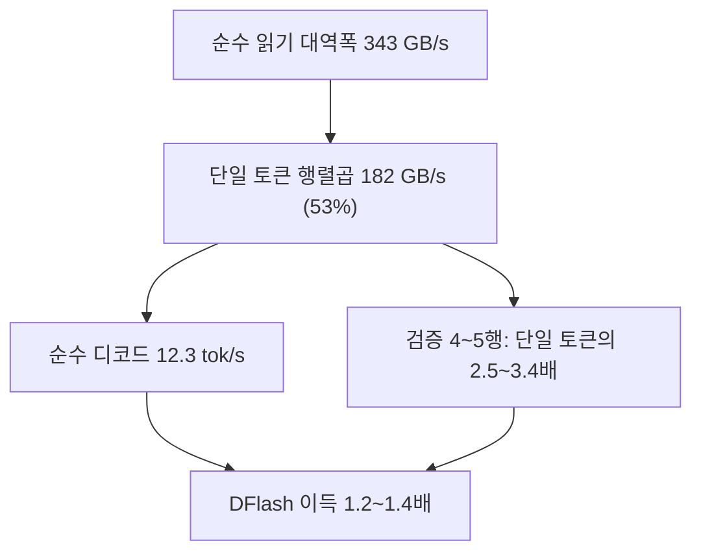
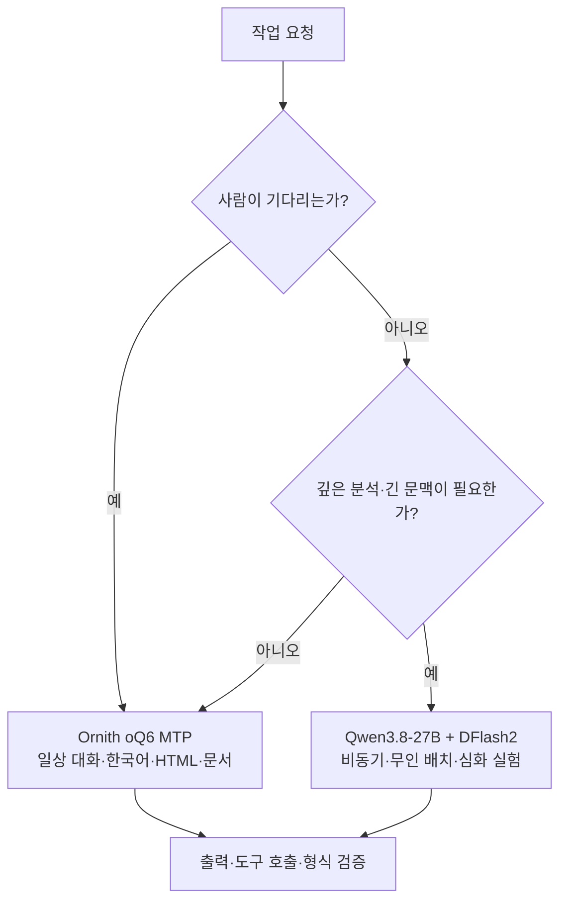

title: "M1 Max에서 Qwen3.8-27B가 27 tok/s에 닿지 못하는 이유를 좁혀 간 기록"
slug: qwen38-27b-m1max-dflash-bottleneck
category: 기술 실험
summary: "oMLX에서 16.5 tok/s에 멈춘 Qwen3.8-27B + DFlash2를 두고 oMLX 계층을 의심했다가, 번들 CLI 재현과 마이크로벤치로 병목 후보를 이 기계의 4-bit 행렬곱 커널 효율로 좁힌 기록. Ornith와의 실제 실험값을 함께 놓고, 두 모델을 실무에서 어떻게 나눠 쓸지까지 정리했다."
tags: local-llm,omlx,mlx,apple-silicon,dflash,speculative-decoding,qwen,benchmark,tech-lab
toc: true
publishedAt: 2026-09-02T12:01:32.100722Z
updatedAt: 2026-09-02T16:50:17.268159Z
syncHash: 14d169d324d448aa5b46ce5638e75629413b944521e185431a4445883d5a723f

---

지난 글을 쓰고도 찜찜했다. 같은 M1 Max 64GB에서 남은 27.12 tok/s를 냈다는데 내 기계는 16.5에서 멈췄고, 나는 그 이유를 "oMLX 실행 경로의 고정 비용"이라고 추정만 해 둔 채 글을 닫았다. 추정을 남겨 두면 다음 실험을 그 위에 쌓게 된다. 그래서 이번에는 그 추정부터 검증했다. 결과부터 말하면 추정은 틀렸다.

| 물음 | 답 |
|---|---|
| 격차의 원인은 oMLX인가 | 아니다. CLI로 직접 돌려도 15.3이었고 oMLX가 더 느리지 않았다 |
| 그럼 무엇인가 | 이 기계의 4-bit 행렬곱 커널 효율. 343 GB/s를 읽어도 QMM 유효 대역폭은 182 GB/s였다 |
| 설정으로 얻은 것 | 블록 크기를 기본값에서 4로. 같은 세션 A/B로 13.3 → 17.0 tok/s, 약 28% |
| 27 tok/s는 | 이번 조건에서는 안 나왔다. 순수 디코드 기준선은 12.3 tok/s였다 |
| 80~90k 실사용은 | 설정 문제가 아니다. 첫 프리필 28분, 디코드 5.5 tok/s |
| 그래서 어디에 쓰나 | 턴마다 기다리는 자리가 아니라 무인 루프. 평소 작업은 MoE에 맡긴다 |

> **실험의 성격**: 아래 수치는 M1 Max 64GB 한 대에서 특정 모델·런타임·프롬프트로 얻은 개인 실험값이다. 공개 Issue #60의 27.12 tok/s와 같은 숫자를 재현하는 것이 아니라, 왜 이 환경에서 낮게 나오는지 원인을 좁히는 진단 실험이다.

| 표시 | 이 글에서의 의미 |
|---|---|
| **측정값** | CLI·oMLX·마이크로벤치가 실제로 출력한 값 |
| **계산값** | 측정한 대역폭·KV 크기·토큰 수로부터 환산한 상한 또는 근사치 |
| **가설** | 관측값과 잘 맞지만 소스·커널 프로파일로 아직 확정하지 못한 설명 |

## 0. 실험 프로필을 먼저 고정했다

이번 기록에서 서로 다른 숫자를 섞지 않기 위해 실험을 세 묶음으로 나눴다. 특히 공개 CLI 결과, oMLX API 결과, 한 층의 QMM 마이크로벤치 결과는 서로 측정 대상이 다르다.

| 실험 | 입력·출력 조건 | 목적 |
|---|---|---|
| 공개 CLI 재현 | 512토큰, `no-eos`, repeat 2, cooldown 45초, DFlash block 5 | Issue #60 수치와 같은 실행 계열 비교 |
| oMLX 실사용 측정 | `web-landing`, 최대 4,096토큰, warm, repeat 1 | GUI/API 경로에서 실제 사용할 때의 속도 확인 |
| block sweep | 짧은 고정 프롬프트, block 2·3·4·6·8 | 검증 행 수와 최종 tok/s의 관계 확인 |
| QMM microbench | 한 층의 `K=5120, N=34816`, M=1·2·4·5·6 | 4-bit 행렬곱 커널의 유효 비용 분리 |

공개 CLI 쪽은 `dflash-mlx 0.1.10+omlx.6`, Apple M1 Max 64GB, macOS 26.5.2로 보고된 Issue #60의 조건을 기준으로 삼았다. 나머지 수치는 내 M1 Max 64GB의 oMLX 번들 환경에서 얻었다. 이 글의 목적은 특정 버전이나 칩의 보편적인 성능표를 만드는 것이 아니라, **같은 모델 이름을 사용해도 실행 경로가 결과를 얼마나 바꿀 수 있는지 확인하는 것**이다.

## 1. 지난 기록의 숫자부터 의심했다

본론에 들어가기 전에 기존 데이터가 믿을 만한지부터 봐야 했다. 한 군데가 틀려 있었다.

8월 23일 행에 22~27 tok/s가 찍혀 있었다. 그 뒤로는 줄곧 14~16이라 그 사이 무엇이 바뀌었는지 찾으면 답이 나올 것 같았다. 원인은 모델이 아니라 측정 도구였다. 그날 행은 전부 `token_source: approx`, 토크나이저 대신 근사식으로 출력 토큰을 센 값이었다. 한국어 출력이 글자당 1토큰꼴로 기록됐는데 실제로는 2.7자당 1토큰이었으니, 토큰 수가 부풀었고 tok/s도 따라 부풀었다. 초당 글자 수로 다시 보면 26.3 tok/s로 기록된 그날이 24.5자/초, 13.8 tok/s로 기록된 다음 실행이 37.1자/초로 오히려 느렸다.

검증된 이 기계의 최고치는 16.5 tok/s가 맞았다. 속도 비교에서 근사 토큰 행은 빼야 한다.

## 2. 번들된 CLI로 공개 조건을 그대로 돌리자 oMLX 가설이 지워졌다

oMLX.app 안에는 `dflash-mlx` 패키지와 CPython이 통째로 들어 있다. 설치 없이 공개 수치(Issue #60)의 명령을 그대로 돌릴 수 있었다.

```bash
SP=/Applications/oMLX.app/Contents/Resources/Python/framework-mlx-base/lib/python3.11/site-packages
PYB=/Applications/oMLX.app/Contents/Resources/Python/cpython-3.11/bin/python3.11
PYTHONPATH=$SP "$PYB" -m dflash_mlx.cli benchmark \
  --model ~/.omlx/models/mlx-community/Qwen3.8-27B-4bit \
  --draft ~/.omlx/models/z-lab/Qwen3.8-27B-DFlash2 \
  --draft-quant w4a32:gs64 --block-tokens 5 --max-tokens 512 --repeat 2 --cooldown 45 --no-eos
```

| | 이 기계 | Issue #60 제보자 (같은 M1 Max 64GB) |
|---|---:|---:|
| 순수 디코드 | 12.3 tok/s | 약 19.5 |
| DFlash block 5 | 15.3 tok/s (1.23배) | 27.12 (1.39배) |
| acceptance | 0.70 | 0.70 |

제보자의 19.5는 공개된 27.12를 speculative 배수 1.39로 나눈 역산값이다. 그쪽 baseline이 직접 공개되지 않았으므로 이 숫자는 그만큼 무르다.

그래도 방향은 분명하다. 수락률이 같은데 차이는 speculative 이전, 순수 디코드에서 이미 0.63배로 벌어져 있다. 그리고 oMLX의 16.5는 CLI의 15.3보다 낮지 않았다. "oMLX 스케줄러와 API 계층의 고정 비용"이라는 가설은 여기서 끝났다.

공개 Issue의 측정은 `dflash-mlx 0.1.10+omlx.6`, macOS 26.5.2, `--max-tokens 512`, `--repeat 2`, `--cooldown 45`, `--no-eos` 조건이었다. 반면 이 글의 oMLX 측정은 `web-landing` 프롬프트와 최대 4,096토큰 출력으로 진행했다. 따라서 두 결과의 차이는 하드웨어만의 차이가 아니라 **런타임·프롬프트·출력 길이·측정 프로토콜의 차이**를 포함한다.

이 구분이 중요한 이유는 speculative decoding의 속도가 단순히 `acceptance × draft 속도`로 결정되지 않기 때문이다. draft 실행, target 검증, 메모리 이동, 스케줄러, 실제 한 라운드에서 확정되는 토큰 수가 모두 분모에 들어간다. 그래서 acceptance가 비슷해도 target의 검증 커널이 느리면 최종 tok/s는 크게 달라질 수 있다.

### 2-1. M1/M2에서는 기본 `w4` 경로부터 의심해야 한다

공개 Issue #60에는 하드웨어 차이 외에 더 앞단의 함정도 기록되어 있다. M1/M2에서 DFlash2의 기본 `w4:gs64` draft 경로를 선택하면 activation dtype이 `float16`으로 해석되고, 같은 가중치를 `w4a32:gs64`로 지정하면 `float32` 경로를 탄다.

| draft quant spec | 확인된 activation dtype | acceptance | DFlash 속도 | AR 대비 |
|---|---|---:|---:|---:|
| `w4:gs64` | `float16` | 0.000 | 8.15 tok/s | 0.44배 |
| `w4a32:gs64` | `float32` | 0.701 | 27.12 tok/s | 1.39배 |
| `none` | `bfloat16` | 0.705 | 23.32 tok/s | 1.20배 |

이 표는 내 측정값이 아니라 Issue #60의 공개 측정이다. 이 결과가 말하는 것은 “4-bit weight가 안 된다”가 아니다. M1/M2의 BF16 처리 경로에서 `w4`의 activation cast가 DFlash2 draft의 수락률을 0으로 만들 수 있으니, **먼저 resolved dtype과 acceptance를 확인한 뒤** 속도를 비교해야 한다는 뜻이다. `w4a32`가 더 빠른 이유는 32-bit activation이 이론적으로 효율적이어서가 아니라, 해당 Apple Silicon 경로에서 문제의 cast를 피하고 float32 경로를 타기 때문으로 해석된다.

다만 Issue가 제시한 selector·dynamic convolution 내부 원인은 가설이다. 확정된 사실은 동일한 target·draft에서 quant spec만 바꿨을 때 dtype, acceptance, 속도가 함께 바뀌었다는 관측까지다. 그래서 이 글의 후속 측정은 먼저 `w4a32:gs64`로 DFlash2가 실제로 작동하는 상태를 만든 뒤, 그 다음에 block·커널·런타임 병목을 따로 보았다.

## 3. 메모리 대역폭은 괜찮은데 4-bit 행렬곱의 유효 대역폭이 낮았다

기계 자체가 느린지 확인하려고 같은 python으로 두 가지를 쟀다. 하나는 2GiB 배열을 합산하는 순수 읽기 대역폭, 다른 하나는 디코드 형태 그대로의 4-bit 행렬곱이다. 두 번째가 이 글에서 가장 쓸모 있는 20초짜리 스크립트다.

```python
import mlx.core as mx, time

K, N = 5120, 34816                          # Qwen3.8-27B 한 층의 gate+up
w = mx.random.normal((N, K), dtype=mx.bfloat16)
wq, s, b = mx.quantize(w, 64, 4)            # 4bit, group size 64
mx.eval(wq, s, b)
nbytes = wq.nbytes + s.nbytes + b.nbytes

for M in (1, 2, 4, 5, 6):                   # M = 한 번에 곱하는 행 수
    x = mx.random.normal((M, K), dtype=mx.bfloat16); mx.eval(x)
    f = lambda: mx.quantized_matmul(x, wq, s, b, transpose=True, group_size=64, bits=4)
    for _ in range(3): mx.eval(f())         # 워밍업
    t = time.perf_counter()
    for _ in range(30): mx.eval(f())
    dt = (time.perf_counter() - t) / 30
    print(f"M={M}: {dt*1e3:.2f} ms, {nbytes/dt/1e9:.0f} GB/s")
```

Apple이 M1 Max에 제시한 메모리 대역폭은 최대 400 GB/s다. 이번 순수 읽기 테스트에서는 343 GB/s가 나와 이론값의 약 86%를 관측했다. 용량 압박도 없었다. 그런데 단일 토큰 4-bit 행렬곱의 **유효 대역폭**은 182 GB/s에 그쳤다. 여기서 유효 대역폭은 커널이 읽고 처리한 양을 시간으로 나눈 값이지, DRAM이 실제로 항상 182 GB/s로 동작했다는 뜻은 아니다.

가중치 15.4GB를 이 유효 대역폭으로 나누는 단순 모델에서는 약 85ms, 초당 11.8토큰이 나온다. CLI 순수 디코드 12.3 tok/s와 방향이 맞아떨어진다. 이는 원인을 확정하는 프로파일 결과가 아니라, **모델 전체 디코드 속도와 한 층의 QMM 마이크로벤치가 같은 병목 가설과 양립한다**는 의미다.

| 한 번에 곱하는 행 수 | 걸린 시간 | 단일 토큰 대비 |
|---:|---:|---:|
| 1 | 0.55 ms | 1.0배 |
| 2 | 0.82 ms | 1.5배 |
| 4 | 1.39 ms | 2.5배 |
| 5 | 1.86 ms | 3.4배 |
| 6 | 3.17 ms | 5.8배 |

이 벤치는 `K=5120`, `N=34816`인 gate·up 투영 한 종류를 반복한 것이다. 실제 모델에는 attention, down projection, 정규화, KV 읽기, 커널 런치와 스케줄링이 함께 들어간다. 따라서 표의 수치를 모델 전체의 토큰당 시간으로 읽으면 안 된다. 한 층의 QMM 비용이 block 크기에 따라 어떻게 달라지는지 보는 **원인 분리용 proxy**로 사용했다.

DFlash가 왜 1.2배밖에 못 얻는지도 이 표가 설명한다. 검증은 블록 크기만큼의 행을 한 번에 곱하는데, block 5의 검증 한 번이 단일 토큰의 3.4배다. 사이클당 4토큰을 얻어도 남는 게 적다. 6행부터 비용이 갑자기 두 배로 뛰는데, 커널 경로가 갈리는 것으로 보인다. 이 글의 실험에서는 커널 프로파일이나 MLX 내부 소스 경로까지 확인하지 않았으므로, 이 문장은 가설로 남긴다.



## 4. 블록 크기를 훑어 4를 찾았다

행 수가 늘수록 검증이 비싸진다면 블록 크기에 최적점이 있다. 같은 CLI로 훑었다. 아래 다섯 값은 한 자리에서 이어 잰 것이다.

| block | tok/s | acceptance |
|---:|---:|---:|
| 2 | 12.0 | 0.48 |
| 3 | 11.9 | 0.64 |
| 4 | 17.5 | 0.71 |
| 6 | 14.3 | 0.70 |
| 8 | 13.3 | 0.72 |

작은 블록은 수락률이 무너지고 큰 블록은 검증이 비싸진다. 이 sweep에서는 4가 가장 빨랐다. block 5는 앞선 다른 실행의 값(15.3)이라 이 표에 넣지 않았다. 세션이 다르면 나란히 놓을 수 없기 때문인데, 그 이유가 바로 다음 문단이다.

**같은 조건에서 10%가 그냥 흔들린다.** 몇 시간 뒤 같은 block 4를 다시 재니 19.3 tok/s가 나왔다. 설정은 동일했고 기계 상태만 달랐다. 그래서 서로 다른 시점의 값을 나란히 놓고 1~2 tok/s 차이를 설정 효과로 읽으면 안 된다. 이 글의 표도 한 세션 안에서 잰 값끼리만 묶었다.

그래서 기본값과 4를 한 세션에서 번갈아 쟀다. 발열이 한쪽에만 실리지 않도록 16, 4, 16, 4 순으로 돌렸다.

| 라운드 | block 16 (기본값) | block 4 |
|---|---:|---:|
| 1 | 13.18 | 17.42 |
| 2 | 13.41 | 16.53 |

중앙값으로 13.3에서 17.0, 약 28%다. 수락률은 0.72와 0.71로 사실상 같으니 이 이득은 draft가 더 잘 맞아서가 아니라 **검증 한 번이 싸져서** 나온 것이다. 3장 표에서 4행이 2.5배, 6행이 5.8배였던 그 거리가 그대로 속도로 나타난다.

기본값이 왜 그렇게 느린지는 adaptive 정책에 있다. 수락률이 0.75 아래로 떨어지면 블록을 4까지 줄여 돌지만, 주기적으로 16으로 되돌려 다시 해볼 만한지 확인한다. 이 확인 구간이 비싸다. 4를 명시하면 확인 자체가 사라진다.

한 가지 더. oMLX 설정에는 `dflash_block_size` 키가 아예 없었다. 지난 글에 적은 "block 5"는 화면 표시값이었을 뿐, 실제로는 이 기본값 경로로 돌고 있었다. 즉 지난 글의 16.5 tok/s는 block 5의 값이 아니다.

## 5. MLX 버전과 양자화 포맷은 답이 아니었다

커널 효율이 범인이라면 MLX 버전을 바꾸면 달라질 수도 있다. 임시 venv에 0.30.0, 0.31.1, 0.32.2를 깔고 같은 마이크로벤치를 돌렸는데 단일 토큰 시간이 0.53~0.62ms로 전부 오차 범위 안이었다.

양자화 포맷도 마찬가지였다. 8bit는 바이트당 효율이 높지만 읽는 양이 두 배라 토큰당으로는 느리고, mxfp4와 group size 128도 같거나 느렸다. dflash-mlx에 들어 있는 검증 전용 커스텀 커널(`DFLASH_VERIFY_QMM=1`, 기본 꺼짐)도 켜서 재 봤지만 19.3 대 19.7로 오차 범위였다.

**그러니 이 글이 증명한 것은 "이 기계에서, 내가 시도한 범위로는 바뀌지 않았다"까지다.** 같은 칩을 쓴 제보자가 19.5를 냈다면 이 값은 칩의 고정 상수가 아니다. 남은 후보는 macOS 26.5.2와 26.6.2의 Metal 차이, 그리고 개체 차이다. 위의 스크립트를 다른 M1 Max에서 돌려 단일 토큰 값만 비교하면 갈릴 문제이고, 이 글에서 답하지 못한 유일한 물음이다.

## 6. 실사용 목표를 놓고 보니 짧은 컨텍스트 디코드는 병목이 아니었다

여기까지는 전부 입력 51~144토큰에서 잰 속도다. 실제로 쓰려는 형태는 컨텍스트 80~90k에 출력 30k 안팎이었다. 이 조건에서는 지배 항이 바뀐다.

| 90k 컨텍스트 실측 | 값 | 환산 |
|---|---:|---|
| 프리필 | 54 tok/s | 첫 요청 TTFT 약 28분 |
| 프리픽스 캐시 warm TTFT | 6.1초 | 같은 문서에 두 번째 질문부터 |
| 디코드 | 5.5 tok/s | 30k 출력에 약 90분 |

디코드가 이렇게 떨어지는 이유는 KV일 가능성이 크다. 이번 모델 구성은 64층 중 16층만 full attention이고, 현재 dtype·헤드 구성으로 계산한 토큰당 KV 작업 집합을 약 64KB로 잡으면 90k에서 약 5.8GB다. 이를 가중치 15.4GB와 함께 매 토큰 읽는 단순 모델에서는 약 21.2GB를 182 GB/s로 나눠 8.5 tok/s가 상한으로 나온다. 실측 5.5 tok/s는 그 상한의 약 65%다.

여기서 64KB와 5.8GB는 런타임 프로파일이 직접 보고한 값이 아니라 모델 설정과 dtype을 바탕으로 한 계산값이다. 실제 커널은 모든 데이터를 같은 방식으로 순차 읽지 않고, 캐시 재사용·타일링·커널 런치·스케줄링의 영향을 받는다. 따라서 “KV 때문에 정확히 5.5 tok/s가 됐다”가 아니라, **긴 컨텍스트에서 짧은 디코드 benchmark와 다른 병목이 지배하기 시작한다**는 설명으로 읽어야 한다.

그러니 이 목표에서 순서는 프리필, 긴 컨텍스트 디코드, 그다음이 짧은 컨텍스트 디코드다. 4장에서 얻은 것은 90분짜리 작업에서 몇 분을 줄일 뿐이고 28분의 첫 프리필은 그대로다.

KV를 4bit로 압축하는 선택지(oMLX의 TurboQuant KV)는 남아 있다. 현재 가정만 적용하면 매 토큰 읽는 작업 집합이 21.2GB에서 17GB 아래로 줄어 상한이 10.7 tok/s로 오를 수 있다. 다만 이 값은 계산상 기대치일 뿐이고, 품질 영향과 실제 속도는 재지 않았다.

## 7. 두 모델을 어떻게 나눠 쓸지 결론을 냈다

이번 실험에서 모델을 단순히 “빠른 순서”로 세우지는 않았다. 짧은 decode, 긴 문서의 첫 응답, 반복 턴, 자동 완결성은 서로 다른 비용이기 때문이다. 같은 M1 Max 64GB에서 얻은 기록을 작업 관점으로 다시 놓으면 다음과 같다.

| 모델·설정 | 확인한 조건 | 속도·결과 | 실무적인 자리 |
|---|---|---:|---|
| `Ornith-1.5-35B-A3B-oQ6-gs128-mtp-vision` | 짧은 웹 생성·warm·Native Lightning MTP | 54.47~60.34 tok/s, 4개 과제 자동점수 1.0 | 한국어 글·HTML·최종 산출물처럼 품질과 완주성이 중요한 작업 |
| `Qwen3.8-27B` 4bit + DFlash2 | 짧은 출력·현재 M1 Max 조건 | 15.16~16.52 tok/s | 속도보다 한 번의 깊은 추론·무인 배치가 중요한 실험 |
| `Qwen3.8-27B` 4bit + DFlash2 | 약 90k 컨텍스트 | 프리필 54 tok/s, decode 5.5 tok/s | 긴 문서를 한 번 처리해 두고 밤새 돌리는 비동기 루프 |

이 표의 숫자는 서로 다른 조건의 기록이다. Ornith 수치는 새로 설치한 정확한 `oQ6-gs128-mtp-vision` 모델의 짧은 웹 생성 스위트이고, Qwen3.8의 90k 수치는 긴 컨텍스트에서 MTP와 DFlash2를 켠 별도 조건이다. 따라서 한 줄짜리 속도 순위보다 **사람이 기다리는 작업인가, 결과를 예약해 둘 수 있는 작업인가**를 먼저 봐야 한다.

### Ornith는 기본 모델, Qwen3.8은 전문 모델로 둔다

이번에 새로 설치한 정확한 `Ornith-1.5-35B-A3B-oQ6-gs128-mtp-vision`은 짧은 웹 생성에서 54.47~60.34 tok/s를 냈고, 제품 소개·갤러그·테트리스·모래 샌드박스 네 과제를 모두 자동 완결했다. 이 정도면 사람이 결과를 기다리는 일상 작업의 기본 모델로 둘 만하다. 특히 한국어 문서나 단일 HTML처럼 출력이 중간에 끊기면 다시 생성해야 하는 작업에서는 최고 속도보다 한 번에 끝나는 비율이 더 중요하다.

Qwen3.8-27B + DFlash2는 반대편 역할이다. 짧은 조건에서도 15~16 tok/s대이고, 90k 컨텍스트에서는 첫 프리필 약 28분과 decode 5.5 tok/s가 필요했다. 그래서 대화창의 기본 모델로 쓰면 매 턴의 대기가 크게 느껴지지만, 한 번의 깊은 분석을 큐에 넣거나 밤새 여러 후보를 생성하는 용도라면 병목 자체가 사용성 문제가 되지 않는다.

즉 두 모델의 관계는 “빠른 모델과 느린 모델 중 하나를 버린다”가 아니다. **Ornith는 사람이 바로 확인하고 제출할 결과물을 만드는 모델**, **Qwen3.8은 시간이 걸려도 더 긴 사고와 실험을 맡기는 모델**이다. Qwen3.8을 일상 작업에서 억지로 빠르게 만들기보다, 기다려도 되는 작업만 골라 보내는 것이 이 실험에서 얻은 가장 현실적인 결론이다.

### 일상 운영에서는 두 모델의 역할을 나눠 쓴다

내 환경에서는 요청이 들어오는 순간 “사람이 기다리는가”와 “한 번의 깊은 분석을 예약할 수 있는가”로 먼저 분기한다. 사람이 바로 결과를 확인해야 하는 대화·코딩·문서·HTML 생성은 Ornith oQ6 MTP를 기본으로 두고, 긴 분석이나 반복 실험처럼 대기를 숨길 수 있는 작업만 Qwen3.8 + DFlash2로 보낸다.



이 라우터는 모델의 절대 서열이 아니라 대기 비용을 줄이는 운영 규칙이다.

| 실제 작업 | 먼저 고를 모델 | 이렇게 쓰는 이유 | 주의할 점 |
|---|---|---|---|
| 저장소에서 파일을 읽고 수정안을 바로 확인하는 코딩 에이전트 | Ornith oQ6 MTP | 사람이 기다리는 인터랙티브 작업의 기본값으로 적합하다 | 매우 긴 저장소 전체를 매 턴 다시 넣는 방식은 피한다 |
| 한국어 블로그·문서·단일 HTML을 한 번에 완성 | Ornith oQ6 MTP | 짧은 생성에서 54~60 tok/s, 네 과제 모두 자동점수 1.0 | 최종 제출 전 형식·사실성 검증은 별도로 둔다 |
| 긴 문서를 바탕으로 한 번의 심층 분석 | Qwen3.8 27B + DFlash2 | 프리필과 decode 대기를 작업 큐 뒤로 숨길 수 있다 | 첫 프리필 약 28분을 작업 예산에 넣는다 |
| 밤새 여러 파일을 분석하거나 초안을 생성 | Qwen3.8 27B + DFlash2 | 작업자가 기다리지 않는다면 16 tok/s대도 운영 가능하다 | 90k 첫 프리필 약 28분, decode 5.5 tok/s를 예산에 넣는다 |
| Qwen3.8의 긴 분석 결과를 한국어·HTML 제출물로 정리 | Ornith oQ6 MTP | 깊은 분석과 결과물 편집을 분리할 수 있다 | Qwen3.8의 전체 문맥이 아니라 핵심 근거만 넘긴다 |

실무적으로는 두 가지 흐름만 기억하면 된다. 평소의 대화·코딩·문서·HTML 생성은 Ornith에서 끝낸다. 한 번에 긴 근거를 읽고 여러 가설을 비교해야 하는 작업만 Qwen3.8 + DFlash2에 비동기로 보낸다. Qwen3.8이 만든 분석 결과를 사용자에게 그대로 보여주기보다, 핵심 근거·결론·수정 목록만 추려 Ornith에 넘겨 최종 한국어 문장과 HTML을 완성하게 한다. 이렇게 하면 Qwen3.8의 긴 대기 시간은 작업 큐 뒤로 숨기고, Ornith의 빠른 완주성과 결과물 품질은 마지막 단계에서 활용할 수 있다.

최종 결론은 간단하다. **Ornith oQ6 MTP를 일상 작업의 기본 모델로 사용하고, Qwen3.8-27B + DFlash2는 깊은 분석과 무인 배치가 필요할 때만 호출한다.** Qwen3.8의 결과를 그대로 배포하지 않고 Ornith에 짧은 최종 편집을 맡기는 조합도 유효하다. 현재 M1 Max에서는 모델 하나의 평균 속도를 올리는 것보다, 사람이 기다리는 경로와 기다려도 되는 경로를 분리하는 편이 실제 생산성에 맞는다.

### 운영 중에 꼭 기록할 지표

tok/s 하나만 기록하면 모델 선택이 다시 흔들린다. 같은 모델도 문맥 길이와 캐시 상태, MTP acceptance에 따라 체감 속도가 달라진다. 다음 필드는 모델을 바꿀 때마다 함께 남길 필요가 있다.

| 지표 | 질문 |
|---|---|
| prompt tok/s·TTFT | 새 문서나 툴 결과를 넣었을 때 첫 답까지 얼마나 기다리는가? |
| decode tok/s | 출력이 시작된 뒤 실제로 읽을 수 있는 속도는 얼마인가? |
| warm/cold 구분 | 모델을 처음 올린 것인가, 같은 프리픽스 캐시를 재사용한 것인가? |
| completion·형식 점수 | 출력이 잘렸거나 JSON·HTML·도구 호출 형식을 깨지 않았는가? |
| peak memory·swap | 64GB 안에서 안정적으로 반복 실행되는가? |
| MTP acceptance·tokens/cycle | MTP가 켜져 있어도 실제로 몇 토큰을 줄였는가? |

이 기록이 있어야 “tok/s가 더 높아서 무조건 낫다”가 아니라 “내 작업의 첫 응답이 빨라지고, 최종 HTML 완주율과 문장 품질까지 유지됐다”라는 판단을 할 수 있다.

### 지금 쓰는 설정을 적어 둔다

`Qwen3.8-27B-4bit` + DFlash2, `dflash_block_size: 4`, 검증 모드 adaptive, 검증 커널 끔. 하네스는 Qwen Code를 oMLX의 OpenAI 호환 엔드포인트에 붙였다. 이 설정은 화면 앞에서 매 턴 기다리는 용도보다, 작업 목록을 넘겨두고 결과를 나중에 확인하는 무인 루프에 맞다. 도구 호출 하네스는 그대로 사용하되, 사용자가 대기하지 않는 방식으로 운용한다.

이때 모델 이름을 `-4bit`로 지정해야 한다. DFlash2 설정이 그 모델에만 붙어 있어서 `nvfp4`나 `8bit`를 고르면 DFlash 없이 도는 줄 모르고 쓰게 된다. 실제로 그렇게 설정돼 있었다.

측정 스크립트와 CLI 산출물은 원본 LocalLLM 프로젝트의 `docs/bench-artifacts-20260902/`에 보관했다. 이 글의 저장소에는 본문과 재현 명령을 싣고, 원본 로그는 실험 프로젝트에서 관리한다. 재현에 새로 받은 모델은 없고, 실험 중 만든 임시 venv는 지웠다.

## 참고 자료

- [dflash-mlx](https://github.com/bstnxbt/dflash-mlx) · [Issue #60 — M1 Max 64GB 측정](https://github.com/bstnxbt/dflash-mlx/issues/60)
- [Issue #32 — M1 Max 장기 컨텍스트에서 DFlash가 느려지는 사례](https://github.com/bstnxbt/dflash-mlx/issues/32)
- [oMLX](https://github.com/jundot/omlx)
- [Apple M1 Max 기술 사양 — 최대 400 GB/s 메모리 대역폭](https://www.apple.com/newsroom/2021/10/introducing-m1-pro-and-m1-max-the-most-powerful-chips-apple-has-ever-built/)
- [mlx-community/Qwen3.8-27B-4bit](https://huggingface.co/mlx-community/Qwen3.8-27B-4bit) · [z-lab/Qwen3.8-27B-DFlash2](https://huggingface.co/z-lab/Qwen3.8-27B-DFlash2)
- [RukaRat/Ornith-1.5-35B-A3B-oQ6-gs128-mtp-vision](https://huggingface.co/RukaRat/Ornith-1.5-35B-A3B-oQ6-gs128-mtp-vision) · [Ornith MTP 개인 실험 기록](https://blog.leneu.cloud/48/ornith-15-35b-mtp-m1max-benchmark)
- 이전 글: [DFlash2의 조건](https://blog.leneu.cloud/26/qwen38-27b-dflash2-local-experiment), [로컬 실험 업데이트](https://blog.leneu.cloud/38/qwen38-27b-dflash2-local-experiment-update)
