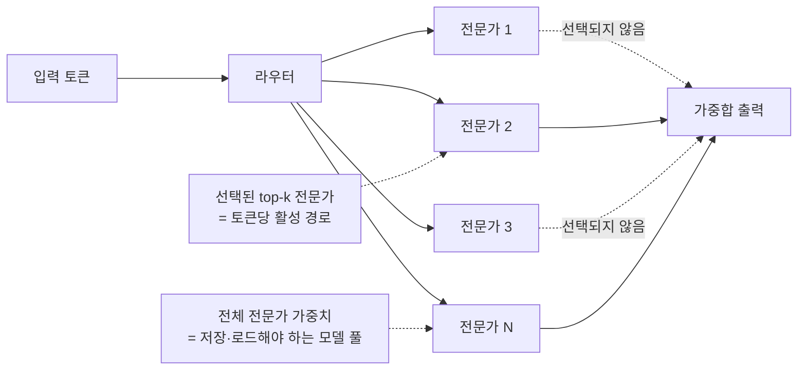
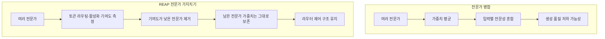
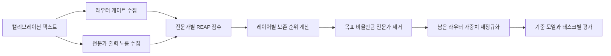
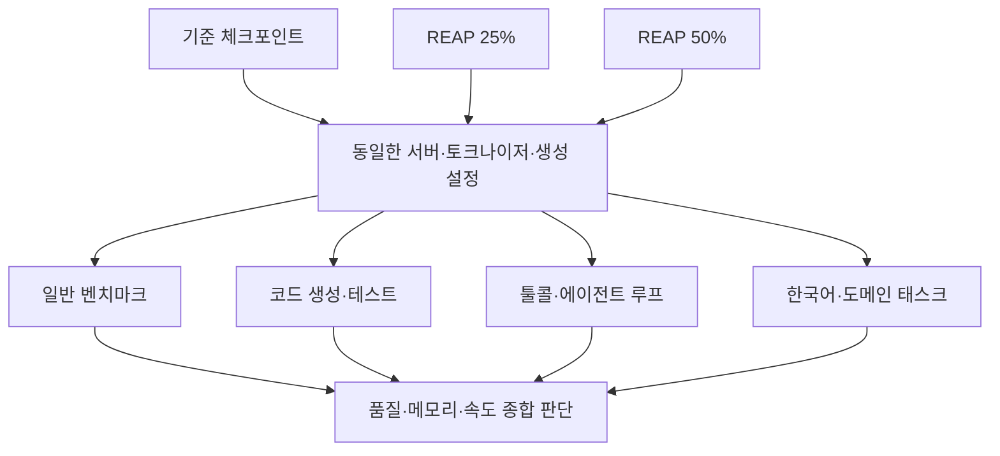

> **이 글의 대상**: MoE(Mixture-of-Experts) 모델을 로컬에서 실행하려 하거나, Hugging Face의 REAP 체크포인트가 일반 양자화 모델과 어떻게 다른지 알고 싶은 개발자.

> **조사 기준**: 2026년 8월 31일 확인 기준이다. Cerebras Research의 논문과 공식 설명, vLLM llm-compressor 예제, Hugging Face mlx-community 모델 카드를 대조했다. REAP은 모델마다 남는 전문가의 중복도와 캘리브레이션 데이터가 달라지므로, 한 모델의 압축률·벤치마크를 모든 MoE에 일반화하지 않는다.

MoE 모델을 보면 자주 두 숫자가 함께 나온다. 전체 파라미터는 122B인데 토큰당 활성 파라미터는 10B라는 식이다. 이때 “10B만 계산하니 10B 모델처럼 가볍겠지”라고 생각하기 쉽다.

추론 연산량과 메모리 점유량은 다른 문제다. 라우터가 토큰마다 일부 전문가만 선택하더라도, 선택될 수 있는 전체 전문가의 가중치는 보통 메모리에 올라와 있어야 한다. REAP은 이 전문가 풀에서 상대적으로 기여가 낮은 전문가를 골라 제거해, MoE의 조건부 계산 구조는 유지하면서 저장해야 할 가중치 수를 줄이는 방법이다.

## 1. MoE에서 전체 파라미터와 활성 파라미터는 다르다

일반적인 MoE 레이어에는 여러 개의 FFN 전문가와 라우터가 있다. 라우터는 각 토큰을 몇 개의 전문가로 보내고, 선택된 전문가의 출력만 다음 레이어로 합친다.



- **전체 파라미터**: 모델 파일과 메모리 요구량에 직접 영향을 준다.
- **활성 파라미터**: 토큰 하나를 처리할 때 실제로 계산하는 규모에 가깝다.
- **라우터**: 토큰마다 어떤 전문가를 선택할지 결정한다.

따라서 전문가 가지치기는 주로 모델 파일 크기와 가중치 메모리를 줄인다. 라우터의 top-k와 남은 전문가의 계산 구조를 그대로 두면 토큰당 연산량이나 생성 속도가 같은 비율로 줄어드는 것은 아니다. 실제 속도는 메모리 대역폭, 커널 구현, 배치 크기, 양자화 방식에 따라 따로 측정해야 한다.

## 2. 전문가를 합치기보다 잘라내는 이유

MoE 압축의 직관적인 방법은 비슷한 전문가를 평균 내 하나로 합치는 것이다. 하지만 Cerebras Research는 생성 모델에서 단순 병합이 전문가의 기능적 부분공간을 무너뜨릴 수 있다고 설명한다.

각 전문가는 가중치가 비슷해 보이더라도 서로 다른 입력 영역에서 다른 변환을 담당할 수 있다. 평균을 내면 라우터가 입력에 따라 선택적으로 사용하던 표현 공간이 흐려진다. 즉, 파라미터의 숫자상 거리는 가깝지만 실제 함수로서의 역할은 가까워 보이지 않을 수 있다.

REAP의 방향은 반대다.



기여도가 낮은 전문가를 통째로 제거하고 살아남은 전문가의 가중치는 바꾸지 않는다. 남은 전문가 사이에서 라우터 확률을 다시 정규화하므로, “새로운 평균 전문가”를 만드는 것보다 원래의 조건부 제어를 보존하기 쉽다는 것이 핵심이다.

이 설명이 모든 모델에서 병합이 반드시 실패한다는 뜻은 아니다. REAP 논문이 주장하는 비교 우위는 생성 태스크와 여러 희소 MoE 모델에서 관찰된 결과로 읽어야 하며, 모델·태스크·압축률에 따라 직접 검증해야 한다.

## 3. REAP은 무엇을 측정하나

REAP은 이름 그대로 라우터가 전문가를 선택하는 정도와, 선택된 전문가가 실제로 내놓는 출력의 크기를 함께 본다. vLLM llm-compressor 예제에서 소개하는 계층별 전문가 점수는 다음과 같다.

Sⱼ = (1 / Nⱼ) × Σₜ (gⱼ(t) × ||fⱼ(t)||₂)

- gⱼ(t): 토큰 t에 대한 전문가 j의 라우터 게이트 값
- fⱼ(t): 전문가 j가 토큰 t에 대해 생성한 출력
- Nⱼ: 해당 전문가로 라우팅된 토큰 수
- ||fⱼ(t)||₂: 전문가 출력의 L2 노름

직관적으로는 두 신호를 곱한다.

1. 라우터가 자주, 강하게 선택하는가?
2. 선택됐을 때 출력이 충분히 큰 변화를 만드는가?



여기서 중요한 표현은 **캘리브레이션**이다. “One-shot”은 보통 가지치기 후 대규모 재학습이나 파인튜닝 없이 한 번의 분석·삭제 패스로 압축한다는 뜻이지, 아무 데이터도 보지 않는다는 뜻이 아니다. 캘리브레이션 데이터가 실제 사용 영역과 너무 다르면 중요도 순위가 달라질 수 있다.

또한 점수는 모델 전체에서 한 번만 계산하는 값이 아니다. 전문가 구성과 라우터 분포가 레이어마다 다르므로, 일반적으로 각 MoE 레이어 단위로 보존할 전문가를 결정한다.

## 4. 공식 자료로 확인되는 REAP 성능

Cerebras Research의 [REAP 논문](https://arxiv.org/abs/2510.13999)은 20B부터 1T 규모의 SMoE 모델을 대상으로 전문가 가지치기를 평가했고, 특히 50% 압축에서 병합·기존 가지치기보다 유리하다고 보고한다. [Cerebras의 공식 설명](https://www.cerebras.ai/blog/reap)은 Qwen3-480B-Coder-FP8을 전문가 50% 제거한 경우 비에이전트 코딩 평가에서 기준 성능의 97.6%, 에이전트 SWE-Bench에서 96.7%를 유지했다고 소개한다.

다만 이 수치는 “모든 모델이 50% 제거 후 97%를 유지한다”는 보장이 아니다. 공식 vLLM llm-compressor 예제에는 같은 REAP 방법이 모델에 따라 매우 다르게 작동하는 비교가 공개되어 있다.

### 4-1. 재현 가능한 공식 예제 비교표

아래 결과는 [vLLM llm-compressor의 REAP 예제](https://github.com/vllm-project/llm-compressor/tree/main/examples/reap_expert_pruning)에 기재된 값이다. 점수는 gsm8k_platinum_cot_llama 평가의 Flexible/Strict Accuracy이며, Recovery는 해당 예제의 기준 모델 대비 회복률이다.

| 모델·상태 | 남은 전문가 수 | Flexible | Strict | 기준 대비 회복률 | 모델 크기 |
|---|---:|---:|---:|---:|---:|
| Qwen3-30B-A3B 기준 | 128 | 0.9672 | 0.9672 | 100.00% | 56.93 GiB |
| Qwen3-30B-A3B REAP 25% | 96 | 0.9559 | 0.9562 | 98.86% | 43.43 GiB |
| Qwen3-30B-A3B REAP 50% | 64 | 0.9653 | 0.9653 | 99.80% | 29.92 GiB |
| Moonlight-16B-A3B 기준 | 64 | 0.8348 | 0.8326 | 100.00% | 29.88 GiB |
| Moonlight-16B-A3B REAP 25% | 48 | 0.6647 | 0.6642 | 79.77% | 23.17 GiB |
| Moonlight-16B-A3B REAP 50% | 32 | 0.1368 | 0.1414 | 16.99% | 16.47 GiB |

이 표에서 REAP의 장점과 한계가 동시에 보인다.

- **Qwen3 예제**: 50%의 전문가를 제거해도 해당 수학 추론 평가에서는 기준 모델과 거의 같은 점수가 나왔다.
- **Moonlight 예제**: 25%부터 손실이 크고, 50%에서는 점수가 크게 무너졌다.
- **같은 압축률 ≠ 같은 품질**: 원래 전문가 풀이 얼마나 중복되는지, 캘리브레이션 데이터가 모델의 사용 영역을 얼마나 대표하는지가 중요하다.
- **파일 크기 ≠ 실행 메모리**: 표의 GiB는 예제의 모델 크기다. 런타임 버퍼, KV 캐시, 운영체제 점유량까지 합친 실제 메모리는 별도로 확인해야 한다.

예제의 조건도 함께 봐야 한다. Qwen3와 Moonlight 모두 ultrachat_200k의 SFT 학습 분할에서 최대 512개 샘플, 최대 토큰 길이 2048을 캘리브레이션에 사용했고, 평가에는 동일한 gsm8k_platinum_cot_llama 계열 설정과 여러 seed를 사용했다. 이 조건이 바뀌면 결과도 바뀔 수 있다.

## 5. mlx-community 체크포인트는 무엇을 보여주나

REAP의 개념을 실제 로컬 모델 파일로 확인하고 싶다면 Hugging Face의 [mlx-community/Qwen3.5-122B-A10B-OptiQ-2bit-REAP-63B](https://huggingface.co/mlx-community/Qwen3.5-122B-A10B-OptiQ-2bit-REAP-63B) 모델 카드가 좋은 사례다.

모델 카드에 적힌 핵심은 다음과 같다.

| 항목 | 모델 카드에 기재된 내용 |
|---|---|
| 가지치기 | 라우팅 전문가의 약 50% 제거 |
| 라우팅 | 토큰당 top-8 선택 구조 유지 |
| 저장된 전문가 | 남은 전문가 가중치는 bit-for-bit로 보존, 병합·재학습 없음 |
| 파일 크기 | 부모 체크포인트 약 43.6GB → REAP 모델 약 23.8GB |
| 전문가 수 | 레이어별 256개 중 128개 유지 |
| 캘리브레이션 | OptiQ six-domain mix, 8 samples |
| 주의점 | 해당 122B 변형 자체는 별도 벤치마크되지 않았다고 명시 |

여기서 모델 이름의 2bit와 REAP을 구분해서 읽어야 한다. REAP은 전문가를 제거하는 **구조적 압축**이고, OptiQ-2bit는 남은 가중치의 표현 비트 수를 줄이는 **양자화**다. 이 체크포인트는 두 기법을 함께 적용한 모델이다.

모델 카드에는 같은 레시피를 검증한 Qwen3.6-35B-A3B-OptiQ-4bit-REAP-19B 사례도 소개되어 있다.

| 사례 | Capability Score | MMLU | GSM8K | IFEval | BFCL | HumanEval |
|---|---:|---:|---:|---:|---:|---:|
| 기준 모델 | 80.03 | 기준 | 기준 | 기준 | 기준 | 기준 |
| 50% REAP 변형 | 76.57 | -21.4% | +2.6% | +4.3% | -1.0% | -1.3% |

이 수치는 모델 카드가 소개한 검증 사례이지, 모든 35B·122B REAP 체크포인트에 그대로 적용되는 공통 점수가 아니다. 특히 122B 모델 카드 자체가 별도 벤치마크 미실시를 명시하므로, 다운로드 가능한 파일이 있다는 사실과 품질이 검증됐다는 사실을 혼동하면 안 된다.

## 6. REAP·양자화·KV 캐시는 서로 다른 압축 축이다

로컬 모델을 줄일 때 흔히 모든 최적화를 “압축”이라고 부르지만, 줄이는 대상이 다르다.

| 방법 | 줄이는 대상 | 주된 효과 | 남는 주의점 |
|---|---|---|---|
| **REAP 전문가 가지치기** | 라우팅 전문가의 개수 | 저장 가중치와 모델 파일 크기 감소 | 태스크별 기능 손실, 라우팅 재분포 |
| **양자화** | 파라미터당 비트 수 | 가중치 메모리와 대역폭 감소 | 정밀도 손실, 커널 지원, 누적 오차 |
| **KV 캐시 설정** | 생성 중 저장하는 과거 토큰 상태 | 긴 문맥의 런타임 메모리 조절 | 모델 파일 크기는 줄지 않음 |
| **오프로딩** | 가중치·KV의 저장 위치 | GPU 메모리 부족 회피 | 전송 비용과 속도 저하 |
| **프루닝 후 재학습** | 삭제된 구조로 모델 적응 | 품질 회복 가능성 | 시간·데이터·학습 비용 추가 |

REAP으로 전문가를 절반 제거해도 남은 전문가가 담당하는 연산을 절반으로 건너뛰는 것은 아니다. 반대로 2bit 양자화만으로 모델 파일을 줄여도, 전문가가 너무 많으면 전체 모델 풀이 여전히 로컬 메모리에 부담이 될 수 있다. 두 방법을 조합할 때는 각각의 손실과 이득을 분리해 평가해야 한다.

## 7. Apple Silicon에서 특히 매력적인 이유와 주의점

Apple Silicon은 CPU와 GPU가 통합 메모리를 공유하므로, 별도 VRAM이 있는 GPU처럼 “가중치는 VRAM, 나머지는 시스템 RAM”으로 쉽게 나눌 수 없다. 그래서 모델 파일 크기를 조금 줄이는 것만으로도 실행 가능 여부가 달라질 수 있다.

이런 관점에서 mlx-community가 REAP과 양자화를 함께 적용한 체크포인트를 배포하는 것은 실용적인 의미가 있다. 예를 들어 위 Qwen3.5 체크포인트는 모델 카드 기준 파일 크기가 약 23.8GB이므로, 122B 원본을 그대로 올리는 것보다 훨씬 현실적인 출발점이 된다.

다만 “Mac 메모리의 75%가 항상 GPU 한도”라는 식의 고정 공식으로 구매 용량이나 KV 캐시를 계산하면 안 된다. 실제 사용 가능 메모리는 Mac 하드웨어, macOS 버전, Metal·MLX 런타임, 다른 프로세스, 모델 로더, 컨텍스트 길이에 따라 달라진다. 모델 파일 크기는 최소 조건일 뿐이고, 실행 전에는 다음을 실제 환경에서 확인해야 한다.

- 모델 로드 직후의 메모리 사용량
- 프롬프트 길이를 늘렸을 때의 KV 캐시 증가량
- 생성 중 peak memory와 swap 발생 여부
- 긴 출력에서 속도가 지속되는지
- 앱·브라우저 등 다른 프로세스를 종료했을 때와의 차이

즉, REAP 모델이 “64GB Mac용으로 보인다”는 판단은 파일 크기와 여유 공간을 근거로 한 실용적 추정일 수는 있지만, 모든 64GB Mac에서 특정 컨텍스트 길이와 속도를 보장하는 인증은 아니다.

## 8. 로컬에서 사용하는 방법

REAP을 만드는 공식 예제와 MLX용으로 변환된 체크포인트를 같은 명령으로 다루면 안 된다. [vLLM llm-compressor 예제](https://github.com/vllm-project/llm-compressor/tree/main/examples/reap_expert_pruning)는 REAP 점수 계산과 프루닝 실험을 재현하는 경로이고, mlx-community 모델 카드는 이미 변환·양자화·가지치기된 파일을 내려받아 실행하는 경로다.

### 8-1. 이미 공개된 MLX 체크포인트 실행

모델 카드가 안내하는 mlx-lm 서버 예시는 다음과 같다.

```bash
uv tool install mlx-lm
mlx_lm.server --model "mlx-community/Qwen3.5-122B-A10B-OptiQ-2bit-REAP-63B"
```

클라이언트는 로컬 서버의 OpenAI 호환 엔드포인트를 사용하면 된다. 다만 실제 모델 ID, tokenizer, 지원되는 생성 옵션은 체크포인트의 모델 카드와 설치된 mlx-lm 버전을 기준으로 확인해야 한다.

### 8-2. 직접 프루닝할 때 고정해야 할 것

직접 REAP을 수행한다면 “전문가 50% 제거”라는 한 숫자만 기록해서는 부족하다.

1. 기준 체크포인트와 양자화 형식을 고정한다.
2. 캘리브레이션 데이터의 출처·샘플 수·최대 길이를 기록한다.
3. 레이어별 전문가 수와 토큰당 top-k를 기록한다.
4. 라우터 게이트 정규화 방식을 확인한다.
5. 25%와 50% 등 여러 sparsity를 같은 조건에서 비교한다.
6. 가지치기 전후의 모델 파일 크기와 실제 peak memory를 따로 잰다.
7. 일반 능력뿐 아니라 실제 사용할 코드·한국어·툴콜 태스크를 평가한다.

캘리브레이션 데이터에는 실제 사용 패턴을 넣는 편이 좋다. 코딩 모델이면 저장소의 코드와 테스트 출력, 에이전트 모델이면 도구 호출과 오류 복구 문맥, 한국어 서비스면 한국어 지시와 도메인 문서를 일부 포함해야 한다. 데이터가 한쪽으로 치우치면 그 영역에 맞춰 전문가 순위도 치우칠 수 있다.

## 9. 품질 손실을 확인하는 실험 설계

REAP의 결과를 제대로 판단하려면 기준 모델과 가지치기 모델의 실행 조건을 동일하게 유지해야 한다.



권장 측정 항목은 다음과 같다.

| 측정 축 | 예시 |
|---|---|
| 품질 | MMLU 계열, GSM8K, IFEval, HumanEval, 실제 저장소 테스트 |
| 에이전트 | 첫 툴콜 성공률, 잘못된 인자율, 멀티턴 테스트 복구, tool-call JSON 유효성 |
| 언어·도메인 | 한국어 지시, 사내 문서, 코드베이스의 주력 언어 |
| 메모리 | 로드 직후, 4K·16K·32K 문맥, 생성 중 peak, swap |
| 속도 | 모델 로드 시간, TTFT, 프롬프트 처리 속도, 생성 tok/s |
| 재현성 | seed, sampling 옵션, 캘리브레이션 데이터 해시, 라이브러리 버전 |

특히 평균 점수만 보면 안 된다. 전문가를 많이 제거한 모델은 평범한 질문에는 잘 답하면서도, 드문 프로그래밍 언어나 긴 멀티스텝 작업에서 갑자기 무너질 수 있다. 이른바 “절벽”이 어디에 나타나는지는 모델마다 다르므로 25%·40%·50%처럼 압축률을 나눠 확인하는 편이 안전하다.

## 10. 어떤 경우에 REAP을 선택할까

| 상황 | 추천 접근 | 이유 |
|---|---|---|
| 원본 MoE가 메모리에 아예 들어가지 않음 | 공개된 REAP 체크포인트부터 시험 | 파일 크기를 줄여 실행 가능성 자체를 높일 수 있음 |
| 품질 여유가 작음 | 25% 수준부터 비교 | 50%가 항상 안전하지 않으며 모델별 편차가 큼 |
| 코딩·에이전트가 주 용도 | 코드·툴콜 중심 캘리브레이션과 평가 | 일반 벤치마크만으로 기능 손실을 발견하기 어려움 |
| 최대한 작은 로컬 모델이 필요함 | REAP + 양자화 조합을 별도 검증 | 구조 압축과 정밀도 압축의 손실이 누적될 수 있음 |
| 생성 속도 향상이 목표임 | REAP만으로 기대하지 말고 런타임을 측정 | 활성 전문가 수와 커널 경로가 그대로일 수 있음 |
| 새 모델을 직접 배포함 | 프루닝 전후 원시 로그와 평가셋 보관 | 모델별 결과를 재현하고 되돌리기 쉬움 |

## 마치며 — REAP은 “모델을 작게 만드는 마법”이 아니라 선택적 구조 압축이다

REAP의 매력은 MoE의 구조를 이해하고, 모든 전문가를 똑같이 보존해야 한다는 가정을 완화했다는 데 있다. 라우터가 거의 쓰지 않거나 출력 기여가 낮은 전문가를 찾아 제거하고, 남은 전문가의 가중치를 보존함으로써 병합보다 조건부 표현력을 지키려 한다.

공식 자료는 이 접근이 일부 대형 MoE에서 50% 전문가 제거 후에도 높은 품질을 유지할 수 있음을 보여준다. 동시에 Qwen3와 Moonlight의 공개 예제처럼, 같은 압축률에서도 모델별 결과가 크게 갈릴 수 있다는 사실도 보여준다.

로컬 사용자에게 실전적인 결론은 간단하다.

- **메모리 부족이 문제라면**: REAP 체크포인트를 양자화 모델과 별도 축으로 검토한다.
- **품질이 중요하다면**: 25%부터 시작해 실제 코드·한국어·툴콜 태스크로 확인한다.
- **Mac에서 쓸 때는**: 모델 파일 크기만 보고 32K 컨텍스트나 생성 속도를 보장하지 않는다.
- **새 모델을 만들 때는**: 캘리브레이션 데이터와 평가 조건을 함께 공개한다.

REAP은 특정 모델을 자동으로 “Mac에 맞는 크기”로 만들어주는 규칙이 아니다. 모델마다 남는 전문가의 역할과 중복도가 다르기 때문에, 가장 좋은 압축률은 공식 표가 아니라 자신의 태스크와 메모리 환경에서 측정한 결과로 결정해야 한다.

## 부록 — Qwen3.8-Flash와 DeepSeek-V4-Flash, 로컬 구동 가능성 판정

원문이 말하고 싶었던 핵심은 “대형 Flash MoE를 REAP으로 줄이면 개인용 통합 메모리에서 실행할 수 있는가?”였다. 이 질문은 가능성과 검증을 나눠서 답해야 한다.

- **구조상 가능**: 두 모델 모두 전체 파라미터와 토큰당 활성 파라미터가 크게 다른 MoE 계열이므로, 전문가 단위 가지치기를 적용할 여지는 있다.
- **공식 REAP 검증**: 현재 확인한 공식 문서에는 두 모델의 REAP 전후 공통 벤치마크가 없다.
- **커뮤니티 실행 아티팩트**: Qwen3.8-Flash-Next와 DeepSeek-V4-Flash 모두 REAP 변형 체크포인트가 공개되어 있어, “아직 아무도 로컬 실행을 시도하지 않았다”는 단계는 지났다.
- **64GB Mac 보장**: 공개된 파일 크기·런타임 측정만으로는 두 모델 모두 보장할 수 없다. 특히 모델 파일 크기, 상주 메모리, KV 캐시를 같은 숫자로 취급하면 안 된다.

### A-1. 가능성 판정표

| 모델·경로 | REAP 상태 | 64GB 통합 메모리 | 128GB 통합 메모리 | 현재 판정 |
|---|---|---|---|---|
| Qwen3.8-Flash-Next 공식 원본 | 공식 오픈 웨이트, REAP 아님 | 원본을 그대로는 사실상 불가 | 양자화·오프로딩·전용 런타임 조건부 | 로컬 실행 가능성은 있으나 메모리 여유가 작음 |
| Qwen3.8-Flash-Next REAP-288 MLX 4bit | 커뮤니티 체크포인트 | 파일 68GB라 일반적인 64GB 운용은 비추천 | 상주 39GB 모드가 M4 Max 128GB에서 보고됨 | **실험적으로 가능** |
| DeepSeek-V4-Flash 공식 원본 | 공식 오픈 웨이트, REAP 아님 | 전체 가중치 기준 불가 | FP4·Q2·전용 런타임에 따라 조건부 | 원본보다 압축 경로가 현실적 |
| DeepSeek-V4-Flash REAP K128 Q2 GGUF | 커뮤니티 체크포인트, 라우팅 전문가 256→128 | 파일 46.98 GiB, Metal/macOS 실행 경로 있음. 다만 안정적인 64GB 장시간·장문 검증은 부족 | 실행 여유가 더 큼 | **조건부 실험 가능** |
| DeepSeek-V4-Flash REAP128 FP4 | 커뮤니티 체크포인트, 라우팅 전문가 256→128 | 사실상 불가 | 88.1GB 파일, 단일 128GB DGX Spark가 목표 | Mac에서는 런타임 검증 필요 |

이 표의 판정은 “그 모델이 이론적으로 존재하는가”가 아니라 **공개된 체크포인트와 실행 경로를 기준으로 어느 정도까지 말할 수 있는가**를 뜻한다.

### A-2. Qwen3.8-Flash-Next: 128GB에서는 실행 사례가 있고, 64GB는 아직 실험 영역

[Qwen 공식 저장소](https://github.com/QwenLM/Qwen3.8-Flash-Next/)는 Qwen3.8-Flash-Next를 125B 메인 모델, 51B N-gram Embedding, 토큰당 6B 활성 파라미터로 설명한다. Qwen 공식 경로는 Transformers·llama.cpp·MLX-VLM까지 열려 있지만, 공식 REAP 체크포인트라고 소개하지는 않는다.

반면 [커뮤니티 Qwen3.8 REAP-288 MLX 모델 카드](https://huggingface.co/sh0wie/Qwen3.8-Flash-Next-REAP-288-MLX-4bit)는 512개 전문가 중 288개를 유지한 4bit 변형을 소개한다.

- 디스크 크기: 68GB
- N-gram 테이블을 NVMe에 둔 상주 메모리: 39GB
- M4 Max에서 보고된 디코드: 약 28 tok/s
- HumanEval pass@1: 기준 93.9% 대비 91.5%
- 측정 환경: 128GB Mac

이 자료로 **128GB Mac에서 특정 MLX 실행 구성이 가능하다**고 말할 수는 있다. 하지만 디스크 크기가 68GB이고, N-gram 테이블을 SSD로 오프로딩한 특수 모드이며, 커뮤니티 측정이라는 점을 함께 적어야 한다. 따라서 64GB에서 “모델과 32K KV 캐시가 완전히 안착한다”고 일반화할 수는 없다.

### A-3. DeepSeek-V4-Flash: 64GB 후보는 있지만, 런타임과 메모리 여유를 직접 확인해야 한다

[DeepSeek 공식 모델 카드](https://fe-static.deepseek.com/chat/transparency/deepseek-V4-model-card-EN.pdf)는 V4-Flash를 285B 전체, 토큰당 13B 활성 파라미터의 MoE 모델로 설명한다. 공식 Hugging Face 저장소에는 원본 실행 경로가 있지만, 원본을 64GB Mac에 바로 올리는 시나리오와는 거리가 있다.

현재 로컬 가능성을 보여주는 것은 커뮤니티 REAP 변형이다.

- [DeepSeek-V4-Flash REAP K128 Q2 GGUF](https://huggingface.co/sleepyeldrazi/deepseek-v4-flash-reap-k128-Q2-GGUF): 256개 라우팅 전문가 중 128개를 유지하고, Q2 계열 양자화를 적용했다. 모델 카드의 파일 크기는 46.98 GiB이며 Metal/macOS용 ds4 실행 경로를 안내한다.
- [DeepSeek-V4-Flash REAP128 FP4/FP8](https://huggingface.co/noooop/DeepSeek-V4-Flash-REAP128-FP4): 128/256 전문가를 유지한 88.1GB 변형이다. 모델 카드의 목표 장비는 128GB DGX Spark이므로, 64GB Mac용 근거로 사용하면 안 된다.

따라서 DeepSeek-V4-Flash의 판정은 다음처럼 쓰는 것이 정확하다.

- **64GB**: K128 Q2 파일만 보면 후보가 될 수 있지만, 파일 크기와 실제 실행 메모리는 다르다. 짧은 컨텍스트·단일 요청으로 먼저 시험할 수 있는 조건부 실험 영역이다.
- **128GB**: Q2·FP4·전용 런타임 조합을 시험할 현실성이 높다. 그래도 Mac에서의 실제 속도와 KV 캐시 한도는 별도 측정해야 한다.
- **REAP 품질**: 공개 체크포인트가 있다는 것과 원본 대비 품질이 검증됐다는 것은 다르다. 캘리브레이션 데이터, 보존 전문가 목록, 대상 언어·태스크를 확인해야 한다.

### A-4. 독자가 기억할 최종 결론

| 질문 | 답 |
|---|---|
| Qwen3.8-Flash와 DeepSeek-V4-Flash에 REAP을 적용할 수 있나? | **원리상 가능하고 커뮤니티 체크포인트도 존재한다.** |
| 공식 품질 보증 모델인가? | **아니다.** 현재 확인된 변형은 커뮤니티 실험물이며 공식 공통 벤치마크가 아니다. |
| 64GB Mac에서 바로 추천할 수 있나? | **Qwen은 비추천, DeepSeek K128 Q2는 조건부 실험.** |
| 128GB Mac에서 현실적인가? | **Qwen REAP-288은 실행 사례가 있고, DeepSeek도 압축·전용 런타임 조합으로 시험할 가치가 있다.** |
| 원문의 “64GB에서 200B+ 모델이 완전히 가능” 결론은 맞나? | **너무 강한 표현이다.** “특정 커뮤니티 체크포인트와 오프로딩·양자화 조합에서 가능성이 확인됐지만, 장문·장시간 운용까지 보장하지 않는다”가 정확하다. |

결국 이 두 모델은 REAP의 **성공 사례로 확정된 모델**이 아니라, 이미 실행 가능한 커뮤니티 변형이 등장해 **가능성에서 실험 단계로 넘어온 모델**이다. 본문 비교표의 공식 점수와 섞지 말고, 부록의 하드웨어·런타임 판정표로 읽는 것이 안전하다.

## 참고 자료

- [REAP the Experts: Why Pruning Prevails for One-Shot MoE Compression — arXiv](https://arxiv.org/abs/2510.13999)
- [Cerebras Research REAP 공식 저장소](https://github.com/CerebrasResearch/reap)
- [Cerebras: REAP — Expert Pruning for Efficient MoE Inference](https://www.cerebras.ai/blog/reap)
- [vLLM llm-compressor REAP Expert Pruning 예제](https://github.com/vllm-project/llm-compressor/tree/main/examples/reap_expert_pruning)
- [mlx-community Qwen3.5-122B-A10B-OptiQ-2bit-REAP-63B 모델 카드](https://huggingface.co/mlx-community/Qwen3.5-122B-A10B-OptiQ-2bit-REAP-63B)
- [Qwen3.8-Flash-Next 공식 저장소](https://github.com/QwenLM/Qwen3.8-Flash-Next/)
- [Qwen3.8-Flash-Next-FP8 모델 카드](https://huggingface.co/Qwen/Qwen3.8-Flash-Next-FP8)
- [Qwen3.8-Flash-Next REAP-288 MLX 4bit — 커뮤니티 체크포인트](https://huggingface.co/sh0wie/Qwen3.8-Flash-Next-REAP-288-MLX-4bit)
- [DeepSeek API 업데이트 — V4-Flash](https://api-docs.deepseek.com/updates/)
- [DeepSeek V4 공식 모델 카드](https://fe-static.deepseek.com/chat/transparency/deepseek-V4-model-card-EN.pdf)
- [DeepSeek-V4-Flash REAP K128 Q2 GGUF — 커뮤니티 체크포인트](https://huggingface.co/sleepyeldrazi/deepseek-v4-flash-reap-k128-Q2-GGUF)
- [DeepSeek-V4-Flash REAP128 FP4/FP8 — 커뮤니티 체크포인트](https://huggingface.co/noooop/DeepSeek-V4-Flash-REAP128-FP4)
- [reap-mlx: MLX용 커뮤니티 구현](https://github.com/egesabanci/reap-mlx)
