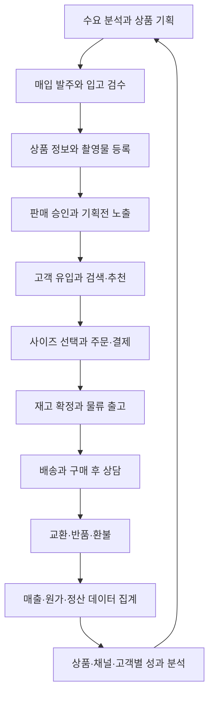

title: 시나리오: 이커머스 01 — 회사의 업무와 시스템을 한눈에 읽는다
slug: scenario-ecommerce-harness-engineering
category: 시나리오
summary: "온라인 의류몰에 처음 입사한 직원의 눈높이로 조직과 업무를 읽는다. 기획·개발·판매·물류·재무가 주고받는 자료, 기다리는 이유와 완료 조건을 연결하고 이를 지원하는 시스템과 AI를 설명한다."
tags: harness-engineering,ecommerce,architecture,ai-agent,recommendation,engineering-management,platform-engineering
toc: true
nextSlug: scenario-modeline-02-product-planning
publishedAt: 2026-09-12T04:50:30.857736Z
syncHash: cbe8365535ae1dc9d73cbb7a94ca859862d8341ea915a712ad29d77e7e7a5352

---

[시리즈 종합편과 전체 목차](/96/scenario-modeline-17-company-overview)

> 모드라인과 등장인물, 거래, 회의는 이 시리즈를 위해 만든 가상 설정이다. 개발 경력 22년인 CTO 강태준의 시선으로 회사를
> 따라간다. 수량·금액·시간은 이야기와 설계의 예시이며 실제 회사의 실적이나 AI 도입 성과가 아니다.

오전 8시 45분, 모드라인의 개발 총괄 강태준이 운영 화면을 연다. 밤사이 들어온 주문, 오늘 출고할 물량, 검수 대기 상품과
개발팀의 검토 대기 작업이 보인다. 가을 판매 시즌의 어느 평일, 이 회사가 일을 나누고 결과를 확인하며 다음 일을 결정하는 모습을 그려 본다.

MD 한지민은 다음 발주를 준비하고 있다. 그로스 리드 정유라는 오늘 광고에 내보낼 상품을 확인한다. 물류 담당 박민수는
판매가능 수량을 맞추고, 재무 담당 남도현은 결제 기록과 PG 입금 자료를 대조한다. 서로 다른 일을 하지만 모두 같은 상품과 주문을 보고 있다.

태준은 각 화면에 같은 숫자가 나오는지만 확인하지 않는다. 발주한 수량과 팔 수 있는 수량, 고객이 결제한 금액과 회사 통장에
들어온 금액은 의미가 다르다. 그 차이를 누가 설명하고 어느 업무에서 해소하는지가 개발 총괄에게 중요하다.

**이 시리즈는 독자가 모드라인에 합류해 회사의 일을 인수인계받듯 읽을 수 있게 구성한다.** 직원이 어떤 자료를 받아 무엇을
판단하고, AI와 시스템을 어떻게 쓰며, 다음 부서에 무엇을 넘기는지 이어서 보여 준다.

첫 편은 회사의 전체 지도와 개발팀의 책임·인계를 다룬다. 아키텍처와 AI 실행의 상세는 [기술 01편](/100/scenario-ecommerce-tech-01-architecture-ai-runtime)으로 분리했다. 이후에는 같은 사람과 상품·주문을 따라 실제 업무 화면, 회의 기록,
개발 요청, 발주서, 출고 지시와 정산 자료를 가상의 문서로 구체화한다. 정상적인 하루와 예외 처리, 일간·주간·월간·분기·연간의 반복을 함께 읽는다. 각 부서의 책임·업무 달력·KPI를 먼저 설명하고 개발·AI 활용은 마지막 구역으로 분리한다.

## 먼저 어떤 옷을 어떻게 파는 회사인지 정한다

가상의 회사 이름은 **모드라인**이다. 자체 온라인몰에서 여성·남성 캐주얼 의류를 판매한다. 브랜드 상품을 매입하고 일부 제품은
자체 기획하며, 배송은 외부 물류센터에 맡긴다. 판매 주체는 모드라인 하나이고, 판매자별 정산이 필요한 오픈마켓은 아직 운영하지 않는다.

| 설계 항목 | 모드라인의 가정 |
|---|---|
| 회사 규모 | 사내 80명, 이 중 개발 조직 15명 |
| 판매 규모 | 월 활성 이용자 30만 명, 하루 평균 주문 1,000건 |
| 상품 규모 | 스타일 기준 2만 개, 색상·사이즈 조합인 SKU 기준 12만 개 |
| 트래픽 특성 | 신상품 공개와 기획전 시간에 방문이 집중된다 |
| 물류·결제 | 외부 WMS·택배사·PG 연동, 회사가 재고와 주문의 업무 기준을 소유한다 |
| 초기 개선 기간 | 12주 동안 자료·인계·검증을 정비하고 필요한 업무에 자동화와 AI를 연결한다 |

이 규모는 기술 선택의 출발점이다. 부서마다 별도 플랫폼을 새로 만들 여유는 크지 않지만, 한 사람이 모든 변경을 검토할 수도 없다.
개발 총괄은 자동화 범위, 장애가 번지는 범위, 유지보수 인력을 함께 정해야 한다.

의류에서는 상품과 판매 단위를 구분하는 일이 특히 중요하다. 코튼 셔츠라는 상품에는 소재·핏·사진이 있고, 네이비 M이라는 SKU에는
바코드·재고·출고 가능 상태가 있다. 상품을 추천하는 것과 고객이 원하는 SKU를 살 수 있는지는 다른 판단이다.

### 출근한 사람들이 어디에 속하는지 먼저 본다

모드라인 사내 인원 80명은 아래처럼 나뉜다. 실제 창고의 피킹·포장 인력은 외부 물류회사 소속이고, 모드라인의 물류관리팀은
그 회사와 출고·재고·검수 기준을 맞춘다. 외부 업체의 역할까지 알아야 회사의 일을 끝까지 이해할 수 있다.

| 조직 | 인원 | 독자가 따라갈 담당자와 업무 |
|---|---:|---|
| 경영·사업 | 3 | CEO 윤서영이 목표·현금·투자 우선순위를 조정한다 |
| 개발 | 15 | CTO 강태준과 개발팀이 시스템·데이터·운영을 책임진다 |
| 제품·디자인 | 6 | PM 이지은이 고객·부서의 요청을 개발 가능한 일로 만든다 |
| MD·매입 | 12 | 한지민이 상품 구성·공급 조건·발주를 정한다 |
| 콘텐츠·스튜디오 | 8 | 배소연이 촬영·실측·설명 자료를 완성한다 |
| 그로스·CRM | 10 | 정유라의 팀이 광고·기획전·구매 이후의 관계를 운영한다 |
| 영업운영·물류관리 | 8 | 박민수가 판매 설정·재고·외부 창고를 연결한다 |
| CX·CS | 10 | 오수진의 팀이 문의·교환·반품을 끝까지 처리한다 |
| 재무·회계 | 4 | 남도현이 거래·입금·지급·마감 자료를 연결한다 |
| 피플·총무 | 4 | 김나래가 채용·입퇴사·장비·업무 인계를 관리한다 |

인물을 소개하는 이유는 판단의 주체를 분명히 하기 위해서다. 지민은 재고를 확보해야 하고, 유라는 광고 반응을 놓치고 싶지 않다.
도현은 지급할 자금과 정산 근거를 확인해야 한다. 태준의 역할은 이 서로 다른 판단이 같은 데이터 위에서 이루어지도록 만드는 것이다.

## 입사 첫날에는 완료 표시보다 다음 사람의 화면을 본다

태준은 새로 합류한 직원을 오전 업무 점검에 데려간다. “저 부서는 왜 저렇게 회의를 많이 해요?”라는 질문에 조직문화부터 설명하지 않는다. 판매운영이 기다리는 실측표, 개발자가 기다리는 정책 결정, 재무가 기다리는 입고 확인서를 차례로 연다.

여기서 티켓은 해야 할 일을 담당자·상태·기한과 함께 적은 업무 카드다. 백로그는 아직 시작하지 않은 일의 목록이고, 인계는 자료를 보낸 뒤 상대가 다음 일을 할 수 있는지 확인하는 과정이다. 모드라인은 메신저에서 논의하더라도 확정한 내용은 관련 업무 카드에 남긴다.

| 시각·장면 | 직원이 실제로 하는 일 | 다음 사람에게 남는 결과 |
|---|---|---|
| 09:00 운영 점검 | 민수가 미접수 출고의 외부 작업 ID를 조회한다 | 확인할 주문과 창고 담당자, 재확인 시각 |
| 10:00 판매 준비 | 소연이 사진·실측을, 유라가 광고 랜딩을 대조한다 | 게시 가능한 버전과 아직 보류할 옵션 |
| 11:00 제품 논의 | 지은이 부서 요청을 합치고 누락 자료를 배정한다 | 개발 준비 완료와 자료 대기를 나눈 목록 |
| 14:00 출고 마감 | 민수가 출고 증거와 남은 주문을 확정한다 | CX가 안내할 지연 사유와 확인 기한 |
| 17:00 인계 | 각 담당자가 미완료 이유와 다음 행동을 적는다 | 다음 근무자가 이어서 처리할 업무 카드 |

“보냈습니다”와 “받아서 처리할 수 있습니다” 사이에는 차이가 있다. 실측 파일이 도착해도 어느 상품의 어느 사이즈인지 없으면 콘텐츠팀은 쓸 수 없다. 개발자가 코드를 만들었어도 검증 방법이 없으면 운영 담당자는 배포를 승인하기 어렵다.

태준은 이를 개인의 성실함만으로 해결하려 하지 않는다. 필요한 필드를 양식에 넣고, 수량 합계는 코드로 검사하며, 담당자 없는 보류 건은 운영 점검에 다시 나타나게 한다. AI는 긴 메모에서 누락 질문을 찾는 데 쓰지만, 공급사만 아는 납기까지 대신 확정하지는 않는다.

새 직원에게 첫날 맡기는 일도 회사 전체를 이해하라는 추상적인 숙제가 아니다. 처리 중인 업무 카드 하나를 골라 입력 자료, 현재 담당자, 기다리는 이유, 다음 수신자를 찾게 한다. 부서를 외우는 것보다 일이 이동하는 이유를 이해하는 것이 먼저다.

## 같은 셔츠와 주문이 여러 부서를 지나가는 기록을 따라간다

시리즈에서 반복해서 등장할 상품은 **데일리 코튼 셔츠**이며 상품 ID는 `P-F26-017`이다. 네이비·아이보리 두 색상에 S·M·L이 있어
SKU는 여섯 개다. 지민이 발주서 `PO-F26-041`에 각 SKU 100장씩, 총 600장을 적는 순간부터 이 상품의 기록이 시작된다.

외부 창고가 실제로 받은 수량은 596장이다. 민수는 그중 검수 보류 8장을 분리하고 판매가능 수량 588장을 확인한다.
미입고 4장과 검수 보류 8장은 각각 담당자와 후속 처리가 있는 업무로 남는다. 이 수량은 첫 검수 직후의 가상 스냅샷이다.

그때 유라가 기획전에 600장을 사용할 수 있다고 계산하면 판매 계획이 틀어진다. 도현이 입고 차이를 확인하지 않고 지급 자료를
확정해도 문제가 생긴다. 같은 상품 ID를 공유하면서 발주·실물·판매가능 수량을 구분해야 하는 이유가 이 장면에서 드러난다.

| 기록이 이어지는 단계 | 직원이 확인하고 남기는 것 | 다음 담당자가 받는 것 |
|---|---|---|
| 상품 기획·발주 | 지민이 수요 근거와 공급 조건을 확인한다 | 발주서, SKU별 수량, 납기와 지급 조건 |
| 입고·검수 | 민수가 실물 596장과 보류 8장을 구분한다 | 판매가능 588장, 미입고·검수 차이 목록 |
| 촬영·등록 | 소연이 실측과 소재 근거, 사진을 검수한다 | 버전이 있는 상품 자료와 판매 설명 |
| 검색·추천 | 데이터 담당 서민아가 상품과 SKU를 연결한다 | 조건에 맞는 후보, 실제 노출 기록 |
| 주문·출고 | 주문 A의 네이비 M을 예약하고 결제를 확인한다 | 확정 주문과 출고 명령, 이후 배송 상태 |
| 교환·반품 | 수진이 주문 A의 사이즈 교환과 주문 B의 환불을 나눠 처리한다 | 회수·검수·교환 출고·환불 기록 |
| 월말·다음 기획 | 도현이 정산 차이를 설명하고 지민이 상품 성과를 본다 | 거래 근거, 사이즈별 개선점, 다음 발주 판단 |

고객 A의 주문은 `O-F26-10482`다. 59,000원 상품에 예시 할인 5,900원을 적용해 53,100원을 결제한다. 배송 후에는
소매 길이를 이유로 네이비 S 교환을 요청한다. 수진이 접수를 하고 민수가 회수된 M과 교환할 S의 상태를 확인하는 과정까지 이어진다.

고객 B의 별도 주문 `O-F26-10483`은 상품 문제로 반품·환불을 요청한다. 환불 요청과 실제 PG 환불 성공, 정산 반영은 각각
따로 남긴다. 주문 A의 교환과 주문 B의 환불을 같은 거래로 섞으면 재고·상담·재무 기록이 모두 어긋난다.

이 두 주문의 배송료는 회사가 부담하는 가상 처리로 정한다. 금액은 고객 화면의 결제 예시이며 순매출이나 이익을 뜻하지 않는다.
재무 편에서는 원결제·환불·수수료·입금 자료를 연결해 회사가 실제로 어떤 숫자를 판단하는지 풀어 간다.

한 상품의 일만 일어나는 회사는 아니다. 이 기록을 따라가는 동안 다른 상품의 입고, 캠페인, 신규 직원의 온보딩과 개발 배포도
진행된다. 공통 상품과 주문은 여러 부서의 설명이 같은 회사 이야기로 이어지게 하는 기준점이다.

## 회사의 흐름을 상품에서 반품 이후까지 연결한다

회사를 관통하는 기본 흐름은 아래와 같다. 화살표는 업무의 선후 관계이며, 모든 단계가 한 데이터베이스 트랜잭션이라는 뜻은 아니다.

| 업무 | 기준이 되는 데이터 | 개발팀이 제공하는 기능 | AI 하네스가 맡을 수 있는 일 |
|---|---|---|---|
| 상품 기획·매입 | 판매·반품 이력, 공급사 조건 | 기획 대시보드, 발주 관리 | 수요 근거 정리, 품목별 검토 보고서 초안 |
| 입고·검수 | SKU, 입고 수량, 검수 결과 | WMS 연동, 재고 원장 | 입고 문서 매칭, 수량 차이 원인 후보 정리 |
| 상품 등록 | 실측, 소재, 제조 정보, 이미지 | 상품정보 관리 화면 | 속성 추출, 정보 누락 검출, 상세 설명 초안 |
| 판매·유입 | 판매 승인, 가격, 캠페인 설정 | 기획전, SEO, 랜딩 페이지 | 캠페인 페이지 제작, 문구 검토, 운영 QA |
| 검색·추천 | 검색어, 노출·클릭, 구매 가능 SKU | 검색과 추천 API | 취향 해석, 상품 속성 보강, 추천 설명 |
| 주문·결제 | 가격 확정본, 주문, 결제 상태 | 장바구니, 주문, PG 연동 | 실패 로그 조사, 통합 테스트 작성 |
| 배송·CS | 출고·배송 이벤트, 상담 정책 | 배송 조회, 상담 업무 화면 | 주문 상태 요약, 답변·처리안 작성 |
| 교환·반품 | 반품 품목, 검수, 환불 상태 | 교환 주문과 역물류 관리 | 사유 분류, 상품·사이즈별 문제 집계 |
| 정산·분석 | 결제·취소·환불·수수료 기록 | 대사 데이터, 분석용 모델 | 불일치 조사, 근거가 연결된 보고서 초안 |

이 표에서 먼저 구현할 것은 업무마다 입력과 출력의 형식을 맞추는 일이다. 상품 식별자가 분석과 물류에서 다르면 에이전트도
매번 이름을 보고 추측해야 한다. AI의 문장 이해 능력으로 데이터 계약의 빈틈을 계속 메우는 구조는 운영비를 키운다.

최소한 `product_id`, `sku_id`, `order_id`, `order_item_id`, `payment_id`, `return_id`를 부서 간에 공유한다.
수정 가능한 상품명이나 이메일 주소를 연결 키로 쓰지 않는다. 상품·주문·반품을 잇는 안정적인 ID가 회사 전체 자동화의 바탕이다.

## 개발 조직은 업무의 끝을 책임지도록 나눈다

개발 총괄의 첫 결정은 에이전트 수가 아니라 사람의 책임 범위다. 모드라인의 개발 조직 15명은 다음처럼 구성한다.
PM, 디자이너, MD, 재무 담당자는 이 조직과 협업하는 별도 구성원으로 둔다.

| 역할 | 인원 | 소유하는 결과 |
|---|---:|---|
| 개발 총괄 | 1 | 아키텍처 원칙, 투자 우선순위, 품질·운영 기준 |
| 엔지니어링 매니저 | 1 | 업무 분해, 검토 용량, 일정과 조직 간 조정 |
| 커머스 백엔드 | 4 | 상품·가격·재고·주문·결제·반품의 정합성 |
| 프런트엔드 | 3 | 고객몰과 업무 화면, 접근성, 화면 성능 |
| 데이터·추천 | 2 | 이벤트 계약, 분석 데이터, 추천과 평가 |
| 플랫폼·SRE | 2 | 배포, 관측, 공통 하네스, 실행 환경과 비용 |
| QA·품질 | 2 | 사용자 여정, 평가 데이터, 릴리스 기준 |

테스트 작성은 개발자도 맡는다. QA 두 명에게 모든 AI 산출물의 검사를 몰아주면 생성량이 늘어날수록 출시가 밀린다.
플랫폼팀은 공통 실행기를 제공하고, 상품팀은 상품 정보의 검사 기준을, 주문팀은 주문 상태 전이의 검사 기준을 소유한다.

**에이전트 실행에도 담당 팀과 책임자를 붙인다.** 상품 설명 에이전트가 잘못된 소재를 적었을 때 고칠 사람은 상품 담당자이고,
실행기가 중복 작업을 만들었을 때 고칠 사람은 플랫폼 담당자다. AI가 했다는 말로 결함의 소유자가 사라지지 않게 한다.

오전 10시 판매 준비 확인에서 소연은 셔츠의 상품 자료를 전달하고, 민수는 판매가능 SKU를 확인한다. 유라는 그 결과로 광고
노출 대상을 정한다. 상품 자료에 승인 표시가 있어도 재고 자료가 준비되지 않았으면 광고 집행 준비가 끝난 것은 아니다.

제품 PM 지은은 이 인계에서 직원이 같은 값을 여러 화면에 옮겨 적는 부분을 확인한다. 개발팀에는 자동화해 달라는 말과 함께
현재 화면, 입력 자료, 담당자, 다음 부서가 기다리는 조건을 넘긴다. 개발할 일은 이런 회사의 반복 업무에서 나온다.

## 개발 총괄은 올해의 사업 계획과 이번 주의 처리 여력을 연결한다

태준은 고객 요구를 가장 많이 받은 기능부터 차례대로 만드는 방식으로 개발 조직을 운영하지 않는다. 이미 돌아가는 주문·결제와 운영 도구를 유지하고, 성장에 필요한 변경을 만들며, 다음 사람이 고칠 수 있는 기반을 남겨야 한다.

연간 계획을 세울 때 제품팀은 고객 문제와 사업 기회를, MD·그로스·운영은 시즌별 준비 시점을 가져온다. 재무는 투자·계약 여력을, 피플은 채용과 기존 구성원의 역할을 확인한다. 태준과 EM은 이 요청을 개발·검토·운영에 실제로 배정할 수 있는 일로 바꾼다.

이 회사의 달력은 내부 운영 예시다. 전년도 10~12월에 다음 해 가정을 만들고, 4~6월에는 하반기 전망과 가을 준비를 맞춘다. 7~9월의 판매·파일럿·물류·상담 결과는 10~12월 시즌 평가와 다음 해 계획의 근거가 된다.

| 주기 | 개발 총괄과 각 리드가 받는 자료 | 판단과 남기는 결과 |
|---|---|---|
| 일간 | 고객 영향, 미해결 거래, 검토·릴리스 대기, 당일 여력 | 즉시 대응 담당·오늘 진행 범위·다음 인계 |
| 주간 | 요청 준비 상태, 진행 작업 나이, 리뷰·QA 적체, 다음 판매 일정 | 시작·보류할 작업과 검토 예약·운영 담당 |
| 월간 | 고객·업무 효과, 결함·장애, 유지비, 계획 대비 차이 | 로드맵 조정·반복 문제 개선·다음 확인 |
| 분기·시즌 | 상품·캠페인 일정, 예상 피크, 부서 용량과 예산 전망 | 피크 준비·변경 제한·복구 점검·투자 재배치 |
| 연간 | 다음 해 사업 가정, 기존 서비스 위험, 인력·계약·기술 부채 | 연간 투자안·책임 팀·중단 조건·유지보수 범위 |

개발자 15명이라는 숫자가 매주 기능 개발에 전부 투입할 수 있다는 뜻은 아니다. 온콜, 리뷰, 운영 문의, 결함 수정, 교육, 휴가와 공통 기반 관리에도 시간이 든다. EM은 다음 기간의 실제 참석 가능 시간과 과거 처리 기록을 보고 시작할 작업 수를 조정한다.

모드라인은 작업을 사업 변화, 운영·결함, 유지보수·위험 개선으로 구분한다. 세 부류의 비중을 업계 표준처럼 고정하지 않는다. 검토자가 부족하거나 장애가 커지면 새 작업을 덜 시작하고 먼저 끝내야 할 일을 합의한다.

### 변경 요청에는 가치뿐 아니라 운영 이후의 책임도 적는다

실측과 사이즈 상태를 보여 주는 `DEV-F26-012`는 버튼 하나를 만드는 요청이 아니다. 지은은 어떤 고객 혼동을 줄일지, 소연은 실측 원천과 승인 버전을, 민수는 판매가능 상태의 의미를 전달한다. 개발팀은 화면·API·계측·오류 안내와 운영 인계까지 범위를 확인한다.

태준은 이번 변경에 결제 시스템 재작성까지 끼워 넣지 않는다. 반대로 화면이 쓰는 값의 의미가 정해지지 않았는데 UI만 먼저 완료 처리하지도 않는다. 지금 함께 정해야 하는 계약과 다음 작업으로 남길 개선을 나눠 문서에 적는다.

| 작업 카드에서 확인하는 질문 | 이번 요청에서 필요한 근거 | 답이 없을 때의 처리 |
|---|---|---|
| 누구의 어떤 일을 바꾸는가 | 고객의 사이즈 선택과 상담의 재설명 사례 | 제품·CX가 문제 범위 보완 |
| 누가 값의 의미를 책임지는가 | 콘텐츠 승인 자료·SKU 상태 계약 | 해당 소유자에게 정의 요청 |
| 어디까지 만들고 검사하는가 | 화면·API·이벤트·접근성·예외 조건 | 범위를 재합의하고 시작 보류 |
| 출시 후 누가 보는가 | 제품 지표 담당·운영 관측·문의 인계 | 관찰 책임자 지정 |
| 실패하면 어떻게 멈추는가 | 이전 표시 방식·설정 복귀·고객 영향 확인 | 릴리스 전에 복구 조건 보완 |

은서가 가상 인수 검사 12개 중 키보드 초점 처리 하나를 반려하면, 개발자는 같은 조건으로 고친 결과를 다시 제출한다. 수정 후 12개를 통과했다는 기록은 그 작업의 검사 결과이지 회사 생산성이 좋아졌다는 증거가 아니다.

### 회사의 효율과 개발 실행 속도는 구분해 측정한다

태준의 보고서는 새 기능 개수만 보여 주지 않는다. 회사의 반복 업무가 실제로 줄었는지와, 개발 변경을 안정적으로 전달하는지를 따로 읽는다. 다음은 모드라인의 내부 측정 정의이며 현재 성과나 권장 목표치가 아니다.

| 지표·관찰 범위 | 계산과 원천 | 소유자·검토 주기 |
|---|---|---|
| 업무 인계 리드타임 | 이번 주 수신 완료 카드의 최초 접수→수신 부서 확인 시간, 중앙값·상위 구간과 미완료 나이 별도 | 업무 소유자·PM, 주간 |
| 필수 자료 재요청률 | 이번 주 접수 카드 중 자료 누락으로 반려한 고유 카드 / 접수 카드 | 수신 팀·PM, 주간 |
| 검토 대기시간 | 이번 주 리뷰 시작 건의 검토 요청→첫 실질 검토, 아직 시작하지 않은 건 별도 | EM·리드, 일간·주간 |
| 출시 후 문제 재개방률 | 출시 후 30일 관찰이 끝난 변경 중 완료 조건 미충족으로 다시 열린 변경 / 해당 변경 | QA·개발 리드, 월간 |
| 반복 수작업 부담 | 같은 업무 유형의 처리 표본에서 사람의 실제 조작·검토·재작업 시간 합, 대기는 별도 | 업무 담당·PM, 월간 |
| 유지·운영 총비용 | 해당 월 서비스·도구 지출과 합의한 유지·검토·대응 시간의 환산 비용, 배부 기준 별첨 | CTO·재무, 월간 |

개별 직원의 작업량을 이 표 하나로 평가하지 않는다. 난도와 고객 영향, 처리 단위가 다른 일을 단순 비교하면 어려운 운영 문제를 맡는 사람이 불리해질 수 있다. 정의와 표본 범위를 고정한 뒤 같은 유형의 추이를 먼저 본다.

인계 리드타임이 길면 처리 시간과 자료·검토 대기, 재작업을 분리한다. 검토 대기가 늘면 작업을 더 생성하기보다 변경 단위를 줄이거나 리뷰 용량을 확보한다. 재개방이 늘면 완료 조건·테스트·운영 인계 중 빠진 부분을 조사한다.

반복 수작업이 줄었어도 고객의 주문 처리가 늦어지거나 문의가 늘었다면 개선을 성공으로 확정하지 않는다. [종합편의 전사 KPI](/96/scenario-modeline-17-company-overview)와 부서별 품질·위험 지표를 함께 본다. 실제 전후 측정이 없으면 단축률을 만들어 쓰지 않는다.

## 다른 팀도 같은 하루 안에서 일을 이어받는다

오후에는 개발 검토와 상품 판매, 출고와 상담이 함께 진행된다. 현우의 하네스가 테스트를 실행하는 동안 민수는 외부 창고의
출고 결과를 확인한다. 수진은 아직 송장이 없는 주문과 이미 출고된 주문을 구분해 고객에게 안내한다.

아래는 이 시리즈에서 사용할 가상의 업무 인계 기록이다. 보낸 쪽이 완료를 눌렀다는 사실과 받은 쪽이 처리할 수 있는 상태가
됐다는 사실을 함께 확인한다.

| 시점·업무 | 보내는 담당자와 자료 | 받는 담당자의 다음 행동 |
|---|---|---|
| 오전 판매 준비 | 소연의 승인 상품 자료, 민수의 SKU 상태 | 유라가 캠페인 노출 대상을 확정한다 |
| 개발 검토 준비 | 개발팀의 변경분·테스트·화면 증거 | 은서와 담당 개발자가 완료 조건을 검토한다 |
| 오후 출고 마감 | 주문 시스템의 출고 명령과 창고 처리 결과 | 민수가 미출고·지연 대상에 담당자를 배정한다 |
| 교환 접수 | 수진의 EX-F26-021, 원주문과 변경할 SKU | 민수가 회수·검수와 S 재고 확보를 진행한다 |
| 일일 거래 확인 | 주문·결제·환불 상태와 외부 PG 자료 | 도현이 확인된 거래와 미해결 차이를 나눈다 |
| 퇴근 전 인계 | 각 업무의 보류 사유·책임자·다음 행동 | 다음 근무자가 같은 기록에서 업무를 잇는다 |

금요일에는 지민이 재주문 후보를, 유라가 캠페인 결과를, 태준이 개발·운영 비용을 가져온다. 월말에는 도현이 환불과 정산 시점
차이까지 설명한다. 서영은 이 자료를 보고 다음 시즌 상품과 광고, 인력·기술 투자에 얼마를 배분할지 결정한다.

김나래가 신규 직원을 채용하거나 담당자의 휴가·퇴사를 처리하는 일도 이 흐름에 영향을 준다. 누군가 자리를 비워도 승인과
검토가 멈추지 않도록 대체 담당자와 접근 범위를 정하고, 나가는 직원의 계정·장비·업무 기록을 인계한다. 이 부분은 피플·총무 편에서 이어간다.

## 첫 12주는 회사가 운영할 수 있는 범위부터 넓힌다

회사 전체 구조를 설계했다고 모든 부서에 에이전트를 동시에 배치할 필요는 없다. 플랫폼팀 두 명이 운영할 수 있는 범위에서
상품 등록과 개발 업무를 먼저 연결하고, 측정 결과로 다음 범위를 정한다.

| 기간 | 만들거나 연결할 것 | 다음 단계로 넘어갈 조건 |
|---|---|---|
| 1~2주 | 업무·데이터 소유자, ID, 현재 처리 시간과 결함 기준선 | 각 팀이 입력·완료 조건·책임자를 설명할 수 있다 |
| 3~4주 | 상품 자료·검수 양식, 주문·환불 집계, 제한된 초안·개발 자동화 | 자료 누락과 중복을 식별하고 담당자가 검토할 수 있다 |
| 5~8주 | 추천 평가, 마케팅 비용·반품 분석, PR·검증과 부서 인계 | 같은 정의로 결과를 계산하고 대기·재작업을 비교할 수 있다 |
| 9~12주 | 일부 고객 노출, 후속 결과 관찰, 복구 훈련과 업무 재검토 | 실패 시 복구하고 다음 부서가 받은 결과까지 확인한다 |

일정은 계획을 나누는 틀이다. 8주가 됐다고 추천을 자동으로 출시하지 않는다. 평가와 운영 준비가 부족하면 그 단계에 남는다.
효과가 없는 작업은 자동화 범위를 줄이고, 데이터 품질이나 업무 규칙을 먼저 개선한다.

## 재무·경영·마케팅은 같은 회사의 다음 관점으로 이어간다

첫 편에서 만든 기반은 다른 부서에도 그대로 이어진다. 재무는 주문·결제·환불의 같은 ID를 사용하고, 마케팅은 같은 상품과
캠페인·노출·구매 기록을 사용한다. 경영은 이 데이터를 모아 목표와 자원을 결정한다.

부서마다 공유하는 것은 데이터의 의미와 추적 가능한 근거다. 고객 정보 접근 범위, 승인할 수 있는 금액, 대외 발송 권한은
직무에 맞게 다르게 부여한다. 개발팀이 만든 실행·평가 구조 위에 각 부서가 자신의 판단 기준을 올린다.

이 시리즈를 다 읽은 독자는 모드라인의 주문 하나를 처음부터 끝까지 설명할 수 있어야 한다. 누가 어떤 자료를 만들었는지,
어느 시스템이 수량과 금액을 확정했는지, 다음 부서가 무엇을 기다리는지, 잘못됐을 때 누가 복구하는지까지 포함한다.

현재는 개발 조직부터 시작해 회사의 각 부서를 따라가는 본편 16편과 종합편 1편으로 구성한다. 읽는 순서는 개발에서 운영 부서로 확장되지만,
회사 안의 업무는 같은 하루에 병행된다. 후속 편도 같은 회사 설정을 따르는 초안이며, 종합편은 입문 지도와 전체 읽기 순서를 제공한다.

「시나리오: 이커머스」는 이후 업무와 구현 내용을 더할 수 있는 시리즈다. 모드라인은 본문에서 사용하는 가상 회사 이름으로 유지한다.
새 글을 추가할 때는 종합편의 업무 지도와 목차도 함께 갱신한다.

| 편 | 독자가 들어갈 곳 | 이어서 볼 일과 자료 |
|---|---|---|
| 1 · 이 글 | CTO의 자리 | 회사 지도, 직원, 대표 상품·주문, 개발팀의 책임과 인계 |
| 2 | 제품·디자인팀 | 고객 조사·요청·UX·로드맵·출시와 효과 검토 |
| 3 | 개발·QA팀 | 여력·설계·구현·리뷰·검증·릴리스·기술 부채 |
| 4 | 데이터·추천 담당 | 수집·품질·분석·검색·추천·실험·지표 정의 |
| 5 | 커머스 개발팀 | 가격·혜택·예약·주문·결제·취소·환불·대사 |
| 6 | 플랫폼·운영팀 | 관측·온콜·배포·보안·용량·비용·백업·복구 |
| 7 | MD·매입팀 | 구색·수요·공급사·발주·납기·재주문·장기재고 |
| 8 | 스튜디오·판매운영팀 | 촬영·실측·권리·상품 등록·판매 승인·정정·종료 |
| 9 | 마케팅팀 | 시장·고객·브랜드·유입·캠페인·예산·성과 분석 |
| 10 | CRM 담당자의 자리 | 회원·선호·여정·대상·혜택·발송·재구매·효과 |
| 11 | 물류관리팀과 외부 창고 | 입고·보관·출고·배송·역물류·실사·협력사 관리 |
| 12 | CX·CS팀 | 구매 전 문의·주문 변경·배송·교환·환불·상담 품질·VOC |
| 13 | 재무·회계팀 | 거래·채권·채무·증빙·비용·대사·월간/연간 결산 |
| 14 | 예산·현금 계획 담당 | 연간 예산·전망·품의·구매·계약·지급·갱신 |
| 15 | 피플·총무팀 | 채용·교육·근태·급여 자료·평가·입퇴사·자산·시설 |
| 16 | 경영·사업팀 | 고객 가정·연간 전략·예산·조직·위험·결정과 실행 |
| 17 · 종합편 | 회사 전체를 다시 읽는 자리 | 조직·연간 달력·전사 KPI·인계·의사결정·기술 확장 지도 |

후속 편마다 직원의 정상적인 일과를 먼저 따라가고, 실제처럼 구성한 발주서·티켓·화면 필드·회의 기록을 함께 읽는다.
AI가 어느 입력으로 무엇을 만들었는지와 담당자가 무엇을 확인하고 다음 부서에 넘겼는지까지 적는다.

품절이나 반품, 계약 종료와 연동 실패도 각각의 업무 안에서 다룬다. 해외 판매나 다중 판매자 오픈마켓처럼 모드라인이 아직
하지 않는 사업은 별도 확장으로 남긴다. 현재 회사가 하는 일의 시작·처리·예외·인계를 끝까지 연결하는 것이 이 시리즈의 범위다.

남은 어려움은 모델보다 회사의 업무 지식에 있다. 공급사 자료가 부정확하고 반품 사유가 제각각이며 업무 정책이 사람의 기억에만
있으면 자동화할 수 있는 범위가 작다. 먼저 정리할 데이터와 규칙을 선택하는 일도 개발 총괄의 투자 판단이다.

모드라인에서 업무 개선의 성과는 어느 부서의 일이 다음 부서로 얼마나 정확하게 넘어가는지로 드러난다. 상품을 올리고,
고객에게 보여 주고, 주문을 처리하고, 반품 이후 숫자까지 설명할 수 있을 때 개발팀은 회사 전체의 흐름을 개선한 것이다.

## 개발·AI 활용은 업무 운영과 구분해 설계한다

개발팀은 앞에서 본 업무의 입력·판단·인계를 시스템으로 연결한다. 담당자에게 필요한 것은 도구 이름보다 어느 기록이 확정 정보인지, 누가 바꿀 수 있는지, 실패하면 어디에서 다시 확인하는지가 분명한 업무 환경이다.

| 구분 | 회사 업무에서 맡을 일 | 책임의 경계 |
|---|---|---|
| 사람 | 목표·정책·예외 판단, 판매·지출·릴리스 승인 | 다음 부서가 실행할 수 있는 조건과 책임을 확정 |
| 업무 코드 | 가격·수량 계산, 상태 제약, 중복 방지, 대사 | 확인한 입력과 규칙으로 재현 가능한 결과 생성 |
| AI | 자료 정리·연결 후보·코드·설명 초안 | 근거와 미확정 사항을 제출하고 스스로 거래를 확정하지 않음 |
| 실행 기반 | 권한·입력 버전·검사·중단·재개 기록 | 작업이 실패하거나 담당자가 바뀌어도 남은 일을 추적 |

구체적인 설계는 [기술 01 — 업무를 연결하는 아키텍처와 AI 실행 기반](/100/scenario-ecommerce-tech-01-architecture-ai-runtime)에서 이어진다. 고객 웹·커머스 코어·데이터 워커의 경계, 상품·추천·주문의 연결, AI 작업 계약과 격리 실행, 평가·복구·총비용을 다룬다. 기존의 다이어그램·설정·계산 예시도 그 글에서 읽을 수 있다.

회사 업무부터 익히려면 [02편 제품·디자인팀](/81/scenario-modeline-02-product-planning)으로 진행하면 된다. 기술편을 건너뛰어도 부서별 책임·일과·KPI와 앞뒤 인계는 이해할 수 있다. 각 업무편 마지막에는 해당 부서에 필요한 개발·AI 활용 구역을 계속 둔다.
