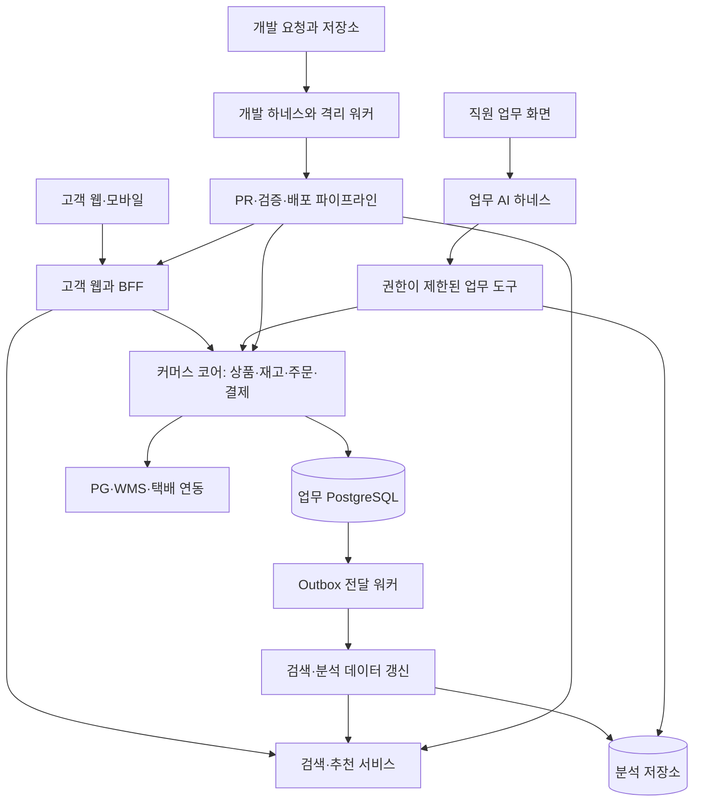
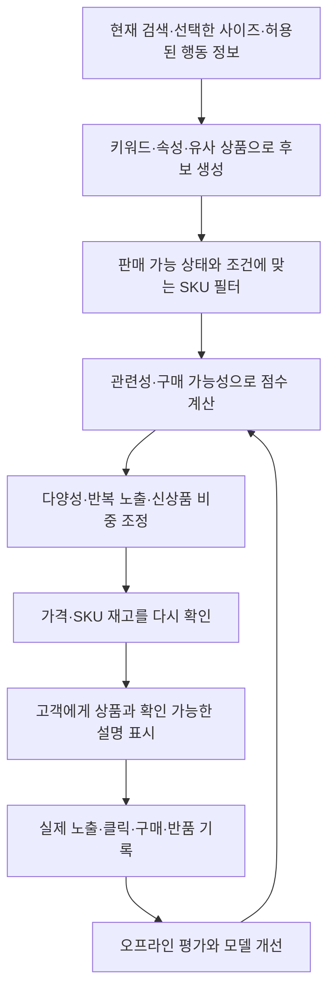
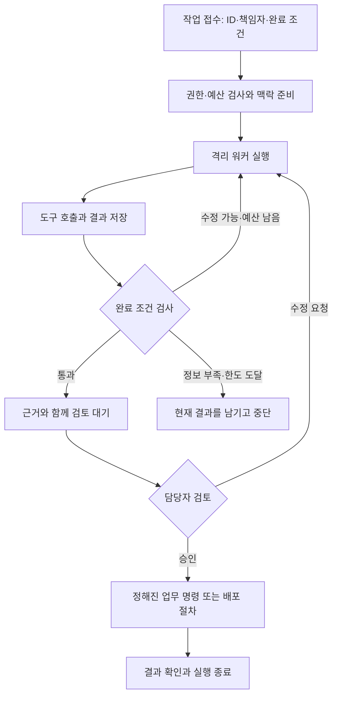

title: 시나리오: 이커머스 기술 01 — 업무를 연결하는 아키텍처와 AI 실행 기반
slug: scenario-ecommerce-tech-01-architecture-ai-runtime
category: 시나리오
summary: 회사 업무 지도에서 분리한 기술 설계편. 고객 웹·커머스 코어·데이터 워커에서 시작해 상품·추천·거래의 경계, AI 작업 계약·검사·복구·비용을 연결한다.
tags: ecommerce,architecture,harness-engineering,ai,platform-engineering
toc: true
publishedAt: 2026-09-15T10:01:59.324113Z
syncHash: 305e1ff584d6192da6d9f5fbe894b4e46624d69b806d8a15d99ddace632d125b

updatedAt: 2026-09-15T10:01:59.324114Z
---

[시리즈 종합편과 전체 목차](/102/scenario-modeline-17-company-overview) · [업무 01편: 회사 지도](/85/scenario-ecommerce-harness-engineering)

> 모드라인은 이 시리즈를 위해 만든 가상 회사다. 인물·거래·규모·설정·비용은 창작과 설계 가정이며, 실제 회사의 구조나 AI 도입 성과가 아니다. 아래는 구현 제안과 검증 방법이지 현재 블로그 저장소에 구현된 기능 목록이 아니다.

이 글은 업무 01편에 있던 기술 상세를 옮겨 독립적으로 읽도록 구성했다. 업무편은 누가 무엇을 받아 판단하고 다음 부서에 넘기는지 설명한다. 여기서는 그 인계가 코드·데이터·권한·실행 기록으로 어떻게 이어지는지 살펴본다. 하네스는 그중 AI 작업을 안전하게 실행하고 확인하는 기반이며, 회사 시스템 전체를 대신하지 않는다.

모드라인은 사내 80명, 개발 조직 15명의 국내 온라인 의류몰이다. 대표 상품은 데일리 코튼 셔츠 `P-F26-017`이며 색상·사이즈 조합은 SKU로 구분한다. 주문 A `O-F26-10482`의 사이즈 교환과 주문 B `O-F26-10483`의 환불은 새 매출을 만드는 작업이 아니라 기존 거래·실물·금액의 연결을 유지하는 작업이다.

고객 웹에서 받은 요청이 커머스 코어의 확정 상태를 바꾸고, 데이터 워커가 그 기록을 분석하며, 담당자가 결과를 검토하는 흐름을 기준으로 읽는다. 특정 프레임워크의 최신 기능 소개가 아니라 이 회사에 제안하는 경계와 선택 기준에 초점을 둔다. 인용한 버전·자료의 맥락은 유지하며 실제 도입 시 지원 상태와 운영 조건을 다시 확인한다.

## 아키텍처는 세 개의 실행 영역에서 시작한다

초기에는 고객 웹, 커머스 코어, 데이터·AI 워커를 중심으로 구성한다. 커머스 코어는 상품·재고·주문·결제를 모듈로 나눈 애플리케이션으로
시작한다. 모듈별 데이터 변경은 해당 모듈의 인터페이스를 거치게 하고, 다른 모듈의 테이블을 임의로 갱신하지 않는다.

서비스를 나누는 기준은 독립적인 확장·배포 필요성과 담당 팀의 운영 능력이다. 추천 추론과 장시간 AI 작업은 웹 요청과 자원 사용
특성이 달라 별도 프로세스로 띄운다. 결제·주문을 나누는 일은 실제 부하와 장애 격리 요구가 생겼을 때 다시 판단한다.



그림은 논리 구조다. 초기에는 큐와 실행 상태를 관리형 PostgreSQL에 저장하고 작업 워커를 붙여 운영할 수 있다.
소비자가 늘고 이벤트 재처리·장기 보관 요구가 커지면 전용 메시지 브로커로 확장한다. 분리 비용을 감당할 이유가 생겼을 때 옮긴다.

| 구성 요소 | 초기 선택 예시 | 이 회사에서 필요한 이유 |
|---|---|---|
| 고객 웹·업무 화면 | Next.js·TypeScript | 상품 페이지, 검색, 운영 화면을 공통 언어로 개발한다 |
| 커머스 코어 | Spring Boot·PostgreSQL | 주문·재고 변경의 트랜잭션과 상태를 명확하게 관리한다 |
| 추천·데이터 워커 | Python 서비스 | 임베딩, 모델 학습·추론, 평가 작업을 독립 실행한다 |
| 검색·캐시 | 검색엔진·Redis | 키워드와 속성 검색, 짧은 응답 시간, 반복 계산 절감 |
| 이미지·증거 파일 | 객체 저장소·CDN | 상품 사진과 개발 검증 산출물을 목적별로 보관한다 |
| AI 실행 상태 | 별도 스키마·실행 워커 | 실행 ID, 재시도, 예산, 결과와 승인 기록을 보존한다 |
| 관측 | 로그·메트릭·분산 추적 | 고객 요청부터 외부 연동과 AI 도구 호출까지 연결한다 |

이는 설계 예시다. 이미 잘 운영하는 기술이 있다면 먼저 재사용한다. 프레임워크 교체와 업무 자동화를 동시에 추진하면 성과와
실패의 원인을 분리하기 어려워진다.

## 하네스에는 일을 맡기는 계약과 끝내는 기준을 넣는다

하네스는 모델이 업무를 수행하도록 주변을 구성하는 실행 시스템이다. 이 글에서는 **입력과 맥락, 도구, 실행 상태, 권한,
예산, 평가, 결과 기록을 묶은 구조**를 뜻한다. 프롬프트는 그 안에서 모델에게 판단 방법을 설명하는 한 구성 요소다.

Anthropic은 모델이 다음 행동을 선택하는 에이전트와, 코드가 정한 순서를 따르는 워크플로를 구분한다. 모드라인도 이 구분을
사용한다. 상품 필수값 검사와 환불 상태 전이는 코드로 정하고, 모호한 상품 설명 해석이나 실패 원인 조사는 에이전트에 맡긴다.
[Building effective agents](https://www.anthropic.com/engineering/building-effective-agents)

모드라인에는 실행 목적이 다른 하네스가 있다. 개발용은 코드와 테스트 환경을 사용하고, 직원 업무용은 상품·분석 도구를 사용한다.
고객에게 노출되는 스타일 상담은 별도의 짧은 응답 예산과 고객 범위 권한을 갖는다. 공통 라이브러리는 공유하되 자격증명과 실행 큐는 구분한다.

| 하네스 구성 | 개발 업무에 적용 | 상품·고객 업무에 적용 |
|---|---|---|
| 작업 계약 | 이슈, 완료 조건, 변경 가능 범위 | 상품 ID, 필수 속성, 결과 형식 |
| 맥락 | 저장소, 설계 결정, 테스트 안내 | 공급사 문서, 실측, 상품·상담 정책 |
| 도구 | 코드 검색, 테스트, 브라우저, PR 생성 | 상품 조회, 초안 저장, 추천 후보 조회 |
| 상태 | 실행 단계, 기준 커밋, 변경분, 검증 결과 | 처리 대상 버전, 재시도, 검수 상태 |
| 권한 | 격리 작업공간, 제한된 네트워크 | 역할·고객 범위에 맞는 업무 API |
| 예산 | 작업 시간, 도구 호출, 모델 비용 상한 | 응답 시간, 품목당 비용, 재시도 횟수 |
| 평가 | 계약 테스트와 실제 화면 검증 | 스키마 검사, 사실 확인, 추천 평가 |
| 산출물 | 검토 가능한 PR와 실행 증거 | 검수 가능한 초안과 근거 연결 |

도구는 모델이 이해하기 쉬운 작은 업무 단위로 만든다. `catalog.get_product`와 `catalog.save_description_draft`를 따로 제공하면
조회와 변경의 권한을 다르게 줄 수 있다. 임의 SQL 실행 도구 하나로 조회·수정·삭제를 모두 해결하게 하면 업무 범위를 통제하기 어렵다.

MCP는 도구를 발견하고 호출하는 공통 인터페이스로 사용할 수 있다. 실제 권한 검사, 업무 상태 전이, 재시도 중복 방지는 서버가
구현해야 한다. 프로토콜을 연결했다고 이 조건이 완성되는 것은 아니다.
[MCP 도구 규격](https://modelcontextprotocol.io/specification/2025-06-18/server/tools)

## 상품 등록에서 첫 번째 반복 업무를 자동화한다

MD가 매입을 확정하면 상품 담당자는 공급사의 문서와 촬영 이미지를 모은다. 상품 하네스는 문서를 읽어 상품 속성 후보를 만들고,
실측·소재·제조 정보가 빠졌는지 검사한다. 같은 제품이 다른 이름으로 이미 등록돼 있는지도 후보를 찾아 보여 준다.

소연이 코튼 셔츠 자료를 올리면 하네스의 결과는 상품 ID, 속성 후보, 근거 자료, 미확인 항목을 가진 초안으로 돌아온다.
소연은 검수 화면에서 원본과 후보를 대조해 `content-v1`을 확정하고, 상품 담당자와 민수에게 판매 준비 자료를 넘긴다.

이때 화면에 보이는 AI의 문장은 직원의 다음 행동과 연결돼야 한다. 실측 누락을 발견했다면 촬영 담당자가 다시 측정할 필드와
대상 SKU를 남긴다. 담당자 없이 경고 문장만 쌓이는 기능은 회사의 일을 끝내 주지 못한다.

사진에서 파란색을 추정하는 일과 세탁 방법을 확정하는 일은 다르다. 색상 후보에는 이미지 근거를 연결할 수 있지만, 소재 혼용률과
세탁 표기는 공급사 문서나 검수 정보로 확인한다. 근거가 없으면 빈 필드와 확인 요청을 남긴다.

실행 흐름은 `자료 수집 → 속성 추출 → 스키마 검사 → 기존 상품 대조 → 설명 초안 → 담당자 검수`로 고정한다.
각 단계가 통과해야 다음으로 가며, 한 품목의 자료가 부족해도 다른 품목의 작업은 계속한다.

| 결과 필드 | 예시 | 검증 방법 |
|---|---|---|
| 상품 식별 | `product_id`, 원본 자료 버전 | 존재하는 상품과 정확한 버전인지 확인 |
| 속성 후보 | 색상, 핏, 기장, 소재 | 허용값·단위와 필수값 검사 |
| 근거 | 문서 ID와 페이지, 이미지 ID | 실제 자료에 접근 가능한지 확인 |
| 불확실한 값 | 혼용률 미확인, 실측 누락 | 임의 보완 없이 검수 목록으로 전달 |
| 설명 초안 | 확인된 속성으로 쓴 문장 | 숫자·효능·배송 약속이 근거와 일치하는지 확인 |

가격과 판매 시작 시각은 승인된 상품 정책을 읽어 사용한다. 상세 설명 초안이 완성됐다는 이유로 판매 상태까지 자동 변경하지는 않는다.
반복 실행은 `상품 ID + 원본 버전 + 작업 종류`를 기준으로 묶어 같은 초안이 여러 개 생기는 것을 막는다.

공급사 문서와 리뷰는 외부 입력이므로 그 안의 문장이 하네스의 지시나 권한을 바꾸지 못하게 한다. 예를 들어 상품 설명에
다른 고객 정보를 보내라는 문구가 있어도 상품 추출 작업에 부여된 도구 범위는 그대로다.
[OWASP의 프롬프트 인젝션 설명](https://genai.owasp.org/llmrisk/llm01-prompt-injection/)

## 검색과 추천은 고객이 실제로 살 수 있는 옷으로 연결한다

고객은 상품 번호가 아니라 상황과 취향으로 검색한다. 출근할 때 입을 얇은 셔츠, 허리가 편한 바지처럼 표현한다.
검색은 이런 표현을 상품 속성과 연결하고, 추천은 고객이 선호할 가능성과 지금 살 수 있는지를 함께 판단한다.

### 후보 검색과 점수 계산, 최종 구성을 나눈다

기본 구조는 후보 생성, 점수 계산, 재정렬이다. Google의 추천 시스템 자료도 이 세 단계를 설명한다.
모드라인은 여기에 의류의 사이즈·재고·반품 데이터를 연결한다.
[추천 시스템의 기본 구조](https://developers.google.com/machine-learning/recommendation/overview/types)

민아는 승인된 `P-F26-017`의 정보를 검색 색인과 추천 후보에 반영한다. 동시에 네이비 M인 `SH017-NV-M`의 판매 상태를
연결한다. 고객 A가 이 상품을 발견하는 과정은 같은 상품 자료가 고객의 탐색 결과로 바뀌는 구간이다.



처음에는 인기 상품, 같은 카테고리, 상품 속성 유사도와 간단한 점수 규칙으로 기준선을 만든다. 행동 데이터가 쌓이면 개인화
랭킹 모델을 추가한다. 처음부터 복잡한 추천 모델을 만들어도 노출 로그가 틀리면 학습과 평가가 함께 틀어진다.

신규 고객은 현재 검색과 명시한 선호를 사용한다. 신규 상품은 속성과 이미지 특징으로 후보에 들어갈 수 있게 한다.
구매 이력이 없는 대상을 제외해 버리면 신상품과 신규 고객 모두 추천 품질을 높일 기회를 잃는다.

### AI는 상품 이해와 대화형 탐색에 배치한다

LLM은 자연어에서 용도·스타일·예산을 추출하거나, 확인된 상품 자료로 추천 이유를 설명할 때 쓴다. 일반 추천 목록은 미리 계산한
특징과 랭킹 서비스로 응답하고, 고객이 대화형 탐색을 선택했을 때 스타일 상담 하네스를 실행한다.

이 하네스는 조건 해석 후 추천 후보 도구를 호출하고, 반환된 상품 ID 안에서 결과를 구성한다. 가격은 가격 서비스에서,
사이즈별 구매 가능 상태는 재고 서비스에서 읽는다. 모델이 제시한 상품 ID와 수치도 응답 전에 서버가 검증한다.

| 고객 요구 | 시스템이 사용하는 데이터 | 답변의 범위 |
|---|---|---|
| 출근용 셔츠를 찾는다 | 소재·핏·두께·카테고리 | 확인된 속성에 근거한 후보와 설명 |
| 네이비 M만 보고 싶다 | 색상·사이즈별 SKU와 재고 | 해당 조합이 판매 가능한 상품 |
| 예산 안에서 코디를 구성한다 | 후보 가격, 중복 품목, 합계 | 실제 판매가로 계산한 조합 |
| 내게 잘 맞을지 알고 싶다 | 고객이 제공한 선호, 실측과 사이즈표 | 비교 근거와 불확실성, 사이즈 확정은 고객 선택 |

표시 직전 재고 검사는 품절 노출을 줄여 주지만 재고 예약은 아니다. 두 고객이 동시에 마지막 M 사이즈를 볼 수 있으므로,
구매 가능 여부는 주문 단계에서 다시 확인하고 예약한다. 추천 시스템의 조회 결과가 판매를 보장한다고 설명하면 안 된다.

### 추천 평가는 클릭 이후까지 이어간다

추천 로그에는 `recommendation_id`, 실험 그룹, 후보·노출 상품, 순위와 모델 버전을 넣는다. 서버가 결과를 만들었다는 기록과
고객 화면에 실제 노출됐다는 기록을 구분한다. 구매와 반품을 연결할 수 있어야 클릭을 많이 받지만 반품도 많은 추천을 발견할 수 있다.

오프라인에서는 Recall@K·NDCG@K와 함께 품절 SKU 포함률, 후보 다양성, 신규 상품 노출을 본다. 시점 이후에 발생한 구매나
반품 정보를 과거 학습 특징에 섞지 않는다. 온라인에서는 전환, 취소, 사이즈 반품, 지연 시간과 추천 제공 비용을 함께 본다.

반품은 배송 후에 확정되므로 오늘의 구매 전환과 오늘의 반품률만 나란히 비교하지 않는다. 같은 구매 집단의 관찰 기간을 맞춘다.
실험은 고객 단위로 그룹을 고정하고, 표본 크기와 종료 기준을 미리 정해 우연히 좋아 보이는 시점에서 멈추는 일을 줄인다.

## 주문부터 정산까지는 상태와 돈의 이동을 정확하게 남긴다

고객이 구매를 결정하면 가격·할인·배송비·구매 SKU를 주문의 확정 데이터로 저장한다. 상품 페이지가 나중에 수정돼도
이미 만들어진 주문의 계산 근거는 바뀌지 않는다. 주문 시점의 값을 별도로 보관해야 반품과 고객 문의에도 같은 답을 할 수 있다.

재고 예약에는 수량, 만료 시각과 주문 연결 정보를 둔다. PG 결제가 확정되면 예약 재고를 판매로 확정하고 출고를 요청한다.
결제 응답이 늦거나 콜백이 누락되면 PG 상태를 조회해 대사한다. 타임아웃만으로 성공이나 실패를 추정하지 않는다.

예약이 만료된 뒤 결제 성공을 확인하는 경우도 처리해야 한다. 재고를 다시 확보할 수 있으면 정책에 따라 주문을 이어가고,
확보할 수 없으면 취소·환불 절차를 실행한다. 외부 결제와 내부 재고를 하나의 DB 트랜잭션으로 묶을 수 없기 때문에 필요한 보상 처리다.

| 회사가 지켜야 할 조건 | 시스템에서 강제하는 방식 |
|---|---|
| 같은 구매 요청이 중복 주문을 만들지 않는다 | 사용자 범위의 멱등 키, 요청 내용 비교, 유일 제약 |
| 한 SKU의 재고를 동시에 초과 예약하지 않는다 | 조건부 수량 갱신이나 잠금과 예약 원장 |
| 중복 PG 콜백이 중복 상태 변경을 만들지 않는다 | 외부 거래·이벤트 ID 중복 검사, 허용된 상태 전이 |
| 부분 환불의 누적 금액이 환불 가능 금액을 넘지 않는다 | 금액 원장과 동시성 제어, PG 결과 대사 |
| 반품 접수만으로 재판매 재고가 늘지 않는다 | 회수·검수·재입고 상태를 구분 |
| 이벤트 발행 실패로 출고 요청이 사라지지 않는다 | 업무 변경과 Outbox 기록을 같은 트랜잭션에 저장 |

Outbox 전달과 외부 연동은 재시도될 수 있다. 소비자는 이벤트 ID로 중복을 처리하고, 순서가 뒤바뀐 이벤트는 현재 상태와 버전을
보고 적용 여부를 결정한다. 재시도는 실패를 감추는 장치가 아니라, 같은 업무를 중복 실행하지 않으며 복구하는 절차다.

AWS Builders' Library는 호출자가 제공한 요청 식별자와 원자적인 상태 기록을 멱등 API의 중요한 설계 요소로 설명한다.
모드라인도 주문·환불·업무 에이전트의 변경 도구에 이 원칙을 적용한다.
[Making retries safe with idempotent APIs](https://aws.amazon.com/builders-library/making-retries-safe-with-idempotent-APIs/)

AI는 이 영역에서 로그를 묶고, 대사 불일치를 분류하고, 수정 코드와 테스트를 제안한다. 금액 계산과 결제 확정은 업무 코드가
수행한다. 상담 하네스가 환불안을 만들 수는 있어도, 실제 환불은 고객·주문 권한과 회사 정책을 검사하는 별도 명령으로 처리한다.

정산용 데이터는 주문, 결제 승인, 취소, 환불, PG 수수료와 물류 비용을 연결한다. 재무팀이 정한 기준으로 집계할 수 있도록
발생 시점과 확정 시점, 원본 거래 ID를 보존한다. 반품으로 바뀌는 최종 수익을 개발팀이 임의의 매출 정의로 고정하지 않는다.

## 개발 요청을 검증 가능한 작업으로 바꿔 에이전트에 넘긴다

모드라인의 개발 업무는 각 부서의 요청에서 시작한다. MD는 상품 등록 시간을 줄이고 싶고, CS는 주문 이력을 한 화면에서 보고
싶고, 마케팅은 기획전 페이지를 빨리 만들고 싶다. PM과 담당 개발자는 이 요청을 업무 규칙과 검증 조건으로 구체화한다.

예를 들어 사이즈 선택 화면을 개선한다면, 대상 상품과 화면, API 계약, 품절·실측 누락 시 동작, 접근성, 분석 이벤트를 정한다.
에이전트가 편하게 구현할 수 있도록 요구사항을 줄이기보다, 무엇을 만족해야 하는지 작업 시작 전에 합의한다.

지은은 사이즈별 상태와 실측을 함께 보여 달라는 요청을 `DEV-F26-012`로 기록한다. 수진은 고객이 혼동하는 지점을,
민수는 재고가 바뀌는 시점을, QA 담당 은서는 반드시 확인할 화면을 보탠다. 태준은 이 요구가 현재 상품 API와 어떻게 연결되는지 본다.

플랫폼 담당 현우는 이 요청을 하네스 작업 `H-F26-012`로 접수한다. 사람이 합의한 완료 조건과 코드의 기준 버전, 에이전트가
수정할 범위가 함께 전달된다. 업무 요청 ID와 실행 ID를 연결해 두면 나중에 검토자가 변경 이유를 거슬러 올라갈 수 있다.

아래는 모드라인이 설계한 작업 계약 예시다. 특정 프레임워크에서 그대로 실행하는 설정 파일은 아니며, 이 필드를 읽고 강제하는
실행기를 구현한다는 전제다. 비용과 시간 한도는 실험을 시작하기 위한 가정이다.

```yaml
task_id: H-F26-012
request_id: DEV-F26-012
owner: storefront-team
goal: 사이즈별 구매 가능 상태와 실측을 표시한다
context:
  - docs/domain/catalog-and-sku.md
  - contracts/product-detail.openapi.yaml
  - docs/ui/accessibility.md
workspace:
  isolated: true
  base_revision: resolved_at_start
change_scope:
  - apps/storefront/product-detail/
  - tests/storefront/size-selector/
tools:
  - repository.read
  - workspace.apply_patch
  - tests.run
  - browser.inspect
  - pull_request.create_draft
limits:
  wall_time_minutes: 20
  tool_calls: 80
  repair_attempts: 2
  model_cost_usd: 5
acceptance_suite: size-selector-v1
required_evidence:
  - diff
  - test_results
  - desktop_and_mobile_screenshots
  - unresolved_items
completion: ready_for_review
```

`change_scope`는 프롬프트에 적어 두는 것으로 끝내지 않는다. 실행기가 변경 파일을 검사하고, 범위를 벗어나면 근거와 함께
작업 확장을 요청하게 한다. CI 설정이나 평가 기준을 구현 에이전트가 함께 바꿔 검사를 느슨하게 만드는 변경은 별도로 검토한다.

완료 조건은 자신 있게 쓴 설명이 아니라 산출물로 판정한다. 실패한 테스트가 있는데 성공이라고 보고하거나, 모바일 화면을
열지 않고 반응형 검증을 마쳤다고 말해도 실행 기록과 맞지 않으면 검토 단계에 올라가지 못한다.

### 팀의 지식은 버전이 있는 자료로 관리한다

코드 에이전트에는 모든 사내 문서를 한 번에 넣기보다 작업과 연결된 자료를 제공한다. 상품 구조, 주문 상태, UI 규칙과 테스트
명령을 짧은 안내 문서에서 찾아갈 수 있게 한다. 각 문서에는 담당 팀과 변경 이력을 남긴다.

상품 설명 하네스에는 최신 상품 자료와 해당 브랜드 정책을 제공한다. 공급사 자료는 상품 ID와 원본 버전으로 연결하고, 개인화
업무에는 필요한 고객 범위의 정보만 조회한다. 장기 메모리에 고객의 주소나 결제 정보를 무제한 축적하지 않는다.

긴 개발 작업에서는 기준 커밋, 완료한 변경, 실행한 검사와 미해결 항목을 저장한다. 다음 실행은 기록과 실제 작업공간을 대조하고
이어간다. Anthropic의 장시간 에이전트 설계도 작업 목록과 진행 기록, 작은 단위의 변경을 활용한다.
[Effective harnesses for long-running agents](https://www.anthropic.com/engineering/effective-harnesses-for-long-running-agents)

## 공통 실행기는 중단된 일을 이어가고 중복 실행을 막는다

하네스를 운영하려면 모델 호출 외에도 작업을 접수하고, 실행 자원을 배정하고, 실패를 복구하는 코드가 필요하다.
모드라인은 다음 순서로 실행 상태를 기록한다.



작업 테이블에는 입력 버전, 정책 버전, 상태와 예산 사용량을 저장한다. 각 시도는 별도 ID를 가지며, 워커는 임대 시간과
heartbeat로 살아 있음을 알린다. 워커가 사라지면 다른 워커가 작업을 인계하되 이미 끝난 외부 변경을 재실행하지 않게 확인한다.

| 저장하는 정보 | 필요한 이유 |
|---|---|
| 실행·작업·시도 ID | 동일 업무의 재실행과 서로 다른 업무를 구분한다 |
| 입력·정책·도구·모델 버전 | 결과가 달라진 원인을 추적한다 |
| 기준 커밋과 산출물 해시 | 검토한 코드와 실제 배포한 코드가 같은지 확인한다 |
| 도구 요청 ID와 결과 | 네트워크 단절 뒤 외부 작업의 성공 여부를 재확인한다 |
| 검사 결과와 판정 근거 | 완료 주장과 실제 검증을 대조한다 |
| 비용·시간·반복 횟수 | 무한 반복과 비용 증가를 중단한다 |

상품 초안 저장은 업무 ID를 멱등 키로 삼고, PR 생성은 기존 작업의 PR이 있는지 확인한다. 환불처럼 외부 시스템과 연결되는
변경은 내부 실행 기록과 PG의 멱등 키·조회 API를 함께 사용한다. 실행 상태만 기록한다고 외부 부작용까지 한 번으로 제한되지는 않는다.

모델 호출과 도구 실행은 재시도 시 결과가 달라질 수 있는 활동이다. 실행기는 활동 결과를 저장해 이어가고, 다시 호출할 필요가
있으면 새 시도로 남긴다. 승인한 뒤 입력이나 산출물이 바뀌면 기존 승인으로 다음 단계를 진행하지 않는다.

이 구조는 초기에는 작업 테이블과 워커로 구현할 수 있다. 대기·타이머·재시도가 복잡해지면 Temporal 같은 지속 실행 엔진을
검토한다. 이 경우에도 도구의 멱등성과 업무 권한은 애플리케이션이 소유한다.
[Temporal Workflow Execution](https://docs.temporal.io/workflow-execution)

## 구현은 작은 단위로 병렬화하고 통합은 한 곳에서 책임진다

한 기능을 만들 때 에이전트는 저장소와 관련 테스트를 조사하고, 변경 계획을 작성하고, 담당자의 작업 계약 안에서 구현한다.
코드 변경이 끝나면 테스트와 화면 검증 결과를 붙여 PR 초안을 만든다. 개발자는 코드와 근거를 검토하고 다음 단계로 넘긴다.

프런트엔드와 백엔드를 동시에 진행하려면 먼저 API 계약을 합의한다. 각 에이전트는 독립 작업공간에서 맡은 범위만 바꾸고,
통합 담당자가 합친 뒤 실제 클라이언트와 서버를 연결해 확인한다. 두 에이전트의 개별 테스트 성공만으로 통합 완료를 선언하지 않는다.

처음에는 구현 에이전트 하나와 검증 도구를 연결한다. 병렬 에이전트를 추가하는 조건은 독립된 변경 범위가 있고 검토와 통합이
그 속도를 받아줄 수 있다는 것이다. 같은 파일을 여러 에이전트가 함께 고치게 하면 충돌 정리에 사람이 더 오래 걸릴 수 있다.

| 개발 업무 | 에이전트의 결과 | 사람이 확인할 판단 |
|---|---|---|
| 요구사항 정리 | 영향받는 화면·API·데이터 목록 | 고객 가치, 제외 범위, 정책 충돌 |
| 아키텍처 변경 | 대안과 변경 범위, 이행 순서 | 운영 복잡도, 되돌리기 비용, 팀의 역량 |
| 구현 | 코드와 관련 테스트 | 업무 규칙, 불필요한 추상화, 변경 영향 |
| QA | 테스트 결과와 브라우저 증거 | 누락된 여정, 접근성, 사용성 |
| 릴리스 준비 | 변경 요약과 관측·복구 항목 | 배포 시점, 담당자, 중단 기준 |
| 장애 조사 | 타임라인과 재현·원인 후보 | 즉시 조치, 고객 영향, 후속 개선 |

일상의 운영 리듬도 바뀐다. 각 팀은 오전에 검토 대기 작업과 실패 실행을 확인하고, 낮에는 업무 규칙과 구현을 정리하며,
배포 뒤에는 실제 요청과 오류 지표를 확인한다. 야간에는 승인된 범위의 회귀 테스트, 상품 정보 정리와 보고서 초안을 돌린다.

개발 총괄은 주간 회의에서 완료 작업 수뿐 아니라 검토 대기시간, 재작업, 장애와 모델 비용을 본다. 사람이 검토하지 못하는
속도로 생성량만 늘어나면 작업 접수를 줄이거나 작업 단위를 조정한다. 검토 역량도 시스템의 처리 용량이다.

## 검증은 코드, 업무 결과, 고객 경험을 함께 본다

코드가 컴파일되고 모델 답변이 자연스럽다는 것만으로 상품을 판매할 수는 없다. 모드라인은 코드로 판정할 수 있는 조건부터
검사하고, 문장 품질과 사용성처럼 판단이 필요한 항목은 모델 평가와 담당자 검토로 보완한다.

Anthropic의 에이전트 평가 자료도 코드·모델·사람 평가를 조합하고, 안정적인 평가 환경과 사람 기준에 맞춘 모델 평가를 강조한다.
모드라인에서는 다음처럼 실제 업무 결과에 대응시킨다.
[Demystifying evals for AI agents](https://www.anthropic.com/engineering/demystifying-evals-for-ai-agents)

| 대상 | 자동으로 검사할 조건 | 추가로 확인할 항목 |
|---|---|---|
| 상품 설명 | 필수값·단위·상품 ID, 근거 없는 수치 | 표현의 정확성, 브랜드 톤 |
| 추천 | 존재하는 SKU, 선택 조건, 가격 합계 | 관련성, 다양성, 과도한 반복 |
| 주문 | 재시도·동시 주문·재고 예약 만료 | 실제 PG·WMS의 예외 동작 |
| 반품 | 부분 환불 합계, 회수·검수 상태 | 고객 안내와 처리 정책의 일치 |
| 코드 에이전트 | 변경 범위, 계약·회귀 테스트 | 설계 적합성, 이해하기 쉬운 코드 |
| 업무 화면 | 주요 여정, 권한, 키보드 조작 | 모바일 줄바꿈·오류 안내·읽기 순서 |

평가용 데이터에는 사이즈가 없는 상품, 같은 색상명이 다른 코드로 등록된 상품, 취소와 출고가 엇갈린 주문처럼 실제 경계조건을
넣는다. 운영 장애에서 얻은 사례는 익명화하거나 합성해 회귀 평가에 추가한다. 평가 자료에도 담당 팀과 버전을 둔다.

모델·프롬프트·도구를 바꿀 때는 같은 입력과 초기 상태로 이전 버전과 비교한다. 개발용 사례와 최종 평가용 사례를 구분하고,
여러 번 실행해 통과율의 흔들림을 확인한다. 한 번 잘된 결과를 고르는 방식은 실제 운영의 실패율을 가린다.

가격 계산이나 권한 검사 실패는 문장 점수가 높아도 배포를 막는다. 모델 심사자의 좋은 평가가 이런 조건을 상쇄하게 만들지 않는다.
사람은 모델 평가 샘플도 확인해 실제 고객에게 도움이 되는 기준인지 조정한다.

## 배포와 장애 대응도 같은 업무 흐름 안에 넣는다

릴리스 단위에는 애플리케이션 코드뿐 아니라 모델 식별자, 프롬프트, 검색 설정, 도구 스키마와 업무 정책 버전을 함께 기록한다.
추천 코드가 그대로여도 모델 라우팅이나 상품 분류 프롬프트가 바뀌면 고객이 보는 결과가 달라질 수 있다.

검증을 통과한 변경은 테스트 환경에서 실제 여정을 확인하고, 담당자가 승인한 산출물로 배포한다. 이후 일부 고객에게 먼저
노출해 오류율과 지연 시간을 확인하며 범위를 늘린다. 실험 그룹과 점진 배포 그룹을 구분해 분석이 섞이지 않게 한다.

| 문제가 생긴 위치 | 고객 서비스의 동작 | 개발팀의 대응 |
|---|---|---|
| 상품 초안 생성 지연 | 기존 판매 상품은 계속 노출 | 큐와 실패 품목을 확인하고 재처리 |
| 스타일 상담 시간 초과 | 일반 검색·추천 결과를 제공 | 모델·도구 지연을 확인하고 상담 경로 조정 |
| 추천 서비스 장애 | 재고를 다시 확인한 기본 상품 목록 | 추천 버전을 되돌리고 원인 조사 |
| PG 응답 불확실 | 결제 확인 중 상태를 명확히 표시 | PG 조회·대사 후 주문 상태 확정 |
| 개발 하네스 장애 | 개발자는 기존 PR·CI 절차로 작업 | 진행 기록과 작업공간에서 재개 |

일반 추천 API p95 250ms, 대화형 탐색의 전체 응답 예산 3초를 초기 설계 목표로 둔다. 달성한 수치는 아니다.
트래픽·모델·도구별 지연을 측정해 조정하며, 시간 예산을 넘기면 정해 둔 기본 응답으로 전환한다.

관측 데이터에는 고객 요청 ID와 업무 ID, 하네스 실행 ID, 도구 호출 ID를 연결한다. 모델의 비공개 사고 과정 대신 입력 버전,
도구 사용 결과, 간결한 판단 요약과 평가 결과를 기록한다. 개인정보는 목적에 필요한 범위로 제한하고 역할별 접근과 보존 기간을 정한다.

운영 에이전트는 장애 타임라인과 조사 근거를 만들 수 있다. 미리 검증한 조치가 있으면 제한된 운영 명령으로 연결한다.
원인과 영향이 불명확한 데이터 변경은 온콜 담당자가 검토한다. 자동 조치가 실패했을 때 중단하고 사람에게 넘기는 조건도 실행기에 둔다.

애플리케이션을 이전 버전으로 돌리는 것과 이미 처리된 주문·환불을 되돌리는 것은 별도 작업이다. 스키마는 구버전도 읽을 수
있도록 단계적으로 바꾸고, 외부 거래는 원장과 대사를 통해 보상한다. 복구 계획에 이 두 작업을 따로 적는다.

## 업무 효율은 처리·대기·재작업과 결과의 총비용으로 잰다

회사 전체에서는 요청부터 최종 인계까지의 시간, 다음 부서의 재질문, 잘못 처리해 다시 열린 작업, 고객에게 남은 미완료를 함께 본다.
부서별 자료의 기준 시각과 정의가 달라 매번 숫자를 맞추는 시간이 길다면 보고서를 더 빨리 쓰는 것보다 원천과 계산 규칙부터 정비한다.

이 중 AI를 사용하는 작업의 비용은 별도로 아래처럼 계산할 수 있다. 전체 업무 효율과 모델 실행 비용을 같은 지표로 취급하지 않는다.

하네스 도입 비용에는 모델 사용료, 격리 환경, CI, 저장·관측, 사람 검토와 재작업 시간이 들어간다.
개발 총괄은 모델 단가를 낮추는 일과 회사가 쓸 수 있는 결과를 싸게 만드는 일을 함께 봐야 한다.

```text
채택 결과당 비용 =
  (모델 + 실행 환경 + CI + 검토 인건비 + 재작업 비용)
  / 실제로 채택한 결과 수
```

가령 100건을 실행해 80건을 채택했다고 가정한다. 모델 비용 200달러, 실행·CI 비용 80달러, 검토 10시간과 재작업 4시간에
시간당 40달러를 적용하면 총 840달러, 채택한 결과당 10.5달러다. 이는 계산 예시이며 실제 생산성이나 서비스 가격 자료가 아니다.

이때 모델 호출 비용만 100달러 줄이는 것보다 검토가 오래 걸리는 이유를 찾는 편이 유리할 수 있다. 근거가 없는 PR 설명,
너무 큰 변경 단위, 잘못된 요구사항이 반복된다면 맥락과 작업 계약부터 고친다.

| 절감 방법 | 모드라인에 적용하는 방식 |
|---|---|
| 중복 처리 줄이기 | 상품 자료 해시와 정책 버전이 같으면 기존 결과 재사용 |
| 필요한 맥락만 조회하기 | 해당 상품·업무·코드 범위의 자료를 단계적으로 제공 |
| 작업별 모델 선택 | 분류·추출은 저비용 후보, 복잡한 코드 변경은 성능 후보를 평가 |
| 반복 상한 두기 | 같은 실패가 반복되거나 비용·시간 한도를 넘으면 결과를 남기고 중단 |
| 배치 처리 | 실시간성이 필요 없는 상품 보강과 분석 초안을 묶어서 실행 |
| 검토 단위 줄이기 | 변경 목적이 하나인 PR, 근거와 실패 항목을 정형화 |

낮은 가격의 모델로 옮길 때는 같은 평가를 통과하는지 먼저 확인한다. 캐시는 고객 범위와 입력·정책 버전을 키에 포함해 다른
고객의 결과가 재사용되지 않게 한다. 절약 때문에 검증 범위를 줄이거나 오래된 가격·재고를 계속 사용하는 구조는 피한다.

생산성은 생성 코드 줄 수로 평가하지 않는다. 비슷한 종류의 업무에서 리드타임, 사람의 개입 시간, 재작업률과 배포 후 결함을
기준선과 비교한다. 팀원의 학습 시간과 하네스 유지보수 시간도 포함해야 다음 분기 투자를 판단할 수 있다.

## 다음 기술편은 시스템별 구현과 검증으로 이어간다

부서별 업무편이 왜 필요한 자료인지, 누가 판단하고 다음 일을 하는지를 설명한다면 기술편은 이를 코드·데이터·권한·검사로 어떻게 만들지를 설명한다. 같은 상품과 주문을 사용하므로 일부 배경은 겹쳐도 된다.

후속 기술편 후보는 상품·가격·재고 계약, 주문·환불의 상태 연결, 마케팅·CRM 분석 기반, 개발·배포 실행 기반, 전사 자동화·AI 실행 관리, 운영 콘솔·결정 기록이다. 아직 별도 발행한 글은 아니며 [종합편의 확장 지도](/102/scenario-modeline-17-company-overview)에 경계를 정리했다.
