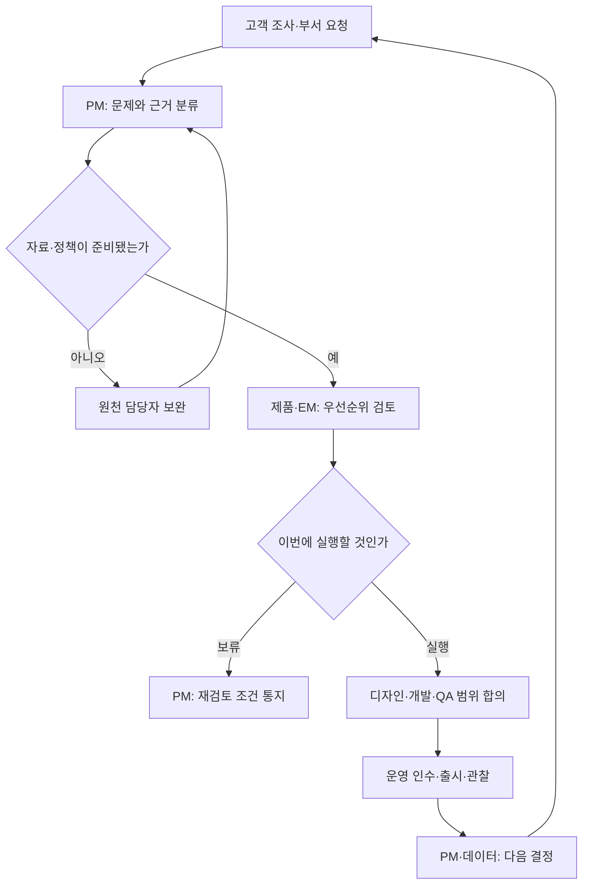
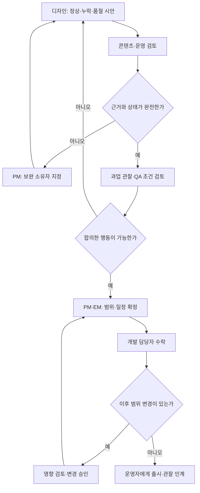

title: 시나리오: 이커머스 02 — 제품·디자인팀의 조사, 로드맵과 출시 운영
slug: scenario-modeline-02-product-planning
category: 시나리오
tags: modeline,harness-engineering,product-management,requirements,ecommerce
summary: 고객 조사와 VOC부터 요구 접수, 우선순위, UX·디자인, 개발 인계와 출시 후 효과 검토까지 제품·디자인팀의 일·주·월·분기·연간 운영과 KPI를 설명한다.
toc: true
nextSlug: scenario-modeline-03-development-harness
prevSlug: scenario-ecommerce-harness-engineering
publishedAt: 2026-09-12T14:31:59.970559+09:00
syncHash: 88d0ed1074ae9a2b4d10247d58622fafe80dd9d19ca0dcf26a84c33be3a2aeef

updatedAt: 2026-09-15T10:05:40.807059Z
---

[시리즈 종합편과 전체 목차](/102/scenario-modeline-17-company-overview)

> 모드라인은 직원 80명, 제품·디자인 6명, 개발 15명의 가상 의류몰이다. 인물·업무 자료·일정은 창작이며 아래 지표는 이 회사의 내부 운영 정의다. 대표 상품과 요청 사례를 통해 부서의 반복 업무를 설명한다.

월요일 아침 PM 이지은의 요청함에는 실측표, 품절 안내, 기획전 배너가 함께 들어온다. 요청한 사람마다 급한 이유가 있지만 개발팀에 모두 넘기면 고객 문제보다 회의 순서가 작업 순서를 정한다. 지은은 이번 주에 무엇을 만들지 정하기 전에 누가 어떤 상황에서 막혔는지, 자료와 정책을 누가 확정해야 하는지부터 펼친다.

PM은 고객 문제와 제품의 개선 순서를 책임지는 역할이다. UX는 고객이 상품을 찾고 비교하고 구매하는 전체 사용 경험을 뜻한다. 제품·디자인팀의 일은 화면 시안을 전달하는 데서 끝나지 않는다. 조사한 문제를 실행 가능한 범위로 바꾸고, 출시한 결과를 다시 조사와 계획에 돌려보내는 일까지 포함한다.

## 제품팀은 문제와 범위를 책임지고 원천 정책은 담당 부서와 정한다

6명이 모든 전문 역할을 한 사람씩 전담한다는 설정은 아니다. 지은을 중심으로 조사·기획·디자인 업무를 나누고, 한 사람이 조사와 설계를 함께 맡더라도 작성자와 검토자를 표시한다. 분기 계획에는 프로젝트뿐 아니라 반복 조사, 디자인 규칙 관리, 출시 후 점검에 쓸 시간도 넣는다.

| 책임 영역 | 제품·디자인이 남길 결과 | 함께 결정할 사람 |
|---|---|---|
| 고객 조사·VOC | 고객 맥락, 문제 근거, 확인되지 않은 가설 | CX 수진이 상담 맥락과 분류 확인 |
| 요구 접수·우선순위 | 문제별 카드, 선택 이유, 보류 조건 | EM이 개발·QA 여력 확인 |
| UX·디자인 | 여정, 상태별 화면, 문구·조작 규칙 | 콘텐츠 소연이 실측과 설명 원천 확인 |
| 로드맵·범위 조정 | 이번/다음/탐색 단계, 의존 일정, 변경 이력 | CTO 태준이 기술 자원 조정 |
| 출시·효과 검토 | 인수 조건, 운영 안내, 관찰 결과와 다음 결정 | QA 은서·데이터 민아·운영 민수 |

VOC는 고객이 남긴 문의와 불만, 제안이다. 문의가 많다는 사실만으로 전체 고객에게 가장 큰 문제라고 확정하지 않는다. 상담을 하지 않고 이탈한 고객도 있고, 같은 고객이 같은 문제로 여러 번 연락한 경우도 있다. 제품팀은 중복을 묶되 원 제보 연결을 남기고 행동 자료와 조사로 해석을 보완한다.

가격과 할인 적용 조건은 MD·그로스·판매운영의 책임자와 확정한다. 제품팀이 새 가격 정책을 화면 안에서 만들어 내지 않는다. 공급사 귀책, 환불 승인, 매출 확정 역시 각 업무 소유자의 결정이다. 부서 간 우선순위가 승인된 예산이나 사업 목표를 바꾸는 수준이면 지은과 태준이 대안을 정리해 경영 판단으로 넘긴다.

## 고객 조사는 질문을 만들고 실제 행동으로 확인한다

조사는 새 기능 요청이 없어도 계속한다. 지은은 구매 전 탐색, 사이즈 비교, 결제, 배송 확인, 교환·반품으로 여정을 나누고 각 단계의 근거를 모은다. 상담 분류, 검색 결과 없음, 화면 이탈, 반품 사유는 같은 현상을 다른 위치에서 본 자료다. 집계 기간과 고객 집단을 맞추지 않으면 서로 원인을 설명하는 것처럼 보이기 쉽다.

조사 요청에는 결정할 질문을 한 문장으로 적는다. 대표 셔츠 `P-F26-017`에서는 “고객이 사이즈별 차이를 선택 순간에 확인할 수 있는가”가 질문이다. 이미 사고 싶은 답을 제시하는 “새 실측 기능이 있으면 좋겠는가”를 먼저 묻지 않는다. 현재 화면에서 색상과 사이즈를 고르게 하고, 어디서 멈추며 어떤 정보를 찾는지 관찰한다.

참여자는 구매 경험·사용 기기·사이즈 비교 경험이 다른 집단에서 목적에 맞게 모집한다. 승인된 조사 동의와 자료 보관 범위를 확인하고, 기록에는 관찰 사실과 담당자의 해석을 나눈다. 소수 면담에서 반복된 문제는 다음 검증 후보가 되지만 그 빈도를 회사 전체 비율로 쓰지 않는다.

| 조사 자료 | 담당자가 읽는 방법 | 다음 산출물 |
|---|---|---|
| 비식별 상담 사례 | 같은 고객·같은 문제의 반복 연락을 연결 | 문제 묶음과 원문 근거 위치 |
| 현재 화면 관찰 | 질문에 대한 답보다 실제 선택·되돌아감을 기록 | 과업별 막힌 단계와 사용성 가설 |
| 상품·실측 자료 | 사이즈별 자료, 측정 위치, 누락을 구분 | 콘텐츠 보완 요청 또는 화면 변경 |
| 행동 분석 | 노출·선택·구매의 집단과 관찰 창을 일치 | 추가 조사 대상과 검증 계획 |

수진이 전한 “M과 S의 차이를 모르겠다”는 가상 문의에는 여러 대안이 있다. 실측 자료 자체가 없으면 콘텐츠 확보가 먼저다. 자료는 있지만 고객이 찾지 못하면 정보 배치가 후보가 된다. 체형에 맞는 추천을 기대한 문제라면 지금 있는 치수표만으로 답할 수 없는 범위가 남는다. 이 구분을 해야 개발하지 않고 해결할 일도 보인다.

## 요청은 준비 상태를 확인한 뒤 로드맵에 넣는다

지은은 요청을 문제별로 묶고 고객 영향, 발생 근거, 사업상 시점, 불확실성, 필요한 작업과 다른 부서의 선행 일을 적는다. 장애나 거래 오류처럼 즉시 대응할 일은 개발·운영 대응으로 연결하고, 새로운 개선은 비교 가능한 카드로 검토한다. 중요한 고객 피해를 단순한 요청 건수 점수에서 밀어내지 않는다.

`PLAN-F26-SHIRT`와 `CMP-F26-WORK`는 가을 판매의 맥락을 제공한다. 캠페인이 열린다는 이유만으로 준비되지 않은 변경의 출시를 약속하지는 않는다. 로드맵은 이번에 실행할 일, 다음으로 준비할 일, 근거를 더 모을 일을 구분한 계획이다. 확정한 날짜와 조사 결과에 따라 달라지는 전망을 같은 색의 일정으로 표시하지 않는다.

자료 대기는 거절과 다르다. 소연이 실측 근거를 가져오면 재검토할 수 있는 카드에는 필요한 자료와 답할 사람을 적는다. 보류 카드도 요청자에게 이유를 알려야 같은 요청이 다른 채널에서 다시 들어오지 않는다. 출시 뒤의 효과 검토까지 제품팀이 추적하며, 기능을 개발팀에 넘겼다는 이유로 순환을 닫지 않는다.

기존 가상 요청 회의에서는 원 요청 12건에서 중복 제보 4건을 묶어 검토 대상 8건을 만들었다. 준비 완료는 3건, 정책·자료 대기는 5건이다. 아래 세 행은 8건 전체 목록이 아니라 대표 카드다.

| 대표 카드 | 지금 확인한 근거 | 결정과 다음 책임자 |
|---|---|---|
| DEV-F26-012 | 실측 원천·빈값·화면 범위 합의 | 준비 완료, 개발 담당자가 계약 확인 |
| 할인 배너 | 중복 쿠폰 적용 조건이 미정 | 정책 대기, 유라가 가격 책임자와 확정 |
| 자동 사이즈 추천 | 수요 제보는 있으나 평가 자료 부족 | 자료 대기, 민아가 검증 가능 범위 제안 |

준비 완료 3건이 이번 주 착수 3건을 뜻하지도 않는다. EM은 진행 중 작업과 리뷰·QA 대기를 먼저 확인한다. 지은은 새 일을 더 넣는 대안과 기존 일을 끝내는 대안을 비교하고 선택을 요청자에게 돌려준다. 정책 답변을 기다리는 시간을 구현자의 개발 시간으로 기록하지 않는다.

## 디자인은 정상 화면과 실패한 상태를 함께 인계한다

DEV-F26-012의 대안은 상세 하단에 표를 추가하는 안, 사이즈 선택 영역에 실측을 연결하는 안, 대화형 사이즈 상담을 만드는 안이었다. 지은은 두 번째를 선택한다. 고객이 선택하는 위치에 근거를 놓을 수 있고 기존 자료로 검증 가능하기 때문이다. 첫 번째는 찾기 어려운 문제가 남고, 세 번째는 자료·정확성 검증과 운영 범위가 커진다.

디자이너는 먼저 현재 여정과 변경 후 여정을 나란히 그린다. 그다음 작은 화면에서도 색상·사이즈·가격·실측의 관계가 보이는지 확인한다. 선택 전, 선택 후, 품절, 실측 없음, 조회 실패, 구매 직전 재고 변경을 각각 설계한다. 화면 한 장이 완성돼도 이 상태들이 비어 있으면 개발 준비 완료로 넘기지 않는다.

| 인계 계약 | DEV-F26-012에서 정한 내용 |
|---|---|
| 대상·원천 | 상품 상세 선택 영역, 승인된 사이즈 실측과 SKU 판매 상태 |
| 정상 행동 | 색상·사이즈 선택에 맞춰 해당 실측과 선택 상태 표시 |
| 자료 없음 | 추정치를 채우지 않고 미등록 안내 |
| 판매 상태 변화 | 구매 직전 재확인, 실패하면 선택 유지와 재선택 안내 |
| 조작·문구 | 키보드 초점, 선택 상태와 품절 이유를 확인 가능 |
| 제외 범위 | 체형 추정, 할인 정책 변경, 주문 상태 개편 |
| 복귀·관찰 | 기존 화면으로 복귀할 조건, 실측 이용과 문의 관찰 정의 |

네이비 S 품절은 디자인·QA용으로 준비한 상태이며 대표 상품 첫 입고 장부를 바꾼 사실이 아니다. 판매가능 네이비 M, 실측 누락, 화면 조회 후 재고 소진 등 서로 다른 시험 상태를 만든다. 색상만으로 품절 여부를 전달하거나 초점이 사라지는 문제도 사용성 검토에 포함한다.

키보드 사용자가 현재 초점을 볼 수 있어야 한다는 원칙은 W3C의 Focus Visible 설명과 연결한다. 이 한 항목의 확인을 전체 접근성 준수 인증으로 확대하지 않는다. [W3C의 키보드 초점 기준 설명](https://www.w3.org/WAI/WCAG22/Understanding/focus-visible.html)

개발 인계의 끝은 지은의 전송 버튼이 아니다. 담당 개발자가 문서 버전과 상태별 디자인, 인수 조건을 열어 보고 접수를 확인한 시점이다. 요청자는 보완 중인지 개발 대기인지 알 수 있어야 한다. 개발 중 변경이 생기면 변경 전 범위를 덮지 않고 이유와 영향, 동의한 사람을 남긴다.

유라가 같은 위치에 할인 배너도 넣자고 제안하면 할인 정책, 디자인 충돌, 검증량을 따로 검토한다. 기존 출시일 유지, 범위 추가 후 일정 변경, 별도 출시라는 선택지 중 하나를 정한다. 실측이 없는 사이즈를 미등록으로 보여 주는 안도 고객에게 설명 가능하고 합의한 품질을 충족할 때만 채택한다.

## 하루의 인계와 주간의 선택을 다른 산출물로 남긴다

제품팀의 아침은 전사 운영표를 함께 읽되 모든 거래 예외 회의에 참석하는 방식은 아니다. 고객 영향이 있는 항목을 받아 문제 카드에 연결하고, 실제 장애 처리는 담당 개발·운영팀이 계속 맡는다. 오후 2시 출고 마감도 제품팀의 출시 마감으로 해석하지 않는다.

| 시점 | 입력과 담당자의 판단 | 남길 결과·다음 수신자 |
|---|---|---|
| 매일 09시 | 지은이 야간 VOC·장애·미완료를 읽고 긴급 대응과 개선을 구분 | 운영 담당자에게 영향 전달, 제품 카드 갱신 |
| 매일 10시 | 판매 준비 중 문구·실측·화면 불일치를 소연·민수와 확인 | 판매 전 수정 또는 보류 조건 |
| 업무시간 | 디자이너 조사·시안, PM 정책 답변, 개발 재질문 검토 | 문서 버전, 결정 근거, 다음 검토 대상 |
| 매일 14시 전후 | 출고·CS에서 드러난 화면 안내의 문제를 수집 | 물류 마감 지연 설명과 제품 개선을 분리 |
| 매일 17시 | 자료 대기·검토 대기의 책임자와 다음 확인일 점검 | 다음 날 인계표, 요청자 진행 안내 |

주간에는 문제의 순서와 팀의 여력을 함께 본다. 지은은 요청 카드, 디자이너는 검토 가능한 시안, EM은 남은 구현·QA 여력을 가져온다. 새 기능 수보다 이번 주 끝낼 검토와 다음 주 시작에 필요한 답을 정한다. 금요일에는 한 번 준비 완료였지만 다시 열린 요청의 이유를 읽는다.

월간에는 출시 목록과 고객 결과를 연결한다. 결과가 아직 관찰 중인 기능은 미확정으로 남기고, 데이터 누락은 성과 없음과 구분한다. 문의 감소를 기대한 실측 개선이 실제로 이용되지 않는다면 문구와 배치부터 재검토한다. 이용은 늘었는데 문의가 유지된다면 실측 자체의 설명이나 고객이 해결하려던 문제가 달랐는지 조사한다.

| 주기 | 검토 입력 | 결정·산출물 |
|---|---|---|
| 매주 | 요청·조사 결과, 정책 대기, 디자인·개발·QA 적체 | 착수 순서·보완 담당자·출시 범위 변경 |
| 매월 | 출시별 관찰표, VOC, 결과·품질 지표, 미확정 자료 | 유지·수정·종료 목록과 경영 보고 |
| 분기·시즌 전후 | 고객 여정의 빈틈, 시즌 일정, 개발·콘텐츠 여력 | 분기 로드맵·조사 계획·의존 일정 |
| 매년 | 연간 고객 가정, 누적 결과, 디자인 유지 비용, 인력 전망 | 다음 해 제품 목표·역량·예산 제안 |

## 연간 계획은 시즌 판매보다 앞서 준비하고 관찰 결과로 고친다

전년도 10~12월에는 경영의 고객·상품·채널 가정을 받아 다음 해 어떤 고객 문제에 투자할지 제안한다. 기능 목록을 예산으로 환산하기 전에 개선할 여정, 필요한 조사, 개발 의존성, 유지 업무를 묶는다. 이미 준비된 봄 상품을 다음 해 기획과 혼동하지 않고 판매 일정별 선행 작업을 적는다.

1~3월에는 전년 결과와 관찰이 끝난 출시를 확인하고 승인된 계획을 실행한다. 4~6월에는 여름 운영에서 드러난 문제와 상반기 결과로 가을 준비를 조정한다. 7~9월에는 이번 셔츠 사례처럼 가을 콘텐츠·캠페인·화면의 준비 여부를 맞추고, 피크 시점에 큰 변경을 감당할 여력도 검토한다.

10~12월에는 가을·겨울의 고객 반응과 반품 관찰을 다음 해 질문으로 되돌린다. 특정 출시의 클릭 증가를 연간 사업 성공으로 치환하지 않는다. 월간 보고가 재무 확정 범위와 경영 우선순위 검토를 거친 뒤 주간 배정으로 내려오도록 같은 결정 ID와 자료 버전을 연결한다.

## KPI는 준비 품질과 고객 결과를 함께 읽는다

아래는 내부 KPI 사전이다. 비율은 모두 분자÷분모×100이며 집계 시간은 한국 시간이다. 중복 제보는 원 요청을 보존한 채 문제 카드 단위로 묶고 테스트·직원 트래픽은 제외한다. 목표치는 기준선 확인 후 합의하며 개인 성과를 이 표 하나로 평가하지 않는다.

분모·누락·잠정치 표시는 [시리즈 공통 해석 규칙](/96/scenario-modeline-17-company-overview#지표의-공통-해석-규칙을-먼저-맞춘다)을 따른다.

### 지표의 계산 기준을 한눈에 본다

| 지표·단위 | 계산·관찰 기준 | 원천·책임·검토 주기 |
|---|---|---|
| 준비 소요 시간 | 이번 주 개발이 준비 완료로 수락한 카드별 수락 시각−최초 문제 접수 시각의 중앙값·p90 | 요청 상태 이력 / 지은 / 매주 |
| 준비 재개방률 | 같은 수락 주간 집단 중 14일 안에 정책·자료 누락으로 준비 대기로 돌아간 카드÷수락 카드 | 변경 사유·수락 기록 / 지은·EM / 14일 후 주간 |
| 사용자 과업 성공률 | 정한 화면 버전에서 도움 없이 실측 확인과 사이즈 선택을 마친 관찰 회차÷실행한 관찰 회차 | 조사 기록·버전 / 디자인 담당 / 조사 종료·월간 |
| 실측 이용률 | 상세 조회 뒤 같은 방문에서 실측을 실제 연 방문 수÷실측 영역을 제공한 적격 상세 방문 수 | 상세·실측 이벤트 / 민아·지은 / 주간 |
| 사이즈 문의 발생률 | 상세 방문 후 7일 미만 내 같은 상품 사이즈 문의가 연결된 방문자 수÷적격 상세 방문자 수 | 승인된 연결키·VOC / 수진·민아 / 7일 관찰 후 월간 |
| 효과 검토 이행률 | 월내 검토 예정 출시 중 기한 안에 결과·한계·다음 결정을 기록한 수÷그달 검토 예정 출시 수 | 출시·관찰 등록부 / 지은 / 월간 |

### 수치를 해석하고 다음 행동으로 연결한다

준비 소요 시간에는 완료되지 않은 카드가 빠지는 한계가 있다. 그래서 매주 금요일의 준비 대기 잔량과 가장 오래된 대기 일수를 함께 적는다. 실측 이용률의 방문은 비활동 30분이면 새 방문으로 나누는 내부 정의이며, 한 방문에 여러 상세가 있어도 적격 방문과 이용 방문은 각각 한 번 센다.

문의 발생률의 방문자는 해당 주의 첫 적격 상세 방문으로 집단을 고정하고 같은 상품 문의를 한 번 센다. 고객 연결에 적격한 자료만 쓰며 연결 불가 비중을 함께 보고한다. 이용률과 문의율은 같은 분모가 아니고, 두 수치를 빼서 개선 효과를 계산하지 않는다.

| 지표 | 해석할 때 주의할 점 | 다음 행동 |
|---|---|---|
| 준비 소요 시간 | 작은 요청만 수락해 시간을 낮출 수 있으므로 대기 잔량·업무 크기 병기 | 가장 오래된 정책 질문의 결정자를 지정 |
| 준비 재개방률 | 새 시장 상황에 따른 정당한 범위 변경은 별도 분류 | 누락된 정책·데이터·디자인 상태를 인계 양식에 보완 |
| 과업 성공률 | 소수 조사 비율을 전체 고객 비율로 일반화하지 않음 | 실패 장면 재관찰, 문구·정보 순서를 다시 검토 |
| 실측 이용률 | 영역 자동 펼침을 자발적 이용으로 세지 않음 | 노출·조작 계측 확인 뒤 발견 가능성 조사 |
| 문의 발생률 | 상담 진입을 어렵게 해 수치를 낮추지 않음; 유입·상품 구성 변화 병기 | 문의 원인과 콘텐츠 근거를 수진·소연과 검토 |
| 효과 검토 이행률 | 미관찰을 성공으로 결론 낸 문서는 완료 불인정 | 관찰 연장 이유·새 검토일·담당자를 기록 |

요청 8건 중 준비 완료 3건이라는 가상 자료로 준비 소요 시간이나 재개방률을 계산할 수는 없다. 접수 시각과 후속 14일 이력이 없기 때문이다. 이 회의 자료가 알려 주는 것은 현재 준비 3·대기 5라는 재고형 현황이다. 지표를 만들 때 필요한 기록부터 확보한다.

## 출시 후 결정이 다음 요청자의 업무를 바꿔야 한다

출시 전 지은은 기능 범위뿐 아니라 CX 안내, 콘텐츠 원천, 운영 복귀 조건, 관찰 담당자가 준비됐는지 확인한다. QA의 행동 검사와 PM의 사용성 확인을 통과해도 고객 효과는 아직 모른다. 출시 기록에는 노출 범위와 관찰 시작·종료 조건을 남겨 다른 캠페인 변경과 구분한다.

월간 검토에서 DEV-F26-012의 결과가 충분하지 않다면 “효과 없음”으로 닫지 않는다. 계측 누락인지 표본 부족인지, 고객이 기능을 못 찾는지 구분해 다음 행동을 지정한다. 반대로 상담에서 실측 원천의 혼란이 확인됐다면 소연의 콘텐츠 보완과 지은의 화면 개선을 별도 카드로 연결한다.

제품팀이 넘기는 최종 묶음은 요청 ID, 근거·디자인·정책 버전, 인수 조건, 제외 범위, 관찰 계획과 담당자다. 개발팀은 이 계약으로 구현을 시작하고, CX는 어떤 안내가 달라지는지 읽으며, 데이터 담당자는 무엇을 비교할지 알 수 있다. 인계받은 팀의 질문이 해소되고 접수가 기록돼야 제품팀의 준비 업무가 끝난다.

## 개발·AI 활용은 업무 운영과 구분해 설계한다

### 시스템은 결정의 버전과 실제 수락을 보존한다

요청함에는 문제 카드와 원 제보의 다대일 연결, 상태 변경 시각, 자료 소유자, 수락자, 보류 사유를 둔다. 디자인·정책·이벤트 정의는 버전으로 묶고 개발 요청 `DEV-F26-012`와 실행 작업 `H-F26-012`를 연결한다. 요청을 보냈다고 개발 시작 시각을 자동 채우지 않는다.

행동 계측은 상세 조회, 실측 실제 열기, 선택, 구매 결과를 분리한다. 승인된 고객 연결 범위와 보관 기간을 지표 계약에 적고, 상담 원문을 제품 분석 도구에 통째로 복제하지 않는다. 기능을 켜고 끄는 플래그는 출시 제어를 돕지만 실제 주문 상태를 되돌리는 도구가 아니다.

### AI는 근거가 붙은 초안과 미답 질문을 만든다

입력은 비식별 문의, 승인된 상품 자료, 디자인 규칙, 회의 기록이다. 지정 문서 조회와 초안 저장만 허용하고 우선순위 확정·운영 수정 권한은 주지 않는다. 출력은 문제 묶음, 인수 조건 후보, 근거 위치, 미답 질문이다. 지은과 원천 담당자가 사실·해석·제안을 나눠 검토한다.

실측이 없을 때 평균값을 만들어 내거나 문의 사례에서 고객 비율을 추정한 결과는 반려한다. 삭제된 SKU를 이전 화면에서 선택하는 상황처럼 빠진 질문은 담당자가 채택 여부를 결정한다. 초기 내부 실험은 요청 한 건의 초안 1회와 검토 후 수정 1회로 제한하고, 남은 정책 질문은 사람에게 돌린다.

### 준비 자동화의 효과와 고객 문제 적중 여부는 따로 검증한다

문서 생성 시간이 줄어도 정책 답변이나 조사 품질이 개선됐다고 말할 수 없다. 채택된 요청당 검토·재작업 시간과 운영 비용을 함께 측정한다. 별도 기술 심화에서는 요청 상태 이력으로 대기 시간을 계산하는 방법, 디자인 버전과 인수 검사 연결, 행동 이벤트의 중복 제거를 다룰 수 있다. 현재 글은 그 시스템이 구현됐거나 문의 감소가 측정됐다는 증거가 아니다.
