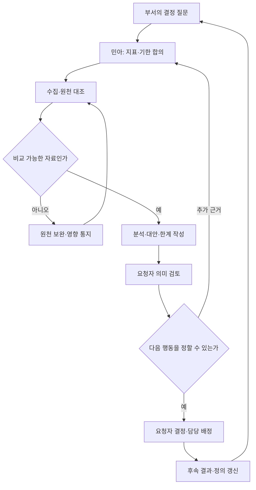
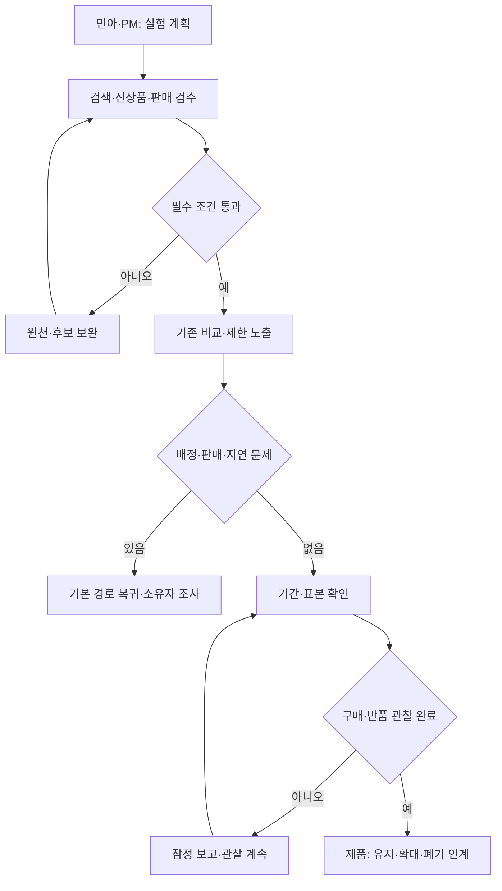

title: 시나리오: 이커머스 04 — 데이터팀의 분석, 검색·추천과 실험 운영
slug: scenario-modeline-04-search-recommendation
category: 시나리오
tags: modeline,recommendation,search,data-engineering,harness-engineering
summary: 데이터 수집·품질과 지표 계약부터 분석 요청, 신상품 검색 검수, 추천 실험, 접근 관리까지 데이터 담당자의 반복 업무를 설명한다. 운영 KPI와 시스템·AI 구현은 구분한다.
toc: true
nextSlug: scenario-modeline-05-orders-payments
prevSlug: scenario-modeline-03-development-harness
publishedAt: 2026-09-12T14:32:00.799242+09:00
syncHash: 6460400c0669e64147bbb35c9633f269354988db19142b35be600a91dbeb25ef

---

[시리즈 종합편과 전체 목차](/96/scenario-modeline-17-company-overview)

> 직원 80명인 가상 의류몰 모드라인의 데이터 업무다. 데이터·추천 담당 2명은 개발 15명에 포함된다. 상품·검수 자료와 운영 규칙은 창작이며 검색 개선이나 실험 성과를 실제로 측정한 기록이 아니다.

아침에 데이터 담당 서민아에게 “검색이 이상하다”는 문의와 “이번 광고가 더 잘됐는지 알려 달라”는 요청이 함께 들어온다. 신상품 자료에는 발주 600장도 적혀 있다. 민아는 바로 순위를 바꾸거나 성과 표를 만들지 않는다. 어떤 고객 조건에서 무엇이 달랐는지, 같은 시점과 단위의 자료인지부터 확인한다.

데이터 담당자의 일은 숫자를 뽑는 것에서 끝나지 않는다. 자료가 제때 정확히 들어오는지 확인하고, 지표 의미를 합의하고, 질문에 맞는 분석을 수행하며, 검색·추천 변경의 효과와 위험을 검증한다. 분석 결과를 받은 사람이 다음 결정을 할 수 있어야 인계가 끝난다.

## 데이터팀은 원천 사실과 판단에 쓰는 사본을 구분한다

상품은 디자인을 묶는 단위이고 SKU는 색상·사이즈별로 재고를 세는 단위다. `P-F26-017`은 네이비·아이보리와 S·M·L로 SKU 여섯 개를 가진다. 검색 색인은 상품을 찾기 쉽게 가공한 조회용 목록이다. 발주 장부나 실제 판매가능 재고를 대신하는 원장은 아니다.

민아는 원천 자료를 고칠 권한과 분석 자료를 만들 권한을 나눈다. 콘텐츠의 면 함량·실측 근거는 소연, 판매 상태와 실물 차이는 민수, 가격 조건은 해당 정책 책임자, 결제·환불 사실은 커머스와 재무가 확인한다. 데이터팀은 누락·불일치를 발견하고 재현 자료를 넘기되 담당자의 승인 없이 그 사실을 바꾸지 않는다.

| 업무 | 데이터 담당자의 산출물 | 다음 책임자 |
|---|---|---|
| 수집·품질 관리 | 누락·중복·지연·불일치 목록과 영향 범위 | 원천 서비스 담당자가 수정·재전달 |
| 지표 정의 | 단위·분모·기간·제외·버전이 있는 사전 | PM·그로스·재무가 업무 의미 확인 |
| 분석 요청 | 질문·자료·방법·한계·다음 행동 보고 | 요청자가 실제 사업 결정을 기록 |
| 검색·추천 | 후보·순서·제외 사유·검수 결과·운영 버전 | 제품·MD·운영이 사용자·판매 조건 검토 |
| 실험 | 배정·주요 지표·품질 경계·종료 기준 | 제품 책임자가 유지·확대·중단 판단 |
| 접근 관리 | 목적·범위·만료가 있는 데이터 이용 승인 기록 | 데이터 소유자 승인, 플랫폼 권한 반영 |

데이터팀은 광고 예산이나 재주문을 최종 승인하지 않는다. 같은 표가 다른 결정을 지지할 수 있으므로 보고서에는 선택지와 불확실성을 적는다. 업무 요청이 2명의 여력을 넘으면 민아와 EM이 장애·마감·실험·탐색 요청의 순서를 조정하고 요청자에게 완료 가능 범위를 알린다.

## 수집 자료의 품질을 확인해야 분석을 시작할 수 있다

09시 점검에서는 전날 원천 마감 시각, 수집 완료 여부, 중복 제거 결과, 연결되지 않은 ID를 본다. 주문 1건에 항목 2개가 있는 자료를 상품 표와 합친 뒤 결제액을 두 번 더하는 오류는 화면이 정상으로 보여도 생길 수 있다. 집계 전후 건수·금액·고유 키를 대조하는 이유다.

수집 완료는 작업이 종료됐다는 상태와 다르다. 원천의 대상 기간이 모두 들어왔는지, 늦게 온 환불이나 상품 수정이 반영됐는지 확인한다. 일부 자료가 빠졌다면 영향받은 보고서에 잠정 표시를 하고 이미 받은 사람에게 알린다. 민아의 분석 파일만 조용히 고쳐 두지 않는다.

| 품질 점검 | 확인하는 근거 | 실패 때 처리 |
|---|---|---|
| 완전성 | 원천의 적격 고유 ID와 분석층 도착 ID 대조 | 빠진 범위 재수집, 영향 지표 잠정 표시 |
| 중복·연결 | 주문·항목·환불·노출의 고유 키와 연결 건수 | 중복 원인·고아 기록을 분리하고 재집계 |
| 최신성 | 원천 발생·수집·검색 반영 시각 | 지연 경로 소유자 지정, 오래된 정보 표시 |
| 의미·범위 | 가격 단위, 타임존, SKU·상품 구분, 허용 값 | 정의 확인 전 결론과 자동 반영 보류 |
| 접근·보존 | 승인 목적·만료·공유 범위 | 소유자 확인, 불필요한 사본·권한 정리 |

첫 입고 직후 셔츠는 발주 600장, 실물 596장, 보류 8장, 판매가능 588장이었다. 다음 날 판매 전 재검수·반송 이후에는 실물과 판매가능이 각각 594장이다. 이 두 시점의 표를 섞지 않는다. 검색에 필요한 것은 현재 옵션의 판매 조건이며, 어느 스냅샷도 이후 판매·예약·반품을 무시한 현재 재고가 아니다.

## 분석 요청은 결정할 질문과 기한을 먼저 받는다

“매출을 분석해 달라”는 요청만으로는 사용할 자료를 정할 수 없다. 민아는 결정할 일, 필요한 시점, 대상 고객·상품·채널, 비교안, 사용할 금액 정의를 되묻는다. 결제액, 환불 반영 결제액, PG 순현금, 회계 매출, 분석 기여는 서로 다른 값이다. 재무 마감이 끝나지 않은 자료를 확정 손익처럼 설명하지 않는다.

분석 작업을 수락하면 질문과 지표 계약을 기록하고 원천·집단을 고정한다. 먼저 데이터 품질과 기본 분포를 확인한 뒤 유입·상품·신규/기존 고객·기간으로 나누어 원인 후보를 찾는다. 집계 차이를 발견하면 정의를 정정하고 기존 보고서 수신자에게 수정 범위와 이유를 알린다.

분석 완료는 파일 전달과 같지 않다. 요청자가 어떤 집단과 한계의 결과인지 이해하고 다음 행동 또는 추가 검증을 기록해야 한다. 결정을 미루는 경우에도 필요한 증거와 재검토일을 남긴다. 원천 담당자가 자료를 고쳤다면 민아가 보고서의 재계산과 수신 확인을 계속 추적한다.

가을 캠페인 전의 별도 파일럿 `CMP-F26-WORK-PILOT`에서는 A·B 채널의 고객 구성이 달랐다. 신규 첫 결제 고객은 A 240명, B 80명이었으며, 이 자료는 대표 셔츠 두 주문을 확대한 실적이 아니다. 보고 `MKT-F26-W36`의 주문·환불 관찰 조건을 읽고 채널 차이를 인과 효과로 단정하지 않는다.

9편에서 계산한 분석 기여는 A −510,000원, B 32,000원이다. 이 값도 고정비·세무·현금 시점을 포함한 회사 손익이 아니다. 민아가 넘길 다음 일은 “B 예산 확대”라는 자동 결론이 아니라 고객 구성을 맞춘 실험의 대상·지표·위험 조건이다. 예산의 최종 판단은 그로스·재무·경영에 남긴다.

## 검색은 고객이 명시한 조건과 판매 가능성을 먼저 검수한다

검색 요청은 원문 검색어와 재현 시각, 조건, 결과 상품·옵션, 화면 위치를 받아 조사한다. 오탈자, 동의어, 검색 결과 없음, 맞지 않는 옵션, 품절 정보 지연을 한 가지 관련성 문제로 합치지 않는다. 관련성은 고객이 찾는 용도와 상품이 얼마나 맞는지의 판단이며 판매 조건 위반과 따로 본다.

민아는 신규 상품의 승인된 상품명·소재·사진·실측, SKU 연결, 가격·판매 상태를 확인한다. 구매 이력이 없는 신상품도 속성과 용도 근거로 검수 대상에 넣는다. 인기 순위만으로 신규 상품을 영원히 배제하거나, 신상품이라는 이유로 조건에 맞지 않는 상품을 밀어 넣지 않는다.

| 자료 | 확인할 책임자 | 검색·추천에 허용할 사용 |
|---|---|---|
| 상품명·소재·실측 | 소연·지민 | 승인된 설명·조건 근거 |
| 색상·사이즈·SKU 연결 | 상품 담당·민수 | 옵션 조건과 구매 가능 여부 |
| 가격·프로모션 | 정책 책임자 | 승인된 표시와 주문 견적 연결 |
| 노출·선택·결제·환불 | 계측·커머스·재무 | 정의된 평가와 관찰 |
| 상품의 분위기·용도 제안 | 소연·지민 | 검수 후 보조 분류, 사실 속성과 구분 |

“네이비 S 출근복”을 검색한 사람에게 아이보리 M을 보여 주었다면 이미지가 좋아도 옵션 조건을 만족하지 못한다. 용도는 담당자의 검수가 필요하지만 색상·사이즈 조건은 선택한 사실과 대조할 수 있다. 재고 갱신이 늦은 경우 판매 조건 위험으로 분류하고 구매 단계의 재확인과 운영 조치를 함께 확인한다.

기존 가상 자료는 검색어 2개에 각각 상위 3개를 고정한 검수다. 비교 시점의 판매 조건은 두 안 모두 별도로 통과했다고 가정한다. 아래 비율은 이 작은 검수 집합에서 담당자가 판단한 용도 적합성이다.

| 고정 검색어 | 기존 안 적합 결과 | 수정 안 적합 결과 |
|---|---:|---:|
| 네이비 S 출근복 | 1/3 | 2/3 |
| 아이보리 M 기본 셔츠 | 1/3 | 2/3 |
| 전체 고정 슬롯 | 2/6 | 4/6 |

최근 클릭을 많이 반영하던 안에 비해 명시 조건과 승인 속성을 우선한 수정안은 이 자료에서 적합 슬롯이 2개 늘었다. 실제 전환·반품 개선의 증거는 아니다. 지민이 용도 기준을 검토하고 민수가 옵션 판매 조건을 확인한 뒤, 오탈자·복합 조건·신규 상품·결과 없음이 포함된 더 넓은 검수 집합을 준비한다.

인계 자료는 검색어, 입력 상품 버전, 전후 후보 ID·순서, 적합 판단과 제외 사유다. 개발자는 재현하고, 콘텐츠팀은 빠진 속성을 보완하고, 제품팀은 고객에게 대안을 어떻게 보여 줄지 결정한다. 민아는 “추천이 좋아졌다”는 한 줄로 일을 닫지 않는다.

## 추천 변경과 실험은 중단 조건을 먼저 정한다

추천은 현재 상품·검색 의도·허용된 행동에 맞는 선택지를 제시하는 업무다. 처음 방문한 고객에게는 현재 의도와 비개인화 후보를 제공하고, 이력이 없다는 사실을 오류로 처리하지 않는다. 신상품과 기존 인기 상품을 함께 검수하며 구매 이력만으로 품질을 확정하지 않는다.

실험을 시작하기 전에는 대상, 배정 단위, 변경 버전, 주요 결과, 품질 경계, 관찰 기간, 필요한 표본과 중단 조건을 적는다. 한 고객이 여러 안을 오가면 비교가 오염될 수 있으므로 안정적인 배정이 가능한 범위를 정한다. 배정 불균형이나 누락이 있으면 효과를 계산하기 전에 원인을 확인한다.

고객에게 실제 노출하기 전 같은 입력으로 새 결과를 계산해 비교하는 단계를 둘 수 있다. 이때 고객이 새 결과를 보지 않았으므로 전환 효과를 주장할 수 없다. 제한 실험에서도 클릭 증가만 보고 확대하지 않고 오류·지연·조건 위반·환불 결과를 함께 확인한다.

반품 관찰이 아직 짧으면 잠정 지표를 별도로 낸다. 모드라인의 이 장에서는 배정 후 7일 미만 구매와 각 구매 후 30일 미만 반품을 내부 분석 창으로 사용한다. 법정 권리나 회사의 반품 접수 가능 기간을 뜻하지 않는다. 정한 기간이 끝나지 않은 고객을 반품 없음으로 확정하지 않는다.

## 매일의 품질 점검을 월간 결정과 연간 데이터 계획으로 연결한다

| 주기 | 입력·담당자의 판단 | 산출물·다음 수신자 |
|---|---|---|
| 매일 09시 | 수집 완료·원천 대사·노출 연결·색인 지연 확인 | 영향 지표와 원천 담당자 조치 목록 |
| 매일 10시 | 판매 준비 상품의 속성·옵션·승인 상태 검수 | 검색 반영 가능 목록, 콘텐츠·운영 보완 |
| 업무시간 | 분석 질문, 검수 실패, 실험 상태·접근 요청 | 분석 결과·검수 기록·접근 승인 근거 |
| 매일 14시 전후 | 출고·취소·환불 자료의 시점 차이 확인 | 거래 확정과 분석 잠정 자료 구분 |
| 매일 17시 | 미완료 수집·분석·실험의 다음 담당자 확인 | 재수집·재집계·관찰 인계 |
| 매주 | 요청 적체, 검색 실패 유형, 실험 품질·표본 | 작업 순서·콘텐츠 보완·실험 계속 여부 |
| 매월 | 지표 계약 변화, 성숙 집단 결과, 데이터 비용 | 부서별 결정 보고와 정의 변경 이력 |
| 분기·시즌 | 신규 상품·피크 수요·접근·원천 변경 | 검수 집합·데이터 계획·접근 재검토 |
| 매년 | 다음 해 고객·채널 가정, 보관·품질·인력 비용 | 수집 범위·기반 투자·폐기·역량 계획 |

전년도 10~12월에는 경영의 다음 해 질문을 받아 필요한 자료와 현재 없는 연결을 정리한다. 대시보드 수를 늘리는 계획보다 의사결정에 필요한 원천과 관리 비용을 제안한다. 수집 목적이 끝난 자료와 쓰지 않는 분석도 정리 대상에 넣는다.

1~3월에는 전년 결과와 결산 자료의 확정 범위를 확인하고 승인된 분석 계획을 실행한다. 4~6월에는 상반기 품질 문제와 가을 상품 속성 준비를 점검한다. 7~9월에는 파일럿 결과, 가을 상품 검수, 피크 수집·조회 여력을 확인한다. 10~12월에는 성숙한 시즌 결과와 미관찰 항목을 나누어 다음 해 계획에 반영한다.

월간 보고가 정정되면 민아는 바뀐 정의·자료 범위와 영향을 설명하고 요청자의 수신을 확인한다. 재무의 확정 범위가 늦게 바뀌었다면 지난 분석을 새 원장에 맞춰 조정하되 원 보고서도 보존한다. 날짜가 다른 자료를 하나의 월말 성과처럼 덮어쓰지 않는다.

## KPI는 자료 품질과 검색 결과와 고객 영향을 나눠 정의한다

아래 비율은 분자÷분모×100으로 계산하는 내부 정의다. 한국 시간으로 집계하고 테스트·봇·직원 자료는 사전 규칙으로 제외한다. 원천 시스템 시계와 수집 시계의 기준도 확인한다.

분모·누락·잠정치 표시는 [시리즈 공통 해석 규칙](/96/scenario-modeline-17-company-overview#지표의-공통-해석-규칙을-먼저-맞춘다)을 따른다.

### 지표의 계산 기준을 한눈에 본다

| 지표·단위 | 계산·관찰 기준 | 원천·책임·검토 주기 |
|---|---|---|
| 원천 도착 완전율 | 전일 발생한 적격 고유 원천 ID 중 다음 날 09시까지 분석층에서 검증된 ID 수÷원천 대상 ID 수 | 원천 마감·수집 이력 / 민아 / 매일 |
| 검색 반영 지연 | 전일 검색 반영 대상 변경별 반영 확인 시각−승인 원천 변경 시각의 p95 | 상품 변경·색인 검수 / 민아 / 매일·주간 |
| 빈 검색 비율 | 적격 검색 요청 중 판매 조건 적용 후 결과가 0개인 요청 수÷전체 적격 검색 요청 수 | 검색 요청·결과 로그 / 민아·지은 / 매일·주간 |
| 고정 검수 P@3 | 고정 검색어별 상위 3슬롯 중 적합 슬롯 합÷(검색어 수×3)×100 | 버전별 후보·판정표 / 민아·MD / 변경 전·월간 |
| 클릭의 노출 연결률 | 적격 고유 클릭 중 같은 요청·상품·위치의 선행 노출에 연결된 수÷적격 고유 클릭 수 | 노출·클릭 이벤트 / 민아 / 매일 |
| 실험 7일 구매 전환율 | 배정 후 7일 미만 내 결제 성공한 적격 배정 사용자 수÷해당 안 적격 배정 사용자 수 | 배정·결제·연결키 / 민아·지은 / 7일 후 주간 |
| 실험 구매 집단 30일 반품률 | 배정 후 7일 미만 구매 주문 중 구매 후 30일 미만 내 반품 접수한 주문 수÷같은 구매 주문 수 | 실험·주문·CX 접수 / 민아·수진 / 성숙 후 월간 |

### 수치를 해석하고 다음 행동으로 연결한다

완전율의 원천 대상 목록은 다음 날 09시에 기준을 고정하고 늦게 발견된 원천은 정정 이력으로 남긴다. 그 목록 자체의 누락을 이 비율이 잡아 주지는 않는다. 검색 반영 지연에는 아직 반영되지 않은 변경이 빠지므로 미반영 수와 가장 오래된 나이를 병기한다. 한 상품의 이전 변경을 최신 변경으로 합쳐 처리했다면 그 대응 관계도 기록한다.

P@3의 분모는 괄호를 붙여 `검색어 수 × 3`으로 계산한다. 3개보다 결과가 적으면 빈 슬롯을 부적합으로 세며, 판매 조건 위반은 관련성 평균과 별도로 중단 사유가 된다. 클릭의 노출 연결은 같은 요청·상품·위치와 30분 미만의 선행 노출을 사용하는 내부 규칙이며 누락 노출을 클릭에서 역으로 만들어 채우지 않는다.

실험 집단은 최초 적격 배정으로 고정하고 탈락·오류가 난 고객을 결과가 나쁘다는 이유로 분모에서 빼지 않는다. 전환은 사용자 단위, 반품은 주문 단위다. 반품 분모는 모든 대상 주문의 30일 창이 지난 집단만 확정하며 교환 접수는 별도로 본다. 주문 A의 교환과 B의 반품을 같은 사건으로 세지 않는다.

| 지표 | 해석할 때 주의할 점 | 다음 행동 |
|---|---|---|
| 원천 도착 완전율 | 원천 목록의 확정·정정 시각 병기 | 누락 범위 재수집, 영향 보고서 수신자 통지 |
| 검색 반영 지연 | 평균으로 오래된 누락을 숨기지 않음 | 원천 전달·반영·검수 중 막힌 단계 조사 |
| 빈 검색 비율 | 무관한 상품을 넣어 0개 결과를 숨기지 않음 | 실제 수요 없음·속성 부족·조건 오류를 구분 |
| 고정 검수 P@3 | 작은 고정 집합의 과적합 감시, 판정 기준·버전 보존 | 실패 검색어 유형을 늘려 재검수 |
| 노출 연결률 | 연결 가능한 클릭만 골라 분모를 줄이지 않음 | 계측 누락·순서·중복 조사, 실험 보고 보류 |
| 실험 구매 전환율 | 배정·기기·동시 캠페인과 불확실성 확인 | 실험 품질 조사 후 유지·중단·추가 표본 결정 |
| 30일 반품률 | 아직 어린 주문 제외와 잔량 표시, 사유·교환 병기 | 사이즈·품질·설명 원천을 CX·MD와 검토 |

고정 검수의 2/6과 4/6은 각각 약 33.3%와 66.7%다. 검색어가 두 개뿐인 이 결과로 실험 전환 목표를 만들 수는 없다. 완전율이 높아도 이벤트 의미가 틀릴 수 있고 전환이 높아도 부적합 상품의 반품이 늘 수 있다. 지표 하나로 자동 확대하거나 담당자를 평가하지 않는다.

## 접근 요청도 분석 요청처럼 목적과 만료를 확인한다

신규 분석자는 요청 질문에 필요한 최소 자료를 신청한다. 민아는 집계로 충분한지, 고객 연결이 필요한지, 원문 접근이 필요한지 검토하고 데이터 소유자의 승인 범위를 기록한다. 플랫폼은 실제 권한을 부여하고 조회 이력과 만료를 관리한다.

다른 목적의 요청이 생기면 이전 승인을 그대로 확장하지 않는다. 퇴사·직무 변경은 피플의 확정 시점과 연결하고, 프로젝트 종료 시 데이터 사본과 공유 대상도 확인한다. 법적 보존·동의 해석은 확인된 회사 기준과 전문가 판단을 따르며 이 글에서 법정 기간을 만들지 않는다.

운영 문의 대응에 필요한 사실은 마스킹된 조회로 제공하고, 고객 상담 원문 전체를 공통 분석 로그에 복사하지 않는다. 자료를 많이 보유하는 것보다 누가 어떤 결정에 쓰고 언제 정리하는지 설명할 수 있어야 한다.

## 개발·AI 활용은 업무 운영과 구분해 설계한다

### 수집·분석·검색의 버전을 연결한다

시스템에는 발생 시각·수집 시각·원천 버전·고유 이벤트 ID를 구분해 저장한다. 중복 제거와 주문·항목·환불 연결을 재현할 수 있게 하고, 늦게 도착한 자료의 재집계 범위를 남긴다. 검색 반영에서는 이전 상품 버전이 늦게 도착해 최신 내용을 덮지 못하도록 검사한다.

추천 구현은 후보 생성, 점수 계산, 재정렬로 나눌 수 있다. Google의 공식 입문 문서도 이 세 단계 구조를 설명한다. 모드라인에서는 마지막 표시 전 명시 조건·판매 상태·중복을 검토하고 조회용 색인이 거래 재고를 보장하는 것으로 취급하지 않는다. [Google의 추천 시스템 구조](https://developers.google.com/machine-learning/recommendation/overview/types)

일반 추천 API p95 250ms와 대화 전체 3초는 기존의 초기 설계 목표로 보존한다. 측정 구간·부하·실패 포함 기준을 정해 검증하기 전 달성값으로 쓰지 않는다. 시간 예산이 끝나면 확인된 기본 후보를 제공하며, 설명 생성 장애가 결제 확정을 대신하지 않는다.

### AI는 승인된 근거 안에서 분류와 설명을 보조한다

상품 이미지의 분위기나 용도는 제안 속성으로 만들 수 있지만 면 함량·치수 같은 사실은 원천 자료에서 확인한다. AI 출력에는 근거와 미확인 필드를 남기고 소연·지민이 확정 속성으로 승격할지 판단한다. 분석 보조는 승인된 자료 조회와 보고 초안을 허용하고 원장 수정·예산 집행·실험 확대 권한을 주지 않는다.

대화형 탐색에는 상품 검색·실측·판매 상태의 읽기 도구를 제공한다. 모델은 확인된 후보 차이를 설명하되 가격을 계산하거나 재고 확보를 선언하지 않는다. 실측이 없으면 없다고 안내하며 체형을 근거 없이 단정하지 않는다. 원문 대화를 평가 로그의 필수 필드로 저장하지 않는다.

### 온라인 효과와 도구 검증은 별도 증거로 남긴다

개발팀은 고정 검색 집합, 중복·역순 이벤트, 누락 노출, 늦은 환불, 배정 불일치를 재현한다. 운영 실험은 실제 배정과 관찰 자료로 별도 평가한다. 작은 검수 성공, 오프라인 점수, 그림자 실행만으로 구매·반품 개선을 선언하지 않는다.

별도 기술 심화 후보는 원천 대사와 재집계, 지표 계약의 버전 관리, 검색 검수 집합과 P@3·랭킹 평가, 실험 배정과 관찰 창 연결이다. 아직 구현하지 않은 수집·실험 시스템을 이 회사의 검증 완료 인프라처럼 제시하지 않는다.
