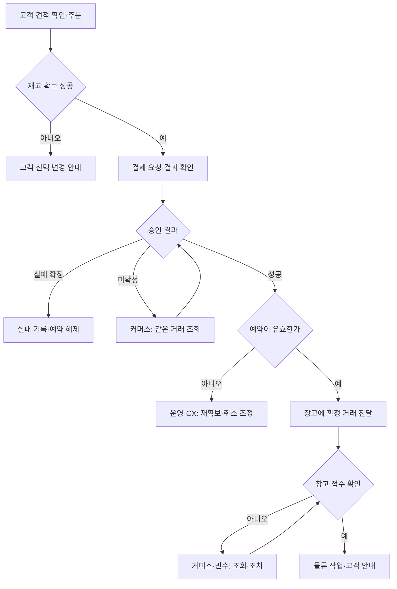
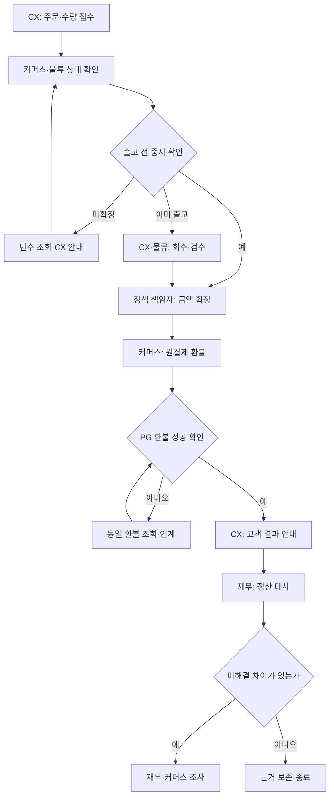

title: 시나리오: 이커머스 05 — 커머스팀의 주문·결제·취소·환불 운영
slug: scenario-modeline-05-orders-payments
category: 시나리오
tags: modeline,ecommerce,payment,inventory,idempotency
summary: 상품·가격·프로모션 계약부터 재고 예약, 결제 확정, 창고 인계, 취소·환불과 재무 대사까지 거래 운영을 설명한다. 주문 A·B의 상태를 보존하며 일·주·월·연간 업무와 KPI를 정의한다.
toc: true
nextSlug: scenario-modeline-06-platform-operations
prevSlug: scenario-modeline-04-search-recommendation
publishedAt: 2026-09-12T14:32:01.258433+09:00
syncHash: a5bbfda8fd3b73a456f6644633e8c095a6ba154a8cbcf77a661c85832391ae02

---

[시리즈 종합편과 전체 목차](/96/scenario-modeline-17-company-overview)

> 모드라인의 가상 거래 운영 매뉴얼이다. 커머스 백엔드 4명은 개발 15명에 포함되며 판매운영·CX·재무와 함께 일한다. 금액·처리 장면은 창작이고 실제 PG 계약, 법정 처리 기한, 구현 완료 증거가 아니다.

고객 A에게는 구매 버튼 한 번이지만 회사에는 여러 확인이 남는다. 화면의 상품과 가격이 맞는지, 재고가 확보됐는지, 실제 결제가 승인됐는지, 창고가 출고 요청을 받았는지 각각 확인해야 한다. “결제 성공”이라는 문구 하나만 남기면 돈을 받은 사실과 상품을 보낼 준비가 된 사실이 섞인다.

대표 상품 `P-F26-017`의 표시 가격은 59,000원이다. 주문 A에는 가상 할인 5,900원이 적용돼 고객 결제액이 53,100원이며 고객 배송비는 0원이다. 이 두 주문 예시의 배송료 지원은 회사가 승인한 처리다. 모든 주문에 같은 조건이 적용된다고 확대하지 않는다.

## 커머스팀은 거래 상태를 책임지고 상품·고객·회계 판단을 연결한다

커머스 개발 담당자는 상품·가격·주문·결제 계약이 일관되게 실행되는지 책임진다. 일상 운영에서는 담당자가 미확정 거래, 재고 예약, 외부 통지, 출고 미수신, 환불 결과를 확인한다. 자동으로 처리되지 않은 거래에도 다음 행동을 맡은 사람이 있어야 한다.

판매운영·물류관리의 민수는 판매가능 상태와 창고의 실제 작업을 확인한다. CX 수진은 고객 요청과 정책 적용, 안내를 맡는다. 재무 도현은 결제·환불·PG 정산·은행 입금의 차이를 대사한다. 대사는 서로 다른 장부의 거래를 연결해 같은 사실인지, 시점 차이인지, 오류인지 확인하는 일이다.

| 책임 영역 | 결정권과 입력 | 완료 산출물·수신자 |
|---|---|---|
| 상품·가격·혜택 계약 | MD·그로스·판매운영이 승인한 조건 | 커머스가 적용 버전·검사 결과를 운영에 인계 |
| 주문·결제·예약 | 고객 확정 금액, SKU와 수량, PG 증거 | 확정/실패/미확정 상태와 다음 조치 |
| 창고 연동 | 결제·예약 상태, 유효한 출고 요청 | 민수의 창고 수신·작업 상태 확인 |
| 취소·교환·환불 | 수진의 접수·정책, 민수의 실물·출고 확인 | 금액·수량별 처리 결과와 고객 안내 |
| 정합성·월말 대사 | 거래 이력, PG 결과, WMS·재무 차이 목록 | 원인·증거·조정 기록, 도현의 마감 판단 |
| 외부 계약 변경 | PG/WMS 통지·규격·운영 조건 | 영향 평가·검증·전환·복귀·수신 확인 |

커머스팀이 공급사 귀책이나 회사 매출을 독자 확정하지 않는다. 재무가 제기한 차이를 조사하되 은행 입금만으로 고객 주문을 성공 처리하지 않는다. 영업 정책은 소유 부서가 정하고 개발팀은 그 정책을 추측 없이 실행 가능한 계약으로 만든다.

## 판매 전에는 상품·가격·프로모션의 같은 버전을 확인한다

매일 10시 판매 준비에서 민수는 판매 대상 SKU, 콘텐츠 승인, 가격과 할인 적용 시간, 판매 중지 조건을 확인한다. 커머스 담당자는 상품 화면·장바구니·주문 견적이 같은 의미로 계산되는지 본다. 기획전 배너 문구가 맞아도 중복 쿠폰이나 적용 대상이 다르면 판매 준비는 끝나지 않는다.

혜택 계약에는 대상 상품·고객 조건, 시작·종료 시각, 중복 적용, 수량·금액 제한, 예산 소진 시 처리, 주문 변경·부분 취소 때의 배분 규칙을 적는다. 담당자는 명확한 정상 예와 경계 예를 승인한다. 계약이 비어 있는 경우 개발자가 통상적인 할인 방식이라고 가정해 채우지 않는다.

| 판매 계약 자료 | 주문 전에 확인할 것 | 책임자에게 돌릴 예외 |
|---|---|---|
| 상품·SKU | 승인 이름·옵션, 판매 상태, 구매 수량 조건 | 삭제·중지 SKU, 설명과 옵션 불일치 |
| 가격·할인 | 원가격·할인액·최종 금액, 적용 버전 | 중복 혜택·기간·자격 조건 미확정 |
| 배송 조건 | 고객 부담액, 적용 지역·묶음 조건 | 표시와 견적의 불일치 |
| 취소·환불 배분 | 주문 항목별 할인·배송비 처리 근거 | 부분 취소 후 혜택 재계산 정책 없음 |

고객이 구매를 확정할 때는 승인된 정책과 최신 판매 상태로 견적을 다시 확인한다. 금액이 바뀌면 바뀐 금액에 대한 고객 확인이 필요하다. 주문에는 당시 상품명·옵션·수량·가격·할인·배송 조건을 남겨 이후 상품 설명이 바뀌어도 무엇을 구매했는지 설명할 수 있게 한다.

가을 캠페인 `CMP-F26-WORK`가 끝나면 종료 시각 이후 새 견적에 혜택이 남지 않는지 확인한다. 종료 직전 만든 견적의 유효 조건도 계약에 둔다. 외부 PG나 창고의 처리 중 거래까지 캠페인 종료와 함께 임의로 지우지는 않는다.

## 주문은 예약·승인·창고 수신을 차례로 확인한다

정상 거래는 고객이 확정한 견적과 구매 항목을 주문으로 남기는 데서 시작한다. 현재 판매가능 수량을 확보하고 결제를 진행한 뒤 승인 결과의 주문·금액·상태를 대조한다. 결제가 확인돼도 예약이 유효하지 않으면 출고 준비가 끝난 것이 아니다.

| 업무 객체 | 주문 A의 ID·값 | 확인할 사실 |
|---|---|---|
| 주문 | O-F26-10482 | 고객 A의 SH017-NV-M 1장 |
| 결제 | PAY-F26-10482 · 53,100원 | 승인과 취소 결과 |
| 예약 | RES-F26-10482 · 1장 | 확보 수량·만료·확정·해제 |
| 최초 출고 | FUL-F26-10482 | 창고 요청·접수·작업·인계 |
| 후속 교환 | EX-F26-021 | 반송 M 검수와 S 교환 출고 |

첫 입고 스냅샷의 NV-M 판매가능은 96장이었다. 그 스냅샷만 분리해 다른 움직임 없이 1장을 예약하는 계산에서는 판매가능 95장과 예약 1장이 된다. 이는 장부 상태를 설명하는 가상 산술이며 후속 재검수와 실제 주문들을 반영한 현재 재고가 아니다. 발주 600장을 판매가능 수량으로 사용하지 않는다.

미확정은 실패의 다른 이름이 아니다. PG에서는 승인됐는데 응답만 잃었을 수 있으므로 같은 거래 조회가 다음 행동이다. 예약 만료 뒤 승인 성공이 확인되면 현재 재고를 다시 확보할 수 있는지 운영과 확인하고, 불가능하면 승인 취소와 고객 안내를 담당자가 이어간다.

창고가 접수했다고 실제 출고가 완료된 것도 아니다. 요청 전송, 창고 접수, 피킹, 택배 인계는 다른 상태다. 오후 2시의 예시 출고 마감 전에 민수는 접수 증거가 없는 확정 주문을 확인한다. 커머스 담당자는 통신 기록을 제공하고 민수는 창고 작업 상태를 되돌려준다.

## 승인 응답이 없으면 중복 결제부터 만들지 않는다

기존 주문 A의 가상 사건 장부는 결과 미확정과 중복 통지를 구분하는 자료다. 각 시각은 설명을 위한 순서이며 결제 성능을 측정한 값이 아니다.

| 시각 | 받은 증거 | 기록할 상태·행동 |
|---|---|---|
| 10:21:00 | 견적 53,100원·예약 확인 | 주문 A의 결제 시도 연결 |
| 10:21:02 | 승인 요청 응답 없음 | 미확정 유지, 같은 거래 조회 |
| 10:21:05 | 같은 결제 ID 승인 조회 | 주문·금액·상태 대조 후 결제 확정 |
| 10:21:07 | 같은 승인 콜백 수신 | 이미 확정한 결과인지 확인 |
| 10:21:10 | 같은 콜백 재수신 | 중복 기록 보존, 업무 결과 추가 없음 |

콜백은 외부 사업자가 처리 결과를 알려 주는 통신이다. 이 장부의 콜백 수신은 2건이지만 성공 결제·예약·출고 요청용 내부 이벤트는 각각 1건이다. 새로 온 통지가 새 주문이나 추가 고객 결제를 뜻하지 않는다. 반대로 실제 중복 결제가 의심되면 통지 수가 아닌 외부 거래 ID와 승인 금액을 조사한다.

담당자는 고객에게 확인된 상태를 안내하고, 물류에는 확정 주문과 출고 요청을, 재무에는 원결제·승인 근거를 넘긴다. 응답 불명을 해결한 뒤에도 원인 조사와 반복 방지 작업은 남긴다. 결과 조회가 계속 불가능하다면 마지막 확인 시각·금액·고객 영향·다음 조회 담당자를 17시 인계에 포함한다.

이미 취소된 결제에 늦은 승인 통지가 왔다고 승인 상태로 되돌리지 않는다. 어떤 사실이 먼저 발생했고 어떤 통지가 나중에 도착했는지 확인한다. 받는 순서와 거래의 실제 시간 순서가 다를 수 있다는 전제에서 처리한다.

## 취소와 반품 환불은 출고·실물·금액 상태를 함께 확인한다

고객의 취소 요청이 들어오면 수진은 대상 주문·항목·수량과 사유를 확인한다. 커머스 담당자는 결제·예약·출고 요청 상태를 조회하고 민수는 창고가 실제로 어디까지 처리했는지 확인한다. 고객 요청 접수만으로 창고 작업이 멈췄다고 알리지 않는다.

출고 전 중지가 확인되면 해당 범위의 결제 취소와 예약·재고 처리를 이어간다. 창고 중지가 미확정이면 조회와 안내를 계속하며 이미 출고됐다면 회사가 확정한 회수·반품 흐름으로 전환한다. 취소 요청, 실물 회수, 검수, 환불 성공, 정산 반영은 각각 다른 완료 조건이다.

그림의 회수·검수 분기는 모드라인의 이 예시 처리다. 실제 권리·기한·예외는 승인된 회사 정책과 확인된 법률·계약에 따른다. 금액이 확정된 이후에도 PG 실행 결과를 조회하고 고객 안내를 별도로 남긴다. 재무 정산 대기가 남아 있다고 고객에게 환불 요청 접수 상태만 계속 보여 주지는 않는다.

주문 A는 소매 길이 불만으로 `EX-F26-021` 교환을 요청한다. 반송된 네이비 M 검수와 교환할 네이비 S 확보·출고를 각각 기록하고 교환 출고는 `FUL-F26-EX021`로 연결한다. 교환이라는 이유로 원결제 53,100원을 자동 전액 취소하지 않는다.

주문 B `O-F26-10483`는 아이보리 M의 상품 문제로 `RET-F26-032`를 접수한다. 회수·검수 뒤 환불 53,100원이 확정되는 별도 예시다. `REF-F26-032`를 `PAY-F26-10483`에 연결하고 PG 성공 증거, 고객 안내, 정산 반영 상태를 각각 남긴다. A의 교환과 B의 환불을 하나의 주문 후속 상태로 합치지 않는다.

부분 취소를 지원하는 업무에서는 주문 항목별 확정 금액, 이미 성공한 환불과 진행 중인 환불을 함께 확인한다. 동시에 요청된 환불이 남은 환불 가능 금액을 넘지 않도록 처리 범위를 확보한다. 할인·배송비 배분이 미정이면 정책 소유자에게 돌리고 담당자가 임의의 반올림 규칙을 만들지 않는다.

## 일상 대사와 월말 대사는 같은 ID를 다른 시점에서 읽는다

09시에는 전날 승인·취소·환불, 현재 예약, 출고 미수신과 오래된 미확정 거래를 대조한다. 발견한 차이는 원인·금액·고객 영향·다음 담당자로 분류한다. 정상적으로 시간이 걸리는 정산과 실제 누락을 구분해야 한다. 단지 두 장부의 날짜가 다르다는 이유로 강제로 같은 날 맞추지 않는다.

월말 `RECON-F26-09`에서 도현은 PG 정산·은행 입금·원결제·환불을 연결한다. 커머스팀은 요청·외부 처리 시각과 상태를 제공하고 재무가 회계 처리와 마감 범위를 정한다. 조사가 남으면 금액·근거·담당자·재검토일을 차이 목록에 유지한다.

두 주문의 가상 정산 예시는 각 53,100원에서 가상 차감 1,593원을 뺀 51,507원씩 먼저 입금된다는 별도 가정이다. 총입금 103,014원에서 B 환불 53,100원을 나중에 차감하고 최초 차감은 반환되지 않는다면 순현금은 49,914원이다. 이는 실제 PG 요율도 회계 매출도 아니며 세금·원가·배송비를 계산한 이익이 아니다.

커머스팀이 제공하는 승인·환불 근거와 재무의 순현금 계산은 서로 대체하지 않는다. 후속 정정이 생기면 거래 이력을 보존하고 연관 보고서에 정정 범위를 전달한다. 원장을 직접 덮어 차이를 없앤 것으로 대사를 끝내지 않는다.

## 운영 달력에는 외부 계약의 변경과 종료도 넣는다

| 주기 | 입력·판단 | 산출물·다음 수신자 |
|---|---|---|
| 매일 09시 | 승인·환불·예약·창고 차이와 최장 대기 확인 | 거래별 조사 담당자·고객 영향 |
| 매일 10시 | 상품·가격·혜택·판매 상태 버전 확인 | 판매 가능 또는 보류·수정 승인 |
| 매일 14시 전 | 확정 주문과 창고 접수·취소 중지 확인 | 민수의 마감 목록·CX 지연 안내 |
| 매일 17시 | 미확정 결과·예약 위험·미수신·환불 대기 | 다음 근무자 조회 순서·다음 확인 시각 |
| 매주 | 오류 유형·연동 지연·반복 수동 조치·정책 변경 | 개발·QA 개선 순서, 운영 절차 보완 |
| 매월 | PG·주문·환불·WMS·재무 차이와 계약 비용 | RECON 차이 근거, 마감·계약 검토 인계 |
| 분기·시즌 | 프로모션·거래량 전망·외부 규격 변경·피크 준비 | 경계 검증·지원 체계·전환 일정 |
| 매년 | 다음 해 상품·채널 계획, PG/WMS 계약·기술 수명 | 갱신·교체 영향과 예산·여력 제안 |

전년도 10~12월에는 다음 해 판매 계획이 결제 수단·할인·창고 흐름에 주는 영향을 정리한다. 서비스 변경과 계약 갱신·비용 판단은 커머스·플랫폼·재무·업무 소유자가 함께 준비하고 승인권자가 결정한다. 해외·오픈마켓 확장을 이 시리즈의 현재 운영 범위에 임의로 추가하지 않는다.

1~3월에는 전년 차이와 정산 자료를 검토하고 승인된 변경을 적용한다. 4~6월에는 가을 상품·프로모션 준비와 하반기 처리량 전망을 갱신한다. 7~9월에는 가을 판매 전 가격 경계·예약·PG/WMS 실패·창고 마감 영향을 검수한다. 10~12월에는 연말 운영과 미해결 차이를 정리해 다음 해 계약·개발 계획으로 돌린다.

외부 규격 변경 통지가 오면 담당자는 적용 일자, 영향 거래·상태·인증·재전송 조건, 구버전 지원 종료를 계약 변경 카드에 적는다. 개발은 시험 결과와 전환안을, 민수·수진은 현장·고객 안내를, 도현은 정산 영향과 미완료 거래 처리 조건을 검토한다. 전환 후에는 요청 성공뿐 아니라 창고 수신과 PG 정산 표본까지 확인한다.

기존 연동을 종료할 때도 진행 중 결제·환불·출고가 남았는지 확인한다. 새 계약으로 전환했다고 옛 거래의 조회 경로와 증거 보존을 지우지 않는다. 실패 시 어느 버전으로 돌아갈 수 있고 어떤 거래는 별도 보정해야 하는지 릴리스 전에 정한다.

## KPI는 금액과 상태와 기다린 시간을 분리해 읽는다

다음은 내부 KPI 사전이다. 비율은 분자÷분모×100이며 한국 시간으로 집계한다. 테스트 거래는 제외하고 동일 요청의 통신 재시도는 같은 업무 ID로 묶는다. 법정 기한이나 PG 약속을 뜻하는 목표치는 이 표에서 만들지 않는다.

분모·누락·잠정치 표시는 [시리즈 공통 해석 규칙](/96/scenario-modeline-17-company-overview#지표의-공통-해석-규칙을-먼저-맞춘다)을 따른다.

### 지표의 계산 기준을 한눈에 본다

| 지표·단위 | 계산·관찰 기준 | 원천·책임·검토 주기 |
|---|---|---|
| 승인 성공 확인율 | 전일 PG 승인 요청을 시작한 고유 결제 시도 중 시작 후 24시간 내 성공 확인된 수÷같은 시도 수 | 승인 요청·조회 / 커머스 / 24시간 후 매일 |
| 미확정 결제 최장 대기 | 09시 미확정 시도 각각의 현재 시각−최초 승인 요청 시각 중 최댓값; 건수·합계 금액 병기 | 결제 상태 이력 / 커머스 / 매일·이상 시 |
| 확정 금액 불일치율 | 전일 승인 확인 거래 중 PG 승인액과 고객 확정 주문액이 다른 수÷전일 승인 확인 거래 수 | 주문 견적·PG 승인 / 커머스·재무 / 매일 |
| 결제 후 재고 조정률 | 전일 승인 확인 주문 중 확인 후 24시간 내 유효 예약 부재로 조정이 열린 주문 수÷전일 승인 확인 주문 수 | 승인·예약·조정 / 커머스·민수 / 24시간 후 매일 |
| 출고 접수 지연률 | 전일 창고 접수 예정 시각이 도래한 명령 중 예정 시각까지 수신 확인이 없던 수÷같은 명령 수 | 출고·WMS 접수 / 민수·커머스 / 매일 |
| 환불 성공 확인 시간 | 주내 외부 성공 확인된 환불별 정책·금액 확정부터 PG 성공 확인까지 경과 시간의 중앙값·p90 | CX 확정·환불 조회 / 커머스·수진 / 매주 |
| 월말 미해결 대사 차이율 | 월말 검토 대상 고유 거래 키 중 승인된 마감 기준시각에 원인·처리 미확정인 키 수÷검토 대상 키 수 | RECON·거래 근거 / 도현·커머스 / 월간 |

### 수치를 해석하고 다음 행동으로 연결한다

24시간은 시도 집단을 같은 나이로 읽기 위한 분석 창이다. 오래 미확정인 거래를 24시간에 자동 실패 처리한다는 뜻은 아니다. 새로 발생한 미확정과 장기 대기는 09시 스냅샷으로 따로 보며, 이후 승인·취소가 확인되면 최종 상태도 연결한다.

출고 접수 예정 시각은 주문의 업무 약속과 창고 운영 조건으로 명령 생성 때 정한다. 예정일을 늦춰 지연을 숨기지 않고 변경 이유와 최초 예정 시각을 보존한다. 접수 전 취소로 더 이상 출고 대상이 아닌 명령은 중지 확인 증거가 있는 경우만 분모에서 제외하고 제외 건수를 함께 보고한다.

대사 거래 키는 원결제·취소·환불 등 구분된 사건을 외부 근거와 대응시킨 단위다. 원본 파일 줄 수를 분모로 쓰지 않는다. 근거 있는 시점 차이는 별도 잔량으로 보고하고 실제 미해결 차이와 나눈다. 금액도 절댓값 합계와 유형별 금액으로 병기하며 서로 다른 거래의 과다·과소를 상계해 0으로 보이지 않게 한다.

| 지표 | 해석할 때 주의할 점 | 다음 행동 |
|---|---|---|
| 승인 성공 확인율 | 거절·미확정·기술 오류 분류와 결제수단 구성 병기 | PG·내부 처리·고객 거절 중 원인 구분 |
| 미확정 최장 대기 | 미확정이 없으면 해당 없음; 오래된 소액도 숨기지 않음 | 조회 책임자·고객 안내·예약 위험 우선 배정 |
| 금액 불일치율 | 반올림 허용치를 임의로 두지 않음 | 영향 범위 판매·확정을 보류하고 정책·거래 대조 |
| 재고 조정률 | 승인 후 품절 고객을 주문 취소로 분모에서 제거하지 않음 | 예약 만료·동시 처리·재고 갱신 원인 조사 |
| 출고 접수 지연률 | 전송 성공은 창고 접수 아님 | 같은 명령 조회 후 창고와 마감·지연 안내 결정 |
| 환불 확인 시간 | 미성공 환불 건수·최장 대기 병기, 완료 건만으로 안심하지 않음 | 정책 대기와 PG 결과 대기를 나눠 조치 |
| 대사 차이율 | 건수·금액·시점 차이 모두 확인 | 차이별 증거·책임·확인일을 마감 자료에 유지 |

주문 A의 콜백 두 건으로 승인 성공 확인율을 계산하면 분모부터 틀린다. 같은 결제 시도 하나에 대한 통지이기 때문이다. 성공 결제 1건이라는 작은 예시가 회사 전체 성공률을 뜻하지 않는다. 지표 개선은 정상 거래와 장기 미완료를 함께 읽을 때 판단할 수 있다.

## 개발·AI 활용은 업무 운영과 구분해 설계한다

### 거래 코드는 허용 상태 전이와 중복 처리를 강제한다

서버는 고객 입력 금액을 그대로 믿지 않고 승인된 가격 정책과 상품·SKU를 재확인한다. 재고 예약은 조건부 갱신이나 잠금 등 검증한 방식으로 판매가능 수량 범위 안에서 수행한다. 마지막 한 장을 두 번 조회했다고 두 번 팔 수는 없다.

멱등성은 같은 업무 요청을 반복해도 의도한 부작용을 추가로 만들지 않게 하는 성질이다. 요청 식별자와 금액·대상·처리 단계를 함께 저장하고 동일 키의 다른 인자를 거부한다. 결과를 모르는 재시도와 새로운 거래를 구분해야 한다. [AWS의 멱등 API와 안전한 재시도 설명](https://aws.amazon.com/builders-library/making-retries-safe-with-idempotent-APIs/)

웹훅 수신기는 제공자가 지원하는 인증·검증을 적용하고 원본 이벤트를 보존한다. 주문·상점·결제·금액을 대조하고 필요한 경우 서버 조회로 상태를 확인한다. 토스페이먼츠 공식 문서는 이벤트 종류와 재전송 정책을 별도로 명시한다. 실제 연동에서는 채택한 제공자·버전의 계약을 확인해야 하며 이 글의 상태표가 이를 대신하지 않는다. [토스페이먼츠 웹훅 안내](https://docs.tosspayments.com/guides/v2/webhook)

### 내부 기록과 외부 실행의 확인을 분리한다

주문 확정과 출고 이벤트를 같은 내부 거래에 기록하는 아웃박스는 전송 대기함을 남기는 설계다. 전달기가 `FUL-F26-10482` 같은 고정 명령 키로 외부 요청을 보내고 결과를 조회한다. 내부 이벤트 하나가 외부 창고의 정확히 한 번 실행을 자동 보장하지 않는다. 외부 계약의 중복 처리와 조회·대사까지 필요하다.

PG 성공 후 응답 유실, 예약 만료와 승인 경합, 취소 통지 역순, 중복 환불, 창고 접수 응답 유실을 통제된 시험 환경에서 재현한다. 실제 고객 돈을 사용하는 검증과 구분한다. 소프트웨어 복귀와 이미 실행된 거래의 보정은 다른 절차다.

### AI는 읽기 전용 조사와 검증 자료를 보조한다

AI 입력은 마스킹한 주문·결제·예약·이벤트 조회와 승인된 계약이다. 출력은 시각별 사실, 불일치 후보, 추가 조회 질문, 근거 위치다. 조회·보고 초안만 허용하고 원장 수정·환불 재실행·창고 출고 권한은 주지 않는다. 금액 계산과 허용 전이는 코드와 담당자의 검증을 거친다.

담당자는 모델이 통지 두 건을 결제 두 건으로 요약하거나 미확정을 실패로 바꿨는지 검사한다. 같은 정보로 해결되지 않는 조사는 호출을 늘리기보다 PG·창고의 확정 증거를 확보한다. 채택된 조사당 사람의 확인 시간·재작업·도구 비용으로 평가한다.

별도 기술 심화에서는 예약과 승인 경합, 멱등 키의 수명·범위, 아웃박스 전달과 외부 대사, 부분 환불 금액 보존을 다룰 수 있다. 현재 글은 특정 PG·WMS 구현의 정합성 검증 결과가 아니며 외부 계약 선택 후 세부 실패 경로를 다시 확인해야 한다.
