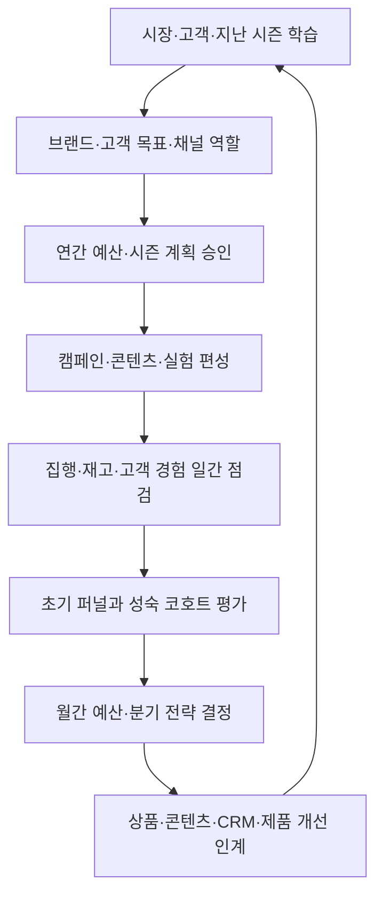
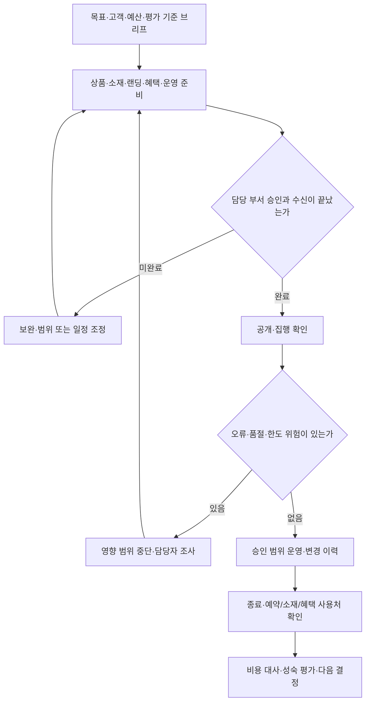

title: 시나리오: 이커머스 09 — 마케팅팀의 시장 조사·캠페인·성과 분석
slug: scenario-modeline-09-growth-marketing
category: 시나리오
tags: modeline,growth-marketing,experimentation,analytics,harness-engineering
summary: 시장·고객·브랜드 전략, 유료·자연 유입, 연간 예산, 캠페인 제작·집행·종료·실험을 운영 매뉴얼로 설명한다. 검증된 합성 보고서와 SQL로 ROAS·CAC·반품·분석 기여를 구분하고 부서의 다음 행동으로 연결한다.
toc: true
nextSlug: scenario-modeline-10-crm-lifecycle
prevSlug: scenario-modeline-08-content-launch
publishedAt: 2026-09-12T14:32:02.882828+09:00
syncHash: a30975853d1dde1ae7a208611a3d4f7ce70ca4e9cb5ddfeb7f1a0f9a56adb8f6

---

[시리즈 종합편과 전체 목차](/96/scenario-modeline-17-company-overview)

> 모드라인과 캠페인, 보고서, 금액은 가상이다. 이 글의 합성 자료는 실제 광고 단가나 회사 실적, 검증된 마케팅 성과가 아니다. 계산을 실행해 수치의 일관성을 확인한 예시이며 실제 광고 계정을 운영한 결과는 아니다.

월요일 오전 9시, 그로스 리드 정유라가 신규 동료와 캠페인 보고서를 연다. 광고 화면에서는 A의 결제액 기준 ROAS가 5배다. 광고비 1원에 연결된 결제액이 5원이라는 뜻이다. “그럼 여기에 예산을 더 넣으면 되나요?”라는 질문에 유라는 환불과 비용이 들어 있는 두 번째 표를 연다.

A의 광고비 반영 후 분석 기여는 -51만 원이다. 결제가 많이 일어났지만 반품과 원가, 배송비까지 빼면 이 분석 범위에서는 돈이 남지 않았다. 그로스팀의 일은 보기 좋은 그래프를 만드는 데서 끝나지 않는다. 왜 그런 결과가 나왔는지 확인해 다음 집행·상품·콘텐츠의 행동을 정해야 한다.

이날 읽는 것은 가을 본 캠페인 `CMP-F26-WORK`에 앞서 진행한 별도 파일럿 `CMP-F26-WORK-PILOT`의 자료다. 여러 상품을 대상으로 한 작은 사전 집행이라는 설정이다. 대표 셔츠의 최초 판매가능 588장이나 고객 A·B 두 주문에서 성과를 확대 추정한 자료가 아니다.

## 마케팅은 시장의 선택 이유와 고객을 데려오는 비용을 함께 책임진다

모드라인의 그로스·CRM 조직은 10명이다. 09편은 시장·브랜드·유입·캠페인·성과 업무를, 다음 CRM편은 같은 조직의 회원 관계·생애주기·접촉 운영을 설명한다. 마케팅 담당자를 광고 매체 운영자로만 좁히거나 편마다 새 부서를 만들지 않는다.

정유라는 고객이 왜 모드라인을 선택해야 하는지, 어느 고객에게 어떤 약속을 할지, 어느 접점에 자원을 쓸지 책임진다. 검색·유료 매체·브랜드 콘텐츠·기획전·고객 관계의 역할을 나누되 고객에게는 연결된 경험이 되어야 한다. 클릭을 샀는데 품절 옵션만 보이거나 광고와 다른 설명이 나오면 마케팅의 후속 확인이 필요하다.

| 업무 영역 | 반복 업무와 판단 | 정기 산출물·협업 |
|---|---|---|
| 시장·고객 이해 | 고객 용도·선택 이유·이탈 이유, 경쟁 구성/가격/표현, 계절 수요와 미충족 과제 조사 | 조사 질문·근거·가설, MD·제품·CX에 인계 |
| 브랜드·포지셔닝 | 누구에게 어떤 가치를 약속할지, 표현·톤·메시지 우선순위와 근거 관리 | 브랜드 브리프·메시지 규칙, 콘텐츠와 검수 |
| 유료 유입 | 매체/대상/소재/입찰·예산·랜딩 운영, 집행 오류와 효과 감시 | 매체 계획·집행 원장·실험 카드, 재무 대사 |
| 자연 유입·자체 콘텐츠 | 검색 수요에 맞는 콘텐츠, 편집 일정, 자체 소셜·커뮤니티 반응·협업 콘텐츠 관리 | 검색/콘텐츠 지도·게시 달력·반응 리뷰 |
| 캠페인·프로모션 | 목표·고객·상품·혜택·일정·용량을 맞추고 출시/종료 관리 | CMP 브리프·출시 확인·종료 보고 |
| 성과·예산·학습 | 관찰 기간별 퍼널·경제성·신규/기존 구성, 계획 대비 집행, 실험 후 결정 | 월간 채널 보고·예산 전망·다음 행동 |
| 접점 연결 | 첫 방문→상품 선택→구매→CRM, 품절·불만 시 메시지/집행 조정 | 인계 카드·억제 조건·개선 요청 |

마케팅은 고객에게 보일 메시지와 승인 범위 안의 집행을 결정한다. 상품 매입과 원가는 MD·재무, 가격·혜택의 실제 적용은 해당 정책 담당·판매운영, 촬영 사실과 권리는 콘텐츠가 확인한다. 신규 예산·계약·한도 변경은 정해진 위임 규칙을 따른다. CTO가 모든 광고 증액을 승인하는 조직으로 그리지 않는다.

성과 보고의 소유자는 유라이지만 데이터 정의는 민아와, 환불·비용은 CX·물류·재무와 합의한다. 보고서를 만드는 담당자가 혼자 환불 제외 규칙이나 신규 고객의 정의를 바꾸면 부서 간 숫자가 갈라진다. 숫자 수정에는 버전·이유·영향받는 보고서를 남긴다.

## 시장 조사에서 브랜드 약속과 채널 역할을 도출한다

분기 조사 계획에는 먼저 결정할 질문을 적는다. 출근복을 찾는 고객이 가격, 소재·핏 정보, 배송 예측 중 무엇 때문에 선택을 망설이는지, 기존 고객과 신규 고객의 이유가 같은지 구분한다. 설문, 인터뷰, 검색어, 상담, 구매·이탈 행동은 서로 다른 표본과 한계를 가진 자료로 읽는다.

경쟁 자료는 공개된 상품 구성·가격·혜택·표현·화면을 같은 시점에 기록한다. 할인 중 가격과 정상가를 섞어 비교하거나 검색 순위 한 번으로 시장점유율을 추정하지 않는다. 외부 시장 수치를 가져오면 발표일·조사대상·수집 방법을 적는다. 이 원고는 실제 시장 규모나 경쟁사 성과를 새로 주장하지 않는다.

조사 결과는 관찰과 해석을 나눠 쓴다. “소매 길이가 궁금하다는 문의가 있었다”는 관찰이고 “실측 안내가 보이면 구매가 늘어난다”는 가설이다. 전자는 콘텐츠·제품의 점검으로, 후자는 비교 가능한 검증 계획으로 넘긴다. 소수 인터뷰의 응답 비율을 전체 고객의 확정 비중으로 쓰지 않는다.

브랜드 브리프에는 핵심 고객, 구매 상황, 제공할 가치, 이를 뒷받침하는 상품·운영 근거, 사용 가능한 표현, 쓰지 않을 주장을 담는다. 모드라인의 출근복 메시지는 승인된 상품 정보와 선택 도움에 기반한다. 브랜드를 지키겠다는 이유만으로 모든 메시지를 추상적으로 만들지도 않고, 전환을 높이겠다는 이유로 상품에 없는 기능을 약속하지도 않는다.

| 채널·접점 | 맡길 역할 | 운영자가 확인할 것 |
|---|---|---|
| 유료 소셜 | 아직 상품을 찾지 않은 고객에게 용도와 비교 이유 전달 | 대상/소재별 구성, 반복 노출, 광고 약속과 실제 상품의 일치 |
| 유료 검색 | 구체적인 구매 의도가 있는 검색을 상품·기획전으로 연결 | 검색어 적합성, 품절/가격, 브랜드·비브랜드 구분 |
| 자연 검색 | 지속적인 선택 질문에 답하는 상세·가이드·기획전 축적 | 검색 의도별 콘텐츠, 중복/오래된 정보, 실제 유입 이후 행동 |
| 자체 소셜·브랜드 콘텐츠 | 일관된 표현으로 활용법·상품 이해와 관계 형성 | 편집 일정·댓글/문의 대응·승인된 이미지·연결 경로 |
| 외부 콘텐츠 협업 | 선정한 매체/제작자의 독자와 맞는 콘텐츠 제공 | 대상 적합성·계약/표현 검토·사용권·비용·게시 확인 |
| CRM·자체 메시지 | 관계 상태와 연락 조건에 맞는 후속 안내·권유 | 다음 편의 목적·동의·빈도·억제 규칙과 연결 |

자연 유입도 공짜는 아니다. 콘텐츠 제작과 수정, 계약, 운영 인력의 자원이 든다. 유료 광고비만 있는 아래 파일럿 표와 자연 유입의 총 운영비를 섞어 채널 수익성을 비교하지 않는다. 브랜드 투자 역시 단기 클릭만으로 종료하지 않고 사전 목적과 관찰 계획을 둔다.

## 연간 예산을 캠페인과 일간 집행으로 내려 보낸다

| 주기·회의 | 입력 자료·책임자 | 결정·다음 산출물 |
|---|---|---|
| 매일 09시 집행 점검 | 채널 담당, 전일 지출·미확인 과금·노출·랜딩 오류·재고 | 한도 안 조정·오류 중단·조사 담당과 기준 시각 |
| 매일 10시 판매 준비 | 유라·MD·운영·콘텐츠, 실제 판매 옵션·승인 자산 | 오늘 공개/유지/교체할 캠페인과 랜딩 |
| 매일 17시 집행 인계 | 담당·대체 담당, 예약 변경·예산 잔여·미확인 결과 | 다음 확인 시각·중단 조건·외부 계정 작업 이력 |
| 매주 성과·실험회의 | 유라·민아·MD·CX, 초기 퍼널·성숙 코호트·지난 결정 | 소재/대상/상품 원인 점검, 실험 시작/유지/종료 제안 |
| 매월 예산·성과회의 | 유라·재무, 채널별 확정 집행·미청구·계약·기여 | 전망 갱신·한도 내 재배분·추가 승인 요청 |
| 매분기 전략 리뷰 | 경영·그로스·제품·MD, 고객/시장 가정·채널 구성·학습 | 브랜드/유입/관계 역할, 중단할 활동·다음 분기 계획 |
| 매년 사업·예산계획 | 유라·경영·재무, 고객 획득/유지 가설·제작/물류 여력 | 시즌별 투자 방향·예산 한도·검증 과제·책임 |

전년도 10~12월에는 다음 해 고객 가설·브랜드 방향·신규와 기존 고객의 역할, 시즌별 예산과 제작 수요를 제안한다. 1~3월에는 전년 관찰 결과를 확인하고 첫 시즌을 실행한다. 4~6월에는 상반기 자료로 가을 캠페인·콘텐츠·하반기 전망을 준비한다. 7~9월에는 가을 파일럿 학습과 물류·CS 용량을 반영하고, 10~12월에는 연말 운영과 다음 해 계획을 연결한다.

예산표는 승인 한도, 이미 집행한 금액, 계약상 남은 의무, 아직 선택 가능한 확대분을 나눈다. 채널 간 이동도 계약과 승인 범위 안에서만 진행한다. 비용 자료가 늦게 와 남아 보이는 예산을 새 돈처럼 쓰지 않도록 미청구 예상과 자료 기준 시각을 표시한다.

월말 전망은 “현재 집행+남은 확정 의무+선택 가능한 계획”을 각각 합산한 버전으로 작성한다. 재무는 지급 시점과 현금 여력을 확인하고 경영은 신규 확대 여부를 결정한다. 아래 파일럿의 분석 기여는 14편의 별도 주간 현금 계획을 대체하지 않는다.



연간 계획은 모든 캠페인을 미리 확정하는 달력이 아니다. 승인된 방향과 제약 안에서 주간 관찰로 실행을 바꾼다. 평가가 늦게 완성되는 반품·기여와 즉시 보이는 랜딩 오류를 같은 속도로 다루지 않고, 긴급 오류는 바로 담당자에게 보내고 투자 판단은 충분한 자료를 기다린다.

## 캠페인은 브리프부터 종료 확인까지 하나의 업무로 관리한다

캠페인 브리프에는 ID, 목표 고객과 해결할 선택 문제, 목표 행동, 상품·옵션, 메시지 근거, 혜택과 비용 책임, 채널·소재·랜딩, 시작·종료, 예산 한도, 담당자·대체자, 초기/최종 평가일을 적는다. 성과 지표와 품절·오안내·비용 초과 등의 중단 조건도 출시 전에 합의한다.

`CMP-F26-WORK`의 제작 의뢰는 소연에게 메시지와 필요한 자산을, 지민에게 상품 구성과 재주문 검토를, 민수에게 판매 가능 옵션·출고 여력을 요청한다. CX에는 예상 질문·확인된 혜택·판매 안내를 준다. 수신 부서가 가능 범위와 누락 자료를 회신해야 공개 일정이 확정된다.

소재 검수는 이미지·문구·클릭 후 페이지를 함께 본다. 랜딩이 모바일에서 열리는지, 선택한 옵션을 실제로 살 수 있는지, 배너 혜택이 주문에서도 같은 조건인지 확인한다. 광고 검토나 외부 게시가 지연되면 승인된 시작일을 다시 맞추고 이미 예약된 CRM·배너와 충돌하지 않게 한다.



중단은 매체 전체를 일괄 종료하는 한 가지 행동이 아니다. 문제가 있는 옵션·소재·랜딩의 범위를 확인하고 가능한 수준에서 보류한다. 이미 고객에게 노출된 약속이나 사용 가능한 혜택은 담당 부서가 별도로 처리한다. 집행 화면의 비활성 표시와 실제 노출/과금 종료의 확인도 나눠 남긴다.

종료 때는 예약된 광고·배너·기획전·CRM 연결을 확인하고 종료 후 방문 경로를 정리한다. 집행비·외주비·혜택 비용·미도착 자료를 재무에 넘긴다. 종료일 보고는 운영 결과를 닫는 보고이고, 주문별 관찰 창이 지난 뒤의 효과 평가는 별도 일정으로 남는다.

| 가상 캠페인 작업 카드 | 판단 근거·상태 | 수신자의 다음 일 |
|---|---|---|
| CMP-F26-WORK 준비 | P-F26-017 content-v1, 최신 판매가능 SKU 필요 | 소연·민수가 버전·가용 상태 회신, 유라가 랜딩 확인 |
| MKT-F26-W36 파일럿 리뷰 | A -510,000원·B 32,000원, 고객 구성 상이 | 유라가 확대 보류, 민아가 같은 대상 실험 설계 |
| 실측·핏 표현 재검토 | 소재와 비식별 문의, 원측정 자료 확인 필요 | 소연·수진·지민의 원인 점검, DEV-F26-012와 검토 자료 연결 |
| 월간 예산 검토 | 집행·계약 의무·선택 확대분·현금 일정 | 도현이 범위/시점 확인, 승인권자가 변경 결정 |

여기까지가 마케팅 부서의 운영 범위다. 다음 분석은 그중 성과 검토 한 건을 자세히 읽는 예시다. 시장 조사·브랜드·자연 유입 전체가 아래 유료 파일럿의 숫자로 측정됐다는 뜻은 아니다.

## 보고서에 답할 질문과 관찰 기간을 먼저 적는다

유라는 “어느 채널의 매출이 높은가”보다 “어떤 고객을 어떤 비용으로 데려왔고 구매 후까지 무엇이 남았는가”를 묻는다. A는 넓은 관심 고객에게 보여 주는 소셜 광고, B는 구매 의도가 상대적으로 구체적인 검색 유입으로 가정한다. 서로 다른 집단이므로 채널 차이 자체를 광고의 인과 효과로 해석하지 않는다.

데이터 담당 서민아는 보고서 `MKT-F26-W36`의 표지에 범위를 적는다. 코호트는 같은 조건과 시작 기간으로 묶은 집단이다. 이번에는 같은 유입 주간을 기준으로 잡되, 구매가 늦게 일어나거나 나중에 환불되는 시간을 따로 반영한다.

| 보고 기준 | 이번 가상 분석에서 고정한 것 |
|---|---|
| 유입 코호트 | 2026-07-27~08-02, 한국 시간 |
| 주문 연결 | 마지막 적격 유료 클릭 후 7일 미만의 결제 |
| 구매 후 관찰 | 주문별 결제 시점부터 30일 미만의 환불·비용 |
| 자료 기준일 | 2026-09-12, 해당 관찰 창이 지난 자료 |
| 금액 기준 | 원화, 할인 후, 세금 취급을 통일한 분석용 순액 |
| 대상 거래 | AN-A-001~300, AN-B-001~160의 별도 합성 주문 |
| 결과의 한계 | 아래 변동비와 광고비 범위의 분석 기여, 회사 손익·현금 아님 |

마지막 유입일에 클릭한 뒤 늦게 구매한 주문도 30일을 관찰할 수 있는 기준일로 잡았다. 합성 SQL은 산술 재현을 위해 결제일을 8월 2일로 단순화한다. 실제 운영 데이터에서는 주문마다 다른 시작일과 종료일을 계산해야 한다.

신규 동료는 어제 광고를 바꾼 결과도 이 표에서 볼 수 있는지 묻는다. 민아는 어제 주문에는 반품 관찰 시간이 아직 부족하다고 답한다. 초기 방문·구매 신호는 먼저 볼 수 있지만, 성숙한 30일 지표와 같은 색으로 비교해서는 안 된다.

## 방문 흐름과 며칠 뒤의 구매를 다른 표로 읽는다

유라는 먼저 퍼널을 확인한다. 퍼널은 방문에서 상품 확인, 장바구니, 결제로 좁혀지는 단계별 흐름이다. 아래는 같은 방문 안에서 해당 순서를 밟은 방문 수를 한 단계당 한 번씩 세는 가상 집계다. 단순 이벤트 발생 횟수가 아니다.

| 같은 방문 안의 순차 단계 | A · 소셜 | B · 검색 |
|---|---:|---:|
| 랜딩 도착 | 10,000 | 4,000 |
| 상품 상세 확인 | 8,000 | 3,600 |
| 장바구니 | 1,800 | 1,000 |
| 결제 단계 진입 | 800 | 400 |
| 해당 방문에서 결제 | 280 | 152 |

A의 같은 방문 결제 비율은 280 ÷ 10,000 = 2.8%, B는 152 ÷ 4,000 = 3.8%다. 이후 다시 방문해 결제한 연결 주문 20건과 8건을 더하면 7일 기여 주문은 각각 300건과 160건이다. 아래 경제성 표는 이 300건과 160건을 사용한다.

신규 동료가 A의 결제 진입 800건에서 구매 300건으로 전환율을 계산하자 민아가 멈춘다. 300에는 다른 방문에서 발생한 주문이 포함돼 있다. 같은 방문의 다음 단계 비율을 계산하려면 280을 사용해야 한다. 표마다 분모와 시간 범위를 적는 것은 형식이 아니라 계산 오류를 막는 일이다.

A의 광고 노출은 50만 회, 클릭 12,500회이고 B는 16만 회, 클릭 4,800회라는 별도 합성 집계로 둔다. 클릭률은 각각 2.5%와 3.0%다. 클릭과 랜딩 도착이 다른 이유는 페이지 로딩 실패, 중복 클릭, 측정 누락 등을 점검할 단서이지 모두 같은 원인으로 확정한 결과는 아니다.

## 환불과 비용을 반영하면 높은 ROAS의 해석이 바뀐다

금액 계산을 위해 각 합성 주문은 할인 후 분석 금액 50,000원, 두 항목 각 25,000원으로 둔다. 항목 원가는 각 16,500원이다. 대표 고객의 실제 화면 예시 53,100원과는 다른 가상 거래이며 세금 처리를 설명하기 위한 값도 아니다.

A는 300건 중 60건, B는 160건 중 8건이 전액 환불됐다고 가정한다. 이 합성 자료에서만 반품 전부가 검수 후 재판매 가능해 원가를 되돌리는 것으로 둔다. 실제로는 환불 성공만 보고 원가를 복원하면 안 된다. 불량·폐기·교환은 실물 판정과 원가 처리 근거를 따로 읽어야 한다.

고객이 남긴 품질 관련 반품 사유와 창고의 재판매 가능 판정도 별도 필드다. 아래 사유 분석은 고객 요청의 분류이며 모든 품질 관련 요청을 실제 불량 확정으로 해석하지 않는다.

수수료는 원 주문당 1,500원, 최초 배송비는 3,000원, 반품 회수비는 4,000원으로 가정한다. 최초 수수료는 환불로 돌려받지 않는다. 모두 같은 세금 취급으로 정리한 분석용 값이며 실제 업체 요율이 아니다. 고객 부담 배송비는 이 예제에 없다.

| 분석 항목 · 원 | A · 소셜 | B · 검색 |
|---|---:|---:|
| 할인 후 결제 분석 금액 | 15,000,000 | 8,000,000 |
| 성공 환불액 | -3,000,000 | -400,000 |
| 환불 반영 금액 | 12,000,000 | 7,600,000 |
| 반품 판정 반영 순원가 | -7,920,000 | -5,016,000 |
| 결제 수수료 | -450,000 | -240,000 |
| 최초 배송비 | -900,000 | -480,000 |
| 반품 회수비 | -240,000 | -32,000 |
| 광고비 | -3,000,000 | -1,800,000 |
| **광고비 반영 후 분석 기여** | **-510,000** | **32,000** |

A의 순원가는 남은 240건 × 33,000원 = 7,920,000원이다. B는 152건 × 33,000원 = 5,016,000원이다. 이 원가는 해당 합성 자료의 반품 판정까지 반영한 값이지, 반품되지 않은 주문만 남기고 배송비와 광고비까지 지웠다는 뜻이 아니다.

ROAS는 A 5.00배, B 약 4.44배다. 환불을 뺀 금액으로 계산하면 A 4.00배, B 약 4.22배가 된다. 그러나 환불 반영 ROAS에도 원가·배송비는 아직 포함되지 않는다. 그래서 유라는 위의 분석 기여를 함께 본다.

분석 기여는 여기서 정의한 비용을 빼고 남은 금액이다. 급여·임차료·일반 운영비·법인세 등은 포함하지 않았고 현금 입출금 시점도 반영하지 않았다. **B의 32,000원이 회사 순이익이라는 뜻은 아니다.** 비용 추정이 조금만 달라져도 방향이 바뀔 수 있는 작은 차이다.

## 신규 고객과 기존 고객의 비용을 나눠 읽는다

첫 결제 고객 수는 A 240명, B 80명으로 둔다. 이 합성 자료에서는 고객당 주문 한 건이며, 이후 전액 환불된 첫 결제 고객도 이 정의에 포함한다. 신규 고객 획득비용인 CAC는 각각 3,000,000 ÷ 240 = 12,500원, 1,800,000 ÷ 80 = 22,500원이다.

A의 신규 비중은 80%, B는 50%다. B의 당기 분석 기여가 높아도 신규 고객을 더 저렴하게 얻었다는 결론은 나오지 않는다. 재구매까지의 가치나 광고가 없었어도 샀을 고객의 비중은 이 표만으로 알 수 없다.

## 반품 이유를 쪼개면 다음 콘텐츠 업무가 나온다

유라는 A의 모든 광고를 실패로 묶기 전에 소재별로 내려간다. 소재는 고객이 본 광고 이미지와 문구 묶음이다. A에서 핏을 강조한 소재는 120건 중 36건이 환불됐고, 비교 정보를 보여 준 소재는 180건 중 24건이 환불됐다는 합성 결과다.

| A의 소재 묶음 | 연결 주문 | 전액 환불 | 환불 주문 비율 |
|---|---:|---:|---:|
| 핏 강조 | 120 | 36 | 30.0% |
| 비교 정보 | 180 | 24 | 약 13.3% |

A 전체 환불 60건의 최종 사유는 사이즈 36건, 품질 12건, 기타 12건으로 가정한다. 사유별 합계를 만드는 계산과 사유가 정확히 분류됐는지 확인하는 일은 다르다. 수진은 비식별 원문과 검수 근거를 표본으로 읽어 잘못 묶인 사례가 없는지 확인한다.

“핏 강조 문구가 반품을 늘렸다”는 결론은 아직 가설이다. 서로 다른 상품·사이즈·고객에게 소재가 노출됐을 수 있다. 유라는 지민에게 상품 구성과 품절 차이를, 소연에게 문구와 실측 안내의 일치를, 민아에게 고객 구성과 노출 배정을 확인해 달라고 요청한다.

오후 회의에서 소연은 원 측정 자료를 확인하지 않고 광고 문구만 새로 만들지 않겠다고 답한다. 지은은 실측 표시 위치 개선 DEV-F26-012의 검토 자료를 가져온다. 개발 출시 결과와 파일럿의 반품 원인은 별개이므로 “개발했으니 해결됐다”고 보고하지 않는다.

## 분석 보고서는 다음 집행·실험·예산 카드로 이어져야 한다

유라는 보고서 마지막에 담당자별 행동을 적는다. A의 추가 확대는 보류하고, B도 작은 양수만 보고 전면 증액하지 않는다. 현재 본 캠페인은 승인된 범위에서 운영하며 새 집행은 별도 승인 대상으로 남긴다.

| 결정·요청 | 책임자와 입력 | 나중에 확인할 결과 |
|---|---|---|
| 핏 표현·측정 안내 재검토 | 소연·수진, 소재와 비식별 문의 근거 | 변경 후보와 사실 검수 결과 |
| 같은 대상 안에서 소재 실험 설계 | 유라·민아, 적격 집단·노출 규칙 | 배정·표본 계획·주요 지표·중단 조건 |
| 상품·옵션 구성 차이 확인 | 지민·민수, 노출 상품과 재고 이력 | 품절·구성 차이의 설명 |
| 집행 한도와 현금 일정 확인 | 도현·유라, 비용 증빙·예산 버전 | 집행 가능한 범위와 지급 일정 |
| 선택 화면의 후속 관찰 | 지은·QA, 출시 버전과 행동 로그 | 초기 이용 신호와 미확정 효과 구분 |

실험에서는 같은 적격 집단 안에서 비교안을 무작위 배정하는 방법을 먼저 정한다. 고객이 두 안을 오가는 오염, 품절 차이와 가격 변경도 통제할 대상으로 적는다. 최소한 구분하려는 효과 크기, 필요한 표본과 종료 규칙을 사전에 정해야 하며 이 글의 작은 표만으로 통계적 유의성을 주장하지 않는다.

주요 평가는 정한 관찰 창의 구매 후 기여로 두고, 구매 전환·고객 불만·반품·과도한 비용을 함께 감시한다. 다음 주에는 계측과 초기 행동을 점검할 수 있지만 새 주문의 30일 반품 결과는 기다려야 한다. 조기 지표가 좋다고 최종 평가가 끝난 것으로 표시하지 않는다.

현재 판매할 대표 셔츠는 민수에게 최신 SKU 상태를 다시 받는다. 첫 검수의 588장이나 판매 전 후속 검수의 594장을 계속 광고 가용 수량으로 쓰지 않는다. 소재가 약속한 옵션과 랜딩에서 실제 살 수 있는 옵션을 맞춘 뒤 공개한다.


## 마케팅 KPI는 효과·비용·경험·계획을 함께 설명해야 한다

아래는 내부 지표 사전이다. 파일럿에 적용하는 지표는 앞의 유입 주간·7일 미만 기여·주문별 30일 미만 관찰 범위를 따른다. 매체 자체 지표는 그 설정을 별도로 보존한다.

분모·누락·잠정치 표시는 [시리즈 공통 해석 규칙](/96/scenario-modeline-17-company-overview#지표의-공통-해석-규칙을-먼저-맞춘다)을 따른다.

### 지표의 계산 기준을 한눈에 본다

| 지표·단위 | 계산·관찰 기준 | 원천·책임·검토 주기 |
|---|---|---|
| 클릭률 CTR · 노출/클릭 | 같은 매체·기간의 클릭 수 ÷ 노출 수 ×100; 일/주 | 광고 집계, 채널 담당, 일일/주간 |
| 같은 방문 구매 전환율 · 방문 | 순차 퍼널에서 결제까지 간 방문 수 ÷ 랜딩 방문 수 ×100; 유입 주간 | 방문별 행동 집계·거래 확인, 민아·유라, 주간 |
| 결제액 기준 ROAS · 채널 | 기여 주문의 할인 후 결제 분석 금액 ÷ 같은 범위 광고비; 파일럿 기여 창 고정 | 기여 주문·집행, 유라, 일일 초기/주간 |
| 환불 반영 ROAS · 채널 | (결제 분석 금액−관찰 창 내 성공 환불액) ÷ 광고비 | 주문·환불·집행, 유라·민아, 성숙 코호트 주간 |
| 첫 결제 CAC · 신규 고객 | 광고비 ÷ 생애 첫 성공 결제가 해당 채널에 연결된 고객 수; 이후 환불 고객 포함 | 고객 첫 결제·기여·집행, 유라·민아, 월간 |
| 광고 후 분석 기여 · 주문→채널 | 결제−환불−순원가−수수료−최초 배송−회수−광고비; 주문별 30일 창 | order economics·재무 비용, 유라·도현, 성숙 평가/월간 |
| 환불 주문 비율 · 기여 주문 | 관찰 창 내 성공 환불이 있는 고유 주문 수 ÷ 같은 성숙 결제 주문 수 ×100 | 주문·환불 원장, CX·유라, 주간/월간 |
| 예산 사용률 · 캠페인/월 | 해당 기간 확정 집행비 ÷ 같은 기간 승인 예산 ×100; 미청구 예상 별도 | 집행·증빙·예산 버전, 유라·도현, 일일 감시/월간 |
| 브랜드 인지도 관측 · 조사 응답자 | 같은 질문에서 브랜드를 인지했다고 답한 적격 응답자 ÷ 해당 질문 유효 응답자 ×100; 분기 조사 | 질문지·표본/응답 자료, 유라, 분기 |

### 수치를 해석하고 다음 행동으로 연결한다

| 지표 | 해석할 때 주의할 점 | 다음 행동 |
|---|---|---|
| CTR | 높은 클릭이 구매 의도나 올바른 기대를 보장하지 않는다 | 검색어·대상·표현과 랜딩 일치 확인, 구매 후 문제도 점검 |
| 방문 전환율 | 방문 결제 280/152에 뒤 방문 주문 20/8을 섞지 않는다 | 옵션 선택·속도·혜택·재고 단계별 이탈을 제품/운영에 인계 |
| 두 ROAS | 모두 이익이 아니며 환불 반영 전후를 같은 이름으로 보고하지 않는다 | 비용과 반품 성숙도를 확인한 뒤 집행 판단 |
| CAC | 첫 결제의 정의와 신규 비중이 다르면 채널 비교가 왜곡된다 | 신규/기존 구성을 분리, 관계 가치의 관찰 계획 검토 |
| 분석 기여 | 고정비·세금·현금 시점 제외, 미도착 비용은 0이 아니다 | 비용 완전성 확인, 확대 보류 또는 같은 대상 실험 제안 |
| 환불 비율 | 부분 환불도 한 주문으로 센다. 사유와 실물 불량 판정은 다르다 | 고객/상품/소재 구성과 사유 분류 확인, 품질·콘텐츠 점검 |
| 예산 사용률 | 집행이 적어도 계약 의무가 남을 수 있고 큰 비율이 좋은 성과는 아니다 | 미청구·예약·남은 의무 확인, 전망과 집행 한도 조정 |
| 브랜드 관측 | 질문·표본·조사 방식이 바뀌면 추세 비교가 어렵다 | 같은 방식 재조사, 고객군별 근거 보완 후 메시지 수정 |

자연 유입은 이 사전의 방문 전환·구매 후 지표를 유입 분류별로 보되 광고비가 없는 채널의 ROAS를 무한대로 보고하지 않는다. 제작·협업·운영 비용 범위를 정한 별도 평가가 필요하다. 브랜드 인지도 역시 실제 조사 자료가 아직 없으므로 현재 값을 제시하지 않는다.

월간 리뷰에서는 결과 수치, 원인 가설, 선택한 조치, 책임자, 재확인 조건을 한 줄로 연결한다. A 확대 보류와 B 전면 증액 보류는 현재 근거로 내린 결정이다. 다음 실험이 이를 바꿀 수 있지만, 초기 클릭 개선만으로 30일 평가까지 끝났다고 기록하지 않는다.

## 개발·AI 활용은 업무 운영과 구분해 설계한다

### 광고 화면과 주문 원장은 서로 다른 질문에 답한다

오전 보고서가 열리기 전, 모드라인의 데이터 작업은 각 원천을 수집한다. 브라우저 로그는 고객이 어디를 보고 움직였는지 설명한다. 주문·결제 원장은 무엇을 얼마에 결제했는지, 환불 원장은 실제 금액 처리가 성공했는지 설명한다.

여기서 원장은 거래의 근거를 보존하는 기록이고, 데이터 파이프라인은 그 자료를 수집·정리해 분석 표로 만드는 반복 작업이다. 담당자가 매주 파일을 내려받아 숫자를 복사하지 않도록, 수집 시각과 입력 버전을 남기는 작업으로 설계한다.

| 원천과 담당 | 한 줄이 뜻하는 단위 | 분석에 필요한 필드 |
|---|---|---|
| 광고 채널 · 유라 | 날짜·채널·캠페인별 집행 | 노출·클릭·비용·캠페인 ID |
| 행동 로그 · 민아 | 이벤트 한 번 | 이벤트 ID·시각·방문 ID·상품·유입 |
| 주문 항목 · 커머스팀 | 주문 속 상품 항목 하나 | 주문·항목 ID·할인 후 분석 금액 |
| 환불 · 커머스·CX | 환불 항목의 상태 기록 | 환불 항목 ID·성공 시각·금액·사유 |
| 비용 · 재무·물류 | 비용 항목 하나 | 주문 ID·원가·수수료·배송·회수비 |

상품 상세 조회, 장바구니, 구매, 환불을 구분해 수집한다. 외부 분석 도구를 쓴다면 해당 이벤트와 상품·거래 필드를 내부 ID에 매핑한다. Google Analytics의 이커머스 문서도 탐색·구매·환불을 별도 이벤트로 안내한다. [Google 이커머스 계측 문서](https://developers.google.com/analytics/devguides/collection/ga4/ecommerce)

이벤트를 받았다고 결제를 확정하지 않는다. 구매 이벤트가 중복 전송될 수도 있고, 관측 동의나 기술 문제로 행동 로그가 없을 수도 있다. 금액은 내부 거래 근거와 맞추고, 관측되지 않은 주문을 임의의 광고 채널에 나눠 주지 않는다.

실제 GA4 원시 내보내기에도 이벤트와 반복되는 상품 자료가 함께 존재한다. 이 글의 표는 그 원본 스키마를 그대로 실행하는 SQL이 아니라 모드라인이 분석용으로 정리한 모델이다. 원시 스키마와 정리한 표를 혼동하지 않아야 한다. [GA4 BigQuery 내보내기 스키마](https://support.google.com/analytics/answer/7029846?hl=en)


### 주문 단위를 보존한 뒤 기여와 비용을 연결한다

민아는 두 상품을 산 주문의 결제 합계가 두 배로 보이는 오류 예시를 보여 준다. 주문 항목 2줄에 환불 항목 2줄을 주문 ID만으로 연결하면 4줄이 될 수 있다. 이를 그대로 합산하면 실제 거래보다 큰 금액이 나온다.

해결 순서는 각 원천을 먼저 주문당 한 줄로 만드는 것이다. 환불 상태는 환불 항목 ID별 최신 수집본을 고르고 성공한 결과만 집계한다. 부분 환불 여러 건은 서로 다른 환불 항목 ID를 유지해야 하므로 주문 ID 하나로 중복 제거하지 않는다.

이 합성 자료의 중복은 같은 성공 결과를 다시 수집한 경우다. 실제로 과거 파일이 늦게 도착하거나 상태 수정이 있다면 수집 시각만으로 최신 업무 상태를 정하지 않는다. 원천의 수정 버전·사건 순서와 재수집 규칙을 확인해 이미 확정한 상태가 과거로 돌아가지 않게 한다.

| 정리 단계 | 검사할 조건 | 실패하면 하는 일 |
|---|---|---|
| 원본 중복 제거 | 같은 이벤트·환불 항목의 식별자와 버전 | 원본 보존, 집계 제외 이유 기록 |
| 주문별 집계 | 상품·환불·비용을 각각 주문당 한 줄로 정리 | 합계와 고유 주문 수 대조 |
| 채널 연결 | 주문당 기여 채널 하나, 미확인 별도 | 임의 배분 금지, 원인 조사 |
| 비용 완전성 | 필요한 비용이 도착하고 의미가 일치 | 미확정으로 표시, 수익성 판단 보류 |
| 관찰 기간 | 각 주문의 30일 창 경과 | 초기 지표와 최종 평가 분리 |

예제 SQL에는 환불 원본 한 줄을 의도적으로 중복 수집해 넣었다. 원본은 137줄이지만 환불 항목의 고유 최신 결과는 136줄이다. 환불된 68개 주문에 상품 두 항목씩이므로 136줄이 맞는다. 이를 주문별로 합치면 A 60건, B 8건의 환불이 된다.

채널 기여는 별도 규칙이다. 모드라인의 이번 분석은 적격 유료 클릭 중 결제 전 7일 이내의 마지막 클릭을 사용하며 동시각에는 이벤트 ID로 순서를 고정한다. 이 규칙이 주문을 정확히 한 채널에 연결했는지 검사한 결과를 아래 SQL의 입력으로 받는다. SQL 예제 자체가 원시 클릭에서 기여를 계산하는 것은 아니다.

광고사의 보고 기준이나 분석 도구의 기본값과 같다고 가정하지 않는다. 기여 모델과 조회 기간 설정이 다르면 보고 결과도 달라질 수 있다. 외부 보고서에는 그 설정을 함께 보존한다. [Google Analytics 기여 설정 안내](https://support.google.com/analytics/answer/10597962?hl=en)


### 같은 결과를 SQL로 다시 계산할 수 있게 남긴다

민아는 보고서에 결과 이미지만 붙이지 않는다. 입력 스냅샷과 쿼리 버전, 검사 결과를 연결한다. 아래 SQL은 앞의 정리 절차를 거친 `order_economics`가 주문당 한 줄이라는 전제에서 실행한다. 원본 주문·환불·비용을 직접 다중 연결하는 쿼리가 아니다.

이 표에는 주문 ID, 채널, 첫 결제 고객 여부, 결제 순액, 환불액, 순원가, 수수료, 최초 배송비, 회수비가 있다. `campaign_spend`는 같은 파일럿 범위의 채널별 광고비 한 줄이다. 비용 미수집과 실제 비용 0은 앞선 품질 검사에서 구분한다.

```sql
WITH totals AS (
  SELECT channel,
         COUNT(*) AS paid_orders,
         SUM(first_paid) AS new_customers,
         SUM(paid_net) AS paid_net,
         SUM(refund_net) AS refund_net,
         SUM(net_cogs + fee + outbound + reverse_cost) AS costs
  FROM order_economics
  GROUP BY channel
)
SELECT s.channel,
       t.paid_orders,
       ROUND(1.0 * t.paid_net / NULLIF(s.spend, 0), 2) AS roas,
       t.paid_net - t.refund_net - t.costs - s.spend
         AS contribution_after_ads,
       ROUND(1.0 * s.spend / NULLIF(t.new_customers, 0), 2)
         AS first_paid_cac
FROM campaign_spend s
LEFT JOIN totals t USING (channel);
```

광고비를 주문 행마다 붙여 합산하지 않고 주문을 채널별로 먼저 집계한다. 광고비가 있으나 연결 주문이 없는 채널도 빠지지 않게 광고비 표에서 시작한다. 이 쿼리의 미매칭은 NULL로 남는다. 실제 주문 0인지 자료 누락인지 확인한 뒤 표시해야 하므로 즉시 0으로 채우지 않는다.

재현 자료는 원고와 함께 `posts/jay-blog/series/examples/marketing-analysis.sql`에 보관한다. SQLite에서 합성 주문 460건, 상품 항목 920줄, 중복 포함 환불 원본 137줄을 생성하고 주문 단위 보존과 결과 금액을 검사한다. 창 함수는 같은 환불 항목의 최신 행을 고르는 데 사용한다. [SQLite 창 함수 공식 문서](https://www.sqlite.org/windowfunctions.html)


### AI는 근거의 요약과 검증할 질문을 작성한다

AI의 입력은 승인된 비식별 집계, 소재·상품 자료, 지표 정의, 정책 버전과 보고 범위다. 출력은 변화 원인의 질문 목록, 문의 분류 후보, 사실에 기반한 소재 초안, 보고서 설명이다. 합계·비용·중복 제거는 쿼리와 명시한 검사로 수행하며 모델에 광고 계정 증액이나 고객 명단 전체 조회 권한을 주지 않는다.

“ROAS가 높은 A를 즉시 확대하라”는 초안은 환불·비용·신규 고객 구성·관찰 기간을 빠뜨려 반려한다. 검토자는 관찰한 사실, 아직 검증하지 못한 원인, 필요한 다음 자료를 구분했는지 확인한다. 외부 광고 리포트나 문의 원문의 지시가 실행 권한을 바꾸게 하지 않는다.

입력 스냅샷·쿼리/지표 버전·검사 결과·승인자를 보고서에 연결한다. 수집이 늦으면 기준 시각과 미도착 원천을 표시하고 수익성 판단을 보류한다. 실제 효과를 평가하려면 배정·관측 누락·노출 오염·비용 완전성까지 확인해야 하며 이 합성 SQL은 그 전체 운영 계측을 구현하지 않는다.

효율 평가는 자료 취합 시간, 재계산 횟수, 지표 재질문, 결정 후 실행 대기, 검토·도구 비용을 쌓아 판단한다. 자동 보고서 작성 자체를 매출 상승이나 인력 절감으로 쓰지 않는다. 별도 심화 후보는 원천 수집·기여 파이프라인, 주문 경제성 원장, 실험 설계·관찰 창, 광고 집행 권한과 변경 감사다.
