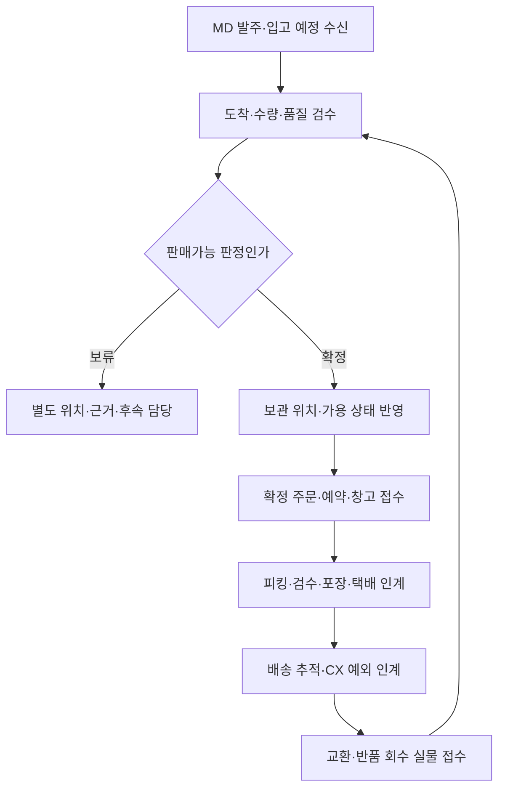
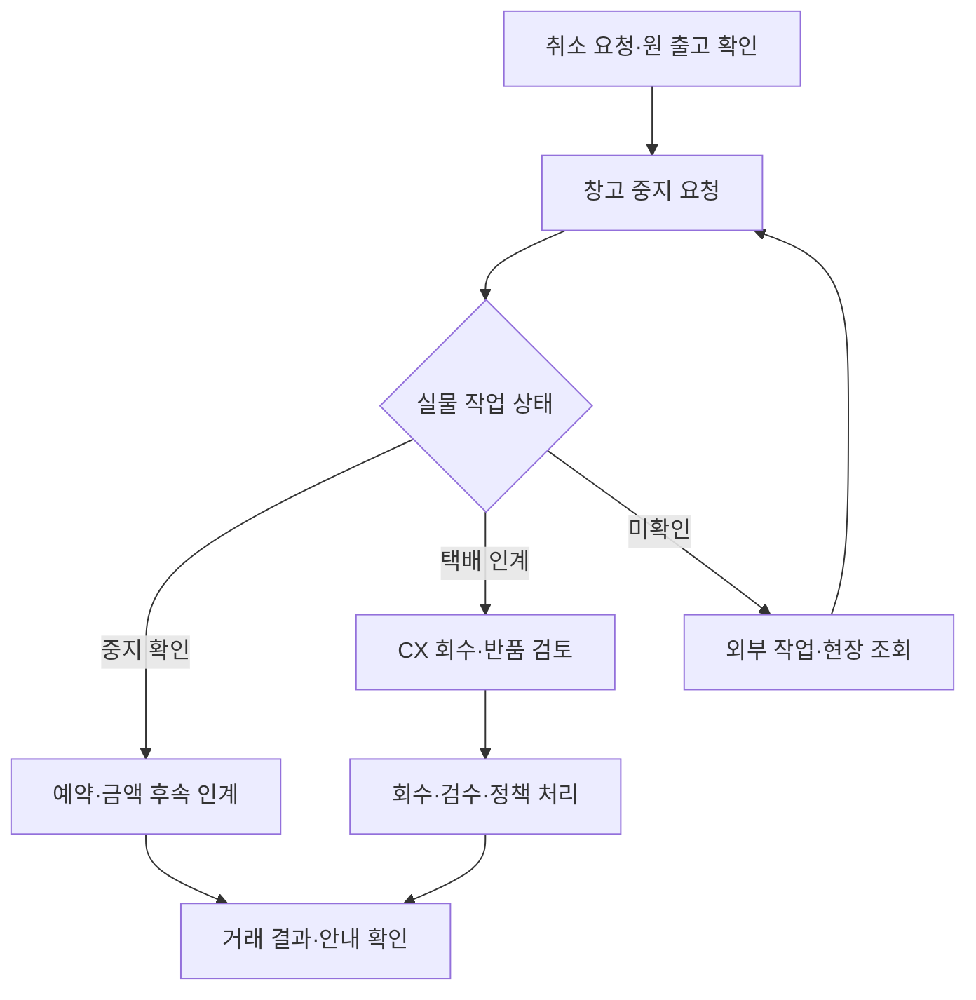

title: 시나리오: 이커머스 11 — 물류팀이 주문을 실물 배송으로 바꾼다
slug: scenario-modeline-11-fulfillment-logistics
category: 시나리오
tags: modeline,fulfillment,logistics,wms,inventory
summary: 입고·보관·재고 정확도부터 피킹·포장·집하·배송, 반품 실물과 취소 경합까지 운영한다. 3PL 협업, 일간부터 연간 용량·실사·복구 계획, 출고 배치와 물류 KPI를 설명한다.
toc: true
nextSlug: scenario-modeline-12-customer-support-returns
prevSlug: scenario-modeline-10-crm-lifecycle
publishedAt: 2026-09-12T14:32:03.675019+09:00
syncHash: be27aa651c53d42bd28a66c9ff2c240336dee5fb1d6becbd130730e70ef0658e

updatedAt: 2026-09-15T10:05:47.197577Z
---

[시리즈 종합편과 전체 목차](/102/scenario-modeline-17-company-overview)

> 모드라인은 물류관리 인력을 두고 실물 피킹·포장은 외부 3PL에 맡기는 가상 회사다. 오후 2시 마감은 이야기의 운영 가정이며 택배 서비스의 보장 시간이 아니다.

오전 주문 점검을 마친 박민수는 창고 접수 목록을 연다. 고객 A의 네이비 M 주문 `O-F26-10482`와 고객 B의 아이보리 M 주문 `O-F26-10483`이 결제 확정 상태로 들어와 있다. 두 주문 모두 고객 결제액은 53,100원이다.

고객 화면에는 배송 준비 중이라고 보일 수 있지만, 민수가 확인할 일은 더 세밀하다. 출고 명령이 실제 창고에 도착했는지, 피킹할 위치와 수량이 맞는지, 마감 전 출고할 수 있는지 확인한다. 사내 물류관리와 외부 창고가 같은 회사를 이루는 것처럼 일하되 책임은 구분한다.

3PL은 보관·포장·출고 같은 물류를 대신 수행하는 외부 업체다. WMS는 창고 작업과 재고를 관리하는 시스템이고, 피킹은 주문에 맞는 물건을 보관 위치에서 꺼내는 작업이다. 내부 주문 화면의 상태가 바뀌는 것과 창고에서 물건이 움직이는 일을 연결해야 한다.

## 사내 물류관리는 외부 창고의 실행과 고객 약속을 연결한다

모드라인의 영업운영·물류관리 조직은 8명이다. 앞 콘텐츠편에서 다룬 판매 설정과 이 글의 물류관리가 같은 조직의 업무다. 외부 3PL의 창고 작업자는 사내 80명에 포함하지 않는다. 민수는 물류의 상태·기한·차이·협력사 품질을 책임지고, 실물 피킹과 포장은 계약한 창고가 수행한다.

| 책임 영역 | 사내 담당자가 하는 일 | 외부·다음 부서와의 경계 |
|---|---|---|
| 입고 예약·검수 | 발주/입고 예정 수신, 도착 용량 배정, 수량·품질 차이 확인 | 3PL 실물 기록, MD 공급사 협의, 재무 지급 근거 |
| 보관·재고 | SKU/위치/상태별 장부, 순환 실사, 차이 조사·조정 승인 | 창고가 위치·실물 확인, 판매운영은 확정 가용 상태 사용 |
| 출고·포장·집하 | 출고 대상·마감·작업 접수·검수·운송장·택배 인계 확인 | 커머스의 거래 확정과 창고의 실물 실행을 구분 |
| 배송 예외 | 미집하·오배송·파손·분실·주소 문제·장기 미완료 추적 | 택배 확인 근거를 CX가 고객에게 안내 |
| 역물류 | 회수 접수·입고·검수·재판매/보류/기타 승인 처리 | CX의 고객 요청과 재무/거래팀 환불은 별도 책임 |
| 협력사·용량·비용 | 작업량 전망·단가 범위·청구 대사·품질 리뷰·개선 | 재무가 비용/지급 확인, 경영이 계약·투자 범위 결정 |
| 실사·연속 운영 | 재해/시스템 단절 시 안전·작업 통제·복구 대사 | 3PL 현장 책임·사내 운영/플랫폼/CX 협업 |

창고가 상품을 찾았다는 사실은 판매 가격의 승인이나 고객 환불의 근거를 모두 뜻하지 않는다. 민수도 고객의 교환 선택, 공급사 귀책, 손실의 회계처리를 혼자 확정하지 않는다. 각 담당자가 필요한 증거를 받는 구조를 만들어야 외부 업체에 맡겨도 책임이 흐려지지 않는다.

작업 담당자가 바뀌면 미접수 명령, 보류 재고의 위치, 중지 확인 대기, 택배 조사 접수번호, 다음 회신 시각을 넘긴다. 실물 확인을 요청한 사람이 퇴근했다고 조사가 끝나지 않는다. 오후 5시 인계표는 처리량과 별도로 남는 업무다.

## 물류 달력은 일간 마감과 다음 시즌의 창고 용량을 연결한다

| 주기·회의 | 입력 자료·참여 책임 | 결정·남기는 자료 |
|---|---|---|
| 매일 09시 운영 확인 | 민수·3PL, 야간 주문/재고 차이·전일 미완료·당일 입고 | 입고/출고 우선순위·보류 담당·회신 시각 |
| 매일 10시 판매 준비 | 운영·MD·그로스, 최신 가용·예정 입고·물류 제약 | 판매/기획전 가능 범위와 고객 약속 변경 필요 |
| 매일 13시30분~14시 마감 | 출고 담당·3PL, 미접수/미피킹/보류/취소 | 택배 인계·지연·중지 분류, CX 안내 자료 |
| 매일 17시 인계·대사 | 당번·대체자, 마감 이후 변화·불명·배송 예외 | 다음 조회/현장 확인·고객 안내 소유자 |
| 매주 용량·품질회의 | 민수·MD·그로스·CX·3PL, 행사/입고/반품 예측 | 인력/공간/집하 슬롯·작업 순서·시정조치 |
| 매월 재고·청구 리뷰 | 민수·재무·창고, 실사 차이·작업량·청구·미처리 | 재고 조정 근거·비용 차이·협력사 개선 요청 |
| 매분기 협력사·복구 점검 | 물류·3PL·플랫폼·CX, 품질·용량·사건·훈련 자료 | 개선/계약 검토·대체 절차·복구 보완 |
| 매년 운영·계약계획 | 경영·재무·민수, 시즌 전망·공간·단가·위험 | 창고/택배 계약 검토, 실사·성수기·교육 일정 |

전년도 10~12월에는 다음 해 입고·출고·반품의 시즌별 변동을 가정해 공간과 집하·인력 수요를 잡는다. 1~3월에는 전년 잔여 차이와 봄 운영을 점검하고, 4~6월에는 여름 운영과 가을 물량·반품 용량을 준비한다. 7~9월에는 가을 피크와 파일럿 결과를 반영하고, 10~12월에는 연말 물류와 다음 계약·용량 계획을 연결한다.

피크 계획은 주문 건수 하나로 만들지 않는다. 주문당 항목 수, 포장 방식, 입고 검수 난이도, 교환·반품 비중, SKU·위치 분산에 따라 작업이 다르다. 입고가 늘면 보관과 검수 공간도 필요하고 반품이 늘면 재출고 이전의 판정 대기 공간이 필요하다.

주간 전망에는 기준·높은 물량·지연 상황을 나눠 쓰고 3PL이 가능한 작업량과 제약을 회신하게 한다. 실제 계약 용량을 이 원고에서 새 숫자로 정하지 않는다. 감당하기 어려운 행사는 그로스·MD가 공개 시점·대상·물량을 다시 협의하고 CX가 안내 범위를 확인한다.

## 입고는 도착 예약부터 보관 위치 확인까지 이어진다

MD가 수락된 발주와 입고 예정표를 넘기면 물류는 날짜·차량/포장 단위·SKU·수량·검수 자료를 확인한다. 예약이 없어도 무조건 반려하는 식의 새 규칙을 만들지 않고 실제 계약과 현장 용량에 따라 대기·입고·재예약을 결정한다. 납기 변경은 MD와 콘텐츠·마케팅의 판매 일정에도 전달한다.

창고는 도착 실물을 포장 단위와 SKU별로 세고 손상·표시·수량 차이를 기록한다. 검수 전 또는 판정 보류 상품은 판매가능과 다른 상태·위치로 관리한다. 재고에 반영할 수량과 공급사에 요청할 수량 차이를 분리한 뒤 정상 상품의 보관 위치와 수량을 확인한다.

대표 발주 `PO-F26-041`의 최초 입고는 600장 주문 중 실물596·보류8·판매가능588·미입고4다. 판매 전 후속 재검수에서 6장 해제와 2장 공급사 반송이 완료돼 실물/판매가능594·보류0이 됐다. 미입고4는 MD 협의 대기다. 이 스냅샷을 이후 판매·예약·반품 이동 없이 현재 수량으로 사용하지 않는다.

보관 위치를 바꾸거나 피킹 위치를 보충할 때도 이동 전후의 위치·SKU·수량·작업자를 남긴다. 창고 전체 수량이 같아도 특정 위치가 틀리면 작업자가 물건을 찾지 못한다. 비슷한 색상·사이즈, 반복 오피킹, 느리게 움직이는 재고를 주간 배치 검토에 포함한다.

반품은 새 매입 입고와 원인은 다르지만 실물 확인 없이 가용 수량으로 바꾸지 않는 원칙은 같다. 보류 상태는 별도 위치와 소유자가 있어야 하고, 판정이 끝나면 재고 이동과 CX·MD·재무에 필요한 결과를 각각 남긴다. 정상 입고가 차이 조사 때문에 모두 멈추지 않도록 확정된 범위를 구분한다.

## 창고가 접수한 주문부터 작업 대상으로 삼는다

모드라인의 출고 요청에는 주문 항목, SKU, 수량, 배송 서비스와 필요한 수취 정보가 담긴다. 담당자는 거래 확정·예약 상태와 배송 조건을 확인해 계약한 창고에 전달하고, 업무에 필요한 사람만 수취 정보를 사용한다.

고객 A의 명령은 `FUL-F26-10482`, 고객 B는 `FUL-F26-10483`으로 식별한다. 창고가 접수한 외부 작업 ID와 연결하고 중복 요청을 대조한다. 전송에 성공했어도 창고 접수 결과가 없으면 미확인 목록에 남긴다.

| 단계 | 남길 증거 | 그 상태만으로 알 수 없는 것 |
|---|---|---|
| 출고 요청 | 내부 명령과 전송 결과 | 창고가 작업을 시작했는지 |
| 창고 접수 | 외부 작업 ID와 수신 확인 | 실제 상품을 찾았는지 |
| 피킹·검수 | SKU·수량 스캔과 검수 | 택배사에 인계했는지 |
| 포장·송장 | 포장 단위와 운송장 | 배송이 시작됐는지 |
| 택배 인계 | 인계·집하 결과 | 고객이 수령했는지 |
| 배송 완료 | 배송사 상태와 시각 | 고객 문제가 모두 해결됐는지 |

운송장 발급을 배송 완료로 취급하지 않는 이유가 이 표에 있다. 고객 안내에 사용할 상태는 외부 증거와 연결하고, 지연되거나 모르는 정보는 따로 표시한다.

## 피킹과 포장에서는 주문 항목 단위로 확인한다

창고 작업자는 보관 위치에서 셔츠를 집고 SKU를 스캔한다. 같은 상품의 네이비 M과 아이보리 M이 비슷한 포장이라도 SKU가 다르다. 수량과 옵션이 맞아야 다음 단계로 넘어가게 한다.

포장 단위에는 포함한 주문 항목과 수량을 남긴다. 이 두 대표 주문은 각각 한 장이라 단순하지만, 여러 상품 주문은 한 주문에 여러 출고가 연결될 수 있다. 데이터 모델을 주문 하나당 송장 하나로 고정하지 않는다.

분할 출고를 추가할 때는 새 출고 ID를 만들고 항목별 남은 수량을 관리한다. 일부를 보냈다고 주문 전체를 완료 처리하지 않는다. 배송료 지원이나 고객 동의가 필요한 변경은 승인된 회사 정책을 따르며 창고가 임의로 판단하지 않는다.

## 마감 전에는 지연될 주문을 먼저 공유한다

오후 1시 30분, 민수는 오후 2시 가상 마감에 맞춰 미접수·미피킹·보류 주문을 본다. 정상 주문은 계속 처리하고 지연 후보에 이유와 담당자를 붙인다. 목록에는 고객 연락처 대신 업무 식별자를 기본으로 표시한다.

차이 목록에는 내부 주문과 창고 상태, 마지막 확인 시각, 실물 확인이 필요한 지점을 함께 적는다. 보류 해제에는 창고의 검수와 민수의 확인이 필요하다.

민수는 CX 오수진에게 지연 대상, 확인된 사유, 다음 확인 시각을 넘긴다. 수진은 승인된 정보로 고객 안내를 준비한다. 안내에 아직 확보하지 않은 출고일이 약속으로 들어가지 않도록 확인한다.

## 취소와 출고가 겹치면 외부 상태를 다시 확인한다

피킹 시작 전 취소가 들어오는 가상 분기를 보자. 주문 시스템은 취소 요청 상태를 남기고 창고에 중지 가능 여부를 확인한다. 창고가 멈췄다는 결과를 받은 뒤 예약 해제와 결제 취소 절차를 진행한다.

이미 택배에 인계됐다면 같은 취소 경로로 처리할 수 없을 수 있다. 회수·반품 경로와 고객 안내를 검토한다. 내부 주문 상태만 취소로 바꾸고 실물 배송이 계속되는 상황을 숨기지 않는다.

중지 요청의 응답이 없으면 원 출고 ID로 창고 작업 상태를 확인한다. 중지 확정 전에는 고객에게 취소 완료를 약속하지 않는다. 확인을 요청한 시각·상대 담당·답변·다음 회신 약속을 남기고 CX와 거래 담당자가 같은 진행 상태를 읽게 한다.

## 재고 차이는 증거를 확인한 뒤 조정한다

민수는 입고, 예약, 출고, 반품과 조정 기록을 연결해 시스템 재고와 창고 실물을 대조한다. 초기 판매가능 588장에 이후 이동을 모두 반영하지 않고 현재 수량이라고 보고하지 않는다.

재고가 맞지 않으면 SKU, 창고 위치, 시점과 이동 ID로 범위를 좁힌다. 늦게 도착한 출고 이벤트인지, 잘못 스캔한 것인지, 실제 분실인지 확인한다. 재고 조정은 민수가 원인·실물 증거와 승인 기록을 남겨 수행한다.

매일 모든 상품의 실물을 전수 조사한다고 가정하지 않는다. 계약한 점검 범위와 위험도에 따라 실사·순환 점검을 계획한다. 차이가 큰 SKU와 반복 오류는 MD·개발·외부 창고가 함께 원인을 검토한다.

## 출고 마감표는 보낸 주문과 아직 책임질 주문을 함께 보여 준다

오후 2시, 민수는 그날 한 출고 배치 120건을 닫는다. 회사 전체 일평균 1,000건과는 별개의 가상 작업 묶음이다. 고객 A와 B의 최초 출고도 이 배치에 포함한다. 신규 동료는 송장 개수를 세려 하지만 민수는 택배 인계 증거부터 확인한다.

| 마감 시점의 상호 배타적 분류 | 건수 | 다음 담당자와 행동 |
|---|---:|---|
| 택배 인계 확인 | 100 | 배송 상태 추적, A·B 포함 |
| 일반 출고 지연 | 12 | 창고 접수 미확인 2·피킹 대기 10 조사 |
| 재고 검수 보류 | 4 | 창고·민수가 실물 확인 |
| 취소 요청 처리 중 | 4 | 창고 중지 확인 후 후속 거래 판단 |
| 합계 | 120 | 각 주문을 한 분류에만 포함 |

취소 요청 4건 중 창고가 3건의 중지를 확인한다. 나머지 1건은 작업 상태를 아직 확인하지 못했다. 따라서 후속 인계 시점의 분류는 택배 인계 100건, 중지 확인 3건, 출고·취소 상태를 더 확인할 17건이다. 100 + 3 + 17은 최초 120건과 맞는다.

중지 확인 3건도 결제 취소까지 완료됐다는 뜻은 아니다. 해당 거래 담당자가 예약 해제와 환불 결과를 확인한다. 미확인 1건을 취소 완료로 표시하면 실제로 출고된 상품을 놓칠 수 있으므로 17건의 후속 목록에 남긴다.

민수는 수진에게 주문 ID별 확인된 지연 사유와 다음 확인 시각을 넘긴다. 수진은 고객별 안내가 필요한지 판단하고 담당자를 배정한다. “17건을 인계했다”와 “고객 17명에게 모두 안내했다”도 다른 기록이다. 연락 결과까지 자동으로 성공 처리하지 않는다.

다음 근무자는 이 표의 합계부터 다시 만든 뒤 미확인 항목의 상태를 갱신한다. 이전 담당자의 기억을 묻는 대신 외부 작업 ID와 마지막 조회 결과를 읽는다. 같은 지연 유형이 반복되면 창고 마감 계약, 주문 전달 시간과 재고 정확도를 별도 개선 과제로 올린다.

## 배송 이후에도 인계의 끝을 확인한다

정상 배송이 완료되면 주문·출고·배송 상태와 외부 증거를 연결한다. 고객 A는 이후 사이즈 교환을 요청하고 고객 B는 상품 문제 반품을 접수한다. 그때 CS가 최초 출고 항목을 찾을 수 있어야 회수와 대체 출고를 구분한다.

민수의 하루 결과는 발송 건수만이 아니다. 미출고, 불명 상태, 재고 차이와 다음 조치를 남겨야 다음 근무자가 일을 이어갈 수 있다. 배송사 상태 지연과 외부 창고의 실물 작업은 시스템만으로 즉시 해결할 수 없다는 한계도 함께 기록한다.

## 취소 중지와 배송 예외는 외부의 확인으로 분기한다

중지 확인과 금액 취소는 서로 다른 완료다. 출고 배치의 중지 확인3건도 거래 담당자가 후속 처리를 해야 한다. 미확인1건은 일반 지연12·재고 보류4와 함께 후속17건으로 남는다. 합계가 맞는 것과 모든 주문이 해결된 것은 다른 조건이다.

배송 예외는 원인이 확인되기 전에도 담당자를 배정한다. 송장은 있으나 집하가 없으면 창고 반출·택배 인계를 확인하고, 배송완료인데 미수령 문의가 오면 배송사 근거와 고객 상황을 CX가 확인한다. 분실·파손 의심은 사진과 포장/인계 기록을 보존하되 보상·귀책을 미리 확정하지 않는다.

주소 변경은 고객 요청을 받았다는 표시만으로 완료하지 않는다. 해당 실물 단계에서 변경할 수 있는지 창고·택배가 확인해야 한다. 이미 넘긴 물건의 내부 주소만 고치면 서로 다른 주소가 남는다. 고객에게 가능한 선택과 확인된 결과를 전달하는 주체는 CX로 정한다.

| 가상 인계 자료 | 보내는 내용 | 수신·종료 기준 |
|---|---|---|
| FUL-F26-10482/10483 | A·B 원주문/항목, 창고 작업·택배 인계 증거 | CX가 최초 배송 근거 조회 가능, 배치100 안에 포함 |
| 마감 후 후속17건 | 지연12·재고보류4·취소불명1, 주문별 다음 확인 | CX가 안내 필요·담당을 회신, 물류는 외부 확인 계속 |
| EX-F26-021 역물류 | 반송 M의 접수·검수, 대체 S 확보·출고 별도 | CX가 FUL-F26-EX021 배송까지 추적 |
| RET-F26-032 실물 | B 반품의 회수·검수·재판매 판정 | CX가 환불 판단 자료 수신, 재고·환불 상태 독립 |
| 월말 물류 차이 | 작업량·청구·실사·조정 근거와 미확정 사유 | 재무 RECON-F26-09의 담당과 후속 확인 연결 |

## 반품 공간과 검수 용량도 정상 운영에 포함한다

회수 물건에는 원 주문·항목·접수 ID를 연결한다. 외부 포장만으로 주문을 알 수 없거나 수량이 다르면 미식별/차이 상태로 보관하고 CX에 확인을 요청한다. 고객이 접수한 품질 사유와 창고의 실제 판정은 별도 기록이다.

검수자는 상품·구성품·상태와 요청 내용을 확인해 재판매 가능, 추가 확인 보류, 승인된 별도 처리로 나눈다. 회수되었다는 사실만으로 가용 재고를 더하지 않는다. A의 M 회수·판정과 S 교환 출고를 구분하고, B의 환불 성공과 반품 실물의 상태도 구분한다.

민수는 반품 처리 대기 기간과 위치별 잔량을 본다. 출고만 우선해 반품이 쌓이면 CX의 확인 요청, 가용 재고, 재무의 원가 근거가 함께 지연된다. 물량 전망과 실제 도착을 비교해 검수 인력·공간을 3PL과 조정한다.

## 실사·청구·복구를 통해 협력사의 결과를 검증한다

순환 실사는 위험도와 거래량, 반복 차이를 고려해 SKU·위치를 나눠 점검한다. 조사 시각과 이동 중 작업을 통제하지 않으면 시스템과 실물을 다른 순간에 세게 된다. 실사자는 장부·실물 차이를 기록하고 독립적인 재확인과 조정 승인 근거를 남긴다. 차이를 0으로 맞추는 것이 목적이 아니라 발생 원인을 설명하는 것이 목적이다.

월간 청구는 보관·입고·피킹/포장·배송·반품·추가 작업 등 실제 계약의 과금 단위를 확인한다. 주문 건수와 포장 건수, 작업 수량을 섞지 않고 원 작업·단가·청구서에 연결한다. 분쟁 항목은 미확정으로 남기고 나머지 지급은 실제 계약과 재무 승인에 따른다.

분기 협력사 리뷰는 준수율만 낭독하지 않는다. 반복 지연·오출고·검수 적체의 원인, 지난 시정조치의 완료와 재발 여부, 다음 시즌 용량을 확인한다. 바뀐 포장이나 위치 운영은 작업 교육과 확인 자료까지 받아야 정착했다고 볼 수 있다.

재해·정전·시스템 단절 상황에서는 현장 안전 확인, 작업 가능 범위, 접수/처리 중인 물량을 먼저 파악한다. 물류·3PL·플랫폼이 확인한 범위로 신규 작업·고객 약속을 조정하고 CX에 다음 안내 시각을 준다. 확인되지 않은 재고를 모두 정상 판매로 돌리지 않는다.

수동 절차를 사용한다면 임시 작업 번호·원 주문·SKU·수량·담당자·시각을 남기고 복구 후 원래 작업과 대조한다. 수동으로 이미 나간 상품을 시스템 복구 뒤 다시 내보내지 않도록 미확인 작업을 별도로 잠정 보류한다. 모의 점검 결과와 남은 공백은 분기 개선 목록에 남긴다.

## 물류 KPI는 송장 수보다 약속과 실물의 정확성을 읽는다

다음은 내부 지표 정의다. 14시 마감은 예시이며 실제 계약 목표가 아니다. 예정 처리 집합은 마감 전 고정하고, 불편한 주문을 나중에 분모에서 지워 준수율을 올리지 않는다.

P90은 대상 건의 90%가 그 값 안에 들어오는 경계다. 중앙값만으로 보기 어려운 긴 대기를 함께 읽기 위한 값이며, 완료 건의 시간과 아직 열린 작업의 시간을 별도 집합으로 계산한다.

분모·누락·잠정치 표시는 [시리즈 공통 해석 규칙](/96/scenario-modeline-17-company-overview#지표의-공통-해석-규칙을-먼저-맞춘다)을 따른다.

### 지표의 계산 기준을 한눈에 본다

| 지표·단위 | 계산·관찰 기준 | 원천·책임·검토 주기 |
|---|---|---|
| 약속 내 택배 인계율 · 출고 작업 | 합의 인계 시각까지 증거가 확인된 대상 작업 수 ÷ 같은 시각까지 인계하기로 한 작업 수 ×100; 일간 | 마감 전 대상·집하 증거, 민수, 일일/주간 |
| 확인 오출고율 · 출고 작업 | 인계 후 30일 안에 상품/수량 오류가 확인된 작업 수 ÷ 30일 경과 인계 작업 수 ×100 | 검수·CX 판정, 물류·CX, 월간 |
| 위치별 재고 일치율 · 실사행 | 같은 시점·SKU·위치·상태의 실물과 장부 수량이 일치한 행 수 ÷ 실사행 수 ×100; 점검별 | 실사 원본·재고 원장, 재고 담당, 주간/월간 |
| 열린 작업의 기한 초과시간 | 현재 시각−해당 작업의 약속 시각, 기한 미경과는 0; 열린 작업의 최대/P90·분류별 건수 | 출고/중지/배송 조사 대장, 민수, 일일 |
| 반품 검수 리드타임 · 회수 접수 | 창고 실물 접수부터 검수 판정까지 경과시간 중앙값/P90; 월 완료 집단 | 반품 입고·판정, 역물류 담당, 주간/월간 |
| 출고 단위원가 · 포장 건 | 같은 기간 확정 피킹·포장·최초 배송 비용 ÷ 택배 인계 포장 건수; 월간, 반품/보관비 별도 | 포장·청구·재무 비용, 민수·도현, 월간 |

### 수치를 해석하고 다음 행동으로 연결한다

| 지표 | 해석할 때 주의할 점 | 다음 행동 |
|---|---|---|
| 인계율 | 송장 발급은 인계가 아니다. 취소 제외는 사전 정의하고 원 배치와 연결한다 | 미접수·피킹·재고·택배 원인별 조사, 마감/용량 협의 |
| 오출고율 | 고객 제보 시차와 미확인 사유가 있어 최신 배치와 성숙 집단을 분리한다 | 위치·SKU 식별·검수 과정 점검, 영향 주문과 재교육 추적 |
| 재고 일치율 | 작은 오차와 큰 분실이 동일 한 행이므로 수량/원가 차이도 함께 본다 | 이동 누락·지연·스캔·실물 손실을 분리, 근거 승인 후 조정 |
| 열린 작업의 기한 초과시간 | 완료된 쉬운 작업만의 처리시간은 적체를 숨긴다 | 약속을 가장 오래 넘긴 고객 영향 작업에 조사 책임과 확인 시각 배정 |
| 검수 리드타임 | 완료 집단만 보면 미식별·보류 재고가 사라진다 | 열린 반품의 나이·공간·자료 대기를 함께 확인, 검수 용량 조정 |
| 단위원가 | 분할 출고·포장 난이도·비용 미도착에 따라 달라진다 | 계약 과금 단위 대사, 포장/작업 변경안을 품질과 함께 검토 |

120건 배치에서 택배 인계100건은 상호 배타적 상태 집계다. 그 표만으로 약속 내 인계율의 확정 실적을 계산하지 않는다. 마감 전 적격 대상과 취소 제외 규칙을 알아야 분모를 정할 수 있기 때문이다. 이 구분이 전사 배송 지표와 부서 작업 지표를 연결하는 기준이다.

## 개발·AI 활용은 업무 운영과 구분해 설계한다

### 실물 작업과 외부 결과를 독립된 상태로 연결한다

내부 출고 요청·외부 창고 작업·피킹/포장·운송장·택배 인계·배송 완료를 각각 기록한다. 주문 하나에 출고 하나만 가정하지 않고 항목·수량별 부분/교환 출고를 원 주문에 연결한다. 예약·판매가능·보류·반품 상태가 서로 어떻게 이동하는지도 명시한다.

출고 어댑터에는 필요한 필드와 권한만 주고 명령 ID로 요청·조회·재처리를 연결한다. 응답 유실에서 새 출고 ID를 만들면 중복 출고 위험이 생긴다. 외부 업체의 중복 키·조회·취소 지원은 실제 계약/API별로 확인해야 하며 지원하지 않는 구간에는 현장 확인과 수동 대사를 둔다.

검사는 원본 배치120의 상태 합계, 후속100+3+17, 중지 확인과 환불 완료의 구분, 늦은 상태·중복 수신·분할 출고·수동 복구를 포함한다. 내부 전송 성공만으로 외부 exactly-once 실행을 보장한다고 쓰지 않는다. 외부 상태가 불명이면 담당자와 다음 조회를 남긴다.

### AI는 차이의 근거와 안내 초안을 묶는다

입력은 승인된 주문/창고 상태, 비식별 차이 목록, 계약에서 확인한 운영 규칙과 검수 메모다. 출력은 불일치 분류 후보, 조사 질문, 확인된 정보만 담은 CX 안내 초안이다. 분석용 모델에 고객 주소 전체나 출고·재고 조정 권한을 주지 않는다.

수량 합계는 코드로 계산하고 실물 이상·보류 해제는 창고와 민수가 판정한다. 모델이 출고 가능하다고 설명해도 재고를 바꾸거나 확보되지 않은 배송일을 약속하지 않는다. 검토자는 근거의 시각·원천과 실제 상태를 대조하고 반려 이유를 기록한다.

별도 심화 후보는 WMS 연동·중복/불명 복구, 상태별 재고 원장과 실사, 부분 출고·역물류 모델, 수동 운영 후 복구 대사다. 현재 문서는 운영 설계이며 실제 외부 창고 성능·복구시간·비용 개선을 측정한 결과는 아니다.
