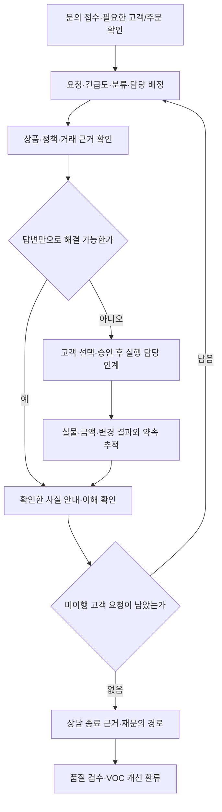
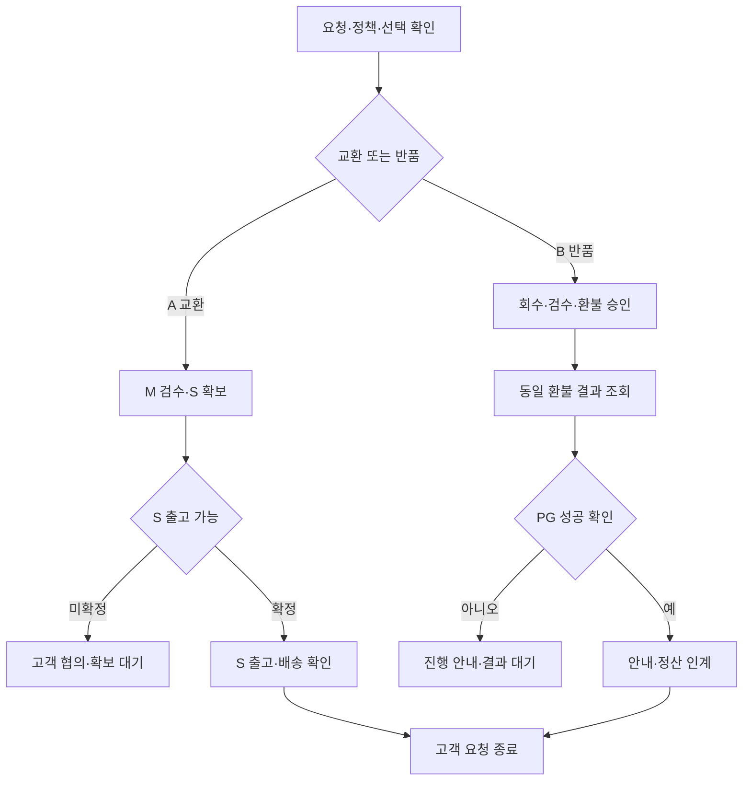

title: 시나리오: 이커머스 12 — CX·CS가 구매 전 문의부터 교환·환불·반복 문제까지 책임진다
slug: scenario-modeline-12-customer-support-returns
category: 시나리오
tags: modeline,customer-support,returns,refunds,harness-engineering
summary: 구매 전 상담·주문 변경·배송·교환·반품·환불과 불만·분쟁 연계를 설명한다. 일간부터 연간 운영, 상담 품질·교육·VOC, 고객 A/B의 후속 기록과 KPI로 CX·CS의 전체 업무를 정리한다.
toc: true
nextSlug: scenario-modeline-13-financial-close
prevSlug: scenario-modeline-11-fulfillment-logistics
publishedAt: 2026-09-12T14:32:04.115329+09:00
syncHash: ed83436a070f638a634c7473323e07069e4ef3edcbd274b086a8a4839c1f4508

updatedAt: 2026-09-15T10:05:47.923887Z
---

[시리즈 종합편과 전체 목차](/102/scenario-modeline-17-company-overview)

> 두 고객과 거래는 가상이다. 배송료 지원은 이 예시에 대한 회사의 승인 설정이다. 반품 사유별 권리·비용·기한은 실제 법과 계약을 검토해야 하며 이 이야기의 처리 순서가 이를 대신하지 않는다.

CX 리드 오수진은 아침 상담 목록에서 두 건을 나란히 연다. 고객 A는 네이비 M 셔츠의 소매가 길어 S로 교환하고 싶다. 고객 B는 아이보리 M의 상품 문제로 반품·환불을 요청한다.

둘 다 상품을 돌려보내지만 같은 업무는 아니다. A에게는 다른 사이즈를 보내야 하고 B에게는 결제액을 환불해야 한다. 수진은 자연스러운 답변을 만드는 것보다 고객이 요청한 처리와 회사의 실제 실행을 맞추는 데서 시작한다.

CS는 고객의 문의와 요청을 처리하는 업무이고, CX는 그 경험을 넓게 살피며 반복 문제를 개선하는 역할이다. 모드라인에서는 같은 조직이 두 일을 연결한다. 상담사는 답변을 쓰는 사람인 동시에 물류·결제 담당자가 처리할 일을 정확히 만들어 주는 사람이다.

## CX·CS는 답변과 실행, 반복 문제 개선을 함께 소유한다

모드라인의 CX·CS는 10명이다. 오수진을 중심으로 상담 접수·처리, 물류/환불 후속 확인, 품질 검수·교육, VOC 분석의 역할을 나눈다. VOC는 고객이 전하는 의견과 불편을 뜻한다. 10명 전체가 같은 난도의 상담만 처리한다고 가정하지 않고 검수·교육·휴가·인계에 필요한 여력을 계획한다.

| 업무 범위 | 실제로 처리할 요청 | 결과와 책임 경계 |
|---|---|---|
| 구매 전 상담 | 상품 사실·실측·옵션·재고·배송 조건·혜택 질문 | 승인 자료로 답변, 모르는 사실은 콘텐츠/MD/운영 확인 |
| 주문·결제·배송 | 주문 연결·상태 확인, 변경/취소, 혜택 적용 문의, 지연/오배송 | 고객 요청을 거래·물류 작업에 연결, 실행 결과 확인 |
| 교환·반품·환불 | 접수·정책 확인·회수·검수·대체 출고·금액 처리 | A/B처럼 실물·금액·안내를 각각 추적 |
| 불만·분쟁 | 반복 미해결, 오안내, 비용/품질 이견, 외부 기관 문의 | 리드/전문가 검토, 근거·고객 약속·진행 소유자 |
| 상담 운영 | 분류·배정·대기·대체 담당·미완료 관리 | 큐/인계표·다음 확인 시각, 답변 후 실행 대기 보존 |
| 품질·교육·지식 | 답변 정확성·정책 일치·정보 보호·공감·인계 검수 | 표본 QA·정책/템플릿 갱신·코칭 |
| 고객 경험 환류 | 원문과 원인 가설 분리, 반복 문제 우선순위, 개선 추적 | VOC 카드·제품/상품/콘텐츠/물류 수신과 효과 확인 |

CX는 고객에게 안내한 약속을 책임지지만 모든 외부 실행을 직접 확정하지는 않는다. 창고가 중지했는지 물류가 확인하고, 환불 결과는 거래·PG 근거를 읽으며, 공급사 귀책은 MD와 검수 자료로 판단한다. 수진은 정책 안의 상담 판단과 예외 검토 경로를 책임지고, 위임 범위를 벗어난 보상·정책 변경은 승인권자에게 올린다.

고객이 같은 문제로 여러 채널에서 연락하면 주문과 요청을 확인해 하나의 문제 기록에 연결한다. 서로 다른 문제를 무조건 병합하지 않고, 현재 담당자와 각 요청의 남은 결과를 유지한다. 고객이 담당자를 다시 설명해야 하는 상황을 줄이는 것이 인계의 목적이다.

## 구매 전 답변도 상품 사실과 고객의 선택을 정확히 연결해야 한다

상품 상담은 사이즈를 단정해 추천하는 일부터 시작하지 않는다. 고객이 알고 싶은 용도와 비교 기준을 확인하고, 승인된 실측·측정 방법·착용 정보·옵션을 안내한다. 개인의 몸에 반드시 맞는다는 보증이나 사진에 없는 기능을 덧붙이지 않는다. 정보가 불충분하면 확인할 담당자와 다음 답변 시점을 정한다.

혜택 문의에서는 대상 고객·상품·기간·중복 조건을 실제 정책으로 확인한다. 표시 가격과 결제 예상이 다르면 사용 조건과 주문 화면을 운영 담당자에게 확인하고, 임의 쿠폰을 약속하지 않는다. 판매 전의 588/594장 기록 대신 현재 가용 상태를 보되, 재고 확인 시점이 구매 확보를 뜻하지 않는다는 점을 설명한다.

배송일 문의에는 확인된 출고 기준과 현재 처리 상태를 안내한다. 아직 택배사가 확정하지 않은 수령일을 확약하지 않는다. 고객이 중요한 사용일을 알려 주면 가능한 범위와 불확실성을 전달하고 선택할 수 있게 한다. 상담 목표는 구매를 강하게 유도하는 것보다 실제 제공할 조건을 이해시키는 것이다.

## 접수와 배정에서 무엇을 해결해야 닫을 수 있는지 정한다

상담 기록에는 접수 시각·채널, 필요한 고객/주문 확인 결과, 요청 요약, 상품/주문/접수 ID, 분류, 현재 사실, 고객이 원하는 결과, 정책 버전, 담당자·다음 확인 시각을 남긴다. 원문은 사실대로 보존하고 상담사가 추정한 원인은 별도 필드에 둔다.

분류는 상품 정보, 혜택, 결제, 주문 변경, 배송, 교환, 반품/환불, 품질, 불만/분쟁, 계정/개인정보 등으로 시작한다. 세부 분류는 실제 사례를 보고 조정하되 이전 분류와 변경 이유를 보존한다. 분류하기 어려운 문의를 기타로 넣고 닫지 않고 검토 담당자를 둔다.

우선순위는 접수 순서에 고객 영향·미이행 약속·거래 위험을 함께 반영한다. 구매금액이 크다는 이유만으로 모든 긴급도를 결정하지 않는다. 담당자의 역량과 현재 열린 작업을 보고 배정하고, 전문가나 다른 부서가 필요한 건은 주 담당자를 유지한 채 하위 작업을 만든다.

종료는 고객이 매번 확인 버튼을 눌러야만 가능한 상태로 고정하지 않는다. 처리 유형별로 필요한 실행 증거와 안내가 끝났는지 확인하고 회사가 정한 절차에 따라 종료한다. 고객 회신 대기·다른 부서 확인 대기는 열린 작업의 사유이며 답변을 한 번 보냈다는 이유로 사라지지 않는다.

## 하루의 큐를 주간 품질과 연간 서비스 계획으로 연결한다

| 주기·회의 | 입력 자료·참여 책임 | 판단·다음 산출물 |
|---|---|---|
| 매일 09시 큐 점검 | 수진·당번, 야간 문의·고객 약속·장기 대기·미확인 환불 | 우선순위·배정·대체 담당과 확인 일정 |
| 매일 판매/배송 점검 | 운영·그로스·콘텐츠의 판매 조건·14시 지연 자료 | 안내할 사실·예상 문의·임시 지식, 거래 안내 소유자 |
| 매일 17시 인계 | 상담·후속 담당, 열린 요청·고객 답변·외부 조회 | 다음 행동·담당·약속 시점, 처리한 상태와 남은 상태 |
| 매주 품질·교육회의 | 수진·상담사, 위험/일반 표본·재문의·오안내 | 평가 기준 보정·코칭·템플릿 변경·다음 확인 |
| 매주 VOC 협업 | CX·MD·콘텐츠·운영·제품, 반복 문제와 근거 | 원인 조사/개선 카드·수신 담당·재검토 조건 |
| 매월 서비스 리뷰 | CX·재무·피플·운영, 문의량/난도·대기·비용·성숙 지표 | 근무/교육 여력, 반복 원인 우선순위, 정책 개선안 |
| 매분기 정책·훈련 | 수진·전문가·거래/물류, 정책 변경·분쟁·사건 사례 | 지식/권한/교육 갱신, 피크·장애 대응 점검 |
| 매년 서비스 계획 | 경영·CX·피플·재무, 시즌·고객 약속·채용/교육·비용 | 서비스 범위·인력/계약 계획·품질/개선 목표 |

전년도 10~12월에는 다음 해 시즌·캠페인·고객 접점 변화에 따른 상담 수요와 서비스 범위를 계획한다. 1~3월에는 전년 반복 문제와 봄 판매 지식을 갱신하고, 4~6월에는 상반기 상담 품질과 가을 피크 교육을 준비한다. 7~9월에는 가을 상품·혜택·배송 예외를 운영하며, 10~12월에는 반품·불만 후속과 연말 운영을 다음 계획에 반영한다.

상담 용량은 문의 건수뿐 아니라 처리시간·후속 작업·동시 열린 건·교육·휴가를 포함해 산정한다. 캠페인 때문에 문의가 늘어날 전망이면 그로스가 공개 전에 조건과 예상 규모를 공유한다. 수진은 FAQ·교육·우선순위·추가 지원 범위를 제안하고 감당하지 못할 약속은 관련 부서와 조정한다.

회의 자료에는 지난 결정이 실제 반영됐는지 적는다. 템플릿을 바꾸기로 했는데 상담 화면에 옛 문구가 남았다면 교육 완료로 닫지 않는다. 신입과 대체 담당자가 같은 근거로 처리할 수 있는지 표본을 읽어 확인한다.

## 상담 전에 고객과 주문의 연결을 확인한다

상담 화면은 필요한 본인·주문 확인을 거친 뒤 해당 주문만 조회한다. 고객이 메시지에 적은 주문 번호를 근거로 다른 사람의 결제나 배송 정보를 보여 주지 않는다. 조회한 정보는 해당 요청 처리에 필요한 범위로 사용한다.

| 항목 | 고객 A | 고객 B |
|---|---|---|
| 원 주문 | O-F26-10482 | O-F26-10483 |
| 원 SKU | SH017-NV-M | SH017-IV-M |
| 접수 | EX-F26-021 | RET-F26-032 |
| 요청 | 네이비 S 교환 | 상품 문제 반품·환불 |
| 고객 결제 | 53,100원 | 53,100원 |
| 다음 결과 | 회수·검수와 대체 S 출고 | 회수·검수와 53,100원 환불 |

수진은 적용 정책의 버전과 고객에게 안내한 내용을 남긴다. 실제 소비자 권리와 환급 의무는 [전자상거래 소비자보호법 원문](https://www.law.go.kr/법령/전자상거래등에서의소비자보호에관한법률), 관련 기준과 계약을 확인해야 한다. 이 예시의 검수 단계가 모든 환불을 임의로 지연할 근거는 아니다.

## 교환은 돌아오는 상품과 나가는 상품을 나눠 처리한다

고객 A의 `EX-F26-021`을 접수한 수진은 민수에게 네이비 S 재고와 회수 절차를 확인한다. S 확보는 원래 M 판매와 별도의 예약이다. 요청을 받았다는 이유로 대체 상품이 확보됐다고 안내하지 않는다.

회수된 M은 우선 검수 대기로 들어간다. 창고가 판매 가능한 상태라고 판정한 경우에만 가용 재고에 복귀한다. 반송 접수 시점에 수량을 미리 더하면 아직 도착하지 않은 상품을 판매할 수 있다.

대체 출고에는 `FUL-F26-EX021`이라는 새 ID를 부여하고 원 주문·교환 접수와 연결한다. 고객에게 두 번째 송장이 생겨도 새 매출을 만든 것이 아니다. 이 가상 교환에서는 원결제 53,100원을 유지하며 배송료 지원을 별도 비용으로 남긴다.

S가 확보되지 않는 분기에서는 대체 일정이나 다른 처리 방법을 고객과 확인한다. 시스템이 임의로 색상이나 사이즈를 바꾸지 않는다. 고객이 선택한 결과와 필요한 재승인을 기록한 뒤 다음 작업으로 넘어간다.

## 반품은 실물 처리와 금액 처리를 각각 끝낸다

고객 B의 `RET-F26-032`는 회수·검수 뒤 53,100원을 환불하는 가상 흐름으로 둔다. 상품 문제 판정과 재판매 가능 여부는 따로 기록한다. 환불했다고 반품 상품이 판매가능 재고가 되는 것은 아니다.

환불 요청은 `REF-F26-032`로 식별하고 원결제 `PAY-F26-10483`에 연결한다. 거래 담당자는 원결제, 이미 환불한 금액, 남은 환불 가능 범위와 승인 대상을 확인한다. 고객이 적은 금액만으로 처리액을 결정하지 않는다.

| 확인 단계 | 수진이 고객에게 설명할 수 있는 사실 |
|---|---|
| 접수 | 반품·환불 요청이 등록됐다 |
| 처리 승인 | 정해진 금액과 방식으로 진행하기로 했다 |
| PG 요청 | 결제 제공자에 요청했고 결과를 확인 중이다 |
| PG 성공 | 제공자가 해당 환불 처리를 성공으로 확인했다 |
| 정산 반영 | 재무 자료에도 취소·차감이 연결됐다 |

PG 성공과 고객 계좌·카드 내역의 표시 시점은 결제수단과 제공자 조건에 따라 다를 수 있으므로 확인된 안내를 사용한다. 확인되지 않은 환급 도착 시점을 임의로 약속하지 않는다.

## 환불 결과를 모르면 진행 상태와 다음 확인을 안내한다

환불 요청의 결과를 아직 확인하지 못한 분기에서는 원결제와 `REF-F26-032`를 거래 담당자에게 조회 요청한다. 수진은 요청한 사실과 확인 대기 상태를 고객에게 안내하고, 다음 회신 시각과 담당자를 둔다. 응답이 없다는 이유로 실패나 완료를 확정하지 않는다.

여러 상품의 부분 반품이라면 항목별 처리 범위와 할인·배송료 배분은 승인된 정책과 거래 근거를 확인한다. 원 요청과 고객이 동의한 변경을 보존하고 남은 항목·금액·작업이 무엇인지 설명한다. 이 대표 사례는 한 장씩의 주문이므로 실제 복합 주문을 모두 검증한 예시는 아니다.

## 상담을 닫기 전에 두 고객의 후속 작업을 따로 읽는다

신규 상담사가 고객 A에게 교환 접수 안내를 보낸 뒤 완료 버튼을 누르려 한다. 수진은 접수된 요청과 실행된 결과를 함께 연다. 아래는 여러 날에 걸친 가상 후속 기록을 요약한 것이며 같은 날 모두 처리했다는 뜻이 아니다.

| 고객·확인 장면 | 확인된 결과 | 남은 일과 다음 담당자 |
|---|---|---|
| A · 최초 접수 | M 회수 요청, S 확보 여부 확인 중 | 물류가 대체 S 예약 가능 여부 회신 |
| A · 검수·재고 확인 후 | 돌아온 M의 판정, 대체 S 예약 확인 | FUL-F26-EX021 출고·배송 추적 |
| A · 대체 배송 확인 후 | S 배송 확인, 고객 요청 처리 이력 연결 | 추가 문의 여부 확인 후 상담 종료 |
| B · 검수·환불 승인 후 | 53,100원 환불 대상 확정 | REF-F26-032의 PG 결과 확인 |
| B · PG 성공 확인 후 | 같은 환불 ID의 성공 증거 확보 | 고객 안내, 재무 정산 대기 목록에 인계 |

A의 교환을 처리하면서 M 회수 완료와 S 배송 완료를 같은 칸에 넣지 않는다. 회수는 됐지만 S가 없을 수 있기 때문이다. 고객에게는 확인된 단계와 다음 확인 시각을 안내하고, 선택 변경이 필요하면 고객 의사를 다시 받는다.

B는 PG 성공이 확인되면 그 사실과 결제수단별 확인 가능한 안내를 전달한다. 이후 PG 정산 자료에 차감이 나타나는 일은 재무 담당자가 계속 추적한다. 상담사가 은행 마감일까지 모든 내부 업무를 붙잡지 않도록, 고객 요청의 완료와 재무 인계의 완료를 별도로 관리한다.

수진은 반복 문의를 정리할 때 고객 원문의 사실과 내부 원인 분류를 나눈다. A의 “소매가 길다”는 의견을 곧바로 상품 불량으로 바꾸지 않고, B의 문제도 검수 판정 없이 공급사 귀책으로 확정하지 않는다. 비식별 사례에는 상품·옵션·구매 당시 설명 버전과 판정 근거를 연결한다.

다음 제품 회의에서 수진은 소연에게 실측 안내를 재확인할 사례를, 지은에게 선택 화면에서 정보가 보였는지 검토할 요청을 넘긴다. 상대가 접수한 개선 카드가 생기면 상담 기록에 연결한다. 문의 분류표를 만드는 데서 멈추지 않고 무엇을 바꿀 검토로 이어졌는지 추적한다.

## 고객의 표현을 다음 상품과 개발에 돌려준다

처리가 끝난 뒤 고객 A의 소매 길이 의견은 실측 표시 개선과 상품 검토 자료로 연결한다. B의 상품 문제는 검수와 공급사 협의로 보낸다. 원문 개인정보는 필요한 권한 안에서 관리하고 다른 부서에는 목적에 맞는 집계를 전달한다.

수진은 첫 응답 시간 외에 재문의, 미완료 거래, 오안내, 재작업과 고객 불만을 본다. 한 건의 교환을 전체 사이즈 문제로 일반화하지 않고 충분한 관찰 자료가 생길 때까지 신호로 둔다.

상담 운영의 성과는 응답 문장을 빠르게 작성하는 것만으로 판단할 수 없다. 고객이 요청한 결과가 실제로 실행됐고, 다음 부서가 그 결과를 읽을 수 있어야 일이 끝난다. 정책 해석이나 분쟁처럼 사람이 책임져야 할 영역은 계속 남는다.

## 교환과 반품은 고객이 선택한 결과로 각각 수렴한다

도표의 대기는 완료가 아니다. S 확보나 환불 결과의 새 근거가 도착하면 같은 접수에서 해당 확인 단계를 다시 진행한다. 다음 확인 시각과 담당자를 남기며 새 교환·환불 요청을 중복으로 만들지 않는다.

도표는 이 두 가상 주문의 흐름이다. 모든 반품에 회수·검수를 임의의 선행 장벽으로 두거나 내부 정산이 끝날 때까지 고객 환급을 늦추는 규칙이 아니다. 적용할 권리·기한·비용은 실제 법령·계약과 담당 검토에 따라 정하고, 예외가 있으면 그 근거와 실행 경로를 기록한다.

A는 대체 S 배송까지 추적하고 원결제53,100원을 유지한다. B는 같은 환불 ID의 PG 성공을 확인해 고객에게 안내한 뒤 재무가 정산 반영을 계속 확인한다. 여러 날에 걸친 후속 기록을 당일 상담 처리량으로 합산하지 않는다.

## 불만과 분쟁은 고객 주장·회사 사실·판단을 구분해 관리한다

불만 고객에게 필요한 첫 작업은 어떤 약속이 이행되지 않았고 어떤 결과를 원하는지 확인하는 일이다. 수진은 최초 안내, 주문 당시 상품·정책 버전, 고객 주장, 실물/금액 증거, 현재 가능한 대안을 나눠 정리한다. 같은 질문을 반복하지 않도록 조사 담당자와 고객에게 회신할 담당자를 정한다.

품질·비용 이견이 있으면 고객의 원문을 바꾸지 않고 검수·계약의 근거와 비교한다. A의 “소매가 길다”는 의견을 불량 확정으로, B의 상품 문제를 즉시 공급사 귀책으로 바꾸지 않는다. 근거가 충돌하면 리드와 관련 담당·전문가가 검토하고 확정되지 않은 결론은 안내하지 않는다.

보상이나 정책 예외를 검토할 때는 당시 안내·고객 영향·가능한 대안·권한 범위·형평성을 적는다. 상담사가 빨리 닫기 위해 승인되지 않은 비용을 약속하지 않는다. 결정되면 금액/방법/담당/시행 근거를 남기고 다음 상담사가 같은 고객에게 상반된 답을 하지 않게 한다.

외부 기관이나 법률 검토가 필요한 요청은 담당 창구로 연결하고 수진이 고객 진행 연락을 계속 소유한다. 실제 회신 기한은 적용 규정과 접수 문서를 확인해 담당자가 캘린더에 등록한다. 이 원고는 임의의 법정 일수나 회사가 모든 분쟁에서 취할 일률적 결론을 만들지 않는다.

상담사에게 위협적이거나 반복적으로 과도한 상황이 생기면 리드가 개입하고 담당자 교체·접촉 방식·기록·지원 절차를 검토한다. 고객 문제의 조사와 직원 지원을 함께 관리한다. 특수 사례를 전체 고객 정책으로 바꾸지 않고 다음 교육과 운영 개선에 필요한 범위로 다룬다.

## 상담 품질을 평가한 뒤 지식과 업무 원인을 함께 고친다

품질 검수는 일반 상담의 무작위 표본과 환불·분쟁·오안내 등 위험 표본을 구분한다. 위험 표본을 많이 본 결과를 전체 상담 오류율로 일반화하지 않는다. 검수자는 요청 이해, 사실·정책의 정확성, 필요한 확인, 설명의 명확성, 고객 정보 범위, 다음 작업·약속, 종료 근거를 확인한다.

오류는 단순 표현, 지식 누락, 정책 오해, 실행 인계 누락, 정보 노출 등으로 나눈다. 사실과 금액을 잘못 안내한 사례를 친절 점수가 높다는 이유로 상쇄하지 않는다. 상담사와 검수자가 판단이 다르면 근거를 읽고 기준을 보정하며, 개인 탓으로 닫기 전에 지식·화면·정책 자체의 모호함을 확인한다.

신입 교육은 상품·주문·정책 지식, 대표 사례 연습, 감독 아래 처리, 독립 처리 가능한 범위 확인으로 이어진다. 새로운 혜택·상품·환불 조건이 나오면 기존 담당자도 변경 교육을 받는다. 교육 출석뿐 아니라 같은 사례에서 필요한 근거와 다음 행동을 찾는지 확인한다.

지식 문서에는 질문 유형, 적용 범위, 승인 사실, 정책 버전, 답변 예시, 실행 담당, 마지막 확인·다음 검토 조건을 둔다. content-v1의 실측 안내가 변경되면 CX 지식도 사용처로 등록해 새 버전 수신을 확인한다. 자주 찾는 문서라도 근거가 만료되거나 정책이 달라지면 검토 대기로 바꾼다.

## VOC는 건수 순위에서 개선의 수신과 효과 확인으로 이어진다

VOC 카드는 문제를 겪은 접점, 고객 표현의 비식별 요약, 상품/옵션/당시 설명 버전, 발생 시각, 빈도와 관찰 범위, 고객 영향, 이미 취한 조치, 원인 가설, 필요한 수신 부서를 담는다. 한 사람이 같은 문제로 세 번 연락한 것을 고객 세 명의 문제로 세지 않도록 단위를 정한다.

| 가상 VOC·후속 카드 | 관찰과 가설을 나눈 내용 | 수신자와 다시 볼 조건 |
|---|---|---|
| EX-F26-021 연결 | A의 소매 길이 의견, NV-M→S 교환; 전체 사이즈 문제는 미확정 | 소연·지민이 원측정·표현·교환 방향 자료 확인 |
| RET-F26-032 연결 | B의 상품 문제와 실제 검수 근거, 귀책/재판매 판정 별도 | 민수·MD의 판정·공급사 협의 수신 |
| DEV-F26-012 검토 연결 | 실측 정보가 보였는지 확인할 제품 요청 | 지은이 문제·완료 조건 접수, 출시 후 동일 조건 관찰 |
| REF-F26-032 재무 인계 | 53,100원 PG 성공과 안내, 정산 후속은 별도 | 도현이 RECON-F26-09에서 근거·담당 수신 |

우선순위는 빈도뿐 아니라 고객 영향·거래 위험·재발 가능성·수정 가능성을 함께 본다. 제품 문제면 지은에게, 상품 사실이면 소연·지민에게, 실물 실행이면 민수에게 보낸다. 여러 부서가 걸려도 개선의 주 담당자 한 명과 각 하위 작업의 완료 조건을 정한다.

수신자가 검토 카드를 만들고 자료가 충분한지 회신해야 인계가 끝난다. “공유했다”는 표시로 VOC를 닫지 않는다. 개선 뒤에는 같은 상품·접점·관찰 조건에서 문의가 줄었는지, 다른 불편이나 업무 부담이 생겼는지 확인한다. 새 문의가 없다는 사실만으로 원인이 해결됐다고 단정하지 않는다.

## 상담 KPI는 빠른 응답과 실제 해결을 따로 측정한다

아래는 내부 정의다. 서비스 시간은 회사가 승인한 운영 달력으로 계산하고 전체 경과시간도 함께 표시한다. 아직 없는 업계 목표나 실제 실적을 채우지 않는다. 어려운 상담을 피하게 만드는 단일 점수 평가를 하지 않는다.

P90은 대상 문의의 90%가 그 시간 안에 들어오는 경계다. 오래 기다리는 문의를 보기 위해 중앙값과 함께 사용한다. 완료 집단 지표에 아직 응답·해결되지 않은 문의가 빠진다는 점은 별도의 열린 문의 나이로 보완한다.

분모·누락·잠정치 표시는 [시리즈 공통 해석 규칙](/96/scenario-modeline-17-company-overview#지표의-공통-해석-규칙을-먼저-맞춘다)을 따른다.

### 지표의 계산 기준을 한눈에 본다

| 지표·단위 | 계산·관찰 기준 | 원천·책임·검토 주기 |
|---|---|---|
| 첫 유효 응답시간 · 문의 | 접수부터 요청을 실제 다루는 첫 응답까지 서비스 시간 중앙값/P90; 주 응답 집단 | 접수/응답 이력·운영 달력, 상담 운영, 일일/주간 |
| 고객 요청 해결시간 · 문제 | 최초 접수부터 필요한 실행·안내 완료까지 전체 경과시간 중앙값/P90; 월 완료 집단 | 연결 상담·실행 결과, 수진, 주간/월간 |
| 7일 동일 문제 재문의율 · 종료 문제 | 종료 후 7일 미만 동일 문제로 재문의한 문제 수 ÷ 7일 경과 종료 문제 수 ×100 | 문제 연결·재접수, QA 담당, 주간 |
| QA 오안내 확인율 · 검수 상담 | 정의한 사실/정책 오류가 확인된 표본 상담 수 ÷ 검수 표본 수 ×100; 표본층별 주간 | QA 표본·판정, 수진·검수자, 주간 |
| 고객 회신 약속 준수율 · 약속 | 약속 시각까지 약속한 답변/진행 회신을 이행한 건수 ÷ 해당 기간 도래 약속 건수 ×100 | 약속·응답 기록, 상담 운영, 일일/주간 |
| 상담 만족 응답률·만족 비율 · 설문 | 유효 응답 ÷ 초대 수, 사전 정의 만족 응답 ÷ 유효 응답; 같은 종료 집단·7일 응답 창 | 설문 초대/응답, CX 분석 담당, 월간 |
| VOC 조치 확인율 · 개선 카드 | 합의 확인일까지 수신자가 조치·검증 근거를 제출한 카드 수 ÷ 같은 기간 확인 예정 카드 수 ×100 | VOC·개선/검증 기록, 수진·수신 부서, 월간 |

### 수치를 해석하고 다음 행동으로 연결한다

| 지표 | 해석할 때 주의할 점 | 다음 행동 |
|---|---|---|
| 첫 응답시간 | 자동 접수 문구만 보내 수치를 낮출 수 있다 | 유효 응답 기준을 검수하고 미응답의 나이·시간대 용량 확인 |
| 해결시간 | 외부 대기·고객 회신 대기가 섞이고 열린 어려운 건이 빠진다 | 열린 문제의 나이·원인·담당을 별도 보고, 외부 인계 병목 해결 |
| 재문의율 | 잘못 닫은 상담과 새로운 요청을 구분해야 한다 | 종료 근거·약속·설명 누락 검토, 템플릿/인계 수정 |
| QA 오안내율 | 위험 표본과 일반 표본의 비중이 바뀌면 단순 합계 비교가 왜곡된다 | 층별 비교와 기준 합의, 정책·지식·코칭 조치 |
| 약속 준수율 | 최초 약속을 계속 뒤로 바꾸면 실적이 좋아 보인다 | 원약속·변경 이유 보존, 늦기 전 진행 안내와 담당 재배정 |
| 만족 지표 | 응답 고객만의 의견이며 응답률이 낮으면 전체 대표성이 약하다 | 표본·문의 유형·비응답 차이 확인, 원문에서 개선 과제 추출 |
| VOC 확인율 | 쉬운 카드만 끝내거나 문서 작성만 완료로 세기 쉽다 | 원인별 적체·고객 영향 검토, 실제 반영·후속 지표 확인 |

PG 성공 뒤 재무 정산이 남은 B 사례에서 고객 요청 해결시간과 회사 내부 정산 완료시간을 섞지 않는다. 고객에게 필요한 처리·안내가 끝났는지와 재무가 후속을 인수했는지를 별도로 남긴다. 인계 과정의 미완료를 숨기지 않으면서 상담사가 모든 내부 마감까지 붙잡지 않게 한다.

## 개발·AI 활용은 업무 운영과 구분해 설계한다

### 상담·실물·금액의 상태를 한 화면에서 구분해 읽는다

시스템은 고객 확인 범위 안에서 상담 문제·원주문/항목·EX/RET 접수·회수·검수·교환 출고·REF 환불·고객 안내·재무 인계를 연결한다. 상담 완료 표시 하나로 모든 실행을 완료하지 않는다. 고객 A의 M과 S, 고객 B의 원결제와 환불 ID를 분리하고 필요한 사람만 해당 기록을 읽도록 한다.

환불 실행은 서버가 원결제·이미 환불한 금액·남은 범위·승인 대상을 검사한다. 타임아웃이면 REF-F26-032와 원결제로 상태를 조회하고 새 환불 ID로 무조건 재실행하지 않는다. 부분 환불에서는 항목·금액 배분과 이미 처리한 범위를 보존한다. 실제 제공자 계약에 맞는 중복/조회 동작은 별도 검증해야 한다.

평가 사례는 A 교환 접수만으로 완료하지 않는 경우, S 미확보, B PG 불명·성공·정산 대기의 구분, 중복 요청, 잘못된 주문 번호, 정책 버전 변경을 포함한다. 금액과 원장 합계는 코드로 검사하고 실제 물류·PG 결과의 증거를 연결한다.

### AI 답변은 근거와 다음 작업을 함께 제안한다

입력은 허용된 고객의 주문 상태, 승인 상품 정보와 적용 정책, 해당 상담 원문이다. 출력은 요청 요약·부족한 확인·답변 초안·근거·다음 작업이다. 다른 고객 정보·내부 원가·직원 정보나 상담사보다 넓은 조회 권한을 제공하지 않는다.

고객 원문이 정책을 무시하라고 요구해도 도구 권한은 바뀌지 않는다. 모델이 추출한 금액을 그대로 PG에 보내거나 요청 상태를 완료라고 안내하지 못하게 한다. 초기에는 예외 판단과 금액 실행을 사람이 확인하며, 확대하려면 사례별 조건·실행 경계·검증 결과를 따로 평가한다.

자동 검사는 필드·상태·근거 연결을 보고, 사람은 사실·정책 일치·정보 범위·고객이 이해할 다음 행동을 검토한다. 잘못된 답변은 사유와 영향 작업을 기록해 지식·정책·도구 중 무엇을 고칠지 결정한다. 문장 생성 속도만으로 고객 해결이나 인력 절감을 성과로 쓰지 않는다.

별도 심화 후보는 상담 권한과 근거 검색, 교환·환불 상태 모델, 거래 실행 도구 검증, VOC 분류 평가·개선 추적이다. 이 글은 실제 법률 자문·분쟁 판정이나 시스템 구현 완료를 보고하는 문서가 아니며, 개별 권리·기한·정책 판단과 외부 결과 확인은 담당 업무로 남는다.
