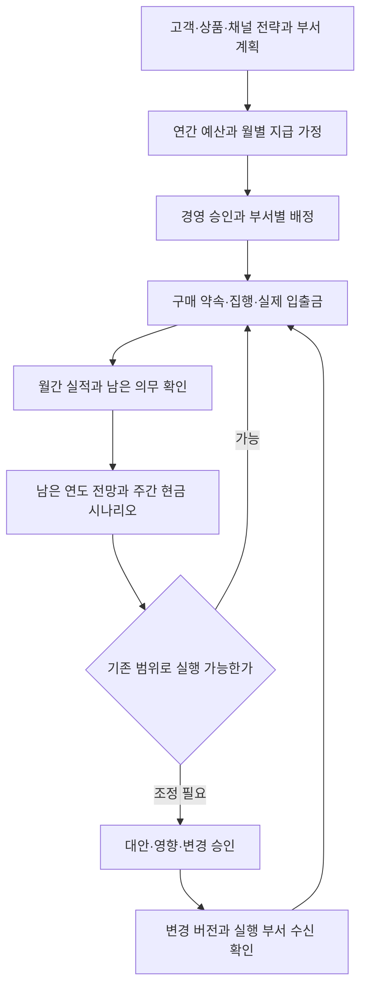
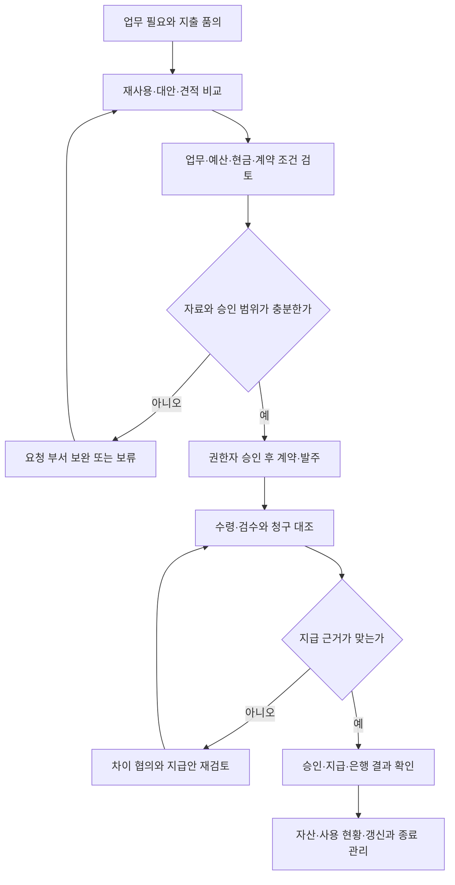

title: 시나리오: 이커머스 14 — 재무가 예산·현금·구매·계약을 함께 운영한다
slug: scenario-modeline-14-budget-cash
category: 시나리오
tags: modeline,budgeting,cash-flow,procurement,harness-engineering
summary: 연간 예산과 월별 전망을 일일 자금·지출 품의·구매·계약·지급에 연결한다. 같은 재무 4명이 계획 대비 차이와 갱신을 관리하고 1,800·800·1,000만 원의 현금 시나리오를 검토한다.
toc: true
nextSlug: scenario-modeline-15-people-administration
prevSlug: scenario-modeline-13-financial-close
publishedAt: 2026-09-12T14:32:04.942316+09:00
syncHash: 325037df08873f0844d7dc21f59c2340a5e87a536c79aba218a0e969add8f5fb

---

[시리즈 종합편과 전체 목차](/96/scenario-modeline-17-company-overview)

> 모드라인은 이 시리즈를 위해 만든 가상 회사다. 인물·거래·회의·금액은 창작이며 실제 회사의 실적이나 AI 도입 성공 사례가 아니다. 업무 절차와 지표는 이 회사의 운영 설정이며 실제 적용에는 조직의 정책과 전문 검토가 필요하다.

월말 숫자를 정리한 남도현에게 다음 달 지출 요청이 모인다. MD 한지민은 재주문을 준비하고, 그로스 정유라는 광고 확대를 검토하며, CTO 강태준은 개발 검증 환경의 자원을 요청한다. 각 부서의 예산표에는 여유가 있어도 같은 주에 지급이 몰리면 은행 잔액은 부족할 수 있다.

이 글은 사내 80명의 가상 의류몰 모드라인의 내부 운영 사례다. 예산·현금·구매를 맡는 사람은 13편의 재무·회계 4명이다. 남도현은 리드, 나머지 세 사람은 거래·수금, 매입·지급, 회계·관리 역할을 나눠 맡는다. 별도 예산 부서를 더 만들지 않는다.

예산은 목적과 기간에 따라 승인한 자원 배정 계획이다. 전망은 지금 아는 사실로 앞으로의 결과를 다시 예상한 값이다. 현금 계획은 돈이 실제로 들어오고 나가는 날짜를 기록한다. 아래 금액과 검토선은 가상 계획이며 회사 전체의 재무 실적이나 권장 자금 기준이 아니다.

## 예산 승인과 구매 약속과 지급을 구분한다

도현은 비용을 한 번 승인했는지보다 지금 어떤 단계인지 먼저 묻는다. 예산이 있다고 계약이 체결된 것은 아니며, 계약을 체결했다고 돈을 이미 지급한 것도 아니다. 물건을 받고 아직 청구서를 받지 않은 경우도 있어 자료를 한 열에 넣으면 남은 지출 여력을 과대평가한다.

| 구분 | 답하는 질문 | 관리할 근거 |
|---|---|---|
| 승인 예산 | 이 목적·기간에 얼마를 배정했는가 | 승인한 원안, 변경 승인 |
| 집행 약속 | 이미 어떤 계약·발주를 약속했는가 | 계약·발주와 잔여 의무 |
| 관리 실적 | 정한 기준으로 얼마나 사용했는가 | 검토된 실적과 귀속 기간 |
| 현금 지급 | 언제 얼마가 실제 나갔는가 | 지급 승인과 은행 결과 |
| 최신 전망 | 남은 기간에 얼마나 필요할 것으로 보는가 | 실적, 약속, 미계약 계획, 가정 |

이 편에서 집행 약속은 계약이나 발주로 남은 지출을 관리하는 내부 용어다. 특정 회계 계정의 인식 기준을 뜻하지 않는다. 실적에 반영된 부분을 잔여 약속에서도 빼야 이중 차감이 생기지 않는다. 세금 포함 여부와 원·만 원 같은 단위도 예산과 비교 자료에서 일치시킨다.

요청 부서는 업무 필요성과 사양, 성과 확인을 책임진다. 재무는 예산·현금·지급 근거를 확인한다. 기술 서비스는 개발·플랫폼이 운영과 데이터 조건을 검토하고, 장비·시설·행정 계약은 피플·총무가 사용·자산 현황을 확인한다. CEO 윤서영은 위임 범위를 넘는 신규 투자와 부서 간 자원 충돌을 결정한다.

이 회사의 내부 승인표에는 지출 종류, 요청 부서, 업무 검토자, 예산 확인자, 최종 승인자와 부재 시 대체자를 둔다. 재무가 유용성을 혼자 판단하거나 CTO가 모든 구매를 승인하지 않는다. 금액 한도와 예외 조건은 회사가 별도 확정할 항목이며 이 글에서 법적 의무나 보편적 권장치로 만들지 않는다.

## 연간 예산을 월간 전망과 매일의 자금표로 내려보낸다

공통 연간 달력에서 전년도 10~12월은 다음 해 고객·상품·채널 가정과 자원 계획을 맞추는 시기다. 재무는 부서가 원하는 금액의 합계만 받지 않는다. 어떤 수요·업무량 때문에 비용이 생기는지, 시작 시점과 줄일 수 있는 조건이 무엇인지 함께 받는다.

| 주기 | 입력 | 담당자의 결정 | 산출물 |
|---|---|---|---|
| 매일 09시 | 은행 잔액, 당일 수취·지급 예정 | 수금·지급 담당이 변경·부족 가능성 확인 | 당일 자금표, 확인 대상 |
| 매일 지급 전 | 청구·검수·승인·수취 정보 | 지급 대상과 계좌·금액 재확인 | 승인한 지급 묶음 |
| 매일 17시 | 실제 입출금, 미확인 결과 | 도현이 다음 날 계획·에스컬레이션 판단 | 은행 연결 결과, 다음 날 잔액 |
| 매주 | 부서 요청, 미지급·미수취, 입금 가정 | 기준·지연 시나리오와 지출 순서 결정 | 주간 현금 전망, 보류·유지 목록 |
| 매월 | 13편 확정 범위, 계약 잔여, 계획 차이 | 회계·관리 담당이 부서와 재전망 | 남은 연도 월별 전망, 변경 제안 |
| 매월 | 사용량·중복 도구·예정 갱신 | 계약 담당과 사용 부서가 유지·축소 검토 | 갱신·해지 준비 목록 |
| 분기·시즌 | 판매·재고·용량·채널 가정 변화 | 경영이 부서 간 재배정·투자 순서 결정 | 변경 예산과 승인 이력 |
| 연간 10~12월 | 다음 해 전략, 상품·인력·시설 계획 | 경영·재무·부서가 시나리오와 자원 합의 | 연간 원예산과 월별 지급 가정 |
| 연간 1~3월 | 전년 결과·잔여 약속, 새해 첫 집행 | 도현이 전년 영향·가정 오차 확인 | 당해 전망 보완, 승인 범위 확인 |
| 연간 4~6월 | 상반기 진행, 하반기 시즌 준비 | 하반기 자금·물류·채용 여력 재검토 | 하반기 전망과 조달 우선순위 |
| 연간 7~9월 | 가을 운영·파일럿·피크 용량 | 확대와 유지 조건, 현금 위험 판단 | 시즌 자금안, 다음 해 기초 자료 |

이 표는 내부 계획 주기다. 세금·급여 등 실제 지급 의무와 날짜는 확인된 계약·법정 일정에서 가져와야 한다. 주간 회의의 편의에 맞춰 의무를 다음 주로 미루지는 않는다.

연간 원예산은 비교 기준으로 보존한다. 월간 재전망은 남은 기간의 예상이며 예산 변경 승인과는 다르다. 광고가 계획보다 빨리 소진될 것으로 예상해 전망을 올렸다고 증액 권한이 생기지 않는다. 재무는 “예상 지출 증가”와 “추가 승인 필요”를 함께 표시한다.

원예산과 최신 전망은 같이 남는다. 조정이 필요하면 담당 부서가 대안과 포기하는 효과를 설명하고 권한 있는 사람이 결정한다. 재무가 숫자를 바꾼 것만으로 인계가 끝나지 않는다. 광고 담당자가 집행 범위를, MD가 발주 범위를 실제로 변경해 수신 확인을 남겨야 한다.

## 부서의 계획은 업무량과 조건을 붙여 받는다

MD의 예산안에는 상품군·시즌별 발주 시점, 수량·단가 가정과 입고·지급 조건이 필요하다. 그로스는 채널·캠페인별 집행 범위와 관찰 기간, 확대·중단 조건을 설명한다. 피플은 교체와 증원을 나누고 합류 시점·채용 준비·교육 시간을, 총무는 장비 재사용과 시설 계약 변동을 붙인다.

개발은 기능 구축비만 적지 않고 운영·유지보수·외부 서비스와 담당자 시간을 포함한다. 물류·CX는 판매량 가정이 변할 때 출고·보관·회수·문의 대응에 어떤 용량이 더 필요한지 설명한다. 주문 수가 늘면 모든 비용이 같은 비율로 늘어난다고 가정하지 않는다. 계약 구간과 고정·변동 요인이 다르기 때문이다.

도현은 기본안과 수요·입금이 다른 안을 비교하면서 부서 간 가정을 맞춘다. MD는 가을 확대를, 콘텐츠는 기존 촬영량을, CX는 같은 인력을 전제로 적었다면 계획이 서로 실행 가능하지 않다. 경영은 추가 비용을 모두 승인하기 전에 상품 범위나 시작 시점을 조정할 수 있는지 본다.

승인 이후 월간 보고는 실적과 예산의 차이를 가격·수량·시점·범위 변경·일회성 원인으로 나눈다. 분류할 근거가 없으면 “효율 개선”으로 이름 붙이지 않는다. 청구가 늦어 실적이 적게 보이는 경우와 같은 서비스를 적은 비용으로 받은 경우는 다음 행동이 다르다.

## 지출 품의는 목적에서 사용 종료까지 설명한다

품의는 지출의 필요와 조건을 정리해 승인을 요청하는 문서다. 요청자는 해결하려는 업무, 필요한 시점, 대안, 총 지출 범위와 완료 확인자를 적는다. 견적서 한 장을 전달하고 재무가 사양·사용자·중복 계약을 모두 알아내게 하면 요청이 계속 왕복한다.

| 요청 종류 | 준비해야 할 자료 | 승인 후 사용 부서의 확인 |
|---|---|---|
| 상품 매입 | 수요·재고, 견적·납기, 지급·반품 조건 | 발주·검수와 공급사 차이 협의 |
| 광고 | 캠페인 목적, 집행 범위, 관찰·중단 조건 | 계정 상한·예약과 실제 집행 |
| 외주 | 결과물·검수 기준, 작업 기간, 인수인계 | 산출물 검수·후속 운영 책임 |
| 클라우드·도구 | 사용량, 이용자, 운영·데이터 조건 | 사용 현황·추가 과금·종료 가능성 |
| 장비·시설 | 사용자·재사용 가능 자산·설치 조건 | 수령·상태·자산 등록·관리 책임 |

견적 비교에서는 같은 사양·기간·사용량을 맞춘다. 초기 할인만 비교하면 갱신가, 추가 사용자, 설치·이전·데이터 반출 비용이 빠진다. 대체 공급사가 있다면 납기·서비스 품질·전환 부담을 포함해 비교하고, 단일 공급사라면 대체가 어려운 이유와 위험 대응을 남긴다.

공급사 등록에는 계약 주체와 연락처, 지급 정보의 검증 기록, 내부 계약 담당자를 둔다. 계좌 변경 요청은 기존에 확인된 별도 연락 경로로 재확인한다는 내부 원칙을 둔다. 새 청구서의 문구만으로 기존 수취 정보를 덮지 않고, 확인하는 동안 지급 준비 상태를 분리한다.

계약 검토에서는 사양·수량·기간·금액·청구·지급·검수·갱신·해지 조건과 책임 범위를 읽는다. 법률 검토가 필요한 조항은 회사의 계약 검토 담당자나 외부 전문가에게 사실과 질문을 전달한다. 모든 계약이 같은 조항을 갖거나 회사가 특정 법적 의무를 가진다고 단정하지 않는다.

검수는 요청 부서가 실제 받은 물건·서비스를 확인하는 과정이다. 지급 담당자는 그 결과와 계약·청구를 대조한다. 검수나 지급에 차이가 생기면 해당 부분의 협의 상태를 남기며, 합의 없이 의무를 없애지 않는다. 최종 수신자는 회계 기록 담당뿐 아니라 자산·서비스를 계속 운영하는 부서다.

긴급 구매가 생기면 무엇이 긴급한지, 정규 절차 중 무엇이 아직 확인되지 않았는지, 승인 책임자와 보완 조건을 남긴다. 먼저 계약하고 나중에 형식적으로 승인을 받는 일을 평상시 경로로 만들지 않는다. 긴급 요청이 반복되면 재고·갱신 일정·현장 요청 방식의 문제를 월간 검토에 올린다.

## 주간 현금은 날짜와 확실성을 함께 기록한다

거래·수금 담당자는 13편 대사 결과에서 확인된 정산 조건과 예정 수취를 가져온다. 매입·지급 담당자는 이미 발생한 의무, 승인했지만 아직 계약하지 않은 요청을 구분해 가져온다. 회계·관리 담당자가 이를 날짜별로 배열하고 도현은 입금 불확실성과 지급 집중을 검토한다.

자금표의 기초는 실제 사용할 수 있는 현금이다. 내부 계획에서 사용 제한이 있는 금액은 제한 근거와 함께 분리하며, 확인하지 않은 자금 조달을 입금 확정값으로 넣지 않는다. 확인된 예정 입금, 판매 가정에 따른 예상 입금, 지연 가능액을 구분하고 각각의 원천과 다음 확인 시각을 둔다.

다음은 한 주를 설명하는 독립 가상 스냅샷이다. 단위는 **만 원**이며 인건비 2,000은 해당 주 지급분이다. 회사 전체 월 손익이나 80명 전체의 급여 수준을 나타내지 않는다. 13편의 주문 두 건을 확대해 만든 자료도 아니다.

| 항목 | 기준 계획 | 입금 지연 가정 |
|---|---:|---:|
| 주초 가용 현금 | 5,000 | 5,000 |
| 해당 주 입금 | 3,000 | 2,000 |
| 매입 지급 | -2,500 | -2,500 |
| 인건비 지급 | -2,000 | -2,000 |
| 물류 지급 | -800 | -800 |
| 광고 지급 | -700 | -700 |
| 클라우드·도구 지급 | -200 | -200 |
| 주말 예상 잔액 | 1,800 | 800 |

지출 합계는 2,500 + 2,000 + 800 + 700 + 200 = 6,200만 원이다. 기준안은 5,000 + 3,000 − 6,200 = **1,800만 원**이다. 입금 중 1,000만 원이 다음 주로 밀리는 지연안은 5,000 + 2,000 − 6,200 = **800만 원**이다.

내부 검토선은 이 예시에서만 1,000만 원으로 가정한다. 지연안은 그보다 200만 원 낮다. 검토선은 회사가 정한 가상 판단 기준이며 일반적인 적정 현금 규모가 아니다. 입금 지연도 발생이 확인된 사실이 아니라 재검토해야 할 가정이다.

주말 잔액이 양수여도 주중에 지급이 먼저 몰릴 수 있다. 이 표에는 일별 입출금 시점이 없으므로 일간 최저 잔액은 계산할 수 없다. 도현은 실제 지급 전 날짜별 자금표에서 순서를 확인한다. 주간 합계가 맞는다는 이유로 하루의 부족 가능성을 지우지 않는다.

## 미계약 광고 확대분을 조정하고 실행 확인까지 받는다

유라는 광고 계획 700만 원이 이미 승인돼 있다고 말한다. 도현은 그 구성 중 유지할 집행·지급 계획은 500만 원, 아직 계약하거나 집행하지 않은 신규 확대분은 200만 원이라는 후속 가정을 확인한다. 전체 광고비를 취소하거나 이미 생긴 채무를 임의로 줄이는 장면이 아니다.

서영과 유라는 이번 주 확대분 200만 원을 실행하지 않기로 결정한다. 매입·인건비·물류와 기존 의무의 지급 일정은 유지한다. 도현은 원 계획과 지연안을 보존하고, 승인한 미집행 범위만 조정 버전에 반영한다.

| 비교 항목, 만 원 | 지연안 변경 전 | 확대분 미집행 반영 |
|---|---:|---:|
| 기초 현금 + 예정 입금 | 7,000 | 7,000 |
| 광고 지급 계획 | 700 | 500 |
| 전체 지급 계획 | 6,200 | 6,000 |
| 기말 예상 잔액 | 800 | 1,000 |

조정안은 5,000 + 2,000 − 6,000 = **1,000만 원**이다. 200만 원만큼 전망이 달라졌지만 실제 현금 개선 실적이나 이익 증가가 아니다. 검토선에 정확히 닿아 추가 지연을 흡수할 여유도 없다. 주중 입금 확인과 날짜별 지급 점검은 계속한다.

| 조정 기록에 남길 것 | 이번 가상 장면의 내용 |
|---|---|
| 근거 | 입금 1,000 지연 가정과 검토선 대비 200 부족 |
| 대안 | 추가 확대 미집행, 다른 신규 요청 보류 검토 |
| 채택 | 아직 계약·집행하지 않은 광고 200 미집행 |
| 승인·수신 | 서영·유라 결정, 도현이 자금표 반영 |
| 실행 증거 | 유라가 광고 확대 예약·상한의 실제 상태 확인 |
| 재검토 | 입금 시점 변경, 추가 지급 발생, 다음 주 계획 검토 |

지민은 대량 추가 발주와 수요·공급 확인을 분리해 준비한다. 태준은 새 자원을 약속하기 전 기존 환경에서 필요한 검증 범위를 확인한다. 해당 요청을 보류할 때는 단순히 금액만 삭제하지 않고 업무 효과·일정·위험이 어떻게 바뀌는지 기록한다.

이미 체결한 계약의 지급일을 바꿔야 한다면 조건과 상대방 협의가 필요한 별도 사안이다. 조정할 수 있는 미계약 지출만으로 부족하면 도현은 부족 시점·금액·의무·가능 대안을 경영에 올린다. 승인되지 않은 차입·임의 지급 지연을 확정 자금안처럼 넣지 않는다.

## 지급이 끝난 뒤 사용과 갱신도 확인한다

지급 담당자는 승인 요청, 청구, 지급 실행과 은행 결과를 연결한다. 결과가 불명확한 지급은 확인 대기로 남기고 재지급 전에 조회한다. 회계·관리 담당자는 지급액과 귀속 자료를 대조하고 사용 부서는 받은 서비스와 계약 조건이 맞는지 확인한다.

월간에는 예상보다 많이 쓴 항목만 보는 것이 아니다. 적게 쓴 항목도 채용 지연, 공급 지연, 캠페인 미집행인지 확인한다. 진행이 늦어진 예산을 절감 실적으로 보고하면 다음 달 의무가 빠진다. 남은 약속을 포함한 연말 전망과 시점이 바뀐 현금 계획을 함께 갱신한다.

구독·시설·외주 계약 목록에는 계약 소유자, 사용자, 갱신·통지 조건, 다음 검토 시점과 종료 준비를 둔다. 검토 시점은 실제 계약에서 필요한 통지와 이전 준비 기간을 역산해 정한다. 모든 계약을 만료 직전에만 보면 자동 갱신 조건이나 데이터 이전에 대응할 시간이 사라질 수 있다.

피플·총무는 미사용 라이선스·장비를, 사용 부서는 서비스 필요성과 대체 가능성을, 재무는 잔여 의무와 비용을 확인한다. 사용자가 적다는 이유만으로 복구·보안용 서비스를 곧바로 끊지 않는다. 종료한다면 데이터 인계, 접근·연동 정리, 잔여 청구 확인과 사용 부서의 종료 확인까지 받는다.

9편 파일럿의 분석 기여와 이 편의 주간 자금표는 다른 범위다. 파일럿은 어느 채널에 추가 검증이 필요한지 알려 주는 자료이고, 현금 계획은 어떤 날짜에 어느 범위의 지출이 가능한지 보여 준다. 두 표를 회사 전체 실적으로 합치지 않는다.

## 예측과 통제의 품질을 서로 다른 지표로 본다

아래 KPI는 모드라인 내부 운영 정의다. 예산·현금 수치는 통화·단위·세금 취급을 맞추고, 변경 전 계획을 보존한다.

분모·누락·잠정치 표시는 [시리즈 공통 해석 규칙](/96/scenario-modeline-17-company-overview#지표의-공통-해석-규칙을-먼저-맞춘다)을 따른다.

### 지표의 계산 기준을 한눈에 본다

| 지표·단위 | 계산·관찰 기준 | 원천·책임·검토 주기 |
|---|---|---|
| 주간 기말 잔액 전망 오차 · 원 | 주초 고정 기말 전망 − 실제 주말 가용 현금 | 현금 계획 버전·은행 대사 / 거래·수금·리드 / 주간 |
| 일간 최저 현금 여력 · 원 | 같은 계획 버전에서 날짜별 (예상 가용 잔액 − 승인 검토선)의 최솟값 | 날짜별 자금표·검토선 승인 / 재무 리드 / 매일 |
| 월간 예산 대비 관리 실적 차이율 · % | (같은 기준 관리 실적 − 승인 예산) ÷ 승인 예산 ×100; 원·변경 예산 구분 | 검토 자료·예산 원장 / 회계·관리·부서 / 월간 |
| 미약속 가용 예산 · 원 | 승인 예산 − 같은 기간 관리 실적 − 실적 미포함 확정 약속; 보고 시각 기준 | 예산·계약·발주·실적 연결표 / 회계·관리 / 주간 |
| 약정일 내 지급 완료율 · % | 원 약정일까지 은행 완료 확인 의무 ÷ 해당 월 지급일 도래 의무 ×100 | 계약·지급 목록·은행 / 지급 담당 / 월간 |
| 갱신 검토 완결률 · % | 필수 검토와 권한자 결정을 남긴 계약 ÷ 해당 월 내부 검토일 도래 계약 ×100 | 계약대장·사용 확인·결정 / 매입·지급 / 월간, 리드 분기 |
| 구매 승인 처리시간 · 영업일 | 월내 승인·반려 종결 건의 최초 접수 → 결정 중앙값; 보완 대기 포함 | 품의 이력·업무 달력 / 지급 담당 / 월간 |

### 수치를 해석하고 다음 행동으로 연결한다

#### 주간 기말 잔액 전망 오차

주초에 고정한 기말 전망 − 실제 주말 가용 현금으로 원화 오차를 계산한다. 양수는 현금을 낙관적으로 예상한 경우다. 현금 계획 버전·은행 대사가 원천이고 거래·수금 담당자가 매주 계산, 도현이 검토한다. 금액과 방향을 함께 보고 입금·지급·기초잔액별 원인을 분해한다. 주중 수정 전망도 남기되 주초 기준을 바꾸지 않는다.

#### 일간 최저 현금 여력

동일한 주간 계획 버전에서 각 날짜의 예상 가용 잔액 − 해당 날짜에 승인된 내부 검토선을 계산하고 그 최솟값을 취한다. 날짜별 자금표·검토선 승인 기록이 원천이고 도현이 매일 갱신한다. 일별 자료가 없으면 계산하지 않는다. 음수이면 부족일·의무를 특정해 미계약 요청 조정과 경영 판단을 요청한다.

#### 월간 예산 대비 관리 실적 차이율

같은 목적·기간·귀속 기준에서 (관리 실적 − 승인 예산) ÷ 승인 예산 × 100이다. 원예산과 변경 예산 기준을 각각 표시한다. 13편 검토 자료·예산 원장이 원천이며 회계·관리 담당자가 매월 부서와 확인한다. 예산 0은 금액만 보고한다. 음수도 미집행 지연일 수 있어 수량·가격·시점·범위로 조사한다.

#### 미약속 가용 예산

보고 시각의 승인 예산 − 같은 예산 기간에 반영한 관리 실적 − 아직 실적에 포함되지 않은 확정 약속이다. 예산·계약·발주·실적 연결표를 원천으로 회계·관리 담당자가 매주 본다. 실적과 약속을 이중 차감하지 않고 승인 대기 요청은 별도 표시한다. 음수이면 초과 원인과 승인 필요를 알린다. 이 값은 은행 현금이 아니다.

#### 약정일 내 지급 완료율

해당 월 약정 지급일이 도래한 지급 의무 중 그날까지 은행 완료를 확인한 의무 수 ÷ 해당 월 지급일이 도래한 의무 수 × 100이다. 지급 담당자가 계약·지급 목록·은행에서 월별 계산한다. 분할 지급은 약정 회차 단위로 고정하고 뒤늦은 날짜 수정은 원 약정과 함께 보존한다. 지연을 자금·검수·승인·은행 문제로 나눠 조치한다.

#### 갱신 검토 완결률

해당 월 내부 검토일이 도래한 계약 중 필요성·비용·사용·종료 조건과 권한자 결정을 남긴 계약 수 ÷ 검토일 도래 계약 수 × 100이다. 계약대장·사용 확인·결정 기록이 원천이고 매입·지급 담당자가 월별, 도현이 분기별 검토한다. 통지 발송이 필요하면 실제 접수도 추적한다. 높아도 절감 성과는 아니며 누락 계약은 담당자와 조건부터 확인한다.

#### 구매 승인 처리시간

해당 월 승인 또는 반려로 종결된 요청의 최초 접수부터 결정까지 경과 영업일 중앙값이다. 품의 이력과 업무 달력을 원천으로 지급 담당자가 월별 계산하며 보완 대기도 포함해 별도 분해한다. 미종결 요청의 현재 경과일과 긴급·일반 건수를 함께 공개한다. 빠른 승인만 유도하지 않고 반복 보완 항목을 양식·안내에 반영한다.

## 개발·AI 활용은 업무 운영과 구분해 설계한다

### 계획 버전과 실제 실행을 연결하는 자료 구조가 필요하다

시스템은 예산 원안·변경 승인·최신 전망을 구분하고 각 변경에 가정과 승인 기록을 연결해야 한다. 계약·발주 약속이 검수·실적·지급으로 이동할 때 중복 합산을 막는 연결이 필요하다. 시간대·통화·날짜별 잔액도 계산 규칙으로 고정한다.

지급 요청의 중복, 불명확한 은행 응답, 계좌 변경은 일반 전망 계산과 분리해 검사한다. 결정 ID와 승인 버전이 실제 집행에 연결돼야 한다. 회의록 문구만 읽고 광고 상한·계약·송금을 바꾸게 하지 않는다.

### AI는 비교안과 누락을 제시하고 돈을 움직이지 않는다

입력은 읽기 전용 예산, 현금 계획, 검토된 계약 조건과 집행 자료다. AI는 변동 원인 후보, 누락 자료와 대안을 정리한다. 출력마다 원천과 가정 버전을 붙이고 잔액·합계는 검증된 계산 도구로 산출한다. AI에는 은행 접속·수취 계좌 변경·계약 체결·송금·예산 승인 권한을 주지 않는다.

검사는 입금 지연, 확정 의무와 미계약 요청의 혼동, 같은 약속의 중복 차감, 단위 오류, 원계획 덮어쓰기를 포함한다. 사람이 채택한 대안만 변경안에 반영하고 사용 부서가 실행 결과를 확인한다. 자연스러운 설명보다 가정의 누락 여부와 재현되는 계산이 먼저다.

### 도구 비용은 채택한 업무와 운영 부담을 함께 계산한다

하네스 비용 검토는 모델 호출, 실행·CI, 관측·저장, 사람 검토, 재작업과 유지보수를 포함한다. 동일 입력 집단에서 검수 후 채택한 고유 업무 수를 분모로 쓰고 여러 재시도를 각각의 성과로 세지 않는다. 낮은 호출 단가가 검토 부담을 늘릴 수 있으므로 같은 완료 기준으로 비교한다.

캐시·배치·작은 모델은 검토 후보이며 최신 잔액·계약·집행 상태를 오래된 결과로 대체해서는 안 된다. 별도 기술 심화는 예산·약속·지급의 상태 연결, 버전별 시나리오 재현, 지급 재시도 검증, 채택 결과당 총비용 측정이다. 실제 입출금과 처리시간을 수집하지 않았으므로 예측 정확도나 절감률은 아직 말할 수 없다.
