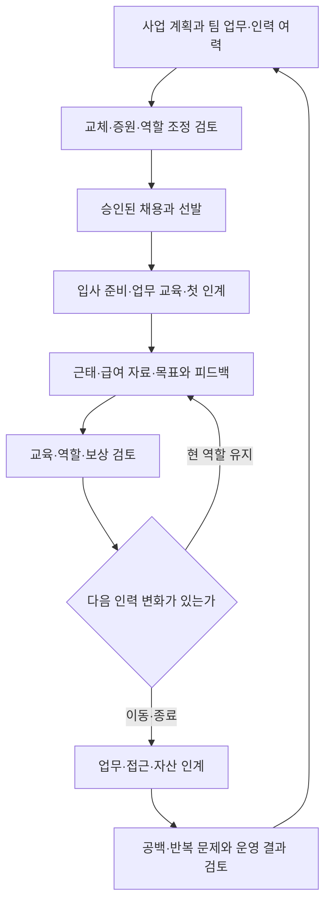
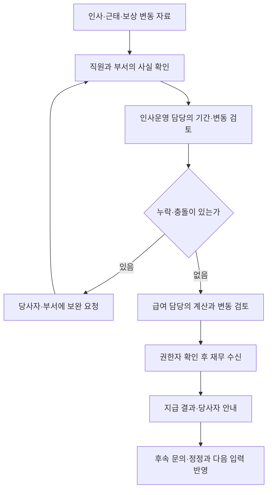
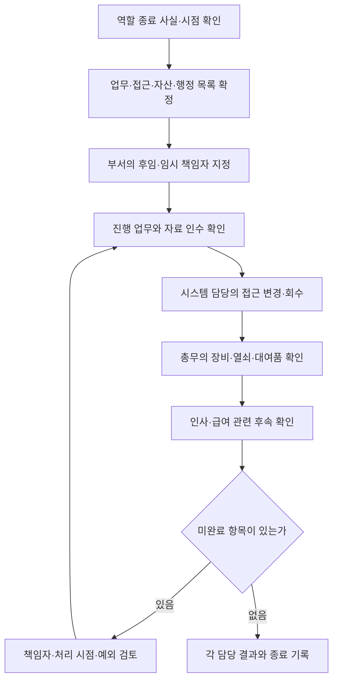

title: 시나리오: 이커머스 15 — 피플·총무가 채용부터 급여 자료·퇴사·시설까지 운영한다
slug: scenario-modeline-15-people-administration
category: 시나리오
tags: modeline,people-operations,onboarding,access-control,knowledge-management
summary: 피플·총무 4명의 인력 계획·채용·교육·근태·급여 입력·평가와 보상·퇴사·자산·시설 업무를 연결한다. 교체 입사 사례와 운영 달력, 담당자의 인계 조건과 지표를 자세히 살핀다.
toc: true
nextSlug: scenario-modeline-16-management-decisions
prevSlug: scenario-modeline-14-budget-cash
publishedAt: 2026-09-12T14:32:05.360548+09:00
syncHash: bdc2b28bc2f73f5be042002552e83ab944d346dd3bd561be50e51817dd5100b3

---

[시리즈 종합편과 전체 목차](/96/scenario-modeline-17-company-overview)

> 모드라인은 이 시리즈를 위해 만든 가상 회사다. 인물·거래·회의·금액은 창작이며 실제 회사의 실적이나 AI 도입 성공 사례가 아니다. 업무 절차와 지표는 이 회사의 운영 설정이며 실제 적용에는 조직의 정책과 전문 검토가 필요하다.

김나래의 아침 목록에는 입사 예정자의 장비, 근태 정정 문의, 면접 일정, 사무실 수리와 다음 달 교육이 함께 있다. 부서장은 채용이 어디까지 왔는지 묻고, 재무는 급여 계산에 필요한 변동 자료를 기다린다. 요청이 서로 다른 메일함에 남아 있으면 한 가지를 해결한 뒤에도 누구에게 결과를 알려야 하는지 놓치기 쉽다.

모드라인은 사내 80명의 가상 의류몰이며 피플·총무는 4명이다. 이 글의 입사·회의·문서는 합성 운영 사례다. 신규 합류 `ONB-F26-009`는 기존 인원의 교체를 설명하므로 총원을 81명으로 늘리지 않는다. 외부 물류센터와 계약 전문가도 사내 인원에 더하지 않는다.

피플 업무는 사람을 뽑고 기록하는 것과 팀이 일할 조건을 갖추는 일을 함께 다룬다. 총무는 장비·공간·서비스·행정이 실제로 사용 가능하도록 관리한다. 아래 달력과 절차는 내부 운영 설계이며 임금·휴가·퇴직·서류 보관의 법정 기준을 새로 정하지 않는다. 개별 적용은 확인된 계약·규정과 전문가 검토로 별도 확정한다.

## 네 사람이 담당 창구를 나누고 결정권자를 연결한다

나래는 모든 요청을 직접 처리하려 하지 않는다. 입사 일정 변경은 채용·교육 담당, 급여 입력 정정은 인사운영 담당, 장비 수리는 총무 담당이 처리하되 연결된 일이 빠지지 않게 조정한다. 요청자는 창구를 찾을 수 있어야 하고 담당자는 누가 사실·승인·실행을 책임지는지 알아야 한다.

| 내부 역할 | 평소 하는 일 | 최종 판단과 인계 |
|---|---|---|
| 김나래 1명 | 인력 계획 조정, 정책·평가 운영, 부서장 협의 | 경영의 인력·보상 결정과 부서 실행 연결 |
| 채용·교육 담당 1명 | 공고·면접·지원자 안내, 입사 준비, 교육 | 채용 부서의 직무 판단과 입사자 준비 확인 |
| 인사운영 담당 1명 | 인사 변동·근태·휴가, 급여 입력, 문의 | 검토된 자료를 재무·급여 담당에 전달 |
| 총무·자산 담당 1명 | 장비·소모품·시설·행정 계약·수신 | 사용 부서 검수와 재무 지급 근거 연결 |

채용 부서장은 필요한 업무와 선발 근거를 책임진다. 경영은 승인 인력·보상 범위와 조직 변경을 결정하고, 피플은 절차·자료·일정·당사자 소통을 관리한다. 재무는 검토된 급여 결과의 지급과 회계 연결을 맡으며, 시스템 관리자는 승인된 접근을 설정한다.

피플이 출근 여부를 기록한다고 개인 성과를 혼자 판정하지 않는다. 총무가 노트북을 지급한다고 고객 데이터 권한까지 승인하지 않는다. 이 경계가 명확해야 요청이 한 사람에게 몰려서 대기하거나, 담당자마다 다른 답을 주는 일을 줄일 수 있다.

## 일일 요청과 연간 인력 계획을 같은 달력에 놓는다

평가·교육·채용이 겹치는 시기를 미리 본다. 가을 피크 직전에 채용 공고를 냈다고 바로 숙련 인력이 생기지 않는다. 팀은 모집·선발·합류·교육 기간과 기존 구성원의 지도 시간을 함께 고려한다. 아래는 회사 내부 운영 달력이며 법정 일정표가 아니다.

| 주기 | 입력 | 책임자의 판단 | 결과와 수신자 |
|---|---|---|---|
| 매일 09시 | 입퇴사·근태 문의·장비/시설 요청 | 담당별 긴급도·업무 차단·개인정보 범위 확인 | 담당자·다음 안내 시점이 있는 요청표 |
| 매일 업무시간 | 지원자 일정, 승인·정정 답변 | 채용·인사운영 담당이 처리 상태 확인 | 지원자/직원 안내, 변동 이력 |
| 매일 17시 | 미완료 요청, 다음 날 입사·부재 | 나래가 대체자·부서 간 누락 확인 | 다음 날 인계와 준비 대기 목록 |
| 매주 | 채용 단계, 입사 준비, 교육 진행 | 채용 부서와 지연 원인·업무 범위 조정 | 면접·온보딩 일정과 담당 행동 |
| 매주 | 예정 휴가·시설 수리·장비 대여 | 부서장이 대체 업무, 총무가 사용 가능성 확인 | 인계표·수리/대체 일정 |
| 매월 | 근태·인사·보상 변동과 확인 기록 | 인사운영 담당이 급여 입력 검토 | 재무·급여 담당 수신 확인 |
| 매월 | 직원 문의·교육·자산·구독 현황 | 나래·총무가 반복 문제와 미사용 점검 | 안내 개선, 자산·계약 조치 |
| 분기 | 목표 진행, 역할 변화, 학습 필요 | 부서장과 목표·지원·교육 조정 | 면담 기록·교육 계획 |
| 시즌 전후 | 업무량·교체 공백·휴가·피크 대응 | 기존 여력과 채용·외부 지원 대안 검토 | 경영에 인력/일정 제안 |
| 연간 10~12월 | 다음 해 사업·예산·조직안, 평가 근거 | 경영과 역할·보상·채용 우선순위 검토 | 다음 해 승인 계획과 소통 일정 |
| 연간 1~3월 | 전년 운영 결과, 새 목표·교육 필요 | 나래가 목표·교육·인사 자료 갱신 | 역할별 연간 운영표 |
| 연간 4~9월 | 상반기 진행·가을 피크 준비 | 인력 전망·교육·장비/시설 용량 조정 | 하반기 준비와 다음 연도 근거 |

급여 자료의 내부 제출·검토일은 실제 지급 일정을 기준으로 재무와 합의한다. 예외 정정이 들어오면 누구에게 언제 알릴지도 정한다. 일정표에 날짜가 있다는 이유로 사실 확인을 생략하거나 법정 기한을 그 날짜로 대체하지 않는다.

입사는 채용 절차의 끝이면서 실제 업무 준비의 시작이다. 역할 이동과 퇴사는 다음 채용 여부를 자동 결정하지 않는다. 부서가 업무를 재배정할 수 있는지, 다른 지원이 필요한지 검토한 뒤 승인 인력 계획으로 되돌린다. 피플은 이 연결을 추적하고 업무 내용은 부서장이 확정한다.

## 채용은 빈자리가 맡을 업무를 정의하는 데서 시작한다

채용 요청서에는 결원 교체인지 새 역할인지, 해결할 업무, 필요한 역량, 협업 관계, 합류 희망 시점과 예산 근거를 적는다. 나래는 조직표와 승인 정원을 대조한다. 업무가 일시적인지 지속적인지, 기존 역할 조정이나 외부 지원이 대안인지 부서장과 확인한다.

태준이 개발 역할을 요청할 때도 기술 이름만 나열하지 않는다. 어떤 거래 흐름과 품질을 책임질지, 입사 후 어떤 범위의 작업을 맡길지 설명한다. 온콜·배포 등 추가 책임은 필요한 교육과 승인 조건까지 함께 검토한다. “바로 혼자 운영할 사람”이라는 기대를 서류 한 줄로 넘기지 않는다.

채용·교육 담당자는 승인한 직무 설명으로 공고와 평가 기준을 준비한다. 지원서 확인, 직무 면접, 필요한 과제·협업 확인, 조건 협의와 최종 결정의 담당자를 정한다. 단계별 연락 담당과 다음 안내 시점을 남겨 지원자가 같은 설명을 반복하거나 연락을 기다린 채 남지 않게 한다.

면접관은 직무와 관련된 질문과 평가 기준을 공유하고, 각자 관찰한 근거와 미확인 부분을 기록한다. 종합 논의에서는 인상이 좋다는 말보다 해당 업무를 맡을 근거와 필요한 지원을 비교한다. 합의가 어려우면 추가로 무엇을 확인할지 정하고 단순 평균 점수로 결정을 감추지 않는다.

제안 조건은 승인 범위와 확인한 계약 내용에 맞춰 안내한다. 후보자가 수락하면 시작일·역할·준비 항목을 온보딩 담당에게 넘기고, 변경이 생기면 부서장·장비·급여 자료 담당도 갱신한다. 불합격·철회도 당사자 안내와 자료 처리 상태를 남긴다. 개인정보 접근·보관·삭제는 검토한 기준에 따르며 전사 문서함에 지원서 전체를 쌓지 않는다.

## 입사 준비는 계정 수와 첫 업무 준비를 함께 확인한다

온보딩은 새 구성원이 업무 맥락과 일할 환경을 갖추는 과정이다. `ONB-F26-009`에는 시작일·소속·역할·승인자, 장비·필요 접근·교육·멘토와 첫 업무를 연결한다. 교체 입사라고 전임자의 모든 권한을 복사하거나 전임자 계정을 공유하지 않는다.

| 준비 묶음 | 담당자가 준비할 것 | 입사자가 확인할 결과 |
|---|---|---|
| 행정 | 검토할 서류·연락 창구·보관 위치 | 필요한 안내와 확인 절차 이해 |
| 장비·좌석 | 자산·사용자·수령·초기 설정 | 본인 장비가 업무에 사용 가능 |
| 업무 접근 | 역할에 필요한 도구와 승인 범위 | 본인 계정으로 필요한 기능 이용 |
| 회사·팀 맥락 | 상품·주문 흐름, 역할·협업·문의 창구 | 다음 부서와 완료 조건 설명 |
| 교육·첫 업무 | 멘토·실습 자료·검토자·완료 기준 | 실제 결과를 만들어 인계 |

가상 사전 점검에서 필요한 접근 6개 중 5개는 준비됐고 테스트 환경 접근 1개가 승인을 기다린다. 이 비율은 해당 입사 건의 접근 준비 상태이며 전사 온보딩 성과가 아니다. 나래는 미완료를 공개하고 현우에게 확인을 요청한다. 운영 관리자 권한으로 빈자리를 대신 채우지 않는다.

| 첫날 흐름 | 신규 동료가 하는 일 | 담당자의 인수 조건 |
|---|---|---|
| 회사 소개 | 상품 `P-F26-017`과 주문 흐름을 따라 부서 찾기 | 이해되지 않은 인계·용어를 질문으로 기록 |
| 장비·접근 점검 | 본인 장비와 승인된 접근 5개 확인 | 준비 완료와 테스트 접근 대기 구분 |
| 업무 동행 | `DEV-F26-012`의 목적·입력·검수 결과 읽기 | 멘토에게 담당자·완료 조건 설명 |
| 첫 실습 | 테스트 접근 승인 후 실측 미등록 상태 재현 | 재현 순서와 화면을 멘토가 다시 확인 |

첫 업무가 막혀도 회사 소개와 자료 읽기를 진행할 수 있다. 다만 필요한 접근이 없는 실습을 완료로 표시하지 않는다. 현우가 역할 범위를 확인해 테스트 접근을 준비하면 신규 동료가 직접 열어 보고, 멘토가 재현 결과를 확인한다. 자료를 읽었다는 체크와 업무를 인수했다는 체크를 나눈다.

첫 주에는 주문·환불·입고가 서로 다른 사실이라는 점을 배운다. MD의 발주 수량과 판매가능 재고가 왜 다르고, CX의 환불 요청과 은행 정산이 왜 다른지 부서 흐름으로 설명한다. 기술 저장소의 이름을 외우기 전에 결과를 받는 동료가 무엇을 필요로 하는지 이해해야 한다.

첫 주 마지막 근무일 점검에서는 미리 요청한 접근이 왜 늦었는지 확인한다. 요청 시점·승인 담당·준비 안내의 누락을 보고 절차를 고칠지 결정한다. 신규 직원의 적응 속도 탓으로 돌리지 않는다. 나래는 남은 교육과 역할 준비를 부서장이 이어받았는지 확인한다.

## 교육은 수강 이력에서 실제 업무 수행으로 이어진다

교육 계획은 신규 입사 공통 안내, 직무별 절차, 정책 변경, 역할 확대와 리더의 피드백 역량으로 나눈다. 담당 부서는 반복 오류·문의·새 업무에서 학습 필요를 제시하고 피플은 대상·자료·강사·시간·완료 기준을 조정한다. 적용 여부 확인이 필요한 의무 교육은 전문가와 확인한 별도 목록에서 관리한다.

CX는 승인된 사례로 상담 판단을 연습하고, MD·물류는 입고 차이와 인계를, 개발은 비운영 환경에서 결과 재현과 검토를 연습할 수 있다. 실습 결과는 업무 담당자가 확인한다. 교육 영상을 끝까지 봤다는 정보만으로 실제 처리 권한을 부여하지 않는다.

교육 뒤에는 팀 업무에서 같은 상황을 처리할 수 있는지 확인하고 자료가 부족했는지, 연습 시간이 부족했는지, 절차 자체가 모호했는지 나눈다. 반복 질문은 질문한 사람의 부족함만이 아니라 자료 개선의 입력이다. 문서마다 소유자와 검토 시점을 두고 바뀐 내용을 수신자가 이해했는지도 확인한다.

## 근태와 휴가는 사실 확인과 업무 인계를 나눠 처리한다

근태는 근무·휴가 등 확인된 상태와 변경을 관리하는 기록이다. 인사운영 담당자는 사전에 확인한 계약·규정·적용 기준에 따라 필요한 자료를 받는다. 출퇴근 기록 하나가 모든 근로시간이나 급여 판단을 자동 확정한다고 가정하지 않는다.

누락이나 정정 요청이 들어오면 직원이 대상 날짜·변경 사유·사실 근거를 제출하고 부서 책임자가 업무 사실을 확인한다. 인사운영 담당자는 원 기록과 정정·검토 결과를 보존한다. 휴가의 종류·권리·잔여 계산과 승인 절차는 검토한 기준에서 확인하며, 이 글은 임의의 일수·사용 기한을 정하지 않는다.

예정 부재는 업무 인계에 필요한 기간과 대체자만 팀에 공유한다. 개인의 건강·가족 사정 등 상세 사유를 부서 전체에 알릴 필요는 없다. 인사 처리에 필요한 정보와 팀 운영 정보의 접근 범위를 나눈다.

현우가 휴가를 준비하는 장면에서는 미완료 작업, 다음 확인 시점, 임시 접근의 종료와 연락 경로를 대체자에게 넘긴다. 대체자는 자료를 실제로 열고 다음 행동을 설명한다. 링크만 보냈는데 접근이 되지 않는 상태는 인계가 아니다. 피플은 부재 일정과 대체자 확인을 연결하고, 기술 작업의 인수는 해당 팀이 검토한다.

## 급여 입력 자료는 변경 이유와 검토 결과까지 넘긴다

인사운영 담당자는 매월 대상자 명단, 입퇴사·소속·계약 변동, 확인된 근태·휴가, 승인된 보상 변경과 기타 필요한 항목을 정리한다. 모든 개인 정보를 한 파일로 보내지 않고 계산·검토·지급 담당이 필요한 범위로 나눈다. 단위·기준 기간·적용 시점이 다른 자료는 함께 설명한다.

이 회사의 운영 설계에서는 인사운영 담당자가 원자료를, 지정 급여 담당 또는 계약 전문가가 적용 기준에 따른 계산·검토를, 재무가 지급 준비와 결과 연결을 맡는다. 누가 계산을 수행하든 검토 없이 임의의 공제·가산을 만들지 않는다. 담당자는 전월 대비 변동이 승인 근거와 맞는지 대조하고 질문을 해결한 뒤 지급 자료를 확정한다.

재무는 파일을 받았다는 답만 하지 않고 대상 기간·버전·건수·확인할 예외를 수신 확인한다. 질문이 해결되지 않은 항목은 누구의 검토가 필요한지 남긴다. 민감한 개인별 내역을 경영회의의 일반 첨부로 올리지 않고 필요한 집계와 제한된 검토 자료를 나눈다.

다음은 금액을 만들지 않은 별도 가상 급여 입력 정정 기록이다. 직원의 근태 누락 문의를 부서가 확인했지만 인사운영 담당이 이미 전달한 버전에는 수정이 없다. 담당자는 수정 항목·근거·기존 버전과 새 버전의 차이를 지정 급여 담당에게 알리고 반영 여부를 확인한다.

| 정정 카드 | 남길 내용 |
|---|---|
| 대상 | 해당 직원·기간·항목을 권한이 있는 자료에서만 식별 |
| 사실 확인 | 직원의 요청, 부서의 확인, 인사 담당 검토 |
| 전달 상태 | 이전 버전 수신 완료, 수정 버전 재확인 필요 |
| 다음 판단 | 지급 단계와 적용 기준을 확인해 담당자가 처리 방식 결정 |
| 종료 | 계산·지급 관련 반영 결과와 당사자 안내 확인 |

표의 빈 금액을 0원으로 간주하지 않는다. 지급 전 정정인지 지급 후 확인인지에 따라 실제 후속 처리가 달라지므로 담당자가 확인한다. 이 과정은 법정 지급·정산 기한을 새로 제시하는 것이 아니라 자료가 바뀌었을 때 누가 무엇을 확인하는지 설명한다.

## 평가와 보상은 기대 역할과 근거를 공유하는 절차로 운영한다

연초 또는 역할 시작 때 부서장은 기대 업무, 협업 책임, 확인할 결과와 필요한 지원을 직원과 논의한다. 목표에는 본인이 통제할 수 있는 범위와 다른 부서 의존성을 적는다. 신규 입사와 역할 변경에는 동일 기간 근무자와 다른 관찰 조건이 있을 수 있어 확인 범위를 남긴다.

분기 면담에서는 진행 결과와 어려움을 확인하고 목표·지원·역할을 조정한다. 변경 전 목표를 지우지 않으며 왜 바뀌었는지 적는다. 교육·업무 도구·검토자의 부족 때문에 결과가 지연됐다면 지원 계획도 함께 결정한다. 연말에 처음으로 기대와 차이를 통보하는 운영을 피한다.

평가 시점에는 자기 정리, 부서장의 직무 관련 관찰과 결과, 필요한 협업 의견을 확인한다. 피플은 누락·기간·기준 차이를 점검하고 부서장 간 검토에서 역할 수준과 근거가 비슷하게 적용되는지 살핀다. 이 과정은 숫자를 강제 분포에 맞추는 작업으로 설정하지 않는다.

결과 면담에서는 평가 이유, 잘한 일, 개선할 일과 다음 지원을 설명한다. 사실 오류를 정정하거나 의견을 전달할 창구와 처리 책임자를 안내한다. 의견이 있다는 이유로 불이익을 자동 결정하지 않으며, 접근 권한이 없는 다른 직원의 평가 자료로 비교하게 하지 않는다.

보상 검토는 평가 결과만으로 자동 계산하지 않는다. 역할·책임의 변화, 회사의 승인 예산, 내부 기준과 계약 조건을 함께 검토한다. 나래와 부서장이 제안을 정리하고 경영이 승인한 뒤 당사자에게 조건·적용 시점을 확인해 알린다. 확정된 변경만 인사운영의 급여 입력으로 전달한다.

직원 상담·고충은 일반 요청과 접수 창구를 구분한다. 나래는 긴급성·사실 확인 담당·이해충돌·정보 접근을 살피고 필요한 전문 검토와 처리 경로를 연결한다. 모든 상세 사정을 일반 요청표에 공개하거나 해결되지 않은 사안을 처리 완료로 표시하지 않는다. 경영에는 필요한 범위의 문제와 조치 상태를 전달한다.

## 역할 종료는 업무·자료·접근·자산을 각각 닫는다

부서 이동과 퇴사는 승인된 사실과 적용 일정을 확인한 뒤 시작한다. 나래는 당사자 안내·필요 행정과 자료 책임을, 부서장은 진행 업무·고객·공급사·반복 일정의 인계를 확인한다. 급여·퇴직 관련 적용 처리는 지정 담당과 전문가가 확인하며 이 글에서는 기한·금액을 임의로 제시하지 않는다.

전임자가 맡은 업무를 모두 후임자 한 사람에게 넣을 수 있는지도 본다. 후임이 없으면 임시 책임자와 우선순위를 정하고, 끝내지 못한 업무의 상대방과 다음 연락을 남긴다. 인계 문서와 당사자 설명을 새 담당자가 확인한 뒤에야 업무 인계 완료로 본다.

그림은 확인 항목의 연결을 보여 준다. 실제 접근 회수 시점은 승인된 종료·위험 대응 계획에 따르며 장비 반납이나 문서 인계가 늦었다고 회수를 무조건 늦추는 순서가 아니다. 부서·시스템·총무·인사 담당의 결과를 각각 확인한다.

자동 작업과 공유 문서도 업무 소유자를 바꿔야 한다. 직원 로그인 계정과 자동 작업이 사용하는 서비스 계정을 구분하고 후임 책임자가 정상 운영을 확인한다. 전임자 메일을 잠갔다고 모든 연결이 끝난 것으로 보지 않는다. 승인된 기술 절차와 실제 시스템 결과는 마지막 구역의 설계에서 다룬다.

## 장비와 시설은 구매 후에도 상태와 사용자를 관리한다

총무는 장비 요청을 받으면 보유·대여·수리·반납 재고부터 확인한다. 재사용 가능하면 초기화·상태·필요 설정을 확인해 배정하고, 구매가 필요하면 14편의 품의·견적·승인 과정으로 넘긴다. 자산 번호, 사용자, 위치, 지급·반납·수리·이동 상태를 이어서 기록한다.

월간 확인에서는 기록상 사용자가 실제 사용자와 맞는지, 장기 대여·수리 대기가 남았는지 본다. 정기 실물 확인에서는 장비·집기 등의 목록과 실물을 대조하고 분실·이동·폐기 대기를 구분한다. 회계상 자산 분류나 처분 금액은 총무의 실물 판정만으로 확정하지 않고 재무 검토로 연결한다.

장비 분실이 보고되면 나래는 신고 사실과 자산·사용자 정보를 확인하고 시스템 담당자가 접근·노출 가능성을 살피도록 즉시 연결한다. 기기를 찾는 일과 접근 위험 대응은 병행한다. 원격 잠금·삭제 가능 여부는 실제 도입한 관리 기능과 권한에서 확인해야 하므로 사용하지 않는 기능이 있다고 가정하지 않는다.

시설 요청은 위치·증상·업무 영향·사용 제한 필요를 받고 담당 업체와 처리 범위를 확인한다. 예를 들어 공용 공간의 설비 이상이 있으면 사용 가능한 대체 공간을 안내하고, 수리 업체의 완료 통보 후 사용 부서가 작동 상태를 확인한다. 청구서 수신은 수리 검수의 대체 증거가 아니다.

시설·소모품·우편·방문·행정 계약도 담당자를 둔다. 계약 만료·통지 조건은 실제 문서를 근거로 검토 일정을 정하고, 총무가 필요성과 사용 결과를 확인해 재무에 전달한다. 시설 점검의 법적 대상·종류·주기는 건물·시설의 적용 조건을 확인할 영역이며 임의의 연례 의무를 만들어 적지 않는다.

## 운영 지표는 사람의 등급과 구분해 사용한다

다음 지표는 절차의 준비·대기·오류를 보는 내부 KPI다. 개인을 단일 수치로 자동 평가하지 않는다.

분모·누락·잠정치 표시는 [시리즈 공통 해석 규칙](/96/scenario-modeline-17-company-overview#지표의-공통-해석-규칙을-먼저-맞춘다)을 따른다.

### 지표의 계산 기준을 한눈에 본다

| 지표·단위 | 계산·관찰 기준 | 원천·책임·검토 주기 |
|---|---|---|
| 채용 소요기간 · 달력일 | 분기 내 수락 종결 건의 승인 요청 → 입사 수락 중앙값 | 채용 요청·단계 이력 / 채용 담당·나래 / 주간 대기·분기 결과 |
| 입사 전 접근 준비율 · % | 합류 전 마지막 점검에서 준비 검증한 필수 접근 ÷ 역할별 확정 필수 접근 ×100 | 온보딩 승인표·접근 확인 / 채용 담당 / 입사별 |
| 교육 실습 인수율 · % | 실습 결과 인수 건 ÷ 해당 월 확인일 도래 교육 배정 건 ×100; 사람·과정 단위 | 교육 계획·실습 검토 / 채용·교육 / 월간 |
| 급여 입력 반려율 · % | 최초 인계 중 누락·오류로 반려된 직원 묶음 ÷ 최초 인계 직원 묶음 ×100 | 인계 버전·급여 피드백 / 인사운영 / 회차별, 나래 월간 |
| 평가 면담 완결률 · % | 결과·근거·다음 행동 설명과 전달 확인 인원 ÷ 해당 주기 대상 인원 ×100 | 평가 일정·면담 기록 / 나래 / 평가 주기 종료 |
| 접근 회수 기한 경과 건수 · 작업 | 일일 기준 시각에 승인 회수 시각이 지났으나 결과 미확인인 사람·시스템 조합 | 종료 목록·시스템 담당 결과 / 인사운영 / 매일, 나래 주간 |
| 자산 실물 대사율 · % | ID·실물/사용 증거·사용자/위치·상태 일치 자산 ÷ 점검 대상 자산 ×100 | 자산대장·사용 확인·실물 점검 / 총무 / 월간 변동·분기 점검 |
| 시설 요청 처리시간 · 업무시간 | 월내 사용 부서 확인 완료 건의 접수 → 사용 확인 중앙값; 긴급·일반 분리 | 요청·업체·사용 확인·달력 / 총무 / 월간 |

### 수치를 해석하고 다음 행동으로 연결한다

#### 채용 소요기간

해당 분기에 입사 수락으로 종결된 채용 건의 승인 요청일부터 수락일까지 경과 달력일 중앙값이다. 채용 요청·단계 이력이 원천이며 채용 담당자가 주간 대기, 나래가 분기 결과를 본다. 철회·미충원 건수와 현재 경과일을 따로 공개한다. 짧게 만들기 위해 평가를 생략하지 않고 단계별 대기를 줄인다.

#### 입사 전 접근 준비율

합류 전 마지막 점검 시각에 준비 완료로 검증한 필수 접근 수 ÷ 역할 검토로 확정한 필수 접근 수 × 100이다. 온보딩 승인표·접근 확인이 원천이며 채용 담당이 입사별로 점검한다. ONB-F26-009는 5/6, 약 83.33%다. 접근 한 개의 중요도가 다르므로 막힌 첫 업무도 함께 보고 담당자의 승인을 추적한다.

#### 교육 실습 인수율

해당 월 확인일이 도래한 교육 배정 건 중 사전에 정한 실습 결과를 업무 검토자가 인수한 건수 ÷ 확인일 도래 배정 건수 × 100이다. 교육 계획·실습 검토 기록에서 채용·교육 담당자가 월별 계산한다. 같은 사람도 과정별 한 건이며 단순 열람은 제외한다. 악화 시 자료·시간·멘토·업무 의존성을 확인해 지원을 조정한다.

#### 급여 입력 반려율

해당 지급 회차의 최초 인계 대상 직원 자료 묶음 중 누락·오류로 반려된 직원 묶음 수 ÷ 최초 인계 직원 묶음 수 × 100이다. 인계 버전·급여 담당 피드백이 원천이며 인사운영 담당자가 회차별, 나래가 월별 확인한다. 동일 직원의 여러 반려는 한 번 세고 횟수는 별도 기록한다. 신규 사실 발생에 따른 변경과 구분해 반복 원인을 고친다.

#### 평가 면담 완결률

해당 평가 주기에 면담 대상인 구성원 중 결과·근거·다음 행동을 설명하고 전달 확인을 남긴 인원 ÷ 대상 인원 × 100이다. 평가 일정·면담 기록이 원천이며 나래가 주기 종료 때 검토한다. 휴직 등 별도 처리 대상은 제외 사유를 보존한다. 의견 동의율을 뜻하지 않으며 미실시·설명 부족과 이의 처리 대기를 따로 추적한다.

#### 접근 회수 기한 경과 건수

매일 기준 시각에 승인된 회수 예정 시각이 지났으나 결과가 확인되지 않은 사람·시스템별 회수 작업 수다. 종료 목록·시스템 담당 결과가 원천이며 인사운영 담당자가 매일, 나래가 매주 본다. 예정일을 바꿔 지연을 숨기지 않고 변경 근거를 남긴다. 고위험 접근부터 시스템 담당과 확인하되 낮은 위험도 종료까지 추적한다.

#### 자산 실물 대사율

정기 점검 대상 자산 중 자산 ID·실물 또는 확인 가능한 사용 증거·사용자/위치·상태가 일치한 자산 수 ÷ 점검 대상 자산 수 × 100이다. 자산대장·사용자 확인·실물 점검이 원천이고 총무가 월간 변동과 분기 점검을 본다. 대여·수리 중도 분모에 포함하며 확인 방법을 표시한다. 불일치는 이동·수리·분실·기록 누락으로 나눠 조치한다.

#### 시설 요청 처리시간

해당 월 사용 부서가 완료를 확인한 수리 요청의 접수부터 사용 확인까지 경과 업무시간 중앙값이다. 요청·업체·사용 확인 기록과 회사 업무 달력이 원천이며 총무가 월별 검토한다. 긴급·일반을 분리하고 미완료 요청의 경과시간도 공개한다. 악화 시 부품·업체·승인 대기와 대체 공간 안내를 함께 개선한다.

## 개발·AI 활용은 업무 운영과 구분해 설계한다

### 인사 사실과 업무 접근을 별도 상태로 연결한다

인사 시스템은 소속·역할·시작·종료와 변경 이력을 관리하고, 접근 시스템은 시스템별 승인·실행·회수 결과를 관리한다. 인사 상태 하나를 변경했다고 모든 외부 계정에 반영됐다고 가정하지 않는다. 급여 입력에도 원자료·정정·전달·수신·후속 결과의 버전 연결이 필요하다.

자동 작업의 업무 소유자, 실행용 서비스 계정, 비밀값 관리 책임과 후임 검증을 목록화한다. 개인 API 토큰과 조직 서비스 계정을 구분하고 실제 시스템 기능에 맞춰 교체·폐기·시험을 수행한다. 권한 회수와 장비 대응의 실패·부분 성공을 드러낼 수 있어야 한다. 현재 구현 완료를 주장하는 설계는 아니다.

### AI에는 역할에 맞는 문서만 주고 인사 결정을 맡기지 않는다

채용에서는 승인된 직무 설명·공통 질문의 초안, 교육에서는 허용된 문서의 위치·학습 순서, 총무에서는 요청 분류·누락 항목 확인을 보조하게 할 수 있다. 출력은 초안·근거 링크·확인 대기다. 문서가 충돌하거나 없으면 담당자에게 연결한다.

지원자의 합격·탈락, 보상·평가·고충 판단을 모델 점수로 자동 확정하지 않는다. 직무와 무관한 개인 특성을 추정하거나 개인 메신저를 성과 평가에 수집하는 입력도 두지 않는다. 인사·건강·급여 자료를 전사 검색에 통째로 제공하지 않으며 문서별 접근 범위를 검사한다.

### 검증은 누락 탐지와 정보 노출을 함께 다룬다

온보딩 검사는 6개 중 1개 대기를 완료로 요약하지 않는지, 문서 열람을 실습 인수로 바꾸지 않는지 본다. 종료 검사는 일부 시스템 실패를 전체 회수 성공으로 덮지 않는지 확인한다. 민감한 문서가 검색·요약·로그를 통해 권한 밖으로 보이지 않는지도 검토한다.

별도 기술 심화는 인사 변동과 접근의 부분 실패 복구, 권한을 반영하는 문서 검색, 급여 입력 변경 이력과 최소 정보 전달, 자산·자동 작업 소유권 대사다. 노무·개인정보의 개별 적용 기준과 실제 시스템 기능은 추가 확인이 필요한 영역이다. 문서와 체크리스트를 만들었다는 사실만으로 적법한 인사 처리나 업무 인계의 완결을 주장할 수 없다.
