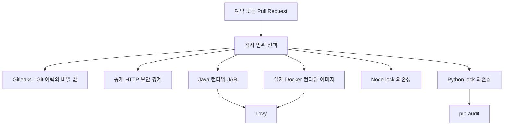

title: "요청하지 않은 Security 실패 메일: 정기 검사에서 취약점을 발견하고 고친 기록"
slug: scheduled-security-scan-remediation
category: 개발 노트
tags: github-actions,security,cve,trivy,pip-audit,bouncycastle,anyio,supply-chain,dependency-management,devlog
summary: 요청하지 않은 GitHub Security 실패 메일의 실행 주체와 로그를 추적했다. 예약 검사가 Spring과 payment-api의 실제 런타임에서 새 취약점을 어떻게 중복 탐지했는지, 실제 침해와 구분한 근거, 최소 수정과 회귀 검증 과정을 정리한다.
toc: true

---

9월 21일 오전 8시 20분 무렵 GitHub에서 메일이 왔다. 제목은 `[jaymunsh/jay-wiki] Security workflow run`이었고, 본문에는 `Some jobs were not successful`이라고 적혀 있었다. 그 시간에 workflow를 실행한 기억은 없었다. 누군가 저장소에서 작업을 시작했는지, 토큰이나 비밀 값이 새어 자동화가 호출된 것인지부터 확인해야 했다.


먼저 결론부터 말하면 **침입이나 수동 실행 흔적은 아니었다.** 저장소에 설정해 둔 주간 예약 검사가 실행됐고, 며칠 사이 보안 데이터베이스에 반영된 취약점을 기존 운영 배포판에서 찾아낸 것이었다. 비밀 유출 검사와 공개 HTTP 경계 검사는 통과했다. 다만 실제 운영 이미지에도 문제가 된 라이브러리가 포함돼 있었으므로 실패 메일을 단순 오탐으로 닫을 수도 없었다.

## 요청한 적 없는 실행의 출발점을 이벤트에서 확인했다

메일 화면만 보면 누가 무엇을 눌렀는지 알기 어렵다. GitHub CLI로 실행 메타데이터를 조회하니 다음 값이 나왔다.

| 항목 | 확인한 값 |
|---|---|
| 실행 | [Security run 35544304175](https://github.com/jaymunsh/jay-wiki/actions/runs/35544304175) |
| 이벤트 | `schedule` |
| 시작 | 2026-09-21 08:19:30 KST |
| 브랜치 | `main` |
| commit | `58543d5ba320b6f68491e2f959b1968bd0ab9e36` |
| workflow | `.github/workflows/security.yml` |

workflow에는 다음 예약이 들어 있었다.

```yaml
on:
  pull_request:
  workflow_dispatch:
  schedule:
    - cron: '23 21 * * 0'
```

GitHub Actions의 cron은 UTC 기준이다. 설정 시각은 한국 시간 월요일 06:23이지만 실제 시작은 08:19였다. 예약 실행은 지정 시각보다 늦어질 수 있다. 이번 실행 기록에는 지연의 내부 원인까지 나오지 않으므로 약 2시간 차이를 특정 장애나 공격으로 해석하지 않았다.

API의 `actor`와 `triggering_actor`에는 저장소 소유자 계정이 표시됐다. 그러나 실행 이벤트가 `workflow_dispatch`가 아니라 `schedule`이므로 사람이 버튼을 눌렀다는 뜻은 아니다. **화면에 표시된 계정 이름보다 이벤트 종류와 실행 경로를 함께 봐야 했다.**

## 초록색 job과 빨간색 job을 역할별로 나눠 읽었다

이 workflow는 한 번의 검사처럼 보이지만 실제로는 서로 다른 도구와 대상을 병렬로 확인한다.



이번 실행 결과를 기능 단위로 다시 묶으면 다음과 같다.

| 검사 | 결과 | 의미 |
|---|---|---|
| 검사 범위 선택 | 통과 | 예약 실행에서 필요한 검사 대상을 정상 선택했다 |
| Git 이력 비밀 검사 | 통과 | Gitleaks가 현재 공개 이력에서 비밀 값을 찾지 않았다 |
| 공개 HTTP 보안 경계 | 통과 | 관리자·내부 경로의 공개 차단 규칙이 기대와 일치했다 |
| Node 의존성 | 통과 | `npm audit --audit-level=high` 기준을 통과했다 |
| web 런타임 이미지 | 통과 | 수정 가능한 High·Critical 항목이 없었다 |
| shipping·partner 이미지 | 통과 | 같은 이미지 기준을 통과했다 |
| Java 런타임 JAR | 실패·1분 20초 | Bouncy Castle 1.84에서 2건을 찾았다 |
| payment-api lock | 실패·11초 | AnyIO 4.14.1에서 3건을 찾았다 |
| Spring 런타임 이미지 | 실패·2분 16초 | JAR과 같은 Bouncy Castle 문제를 다시 찾았다 |
| payment-api 런타임 이미지 | 실패·43초 | lock 검사와 겹치는 AnyIO 문제를 다시 찾았다 |

메일의 초록색 job 옆에도 annotation 숫자 `1`이 보였다. 해당 annotation 원문을 확인하니 `ubuntu-latest`가 향후 Ubuntu 26으로 이동한다는 GitHub runner 안내였다. 검사가 실패했다는 뜻이 아니었다. 반대로 Java와 Python job의 annotation은 도구 경고와 종료 코드 오류를 함께 포함했다. 숫자만 세지 않고 annotation의 수준과 원문을 읽어야 했다.

## Java 검사는 MinIO가 끌어온 Bouncy Castle을 찾았다

Java job은 `bootJar`를 만든 뒤 소스 manifest만 보는 대신 **실제 산출된 JAR**을 Trivy로 검사한다. 여기서 `org.bouncycastle:bcprov-jdk18on:1.84`가 걸렸다.

| 식별자 | 등급 | 내용 | 최초 수정 버전 |
|---|---|---|---:|
| `CVE-2026-8763` | Critical | 인증서 Name Constraints 처리에서 `rfc822Name`·URI 끝의 점을 이용한 우회 가능성 | 1.85 |
| `CVE-2026-13506` | High | 지연 ASN.1 sequence 처리에서 중첩 깊이 방어가 초기화돼 서비스 거부로 이어질 가능성 | 1.85 |

의존성 경로도 확인했다.

```text
io.minio:minio:9.0.1
└── org.bouncycastle:bcprov-jdk18on:1.84
```

애플리케이션은 `MinioWikiAssetStorage`에서 MinIO 클라이언트를 실제로 사용한다. 따라서 “코드에서 직접 Bouncy Castle을 선언하지 않았다”는 이유로 제외할 수 없다. 패키지는 운영 JAR과 Spring Docker 이미지 안에 모두 들어 있었다.

그렇다고 Critical이라는 표지만 보고 현재 공격이 성공했다고 결론 내릴 수도 없다. 첫 취약점은 해당 라이브러리를 사용한 인증서 경로 검증과 공격자가 조작한 조건이 함께 필요하고, 두 번째는 취약한 ASN.1 처리 경로에 공격자가 영향을 줄 수 있어야 한다. 이번 로그는 **취약한 구성 요소의 존재**를 증명했지만 **실제 악용 경로와 침해**를 증명하지는 않았다.

수정은 MinIO 전체를 한꺼번에 바꾸는 대신 Gradle constraint로 Bouncy Castle만 `1.85.2`로 올렸다. MinIO 9.0.3의 POM도 아직 1.84를 요청하고 있어 MinIO patch 업그레이드만으로는 해결되지 않았다.

```groovy
implementation('org.bouncycastle:bcprov-jdk18on:1.85.2') {
    because 'CVE-2026-8763 and CVE-2026-13506 fixes; MinIO 9.0.1 requests 1.84'
}
```

`dependencyInsight`에서 MinIO가 요청한 1.84가 constraint에 의해 1.85.2로 선택되는 것도 확인했다.

## Python 검사는 payment-api의 잠긴 AnyIO 버전을 찾았다

payment-api job은 `uv.lock`에서 운영 의존성만 내보낸 뒤 `pip-audit`를 실행한다. `anyio 4.14.1`에서 다음 세 항목이 나왔다.

| 식별자 | 등급 | 조건 | 수정 버전 |
|---|---|---|---:|
| `CVE-2026-63374` | Critical | 국제화 도메인을 대상으로 AnyIO TLS 연결을 사용할 때 IDNA 2003 처리 차이로 인증서 검증이 우회될 가능성 | 4.14.2 |
| `CVE-2026-63349` | High | POSIX 자식 프로세스의 `extra_groups` 전달 오류로 보조 그룹이 남을 가능성 | 4.14.2 |
| `CVE-2026-64847` | Medium | process-pool worker의 stderr pipe가 가득 차 호출이 멈출 가능성 | 4.14.2 |

Trivy 이미지 gate는 High·Critical만 대상으로 하므로 첫 번째와 두 번째를 표시했다. `pip-audit`는 세 건을 모두 보고했다. 이것이 같은 payment-api를 검사했는데 표의 개수가 달랐던 이유다.

payment-api 코드에서 `TLSStream`, `connect_tcp`, `run_process`, `open_process`를 직접 호출하는 곳은 찾지 못했다. AnyIO는 FastAPI·Starlette 실행 스택의 전이 의존성으로 들어왔다. 직접 호출이 없다는 사실은 위험도를 판단할 자료지만, 운영 lock과 이미지에 수정 전 패키지가 존재한다는 사실까지 없애 주지는 않는다. 수정판이 있고 변경 폭도 작으므로 lock을 올리는 쪽을 택했다.

## 실패 job 네 개는 독립된 네 문제를 뜻하지 않았다

workflow는 같은 대상을 두 관점에서 본다.

- 언어별 검사는 JAR이나 lock 파일에서 애플리케이션 의존성을 빠르게 확인한다.
- 이미지 검사는 실제 컨테이너 안에 들어간 OS 패키지와 언어 패키지를 함께 확인한다.

그래서 Bouncy Castle 한 묶음이 `java`와 `Runtime image (spring)`에서 각각 실패했고, AnyIO 한 묶음이 `python (payment-api)`와 `Runtime image (services/payment-api)`에서 각각 실패했다. 중복 검사는 낭비가 아니었다. **선언한 의존성에서 발견한 문제가 실제 배포 산출물에도 들어갔다는 교차 확인**이 됐다.

## 무조건 최신으로 올린 첫 시도는 회귀 테스트에서 멈췄다

AnyIO를 특정하지 않고 업데이트하자 resolver는 당시 최신인 `4.15.1`을 골랐다. 보안 취약 범위에서는 벗어났지만 payment-api 테스트가 시작되기도 전에 실패했다.

```text
DeprecationWarning:
The anyio.abc.BlockingPortal alias is deprecated,
use anyio.from_thread.BlockingPortal instead.
```

현재 FastAPI 테스트 클라이언트가 거치는 Starlette 코드가 해당 별칭을 사용하고 있었고, 이 프로젝트는 warning을 error로 처리한다. 경고를 숨기면 테스트는 진행될 수 있지만 의존성 호환 문제를 묻어 두게 된다.

이번 작업의 목표는 AnyIO의 기능 변경이 아니라 세 취약점을 닫는 일이었다. 그래서 최초 수정 버전인 `4.14.2`로 lock을 좁혔다. 이 버전에서 기존 테스트 17개가 다시 통과했고 `pip-audit`도 `No known vulnerabilities found`로 끝났다. **보안 업데이트도 호환성 검증을 거쳐야 하며, 가장 큰 버전 숫자가 항상 가장 작은 위험을 뜻하지는 않았다.**

## 소스 검사와 실제 이미지 검사를 같은 기준으로 다시 돌렸다

수정 뒤 확인은 세 층으로 나눴다.

| 층 | 수행한 검사 | 결과 |
|---|---|---|
| 의존성 해석 | Gradle `dependencyInsight`, `uv lock` | Bouncy Castle 1.85.2, AnyIO 4.14.2 선택 |
| 애플리케이션 | Spring 전체 테스트·`bootJar`, payment-api pytest | 통과 |
| 보안 | payment-api `pip-audit`, 두 런타임 이미지의 Trivy High·Critical gate | 통과 |

Spring은 전체 테스트와 JAR 생성을 함께 수행했다. payment-api는 17개 테스트를 통과했다. 이어 workflow와 같은 Dockerfile로 Spring과 payment-api 이미지를 새로 만들고, `--ignore-unfixed --severity HIGH,CRITICAL --exit-code 1` 조건으로 Trivy를 실행했다. 수정 가능한 High·Critical 취약점이 남아 있으면 명령 자체가 실패하도록 했다.

이 검증은 패키지 이름만 바뀌었다는 확인보다 강하다. 실제 Docker build가 새 lock과 Gradle resolution을 사용했고, 최종 이미지 안에서도 기존 CVE가 사라졌는지를 확인하기 때문이다.

## 실패 알림은 사고와 유지보수 사이에서 읽어야 했다

이번 메일을 받고 바로 “해킹당했다”고 판단했다면 비밀 교체와 서비스 차단부터 시작했을 것이다. 반대로 “예약 검사니까 무시해도 된다”고 판단했다면 운영 이미지에 남은 수정 가능한 취약점을 놓쳤을 것이다.

확인 순서는 다음처럼 정리됐다.

1. 실행 이벤트와 대상 SHA를 확인해 수동 실행·push·schedule을 구분한다.
2. 비밀 유출과 공개 경계 검사 결과를 먼저 확인한다.
3. 실패 job의 마지막 오류만 보지 않고 패키지·설치 버전·수정 버전을 뽑는다.
4. 같은 CVE를 언어 검사와 이미지 검사가 중복 보고했는지 묶는다.
5. 실제 코드 사용 경로를 찾아 “패키지 존재”와 “악용 가능성 입증”을 구분한다.
6. 수정 가능한 최소 버전을 적용하고 기존 기능 테스트를 실행한다.
7. 최종 Docker 이미지를 같은 보안 기준으로 다시 검사한다.

정기 검사는 코드가 바뀌지 않아도 의미가 있다. 9월 17일에 만든 동일한 `main` SHA가 9월 21일 검사에서 실패한 이유는 코드가 몰래 변해서가 아니라 **취약점 정보가 새로 공개되고 스캐너 데이터베이스가 갱신됐기 때문**이다. 빌드 당시 깨끗했던 이미지는 시간이 지나도 자동으로 안전 상태를 유지하지 않는다.

이번 수정은 공개 소스의 검증과 `develop` 반영까지 진행한다. 운영 k3s의 이미지는 별도 배포 절차를 거쳐야 바뀐다. 새 검사 통과와 운영 배포 완료를 같은 사건으로 기록하지 않는다.

## 참고한 자료

- [실패한 GitHub Security 실행](https://github.com/jaymunsh/jay-wiki/actions/runs/35544304175)
- [GitHub Actions schedule 이벤트](https://docs.github.com/en/actions/reference/workflows-and-actions/events-that-trigger-workflows#schedule)
- [GHSA-9pwp-9qqc-pr26 · Bouncy Castle Name Constraints 우회](https://github.com/advisories/GHSA-9pwp-9qqc-pr26)
- [GHSA-qp49-qgx5-5m26 · Bouncy Castle ASN.1 처리 서비스 거부](https://github.com/advisories/GHSA-qp49-qgx5-5m26)
- [GHSA-82r6-8w77-94w6 · AnyIO TLS IDNA 처리](https://github.com/advisories/GHSA-82r6-8w77-94w6)
- [GHSA-3w57-8xmc-8v26 · AnyIO extra_groups 전달](https://github.com/advisories/GHSA-3w57-8xmc-8v26)
- [GHSA-5p39-cfhj-2xmp · AnyIO process-pool stderr 교착](https://github.com/advisories/GHSA-5p39-cfhj-2xmp)
- [Trivy 공식 저장소](https://github.com/aquasecurity/trivy)
- [pip-audit 공식 저장소](https://github.com/pypa/pip-audit)
