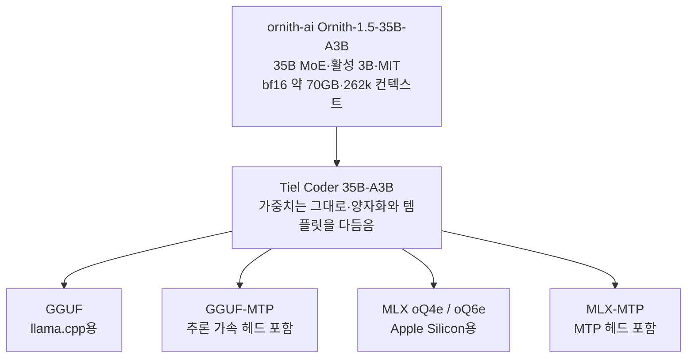

title: "Tiel Coder 35B-A3B 정리: Opus 4.6급이라는 말의 실체와 35B MoE 고르는 법"
slug: tiel-coder-35b-guide
category: 리서치
summary: "Ornith-1.5 기반 Tiel Coder 35B-A3B의 SWE-bench-Live 12/25와 Opus 4.6 동급 주장의 조건, 베이스 대비 개선폭, GGUF·MTP·MLX 선택 기준과 커뮤니티 실측 반응을 정리한 리서치."
tags: tiel-coder,ornith,local-llm,moe,coding-agent,quantization,gguf,mlx,swe-bench,research
toc: true
syncHash: 81ed7efd267051bff76ac061ed08c74eb387215c8e6dd8227ae54aa75837f9d3
publishedAt: 2026-09-07T17:43:11.883216Z

---

> **이 글의 대상**: 클라우드 코딩 API 비용이나 코드 유출 걱정 때문에 로컬 코딩 모델을 찾는 사람. 특히 16~32GB 환경에서 35B MoE를 돌릴 수 있는지, "Tiel Coder" 계열이 왜 여러 개인지 한 번에 확인하려는 개발자.

> **출처 및 기준일**: 수치의 정본은 [peculiar-ragdoll/Tiel-Coder-35B-A3B-GGUF 모델 카드](https://huggingface.co/peculiar-ragdoll/Tiel-Coder-35B-A3B-GGUF)와 [MTP 모델 카드](https://huggingface.co/peculiar-ragdoll/Tiel-Coder-35B-A3B-GGUF-MTP), [MLX oQ4e-MTP 카드](https://huggingface.co/peculiar-ragdoll/Tiel-Coder-35B-A3B-MLX-oQ4e-MTP), [llm-bench.io 집계](https://llm-bench.io/models/tiel-coder-35b-a3b-q4-k-s)를 기준으로 정리했다. 판정 기준일은 2026년 9월 7일이다. 벤치마크와 파일 구성은 바뀔 수 있으므로, 받기 전에 본문의 링크에서 최신 값을 다시 확인한다.


## 1. 로컬 코딩 에이전트는 파일 몇 개만 넘어가도 무너진다

클라우드 코딩 API로 에이전트 루프를 돌리면 요금이 쌓인다. 파일을 읽고 테스트를 돌리고 로그를 해석해 다시 고치는 과정이 수십 턴 이어지고, 실패한 세션을 되돌릴 때마다 같은 토큰을 또 산다. 코드를 외부로 보내기 어려운 팀은 이 루프 자체를 로컬로 옮기고 싶어진다.

문제는 로컬 코딩 모델이 단일 스니펫은 잘 쓰면서 막상 여러 파일을 넘나드는 수정에서 헤매는 경우가 많다는 점이다. 같은 수정을 반복하거나 도구를 잘못 호출하면서 턴이 길어지고, 결국 사람이 개입한다.

Tiel Coder 35B-A3B는 이 지점에서 이름이 나왔다. 제작자의 표현을 빌리면 "빠른 일꾼"이며, 실제 코드베이스 이슈 수정 속도와 멀티턴 대화 유지에 초점을 맞춘 빌드다. 반대로 상식 퀴즈형 지식 평가는 약하다고 못 박는다. 일용과 시험을 구분한 모델이다.


## 2. Tiel Coder의 정체는 새 학습이 아니라 다듬은 양자화다

Tiel Coder를 처음 보면 모델이 다양한 것처럼 보인다. 실제로는 뼈대가 하나다.



핵심은 세 가지다. 첫째, 베이스는 [Ornith-1.5-35B-A3B](https://huggingface.co/ornith-ai/Ornith-1.5-35B-A3B)이며 가중치를 새로 학습한 것이 아니다. 둘째, [Unsloth Dynamic 방식](https://huggingface.co/unsloth)에 제작자 자체 imatrix를 얹어 동적 양자화했다. 교정 코퍼스는 약 4,900만 자이며 코드가 4분의 3, 수학·도구 호출·다국어가 4분의 1이다. 셋째, GGUF 안에 [Sharp 채팅 템플릿](https://huggingface.co/peculiar-ragdoll/Qwen-Sharp-Chat-Templates)을 내장했다.

35B라는 숫자는 오해하기 쉽다. MoE라서 토큰마다 도는 파라미터는 약 3B 수준이며, 가볍다는 말은 메모리가 아니라 속도에 가깝다. 원본 bf16은 약 70GB라 그대로는 소비자용 카드에 안 들어간다. 그래서 양자화 선택이 곧 배포 선택이 된다. 4비트 기준 가중치는 20GB 안팎이며, 컨텍스트 KV 캐시는 별도로 붙는다. 제작자는 262k 컨텍스트 KV가 16비트 정밀도에서 RAM 5GB 미만이라고 안내한다.


## 3. Opus 4.6급이라는 말은 SWE-bench-Live 12/25에서 나왔다

"Opus 4.6급"이라는 표현의 출처는 모델 카드의 실측 표다. 조건을 떼고 점만 옮기면 의미가 어긋나므로 표 그대로 읽는다.

| 평가 | Tiel Coder | 비교군의 같은 조건 값 |
|---|---|---|
| SWE-bench-Live 25문제 | 12개 해결 | Opus 4.6 medium 12개, Ornith-1.5 자체 8개, Nail 9개, Sonnet 5 medium 8개 |
| 같은 평가의 상위 | - | Qwen3.8-27B 16개, Dirk 15개, Opus 5는 Tiel보다 앞선 구간 |
| 시도당 소요 시간 | 중앙값 8.6분·평균 12.3분 | Nail 중앙값 7.2분·평균 15.7분, Tiel은 비싼 시도의 꼬리가 짧다 |
| Claw-Eval 멀티턴 대화 | 67.2점 | Ornith-1.5 65.3점, Nail 60.5점, 각 114개 대화 기준 |
| MMLU-Pro 지식·추론 | 73.7점 | Nail 84.0점, 두 빌드 모두 4비트 기준 |

정리하면 "Opus 4.6급"은 전체 성능이 같다는 뜻이 아니다. 실제 코드 이슈 25개를 고치는 작업에서 Opus 4.6 medium과 같은 개수를 풀었다는 뜻이다. 제작자도 출시 글에서 Qwen3.8-27B 기준선을 빠뜨렸다는 지적을 받고 수치를 보탰으며, dense 27B가 더 많이 풀지만 6배 느리다는 교환 관계를 직접 밝혔다.


## 4. 베이스와 비교하면 이득과 대가가 따로 보인다

Tiel은 파인튜닝이 아니라 양자화와 템플릿을 다듬은 빌드다. 그럼에도 코딩·대화 축에서는 베이스를 앞선다. 통상 양자화하면 점수가 깎이는데, 여기서는 코드 가중 imatrix와 Sharp 템플릿이 그 손해를 뒤집은 셈이다.

| 축 | Ornith-1.5 | Tiel Coder 4비트 | 차이의 읽기 |
|---|---|---|---|
| SWE-bench-Live 25문제 | 8개 해결 | 12개 해결 | 4개 추가 해결, 50% 증가. Opus 4.6 medium과 동수에 닿은 구간 |
| Claw-Eval 멀티턴 | 65.3점 | 67.2점 | 1.9점 상승. 답변 품질은 3.8점 올랐고 되묻기는 5.1점 내렸다 |
| MMLU-Pro | 78.0점 | 73.7점 | 4.3점 하락. 짧은 답변을 택한 템플릿의 대가 |
| 시도당 시간 감각 | stock Qwen3.6-35B-A3B 5.5분 | Tiel 8.6분 중앙값 | 더 오래 보지만 더 많이 푼다. Nail은 중앙값 7.2분·평균 15.7분으로 꼬리가 길다 |

MMLU-Pro 하락을 양자화 탓으로 돌리기는 어렵다. 같은 양자화에 Ornith 자체 템플릿을 얹은 대조군은 베이스와 같은 점수가 나왔다. 하락분은 Sharp 템플릿이 짧은 답을 선택하면서 생긴 비용이다. 일용과 시험의 교환을 수치로 못 박은 셈이다.

이 개선은 베이스 자체의 점프 위에 얹힌 것이다. Ornith-1.5는 stock Qwen3.6-35B-A3B 대비 Terminal-Bench 2.1에서 52.5%를 67.8%로 15.3%p 끌어올렸고, SWE-bench Verified 73.4%를 79%로, MCP-Atlas 에이전트 평가 62.8%를 70.2%로, ClawEval 코드 68.7%를 72.5%로 올렸다고 보고된다. Tiel은 그 위에서 코딩·대화 축을 한 번 더 민 빌드다. 그래서 제작자의 선택 기준은 단순하다. 에이전트 코딩과 긴 대화 유지에는 Tiel, 시험형 지식과 어려운 추론에는 Nail, 가중치와 무관하게 가장 많은 수정을 원하면 dense 27B인 Dirk다.

독립 실측에서도 같은 방향이 나온다. 2장의 RTX 5060 Ti 16GB 2장 환경에서 BeeLlama로 돌린 소규모 에이전트 비교([MTP 논의 5번](https://huggingface.co/peculiar-ragdoll/Tiel-Coder-35B-A3B-GGUF-MTP/discussions/5))에서는 도구 호출 9개 중 9개가 세 빌드 모두 통과했고, 계획 과제에서 Tiel 93점·Shisa 79점·ICE 93점, 코딩 과제에서 Tiel 3개 중 3개·Shisa 2개·ICE 0개를 기록했다. 코딩 효율도 갈렸다. Tiel은 도구 호출 9~20회·추론 토큰 10~17K로 풀었고, ICE는 최대 32회·43K까지 썼다. 디코드 속도와 MTP 수용률은 세 빌드가 비슷했으며(약 112~117 tok/s, 약 88%), 그 안에서 Tiel이 가장 빨랐다.


## 5. 모델이 다양한 것이 아니라 배포판이 다양한 것이다

Tiel Coder가 여러 개인 이유는 학습 계열이 많아서가 아니다. 같은 가중치를 실행 환경과 가속 방식에 맞게 담은 배포판이 여러 개다.

| 배포판 | 용도 | 확인된 저장소 |
|---|---|---|
| GGUF | llama.cpp·LM Studio·Ollama·vLLM 등 범용 | [Tiel-Coder-35B-A3B-GGUF](https://huggingface.co/peculiar-ragdoll/Tiel-Coder-35B-A3B-GGUF) |
| GGUF-MTP | GGUF에 추론 가속용 MTP 헤드 추가, 약 0.9GB 증가 | [Tiel-Coder-35B-A3B-GGUF-MTP](https://huggingface.co/peculiar-ragdoll/Tiel-Coder-35B-A3B-GGUF-MTP) |
| MLX oQ4e | Apple Silicon용, 4비트 | [Tiel-Coder-35B-A3B-MLX-oQ4e](https://huggingface.co/peculiar-ragdoll/Tiel-Coder-35B-A3B-MLX-oQ4e) |
| MLX oQ4e-MTP | MLX 4비트에 MTP 헤드 추가, MTP 끄면 oQ4e와 동일 | [Tiel-Coder-35B-A3B-MLX-oQ4e-MTP](https://huggingface.co/peculiar-ragdoll/Tiel-Coder-35B-A3B-MLX-oQ4e-MTP) |
| MLX oQ6e 계열 | 품질 우선 Apple Silicon용 | [MLX oQ6e](https://llm-explorer.com/model/peculiar-ragdoll%2FTiel-Coder-35B-A3B-MLX-oQ6e,73htXcPqtKOdO1vKEX9Az6) |
| 파생 GGUF | 커뮤니티 Hermes 리빌드 등 | [Genesis-Hermes GGUF 논의](https://huggingface.co/LuffyTheFox/Tiel-Coder-35B-A3B-Genesis-Hermes-GGUF/discussions/4) |

MTP는 모델이 똑똑해지는 장치가 아니다. 다음 토큰 여러 개를 미리 예측해 추론을 가속하는 speculative decoding용 헤드다. Ornith-1.5 초기 업로드에는 이 블록이 사실상 무작위 초기화 상태였고, 제작자는 GGUF 일반판에서 이를 뺐다. 2026년 8월 23일 Ornith가 학습된 헤드로 교체한 뒤 MTP판이 따로 나왔다. 일반판은 그대로 유효하며 다시 빌드하지 않았다. 런타임이 MTP를 쓰면 MTP판을, 안 쓰면 일반판을 고른다.

시각 입력도 같은 맥락이다. Ornith-1.5의 vision tower를 계승하므로 실패 테스트 캡처나 설계 목업을 볼 수 있다. 프로젝터는 903MB짜리 `mmproj-BF16.gguf` 하나이며 양자화 등급과 무관하게 BF16 그대로 쓴다.

양자화 사다리는 35B 관심 지점에서 이렇게 읽는다.

| 파일 | 크기 | 들어가는 환경의 감각 | 제작자의 메모 |
|---|---|---|---|
| UD-Q2_K_XL | 12.3GB | 최후 수단 | 2비트는 에이전트 코딩에서 손해가 크다 |
| UD-IQ3_XXS | 13.2GB | 16GB급 | 16GB 선택지, Q2보다 한참 낫다 |
| UD-Q3_K_XL | 16.8GB | 24GB급 | 컨텍스트 여유가 필요할 때 |
| UD-IQ4_XS | 17.7GB | 24GB급 | 4비트 품질 중 컨텍스트 여유가 가장 크다 |
| UD-Q4_K_S | 20.9GB | 24GB급 | Q4_K_XL이 빡빡할 때의 절충 |
| UD-Q4_K_XL | 22.4GB | 24~32GB | 시작점, 벤치마크를 낸 등급 |
| UD-Q5_K_XL | 26.6GB | 32GB급 | 32GB 선택지 |
| UD-Q6_K_XL | 31.8GB | 48GB급 | near-lossless, 32GB에서는 컨텍스트가 남지 않는다 |
| UD-Q8_K_XL | 38.5GB | 48GB급 | 참조용 |

여기서 "fits"는 VRAM만이 아니라 RAM과 VRAM을 합친 가용량이다. OS와 다른 프로세스가 가져간 뒤 남은 값으로 판단한다. 제작자는 VRAM에 억지로 다 올리려고 Q4 아래로 내리는 것을 권하지 않는다. 모델과 KV를 RAM과 VRAM에 나눠 올리더라도 Q4 이상에서 컨텍스트를 길게 잡는 쪽이 에이전트 코딩에 낫다.

실행은 llama.cpp 계열이면 한 줄이다.

```bash
hf download peculiar-ragdoll/Tiel-Coder-35B-A3B-GGUF \
  Tiel-Coder-35B-A3B-UD-Q4_K_XL.gguf --local-dir Tiel
llama-server -m Tiel/Tiel-Coder-35B-A3B-UD-Q4_K_XL.gguf -ngl 99 --jinja
```

Ollama와 Docker 경로도 같은 파일을 가리킨다.

```bash
ollama run hf.co/peculiar-ragdoll/Tiel-Coder-35B-A3B-GGUF:UD-Q4_K_XL
docker model run hf.co/peculiar-ragdoll/Tiel-Coder-35B-A3B-GGUF:UD-Q4_K_S
```

에이전트 코딩용 샘플링은 제작자가 쓴 값부터 시작한다. 일반 대화는 `temperature 1.0`, `top_p 0.95`, `top_k 20`이며, 에이전트 코딩 평가는 `temperature 0.6`에서 돌렸다.


## 6. 35B를 고른다면 메모리와 속도부터 재고 결정했다

독립 집계인 llm-bench.io 값은 실험실 점수와 다른 축을 준다. 같은 35B라도 하드웨어와 양자화에 따라 체감이 갈린다.

| 빌드 | 최고·평균 속도 | 최소 메모리 | 품질 평균 | 확인된 환경 |
|---|---|---|---|---|
| Q4_K_S llama.cpp | 최고 166.6 tok/s·평균 165.0 tok/s | 17.1GB | 84.6점 | Radeon RX 7900 XT급, 3회분 |
| MLX oQ4e | 최고 121.4 tok/s·평균 107.9 tok/s | 21.2GB | 83.6점 | Apple M5 Max, 5회분 |
| MLX oQ4e-MTP | 최고 126.6 tok/s·평균 123.6 tok/s | 21.0GB | 81.8점 | Apple M5 Max, 4회분 |

작업별 품질도 참고값이다. Q4_K_S는 에이전트 워크플로 89.3점, 코드 생성 76.9점, 리서치·분석 84.9점을 기록했다. MLX oQ4e는 에이전트 83.4점, 코드 생성 81.5점이다. 커뮤니티 제출값이라 한 번의 절대 순위로 읽으면 안 되지만, 방향은 보인다. 코딩 에이전트에 붙일 35B로 속도와 품질이 함께 필요하다는 점이다.

선택은 이렇게 좁힌다. 16GB 카드에서는 IQ3_XXS가 현실선이며, 24GB에서는 IQ4_XS나 Q4_K_S 사이에서 컨텍스트 여유를 본다. 32GB에서는 벤치마크 등급인 Q4_K_XL부터 시작하고, 64GB급 Mac이면 Q6까지 올려 품질을 본다. 컨텍스트를 131k~262k로 길게 쓸 계획이면 가중치 크기만 보지 말고 KV 캐시 몇 GB를 더 얹어 계산한다. 짧은 대화는 되는데 긴 작업에서 죽는 실패가 가장 흔하다.

독립 평가 중에는 12GB 카드에서 Tiel과 Ornith·Qwen 파생 빌드를 같은 프롬프트로 비교한 [35b-moe-eval](https://github.com/h00nigan/35b-moe-eval)도 있다. 실측 하네스 결과까지 포함해 볼 때 배포 적합성 판단에 도움이 된다. 이 평가는 8장에서 따로 다룬다.


## 지금 쓰는 Ornith oQ6와 비교하면 속도보다 작업 적합성을 먼저 봤다

내가 현재 oMLX에서 쓰는 모델은 [RukaRat/Ornith-1.5-35B-A3B-oQ6-gs128-mtp-vision](https://huggingface.co/RukaRat/Ornith-1.5-35B-A3B-oQ6-gs128-mtp-vision)이다. Tiel을 비교할 때는 이 모델을 빼고 "새 모델이 더 좋다"고 말할 수 없다. 둘 다 Ornith-1.5 35B-A3B 계열의 6비트 vision·MTP 빌드라서, 35B라는 크기나 이미지 입력 능력이 한 단계 바뀌는 교체가 아니다.

차이는 양자화와 대화 템플릿에 있다. RukaRat 빌드는 oQ6·group size 128·약 30.0GB이고, MTP 수용률을 78~84%, 사이클당 약 2.1토큰으로 기록했다. Tiel의 [oQ6e-MTP 빌드](https://huggingface.co/peculiar-ragdoll/Tiel-Coder-35B-A3B-MLX-oQ6e-MTP)는 약 31.2GB이며, 동적 mixed-precision imatrix와 Sharp chat template를 넣었다. Tiel의 oQ6e 가중치는 MTP 헤드가 붙은 별도 학습 모델이 아니라 Ornith 기반의 다른 배포판이다. 그래서 기대할 수 있는 차이는 지식량보다 코드 작업의 응답 방식과 도구 호출 형식이다.

속도만 보면 Tiel로 바꿔야 할 근거는 아직 없다. RukaRat 카드의 속도 비교는 M2 Max 64GB와 oMLX 0.6.2에서 Qwen3.6 oQ6 모델을 상대로 6회 교차 측정한 결과이고, 평균 차이 -3.1%, 표준편차 8.7%, 세 번씩 앞선 결과라 통계적으로 구분할 수 없다고 적혀 있다. 이것은 RukaRat와 Tiel의 직접 대결은 아니지만, 같은 Apple Silicon에서 짧은 몇 회의 tok/s 차이를 성능 우열로 읽기 어렵다는 근거가 된다.

Tiel 카드도 같은 방향의 주의를 준다. 자체 Apple Silicon 측정에서 MTP는 1.6~1.8토큰을 받아들였지만, 4비트 빌드의 draft depth 1~3에서는 MTP를 켠 속도가 끈 속도의 0.82~0.93배였다. 그 수치는 oQ6에서 다시 측정한 것이 아니므로 현재 모델에 그대로 적용할 수는 없다. 다만 35B-A3B는 활성 파라미터가 약 3.4B라서 이미 디코드가 충분히 가벼울 수 있고, MTP 검증 비용이 예측 이득을 상쇄할 수 있다는 설명은 Tiel이 자동으로 더 빠르다는 주장을 막는다.

| 비교할 축 | 현재 RukaRat Ornith oQ6 | Tiel oQ6e-MTP | 지금 내릴 수 있는 판단 |
|---|---|---|---|
| 모델 계열 | Ornith-1.5 기반 | Ornith-1.5 기반 | 세대 교체가 아니다 |
| 양자화 | oQ6, group size 128, 약 30.0GB | oQ6e, 약 31.2GB | 메모리 차이는 작고 직접 측정이 필요하다 |
| MTP | 78~84% acceptance, 약 2.1 tok/cycle 보고 | 약 1.6~1.8 accepted tok/cycle 보고 | acceptance만으로 실제 tok/s를 예측할 수 없다 |
| 코딩 응답 | Ornith 기본 계열 | Sharp template·코딩 imatrix | 코드·도구 호출은 Tiel을 시험할 이유가 있다 |
| vision | vision tower 유지 | vision 포함 | 이미지 이해만으로 바꿀 이유는 약하다 |
| 디코드 속도 | 같은 장비의 직접 측정값이 있음 | oQ6 직접 비교값이 없음 | 빠르다고 단정할 수 없다 |

따라서 선택은 용도에 따라 갈린다. 현재 모델의 이미지 입력과 일반 대화가 만족스럽고 속도가 중요하면 RukaRat 빌드를 유지하는 편이 안전하다. 반대로 코드 수정, JSON 도구 호출, 여러 턴에 걸친 에이전트 작업이 주 용도라면 Tiel을 별도 폴더에 받아 Sharp template가 실제 작업을 줄이는지 시험할 가치는 있다. 이때 기대하는 것은 모델 크기의 상승이 아니라 작업 지시를 따르는 방식의 변화다.

속도를 비교할 때는 짧은 한 번의 생성값을 기록하지 않는다. [oMLX 실사용 보고](https://github.com/jundot/omlx/issues/2976)에서도 짧은 출력은 27~40 tok/s인데 700~1,200토큰의 검색·요약 작업은 6.0~10.8 tok/s까지 내려갔다. 같은 하드웨어·같은 oMLX 버전·같은 context 길이에서 모델을 번갈아 실행하고, 준비 시간을 버린 뒤 다음 네 값을 따로 기록해야 한다.

1. 첫 토큰까지의 시간과 prefill 속도
2. 128토큰 짧은 출력의 decode tok/s
3. 700토큰 이상 에이전트 작업의 sustained tok/s
4. MTP `accept`, `tok/cycle`, peak memory와 작업 성공 여부

MTP가 실제로 켜졌는지도 먼저 확인한다. RukaRat 카드에 따르면 oMLX의 `mtp_enabled`는 기본값이 꺼져 있고, `mtp_enabled`와 `vlm_mtp_enabled`를 동시에 설정하면 설정 전체가 기본값으로 돌아갈 수 있다. `~/.omlx/logs/server.log`에서 `MTP[`와 `accept=`, `tok/cycle=`를 확인하지 않으면 두 모델의 속도 비교는 MTP on/off를 섞은 결과가 된다.

내 결론은 이렇다. **Tiel은 현재 Ornith oQ6보다 빠른 모델이라기보다, 코딩 에이전트 작업에 더 잘 맞을 가능성이 있는 같은 급의 배포판이다.** 속도는 현재 RukaRat와 직접 A/B 측정하기 전에는 우열을 말할 수 없고, vision은 두 모델의 공통 기반이라 교체 근거가 약하다. 먼저 같은 작업 다섯 개를 양쪽에 주고 성공률·도구 호출·sustained tok/s를 함께 기록한 뒤 바꾸는 것이 맞다.


## 8. 커뮤니티는 환호와 검증 요구를 함께 보냈다

출시글은 [r/LocalLLaMA](https://www.reddit.com/r/LocalLLaMA/comments/1vx33zj/tielcoders_22_gb_4bit_quant_matches_opus46_medium/)에서 249개 추천을 받았다. 다만 최상위 댓글(117개 추천)은 기준선 누락을 지적했고, 제작자는 Qwen3.8-27B 수치를 보태고 6배 빠르지만 적게 푼다는 교환을 인정했다. 같은 스레드에서는 "별도 파인튜닝이 아니라 Ornith의 imatrix 퀀트와 템플릿 교체"라는 정정도 따라붙었다. 제작자의 반박은 SWE-Bench Live의 격차가 그 손질의 결과라는 점이다.

| 커뮤니티 출처 | 환경과 방법 | Tiel에 대한 평가 |
|---|---|---|
| [HF MTP 논의 5번](https://huggingface.co/peculiar-ragdoll/Tiel-Coder-35B-A3B-GGUF-MTP/discussions/5) MojoManagement | RTX 5060 Ti 16GB 2장·BeeLlama·32K 컨텍스트·3시드 | 코딩 3개 중 3개로 Shisa·ICE 상회, 토큰 효율 2배 이상. 제작자도 "남의 환경에서 버틴다"고 답했다 |
| [Genesis-Hermes 논의 4번](https://huggingface.co/LuffyTheFox/Tiel-Coder-35B-A3B-Genesis-Hermes-GGUF/discussions/4) scomb2 | Ohmypi·실제 omp 에이전트 배터리·Arc B580 12GB | Genesis 파생이 원본 IQ4_XS 대비 벽시계 4.3분 대 8.3분, 실패 수정 7턴 대 21턴. 간결 지시 준수는 4개 중 4개 대 2개 |
| [35b-moe-eval](https://github.com/h00nigan/35b-moe-eval) h00nigan | RTX 4070 12GB·llama.cpp·147k 컨텍스트·동일 프롬프트 | 규정·지식 회상은 3종 중 최고. 다만 MTP 헤드 없는 Tiel은 소비자 VRAM에서 약 24% 느리고, 한 단어 echo 같은 직접 명령을 거부해 명령형 배포에는 부적합하다는 판정 |
| tool-eval-bench 공유(32GB V100 클러스터) | Qwen3.6-35B-A3B 계열 도구 호출 비교 | Ornith-1.5와 Tiel이 동점으로 최상위, KAT-Coder는 베이스를 소폭 상회, Heretic 파생은 실망이라는 정리 |
| llm-bench.io 커뮤니티 제출 | 7900 XT급·M5 Max 실측 | Q4_K_S 평균 165.0 tok/s·품질 84.6점, MLX oQ4e 평균 107.9 tok/s·품질 83.6점. 속도와 품질을 함께 본 기록 |
| 유튜브 16GB 셋업 실측 | 16GB 로컬 구성 | "Opus 4.6과 동점" 주장을 16GB에서 직접 돌려 확인하는 영상. 결론보다 재현 과정이 참고값이다 |

비판도 구체적이다. h00nigan 평가는 Tiel을 "정직하게 문서화된 좋은 빌드"라면서도 두 가지를 깎는다. MTP 헤드가 없어 소비자 VRAM에서 약 24% 느리다는 점, 그리고 직접 명령 수행을 거부하는 성향이 있다는 점이다. 학습된 NextN 헤드를 이식하는 실험에서는 수용률이 0.094으로 오히려 해가 됐다. 헤드는 몸통과 함께 학습된 쌍이며 따로 떼어 팔 수 없다는 결론이다. 명령형 도구가 아니라 비서형 용도로 봤을 때는 강한 후보라는 단서가 붙는다.

긍정 쪽의 한 줄 평도 있다. HF 논의에서 gbuzhf는 Tiel을 "Ornith 1.5의 두 번째 삶"이라고 불렀다. ICE 양자화와 Tiel imatrix·템플릿·MTP 조합 실험을 이어가며 모델 카드 표를 갱신하겠다는 예고도 남겼다. 환호는 빠르지만 검증 요구는 집요하다는 점이 이 모델 커뮤니티 반응의 특징이다.


## 9. 남은 한계를 그대로 적는다

잘된 것만 보면 선택이 어긋난다. 모델 카드와 집계에서 확인되는 제약을 먼저 둔다.

첫째, 시험 점수는 약한 축이다. MMLU-Pro 73.7점은 같은 4비트 Nail보다 10.3점 낮다. 시험형 벤치마크로 고르면 Tiel이 질 수 있다.

둘째, 되묻는 비율이 낮다. 베이스보다 clarifying 질문이 5.1점 낮으므로, 모호한 요청은 질문 대신 답으로 나올 수 있다. 에이전트에 붙일 때는 요구사항을 프롬프트에서 먼저 조이는 편이 낫다.

셋째, 표본이 얇다. SWE-bench-Live는 문제당 1회, MMLU-Pro는 3시드 기준이다. 몇 문제 차이는 잡음으로 본다. MLX판 수치는 GGUF판 실측을 빌려 온 설명이며, 양자화기가 다르면 결과가 움직인다는 단서가 카드에 직접 적혀 있다. MLX판 숫자가 필요하면 GGUF 숫자를 그대로 옮기지 않는다.

넷째, MTP는 보장된 가속이 아니다. 제작자 환경에서는 빨라지지 않았고, 메모리 바운드 환경에서만 도움이 될 수 있다. 직접 재고 결정한다.

다섯째, 영어와 중국어 계승이다. 베이스에서 물려받은 범위이며, 한국어 작업 품질은 별도 검증이 필요하다.

여섯째, 2비트는 최후 수단이다. 파일은 작지만 에이전트 코딩에서 손해가 크다고 카드가 직접 말한다.

정리하면 Tiel Coder는 "35B를 통째로 이해하는 모델"이 아니라 "35B 중 코딩과 대화 유지에 쓰는 부분을 다듬은 배포판"이다. Opus 4.6과 같은 개수를 풀었다는 말은 그 조건 안에서만 유효하다. 그 조건이 곧 이 모델의 용도다. 일할 때는 Tiel, 시험 볼 때는 다른 모델을 고른다. 제작자의 한 줄과 같은 결론이다.
