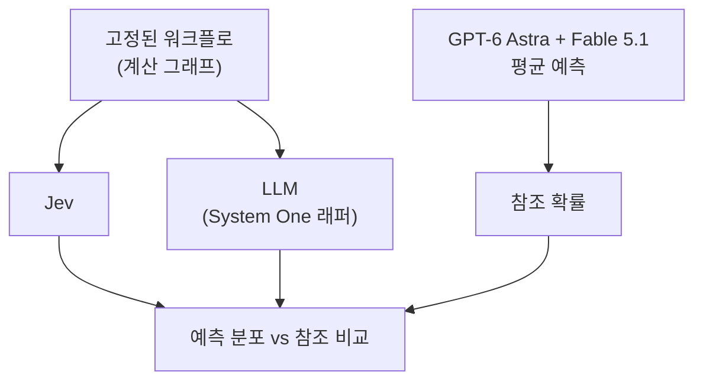
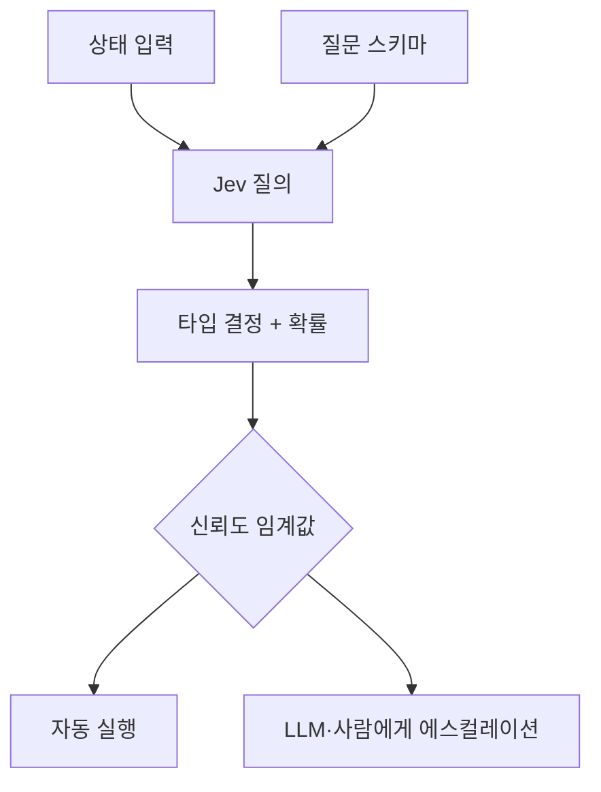

title: TypeSafe Jev 리포트, 문자열을 버리고 결정을 반환하는 System One 모델을 읽는다
slug: typesafe-jev-system-one-model-report
category: 리서치
tags: typesafe,jev,system-one-model,rlcd,automation,llm,research,vercel-ai-gateway
summary: 2026년 9월 15일 공개된 TypeSafe AI의 Jev를 공식 문서와 evals, 외신과 커뮤니티 반응으로 대조했다. typed 결정과 RLCD, 실제 호출법 5가지와 신뢰도 기반 설계, 커뮤니티 활용사례와 한계를 정리한다.
toc: true
syncHash: b8907e89d92a8656e7cc89368023216157dc4dd7186f724914af6df519829be0
publishedAt: 2026-09-17T14:57:58.518813Z

---

> **이 글의 대상**: 에이전트 워크플로 안에 LLM 호출을 박아 넣다가 지연과 파싱 실패에 부딪힌 개발자.
>
> **조사 기준 안내**: 2026년 9월 17일 확인 기준으로 TypeSafe AI 공식 블로그와 공식 문서(`docs.typesafe.ai`), evals 사이트, Business Wire 보도자료, The Register와 Hacker News 논의, Vercel AI Gateway 문서를 대조했다. Jev는 early access라 직접 과금 호출 재현은 하지 않았고, 호출 예제는 공식 문서의 것을 인용한다. 수치 인용은 출처를 함께 적는다.

에이전트에 분기 로직을 맡기면 문자열이 먼저 돌아온다. JSON 모드를 켜도 파싱과 검증 코드는 남고, 가끔은 스키마 밖의 답이 섞여 들어온다. 지연은 수 초에서 수 분까지 들쭉날쭉하다. 사람이 읽는 채팅에서는 감수할 만한 오차가 코드 안에서는 분기 실패가 된다.

TypeSafe AI는 이 지점을 정면으로 건드렸다. 2026년 9월 15일 스텔스에서 나와 첫 모델 Jev를 early access로 열었다. 캐치프레이즈는 frontier-intelligence function call이다. 비정형 상태를 넣으면 타입이 보장된 결정을 확률과 함께 내놓는다는 주장이다.

## 1. 공개된 사실만 먼저 묶는다

| 항목 | 확인된 내용 |
|---|---|
| 회사 | TypeSafe AI, 2024년 설립, 샌프란시스코. machine-native composable AI를 표방한다 |
| 창업자 | Diogo Almeida(CEO, 전 OpenAI·Google Brain, InstructGPT·RLHF·ChatGPT·GPT-4 공동 발명), Erik Gafni(Ravel 공동창업, 멀티모달), Sasha Sheng(전 Meta AI) |
| 자금 | 40M달러 시드, DCVC 리드. 기업가치 약 200M달러라는 보도가 있다 |
| 모델 | Jev, 첫 번째 System One Model. early access이며 `typesafe.ai`에서 waitlist를 받는다 |
| 스텔스 기간 | 약 2년 |
| 반응 | Hacker News에서 1,400~1,779 포인트, 수백 개 댓글. 이번 분기 신생 AI 랩 공개 중 가장 강한 반응이라는 평가가 있다 |

창업자의 문제의식은 공식 블로그 첫 문단에 그대로 있다. 채팅에서는 초인간이 된 지 오래인데 자동화는 어디에 있느냐는 질문이다. Almeida는 RLHF가 인간 선호에 최적화된 채팅을 만들었을 뿐, 기계가 소비하는 지능은 따로 설계해야 한다는 입장이다.

## 2. System One 모델은 출력의 종류를 바꾼다

System One이라는 이름은 Kahneman의 System 1에서 왔다. 빠르고 직관적인 판단을 가리킨다. Jev라는 이름은 William Stanley Jevons에서 따왔다. 지능 단가가 떨어지면 수요가 늘어난다는 경로를 기대한다는 뜻이다.

핵심 차이는 출력이 문자열이 아니라는 점이다.

| 구분 | 기존 LLM | Jev |
|---|---|---|
| 최적화 | RLHF(인간 선호), RLVR(검증 가능한 보상) | RLCD(Reinforcement Learning for Calibrated Decisions) |
| 입력 | 비정형 데이터, 순차 메시지 중심 | 비정형 데이터, 구조화된 프로그램 상태 중심 |
| 출력 | 문자열. 채팅·코드·환각·거부·구조화 값이 뒤섞인다. 소프트웨어가 쓰려면 파싱과 검증이 필요하다 | 미리 정의한 스키마 안의 타입 안전 값. 타입 오류는 구조상 발생하지 않는다고 주장한다 |
| 샘플링 | 순차. 토큰을 하나씩 생성한다 | 병렬. 모든 출력을 한 쿼리로 생성한다 |
| 신뢰도 | 물어도 과신하고 일관성이 떨어진다 | 매 출력에 확률과 신뢰도를 붙이고, 높을수록 정확도가 높도록 맞춘다고 주장한다 |
| 용도 | human-in-the-loop 작업, 검증 가능한 문제의 생성·반복, 데모 | 코드 안의 분기 조건, 대용량 분류, 실시간 판단, LLM 출력 검증과 가드레일 |

질문 원시 타입(primitive)은 `Choice`(여러 선택지 중 하나를 고른다), `Score`(점수를 매긴다), `Noul`(참/거짓을 판정한다)로 소개됐다. 상태는 JSON 객체일 수도 있고 `"My card was charged twice."` 같은 문자열일 수도 있다. 개발자는 선택지를 스키마로 먼저 정하고, Jev는 그 안에서 고른 값과 분포, 신뢰도를 돌려준다.

## 3. 속도와 가격은 직접 확인할 수 있는 주장부터 본다

공식 수치는 다음과 같다.

| 항목 | Jev | 비교 대상 |
|---|---|---|
| 종단 지연 | 70ms~500ms | 프론티어 모델 3초~329초 |
| 배율 주장 | 동일 지능의 System One 질의 기준 40배~200배 빠름 | 워크플로 eval 기준 홈페이지에 193.6배 빠름, 444.6배 저렴 표기 |
| 입력 가격 | 0.042달러/1M 토큰(10억 토큰당 42달러) | 0.20달러~10달러/1M 토큰 |
| 출력 가격 | 무료(미터할 만큼도 안 된다는 설명) | 입력의 약 5배 |

공식 블로그는 검증 가능한 것과 대담한 것을 구분한다. 호출당 속도와 가격은 직접 재현 가능하고, 타입 오류 0%는 반례 하나로 반박 가능한데 수학적으로 불가능하다고 적었다. 반면 193.6배와 444.6배는 워크플로 eval에서 나온 값으로 실제 이득의 상한에 가깝다고 스스로 단서를 달았다.

비용 감각을 잡기 위해 500토큰짜리 티켓 100만 건 분류를 가정한다. 입력 총량은 5억 토큰이고, 출력 무료를 적용하면 약 21달러가 나온다. 같은 셈법을 LLM에 적용하면 입력과 출력 과금이 함께 붙는다. 다만 이 비교는 Jev의 스키마가 이미 정해져 있다는 전제에서만 성립한다.

## 4. 워크플로 eval은 계산 그래프를 고정하고 비교한다

TypeSafe가 새로 만든 평가는 정답 분류를 맞히는 방식이 아니다. 올바른 계산 그래프(코드로 표현된 워크플로)가 있다는 가정에서 출발한다. 모든 모델에 같은 워크플로를 주고, 가장 크고 비싼 외부 모델들의 예측을 참조 확률로 삼는다. 이번 공개분에서는 GPT-6 Astra와 Fable 5.1의 평균을 기준으로 삼았다.



공개된 워크플로는 4개이며, `evals.typesafe.ai`에서 예제와 불일치, 전체 쿼리를 볼 수 있다. LLM 비교군은 TypeSafe의 System One LLM 래퍼(`system-one-adapter-python`)로 구조화 결정을 뽑는 방식을 썼다. 이 방식이 정확도는 가장 높았지만 느리고 비싸다고 적었다.

스스로 밝힌 편향도 있다. 워크플로 내용은 훈련 분포에 없으나 만든 사람이 모델 역량 팀 소속이라 편향 가능성이 있다. 참조 답을 Astra와 Fable 평균으로 삼아 OpenAI와 Anthropic 쪽으로 기운다. LLM 수치는 OpenRouter에서 가져와 복잡한 쿼리가 좋은 모델로 라우팅되는 편향이 있을 수 있다. 자사의 타입 오류 0%도 실측값이 아니라, 출력이 스키마에 구조적으로 묶여 있다는 주장에서 나온 수치다.

## 5. 데모가 말하는 것과 말하지 않는 것을 가른다

공식 블로그가 앞세운 데모는 세 갈래다.

첫째는 side-by-side 비교(Nuance)다. GPT-5.6 Terra 기본 추론 설정과 나란히 두고, 병렬 확률 출력과 토큰 순차 생성의 차이를 보여준다. 기록된 실행에서 Terra와 어긋난 것은 Churn likelihood level 하나였고, 저자는 genuinely ambiguous하다고 적었다. 입력이 짧고 밀도가 높아 Jev에 유리한 조명이라는 단서도 함께 달았다.

둘째는 Doom이다. 구조화된 게임 상태를 넣고 초당 10쿼리로 실시간 플레이를 한다. 담당 엔지니어는 시간당 약 7달러를 걱정했고, 팀은 예상보다 낮다고 판단했다. 이미지 입력이 아니라 구조화된 상태 자료구조 위의 데모이며, 순수 성능의 봇이 아니라 지시에 반응하는 봇을 의도했다고 적었다.

셋째는 Wikiracing이다. 수백~수천 개 링크 중 고르는 고카디널리티 선택의 누적 이득을 보여준다. Jev는 선택지 최대 255개를 지원하고, 그 위는 독립 스코어링 후 명시적 선택의 2단계로 처리해 가끔 느려진다. 비교 조건은 LLM의 비추론 모드 위주라 Jev의 속도 우위가 평소보다 작게 나왔다고 적었다. 추론을 켜면 LLM이 훨씬 못해 보여 데모가 지루해진다는 설명이다.

## 6. 호출법은 다섯 갈래로 굳어진다

공식 문서가 제시하는 진입점은 다섯 가지다. 개념이 아니라 실제 호출 형태까지 정해져 있다.

| 진입점 | 위치 | 맞는 상황 |
|---|---|---|
| Playground | `console.typesafe.ai/playground` | 스키마를 잡기 전 감각을 볼 때 |
| REST API | `POST api.typesafe.ai/v1/systemone` | 어떤 언어에서든 직접 붙일 때 |
| Python SDK | `pip install typesafe-sdk` | 배치 분류와 파이프라인에 넣을 때 |
| Vercel AI Gateway | `typesafe-ai/jev` + AI SDK `evaluate` | Vercel 스택에서 게이트웨이 하나로 모델을 갈아탈 때 |
| Agent skill | `typesafe-ai/skills` | 코딩 에이전트에게 연동 코드를 시킬 때 |

호출 모양은 항상 같다. `state` 하나에 `questions` 여러 개를 얹고, 답은 타입 값과 분포, 신뢰도로 돌아온다. 질문은 한 호출 안에서 병렬로 평가되며, 질문을 늘려도 지연이 거의 늘지 않고 문맥 오염도 생기지 않는다고 문서에 적혀 있다.

```bash
curl -X POST https://api.typesafe.ai/v1/systemone \
  -H "Authorization: Bearer $TYPESAFE_API_KEY" \
  -H "Content-Type: application/json" \
  -d @- <<'EOF'
{
  "state": "Stripe 연결이 3일째 실패한다. 매출이 막혔다.",
  "model": "jev-latest",
  "questions": {
    "is_urgent": {
      "type": "noul",
      "instructions": "긴급성을 호소하는가"
    }
  }
}
EOF
```

```python
from typesafe_sdk import Choice, Noul, TypeSafeClient

client = TypeSafeClient()
res = client.system_one(
    state=ticket,
    questions={
        "department": Choice(
            instructions="담당 팀을 고른다",
            criteria={
                "billing": "결제 문제",
                "technical": "버그·연동 문제",
            },
        ),
        "is_urgent": Noul(
            instructions="긴급성을 호소하는가",
        ),
    },
)
```

```ts
import { experimental_evaluate as evaluate } from 'ai';

const res = await evaluate({
  model: 'typesafe-ai/jev',
  state: '환불을 승인했다.',
  questions: {
    refunded: {
      type: 'boolean',
      instructions: '환불이 발생했는가',
    },
  },
});
```

응답에는 사용량도 함께 찍힌다. 공식 예제에서는 입력 312토큰, 출력 48토큰이 표기됐다. 출력은 무료지만 계량은 된다.

설계 지침도 문서에 있다. 질문은 원자적으로 쪼개라는 것이다. 스타트업 피치를 한 번에 매기라고 묻지 말고 시장 규모와 기술 타당성, 차별점을 따로 묻고 코드의 계산식으로 합치라는 조언이다. 우선순위가 바뀌면 프롬프트를 고치는 대신 계수를 바꾼다. 이 방식이 개별 평가의 신뢰도를 지키고 가중치 통제권을 코드에 둔다.

신뢰도 활용은 임계값 분기로 굳어진다.



이 패턴은 분류와 라우팅, 스코어링, 추출, LLM 출력의 검증과 jailbreak 탐지에 그대로 들어간다. 정확히 맞히는 것보다 언제 틀릴지 모른다는 신호가 자동화의 병목이라는 문제의식과 맞물린다. 95%를 맞히고 5%를 말하지 못하는 모델은 혼자 둘 수 없고, 5%를 가리키는 모델은 에스컬레이션할 수 있다는 주장이다.

<details>
<summary>JSON 모드나 classic classifier와 무엇이 다른지 펼친다</summary>

LLM의 구조화 출력은 자유 생성을 먼저 하고 형식을 얹는다. 프롬프트 준수도에 따라 벗어날 수 있다. Jev는 생성 과정 자체가 타입 공간에 묶여 있다고 주장한다. classic classifier는 출력이 고정돼 있으나 보통 피처 엔지니어링을 요구한다. Jev는 원시 비정형 상태를 직접 받는다는 점에서 둘 사이로 들어간다.

</details>

## 7. 커뮤니티에서 올라오는 활용사례를 읽는다

출시 이틀 만에 Hacker News와 주변 생태계에서 실제 접목 시도가 보인다. 아직 검증된 성공담이 아니라 방향을 보여주는 신호로 읽는다.

| 사례 | 출처 | 내용 |
|---|---|---|
| 코드 리뷰 핵심 심볼 탐색 | HN, ellipsis.dev 관계자 | 코드 생성·리뷰 전에 코드베이스의 핵심 심볼을 찾는 데 Jev가 맞겠다고 제안하고 TypeSafe에 메일을 보냈다고 적었다 |
| AST 기반 코딩 논쟁 | HN 스레드 | AST를 상태로 주면 코딩에 쓸 수 있지 않느냐는 제안에, 경계를 어떻게 둘지, 출력 공간을 매번 새로 만드는 게 자회귀가 아니냐는 반박이 붙었다. TypeSafe 측은 상태 엔지니어링이 어려운 일이라 쉬운 과제부터 자동화하고 코딩 테마 출시를 원한다고 답했다 |
| 로컬 이벤트 검증 | HN, nearhere.events | Mistral Small, Gemini Flash-Lite와 Jev를 로컬 이벤트 검증에 비교하는 글이 올라왔다 |
| 블리츠 체스 지연 측정 | explainx 9월 17일 업데이트 | Jev가 수당 약 2.6초, Fable 5.1이 6~15초로, 이기던 Fable이 시간패했다는 기록을 인용했다. 지연 논증에 숫자를 붙인 외부 사례다 |
| Vercel AI Gateway 입점 | Vercel changelog | 출시 직후 `typesafe-ai/jev`가 AI Gateway evaluation 모델로 들어왔다. 분류·라우팅·루브릭 평가·자동 검증을 표방하고, 여러 질문을 한 요청에 병렬로 처리한다 |
| Doom 해커톤 예고 | 공식 블로그 | 초당 10쿼리 실시간 플레이를 워크스루와 해킹 행사로 풀겠다고 적었다. 실시간 판단의 쇼케이스를 커뮤니티 실험으로 넓히는 행보다 |

구조적 적합처를 열거한 정리도 나왔다. 티켓 라우팅(Choice), fraud 스코어링(Score), 모더레이션 1차 필터(Noul+Choice), 게임 NPC 결정(Choice), 기능 플래그 라우팅(Choice), 타 모델 출력 가드레일(Noul), 대용량 배치 분류(Choice/Score), 음성 에이전트 턴테이킹(Noul), 동적 가격 스코어링(Score), 추천 리랭킹(Score/Choice)이다. 공통점은 선택지가 고정돼 있고 호출량이 많으며 지연 예산이 빡빡하다는 것이다. 이 목록은 구조적 적합성에 근거한 것이고 독립 검증된 성능 주장이 아니라는 단서가 함께 붙었다.

가드레일 용도에는 주의점이 따라붙는다. Noul이 빠르다고 안전층 전체를 대체하지는 못한다. 타입이 보장된다는 것과 판단이 옳다는 것은 다른 주장이다. 확신에 찬 오답은 여전히 가능하다는 점을 CEO도 HN에서 인정했다. 빠른 신호 하나로 쓰고 최종 판단은 다른 장치와 겹치라는 조언이 타당하다.

## 8. 남은 한계를 그대로 적는다

early access라는 사실이 가장 크다. waitlist로 풀고 있고 일반 제공 시점은 공지되지 않았다. 속도·가격 벤치마크는 벤더가 직접 돌린 것이고 제3자 검증은 아직 없다. 컨텍스트 길이와 지원 언어, 파라미터 수는 공개되지 않았다. 이미지 입력은 아직 미지원이다. 한국어와 일본어 입력 정확도는 공식 확인이 없어 프로덕션 전에 직접 측정해야 한다.

이 글에서 하지 않은 것도 적는다. API 요금을 직접 결제하고 재현하지 않았다. 공식 문서의 호출 예제를 인용했을 뿐 실제 지연과 과금을 재지 않았다. 연동 전에 [공식 문서](https://docs.typesafe.ai/)의 Quickstart와 [API 레퍼런스](https://docs.typesafe.ai/api), [에이전트 스킬](https://github.com/typesafe-ai/skills)을 기준으로 다시 확인할 일이다.

정리하면 판단 기준은 하나다. 선택지가 고정돼 있고 호출이 많으며 지연이 곧 비용인 분기라면, 지금 스키마와 임계값 설계를 잡아 두고 early access가 풀릴 때 바로 붙여 볼 후보다. 문자열이 아니라 결정을 반환한다는 전제가 유지되는 한 파싱·검증 코드를 들어내는 이득은 구조적이다. 반대로 생성·요약·대화가 목적이라면 이 모델의 자리가 아니다.

공식은 [TypeSafe AI 홈페이지](https://typesafe.ai/)와 [System One 모델과 Jev 소개 글](https://typesafe.ai/blog/introducing-system-one-models-and-jev), [워크플로 evals](https://evals.typesafe.ai/)다. 자금과 설립 사실은 [Business Wire 보도자료](https://www.businesswire.com/news/home/20260915525333/en/)를, 독립 보도는 [The Register](https://www.theregister.com/ai-and-ml/2026/09/16/typesafe-ai-debuts-model-for-machines-that-plays-doom/5296711)를 대조했다. 활용 구조는 [공식 문서 입문서](https://docs.typesafe.ai/introduction)와 [Vercel AI Gateway 평가 문서](https://vercel.com/docs/ai-gateway/modalities/evaluation), 커뮤니티 정리는 [explainx의 활용처 10선](https://explainx.ai/blog/top-10-jev-typesafe-ai-use-cases-2026)을 참고했다.
