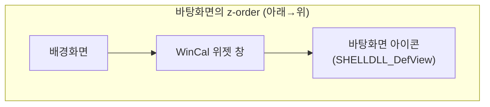

title: "WinCal: 바탕화면에 달력을 박아넣는 Windows 위젯을 만들었다"
slug: win-cal-desktop-calendar
category: 개인 프로젝트
summary: 바탕화면 위·아이콘 아래에 달력을 끼워 넣는 Windows 데스크톱 위젯 개발기. WorkerW와 XAML island 두 데스크톱 구조, 클릭 통과 창에서 클릭을 받는 저수준 훅, 사라진 더블클릭 메시지, 그리고 코드 서명을 포기한 이유까지.
tags: windows,wpf,dotnet,csharp,win32,desktop-widget,google-calendar,personal-project
toc: true

---


달력을 확인하려고 매번 창을 여는 게 귀찮았다. 작업표시줄 시계를 눌러도 작은 팝업이 뜨고, 브라우저에서 Google 캘린더를 열면 한참 뒤에 묻힌다. 바탕화면에 달력이 그냥 붙어 있으면 되는데 — 예전에 DesktopCal이라는 유틸리티가 딱 그걸 했는데, Google 캘린더 동기화가 내 방식대로 되지 않았다.

그래서 직접 만들었다. **WinCal** — 바탕화면에 월간 달력을 임베드하는 Windows 데스크톱 위젯이다. WPF(`net8.0-windows`)로 만들었고, Google 캘린더를 ICS로 읽어와 배경화면 위·바탕화면 아이콘 아래에 그린다. MIT 라이선스로 [GitHub에 공개](https://github.com/jaymunsh/win-cal)했고, .NET 설치 없이 돌아가는 단일 exe가 [Releases](https://github.com/jaymunsh/win-cal/releases)에 있다.

## 달력은 창이 아니라 바탕화면의 일부다


하는 일은 단순하다. 월간 달력을 바탕화면에 깔고, Google 캘린더 ICS 피드를 여러 개 구독해 일정을 칩으로 올린다. 종일 일정은 Google 캘린더처럼 캘린더 색 배경 칩, 시간 일정은 색 점 + 시각으로 구분한다. 우측에는 자유 메모 패널, 바탕화면 위에는 색이 도는 스티커 메모를 붙일 수 있다. 처음엔 셀 더블클릭으로 로컬 메모를 다는 기능이었는데, Google 캘린더에 반영되지 않는 메모는 쓸수록 어긋나서 스티커로 바꿨다. 테마 4종(다크/라이트/미니멀/웜), 한영 UI, 작업표시줄과 Alt+Tab에는 안 뜨고 트레이 아이콘으로만 제어한다. 위치는 위치 조정 모드에서 잠금을 풀고 드래그·우하단 그립으로 잡은 뒤 다시 잠그면 저장된다. 폰트는 Pretendard를 SIL OFL 라이선스로 번들했다.


여기까지는 평범한 위젯이다. 재미는 "바탕화면의 일부처럼 보이게" 만드는 데서 시작한다.

## 창을 배경화면과 아이콘 사이에 끼워 넣는다

목표 z-order가 까다롭다: 배경화면 **위**, 바탕화면 아이콘 **아래**. 창으로서는 상식 밖의 위치다.



Windows 11에는 바탕화면 구현이 두 종류가 공존한다. 클래식 `Progman → WorkerW → SHELLDLL_DefView` 구조와, 신형 XAML Islands 기반 데스크톱이다. `DesktopAttacher`가 두 경로를 다 지원한다 — 클래식에서는 `SHELLDLL_DefView`를 WorkerW로 보내고 우리 창을 그 아래 z-order에 둔다. 신형에서는 XAML island 호스트 창을 찾아 그 뒤에 배치한다.

여기에 5초 주기 워치독이 붙는다. 탐색기가 재시작되면 Progman 핸들이 바뀌므로 매번 다시 찾고, 위치나 z-order가 어긋났을 때만 재부착한다. 처음엔 무조건 `MoveWindow`를 했는데 "정상이면 건너뛰기"로 바꾼 게 최적화 포인트였다. Win+D로 바탕화면 보기를 해도 창이 최소화됐다가 5초 안에 자기 자리로 돌아온다.

## 클릭은 통과시키면서 클릭도 받아야 한다

잠금 상태의 위젯은 **클릭 통과**다 — 레이어드 창 + `WS_EX_TRANSPARENT`라 마우스가 그대로 아래 바탕화면에 닿는다. 그런데 그 상태로 헤더 버튼과 날짜 셀은 눌러야 한다. WPF 입력이 안 오는 창에서 클릭을 받는 셈이다.

방법은 `WH_MOUSE_LL` 저수준 마우스 훅이다. 전역 마우스 이벤트를 받아서, 미리 계산해 둔 스크린 좌표 hit-region 목록(헤더 버튼, 셀, 스티커, 메모 패널)과 대조한다. 걸리면 우리가 삼키고, 아니면 흘려보낸다.

셀 더블클릭에는 한 겹 더 있다. 그 좌표에 **바탕화면 아이콘이 있는지** UI Automation으로 검사한다 — 아이콘 위면 이벤트를 그대로 통과시켜 아이콘이 정상적으로 열리고, 빈 공간이면 스티커 생성으로 처리한다. 위젯이 아이콘을 덮어썼는데도 아이콘이 눌리는 이유다.

성능 주의점이 하나 있었다. 저수준 훅 콜백이 느리면 Windows가 훅을 강제로 떼어 버린다. UIA 아이콘 조회는 느린 편이라, 처음 코드처럼 매 이벤트마다 돌리면 훅이 죽는다. hit-region 대조를 먼저 하고, 실제로 영역에 걸렸을 때만 UIA를 실행하도록 순서를 바꿔 해결했다.

## 더블클릭 메시지가 아예 생성되지 않았다

`WM_LBUTTONDBLCLK`을 훅에서 잡으려 했는데 로그에 아예 안 찍혔다. 원인 추정은 이렇다 — 신형 XAML island 데스크톱의 창 클래스에 `CS_DBLCLKS` 스타일이 없어서, 시스템이 더블클릭 메시지 자체를 만들지 않는다.

해결은 메시지를 기다리는 대신 직접 만드는 것이었다. 마우스 업 이벤트 두 번을 감지해서, `GetDoubleClickTime` 안에 같은 셀에서 up이 두 번 오면 더블클릭으로 판정한다. OS의 창 스타일에 의존하지 않으니 클래식·신형 데스크톱 구분 없이 동작한다.

비슷한 함정이 하나 더 — `Window.Opacity`가 클릭 통과 레이어드 창에서는 무시됐다. 전체 불투명도 슬라이더가 안 먹는 이유였다. 투명 창에서는 창 속성이 아니라 콘텐츠에 opacity를 걸어야 해서, 루트 비주얼(`Root.Opacity`)에 적용해 해결했다.

기능끼리 부딪힌 사례도 있다. 우측 메모 패널을 더블클릭하면 그 패널만 인라인 편집 모드로 바뀌는데, 창이 잠깐 입력 가능 상태가 되자 워치독이 "z-order가 어긋났다"고 판단해 편집 도중 창을 아이콘 아래로 내리려 했다. `IsEditingInline` 가드로 편집 중엔 재부착을 막아 해결 — 서로를 모르게 만든 기능 두 개가 만나면 이런 데서 터진다.

## 피드를 받는 것과 일정을 그리는 것은 다른 문제다

ICS URL을 다운받는 건 `HttpClient` 한 줄인데, 그 내용을 셀에 올리려면 `CalendarService`가 할 일이 더 있다. 설정된 모든 URL을 병렬로 받아 Ical.Net으로 파싱하고, 반복 일정(RRULE)을 표시 월 범위만큼 전개하고, 타임존을 변환하고, 멀티데이 일정은 날짜별 엔트리로 쪼갠다.

흥미로운 디테일 몇 개:

- **캘린더 색의 우선순위** — ICS의 `COLOR`/`X-WR-CALCOLOR` 속성을 우선 쓰고, 없으면 URL 순서대로 팔레트(파랑/주황/초록/분홍…)를 배정한다. 그런데 Google의 ICS export에는 이 속성이 없는 경우가 많아서, 이 프로젝트에서는 fallback이 사실상 주 경로다.
- **전개 결과 캐시** — 매 렌더마다 반복 일정을 다시 전개하면 느려진다. `(월 범위, 데이터 버전)`을 키로 전개 결과를 캐시하고, 칩 브러시도 색상 hex별로 재사용한다.
- **재진입 가드** — 자동 새로고침 타이머가 진행 중인 fetch 위에 겹쳐 돌지 않게 막는다. 동기화 상태("동기화 중…" → "HH:mm 동기화됨" / 실패 시 사유 + 트레이 알림)는 위젯에 항상 표시한다.

멀티데이 일정이 날짜별 칩으로만 그려지는 건 이 구조의 한계이기도 하다 — 연속 바(span) 렌더링은 로드맵에 있다.

## 배포의 절반은 SmartScreen과의 협상이었다

단일 exe로 만드는 건 한 줄이다.

```
dotnet publish WinCal -c Release -r win-x64 --self-contained `
  -p:PublishSingleFile=true -p:EnableCompressionInSingleFile=true
```

self-contained라 .NET 런타임이 없는 PC에서도 돌고, 압축 옵션 하나로 160MB가 **약 72MB**로 줄었다.

문제는 SmartScreen이다. 미서명 exe는 "Windows에서 PC를 보호했습니다" 경고를 띄운다. 서명을 검토했는데 결론이 "안 한다"였다:

- **Azure Artifact Signing**(구 Trusted Signing, ~$9.99/월) — Microsoft 추천 경로인데 **한국 개인은 신청 자체가 불가**하다. 개인은 미국/캐나다만 받는다.
- **상용 OV 인증서** (~$80-300/년) — 사도 평판이 쌓일 때까지 경고는 뜬다.
- **EV 인증서** (~$300-500/년 + USB 토큰) — 즉시 평판이지만 개인 OSS에는 과하다.
- **SignPath Foundation** — 무료 OSS 서명으로 사실상 유일한 대안. Flameshot, DB Browser for SQLite 같은 프로젝트가 쓴다. 조건은 충족하지만 CI 빌드 연동과 심사가 필요해서 이번엔 패스.

핵심 사실 하나: EV가 아니면 서명을 해도 초기엔 경고가 뜬다. 해시별 다운로드 평판이 쌓여야 사라진다. 그래서 v0.1.0은 미서명 + **SHA256 체크섬 공개** + 공개 소스(직접 빌드해 대조 가능)로 배포했다. 나중에 GitHub Actions CI 빌드와 `attest-build-provenance`를 붙이면, 서명 없이 "이 바이너리는 이 커밋에서 CI가 빌드했다"는 증명까지 가능하다.

## 남은 한계는 그대로 적는다

- **클린 Windows에서 못 돌려봤다** — 개발 PC에는 SDK가 있어서 "아무것도 없는 머신" 테스트가 안 됐다. 단일 exe라 괜찮을 것으로 판단하지만 실측은 아니다.
- SmartScreen 경고 문구도 실제 사용자 환경에서 확인이 필요하다.
- 단위 테스트가 없다 — 빌드 0 경고와 수동 동작 확인이 전부다.
- Google이 ICS 피드를 캐시해서, 캘린더 변경이 위젯에 반영되기까지 몇 분~몇 시간 걸릴 수 있다. "새로고침해도 안 바뀐다"는 대부분 이거다.
- 다른 DPI 배율(125%, 150%), 듀얼 모니터에서의 위치 조정, 장기 실행 안정성은 아직.

로드맵에는 마우스 휠 월 이동, winget 매니페스트 제출, CI 릴리스 파이프라인이 잡혀 있다. 지금 형태로도 매일 쓰는 물건은 됐다 — 달력을 "열지" 않고 바탕화면이 곧 달력이라는 게 생각보다 편하다.
