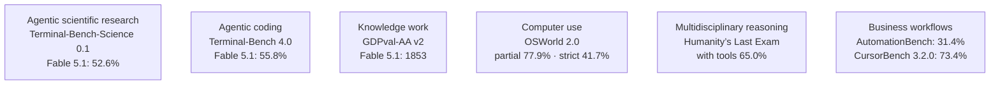
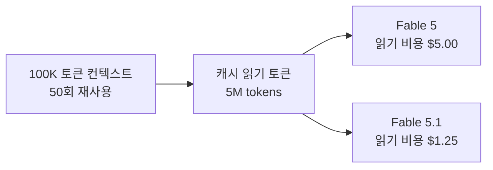
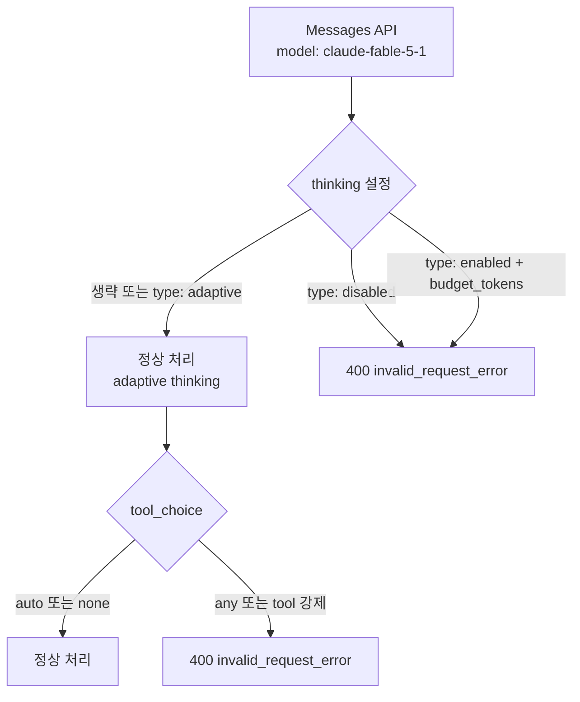
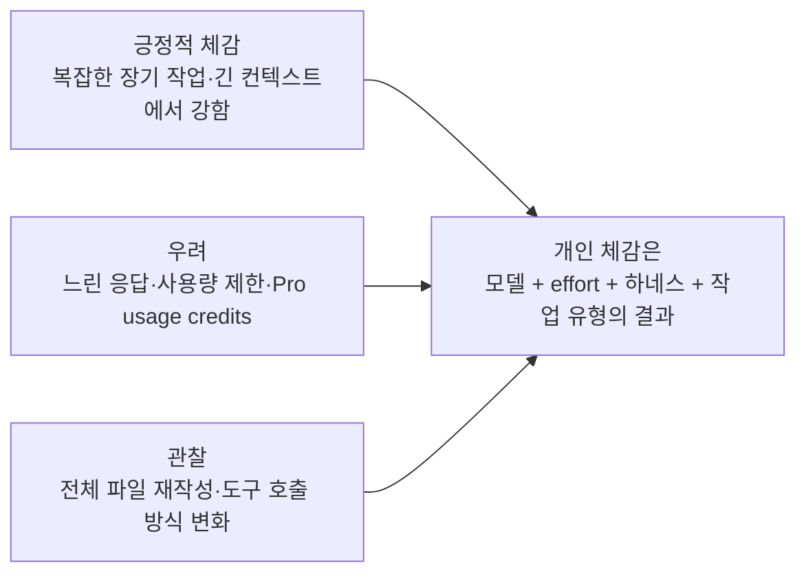

> **이 글의 대상**: 2026년 9월 1일 공개된 Anthropic의 차세대 플래그십 모델 `Claude Fable 5.1`을 검토하면서, 공식 성능 수치와 API 마이그레이션 변경점, 비용 구조, 실제 사용 시 주의할 점을 확인하려는 엔지니어.

> **팩트체크 기준일**: 2026년 9월 2일. Anthropic 공식 출시 글·모델 문서·마이그레이션 가이드·가격표를 1차 기준으로 삼았고, Reddit은 벤치마크가 아닌 실사용 체감의 참고 자료로만 다뤘다.

## 먼저, 초안에서 바로잡은 내용

기존 초안에는 `SWE-bench Verified 95.0%`, `SWE-bench Pro 81.2%`라는 수치와 일부 비교 점수가 들어 있었다. 하지만 Anthropic의 Fable 5.1 공식 출시 글과 모델 문서에는 이 두 수치가 공개되어 있지 않았다. 공식 비교표가 제시한 지표는 Terminal-Bench-Science 0.1, Terminal-Bench 4.0, GDPval-AA v2, OSWorld 2.0, Humanity’s Last Exam, AutomationBench, CursorBench 3.2.0이다.

따라서 이 글에서는 확인되지 않은 SWE-bench 수치를 공인 성능처럼 사용하지 않는다. 공식 페이지에 실제로 실린 수치와, Anthropic이 직접 측정 조건을 설명한 범위만 남겼다. “공식 문서에 없다”는 것이 해당 모델이 그 점수를 기록할 수 없다는 뜻은 아니지만, 출처 없는 숫자를 리뷰의 근거로 삼을 수는 없기 때문이다.

## 1. 2026년 9월 1일, Claude Fable 5.1이 공개되다

Anthropic은 2026년 9월 1일 `Claude Fable 5.1`과 `Claude Mythos 5.1`을 발표했다. 두 모델은 같은 기반 모델이며, 차이는 주로 안전장치와 접근 프로그램에 있다. Fable 5.1은 일반 공개 모델이고, Mythos 5.1은 사이버보안 방어와 생명과학 연구를 위한 신뢰 접근 프로그램에서만 제공된다.

Anthropic이 Fable 5.1을 내세우는 축은 다음 세 가지다.


모델 문서에 따르면 Fable 5.1은 1M 토큰 컨텍스트와 최대 128K 토큰 출력을 지원하며, 입력 가격은 1M 토큰당 10달러, 출력 가격은 50달러다. Anthropic은 단순히 빠른 모델이라기보다 장시간 이어지는 에이전트 코딩, 다단계 조사, 문서 작업을 위한 모델로 포지셔닝한다.

현재 공개된 모델 ID는 `claude-fable-5-1`이다. API 외에도 Amazon Bedrock, Google Cloud, Microsoft Foundry 등 Anthropic이 명시한 파트너 플랫폼에서 제공된다.

### 팩트체크 요약

| 주장 | 판정 | 확인된 내용 |
|---|---|---|
| Fable 5.1이 2026년 9월 1일 출시됐다 | 확인 | Anthropic 공식 출시 글과 모델 문서에 동일하게 기재 |
| Mythos 5.1이 별도의 더 큰 기반 모델이다 | 수정 필요 | Fable 5.1과 같은 모델이며 안전장치·접근 정책이 다름 |
| SWE-bench Verified 95.0%를 기록했다 | 공식 확인 불가 | 공식 비교표에 해당 지표가 없어 본문 수치에서 제외 |
| 캐시 읽기 가격이 75% 인하됐다 | 확인 | Fable 5 대비 1M 토큰당 1달러에서 0.25달러로 인하 |
| 전체 작업 비용이 60~70% 감소한다 | 오류 | Anthropic의 공식 추정은 일반 작업 약 25%, highly agentic 작업 최대 약 45% |
| `budget_tokens` 기반 수동 extended thinking을 그대로 쓸 수 있다 | 오류 | Fable 5.1에서는 수동 예산 지정이 400 오류를 반환하며 adaptive thinking을 사용 |

## 2. 공식 벤치마크를 기준으로 다시 비교하기

Fable 5.1의 대표적인 공식 수치는 SWE-bench가 아니라 에이전트 코딩과 지식 작업을 겨냥한 지표들이다.



### 2-1. Anthropic 공식 비교표

| 벤치마크 | Claude Fable 5.1 | Claude Fable 5 | Claude Opus 5 | GPT-5.6 Sol |
|---|---:|---:|---:|---:|
| Terminal-Bench-Science 0.1 | **52.6%** | 24.7% | 29.0% | 22.4% |
| Terminal-Bench 4.0 | **55.8%** | 42.0% | 52.3% | 37.3% |
| GDPval-AA v2 | **1853** | 1723 | 1824 | 1711 |
| OSWorld 2.0 — partial | **77.9%** | 72.9% | 75.4% | — |
| OSWorld 2.0 — strict | **41.7%** | 36.1% | 39.6% | — |
| Humanity’s Last Exam — no tools | **60.9%** | 57.8% | 56.6% | — |
| Humanity’s Last Exam — with tools | **65.0%** | 63.8% | 63.6% | — |
| AutomationBench | **31.4%** | 17.1% | 26.9% | 19.6% |
| CursorBench 3.2.0 | **73.4%** | 70.5% | 70.0% | 67.2% |

수치의 의미는 지표마다 다르다. GDPval은 점수 체계가 다른 지식 작업 평가이고, OSWorld는 컴퓨터 사용 성공률, CursorBench는 에이전트 코딩 평가다. 서로 다른 지표의 숫자를 하나의 종합 점수처럼 더하면 안 된다.

또한 이 표는 Anthropic이 공개한 자체 평가 결과다. Fable 5.1은 production safeguards를 켠 상태에서 평가됐다. 안전장치가 개입한 작업은 일부 지표에서 0점 처리되거나 다른 모델로 라우팅될 수 있으므로, 점수 옆의 조건을 함께 봐야 한다.

Terminal-Bench-Science 0.1의 모델별 표준오차는 ±3.5~4.5포인트다. OSWorld 2.0은 2026년 8월 공개된 새로운 task release를 사용했기 때문에 이전에 공개된 OSWorld 결과와 직접 비교할 수 없으며, Anthropic도 해당 표에서는 경쟁 모델 수치를 제시하지 않았다.

### 2-2. 이 표에서 읽을 수 있는 것과 읽을 수 없는 것

Fable 5.1은 공개된 비교표에서 Fable 5보다 모든 주요 영역에서 높은 수치를 보인다. 특히 Terminal-Bench-Science와 AutomationBench처럼 장기 실행·도구 사용에 가까운 지표에서 상승 폭이 크다. 다만 이 결과만으로 “모든 코딩 작업에서 가장 좋다”고 결론 내리기는 어렵다.

실제 도입 전에는 다음을 따로 측정해야 한다.

- 내가 자주 쓰는 저장소에서 첫 시도 성공률이 올라가는가.
- 모델이 더 오래 생각하면서 작업 시간이 오히려 늘어나지 않는가.
- 도구 호출 횟수와 출력 토큰이 줄어드는가.
- 테스트 통과까지의 총 비용이 낮아지는가.
- 프롬프트 캐시와 effort 설정을 바꿔도 품질이 유지되는가.

벤치마크는 “모델의 상한선”을 보여주지만, 실제 개발 생산성은 모델·프롬프트·도구·하네스·리포지터리 구조의 곱으로 결정된다.

## 3. 프롬프트 캐싱 75% 인하가 실제로 의미하는 것

Fable 5.1의 가격 변화에서 정확히 인하된 것은 **캐시 읽기**(cache read)다. 입력과 출력의 기본 가격이 모두 75% 낮아진 것은 아니다.



위 계산은 캐시 읽기 부분만 비교한 예시다. 100K 토큰을 50회 읽으면 5M 캐시 읽기 토큰이 되고, 기존 1달러/MTok에서는 5달러, Fable 5.1의 0.25달러/MTok에서는 1.25달러가 된다. 실제 요청의 총액에는 캐시 write, 캐시되지 않은 input, output, 도구 호출에 포함된 토큰이 추가된다.

### 3-1. Fable 5.1 가격표

| 항목 | 가격 |
|---|---:|
| 기본 input | $10 / MTok |
| 기본 output | $50 / MTok |
| 5분 cache write | $12.50 / MTok |
| 1시간 cache write | $20 / MTok |
| cache read | **$0.25 / MTok** |
| Batch API input/output | 50% 할인 |

Anthropic은 Fable 5 대비 비용이 일반적인 작업에서 약 25%, context-heavy·tool-heavy인 highly agentic 작업에서 최대 약 45% 낮아질 수 있다고 설명한다. 이것은 모든 사용자의 고정 할인율이 아니라 Anthropic이 2026년 8월 실제 사용량을 기준으로 제시한 추정치다.

따라서 “캐시 읽기 75% 인하 = 전체 요청 75% 인하”라고 읽으면 안 된다. 캐시 재사용 비율이 높을수록 유리하고, 매번 새로운 대화·새로운 파일·긴 출력만 생성하는 흐름에서는 체감 폭이 달라진다.

### 3-2. Claude Pro에서의 접근과 비용은 별도로 봐야 한다

Fable 5.1은 Pro·Max·Team·Enterprise 같은 유료 플랜에서 접근할 수 있지만, 모든 플랜의 기본 사용량에 같은 방식으로 포함되는 것은 아니다.

- Max와 일부 premium seat에서는 Fable 모델이 플랜 사용량의 일부로 포함된다.
- Pro와 Team의 standard seat에서는 Fable 5.1이 일반 사용량에 포함되지 않고 usage credits 방식으로 동작한다.
- Claude API에서는 구독 사용량이 아니라 토큰 단위 API 가격이 적용된다.

따라서 “Pro에서 모델이 완전히 제외됐다”는 표현은 정확하지 않다. 더 정확한 표현은 **Pro에서 접근은 가능하지만 기본 사용량에 포함되지 않고 별도 usage credits가 필요할 수 있다**는 것이다.

## 4. API 마이그레이션에서 실제로 바뀌는 것

Fable 5.1은 기존 모델 ID만 바꾸면 끝나는 부분도 있지만, thinking·tool choice·대화 히스토리를 직접 조립하는 하네스라면 확인할 부분이 있다.



### 4-1. 수동 thinking 예산은 지원되지 않는다

Fable 5.1과 Mythos 5.1에서는 adaptive thinking이 항상 켜져 있다. 다음 설정은 기존 코드에 남아 있으면 400 오류가 된다.

```python
thinking={"type": "enabled", "budget_tokens": 4096}
thinking={"type": "disabled"}
```

대신 `thinking` 필드를 생략하거나 `{"type": "adaptive"}`를 사용한다. 추론 깊이는 `effort`로 조절한다. 공식 문서에 나온 effort 단계는 `low`, `medium`, `high`, `xhigh`, `max`다.

모델 문서의 기본 effort는 `high`이며, Anthropic은 Claude Code에서도 `high`, Claude.ai와 Cowork에서는 `medium`을 기본값으로 설명한다. 제품별 기본값이 다를 수 있으므로 API 호출과 Claude Code의 체감을 그대로 동일시하면 안 된다.

단순 수정은 `low`나 `medium`, 복잡한 다중 파일 작업은 `high` 이상으로 시작할 수 있지만, effort별 품질·지연시간·토큰 사용량은 자신의 평가셋으로 다시 측정해야 한다. 특히 low effort에서는 검색·retrieval 도구를 덜 호출하고 기억에 의존하는 경향이 공식 프롬프팅 문서에 설명되어 있다.

### 4-2. 강제 tool choice도 바뀐다

`tool_choice: {"type": "any"}` 또는 특정 도구를 지정하는 `{"type": "tool", "name": "..."}`는 400 오류를 반환한다. `auto` 또는 `none`을 사용하고, 필요한 경우 사용자 메시지나 turn-scoped system message에서 “이 조건에서는 해당 도구를 사용하라”고 명시하는 방식으로 바꾼다.

스키마에 맞는 JSON이 목적이었다면 강제 도구 호출을 우회하기보다 `strict: true` 도구나 structured outputs를 검토하는 편이 낫다.

### 4-3. append-only 히스토리는 “항상 절대 수정 금지”보다 정확하게 이해해야 한다

Fable 5.1은 앞선 thinking block이 생성된 뒤 `system` prompt, `tools`, 이전 메시지를 수정하면 다음 요청에서 thinking block이 현재 대화와 맞지 않는지 확인한다. 조건이 적용되는 계정에서 불일치가 발생하면 400 오류가 나거나, beta 설정에 따라 해당 블록이 삭제된다.

따라서 직접 Messages API 하네스를 만들었다면 다음을 확인해야 한다.

- 이전 메시지를 중간에서 삭제·재정렬하지 않는가.
- 매 요청마다 system prompt나 tools 배열을 다시 만들면서 날짜·상태 문구를 바꾸지 않는가.
- 이전 thinking block을 원본 그대로 전달하는가.
- 필요할 때 server-side compaction이나 context editing을 사용하는가.

안전한 기본 패턴은 append-only다. 다만 Claude Code와 Claude.ai 같은 공식 제품은 이 처리를 내부에서 관리한다. 또한 Claude Mythos 5.1은 Fable 5.1과 달리 이 conversation check를 실행하지 않는다고 migration guide에 명시되어 있다. 그러므로 모든 Claude 모델에 동일한 “append-only 강제 규칙”을 일반화하기보다, 모델별 하네스 동작을 확인해야 한다.

## 5. Claude Mythos 5.1과 Enterprise Frontier Safeguards

Mythos 5.1은 Fable 5.1보다 더 큰 모델이거나 완전히 다른 세대의 모델이 아니다. Anthropic은 두 모델이 같은 모델이고, 안전장치 수준과 접근 정책이 다르다고 설명한다.

| 구분 | Claude Fable 5.1 | Claude Mythos 5.1 |
|---|---|---|
| 기반 모델 | Fable 5.1 | Fable 5.1과 동일 |
| 접근 | API·파트너 플랫폼·유료 Claude 제품 | Project Glasswing 신뢰 접근 프로그램 |
| 안전장치 | 일반적인 사이버·생명과학 safeguard | 승인된 방어·전문 연구 목적에 맞춘 완화된 safeguard |
| 주요 대상 | 일반 개발자·기업 | 검증된 사이버보안 방어자·생명과학 전문가 |
| 가격 | Fable 5.1과 동일 | Fable 5.1과 동일 |

Project Glasswing은 Anthropic이 Mythos 계열의 사이버보안 능력을 방어적 목적으로 평가하기 위해 만든 프로그램이다. Mythos 5.1은 현재 일반 공개 모델로 내려받거나 자유롭게 호출하는 모델이 아니다.

EFS(Enterprise Frontier Safeguards)는 별도의 기업용 데이터·안전장치 체계다. 고객이 통제하는 클라우드 인프라에 데이터를 저장하고, 고객이 기본적으로 human review를 담당하는 방식으로 zero data retention에 가까운 프라이버시를 제공하는 것을 목표로 한다. 다만 2026년 9월 2일 기준 단계적으로 제공되는 중이며, “모든 Fable 사용자가 자신의 VPC에서 바로 실행할 수 있다”는 의미는 아니다.

Fable 5.1과 Mythos 5.1은 기본적으로 30일 데이터 보존 조건이 적용될 수 있으며, zero data retention 계약 조직은 Anthropic의 명시적 승인을 확인해야 한다. 보안·컴플라이언스 검토에서는 모델 성능보다 이 접근 조건을 먼저 확인하는 편이 안전하다.

## 6. 커뮤니티 반응은 성능 증거가 아니라 사용성 신호로 읽기

출시 직후 Reddit에는 공식 출시 글을 공유한 스레드와 별도의 release discussion hub가 생겼다. 여기서 확인되는 반응은 통제된 평가 결과가 아니라 사용자별 환경·플랜·effort·하네스가 섞인 관찰이다.



### 6-1. 긍정적인 신호

일부 사용자는 긴 컨텍스트를 가진 복잡한 코딩·문서 작업에서 Fable 5.1이 더 thorough하고, 작업을 끝까지 이어가는 느낌이 강하다고 보고했다. Anthropic의 공식 고객 사례에서도 다중 파일 리팩터링, 장시간 무인 실행, 문서·슬라이드 작업을 강점으로 소개한다.

다만 공식 고객 사례는 독립적인 재현 벤치마크가 아니라 제품 소개에 포함된 고객 평가다. “실전 사례가 있다”는 근거로는 유용하지만, 일반 사용자에게 동일한 결과를 보장하는 점수로 읽으면 안 된다.

### 6-2. 부정적인 신호와 사용량 논쟁

Reddit release discussion hub에서는 Fable 5.1이 더 느리게 느껴진다는 반응, 컨텍스트와 세션 사용량이 빨리 줄어든다는 반응, Pro 사용량 크레딧에 대한 불만이 동시에 보인다. 반대로 작업 품질과 token efficiency가 좋아졌다는 사용자도 있다.

이처럼 반응이 갈리는 이유는 자연스럽다. 같은 모델이라도 max와 medium effort는 추론량과 지연시간이 다르고, Claude Code의 sub-agent 수·도구 호출 수·프롬프트 길이·세션 유지 방식에 따라 사용량이 크게 달라진다. Reddit 글은 이런 변수를 통제하지 않으므로 “커뮤니티가 Fable 5.1을 좋다고 결론 내렸다”는 식으로 일반화하지 않는 것이 맞다.

## 7. 실전 프롬프트와 비용 최적화

### 7-1. effort를 먼저 sweep한다

Fable 5.1의 공식 프롬프팅 가이드는 기본 `high`에서 시작한 뒤 `low`, `medium`, `xhigh`, `max`를 자신의 평가셋으로 비교하라고 권한다.

- 단순 함수 수정·테스트 작성: `low` 또는 `medium`
- 여러 파일을 건드리는 기능 구현: `medium` 또는 `high`
- 원인 분석이 어려운 장애·대규모 마이그레이션: `high` 이상
- 장문의 산출물: `xhigh`·`max` 사용 시 `max_tokens` 여유 확인

low effort는 비용과 지연시간에 유리할 수 있지만, 최신 정보를 반드시 검색해야 하는 작업에서는 검색 도구를 덜 호출할 수 있다. 따라서 “항상 low가 최적”이 아니라, 정확도·도구 호출·총비용을 함께 보는 실험이 필요하다.

### 7-2. 독립적인 도구 호출을 한 턴에 묶도록 지시한다

Anthropic은 Fable 5.1이 긴 agent loop에서 서로 독립적인 다음 작업을 명확히 암시하지 않으면, 이전 모델보다 도구 호출을 한 번에 덜 묶을 수 있다고 설명한다. 이 경우 같은 일을 여러 턴에 나눠 호출하면서 토큰·왕복·시간이 늘어난다.

예를 들어 파일 세 개를 독립적으로 읽어야 한다면 다음과 같이 명시할 수 있다.

> 서로 의존하지 않는 파일 조회와 검사는 가능한 경우 한 턴에서 병렬로 호출하라. 한 결과가 다른 결과의 입력일 때만 순차 실행하라.

이 지시는 모델의 품질을 보장하는 마법의 문장이 아니라, agent loop의 불필요한 왕복을 줄이기 위한 하네스 힌트다. 실제 도구가 병렬 호출을 안전하게 처리할 수 있는지도 함께 확인해야 한다.

### 7-3. 작은 수정에는 전체 파일 재작성을 막는다

Fable 5.1은 작은 텍스트 파일 수정에서도 전체 파일을 다시 쓰는 경향이 있을 수 있다고 공식 프롬프팅 가이드에 적혀 있다. 결과가 같아도 output token과 처리 시간이 늘어난다.

다음과 같은 지시를 시스템 프롬프트나 첫 사용자 메시지에 둘 수 있다.

> 결과가 달라지지 않는다면 전체 파일을 다시 출력하지 말고, 필요한 부분만 최소 변경으로 수정하라. 변경이 필요한 경우 표준 Unified Diff 형식을 우선하라.

이 방법은 파일 수정 비용을 줄일 수 있지만, 모델이 반드시 diff를 반환한다는 보장은 아니다. 적용 전후에 실제 output token과 성공률을 비교해야 한다.

### 7-4. 프롬프트 캐시를 보존한다

Fable 5.1에서는 이전 `system` prompt·tools·메시지 prefix를 매번 바꾸는 것보다, 안정적인 prefix를 유지하고 새로운 지시를 뒤에 추가하는 편이 cache hit에 유리하다. 캐시 가능한 prompt의 최소 길이는 512 토큰이다.

- 자주 바뀌는 날짜·상태 문구는 안정적인 system prompt에 섞지 않는다.
- 공통 도구 정의를 요청마다 재생성하지 않는다.
- 대화 앞부분을 임의로 잘라내기보다 server-side compaction/context editing을 검토한다.
- 캐시에는 토큰·인증서·`.env` 같은 민감정보를 넣지 않는다.

캐시가 유지된다고 총비용이 자동으로 75% 내려가는 것은 아니다. write 비용, 비캐시 input, output, 도구 호출 토큰을 함께 기록해야 실제 비용을 알 수 있다.

### 7-5. Fable 5.1은 로컬 실행 모델이 아니다

이 글이 LocalLLM 카테고리에 들어가더라도, Fable 5.1을 로컬에서 실행할 수 있다는 뜻은 아니다. Anthropic 공식 문서가 안내하는 사용 경로는 Claude API와 Bedrock·Google Cloud·Microsoft Foundry 같은 관리형 플랫폼이다.

2026년 9월 2일 기준 Anthropic은 Fable 5.1의 오픈 웨이트, 파라미터 수, 로컬 추론용 양자화 파일을 공개하지 않았다. 따라서 “몇 GB VRAM이면 돌릴 수 있는가”라는 로컬 하드웨어 표를 만들 근거도 없다. 로컬 실행을 원한다면 이 모델의 API를 호출하는 로컬 클라이언트와, 실제 가중치를 내려받아 실행하는 로컬 모델을 구분해야 한다.

## 8. 마치며 — 숫자보다 도입 조건을 확인해야 한다

Claude Fable 5.1을 한 문장으로 정리하면 **장기 실행 에이전트와 복잡한 지식 작업을 겨냥한 관리형 프론티어 모델**이다.

1. 공식 비교표에서는 Terminal-Bench-Science 0.1 52.6%, Terminal-Bench 4.0 55.8%, AutomationBench 31.4%, CursorBench 73.4%를 기록했다.
2. 캐시 읽기 가격은 75% 낮아졌지만, Anthropic이 제시한 전체 비용 절감 폭은 일반 작업 약 25%, highly agentic 작업 최대 약 45%다.
3. adaptive thinking은 항상 켜져 있고, `effort` 단계와 도구 호출·히스토리 보존 방식을 다시 설계해야 한다.
4. Mythos 5.1은 같은 기반 모델의 제한 접근 버전이며, EFS는 별도 기업용 안전·데이터 처리 체계다.
5. 오픈 웨이트가 공개된 로컬 모델이 아니므로, 로컬 GPU 사양보다 API 비용·데이터 보존·하네스 설계가 먼저 검토 대상이다.

결국 Fable 5.1 도입 여부는 “벤치마크 1등인가?”보다 “내 작업에서 더 적은 재시도와 더 짧은 감독 시간으로 완료되는가?”로 판단해야 한다. 먼저 작은 실제 저장소와 고정된 평가셋에서 effort별 성공률·토큰·지연시간·도구 호출 횟수를 기록한 뒤, 그 결과로 모델을 선택하는 것이 가장 안전하다.

## 참고 자료

- [Introducing Claude Fable 5.1 and Claude Mythos 5.1 — Anthropic 공식 출시 글](https://www.anthropic.com/claude-fable-and-mythos-5-1)
- [Claude Fable 5.1 Overview — 모델 사양·가격·가용성](https://platform.claude.com/docs/en/models/fable-5-1/overview)
- [What’s new in Claude Fable 5.1 — 변경점·벤치마크·동작 차이](https://platform.claude.com/docs/en/models/fable-5-1/whats-new-fable-5-1)
- [Migrating to Claude Fable 5.1 and Claude Mythos 5.1 — API 마이그레이션 가이드](https://platform.claude.com/docs/en/models/fable-5-1/migration-guide)
- [Prompting Claude Fable 5.1 — effort·도구 호출·파일 수정 프롬프트](https://platform.claude.com/docs/en/build-with-claude/prompt-engineering/prompting-claude-fable-5-1)
- [Claude API Pricing — input/output·cache write/read 가격](https://platform.claude.com/docs/en/about-claude/pricing)
- [Claude Fable models on your plan — Pro·Max·Team 플랜별 접근 방식](https://support.claude.com/en/articles/15424964-claude-fable-models-on-your-plan)
- [Project Glasswing — Claude Mythos의 제한 접근 프로그램](https://www.anthropic.com/glasswing)
- [Fable 5.1 and Mythos 5.1 Release Discussion Hub — Reddit 실사용 논의](https://www.reddit.com/r/ClaudeAI/comments/1w4qgue/fable_51_and_mythos_51_release_discussion_hub/)
- [Introducing Claude Fable 5.1 and Claude Mythos 5.1 — Reddit 출시 스레드](https://www.reddit.com/r/ClaudeAI/comments/1w4juuz/introducing_claude_fable_51_and_claude_mythos_51/)
